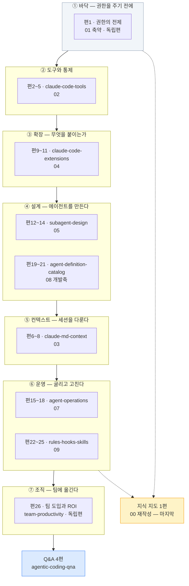

# `agentic-coding` 카테고리 분할 설계

**작성일**: 2026-08-08
**개정**: 2026-08-08 (독립 검증 2기 반려 지적 반영 — 산술 15건 · 논리 14건)
**상태**: 설계 완료 — 실행 대기
**근거**: [요구사항 §13·§14·§15](../specs/2026-08-07-tech-blog-requirements.md), 조사 6기 + 검증 2기 실측
**직전 선례**: [`ai-agent` 분할 설계](2026-08-08-ai-agent-category-split-design.md)

---

## 0. 검증 이력 — 초안이 왜 반려됐는가

초안은 독립 검증 2기에서 **양쪽 모두 반려**됐다. 조사 결과를 표로 옮기는 과정에서 **열이 지워지고 모집단이 바뀐** 것이 원인이다.

| 축 | 반려 사유 (대표) | 개정 |
| --- | --- | --- |
| 산술 | **도식 총계 85가 두 표에서 서로 다른 오류로 상쇄**돼 교차 대조를 통과했다. 참값은 어느 쪽도 아니었다 | §4-3 |
| 산술 | §4-0이 "16.5KB는 틀렸다"고 정정해 놓고 §4-1 평균이 16.4KB였다. **정정한 진단을 계획이 따르지 않았다** | §4-0·§4-1 |
| 산술 | 조사자들이 계산에 포함한 **`§0` 용어 배분 열을 표로 옮기며 삭제**해 4편이 하한 미달 | §4-1 |
| 논리 | **`series`·`seriesOrder`가 설계서 전문에 0회.** 직전 설계서에는 있던 열 | §4-1 |
| 논리 | **slug 미정.** 조사자 F의 충돌 목록 7군데와 대조 흔적 없음 | §4-1 |
| 논리 | **`§0` 용어표 6편분 + 「인용 시 주의」 5편분 미배정** — 약 17KB, 출처 대장 3건 | §4-4·§6-5 |
| 논리 | `02 §12-2` 배분이 **원문 내용과 반대**. 조사 보고 내부 모순 중 틀린 쪽을 채택했다 | §4-1 편4·편5 |

> **§15-1은 "중복 판정이 조사 → 설계서 → 브리프를 거치며 아무도 세지 않아 뒤집힌다"고 했다.**
> 이번에 뒤집힌 것은 중복 판정이 아니라 **종합 단계에서 새로 들어간 오류**다. 조사자가 센 것을
> 컨트롤러가 옮기며 열을 지웠다. **표를 옮길 때도 세어야 한다**는 것이 이번의 교훈이다(→ §13).

### 0-1. 2회차 재검증 — 개정판에서 새로 들어간 오류 9건

**1회차 지적 15건 중 12건 완전 해소, 도식 축은 전수 실측으로 완전 정합.** 그러나 개정판이 **다른 방식으로** 틀렸다.

| # | 새 오류 | 성격 |
| --- | --- | --- |
| N1 | `02 §12-2` 배분이 **분할표에서만 반대**로 적혔다 — 주석표·금지선 12는 맞는데 | **자기 정정을 한 곳에만 반영** |
| N2 | 발행 총량을 `원본 B 합 × 1.2`로 계산해 **§4-2 예외 배율 3건을 되돌렸다** | 〃 |
| N3 | §9-1 6행 링크가 「위와 동일」이라 **5행(다른 편)의 slug**를 가리켰다 | 〃 |
| N4~N9 | 팽창률 표 측정 셀 2개가 실측 아님 · 원본 시점 표기 위치 오지목 · 사슬 마지막 항이 잔차 · Q&A 총량 불일치 · 절 열에 원본 B에 없는 재료 2건 · `00` 행 표기 이중 | 국소 |

> **개정의 실패 패턴이 초안과 달랐다.** 초안은 *조사 보고를 옮기며 열을 지웠고*,
> 개정판은 **자기가 새로 정한 규칙을 문서의 다른 곳에 반영하지 않았다.**
> N1·N2·N3이 전부 이 유형이다 — 규칙은 맞게 썼는데 그 규칙을 쓰는 자리가 옛 값을 유지했다.

---

## 1. 요약

원본 **12편 542.7KB** 중 **80KB를 `ai-transformation`으로 이관**하고, 나머지를 발행본 **31편**으로 변환한다.

```
원본 555,706 B (542.7KB)
  − 80,246   이관 — 06 전량 63,181 · 08 §4~§8·§10 17,065   → ai-transformation
  − 50,477   면접 절 8 + 인용 절 8                          → Q&A 수확 + 조건 이관(§6-5)
             (05 §10-2 조직유비 3열 1,244 B는 편14로 복원 — §4-4)
  − 20,602   01 드롭 — §0 전량 · §1~§8(§6-1 제외) · 머리말 332  → 카테고리 부적합(§2-2)
  − 19,999   00 전량 6,828 + 10 전량 13,171                 → 지도 재작성 / 문항 목록
  −  1,688   머리말 4편분 (02·03·07·09)                     → frontmatter로 대체
  −    145   team-prod CRLF 정규화                          → LF 변환분
  ────────
   382,549 B   ↔  §4-1 26행 합 382,562 B   (차 13 B = 절 경계 헤더 반올림)
        발행 예상 468.2KB  ← §4-1 「×배율」 열 26행의 합. 아래 주 참조
        편당 평균 18.0KB
```

> **⚠️ 총량은 `382,549 × 1.2`가 아니다.** §4-2가 명시 승인한 예외 배율 3건(편1 2.39× ·
> 편9 1.40× · 편26 1.25×)이 있으므로 **일괄 1.2를 곱하면 그 승인이 되돌려진다.**
> 발행 총량은 항상 **§4-1 「×배율」 열 26행의 합**으로 낸다.
>
> **「검산 오차 0」이라고 쓰지 않는다.** 사슬 마지막 항이 잔차를 흡수하면 어떤 행 합이 와도
> 0이 되어 검산이 성립하지 않는다. 실제 차 13 B를 그대로 적는다.
>
> `04`·`05`·`08`의 머리말(455·423·451 = 1,329 B)은 사슬에서 빼지 않았다 — **편9·편12·편19의
> 「원본 B」에 포함**돼 있다(§4-1 절 열에 표기).

| 구분 | 편수 | 원본 | 발행 예상 |
| --- | ---: | ---: | ---: |
| 본문 (`01`축약·`02`·`03`·`04`·`05`·`07`·`08`개발축·`09`·`team-prod`) | **26** | 382.1KB | **468.2KB** |
| Q&A 공통편 (면접 절 8개 + `10`) | **4** | (수확) | **~72KB** (목표 18KB × 4 — §7-3) |
| 지식 지도 (`00` 재작성) | **1** | (신규) | ~15KB |
| **합계** | **31** | | **~555KB** |

### 1-1. 조사 방법과 신뢰도

| 항목 | 값 |
| --- | --- |
| 조사 | 6기 병렬, 담당 파일 **전문 통독** |
| 검증 | 2기 병렬(산술·논리), **원본 재측정 + 설계서 대조** |
| KB 측정 | H2 구간 UTF-8 바이트 실측. **코드펜스 상태 추적** 적용 |
| 검산 | 절별 KB 합 = 파일 크기 — **10편 오차 0**, `team-prod` 1편만 145B 차이(CRLF, 원인 규명 완료) |

**조사자 6기 전원이 브리프의 전제를 뒤집었다.**

| 조사자 | 브리프의 전제 | 실측 결과 |
| --- | --- | --- |
| A | 편당 목표 16.5KB (직전 실측이라 명시) | **재현 불가.** 발행본 실측은 20.3KB — 컨트롤러가 예상값을 실측값으로 오기 |
| B | `03`은 교차 중복 위험 최대 | **완전중복 0건.** 핵심어 6종이 발행본 82편에서 0히트 |
| C | `04`·`05`가 발행본과 정면 충돌 | **가장 안전한 축.** 4자 비교표 54셀 중 발행본 실재 0셀 |
| D | `08`은 `06`의 카탈로그다 | **아니다.** 서로 다른 에이전트 세트 — 부서 구성이 다르다 |
| E | (브리프가 지목한 충돌 5건) | 전부 부분중복 이하. 대신 **원본 내부 모순 3건** 발견 |
| F | `ai-agent` 태그 54편 | **35편.** 컨트롤러 grep이 `category:` 필드를 집었다 |

---

## 2. ⚠️ 범위 확정 — 사용자 결정 2건 (2026-08-08)

### 2-1. `06` 전량 + `08 §4~§8·§10` → `ai-transformation`으로 미룬다

**근거는 어휘 실측이다.** `06` 전문에 카테고리 정의어가 한 번도 없다.

| 검색어 | `06` 전문 출현 |
| --- | ---: |
| `Claude Code` · `MCP` · `Skills` · `Hooks` | **각 0** |

카테고리 정의(`categories.ts` L30~34)는 *"Claude Code로 짓는 개발 워크플로 — 컨텍스트 엔지니어링, MCP·Skills·Hooks, 멀티에이전트"*다.

| 성격 | 분량 | 비중 | 목적지 |
| --- | ---: | ---: | --- |
| 비개발 직군 업무 자동화 | 53.1KB | 44.6% | `ai-transformation` |
| 에이전트 설계 원리(직군 중립) | 39.9KB | 33.4% | 분할 |
| 개발 워크플로 | 16.5KB | 13.9% | `agentic-coding` |
| 용어(분산 배치) | 8.8KB | 7.3% | — |
| 머리말 | 0.9KB | 0.8% | — |

> **분모는 `06` + `08` 합산 119,212 B**(면접·인용 절 제외)다. `06` 단독이 아니다.

**이관은 "지금 변환해서 다른 카테고리에 넣는다"가 아니라 "`ai-transformation` 차례로 미룬다"이다.** 카테고리 단위 순차 변환 원칙(§13-8)을 지킨다.

#### ⚠️ 요구사항 §13-1 정정 — 실행 단계 첫 작업

**이관 사실이 요구사항에 기록되지 않으면 다음 카테고리에 전달되지 않는다.** `ai-transformation` 설계가 `06` 전량이 온다는 것을 모른 채 18편으로 시작한다.

`docs/superpowers/specs/2026-08-07-tech-blog-requirements.md` §13-1 표를 이렇게 고친다:

```diff
- | `ai-transformation` | AI 전환 조직 | … | 10 | 18 |
+ | `ai-transformation` | AI 전환 조직 | … | 10 | 18 + `aiagent/06` 전량 · `aiagent/08 §4~§8·§10` (2026-08-08 이관) |
- | `agentic-coding` | 에이전틱 코딩 | … | 20 | 12 |
+ | `agentic-coding` | 에이전틱 코딩 | … | 20 | 12 − `06` 이관 − `08` 일부 = 실질 10.5편 → 발행 31편 |
```

**「합계 134편 + 발행 제외 9편 = 143편 (검산 완료)」 줄은 파일 단위 검산이므로 유지된다** — 이관은 카테고리 간 이동이지 편수 변동이 아니다. 다만 각주로 이관 사실을 단다.

### 2-2. `01`은 §6-1+§9+§10만 살려 1편으로 축약한다

`01` 본문 21.6KB 중 카테고리 정의에 부합하는 것이 §9(2.5KB) 하나뿐이다.

| `01` 절 | 내용 | 처리 |
| --- | --- | --- |
| §1·§2·§3 | 계층 스택, 왜 CLI인가, 터미널·셸·OS | 드롭 |
| §4·§5 | 파일·폴더 명령 12종, Node.js·npm·nvm | 드롭 |
| **§6-1** | **되돌릴 수 있어야 권한을 넓힌다** (1,000B) | **유지** |
| §6 나머지·§7·§8 | Git·SSH 키, Cursor vs VS Code, iTerm2 | 드롭 |
| **§9** | **CLAUDE.md 규약** (2,509B) | **유지** |
| **§10** | **실패 모드 3분류** (2,140B) | **유지** |

**결정적 근거**: `nvm`·`ssh-keygen`·`ed25519`·`npx`·`zsh`·`Node.js`·`VS Code`·`iTerm2`가 발행본 82편에 **각각 0편**이다. 중복이 없다는 뜻이면서, **이 블로그가 이 층위를 다룬 적이 없다**는 뜻이다.

---

## 3. 카테고리 전체 구조



**⑤ 컨텍스트(`03`)가 ③④ 뒤에 오는 이유**: `03` 본문이 `PreToolUse`·`PostToolUse`·`SessionStart` 훅(→`04`), `Agent Teams`(→`05`), `Plan Mode`·`allowManagedPermissionRulesOnly`(→`02`)를 **설명 없이 쓴다**(조사자 B §7-3 실측). 앞에 두면 미정의 개념이 등장한다.

**`00`(지식 지도)을 마지막에 쓰는 이유**: 본문 참조가 **52곳**이고 전부 `01~10`을 가리킨다. 발행 slug 확정 전에는 링크를 걸 수 없다(§15-5).

---

## 4. 분할 설계

### 4-0. 편당 KB 기준

| 출처 | 편당 평균 | 범위 | 팽창률 |
| --- | ---: | --- | ---: |
| ~~초안 브리프~~ | ~~16.5KB~~ | ~~9.7~26.0~~ | ~~0.96~~ |
| **발행본 `ai-agent` 51편 실측** | **20.3KB** | **13.3~29.4** | — |

**팽창률은 1.2를 쓴다.** 실측이 두 카테고리에서 갈리기 때문이다.

**측정 기준은 raw(frontmatter 포함) bytes로 통일한다.** 분모는 추정치다(`~` 표기).

| 카테고리 | 원본 | 면접·인용 제외(추정) | 발행 raw | 팽창률 | (참고) 본문만 |
| --- | ---: | ---: | ---: | ---: | ---: |
| `ai-agent` | 878.4KB | ~778KB | **1,032.9KB** | **1.33** | 1,001.1KB → 1.29 |
| `rag` | 490KB | ~430KB | **475.4KB** | **1.11** | 453.3KB → 1.05 |
| **채택** | | | | **1.20** | |

채택값 1.20은 두 값 사이에 있다. **분모가 추정치이므로 팽창률 자체가 ±0.1의 불확실성을 갖는다** — 아래 예상 KB의 ±15% 오차가 여기서 나온다.

> **13.3~29.4KB는 발행본의 실측 분포이지 합격선이 아니다.** 아래 예상 KB는 ±15% 오차를 갖는다.
> 변환 시 실측이 13.3KB를 밑돌면 **인접 편과 병합**한다(§11 금지선 11).

### 4-1. 분할표 — 26편

**편 번호는 설계서 내부 참조용이다.** 발행 순서도 시리즈 순서도 배치 순서도 아니다(배치는 §9).
**KB 단위는 전 행 십진 KB(÷1000)로 통일**했다 — 조사 보고는 조사자별로 KiB/KB가 섞여 있었다.

| 편 | series / order | slug | 원본 절 | 원본 B | ×1.2 | 도식 | 가제 |
| ---: | --- | --- | --- | ---: | ---: | ---: | --- |
| **1** | (독립편) | `reversibility-before-permission` | `01` §6-1·§9·§10 (+§0-4 발췌·신규 서술 — 배율이 흡수) | 5,649 | **13.5**※ | 0→**2** | 되돌릴 수 있어야 권한을 넓힌다 — CLAUDE.md 규약과 실패 모드 3분류 |
| **2** | `claude-code-tools` 1 | `claude-code-autonomy-tiers` | `02` **§0 전량** §1 §2 §3 | 13,770 | 16.5 | 5 | 자율성이 3세대를 가른다 — 그리고 인증 우선순위가 곧 과금 경로다 |
| **3** | `claude-code-tools` 2 | `builtin-tools-attack-surface` | `02` §4 §5 §6 §7 + §12-1 | 15,425 | 18.5 | 5 | 도구 목록이 곧 공격 표면 — 7개 도구와 4대 지시 패턴 |
| **4** | `claude-code-tools` 3 | `settings-permissions-deny` | `02` §8 §9 + **§12-2의 행5 하나**(아래 주) | 12,026 | 14.4 | 3 | deny가 항상 이긴다 — settings.json과 훅의 2차 방어선 |
| **5** | `claude-code-tools` 4 | `claude-md-enforcement` | `02` §10 §11 + **§12-2의 행1·2·3·4·6** + §12-3 | 11,660 | 14.0 | 4 | enforcement 없는 규칙은 위시리스트 — CLAUDE.md 3계층과 부서별 정책 |
| **6** | `claude-md-context` 1 | `claude-md-scope-layers` | `03` **§0 전량** §1 §2 §3 | 14,247 | 17.1 | 2 | CLAUDE.md는 왜 200줄인가 — 4계층 Scope와 3덩어리 7단계 |
| **7** | `claude-md-context` 2 | `dot-claude-directory` | `03` §4 §5 §6 | 17,803 | 21.4 | 2 | `.claude/` 여덟 구성물과 프롬프트 패턴 7종 |
| **8** | `claude-md-context` 3 | `context-budget-session` | `03` §7 §8 §9 | 15,185 | 18.2 | 4 | 70%에서 세션을 끊는다 — 업무 분해 3패턴과 컨텍스트 예산 |
| **9** | `claude-code-extensions` 1 | `extension-trigger-axis` | `04` 머리말 **§0 전량** §1 §2 §11 (+**§5-3(1) 대조 문단** — 신규, 배율이 흡수) | 9,618 | **13.5**※ | 3 | 확장 메커니즘 4종을 가르는 축 — 누가 트리거하는가 |
| **10** | `claude-code-extensions` 2 | `mcp-selection-practice` | `04` §3 §4 §5 §6 | 15,877 | 19.1 | 3 | MCP 실무 — 무엇을 붙이고 무엇을 거르는가 |
| **11** | `claude-code-extensions` 3 | `commands-skills-hooks-plugins` | `04` §7 §8 §9 §10 | 16,188 | 19.4 | 3 | 수동 버튼·자율 SOP·자동 게이트, 그리고 번들 |
| **12** | `subagent-design` 1 | `subagent-definition-fields` | `05` 머리말 **§0 전량** §1 §2 §3 | 19,434 | 23.3 | 2→**3** | 에이전트 한 명을 정의한다 — 필드 10개와 검증 10항목 |
| **13** | `subagent-design` 2 | `collaboration-patterns-isolation` | `05` §4 §5 | 11,560 | 13.9 | **7** | 셋으로 묶는 법과 셋으로 가르는 법 |
| **14** | `subagent-design` 3 | `agent-team-operations` | `05` §6 §7 §8 §9 + **§10-2 조직유비 1·2·3열**(1,244 B 실측, 면접 절에서 복원) | 22,776 | 27.3 | 7 | 팀을 굴리면 첫날 무엇이 멈추는가 — 그리고 완제품 환경 |
| **15** | `agent-operations` 1 | `automation-scope-criteria` | `07` **§0 전량** §1 §2서두~§2-2 | 14,872 | 17.8 | **2** | 무엇을 자동화할지부터 정한다 — 합격선 5축과 규칙 문서 |
| **16** | `agent-operations` 2 | `agent-jd-triggers` | `07` §2-3 §2-4 §2-5 §3 | 14,500 | 17.4 | 6 | JD 5필드에서 세 트리거까지 — 만들고 하루를 굴린다 |
| **17** | `agent-operations` 3 | `troubleshooting-three-layers` | `07` §4 | 11,786 | 14.1 | 2 | 3계층으로 좁히고 4단으로 분해한다 — 공통 문제 10선 |
| **18** | `agent-operations` 4 | `scaling-routing-collapse` | `07` §5 §6 §7 | 19,200 | 23.0 | 3 | 10에서 100으로 — 라우팅 붕괴 공식과 반복 실패 4가지 |
| **19** | `agent-definition-catalog` 1 | `thirty-agent-catalog` | `08` 머리말 **§0 전량** §1 §2 | 18,931 | 22.7 | 2 | 30개 에이전트 카탈로그 — 도구 권한을 좁히면 생기는 일 |
| **20** | `agent-definition-catalog` 2 | `definition-writing-quality` | `08` §3 §12 | 13,645 | 16.4 | 0→**1** | 에이전트 정의서를 쓰는 법 — 그리고 30종에서 관찰된 품질 편차 |
| **21** | `agent-definition-catalog` 3 | `dev-org-transfer` | `08` §9 §11 | 11,627 | 14.0 | 2 | 개발조직에 옮길 것과 옮기지 않을 것 — 비어 있는 여섯 자리 |
| **22** | `rules-hooks-skills` 1 | `rules-hooks-skills-layers` | `09` **§0 전량 §1-1 §1-2** §2 | 19,118 | 22.9 | 3 | 규범·강제·절차 — Rules·Hooks·Skills 3계층과 차단 규칙 7종 |
| **23** | `rules-hooks-skills` 2 | `prompt-four-elements` | `09` §3 §8 | 10,600 | **12.7**△ | 2 | 지시가 결과를 가른다 — 프롬프트 4요소와 업종별 CLAUDE.md |
| **24** | `rules-hooks-skills` 3 | `empty-folder-to-deploy` | `09` §4 §7 | 12,900 | 15.5 | 2 | 빈 폴더에서 배포까지 — 8단계 빌드와 6단계 전개 |
| **25** | `rules-hooks-skills` 4 | `deploy-checklist-debugging` | `09` §5 §6 §1-3 | 22,988 | **27.6**△ | 1→**2** | 배포 전·중·후 65항목, 그리고 재현 없이 가설 없다 |
| **26** | (독립편) | `team-adoption-roi` | `team-productivity` 전편 | 11,177 | **14.0**※ | 0→**2** | AI 코딩 도구를 팀에 도입한다 — 개인 향상이 조직 ROI로 전환되지 않는 이유 |

**합계 원본 382,562 B · 예상 발행 468.2KB · 도식 82** (편1~26 합. Q&A 0 + 지도 3을 더해 총 85 — §4-3)

> **「×배율」 열 26행의 합이 발행 총량이다**(468.2KB). §1 사슬에 1.2를 일괄로 곱하면
> §4-2 예외 배율 3건이 되돌려져 9.1KB 작게 나온다.
>
> 원본 B 열 합(382,562)과 §1 사슬(382,549)의 차 **13 B**는 절 경계 헤더 처리 차이다.
> 독립 검증에서 26행을 바이트 단위로 대조해 **설명 불가 잔차 51 B(0.013%)**를 확인했다.

> ## ⚠️ 정정 (2026-08-11, B5 실측) — 「series / order」는 필드명이 아니다
>
> 위 표의 2열 표기를 그대로 frontmatter에 쓰면 **빌드가 실패한다.** 실제 필드는 **`series` + `seriesOrder`**다.
>
> | 규칙 | 실측 근거 |
> | --- | --- |
> | 필드명은 **`seriesOrder`** (`order` 아님) | 기발행본 15편 전수 |
> | `series`가 있으면 **`seriesOrder` 필수** | 없으면 빌드 실패 |
> | 선택 필드는 없으면 **키 자체를 생략** | `undefined`로 남기면 Next.js JSON 직렬화 실패 |
> | 필드 순서 | `title` → `description` → `category` → `tags` → `date` → `updated` → `series` → `seriesOrder` → `featured` → `draft` → `source` |
>
> `series`는 **메타데이터일 뿐 라우트를 만들지 않는다** — URL은 `/blog/<category>/<slug>/`로 고정이다.

> ## ✅ 기록 (2026-08-11, B6 실측) — 편19~21 설계값이 전부 맞았다
>
> **5배치 만에 처음으로 설계서 진단 오류 0건이다.**
>
> | 편 | 설계서 원본 B | 컨트롤러 실측 | 설계서 도식 | 실측 |
> | ---: | ---: | ---: | ---: | ---: |
> | 19 | 18,931 | **18,931** ✅ | 2 | **2** ✅ |
> | 20 | 13,645 | **13,645** ✅ | 0→1 | **0** (신규 1) ✅ |
> | 21 | 11,627 | **11,627** ✅ | 2 | **2** ✅ |
>
> `08` 전체 68,003 B(`wc -c` 일치) · H2 15 · 표 30 · mermaid 10 — **전부 일치.**
>
> > **대신 오류가 다른 자리로 옮겨갔다** — B6의 결함은 **컨트롤러 브리프 2건**(§8-3 목록 미첨부 · §1-1 값 미대조)과
> > **조사 에이전트 5건 이상**(표 행 수 4건 · 편21 자기참조 결정 정반대 보고)에서 나왔다.
> >
> > **설계서는 배치가 진행될수록 자기 오류를 소진하지만, 브리프와 조사는 매 배치 새로 만들어지므로 오류가 줄지 않는다.**
> > **「설계서를 실측하라」에서 「전달 과정을 실측하라」로 옮겨가야 한다.**

> ## ⚠️ 정정 (2026-08-12, B7 실측) — 편23을 재조준했다. 원 배정의 37%가 이미 발행돼 있었다
>
> **사용자 승인 완료.** 위 표 **23행의 slug·원본 절·분량이 전부 바뀐다.**
>
> | 항목 | 원안 | **B7 확정** |
> | --- | --- | --- |
> | slug | `prompt-four-elements` | **`industry-claude-md-templates`** |
> | 원본 절 | `09` **§3 §8** | **`09` §8 전량 + §3 고유분만** |
> | 분량 | 10,600 B → 12.7KB(하한 근접 △) | **발행 21,017 B** — △ 해소 |
>
> **이유는 하나다 — `09 §3`의 37%(≈3,850 B)가 기발행본 편7·편8에 이미 발행돼 있다.** 그대로 변환하면 같은 내용이 두 번 발행된다.
>
> | `09 §3`에서 링크로 넘긴 것 | 넘긴 곳 | 기발행본 위치 |
> | --- | --- | --- |
> | **프롬프트 4요소** | **편7** `dot-claude-directory` | **L294~376 (「패턴 1~4」)** |
> | 슬래시 커맨드 · `@`파일 참조 · 파이프 | **편7** | 패턴 5~7 |
> | 70% 룰 | **편8** `context-budget-session` | L210 |
>
> 편23이 실제로 가져간 **고유분**은 다음 여섯 덩어리다.
>
> | 구성 | bytes |
> | --- | ---: |
> | **§8 전량** | **3,977** |
> | §3-4 안티패턴 | 1,008 |
> | §3-3 하드 게이트 | 316 |
> | §3-3 표 1·4·6번 | ~710 |
> | §3-5 응급처치 | 482 |
> | §3-1 대비표 | ~400 |
> | **계** | **~6,893** |
>
> **§3이 아니라 §8이 본체가 됐으므로 가제도 「프롬프트 4요소」가 아니라 「업종별 CLAUDE.md 템플릿」이 중심이 된다.**
>
> **나머지 3편의 §4-1 「원본 B」는 정확했다.**
>
> | 편 | 설계서 | **실측** | 오차 |
> | ---: | ---: | ---: | ---: |
> | 22 | 19,118 | **19,067** | 0.27% |
> | 24 | 12,900 | **12,907** | 0.05% |
> | 25 | 22,988 | **22,983** | 0.02% |
>
> **오차 0.3% 이내 — B6에 이어 2배치 연속으로 분할표 수치 오류가 0건이다.**
>
> > 다만 **편23의 결함은 「값이 틀렸다」가 아니라 「대조 대상이 애초에 없었다」**이므로 이 무결점 기록과 층위가 다르다.
> > 수치는 셀 수 있으니 소진되고, **누락된 대조 축은 세어도 드러나지 않는다** → §5-1 B7 정정.

**※ 표시 3편은 팽창률이 다르다** — §4-2.
**△ 표시 2편은 범위 경계다** — 편23은 하한 근접(변환 시 실측 후 병합 판단), 편25는 상한 근접.
**편14(27.3)도 상한 근접이다.** 셋 다 발행본 실측 상한 29.4KB 이내이나, 변환 시 초과하면 보고한다.

#### ⚠️ `02 §12-2` 배분 — 「앞 3행/뒤 3행」이 아니다

초안이 조사 보고의 내부 모순 중 **틀린 쪽**을 채택했다. 검증자가 원본 `02` L1128~1136을 열어 확정했다.

| 행 | 내용 | 소재 절 | 배치 |
| ---: | --- | --- | --- |
| 1 | CLAUDE.md 800줄 초과 | §10 | **편5** |
| 2 | `@import`로 참조할 것 | §10 | **편5** |
| 3 | 분류 체계 없이 규칙 파일 양산 | §10 | **편5** |
| 4 | Never-Do 파일 수동 작성(훅 자동 생성이 원칙) | §10 | **편5** |
| **5** | **`settings.local.json`을 Git에 커밋** | **§8** | **편4** |
| 6 | enforcement 없이 문서로만 = 위시리스트 | §10 | **편5** |

**편4는 행5 하나만 가져간다. 나머지 다섯 행(1·2·3·4·6)이 편5로 간다.**

> **「1행/5행」 같은 축약 표기를 쓰지 마라** — 「행 번호 1」과 「행이 1개」가 구분되지 않는다.
> 개정 과정에서 실제로 이 표기가 분할표에서 뒤집혔고, 독립 검증이 원문을 열어 잡았다.
> **항상 「행5 하나」·「행1·2·3·4·6」처럼 번호를 나열한다.**

「앞 3행」으로 나가면 편4가 `@import`·`rules/`·Never-Do 훅 자동 생성을 **편5에서야 정의될 개념인 채로** 안티패턴으로 먼저 언급한다.

### 4-2. ⚠️ 의도적 팽창 3건 — 명시 승인 사항

§15-5가 "의도적 도식 감소는 설계서에 미리 명시한다"고 했다. **팽창도 같다. 명시하지 않으면 3단계 검증이 "지어냈다"로 반려한다.**

| 편 | 원본 | 목표 | 배율 | 무엇을 더하는가 |
| ---: | ---: | ---: | ---: | --- |
| **1** | 5,649 B | 13.5KB | **2.39×** | 도입부, `01 §0-4`에서 CLAUDE.md 관련 행만 추린 용어표, 「조직에 옮기면」 표, 신규 도식 2개 |
| **9** | 9,618 B | 13.5KB | **1.40×** | §5-3(1) 정합성 부채 해소 대조 문단 약 2KB (아래 §5-3) |
| **26** | 11,177 B | 14.0KB | **1.25×** | 불릿 → 표·도식 전환. 원본은 표 1개·도식 0개라 카테고리 안에서 혼자 이질적이다 |

나머지 23편은 **1.2× 균일**을 적용한다.

### 4-3. 도식 검산 기준값

**초안의 85는 두 표에서 서로 다른 오류가 상쇄된 값이었다.** 개정판은 배정을 바꿔 드롭을 없앴다.

| 원본 | 원본 도식 | 이관 | 드롭 | 유지 | 신규 | 발행 |
| --- | ---: | ---: | ---: | ---: | ---: | ---: |
| `00` | 1 | — | **1** | 0 | **3** | 3 |
| `01` | 5 | — | **5** | 0 | **2** | 2 |
| `02` | 17 | — | — | 17 | — | 17 |
| `03` | 8 | — | — | 8 | — | 8 |
| `04` | 9 | — | — | 9 | — | 9 |
| `05` | 16 | — | — | 16 | **1** | 17 |
| `06` | 11 | **11** | — | 0 | — | 0 |
| `07` | 13 | — | — | 13 | — | 13 |
| `08` | 10 | **6** | — | 4 | **1** | 5 |
| `09` | 8 | — | — | 8 | **1** | 9 |
| `10`·`team-prod` | 0 | — | — | 0 | **2** | 2 |
| **계** | **98** | **17** | **6** | **75** | **10** | **85** |

**편별 배정** (3단계 검증의 대조 기준. 총합만 비교하면 이동과 유실을 구분할 수 없다 — CR-6.2)

```
편1  0+2신규    편2  5   편3  5   편4  3   편5  4
편6  2          편7  2   편8  4
편9  3          편10 3   편11 3
편12 2+1신규    편13 7   편14 7
편15 2          편16 6   편17 2   편18 3
편19 2          편20 0+1신규      편21 2
편22 3          편23 2   편24 2   편25 1+1신규
편26 0+2신규    Q&A 0×4  지도 3신규
```

**검증자 정정 2건을 반영했다.**

| 정정 | 초안 | 개정 |
| --- | --- | --- |
| 편15 도식 | 3 | **2** — `07 §2서두`·`§2-0`·`§2-2`에 도식이 없다. §1(1) + §2-1(1)뿐 |
| `09 §1-1` 도식 | 편25가 §1-3만 쓰므로 **드롭** | **편22에 `§1-1`·`§1-2`를 배정**해 드롭을 없앴다(§4-4) |

**`00`의 도식 1개는 「드롭 1 + 신규 3」으로 센다.** 노드가 `01 환경설정`처럼 **원본 문서 번호**로 되어 있어 발행본에 그 체계가 없고, **원본 도식의 내용이 실제로 살아남지 않기 때문**이다. 발행 slug 기준으로 새로 그린다.

> 이것을 「재작성 = 유지」로 세면 **드롭 5 · 유지 76 · 신규 9**가 되어 §10의 「유지 75 + 신규 10」과
> 어긋난다. **총계 85는 양쪽 읽기에서 같으므로 총합 검산으로는 잡히지 않는다** —
> 표의 읽기(드롭 1 · 신규 3)로 통일한다.

> ## ⚠️ 정정 (2026-08-12, B7 실측) — 편23 도식은 2가 아니라 **1**이다. 총계 85 → **84**
>
> **§4-1 편23 재조준의 파생 결과다.** `09 §3`의 도식은 **1개뿐**이었고, 그 1개가 하필 드롭 대상이었다.
>
> | `09`의 해당 도식 | 소재 | 원안 | **B7 실측** |
> | --- | --- | --- | --- |
> | 「패턴 5의 컨텍스트 관리 흐름」 | `09 §3` **L356~361** | 편23 | **드롭** — 패턴 5 = 70% 룰이라 편8로 링크했다 |
> | §8-2 공통 골격 | `09 §8` | 편23 | **편23 유지** (편23의 **유일한** 도식) |
>
> 위 검산표의 `09` 행과 총계가 이렇게 바뀐다.
>
> | | 원본 도식 | 이관 | 드롭 | 유지 | 신규 | 발행 |
> | --- | ---: | ---: | ---: | ---: | ---: | ---: |
> | `09` (원안) | 8 | — | — | 8 | 1 | 9 |
> | **`09` (B7 실측)** | 8 | — | **1** | **7** | 1 | **8** |
> | **계** | 98 | 17 | **7** | **74** | 10 | **84** |
>
> 편별 배정 블록의 `편23 2`도 **`편23 1`**로 고친다.
>
> **B7 발행 4편 도식 실측 — mermaid-cli로 8개 전부 실제 렌더링에 성공했다.**
>
> | 편 | 설계값 | **실측** |
> | ---: | ---: | ---: |
> | 22 | 3 | **3** ✅ |
> | 23 | 2 | **1** ❌ |
> | 24 | 2 | **2** ✅ |
> | 25 | 1+1신규 | **2** ✅ |
>
> 표가 말하는 것은 하나다 — **틀린 칸은 절을 덜어낸 편 한 곳뿐이고, 손대지 않은 3편은 전부 맞았다.**
>
> > **절을 드롭하면 그 절의 도식도 함께 드롭된다 — 이 검산표는 그것을 표현하지 못한다.**
> > 표가 「원본 → 이관/드롭/유지/신규」를 **원본 파일 단위**로 세기 때문이다.
> > **절 단위 재조준이 일어나면 총계가 조용히 어긋난다.** 뒤 배치가 절을 덜어낼 때마다 해당 행을 다시 세라.

### 4-4. `§0` 용어표와 부속 절 배정 — 전량

초안이 배정하지 않아 약 17KB가 사라질 뻔한 부분이다. **§14-5 규칙**(*"시리즈 2편 이후는 원본 용어표에서 그 편에서 쓰는 행만 추린 축약표"*)을 그대로 적용한다.

| 원본 | §0 bytes | 전량 배치 | 2편 이후 |
| --- | ---: | --- | --- |
| `01` | 4,353 | §0-4에서 CLAUDE.md 관련 행만 → **편1** | (독립편) |
| `02` | 3,868 | **편2** | 편3·4·5는 축약표 |
| `03` | 2,773 | **편6** | 편7·8은 축약표 |
| `04` | 3,532 | **편9** | 편10·11은 축약표 |
| `05` | 3,675 | **편12** | 편13·14는 축약표 |
| `07` | 3,272 | **편15** | 편16·17·18은 축약표 |
| `08` | 4,098 | **편19** | 편20·21은 축약표 |
| `09` | 3,292 | **편22** | 편23·24·25는 축약표 |
| `00` | — | 지식 지도편 | — |

**축약표는 원본 §0에서 행을 추리는 것이라 신규 서술이 아니다.** `## 용어 정리`는 항상 글 앞에 둔다(Q&A만 뒤).

> ## ⚠️ 정정 (2026-08-11, B5 실측) — 「그 편에서 쓰는 행만」의 판정 기준이 정해져 있지 않다
>
> B5 검증이 「본문 등장 0회인 축약표 행」을 지적했고, 반영 과정에서 **판정 기준에 따라 결과가 크게 갈린다**는 것이 드러났다.
>
> | 기준 | 편17 (7행) | 결론 |
> | --- | --- | --- |
> | **문자열** 일치 | **5행이 본문 0회** — `롤백(Rollback)`은 본문이 「되돌리기」, `RLS`는 「행 단위 보안」, `Circuit Breaker`는 「동일 에러 3회」로 쓴다 | 대부분이 위반 |
> | **개념** 사용 | 7행 전부 쓰인다. 반대로 `Bounded Context`도 편16(「책임 경계」)·편18(「업무 경계를 정의 파일에 명시화」)에서 쓰인다 | 위반 거의 없음 |
>
> **어느 기준을 써도 검증이 든 「3행만 예외」는 나오지 않는다.**
>
> **확정**: 규칙의 취지는 **용어표 비대화 방지**이지 문자열 일치 요구가 아니다. 본문이 한글 표현을 쓰더라도 **독자가 그 영문 용어를 알아야 이해가 쉬운 행은 남긴다.**
> 다만 **제거된 절에서만 쓰이던 용어는 절과 함께 뺀다** — B5에서 `PMF`가 그랬다(§7-2 제거分). 이건 어느 기준으로도 확실하다.
>
> **뒤 배치**: 축약표를 검증할 때 **문자열 `grep` 결과만으로 판정하지 마라.** 본문이 그 개념을 한글로 쓰는지 확인해야 한다.

**부속 절 배정**

| 절 | bytes | 배정 | 근거 |
| --- | ---: | --- | --- |
| `09 §1-1`·`§1-2` | ~1,700 | **편22** | §1-2는 8자산↔H2 **1:1 매핑 지도표**. §2(3계층)의 전제다. 도식 1개도 여기 있다 |
| `09 §1-3` | 1,708 | 편25 | MCP 6종. 체크리스트 편의 하한 확보 |
| `05 §10-1` 면접 Q&A 10문항 | **2,799** `[B3 실측]` | **B8로 이월** | §12-3이 「`05 §10` 면접 문항 ↔ Q&A 4편은 B8에서 확인」이라 지정. **초안에 배정이 없어 B3에서 확정** |
| `05 §10-2` 조직유비 **1·2·3열** | 1,244 | **편14** | 조사자 C·F가 **서로 모른 채 같은 결론**에 도달. 4열(「면접에서 이어 붙이는 문장」)만 버린다 |
| `05 §10-3` 압축 문장 4개 | **876** `[B3 실측]` | **드롭** | 4개 명제가 §2·§3·§6 본문과 중복이고 형식은 구어체 면접 답변. **초안에 배정이 없어 B3에서 확정** |
| `05 §10-4` 수치 주의 6행 | **968** `[B3 실측]` | 편12·13·14 각주 | C: **"`05` 모든 정량 주장의 근거 대장"** — B3에서 **`05`의 유일한 출처 대장**으로 확인(§6-5 정정) |
| `04 §11` 조직 도입 순서 | 1,337 | 편9 | §2의 결론을 조직 층위로 닫는다 |

### 4-5. 재정의 대상 용어 — 각 편이 단독으로 읽히려면 (CR-4.4)

조사자 A가 실측한 9종이다. 시리즈 안에서 편이 갈리므로 **뒤 편에 1줄 재정의**가 필요하다.

| 용어 | 최초 정의 | 재정의 필요 편 |
| --- | --- | --- |
| 퍼미션 모드 / Plan Mode | `02 §0-3` | 편4 |
| MCP | `02 §0-4` | 편4 · 편5 |
| `defaultMode` | `02 §0-3` | 편5 |
| enforcement | `02 §0-3` | 편5 |
| 800줄 한계 | `02 §0-2` | 편5 |
| 컨텍스트 조기 소진 | `02 §0-2` | 편3 |
| SDD | `02 §0-3` | 편3 |
| CLAUDE.md | `01 §0-4` · `02 §10` | **편1 ↔ 편5 파일 경계를 넘는 유일한 용어** |
| PATH | `01 §0-2` · `02 §0-4` | 편1 · 편2 |

---

## 5. 교차 중복 — 예상과 정반대였다

### 5-1. 판정 총괄

발행본 82편 전수 대조 결과다. **중복-완전은 단 1건도 없다.**

| 판정 | 건수 |
| --- | ---: |
| 중복-완전 (원본 고유 항목 0) | **0** |
| 부분중복 (원본 고유 있음) | 12 — 전부 유지 |
| 동주제-무중복 (축이 다름) | 9 — 유지 |

**근본 원인은 다루는 제품이 다르기 때문이다.** 발행본 51편은 LangGraph 그래프 API와 하네스 일반론, 원본은 **Claude Code 확장 메커니즘의 파일·필드 규격**이다.

발행본 82편에 **0건**인 원본 고유어: `settings.json` `@import` `Miller` `session-summary` `$ARGUMENTS` `stdio` `마켓플레이스` `Tool Poisoning` `exit 2` `N×M` `Hub-and-Spoke` `Reasoning Sandwich` `Agent Teams` `Mailbox` `blockedBy` `maxTurns`

> ## ⚠️⚠️ 정정 (2026-08-12, B7 실측) — 「중복-완전 0건」의 모집단에 **이 설계가 만든 22편이 없다**
>
> **이 카테고리에서 가장 중요한 정정이다.** 위 판정 총괄은 틀리지 않았다 — **묻지 않은 질문에 답하고 있다.**
>
> | 대조 축 | 왼쪽 | 오른쪽 | 검사됐나 |
> | --- | --- | --- | --- |
> | §5-1이 수행한 것 | 원본 12편 | **기발행본 82편** (`ai-agent`·`rag` 등) | ✅ — 중복-완전 0건 |
> | **빠진 축** | 원본 12편 | **B1~B6가 새로 발행한 22편** | ❌ **한 번도** |
>
> **분할 설계가 스스로 만드는 중복은 애초에 검사된 적이 없다.** 22편은 설계 시점에 존재하지 않아 조사자가 대조할 수 없었고, 그 뒤로 아무도 축을 추가하지 않았다.
>
> ```mermaid
> flowchart LR
>     SRC["원본 12편"]
>     PUB["기발행본 82편<br/>ai-agent · rag …"]
>     NEW["B1~B6 신규 발행 22편<br/>같은 원본에서 나왔다"]
>     SRC -->|"§5-1이 대조한 축<br/>중복-완전 0건"| PUB
>     SRC -.->|"검사된 적 없는 축<br/>B7 실측 중복 37%"| NEW
> ```
>
> **B7 실측 — `09 §3` ↔ 편7·편8의 중복은 37%다.**
>
> | 겹친 것 | 기발행본 | 실측 |
> | --- | --- | --- |
> | **`09 §3-2` 프롬프트 4요소 ↔ 「패턴 1~4」** | 편7 `dot-claude-directory` L294~376 | **이름까지 같고, 3,254 B로 기발행본 쪽이 더 상세하다** |
> | 슬래시 커맨드 · `@`파일 참조 · 파이프 | 편7 패턴 5~7 | 동일 |
> | 70% 룰 | 편8 `context-budget-session` L210 | 동일 |
>
> **기발행본 쪽이 더 상세하다는 점이 결정적이다.** 「원본이 더 자세하니 그대로 옮긴다」로도 방어되지 않는다 — 그대로 발행했다면 **더 얕은 중복본**이 나왔다.
>
> 처리는 §4-1 B7 정정대로 **드롭 + 편7·편8로 인라인 링크**다.
>
> > ### 뒤 배치(B8·B9)가 반드시 할 것
> >
> > | 지시 | 이유 |
> > | --- | --- |
> > | 담당 원본을 **기발행본 26편과도** 대조하라 | B1~B7이 발행한 26편이다. 82편 대조는 이 26편을 포함하지 않는다 |
> > | **B8(Q&A)이 위험 최대다** | 전 배치의 내용을 다시 다루는 것이 **설계 목적**이라 구조적으로 겹친다. 「겹치면 안 된다」가 아니라 **「겹치는 방식이 요약·링크인지 재서술인지」**를 판정하라 |
> > | 중복이 나오면 **드롭 + 링크**가 기본이다 | B7 편23 처리와 동일. 기발행본은 수정하지 않는다 |
>
> **「예상과 정반대였다」는 이 절의 제목은 왼쪽 축에 한해 여전히 참이다.** 오른쪽 축에서는 예상대로 중복이 나왔다.

> ## ✅ 실현 (2026-08-13, B8 실측) — 위 B7 정정이 경고한 위험이 B8에서 **40건**으로 나타났다
>
> B7 정정은 *"**B8(Q&A)이 위험 최대다**"*라 적고 「담당 원본을 기발행본 26편과도 대조하라」를 지시했다.
> **그 지시대로 「기발행 26편 대조」를 독립 검증 축(축 E)으로 신설했고, 40건이 나왔다.**
>
> | 판정 | 건수 |
> | --- | ---: |
> | **중복-완전** | **23** |
> | **중복-부분** | **17** |
> | **계** | **40** |
>
> **축을 신설하지 않았으면 40건이 통째로 발행됐다.** 나머지 네 축은 모집단이 다르다 —
> A(쓰여 있는데 틀린 것) · B(원문에 없는 것) · C(원문에 있는데 빠진 것) · D(실행 검증)는 **전부 원본 또는 빌드가 대조 대상**이고,
> **기발행본을 왼쪽에 놓는 축은 E뿐이다.**
>
> ### 반복되는 실패 형태 3종 — 다음 배치가 그대로 쓸 수 있다
>
> | 형태 | 건수 | 설명 |
> | --- | ---: | --- |
> | **표 전치·병합 복제** | **7** | 행과 열을 바꾸거나 열을 합쳐 옮긴다. **겉보기 표가 달라 자체 정리처럼 보이지만 셀이 같다** |
> | **열화 복제** | **4** | 기발행본이 표 아래 달아 둔 **오독 방지 단서를 떼고 값만 옮긴다.** 원본이 명시적으로 막아 둔 오독을 다시 연다 |
> | **링크하고도 복제** | 대부분 | 링크는 걸려 있는데 표를 통째로 옮겼다. **링크가 면죄부가 되지 않는다** |
>
> **열화 복제가 가장 나쁘다 — 중복이면서 동시에 정보 손실이다.**
> 예: 협업 3종 트레이드오프 매트릭스를 옮기면서 기발행본이 표 바로 아래 달아 둔
> 「비용 세 값의 단위가 서로 다르다」 경고를 떼어, **원본이 명시적으로 막아 둔 오독(분업이 중간이라는 읽기)을 되살렸다.**
>
> **뒤 배치(B9)**: 축 E를 **독립 검증 축으로 유지하라.** 그리고 판정 단위는 **표 제목이 아니라 셀**이다 —
> 열 이름이 달라 다른 표로 보인 자리가 4건 있었고 전부 셀을 열어야 드러났다. 반대로 **개수가 같아 중복으로 보인 자리 2건**은
> 셀을 열어 정상-별개로 판정했다.

### 5-2. ⚠️ 수치가 같아서 중복으로 보이는 함정 2건

grep 히트만 보고 판정했다면 두 절이 통째로 삭제됐을 것이다.

| 숫자 | 원본이 가리키는 것 | 발행본이 가리키는 것 | 겹치는 셀 |
| --- | --- | --- | ---: |
| `200줄` | `03 §2-4` CLAUDE.md **규칙 준수율(adherence) 임계** | `harness-five-primitives` MEMORY.md **하드 제한** | **0** |
| `85%` | `03 §8-5` **컨텍스트 사용률** 상한 | `harness-five-primitives` **테스트 커버리지** 최소치 | **0** |

### 5-3. ⚠️⚠️ 개수 대조가 통과하는 정합성 부채 2건

**CR-6.1은 "항목 수를 세라"고 한다. 이 둘은 세면 0이다. 그런데도 문제다.**

> ## ⚠️ 정정 (2026-08-08, B2 실측) — 아래 §5-3의 두 진단이 모두 틀렸다
>
> B2에서 `harness-five-primitives.md`를 직접 열어 확인한 결과다. **아래 원문을 그대로 브리프로 옮기지 마라.**
>
> ### 정정 ① — 발행본의 열거 기준은 「소비」가 아니다
>
> | | 초안 (§5-3(1) 아래) | **B2 실측** |
> | --- | --- | --- |
> | 발행본 다섯의 열거 기준 | 「컨텍스트를 무엇이 **소비**하는가」 | **「컨텍스트 관리를 상위 목적으로 공유하는 수단」** |
>
> 근거는 그 글 L48~57이다. 도식의 최상위 노드가 `Context Management (WHY)`이고 다섯이 그 아래 자식으로 달린다. 본문이 못박는다 — *"**최상위 노드가 다섯 중 하나가 아니라 다섯의 이유**라는 점이 이 도식의 전부다."*
>
> **반증이 결정적이다.** 그 글의 컨텍스트 분해표(L144~154) 9행은 `시스템 프롬프트 · 시스템 도구 · 커스텀 에이전트 · 메모리 파일 · 스킬 · 메시지 · 여유 공간 · 자동 압축 버퍼 · MCP 도구`다. **커맨드와 훅은 행 자체가 없는데 다섯에 들어 있다.** 「소비 기준」이면 둘이 들어갈 수 없다.
>
> ### 정정 ② — 요건 4의 인과는 성립하지 않는다
>
> 초안 요건 4는 *"MCP가 발행본 목록에 없는 이유(L154: 필요 시 로드라 상시 컨텍스트 비용이 아님)"* 라고 쓴다. **그 글은 MCP를 다섯에서 뺀 이유를 밝히지 않는다.** 확인되는 것은 L154의 값이 `—`라는 사실까지이고, 「그래서 뺐다」는 읽는 쪽의 추론이다. 위 반증(커맨드·훅)이 그 추론을 무너뜨린다.
>
> **B2 편9의 처리** — 인과를 관측으로 낮추고 반례를 본문에 적었다: *"다만 이 표가 다섯의 선정 기준을 그대로 보여주는 것은 아니다 — 커맨드와 훅은 이 표에 행 자체가 없는데도 다섯에 들어 있다. 그 글은 MCP를 다섯에서 뺀 이유를 따로 밝히지 않는다."*
>
> ### 정정 ③ — 발행본 시점은 「없음」이 아니다
>
> | | 초안 (§5-3(2) 표) | **B2 실측** |
> | --- | --- | --- |
> | 발행본 시점 | **없음** | **2026년 3월 자료 기준** — 그 글 L19에 명시 |
>
> 원문: *"이 글은 **2026년 3월 자료를 정리한 것**이다. 언급되는 도구·명령·화면과 벤치마크 수치는 그 시점의 것이며, 모델 세대가 바뀌면 권고 상한도 함께 바뀐다."*
>
> 초안의 확정 처리 *"발행본은 「시점을 명시하지 않았다」라고 사실만 적는다"* 를 그대로 따르면 **거짓 서술**이 된다. B2 편10은 *"그 글은 2026년 3월 자료 기준임을 스스로 밝히고 있다"* 로 썼다. 원본 쪽 판정(`04` L484~494에 시점 표기 없음)은 **맞다** — 재확인했다.
>
> ### 왜 세 건 다 놓쳤나 — 뒤 배치가 새길 것
>
> 설계서가 §5-3(2)에서 스스로 적었다 — *"발행본 쪽 근거 시점을 **아무도 조사하지 않았다**"*. 그 미조사 상태에서 「없음」으로 확정한 것이 오류의 경로다. ①②도 같다. 발행본을 **열지 않고** 표만 보고 기준을 규정했다.
>
> **문서가 자기 공백을 표시해 둔 곳이 가장 먼저 찔러 볼 곳이다.**
> 그리고 **설계서의 진단은 브리프로 옮기기 전에 실측한다** — B1이 §6-1·§10, B2가 §5-3에서 각각 잡았다. **2배치 연속이다.**

#### (1) 「다섯」과 「넷」이 독자 앞에서 충돌한다 — 편9에서 해소

| | 발행본 `harness-five-primitives` | 원본 `04` |
| --- | --- | --- |
| 제목 | 하네스를 만드는 **다섯** 가지 | 확장 메커니즘 **4종** |
| 공통 | Skill · Commands · Hooks | 동일 |
| 한쪽에만 | **Memory · Agent** | **MCP · 플러그인** |

열거 **기준**이 다르다 — 발행본은 「컨텍스트를 무엇이 소비하는가」, 원본은 「무엇을 확장 가능한가」.

**편9에 넣을 대조 문단의 요건** (한 줄 언급으로는 통과시키지 않는다):

| # | 반드시 포함 |
| --- | --- |
| 1 | 두 목록을 **나란히 놓은 표** (5종 / 4종, 공통 3 + 각각 고유 2) |
| 2 | **열거 기준이 다르다**는 명시 — 위 표의 두 문구를 그대로 |
| 3 | `harness-five-primitives`로 가는 **본문 인라인 링크** |
| 4 | MCP가 발행본 목록에 없는 이유(`harness-five-primitives` L154: "필요 시 로드"라 상시 컨텍스트 비용이 아님) |

#### (2) MCP 컨텍스트 비용 — 발행본과 결론이 반대다

| | 주장 | 위치 | 시점 |
| --- | --- | --- | --- |
| 발행본 | MCP 도구는 **필요 시 로드**라 많이 붙여도 상시 비용이 되지 않는다 | `harness-five-primitives.md` L154·L158 | **없음** |
| 원본 | 도구 정의 자체가 **상시 토큰을 점유**. 시작 3개·최대 5개. CLI 대비 최대 35배 | `04` L484~494 | **해당 절에는 없음**(아래) |

> **⚠️ 원본 쪽 시점도 그 자리에 없다.** 전수 검색 결과 `2026-04`/`2026년 4월` 표기는 5곳뿐이고
> (`02` L131·L171·L1216, `04` L175, `04 §13`), **L484~494에는 없다.** `35배`를 덮는 것은
> `04 §13`의 **연 단위** 표기(`2026년 강의자료 기준`)뿐이다.
>
> 발행본 시점을 추정하지 않기로 한 기준을 **원본 쪽에도 똑같이 적용한다** — 편10에는
> `원 자료 전체가 2026-04 기준(04 L175 명시)이나 해당 절에는 시점 표기가 없다`로 쓴다.

**초안의 "양쪽에 시점 조건을 붙인다"는 실행 불가능한 지시였다** — 발행본 쪽 근거 시점을 아무도 조사하지 않았고, 변환자가 만들어낼 수도 없다(만들면 CR-1.10 위반).

| 확정 처리 | |
| --- | --- |
| **기발행본을 수정하지 않는다** | 이번 범위는 `agentic-coding` 26편이다 |
| **편10 안에서 병기한다** | 원본 주장에 **「원 자료 전체가 2026-04 기준(`04` L175 명시)이나 해당 절에는 시점 표기가 없다」**를 달고, 발행본 주장을 링크와 함께 인용한 뒤 **"두 서술의 기준 시점이 다르며 지연 로드 여부는 클라이언트 구현·버전에 따라 다르다"**를 명시 |
| **양쪽 다 시점을 추정하지 않는다** | 발행본은 "시점을 명시하지 않았다", 원본은 "해당 절에 시점 표기가 없다"라고 **사실만** 적는다. **`04` L484~494에 `2026-04`를 달지 마라** |

### 5-4. 원본 내부 모순 3건

| # | 축 | 값 A | 값 B | 처리 |
| --- | --- | --- | --- | --- |
| 1 | CLAUDE.md 상한 | **60줄** (`07` L180~183·L222) | **200줄** (`07` L521, `09` L340·L967, `03 §2-4`) | **아래 조율** |
| 2 | 재시도 상한 | **3회** (`07` L117, 안정성 3요소) | **5회** (`07` L259, 외부 API 연동) | 편15·편16이 각각 **적용 범위를 문장으로 밝힌다**. 원본이 문맥을 달리 쓴 것이 실측으로 확인된다 |
| 3 | Core Web Vitals | `FID(INP)` 병기 (`09` L41 = **§0 용어표**) | `FID`만 (`09` L616 = §5) | §0는 **편22**, §5는 **편25**로 갈린다. **편25에서 `INP` 병기 + 시점 고지.** 근거 주체가 강의가 아니라 공개 웹 표준이라 §15-4상 실명 유지 |
| **4** `[B4 추가]` | **CLAUDE.md 200줄의 성격** | **「상한」** (`01` L452) | **「하드 리밋이 아니라 준수율 임계」** (`03` L108) | **아래 정정 블록** |

> ## ⚠️ 정정 (2026-08-09, B4 실측) — 내부 모순은 3건이 아니라 4건이다
>
> **초안이 4번을 빠뜨렸다.** 1번은 60줄(`07`) ↔ 200줄(`07`·`09`·`03`)의 **값** 충돌인데, 4번은 **같은 값 200줄의 성격**이 두 원본에서 갈리는 건이다.
>
> | 출처 | 원문 | 발행본 |
> | --- | --- | --- |
> | `01` L452 | *"\| 분량 제한 \| **200줄 안팎을 상한으로** \| 길수록 지시가 희석됨 \|"* | **편1** `reversibility-before-permission` L88·L124·L182 |
> | `03` L108 | *"200줄은 **하드 리밋이 아니라 준수율(adherence) 임계**다."* | **편6** (B4에서 발행) |
>
> **편1은 `01`에, 편6은 `03`에 각각 충실했는데 결과가 부딪힌다.** 각 변환자가 원문을 정확히 옮겼으므로 **배치 단위 검증으로는 절대 잡히지 않는다** — 분할 설계가 만드는 결함이다.
>
> **B4 처리(편6)**: 편1로 가는 인라인 링크 + 「상한」과 「준수율 임계」가 다른 층위임을 **「이 글의 정리다」 귀속과 함께** 서술. `01` L452의 이유 칸이 이미 「길수록 지시가 희석됨」으로 동작 성격을 적었으므로 **「두 원 자료가 각자 한쪽만 적었다」는 쓸 수 없다**(검증에서 정정됨).
>
> **뒤 배치에 대한 함의**: **같은 값이 여러 원본에 나오면 값뿐 아니라 「그 값을 무엇이라 부르는지」도 대조하라.** 개수·수치 대조는 이것을 통과시킨다.

#### 1번 조율 — 설계서가 이미 답을 갖고 있다

초안은 "원본이 조건을 붙이지 않았으니 양쪽 값을 모두 적는다"로 회피했다. **그러나 §5-2가 이미 확정했다** — `03 §2-4` 원문(L108)이 *"200줄은 하드 리밋이 아니라 **준수율(adherence) 임계**"*라고 **직접 쓴다.**

| 값 | 성격 | 원본 근거 | 배치 |
| --- | --- | --- | --- |
| **60줄** | **설계 권고치** (항목당 6줄 × 10항목) | `07 §2-2` 절 제목이 "CLAUDE.md 설계 — 60줄 원칙" | 편15 |
| **200줄** | **준수율 임계** (넘으면 규칙 준수율이 떨어지기 시작) | `03 §2-4` L108 원문 | 편6 |

**두 값은 다른 것을 재고 있으며, 그 구분은 원본이 한 주장이다.** 임의 해석이 아니므로 CR-1.10에 걸리지 않는다. 각 편에서 성격을 밝히고 **서로 링크한다.**

> ## ⚠️ 정정 (2026-08-11, B5 실측) — 이항 대립이 아니다. 값은 넷이고 `07` 안에도 200줄이 있다
>
> **위 조율표는 「60줄은 `07`, 200줄은 `03`」이라는 대조 구도를 전제한다. 원본을 열면 성립하지 않는다.**
>
> | 값 | 원문 위치 | 원문 그대로 | 성격 |
> | --- | --- | --- | --- |
> | **60줄** | `07` L162 | *"10항목 체크리스트가 뼈대이고, 항목당 평균 6줄로 60줄을 맞춘다"* | **설계 산식** |
> | 30~60줄 | `07` L182 | *"\| 성숙기 \| 30~60줄 \| 충분한 정보 + 컨텍스트 여유 \|"* | 권장 범위 |
> | **100줄 이상** | `07` L183 | *"\| 위험 \| 100줄 이상 \| 컨텍스트 잠식, 관리 포기 \|"* | **원본이 「위험」이라 직접 이름 붙인 선** |
> | **200줄** | **`07` L503 · L521** | *"규칙 문서 200줄 이하 유지, 초과 시 정리"* (§4-2 공통 문제 10선) | **장애 예방 한도** |
> | 200줄 | `03` L108 | *"하드 리밋이 아니라 준수율(adherence) 임계"* | 준수율 임계 |
>
> **① 100줄이 빠져 있었다.** 60과 200 사이를 메우는 값이고, **그 폐해 4가지 중 하나가 준수율 개념**이다 — *"규칙이 100개면 모델이 그중 일부를 무작위로 무시한다"*(L188). 즉 `07`도 준수율 저하를 말하며 **임계를 100줄로 잡는다.**
>
> **② `07` 자체가 200줄을 두 번 쓴다.** §2-2(설계)와 §4-2(트러블슈팅)로 340줄 떨어져 있어 **같은 파일 안에서도 절이 다르면 목적이 다르다.**
>
> **③ 「같은 동작인가」는 단정하지 마라.** B5 초안이 *"「무작위로 무시」와 「앞쪽 우선·뒤쪽 흘림」은 같은 동작을 가리킨다"*고 썼다가 검증에서 잡혔다 — **무작위 누락과 위치 의존 누락은 다른 메커니즘**이다. 발행본은 두 문장을 축자 인용해 나란히 놓고 「두 자료 안에서 판정되지 않는다」로 닫았다.
>
> **뒤 배치에 대한 함의**: 값 대조를 **원본 파일 단위로 하지 마라. 절 단위로 하라.** `grep`을 파일 전체에 돌려 히트 전건의 소속 절을 확인해야 한다. 같은 값이 한 파일 안에서 두 목적으로 쓰이는 것이 실측으로 확인됐다.

> ## ⚠️ 추가 (2026-08-11, B6 실측) — `08` 내부 모순 3건
>
> **원본은 읽기 전용이라 고칠 수 없다. 발행본은 전부 「병기 + 전수 배정 + 미판정」으로 처리했다.**
>
> | # | 모순 | 왜 합계 검산으로 안 잡히나 | 발행본 처리 |
> | ---: | --- | --- | --- |
> | 5 | **검수 필요도** — §1-1 요약표 `상12·중15·하3` ↔ §2 카탈로그 30행 집계 `상11·중17·하2` | **양쪽 합이 다 30이다** | 양쪽 병기 + 30행 전수 배정. 원 자료가 그 행에 「(§2 기준 참조)」를 직접 달아 둔 것을 근거로 남김 |
> | 6 | **위임 링크 개수** — §12-1 산문 `8` ↔ §12-3 표 `22/30`(=8) ↔ **§12-1 표 고유 이름 `13`** | 산문과 준수현황표가 서로 맞아 **2:1 다수결**이 된다 | 8 + 5 = 13 전수 배정 + `22/30`과의 산술 명시 + 미판정 |
> | 7 | **§3-2 절 제목** 「본문 **6**섹션」 ↔ 표 **7**행 ↔ §3-3 빈 템플릿 **7**섹션 | **제목은 아무도 세지 않는다** | 7 채택 + 근거(빈 템플릿을 세면 일곱) 명시 + **이 글의 선택으로 귀속** |
>
> **5번은 컨트롤러 브리프가 §1-1 값을 그대로 옮겨 전파할 뻔했다.** 변환자가 §2를 직접 세어 반증했다.
>
> > **「값 대조는 절 단위로」(위 ③)가 파일 간이 아니라 같은 파일의 요약표 ↔ 상세표에도 걸린다.**
> > 요약표는 상세표를 세어 만든 것이므로 **둘이 어긋나면 요약이 낡은 것이다.**

> ## ⚠️ 추가 (2026-08-12, B7 실측) — `09` 내부 모순 1건. **같은 표 안에서 두 행이 부딪힌다**
>
> **번호는 위 §5-4 본표(1~4)를 이어 `5`다.** 바로 위 B6 블록의 `5·6·7`은 **`08` 안에서만 통하는 번호**이므로 혼동하지 마라 — 이 건은 `08`과 무관한 **`09` 건**이다.
>
> | # | 원본 | 모순 |
> | ---: | --- | --- |
> | **5** `[B7 추가 · 09]` | `09 §2-4` **「훅 응답 규약」 4행 표** | **표 안의 두 행이 정면 충돌한다** |
>
> | 행 | 원문 그대로 |
> | ---: | --- |
> | **L188** | *"`exit 2` \| 차단. **stderr 메시지가 모델에게 전달되어** 이유를 알 수 있다"* |
> | **L190** | *"`stderr` \| 사람·로그용. **모델 컨텍스트에 주입되지 않는다**"* |
>
> **조건부로 읽으면 양립한다** — 「`exit 2`일 때만 전달」이면 둘 다 참이다. **그런데 표가 그 조건을 어디에도 쓰지 않는다.** 독자는 같은 표를 보고 정반대 결론 둘 중 하나를 집는다.
>
> | | |
> | --- | --- |
> | **왜 합계 검산으로 안 잡히나** | **개수 모순이 아니라 같은 표 안 행 간 서술 충돌**이다. 세면 양쪽 다 4행이고 어느 값도 어긋나지 않는다 |
> | **발행본 처리** | 판정하지 않고 **두 행을 축자 병기.** 기발행본 **편4**(표준 에러)·**편11**(stdout JSON)과 **3자 대조**해 조건부 해석을 제시하되, **원본이 그 조건을 명시하지 않았다는 사실**을 함께 적었다 |
> | **기발행본 수정 여부** | **편11은 수정하지 않았다** — 이번 범위 밖(§5-3 확정 처리와 같은 기준) |
>
> > **뒤 배치 함의: B6가 세운 「요약표 ↔ 상세표」 대조로도 부족하다. 「표 하나 안에서 행끼리」도 대조하라.**
> >
> > 대조 단위가 네 번 좁아졌다 — **파일(초안) → 절(B5) → 요약표↔상세표(B6) → 같은 표의 행 간(B7).**
> > 매 배치 한 칸씩 좁아졌다는 것은 **아직 바닥이 아닐 수 있다**는 뜻이다.

> ## ⚠️ 정정 (2026-08-12, B7 실측) — 1번의 `09` 자리는 2곳이 아니라 **3곳**이고, 셋 다 편23이다
>
> 위 본표 1번의 「값 B」 칸은 `09` **L340·L967** 2곳만 적는다. **하나가 더 있다.**
>
> | 위치 | 소속 | 형태 | 담당 편 |
> | --- | --- | --- | ---: |
> | `09` **L340** | §3-3 7패턴 표 | 표 셀 | **편23** |
> | `09` **L962** ⟵ **누락돼 있었다** | **§8-2 도식 노드** `G1["본문은 200줄 이내 유지"]` | **mermaid 노드** | **편23** |
> | `09` **L967** | §8-2 공통 규약 표 | 표 셀 | **편23** |
>
> **셋 다 편23이다.** `09` 쪽 200줄 모순의 **당사자는 편23 하나뿐**이고 다른 편으로 분산되지 않는다 — 한 편 안에서 세 자리를 동시에 조율하면 닫힌다. (B5 정정이 밝힌 `07`의 다중 자리와는 성격이 다르다.)
>
> > **누락 원인이 재사용 가능하다 — 도식 노드는 grep 대상에서 빠지기 쉽다.**
> > `| 200줄 |` 같은 표 셀 패턴으로 훑으면 `G1["본문은 200줄 이내 유지"]`는 걸리지 않는다.
> > **값 대조를 할 때는 mermaid 블록 안도 세라.** 도식은 본문과 같은 주장을 하면서 검색에서만 빠진다.
> > **§4-3 B7 정정(도식 1개 드롭)과 같은 뿌리다 — 도식은 어느 검산에서도 늦게 발견된다.**

> ## ⚠️ 추가 (2026-08-13, B8 실측) — `05` 내부 모순 1건. **근거 열이 파일 밖을 가리킨다**
>
> **번호는 위 §5-4 본표(1~4)와 B7 추가분(5)을 이어 `6`이다.**
>
> | # | 원본 | 모순 |
> | ---: | --- | --- |
> | **6** `[B8 추가 · 05]` | `05 §10-1` **L1004** 문항 「어떤 일을 자동화하고 어떤 일을 사람이 합니까」 | **근거 열이 「자동화 등급 구분」인데 `05` 안에 그런 것이 없다** |
>
> `[실측]` `05` 전체에서 `등급`은 **L151 · L244 · L823 · L868 네 곳뿐이고 전부 「모델 등급」**이다(상위/중간/하위 추론 계층).
> **「자동화 등급」은 `05` 본문에 존재하지 않는다.** 검색어를 `사람이 최종`·`사람이 판단`·`자동화 가능`·`사람 판단`으로
> 넓혀도 **L1004 자신 외 0건**이다.
>
> **5배치 연속이나 형태가 또 달라졌다.**
>
> | 배치 | 모순 형태 | 무엇으로 잡히나 |
> | --- | --- | --- |
> | B4~B6 | 개수 불일치 | 합계 검산 |
> | B7 | 같은 표 안 두 행의 서술 충돌 | 표 내부 행끼리 대조 |
> | **B8** | **근거 열이 파일 밖을 가리킨다** | **근거 열의 지시대상을 자기 파일에서 검색해야 잡힌다** |
>
> **합계 검산도 행간 대조도 이 형태를 잡지 못한다.** 위 B7 블록이 「대조 단위가 네 번 좁아졌다」로 닫았는데
> **다섯 번째가 나왔다** — 파일 → 절 → 요약표↔상세표 → 같은 표의 행 간 → **셀 값이 가리키는 대상의 실재.**
>
> **B8 처리**: 이 문항의 근거를 `06`의 자동화 4등급이 아니라 **`08 §13`의 2축**(되돌릴 수 있는가 · 외부로 나가는가)으로
> 전환했다. §7-1 B8 정정 블록 참조.
> **뒤 배치**: **문항·항목 표의 「근거」 열은 그 원본 파일 안에서 실재를 확인하라**(§11 18번).
>
> > ⚠️ **`06 §11` L1008도 자기 본문을 「§2-7 HITL 3등급」이라 부르면서 답변 앵글은 「4등급」이라 적는다.**
> > `06`은 범위 밖이라 B8에서 다루지 않았다 — **§12-4 `ai-transformation` 이월 위험에 추가한다.**

### 5-5. 원본 `00 §4` 교차참조표는 기준표로 쓰되 3차 열을 믿지 마라

원본 스스로 밝힌 중복 지도라 유용하지만 **틀린 곳이 3군데** 있다.

| 오류 | `00 §4`의 서술 | 실측 |
| --- | --- | --- |
| 비용 통제 1차 | `07 §3` | `07 §3`의 비용 서술은 **2행뿐.** 본체는 `07 §5-5`(편18) |
| CLAUDE.md 작성 | `03 §2~§5` / `02 §10` / `09 §8` | **`07 §2-2`(4,255B)가 통째로 누락** — 편15 |
| 포인터 대상 | 31개 중 1개가 `03 §10`(면접 절) | 발행본에 존재하지 않을 대상 |

**`00 §4`는 지식 지도편에 발행한다** — 단 위 3건을 고치고, 원본 문서 번호가 아니라 발행 slug로 다시 쓴다.

> ## ⚠️ 정정 (2026-08-11, B5 실측) — 「25항목」의 근거가 없다. 그리고 §4 오류는 2건이 아니라 3주제에 걸린다
>
> **① 「`07 §2-2`(4,255B·25항목)」에서 25의 출처가 확인되지 않는다.** 바이트는 정확하다.
>
> | 구성 | 실측 |
> | --- | ---: |
> | 표① 10항목 체크리스트 | 10행 |
> | 표② 크기 기준 3단계 | 3행 |
> | 표③ 문서 7개 섹션 구성 | 7행 |
> | 표④ SOP 4축 | 4행 |
> | 불릿① 100줄 초과 폐해 | 4항목 |
> | 불릿② 완성 체크리스트 | 4항목 |
> | **표 4개 · 표 행 24 · 불릿 8** | |
>
> **`07 §0` 용어표가 정확히 25행이다.** 두 절의 값이 한 괄호 안에서 섞였을 개연성이 높다.
> **처리: 「N항목」 총계를 브리프에 옮기지 마라.** 세는 단위가 정해지지 않아 어떤 값을 써도 반증된다. **원문이 스스로 부르는 이름**(「10항목 체크리스트」·「7개 섹션 구성」)만 쓴다. B5가 그렇게 했다.
>
> **② 「비용 통제 1차 = `07 §3`」 진단은 옳았다.** B5 조사가 *"§3에 비용 서술이 0줄"*이라 보고했으나 **틀렸다.** §3(L370~471)에 **정확히 2행** 있다 — L420(비용 통제 3단계 비교표 행) · L424(*"자동화 코드를 짜기 전에 비용 모니터링부터 설정한다"* 원칙 문장). 본체가 §5-5(1,065 B)라는 것도 맞다.
>
> > **「0줄이다」는 부정 명제라 좁은 정규식 하나로는 증명되지 않는다.** `비용` 단독이 아니라 `비용|과금|요금|청구|예산|토큰`으로 넓히자 즉시 드러났다. **금지선 15는 변환자만이 아니라 조사 단계에도 걸린다.**
>
> **③ `00 §4`가 `07`을 참조하는 자리는 5곳이다** — 초안이 2건만 다뤘다.
>
> | `00 §4` 행 | 참조 | 담당 편 |
> | --- | --- | --- |
> | 컨텍스트·토큰 비용 3차 | `07 §3` | 편16 |
> | 비용 통제 **1차** | `07 §3` → 본체는 §5-5 | 편16·18 |
> | HITL·승인 게이트 3차 | `07 §2` | 편15·16 |
> | **트러블슈팅·디버깅 1차** | `07 §4` | **편17이 이 주제의 최심층** |
> | **확장·스케일링 1차** | `07 §5` | **편18이 최심층** |
>
> **B9(지식 지도편)는 이 5행을 발행 slug로 다시 쓸 때 위 표를 쓰라.**

---

## 6. ⚠️ 출처·근거 주체 규칙 — 이번 카테고리의 최대 작업량

### 6-1. 문제의 규모

| 금칙어 | 행 수 | 직전 카테고리 |
| --- | ---: | ---: |
| **`강의`** | **160** | 1건 |
| `면접` | 68 | — |
| `Part [0-9]` | 23 | — |
| 화행 잔재(SC-12) | 25 | 9 |
| `강의` × 화행 결합 | 25 | 1 |

`강의` 160행 중 **`강의가 ~한다`·`강의는 ~한다` 형태**는 주어를 바꿔야 하는 건이다. 단어 하나 지우는 문제가 아니라 **문장의 주어를 바꾸는 문제**이고, §15-2/CR-1.10이 정확히 금지한 작업이다.

> ### ⚠️ 정정 (2026-08-08, B1 실행 중 발견)
>
> **초안은 이 형태를 「130여 개」라고 썼다. 실측은 32다** — 4배 부풀려져 있었다.
>
> | 값 | 초안 | **실측** | 비고 |
> | --- | ---: | ---: | --- |
> | `강의` 총 행수 | 160 | **160** | 초안이 맞다 |
> | `강의가` | — | **15** | |
> | `강의는` | — | **17** | |
> | **초안이 명시한 두 형태 합** | **「130여 개」** | **32** | **4.1배 과대** |
> | 조사형 6종 전부(`가`·`는`·`를`·`에`·`의`·`도`) | — | **66** | 넓게 잡아도 130의 절반 |
>
> 재계수 명령(`aiagent/*.md` 11파일 기준):
> ```bash
> grep -ho '강의가' aiagent/*.md | wc -l   # 15
> grep -ho '강의는' aiagent/*.md | wc -l   # 17
> ```
>
> **B1 실측으로 확인된 것**: `02` 단독은 `강의` 19행이고 **`강의가 ~한다` 주어 형태는 0건**이었다. B1이 실제로 처리한 것은 ㉢ 3건과 시점 표지 6건이며, 「주어를 바꾸는 작업」은 발생하지 않았다.
>
> **뒤 배치에 대한 함의**: 이 카테고리의 최대 위험을 `강의` 주체 치환으로 잡은 진단이 과대평가다. B1의 실제 결함 18건은 **전부 변환자가 새로 쓴 요약문**에서 났고 원본 이관분에서는 0건이었다. **위험의 무게중심은 「원본을 옮기는 일」이 아니라 「옮긴 뒤 덧붙이는 요약문」에 있다.** 배치 브리프의 경고 배분을 여기에 맞춰 다시 잡을 것.
>
> **왜 설계 검증 2기가 이 값을 못 잡았나**: 검증은 사슬 연산·표 교차 대조 같은 **내부 정합성**에 집중했고, 이 값은 외부 실측이라 대조 상대가 없었다. **스스로 모순되지 않는 틀린 값은 내부 검산으로 드러나지 않는다.**

### 6-2. 3층 처리 규칙

| 층 | 위치 | 처리 |
| --- | --- | --- |
| **① frontmatter** | `source:` | `"AI 에이전트 실무 과정"` — **편26 제외 전 편 동일**(§6-3) |
| **② 본문 근거 주체** | `강의가 ~한다` | **㉠㉡㉢ 세 갈래**(§6-4) |
| **③ 본문 화법** | `면접에서 인용할 때` | 걷어냄 (CR-1.4 · SC-12) |

### 6-3. `source:` 값 확정

**발행본 82편 중 77편이 `source:`에 한글 브랜드명을 쓴다.** 검증 명령의 민감정보 정규식은 영문만 잡는다.

| 검사 대상 | 결과 |
| --- | ---: |
| 영문 `teddynote`·`FASTCAMPUS`·`teddylee` (검증 명령 포함) | **0건** |
| 한글 `테디노트`·`패스트캠퍼스` (검증 명령에 없음) | **77편** |

즉 **금칙 목록이 겨냥하는 것은 본문의 개인 실명·핸들(CR-3.5)이지 `source:` 출처 표기가 아니다.**

**그런데 이번 원본에는 제공자명이 없다** — `패스트캠퍼스`·`인프런`·`유데미` 등 전수 검색 **0건**. 유일한 표기가 `AI 에이전트 실무 강의 Part N`이다.

| 확정 | `source: "AI 에이전트 실무 과정"` |
| --- | --- |
| `강의` → `과정` | 동일 지시대상의 다른 표현. **주체를 바꾸는 것이 아니다** |
| `Part N` 제거 | 금칙어이며, 기존 `source:` 값 어디에도 Part 표기가 없다 |

#### ⚠️ 한계를 명시한다 — CR-1.10의 전제가 이 카테고리에서 약하다

CR-1.10은 *"출처는 frontmatter `source`가 이미 담고 있다"*를 근거로 "주체를 지우는 쪽이 안전하다"고 했다. **이번엔 그 전제가 약하다** — 제공자명이 없고, 원본 강의자료는 이미 삭제됐다(`00 §5`). `source:`가 실질적으로 1차 대조 경로를 제공하지 못한다.

> **그래서 §6-4 ㉡(주체 보존)의 적용 범위를 넓게 잡는다.** 애매하면 `원 자료`를 남긴다.

#### 편26은 예외다

`team-productivity`는 `> 원본:` 필드가 **없고**, §참고자료에 **외부 URL 9개**(공식문서 2·Anthropic 블로그 1·개인 블로그 3·벤더 리서치 3)를 가진 **웹 조사 종합본**이다. CRLF·mtime이 나머지 11편과 다르다.

| 편26 처리 | |
| --- | --- |
| `source:` | **비운다.** 강의 출처를 달면 사실이 틀린다 |
| URL 9개 | **본문 각주로 재배치.** §4-2의 "불릿 → 표·도식 전환"에 이 작업을 포함한다 |
| 수치 귀속 | 원문이 URL과 수치를 **행 단위로 매칭하지 않았다.** 복원 불가능하면 "보고 사례" 수준으로 표기 |

> ## ⚠️ 정정 (2026-08-09, B4 실측) — 편26 항목 3건이 틀렸다
>
> **원문 L137~145를 직접 열어 확인했다.** 이 세 건이 B4 최상위 결함 2건을 직접 만들었다 — 브리프가 이 서술을 각주 문안으로 그대로 제공했기 때문이다.
>
> ### 정정 ① — 「행 단위로 매칭하지 않았다」는 9건 중 8건에만 참이다
>
> ```
> 145:- [Claude in the enterprise: case studies (Zapier·Tines 등) — DataStudios](https://...)
> ```
>
> **괄호 `(Zapier·Tines 등)`이 본문 L107**(`기업 사례: Zapier 내부 작업량 전년比 10×, Tines 120단계…`)**과 고유명사로 직접 이어진다.** 최소 이 한 건은 출처가 추적된다.
>
> **「보고 사례 수준으로 표기」도 새로 만들 것이 아니다** — 원문 L105가 이미 *"참고 수치(**보고 사례**)"* 라고 스스로 적는다. **보존 대상이지 창작 대상이 아니다.**
>
> ### 정정 ② — 참고자료 9건 중 3건에는 원문 분류 라벨이 있다
>
> | 원문 행 | 대시 뒤 | 성격 |
> | ---: | --- | --- |
> | L137 · L138 | `— 공식 문서` | **원문 분류 라벨** |
> | L139 | `— Anthropic 블로그` | **원문 분류 라벨** |
> | L140~145 | `— alexop.dev` `— mindwiredai` `— smart-webtech` `— Faros AI` `— Jellyfish` `— DataStudios` | 사이트·발행처명 |
>
> **「원 자료는 분류 없이 나열했다」로 쓰면 3건에 대해 거짓이 된다.**
>
> ### 정정 ③ — `team-productivity` 안티패턴은 5종이 아니라 **6종**이다
>
> 원문 L115~120: 검증 생략 · 과도한 병렬화 · 토큰 비용 · 방치 · 컨텍스트 미전달 · **주니어 역효과 가능성**.
>
> ### 왜 놓쳤나 — 뒤 배치가 새길 것
>
> 조사자가 *"정량 수치 줄(14·32·63…)과 URL 줄(137~145)이 **겹치지 않는다**"* 고 보고했고, 그것은 **위치 비교이지 내용 확인이 아니었다.** 컨트롤러가 그 보고를 확정으로 옮겼고 변환자는 브리프 문안을 따랐다. **L145 괄호를 아무도 열어 보지 않았다.**
>
> > **「매칭이 없다」는 부정 명제다. 위치가 겹치지 않는다는 관측으로는 증명되지 않는다.**
> > 부정 명제를 확정하려면 **대상 전건의 내용을 읽어야 한다** — 이번엔 `grep -n "^- \[" <원본>` 한 번이면 잡혔다.

### 6-4. 본문 근거 주체 — 세 갈래

**`강의`가 지고 있는 정보가 무엇인지에 따라 갈린다**(CR-1.9).

| 갈래 | 판별 | 처리 | 예 |
| --- | --- | --- | --- |
| **㉠ 개념·비유·프레임** | 출처 없이 읽어도 **검증 가능한 주장이 되지 않는다** | 주어를 지우고 **대상의 성질**로 전환 | `강의가 쓰는 비유는 신입 사원 첫날 팀 위키다` → `CLAUDE.md는 신입 사원 첫날 받는 팀 위키에 해당한다` |
| **㉡ 수치·벤치마크·제품 비교** | 출처가 없으면 **검증 불가능해진다** | **`원 자료`로 주체 보존 + 시점 명기** | `강의의 설명은 명확하다. AI는 … 준수율이 높다` → `원 자료는 … 준수율이 높다고 설명한다` |
| **㉢ 귀속 구분** ⚠️ | 문장이 **"원 자료에 있다/없다"를 말한다** | **`원 자료`로 치환하되 부정·정정 관계를 그대로 보존** | 아래 |

#### ㉢ — 초안이 다루지 못한 제3유형. 실측 3건

㉠(주어 제거)을 쓰면 "재구성했다"의 주체가 사라지고, ㉡(주체 보존)만으로는 **"원 자료에 없다"가 정반대가 된다.**

| 위치 | 원문 | 처리 |
| --- | --- | --- |
| `02` L294 | `이 3등급 분류는 **원본 강의에 그대로 나오지는 않는다.** 이 문서에서 재구성한 것이다` | `원 자료에 그대로 나오지는 않는다. 이 글에서 재구성한 것이다` — **부정을 보존** |
| `02` L1222 | 동종 | 동일 |
| `05` L918 | `챕터 제목은 "11에이전트+40커맨드"이지만, **강의 본문은 v3.0.1 기준으로 33개·24개로 정정**` | `원 자료가 v3.0.1 기준으로 33개·24개로 정정했다` — **정정 주체를 Forge로 옮기지 마라** |

> **㉢을 ㉠으로 처리하면 이 글이 하지 않은 주장(원 자료에 있다)이 생긴다.**
> 조사자 A가 L294를 *"주체를 갈아 끼우면 귀속이 뒤집힌다"*, C가 L918을 *"가장 복잡한 건"*으로
> 각각 최고 위험 표시했다.

#### 시점 표지로서의 `강의` — 값을 못박는다

`01` L285 『**강의 시점 기준** 권장 조합은 Node.js v24 LTS』, `02` L202 『PowerShell·cmd 직접 실행은 지원되지 않음 **(강의 기준)**』처럼 `강의`가 **시점 표지 그 자체**인 건이 있다.

**시점 값은 `2026-04`다** — 조사자 A가 `02` L131·L171에서 실측했다. `원 자료 기준(2026-04)`으로 치환한다.

> ## ⚠️ 정정 (2026-08-09, B4 실측) — `2026-04`를 문서 기준일로 쓰면 틀린다
>
> **원본 12편 전부가 L1~L3에 `> **작성 기준일**: 2026-07-26`을 갖는다.** 전수 확인했다.
>
> | 날짜 | 무엇인가 | 어디에 있나 |
> | --- | --- | --- |
> | **`2026-07-26`** | **문서 작성 기준일** | `00`~`10` **12편 전부** |
> | `2026-04` | **강의 시점** — 인용 수치의 출처 시점 | `02` L131·L171, `01` L285, `02` L202 등 **「강의 시점 기준」이라 명시된 자리에 한정** |
>
> `[실측]` **`03` 전체에 `2026-04` 문자열이 0건이다.**
>
> **따라서 위 지시는 「강의 시점 기준」이 원문에 명시된 자리에만 적용된다.** 설정 키·경로·커맨드 목록처럼 **문서 자체의 스냅숏 시점**을 말할 때는 그 파일의 `작성 기준일`을 써야 한다. `2026-04`를 달면 **원 자료가 밝힌 적 없는 날짜를 원 자료 기준일이라고 주장**하게 된다.
>
> **B4 처리**: 편6·7·8은 `원 자료 기준(2026-07-26)`. 편26은 그 파일 L4의 `조사일: 2026-06`.
>
> **⚠️ 뒤 배치(B5·B6·B7)는 담당 원본의 L1~L3을 먼저 읽어라.** 그리고 **B1이 발행한 편2~5의 `2026-04` 표기가 「강의 시점」 자리인지 「문서 기준일」 자리인지는 재확인되지 않았다** — 기발행본이라 이번 범위 밖으로 두었다. §4 미해결 과제로 이월한다.

### 6-5. ⚠️ 「인용 시 주의」·면접 절을 걷을 때 함께 사라지는 것 — 11건 전량

**초안은 4건만 다뤘다.** 조사자들이 같은 유형으로 지목한 것은 11건이다. 「인용 시 주의」 절은 원본 8편이 갖고 있고, **그중 3건은 출처 대장이다.**

| # | 절 | bytes | 살릴 것 | **목적지 (편 번호로 지정)** |
| --- | --- | ---: | --- | --- |
| 1 | `01 §12` | 1,400 | 실습예제·버전시점·가격변동 조건 3건 | **편1** 각주 |
| 2 | `02 §14` | 1,907 | 시점 고지 `2026-04` | **편2~5** 각주 (편2에 대표 서술) |
| 3 | `03 §10-2` 「인용 가능한 수치」 **"주의" 열** | — | `70%`·`85%`는 도구 버전에 따라 달라진다 / `200줄`은 준수율 임계 | **편6**(200줄) · **편8**(70%·85%) |
| 4 | `03 §11` L1103 | — | 도구 세부 스펙은 버전에 따라 바뀐다 | **편6·편8** |
| 5 | `03 §11` L1086 | — | `TechCorp`·`NextLevel 커머스`는 **가상 실습 소재** | **편6**(§3-4 예시) · **편7**(§5 예시) |
| 6 | `04 §13` | 1,501 | ⚠️ **출처 대장.** `12,000`·`66%`·`35배`·`9,700만`의 근거 | **편9·10·11** — 해당 수치가 나오는 편에 각주 |
| 7 | `05 §10-4` | **968** `[B3 실측]` | ⚠️ **`05`의 유일한 출처 대장.** 6행에 원 출처가 1:1로 붙는다 | **편12·13·14** 각주 — **B3 완료** |
| 8 | ~~`05 §11`~~ | 1,523 | ⚠️ **「출처 대장」이 아니다 — 아래 정정** | **사실 경계 1문장만** — **B3 완료** |
| 9 | `07 §9` L920 | 1,497 | 시점 고지 요구 | **편15~18** — 해당 수치에 **개별 각주** |
| 10 | `09 §6-1` L652·L1008·L1023 | — | `이 수치는 원 자료가 제시한 예시 값이며 실측 벤치마크가 아니다` (**원문이 세 번 반복**) | **편25 — 표 캡션으로 승격** |
| 11 | `03 §6-5` L631 | — | 기본 커맨드 8종(`/clear` `/compact` `/context` `/model` `/plan` `/permissions` `/cost` `/mcp`)이 **버전에 강하게 묶인다** | **편7** — `2026-04 기준` 명기 |

> **10번이 가장 위험하다.** 원문이 세 번이나 못 박은 고지를 발행본이 한 번도 하지 않으면
> 8셀 표(2~3시간↔15~30분, 40%↔95%, 5만~15만↔8천~2만 토큰)가 **검증 가능한 실측처럼 발행된다.**
> 원본보다 나쁜 글이 된다.

> ## ⚠️ 정정 (2026-08-09, B3 실측) — 8번 `05 §11`은 출처 대장이 아니다
>
> 원문 L1042~L1062를 직접 열어 확인했다. **위 표 8번의 규정이 틀렸다.**
>
> | | 초안 (§6-5 8번) | **B3 실측** |
> | --- | --- | --- |
> | `05 §11`의 성격 | **출처 대장** | **면접 화법 가이드** |
> | 편12·13·14로 옮길 양 | 1,523 B 전량을 각주로 | **L1044 사실 경계 1문장뿐** |
>
> §11의 실제 구성:
>
> | 구성 | 성격 | 처리 |
> | --- | --- | --- |
> | L1044 「본 문서의 사례는 강의 실습 예제이며, 면접에서 본인 실적으로 말해서는 안 된다」 | **사실 경계 고지** | ✅ 살린다 |
> | L1046~L1051 「본인 경험처럼 서술하지 않는다」 4항목 | 면접 화행 | ❌ 드롭 |
> | L1053~L1057 「대신 이렇게 쓴다」 3항목 | 면접 화행 | ❌ 드롭 |
> | L1059·L1061 안전한/위험한 화법 예 | 면접 화행 | ❌ 드롭 |
>
> **표는 7번(§10-4)과 8번(§11)을 둘 다 「출처 대장」이라 적었으나 대장은 하나뿐이다.**
> §10-4만이 수치 6개에 원 출처를 1:1로 붙인다. 1,523 B를 통째로 각주로 옮겼다면
> **면접 화법이 발행본에 들어갔을 것이다** — SC-12 위반이다.
>
> ### 왜 놓쳤나
>
> **절 제목이 `인용 시 주의 — 사실 경계`다.** 제목만 보면 출처 관리 절로 읽히고 본문은 화법 가이드다.
> §5-3 정정이 남긴 교훈(*"발행본을 열지 않고 표만 보고 기준을 규정했다"*)이 이번엔 **원본 쪽에서** 반복됐다.
>
> **설계서의 진단은 브리프로 옮기기 전에 실측한다 — B1(§6-1·§10) · B2(§5-3) · B3(§6-5). 3배치 연속이다.**

> ## ⚠️ 정정 (2026-08-09, B4 실측) — 3·5·11번이 틀렸고, 목록에 없는 항목이 하나 더 있다
>
> **원문 `03` §10-2(L1069~1078) · §11(L1082~1104)을 직접 열어 확인했다.**
>
> ### 정정 ① — 3번 `03 §10-2`는 2행이 아니라 **6행**이다
>
> 초안은 「200줄」과 「70%·85%」 2행만 지정했다. **나머지 4행의 목적지가 없었다.**
>
> | 원문 행 | 수치 | 「주의」 열 | 본문 근거 | → 편 |
> | ---: | --- | --- | --- | --- |
> | L1073 | 200줄 | 하드 리밋이 아니라 준수율 임계 | L108·L112 | 편6 |
> | **L1074** | **80~120줄** | **실무 권장치** | L112 · **L299** · **L403** | **편6 + 편7** |
> | **L1075** | **5~7개** | **많으면 핵심이 묻힘** | L172 | **편6** |
> | L1076 | 70% / 85% | 도구 버전에 따라 달라질 수 있음 | L853~859 | 편8 |
> | **L1077** | **한국어 약 2배** | 한국어 문서 작업 비용 산정 근거 | L810 | **편8** |
> | **L1078** | **서버당 최대 18,000 토큰** | 서버 정리의 효과 근거 | L821 | **편8** |
>
> **`80~120줄`은 §2-4(편6)·§4-1 L299(편7)·§5 L403(편7) 세 곳에 걸쳐 있어 두 편 모두에 각주가 필요하다.**
>
> ### 정정 ② — 5번 가상 실습 소재는 2종이 아니라 4종이고, **2종은 발행 범위 밖이다**
>
> 원문 L1086은 `TechCorp 온보딩 자동화` · `NextLevel 커머스` · **`부서별 AI 직원 배치 사례`** · **`프로젝트별 MEMORY.md 예시`** **4종**을 든다.
>
> **그런데 `TechCorp`·`NextLevel`은 `03` 전체에서 L1086·L1094 두 곳뿐이고 둘 다 §10·§11(발행 제외 절) 소속이다.** §3-4의 실제 예시는 `Next.js 14 SaaS 백오피스`이고 회사명이 없다. **없는 이름에 「가상 실습 소재」를 달면 원문에 없는 대상을 만든다.**
>
> | 소재 | 발행 범위 등장 | B4 처리 |
> | --- | --- | --- |
> | TechCorp | **없음** (L1086만) | 부착하지 않음 |
> | NextLevel 커머스 | **없음** (L1086·L1094) | 부착하지 않음 |
> | 부서별 AI 직원 배치 | §5-3 L436~444 | **편7**에 국소 각주 |
> | 프로젝트별 MEMORY.md 예시 | §9-2 L958~970 | **편8**에 국소 각주 |
>
> **발행 범위 안의 이름 없는 예시는 아래 ③의 총론 고지가 덮는다.**
>
> ### 정정 ③ — 목록에 없던 항목: `03 §11` L1084 **사실 경계 고지**
>
> > 원문 L1084: *"본 문서의 사례는 강의 실습 예제이며, 면접에서 본인 실적으로 말해서는 안 된다."*
>
> **B3의 `05 §11` L1044와 동종인데 표에 항목이 없었다.** 화행(「면접에서 본인 실적으로」)은 버리고 **「이 문서의 사례는 실습 예제다」라는 사실 경계만** 살려 **편6·7·8 세 편 전부**에 넣는다. (B3에서 편13 단독 누락 사고가 났던 유형이다.)
>
> ### 정정 ④ — 11번의 근거는 `03 §6-5` L631이 아니라 **§11 L1103**이다
>
> `[실측]` L631은 커맨드 8종 **나열뿐**이고 버전 서술이 없다. 실제 근거는 §11 L1103 *"도구의 세부 스펙(명령어 이름, 임계값, 옵션)은 **버전에 따라 바뀐다**"* 라는 **일반 서술**이다.
>
> **따라서 「원문이 이 커맨드들의 버전 결속을 말했다」고 쓰면 오귀속이다.** 일반 서술을 근거로 삼되 그 사실을 밝혀야 한다. L1103 뒷문장(*"면접에서 단정적으로 말하기 전에 … 확인하는 편이 안전하다"*)은 화행이므로 버린다(SC-12 「것이 안전」에 걸린다).
>
> **설계서의 진단은 브리프로 옮기기 전에 실측한다 — B1 · B2 · B3 · B4. 4배치 연속이다.**
> **그리고 B4에서는 컨트롤러 브리프 자체의 오류 4건이 변환자·검증자에게 잡혔다.** 원인은 하나다 — **원본을 열지 않고 상위 문서를 신뢰한 자리만 틀렸다.**

> ## ⚠️ 정정 (2026-08-12, B7 실측) — 10번의 「원문이 세 번 반복」이 부정확하다. 그리고 위험의 성격이 달랐다
>
> 위 표 10번은 `09 §6-1` L652·L1008·L1023을 들며 *"원문이 **세 번 반복**"*이라 쓴다. **셋을 열면 성격이 갈린다.**
>
> | 줄 | 소속 절 | 발행? | 성격 |
> | ---: | --- | :---: | --- |
> | **L652** | **§6-1** | ✅ **편25** | **고지문. 이미 발행 대상 절 안에 있었다** |
> | L1008 | §9-1 | ❌ | 고지의 재진술 + 화행 |
> | L1023 | §10 표 | ❌ | ⚠️ **고지문이 아니다** — **「금지」 열의 셀**(「본인 팀 실측으로 제시」 금지) |
>
> **고지문 형태는 2회이고, L1023은 아예 다른 문장 유형이다.** 「세 번 반복되니 중요하다」는 근거 계산이 성립하지 않는다.
>
> ### 그러나 위험은 실재했다 — 성격이 달랐을 뿐이다
>
> 위 경고는 *"발행본이 한 번도 하지 않으면 8셀 표가 검증 가능한 실측처럼 발행된다"*고 썼다.
> **L652가 이미 편25 범위 안에 있었으므로 「빠뜨림」 경로는 원래 좁았다.** 실제 사고는 다른 자리에서 났다.
>
> | | 설계서가 예상한 위험 | **B7에서 실제로 일어난 일** |
> | --- | --- | --- |
> | 성격 | 발행 제외 절과 함께 **빠뜨림** | **금칙어 처리 중 변형** |
> | 경로 | L1008·L1023을 걷다가 고지가 사라진다 | L652가 금칙어 `강의`를 포함한 문장이라 **금칙어 치환 대상에 걸렸다** |
> | 결과 | — | 변환자가 문장 자체는 살렸으나 **인용부호 안에서 `강의 자료` → `원 자료`로 치환** |
> | 적발 | — | **검증 3축이 전부 지적.** 2차 반영에서 인용을 걷고 **서술문**으로 바꿔 해소 |
>
> 표가 말하는 것은 하나다 — **위험 자체는 맞았고, 위험이 실현되는 경로만 틀렸다.**
>
> > **뒤 배치 함의: 「살려야 할 고지」가 이미 발행 대상 절 안에 있으면, 위험은 「빠뜨림」이 아니라 「금칙어 처리 중 변형」이다.**
> >
> > **인용부호 안의 금칙어는 치환할 수 없다** — 치환하면 그 문장은 더 이상 원문이 아닌데 인용 형식은 원문이라고 주장한다.
> > **인용을 포기하고 서술문으로 바꾸는 것이 정답이다.** 축자 인용과 금칙어 규칙이 충돌하면 인용 형식 쪽을 버린다.

### 6-6. 개인 이력 제거가 다른 절의 근거를 무너뜨린다

`07 §7-2`(1,410B)는 **개인 사업 이력**이다(6개월 만에 PMF, 2주 만에 예상의 3배 청구, 30에이전트 운영). CR-3.5로 제거가 맞다.

**그런데 `07 §7-4` 반복 실패 패턴 4가지가 이 회고에서 도출됐다**(L854). §7-2만 지우면 「예상의 3배 청구」가 **주체 없이 떠다니는 수치**가 된다.

> **처리: §7-4의 패턴 이름과 예방책만 남기고 절대 수치는 함께 버린다.**
> 「예상의 3배 청구」 → 「예산 초과」. **4항목 수는 유지된다**(CR-6.1 손실 0). → 편18

> ## ⚠️ 정정 (2026-08-11, B5 실측) — 「절대 수치를 전부 버린다」를 문자 그대로 적용하면 예방책이 빈다
>
> **§7-4 표를 열면 예방 열에도 §7-2에서 온 수치가 있다.** 전부 버리면 지시가 남기라고 한 예방책이 사라진다.
>
> | 패턴 | 원문 수치 | 판정 | 근거 |
> | --- | --- | :---: | --- |
> | 병목 미인식 | — | — | 예방책에 수치 없음 |
> | **비용 부주의** | 증상 「예상의 **3배** 청구」 | **버린다** | §7-2 L835 「2주 만에 예상의 3배 청구」와 **같은 사건**. 출처가 사라지면 떠다니는 수치가 된다 |
> | 기술-채널 불균형 | 예방 「기술 개발 **30% 시점**부터」 | **남긴다** | **아무에게나 적용되는 설계 임계** |
> | 확장 준비 부족 | 예방 「**3개 초과** 시점에 레지스트리로」 | **남긴다** | 같음 |
>
> **판별 기준: 수치가 무엇을 주장하는가.**
> 「2주 만에 3배 청구」는 **한 사람에게 일어난 사건**이고, 「3개 초과」는 **누구에게나 적용되는 임계**다. 전자만 출처 없이 떠다닌다.
>
> **함께 버려야 하는 것이 하나 더 있다** — §7-4 서두 L855 *"**도입 3단계 회고에서 나온** 반복 실패 패턴 4가지도 함께 남긴다"*. §7-2를 제거했으므로 **없는 절을 가리키는 서술도 빠져야 한다.** 남기면 독자가 존재하지 않는 절을 찾는다.
>
> **뒤 배치**: 「X를 전부 버려라」류 지시를 받으면 **대상 표를 열어 항목별로 판정하라.** 지시를 문자 그대로 따르면 금지선 13이 경고한 「보고를 피하려 내용을 깎는」 실패 모드가 된다.

### 6-7. 시점·버전 핀이 없는 제품 결함 주장 — `05 §3-2` 3건

`05` L162~166이 특정 제품의 **미해결 버그 3건**을 표로 단언한다. 전부 **보고 주체·버전·시점이 없다.**

| 함정 | 원문 주장 |
| --- | --- |
| allowlist 무력화 | `tools`에서 쓰기 도구를 빼도 실제로는 포함되는 제약이 **보고됨** |
| 권한 모드 미작동 | 권한 모드는 frontmatter에서 **동작하지 않음** |
| 메모리 경로 분리 미구현 | project/user 구분이 실제로는 **같은 디렉터리로 저장** |

**처리(편12)**: 발행본 선례 `tool-contract-and-partial-failure.md` L269 「알려진 결함」 절 형식을 따르되, **세 건 모두 버전 핀이 없다는 사실 자체를 명기**한다. 시점 없이 발행하면 수정된 뒤에도 결함 주장이 남는다.

### 6-8. `05 §9` Claude Forge — 실명 유지

MIT 오픈소스라 자기 발표물(README)이 1차 출처이므로 §15-4상 **실명 유지 + `v3.0.1` 버전 핀 유지**다.

**단 수치의 사슬에 주의한다** — L918의 33/24는 Forge가 아니라 **원 자료의 정정 행위**가 근거다. §6-4 ㉢으로 처리한다. **정정 주체를 Forge로 옮겨 적으면 안 된다.**

---

## 7. Q&A 공통편 설계 — 4편

### 7-1. 문항 수급

| 원본 | 면접 절 | 문항 |
| --- | --- | ---: |
| `01` | §11 | 10 ⚠️ |
| `02` | §13 | 13 |
| `03` | §10 | 12 |
| `04` | §12 | 18 |
| `05` | §10 | 10 |
| `07` | §8 | 17 |
| `08` | §13 | 12 |
| `09` | §9 | 16 |
| `10` | 전편 | 20 |
| ~~`06`~~ | ~~§11~~ | ~~15~~ 이관 |
| **계** | | **128** |

⚠️ **`01 §11` 10문항은 본문이 축약되므로 근거가 남는 것만 쓴다.** §3~§8 드롭으로 답변 근거가 사라지는 문항이 있다 — B8에서 전건 확인.

**중복 클러스터 — `06` 제외 후 12개 전량** (초안은 5개만 실어 감소분 42를 재현할 수 없었다)

| 클러스터 | 출현 | 등장 문서 |
| --- | ---: | --- |
| AI 도입 첫 단계 | **9** | 01·02·03·04·05·07·08·09·10 |
| AI 산출물/코드 신뢰·품질 | 7 | 01·02·03·05·08·09·10 |
| 도입 효과 측정 | 6 | 04·07(3)·09·10 |
| 멀티에이전트 구성·협업 | 6 | 05(3)·08(2)·10 |
| 권한 설계·위험 차단 | 5 | 01·04·07·08·09 |
| **비용 통제** | **6** | 02·03·05·07·08·09 |
| 표준화·편차 제거 | 6 | 01·03(2)·04·07·09 |
| 장애 대응·재발 방지 | 5 | 07(2)·08·09(2) |
| 자동화 범위·HITL 경계 | 3 | 05·08·10 |
| 컨텍스트 한계 | 4 | 02·03(2)·09 |
| 규칙 미준수·enforcement | 3 | 02·03·04 |
| 큰 작업 위임 절차 | 3 | 02·03·09 |
| **소계** | **63** | → 대표 문항 **21개**로 수렴 |

```
128문항  −  42 (63 − 21 중복 수렴)  −  6 (CR-2.4·CR-1.4 폐기)  =  약 80문항
```

**폐기 6건**: `10 §2-8` 본인의 개발 철학 / `10 §6-1` 직접 배포 규모 / `10 §6-8` RAG 운영 지표 / `08 §13` 「이 강의에서 무엇을 얻었습니까」 / `09 §9` 과거형 1인칭 2건

> ## ⚠️ 정정 (2026-08-13, B8 실측) — 클러스터는 12개가 아니라 **24개**다. 최종 문항은 약 80이 아니라 **56**
>
> `[실측]` **위 12클러스터는 「본문 질문 축」으로만 만들어졌다.** 네 축이 세어지지 않았다 —
> **지뢰 질문 축**(`02 §13-2`·`04 §12-2`·`10 §6`) · **역질문 축**(`10 §7`) · **답변 카드 축**(`10 §2`) ·
> **같은 파일 안 본문끼리의 교차**.
>
> | 항목 | [설계서] | **[실측]** |
> | --- | ---: | ---: |
> | 클러스터 개수 | 12 | **24** (설계서 12 + 신규 12) |
> | 클러스터 총 출현 | 63 | **97** (기존 축 70 + 신규 축 27) |
> | 대표 문항 | 21 | **34** |
> | 폐기 | 6 | **9** |
> | **최종 문항** | **약 80** | **56** (Q1 17 · Q2 12 · Q3 10 · Q4 17) |
>
> **설계서 12개 중 구성이 정확히 맞은 것은 셋뿐이다** — 「AI 산출물/코드 신뢰·품질」(C2) ·
> 「규칙 미준수·enforcement」(C11) · 「큰 작업 위임 절차」(C12). **나머지 9개는 구성 문항이 달랐다.**
>
> ### 그리고 소계 63은 **검산이 불가능하다** — 구성이 문항 ID가 아니라 파일 단위로만 적혀 있다
>
> 위 표의 「등장 문서」 열은 `03(2)`처럼 **파일과 개수만** 적는다.
> **어느 문항인지가 없어 같은 문항이 두 클러스터에 들어갔는지 표만으로는 판정할 수 없다.**
>
> `[실측]` B8이 128문항에 ID를 붙여 전수 배정하자 **`03 §10`의 10번 문항이
> 「멀티에이전트 구성·협업」과 「컨텍스트 한계」 양쪽에 걸리는 것**이 드러났다.
> 실측 배정은 이 문항을 **실행 격리 대표(C6-b) 한쪽에만** 넣었다.
> **이 한 건만으로도 「소계 63」은 62 distinct가 된다** — 그리고 **표의 형식상 그런 건이 더 있는지 확인할 방법이 없다.**
>
> ### 신규 12클러스터가 나온 축
>
> | 신규 축 | 클러스터 | 예 |
> | --- | --- | --- |
> | 지뢰 ↔ 지뢰 | T1~T5 (**5개**) | 퍼미션 모드 개수 · 벤치마크 점수 · 훅의 보안 한계 · MCP 과신 · 스킬 트리거의 확률성 |
> | 본문 ↔ 답변 카드 | C16 | 확장 메커니즘 4자 구분 (`04-2` ↔ `10-3`) |
> | 본문 ↔ 역질문 | C18 | 관측성·감사 로그 (`07-7` ↔ `10-19`) |
> | **같은 파일 안 본문끼리** | C17 · C19 | 외부 MCP 서버 검증(`04-7`↔`04-18`) · 도구 예산(`04-6`↔`04-14`) |
> | 본문 다파일 교차 | C13 · C14 · C15 | 조직 규모와 규칙 계층 · 반복 지적의 자산화 · AI 도입 후 사람의 일 |
>
> **뒤 배치(B9)**: 중복 클러스터를 만들 때 **본문 질문만 모집단으로 삼지 마라.**
> 지뢰·역질문·답변 카드·같은 파일 안 교차를 축으로 세우면 클러스터가 배로 늘어난다.
> 그리고 **클러스터 구성 문항을 ID로 나열해 중복 계상을 검산하라** — 소계는 그것만으로 틀린다.

> ## ⚠️ 정정 (2026-08-13, B8 실측) — `10`은 `06`도 흡수하고 있다. **원본의 자기 서술을 검증 없이 채택했다**
>
> `10` L5는 스스로를 *"정리본 `01`~`09` 9종의 면접 활용 포인트 취합"* 이라 밝힌다.
> **위 수급표의 `10` 「전편 20」과 `06` 「이관」 처리는 이 자기 서술을 그대로 받은 것이고, 검증되지 않았다.**
>
> `[실측]` **`10 §2-5`가 `06 §11-1`의 축자 복제다.**
>
> | 위치 | 문장 |
> | --- | --- |
> | `06` L1037 | 자동화 범위는 오판의 비용으로 정합니다. 되돌릴 수 있으면 자동, 대외로 나가면 사후 검토, 금전·계약이 걸리면 사전 승인, 법적 책임이 걸리면 자동화하지 않습니다. |
> | `10` L85·L87 | **같은 두 문장** — 「오판의 비용」과 분기 4종이 전부 동일 |
> | `06` L1039 | 게이트에는 발동 조건·확인 항목·재개 조건을 함께 적습니다. 재개 조건이 없는 게이트는 운영되지 않습니다. |
> | `10` L89 | 승인 게이트에는 발동 조건·확인 항목·재개 조건을 함께 적습니다. 재개 조건이 없는 게이트는 **실제로** 운영되지 않습니다. |
>
> **`06` 근거 항목은 `10` 안에 3자리 있다** — `§2-5` 답변 카드 · `§4-3` 자동화 등급 4행 표 · `§3` L132 라우팅 행.
> **전부 배제했다.** `[실측]` 발행본 26편에서 `완전 자동`·`사후 검토`·`사전 승인`·`자동화 금지`·`재개 조건` **전부 0건**이고,
> 검색어를 `재개`·`복귀 조건`·`다시 시작할 조건`으로 넓혀도 승인 게이트 맥락은 0건이다.
> **즉 이 4등급은 미발행 절에만 있는 근거다.**
>
> **✅ 대체 근거는 있다** — `08` L835가 같은 질문에 다른 축으로 답한다: **「되돌릴 수 있는가」와 「외부로 나가는가」 2축.**
> `06`의 4등급이 아니라 `08`의 2축으로 쓰면 범위 안에서 성립하고 **Q3(`05`·`08`) 소관**이다.
>
> **뒤 배치**: **원본이 자기 출처를 밝힌 문장을 검증 없이 채택하지 마라**(§11 19번).
> 「이 문서는 A~I를 취합했다」는 **원본의 주장이지 실측이 아니다.**
> **취합원으로 지목되지 않은 파일과도 축자 대조하라** — 특히 이관·미발행 파일과. 금지선 8이 그 자리에서 뚫린다.

### 7-2. 4축 분리 — 축 이름은 이 카테고리 고유로

**기발행 8편의 축 이름 사용 횟수**: `fundamentals` 2 · `operations` 2 · `execution` 1 · `multi-agent` 1 · `quality` 1. **세 번째 반복이 생기면 검색 결과에서 세 편이 나란히 뜬다.**

| 편 | slug | series order | 축 | 원본 | 문항 |
| --- | --- | ---: | --- | --- | ---: |
| Q1 | `agentic-coding-qna-setup` | 1 | 도입·표준화 (CLAUDE.md·규칙·편차) | 01·02·03 | ~20 |
| Q2 | `agentic-coding-qna-extensions` | 2 | 확장 메커니즘 (MCP·Commands·Skills·Hooks) | 04 | ~18 |
| Q3 | `agentic-coding-qna-agent-design` | 3 | 에이전트 설계·멀티에이전트 | 05·08 | ~20 |
| Q4 | `agentic-coding-qna-governance` | 4 | 운영·거버넌스·비용·장애 | 07·09 | ~22 |

series: `agentic-coding-qna`. 넷 다 기발행 8편에 없는 축 이름이다.

### 7-3. 분량 — 목표와 상한을 분리한다

| | 값 | 근거 |
| --- | ---: | --- |
| **목표** | **18KB** | 직전 `ai-agent` Q&A 4편 실측 평균 14.9KB보다 크게, 상한에 여유 |
| **상한** | **25KB** | CR-2.5 규칙값. `rag-qna-operations` 25.6KB 선례는 따르지 않는다 |

**KB/문항 실측이 0.57~1.31로 2.3배 편차**라 목표=상한으로 두면 구조적으로 상한을 넘는다.

> ## ⚠️ 정정 (2026-08-13, B8 실측) — 「상한 25KB」는 **금지선 13과 정면 충돌한다**
>
> | 출처 | 값 |
> | --- | --- |
> | 위 표 | 목표 18KB · **상한 25KB** · *"`rag-qna-operations` 25.6KB 선례는 따르지 않는다"* |
> | **금지선 13** | **"상한은 합격선이 아니다 — 넘어도 된다. 크기를 이유로 내용을 빼지 마라"** |
>
> **B3에서 상한을 맞추려다 축약 용어표 행을 삭제한 사고가 났던 자리다**(§11 13번 블록).
> 그 사고 뒤에 승격된 금지선을 **같은 설계서의 다른 절이 되돌려 놓고 있었다.**
>
> **B8 브리프는 상한을 주지 않고 목표 18KB만 줬다.** 25KB를 넘으면 보고만 시켰다.
>
> | 항목 | **[실측]** |
> | --- | --- |
> | 최대 | `agentic-coding-qna-setup` **23,709 B** |
> | 최소 | `agentic-coding-qna-extensions` **14,365 B** |
> | 4편 계 | **76,391 B** |
>
> **상한을 주지 않아도 아무 편도 25KB를 넘지 않았다.**
> 그리고 위 표가 「따르지 않는다」고 적은 선례 **`rag-qna-operations`는 실측 26,182 B로 이미 발행돼 있다** —
> **넘긴 편이 실재하는데 그것을 상한의 근거로 인용하고 있었다.**
>
> **뒤 배치**: 분량은 **목표만 준다.** 상한을 함께 주면 구현자가 **보고를 피하려고 내용을 깎는다** — B3에서 실증됐다.

### 7-4. `10-면접-커닝페이퍼.md`는 문항 목록으로만 쓴다

**20문항 중 19개가 `01`~`09`의 중복이다.** 고유 문항 1개.

더 나쁜 것은 **출처 해상도가 떨어진다**는 점이다.

| `10 §5` 표기 | 원문(`03 §10-2`·`05 §10-4`) |
| --- | --- |
| `외부 연구 인용` | `Google/MIT 2025 연구` |

> **`10`을 근거로 답변을 쓰면 원문보다 낮은 해상도가 된다. 답변 근거는 항상 `01`~`09` 원문에서 가져온다.**

**`10 §7` 역질문 4행**: 면접 상황 전제이나 **기술 질문으로 재구성 가능**하다("이 조직은 에이전트 실패 시 롤백을 어떻게 하는가" 류). **Q4에 3인칭 서술로 재구성해 싣는다.**

> ## ⚠️ 정정 (2026-08-13, B8 실측) — 설계서는 `10`의 §2·§5·§6·§7만 다뤘다. **다섯 절이 미언급이다**
>
> `[실측]` **§1 · §3 · §4 · §8 · §9가 위 판정에 한 번도 등장하지 않는다.** 그중 셋이 실제 위험이었다.
>
> | 절 | 무엇이 있나 | B8 처리 |
> | --- | --- | --- |
> | **`10 §1`** 실적 경계표 | **민감정보 3행** — 「개발실 20~30명 6팀 총괄·직접 채용·온보딩」 / 「**TVING**·**BTV** 구축 리드」 / 「RAG 설계·구현 완료」 | **전량 배제.** §6-6 개인 이력 제거 대상으로 브리프에 명시했다. 「문항 목록으로만 쓴다」는 위 판정이 이 절을 **암묵** 배제하지만, **적지 않으면 「실적 경계」 개념을 옮기다 딸려 온다** |
> | **`10 §3`** 질문 라우팅 표 **10행** | 「질문이 향하는 곳 → 내려갈 문서(원본 절 번호) → 준비 강도」 | **10행 중 9행이 발행본 링크로 닫힌다.** 미발행 `06` 행(업무 자동화 범위 판단 → `06 §2·§10`)만 제외. **사용자 승인으로 Q1 도입부에 재구성.** 원본 절 번호는 노출하지 않고 **발행본 slug로 바꿨다** |
> | **`10 §4`** 대비표 4종 | 아래 표 | **3종 중복 배제 · 1종 근거 부재 배제** |
>
> **§9-1의 B7 정정이 정확히 `10 §3` 같은 형태를 지목한다** —
> *"매핑표·목차표처럼 원본이 자기 구조를 요약한 표는 분할 후 링크 허브가 된다.
> 「참조 1건 = 링크 1개」로 세면 이 자리가 통째로 빠진다."*
>
> ### `10 §4` 대비표 4종 — **3종이 기발행본에 전용 편으로 실재한다**
>
> | `10 §4` | 내용 | 기발행본 | 판정 |
> | --- | --- | --- | --- |
> | 4-1 | 확장 메커니즘 4자 구분 (트리거 주체) | **`extension-trigger-axis`** + `commands-skills-hooks-plugins` L214~223 | **중복** |
> | 4-2 | 협업 패턴 3종 (파이프라인·분업·팀장-팀원) | **`collaboration-patterns-isolation`** + `agent-team-operations` | **중복** |
> | 4-3 | 자동화 등급 4단계 (HITL) | **없음** — 근거가 `06` L244~246뿐 | **배제** (§7-1 B8 블록 참조) |
> | 4-4 | 거버넌스 3계층 (규범·절차·강제) | **`rules-hooks-skills-layers`**(B7 편22) + `deploy-checklist-debugging` | **중복** |
>
> > ⚠️ **`automation-scope-criteria`는 4-3의 중복이 아니다.** 그 편의 「등급」은 5축 정량 루브릭의
> > **성과 등급(A~D)**이지 HITL 개입 등급이 아니다. **편 제목만 보고 판정하면 틀린다** — §12-3 B6 정정과 같은 함정이다.
>
> **위 「20문항 중 19개가 중복」 판정은 옳았고, 실측은 그보다 강하다.** 문항뿐 아니라 §4 대비표까지 포함하면
> **`10`은 거의 전부가 기발행 자산의 요약본이다.**
>
> **뒤 배치**: 원본을 「문항 목록으로만 쓴다」로 판정했더라도 **절 목록을 전수로 세어 미언급 절을 남기지 마라.**
> 배제 판정은 그 절을 아무도 열지 않게 만들고, **거기에 민감정보가 있으면 검사 자체가 걸리지 않는다.**

> ## ⚠️ 정정 (2026-08-13, B8 실측) — 역질문 4행을 별도 문항으로 실으면 **4건이 통째 중복이다**
>
> 위 판정은 *"**Q4에 3인칭 서술로 재구성해 싣는다**"*이다. `[실측]` **네 행 전부 기존 문항과 같은 답으로 닫힌다.**
>
> | `10 §7` 역질문 | 흡수되는 클러스터 | 대표가 실린 편 |
> | --- | --- | :---: |
> | AI 산출물 중 외부로 나가는 것에 승인 게이트가 걸려 있나 | C9 자동화·사람 판단 경계 | **Q3** |
> | 에이전트·규칙 파일이 저장소에 커밋되어 리뷰 대상인가 | C4 표준화·편차 제거 | **Q1** |
> | 도구 호출 감사 로그를 남기고 있나 | C18 관측성·감사 로그 | **Q4** |
> | AI 도입 효과의 합격선을 착수 전에 정하나 | C5-a 착수 「전」 판정 기준 | **Q4** |
>
> **별도 문항 0건.** 재구성해 실었다면 **4건이 통째로 중복 문항이 됐다.**
>
> ### 그리고 1행의 원 출처가 `10`이 아니다
>
> `[실측]` 첫 행은 **`08 §13-2` L857의 축자**다. `08`은 **Q3 담당**이므로 **「Q4에 싣는다」는 배정 자체가 틀렸다.**
> `08 §13-2`는 역질문을 **2개** 갖는다(L856 위임 대상 검증 · L857 승인 게이트). `10 §7`은 4개이고,
> **L856 「에이전트 정의서의 위임 대상이 실재하는지 검증하는 장치가 있나」는 `10`에 없다** — `08` 고유다.
>
> `[실측]` **발행본 26편에 면접 역질문은 0건.** B8이 처음 다룬 자산이다.
>
> **뒤 배치**: **「재구성해서 싣는다」를 판정하기 전에 그 내용이 이미 다른 문항으로 닫히는지 먼저 보라.**
> **형식이 다르다는 것은 내용이 다르다는 뜻이 아니다** — 역질문·지뢰·답변 카드가 전부 같은 함정이다(§7-1 B8 블록).

### 7-5. `00 §5`·`§6`은 발행하지 않는다

| 절 | 내용 | 판정 |
| --- | --- | --- |
| `00 §5` 원본 자료 구성 기록 | PDF 158·PPTX 19·MD 241·챕터 71개 | **발행 불가** — 금칙어 덩어리이며 독자 가치 0 |
| `00 §6` 사실 경계 | "면접에서 본인 실적으로 말하면 안 된다" | **발행 불가** — 화행 그 자체. 단 **§6-5 조건 이관 대상** |

---

## 8. 태그 설계

### 8-1. `agentic-coding` 태그 — 어휘에 추가하지 않는다

`tags.ts` L30 주석이 `rag`·`agentic-coding`을 예외로 선언하는데 **`agentic-coding`이 배열에 없다.**

| 조건 | 판정 | 근거 |
| --- | :---: | --- |
| ① 3편 이상 | 충족 | 카테고리만으로 ~26편 |
| ② 2개 이상 카테고리 | 충족 | 미발행 `pm-harness`·`aiteam` 원본 12파일에 `Claude Code` 실재 |
| ③ **기존 태그로 대체 불가** | **❌ 불충족** | **`agentic-coding`만 잡고 `claude-code`는 못 잡는 편이 실측 0편** |
| ④ 형식 | 충족 | — |

**4조건 전부 충족해야 한다.** ③에서 탈락한다.

| # | 근거 |
| --- | --- |
| 1 | 위 12개 파일 **전부가 `Claude Code`를 명시 언급**한다. 추가로 잡을 편이 없다 |
| 2 | `rag`는 카테고리 밖 교차 **8편이 이미 발행돼 실측된 상태**에서 유지됐다. `agentic-coding`의 교차는 **전부 미발행 추정치**다. **태그는 URL이라 나중에 못 지운다** |
| 3 | `claude-code`가 2편·단일 카테고리로 죽어 있다. 옆에 유사 태그를 만들면 **둘 다 얕아진다** |

**주석 수정** (`content/blog/tags.ts` L30) — 실행 단계 첫 작업:

```diff
- 카테고리 슬러그와 중복 금지(단 `rag`·`agentic-coding`은 교차 가치가 커서 예외).
+ 카테고리 슬러그와 중복 금지(단 `rag`는 교차 가치가 실측돼 예외 — 25편 중 18편, ai-agent 8편).
```

**재검토 조건**: `ai-transformation`·`ai-product-planning` 배치 시 "Claude Code 제품명 없이 에이전틱 코딩 실천만 다루는 편"이 3편 이상 나오면 재심한다.

### 8-2. `ai-agent` 태그 — 7편에만 단다

실측 35편이며(54편은 `category:` 필드 오염), 문제는 편수가 아니라 **편중**이다.

| 시나리오 | `ai-agent` 태그 | 총 편수 | 비율 | 최다 카테고리 집중도 |
| --- | ---: | ---: | ---: | ---: |
| 현재 | 35 | 82 | 42.7% | **91%** |
| 무제한 부여 | 65 | 113 | 58% | 49% |
| **이번 계획 7편** | **42** | **113** | **37%** | **76%** |

> **초안은 「상한 10편」이라 적고 45/40%/71%로 계산했으나, 실제 부착 계획은 7편이었다.**
> 도달점은 **42/37%/76%**다. 현재(91%)보다 개선되지만 71%는 아니다.

| 붙이는 곳 | 근거 | 편수 |
| --- | --- | ---: |
| 편12·13·14 (`05` 에이전트 설계·멀티에이전트) | 주제가 에이전트 자체 | 3 |
| 편19·20·21 (`08` 정의서 카탈로그) | 〃 | 3 |
| Q3 (에이전트 설계 Q&A) | 〃 | 1 |
| **계** | | **7** |

**편1~11·15~18·22~26에는 달지 않는다** — 주제가 에이전트가 아니라 **하네스·운영**이다.

> ## ⚠️ 정정 (2026-08-11, B6 실측) — 7편 한도가 소진됐다. Q3 몫이 없다
>
> **배정은 편12·13·14 + 편19·20·21 + Q3 = 7편이었다. 그런데 B5에서 배정 외 부착이 일어났다.**
>
> | 편 | 배정 | 실제 |
> | --- | --- | --- |
> | 편12·13·14 (`05` 계열) | 부착 | ✅ 부착 |
> | **편16 `agent-jd-triggers`** | **부착하지 않음** (바로 위 문장) | ❌ **부착됨** |
> | 편19·20·21 (`08` 계열) | 부착 | ✅ B6에서 부착 |
> | **Q3** | 부착 | **불가 — 한도 초과** |
>
> `[실측]` B6 발행 후 `agentic-coding`에서 `ai-agent`를 쓰는 편은 **정확히 7편**이다.
>
> **B8 판단 사항**: ① Q3에 달지 않는다 ② 편16에서 떼고 Q3에 준다(기발행본 수정) ③ 한도를 8로 올린다.
> **B6는 ①을 전제로 진행했다** — 이 절이 편19·20·21을 명시 배정했기 때문이다.
>
> > **자동 검사가 이것을 잡지 못한다.** `tags.ts` 어휘 검증은 「이 태그가 존재하는가」만 보고,
> > 빌드는 「몇 편이 쓰는가」를 세지 않는다. **편수 한도는 수동 검사로만 지켜진다.**

> ## ⚠️ 정정 (2026-08-12, B7 실측) — 「한도 소진」이 아니었다. 7은 상한이 아니라 규칙 적용 결과다
>
> **바로 위 B6 블록이 이것을 「한도 초과」 문제로 규정했고, 세 선택지 중 ③에 「집중도 계산이 다시 틀어진다」는 대가를 달았다. 세어 보니 둘 다 틀렸다.**
>
> ### ① 7은 제약이 아니라 결과다
>
> 이 절의 진짜 규칙은 제목이 아니라 배정표 아래 한 문장에 있다 — *"**편1~11·15~18·22~26에는 달지 않는다** — 주제가 에이전트가 아니라 **하네스·운영**이다."*
> **규칙은 「주제가 에이전트 자체인 편에만 단다」이고, 7편은 그 규칙을 적용해 센 값이다.**
> 제목(`7편에만 단다`)이 결과를 제약처럼 읽히게 만들었다.
>
> ### ② 편16의 부착은 규칙 위반이 아니다 — 이 절의 편별 분류가 부정확했다
>
> `[실측]` 편16 `agent-jd-triggers`의 H2는 **조직도 → JD → 도구 배급 → 보고 라인 / 팀 구성과 라우팅 / 한 커맨드 세 트리거 / 하루의 형태 / 로컬에서 운영으로 / Dispatch**다.
> **JD 5필드로 에이전트를 정의하고 팀을 구성하고 라우팅한다 — 주제가 에이전트 자체다.**
>
> 원본 `07`의 제목이 「운영·배포·트러블슈팅·스케일링」이라 편15~18을 통째로 「하네스·운영」으로 분류했으나, **`07 §7-1`(7부서 30에이전트 조직도)은 에이전트 설계다.** §5-1 사례표가 이 표를 `08` 카탈로그와 대조한 것 자체가 그 증거다.
>
> ### ③ 집중도는 틀어지지 않는다. 개선된다
>
> `[실측]` B7 발행 후 값이며, **`tags:` 행에서만 세었다**(`grep '"ai-agent"'`는 `category:` 행에 오염된다 — §11 사례표에 이미 기록된 함정인데 이번에도 밟았다).
>
> | | `ai-agent` 태그 | 최다 카테고리 집중도 | 전체 발행본 비율 |
> | --- | ---: | ---: | ---: |
> | 이 절의 예측 (계획 7편) | 42 | **76%** | 37% |
> | **실측 (B7 후, 7편)** | **42** | **76.2%** (32/42) | 38.9% (42/108) |
> | **Q3 추가 시 (8편)** | 43 | **74.4%** ↓ | 38.1% (43/113) |
>
> **이 절의 예측이 정확히 맞았고**(42 / 76%), **Q3를 더하면 집중도가 오히려 1.8%p 개선된다.**
> 위 표의 「무제한 부여」가 집중도 49%로 가장 좋은데도 채택되지 않은 이유는 **전체 비율 58%**였다 — 태그가 흔해지면 변별력을 잃는다. Q3 추가는 비율을 **0.8%p 낮추므로** 그 위험도 없다.
>
> ### 확정 (사용자 결정, 2026-08-12)
>
> | 사안 | 결정 |
> | --- | --- |
> | **Q3 `agentic-coding-qna-agent-design`** | **`ai-agent` 태그를 단다** |
> | **편16 `agent-jd-triggers`** | **그대로 둔다.** 규칙에 부합하므로 떼는 것이 오히려 위반이다 |
> | 최종 편수 | **8편** — 편12·13·14 + 편16 + 편19·20·21 + Q3 |
>
> **Q3를 빼면 오히려 일관성이 깨진다** — Q3의 원본은 `05`·`08`이고, 그 원본에서 나온 편12·13·14·19·20·21은 **전부** 태그를 달았다.
>
> > **뒤 배치 함의: 설계서가 「N편에만」이라고 쓴 곳은 N이 상한인지 결과인지 확인하라.**
> > **결과를 제약으로 읽으면, 규칙에 맞는 부착이 「위반」으로 오인되고 규칙에 맞는 글이 태그를 잃는다.**

### 8-3. 주 사용 어휘 — 0편 태그를 쓰지 않는다

**`claude-code`가 이번에 살아난다** — 현재 2편·단일 카테고리(죽은 태그)에서 다수·교차로.

| 패싯 | 이 카테고리에서 쓸 어휘 | 현재 편수 |
| --- | --- | --- |
| A 스택 | `mcp`(4) · `python`(23) | |
| B 엔지니어링 | `security`(3) · `troubleshooting`(6) · `observability`(5) · `api-design`(4) · `migration`(2) | |
| C AI/LLM | **`claude-code`(2)** · `context-engineering`(8) · `prompt-engineering`(4) · `ai-governance`(2) · `ai-agent`(35, ≤7편) · `multi-agent`(11) · `ai-automation`(7) · `llm`(다수) · `human-in-the-loop`(5) · `evaluation`(3) | |
| D 프로덕트·조직 | `engineering-leadership`(12) · `org-design`(4) · `knowledge-management`(4) | |

#### ⚠️ 0편 태그 30종 — 하나도 쓰지 않는다

**어휘 81종 중 30종이 82편에서 0편이다.** 초안은 4종만 이름을 적고 목록을 첨부하지 않아, **자기 표에 `product-metrics`(0편)를 넣는 위반을 했다.**

```
redis  kafka  docker  aws  spring  java  nosql  load-testing  ci-cd  deployment
distributed-systems  event-driven  cdc  cqrs  microservices  scalability
vector-database  machine-learning  product-discovery  prd  product-metrics
ab-testing  user-research  commerce  payments  global-service  startup
team-building  career  recommender-systems
```

> **어휘에 있는 것과 살아 있는 것은 다르다.** 한 카테고리에서만 쓰면 그 태그는 싱글톤으로 죽는다.
> 이 목록을 **변환 브리프에 그대로 첨부**한다.

> ## ⚠️ 정정 (2026-08-11, B6 실측) — 「그대로 첨부한다」가 지켜지지 않았다
>
> **B6 브리프가 목록을 첨부하지 않고 「0편 태그 30종도 쓰지 마라」라고만 적었다.**
> 변환자는 목록을 볼 수 없는 상태에서 편21에 **`ci-cd`**(위 목록 9번째)를 달았다.
>
> | 왜 통과했나 | 어떻게 잡혔나 |
> | --- | --- |
> | `ci-cd`는 `tags.ts` 어휘에 **있는** 태그다. 빌드가 막지 않는다 | 실행 검증이 **sitemap이 3편에 +4** 증가한 것을 보고했고, 추적하니 `/blog/tags/ci-cd/` 페이지가 새로 생긴 것이었다 |
>
> 반영에서 `ai-automation`으로 교체하자 sitemap이 **165**로 돌아왔다(기준선 162 + 3편).
>
> > **「목록을 첨부하라」는 「목록을 요약하지 마라」는 뜻이다.**
> > 규칙 이름만 옮기면 구현자는 그 규칙을 적용할 수 없다. **전 배치에 걸린다.**

**제약**: 편당 4개 권장(3~5), **같은 패싯 최대 2개.** AI 계열 문서는 방치하면 4개가 전부 패싯 C가 된다.

---

## 9. 배치 계획

톤 유지를 위해 배치 안에서는 **순차 변환**한다(§13-8). **순서는 개념 의존을 따른다** — 조사자 B가 `03`의 전방 참조 4건을 실측했다.

| 배치 | 대상 | 편 | 편수 | 이 배치에서 확립·해소할 것 |
| ---: | --- | --- | ---: | --- |
| **B1** | `01`(축약) + `02` | 1~5 | 5 | **§6-2 출처 3층 규칙을 여기서 확립.** §6-4 ㉢ 실측 2건(`02` L294·L1222) |
| **B2** | `04` | 9~11 | 3 | **§5-3 정합성 부채 2건 해소**(편9 대조 문단·편10 MCP 병기) |
| **B3** | `05` | 12~14 | 3 | §6-7 제품 결함 3건 · §6-8 Forge · §4-4 조직유비표 이관 |
| **B4** | `03` + `team-productivity` | 6~8, 26 | 4 | **`02`·`04`·`05` 뒤라야 전방 참조가 링크로 닫힌다.** §5-4 1번(200줄) · 편26 출처 예외 |
| **B5** | `07` | 15~18 | 4 | §5-4 1번(60줄)·2번 · §6-6 개인 이력 |
| **B6** | `08`(개발축) | 19~21 | 3 | §12 편21 자기참조 결정 적용 |
| **B7** | `09` | 22~25 | 4 | §6-5 10번(표 캡션 승격) · §5-4 3번(INP) |
| **B8** | Q&A 4편 | Q1~Q4 | 4 | 전 배치 완료 후 — slug가 확정돼야 링크 가능 |
| **B9** | 지식 지도 | — | 1 | **맨 마지막.** 참조 52곳이 전부 앞 배치를 가리킨다 |

**배치는 반드시 커밋을 끝내고 다음을 띄운다** — 미추적 디렉터리에서 두 배치가 겹치면 `git add`가 반쯤 쓰인 파일을 쓸어 담는다.

> ## ✅ 완료 (2026-08-13, B8 실측) — B8 발행. **남은 배치는 B9 하나다**
>
> | 항목 | 값 |
> | --- | --- |
> | 발행 | **Q1~Q4 4편** — `agentic-coding-qna-setup` · `-extensions` · `-agent-design` · `-governance` |
> | series | `agentic-coding-qna` (order 1~4) |
> | 문항 | **56** — 17 / 12 / 10 / 17 |
> | 바이트 | 23,709 / 14,365 / 16,307 / 22,010 — **계 76,391 B** |
> | 커밋 | **`76a50bf`** |
> | `agentic-coding` 편수 | 26 → **30** |
>
> **위 표의 「전 배치 완료 후 — slug가 확정돼야 링크 가능」이 실제로 작동했다.**
> Q&A 4편이 건 링크의 대상 slug는 전부 B1~B7이 발행한 편이고, `[실측]` **죽은 링크 0건**이다.
>
> ⚠️ **Q2 slug `agentic-coding-qna-extensions`의 축 이름이 기존 series `claude-code-extensions`와 겹친다.**
> §7-2는 **기발행 8편(타 카테고리 Q&A)과만** 대조했고 **같은 카테고리 26편과 대조하지 않았다** — §5-1 모집단 한계와 같은 형태다.
> 심각도가 낮아 slug는 유지했으나 **frontmatter `series` 값으로는 쓰지 않았다.**

### 9-1. 편간 링크 매핑 — 전방 참조 9건

조사자 A·B가 실측했다. **발행본에서는 `§N` 참조를 편 링크로 바꾼다.**

| 원본 참조 | 방향 | 발행 링크 |
| --- | --- | --- |
| `02` L167 (§2-5 → §8 이중 잠금) | 편2 → 편4 | `/blog/agentic-coding/settings-permissions-deny/` |
| `02` L578 (§8-1 → §10 enforcement) | 편4 → 편5 | `/blog/agentic-coding/claude-md-enforcement/` |
| `02` L770 (§9 ← §8) | 편4 내부 | — |
| `02` L1023 (§10-6 → §5-3) | 편5 → 편3 | `/blog/agentic-coding/builtin-tools-attack-surface/` (역방향) |
| `03` L489 (훅 3종) | 편7 → 편11 | `/blog/agentic-coding/commands-skills-hooks-plugins/` |
| `03` L487 (`allowManagedPermissionRulesOnly`) | 편7 → 편4 | `/blog/agentic-coding/settings-permissions-deny/` |
| `03` L922 (`Agent Teams`) | 편8 → 편14 | `/blog/agentic-coding/agent-team-operations/` |
| ~~`03` L1056 (`Plan Mode`)~~ | ~~편8 → 편2~~ | **❌ 걸 수 없다 — 아래 정정** |
| `03` L699 (§7 → §6 명시 참조) | **편8 → 편7** | 아래 주 |

> ## ⚠️ 정정 (2026-08-09, B4 실측) — `Plan Mode` 전방 참조는 발행 범위 밖이다
>
> `[실측]` `03` 전체에서 `Plan Mode`는 **L1056 한 곳뿐**이고, **L1056은 §10 면접 표의 셀**이다. §10은 발행하지 않는다.
>
> **발행 대상 절(§7~§9)에 `Plan Mode`가 없으므로 이 링크는 원문 근거가 없다.** 걸면 원문에 없는 연결을 지어내는 것이다. **B4는 걸지 않았다.**
>
> 나머지 3건(`03` L487·L489·L922)은 **전부 본문 소속이라 유효하며 B4에서 전건 도달했다.**
>
> > **전방 참조를 실측할 때는 히트 행이 발행 대상 절 안에 있는지까지 확인하라.** `grep`은 면접 절과 본문을 구분하지 않는다. 같은 검사를 `03` L922(`Agent Teams`, §8-8 본문 = 유효)와 L1057(§10 면접 셀 = 무효)이 갈린 것으로도 확인했다.
>
> **`04`·`07`·`09`의 전방 참조도 같은 방식으로 재확인할 것** — B2·B5·B7 대상이다.

> ## ⚠️ 추가 (2026-08-11, B6 실측) — `08`의 절간 참조 1건이 위 표에 없었다
>
> `[실측]` 위 표에 `08` 항목이 **0건**인데, 원본 `08` L682에 절간 참조가 실재한다.
>
> | 원본 참조 | 방향 | 발행 링크 |
> | --- | --- | --- |
> | `08` L682 (§11 → **「§3의 스키마」**) | 편21 → 편20 | `/blog/agentic-coding/definition-writing-quality/` |
>
> **`08`이 다른 원본 파일을 가리키는 참조는 0건**이다 — 검색어를 넓혀 확인했다:
> `0[0-9]-[가-힣]` · `\.md` · `앞서` · `뒤에서` · `다음 장` · `이전 장` · `참고` · `참조` · `자세[한히]` · `→ 0[0-9]` · `CH[0-9]` · `Part`
>
> §1 L128의 `(§2 기준 참조)`는 §1·§2가 **둘 다 편19**라 편 내부 참조가 되어 링크가 불필요하다.
>
> > **절간 참조도 이 표에 올려야 한다.** 파일 간 참조만 세면 **같은 파일이 여러 편으로 갈릴 때** 빠진다.

> ## ⚠️ 추가 (2026-08-12, B7 실측) — `09`의 절간 참조 1건이 위 표에 없었다. **B6에 이어 2배치 연속이다**
>
> `[실측]` 위 표에 `09` 항목이 **0건**인데, 원본 `09` L753에 절간 참조가 실재한다.
>
> | 원본 참조 | 방향 | 발행 링크 |
> | --- | --- | --- |
> | `09` L753 (§6-5 → **「§2의 Rules·Hooks 계층」**) | **편25 → 편22** | `/blog/agentic-coding/rules-hooks-skills-layers/` |
>
> **`09`가 다른 원본 파일을 가리키는 참조는 0건**이다 — B6와 같은 방식으로 검색어를 넓혀 확인했다:
> `0[0-9]-[가-힣]` · `\.md` · `앞서` · `뒤에서` · `다음 장` · `이전 장` · `참고` · `참조` · `자세[한히]` · `→ 0[0-9]` · `CH[0-9]` · `Part [0-9]` · `§`
>
> ### 표 하나가 링크 8개가 되는 자리
>
> **`09 §1-2` 자산 매핑표(편22)는 표 하나가 §2~§8·§1-3을 가리킨다.** 이 절들이 시리즈 4편으로 갈리므로 **그 표에서 나가는 편간 링크가 8개**다.
> **「참조 1건 = 링크 1개」로 세면 이 자리가 통째로 빠진다.** 매핑표·목차표처럼 **원본이 자기 구조를 요약한 표**는 분할 후 링크 허브가 된다.
>
> > **B6의 `08` L682에 이어 2배치 연속으로 절간 참조가 이 표에서 빠져 있었다. 우연이 아니다** —
> > 이 표는 설계 시점에 **「전방 참조 9건」이라는 파일 간 축**으로만 만들어졌다.
> >
> > **절간 참조를 이 표에 올리는 것을 상설 규칙으로 삼는다.** 같은 원본이 여러 편으로 갈리는 순간 절간 참조는 곧 편간 링크다.
> > B8·B9는 담당 원본에 대해 **①절간 참조 ②구조 요약표**를 먼저 훑고 시작하라.

> **`03 §6`(편7)과 `§7`(편8) 분리에 관하여**: 조사자 B는 *"§7 도입부가 L699에서 §6을 명시
> 참조한다(『7패턴이 한 번의 지시라면 3패턴은 나눠 시키는 법』). 분리하면 §7이 홀로 서지
> 못한다"*며 4편(§6·§7을 한 편)을 권고했다. **KB 기준 20.3 적용으로 3편으로 병합하면서
> §6이 편7, §7이 편8로 갈렸다.** 조사자의 반대 사유를 그대로 기록한다 — 편8 도입부는
> **편7로 가는 인라인 링크와 한 문장 요약**으로 시작해야 한다. 이것이 없으면 편8이
> 존재하지 않는 앞 편을 참조한다.

---

## 10. 검산 기준값

| 항목 | 값 |
| --- | ---: |
| 발행 편수 | **31** (본문 26 + Q&A 4 + 지도 1) |
| mermaid 총계 | **85** (유지 75 + 신규 10) |
| 편당 예상 KB | 12.7~27.6, **평균 18.0** (±15% 오차) |
| 본문 26편 발행 총량 | ~~**468.2KB**~~ → **재추정 ~670KB** (아래 정정) — 원 산출은 §4-1 「×배율」 열 합이며 **382,562 × 1.2가 아니다**(§4-2 예외 3건) |
| sitemap 증가 | 142 → **약 180 URL** (B1 실측: 5편에 +6) |
| 시리즈 | 22 → **30** (신규 8: `claude-code-tools` `claude-md-context` `claude-code-extensions` `subagent-design` `agent-operations` `agent-definition-catalog` `rules-hooks-skills` `agentic-coding-qna`) |
| 독립편(series 없음) | **3** (편1 · 편26 · 지식 지도) |

> ### ⚠️ 팽창률 정정 (2026-08-08, B1 실측)
>
> **채택값 1.20이 낮았다. B1 실측은 1.76×다.**
>
> | | 원본 B | 발행 실측 | 배율 |
> | --- | ---: | ---: | ---: |
> | 설계 목표(편1~5) | 58,530 | 76.9KB | 1.20(편1만 2.39 예외) |
> | **B1 실측(리뷰 반영 후)** | 58,530 | **103,108 B** | **1.76×** |
>
> 초과분의 성격(변환 보고서 §3 실측):
>
> | # | 항목 | 바이트 | 성격 |
> | ---: | --- | ---: | --- |
> | 1 | frontmatter 4편분 | 2,709 | **구조적** — 원본 「머리말」이 §4-1 「원본 B」 열에 없다 |
> | 2 | 축약 용어표 3편분 | 3,873 | **구조적** — §4-4가 승인했으나 원본 B는 편2에만 계상 |
> | 3 | 표 요약문·도입/마무리·편간 링크·인용 조건 각주 | ~15,800 | 변환자 판단분 |
>
> **1·2번(6.6KB)은 계상 방식에서 나온 차이지 재량이 아니다.** 배율 1.2를 곱해도 나올 수 없다. **편당 ~2KB가 배율 계산 밖에서 발생한다.**
>
> **원인은 `02` 고유가 아니라 전역이다.** 변환 보고서는 *"`02`는 표 밀도가 비정상적으로 높다"*고 진단했으나 §10-1 표로 계산하면 **`02`(1,149 B/표)는 9개 파일 중 5위**다.
>
> | 파일 | 01 | 02 | 03 | 04 | 05 | 07 | 08 | 09 | team-prod |
> | --- | ---: | ---: | ---: | ---: | ---: | ---: | ---: | ---: | ---: |
> | **B당 표 1개** | 1,074 | **1,149** | 1,101 | **984** | **1,031** | 1,270 | 2,266 | 1,175 | 11,322 |
>
> `04`·`05`가 `02`보다 조밀하다. 「표마다 한 줄 요약」 규칙(150~250 B/표)의 비용은 **거의 모든 파일에 비슷하게 발생**한다. 예외는 `08`(2,266)과 `team-prod`(11,322) 둘뿐이다.
>
> **재추정**: 26편 원본 382,562 B × 1.76 ≈ **673KB**. `08`·`team-prod`가 덜 팽창하므로 실제로는 **650~670KB** 구간으로 본다. 편당 평균 18.0KB → **약 25KB**.
>
> **하한·상한은 그대로 유효하다** — B1 5편 전부 13.3KB 초과, 최대 편3 24.7KB로 발행본 `ai-agent` 51편 실측 상한 29.4KB 이내다. **금지선 11(하한 미달 시 병합)은 발동하지 않았다.**
>
> **뒤 배치 착수 전에 담당 파일의 표 밀도를 먼저 재라.** `08`을 맡는 B6은 배율이 낮게 나올 것이다.
>
> ### ⚠️ 재정정 (2026-08-11, B5 실측) — 표 밀도 가설이 반증됐다. 배율은 1.97이다
>
> **B5는 1.97×다** (119,262 ÷ 60,390 = 1.9749). 배치별 실측: 1.76(B1) · 1.42(B2) · 1.31(B3) · 1.77(B4) · **1.97(B5)**.
> §7-2(1,409 B) 제거분을 분모에서 빼면 **2.02**이나, §4-1 「원본 B」 열과 일관되게 **60,390 기준 1.97**을 쓴다.
>
> **표 밀도로 배율을 예측하려던 시도는 실패했다.** 브리프가 「표가 성기면 요약 비용이 덜 붙어 배율이 낮다」고 추정했는데 **정확히 반대로 나왔다.**
>
> | 편 | 표 밀도 (B/표) | 예상 배율 | **실측(1차 변환)** |
> | ---: | ---: | ---: | ---: |
> | 17 | 1,684 (가장 성김) | 1.60 | **1.875** |
> | 18 | 1,011 (가장 조밀) | 1.80 | 1.774 |
>
> **원인은 큰 표일수록 「한 줄 요약」이 길어지기 때문이다.** 편17 §4-2는 10행×4열 표 하나라 요약이 3계층 전수 배정 문단이 됐다.
> **즉 팽창분은 표 개수가 아니라 표 행 수에 붙는다.**
>
> **뒤 배치는 표 개수 대신 「표 행 총계」로 예측하라.** 다만 B1~B5의 편차(1.31~1.96)를 보면 **단일 계수 예측 자체가 신뢰 구간이 넓다.** 예상 KB는 착수 판단용이지 목표치가 아니다.
>
> **B5 최종은 반영 후 더 늘었다** — 1차 변환 110,827 B → 2차 반영 후 **119,262 B**. 검증 지적 20건 + 신규 7건을 반영하면서 **망라 주장을 좁히고 원문을 축자 인용**한 결과다. **정확성을 올리는 수정은 분량을 늘린다.**

> ### ⚠️ 재재정정 (2026-08-11, B6 실측) — 「행 수 가설」도 반증됐다. 배율은 1.77이다
>
> **B6는 1.77×다** (78,201 ÷ 44,203). 배치별: 1.76(B1) · 1.42(B2) · 1.31(B3) · 1.77(B4) · 1.97(B5) · **1.77(B6)**.
>
> **B5가 세운 「행 수에 붙는다」 가설대로면 행이 가장 조밀한 편20이 1위여야 하는데, 실제 1위는 가장 성긴 편21이다.**
>
> | 편 | 원본 B | 최종 B | 배율 | 행 밀도 | 본체 |
> | ---: | ---: | ---: | ---: | ---: | --- |
> | 19 | 18,931 | 28,458 | **1.50** | 189 B/행 | 30행 카탈로그 표 |
> | 20 | 13,645 | 25,769 | **1.89** | **147 B/행** (최고밀도) | 표 7개 + 스키마 서술 |
> | 21 | 11,627 | 23,974 | **2.06** | **277 B/행** (최저밀도) | §11 서술형 |
>
> > **더 맞는 설명은 「표는 팽창하지 않고 산문이 팽창한다」이다.**
> > 편19는 30행 카탈로그를 거의 그대로 옮기므로 배율이 낮고, 편21은 §11의 서술을 풀어 쓰느라 높다.
> > **표 개수(B5 이전) → 표 행 수(B5) → 표가 차지하는 바이트 비율(B6).** 예측 변수가 세 번 바뀌었다.
>
> **6배치 편차가 1.31~2.06이다. 단일 계수 예측 자체의 신뢰 구간이 넓다는 것이 누적 결론이다.**
> **예측을 정교화하는 것보다 착수 후 실측하고 13.3KB 하한만 지키는 편이 실용적이다.**
>
> **B6는 반영 후 오히려 줄어든 편이 있다** — 1차 변환 76,480 → 1차 반영 78,191 → **2차 반영 78,201 B**.
> 편19는 28,886 → **28,458**로 **줄었다.** 2차 반영이 검증 불가능한 판정 문장을 **삭제**했기 때문이다.
> **B5의 「정확성을 올리는 수정은 분량을 늘린다」는 절반만 참이다** —
> 원문을 축자 인용하는 수정은 늘리지만, **이 글이 덧붙인 판정을 지우는 수정은 줄인다.**

> ### ⚠️ 4차 정정 (2026-08-12, B7 실측) — 배율 **1.78**. 7배치 실측이 모였다
>
> **B7은 1.78×다** (116,528 ÷ 65,573).
>
> | 배치 | B1 | B2 | B3 | B4 | B5 | B6 | **B7** |
> | --- | ---: | ---: | ---: | ---: | ---: | ---: | ---: |
> | 배율 | 1.76 | 1.42 | 1.31 | 1.77 | 1.97 | 1.77 | **1.78** |
>
> **7배치 중 넷이 1.76~1.78에 모여 있다.** 바깥값은 B2·B3(1.31~1.42)과 B5(1.97) 셋뿐이다.
> 그래도 **전체 범위가 1.31~1.97이라 단일 계수 예측은 여전히 못 쓴다**는 B6의 결론은 유지된다. 착수 판단용으로만 쓰고 실측으로 갱신하라.
>
> **분모 65,573 B의 구성** — §4-1 「원본 B」 열 기준이다.
>
> | 편 | 분모에 들어간 값 | 비고 |
> | ---: | ---: | --- |
> | 22 | 19,067 | 실측 |
> | **23** | **10,616** | **§3+§8 전량.** 실제로 가져간 고유분 ~6,893이 아니다(§4-1 B7 정정) |
> | 24 | 12,907 | 실측 |
> | 25 | 22,983 | 실측 |
> | **계** | **65,573** | |
>
> 고유분 기준으로 다시 계산하면 **1.88**(116,528 ÷ 61,850)이나, **B5 선례대로 §4-1 「원본 B」 열과 일관되게 65,573 기준 1.78**을 쓴다.
> **드롭한 절을 분모에서 빼면 배율이 뛴다는 것은 기억해 두라** — 뒤 배치가 중복으로 절을 덜어낼수록 이 지표는 위로 편향된다.
>
> **`09` 원본 실측은 §10-1 값과 5개 항목 전부 일치했다.**
>
> | 항목 | §10-1 | **B7 실측** |
> | --- | ---: | ---: |
> | bytes | 72,865 | **72,865** ✅ |
> | H2 | 11 | **11** ✅ |
> | mermaid | 8 | **8** ✅ |
> | 표 | 62 | **62** ✅ |
> | 가짜 H2 | 0 | **0** ✅ |
>
> **B6의 `08` 전건 일치에 이어 2배치 연속으로 §10-1이 정확했다.**
> 이 표가 말하는 것은 하나다 — **틀리는 것은 원본 실측값이 아니라 그 값에서 파생된 판정**(중복·모순·참조·도식 배정)이다. **B7 정정 8건 중 7건이 그 유형이다.**

### 10-1. 원본 실측 — **`06` 제외 11편**

**이 표의 모집단은 `06`을 뺀 11편이다.** 전체 12편은 555,706 B / H2 140 / mermaid 98 / 표 460 / 가짜H2 32다.

| 파일 | bytes | H2 | mermaid | 표 | **가짜 H2** |
| --- | ---: | ---: | ---: | ---: | ---: |
| `00` | 6,828 | 7 | 1 | 5 | 0 |
| `01` | 31,155 | 13 | 5 | 29 | **4** |
| `02` | 59,773 | 15 | 17 | 52 | **5** |
| `03` | 53,967 | 12 | 8 | 49 | **10** |
| `04` | 47,241 | 14 | 9 | 48 | 0 |
| `05` | 60,884 | 12 | 16 | 59 | **6** |
| `07` | 67,316 | 10 | 13 | 53 | 0 |
| `08` | 68,003 | 15 | 10 | 30 | **7** |
| `09` | 72,865 | 11 | 8 | 62 | 0 |
| `10` | 13,171 | 10 | 0 | 10 | 0 |
| `team-prod` | 11,322 | 8 | 0 | 1 | 0 |
| **계 (11편)** | **492,525** | **127** | **87** | **398** | **32** |

> **펜스를 추적하지 않으면 H2가 127이 아니라 159로 세어진다.** 절 경계가 25% 늘어 분할이 통째로 어긋난다.
> `team-productivity.md`는 **CRLF**다(나머지는 LF). awk가 `\r`를 떨궈 145 B 차이가 난다 —
> 측정 결함이 아니라 파일 속성이며 **변환 전 정규화 1스텝이 필요하다.**

### 10-2. 검증 명령

```powershell
npm test              # 36개 통과
npx tsc --noEmit      # 0
npm run build         # 0

# 금칙어 — 기대 0건
Select-String -Path "content\blog\agentic-coding\*.md" `
  -Pattern "면접|커닝페이퍼|암기용|화이트보드|이력서|강의|수강|Part [0-9]|CH0[0-9]|예상 질문"

# 민감정보 — 기대 0건
Select-String -Path "content\blog\agentic-coding\*.md" `
  -Pattern "히츠|야나두|TVING|티빙|BTV|허우용|채용|teddylee|teddynote|argus|FASTCAMPUS|실장"

# 화행 잔재(SC-12) — 오탐 많음. 문맥 판정 필수
Select-String -Path "content\blog\agentic-coding\*.md" `
  -Pattern "인용할 때|수준으로 말|것이 안전|실적이 아니|반박당|의심받|감점|말해야 |말하면 안"
```

> **⚠️ `채용` 오탐 1건**: `05 §10-2` 조직 유비표 1행이 「**채용**과 JD 작성」이다(편14).
> 저자의 구직 활동이 아니라 **에이전트 정의를 채용에 비유한 것**이다. 이 행은 유지한다.

### 10-3. 자동 검사가 못 잡는 것

| 결함 | 금칙어 | 빌드 | 링크검사 |
| --- | :---: | :---: | :---: |
| §5-3 정합성 부채 2건 (다섯 vs 넷 / MCP 상충) | 통과 | 통과 | 통과 |
| §5-4 원본 내부 모순 3건 | 통과 | 통과 | — |
| §6-5 조건 소실 11건 | 통과 | 통과 | — |
| §4-4 용어표·부속 절 미배정 | 통과 | 통과 | — |
| 들어오는 링크 0인 글 | 통과 | 통과 | 통과 — **없는 링크는 깨지지 않는다** |

**§5-3은 개수 대조조차 통과한다**(셀 중복 0). 존재 확인으로만 잡힌다.

---

## 11. 변환 브리프에 반드시 넣을 금지선

| # | 금지선 | 근거 |
| --- | --- | --- |
| 1 | **"중복이다"라는 인상으로 도식·표를 지우지 마라. 항목 수를 세라. 세어 보고 이 설계서를 어겨도 된다** | 조사 6기 전원이 전제를 뒤집었고, 검증 2기가 설계서 오류 29건을 잡았다 |
| 2 | **발행본과의 중복-완전은 0건이다. 제거 대상이 없다.** 단 **원본 내부 중복 1건은 제거한다** — `08 §3-4` tools 열의 `"기본"` 25행(**실측 ~150 B**)은 바로 위 3행 요약표가 이미 말한다(편20). **B6에서 실행 완료** | 82편 전수 대조 + `08 §3-4` 실측 |
| 3 | `200줄`·`85%`는 발행본과 **다른 객체**를 가리킨다 | §5-2 |
| 4 | **`강의`를 다른 주체로 갈아 끼우지 마라.** `Anthropic 공식 문서` 등으로 바꾸면 원본이 하지 않은 검증 불가능한 주장이 생긴다 | §6-4 |
| 5 | **㉢ 귀속 구분 3건은 부정·정정 관계를 그대로 보존하라** | §6-4 ㉢ |
| 6 | **면접·인용 절을 걷을 때 §6-5의 11건을 먼저 지정된 편으로 옮겨라.** 그중 3건은 출처 대장이다 | §6-5 |
| 7 | `07 §7-4`의 4개 패턴은 **이름과 예방책만.** 절대 수치는 §7-2와 함께 버린다 | §6-6 |
| 8 | **`06`과 `08 §4~§8·§10`은 이번 범위가 아니다.** 손대지 마라 | §2-1 |
| 9 | `01`은 §6-1·§9·§10만 쓴다. **§1~§8을 되살리지 마라** | §2-2 |
| 10 | **`agentic-coding` 태그는 존재하지 않는다.** 달면 빌드가 막힌다. **0편 태그 30종(§8-3)도 쓰지 마라** | §8-1·§8-3 |
| 11 | 발행 실측이 **13.3KB를 밑돌면 인접 편과 병합**하고 보고하라. 억지로 늘리지 마라 | §4-0 |
| 12 | `02 §12-2`는 **1행이 편4, 5행이 편5**다. 「앞 3행/뒤 3행」이 아니다 | §4-1 |
| **13** | **상한 29.4KB는 합격선이 아니다 — 넘어도 된다. 크기를 이유로 내용을 빼지 마라** | §4-0 원문. **B3에서 상한을 맞추려 축약 용어표 행을 삭제한 사고가 났다**(아래) |
| **14** | **새 판정을 쓸 때는 「이 글의 정리다」 귀속을 붙여라.** 붙일 수 없는 판정이면 쓰면 안 되는 판정이다 | B3 실측(아래) |
| **15** | **「원 자료는 X를 하지 않았다」를 쓸 때는 X가 있을 만한 자리를 검색하고 그 근거를 문안에 남겨라. 귀속은 이 형태를 방어하지 못한다** | B4 실측(아래) |
| **16** | **전칭(「전부」)을 분류로 바꿀 때는 항목을 전수 배정하고 세어라.** 「전부」는 반례 하나로, 「N갈래」는 미배정 하나로 무너진다 | B4 실측(아래) |
| **17** | **전수 배정을 마친 뒤 그것을 요약하는 총평 문장을 붙이지 마라.** 배정이 정확해도 그 아래 한 줄에서 새 전칭이 생긴다 | B5 실측(아래) |
| **18** | **문항·항목 표의 「근거」 열은 그 원본 파일 안에서 실재를 확인하라.** 합계 검산도 행간 대조도 「근거가 파일 밖을 가리키는」 형태를 잡지 못한다 | B8 실측(§5-4 B8 블록) |
| **19** | **원본이 자기 출처를 밝힌 문장을 검증 없이 믿지 마라.** 「이 문서는 A~I를 취합했다」는 원본의 주장이지 실측이 아니다. **지목되지 않은 파일과도 축자 대조하라** | B8 실측(§7-1 B8 블록) |
| **20** | **검증자·재검증자의 처방 문안을 그대로 붙여넣지 마라 — 처방도 검증 대상이다.** 채택 전 3검사: ① 기발행 전편 grep ② 원본 근거 확인 ③ 전제절·단서 소실 여부 | B8 실측(아래) — **이번 배치 최상위 결함** |

> ### 2번 — 승인된 제거에도 역참조 검색이 필요하다 (B6 실측)
>
> **「약 200 B」는 과대 추정이었다** — `기본`은 UTF-8 6 B이고 25행이면 **150 B**다.
> **이 제거는 분량 확보 수단이 아니다.** 절감량이 아니라 중복 해소가 목적이다.
>
> **그리고 열만 지우면 안 됐다.** 요약표 첫 행 셋째 칸이 그 열을 가리키고 있었다 —
> 원문 L317 *「**아래 표에서 "기본"으로 표기된 전부**」*. 열을 지우면 이 문장이 **없는 열**을 가리킨다.
>
> 변환자가 **금지선 32**(값을 바꾸면 그 값에 붙은 귀속 문장도 갱신하라)를 스스로 적용해
> 셀 값을 「아래 두 행에 이름이 없는 나머지 25종 전부」로 갱신했다.
>
> > **제거 승인은 「무엇을 지울까」만 정하고 「무엇이 그것을 가리키나」를 정하지 않는다.**
> > **승인된 제거일수록 역참조 검색을 건너뛰기 쉽다** — 이미 판단이 끝났다고 여기기 때문이다.

> ### 13번 — 제약을 줄 때 경성인지 연성인지 함께 말해야 한다 (B3)
>
> 브리프가 *"편14가 29.4KB를 넘으면 보고하라"* 라고만 적었다. §4-0 원문은 *"13.3~29.4KB는 발행본의
> **실측 분포이지 합격선이 아니다**"* 인데 그 문장이 브리프로 옮겨지지 않았다.
>
> 변환자는 초고 30,528 B를 세 차례 깎아 29,373 B(여유 27 B)로 맞췄고, **마지막 단계에서 축약 용어표의
> `Mailbox` 행을 삭제했다.** 그 행의 정의문은 발행본 본문이 그대로 쓰고 있었다.
>
> **"넘으면 보고하라"만 받은 구현자는 보고를 피하려고 내용을 깎는다.**
> 최종 반영에서 상한을 해제하자 편14는 30,897 B가 됐고 그것이 옳은 값이다.
>
> ### 14번 — 귀속 표기가 방어선으로 작동한다 (B3 실측)
>
> | 요약 유형 | 건수 | 검증 통과 |
> | --- | ---: | ---: |
> | 「이 글의 정리다」 **귀속을 붙인** 요약 | 6 | **6 / 6** |
> | 귀속이 **없는** 요약 | — | 축 B 최상위 지적 5건이 **전부 여기서** 나왔다 |
>
> 귀속이 붙으면 그 문장은 「원문의 주장」이 아니라 **「이 글의 해석」**이 되어 거짓이 될 수 없다.
> 표기가 없으면 독자는 원문 주장으로 읽는다. **검증자가 요건 밖에서 찾아낸 규칙이다.**
>
> ### 15번 — B3 규칙은 절반만 참이다 (B4 실측)
>
> **B4에서 B3의 「6/6 전승」이 재현되지 않았다.** 귀속 붙은 요약 23건 중 **2건이 실패**했고, 그 2건이 배치 최상위 결함이었다.
>
> | 귀속 문장의 형태 | B4 결과 | 왜 |
> | --- | :---: | --- |
> | ① **자기 해석** — 「이렇게 가르는 것은 이 글의 정리다」 | **전부 통과** | 진리조건이 「이 글이 그렇게 정리했다」로 축소된다. 반증 불가 |
> | ② **원문에 대한 긍정** — 「원 자료가 X를 했다」 | **전부 통과** | 원문 행을 대면 확인된다 |
> | ③ **원문에 대한 부정** — 「원 자료는 X를 **하지 않았다**」 | **2/2 실패** | 귀속이 방패가 아니다. **원문 전체가 검증 대상이 된다** |
>
> **같은 배치에 통과한 반례가 있다.** 편7의 커맨드 8종 각주도 부정 주장인데 통과했다 —
>
> > *"…다만 문서 말미에서 「도구의 세부 스펙은 버전에 따라 바뀐다」고 **일반론으로 적어 두었고**, 이 글은 그 일반 서술을 근거로 … **원 자료가 이 여덟 개를 짚어 버전 결속을 말한 것은 아니다.**"*
>
> **차이는 하나다 — 원문 문장을 축자 인용하고 자기 추론 경로를 노출했다.**
> 실패한 2건은 원문을 다시 열지 않고 부정 주장만 했다. **`grep -n "^- \[" <원본>` 한 번이면 둘 다 잡혔다.**
>
> **2차 반영 후 재검증에서 부정 주장 14건을 전수 검사해 반증 0건**을 확인했다. 이 규칙은 실효가 있다.
>
> ### 16번 — 전칭을 분류로 바꾸면 실패 모드가 바뀔 뿐이다 (B4 실측)
>
> | | 반영 전 | 반영 후 |
> | --- | --- | --- |
> | 편6 문장 | 「일곱 행이 **전부** 판정할 수 없는 말」 | 「**세 갈래**로 갈린다」 |
> | 왜 틀리나 | **반례 3행**으로 무너짐 | **미배정 3행**으로 무너짐 |
>
> **정밀화는 틀릴 수 있는 방식을 바꿀 뿐 없애지 않는다.** B3에서도 「대충 넷쯤」을 「4+1+2=7 전수 정산」으로 고치자 **그 순간** 이름 불일치가 결함이 됐다.
>
> **근본 처방은 항목을 옮기는 것이 아니라 범주 이름의 추상 수준을 올리는 것이다.** 편6에서 갈래 이름을 「버전과 커맨드가 빠져」(특정 결함) → 「판정은 되는데 내용이 비어 있는 말」(상위 개념)로 바꾸자 미배정 3행이 자연스럽게 들어갔다. 같은 처방을 편7의 로드 타이밍 분류에도 적용했다 — **세 값을 요약하지 않고 표 문구를 축자 인용**하면 어떤 값도 밖으로 밀려나지 않는다.

> ### 17번 — 실패가 배정에서 총평으로 이동했다 (B5 실측)
>
> **B5 재검증이 신규 결함 7건을 찾았다. B3 5건 · B4 7건에 이어 3배치 연속이다.**
> 그런데 **이번엔 배정 자체가 정확했다** — 재검증자가 원문 표를 한 항목씩 손으로 배정해 대조한 결과다.
>
> | 자리 | 배정 | 오배정 |
> | --- | --- | ---: |
> | 편16 라우팅 표 | 4 + 1 + 1 = 6 | **0** |
> | 편18 시연 항목 | 3 + 2 + 3 = 8 | **0** |
> | 편18 8구간 | 8행 개별 명시 | **0** |
> | 편17 10선 3계층 | 2 + 3 + 5 = 10 | **0** |
>
> **틀린 것은 배정이 아니라 배정 뒤에 붙인 한 줄짜리 총평이다.** 신규 7건 중 5건이 그 자리에서 나왔다.
>
> | 정밀해진 것 | 새로 틀린 것 |
> | --- | --- |
> | 「원 자료의 실습 예제」(오귀속) → 「이 글에서 바꿔 실었다」 | **6행 중 1행만 바뀌었는데 전칭으로 적었다** — 오귀속이 **과잉귀속**이 됐다 |
> | 「같은 동작이다」(단정) → 「판정되지 않는다」 | 공유 결과를 「**뒤쪽** 규칙」이라 적어, 방금 판정 불가라 한 **위치 의존을 되살렸다** |
> | 「위 둘 / 아래 둘」 → 「3+2+3」 | 마무리에 「**유일하게**」라는 새 전칭 |
> | 「셋째만 고칠 수 있다」 → 계층별 성격 | 성격 구분을 지키려고 **반례 항목 하나를 열거에서 뺐다** |
>
> **전칭은 방향만 뒤집혀도 여전히 전칭이다.** 「원 자료 것이다」(거짓)를 「이 글이 바꿨다」(역시 거짓)로 옮긴 것이 첫 행이다.
>
> **처방 4가지 — B5 2차 반영에서 실효를 확인했다(새 총평 0건 · 전칭 5곳 전부 개수 명시)**
>
> | # | 처방 |
> | ---: | --- |
> | 1 | **총평 문장을 새로 쓰지 마라.** 고치는 김에 「요컨대…」를 덧붙이지 마라 |
> | 2 | 전칭이 불가피하면 **개수를 세어 문안에 적어라** — 「바꿔 실었다」가 아니라 「여섯 행 중 둘째 행 하나를」 |
> | 3 | **범위를 좁히는 방향으로 고쳐라.** 넓은 주장 → 좁은 사실은 안전하고 그 반대는 위험하다 |
> | 4 | **축자 인용할 수 있으면 요약하지 마라.** 요약하면 또 한 항목이 밖으로 밀린다 |
>
> **지적이 옳아도 해법은 여러 개다.** #4(자원 한도 계층에서 항목 하나 누락)는 항목을 추가하면 성격 구분이 흐려지는 건이었다. 반영자는 원문 두 행이 모두 「중단」으로 시작함을 확인하고(L580 「실행 중단 →」·L581 「즉시 중단 후」) **「먼저 멈추는 쪽」으로 수식어를 붙여** 항목을 빼지 않고 구분을 지켰다.

> ### 20번 — 이번 배치 최상위 결함을 만든 것은 **검증자의 처방 문안**이다 (B8 실측)
>
> `[실측]` 1차 반영이 축 E의 처방 문안을 그대로 채택한 자리(`governance:56`)가
> **기발행 `scaling-routing-collapse:137`의 연속 30자 축자**였다. **원본 `07`에는 grep 0건**이다.
>
> | | |
> | --- | --- |
> | **무엇이 일어났나** | 축 E가 「표 중복을 지워라」고 지적하면서 **대신 쓸 문장을 함께 제시**했다. 그 문장이 기발행본 해설의 축자였다 |
> | **왜 더 나빠졌나** | 원문에 붙어 있던 **전제절이 떨어져** 나가면서 **같은 파일 용어표(`:233`)와 정면 모순**까지 됐다. 중복을 지우려다 모순을 만들었다 |
> | **판정자와 반영자가 같은 실수를 했다** | **중복을 찾으려 기발행 26편을 정독한 검증자가, 처방을 쓸 때 그 문장을 다시 꺼냈다.** 지적자는 「이 자리를 어떻게 채울까」를 생각하고 **그 순간 다시 기발행을 참조한다** |
>
> **처방 채택 전 3검사** — ① 기발행 전편 grep ② 원본 근거 확인 ③ 전제절·단서 소실 여부.
>
> `[실측]` **2차 반영이 이 검사로 검증자 처방 9건 중 8건을 버렸다.**
> 채택한 1건은 **유일하게 「지우라」는 처방**이었다. 탈락 사유는 세 갈래로 갈렸다 —
> **①기발행 축자 2건 · ②원본 근거 없음 2건 · ③전제절 탈락 1건 · 나머지는 「새 문장이라서」 4건.**
>
> > **일반화 — 지적과 처방을 분리해서 받아라.**
> > 지적은 옳아도 **처방은 문제를 옮기는 경향**이 있다. 처방을 채택할 때는 그 문안을
> > **반영자가 새로 쓴 문장으로 취급해 같은 검사를 걸어라.** 검증을 통과한 문장이 아니다.

> ### 2번 보강 — 표를 지우면 지시어가 끊긴다. **끼워 넣어도 마찬가지다** (B8 실측)
>
> 금지선 2번 블록(B6)은 「승인된 제거에도 역참조 검색이 필요하다」로 닫혔다. **B8에서 방향이 하나 더 나왔다.**
>
> | 방향 | 자리 수 | 형태 |
> | --- | ---: | --- |
> | **지울 때** | **6** | 표·수치를 지우자 그것을 「그 표」·「위 세 값」·「앞 문항」으로 가리키던 문장이 갈 곳을 잃었다 |
> | **끼워 넣을 때** | **1** | 새 문장을 삽입하자 **뒤 문장의 「원칙」이 새 문장을 선행사로 물어** 링크 문구가 거짓이 됐다 |
>
> **`grep`으로는 안 잡힌다** — 찾아야 하는 것이 **지운 문자열이 아니라 그것을 가리키는 지시어**이기 때문이다.
> **삽입 쪽이 더 나쁘다. 삭제 목록조차 없다** — 무엇이 선행사를 빼앗겼는지 알려 주는 단서가 아무것도 없다.
>
> **처방**: 지우거나 끼워 넣은 자리마다 **앞뒤 3문단의 지시어(「그」·「위」·「앞」·「이」·개수 표현)를 전건 열어
> 선행사가 지금도 실재하는지 확인하라.** B8 재검증은 지시어 26종을 4편에 grep해 히트 18줄을 전건 열었고, 그중 2건이 붕괴였다.

> ### 17번 보강 — 재검증 신규 결함이 **6배치 연속 증가**했다 (B8 실측)
>
> | 배치 | B3 | B4 | B5 | B6 | B7 | **B8** |
> | --- | ---: | ---: | ---: | ---: | ---: | ---: |
> | 재검증 신규 결함 | 5 | 7 | 7 | 8 | 13 | **26** |
>
> **B8은 재검증을 2기로 나눴고 두 기 모두 신규를 냈다** — **1기 8건 + 2기 18건.**
> 늘어난 것이 품질 저하인지 검사 정밀도 향상인지는 이 수치만으로 판정되지 않는다.
> **다만 B7과 같은 성격이 재현됐다 — 다수가 「고치는 행위 자체」가 만든 것이다.**
>
> ### 그런데 1차 반영의 방향이 뒤집혔다 — **유일한 차이는 브리프 한 줄이다**
>
> | | B7 1차 | **B8 1차** | B7 2차 | **B8 2차** |
> | --- | ---: | ---: | ---: | ---: |
> | 바이트 | **+7,943** | **−5,793** | −1,235 | **−1,863** |
> | 새로 쓴 문장 | 30자리 | 37자리 | 0자리 | **0자리** |
>
> **B7은 1차에서 늘리고 2차에서 줄였다. B8은 1차부터 줄였다.**
> **유일한 차이는 「지우는 것이 기본 처방이다」를 1차 브리프에 미리 준 것이다.**
>
> > **「지우는 것이 기본」은 2차에 가서 배우는 것이 아니다. 1차 브리프에 넣으면 1차부터 작동한다.**
> > 다만 **바이트가 줄었다고 신규 결함이 준 것은 아니다** — B8 1차는 −5,793 B이면서 새 문장 37자리를 만들었고
> > 재검증 2기가 거기서 18건을 찾았다. **줄어든 방향과 새로 쓴 자리 수는 따로 센다.**

### 앞 단계에서 이 규칙이 작동한 사례 (CR-6.4 — 표로 넣어라)

| 지시 | 세어 본 결과 | 결말 |
| --- | --- | --- |
| `03`은 교차 중복 위험 최대 | 핵심어 6종이 발행본 82편에서 **0히트** | 전제 기각 |
| `04 §2` ↔ `harness-five-primitives` 정면 충돌 | 원본 **54셀 중 발행본 실재 0셀** | 유지 |
| `08`은 `06`의 카탈로그 | **서로 다른 에이전트 세트** | 통합 불가 |
| 편당 목표 16.5KB (직전 실측이라 명시) | 실측은 **20.3KB** | 컨트롤러 오기 |
| `ai-agent` 태그 54편 | 실제 **35편** (grep이 `category:` 오염) | 진단 반전 |
| 도식 총계 85 | 두 표의 오류가 **상쇄**돼 교차 대조를 통과. 참값 84 | 배정 변경으로 85 확정 |
| `02 §12-2` 앞3/뒤3 배분 | 원문은 **1행/5행** | 배분 정정 |

---

## 12. 실행 단계에서 결정·확인할 것

### 12-1. 착수 전 결정 1건

| 사안 | 조사자 관찰 | 기본값 |
| --- | --- | --- |
| **편21 자기참조** — `08 §9`(개발기술 4종)·`§11`에서 **이 리포지터리의 실제 워크플로**를 근거로 쓸 것인가 | **기회**: 발행본 51편의 「조직에 옮기면」 표가 전부 가정법인데 이 편만 실측 근거를 댈 수 있다.<br>**위험**: `deploy.yml`이 preview 없이 `main`=프로덕션이라는 사실이 `08 §9`의 "금요일 오후 배포 금지"·"자동 롤백 임계"와 대비되면 **약점 공개**가 된다 | **쓰지 않는다.** 일반 패턴으로 서술한다. 사용자가 명시 승인하면 채택 |

### 12-2. 3단계 독립 검증에 명시할 구간 (SC-15)

| 구간 | 검증 초점 |
| --- | --- |
| **B2 (편9·10)** | §5-3 정합성 부채 2건. **편9 대조 문단이 §5-3(1)의 4요건을 전부 갖췄는가**(한 줄 언급은 불합격). 편10이 발행본 시점을 **추정하지 않았는가** |
| **B1·B4·B7** | §6-5 조건 이관 11건. 원문의 유효 조건이 발행본 **어느 편 어디에 있는지 위치로 답하게 한다** |
| **전 배치** | §6-4 `강의` 130건. ㉠㉡㉢ 갈래가 맞게 적용됐는가, **없는 주체를 세우지 않았는가**, **㉢에서 부정이 뒤집히지 않았는가** |
| **B5** | §6-6 `07 §7-4` 4항목이 유지되고 절대 수치만 빠졌는가 |
| **편1·9·26** | §4-2 의도적 팽창 3건. **신규 서술이 원본에 없는 주장을 만들지 않았는가** |
| **B4** | 편26 `source:` 가 **비어 있는가**. URL 9개가 각주로 살아 있는가 |
| **전 배치** | §4-4 용어표 8편분과 부속 절이 **지정된 편에 실재하는가** |

> ## ⚠️ 추가 (2026-08-13, B8 실측) — 「용어 정리」·「핵심 판정 기준 정리」 표를 **검증 구간에 명시하라**
>
> `[실측]` **이 두 표가 B8에서 두 차례 사각지대였다.**
>
> | 시점 | 무슨 일이 있었나 |
> | --- | --- |
> | **1차 반영** | 본문 표 16개를 지우면서 **이 표들을 한 번도 열지 않았다.** 본문에서 지운 축자가 여기서 살아남았다 |
> | **재검증 1기·2기** | **두 재검증이 독립적으로 같은 표에 도달**했다 — 각각 다른 행을 잡고 **각각 다른 행을 놓쳤다** |
> | **2차 반영** | 전 행을 기발행 26편과 대조해 **≥20자 축자 5건**을 추가 발견. 그중 **42자짜리**가 있었다 |
>
> **42자 축자는 두 번의 독립 재검증과 한 번의 반영을 통과했다.** 형태가 「표준 정의처럼 보이는 문장」이었기 때문이다 —
> 감사 로그·멱등성·redact·MTTR 같은 용어의 정의문은 **낯익지 않아서 눈에 걸리지 않는다.**
> 재검증 1기는 같은 표의 한 행을 「용어표 대 용어표 준축자」로 정확히 잡으면서
> **바로 다섯 줄 위에 있던 42자짜리는 지나쳤다.**
>
> ### 그래서 최장 공통 부분문자열 스캔을 **자동화해야 한다**
>
> **사람이(에이전트가) 읽어서 잡는 축자는 「낯익은 문장」뿐이다.**
> B8은 2차 반영 단계에서 스크립트를 돌렸고 **그때 5건이 더 나왔다.**
> **다음 배치는 검증 단계에서 돌려라 — 반영 단계는 늦다.** 반영자가 자기 결과물을 스스로 스캔하는 구조가 된다.
>
> | 검증 구간에 추가 | 대상 |
> | --- | --- |
> | **모든 편의 「용어 정리」 표 전 행** | 기발행 전편과 LCS 스캔 |
> | **「핵심 판정 기준 정리」·요약표 전 행** | 같음. **본문에서 지운 문자열이 여기 살아 있는지**도 함께 |
> | **본문을 지운 편** | **그 편의 모든 표를 다시 훑는다** — 본문 `:120`에서 지운 문자열을 판정 기준 표가 그대로 들고 있었다 |
>
> **판정 기준(B8 적용값)** — **≥20자 연속 일치는 고친다. 15~19자는 「대체 표현을 쓰면 정의가 부정확해지거나
> 본문 판정과 어긋나는가」로 판단한다.** B8은 이 기준으로 5건을 고치고 7건을 남겼다.

### 12-3. 미측정 — 실행 단계에서 확인

| 항목 | 사유 |
| --- | --- |
| ~~`08 §11-5` ↔ `enterprise-ai-adoption-actions`~~ | ✅ **B6에서 대조 완료 — 중복 아님**(아래 블록) |
| ~~`04 §12`·`05 §10` 면접 문항 ↔ 발행본 Q&A 4편~~ | ✅ **B8에서 문항 단위 대조 완료**(아래 블록 ②) |
| ~~`01 §11` 10문항 중 축약본에 근거가 남는 수~~ | ✅ **B8 실측 — 생존 3 · 부분 2 · 소멸 5. 문항 손실 0**(아래 블록 ①) |
| 편별 발행 실측 KB | 설계값은 팽창률 1.2 추정. **배치마다 실측하고 13.3 미달 시 병합**(§11 금지선 11) |

> ## ✅ 해소 (2026-08-11, B6 실측) — `08 §11-5` ↔ `enterprise-ai-adoption-actions`는 중복이 아니다
>
> | 축 | `08 §11-5` (편21) | 발행본 `enterprise-ai-adoption-actions` |
> | --- | --- | --- |
> | 대상 | 에이전트 **파일 몇 개를 설치**하는가 | 조직 **AX 프로그램 실행 순서** |
> | 단위 | 개수 (5 → +10 → 나머지) | 일수 (30 / 60 / 90일), 과제당 6주 |
> | 판단 기준 | 매일 발생 + 산출물 정형화 | 월 10시간 이상 반복 / 문서화된 지식 / 사람 검토 가능 |
> | **근거 논리** | **트리거 키워드가 겹쳐 호출 정확도가 떨어진다**(기술적) | **기준선 없는 파일럿은 성과를 증명 못 한다**(조직적) |
>
> 겹치는 것은 「한 번에 다 하지 않는다」는 점진성 하나뿐이고 **근거가 서로 다른 층위**다.
> 편21은 교차 링크를 걸되 **「같은 이야기」가 아니라 「층위가 다르다」로 소개**했다.
>
> > **§11 사례표의 「`08`은 `06`의 카탈로그다 → 서로 다른 에이전트 세트」와 같은 패턴이다.**
> > **개념 유사성은 중복의 증거가 되지 못한다. 셀을 열어야 한다.**

> ## ✅ 해소 (2026-08-13, B8 실측) — 위 표의 미측정 2건을 모두 닫았다
>
> ### ① `01 §11` 10문항 — 생존 3 · 부분 2 · **소멸 5**. 그러나 **문항 손실은 0**이다
>
> `01` 발행본은 `reversibility-before-permission`(**15,745 B**) 한 편이고,
> **§2-2의 「§6-1+§9+§10만 살린다」가 발행본 H2 구성과 정확히 일치한다.**
>
> | 판정 | 건수 | 문항 |
> | --- | ---: | --- |
> | ✅ **생존** | **3** | 팀별 코드 스타일 편차(§9-2) · 온보딩 시간 단축(§10) · 프로젝트 컨텍스트 전달(§9-1·§9-2) |
> | **부분** | **2** | 도입 첫 단계(§1 드롭 · §10 생존) · 권한 범위(§6-1 생존 · §6-3 드롭) |
> | ❌ **소멸** | **5** | CLI 기반인 이유(§2-2) · 코드 검토(§7-1·§7-3) · MCP 미동작(§5-1) · 버전 선택(§5-3) · 파이프라인 인증(§6-4) |
>
> **소멸 5건 전부 다른 발행본에서 근거가 확보됐다.** 링크를 `reversibility-before-permission`이 아니라
> **`claude-code-autonomy-tiers`**(CLI 기반인 이유 = 자율성 3세대 · 파이프라인 인증 L202 「설치·인증과 자격증명 경계」) ·
> **`mcp-selection-practice`**(MCP 미동작)로 걸었고, 나머지 둘은 중복 클러스터 대표에 흡수됐다.
> **`01 §11`로 인한 문항 손실은 0이다.**
>
> > **뒤 배치 함의** — 「축약편이라 근거가 사라진다」는 **문항을 버릴 이유가 아니라 링크를 갈아 끼울 이유다.**
> > 소멸 판정을 받은 절의 내용이 **다른 원본을 통해 이미 발행돼 있는 경우가 있다.** 소멸 5건 중 5건이 그랬다.
>
> ### ② `04 §12`·`05 §10` ↔ Q&A 4편 — 문항 단위 대조 완료
>
> `04 §12` **18문항** · `05 §10-1` **10문항**을 전건 열어 **클러스터 배정 · 근거 절 · 링크 대상까지 확정**했다
> (128문항 전수 배정의 일부). **`04` 안에서만 같은 파일 내 교차 중복 2쌍**이 나왔다 —
> 도구 예산(`04-6`↔`04-14`) · 외부 MCP 서버 검증(`04-7`↔`04-18`). §7-1 B8 정정 참조.
>
> **`05 §10-1`에서는 내부 모순 1건이 나왔다**(L1004 근거 열이 파일 밖을 가리킴) — §5-4 B8 추가 블록.
>
> > ⚠️ `reversibility-before-permission` L33 용어표에 **`SSH 키` 행이 있는데 본문에 §6-4가 없다**(0회 행).
> > **미해결 과제 15번(축약 용어표 0회 행 미점검)에 걸리는 자리이나 B8은 손대지 않았다** —
> > **기발행본 수정은 새 검증 표면이다.** B9 또는 별도 정리 배치에서 처리할 것.

### 12-4. `ai-transformation`으로 이월하는 위험 2건

**`06`을 이관하면 조사자 D가 찾은 위험도 함께 간다. 기록해 두지 않으면 사라진다.**

| # | 위험 | D의 권고 |
| --- | --- | --- |
| 1 | `06 §4-6`(5행)·`§8-7`(4행) **정량 개선 수치 9행**. 원본은 L421·L823·L1065에서 **세 겹으로 방어**하는데, 발행 제외 절 + `강의` 금칙어 제거로 **세 겹이 전부 사라진다.** 남는 것은 출처 없는 성과표 9행 | **발행하지 않는 선택지를 우선 검토.** 실으려면 `delegation-gap.md` L123 형식(표 직전 인용 블록으로 조건 명시)을 따르고, **출처를 실명 기업이나 공식 문서로 바꿔 쓰지 마라** |
| 2 | **`06`은 발행본 51편과 서사 방향이 반대다.** 51편은 "위임을 늘려라"(`delegation-gap`: 완전 위임 가능한 일은 0~20%), `06`은 "어디서 사람을 반드시 세울 것인가" | 실은 모순이 아니다 — `delegation-gap` L197의 **3조건(비가역·위험·모호)**을 `06 §2-7`·`§10-2`가 **판정 가능한 격자로 만든 것**이다. 도입부에서 `delegation-gap`을 **명시 참조**하고 "3조건을 6축으로 편다"는 관계를 세울 것 |
| 3 | `06 §2-8` 실패 처리 패턴 4종 ↔ `loop-antipatterns-and-checklist` 안티패턴 10종 | 셀 단위 대조 **미실시** |
| **4** | **`08 §12` 대조표의 임계값 3건이 미발행 절을 근거로 한다** — CTR 1.5%/1%(§5 마케팅) · OCR 80%·「병렬 절대 금지」(§8 재무). **B6 편20에 축자 이식돼 있다** | **문장은 끊기지 않는다**(검증자 판정). 셀을 손대면 축자성이 깨지고, 설명을 새로 달면 범위 밖 절을 끌어들여 금지선 8과 충돌한다. **`ai-transformation`에서 §5·§8을 발행할 때 편20 `definition-writing-quality`로 교차 링크를 걸어 해소한다** |
| **5** `[B8 추가]` | **`06` 내부 모순 1건** — `06 §11` **L1008**이 자기 본문을 「§2-7 **HITL 3등급**」이라 부르면서 답변 앵글은 「**4등급**」이라 적는다 | **B8은 다루지 않았다** — `06`은 범위 밖이다. **`ai-transformation`에서 `06`을 발행할 때 §2-7을 직접 세어 판정하라.** 값이 어느 쪽이든 **`10 §2-5`·`§4-3`이 4등급 쪽을 축자로 들고 있다**(§7-1 B8 블록)는 사실을 함께 대조할 것 |
| **6** `[B8 추가]` | **`10`이 `06`을 흡수하고 있다** — `10 §2-5`가 `06 §11-1` 축자, `§4-3` 표와 `§3` L132 라우팅 행도 `06` 근거 | **B8이 3자리 전부 배제했다.** `ai-transformation`이 `06`을 발행하면 **이 3자리가 되살아날 자리이므로 그때 `10`이 아니라 `06`을 원본으로 삼아라** — 해상도가 `06` 쪽이 높다(§7-4 원칙과 동일) |

**요구사항 §13-7(3차로 미루는 소재)에도 반영한다.**

---

## 13. 이번 설계에서 확정된 규칙 (요구사항 §16 후보)

`agentic-coding` 실행이 끝나면 요구사항에 §16으로 승격한다. **지금은 후보로 기록만 한다.**

| # | 규칙 | 근거 |
| --- | --- | --- |
| 1 | **조사 보고를 설계서 표로 옮길 때도 세어라.** 조사자가 계산에 포함한 열(`§0` 용어 배분)을 지우면 편수 계산이 통째로 어긋난다 | 초안이 4편을 하한 미달로 만들었다 |
| 2 | **검산 표를 두 개 만들면 오류가 상쇄될 수 있다.** 편별 표와 총계 표가 같은 값을 내도 참값이 아닐 수 있다. **원본을 다시 재라** | 도식 85 사건 |
| 3 | **조사 보고 내부에 모순이 있으면 원본을 열어라.** 조사자 A의 §3-2와 §8-4가 서로 달랐고 컨트롤러가 틀린 쪽을 골랐다 | `02 §12-2` |
| 4 | **조사자 판단을 뒤집을 때는 그 조사자의 반대 사유를 설계서에 옮겨 적어라.** 근거만 인용하고 반대를 지우면 CR-6.3이 작동하지 않는다 | `03` 4→3편, `09` 5→4편 |
| 5 | **금칙어 처리 갈래는 실측 후에 정한다.** 초안의 ㉠㉡ 2갈래로는 「귀속 구분」 3건을 처리할 수 없었다 | §6-4 ㉢ |
| 6 | **어휘에 있는 것과 살아 있는 것은 다르다.** 0편 태그 목록을 브리프에 첨부하지 않으면 설계자 자신이 먼저 위반한다 | §8-3 `product-metrics` |
| 7 | **`series`·`slug`는 분할 설계와 동시에 확정한다.** 사후 확정은 전 편 frontmatter 재편집이고, 편간 링크를 걸 수 없어 첫 배치부터 막힌다 | 검증 논리축 최대 지적 |
| 8 | **규칙을 새로 정했으면 그 규칙을 쓰는 자리를 전부 찾아 고쳐라.** 개정판이 §4-2에 예외 배율을 못박고도 §1·§10의 총량 계산은 일괄 1.2를 유지했다. **정정은 한 곳이 아니라 그 값이 흐르는 모든 곳에 반영된다** | N1·N2·N3 — 재검증 3건이 전부 이 유형 |
| 9 | **「N행」 같은 축약 표기를 금지한다.** 「행 번호 N」과 「행이 N개」가 구분되지 않아 `02 §12-2` 배분이 실제로 뒤집혔다. **번호를 나열한다** | N1 |
| 10 | **잔차로 정의된 항을 「검산 오차 0」이라 부르지 마라.** 마지막 항이 차이를 흡수하면 어떤 값이 와도 0이 되어 검산이 성립하지 않는다 | N6 |

---

## 부록 A. 조사·검증 산출물

| 역할 | 담당 | 파일 |
| --- | --- | --- |
| 조사 A | `01`·`02` | `survey-A.md` (63.9KB) |
| 조사 B | `03`·`team-productivity` | `survey-B.md` (37.8KB) |
| 조사 C | `04`·`05` | `survey-C.md` (42.6KB) |
| 조사 D | `06`·`08` | `survey-D.md` (56.6KB) |
| 조사 E | `07`·`09` | `survey-E.md` (46.2KB) |
| 조사 F | `00`·`10`·태그·slug | `survey-F.md` (54.3KB) |
| 검증 1 | 산술·검산 | (세션 응답) |
| 검증 2 | 논리·누락 | `verify-logic.md` (35.3KB) |

세션 스크래치패드에 있다. **원본·발행본은 조사·검증 단계에서 수정되지 않았다** — 8기 전원 확인.
