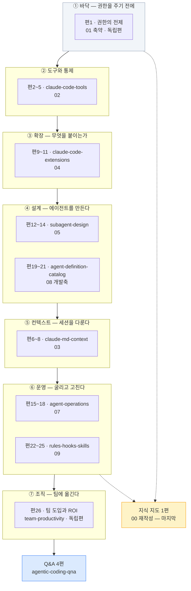

# `agentic-coding` 카테고리 분할 설계

**작성일**: 2026-08-08
**개정**: 2026-08-08 (독립 검증 2기 반려 지적 반영 — 산술 15건 · 논리 14건)
**상태**: 설계 완료 — 실행 대기
**근거**: [요구사항 §13·§14·§15](../specs/2026-08-07-tech-blog-requirements.md), 조사 6기 + 검증 2기 실측
**직전 선례**: [`ai-agent` 분할 설계](2026-08-08-ai-agent-category-split-design.md)

---

## 0. 검증 이력 — 초안이 왜 반려됐는가

초안은 독립 검증 2기에서 **양쪽 모두 반려**됐다. 조사 결과를 표로 옮기는 과정에서 **열이 지워지고 모집단이 바뀐** 것이 원인이다.

| 축 | 반려 사유 (대표) | 개정 |
| --- | --- | --- |
| 산술 | **도식 총계 85가 두 표에서 서로 다른 오류로 상쇄**돼 교차 대조를 통과했다. 참값은 어느 쪽도 아니었다 | §4-3 |
| 산술 | §4-0이 "16.5KB는 틀렸다"고 정정해 놓고 §4-1 평균이 16.4KB였다. **정정한 진단을 계획이 따르지 않았다** | §4-0·§4-1 |
| 산술 | 조사자들이 계산에 포함한 **`§0` 용어 배분 열을 표로 옮기며 삭제**해 4편이 하한 미달 | §4-1 |
| 논리 | **`series`·`seriesOrder`가 설계서 전문에 0회.** 직전 설계서에는 있던 열 | §4-1 |
| 논리 | **slug 미정.** 조사자 F의 충돌 목록 7군데와 대조 흔적 없음 | §4-1 |
| 논리 | **`§0` 용어표 6편분 + 「인용 시 주의」 5편분 미배정** — 약 17KB, 출처 대장 3건 | §4-4·§6-5 |
| 논리 | `02 §12-2` 배분이 **원문 내용과 반대**. 조사 보고 내부 모순 중 틀린 쪽을 채택했다 | §4-1 편4·편5 |

> **§15-1은 "중복 판정이 조사 → 설계서 → 브리프를 거치며 아무도 세지 않아 뒤집힌다"고 했다.**
> 이번에 뒤집힌 것은 중복 판정이 아니라 **종합 단계에서 새로 들어간 오류**다. 조사자가 센 것을
> 컨트롤러가 옮기며 열을 지웠다. **표를 옮길 때도 세어야 한다**는 것이 이번의 교훈이다(→ §13).

### 0-1. 2회차 재검증 — 개정판에서 새로 들어간 오류 9건

**1회차 지적 15건 중 12건 완전 해소, 도식 축은 전수 실측으로 완전 정합.** 그러나 개정판이 **다른 방식으로** 틀렸다.

| # | 새 오류 | 성격 |
| --- | --- | --- |
| N1 | `02 §12-2` 배분이 **분할표에서만 반대**로 적혔다 — 주석표·금지선 12는 맞는데 | **자기 정정을 한 곳에만 반영** |
| N2 | 발행 총량을 `원본 B 합 × 1.2`로 계산해 **§4-2 예외 배율 3건을 되돌렸다** | 〃 |
| N3 | §9-1 6행 링크가 「위와 동일」이라 **5행(다른 편)의 slug**를 가리켰다 | 〃 |
| N4~N9 | 팽창률 표 측정 셀 2개가 실측 아님 · 원본 시점 표기 위치 오지목 · 사슬 마지막 항이 잔차 · Q&A 총량 불일치 · 절 열에 원본 B에 없는 재료 2건 · `00` 행 표기 이중 | 국소 |

> **개정의 실패 패턴이 초안과 달랐다.** 초안은 *조사 보고를 옮기며 열을 지웠고*,
> 개정판은 **자기가 새로 정한 규칙을 문서의 다른 곳에 반영하지 않았다.**
> N1·N2·N3이 전부 이 유형이다 — 규칙은 맞게 썼는데 그 규칙을 쓰는 자리가 옛 값을 유지했다.

---

## 1. 요약

원본 **12편 542.7KB** 중 **80KB를 `ai-transformation`으로 이관**하고, 나머지를 발행본 **31편**으로 변환한다.

```
원본 555,706 B (542.7KB)
  − 80,246   이관 — 06 전량 63,181 · 08 §4~§8·§10 17,065   → ai-transformation
  − 50,477   면접 절 8 + 인용 절 8                          → Q&A 수확 + 조건 이관(§6-5)
             (05 §10-2 조직유비 3열 1,244 B는 편14로 복원 — §4-4)
  − 20,602   01 드롭 — §0 전량 · §1~§8(§6-1 제외) · 머리말 332  → 카테고리 부적합(§2-2)
  − 19,999   00 전량 6,828 + 10 전량 13,171                 → 지도 재작성 / 문항 목록
  −  1,688   머리말 4편분 (02·03·07·09)                     → frontmatter로 대체
  −    145   team-prod CRLF 정규화                          → LF 변환분
  ────────
   382,549 B   ↔  §4-1 26행 합 382,562 B   (차 13 B = 절 경계 헤더 반올림)
        발행 예상 468.2KB  ← §4-1 「×배율」 열 26행의 합. 아래 주 참조
        편당 평균 18.0KB
```

> **⚠️ 총량은 `382,549 × 1.2`가 아니다.** §4-2가 명시 승인한 예외 배율 3건(편1 2.39× ·
> 편9 1.40× · 편26 1.25×)이 있으므로 **일괄 1.2를 곱하면 그 승인이 되돌려진다.**
> 발행 총량은 항상 **§4-1 「×배율」 열 26행의 합**으로 낸다.
>
> **「검산 오차 0」이라고 쓰지 않는다.** 사슬 마지막 항이 잔차를 흡수하면 어떤 행 합이 와도
> 0이 되어 검산이 성립하지 않는다. 실제 차 13 B를 그대로 적는다.
>
> `04`·`05`·`08`의 머리말(455·423·451 = 1,329 B)은 사슬에서 빼지 않았다 — **편9·편12·편19의
> 「원본 B」에 포함**돼 있다(§4-1 절 열에 표기).

| 구분 | 편수 | 원본 | 발행 예상 |
| --- | ---: | ---: | ---: |
| 본문 (`01`축약·`02`·`03`·`04`·`05`·`07`·`08`개발축·`09`·`team-prod`) | **26** | 382.1KB | **468.2KB** |
| Q&A 공통편 (면접 절 8개 + `10`) | **4** | (수확) | **~72KB** (목표 18KB × 4 — §7-3) |
| 지식 지도 (`00` 재작성) | **1** | (신규) | ~15KB |
| **합계** | **31** | | **~555KB** |

### 1-1. 조사 방법과 신뢰도

| 항목 | 값 |
| --- | --- |
| 조사 | 6기 병렬, 담당 파일 **전문 통독** |
| 검증 | 2기 병렬(산술·논리), **원본 재측정 + 설계서 대조** |
| KB 측정 | H2 구간 UTF-8 바이트 실측. **코드펜스 상태 추적** 적용 |
| 검산 | 절별 KB 합 = 파일 크기 — **10편 오차 0**, `team-prod` 1편만 145B 차이(CRLF, 원인 규명 완료) |

**조사자 6기 전원이 브리프의 전제를 뒤집었다.**

| 조사자 | 브리프의 전제 | 실측 결과 |
| --- | --- | --- |
| A | 편당 목표 16.5KB (직전 실측이라 명시) | **재현 불가.** 발행본 실측은 20.3KB — 컨트롤러가 예상값을 실측값으로 오기 |
| B | `03`은 교차 중복 위험 최대 | **완전중복 0건.** 핵심어 6종이 발행본 82편에서 0히트 |
| C | `04`·`05`가 발행본과 정면 충돌 | **가장 안전한 축.** 4자 비교표 54셀 중 발행본 실재 0셀 |
| D | `08`은 `06`의 카탈로그다 | **아니다.** 서로 다른 에이전트 세트 — 부서 구성이 다르다 |
| E | (브리프가 지목한 충돌 5건) | 전부 부분중복 이하. 대신 **원본 내부 모순 3건** 발견 |
| F | `ai-agent` 태그 54편 | **35편.** 컨트롤러 grep이 `category:` 필드를 집었다 |

---

## 2. ⚠️ 범위 확정 — 사용자 결정 2건 (2026-08-08)

### 2-1. `06` 전량 + `08 §4~§8·§10` → `ai-transformation`으로 미룬다

**근거는 어휘 실측이다.** `06` 전문에 카테고리 정의어가 한 번도 없다.

| 검색어 | `06` 전문 출현 |
| --- | ---: |
| `Claude Code` · `MCP` · `Skills` · `Hooks` | **각 0** |

카테고리 정의(`categories.ts` L30~34)는 *"Claude Code로 짓는 개발 워크플로 — 컨텍스트 엔지니어링, MCP·Skills·Hooks, 멀티에이전트"*다.

| 성격 | 분량 | 비중 | 목적지 |
| --- | ---: | ---: | --- |
| 비개발 직군 업무 자동화 | 53.1KB | 44.6% | `ai-transformation` |
| 에이전트 설계 원리(직군 중립) | 39.9KB | 33.4% | 분할 |
| 개발 워크플로 | 16.5KB | 13.9% | `agentic-coding` |
| 용어(분산 배치) | 8.8KB | 7.3% | — |
| 머리말 | 0.9KB | 0.8% | — |

> **분모는 `06` + `08` 합산 119,212 B**(면접·인용 절 제외)다. `06` 단독이 아니다.

**이관은 "지금 변환해서 다른 카테고리에 넣는다"가 아니라 "`ai-transformation` 차례로 미룬다"이다.** 카테고리 단위 순차 변환 원칙(§13-8)을 지킨다.

#### ⚠️ 요구사항 §13-1 정정 — 실행 단계 첫 작업

**이관 사실이 요구사항에 기록되지 않으면 다음 카테고리에 전달되지 않는다.** `ai-transformation` 설계가 `06` 전량이 온다는 것을 모른 채 18편으로 시작한다.

`docs/superpowers/specs/2026-08-07-tech-blog-requirements.md` §13-1 표를 이렇게 고친다:

```diff
- | `ai-transformation` | AI 전환 조직 | … | 10 | 18 |
+ | `ai-transformation` | AI 전환 조직 | … | 10 | 18 + `aiagent/06` 전량 · `aiagent/08 §4~§8·§10` (2026-08-08 이관) |
- | `agentic-coding` | 에이전틱 코딩 | … | 20 | 12 |
+ | `agentic-coding` | 에이전틱 코딩 | … | 20 | 12 − `06` 이관 − `08` 일부 = 실질 10.5편 → 발행 31편 |
```

**「합계 134편 + 발행 제외 9편 = 143편 (검산 완료)」 줄은 파일 단위 검산이므로 유지된다** — 이관은 카테고리 간 이동이지 편수 변동이 아니다. 다만 각주로 이관 사실을 단다.

### 2-2. `01`은 §6-1+§9+§10만 살려 1편으로 축약한다

`01` 본문 21.6KB 중 카테고리 정의에 부합하는 것이 §9(2.5KB) 하나뿐이다.

| `01` 절 | 내용 | 처리 |
| --- | --- | --- |
| §1·§2·§3 | 계층 스택, 왜 CLI인가, 터미널·셸·OS | 드롭 |
| §4·§5 | 파일·폴더 명령 12종, Node.js·npm·nvm | 드롭 |
| **§6-1** | **되돌릴 수 있어야 권한을 넓힌다** (1,000B) | **유지** |
| §6 나머지·§7·§8 | Git·SSH 키, Cursor vs VS Code, iTerm2 | 드롭 |
| **§9** | **CLAUDE.md 규약** (2,509B) | **유지** |
| **§10** | **실패 모드 3분류** (2,140B) | **유지** |

**결정적 근거**: `nvm`·`ssh-keygen`·`ed25519`·`npx`·`zsh`·`Node.js`·`VS Code`·`iTerm2`가 발행본 82편에 **각각 0편**이다. 중복이 없다는 뜻이면서, **이 블로그가 이 층위를 다룬 적이 없다**는 뜻이다.

---

## 3. 카테고리 전체 구조



**⑤ 컨텍스트(`03`)가 ③④ 뒤에 오는 이유**: `03` 본문이 `PreToolUse`·`PostToolUse`·`SessionStart` 훅(→`04`), `Agent Teams`(→`05`), `Plan Mode`·`allowManagedPermissionRulesOnly`(→`02`)를 **설명 없이 쓴다**(조사자 B §7-3 실측). 앞에 두면 미정의 개념이 등장한다.

**`00`(지식 지도)을 마지막에 쓰는 이유**: 본문 참조가 **52곳**이고 전부 `01~10`을 가리킨다. 발행 slug 확정 전에는 링크를 걸 수 없다(§15-5).

---

## 4. 분할 설계

### 4-0. 편당 KB 기준

| 출처 | 편당 평균 | 범위 | 팽창률 |
| --- | ---: | --- | ---: |
| ~~초안 브리프~~ | ~~16.5KB~~ | ~~9.7~26.0~~ | ~~0.96~~ |
| **발행본 `ai-agent` 51편 실측** | **20.3KB** | **13.3~29.4** | — |

**팽창률은 1.2를 쓴다.** 실측이 두 카테고리에서 갈리기 때문이다.

**측정 기준은 raw(frontmatter 포함) bytes로 통일한다.** 분모는 추정치다(`~` 표기).

| 카테고리 | 원본 | 면접·인용 제외(추정) | 발행 raw | 팽창률 | (참고) 본문만 |
| --- | ---: | ---: | ---: | ---: | ---: |
| `ai-agent` | 878.4KB | ~778KB | **1,032.9KB** | **1.33** | 1,001.1KB → 1.29 |
| `rag` | 490KB | ~430KB | **475.4KB** | **1.11** | 453.3KB → 1.05 |
| **채택** | | | | **1.20** | |

채택값 1.20은 두 값 사이에 있다. **분모가 추정치이므로 팽창률 자체가 ±0.1의 불확실성을 갖는다** — 아래 예상 KB의 ±15% 오차가 여기서 나온다.

> **13.3~29.4KB는 발행본의 실측 분포이지 합격선이 아니다.** 아래 예상 KB는 ±15% 오차를 갖는다.
> 변환 시 실측이 13.3KB를 밑돌면 **인접 편과 병합**한다(§11 금지선 11).

### 4-1. 분할표 — 26편

**편 번호는 설계서 내부 참조용이다.** 발행 순서도 시리즈 순서도 배치 순서도 아니다(배치는 §9).
**KB 단위는 전 행 십진 KB(÷1000)로 통일**했다 — 조사 보고는 조사자별로 KiB/KB가 섞여 있었다.

| 편 | series / order | slug | 원본 절 | 원본 B | ×1.2 | 도식 | 가제 |
| ---: | --- | --- | --- | ---: | ---: | ---: | --- |
| **1** | (독립편) | `reversibility-before-permission` | `01` §6-1·§9·§10 (+§0-4 발췌·신규 서술 — 배율이 흡수) | 5,649 | **13.5**※ | 0→**2** | 되돌릴 수 있어야 권한을 넓힌다 — CLAUDE.md 규약과 실패 모드 3분류 |
| **2** | `claude-code-tools` 1 | `claude-code-autonomy-tiers` | `02` **§0 전량** §1 §2 §3 | 13,770 | 16.5 | 5 | 자율성이 3세대를 가른다 — 그리고 인증 우선순위가 곧 과금 경로다 |
| **3** | `claude-code-tools` 2 | `builtin-tools-attack-surface` | `02` §4 §5 §6 §7 + §12-1 | 15,425 | 18.5 | 5 | 도구 목록이 곧 공격 표면 — 7개 도구와 4대 지시 패턴 |
| **4** | `claude-code-tools` 3 | `settings-permissions-deny` | `02` §8 §9 + **§12-2의 행5 하나**(아래 주) | 12,026 | 14.4 | 3 | deny가 항상 이긴다 — settings.json과 훅의 2차 방어선 |
| **5** | `claude-code-tools` 4 | `claude-md-enforcement` | `02` §10 §11 + **§12-2의 행1·2·3·4·6** + §12-3 | 11,660 | 14.0 | 4 | enforcement 없는 규칙은 위시리스트 — CLAUDE.md 3계층과 부서별 정책 |
| **6** | `claude-md-context` 1 | `claude-md-scope-layers` | `03` **§0 전량** §1 §2 §3 | 14,247 | 17.1 | 2 | CLAUDE.md는 왜 200줄인가 — 4계층 Scope와 3덩어리 7단계 |
| **7** | `claude-md-context` 2 | `dot-claude-directory` | `03` §4 §5 §6 | 17,803 | 21.4 | 2 | `.claude/` 여덟 구성물과 프롬프트 패턴 7종 |
| **8** | `claude-md-context` 3 | `context-budget-session` | `03` §7 §8 §9 | 15,185 | 18.2 | 4 | 70%에서 세션을 끊는다 — 업무 분해 3패턴과 컨텍스트 예산 |
| **9** | `claude-code-extensions` 1 | `extension-trigger-axis` | `04` 머리말 **§0 전량** §1 §2 §11 (+**§5-3(1) 대조 문단** — 신규, 배율이 흡수) | 9,618 | **13.5**※ | 3 | 확장 메커니즘 4종을 가르는 축 — 누가 트리거하는가 |
| **10** | `claude-code-extensions` 2 | `mcp-selection-practice` | `04` §3 §4 §5 §6 | 15,877 | 19.1 | 3 | MCP 실무 — 무엇을 붙이고 무엇을 거르는가 |
| **11** | `claude-code-extensions` 3 | `commands-skills-hooks-plugins` | `04` §7 §8 §9 §10 | 16,188 | 19.4 | 3 | 수동 버튼·자율 SOP·자동 게이트, 그리고 번들 |
| **12** | `subagent-design` 1 | `subagent-definition-fields` | `05` 머리말 **§0 전량** §1 §2 §3 | 19,434 | 23.3 | 2→**3** | 에이전트 한 명을 정의한다 — 필드 10개와 검증 10항목 |
| **13** | `subagent-design` 2 | `collaboration-patterns-isolation` | `05` §4 §5 | 11,560 | 13.9 | **7** | 셋으로 묶는 법과 셋으로 가르는 법 |
| **14** | `subagent-design` 3 | `agent-team-operations` | `05` §6 §7 §8 §9 + **§10-2 조직유비 1·2·3열**(1,244 B 실측, 면접 절에서 복원) | 22,776 | 27.3 | 7 | 팀을 굴리면 첫날 무엇이 멈추는가 — 그리고 완제품 환경 |
| **15** | `agent-operations` 1 | `automation-scope-criteria` | `07` **§0 전량** §1 §2서두~§2-2 | 14,872 | 17.8 | **2** | 무엇을 자동화할지부터 정한다 — 합격선 5축과 규칙 문서 |
| **16** | `agent-operations` 2 | `agent-jd-triggers` | `07` §2-3 §2-4 §2-5 §3 | 14,500 | 17.4 | 6 | JD 5필드에서 세 트리거까지 — 만들고 하루를 굴린다 |
| **17** | `agent-operations` 3 | `troubleshooting-three-layers` | `07` §4 | 11,786 | 14.1 | 2 | 3계층으로 좁히고 4단으로 분해한다 — 공통 문제 10선 |
| **18** | `agent-operations` 4 | `scaling-routing-collapse` | `07` §5 §6 §7 | 19,200 | 23.0 | 3 | 10에서 100으로 — 라우팅 붕괴 공식과 반복 실패 4가지 |
| **19** | `agent-definition-catalog` 1 | `thirty-agent-catalog` | `08` 머리말 **§0 전량** §1 §2 | 18,931 | 22.7 | 2 | 30개 에이전트 카탈로그 — 도구 권한을 좁히면 생기는 일 |
| **20** | `agent-definition-catalog` 2 | `definition-writing-quality` | `08` §3 §12 | 13,645 | 16.4 | 0→**1** | 에이전트 정의서를 쓰는 법 — 그리고 30종에서 관찰된 품질 편차 |
| **21** | `agent-definition-catalog` 3 | `dev-org-transfer` | `08` §9 §11 | 11,627 | 14.0 | 2 | 개발조직에 옮길 것과 옮기지 않을 것 — 비어 있는 여섯 자리 |
| **22** | `rules-hooks-skills` 1 | `rules-hooks-skills-layers` | `09` **§0 전량 §1-1 §1-2** §2 | 19,118 | 22.9 | 3 | 규범·강제·절차 — Rules·Hooks·Skills 3계층과 차단 규칙 7종 |
| **23** | `rules-hooks-skills` 2 | `prompt-four-elements` | `09` §3 §8 | 10,600 | **12.7**△ | 2 | 지시가 결과를 가른다 — 프롬프트 4요소와 업종별 CLAUDE.md |
| **24** | `rules-hooks-skills` 3 | `empty-folder-to-deploy` | `09` §4 §7 | 12,900 | 15.5 | 2 | 빈 폴더에서 배포까지 — 8단계 빌드와 6단계 전개 |
| **25** | `rules-hooks-skills` 4 | `deploy-checklist-debugging` | `09` §5 §6 §1-3 | 22,988 | **27.6**△ | 1→**2** | 배포 전·중·후 65항목, 그리고 재현 없이 가설 없다 |
| **26** | (독립편) | `team-adoption-roi` | `team-productivity` 전편 | 11,177 | **14.0**※ | 0→**2** | AI 코딩 도구를 팀에 도입한다 — 개인 향상이 조직 ROI로 전환되지 않는 이유 |

**합계 원본 382,562 B · 예상 발행 468.2KB · 도식 82** (편1~26 합. Q&A 0 + 지도 3을 더해 총 85 — §4-3)

> **「×배율」 열 26행의 합이 발행 총량이다**(468.2KB). §1 사슬에 1.2를 일괄로 곱하면
> §4-2 예외 배율 3건이 되돌려져 9.1KB 작게 나온다.
>
> 원본 B 열 합(382,562)과 §1 사슬(382,549)의 차 **13 B**는 절 경계 헤더 처리 차이다.
> 독립 검증에서 26행을 바이트 단위로 대조해 **설명 불가 잔차 51 B(0.013%)**를 확인했다.

**※ 표시 3편은 팽창률이 다르다** — §4-2.
**△ 표시 2편은 범위 경계다** — 편23은 하한 근접(변환 시 실측 후 병합 판단), 편25는 상한 근접.
**편14(27.3)도 상한 근접이다.** 셋 다 발행본 실측 상한 29.4KB 이내이나, 변환 시 초과하면 보고한다.

#### ⚠️ `02 §12-2` 배분 — 「앞 3행/뒤 3행」이 아니다

초안이 조사 보고의 내부 모순 중 **틀린 쪽**을 채택했다. 검증자가 원본 `02` L1128~1136을 열어 확정했다.

| 행 | 내용 | 소재 절 | 배치 |
| ---: | --- | --- | --- |
| 1 | CLAUDE.md 800줄 초과 | §10 | **편5** |
| 2 | `@import`로 참조할 것 | §10 | **편5** |
| 3 | 분류 체계 없이 규칙 파일 양산 | §10 | **편5** |
| 4 | Never-Do 파일 수동 작성(훅 자동 생성이 원칙) | §10 | **편5** |
| **5** | **`settings.local.json`을 Git에 커밋** | **§8** | **편4** |
| 6 | enforcement 없이 문서로만 = 위시리스트 | §10 | **편5** |

**편4는 행5 하나만 가져간다. 나머지 다섯 행(1·2·3·4·6)이 편5로 간다.**

> **「1행/5행」 같은 축약 표기를 쓰지 마라** — 「행 번호 1」과 「행이 1개」가 구분되지 않는다.
> 개정 과정에서 실제로 이 표기가 분할표에서 뒤집혔고, 독립 검증이 원문을 열어 잡았다.
> **항상 「행5 하나」·「행1·2·3·4·6」처럼 번호를 나열한다.**

「앞 3행」으로 나가면 편4가 `@import`·`rules/`·Never-Do 훅 자동 생성을 **편5에서야 정의될 개념인 채로** 안티패턴으로 먼저 언급한다.

### 4-2. ⚠️ 의도적 팽창 3건 — 명시 승인 사항

§15-5가 "의도적 도식 감소는 설계서에 미리 명시한다"고 했다. **팽창도 같다. 명시하지 않으면 3단계 검증이 "지어냈다"로 반려한다.**

| 편 | 원본 | 목표 | 배율 | 무엇을 더하는가 |
| ---: | ---: | ---: | ---: | --- |
| **1** | 5,649 B | 13.5KB | **2.39×** | 도입부, `01 §0-4`에서 CLAUDE.md 관련 행만 추린 용어표, 「조직에 옮기면」 표, 신규 도식 2개 |
| **9** | 9,618 B | 13.5KB | **1.40×** | §5-3(1) 정합성 부채 해소 대조 문단 약 2KB (아래 §5-3) |
| **26** | 11,177 B | 14.0KB | **1.25×** | 불릿 → 표·도식 전환. 원본은 표 1개·도식 0개라 카테고리 안에서 혼자 이질적이다 |

나머지 23편은 **1.2× 균일**을 적용한다.

### 4-3. 도식 검산 기준값

**초안의 85는 두 표에서 서로 다른 오류가 상쇄된 값이었다.** 개정판은 배정을 바꿔 드롭을 없앴다.

| 원본 | 원본 도식 | 이관 | 드롭 | 유지 | 신규 | 발행 |
| --- | ---: | ---: | ---: | ---: | ---: | ---: |
| `00` | 1 | — | **1** | 0 | **3** | 3 |
| `01` | 5 | — | **5** | 0 | **2** | 2 |
| `02` | 17 | — | — | 17 | — | 17 |
| `03` | 8 | — | — | 8 | — | 8 |
| `04` | 9 | — | — | 9 | — | 9 |
| `05` | 16 | — | — | 16 | **1** | 17 |
| `06` | 11 | **11** | — | 0 | — | 0 |
| `07` | 13 | — | — | 13 | — | 13 |
| `08` | 10 | **6** | — | 4 | **1** | 5 |
| `09` | 8 | — | — | 8 | **1** | 9 |
| `10`·`team-prod` | 0 | — | — | 0 | **2** | 2 |
| **계** | **98** | **17** | **6** | **75** | **10** | **85** |

**편별 배정** (3단계 검증의 대조 기준. 총합만 비교하면 이동과 유실을 구분할 수 없다 — CR-6.2)

```
편1  0+2신규    편2  5   편3  5   편4  3   편5  4
편6  2          편7  2   편8  4
편9  3          편10 3   편11 3
편12 2+1신규    편13 7   편14 7
편15 2          편16 6   편17 2   편18 3
편19 2          편20 0+1신규      편21 2
편22 3          편23 2   편24 2   편25 1+1신규
편26 0+2신규    Q&A 0×4  지도 3신규
```

**검증자 정정 2건을 반영했다.**

| 정정 | 초안 | 개정 |
| --- | --- | --- |
| 편15 도식 | 3 | **2** — `07 §2서두`·`§2-0`·`§2-2`에 도식이 없다. §1(1) + §2-1(1)뿐 |
| `09 §1-1` 도식 | 편25가 §1-3만 쓰므로 **드롭** | **편22에 `§1-1`·`§1-2`를 배정**해 드롭을 없앴다(§4-4) |

**`00`의 도식 1개는 「드롭 1 + 신규 3」으로 센다.** 노드가 `01 환경설정`처럼 **원본 문서 번호**로 되어 있어 발행본에 그 체계가 없고, **원본 도식의 내용이 실제로 살아남지 않기 때문**이다. 발행 slug 기준으로 새로 그린다.

> 이것을 「재작성 = 유지」로 세면 **드롭 5 · 유지 76 · 신규 9**가 되어 §10의 「유지 75 + 신규 10」과
> 어긋난다. **총계 85는 양쪽 읽기에서 같으므로 총합 검산으로는 잡히지 않는다** —
> 표의 읽기(드롭 1 · 신규 3)로 통일한다.

### 4-4. `§0` 용어표와 부속 절 배정 — 전량

초안이 배정하지 않아 약 17KB가 사라질 뻔한 부분이다. **§14-5 규칙**(*"시리즈 2편 이후는 원본 용어표에서 그 편에서 쓰는 행만 추린 축약표"*)을 그대로 적용한다.

| 원본 | §0 bytes | 전량 배치 | 2편 이후 |
| --- | ---: | --- | --- |
| `01` | 4,353 | §0-4에서 CLAUDE.md 관련 행만 → **편1** | (독립편) |
| `02` | 3,868 | **편2** | 편3·4·5는 축약표 |
| `03` | 2,773 | **편6** | 편7·8은 축약표 |
| `04` | 3,532 | **편9** | 편10·11은 축약표 |
| `05` | 3,675 | **편12** | 편13·14는 축약표 |
| `07` | 3,272 | **편15** | 편16·17·18은 축약표 |
| `08` | 4,098 | **편19** | 편20·21은 축약표 |
| `09` | 3,292 | **편22** | 편23·24·25는 축약표 |
| `00` | — | 지식 지도편 | — |

**축약표는 원본 §0에서 행을 추리는 것이라 신규 서술이 아니다.** `## 용어 정리`는 항상 글 앞에 둔다(Q&A만 뒤).

**부속 절 배정**

| 절 | bytes | 배정 | 근거 |
| --- | ---: | --- | --- |
| `09 §1-1`·`§1-2` | ~1,700 | **편22** | §1-2는 8자산↔H2 **1:1 매핑 지도표**. §2(3계층)의 전제다. 도식 1개도 여기 있다 |
| `09 §1-3` | 1,708 | 편25 | MCP 6종. 체크리스트 편의 하한 확보 |
| `05 §10-2` 조직유비 **1·2·3열** | 1,244 | **편14** | 조사자 C·F가 **서로 모른 채 같은 결론**에 도달. 4열(「면접에서 이어 붙이는 문장」)만 버린다 |
| `05 §10-4` 수치 주의 6행 | ~800 | 편12·13·14 각주 | C: **"`05` 모든 정량 주장의 근거 대장"** |
| `04 §11` 조직 도입 순서 | 1,337 | 편9 | §2의 결론을 조직 층위로 닫는다 |

### 4-5. 재정의 대상 용어 — 각 편이 단독으로 읽히려면 (CR-4.4)

조사자 A가 실측한 9종이다. 시리즈 안에서 편이 갈리므로 **뒤 편에 1줄 재정의**가 필요하다.

| 용어 | 최초 정의 | 재정의 필요 편 |
| --- | --- | --- |
| 퍼미션 모드 / Plan Mode | `02 §0-3` | 편4 |
| MCP | `02 §0-4` | 편4 · 편5 |
| `defaultMode` | `02 §0-3` | 편5 |
| enforcement | `02 §0-3` | 편5 |
| 800줄 한계 | `02 §0-2` | 편5 |
| 컨텍스트 조기 소진 | `02 §0-2` | 편3 |
| SDD | `02 §0-3` | 편3 |
| CLAUDE.md | `01 §0-4` · `02 §10` | **편1 ↔ 편5 파일 경계를 넘는 유일한 용어** |
| PATH | `01 §0-2` · `02 §0-4` | 편1 · 편2 |

---

## 5. 교차 중복 — 예상과 정반대였다

### 5-1. 판정 총괄

발행본 82편 전수 대조 결과다. **중복-완전은 단 1건도 없다.**

| 판정 | 건수 |
| --- | ---: |
| 중복-완전 (원본 고유 항목 0) | **0** |
| 부분중복 (원본 고유 있음) | 12 — 전부 유지 |
| 동주제-무중복 (축이 다름) | 9 — 유지 |

**근본 원인은 다루는 제품이 다르기 때문이다.** 발행본 51편은 LangGraph 그래프 API와 하네스 일반론, 원본은 **Claude Code 확장 메커니즘의 파일·필드 규격**이다.

발행본 82편에 **0건**인 원본 고유어: `settings.json` `@import` `Miller` `session-summary` `$ARGUMENTS` `stdio` `마켓플레이스` `Tool Poisoning` `exit 2` `N×M` `Hub-and-Spoke` `Reasoning Sandwich` `Agent Teams` `Mailbox` `blockedBy` `maxTurns`

### 5-2. ⚠️ 수치가 같아서 중복으로 보이는 함정 2건

grep 히트만 보고 판정했다면 두 절이 통째로 삭제됐을 것이다.

| 숫자 | 원본이 가리키는 것 | 발행본이 가리키는 것 | 겹치는 셀 |
| --- | --- | --- | ---: |
| `200줄` | `03 §2-4` CLAUDE.md **규칙 준수율(adherence) 임계** | `harness-five-primitives` MEMORY.md **하드 제한** | **0** |
| `85%` | `03 §8-5` **컨텍스트 사용률** 상한 | `harness-five-primitives` **테스트 커버리지** 최소치 | **0** |

### 5-3. ⚠️⚠️ 개수 대조가 통과하는 정합성 부채 2건

**CR-6.1은 "항목 수를 세라"고 한다. 이 둘은 세면 0이다. 그런데도 문제다.**

> ## ⚠️ 정정 (2026-08-08, B2 실측) — 아래 §5-3의 두 진단이 모두 틀렸다
>
> B2에서 `harness-five-primitives.md`를 직접 열어 확인한 결과다. **아래 원문을 그대로 브리프로 옮기지 마라.**
>
> ### 정정 ① — 발행본의 열거 기준은 「소비」가 아니다
>
> | | 초안 (§5-3(1) 아래) | **B2 실측** |
> | --- | --- | --- |
> | 발행본 다섯의 열거 기준 | 「컨텍스트를 무엇이 **소비**하는가」 | **「컨텍스트 관리를 상위 목적으로 공유하는 수단」** |
>
> 근거는 그 글 L48~57이다. 도식의 최상위 노드가 `Context Management (WHY)`이고 다섯이 그 아래 자식으로 달린다. 본문이 못박는다 — *"**최상위 노드가 다섯 중 하나가 아니라 다섯의 이유**라는 점이 이 도식의 전부다."*
>
> **반증이 결정적이다.** 그 글의 컨텍스트 분해표(L144~154) 9행은 `시스템 프롬프트 · 시스템 도구 · 커스텀 에이전트 · 메모리 파일 · 스킬 · 메시지 · 여유 공간 · 자동 압축 버퍼 · MCP 도구`다. **커맨드와 훅은 행 자체가 없는데 다섯에 들어 있다.** 「소비 기준」이면 둘이 들어갈 수 없다.
>
> ### 정정 ② — 요건 4의 인과는 성립하지 않는다
>
> 초안 요건 4는 *"MCP가 발행본 목록에 없는 이유(L154: 필요 시 로드라 상시 컨텍스트 비용이 아님)"* 라고 쓴다. **그 글은 MCP를 다섯에서 뺀 이유를 밝히지 않는다.** 확인되는 것은 L154의 값이 `—`라는 사실까지이고, 「그래서 뺐다」는 읽는 쪽의 추론이다. 위 반증(커맨드·훅)이 그 추론을 무너뜨린다.
>
> **B2 편9의 처리** — 인과를 관측으로 낮추고 반례를 본문에 적었다: *"다만 이 표가 다섯의 선정 기준을 그대로 보여주는 것은 아니다 — 커맨드와 훅은 이 표에 행 자체가 없는데도 다섯에 들어 있다. 그 글은 MCP를 다섯에서 뺀 이유를 따로 밝히지 않는다."*
>
> ### 정정 ③ — 발행본 시점은 「없음」이 아니다
>
> | | 초안 (§5-3(2) 표) | **B2 실측** |
> | --- | --- | --- |
> | 발행본 시점 | **없음** | **2026년 3월 자료 기준** — 그 글 L19에 명시 |
>
> 원문: *"이 글은 **2026년 3월 자료를 정리한 것**이다. 언급되는 도구·명령·화면과 벤치마크 수치는 그 시점의 것이며, 모델 세대가 바뀌면 권고 상한도 함께 바뀐다."*
>
> 초안의 확정 처리 *"발행본은 「시점을 명시하지 않았다」라고 사실만 적는다"* 를 그대로 따르면 **거짓 서술**이 된다. B2 편10은 *"그 글은 2026년 3월 자료 기준임을 스스로 밝히고 있다"* 로 썼다. 원본 쪽 판정(`04` L484~494에 시점 표기 없음)은 **맞다** — 재확인했다.
>
> ### 왜 세 건 다 놓쳤나 — 뒤 배치가 새길 것
>
> 설계서가 §5-3(2)에서 스스로 적었다 — *"발행본 쪽 근거 시점을 **아무도 조사하지 않았다**"*. 그 미조사 상태에서 「없음」으로 확정한 것이 오류의 경로다. ①②도 같다. 발행본을 **열지 않고** 표만 보고 기준을 규정했다.
>
> **문서가 자기 공백을 표시해 둔 곳이 가장 먼저 찔러 볼 곳이다.**
> 그리고 **설계서의 진단은 브리프로 옮기기 전에 실측한다** — B1이 §6-1·§10, B2가 §5-3에서 각각 잡았다. **2배치 연속이다.**

#### (1) 「다섯」과 「넷」이 독자 앞에서 충돌한다 — 편9에서 해소

| | 발행본 `harness-five-primitives` | 원본 `04` |
| --- | --- | --- |
| 제목 | 하네스를 만드는 **다섯** 가지 | 확장 메커니즘 **4종** |
| 공통 | Skill · Commands · Hooks | 동일 |
| 한쪽에만 | **Memory · Agent** | **MCP · 플러그인** |

열거 **기준**이 다르다 — 발행본은 「컨텍스트를 무엇이 소비하는가」, 원본은 「무엇을 확장 가능한가」.

**편9에 넣을 대조 문단의 요건** (한 줄 언급으로는 통과시키지 않는다):

| # | 반드시 포함 |
| --- | --- |
| 1 | 두 목록을 **나란히 놓은 표** (5종 / 4종, 공통 3 + 각각 고유 2) |
| 2 | **열거 기준이 다르다**는 명시 — 위 표의 두 문구를 그대로 |
| 3 | `harness-five-primitives`로 가는 **본문 인라인 링크** |
| 4 | MCP가 발행본 목록에 없는 이유(`harness-five-primitives` L154: "필요 시 로드"라 상시 컨텍스트 비용이 아님) |

#### (2) MCP 컨텍스트 비용 — 발행본과 결론이 반대다

| | 주장 | 위치 | 시점 |
| --- | --- | --- | --- |
| 발행본 | MCP 도구는 **필요 시 로드**라 많이 붙여도 상시 비용이 되지 않는다 | `harness-five-primitives.md` L154·L158 | **없음** |
| 원본 | 도구 정의 자체가 **상시 토큰을 점유**. 시작 3개·최대 5개. CLI 대비 최대 35배 | `04` L484~494 | **해당 절에는 없음**(아래) |

> **⚠️ 원본 쪽 시점도 그 자리에 없다.** 전수 검색 결과 `2026-04`/`2026년 4월` 표기는 5곳뿐이고
> (`02` L131·L171·L1216, `04` L175, `04 §13`), **L484~494에는 없다.** `35배`를 덮는 것은
> `04 §13`의 **연 단위** 표기(`2026년 강의자료 기준`)뿐이다.
>
> 발행본 시점을 추정하지 않기로 한 기준을 **원본 쪽에도 똑같이 적용한다** — 편10에는
> `원 자료 전체가 2026-04 기준(04 L175 명시)이나 해당 절에는 시점 표기가 없다`로 쓴다.

**초안의 "양쪽에 시점 조건을 붙인다"는 실행 불가능한 지시였다** — 발행본 쪽 근거 시점을 아무도 조사하지 않았고, 변환자가 만들어낼 수도 없다(만들면 CR-1.10 위반).

| 확정 처리 | |
| --- | --- |
| **기발행본을 수정하지 않는다** | 이번 범위는 `agentic-coding` 26편이다 |
| **편10 안에서 병기한다** | 원본 주장에 **「원 자료 전체가 2026-04 기준(`04` L175 명시)이나 해당 절에는 시점 표기가 없다」**를 달고, 발행본 주장을 링크와 함께 인용한 뒤 **"두 서술의 기준 시점이 다르며 지연 로드 여부는 클라이언트 구현·버전에 따라 다르다"**를 명시 |
| **양쪽 다 시점을 추정하지 않는다** | 발행본은 "시점을 명시하지 않았다", 원본은 "해당 절에 시점 표기가 없다"라고 **사실만** 적는다. **`04` L484~494에 `2026-04`를 달지 마라** |

### 5-4. 원본 내부 모순 3건

| # | 축 | 값 A | 값 B | 처리 |
| --- | --- | --- | --- | --- |
| 1 | CLAUDE.md 상한 | **60줄** (`07` L180~183·L222) | **200줄** (`07` L521, `09` L340·L967, `03 §2-4`) | **아래 조율** |
| 2 | 재시도 상한 | **3회** (`07` L117, 안정성 3요소) | **5회** (`07` L259, 외부 API 연동) | 편15·편16이 각각 **적용 범위를 문장으로 밝힌다**. 원본이 문맥을 달리 쓴 것이 실측으로 확인된다 |
| 3 | Core Web Vitals | `FID(INP)` 병기 (`09` L41 = **§0 용어표**) | `FID`만 (`09` L616 = §5) | §0는 **편22**, §5는 **편25**로 갈린다. **편25에서 `INP` 병기 + 시점 고지.** 근거 주체가 강의가 아니라 공개 웹 표준이라 §15-4상 실명 유지 |

#### 1번 조율 — 설계서가 이미 답을 갖고 있다

초안은 "원본이 조건을 붙이지 않았으니 양쪽 값을 모두 적는다"로 회피했다. **그러나 §5-2가 이미 확정했다** — `03 §2-4` 원문(L108)이 *"200줄은 하드 리밋이 아니라 **준수율(adherence) 임계**"*라고 **직접 쓴다.**

| 값 | 성격 | 원본 근거 | 배치 |
| --- | --- | --- | --- |
| **60줄** | **설계 권고치** (항목당 6줄 × 10항목) | `07 §2-2` 절 제목이 "CLAUDE.md 설계 — 60줄 원칙" | 편15 |
| **200줄** | **준수율 임계** (넘으면 규칙 준수율이 떨어지기 시작) | `03 §2-4` L108 원문 | 편6 |

**두 값은 다른 것을 재고 있으며, 그 구분은 원본이 한 주장이다.** 임의 해석이 아니므로 CR-1.10에 걸리지 않는다. 각 편에서 성격을 밝히고 **서로 링크한다.**

### 5-5. 원본 `00 §4` 교차참조표는 기준표로 쓰되 3차 열을 믿지 마라

원본 스스로 밝힌 중복 지도라 유용하지만 **틀린 곳이 3군데** 있다.

| 오류 | `00 §4`의 서술 | 실측 |
| --- | --- | --- |
| 비용 통제 1차 | `07 §3` | `07 §3`의 비용 서술은 **2행뿐.** 본체는 `07 §5-5`(편18) |
| CLAUDE.md 작성 | `03 §2~§5` / `02 §10` / `09 §8` | **`07 §2-2`(4,255B·25항목)가 통째로 누락** — 편15 |
| 포인터 대상 | 31개 중 1개가 `03 §10`(면접 절) | 발행본에 존재하지 않을 대상 |

**`00 §4`는 지식 지도편에 발행한다** — 단 위 3건을 고치고, 원본 문서 번호가 아니라 발행 slug로 다시 쓴다.

---

## 6. ⚠️ 출처·근거 주체 규칙 — 이번 카테고리의 최대 작업량

### 6-1. 문제의 규모

| 금칙어 | 행 수 | 직전 카테고리 |
| --- | ---: | ---: |
| **`강의`** | **160** | 1건 |
| `면접` | 68 | — |
| `Part [0-9]` | 23 | — |
| 화행 잔재(SC-12) | 25 | 9 |
| `강의` × 화행 결합 | 25 | 1 |

`강의` 160행 중 **`강의가 ~한다`·`강의는 ~한다` 형태**는 주어를 바꿔야 하는 건이다. 단어 하나 지우는 문제가 아니라 **문장의 주어를 바꾸는 문제**이고, §15-2/CR-1.10이 정확히 금지한 작업이다.

> ### ⚠️ 정정 (2026-08-08, B1 실행 중 발견)
>
> **초안은 이 형태를 「130여 개」라고 썼다. 실측은 32다** — 4배 부풀려져 있었다.
>
> | 값 | 초안 | **실측** | 비고 |
> | --- | ---: | ---: | --- |
> | `강의` 총 행수 | 160 | **160** | 초안이 맞다 |
> | `강의가` | — | **15** | |
> | `강의는` | — | **17** | |
> | **초안이 명시한 두 형태 합** | **「130여 개」** | **32** | **4.1배 과대** |
> | 조사형 6종 전부(`가`·`는`·`를`·`에`·`의`·`도`) | — | **66** | 넓게 잡아도 130의 절반 |
>
> 재계수 명령(`aiagent/*.md` 11파일 기준):
> ```bash
> grep -ho '강의가' aiagent/*.md | wc -l   # 15
> grep -ho '강의는' aiagent/*.md | wc -l   # 17
> ```
>
> **B1 실측으로 확인된 것**: `02` 단독은 `강의` 19행이고 **`강의가 ~한다` 주어 형태는 0건**이었다. B1이 실제로 처리한 것은 ㉢ 3건과 시점 표지 6건이며, 「주어를 바꾸는 작업」은 발생하지 않았다.
>
> **뒤 배치에 대한 함의**: 이 카테고리의 최대 위험을 `강의` 주체 치환으로 잡은 진단이 과대평가다. B1의 실제 결함 18건은 **전부 변환자가 새로 쓴 요약문**에서 났고 원본 이관분에서는 0건이었다. **위험의 무게중심은 「원본을 옮기는 일」이 아니라 「옮긴 뒤 덧붙이는 요약문」에 있다.** 배치 브리프의 경고 배분을 여기에 맞춰 다시 잡을 것.
>
> **왜 설계 검증 2기가 이 값을 못 잡았나**: 검증은 사슬 연산·표 교차 대조 같은 **내부 정합성**에 집중했고, 이 값은 외부 실측이라 대조 상대가 없었다. **스스로 모순되지 않는 틀린 값은 내부 검산으로 드러나지 않는다.**

### 6-2. 3층 처리 규칙

| 층 | 위치 | 처리 |
| --- | --- | --- |
| **① frontmatter** | `source:` | `"AI 에이전트 실무 과정"` — **편26 제외 전 편 동일**(§6-3) |
| **② 본문 근거 주체** | `강의가 ~한다` | **㉠㉡㉢ 세 갈래**(§6-4) |
| **③ 본문 화법** | `면접에서 인용할 때` | 걷어냄 (CR-1.4 · SC-12) |

### 6-3. `source:` 값 확정

**발행본 82편 중 77편이 `source:`에 한글 브랜드명을 쓴다.** 검증 명령의 민감정보 정규식은 영문만 잡는다.

| 검사 대상 | 결과 |
| --- | ---: |
| 영문 `teddynote`·`FASTCAMPUS`·`teddylee` (검증 명령 포함) | **0건** |
| 한글 `테디노트`·`패스트캠퍼스` (검증 명령에 없음) | **77편** |

즉 **금칙 목록이 겨냥하는 것은 본문의 개인 실명·핸들(CR-3.5)이지 `source:` 출처 표기가 아니다.**

**그런데 이번 원본에는 제공자명이 없다** — `패스트캠퍼스`·`인프런`·`유데미` 등 전수 검색 **0건**. 유일한 표기가 `AI 에이전트 실무 강의 Part N`이다.

| 확정 | `source: "AI 에이전트 실무 과정"` |
| --- | --- |
| `강의` → `과정` | 동일 지시대상의 다른 표현. **주체를 바꾸는 것이 아니다** |
| `Part N` 제거 | 금칙어이며, 기존 `source:` 값 어디에도 Part 표기가 없다 |

#### ⚠️ 한계를 명시한다 — CR-1.10의 전제가 이 카테고리에서 약하다

CR-1.10은 *"출처는 frontmatter `source`가 이미 담고 있다"*를 근거로 "주체를 지우는 쪽이 안전하다"고 했다. **이번엔 그 전제가 약하다** — 제공자명이 없고, 원본 강의자료는 이미 삭제됐다(`00 §5`). `source:`가 실질적으로 1차 대조 경로를 제공하지 못한다.

> **그래서 §6-4 ㉡(주체 보존)의 적용 범위를 넓게 잡는다.** 애매하면 `원 자료`를 남긴다.

#### 편26은 예외다

`team-productivity`는 `> 원본:` 필드가 **없고**, §참고자료에 **외부 URL 9개**(공식문서 2·Anthropic 블로그 1·개인 블로그 3·벤더 리서치 3)를 가진 **웹 조사 종합본**이다. CRLF·mtime이 나머지 11편과 다르다.

| 편26 처리 | |
| --- | --- |
| `source:` | **비운다.** 강의 출처를 달면 사실이 틀린다 |
| URL 9개 | **본문 각주로 재배치.** §4-2의 "불릿 → 표·도식 전환"에 이 작업을 포함한다 |
| 수치 귀속 | 원문이 URL과 수치를 **행 단위로 매칭하지 않았다.** 복원 불가능하면 "보고 사례" 수준으로 표기 |

### 6-4. 본문 근거 주체 — 세 갈래

**`강의`가 지고 있는 정보가 무엇인지에 따라 갈린다**(CR-1.9).

| 갈래 | 판별 | 처리 | 예 |
| --- | --- | --- | --- |
| **㉠ 개념·비유·프레임** | 출처 없이 읽어도 **검증 가능한 주장이 되지 않는다** | 주어를 지우고 **대상의 성질**로 전환 | `강의가 쓰는 비유는 신입 사원 첫날 팀 위키다` → `CLAUDE.md는 신입 사원 첫날 받는 팀 위키에 해당한다` |
| **㉡ 수치·벤치마크·제품 비교** | 출처가 없으면 **검증 불가능해진다** | **`원 자료`로 주체 보존 + 시점 명기** | `강의의 설명은 명확하다. AI는 … 준수율이 높다` → `원 자료는 … 준수율이 높다고 설명한다` |
| **㉢ 귀속 구분** ⚠️ | 문장이 **"원 자료에 있다/없다"를 말한다** | **`원 자료`로 치환하되 부정·정정 관계를 그대로 보존** | 아래 |

#### ㉢ — 초안이 다루지 못한 제3유형. 실측 3건

㉠(주어 제거)을 쓰면 "재구성했다"의 주체가 사라지고, ㉡(주체 보존)만으로는 **"원 자료에 없다"가 정반대가 된다.**

| 위치 | 원문 | 처리 |
| --- | --- | --- |
| `02` L294 | `이 3등급 분류는 **원본 강의에 그대로 나오지는 않는다.** 이 문서에서 재구성한 것이다` | `원 자료에 그대로 나오지는 않는다. 이 글에서 재구성한 것이다` — **부정을 보존** |
| `02` L1222 | 동종 | 동일 |
| `05` L918 | `챕터 제목은 "11에이전트+40커맨드"이지만, **강의 본문은 v3.0.1 기준으로 33개·24개로 정정**` | `원 자료가 v3.0.1 기준으로 33개·24개로 정정했다` — **정정 주체를 Forge로 옮기지 마라** |

> **㉢을 ㉠으로 처리하면 이 글이 하지 않은 주장(원 자료에 있다)이 생긴다.**
> 조사자 A가 L294를 *"주체를 갈아 끼우면 귀속이 뒤집힌다"*, C가 L918을 *"가장 복잡한 건"*으로
> 각각 최고 위험 표시했다.

#### 시점 표지로서의 `강의` — 값을 못박는다

`01` L285 『**강의 시점 기준** 권장 조합은 Node.js v24 LTS』, `02` L202 『PowerShell·cmd 직접 실행은 지원되지 않음 **(강의 기준)**』처럼 `강의`가 **시점 표지 그 자체**인 건이 있다.

**시점 값은 `2026-04`다** — 조사자 A가 `02` L131·L171에서 실측했다. `원 자료 기준(2026-04)`으로 치환한다.

### 6-5. ⚠️ 「인용 시 주의」·면접 절을 걷을 때 함께 사라지는 것 — 11건 전량

**초안은 4건만 다뤘다.** 조사자들이 같은 유형으로 지목한 것은 11건이다. 「인용 시 주의」 절은 원본 8편이 갖고 있고, **그중 3건은 출처 대장이다.**

| # | 절 | bytes | 살릴 것 | **목적지 (편 번호로 지정)** |
| --- | --- | ---: | --- | --- |
| 1 | `01 §12` | 1,400 | 실습예제·버전시점·가격변동 조건 3건 | **편1** 각주 |
| 2 | `02 §14` | 1,907 | 시점 고지 `2026-04` | **편2~5** 각주 (편2에 대표 서술) |
| 3 | `03 §10-2` 「인용 가능한 수치」 **"주의" 열** | — | `70%`·`85%`는 도구 버전에 따라 달라진다 / `200줄`은 준수율 임계 | **편6**(200줄) · **편8**(70%·85%) |
| 4 | `03 §11` L1103 | — | 도구 세부 스펙은 버전에 따라 바뀐다 | **편6·편8** |
| 5 | `03 §11` L1086 | — | `TechCorp`·`NextLevel 커머스`는 **가상 실습 소재** | **편6**(§3-4 예시) · **편7**(§5 예시) |
| 6 | `04 §13` | 1,501 | ⚠️ **출처 대장.** `12,000`·`66%`·`35배`·`9,700만`의 근거 | **편9·10·11** — 해당 수치가 나오는 편에 각주 |
| 7 | `05 §10-4` | ~800 | ⚠️ **`05` 모든 정량 주장의 근거 대장.** 1·2열이 출처 | **편12·13·14** 각주 |
| 8 | `05 §11` | 1,523 | ⚠️ **출처 대장** | **편12·13·14** 각주 |
| 9 | `07 §9` L920 | 1,497 | 시점 고지 요구 | **편15~18** — 해당 수치에 **개별 각주** |
| 10 | `09 §6-1` L652·L1008·L1023 | — | `이 수치는 원 자료가 제시한 예시 값이며 실측 벤치마크가 아니다` (**원문이 세 번 반복**) | **편25 — 표 캡션으로 승격** |
| 11 | `03 §6-5` L631 | — | 기본 커맨드 8종(`/clear` `/compact` `/context` `/model` `/plan` `/permissions` `/cost` `/mcp`)이 **버전에 강하게 묶인다** | **편7** — `2026-04 기준` 명기 |

> **10번이 가장 위험하다.** 원문이 세 번이나 못 박은 고지를 발행본이 한 번도 하지 않으면
> 8셀 표(2~3시간↔15~30분, 40%↔95%, 5만~15만↔8천~2만 토큰)가 **검증 가능한 실측처럼 발행된다.**
> 원본보다 나쁜 글이 된다.

### 6-6. 개인 이력 제거가 다른 절의 근거를 무너뜨린다

`07 §7-2`(1,410B)는 **개인 사업 이력**이다(6개월 만에 PMF, 2주 만에 예상의 3배 청구, 30에이전트 운영). CR-3.5로 제거가 맞다.

**그런데 `07 §7-4` 반복 실패 패턴 4가지가 이 회고에서 도출됐다**(L854). §7-2만 지우면 「예상의 3배 청구」가 **주체 없이 떠다니는 수치**가 된다.

> **처리: §7-4의 패턴 이름과 예방책만 남기고 절대 수치는 함께 버린다.**
> 「예상의 3배 청구」 → 「예산 초과」. **4항목 수는 유지된다**(CR-6.1 손실 0). → 편18

### 6-7. 시점·버전 핀이 없는 제품 결함 주장 — `05 §3-2` 3건

`05` L162~166이 특정 제품의 **미해결 버그 3건**을 표로 단언한다. 전부 **보고 주체·버전·시점이 없다.**

| 함정 | 원문 주장 |
| --- | --- |
| allowlist 무력화 | `tools`에서 쓰기 도구를 빼도 실제로는 포함되는 제약이 **보고됨** |
| 권한 모드 미작동 | 권한 모드는 frontmatter에서 **동작하지 않음** |
| 메모리 경로 분리 미구현 | project/user 구분이 실제로는 **같은 디렉터리로 저장** |

**처리(편12)**: 발행본 선례 `tool-contract-and-partial-failure.md` L269 「알려진 결함」 절 형식을 따르되, **세 건 모두 버전 핀이 없다는 사실 자체를 명기**한다. 시점 없이 발행하면 수정된 뒤에도 결함 주장이 남는다.

### 6-8. `05 §9` Claude Forge — 실명 유지

MIT 오픈소스라 자기 발표물(README)이 1차 출처이므로 §15-4상 **실명 유지 + `v3.0.1` 버전 핀 유지**다.

**단 수치의 사슬에 주의한다** — L918의 33/24는 Forge가 아니라 **원 자료의 정정 행위**가 근거다. §6-4 ㉢으로 처리한다. **정정 주체를 Forge로 옮겨 적으면 안 된다.**

---

## 7. Q&A 공통편 설계 — 4편

### 7-1. 문항 수급

| 원본 | 면접 절 | 문항 |
| --- | --- | ---: |
| `01` | §11 | 10 ⚠️ |
| `02` | §13 | 13 |
| `03` | §10 | 12 |
| `04` | §12 | 18 |
| `05` | §10 | 10 |
| `07` | §8 | 17 |
| `08` | §13 | 12 |
| `09` | §9 | 16 |
| `10` | 전편 | 20 |
| ~~`06`~~ | ~~§11~~ | ~~15~~ 이관 |
| **계** | | **128** |

⚠️ **`01 §11` 10문항은 본문이 축약되므로 근거가 남는 것만 쓴다.** §3~§8 드롭으로 답변 근거가 사라지는 문항이 있다 — B8에서 전건 확인.

**중복 클러스터 — `06` 제외 후 12개 전량** (초안은 5개만 실어 감소분 42를 재현할 수 없었다)

| 클러스터 | 출현 | 등장 문서 |
| --- | ---: | --- |
| AI 도입 첫 단계 | **9** | 01·02·03·04·05·07·08·09·10 |
| AI 산출물/코드 신뢰·품질 | 7 | 01·02·03·05·08·09·10 |
| 도입 효과 측정 | 6 | 04·07(3)·09·10 |
| 멀티에이전트 구성·협업 | 6 | 05(3)·08(2)·10 |
| 권한 설계·위험 차단 | 5 | 01·04·07·08·09 |
| **비용 통제** | **6** | 02·03·05·07·08·09 |
| 표준화·편차 제거 | 6 | 01·03(2)·04·07·09 |
| 장애 대응·재발 방지 | 5 | 07(2)·08·09(2) |
| 자동화 범위·HITL 경계 | 3 | 05·08·10 |
| 컨텍스트 한계 | 4 | 02·03(2)·09 |
| 규칙 미준수·enforcement | 3 | 02·03·04 |
| 큰 작업 위임 절차 | 3 | 02·03·09 |
| **소계** | **63** | → 대표 문항 **21개**로 수렴 |

```
128문항  −  42 (63 − 21 중복 수렴)  −  6 (CR-2.4·CR-1.4 폐기)  =  약 80문항
```

**폐기 6건**: `10 §2-8` 본인의 개발 철학 / `10 §6-1` 직접 배포 규모 / `10 §6-8` RAG 운영 지표 / `08 §13` 「이 강의에서 무엇을 얻었습니까」 / `09 §9` 과거형 1인칭 2건

### 7-2. 4축 분리 — 축 이름은 이 카테고리 고유로

**기발행 8편의 축 이름 사용 횟수**: `fundamentals` 2 · `operations` 2 · `execution` 1 · `multi-agent` 1 · `quality` 1. **세 번째 반복이 생기면 검색 결과에서 세 편이 나란히 뜬다.**

| 편 | slug | series order | 축 | 원본 | 문항 |
| --- | --- | ---: | --- | --- | ---: |
| Q1 | `agentic-coding-qna-setup` | 1 | 도입·표준화 (CLAUDE.md·규칙·편차) | 01·02·03 | ~20 |
| Q2 | `agentic-coding-qna-extensions` | 2 | 확장 메커니즘 (MCP·Commands·Skills·Hooks) | 04 | ~18 |
| Q3 | `agentic-coding-qna-agent-design` | 3 | 에이전트 설계·멀티에이전트 | 05·08 | ~20 |
| Q4 | `agentic-coding-qna-governance` | 4 | 운영·거버넌스·비용·장애 | 07·09 | ~22 |

series: `agentic-coding-qna`. 넷 다 기발행 8편에 없는 축 이름이다.

### 7-3. 분량 — 목표와 상한을 분리한다

| | 값 | 근거 |
| --- | ---: | --- |
| **목표** | **18KB** | 직전 `ai-agent` Q&A 4편 실측 평균 14.9KB보다 크게, 상한에 여유 |
| **상한** | **25KB** | CR-2.5 규칙값. `rag-qna-operations` 25.6KB 선례는 따르지 않는다 |

**KB/문항 실측이 0.57~1.31로 2.3배 편차**라 목표=상한으로 두면 구조적으로 상한을 넘는다.

### 7-4. `10-면접-커닝페이퍼.md`는 문항 목록으로만 쓴다

**20문항 중 19개가 `01`~`09`의 중복이다.** 고유 문항 1개.

더 나쁜 것은 **출처 해상도가 떨어진다**는 점이다.

| `10 §5` 표기 | 원문(`03 §10-2`·`05 §10-4`) |
| --- | --- |
| `외부 연구 인용` | `Google/MIT 2025 연구` |

> **`10`을 근거로 답변을 쓰면 원문보다 낮은 해상도가 된다. 답변 근거는 항상 `01`~`09` 원문에서 가져온다.**

**`10 §7` 역질문 4행**: 면접 상황 전제이나 **기술 질문으로 재구성 가능**하다("이 조직은 에이전트 실패 시 롤백을 어떻게 하는가" 류). **Q4에 3인칭 서술로 재구성해 싣는다.**

### 7-5. `00 §5`·`§6`은 발행하지 않는다

| 절 | 내용 | 판정 |
| --- | --- | --- |
| `00 §5` 원본 자료 구성 기록 | PDF 158·PPTX 19·MD 241·챕터 71개 | **발행 불가** — 금칙어 덩어리이며 독자 가치 0 |
| `00 §6` 사실 경계 | "면접에서 본인 실적으로 말하면 안 된다" | **발행 불가** — 화행 그 자체. 단 **§6-5 조건 이관 대상** |

---

## 8. 태그 설계

### 8-1. `agentic-coding` 태그 — 어휘에 추가하지 않는다

`tags.ts` L30 주석이 `rag`·`agentic-coding`을 예외로 선언하는데 **`agentic-coding`이 배열에 없다.**

| 조건 | 판정 | 근거 |
| --- | :---: | --- |
| ① 3편 이상 | 충족 | 카테고리만으로 ~26편 |
| ② 2개 이상 카테고리 | 충족 | 미발행 `pm-harness`·`aiteam` 원본 12파일에 `Claude Code` 실재 |
| ③ **기존 태그로 대체 불가** | **❌ 불충족** | **`agentic-coding`만 잡고 `claude-code`는 못 잡는 편이 실측 0편** |
| ④ 형식 | 충족 | — |

**4조건 전부 충족해야 한다.** ③에서 탈락한다.

| # | 근거 |
| --- | --- |
| 1 | 위 12개 파일 **전부가 `Claude Code`를 명시 언급**한다. 추가로 잡을 편이 없다 |
| 2 | `rag`는 카테고리 밖 교차 **8편이 이미 발행돼 실측된 상태**에서 유지됐다. `agentic-coding`의 교차는 **전부 미발행 추정치**다. **태그는 URL이라 나중에 못 지운다** |
| 3 | `claude-code`가 2편·단일 카테고리로 죽어 있다. 옆에 유사 태그를 만들면 **둘 다 얕아진다** |

**주석 수정** (`content/blog/tags.ts` L30) — 실행 단계 첫 작업:

```diff
- 카테고리 슬러그와 중복 금지(단 `rag`·`agentic-coding`은 교차 가치가 커서 예외).
+ 카테고리 슬러그와 중복 금지(단 `rag`는 교차 가치가 실측돼 예외 — 25편 중 18편, ai-agent 8편).
```

**재검토 조건**: `ai-transformation`·`ai-product-planning` 배치 시 "Claude Code 제품명 없이 에이전틱 코딩 실천만 다루는 편"이 3편 이상 나오면 재심한다.

### 8-2. `ai-agent` 태그 — 7편에만 단다

실측 35편이며(54편은 `category:` 필드 오염), 문제는 편수가 아니라 **편중**이다.

| 시나리오 | `ai-agent` 태그 | 총 편수 | 비율 | 최다 카테고리 집중도 |
| --- | ---: | ---: | ---: | ---: |
| 현재 | 35 | 82 | 42.7% | **91%** |
| 무제한 부여 | 65 | 113 | 58% | 49% |
| **이번 계획 7편** | **42** | **113** | **37%** | **76%** |

> **초안은 「상한 10편」이라 적고 45/40%/71%로 계산했으나, 실제 부착 계획은 7편이었다.**
> 도달점은 **42/37%/76%**다. 현재(91%)보다 개선되지만 71%는 아니다.

| 붙이는 곳 | 근거 | 편수 |
| --- | --- | ---: |
| 편12·13·14 (`05` 에이전트 설계·멀티에이전트) | 주제가 에이전트 자체 | 3 |
| 편19·20·21 (`08` 정의서 카탈로그) | 〃 | 3 |
| Q3 (에이전트 설계 Q&A) | 〃 | 1 |
| **계** | | **7** |

**편1~11·15~18·22~26에는 달지 않는다** — 주제가 에이전트가 아니라 **하네스·운영**이다.

### 8-3. 주 사용 어휘 — 0편 태그를 쓰지 않는다

**`claude-code`가 이번에 살아난다** — 현재 2편·단일 카테고리(죽은 태그)에서 다수·교차로.

| 패싯 | 이 카테고리에서 쓸 어휘 | 현재 편수 |
| --- | --- | --- |
| A 스택 | `mcp`(4) · `python`(23) | |
| B 엔지니어링 | `security`(3) · `troubleshooting`(6) · `observability`(5) · `api-design`(4) · `migration`(2) | |
| C AI/LLM | **`claude-code`(2)** · `context-engineering`(8) · `prompt-engineering`(4) · `ai-governance`(2) · `ai-agent`(35, ≤7편) · `multi-agent`(11) · `ai-automation`(7) · `llm`(다수) · `human-in-the-loop`(5) · `evaluation`(3) | |
| D 프로덕트·조직 | `engineering-leadership`(12) · `org-design`(4) · `knowledge-management`(4) | |

#### ⚠️ 0편 태그 30종 — 하나도 쓰지 않는다

**어휘 81종 중 30종이 82편에서 0편이다.** 초안은 4종만 이름을 적고 목록을 첨부하지 않아, **자기 표에 `product-metrics`(0편)를 넣는 위반을 했다.**

```
redis  kafka  docker  aws  spring  java  nosql  load-testing  ci-cd  deployment
distributed-systems  event-driven  cdc  cqrs  microservices  scalability
vector-database  machine-learning  product-discovery  prd  product-metrics
ab-testing  user-research  commerce  payments  global-service  startup
team-building  career  recommender-systems
```

> **어휘에 있는 것과 살아 있는 것은 다르다.** 한 카테고리에서만 쓰면 그 태그는 싱글톤으로 죽는다.
> 이 목록을 **변환 브리프에 그대로 첨부**한다.

**제약**: 편당 4개 권장(3~5), **같은 패싯 최대 2개.** AI 계열 문서는 방치하면 4개가 전부 패싯 C가 된다.

---

## 9. 배치 계획

톤 유지를 위해 배치 안에서는 **순차 변환**한다(§13-8). **순서는 개념 의존을 따른다** — 조사자 B가 `03`의 전방 참조 4건을 실측했다.

| 배치 | 대상 | 편 | 편수 | 이 배치에서 확립·해소할 것 |
| ---: | --- | --- | ---: | --- |
| **B1** | `01`(축약) + `02` | 1~5 | 5 | **§6-2 출처 3층 규칙을 여기서 확립.** §6-4 ㉢ 실측 2건(`02` L294·L1222) |
| **B2** | `04` | 9~11 | 3 | **§5-3 정합성 부채 2건 해소**(편9 대조 문단·편10 MCP 병기) |
| **B3** | `05` | 12~14 | 3 | §6-7 제품 결함 3건 · §6-8 Forge · §4-4 조직유비표 이관 |
| **B4** | `03` + `team-productivity` | 6~8, 26 | 4 | **`02`·`04`·`05` 뒤라야 전방 참조가 링크로 닫힌다.** §5-4 1번(200줄) · 편26 출처 예외 |
| **B5** | `07` | 15~18 | 4 | §5-4 1번(60줄)·2번 · §6-6 개인 이력 |
| **B6** | `08`(개발축) | 19~21 | 3 | §12 편21 자기참조 결정 적용 |
| **B7** | `09` | 22~25 | 4 | §6-5 10번(표 캡션 승격) · §5-4 3번(INP) |
| **B8** | Q&A 4편 | Q1~Q4 | 4 | 전 배치 완료 후 — slug가 확정돼야 링크 가능 |
| **B9** | 지식 지도 | — | 1 | **맨 마지막.** 참조 52곳이 전부 앞 배치를 가리킨다 |

**배치는 반드시 커밋을 끝내고 다음을 띄운다** — 미추적 디렉터리에서 두 배치가 겹치면 `git add`가 반쯤 쓰인 파일을 쓸어 담는다.

### 9-1. 편간 링크 매핑 — 전방 참조 9건

조사자 A·B가 실측했다. **발행본에서는 `§N` 참조를 편 링크로 바꾼다.**

| 원본 참조 | 방향 | 발행 링크 |
| --- | --- | --- |
| `02` L167 (§2-5 → §8 이중 잠금) | 편2 → 편4 | `/blog/agentic-coding/settings-permissions-deny/` |
| `02` L578 (§8-1 → §10 enforcement) | 편4 → 편5 | `/blog/agentic-coding/claude-md-enforcement/` |
| `02` L770 (§9 ← §8) | 편4 내부 | — |
| `02` L1023 (§10-6 → §5-3) | 편5 → 편3 | `/blog/agentic-coding/builtin-tools-attack-surface/` (역방향) |
| `03` L489 (훅 3종) | 편7 → 편11 | `/blog/agentic-coding/commands-skills-hooks-plugins/` |
| `03` L487 (`allowManagedPermissionRulesOnly`) | 편7 → 편4 | `/blog/agentic-coding/settings-permissions-deny/` |
| `03` L922 (`Agent Teams`) | 편8 → 편14 | `/blog/agentic-coding/agent-team-operations/` |
| `03` L1056 (`Plan Mode`) | 편8 → 편2 | `/blog/agentic-coding/claude-code-autonomy-tiers/` |
| `03` L699 (§7 → §6 명시 참조) | **편8 → 편7** | 아래 주 |

> **`03 §6`(편7)과 `§7`(편8) 분리에 관하여**: 조사자 B는 *"§7 도입부가 L699에서 §6을 명시
> 참조한다(『7패턴이 한 번의 지시라면 3패턴은 나눠 시키는 법』). 분리하면 §7이 홀로 서지
> 못한다"*며 4편(§6·§7을 한 편)을 권고했다. **KB 기준 20.3 적용으로 3편으로 병합하면서
> §6이 편7, §7이 편8로 갈렸다.** 조사자의 반대 사유를 그대로 기록한다 — 편8 도입부는
> **편7로 가는 인라인 링크와 한 문장 요약**으로 시작해야 한다. 이것이 없으면 편8이
> 존재하지 않는 앞 편을 참조한다.

---

## 10. 검산 기준값

| 항목 | 값 |
| --- | ---: |
| 발행 편수 | **31** (본문 26 + Q&A 4 + 지도 1) |
| mermaid 총계 | **85** (유지 75 + 신규 10) |
| 편당 예상 KB | 12.7~27.6, **평균 18.0** (±15% 오차) |
| 본문 26편 발행 총량 | ~~**468.2KB**~~ → **재추정 ~670KB** (아래 정정) — 원 산출은 §4-1 「×배율」 열 합이며 **382,562 × 1.2가 아니다**(§4-2 예외 3건) |
| sitemap 증가 | 142 → **약 180 URL** (B1 실측: 5편에 +6) |
| 시리즈 | 22 → **30** (신규 8: `claude-code-tools` `claude-md-context` `claude-code-extensions` `subagent-design` `agent-operations` `agent-definition-catalog` `rules-hooks-skills` `agentic-coding-qna`) |
| 독립편(series 없음) | **3** (편1 · 편26 · 지식 지도) |

> ### ⚠️ 팽창률 정정 (2026-08-08, B1 실측)
>
> **채택값 1.20이 낮았다. B1 실측은 1.76×다.**
>
> | | 원본 B | 발행 실측 | 배율 |
> | --- | ---: | ---: | ---: |
> | 설계 목표(편1~5) | 58,530 | 76.9KB | 1.20(편1만 2.39 예외) |
> | **B1 실측(리뷰 반영 후)** | 58,530 | **103,108 B** | **1.76×** |
>
> 초과분의 성격(변환 보고서 §3 실측):
>
> | # | 항목 | 바이트 | 성격 |
> | ---: | --- | ---: | --- |
> | 1 | frontmatter 4편분 | 2,709 | **구조적** — 원본 「머리말」이 §4-1 「원본 B」 열에 없다 |
> | 2 | 축약 용어표 3편분 | 3,873 | **구조적** — §4-4가 승인했으나 원본 B는 편2에만 계상 |
> | 3 | 표 요약문·도입/마무리·편간 링크·인용 조건 각주 | ~15,800 | 변환자 판단분 |
>
> **1·2번(6.6KB)은 계상 방식에서 나온 차이지 재량이 아니다.** 배율 1.2를 곱해도 나올 수 없다. **편당 ~2KB가 배율 계산 밖에서 발생한다.**
>
> **원인은 `02` 고유가 아니라 전역이다.** 변환 보고서는 *"`02`는 표 밀도가 비정상적으로 높다"*고 진단했으나 §10-1 표로 계산하면 **`02`(1,149 B/표)는 9개 파일 중 5위**다.
>
> | 파일 | 01 | 02 | 03 | 04 | 05 | 07 | 08 | 09 | team-prod |
> | --- | ---: | ---: | ---: | ---: | ---: | ---: | ---: | ---: | ---: |
> | **B당 표 1개** | 1,074 | **1,149** | 1,101 | **984** | **1,031** | 1,270 | 2,266 | 1,175 | 11,322 |
>
> `04`·`05`가 `02`보다 조밀하다. 「표마다 한 줄 요약」 규칙(150~250 B/표)의 비용은 **거의 모든 파일에 비슷하게 발생**한다. 예외는 `08`(2,266)과 `team-prod`(11,322) 둘뿐이다.
>
> **재추정**: 26편 원본 382,562 B × 1.76 ≈ **673KB**. `08`·`team-prod`가 덜 팽창하므로 실제로는 **650~670KB** 구간으로 본다. 편당 평균 18.0KB → **약 25KB**.
>
> **하한·상한은 그대로 유효하다** — B1 5편 전부 13.3KB 초과, 최대 편3 24.7KB로 발행본 `ai-agent` 51편 실측 상한 29.4KB 이내다. **금지선 11(하한 미달 시 병합)은 발동하지 않았다.**
>
> **뒤 배치 착수 전에 담당 파일의 표 밀도를 먼저 재라.** `08`을 맡는 B6은 배율이 낮게 나올 것이다.

### 10-1. 원본 실측 — **`06` 제외 11편**

**이 표의 모집단은 `06`을 뺀 11편이다.** 전체 12편은 555,706 B / H2 140 / mermaid 98 / 표 460 / 가짜H2 32다.

| 파일 | bytes | H2 | mermaid | 표 | **가짜 H2** |
| --- | ---: | ---: | ---: | ---: | ---: |
| `00` | 6,828 | 7 | 1 | 5 | 0 |
| `01` | 31,155 | 13 | 5 | 29 | **4** |
| `02` | 59,773 | 15 | 17 | 52 | **5** |
| `03` | 53,967 | 12 | 8 | 49 | **10** |
| `04` | 47,241 | 14 | 9 | 48 | 0 |
| `05` | 60,884 | 12 | 16 | 59 | **6** |
| `07` | 67,316 | 10 | 13 | 53 | 0 |
| `08` | 68,003 | 15 | 10 | 30 | **7** |
| `09` | 72,865 | 11 | 8 | 62 | 0 |
| `10` | 13,171 | 10 | 0 | 10 | 0 |
| `team-prod` | 11,322 | 8 | 0 | 1 | 0 |
| **계 (11편)** | **492,525** | **127** | **87** | **398** | **32** |

> **펜스를 추적하지 않으면 H2가 127이 아니라 159로 세어진다.** 절 경계가 25% 늘어 분할이 통째로 어긋난다.
> `team-productivity.md`는 **CRLF**다(나머지는 LF). awk가 `\r`를 떨궈 145 B 차이가 난다 —
> 측정 결함이 아니라 파일 속성이며 **변환 전 정규화 1스텝이 필요하다.**

### 10-2. 검증 명령

```powershell
npm test              # 36개 통과
npx tsc --noEmit      # 0
npm run build         # 0

# 금칙어 — 기대 0건
Select-String -Path "content\blog\agentic-coding\*.md" `
  -Pattern "면접|커닝페이퍼|암기용|화이트보드|이력서|강의|수강|Part [0-9]|CH0[0-9]|예상 질문"

# 민감정보 — 기대 0건
Select-String -Path "content\blog\agentic-coding\*.md" `
  -Pattern "히츠|야나두|TVING|티빙|BTV|허우용|채용|teddylee|teddynote|argus|FASTCAMPUS|실장"

# 화행 잔재(SC-12) — 오탐 많음. 문맥 판정 필수
Select-String -Path "content\blog\agentic-coding\*.md" `
  -Pattern "인용할 때|수준으로 말|것이 안전|실적이 아니|반박당|의심받|감점|말해야 |말하면 안"
```

> **⚠️ `채용` 오탐 1건**: `05 §10-2` 조직 유비표 1행이 「**채용**과 JD 작성」이다(편14).
> 저자의 구직 활동이 아니라 **에이전트 정의를 채용에 비유한 것**이다. 이 행은 유지한다.

### 10-3. 자동 검사가 못 잡는 것

| 결함 | 금칙어 | 빌드 | 링크검사 |
| --- | :---: | :---: | :---: |
| §5-3 정합성 부채 2건 (다섯 vs 넷 / MCP 상충) | 통과 | 통과 | 통과 |
| §5-4 원본 내부 모순 3건 | 통과 | 통과 | — |
| §6-5 조건 소실 11건 | 통과 | 통과 | — |
| §4-4 용어표·부속 절 미배정 | 통과 | 통과 | — |
| 들어오는 링크 0인 글 | 통과 | 통과 | 통과 — **없는 링크는 깨지지 않는다** |

**§5-3은 개수 대조조차 통과한다**(셀 중복 0). 존재 확인으로만 잡힌다.

---

## 11. 변환 브리프에 반드시 넣을 금지선

| # | 금지선 | 근거 |
| --- | --- | --- |
| 1 | **"중복이다"라는 인상으로 도식·표를 지우지 마라. 항목 수를 세라. 세어 보고 이 설계서를 어겨도 된다** | 조사 6기 전원이 전제를 뒤집었고, 검증 2기가 설계서 오류 29건을 잡았다 |
| 2 | **발행본과의 중복-완전은 0건이다. 제거 대상이 없다.** 단 **원본 내부 중복 1건은 제거한다** — `08 §3-4` tools 열의 `"기본"` 25행(약 200 B)은 바로 위 3행 요약표가 이미 말한다(편20) | 82편 전수 대조 + `08 §3-4` 실측 |
| 3 | `200줄`·`85%`는 발행본과 **다른 객체**를 가리킨다 | §5-2 |
| 4 | **`강의`를 다른 주체로 갈아 끼우지 마라.** `Anthropic 공식 문서` 등으로 바꾸면 원본이 하지 않은 검증 불가능한 주장이 생긴다 | §6-4 |
| 5 | **㉢ 귀속 구분 3건은 부정·정정 관계를 그대로 보존하라** | §6-4 ㉢ |
| 6 | **면접·인용 절을 걷을 때 §6-5의 11건을 먼저 지정된 편으로 옮겨라.** 그중 3건은 출처 대장이다 | §6-5 |
| 7 | `07 §7-4`의 4개 패턴은 **이름과 예방책만.** 절대 수치는 §7-2와 함께 버린다 | §6-6 |
| 8 | **`06`과 `08 §4~§8·§10`은 이번 범위가 아니다.** 손대지 마라 | §2-1 |
| 9 | `01`은 §6-1·§9·§10만 쓴다. **§1~§8을 되살리지 마라** | §2-2 |
| 10 | **`agentic-coding` 태그는 존재하지 않는다.** 달면 빌드가 막힌다. **0편 태그 30종(§8-3)도 쓰지 마라** | §8-1·§8-3 |
| 11 | 발행 실측이 **13.3KB를 밑돌면 인접 편과 병합**하고 보고하라. 억지로 늘리지 마라 | §4-0 |
| 12 | `02 §12-2`는 **1행이 편4, 5행이 편5**다. 「앞 3행/뒤 3행」이 아니다 | §4-1 |

### 앞 단계에서 이 규칙이 작동한 사례 (CR-6.4 — 표로 넣어라)

| 지시 | 세어 본 결과 | 결말 |
| --- | --- | --- |
| `03`은 교차 중복 위험 최대 | 핵심어 6종이 발행본 82편에서 **0히트** | 전제 기각 |
| `04 §2` ↔ `harness-five-primitives` 정면 충돌 | 원본 **54셀 중 발행본 실재 0셀** | 유지 |
| `08`은 `06`의 카탈로그 | **서로 다른 에이전트 세트** | 통합 불가 |
| 편당 목표 16.5KB (직전 실측이라 명시) | 실측은 **20.3KB** | 컨트롤러 오기 |
| `ai-agent` 태그 54편 | 실제 **35편** (grep이 `category:` 오염) | 진단 반전 |
| 도식 총계 85 | 두 표의 오류가 **상쇄**돼 교차 대조를 통과. 참값 84 | 배정 변경으로 85 확정 |
| `02 §12-2` 앞3/뒤3 배분 | 원문은 **1행/5행** | 배분 정정 |

---

## 12. 실행 단계에서 결정·확인할 것

### 12-1. 착수 전 결정 1건

| 사안 | 조사자 관찰 | 기본값 |
| --- | --- | --- |
| **편21 자기참조** — `08 §9`(개발기술 4종)·`§11`에서 **이 리포지터리의 실제 워크플로**를 근거로 쓸 것인가 | **기회**: 발행본 51편의 「조직에 옮기면」 표가 전부 가정법인데 이 편만 실측 근거를 댈 수 있다.<br>**위험**: `deploy.yml`이 preview 없이 `main`=프로덕션이라는 사실이 `08 §9`의 "금요일 오후 배포 금지"·"자동 롤백 임계"와 대비되면 **약점 공개**가 된다 | **쓰지 않는다.** 일반 패턴으로 서술한다. 사용자가 명시 승인하면 채택 |

### 12-2. 3단계 독립 검증에 명시할 구간 (SC-15)

| 구간 | 검증 초점 |
| --- | --- |
| **B2 (편9·10)** | §5-3 정합성 부채 2건. **편9 대조 문단이 §5-3(1)의 4요건을 전부 갖췄는가**(한 줄 언급은 불합격). 편10이 발행본 시점을 **추정하지 않았는가** |
| **B1·B4·B7** | §6-5 조건 이관 11건. 원문의 유효 조건이 발행본 **어느 편 어디에 있는지 위치로 답하게 한다** |
| **전 배치** | §6-4 `강의` 130건. ㉠㉡㉢ 갈래가 맞게 적용됐는가, **없는 주체를 세우지 않았는가**, **㉢에서 부정이 뒤집히지 않았는가** |
| **B5** | §6-6 `07 §7-4` 4항목이 유지되고 절대 수치만 빠졌는가 |
| **편1·9·26** | §4-2 의도적 팽창 3건. **신규 서술이 원본에 없는 주장을 만들지 않았는가** |
| **B4** | 편26 `source:` 가 **비어 있는가**. URL 9개가 각주로 살아 있는가 |
| **전 배치** | §4-4 용어표 8편분과 부속 절이 **지정된 편에 실재하는가** |

### 12-3. 미측정 — 실행 단계에서 확인

| 항목 | 사유 |
| --- | --- |
| `08 §11-5` 단계적 도입 순서 ↔ `enterprise-ai-adoption-actions` | 개념 유사성만 확인, 행 단위 미대조. **B6에서 확인** |
| `04 §12`·`05 §10` 면접 문항 ↔ 발행본 Q&A 4편 | 문항 단위 셀 대조 미실시. **B8에서 확인** |
| `01 §11` 10문항 중 축약본에 근거가 남는 수 | §1~§8 드롭으로 답변 근거가 사라지는 문항이 있다. **B8에서 확인** |
| 편별 발행 실측 KB | 설계값은 팽창률 1.2 추정. **배치마다 실측하고 13.3 미달 시 병합**(§11 금지선 11) |

### 12-4. `ai-transformation`으로 이월하는 위험 2건

**`06`을 이관하면 조사자 D가 찾은 위험도 함께 간다. 기록해 두지 않으면 사라진다.**

| # | 위험 | D의 권고 |
| --- | --- | --- |
| 1 | `06 §4-6`(5행)·`§8-7`(4행) **정량 개선 수치 9행**. 원본은 L421·L823·L1065에서 **세 겹으로 방어**하는데, 발행 제외 절 + `강의` 금칙어 제거로 **세 겹이 전부 사라진다.** 남는 것은 출처 없는 성과표 9행 | **발행하지 않는 선택지를 우선 검토.** 실으려면 `delegation-gap.md` L123 형식(표 직전 인용 블록으로 조건 명시)을 따르고, **출처를 실명 기업이나 공식 문서로 바꿔 쓰지 마라** |
| 2 | **`06`은 발행본 51편과 서사 방향이 반대다.** 51편은 "위임을 늘려라"(`delegation-gap`: 완전 위임 가능한 일은 0~20%), `06`은 "어디서 사람을 반드시 세울 것인가" | 실은 모순이 아니다 — `delegation-gap` L197의 **3조건(비가역·위험·모호)**을 `06 §2-7`·`§10-2`가 **판정 가능한 격자로 만든 것**이다. 도입부에서 `delegation-gap`을 **명시 참조**하고 "3조건을 6축으로 편다"는 관계를 세울 것 |
| 3 | `06 §2-8` 실패 처리 패턴 4종 ↔ `loop-antipatterns-and-checklist` 안티패턴 10종 | 셀 단위 대조 **미실시** |

**요구사항 §13-7(3차로 미루는 소재)에도 반영한다.**

---

## 13. 이번 설계에서 확정된 규칙 (요구사항 §16 후보)

`agentic-coding` 실행이 끝나면 요구사항에 §16으로 승격한다. **지금은 후보로 기록만 한다.**

| # | 규칙 | 근거 |
| --- | --- | --- |
| 1 | **조사 보고를 설계서 표로 옮길 때도 세어라.** 조사자가 계산에 포함한 열(`§0` 용어 배분)을 지우면 편수 계산이 통째로 어긋난다 | 초안이 4편을 하한 미달로 만들었다 |
| 2 | **검산 표를 두 개 만들면 오류가 상쇄될 수 있다.** 편별 표와 총계 표가 같은 값을 내도 참값이 아닐 수 있다. **원본을 다시 재라** | 도식 85 사건 |
| 3 | **조사 보고 내부에 모순이 있으면 원본을 열어라.** 조사자 A의 §3-2와 §8-4가 서로 달랐고 컨트롤러가 틀린 쪽을 골랐다 | `02 §12-2` |
| 4 | **조사자 판단을 뒤집을 때는 그 조사자의 반대 사유를 설계서에 옮겨 적어라.** 근거만 인용하고 반대를 지우면 CR-6.3이 작동하지 않는다 | `03` 4→3편, `09` 5→4편 |
| 5 | **금칙어 처리 갈래는 실측 후에 정한다.** 초안의 ㉠㉡ 2갈래로는 「귀속 구분」 3건을 처리할 수 없었다 | §6-4 ㉢ |
| 6 | **어휘에 있는 것과 살아 있는 것은 다르다.** 0편 태그 목록을 브리프에 첨부하지 않으면 설계자 자신이 먼저 위반한다 | §8-3 `product-metrics` |
| 7 | **`series`·`slug`는 분할 설계와 동시에 확정한다.** 사후 확정은 전 편 frontmatter 재편집이고, 편간 링크를 걸 수 없어 첫 배치부터 막힌다 | 검증 논리축 최대 지적 |
| 8 | **규칙을 새로 정했으면 그 규칙을 쓰는 자리를 전부 찾아 고쳐라.** 개정판이 §4-2에 예외 배율을 못박고도 §1·§10의 총량 계산은 일괄 1.2를 유지했다. **정정은 한 곳이 아니라 그 값이 흐르는 모든 곳에 반영된다** | N1·N2·N3 — 재검증 3건이 전부 이 유형 |
| 9 | **「N행」 같은 축약 표기를 금지한다.** 「행 번호 N」과 「행이 N개」가 구분되지 않아 `02 §12-2` 배분이 실제로 뒤집혔다. **번호를 나열한다** | N1 |
| 10 | **잔차로 정의된 항을 「검산 오차 0」이라 부르지 마라.** 마지막 항이 차이를 흡수하면 어떤 값이 와도 0이 되어 검산이 성립하지 않는다 | N6 |

---

## 부록 A. 조사·검증 산출물

| 역할 | 담당 | 파일 |
| --- | --- | --- |
| 조사 A | `01`·`02` | `survey-A.md` (63.9KB) |
| 조사 B | `03`·`team-productivity` | `survey-B.md` (37.8KB) |
| 조사 C | `04`·`05` | `survey-C.md` (42.6KB) |
| 조사 D | `06`·`08` | `survey-D.md` (56.6KB) |
| 조사 E | `07`·`09` | `survey-E.md` (46.2KB) |
| 조사 F | `00`·`10`·태그·slug | `survey-F.md` (54.3KB) |
| 검증 1 | 산술·검산 | (세션 응답) |
| 검증 2 | 논리·누락 | `verify-logic.md` (35.3KB) |

세션 스크래치패드에 있다. **원본·발행본은 조사·검증 단계에서 수정되지 않았다** — 8기 전원 확인.
