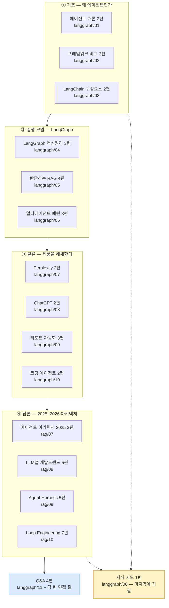

# `ai-agent` 카테고리 분할 설계

**작성일**: 2026-08-08
**단계**: 1단계 (분할 설계) — 승인 후 2단계 배치 변환 착수
**근거**: [요구사항 §13·§14](../specs/2026-08-07-tech-blog-requirements.md), 조사 에이전트 6기 실측

---

## 1. 요약

원본 **16편 878KB**를 발행본 **51편**으로 변환한다. 직전 카테고리(`rag`, 원본 9편 490KB → 발행 25편)의 두 배 규모다.

```
원본 878.4KB ─── 환산율 0.96 ───▶ 발행 예상 ~840KB / 51편
                                    편당 평균 16.5KB (허용 9.7~26.0)

mermaid 163개 ────── 전량 보존 ──▶ 163개
```

| 구분 | 원본 | 발행 |
| --- | ---: | ---: |
| `langgraph/00~11` | 12편 510.2KB | 33편 |
| `rag/07~10` | 4편 368.3KB | 20편 |
| Q&A 공통편 | (`11` + 각 편 면접 절) | 4편 |
| **합계** | **16편 878.4KB** | **51편** |

> Q&A 4편은 `langgraph/11`(50.7KB)과 나머지 15편의 면접 절에서 추출한 것이라 위 33+20에 중복 계상하지 않는다. 33 + 20 − 2(`11`은 Q&A로만 나감) = 51.

### 조사 방법과 신뢰도

| 항목 | 값 |
| --- | --- |
| 조사 방식 | 6기 병렬, 담당 파일 **전문 통독** |
| KB 측정 | H2 구간 UTF-8 바이트 실측. **코드펜스 상태 추적** 적용 |
| 검산 | 절별 KB 합 = 파일 크기 (diff 0), mermaid는 스크립트 + `grep -c` 2회 대조 |

**펜스 추적이 없었으면 설계가 통째로 틀렸다.** `rag/09`는 코드블록 안에 `## Problem` 등 가짜 H2가 4개, `rag/08`은 8개 있다. 초기 측정에서 `rag/09`가 58.6KB로 나왔으나(실제 98.5KB) 로케일·펜스 문제를 잡고 재측정했다.

---

## 2. 카테고리 전체 구조



**`00`(지식 지도)을 마지막에 쓰는 이유**: 본문 참조가 **60곳 이상**이고 전부 `01~10`을 가리킨다. 발행 slug가 확정되기 전에는 링크를 걸 수 없다.

---

## 3. 원본별 분할 설계

### 3-1. `langgraph` 12편 → 33편

| 원본 | KB | 편수 | series | 편별 구성 |
| --- | ---: | ---: | --- | --- |
| `00` 강의지도 | 20.8 | **1** | (독립) | 발행 실질 9.1KB. `rag/00`→`rag-knowledge-map.md` 선례와 동일 |
| `01` 개론·프레임워크 | 31.3 | **2** | `agent-fundamentals` | §1~§4 / §5~§6 |
| `02` CrewAI·Autogen | 45.5 | **3** | `crewai-autogen` | §1~§2 / §3 / §4~§6 |
| `03` LangChain·RAG | 47.1 | **2** | `langchain-fundamentals` | 22 / 17KB |
| `04` LangGraph 핵심원리 | 53.4 | **3** | `langgraph-core` | 19 / 14 / 20KB |
| `05` Agentic RAG | 53.4 | **4** | `self-correcting-rag` | 17 / 14 / 15 / 10KB |
| `06` 단일·다중 패턴 | 44.5 | **3** | `multi-agent-patterns` | 14.6 / 12.0 / 10.1KB |
| `07` Perplexity | 34.0 | **2** | `perplexity-clone` | 11.1 / 16.3KB |
| `08` ChatGPT 클론 | 37.9 | **2** | `chatgpt-clone` | 19.3 / 12.1KB |
| `09` 리포트 자동화 | 52.2 | **3** | `report-automation` | — |
| `10` 코딩 에이전트 | 39.4 | **2** | `coding-agent` | — |
| `11` 면접 커닝페이퍼 | 50.7 | **0** | → Q&A | 압축본 84%. §5 참조 |

**경계를 잡은 근거 중 설명이 필요한 것**

| 원본 | 결정 | 근거 |
| --- | --- | --- |
| `02` §4+§5+§6 한 편 | 쪼개지 않는다 | L518이 §4.4→§5를 직접 잇는다(`human_input_mode="NEVER"`가 §5 위험의 전제). §6.2 8행 중 4행이 앞 세 절을 근거로 든다. 합쳐도 14.1KB |
| `06` §6-3을 A편으로 | 크기 조정이 아니라 중복 제거 | **L162와 L756이 바이트 동일한 줄**이다(`workflow.compile(checkpointer=…, interrupt_before=["tool"])`). 원본 부록도 `CH03_02 \| §2-3, §6-3`으로 분산을 자인 |
| `07` 2편 (3편안 폐기) | 면접 절 이관 후 §5~§9가 16.3KB | 이관 전 22.1KB로 상한에 붙었으나 이관으로 해소 |

### 3-2. `rag/07~10` 4편 → 20편

| 원본 | KB | 편수 | series | 편별 KB |
| --- | ---: | ---: | --- | --- |
| `07` AI Agent 아키텍처 2025 | 67.1 | **3** | `agent-architecture-2025` | 17 / 20 / 19 |
| `08` LLM앱 개발트렌드 | 77.0 | **5** | `llm-app-trends` | 13 / 16 / 16 / 12 / 15 |
| `09` 2026 상반기 일하는 방식 | 100.9 | **5** | `agent-harness` | 20.1 / 13.7 / 17.1 / 16.7 / 14.3 |
| `10` Loop Engineering | 123.3 | **7** | `loop-engineering` | 12.2 / 14.4 / 12.8 / 10.6 / 16.7 / 15.8 / 21.0 |

**`rag/07`은 §5와 §7을 같은 편에 넣지 않는다.** 두 절이 무게중심이면서 성격이 정반대다 — §5는 도식 12개, §7은 표 11개 65행. 한 편에 넣으면 도식 편중과 표 편중이 한 글에 섞인다.

**`rag/09`·`10`은 절 하나가 이미 상한을 넘어 병합이 불가능하다.**

| 파일 | 최대 절 | KB |
| --- | --- | ---: |
| `rag/09` | §2 (2026.02) | **32.3** |
| `rag/10` | §4 (Loop 심화) | **43.7** |

나머지 절도 21~24.8KB라 서로 붙일 여지가 없다. 이것이 하한 4·5편을 5·7편으로 올린 이유다.

---

## 4. 교차 중복 처리 — 7건

파일 단위 조사만으로는 계속 놓친다는 것이 이번에 실증됐다. `survey-lg-b`가 브리프에 없던 `langgraph-modularization` 3편(57.4KB) 중복을 스스로 대조해 찾아냈다.

| # | 충돌 | 판정 | 처리 |
| --- | --- | --- | --- |
| 1 | `langgraph/05` ↔ 발행본 `agentic-rag-*` 2편 | **중복은 논지 3건뿐** | 발행본은 AgentExecutor, 원본은 StateGraph라 **코드가 한 줄도 안 겹친다.** Self-RAG·CRAG·Adaptive RAG **전량 신규 발행** |
| 2 | `langgraph/03·04` ↔ `langgraph-modularization` 3편 | 중복-완전 **6건** | 해당 6절만 제거하고 링크 |
| 3 | `rag/07 §5` ↔ `langgraph/06` | 층위가 다름 | **`rag/07`=패턴 카탈로그(개요·실패모드·자율성 축), `langgraph/06`=구현.** 계층형 팀 도식은 `rag/07`(10노드)에만 두고 `rag/08 §6-4`(8노드)는 도입 논리만 |
| 4 | `langgraph/01 §5-2`(13축) ↔ `02 §6.1`(12축) | **둘 다 유지** | 공통 축 8개, 각각 고유 8·4개. 합치면 **12항목 소실** |
| 5 | `langgraph/00` ↔ `11` | 역할 분담 | `00`=주제 인덱스(개념 계보·요약표 4종·통합 용어집), `11`=문답 인덱스. `00 §5-3`과 `11 §8-1`은 **6축 6값 전부 동일** |
| 6 | `langgraph/02 §5` ↔ `10 §9` | 중복-부분 40% | `02`=프레임워크 기능, `10`=아키텍처 판단. **양쪽 고유 항목이 각 2~3개씩** 있어 둘 다 유지 |
| 7 | `rag/09 §3-10` ↔ `rag/10 §1-19` (seed+fork) | 중복-부분 | 한쪽 본문 + 한쪽 링크 |

### 4-1. 중복 매트릭스 결과 (원본 16편 H2 × 발행본 31편)

| 지표 | 값 |
| --- | ---: |
| `중복-완전` 셀 | **13** |
| `중복-부분` 셀 | **41** |
| 중복 0인 원본 | 3편 — `lg/07`, `lg/10`, `rag/10` |
| 중복 0인 발행본 | 15편 (`search-engineering` **6편 전부**) |

**`search-engineering` 6편은 변환 시 대조 대상에서 제외한다.** 시그니처 9종(`Elasticsearch`·`BM25`·`형태소`·`역색인`·`nori`·`샤드`·`TF-IDF` 등) 전수 스캔 결과 실질 히트 0건이다.

### 4-2. ⚠️ 발행본 한 편에 16셀이 몰린다 — 정본을 고정한다

| 발행본 | 충돌 원본 | 완전 | 부분 |
| --- | --- | ---: | ---: |
| **`langgraph-parallel-multiagent`** | `lg/00·01·04·06`, `rag/07·08·09` | **4** | **12** |
| `agentic-rag-relevance-check` | `lg/01·03·05`, `rag/07` | 3 | 7 |
| `rag-pipeline-ingestion` | `lg/01·03` | 2 | 3 |

편별로 다르게 처리하면 **사이트 안에서 Supervisor 정의가 5번 나온다.**

> **규칙**: `langgraph-parallel-multiagent.md`를 정본으로 고정하고, 충돌하는 원본 7편은 전부 **"정의는 링크, 확장만 서술"**로 통일한다.

### 4-3. 매트릭스가 정정한 기존 판정 2건

| 대상 | 기존 판정 | 정정 | 처리 |
| --- | --- | --- | --- |
| `lg/08 §7-4` 팩토리 함수 | "전체 신규" | **중복-부분** — `subgraph-retrofit.md` L34~90(팩토리 함수로 감싸는 것이 첫 단계 + 인라인 vs 팩토리 5행 표) | 분할안 2편은 유효. **§7-4만 축약**하고 일반론은 링크 |
| `rag/09` Supervisor 8회 | 스캔 누락 | **중복-부분** — L107~139·L760~771이 발행본 L213~222와 겹침 | 고유("상태를 어디에 두는가" 논지 + Harness 대비표)만 남김 |

**해소된 미확인 1건**: `lg/02 §6.2`(무너지는 지점 8종) × 발행본 "흔한 실패 16종" → 양쪽 전수 대조 결과 **겹치는 항목 0개, 신규 확정**. `02`는 CrewAI/Autogen 프레임워크별 실패, 발행본은 LangGraph 모듈화 실패다.

**원본 간 중복 1건 추가 발견**: `rag/09 L760~771`의 `New Agent?` 노드가 `rag/07 §5-6`의 고유 항목으로도 기록돼 있다. 한쪽만 남긴다.

### 4-4. 매트릭스의 한계 — 변환 시 유의

| # | 한계 |
| --- | --- |
| 1 | **원본 16편 상호 간 중복은 범위 밖**이다(열이 발행본이라서). §4 표의 7건 + `lg/08 §3-1`↔`lg/06 §1-2`가 별도로 확인된 전부 |
| 2 | **"원본 고유 N개"의 세는 단위가 조사자마다 다르다** — 항목 단위와 논지 단위가 섞여 있다. **N을 편 간 비교에 쓰지 말 것** |
| 3 | `신규` 판정은 키워드 스캔 기반이라 **하한값**이다. 실제로 위 정정 2건이 그 틈에서 나왔다. **중복 0인 원본 3편도 변환 시 눈으로 한 번 더 볼 것** |

### ⚠️ F1~F4 라벨 충돌 — 반드시 해소할 것

`langgraph/05`와 발행본 `agentic-rag-relevance-check.md`가 **같은 기호를 다른 뜻으로** 쓴다.

| 기호 | `langgraph/05` §2 | 발행본 |
| --- | --- | --- |
| F1 | **불필요한 검색** | **검색 실패** |
| F2 | 무관 문서로 답변 강행 | 노이즈 희석 |
| F3 | 환각 통제 불가 | 근거 없는 확장 |
| F4 | **근거 자체의 부재** | **동문서답** |
| F5 | (없음) | 무한 재시도 |

상호링크를 걸면 카테고리 안에서 F2가 두 뜻을 갖는다. **발행본 5개 체계에 흡수하고 원본 고유 2개(불필요한 검색 / 근거 부재)를 F6·F7로 추가**한다.

---

## 5. Q&A 공통편 설계 — 4편

### 5-1. 왜 `langgraph/11`을 설명형이 아니라 Q&A로 내는가

사양 §12-4 표 1행은 `11`을 "H2 16개가 전부 기술 주제 → 설명형"으로 판정했다. **이 판정을 정정한다.**

| 판정 | H2 수 | KB | 비중 |
| --- | ---: | ---: | ---: |
| **압축본** (`00~10`에 이미 있음) | 14 | 41.5 | **84%** |
| 종합 | 1 | 2.8 | 6% |
| 신규 | 1 (제거 대상) | 2.3 | 5% |

순수 고유분은 **1.2KB**다. 설명형으로 내면 독자는 항상 `01~10` 발행본을 읽는 편이 낫다. 또 H3로 내려가면 12개 절이 `예상질문 → 답변요지` 표를 달고 있어(문항 65개, 13.7KB), 설명형이면 이 65행을 산문으로 풀어야 하는데 **CR-1.6("표를 산문으로 풀지 마라")과 정면 충돌**한다.

`11`의 산출물은 내용이 아니라 **문항 97개의 주제 축 재편성**이다.

### 5-2. 판정 단위를 내용과 문항으로 분리한다

"압축본은 싣지 않는다"를 문항에 그대로 적용하면 `11`에서 8문항만 남는다. 규칙이 자기모순이 되므로 단위를 나눈다.

| 대상 | 압축본일 때 | 근거 |
| --- | --- | --- |
| **내용** (근거표·도식·서술) | Q&A에 싣지 않고 **원문 편으로 링크** | 같은 표가 두 번 나오면 정본이 불분명 |
| **문항** (질문 그 자체) | **싣는다.** 답변은 3~5줄 + 원문 링크 | 문항이 검색 진입점. 빼면 Q&A가 성립 안 함 |

### 5-3. 문항 수급

```
00~10 면접 절 문항  약 220개
        ├── 11이 재편성해 가져간 것 ──▶ 11의 89문항 (다대일 압축)
        └── 11이 떨어뜨린 것 ────────▶ 70문항
11 고유 신규 ────────────────────▶ 8문항
```

| 대상 | 배치 |
| --- | --- |
| `11`의 97문항 − 제거 7 | **공통 Q&A** — 이미 주제축으로 중복 제거된 편성 |
| 누락 70개 중 **횡단** 약 15개 | 공통 Q&A로 편입 |
| 누락 70개 중 **문서-특정** 약 55개 | 해당 발행본 말미 `## 자주 묻는 질문` (CR-2.6). **편당 2~3문항 상한**, 초과 시 공통 Q&A로 |
| `03 §13`의 RAG 소재 9개 | `rag` 카테고리 소관 또는 제거 |

**공통 Q&A 총량** = 97 − 7 + 15 ≈ **105문항** × 0.65KB ≈ 68KB → **4편** (series `ai-agent-qna`)

### 5-4. 폐기 판정 — 예상질문은 옮기지 않는다

`langgraph/03·04·05`의 예상질문 29개를 전수 대조한 결과 **29/29 = 100%가 본문 재진술**이었다. 옮기면 Q&A 편이 본편 요약본이 되어 두 편을 다 읽은 독자에게 새 정보가 0이다.

| 분류 | 항목 | KB | 처리 |
| --- | ---: | ---: | --- |
| 예상질문 | 29 | 7.07 | **폐기** |
| ⓐ 지뢰 고유 | 5 | ~1.5 | 보존 (평서형으로 뒤집기) |
| ⓐ 지뢰 중복 | 15 | ~4.2 | 폐기 |
| ⓓ 30초 카드 | 9 | 6.19 | 보존 ("30초" 표현만 제거) |
| ⓑ+ⓒ | 7 | 1.98 | 제거 |
| **실질 기여** | **14** | **~7.7KB** | — |

> 면접 절 20.9KB가 통째로 Q&A로 넘어간다고 가정하면 안 된다. 실질은 **37%**다.

### 5-5. 사양 §12-4에 5번째 유형을 추가한다

기존 ⓐ~ⓓ 4종은 특수 블록만 덮고, **평이한 기술 Q&A가 어디에도 안 들어간다**(두 조사자가 독립적으로 28개·29개 보고). `ⓔ 기본 보존`을 신설하되, **본문 재진술이면 폐기**한다.

전수 대조 결과 ⓔ 57개 중 **55개(96%)가 본문 재진술**이었다.

| 출처 | ⓔ | 재진술 | 신규 |
| --- | ---: | ---: | ---: |
| `langgraph/03·04·05` | 29 | **29 (100%)** | 0 |
| `langgraph/06 §8-1` | 10 | **10 (100%)** | 0 |
| `langgraph/07 §10-1` | 8 | **8 (100%)** | 0 |
| `langgraph/08 §11-1` | 10 | 8 | **2** |
| **계** | **57** | **55** | **2** |

**예외 2건은 절을 횡단해 종합한 것**이라 본문 어디에도 그 정리가 없다. 폐기하지 말고 본문에 흡수한다.

| 문항 | 묶은 절 | 흡수 위치 |
| --- | --- | --- |
| 도구 선택 정확도를 어떻게 올렸나 | `08` §5-3(docstring) + §6-3(2단 구조) + §6-4(커스텀 `@tool`) | `08-A` 본문 1~2문장 |
| 비용을 어떻게 줄이겠나 | `08` §3(단일 유지) + §9-2(해시 캐싱) + §6-2(중복 이미지 차단) + §4-4(루프 상한) | `08-B` 본문 1~2문장 |

> 이 2건의 "종합" 판정은 문자열 대조가 아니라 **논지 대조**라 자동 검사로 재확인할 수 없다. 조사자의 독해 판단이다.

### 5-6. `rag/11` 이관 3건 — 행 번호 전건 검증 완료

| 기록 | 실측 | 질문 | 배치 |
| --- | --- | --- | --- |
| §2-1 (72~78행) | **일치** | AI 에이전트가 개발조직 구조를 어떻게 바꾸는가 | Q&A 편3 |
| §2-2 (80~86행) | **일치** | 팀 생산성을 AI로 어떻게 끌어올리는가 | Q&A 편3 |
| §2-5 (104~112행) | **일치** | 최근 관심 기술 — Agent Harness → Loop Engineering | `agent-harness` 시리즈 도입부 |

근거 절 5건(`rag/09 §5`, `rag/10 §5`, `rag/10 §4`, `rag/06 §9`, `rag/00 §4-1`)도 전건 실재 확인했다. **인벤토리에 오류 없음.**

단 `rag/09 §5`는 「면접 활용 포인트」 그 자체라 발행 제외 대상이고, 내용은 전부 §1~§4의 재포장이다. 근거를 재지목한다.

| 문답 | 기존 지목 | 대체 지목 |
| --- | --- | --- |
| 개발조직 구조 | ~~`09 §5`~~ | **`09 §2-11`**(역할 3층), **`09 §3-10`**, `10 §5` |
| 팀 생산성 | ~~`09 §5`~~ | **`09 §2-12`**(AX 4단계), **`09 §4-4`**(90일 로드맵), `rag/06 §9` |

---

## 6. 발행 전 처리 목록

### 6-1. 절 단위 제외

| 원본 | 절 | 사유 |
| --- | --- | --- |
| `langgraph/00` | §0 원본 파일 색인, §2 학습 경로 | 강의 운영 메타 |
| `langgraph/01` | §7 출처 구분, §9 다음 문서 | 네비게이션 |
| `langgraph/02` | §8 부록 출처 | 〃 |
| `langgraph/04` | **§13 원본 자료 처리 메모** | CR-1.2. PDF·노트북·CH 번호 메타 (API 키 값은 문서에 없음 — 원문 확인) |
| `langgraph/11` | §14 역질문 10개 | ⓑ. 단 「도입 전 확인할 10가지」 평서문으로 `00`에 살리는 선택지 있음 |
| `rag/07` | §1 문서 지도, §9 참고 링크, 부록 | 네비게이션·출처 대조 (부록 24행 전부 본문에 존재 확인) |
| `rag/08` | 부록 A(슬라이드 순서 100행), B, C | 발행 가치 0. 부록 C 17행 중 16행이 본문에 존재 |
| 전 파일 | 면접 절 | → Q&A |

### 6-2. 행 단위 수정 — 반드시 처리

| 원본 | 행 | 내용 | 처리 |
| --- | ---: | --- | --- |
| `langgraph/01` | 440 | `검색 시스템 구축 경력(TVING MongoDB·BTV Elasticsearch)` | **회사명 제거** |
| `langgraph/06` | 801 | `20~30명 규모를 6팀으로 나눠 총괄한 경험은…` | **삭제** |
| `langgraph/06` | 788 | mermaid 노드 `O["개발 총괄 (실장)"]` | → `조직 총괄` |
| `rag/09` | 463 | 프로모션 코드 `FASTCAMPUS-RAG-TEDDYNOTE` + Google Form URL | **삭제** |
| `rag/09` | 493~501 | 제3자 개인 프로필 표 (실명·전 직장 이력·구독자 수) | **CR-3.5 제거.** 출처 표기는 frontmatter `source`로 |
| `rag/10` | 362 | 제3자 GitHub PAT 유출 사건 지목 | 일반 통제 서술로 익명화 |
| `langgraph/02` | 275 | `output_file=r'C:\Users\user\new_post.md'` | 일반 경로로 |
| `langgraph/02` | 316·361·402·405 | 함수 본문이 `...`인 불완전 코드 | 채우거나 생략을 명시 |
| `langgraph/02` | 76·146·328·629 | `★ Insight` 블록 4개 (출력 스타일 마커가 원본에 박힘) | 제거 또는 인용문 전환 |

### 6-3. 시점 표기

| 원본 | 위치 | 문제 | 처리 |
| --- | --- | --- | --- |
| `rag/08` | L1047 제목 | `2025년 하반기 — **지금** 무엇에 배팅할 것인가` | "지금" 제거 |
| `langgraph/01` | L169·171 | GPT-4o 지식 컷오프, 128K/200K 토큰 | 2024년 기준임을 명시 |
| `rag/07`·`08` | Smithery 수치 | 4,572(2025.04) → 7,538(2025.07), **3개월 +65%** | 표 캡션에 시점 못박고 현재형 금지 |

**각 편 서두에 "2025년 N월~M월 자료를 정리한 것" 한 줄 고지**를 넣으면 상당수가 한 번에 해소된다. 원본이 이미 쓰는 패턴이다(`rag/07 §7-8` "2025년 초의 회의론").

### 6-4. 단정형 추정 하향 — `langgraph/08`

문서 안에서 서술 강도가 어긋나 있다.

| 위치 | 행 | 강도 |
| --- | ---: | --- |
| 도입부 | 9 | `~ 라우팅 에이전트**다**` (단정) |
| **근거 절** | **144** | `단일 에이전트로 **구현 가능하다**` (가능성) |
| 결론 | 743 | `ChatGPT의 **본질은** ~` (단정) |

OpenAI 내부 구현은 비공개다. **L9·L743을 L144 수준으로 하향**한다. 재작성 시 `구현 가능하다`의 약한 강도를 반드시 보존할 것 — 다듬다가 단정으로 바뀌면 결함이 악화된다.

### 6-5. 상호참조 오류 (원본 오류. 발행 시 수정)

| 원본 | 행 | 오류 | 실제 |
| --- | ---: | --- | --- |
| `rag/09` | 40 | `아래 §2-9에서 상술` | **§2-11** (§2-9는 A2A) |
| `langgraph/05` | 700 | `아래 §8에서 다룰 함정` | **§11 C3** |

### 6-6. ⚠️ 분할 시 파손되는 참조

| 원본 | 규모 | 조치 |
| --- | ---: | --- |
| `rag/07` §0 용어표의 `§` 참조 | **31행 전부** | 분할하면 전량 파손. **자동 검사에 안 잡힌다** |
| `langgraph/00` L73~75 | mermaid **노드 안**의 참조 | 링크로 못 바꾼다. **도식을 다시 그려야** |
| `langgraph/02` | 자기 참조 18곳 | §6은 반드시 마지막 편에 |

---

## 7. 저작권 축 — 해소됨

조사 중 "유료 강의 슬라이드 축자 인용"으로 보고된 항목이 다수 있었으나, **원본 md는 전부 저자가 학습·경험을 거쳐 직접 재구성해 쓴 글**임이 확인됐다. 재작성 대상은 없다. 전량 발행한다.

다만 **귀속 정확성** 때문에 처리할 것이 남는다. 공식 문서에서 온 것을 강의 창작처럼 표기하면 사실이 틀린다.

| 항목 | 처리 |
| --- | --- |
| `강의 근거 (CH0N)` / `[강의]`·`[보강]` 꼬리표(`08`에 41회) | CR-1.2. 꼬리표 제거, 내용은 본문으로 흡수 |
| LangChain 공식 저장소 유래 문구 (verbatim 확인) | 귀속을 `LangGraph 공식 예제(MIT)` / `공식 저장소 README`로 정정 |

### ⚠️ `langgraph/06`의 "핵심 코드" 두 곳이 전부 공식 예제다

문서가 스스로 핵심이라 부른 자리가 현재 `🎓 강의`로 귀속돼 있다. **귀속을 바꾸면 저작권 표기와 `강의` 금칙어가 동시에 해소된다.**

| 원본 서술 | 실제 출처 | 성격 |
| --- | --- | --- |
| L339 `이 문서에서 가장 중요한 코드 조각입니다` | Supervisor 프롬프트 — `hierarchical_agent_teams` / `agent_supervisor`(JS) / `agent_supervisor`(2024-01판) **3종 동시 일치** | 축자 |
| L577 `이 문서의 두 번째 핵심` | `create_team_supervisor` + 어댑터 3종(`enter_chain`/`get_last_message`/`join_graph`) | 파생 |

공식 유래 **6건 전부 `06`에 몰려 있다.** `07`·`08` 코드는 공식 코퍼스와 불일치다.

**검증 시 주의 2가지** (재현하려는 경우)

| 함정 | 증상 | 대응 |
| --- | --- | --- |
| 공식 문서 개편 | 현행 `agent_supervisor.md`는 `langgraph-supervisor` prebuilt로 재작성돼 `enter_chain`·`join_graph`·`intermixed`가 전부 소멸. `org:langchain-ai` 검색이 0건 | 커밋 이력에서 **2024-01-20판**을 받아 대조 |
| 문자열 리터럴 | 파이썬 `" … " " … "` 연결의 따옴표 때문에 축자 일치가 불일치로 나옴 | 따옴표·주석 기호·`f` 접두사 제거 후 공백 정규화 |

**한글 서술에는 공식 유래 가설이 통하지 않는다** — 한글 후보 9건 전부 불일치. 개념이 공식에서 왔어도 한국어 표현은 저자의 것이다.

---

## 8. 태그 설계

`frontmatter.ts`는 형식(`^[a-z0-9-]+$`)과 어휘(81종)만 검사한다. **"카테고리 슬러그 중복 금지"는 코드가 강제하지 않는다.**

선례 실측 — `rag` 카테고리 25편 중 **18편**이 `rag` 태그를 갖는다. 안 단 7편은 RAG가 주제축이 아닌 글이다.

| 결정 | 내용 |
| --- | --- |
| `ai-agent` 태그 | **에이전트 자체가 주제축인 편에만** 단다. 51편 일괄 부여 금지 — 태그 페이지가 카테고리 페이지의 복제본이 된다 |
| 주 사용 어휘 | `langgraph` `langchain` `multi-agent` `agentic-rag` `llm` `rag` `prompt-engineering` `context-engineering` `human-in-the-loop` `evaluation` `observability` `ai-automation` `ai-governance` `mcp` `python` `security` `api-design` `terminology` |
| 제약 | 편당 4개 권장(3~5), **같은 패싯 최대 2개** |
| 신규 태그 | 변환자는 추가하지 않는다. 후보와 근거만 기록 |

---

## 9. 배치 계획

톤 유지를 위해 배치 안에서는 순차 변환한다(§13-8).

| 배치 | 대상 | 편수 | 비고 |
| ---: | --- | ---: | --- |
| **B1** | `langgraph/01·02·03` | 7 | 첫 배치가 나머지의 기준. 완료 후 검토하고 넘어간다 |
| **B2** | `langgraph/04·05·06` | 10 | 중복-완전 6건 제거 + F 라벨 통일 적용 |
| **B3** | `langgraph/07·08·09·10` | 9 | 클론 4종 |
| **B4** | `rag/07·08` | 8 | 시점 고지 규칙 확립 |
| **B5** | `rag/09·10` | 12 | 최대 배치 |
| **B6** | Q&A 4편 | 4 | 전 배치 완료 후 — slug가 확정돼야 링크 가능 |
| **B7** | `langgraph/00` 지식 지도 | 1 | **맨 마지막.** 참조 60곳이 전부 앞 배치를 가리킴 |

배치마다 커밋하고 보고한다.

---

## 10. 검산 기준값

3단계 독립 검증이 대조할 값이다. **총합만 비교하면 이동과 유실을 구분할 수 없다**(CR-6.2).

| 항목 | 원본 실측 | 발행본 기대 | 비고 |
| --- | ---: | ---: | --- |
| mermaid 총계 | **163** | **162** | 아래 의도적 감소 1건 |
| `langgraph/00~02` | 19 | 19 | |
| `langgraph/03~05` | 21 | 21 | |
| `langgraph/06~08` | **27** | 27 | |
| `langgraph/09~11` | 14 | 14 | |
| `rag/07~08` | 37 | **36** | ↓1 |
| `rag/09~10` | 45 | 45 | |

### ⚠️ 의도적 도식 감소 1건 — 명시 승인 사항

계층형 팀 도식이 **세 곳**에 있다.

| 위치 | 노드 수 |
| --- | ---: |
| `rag/07 §5-7` | **10** |
| `rag/08 §6-4` | 8 |
| 발행본 `langgraph-parallel-multiagent.md` L237~245 | 8 |

**`rag/07`(10노드)만 남기고 `rag/08 §6-4` 도식은 제거**한다. `rag/08`은 도입 논리만 서술하고 링크한다.

> 이 감소를 설계서에 명시하지 않으면 3단계 검증이 **"도식 소실"로 반려**한다. `rag/07~08`의 기대값은 37이 아니라 **36**이다.

### 검증 명령

```powershell
npm test              # 36개 통과
npx tsc --noEmit      # 0
npm run build         # 0

# 금칙어 — 기대 0건
Select-String -Path "content\blog\ai-agent\*.md" -Pattern "면접|커닝페이퍼|암기용|화이트보드|이력서|강의|수강"

# 민감정보 — 기대 0건
Select-String -Path "content\blog\ai-agent\*.md" `
  -Pattern "히츠|야나두|TVING|티빙|BTV|허우용|채용|teddylee|teddynote|argus|FASTCAMPUS|실장"
```

### ⚠️ 자동 검사가 못 잡는 것 (SC-10·14-3)

| 결함 | 금칙어 | 빌드 | 링크검사 |
| --- | :---: | :---: | :---: |
| 도식 누락 | 통과 | 통과 | — |
| 들어오는 링크 0인 글 | 통과 | 통과 | 통과 — **없는 링크는 깨지지 않는다** |
| 표 항목 소실 | 통과 | 통과 | — |
| `rag/07` §0의 § 참조 31행 파손 | 통과 | 통과 | 통과 |

**개수 대조**와 **존재 확인**으로만 잡힌다.

---

## 11. 변환 브리프에 반드시 넣을 금지선

| # | 금지선 | 근거 |
| --- | --- | --- |
| 1 | **"중복이다"라는 인상으로 도식·표를 지우지 마라. 항목 수를 세라** | 직전 카테고리에서 같은 실수를 두 번. mermaid 9노드 vs 표 7행 |
| 2 | 아래 5쌍은 **어느 쪽도 지우지 마라** | `03 §2`(8노드/9행) · `03 §12`(5/6) · `04 §3-1`(5/3) · `04 §8-4`(6/3) · `05 §1-1`(5/11) |
| 3 | `rag/09 §2-3` 표(11행)는 mermaid(6노드)보다 **5항목 많다** | 삭제 금지 |
| 4 | `rag/10 §1-12` mermaid(5리프)와 표(4행)는 **양쪽에 고유 항목** | 둘 다 유지 |
| 5 | `langgraph/06 §3-3` 도식은 노드 8개로 발행본과 같지만 **겹치는 건 3개** | 나머지 5개 소실 주의 |
| 6 | `11 §375`·`§278~280` 답변 작성 시 `06 §7`을 근거로 삼되 **조직 규모·직함·팀 수는 옮기지 마라** | 근거 추적 경로가 개인 식별로 이어진다 |
| 7 | `08 L144`의 `구현 가능하다` **강도를 보존**하라 | 다듬다가 단정이 되면 논리 결함이 악화 |

**삭제해도 손실 0으로 확인된 것** (세어서 확인함): `rag/10 §3-5` 표(§4-2(1) 표 1행에 완전 포함), `rag/10 §2-14` 표(§2-7의 부분집합).

---

## 12. 확정된 범위 판단

### 12-1. 전량 발행 — 2026-08-08 사용자 확정

원본 md는 전부 저자가 학습·경험을 거쳐 **직접 재구성해 쓴 글**이다. 따라서 아래 두 건은 축소하지 않고 전량 발행한다.

| 항목 | 규모 | 처리 |
| --- | ---: | --- |
| `rag/10`의 2026.06 파생분 (§3·§4·§5) | 53.7KB, 도식 10개 | **전량 발행.** `rag/10`은 7편 구성(경로 A) |
| `rag/09`·`10`의 제3자 시스템 내부 식별자 | 6.2KB | **전량 발행.** `rag/10`은 4편을 유지(드롭 안 함) |

**단 원본의 자료 처리 메모는 발행본에서 뺀다** — `rag/10:1838`의 저작권 주의 인용 블록, `rag/10:927`의 원본 구성 고지는 CR-1.2(원본 메타 인용문 제거) 대상이다. 글의 내용이 아니라 원본을 다룬 기록이다.

### 12-2. 수치 불일치 — 잠정 처리

| 원본 | 값 |
| --- | --- |
| `rag/09:1121` | MRCR v2 8-needle 명시. Opus 4.6 → 256K **93.0** / 1M **76.0** |
| `rag/10:280` | 벤치마크 미표기. Opus 4.6 → 256K **91.9%** / 1M **76.3%** |

같은 모델·같은 주장인데 값이 다르다. 그대로 두면 한 블로그에 상충 수치가 나간다.

**처리: 벤치마크명이 명시된 `09` 값을 채택**하고 `10`을 그에 맞춘다. 출처가 특정된 쪽이 검증 가능하기 때문이다. 변환 시 해당 표 캡션에 벤치마크명을 함께 적는다.

---

## 부록 A. 조사 산출물 위치

세션 스크래치패드에 있다. **세션 종료 시 사라진다** — 필요한 값은 이 문서에 옮겨 두었다.

```
survey-lg-a.md            langgraph/00~02
survey-lg-b.md            langgraph/03~05 (+ 인용 검사, 72.9KB)
survey-lg-c.md            langgraph/06~08
survey-lg-c-followup.md   Q&A 인벤토리 57항목
survey-lg-d.md            langgraph/09~11
survey-lg-d-2.md          문항 인벤토리, 누락 70문항
survey-rag-e.md           rag/07~08
survey-rag-f.md           rag/09~10
duplication-matrix.md     중복 매트릭스 (작성 중)
```
