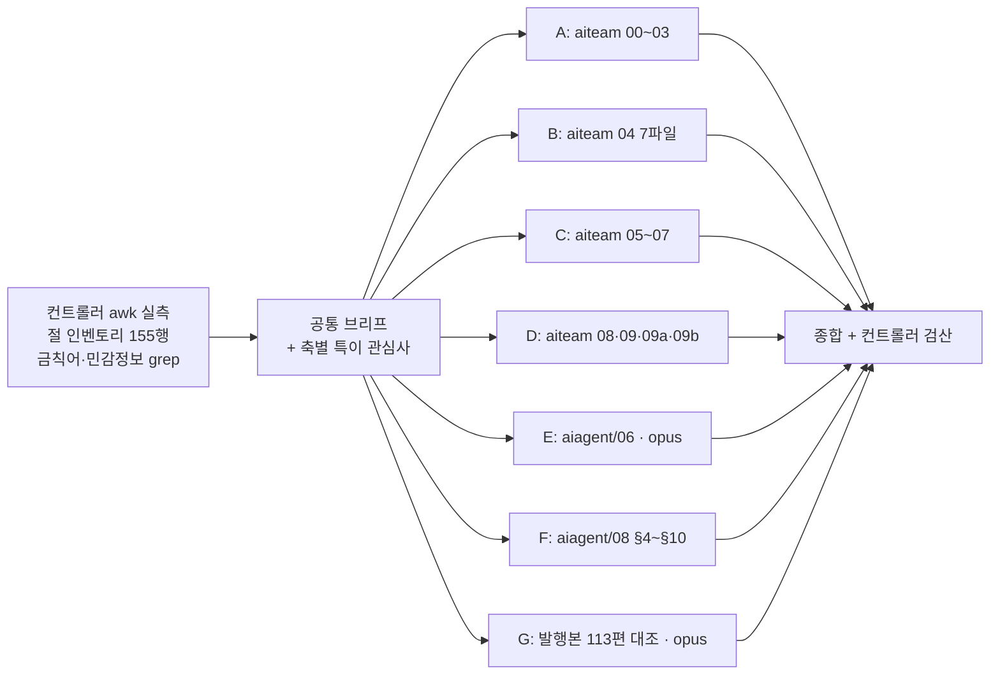
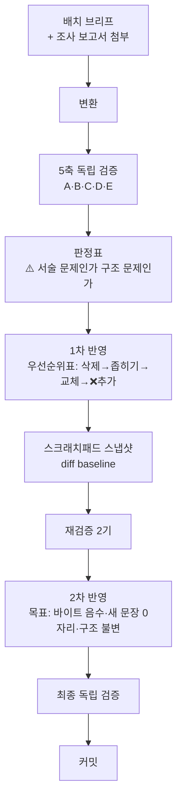

# `ai-transformation` 카테고리 분할 설계

**작성일**: 2026-08-14 · **상태**: 승인 대기
**선행**: `agentic-coding` 31편 완료(B1~B9) · 현재 발행 **113편** · sitemap 174 URL

---

## 1. 요약

| 항목 | 값 |
| --- | ---: |
| 원본 총량 | **199,128 B** (`aiteam/` 18파일 118,972 + `aiagent/06` 63,181 + `aiagent/08 §4~§8·§10` 16,975) |
| 발행 제외 | **약 35,000 B** (면접·구직 절 · 편집용 메타 · 미완성 절) |
| 가용분 | **163,515 B** (절 단위 제외 31,437 + 1인칭 열·행 제거 4,176) |
| 팽창률 | **1.20** (`agentic-coding` 설계서 §4-0 채택값 승계) |
| **발행 편수** | **11편** (본편 9 · Q&A 1 · 지도편 1) |
| 예상 총량 | 약 **221 KB** |

### 조사 방법과 신뢰도

**조사를 7축으로 나눴고, 기계적 실측은 컨트롤러가 직접 뽑아 브리프에 첨부했다.**



| 축 | 담당 | 티어 | 산출 | 컨트롤러가 정정한 것 |
| :---: | --- | :---: | ---: | --- |
| A | `aiteam/00~03` | haiku | 25.2 KB | — |
| B | `aiteam/04_영역별` 7파일 | haiku | 23.2 KB | **편 구성 산술** — 「3편 권장」이 하한 미달 |
| C | `aiteam/05~07` | haiku | 7.0 KB | — |
| D | `aiteam/08·09·09a·09b` | haiku | 10.0 KB | — |
| E | `aiagent/06` | **opus** | 80.1 KB | — |
| F | `aiagent/08 §4~§10` | haiku | 9.5 KB | `06` 대조 미수행 → 컨트롤러가 실측 |
| G | 발행본 113편 | **opus** | 71.0 KB | — (**G가 컨트롤러 브리프의 오류를 잡았다**) |

> **티어를 두 갈래로 나눈 근거는 난이도가 아니라 「실패가 감지되는가」다.**
> A~D·F는 같은 제목을 가진 절을 **서로 다른 조사자에게 배정**하고 상대 파일을 열지 못하게 해서,
> 두 축자가 어긋나면 오류가 드러나게 했다. E·G는 그런 교차 검증 상대가 없어 상위 티어로 올렸다.

---

## 2. ⚠️ 이 카테고리가 앞의 9배치와 근본적으로 다른 점 — 3건

**설계 규칙이 여기서 갈린다. 앞 카테고리의 절차를 그대로 적용하면 안 되는 자리다.**

| # | 사실 | 앞 카테고리 | 이번 카테고리 |
| --- | --- | --- | --- |
| **1** | **`aiteam/` 18파일 전체에 mermaid 0개** (`aiagent/06`은 11개, `08`은 10개) | 「원본 도식을 발행본이 옮겼는가」를 **총계로 검산**했다 (도식 85→84 사건) | **옮길 도식이 없다. 전부 새로 그린다.** 검산 축이 「총계 일치」가 아니라 **「새 도식의 근거가 본문에 실재하는가」**로 바뀐다 |
| **2** | **`aiteam/` 13파일에 실명 `허우용` 27자리 · `야나두` 2자리.** 절 제목이 「나의 차별점」·「입사 후 실천」·「허우용 실증 자산 → 팀 이식」 | 강의 정리라 **주체 치환**이 최대 작업(「강의가 ~한다」 32자리) | **구직용 자기 PR 문서다.** 문자열 치환으로 끝나지 않는다 — **절의 존재 이유가 「저자가 이걸 할 수 있다」인 경우 3인칭으로 옮기면 남는 게 없다.** §6에서 별도 규칙으로 다룬다 |
| **3** | **`aiteam/` 개별 파일이 2.7~13.9 KB로 전부 하한 미달이거나 턱걸이** | 큰 파일을 **쪼갰다** | **묶어야 한다.** 분할표의 근거가 「어디서 자를까」가 아니라 **「무엇이 한 편으로 묶이나」**다 |

> **`aiagent/06`·`08`은 3번에 해당하지 않는다** — 63 KB·17 KB로 쪼개는 쪽이다.
> **한 카테고리 안에서 묶는 작업과 쪼개는 작업이 동시에 일어난다.**

### 2-1. 두 원본의 출처 위생이 정반대다 — 같은 규칙으로 다루면 안 된다

| 원본 | 출처 표기 | 처리 규칙 |
| --- | --- | --- |
| **`aiteam/07`** 기업 사례 11개 | **전수 표기** — CNBC·Fortune·GitHub Blog·Byline·CIO Korea·if(kakao)25. **반례까지 명시**(Klarna 재채용 선언 · Duolingo 평가규칙 철회 · Anthropic 스킬 침식 우려) | 그대로 살린다. **반례가 이 카테고리의 차별점이다** |
| **`aiagent/06`** 정량 수치 9행 | 방어 문장 **7자리 전부에 금칙어 `강의`가 용접**돼 있다 | 축자 이전 **전건 불가.** §7의 치환 서식을 쓴다 |
| **`aiteam/06`** 로드맵·성숙도 | 성숙도 3단계·90일 로드맵은 **자체 정의, 외부 인용 없음** / 실패요인 5종은 **전수 표기**(MIT·McKinsey·GitClear·MS·Pragmatic Eng) | 자체 정의 부분에 **「이 글의 정리다」 귀속**을 붙인다 (금지선 14) |

---

## 3. 분할표 — 11편

**측정 기준은 raw(frontmatter 포함) bytes. 예상 KB는 ±15% 오차를 갖는다.**

| # | slug | 무엇을 다루나 | 원본 | 가용 B | 예상 KB |
| ---: | --- | --- | --- | ---: | ---: |
| 1 | `builder-to-orchestrator-shift` | 운영철학 3단 모델 · 역할 재정의 · 거버넌스 · **기업 사례 11개** | `01` + `02` + `07` | 21,385 | **25.7** |
| 2 | `sdlc-human-gates` | SDLC 6단계 사람 게이트 + 개발·QA·배포 영역 | `03` + `04`(개발·QA검증·배포_운영) | 20,500 | **24.6** |
| 3 | `discovery-to-growth-tooling` | 기획·디자인·퍼포먼스마케팅·경쟁사분석 | `04`(기획_요구사항·디자인·퍼포먼스마케팅·경쟁사분석) | 16,078 | **18.8** |
| 4 | `enablement-infra-and-maturity` | n8n·지식관리·MCP 팀 공유 + 성숙도·로드맵·KPI·실패요인 | `05` + `06` | 13,724 | **16.5** |
| 5 | `lean-three-layer-harness` | 3-레이어 아키텍처 + Skills 설계 + LLM wiki 템플릿 | `09` + `09a` + `09b` | 20,481 | **24.6** |
| 6 | `department-agent-blueprint` | 7개 부서 지도 + 공통 설계 패턴 10종 + 용어 33개 | `aiagent/06` §0·§1·§2 | 17,279 | **20.7** |
| 7 | `department-automation-frontline` | 마케팅·영업·고객지원·인사 4개 부서 | `aiagent/06` §3~§6 | 20,819 | **25.0** |
| 8 | `department-automation-backoffice` | 재무·법무·경영지원 3개 부서 + 업무 분해 체크리스트 | `aiagent/06` §7~§10 | 19,224 | **23.1** |
| 9 | `agent-definition-by-department` | 6개 부서 정의서 — 위임 흐름 도식 · 판단축 · 안전장치 · 프롬프트 기법 | `aiagent/08` §4~§8·§10 | 14,000 | **16.8** |
| 10 | `ai-transformation-qna-*` | Q&A | `08_면접` §3 9문항 + 각 편 | — | **~15** |
| 11 | `ai-transformation-knowledge-map` | 지도편 — 카테고리를 닫는다 | `00 §1` 골격 + 재작성 | — | **~14** |

**편1~9 가용 합계 163,515 B × 1.2 = 196,218 B (191.6 KB) · 편10·11 약 29 KB · 총 약 221 KB.**
**하한 13.3 KB 전건 통과.**

> **검산**: 원본 199,128 − 절 단위 제외 31,437 − 1인칭 열·행 제거 4,176 = **163,515 B**.
> 세 항이 편1~9 가용 합계와 정확히 맞는다. **잔차로 정의된 항이 없다**(금지선 10).

### 3-1. slug 근거 — 실측된 명명 관례를 따른다

| 관례 (조사 G 실측, 113편) | 값 | 이 설계의 준수 |
| --- | --- | --- |
| 단어 수 | 3~4단어가 **88%**(100/113), 6단어 이상 0편 | 전 편 3~4단어 |
| 아라비아 숫자 | **0편** (수는 영문 수사) | 숫자 미사용 |
| 품사 | 압도적 **명사구** | 전 편 명사구 |
| 대소문자 | 전부 소문자 + 하이픈, 예외 0편 | 준수 |
| 지도편 | `*-knowledge-map` 또는 `*-map-*` | `ai-transformation-knowledge-map` |
| Q&A 시리즈 | `<카테고리>-qna-<주제>` | `ai-transformation-qna-*` |

**⚠️ 충돌 회피** — 아래 어휘는 인접 카테고리가 이미 선점했다. **쓰지 마라**:
`*-adoption-*`(`team-adoption-roi`·`enterprise-ai-adoption-actions`) · `*-org-*`(`dev-org-transfer`) ·
`*-team-operations`(`agent-team-operations`) · `*-catalog`(`thirty-agent-catalog`·`agent-pattern-catalog`) ·
`*-governance`(3개 카테고리에서 사용)

**비어 있는 어휘**(113편 slug에 0회): `maturity` `roadmap` `enablement` `orchestration` `department` `handoff` `contract` `escalation` `stage` `gate` `charter` `playbook` — **위 slug들이 이 목록에서 골라졌다.**

---

## 4. 발행 제외 — 절 단위 확정

| 원본 | 절 | 바이트 | 사유 | 남길 것 |
| --- | --- | ---: | --- | --- |
| `aiteam/00` | **전량** | 5,672 | 편집용 메타(진행 상태·작성 규약·이직 트랙 링크) | **§1 「살아있는 목차」의 구조만** 편11 지도편 골격으로 |
| `aiteam/01` | §4 일부·§5 | ~1,300 | 「자기소개·면접 톤」·「면접 대비 미리보기」 | §4의 리더십 4개 항목(L46~48)은 유지. **L49 「10인 팀 구성표」 삭제** |
| `aiteam/05` | §6 | 1,555 | 「실증 자산 ↔ 인프라 매핑 (면접용)」 | **§1~§5가 이 절을 참조하지 않는다** — 제외해도 무너지지 않음 (조사 C 확인) |
| `aiteam/06` | §5 | 868 | 도메인 변주 — **미완성** (TODO 2건) | 없음 |
| `aiteam/07` | §5 | 2,254 | 「면접에서 인용하기 좋은 한 줄 사례 5개」 | **5개 전부 §1·§4에서 재인용 — 신규 사례 0개.** 제외 시 손실 0 (조사 C 확인) |
| `aiteam/08` | **전량** | 11,004 | 면접 스토리텔링 | **§3의 9문항만** 편10 Q&A 문항 소스로 |
| `aiteam/09` | §4 | 676 | 「허우용 스택에 실제 셋업」 | §1~§3은 유지 가능 (신뢰도만 약화, 조사 D 확인) |
| `aiagent/06` | §11 | 3,841 | 면접 활용 포인트 | **§11-1 카드 3개 전부가 본문에 축자 수준으로 존재 → 손실 0** (조사 E 확인) |
| `aiagent/06` | §12 | 1,396 | 인용 시 주의 | 방어 문장은 **본문 4자리에 남는다**(§7 참조) |
| `aiagent/08` | §9 | 2,871 | 개발기술 4종 — **`agentic-coding` 소속** | 이미 `dev-org-transfer.md`로 발행됨 |

**제외 합계 약 31,400 B** + 1인칭 열·행 단위 제거분 약 3,600 B = **약 35,000 B**

---

## 5. 교차 중복 판정 — 소재군 10개

**조사 G가 발행본 113편 전수 대조로 판정했다.**

| # | 소재군 | 판정 | 처리 |
| ---: | --- | --- | --- |
| 1 | AX 운영철학 (`01`) | **중복-부분** | `AX`·`오케스트레이터`는 발행됐으나 **소프트웨어 에이전트 층위**. 원본은 **사람 직무·조직 헌법 층위**. 도입부에서 층위 차이를 명시 |
| 2 | 조직 구성·거버넌스 (`02`) | **중복 없음** | `NIST` 0 · `이네이블먼트` 0 · `변화관리` 0 |
| 3 | 워크플로 파이프라인 (`03`) | **중복-부분(동음이의 경계)** | `사람 게이트` 8건은 전부 **에이전트 루프 종료조건**. 원본은 **SDLC 6단계 승인 지점** — 같은 말이 다른 것을 가리킨다 |
| 4 | 영역별 AI 활용 (`04`) | **중복 없음** | `퍼포먼스마케팅` 0 · `경쟁사분석` 1(무관) |
| 5 | n8n·지식관리 (`05`) | **중복 없음** (§3 MCP 제외) | `n8n` 0 · `사내 위키` 0 · `프롬프트 라이브러리` 0 |
| 6 | **도입 로드맵·성숙도 (`06`)** | ⚠️ **중복-부분 (위험 최대)** | **「첫 90일에 할 일」이 발행본 7편의 정착된 마무리 절 서식이다.** §7-2 참조 |
| 7 | 기업 사례 (`07`) | **§1 중복 없음 / §2~§4 중복-부분** | Klarna·Shopify·당근·올리브영 전부 미발행. §2 역할재정의는 `02 §1`과 통합 |
| 8 | 린 아키텍처 (`09`·`09b`) | **중복 없음** | `3-레이어` 0 · `consolidation` 0 · `LLM wiki` 0 |
| 9 | 부서별 자동화 (`aiagent/06`) | **중복-부분** | 부서명 7개는 0건이나 **영업부 에이전트 4종 이름이 `collaboration-patterns-isolation.md`에 축자로 존재** |
| 10 | 부서 카탈로그 (`aiagent/08`) | ⚠️ **중복-완전 1건** | §5-1 참조 |

> ⚠️ **9번은 1차 판정을 정정한 것이다.** 부서명 grep만으로는 「완전 미발행」이 나오지만
> **에이전트 이름**으로 다시 검색하면 겹친다. **문자열 하나로 판정을 끝내지 마라.**

### 5-1. ⚠️ 중복-완전 1건 — 30종 명부는 다시 싣지 않는다

`aiagent/08 §2` L142~171과 발행본 `agentic-coding/thirty-agent-catalog.md` L180~211이 **표 머리글·행 순서·셀 내용까지 축자 일치**한다(표본 3자리 전건 확인).

**그러나 배정 범위는 §2가 아니라 §4~§8·§10이고, 그 고유 내용은 미발행이다:**

| 부분 | 내용 | 발행본 히트 | 판정 |
| --- | --- | --- | --- |
| **N-1 조직도와 위임 흐름** | 부서별 mermaid. 화살표에 **인계 조건 라벨**(`"등급 확정 후 등록"`·`"미팅 예정 감지"`) | **0건.** 발행본 도식은 부서→에이전트 **단방향 트리**로 인계 화살표가 없다 | **미발행** |
| **N-2 판단축·산출형식·안전장치** | `lead-scorer / Fit 3축 40점 + Engagement 3축 60점 / … / 점수보다 근거를 우선 서술하도록 지시` | `명시된 안전장치` 1건 — `dev-org-transfer.md:67`, **§9(개발기술)분만** | **§4~§8·§10분 미발행** |
| **N-3 프롬프트 설계 기법** | `가중치를 표로 못박아 총합 100을 강제` · `30일 이상 미접촉 리드는 자동 -20점` · `다음 액션 없이는 종료 금지` | **5개 문자열 전부 0건** | **전량 미발행** |

**⇒ 편9는 발행한다. 단 30종 명부는 싣지 않고 `thirty-agent-catalog.md`로 링크한다.**
**편9의 실질 고유값은 N-1 위임 흐름 도식과 N-3 프롬프트 기법이다.**

### 5-2. ⚠️⚠️ 30에이전트 세트가 **셋으로 갈린다** — 이 카테고리 최대의 혼동 위험

| 세트 | 출처 | 부서 편성 | 표기 |
| :---: | --- | --- | --- |
| **A** | 발행본 `scaling-routing-collapse.md` L324~332 | 마케팅5·영업5·CS4·재무4·인사4·**기획**4·**개발**4 | 한글 기능명 |
| **B** | 발행본 `thirty-agent-catalog.md` = 원본 `aiagent/08` | 영업5·마케팅5·고객지원4·인사노무4·재무회계4·**개발기술**4·**기획전략**4 | 영문 ID |
| **C** | 원본 `aiagent/06 §1` — **미발행** | 마케팅5·**영업4**·고객지원4·인사4·재무4·**법무**4·**경영지원**5 | 한글 기능명 |

**총계는 셋 다 30인데 편성이 다르다.** C에는 **법무부·경영지원부**가 있고 **기획·개발이 없다.**

> **선례가 이미 있다.** `thirty-agent-catalog.md` L150~166이 「개수가 같다고 같은 세트는 아니다」라는 절을
> 통째로 들여 A≠B를 밝혀 두었다. **편6에서 C를 낼 때 같은 처리를 반드시 하라.**
> 하지 않으면 독자가 세 표를 같은 조직도의 판본으로 읽는다.

---

## 6. ⚠️ 1인칭·구직 맥락 제거 — 이번 카테고리의 최대 작업량

**`agentic-coding`의 §6(출처·근거 주체 규칙)에 대응하는 자리다. 성격이 다르다.**

| | `agentic-coding` | **`ai-transformation`** |
| --- | --- | --- |
| 문제 | 「강의가 ~한다」 주체 표기 32자리 | **실명 27자리 + 절 구조 자체가 자기 PR** |
| 처방 | 주체 치환 | **치환으로 끝나지 않는다 — 절의 존재 이유를 다시 세워야 한다** |

### 6-1. 3층 처리 규칙

| 층 | 형태 | 처리 | 예 |
| :---: | --- | --- | --- |
| **①** | 실명·회사명 단독 출현 | **삭제** | `허우용(Ted)` → 삭제 |
| **②** | 표의 「나의 현재 위치」 **열** | **열 전체 삭제, 나머지 열은 유지** | `01 §2` 3단 모델 — **좌측 「무엇」 열만 남기면 일반 방법론**(조사 A 판정) |
| **③** | 절 전체가 자기 PR | **절 제외.** 단 **제외 전에 그 절이 다른 절의 근거인지 확인** | `05 §6`(참조 0 → 안전) vs `09 §4`(§1~§3이 L14·L43에서 참조 → 신뢰도 약화 감수) |

### 6-2. ⚠️ 「입사 후 실천」 절 — 파일마다 밀도가 다르다

`04_영역별` 7파일 중 **퍼포먼스마케팅·경쟁사분석에는 이 절이 없다**(조사 B 실측).
**7파일을 같은 규칙으로 처리하면 안 된다.** 절이 있는 5파일만 제거 대상이다.

### 6-3. 제거 후 남는 것을 반드시 세라

**제거가 분량을 무너뜨리는지 편별로 검산한다.** `04_영역별`은 개별 파일이 2.7~8.6 KB이므로
「입사 후 실천」을 걷으면 하한 미달이 심해진다. **분할표 §3의 편2·편3 배정이 이 계산을 이미 반영했다.**

---

## 7. 출처·근거 규칙

### 7-1. ⚠️ `aiagent/06` 정량 수치 — 방어는 사라지지 않는다. 다시 써야 할 뿐이다

**앞 배치의 이월 기록(「방어 3자리가 §12 제외로 사라진다」)은 절반만 참이었다.**

| # | 줄 | 소속 | 발행 시 | 축자 |
| ---: | --- | --- | :---: | --- |
| 1 | L419 | §4-6 H3 제목 | **생존** | `### 4-6. 강의가 제시한 정량 지표` |
| 2 | L421 | §4-6 리드 | **생존** | `아래 수치는 강의 교재가 제시한 예시이며 검증된 일반값이 아니다` |
| 3 | L821 | §8-7 H3 제목 | **생존** | `### 8-7. 강의가 제시한 비용 비교` |
| 4 | L823 | §8-7 리드 | **생존** | `아래 수치도 강의 교재의 예시다` |
| 5 | L1021 | §11 표 행 | 소멸 | — |
| 6 | L1058 | §12 표 행 | 소멸 | — |
| 7 | L1065 | §12 인용문 | 소멸 | — |

**방어는 본문에 4자리 남는다. 「출처 없는 성과표만 남는」 상태는 발생하지 않는다.**
**단 7자리 전부에 금칙어 `강의`가 박혀 있어 축자 이전은 전건 불가하다.**

#### 치환 서식 — 발행본에 이미 있다. 새로 발명하지 마라

`agentic-coding/automation-scope-criteria.md` **L191**을 그대로 따른다:

> `> **위 두 사례의 시간 수치는 원 자료가 대비용으로 제시한 예시**이며 이 글이 측정한 값이 아니다. … 원 자료 작성 기준일은 2026-07-26이다.`

| 요소 | 적용 |
| --- | --- |
| 금칙어 회피 | `강의 교재` → **`원 자료`** |
| 화자 분리 | `이 글이 측정한 값이 아니다` — §12의 역할을 한 문장이 대신한다 |
| 기준일 | **`06` L3의 작성 기준일도 `2026-07-26`으로 동일** — 그대로 쓸 수 있다 |

### 7-2. ⚠️ 「첫 90일에 할 일」은 발행본의 정착된 서식이다 — 편 주제로 쓰지 마라

발행본 **7편**이 마무리 절에서 동일한 3열 표를 쓴다: `| 주장 | 조직에 미치는 함의 | 첫 90일에 할 일 |`
(`agent-harness-architecture:318` · `harness-five-primitives:309` · `enterprise-ai-adoption-actions:283` ·
`loop-antipatterns-and-checklist:279` · `loop-engineering-basics:241` · `self-evolving-harness-governance:249` 외)

**`aiteam/06`의 「90일 도입 로드맵」을 편 제목·H2로 올리면 서식과 주제가 충돌한다.**
편4에서는 **「단계별 도입 순서」**로 표현을 바꾸고, 마무리 절의 3열 표 서식은 그대로 쓴다.

### 7-3. `aiteam/02` 외부 프레임워크 인용 — 표기를 통일한다

| 형태 | 사례 | 처리 |
| --- | --- | --- |
| `[단체명](URL)` | SO Leaders · Thoughtworks · AI Alliance · RedMonk(DORA) | 유지 |
| 기관명만 (링크 없음) | **NIST RMF · EU AI Act · SO 2025 · GitClear** | **발행 시 공식 URL을 확보하거나, 확보 못 하면 「원 자료가 근거로 든 기관」으로 귀속을 낮춘다** |

---

## 8. 태그 설계

### 8-1. ⚠️ 패싯 C는 **17종**이다 — 7종이 아니다

`content/blog/tags.ts` **L77** 주석 축자: `/** 패싯 C — AI/LLM 개념. 벤더·모델명은 넣지 않는다 — 시간이 지나면 죽는다 (17) */`

**패싯 C 전량**: `claude-code` `ai-agent` `multi-agent` `ai-governance` `ai-automation` `context-engineering`
`prompt-engineering` **`rag` `llm` `agentic-rag` `embedding` `vector-database` `evaluation`
`human-in-the-loop` `model-serving` `knowledge-graph` `machine-learning`**

> **이 오류는 컨트롤러 브리프가 만든 것이고 조사 G가 잡았다.** 7종으로 계산하면
> `["claude-code","ai-governance","llm","org-design"]`이 통과로 보이지만 **실제로는 C 3개라 위반**이다.

### 8-2. ⚠️ 패싯 D도 상한 2다 — 이 카테고리에서는 D 초과가 C 초과만큼 위험하다

`org-design` · `engineering-leadership` · `career` · `team-building` · `product-strategy` 를 셋 붙이기 쉽다.
**발행본 113편에서 패싯 C 위반은 0건, B·E 위반은 5건이다** — C 규칙은 지켜져 왔으므로
`ai-transformation`이 C를 3개 다는 첫 카테고리가 되면 눈에 띈다.

### 8-3. 편별 태그 배정 — 전건 패싯 검산 완료

| 편 | 태그 | 패싯 검산 |
| ---: | --- | --- |
| 1 | `org-design` `engineering-leadership` `ai-governance` `ai-automation` | D2 · C2 ✅ |
| 2 | `human-in-the-loop` `ai-automation` `engineering-leadership` `ci-cd` | C2 · D1 · B1 ✅ |
| 3 | `ai-automation` `prompt-engineering` `product-strategy` `data-driven` | C2 · D2 ✅ |
| 4 | `knowledge-management` `mcp` `ai-automation` `data-pipeline` | D1 · A1 · C1 · B1 ✅ |
| 5 | `claude-code` `knowledge-management` `mcp` `ai-automation` | C2 · D1 · A1 ✅ |
| 6 | `ai-automation` `human-in-the-loop` `org-design` `troubleshooting` | C2 · D1 · B1 ✅ |
| 7 | `ai-automation` `human-in-the-loop` `org-design` `security` | C2 · D1 · B1 ✅ |
| 8 | `ai-automation` `multi-agent` `org-design` `observability` | C2 · D1 · B1 ✅ |
| 9 | `multi-agent` `ai-agent` `org-design` `engineering-leadership` | C2 · D2 ✅ |
| 10 | `org-design` `career` `ai-governance` `ai-automation` | D2 · C2 ✅ |
| 11 | `org-design` `engineering-leadership` `ai-automation` `knowledge-management` | **D3 ⚠️** → `engineering-leadership` 제외 후 `ai-governance` 투입 = D2·C2 ✅ |

**새 태그를 만들지 않는다.** 0편 태그 중 `team-building` `career` `product-metrics` `ci-cd` `deployment`가
이 카테고리에서 처음 열린다 — **어휘에 있으므로 빌드는 통과한다.**

---

## 9. 배치 계획

**9배치로 검증된 절차를 그대로 쓴다.**



| 배치 | 편 | 근거 |
| :---: | --- | --- |
| **T1** | 편6·편7·편8 (`aiagent/06` 3편) | **가장 큰 원본이고 이월 위험이 집중돼 있다. 먼저 친다** |
| **T2** | 편9 (`aiagent/08` 정의서) | T1의 부서 이해가 선행돼야 세트 C↔B 구분을 쓸 수 있다 |
| **T3** | 편1·편4 (`aiteam` 조직·인프라) | 1인칭 제거 규칙의 첫 적용 — 밀도가 가장 높다 |
| **T4** | 편2·편3 (`04_영역별`) | 묶기 작업의 본체 |
| **T5** | 편5 (린 아키텍처) | `09a` Skills 층위 판정을 T1~T4 발행본과 대조한 뒤 |
| **T6** | 편10 Q&A | 전 편 발행 후 문항 수급 |
| **T7** | 편11 지도편 | 카테고리를 닫는다 |

### 9-1. ⚠️ 축 B의 정의를 배치별로 재정의하라

`agentic-coding` B9에서 확립된 규칙이다.

| 배치 | 원본 의존도 | 축 B의 질문 |
| :---: | --- | --- |
| T1·T2 | 높음 (원본 63KB·17KB) | **「원문에 없는 것을 썼나」** |
| T3·T4·T5 | 중간 (묶기 + 1인칭 제거로 재구성이 많다) | **「원문에 없는 것을 썼나」 + 「제거한 자리를 메우려 새 주장을 만들지 않았나」** |
| T7 지도편 | **낮음** (재작성) | **「발행본 10편에 있나」** |

---

## 10. 검산 기준값

| 항목 | 기대값 |
| --- | ---: |
| 발행 편수 | **113 + 11 = 124편** |
| sitemap URL | 174 + 11 + 신규 태그 5 = **190** (신규 태그가 실제로 열리는 수에 따라 ±) |
| `npm test` | 36개 통과 |
| `npx tsc --noEmit` | 0 |
| `npm run build` | 0 |

### 10-1. ⚠️ 도식 검산 — 축이 바뀐다

| 원본 | mermaid | 검산 방식 |
| --- | ---: | --- |
| `aiteam/` 18파일 | **0** | **총계 대조 불가.** 「새 도식의 각 노드·화살표가 본문 어느 줄에 근거하는가」를 표로 제출하게 한다 |
| `aiagent/06` | 11 | 총계 대조 가능 (§11·§12에 도식 없음 → **11개 전량 승계**) |
| `aiagent/08` §4~§8·§10 | **6** | 총계 대조 가능. **N-1 위임 흐름 도식이 편9의 핵심 자산이다** |

### 10-2. 검증 명령

```powershell
cd C:\Users\aeby\vscode\withwooyong.github.io

npm test ; npx tsc --noEmit ; npm run build

# 금칙어 — 기대 0건
Select-String -Path "content\blog\ai-transformation\*.md" `
  -Pattern "면접|커닝페이퍼|암기용|화이트보드|이력서|강의|수강|Part [0-9]|CH0[0-9]|예상 질문"

# 민감정보 — 기대 0건. ⚠️ 원본에 허우용 27자리·야나두 2자리가 있다
Select-String -Path "content\blog\ai-transformation\*.md" `
  -Pattern "히츠|야나두|TVING|티빙|BTV|허우용|채용|teddylee|teddynote|argus|FASTCAMPUS|실장|커머스개발"

# 1인칭 잔재 — 이 카테고리 고유 검사
Select-String -Path "content\blog\ai-transformation\*.md" `
  -Pattern "나의 |내가 |저는 |입사 후|이직|데려갈|본 팀|현 팀"
```

> **`채용` 오탐**: `recruiter` 에이전트 정의(편7)와 `경쟁사분석`의 「채용공고 = 선행 경쟁 신호」(편3).
> **전부 업무 도메인 이름이며 저자의 구직 활동이 아니다.**

---

## 11. 변환 브리프에 반드시 넣을 금지선

**`agentic-coding` 설계서 §11의 금지선 20개를 승계한다.** 아래는 이 카테고리 고유분이다.

| # | 금지선 | 근거 |
| ---: | --- | --- |
| **21** | **실명·1인칭을 지운 자리에 새 주장을 세우지 마라.** 「나의 현재 위치」 열을 지우면 **열을 지우는 것으로 끝난다.** 빈 칸을 메우려 일반화하면 원문에 없는 주장이 생긴다 | §6-1 ② |
| **22** | **`04_영역별` 7파일을 같은 규칙으로 처리하지 마라.** 「입사 후 실천」 절은 **5파일에만 있다** | 조사 B 실측 |
| **23** | **30에이전트 세트 C를 낼 때 A·B와 다르다는 것을 명시하라.** 선례는 `thirty-agent-catalog.md` L150~166 | §5-2 |
| **24** | **30종 명부를 다시 싣지 마라.** `thirty-agent-catalog.md`로 링크한다. 편9의 고유값은 **N-1 위임 흐름 도식과 N-3 프롬프트 기법**이다 | §5-1 |
| **25** | **`06 §2-7`의 H3 제목과 리드를 그대로 옮기지 마라.** 원본이 **4등급 표를 「3등급」이라 부른다.** 제목·리드·mermaid 노드 수·표 행 수가 **전부 4로 일치**하는지 확인하라 | §12-1 |
| **26** | **「첫 90일에 할 일」을 편 제목·H2로 쓰지 마라.** 발행본 7편의 마무리 절 서식이다 | §7-2 |
| **27** | **`aiteam/06`의 성숙도 3단계·90일 로드맵은 자체 정의다.** 외부 표준처럼 쓰지 말고 **「이 글의 정리다」 귀속을 붙여라** | 조사 C 실측 |
| **28** | **새로 그리는 mermaid의 모든 노드·화살표는 본문에 근거 줄이 있어야 한다.** 근거표를 함께 제출하라 | §10-1 |

---

## 12. ⚠️ 앞 배치 기록 정정 — 5건

**`agentic-coding` 설계서 §12-4의 이월 위험 6건을 실측한 결과다. 3건이 뒤집혔다.**

| # | 앞 배치 기록 | 이번 실측 | 영향 |
| ---: | --- | --- | --- |
| **1** | 「정량 수치 방어 3자리가 §12 제외로 사라진다」 | **부분 정정** — 방어는 **7자리**이고 **4자리가 본문에 남는다.** 다만 7자리 전부 금칙어 오염 | §7-1 |
| **2** | 「`06`이 `delegation-gap`의 3조건을 격자로 만든 것」 | **2/3만 참** — `비가역`·`위험`은 대응하나 **`모호` 축은 §10-2·§2-7 어디에도 없다**(§5-5 신뢰도 임계치에 별도 존재) | 편6에서 3조건 대응을 주장하려면 **모호 축의 출처를 §5-5로 밝혀야 한다** |
| **3** | 「§2-8 4종 ↔ 안티패턴 10종 대조 미실시」 | **실시 완료** — 40셀 중 6셀 겹침(완전 2·부분 4). **10종 중 3종은 `06` 전체에 대응물 없음** | 편6에서 교차 링크만 걸고 대조표는 싣지 않는다 |
| **4** | 「§11 L1008이 3등급이라 쓰고 답변은 4등급」 | ⚠️ **판정 반전** — L1008의 「4」가 옳다. **틀린 곳은 §2-7의 H3 제목(L225)과 리드(L227)이고 둘 다 본문이다.** §11을 걷으면 정정 단서만 사라져 **상태가 나빠진다** | **금지선 25** |
| **5** | 「`10`이 §11-1을 흡수했고 3자리 배제됨」 | **§11-1 카드 3개 전부가 본문에 축자 수준으로 존재 → §11 제외 시 손실 0** | 이월 위험 해제 |
| **6** | *(앞 배치 미지목)* | **신규** — 에이전트 ID **8종**이 `06`·`08`·발행본 3편에 동시 존재 (`lead-scorer` `proposal-writer` `ad-optimizer` `cs-responder` `faq-builder` `escalation-router` `budget-analyst` `kpi-analyst`) | §5-1·§5-2 |

### 12-1. 금지선 25의 근거 — 원본이 자기 표를 잘못 센다

| 값 | 줄 | 소속 | 발행 시 |
| ---: | --- | --- | :---: |
| **3** ❌ | L225 | §2-7 **H3 제목** — `사람 개입(HITL) 3등급` | **생존** |
| **3** ❌ | L227 | §2-7 **리드** — `세 단계로 나뉜다` | **생존** |
| **4** ✅ | L231~234 | mermaid 게이트 노드 A·B·C·D | 생존 |
| **4** ✅ | L243~246 | 표 4행 | 생존 |
| **4** ✅ | L950·L952 | §10-2 리드·표 헤더 | 생존 |
| **4** ✅ | L1008·L1037 | §11 | 소멸 |

**「3」이라 적은 자리는 정확히 2곳이고 둘 다 §2-7의 산문이다.** L227에는 금칙어 `면접`도 있으므로
**어차피 다시 써야 하는 문장이다. 두 문제를 한 번에 처리한다.**

---

## 13. 미해결 · 실행 단계에서 확인할 것

| # | 항목 | 상태 |
| ---: | --- | --- |
| 1 | **`09a` Skills 층위 최종 판정** | 조사 D·G 모두 「팀 절차 외부화 층위라 발행본과 차원이 다름」으로 판정했으나 **T5 착수 시 T1~T4 발행본과 다시 대조하라** |
| 2 | **`05 §3` MCP 4계층 중 어디까지 실을지** | 프로토콜·도구통합·**팀 공유**·거버넌스 4층. 발행본 `mcp-selection-practice`와 층위 대조 필요 |
| 3 | **Q&A 편 문항 수급** | `aiteam/08 §3` 9문항이 유일한 소스다. **`agentic-coding`은 Q&A 4편을 냈으나 이 카테고리는 1편이 상한**일 수 있다 |
| 4 | **`07` 기업 사례의 시점 유효성** | Klarna 재채용(2025) · Duolingo 철회(2026) 등 **시점 표기를 반드시 남긴다** |
| 5 | **축자 복제 자동 스캔 상설화** | `agentic-coding` 미해결 23번. **T1 착수 전에 `scripts/`로 옮겨라** |
| 6 | **`reviewer` 에이전트 `Write` 도구 부재** | 브리프에 **Bash heredoc 사용법을 명시하라.** 이번 조사 7기 전원이 heredoc으로 성공했다 |

---

## 부록 A. 조사 산출물

**절대 경로** (세션이 바뀌어도 파일은 남는다 — `/clear` 후에도 이 경로로 읽어라):

```
C:\Users\aeby\AppData\Local\Temp\claude\C--Users-aeby-vscode-withwooyong-github-io\
  898dce7e-a7a1-49f2-b313-330be3d2a99d\scratchpad\
    survey\      COMMON-BRIEF.md · survey-{A..G}.md
    inventory\   sections.tsv · forbidden.txt · filesizes.tsv
```

**원본·발행본은 조사 단계에서 수정되지 않았다.**

| 축 | 파일 | 크기 |
| :---: | --- | ---: |
| 공통 | `COMMON-BRIEF.md` | 8.3 KB |
| A | `survey-A.md` | 25.2 KB |
| B | `survey-B.md` | 23.2 KB |
| C | `survey-C.md` | 7.0 KB |
| D | `survey-D.md` | 10.0 KB |
| E | `survey-E.md` | **80.1 KB** |
| F | `survey-F.md` | 9.5 KB |
| G | `survey-G.md` | **71.0 KB** |
| 실측 | `inventory/sections.tsv` · `forbidden.txt` · `filesizes.tsv` | — |

**가장 값이 큰 것은 `survey-E.md`(이월 위험 5건 전건 판정)와 `survey-G.md`(교차 중복·태그 패싯 실측)다.**
