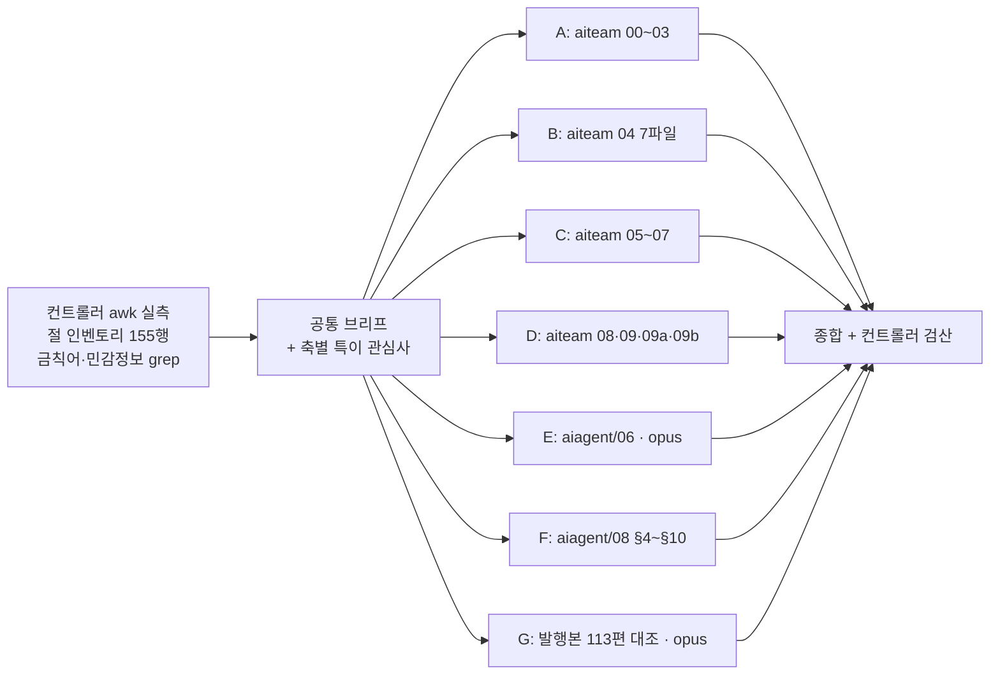
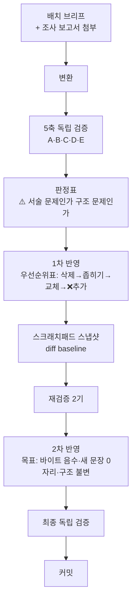
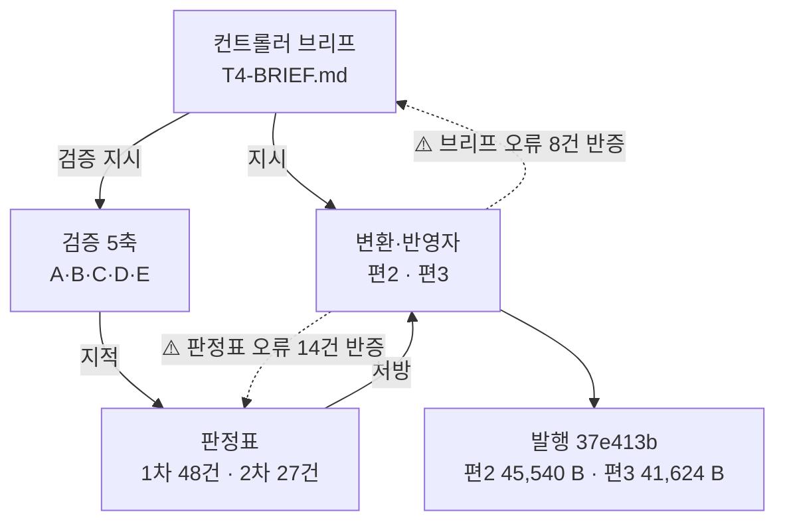

# `ai-transformation` 카테고리 분할 설계

**작성일**: 2026-08-14 · **상태**: 승인 대기
**선행**: `agentic-coding` 31편 완료(B1~B9) · 작성 시점 발행 **113편** · sitemap 174 URL
**진행**: T1(편6·7·8) `9c0b9fd` · T2(편9) `6a56f4a` · T3(편1·편4) `695cdad` · T4(편2·편3) `37e413b` · T5(편5) `e83cfd3` · **T6(편10 Q&A) `7efd4d4`** → **현재 123편 · sitemap 186 URL · 10/11 발행**

---

## 1. 요약

| 항목 | 값 |
| --- | ---: |
| 원본 총량 | **199,128 B** (`aiteam/` 18파일 118,972 + `aiagent/06` 63,181 + `aiagent/08 §4~§8·§10` 16,975) |
| 발행 제외 | **약 35,000 B** (면접·구직 절 · 편집용 메타 · 미완성 절) |
| 가용분 | **163,515 B** (절 단위 제외 31,437 + 1인칭 열·행 제거 4,176) |
| 팽창률 | ⚠️ **1.20은 반증됐다. 실측 1.63~2.71** — T1 편6 1.63 · 편7 1.80 · 편8 1.93 · T2 편9 2.50 · T3 편1 1.72 · 편4 2.71 · **T4 편2 2.08 · 편3 2.44**. (`agentic-coding` 승계값 1.20은 그 카테고리에서도 실측 1.76이었다)<br/>⚠️ **T3에서 드러난 규칙성 — 쪼개는 편은 낮고(1.72) 묶는 편은 높다(2.71) — 을 T4가 유지했다.** 편2·편3은 둘 다 묶는 편이고 **2.08·2.44로 실측 범위 안 중상위**에 앉았다. **8편을 실측한 지금도 범위는 1.63~2.71로 넓어지지 않았다** |
| **발행 편수** | **11편** (본편 9 · Q&A 1 · 지도편 1) |
| 예상 총량 | 약 **221 KB** |

### 조사 방법과 신뢰도

**조사를 7축으로 나눴고, 기계적 실측은 컨트롤러가 직접 뽑아 브리프에 첨부했다.**



| 축 | 담당 | 티어 | 산출 | 컨트롤러가 정정한 것 |
| :---: | --- | :---: | ---: | --- |
| A | `aiteam/00~03` | haiku | 25.2 KB | — |
| B | `aiteam/04_영역별` 7파일 | haiku | 23.2 KB | **편 구성 산술** — 「3편 권장」이 하한 미달 |
| C | `aiteam/05~07` | haiku | 7.0 KB | — |
| D | `aiteam/08·09·09a·09b` | haiku | 10.0 KB | — |
| E | `aiagent/06` | **opus** | 80.1 KB | — |
| F | `aiagent/08 §4~§10` | haiku | 9.5 KB | `06` 대조 미수행 → 컨트롤러가 실측 |
| G | 발행본 113편 | **opus** | 71.0 KB | — (**G가 컨트롤러 브리프의 오류를 잡았다**) |

> **티어를 두 갈래로 나눈 근거는 난이도가 아니라 「실패가 감지되는가」다.**
> A~D·F는 같은 제목을 가진 절을 **서로 다른 조사자에게 배정**하고 상대 파일을 열지 못하게 해서,
> 두 축자가 어긋나면 오류가 드러나게 했다. E·G는 그런 교차 검증 상대가 없어 상위 티어로 올렸다.

---

## 2. ⚠️ 이 카테고리가 앞의 9배치와 근본적으로 다른 점 — 3건

**설계 규칙이 여기서 갈린다. 앞 카테고리의 절차를 그대로 적용하면 안 되는 자리다.**

| # | 사실 | 앞 카테고리 | 이번 카테고리 |
| --- | --- | --- | --- |
| **1** | **`aiteam/` 18파일 전체에 mermaid 0개** (`aiagent/06`은 11개, `08`은 10개) | 「원본 도식을 발행본이 옮겼는가」를 **총계로 검산**했다 (도식 85→84 사건) | **옮길 도식이 없다. 전부 새로 그린다.** 검산 축이 「총계 일치」가 아니라 **「새 도식의 근거가 본문에 실재하는가」**로 바뀐다 |
| **2** | **`aiteam/` 13파일에 실명 `허우용` 27자리 · `야나두` 2자리.** 절 제목이 「나의 차별점」·「입사 후 실천」·「허우용 실증 자산 → 팀 이식」 | 강의 정리라 **주체 치환**이 최대 작업(「강의가 ~한다」 32자리) | **구직용 자기 PR 문서다.** 문자열 치환으로 끝나지 않는다 — **절의 존재 이유가 「저자가 이걸 할 수 있다」인 경우 3인칭으로 옮기면 남는 게 없다.** §6에서 별도 규칙으로 다룬다 |
| **3** | **`aiteam/` 개별 파일이 2.7~13.9 KB로 전부 하한 미달이거나 턱걸이** | 큰 파일을 **쪼갰다** | **묶어야 한다.** 분할표의 근거가 「어디서 자를까」가 아니라 **「무엇이 한 편으로 묶이나」**다 |

> **`aiagent/06`·`08`은 3번에 해당하지 않는다** — 63 KB·17 KB로 쪼개는 쪽이다.
> **한 카테고리 안에서 묶는 작업과 쪼개는 작업이 동시에 일어난다.**

### 2-1. 두 원본의 출처 위생이 정반대다 — 같은 규칙으로 다루면 안 된다

| 원본 | 출처 표기 | 처리 규칙 |
| --- | --- | --- |
| **`aiteam/07`** 기업 사례 11개 | **전수 표기** — CNBC·Fortune·GitHub Blog·Byline·CIO Korea·if(kakao)25. **반례까지 명시**(Klarna 재채용 선언 · Duolingo 평가규칙 철회 · Anthropic 스킬 침식 우려) | 그대로 살린다. **반례가 이 카테고리의 차별점이다** |
| **`aiagent/06`** 정량 수치 9행 | 방어 문장 **7자리 전부에 금칙어 `강의`가 용접**돼 있다 | 축자 이전 **전건 불가.** §7의 치환 서식을 쓴다 |
| **`aiteam/06`** 로드맵·성숙도 | ⚠️⚠️ **「자체 정의, 외부 인용 없음」은 T3에서 반증됐다.** `06` 안에서만 보면 외부 URL이 **0건**인 것은 사실이나, **성숙도 표와 축 5단계의 출처는 `07 §4` L77에 있다** — `[Heinz Marketing]` · `[PUNKU.AI]`. 실패요인 5종은 출처명만 있고 **URL은 `07 §4` L79~84에** 있다 | ⚠️ **귀속이 아니라 출처를 붙인다.** 「이 글의 정리다」로 처리하면 **원 자료가 밝힌 출처를 저자 추론으로 강등**하게 된다. **T3 편4가 출처 2개를 부착해 발행했다**<br/>⚠️ **교훈: 한 파일만 열고 「외부 인용 0건」을 판정하지 마라.** 조사 축이 파일별로 나뉘면 경계를 넘는 출처는 아무도 담당하지 않는다 (금지선 19) |

---

## 3. 분할표 — 11편

**측정 기준은 raw(frontmatter 포함) bytes. 예상 KB는 ±15% 오차를 갖는다.**

| # | slug | 무엇을 다루나 | 원본 | 가용 B | 예상 KB |
| ---: | --- | --- | --- | ---: | ---: |
| ~~1~~ | ~~`builder-to-orchestrator-shift`~~ | ~~운영철학 3단 모델 · 역할 재정의 · 거버넌스 · **기업 사례 11개**~~ | ~~`01` + `02` + `07`~~ | ~~21,385~~ **22,244** | ✅ **발행 38,217 B (37.3 KB)** |
| ~~2~~ | ~~`sdlc-human-gates`~~ | ~~SDLC 6단계 사람 게이트 + 개발·QA·배포 영역~~ | ~~`03` + `04`(개발·QA검증·배포_운영)~~ | ~~20,500~~ **21,912** | ✅ **발행 45,540 B (44.5 KB)** |
| ~~3~~ | ~~`discovery-to-growth-tooling`~~ | ~~기획·디자인·퍼포먼스마케팅·경쟁사분석~~ | ~~`04`(기획_요구사항·디자인·퍼포먼스마케팅·경쟁사분석)~~ | ~~16,078~~ **17,028** | ✅ **발행 41,624 B (40.6 KB)** |
| ~~4~~ | ~~`enablement-infra-and-maturity`~~ | ~~n8n·지식관리·MCP 팀 공유 + 성숙도·로드맵·KPI·실패요인~~ | ~~`05` + `06`~~ | ~~13,724~~ **13,517** | ✅ **발행 36,688 B (35.8 KB)** |
| ~~5~~ | ~~`lean-three-layer-harness`~~ | ~~3-레이어 아키텍처 + Skills 설계 + LLM wiki 템플릿~~ | ~~`09` + `09a` + `09b`~~ | 20,481 | ✅ **발행 41,937 B (40.9 KB)** |
| 6 | `department-agent-blueprint` | 7개 부서 지도 + 공통 설계 패턴 10종 + 용어 33개 | `aiagent/06` §0·§1·§2 | 17,279 | **20.7** |
| 7 | `department-automation-frontline` | 마케팅·영업·고객지원·인사 4개 부서 | `aiagent/06` §3~§6 | 20,819 | **25.0** |
| 8 | `department-automation-backoffice` | 재무·법무·경영지원 3개 부서 + 업무 분해 체크리스트 | `aiagent/06` §7~§10 | 19,224 | **23.1** |
| ~~9~~ | ~~`agent-definition-by-department`~~ | ~~6개 부서 정의서~~ | ~~`aiagent/08` §4~§8·§10~~ | ~~14,000~~ **16,975** | ✅ **발행 42,630 B (41.6 KB)** |
| ~~10~~ | ~~`ai-transformation-qna-org-operations`~~ | ~~Q&A 18문항~~ | ~~`08_면접` §3 8문항 + 각 편 10문항~~ | 5,707 | ✅ **발행 27,673 B (27.0 KB)** |
| 11 | `ai-transformation-knowledge-map` | 지도편 — 카테고리를 닫는다 | `00 §1` 골격 + 재작성 | — | **~14** |

**편1~9 가용 합계 163,515 B.** ~~× 1.2 = 196,218 B (191.6 KB)~~
⚠️ **팽창률 1.20이 반증됐으므로 위 「예상 KB」 열 전체가 과소 추정이다.** T1·T2 실측 1.63~2.50을 적용하면
편1~9만 **266,000~409,000 B (260~400 KB)** 이고 총계는 **약 290~430 KB**다.
**하한 13.3 KB는 전건 통과하며, 상한은 없다(금지선 13).**

> **⚠️ 편9의 「14,000」은 §10(2,992 B)을 빠뜨린 오기였다.** §1 요약의 16,975가 맞고 편1~9 합계 163,515는 유효하다.
> **컨트롤러 실측: §4~§8 = 14,073 · §10 = 2,992 → 17,065 B**(절 경계 처리로 16,975와 90 B 차).
> **T3~T7 착수 전에 남은 편들의 가용 바이트도 같은 방식으로 재실측하라** — 분할표 값을 그대로 믿지 마라.
> ⚠️ **T4가 이 지시의 값을 입증했다** — 편2는 20,500 → **21,912**(+1,412), 편3은 16,078 → **17,028**(+950).
> **두 편 모두 분할표가 과소 추정했고 방향이 같다.** 남은 편5·10·11도 **상향 쪽으로 어긋날 가능성이 크다.**

> **검산**: 원본 199,128 − 절 단위 제외 31,437 − 1인칭 열·행 제거 4,176 = **163,515 B**.
> 세 항이 편1~9 가용 합계와 정확히 맞는다. **잔차로 정의된 항이 없다**(금지선 10).

### 3-1. slug 근거 — 실측된 명명 관례를 따른다

| 관례 (조사 G 실측, 113편) | 값 | 이 설계의 준수 |
| --- | --- | --- |
| 단어 수 | 3~4단어가 **88%**(100/113), 6단어 이상 0편 | 전 편 3~4단어 |
| 아라비아 숫자 | **0편** (수는 영문 수사) | 숫자 미사용 |
| 품사 | 압도적 **명사구** | 전 편 명사구 |
| 대소문자 | 전부 소문자 + 하이픈, 예외 0편 | 준수 |
| 지도편 | `*-knowledge-map` 또는 `*-map-*` | `ai-transformation-knowledge-map` |
| Q&A 시리즈 | `<카테고리>-qna-<주제>` | `ai-transformation-qna-*` |

**⚠️ 충돌 회피** — 아래 어휘는 인접 카테고리가 이미 선점했다. **쓰지 마라**:
`*-adoption-*`(`team-adoption-roi`·`enterprise-ai-adoption-actions`) · `*-org-*`(`dev-org-transfer`) ·
`*-team-operations`(`agent-team-operations`) · `*-catalog`(`thirty-agent-catalog`·`agent-pattern-catalog`) ·
`*-governance`(3개 카테고리에서 사용)

**비어 있는 어휘**(113편 slug에 0회): `maturity` `roadmap` `enablement` `orchestration` `department` `handoff` `contract` `escalation` `stage` `gate` `charter` `playbook` — **위 slug들이 이 목록에서 골라졌다.**

---

## 4. 발행 제외 — 절 단위 확정

| 원본 | 절 | 바이트 | 사유 | 남길 것 |
| --- | --- | ---: | --- | --- |
| `aiteam/00` | **전량** | 5,672 | 편집용 메타(진행 상태·작성 규약·이직 트랙 링크) | **§1 「살아있는 목차」의 구조만** 편11 지도편 골격으로 |
| `aiteam/01` | §4 일부·§5 | ~1,300 | 「자기소개·면접 톤」·「면접 대비 미리보기」 | §4의 리더십 4개 항목(L46~48)은 유지. **L49 「10인 팀 구성표」 삭제** |
| `aiteam/05` | §6 | 1,555 | 「실증 자산 ↔ 인프라 매핑 (면접용)」 | **§1~§5가 이 절을 참조하지 않는다** — 제외해도 무너지지 않음 (조사 C 확인) |
| `aiteam/06` | §5 | 868 | 도메인 변주 — **미완성** (TODO 2건) | 없음 |
| `aiteam/07` | §5 | 2,254 | 「면접에서 인용하기 좋은 한 줄 사례 5개」 | **5개 전부 §1·§4에서 재인용 — 신규 사례 0개.** 제외 시 손실 0 (조사 C 확인) |
| `aiteam/08` | **전량** | 11,004 | 면접 스토리텔링 | **§3의 9문항만** 편10 Q&A 문항 소스로 |
| `aiteam/09` | §4 | 676 | 「허우용 스택에 실제 셋업」 | §1~§3은 유지 가능 (신뢰도만 약화, 조사 D 확인) |
| `aiagent/06` | §11 | 3,841 | 면접 활용 포인트 | **§11-1 카드 3개 전부가 본문에 축자 수준으로 존재 → 손실 0** (조사 E 확인) |
| `aiagent/06` | §12 | 1,396 | 인용 시 주의 | 방어 문장은 **본문 4자리에 남는다**(§7 참조) |
| `aiagent/08` | §9 | 2,871 | 개발기술 4종 — **`agentic-coding` 소속** | 이미 `dev-org-transfer.md`로 발행됨 |

**제외 합계 약 31,400 B** + 1인칭 열·행 단위 제거분 약 3,600 B = **약 35,000 B**

---

## 5. 교차 중복 판정 — 소재군 10개

**조사 G가 발행본 113편 전수 대조로 판정했다.**

| # | 소재군 | 판정 | 처리 |
| ---: | --- | --- | --- |
| 1 | AX 운영철학 (`01`) | **중복-부분** | `AX`·`오케스트레이터`는 발행됐으나 **소프트웨어 에이전트 층위**. 원본은 **사람 직무·조직 헌법 층위**. 도입부에서 층위 차이를 명시 |
| 2 | 조직 구성·거버넌스 (`02`) | **중복 없음** | `NIST` 0 · `이네이블먼트` 0 · `변화관리` 0 |
| 3 | 워크플로 파이프라인 (`03`) | **중복-부분(동음이의 경계)** | ⚠️ **「8건은 전부 에이전트 루프 종료조건」은 T4에서 반증됐다.** 개수는 맞았고 **술어가 틀렸다** — 층위가 **셋**이다. 현재 실측 **10건**. **§5-3 참조.** 원본이 **SDLC 6단계 승인 지점**이라는 판정 자체는 유지된다 |
| 4 | 영역별 AI 활용 (`04`) | **중복 없음** | `퍼포먼스마케팅` 0 · `경쟁사분석` 1(무관) |
| 5 | n8n·지식관리 (`05`) | **중복 없음** (§3 MCP 제외) | `n8n` 0 · `사내 위키` 0 · `프롬프트 라이브러리` 0 |
| 6 | **도입 로드맵·성숙도 (`06`)** | ⚠️ **중복-부분 (위험 최대)** | **「첫 90일에 할 일」이 발행본 7편의 정착된 마무리 절 서식이다.** §7-2 참조 |
| 7 | 기업 사례 (`07`) | **§1 중복 없음 / §2~§4 중복-부분** | Klarna·Shopify·당근·올리브영 전부 미발행. §2 역할재정의는 `02 §1`과 통합 |
| 8 | 린 아키텍처 (`09`·`09b`) | **중복 없음** | `3-레이어` 0 · `consolidation` 0 · `LLM wiki` 0 |
| 9 | 부서별 자동화 (`aiagent/06`) | **중복-부분** | 부서명 7개는 0건이나 **영업부 에이전트 4종 이름이 `collaboration-patterns-isolation.md`에 축자로 존재** |
| 10 | 부서 카탈로그 (`aiagent/08`) | ⚠️ **중복-완전 1건** | §5-1 참조 |

> ⚠️ **9번은 1차 판정을 정정한 것이다.** 부서명 grep만으로는 「완전 미발행」이 나오지만
> **에이전트 이름**으로 다시 검색하면 겹친다. **문자열 하나로 판정을 끝내지 마라.**

### 5-1. ⚠️ 중복-완전 1건 — 30종 명부는 다시 싣지 않는다

`aiagent/08 §2` L142~171과 발행본 `agentic-coding/thirty-agent-catalog.md` L180~211이 **표 머리글·행 순서·셀 내용까지 축자 일치**한다(표본 3자리 전건 확인).

**그러나 배정 범위는 §2가 아니라 §4~§8·§10이고, 그 고유 내용은 미발행이다:**

| 부분 | 내용 | 발행본 히트 | 판정 |
| --- | --- | --- | --- |
| **N-1 조직도와 위임 흐름** | 부서별 mermaid. 화살표에 **인계 조건 라벨**(`"등급 확정 후 등록"`·`"미팅 예정 감지"`) | **0건.** 발행본 도식은 부서→에이전트 **단방향 트리**로 인계 화살표가 없다 | **미발행** |
| **N-2 판단축·산출형식·안전장치** | `lead-scorer / Fit 3축 40점 + Engagement 3축 60점 / … / 점수보다 근거를 우선 서술하도록 지시` | `명시된 안전장치` 1건 — `dev-org-transfer.md:67`, **§9(개발기술)분만** | **§4~§8·§10분 미발행** |
| **N-3 프롬프트 설계 기법** | `가중치를 표로 못박아 총합 100을 강제` · `30일 이상 미접촉 리드는 자동 -20점` · `다음 액션 없이는 종료 금지` | **5개 문자열 전부 0건** | **전량 미발행** |

**⇒ 편9는 발행한다. 단 30종 명부는 싣지 않고 `thirty-agent-catalog.md`로 링크한다.**
**편9의 실질 고유값은 N-1 위임 흐름 도식과 N-3 프롬프트 기법이다.**

### 5-2. ⚠️⚠️ 30에이전트 세트가 **셋으로 갈린다** — 이 카테고리 최대의 혼동 위험

| 세트 | 출처 | 부서 편성 | 표기 |
| :---: | --- | --- | --- |
| **A** | 발행본 `scaling-routing-collapse.md` L324~332 | 마케팅5·영업5·CS4·재무4·인사4·**기획**4·**개발**4 | 한글 기능명 |
| **B** | 발행본 `thirty-agent-catalog.md` = 원본 `aiagent/08` | 영업5·마케팅5·고객지원4·인사노무4·재무회계4·**개발기술**4·**기획전략**4 | 영문 ID |
| **C** | 원본 `aiagent/06 §1` — **미발행** | 마케팅5·**영업4**·고객지원4·인사4·재무4·**법무**4·**경영지원**5 | 한글 기능명 |

**총계는 셋 다 30인데 편성이 다르다.** C에는 **법무부·경영지원부**가 있고 **기획·개발이 없다.**

> **선례가 이미 있다.** `thirty-agent-catalog.md` L150~166이 「개수가 같다고 같은 세트는 아니다」라는 절을
> 통째로 들여 A≠B를 밝혀 두었다. **편6에서 C를 낼 때 같은 처리를 반드시 하라.**
> 하지 않으면 독자가 세 표를 같은 조직도의 판본으로 읽는다.

### 5-3. ⚠️⚠️ `사람 게이트` — 「전부 루프 종료조건」이 반증됐다. **층위가 셋이다** (T4 실측)

**§5 소재군 3번의 판정은 개수를 맞히고 술어를 틀렸다.** 설계 시점 8건이 맞았고, 그 8건도 이미 한 층위가 아니었다.

| 층위 | 무엇을 가리키나 | 발행본 · 줄 | 건수 |
| --- | --- | --- | ---: |
| **① 루프 종료조건** | 에이전트 반복을 **멈추는 판정 기준**. 테스트·린트·루브릭과 나란히 놓인다 | `ai-agent/loop-antipatterns-and-checklist:41·111` · `ai-agent/minimal-loop-design-surfaces:73` | **3** |
| **② 실행 절차의 한 스텝** | 에이전트 **정의서 안의 절차 항목**. 「사용자 승인 후 발송」 | `agentic-coding/definition-writing-quality:239·244` · `ai-transformation/agent-definition-by-department:115·391` | **4** |
| **③ 코드 실행 직전 권한 스위치** | `human_input_mode="TERMINATE"` — **격리·실행기 설정과 짝을 이루는 보안 장치** | `ai-agent/autogen-conversation-agents:146·253·296` | **3** |
| | | **합계** | **10** |

**세 층위는 「사람이 승인한다」를 공유할 뿐 승인 대상이 다르다** — ①은 *결과*를, ②는 *산출물 발송*을, ③은 *실행 권한*을 승인한다.

> ⚠️ **개수 8 → 10의 증가분 2건은 이 카테고리가 스스로 만들었다.** `agent-definition-by-department`는
> T2에서 발행한 편9다. **설계 시점(113편) 실측은 ①3 · ②2 · ③3 = 8**로 개수는 정확했고,
> **그때도 층위는 이미 셋이었다.**
>
> ⚠️⚠️ **교훈: 「N건은 전부 X다」에서 위험한 쪽은 N이 아니라 X다.** 개수는 grep이 검산하지만
> **술어는 아무것도 검산하지 않는다.** 개수가 맞으면 술어까지 맞은 것처럼 읽힌다.
> 이 실패 양상은 **금지선 29**(개수+술어 총평은 고치지 말고 삭제하라)와 같은 뿌리다.

---

## 6. ⚠️ 1인칭·구직 맥락 제거 — 이번 카테고리의 최대 작업량

**`agentic-coding`의 §6(출처·근거 주체 규칙)에 대응하는 자리다. 성격이 다르다.**

| | `agentic-coding` | **`ai-transformation`** |
| --- | --- | --- |
| 문제 | 「강의가 ~한다」 주체 표기 32자리 | **실명 27자리 + 절 구조 자체가 자기 PR** |
| 처방 | 주체 치환 | **치환으로 끝나지 않는다 — 절의 존재 이유를 다시 세워야 한다** |

### 6-1. 3층 처리 규칙

| 층 | 형태 | 처리 | 예 |
| :---: | --- | --- | --- |
| **①** | 실명·회사명 단독 출현 | **삭제** | `허우용(Ted)` → 삭제 |
| **②** | 표의 「나의 현재 위치」 **열** | **열 전체 삭제, 나머지 열은 유지** | `01 §2` 3단 모델 — **좌측 「무엇」 열만 남기면 일반 방법론**(조사 A 판정) |
| **③** | 절 전체가 자기 PR | **절 제외.** 단 **제외 전에 그 절이 다른 절의 근거인지 확인** | `05 §6`(참조 0 → 안전) vs `09 §4`(§1~§3이 L14·L43에서 참조 → 신뢰도 약화 감수) |

### 6-2. ⚠️ 「입사 후 실천」 절 — 파일마다 밀도가 다르다

`04_영역별` 7파일 중 **퍼포먼스마케팅·경쟁사분석에는 이 절이 없다**(조사 B 실측).
**7파일을 같은 규칙으로 처리하면 안 된다.** 절이 있는 5파일만 제거 대상이다.

### 6-3. 제거 후 남는 것을 반드시 세라

**제거가 분량을 무너뜨리는지 편별로 검산한다.** `04_영역별`은 개별 파일이 2.7~8.6 KB이므로
「입사 후 실천」을 걷으면 하한 미달이 심해진다. **분할표 §3의 편2·편3 배정이 이 계산을 이미 반영했다.**

---

## 7. 출처·근거 규칙

### 7-1. ⚠️ `aiagent/06` 정량 수치 — 방어는 사라지지 않는다. 다시 써야 할 뿐이다

**앞 배치의 이월 기록(「방어 3자리가 §12 제외로 사라진다」)은 절반만 참이었다.**

| # | 줄 | 소속 | 발행 시 | 축자 |
| ---: | --- | --- | :---: | --- |
| 1 | L419 | §4-6 H3 제목 | **생존** | `### 4-6. 강의가 제시한 정량 지표` |
| 2 | L421 | §4-6 리드 | **생존** | `아래 수치는 강의 교재가 제시한 예시이며 검증된 일반값이 아니다` |
| 3 | L821 | §8-7 H3 제목 | **생존** | `### 8-7. 강의가 제시한 비용 비교` |
| 4 | L823 | §8-7 리드 | **생존** | `아래 수치도 강의 교재의 예시다` |
| 5 | L1021 | §11 표 행 | 소멸 | — |
| 6 | L1058 | §12 표 행 | 소멸 | — |
| 7 | L1065 | §12 인용문 | 소멸 | — |

**방어는 본문에 4자리 남는다. 「출처 없는 성과표만 남는」 상태는 발생하지 않는다.**
**단 7자리 전부에 금칙어 `강의`가 박혀 있어 축자 이전은 전건 불가하다.**

#### 치환 서식 — 발행본에 이미 있다. 새로 발명하지 마라

`agentic-coding/automation-scope-criteria.md` **L191**을 그대로 따른다:

> `> **위 두 사례의 시간 수치는 원 자료가 대비용으로 제시한 예시**이며 이 글이 측정한 값이 아니다. … 원 자료 작성 기준일은 2026-07-26이다.`

| 요소 | 적용 |
| --- | --- |
| 금칙어 회피 | `강의 교재` → **`원 자료`** |
| 화자 분리 | `이 글이 측정한 값이 아니다` — §12의 역할을 한 문장이 대신한다 |
| 기준일 | **`06` L3의 작성 기준일도 `2026-07-26`으로 동일** — 그대로 쓸 수 있다 |

### 7-2. ⚠️ 「첫 90일에 할 일」은 발행본의 정착된 서식이다 — 편 주제로 쓰지 마라

발행본 **8편**이 마무리 절에서 동일한 3열 표를 쓴다: `| 주장 | 조직에 미치는 함의 | 첫 90일에 할 일 |`
⚠️ **7편이 아니라 8편이다** — T3 조사 γ가 `agentic-coding/reversibility-before-permission:176`을 추가로 실측했다.
⚠️ **그리고 8편 전부 H2가 「조직에 옮기면 무엇이 되는가」다.** 금지선 26이 막는 것은 **편 제목·H2**이지 표 안의 기간 값이 아니다 — **T3 편4는 원본 4열 표의 `0–30일`·`30–60일` 기간 열을 그대로 살리고 H2만 바꿔 발행했다.**
(`agent-harness-architecture:318` · `harness-five-primitives:309` · `enterprise-ai-adoption-actions:283` ·
`loop-antipatterns-and-checklist:279` · `loop-engineering-basics:241` · `self-evolving-harness-governance:249` 외)

**`aiteam/06`의 「90일 도입 로드맵」을 편 제목·H2로 올리면 서식과 주제가 충돌한다.**
편4에서는 **「단계별 도입 순서」**로 표현을 바꾸고, 마무리 절의 3열 표 서식은 그대로 쓴다.

### 7-3. `aiteam/02` 외부 프레임워크 인용 — 표기를 통일한다

| 형태 | 사례 | 처리 |
| --- | --- | --- |
| `[단체명](URL)` | SO Leaders · Thoughtworks · AI Alliance · RedMonk(DORA) | 유지 |
| 기관명만 (링크 없음) | **NIST RMF · EU AI Act · SO 2025 · GitClear** | **발행 시 공식 URL을 확보하거나, 확보 못 하면 「원 자료가 근거로 든 기관」으로 귀속을 낮춘다** |

---

## 8. 태그 설계

### 8-1. ⚠️ 패싯 C는 **17종**이다 — 7종이 아니다

`content/blog/tags.ts` **L77** 주석 축자: `/** 패싯 C — AI/LLM 개념. 벤더·모델명은 넣지 않는다 — 시간이 지나면 죽는다 (17) */`

**패싯 C 전량**: `claude-code` `ai-agent` `multi-agent` `ai-governance` `ai-automation` `context-engineering`
`prompt-engineering` **`rag` `llm` `agentic-rag` `embedding` `vector-database` `evaluation`
`human-in-the-loop` `model-serving` `knowledge-graph` `machine-learning`**

> **이 오류는 컨트롤러 브리프가 만든 것이고 조사 G가 잡았다.** 7종으로 계산하면
> `["claude-code","ai-governance","llm","org-design"]`이 통과로 보이지만 **실제로는 C 3개라 위반**이다.

### 8-2. ⚠️ 패싯 D도 상한 2다 — 이 카테고리에서는 D 초과가 C 초과만큼 위험하다

`org-design` · `engineering-leadership` · `career` · `team-building` · `product-strategy` 를 셋 붙이기 쉽다.
**발행본 113편에서 패싯 C 위반은 0건, B·E 위반은 5건이다** — C 규칙은 지켜져 왔으므로
`ai-transformation`이 C를 3개 다는 첫 카테고리가 되면 눈에 띈다.

### 8-3. 편별 태그 배정 — 전건 패싯 검산 완료

| 편 | 태그 | 패싯 검산 |
| ---: | --- | --- |
| 1 | `org-design` `engineering-leadership` `ai-governance` `ai-automation` | D2 · C2 ✅ |
| 2 | `human-in-the-loop` `ai-automation` `engineering-leadership` `ci-cd` | C2 · D1 · B1 ✅ |
| 3 | `ai-automation` `prompt-engineering` `product-strategy` `data-driven` | C2 · D2 ✅ |
| 4 | `knowledge-management` `mcp` `ai-automation` `data-pipeline` | D1 · A1 · C1 · B1 ✅ |
| 5 | `claude-code` `knowledge-management` `mcp` `ai-automation` | C2 · D1 · A1 ✅ |
| 6 | `ai-automation` `human-in-the-loop` `org-design` `troubleshooting` | C2 · D1 · B1 ✅ |
| 7 | `ai-automation` `human-in-the-loop` `org-design` `security` | C2 · D1 · B1 ✅ |
| 8 | `ai-automation` `multi-agent` `org-design` `observability` | C2 · D1 · B1 ✅ |
| 9 | `multi-agent` `ai-agent` `org-design` `engineering-leadership` | C2 · D2 ✅ |
| 10 | `org-design` `career` `ai-governance` `ai-automation` | D2 · C2 ✅ |
| 11 | `org-design` `engineering-leadership` `ai-automation` `knowledge-management` | **D3 ⚠️** → `engineering-leadership` 제외 후 `ai-governance` 투입 = D2·C2 ✅ |

**새 태그를 만들지 않는다.** 0편 태그 중 `team-building` `career` `product-metrics` `ci-cd` `deployment`가
이 카테고리에서 처음 열린다 — **어휘에 있으므로 빌드는 통과한다.**

---

## 9. 배치 계획

**9배치로 검증된 절차를 그대로 쓴다.**



| 배치 | 편 | 근거 |
| :---: | --- | --- |
| ~~**T1**~~ | ~~편6·편7·편8~~ | ✅ **발행 `9c0b9fd`** |
| ~~**T2**~~ | ~~편9~~ | ✅ **발행 `6a56f4a`** — 도식 6개 전건 승계(diff 무차이) · 라벨 35개 보존 |
| ~~**T3**~~ | ~~편1·편4~~ | ✅ **발행 `695cdad`** — 1인칭 제거 첫 적용 · **원본 mermaid 0개에서 도식 8개 신규**(노드 35·화살표 31 전건 근거 대조) · **편1↔편4 경계 계약**으로 성숙도/수치 소유를 갈랐다 |
| ~~**T4**~~ | ~~편2·편3 (`04_영역별`)~~ | ✅ **발행 `37e413b`** — 묶기 작업의 본체. **금지선 22 적용 완료**(「입사 후 실천」 5파일분 제거) · **경계 계약(브리프 §7)으로 `03` 총론과 각론 7파일의 소유를 갈랐다** — `03 §3` 대표 도구 열은 각론에 전건 중복이라 **버렸다**(6/6·5/5·4/4·5/5·5/5·6/6 대조)<br/>⚠️ **이 배치의 최대 산출은 발행본이 아니라 §12-4다 — 컨트롤러 브리프 오류 8건이 전부 지시받은 쪽에서 반증됐다** |
| ~~**T5**~~ | ~~편5 (린 아키텍처)~~ | ✅ **발행 `e83cfd3`** — 3파일 1편 통합. **원본 mermaid 0개에서 도식 3개 신규** · **코드펜스 22.5%를 산문과 갈라 분량 예측**(31~44 KB 적중) · ⚠️ **12배치 이월 「훅 차단 채널」 해소 — 결함이 셋이었다**(발행본 4갈래 · 원본 낱말 미구분 · **「강제」 낱말이 `09`와 `09a`에서 충돌**) · ⚠️ **`09b` 코드펜스 안 사내 데이터 8자리를 일반 예시로 치환**(민감정보 패턴이 전건 놓친 형태)<br/>⚠️ **편2 `:101`·편4 `:59`·`:398`에 편5 링크를 넣었다** — 이월 38번 종결 |
| ~~**T6**~~ | ~~편10 Q&A~~ | ✅ **발행 `7efd4d4`** — **성격이 앞의 9편과 반대다. 쓰는 글이 아니라 연결하는 글이다.** 원본 `08 §3`은 `01`+`02`+`07`의 면접 요약이고 그것이 이미 편1이므로, **팽창시키면 편1과 전면 중복**이다. 답변은 「결론 한 줄 + 근거 2~3문단 + 넘김」으로 고정하고 깊이를 링크로 넘겼다<br/>⚠️ **하한 미달 우려는 성립하지 않았다** — Q&A 편의 분량은 원본 크기가 아니라 **문항 수**가 정한다(기발행 11편 실측 문항당 585~1,631 B). 18문항 → 27.0 KB<br/>⚠️ **소스는 원본 8문항(Q8 제외) + 발행본 9편 수급 10문항.** 「+ 각 편」의 뜻은 §9 「전 편 발행 후 문항 수급」이 이미 정해 두었다<br/>⚠️⚠️ **이 배치 결함의 최대 무리는 「좌표는 정확한데 가리키는 것이 다르다」였다** — §12-5 |
| ~~**T7**~~ | ~~편11 지도편~~ | ✅ **발행 — 카테고리 11/11 완료.** 33,025 B · 197줄 · 내부 링크 **107**(편당 10.7, 편10 실측 3.3의 3.2배). 전편 커버 10/10이고 **편10은 15회로 최다** — 그 편의 inbound가 0이라 이 글이 유일한 진입로다<br/>⚠️⚠️ **결함이 하나의 형태를 여섯 번 반복했다 — 「같은 대상을 두 자리에서 재는데 술어의 넓이가 다르다」.** 값은 매번 정확했고 좁은 술어로 잰 값을 넓은 술어에 옮긴 것이 결함이다. **값을 고치면 다음 전칭이 나왔고, 끝낸 것은 「세는 것을 그만두기」였다** — 「한 주제의 2차만」을 「그런 자리**도 있고**」라는 존재 주장으로 바꾸자 계열이 닫혔다<br/>⚠️⚠️ **결함이 표가 아니라 「표를 가로로 요약한 문단」에서 났다.** 표 4행은 항목을 독립 서술해 안전한데 요약은 넷을 비교해 배타 전칭을 자동 생성한다. 그 구역에서 **다섯 번 연속** 난 뒤 **요약 두 문단(1,302 B)을 걷어내자 결함 생산 자리가 사라졌다**. ⇒ **고치기보다 덜어내기가 나은 경우가 있다**<br/>⚠️⚠️ **좌표를 하나도 주지 않은 독자 축 둘만 「정확한데 안 읽힌다」를 봤다.** 첫 독자가 경로 표에 닿기까지 **91줄**이었고, 절 재배치로 **20줄**이 됐다(내용 삭제 0). ⇒ **검증 축은 「참인가」를 묻지 「독자가 필요로 하나」를 묻지 않는다**<br/>⚠️ **표는 세로로 읽으면 안 보인다** — 「이 카테고리는 이쪽으로만 쓴다」(3열)와 「또 다른 층위가 있다」(4열)가 **같은 행에서** 서로를 반박했다. **「한 행을 가로로 읽어라」**가 검증 습관에 추가됐다<br/>에이전트 33기 · 반영 7차례 · 컨트롤러 판정 3건 반증됨 |

### 9-1. ⚠️ 축 B의 정의를 배치별로 재정의하라

`agentic-coding` B9에서 확립된 규칙이다.

| 배치 | 원본 의존도 | 축 B의 질문 |
| :---: | --- | --- |
| T1·T2 | 높음 (원본 63KB·17KB) | **「원문에 없는 것을 썼나」** |
| T3·T4·T5 | 중간 (묶기 + 1인칭 제거로 재구성이 많다) | **「원문에 없는 것을 썼나」 + 「제거한 자리를 메우려 새 주장을 만들지 않았나」** |
| T7 지도편 | **낮음** (재작성) | **「발행본 10편에 있나」** |

---

## 10. 검산 기준값

| 항목 | 기대값 |
| --- | ---: |
| 발행 편수 | **113 + 11 = 124편** — ⚠️ **T5까지 실측 122편**(9/11 발행, **2편 남음**) |
| sitemap URL | ~~174 + 11 + 신규 태그 5 = **190**~~ · ~~신규 태그 0개 → **186**~~ → ⚠️ **T4에서 깨졌다** → **T5 실측 185.** ✅ **T5는 예측 「184 + 1」이 정확히 맞았다**(태그 4종 전부 기존). **§10-3 참조 — 최종 예측 188** |
| `npm test` | 36개 통과 |
| `npx tsc --noEmit` | 0 |
| `npm run build` | 0 |

### 10-1. ⚠️ 도식 검산 — 축이 바뀐다

| 원본 | mermaid | 검산 방식 |
| --- | ---: | --- |
| `aiteam/` 18파일 | **0** | **총계 대조 불가.** 「새 도식의 각 노드·화살표가 본문 어느 줄에 근거하는가」를 표로 제출하게 한다 |
| `aiagent/06` | 11 | 총계 대조 가능 (§11·§12에 도식 없음 → **11개 전량 승계**) |
| `aiagent/08` §4~§8·§10 | **6** | 총계 대조 가능. **N-1 위임 흐름 도식이 편9의 핵심 자산이다** |

### 10-2. 검증 명령

```powershell
cd C:\Users\aeby\vscode\withwooyong.github.io

npm test ; npx tsc --noEmit ; npm run build

# 금칙어 — 기대 0건
Select-String -Path "content\blog\ai-transformation\*.md" `
  -Pattern "면접|커닝페이퍼|암기용|화이트보드|이력서|강의|수강|Part [0-9]|CH0[0-9]|예상 질문"

# 민감정보 — 기대 0건. ⚠️ 원본에 허우용 27자리·야나두 2자리가 있다
Select-String -Path "content\blog\ai-transformation\*.md" `
  -Pattern "히츠|야나두|TVING|티빙|BTV|허우용|채용|teddylee|teddynote|argus|FASTCAMPUS|실장|커머스개발"

# ⚠️ 1인칭 잔재 — 나이브 패턴은 오탐만 낸다. 정제식을 써라 (T3 실측)
grep -nE "(^|[^하])나의 |(^|[^주전공과문])제가 |저는 |내가 |입사|본인은|데려갈|우리 팀|본 팀|현 팀" "$F"

# ⚠️⚠️ 편집용 TODO 블록 — LC_ALL=C 없이는 이모지가 검출되지 않는다 (T4 실측)
LC_ALL=C grep -nE "TODO|🖊️" "$F"
```

#### ⚠️⚠️ **`grep -nE "TODO|🖊️"`의 이모지 부분은 앞 세 배치 내내 무력했다** (T4 실측)

| 명령 | `04_영역별_AI활용/디자인.md` 결과 | 판정 |
| --- | ---: | --- |
| `grep -cE "🖊️"` | **0** | ❌ **거짓 음성** |
| `LC_ALL=C grep -cE "🖊️"` | **1** | ✅ 검출 |
| `LC_ALL=C grep -cE "TODO"` | **0** | — 이 파일엔 `TODO` 문자열이 없다 |

**세 번째 행이 이 결함을 치명적으로 만든다.** `디자인.md`의 편집용 블록에는 `TODO`가 없고 `🖊️`만 있다.
**즉 이 파일에서는 이모지 갈래가 유일한 검출 수단이었고, 그것이 무력했다** — `TODO|🖊️` 합성 패턴은 0을 냈다.

**`🖊️`는 U+1F58A + U+FE0F 두 코드포인트다.** 로케일이 UTF-8이면 grep이 이를 결합 시퀀스로 해석해
패턴 매칭이 어긋난다. `LC_ALL=C`는 바이트 열로 강제해 정확히 일치시킨다.

> ⚠️ **T1·T2·T3가 전부 이 결함 있는 명령으로 검사했다.**
> **발행본 실제 잔재는 0건이었으나 — 검사가 그것을 증명한 것이 아니다.**
> **「0건이 나왔다」와 「0건임이 확인됐다」는 다르다.** 통과한 검사가 실은 아무것도 보지 않았을 수 있다.
> **검사 명령 자체를 양성 대조군(원본처럼 실재가 확실한 파일)에 한 번 돌려 보는 절차를 넣어라.**

### ⚠️ 오탐 트랩 — **8종**이다 (T1 3 · T2 1 · T3 2 · **T4 1** · 어휘 1)

| 나이브 패턴 | 오탐 원인 | 발견 |
| --- | --- | :---: |
| `나의 ` | **`하나의 `** | T1 |
| `제가 ` | **`주제가 `** · **`전제가 `** | T1 |
| `지원자` | **`지원자 스크리너`** — 인사부 에이전트 이름 | T1 |
| `제가 ` | **`공제가 `** — 「매입세액 공제가 인정되는」 | T2 |
| `제가 ` | ⚠️ **`과제가 `** — 「리더의 **과제가** 된다」 | T3 |
| `제가 ` | ⚠️ **`문제가 `** — 「도구 선택 **문제가** 아니라」 | T3 |
| **`제가 `** | ⚠️ **`명제가 `** — 「**명제가** 그대로 들어 있고」 | **T4** |

**8종 중 6종이 `제가 ` 하나에서 나왔다.** 한국어 「제」는 접미 명사로 너무 흔해 **이 패턴은 배제 문자류로 못 막는다.**

> ⚠️⚠️ **T3의 지시를 유지한다 — 배제 문자류에 `명`을 더하지 마라.**
> T3 시점에 이미 `[^주전공과문]`까지 왔다. `[^주전공과문명]`으로 늘리면 다음 배치에서 또 늘어나고,
> **언젠가 진짜 1인칭을 배제 문자류가 삼킨다.** **「알려진 오탐」 목록으로 처리하라** — 패턴은 넓게 두고
> 히트를 사람이 목록과 대조한다. **정규식을 좁히는 것이 아니라 판정을 밖으로 뺀다.**

#### ⚠️ 어절 경계 오탐군 — **`본 [가-힣]`·`내 [가-힣]` 부분 일치의 대가** (T4 실측)

**§12-2 교훈 1이 지시한 부분 일치 패턴이 실제로 오탐을 냈다.** 이 패턴들은 **어절 경계를 보지 않는다.**

| 히트 | 왜 오탐인가 | 편 |
| --- | --- | :---: |
| `사내 데이터` · `사내 지식` | `내 [가-힣]`가 **`사내`의 「내」**를 잡는다 | 편2 |
| `2주 내 폐기` | `내 [가-힣]`가 **기간 표현 「~ 내」**를 잡는다 | 편2 |
| `본 기재` | `본 [가-힣]`가 **「원본 기재」류 어절 분할**을 잡는다 | 편2 |
| `요약본 사이` · `본 장치` | `본 [가-힣]`가 **`요약본`·`기본`의 「본」**을 잡는다 | 편3 |
| `구현 세부` | 부분 일치가 **`세부`의 「부」 계열 어절**을 잡는다 | 편3 |

**다섯 군 전부 오탐으로 판정됐고 발행본에 그대로 남았다.**

> **부분 일치는 재현율을 사고 정밀도를 판다.** §12-2가 `본 협상`(진짜)을 잡으려고 도입한 패턴이
> T4에서 오탐 5군을 냈다. **그래도 유지한다** — 놓친 진짜 1건이 오탐 5건보다 비싸다.
> 다만 **오탐군을 위 표로 상설화해 배치마다 다시 판정하지 않게 한다.**

> **`채용` 오탐**: `recruiter` 에이전트 정의(편7)와 `경쟁사분석`의 「채용공고 = 선행 경쟁 신호」(편3).
> **전부 업무 도메인 이름이며 저자의 구직 활동이 아니다.**
>
> ⚠️ **`재채용`은 T3에서 새로 등장했고 절대 지우면 안 된다** — Klarna가 2025-05 프리미엄 지원직을
> 다시 뽑은 사건의 축자이고, **U턴 반례가 이 카테고리의 차별점이다.**

### 10-3. ⚠️⚠️ sitemap 예측 — 「신규 태그 0개」가 T4에서 깨졌다

**T3까지의 관찰 「URL 증가분 = 편수 증가분」은 우연이었다.** T4에서 `ci-cd`가 이 카테고리에서 처음 열렸다.

| 배치 | 편수 | sitemap URL | 증가분 | 신규 태그 |
| :---: | ---: | ---: | ---: | --- |
| 설계 시점 | 113 | 174 | — | — |
| T1~T3 | 119 | 181 | **+7 = 편수 +6 … ⚠️ +1 불일치** | (아래 주 참조) |
| **T4** | **121** | **184** | **+3 = 편수 +2 · 신규 태그 +1** | **`ci-cd`** (편2) |

> ⚠️ **T3까지의 「정확히 같다」도 엄밀히는 참이 아니었다** — 174 → 181은 +7인데 편수는 +6이다.
> **§10 원문의 「정확히 같다」는 관찰 자체가 부정확했고, T4가 그 위에 다시 깨진 것이다.**

**남은 3편의 태그를 §8-3에서 실측 대조한 결과, 신규로 열리는 것은 `career` 하나다:**

| 편 | 태그 | 신규 여부 (현 발행본 121편 실측) |
| ---: | --- | --- |
| 5 | `claude-code` `knowledge-management` `mcp` `ai-automation` | 전부 기존 (25·15·11·21편) |
| 10 | `org-design` `career` `ai-governance` `ai-automation` | ⚠️ **`career` 0편 → 신규 +1** |
| 11 | `org-design` `ai-governance` `ai-automation` `knowledge-management` | 전부 기존 |

**⇒ 최종 예측 sitemap = 184 + 3편 + 신규 태그 1 = 188 URL** (발행 편수 **124편**).

> **§8-3이 「0편 태그 5종이 처음 열린다」고 적었으나 실제로 배정된 것은 2종뿐이다** —
> `ci-cd`(편2, 열림)와 `career`(편10, 예정). **`team-building` · `product-metrics` · `deployment`는
> 어느 편에도 배정되지 않아 0편으로 남는다.** §8-3의 서술을 예측이 아니라 배정표로 읽어야 한다.

---

## 11. 변환 브리프에 반드시 넣을 금지선

**`agentic-coding` 설계서 §11의 금지선 20개를 승계한다.** 아래는 이 카테고리 고유분이다.

| # | 금지선 | 근거 |
| ---: | --- | --- |
| **21** | **실명·1인칭을 지운 자리에 새 주장을 세우지 마라.** 「나의 현재 위치」 열을 지우면 **열을 지우는 것으로 끝난다.** 빈 칸을 메우려 일반화하면 원문에 없는 주장이 생긴다 | §6-1 ② |
| **22** | **`04_영역별` 7파일을 같은 규칙으로 처리하지 마라.** 「입사 후 실천」 절은 **5파일에만 있다** | 조사 B 실측 |
| **23** | **30에이전트 세트 C를 낼 때 A·B와 다르다는 것을 명시하라.** 선례는 `thirty-agent-catalog.md` L150~166 | §5-2 |
| **24** | **30종 명부를 다시 싣지 마라.** `thirty-agent-catalog.md`로 링크한다. 편9의 고유값은 **N-1 위임 흐름 도식과 N-3 프롬프트 기법**이다 | §5-1 |
| **25** | **`06 §2-7`의 H3 제목과 리드를 그대로 옮기지 마라.** 원본이 **4등급 표를 「3등급」이라 부른다.** 제목·리드·mermaid 노드 수·표 행 수가 **전부 4로 일치**하는지 확인하라 | §12-3 |
| **26** | **「첫 90일에 할 일」을 편 제목·H2로 쓰지 마라.** 발행본 7편의 마무리 절 서식이다 | §7-2 |
| **27** | **`aiteam/06`의 성숙도 3단계·90일 로드맵은 자체 정의다.** 외부 표준처럼 쓰지 말고 **「이 글의 정리다」 귀속을 붙여라** | 조사 C 실측 |
| **28** | **새로 그리는 mermaid의 모든 노드·화살표는 본문에 근거 줄이 있어야 한다.** 근거표를 함께 제출하라 | §10-1 |
| **29** | ⚠️⚠️ **「개수 + 술어」 총평은 고치지 말고 삭제하라.** 「N개는 전부 X다」 꼴을 만나면 **N을 고치면 X가 안 맞고 X를 고치면 N이 안 맞는다. 이 왕복은 수렴하지 않는다** | **T4 실측** — 편2 `:450` 3회 왕복 (아래 §11-1) |
| **30** | ⚠️ **금지선 28은 화살표만이 아니다 — 도식 노드 라벨에도 본문 근거가 필요하다.** T3의 무근거는 **전부 화살표**였으나 **T4는 노드였다** | **T4 실측** — 편2 `:93~94` 고유명 4개 (아래 §11-2) |
| **31** | ⚠️⚠️ **문장 하나를 지우고 끝내지 마라 — 삭제는 두 가지를 남긴다.** ① **같은 주장의 다른 사본**(핵심어로 전수 grep하라) ② **그 문장이 떠받치던 근거**(앞뒤를 읽어라). **기존의 「지운 뒤 지시대상을 확인하라」는 ②만 막는다** | **T5 실측** — 1차 반영 두 자리가 재검증에서 되돌아왔고 **원인이 서로 달랐다**. ①은 판정표가 `:90` 한 좌표만 지목해 `:76`·`:82`가 남은 것, ②는 앞부분을 지우자 남은 문장이 **발행본에 없는 제목**을 근거로 가리키게 된 것 |
| **32** | ⚠️ **귀속 오류에는 반대 방향이 있다 — 원본에 있는 것을 「이 글의 정리다」로 강등하지 마라.** 귀속을 붙이기 전에 **그것이 정말 이 글이 만든 것인지 원본에서 확인하라** | **T5 실측** — 판정표가 비교표 오른쪽 열 전체에 귀속을 처방했으나 규모 행 「그 이상」은 원본 `09:41` 축자였다. 1차 반영자가 되잡았다 |
| **33** | ⚠️⚠️ **검사 유효성 대조를 통과한 「0건」도 거짓 음성일 수 있다.** 유효성 대조는 **「패턴이 작동하는가」**를 증명할 뿐 **「패턴이 개념을 덮는가」**는 증명하지 않는다. **개념 검색은 직설어·완곡어·반의어 3계열로 나눠 돌려라** | **T5 실측** — 조사 α가 「`rag` 25편에 RAG 반대 논의 0건」을 유효성 대조까지 마치고 보고했으나 `agent-harness-architecture:17`이 「**격하**」·`:325` 「**규모로 분기**」라는 어휘로 이미 발행돼 있었다 |
| **34** | **오탐 판정과 「손대지 마라」는 동치가 아니다.** **의미 손실 없이 치환 가능한 오탐은 치환하라** — 검증 노이즈는 다음 배치가 계속 지불하는 비용이다. 손대면 안 되는 것은 *고치면 뜻이 바뀌는* 오탐이다 | **T5 실측** — `09a:44` 「신규 **입사**자」를 오탐으로 분류하고 「고치지 마라」로 지시했으나, **원본 자신이 같은 행에서 「신규 합류자」를 쓴다**는 것을 구현자가 찾아 축자 손실 없이 치환했다 |

### 11-1. 금지선 29의 근거 — 편2 `:450`이 3회 왕복하고 삭제로 끝났다

| 회차 | 문장 | 무엇이 틀렸나 |
| :---: | --- | --- |
| 최초 | 「**금지**가 명시된 것은 **둘**」 | 개수·술어 둘 다 어긋남 |
| 1차 반영 | 「**한계**를 못 박은 것은 **셋**」 | ⑥「AIOps는 조사·제안까지」는 금지형이 아니라 한계형 → **술어를 고쳤더니 개수가 셋으로 늘었다** |
| 2차 판정 | 「**⑤가 넷째**」 지적 | **개수를 고치면 다시 술어가 흔들린다** |
| **2차 반영** | **문장 통째 삭제. 개수를 넷으로 고치지 않았다** | ✅ **수렴** |

**세 번을 왕복하고 처음 자리로 돌아왔다.** 표는 이미 전수 배정을 담고 있어 **총평은 정보를 더하지 않고
검산 부담만 더한다.** 금지선 17(전수 배정 표 뒤 총평 금지)의 강화판이며, **§5-3의 「사람 게이트 8건은
전부 루프 종료조건」과 정확히 같은 실패 양상**이다 — 개수는 grep이 검산하지만 술어는 아무도 검산하지 않는다.

### 11-2. 금지선 30의 근거 — 무근거가 화살표에서 **노드**로 옮겨 갔다

**편2 `:93~94` 도식 노드 라벨에 본문 근거 0줄인 고유명이 4개 실렸다.**

| 고유명 | 본문 근거 | 용어정리표 | 처리 |
| --- | :---: | :---: | --- |
| `Claude Code (+Skills)` | **0줄** | 없음 | **제거** |
| `CodeCommit` | **0줄** | 있음(`:35`) | **제거** (도식 밖 13건은 생존) |
| `파이프라인 승인` | **0줄** | 없음 | **제거** |
| **`approval rules`** | ✅ `:87` 「머지·배포 승인 … 반드시 서버사이드」 | 있음(`:35`) | **남김** |

```
L["개발자 로컬<br/>Claude Code (+Skills)"]                        → L["개발자 로컬"]
S["서버사이드<br/>CodeCommit approval rules · 파이프라인 승인"]   → S["서버사이드<br/>approval rules"]
```

> ⚠️ **`approval rules`를 함께 걷으면 안 됐던 이유가 금지선 30의 진짜 교훈이다.**
> 편2 `:22`가 용어정리표의 수집 규칙을 **「본문에서 실제로 쓰이는 것만 모았다」**고 선언했다.
> `approval rules`는 **도식에만 등장**하므로, 도식에서 지우면 `:35`의 정의 항목이 자기 자신만 참조하게 되고
> **`:22`의 선언이 거짓이 된다.** **도식은 본문의 장식이 아니라 「본문에서 쓰인다」의 근거가 될 수 있다** —
> 노드를 지울 때 그 노드가 다른 절의 전제인지 먼저 확인하라.

---

## 12. ⚠️ 앞 배치 기록 정정 — 14건

**`agentic-coding` 설계서 §12-4의 이월 위험 6건을 실측한 데서 출발했고, T3·T4가 8건을 더했다.**
**14건 중 뒤집힌 것이 7건이다 — 이 설계서가 스스로 적은 문장의 절반이 실측 앞에서 무너졌다.**

| # | 앞 배치 기록 | 이번 실측 | 영향 |
| ---: | --- | --- | --- |
| **1** | 「정량 수치 방어 3자리가 §12 제외로 사라진다」 | **부분 정정** — 방어는 **7자리**이고 **4자리가 본문에 남는다.** 다만 7자리 전부 금칙어 오염 | §7-1 |
| **2** | 「`06`이 `delegation-gap`의 3조건을 격자로 만든 것」 | **2/3만 참** — `비가역`·`위험`은 대응하나 **`모호` 축은 §10-2·§2-7 어디에도 없다**(§5-5 신뢰도 임계치에 별도 존재) | 편6에서 3조건 대응을 주장하려면 **모호 축의 출처를 §5-5로 밝혀야 한다** |
| **3** | 「§2-8 4종 ↔ 안티패턴 10종 대조 미실시」 | **실시 완료** — 40셀 중 6셀 겹침(완전 2·부분 4). **10종 중 3종은 `06` 전체에 대응물 없음** | 편6에서 교차 링크만 걸고 대조표는 싣지 않는다 |
| **4** | 「§11 L1008이 3등급이라 쓰고 답변은 4등급」 | ⚠️ **판정 반전** — L1008의 「4」가 옳다. **틀린 곳은 §2-7의 H3 제목(L225)과 리드(L227)이고 둘 다 본문이다.** §11을 걷으면 정정 단서만 사라져 **상태가 나빠진다** | **금지선 25** |
| **5** | 「`10`이 §11-1을 흡수했고 3자리 배제됨」 | **§11-1 카드 3개 전부가 본문에 축자 수준으로 존재 → §11 제외 시 손실 0** | 이월 위험 해제 |
| **6** | *(앞 배치 미지목)* | **신규** — 에이전트 ID **8종**이 `06`·`08`·발행본 3편에 동시 존재 (`lead-scorer` `proposal-writer` `ad-optimizer` `cs-responder` `faq-builder` `escalation-router` `budget-analyst` `kpi-analyst`) | §5-1·§5-2 |
| **7** | 「`06` 성숙도·로드맵은 **자체 정의**」(§2-1) | ⚠️⚠️ **T3에서 반증** — 출처가 **`07 §4` L77**에 있다(`Heinz Marketing`·`PUNKU.AI`). `06`만 열면 외부 URL 0건인 것은 참이다 | **§2-1 갱신 완료.** 금지선 27의 전제가 바뀌었다 |
| **8** | 「「첫 90일에 할 일」 서식 **7편**」(§7-2) | ⚠️ **8편** — `agentic-coding/reversibility-before-permission:176` 추가 | §7-2 갱신 완료 |
| **9** | 「`05 §3` **MCP 4계층**」(§13-2) | ⚠️ **원본에 「계층」이라는 말이 없다.** 나란한 **5개 불릿**이다 | §13-2 갱신 완료 |
| **10** | 「`01 §4` L49 **「10인 팀 구성표」**」(§4) | ⚠️ **표가 아니라 불릿**이고, 「10인 팀」은 **`01 L49`·`02 L13` 두 자리**에 있다 | 아래 §12-2 |
| **11** | *(앞 배치 미지목)* | ⚠️ **신규** — **「중단 기준」 문장이 `02 L70`과 `06 L49`에 축자로 있고 출처(waydev)는 `02`에만 있다.** 두 편이 각각 실은 것은 원본 구조의 반영이다 | **T3에서 편4가 편1을 링크해 처리** |
| **12** | 「`사람 게이트` **8건은 전부** 에이전트 루프 종료조건」(§5 소재군 3) | ⚠️⚠️ **T4에서 반증. 개수는 맞았고 술어가 틀렸다** — 층위가 **셋**이다(루프 종료조건 · 실행 절차 스텝 · **코드 실행 직전 권한 스위치**). 현재 실측 **10건**이고 증가분 2건은 **편9가 스스로 만든 것**이다 | **§5-3 신설.** 금지선 29의 근거이기도 하다 |
| **13** | 「**신규 태그가 하나도 열리지 않았다** — URL 증가분이 편수 증가분과 정확히 같다」(§10) | ⚠️⚠️ **T4에서 깨졌다.** `ci-cd`가 이 카테고리에서 처음 열려 **181 → 184(편수 +2 · 신규 태그 +1)**. 게다가 **T3까지의 「정확히 같다」도 부정확했다**(174→181은 +7, 편수는 +6) | **§10-3 신설.** 최종 예측 **188 URL** |
| **14** | 「`grep -nE "TODO\|🖊️"`로 편집용 블록을 센다」(§12-2 교훈 2) | ⚠️⚠️ **이모지 갈래가 무력하다.** `grep -cE "🖊️" 디자인.md` → **0** / `LC_ALL=C grep -cE "🖊️"` → **1**. 그 파일엔 `TODO` 문자열이 없어 **합성 패턴 전체가 0을 냈다** | **§10-2 갱신.** ⚠️ **T1·T2·T3가 이 명령으로 검사했다 — 잔재는 실제로 0건이었으나 검사가 그것을 증명한 것이 아니다** |

### 12-2. ⚠️ 실명·구직 맥락은 **grep 패턴이 잡지 못하는 형태로도 존재한다** (T3 실측)

**조사 α의 패턴**(`나의 |내가 |저는 |제가 |본인|입사|이직|데려갈|본 팀|현 팀|우리 팀|나는 `)이 **`02 L41`을 놓쳤다:**

> `> 워크스페이스 연계: **본 협상/계약 워크스페이스**의 민감정보 격리 원칙(README 자격증명·**개인계약서 비공개**)과 동일 철학`

**`본 팀`은 패턴에 있으나 `본 협상`은 없다.** 구현자가 발견해 삭제했다.

| 교훈 | |
| --- | --- |
| 1 | **어휘 목록으로 사적 맥락을 전수 검출할 수 없다.** `본 [가-힣]`·`우리 [가-힣]` 같은 **부분 일치**를 함께 돌려라 |
| 2 | **`> 🖊️ TODO(허우용):` 블록은 별도로 세라** — T3 범위에 2건(`01 L51`·`02 L13`), 전체 원본에 9건. **실명·회사명·면접 맥락이 한 덩어리로 들어 있다**<br/>⚠️⚠️ **T4 정정: 세는 명령에 반드시 `LC_ALL=C`를 붙여라.** 이모지 갈래가 무력해 **`디자인.md`에서 합성 패턴이 0을 냈다.** §10-2 참조 |

### 12-3. 금지선 25의 근거 — 원본이 자기 표를 잘못 센다

| 값 | 줄 | 소속 | 발행 시 |
| ---: | --- | --- | :---: |
| **3** ❌ | L225 | §2-7 **H3 제목** — `사람 개입(HITL) 3등급` | **생존** |
| **3** ❌ | L227 | §2-7 **리드** — `세 단계로 나뉜다` | **생존** |
| **4** ✅ | L231~234 | mermaid 게이트 노드 A·B·C·D | 생존 |
| **4** ✅ | L243~246 | 표 4행 | 생존 |
| **4** ✅ | L950·L952 | §10-2 리드·표 헤더 | 생존 |
| **4** ✅ | L1008·L1037 | §11 | 소멸 |

**「3」이라 적은 자리는 정확히 2곳이고 둘 다 §2-7의 산문이다.** L227에는 금칙어 `면접`도 있으므로
**어차피 다시 써야 하는 문장이다. 두 문제를 한 번에 처리한다.**

### 12-4. ⚠️⚠️⚠️ T4의 최상위 발견 — **지시하는 쪽이 가장 많이 틀렸다**

**이 배치의 최대 산출은 발행본 2편이 아니다. 「누가 틀리는가」에 대한 실측이다.**



**점선 두 줄이 이번 배치의 발견이다 — 오류는 위에서 아래로만 흐르지 않았다.**

#### A. 컨트롤러 브리프의 오류 **8건** — 전부 **지시받은 쪽**이 반증했다

| # | 브리프가 지시·주장한 것 | 실측 | 성격 |
| ---: | --- | --- | --- |
| **1** | §변환규격이 `classDef`를 **기발행본 실재 문법**으로 열거(L410) | ⚠️ **발행본 121편에 `classDef` 0건** | **없는 관례를 지어냈다** |
| **2** | `개발 L5`·`QA검증 L5·L33`·`배포_운영 L5`를 **앵커 링크로** 바꾸라(L348~354) | ⚠️ **발행본 내부 앵커 링크 관례 0건** | **없는 관례를 지어냈다** |
| **3** | 「`경쟁사분석 L65`(채용공고 = 선행 경쟁 신호)는 **다른 곳에 없는 정보**」(L225) | ⚠️ **성분 5개 중 4개가 이미 존재** | **고유성 과대평가** |
| **4** | 「§5-3의 **7자리 중 6자리**가 `개발.md`」(L640) | ⚠️ **실제는 11자리 중 8자리** | **분모·분자 동시 오기** |
| **5** | §7-3 도구 대조표에서 **`Atlassian Intelligence` 누락** | ⚠️ **원본을 요약하며 항목을 잃었다** | **요약 과정의 손실** |
| **6** | §5-1이 `03 L85~86`을 인용하며 기술 명제를 **앞절반만** 실음 | ⚠️ 「AI는 초안·분석」만 남고 **「사람은 승인·정책」이 잘렸다** | **인용 절단** |
| **7** | §7-4가 **서로 모순된 두 규칙**을 줌 — 「각론 전량은 편3」 **+** 「게이트는 편2」 | ⚠️ `03 §3-1·3-2·3-3`이 **양쪽에 동시 배정**된다 | **경계 계약 자체의 자기모순** |
| **8** | §5-7: 「`03 L27`의 `09` 링크를 걷어라. **예고도 하지 마라**」(L347) | ⚠️ **T3 편4 선례는 정반대 — 「후속 편에서 다룬다」로 예고했다** | **선례와 어긋난 지시** |

**8건의 성격이 갈린다** — 1·2는 **없는 것을 있다고 했고**, 3·4·5·6은 **원본을 옮기며 잃었고**,
7·8은 **규칙끼리·선례와 충돌한다.** ⚠️ **1·2가 가장 위험하다. 지시받은 쪽은 「기발행본에 있다」는
말을 검증하지 않고 따르기 때문이다** — 실제로 발행본 관례를 **오염시킬 뻔했다.**

#### B. 판정표의 오류 **14건** — 반영자가 되잡았다

| 차수 | 건수 | 내역 |
| --- | ---: | --- |
| **1차 반영** | **11** | 편2 6건 · 편3 5건 |
| **2차 반영** | **3** | 처방이 지목한 문장과 근거가 가리키는 문장이 어긋난 사례 포함 |
| | **14** | |

**대표 사례 3건:**

| 판정표 주장 | 반영자 실측 |
| --- | --- |
| P3-2 「예시 셋(신뢰도·검수·HARD-GATE)이 사람 게이트 자리에 **없다**」 | ⚠️ **신뢰도 임계치는 있다** — `definition-writing-quality:239`에 「신뢰도 80% 미만 자동 처리 금지」 |
| P3-2 「**대개** 루프를 어디서 멈추느냐」 | ⚠️ **다수결도 거짓** — 실측이 3:3:3으로 갈렸다. 술어를 「자리마다 다르다」로 교체 |
| R2-13 「「위로 갈수록 좁다」를 삭제하라」 | ⚠️ **판정표가 인용한 문장과 근거가 가리키는 문장이 다르다.** 지시대로 지우면 뒤 문장의 지시대상이 사라진다 |

> **「판정표를 액면가로 받지 말라」는 브리프 지시가 실제로 값을 냈다.**
> 판정표는 검증 5축의 지적을 컨트롤러가 종합한 것이라 **원본·발행본을 다시 열지 않고 쓰인다.**
> 반영자는 실제 파일을 여는 유일한 자리이므로 **처방의 사실 전제를 검산할 수 있는 유일한 자리**이기도 하다.
>
> ⚠️⚠️ **다음 배치에 그대로 옮길 절차** — 1) 브리프의 「기발행본에 있다」류 주장은 **반영자가 grep으로 확인한 뒤 따른다**,
> 2) 판정표 처방은 **인용 축자를 원본에서 재확인한 뒤 반영한다**, 3) **반증 내역을 보고서에 절로 남긴다.**
> 세 절차가 없었다면 위 22건은 전부 발행본에 실렸다.

---

## 13. 미해결 · 실행 단계에서 확인할 것

| # | 항목 | 상태 |
| ---: | --- | --- |
| ~~1~~ | ~~**`09a` Skills 층위 최종 판정**~~ | ✅ **T5에서 해소. 단 앞 판정이 반증됐다.** 조사 D·G의 「팀 절차 외부화 층위라 발행본과 차원이 다름」은 **틀렸다** — 발행본에 팀 절차 층위가 이미 있다(`commands-skills-hooks-plugins:84` 「절차적 지식을 문서로 **외부화**」 · `team-adoption-roi:88` 「**개인 노하우가 팀 자산으로** 전환된다」 · `rules-hooks-skills-layers:140` 「프로젝트 `./.claude/` … **팀에 공유됨**」). **최종 판정은 「부분 겹침」** — 겹치는 것은 **명제**(§목적+§1+§2 상단, 분량비 약 20%)이고 겹치지 않는 것은 **각론**(카탈로그 11종 이름·대체 SaaS 매핑·「게이트」 블록은 전부 발행본 0건)이다.<br/>⚠️ **그리고 T5 검증이 더 나쁜 것을 찾았다** — `self-evolving-seed-and-fork:2` 「**표준을 강제하지 말고 seed를 주라**」 · `self-evolving-harness-governance:179` 「**개인 하네스가 먼저다**」 · `:257` 「**팀 표준부터 만들면 실패**」가 편5의 「개인 스코프 0 = 팀 자산 목록」과 **규범이 정반대다.** 편5 `:138`에 「갈린다」를 적고 두 편을 링크해 판정을 유보했다(훅 차단 채널과 같은 처리) |
| ~~2~~ | ~~`05 §3` MCP 4계층~~ | ✅ **T3에서 해소.** ⚠️ **「4계층」은 이 설계서가 만든 말이고 원본에 없다** — `05 §3`(L82~90)은 **나란한 5개 불릿**이다(MCP 정의 · 내부 도구 연결 · 원격 MCP · Claude Code 팀 공유 · 거버넌스). 편4가 5행 표로 옮기고 **「원 자료는 이 다섯을 계층으로 이름 붙이지 않았다」를 명시**했다. 층위 판정은 「팀 공유 표준」이 맞고 `mcp-selection-practice`(기술 선택)와 다르다 |
| 3 | **Q&A 편 문항 수급** | `aiteam/08 §3` 9문항이 유일한 소스다. **`agentic-coding`은 Q&A 4편을 냈으나 이 카테고리는 1편이 상한**일 수 있다 |
| 4 | **`07` 기업 사례의 시점 유효성** | Klarna 재채용(2025) · Duolingo 철회(2026) 등 **시점 표기를 반드시 남긴다** |
| ~~5~~ | ~~축자 복제 자동 스캔 상설화~~ | ✅ **완료** — [`scripts/dup-scan.mjs`](../../../scripts/dup-scan.mjs) · `npm run dup-scan` / `dup-scan:verify`. **자체 검사 4/4 PASS**(113편·442,497 윈도우)이고 `topic-map-reading-paths`에 돌려 B9의 사람 판정(0건)을 재현했다 |
| 6 | **`reviewer` 에이전트 `Write` 도구 부재** | 브리프에 **Bash heredoc 사용법을 명시하라.** 이번 조사 7기 전원이 heredoc으로 성공했다 |
| **7** | ⚠️ **`dup-scan --category`가 형제 편을 색인에서 제외한다** | **신규(T2 실측).** [`scripts/dup-scan.mjs:207`](../../../scripts/dup-scan.mjs)의 `basename` 필터가 targets 전체를 대조군에서 뺀다 → **같은 카테고리 편들끼리의 중복은 원리상 검출 불가.** 단일 파일 모드로 재실행해야 한다 |
| **8** | ⚠️ **20자 임계값이 한국어 표 셀을 놓친다** | **신규(T2 실측).** 바이트 완전일치 3셀(정규화 15·17·18자)을 스캔이 전부 놓쳤고 손 대조로만 나왔다. **한국어 표 셀은 조사가 없어 짧다.** `selfTest()`도 `DEFAULT_MIN` 고정이라 **「4/4 PASS」가 임계값의 타당성을 증명하지 않는다** |
| ~~7 우회~~ | ~~단일 파일 모드가 실제로 형제 편을 잡는가~~ | ✅ **T3에서 실증.** 편1 `:198`·`:220`과 편4 `:350`·`:365`를 **서로 대조군에 넣어 검출**했다(머리글 「대조 118편」 확인). **`--category`였다면 원리상 0건이었다.** 스크립트 수정 없이 우회 가능하다 |
| **9** | ⚠️ **편1 `:281`의 72%가 마무리에서 회수되지 않는다** | **신규(T3 이월).** `:18`·절 제목은 {95, 72, 20}인데 마무리는 {88, 20, 95}다. **회수하려면 새 문장이 필요해 2차 목표(새 문장 0자리)와 충돌**해 남겼다 |
| **10** | ⚠️ **편1의 링크 호칭 3종이 대상 제목과 겹치지 않는다** | **신규(T3 이월).** `:16`의 「기업 AI 도입 행동」 등은 요약어이고, **편4는 같은 자리에서 실제 제목 앞머리를 쓴다.** 규약이 두 편에서 갈린다 |
| **11** | ⚠️ **`01 L24`(L2 = 팀 시스템)와 `05 L4`(L2→L3 토대)의 3단 모델 배정이 원본에서 어긋난다** | **신규(T3 이월).** 발행본은 각각 자기 원본 축자와 정확히 일치한다 — **발행본을 고쳐서는 해소되지 않는 원본 모순**이다 |
| **12** | ⚠️ **mermaid 렌더는 CI로 검증할 수 없다** | **신규(T3 실측).** Node 직접 `parse()`는 DOM 부재로 `DOMPurify.addHook is not a function`을 던진다(`jsdom`·`mmdc` 미설치). **대안은 「사용한 문법이 기발행본에 실재하는가」 대조**이고, 렌더 실패는 노란 박스로 노출될 뿐 페이지를 깨뜨리지 않는다([`components/mermaid.tsx:131`](../../../components/mermaid.tsx)) |
| **13** | ⚠️⚠️ **baseline용 `git add` 후 커밋하면 baseline이 커밋된다** | **신규(T3 사고).** 구현 직후 `git add`로 diff baseline을 잡은 뒤, 1·2차 반영을 마치고 `git commit`했더니 **staged 상태(최초 구현본)가 커밋됐다.** 잡아낸 것은 **커밋 직후 `git status`가 깨끗하지 않다**는 한 줄. **커밋 전 재 `add`, 커밋 후 `status` 확인을 절차에 넣어라** |
| **14** | ⚠️ **편3에만 마무리 문단이 없다** | **신규(T4 이월).** 편3은 「이 글이 다루지 않은 것」 **표로 끝난다.** 편1·편4·편2와 기발행 3편은 전부 표 뒤에 관찰 문단이 있다. **원인은 1차 반영의 P3-1** — 마지막 문단이 **무귀속 새 전칭**이었고 반례 둘이 같은 글 안에 있어(`:299`·`:307`·`:127`) 금지선 17로 삭제(−538 B)했다. **삭제는 옳았으나 서식 복원에는 새 문장이 필요해 2차 목표(새 문장 0자리)와 충돌**했다. ✅ **사용자가 「그대로 발행」으로 결정** — 미해결이 아니라 **수용된 비대칭**이다. T5~T7에서 같은 상황이 오면 같은 판단을 적용하라 |
| **15** | ⚠️ **편3 디자인 「KPI와 함정」이 불릿만 남아 기획 쪽과 비대칭** | **신규(T4 이월).** 같은 편 안에서 기획 절은 표로, 디자인 절은 **두 불릿로만** 같은 소재를 다룬다. **원본 밀도 차이의 반영이지 결함은 아니나**, 독자에겐 편집 누락처럼 보인다. **표로 올리려면 원본에 없는 열을 만들어야 해 금지선 21에 걸린다** — T5 이후 배치에서 「원본이 얇은 절을 어떻게 보일 것인가」의 일반 규칙을 정하라 |
| **16** | ⚠️ **편2의 「이 글의 정리」 귀속이 25건** | **신규(T4 이월).** 기발행 최다 12건의 **2.08배**다. **2차 반영에서 줄지 않았다** — 삭제 대상은 앞의 결함 주장이었고 **귀속은 별도 문장이라 대상이 아니었다.** 남은 8자리(`:70`·`:83`·`:184`·`:236`·`:304`·`:350`·`:366`·`:450`)는 **전부 실제로 이 글이 만든 배정**이라 귀속이 정확하다. ⚠️ **문제는 정확성이 아니라 밀도다** — 25번 「이 글의 정리다」를 읽으면 원 자료와 저자 판단의 경계가 오히려 흐려진다. **한 번 선언하고 표 단위로 묶는 서식**을 T5에서 시험하라 |

---

## 부록 A. 조사 산출물

**절대 경로** (세션이 바뀌어도 파일은 남는다 — `/clear` 후에도 이 경로로 읽어라):

```
C:\Users\aeby\AppData\Local\Temp\claude\C--Users-aeby-vscode-withwooyong-github-io\
  898dce7e-a7a1-49f2-b313-330be3d2a99d\scratchpad\
    survey\      COMMON-BRIEF.md · survey-{A..G}.md
    inventory\   sections.tsv · forbidden.txt · filesizes.tsv
```

**원본·발행본은 조사 단계에서 수정되지 않았다.**

| 축 | 파일 | 크기 |
| :---: | --- | ---: |
| 공통 | `COMMON-BRIEF.md` | 8.3 KB |
| A | `survey-A.md` | 25.2 KB |
| B | `survey-B.md` | 23.2 KB |
| C | `survey-C.md` | 7.0 KB |
| D | `survey-D.md` | 10.0 KB |
| E | `survey-E.md` | **80.1 KB** |
| F | `survey-F.md` | 9.5 KB |
| G | `survey-G.md` | **71.0 KB** |
| 실측 | `inventory/sections.tsv` · `forbidden.txt` · `filesizes.tsv` | — |

**가장 값이 큰 것은 `survey-E.md`(이월 위험 5건 전건 판정)와 `survey-G.md`(교차 중복·태그 패싯 실측)다.**
