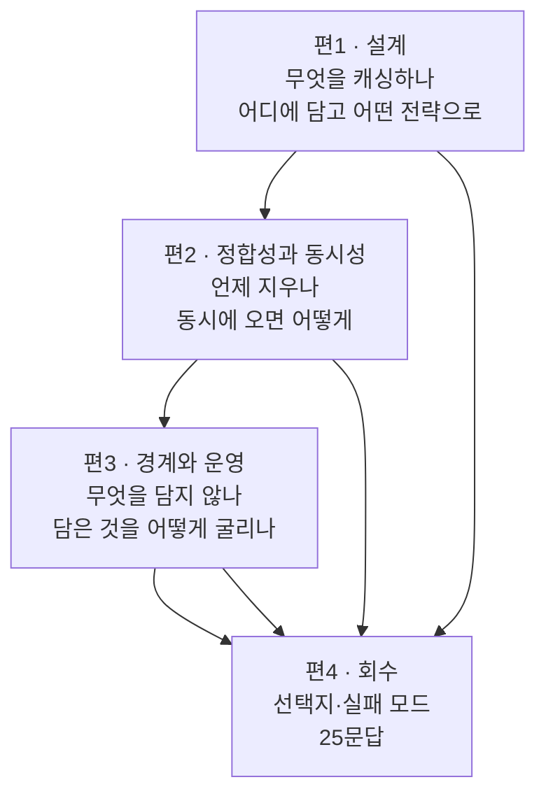
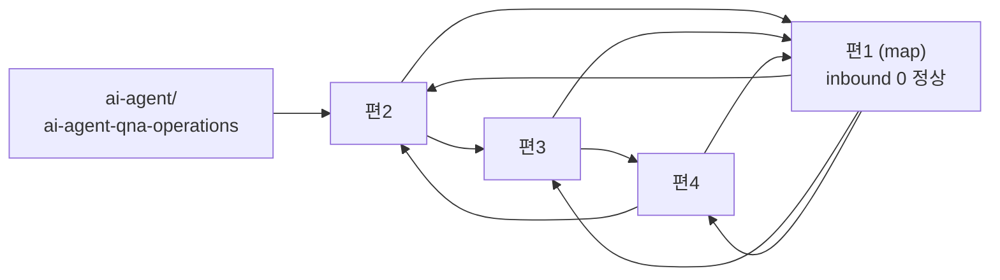

# `backend-engineering` 카테고리 분할 설계 — 서브배치 1

> **이 문서의 범위는 원본 1개다.** `java-backend/03-Redis-캐시-성능개선.md` (46,777 B).
> 나머지 원본 10개는 다음 배치이며 이 설계서가 다루지 않는다.
>
> ⚠️ **배치 스코프 지시는 이 설계서에만 적는다**(발행 게이트 설계서 §3-7).
> 영구 규칙 목록(`GC-*`·`CR-*`·발행 체크리스트)에 옮기지 않는다.
>
> 2026-08-18 발행 완료. §3·§7은 **예상치가 아니라 실측치**로 갱신돼 있다.

---

## 1. 요약

| 항목 | 값 |
| --- | --- |
| 원본 | `C:\Users\aeby\vscode\yanadoo-exit\shared\knowledge\java-backend\03-Redis-캐시-성능개선.md` |
| 원본 크기 | 46,777 B (H2 절 합계 46,388 B) |
| 발행 카테고리 | `backend-engineering` (`categories.ts`에 이미 정의됨, order 70, 발행 전 0편) |
| **발행 편수** | **4편** (초안 5편 → 실측으로 4편으로 정정. §1-1) |
| 발행 합계 | 63,371 B |
| 시리즈 | `redis-cache` / `seriesOrder` 1~4 |
| 신규 태그 | **0개** — 통제 어휘 안에서 해결했다 |
| 발행 제외 | §15 경력 연결 포인트 · 문서 머리 메타 인용문 |

### 1-1. ⚠️ 편수 산정이 한 번 틀렸다 — 변환 비율은 원본마다 다르다

발행 게이트 브리프의 실측 변환 비율은 **1.73**(발행본 2,763,708 B ÷ 소진 원본 1,593,438 B)이었다.
이 값으로 45,235 B를 환산하면 78.3 KB이고, 목표 20 KB로 나누면 3.9편이다.
그런데 절 크기가 1,510~9,327 B로 6배 흩어져 있어 4묶음이 H2 경계와 맞지 않았고, **5묶음으로 잡았다.**

**편1을 실제로 써 보니 8,699 B가 12,786 B가 됐다 — 비율 1.47이다.** 하한 13,300 B에 미달해
`schema.test.ts`가 SOFT로 알렸다. 5편 계획 전체를 이 비율로 다시 환산하니 두 편이 하한을 깼다.

⇒ **1.73은 코퍼스 평균이지 이 원본의 값이 아니다.** 이 원본은 표 밀도가 유난히 높고
표는 설명체로 바꿔도 거의 늘지 않는다. 산문 비중이 높은 원본일수록 비율이 크다.

| 시점 | 근거 | 산출 편수 |
| --- | --- | :---: |
| 계획 | 코퍼스 평균 1.73 | 5 |
| 편1 발행 직후 | 실측 1.47 (12,786 ÷ 8,699) | **4** |
| 전편 발행 후 | **실측 1.40** (63,371 ÷ 45,235) | 4 (확정) |

**다음 배치는 첫 편을 쓴 뒤 비율을 재측정하고 나머지 계획을 갱신하라.** 코퍼스 평균으로 전체를
설계하면 마지막에 하한 미달 편이 남는다.

---

## 2. 원본 절별 실측

`## ` 헤딩 경계로 잘라 UTF-8 바이트를 셌다. 판단이 아니라 실측이다.

| § | 제목 | 원본 B | 배정 |
| --- | --- | ---: | :---: |
| 0 | 용어·약어 사전 | 2,196 | 편1 |
| 1 | 한눈에 보기 | 1,510 | 편1 |
| 2 | 캐시가 필요한 지점을 어떻게 고르는가 | 2,590 | 편1 |
| 3 | Redis 자료구조별 용도 | 2,403 | 편1 |
| 4 | 캐시 전략 비교 | 2,633 | 편1 |
| 5 | 캐시 무효화와 TTL 설계 | 2,012 | 편2 |
| 6 | 캐시 3대 장애 | 2,168 | 편2 |
| 7 | Spring Cache 추상화 vs RedisTemplate | 2,887 | 편2 |
| 8 | 조회수 — 동시성 카운터와 분산 락 | 3,629 | 편2 |
| 9 | 사용자 액션 — 좋아요와 구독 | 2,626 | 편3 |
| 10 | 운영 기능 — 캐시 관리와 Pub/Sub | 2,582 | **편3** |
| 11 | 댓글 — 저장소 선택과 페이징 | 3,094 | 편3 |
| 12 | Redis 운영 지식 | 3,373 | **편3** |
| 13 | 트레이드오프·장애 시나리오 | 2,205 | 편4 |
| 14 | 예상 질문 & 답변 포인트 | 9,327 | 편4 |
| 15 | 경력 연결 포인트 | 1,153 | **발행 제외** |

⚠️ **편3 안에서 §10과 §12의 순서를 뒤집었다.** 이유는 §4-2에 적었다.

---

## 3. 분할표 — 4편 (실측)

| 편 | slug | 제목 | 원본 절 | 원본 B | **발행 B** | 비율 |
| :---: | --- | --- | --- | ---: | ---: | ---: |
| 1 | `redis-cache-design` | Redis 캐시 설계 — 무엇을 캐싱하고, 어떤 자료구조에, 어떤 전략으로 | §0·1·2·3·4 | 11,332 | **16,065** | 1.42 |
| 2 | `cache-invalidation-and-concurrency` | 캐시 무효화와 동시성 — TTL 설계, 3대 장애, 그리고 분산 락 | §5·6·7·8 | 10,696 | **16,381** | 1.53 |
| 3 | `redis-storage-and-operations` | Redis에 담을 것과 담지 않을 것 — 집합 연산부터 운영 지식까지 | §9·10·11·12 | 11,675 | **16,430** | 1.41 |
| 4 | `redis-cache-qna` | Redis 캐시 Q&A — 선택지, 실패 모드 8가지, 25문답 | §13·14 | 11,532 | **14,495** | 1.26 |
| | | **합계** | | **45,235** | **63,371** | **1.40** |

전 편이 하한 13,300 B를 넘는다. 편1~3은 목표 구간 15~25 KB 안이고 **편4는 14.5 KB로 목표 하단보다 작다** —
하한은 넘으므로 병합하지 않았고, 분량을 채우려 내용을 늘리지도 않았다.

⚠️ **편4의 비율이 1.26으로 가장 낮다.** Q&A 원본이 이미 「질문 + 한 줄 결론」으로 압축돼 있어
설명체 전환으로 늘어날 여지가 거의 없었기 때문이다. **Q&A 절은 다른 절보다 낮은 비율로 잡아야 한다.**

### 3-1. slug 근거

발행본의 명명 관례를 따랐다 — **소문자·하이픈, 카테고리 슬러그를 반복하지 않음,
Q&A 편만 주제 접두사를 붙임**(`search-engineering-qna`·`rag-qna-operations`·`ai-agent-qna-operations`).

⚠️ Q&A 편 slug를 `backend-engineering-qna`로 하지 않았다. 이 카테고리는 앞으로 DB 모델링·배치·DDD·CI/CD를
받는다. 카테고리 이름을 Redis 배치가 선점하면 **다음 배치가 쓸 이름이 없어진다.**

---

## 4. 축 정의 — 왜 이렇게 묶었나



| 편 | 축 | 이 축에 들어가는 질문 |
| :---: | --- | --- |
| 1 | **결정** | 이 데이터가 캐싱 대상인가. 어떤 자료구조가 요구사항과 일치하는가. 어떤 전략으로 읽고 쓰는가 |
| 2 | **정합성과 동시성** | 낡은 값을 언제 지우나. 지우다 무엇이 무너지나. 동시 갱신은 어디서 원자성을 얻나 |
| 3 | **경계와 운영** | Redis에 담지 않을 것은 무엇인가. 무엇이 서버를 멈추나. 마스터가 죽으면 |
| 4 | **회수** | 위 셋의 결론만 |

### 4-1. 편2가 §7(Spring 구현)과 §8(조회수)을 함께 받는 이유

§7-4 「Spring Cache 함정」 다섯 항목 중 **셋이 편2의 앞 절을 직접 잇는다** — `null 캐싱`은 §6-3
Penetration 방어의 부작용이고, `TTL 파라미터 부재`는 §5-3 TTL 설계의 실행 문제이며,
`@Cacheable(sync=true)`는 §6-2 Stampede 대응의 한계로 §6에 이미 등장한다.

§8은 **분산 락이 §6-2 Stampede 대응의 처방**이라는 이유로 같은 편에 들어왔다. 원본은
「분산 락으로 1개만 재계산」이라고만 적고 락의 구현을 60줄 뒤 §8-3에 둔다. 두 절을 갈라 놓으면
처방과 그 구현이 다른 편으로 흩어진다.

### 4-2. ⚠️ 편3 안에서 §10을 §12 뒤로 옮겼다

원본 순서는 §10(운영 기능) → §12(Redis 운영 지식)인데 발행본은 **§12를 먼저 세우고 §10을 그 귀결로 놓았다.**

| 절 | 원본 위치 | 발행본 위치 | 근거 |
| --- | --- | --- | --- |
| §12-2 단일 스레드 모델 | 뒤 | **앞** | `KEYS *`가 왜 사고인지, `INCR`이 왜 안전한지를 **동시에 설명하는 근거**다 |
| §10-1 `KEYS *` | 앞 | **뒤** | 위 근거의 귀결이다. 근거보다 먼저 나오면 「O(N)이라 위험하다」는 암기 항목이 된다 |

`CR-4.5`(도식과 설명이 같은 편에 있는가)를 절 안쪽까지 적용한 형태다. 두 절이 같은 편 안에 있어도
**순서가 뒤집혀 있으면 설명이 근거보다 먼저 나온다.**

### 4-3. §11(댓글)이 편3에 있는 이유

§11은 Redis 얘기가 아니라 MongoDB 얘기다. 그런데도 편3에 둔 것은 편3의 축이
「담을 것과 담지 않을 것」이기 때문이다. **§11은 반례로서 그 축의 절반을 이룬다** —
좋아요·구독은 담고(§9), 댓글 본문은 담지 않는다(§11). 판단 기준은 「원본이 어디에 있는가」 하나다.

---

## 5. 발행 제외 — 절 단위 확정

| 대상 | 원본 위치 | 판정 | 근거 |
| --- | --- | --- | --- |
| 문서 머리 메타 인용문 (`작성 기준일` / `출처` / `목적`) | L1~5 | **제거** | `CR-1.2`. 「출처」 줄에 교육 플랫폼명이 있어 금칙어 HARD에도 걸린다 |
| §15 경력 연결 포인트 | L677~683 | **제거** | 회사 실명 3곳(HARD 금칙어)이며 개인 경력 서사다(`CR-1.3`·`CR-2.4`). 기술 내용이 0줄이다 |
| §12 제목의 부제 「(면접 필수 보강)」 | L517 | **제목 재작성** | `CR-1.4`·SOFT 금칙어 |
| §14 제목 「면접 예상 질문」 | L603 | **제목 재작성** | `CR-1.4`·`CR-2.1` |
| §2-2 마지막 문장 「면접에서 짚을 수 있으면 좋다」 | L89 | **문장 삭제** | `CR-1.4`. 앞 문장이 결론을 이미 담고 있어 삭제로 끝났다 |
| §10-2 마지막 문장 「면접에서 …라는 질문이 나오면」 | L445 | **주어 교체** | 질문 자체는 기술 질문이라 살리고 상황 수식만 걷었다(`CR-1.9` — 화법만 걷는다) |

⚠️ **§15를 지운 자리를 메우지 않았다**(금지선 21·44). 열도 문단도 새로 세우지 않고 절 자체를 없앴다.

### 5-1. 제거 후 남는 것을 세었다

§15가 지고 있던 정보는 「이 기술이 어느 도메인에서 쓰였나」인데, 그 서술은 **§2-2가 회사명 없이 이미 담고 있다**
(컨텐츠 서비스 vs 커뮤니티 서비스 비교표). 즉 §15를 지워도 잃는 기술 정보가 0이다.
`CR-1.9`가 요구하는 「그 낱말이 지고 있던 정보」는 **화법(자기 경력 귀속)뿐**이므로 화법만 사라진다.

---

## 6. 태그 설계

`content/blog/tags.ts` 79종은 닫힌 집합이다. **신규 태그 0개**로 해결했다.

| 편 | 태그 | 패싯 검산 |
| :---: | --- | --- |
| 1 | `redis` `nosql` `caching` `performance-tuning` | A:2 B:2 |
| 2 | `redis` `spring` `caching` `concurrency` | A:2 B:2 |
| 3 | `redis` `nosql` `event-driven` `troubleshooting` | A:2 B:2 |
| 4 | `redis` `spring` `caching` `troubleshooting` | A:2 B:2 |

전 편이 패싯당 상한 2를 지킨다. `MAX_TAGS = 6` 이하이고 권장치 4에 맞췄다.

원본 주제 중 통제 어휘 밖 표기는 아래로 **매핑**했다. 어휘를 늘리지 않았다.

| 원본 표기 | 쓰는 태그 |
| --- | --- |
| `spring-boot` | `spring` |
| `mysql` · `mongodb` | `nosql` |
| `cache` | `caching` |

---

## 7. 검산 — 실측 결과

| 지표 | 기준 | 실측 | 판정 |
| --- | --- | --- | :---: |
| 발행 편수 | §3 | 4 | ✅ |
| 편별 바이트 | 13,300 B 이상 | 14,495 / 16,065 / 16,381 / 16,430 | ✅ |
| 금칙어 HARD (소스) | 0 | 0 (검사 파일 130개) | ✅ |
| 금칙어 HARD (산출물) | 0 | 0 (산출물 384개) | ✅ |
| 죽은 링크 | 0 | 0 | ✅ |
| 고립 편 | 0 | 0 | ✅ |
| mermaid 도식 | 원본 8개 전수 보존 | 8개 (3+3+2+0) | ✅ |
| 축자 복제 | 사람 판정 | 3건 — 전부 코드·API 리터럴 | ✅ |
| 비블로그 산출물 | 불변 | 14개 불변 | ✅ |

### 7-1. 도식 절별 대조표 (`CR-6.2`)

총합만 비교하면 이동과 유실을 구분할 수 없다. 절별로 셌다.

| 원본 도식 위치 | 종류 | 배정 편 |
| --- | --- | :---: |
| §1 아키텍처 흐름 | flowchart LR | 1 |
| §3-2 Sorted Set vs RDBMS | flowchart LR | 1 |
| §4-2 쓰기 전략 | flowchart LR | 1 |
| §6-2 Stampede 대응 | flowchart LR | 2 |
| §7-2 접근법 선택 | flowchart TD | 2 |
| §8-1 조회수 개선 전후 | flowchart LR | 2 |
| §10-2 Pub/Sub | sequenceDiagram | 3 |
| §12-2 단일 스레드 | flowchart LR | 3 |

원본 8개가 전부 살아 배정됐다. **편4에는 원본 도식이 없다** — §13·§14에 도식이 없기 때문이다.
새로 그린 도식은 0개다. 무근거 노드·화살표가 생길 자리가 없다(금지선 28·30).

---

## 8. 카테고리 고립 대응

`backend-engineering`은 발행 전 0편이라 **통째로 고립될 수 있었다.** `search-engineering` 6편이 실제로 그랬다.

| 순위 | 방법 | 채택 |
| :---: | --- | :---: |
| 1 | 기존 발행본에서 자연스러운 자리를 찾아 링크 | **채택** |
| 2 | 지도편에 `role: "map"` 부여 | **채택**(편1) |
| 3 | 억지 링크 | 하지 않음 |

### 8-1. 유입 링크 자리 — 전수 조사 결과

`content/blog` 124편 전체에서 `Redis` 문자열은 **1건**(`agentic-coding/claude-md-scope-layers.md:91`,
표 셀 안의 예시 문구)뿐이었다. 표 셀에 링크를 끼우는 것은 억지라 배제했다.

`캐시` 문자열로 다시 훑어 **의미가 이어지는 자리 1곳**을 찾아 링크를 걸었다.

| 파일 | 줄 | 그 자리의 문장 | 잇는 대상 | 확인 |
| --- | :---: | --- | --- | --- |
| `ai-agent/ai-agent-qna-operations.md` | 194 | 「무효화 없는 영구 캐시는 기능이 아니라 결함이다」 | 편2 | 편2에 「무효화 방식 네 가지」 표와 「TTL 설계 원칙」 표가 **실재함을 열어 확인**했다(금지선 45) |

Elasticsearch의 캐시(`search-engineering/elasticsearch-operations.md`)는 **다른 물건이라 쓰지 않았다**
(금지선 47 — 「리랭커」가 한쪽은 LTR, 다른 쪽은 Cross-Encoder였던 사례와 같은 형태다).

### 8-2. 최종 링크 지형



편1은 `role: "map"`이라 inbound 0이 허용된다. 편2~4는 전부 inbound가 1 이상이다.

---

## 9. 배치 계획 — 실제 커밋 순서

편별로 커밋했고 pre-commit 훅이 편마다 3단 게이트를 돌았다.

| # | 커밋 | 함께 넣은 링크 편집 | 그 커밋이 유효한 이유 |
| :---: | --- | --- | --- |
| 1 | 편1 | — | map이라 inbound 0 허용. outbound 0 |
| 2 | 편2 | 편1 목차 · `ai-agent-qna-operations` | 편2 inbound 2 |
| 3 | 편3 | 편1 목차 · 편2 맺음 | 편3 inbound 2 |
| 4 | 편4 | 편1 목차 · 편3 맺음 | 편4 inbound 2 |

### 9-1. ⚠️ 시리즈 지도편은 「먼저 완성해서 커밋」할 수 없다

첫 시도에서 편1을 **목차 링크를 다 채운 채로** 커밋했다가 게이트에 막혔다.

```
FAIL tests/blog/content/links.test.ts > 링크 무결성 > 내부 링크의 대상이 전부 실재한다
AssertionError: 죽은 링크 4건
  backend-engineering/redis-cache-design -> backend-engineering/cache-strategy-and-invalidation
  backend-engineering/redis-cache-design -> backend-engineering/redis-counter-and-set-patterns
  backend-engineering/redis-operations-and-failure-modes
  backend-engineering/redis-cache-qna
```

`CR-4.3`은 시리즈 첫 글에 전체 목차를 요구하고, 링크 검사는 대상이 실재할 것을 요구한다.
**편별 커밋을 유지하면서 둘을 동시에 만족시키려면 목차 링크를 한 줄씩 나중에 채워야 한다.**
위 표의 「함께 넣은 링크 편집」 열이 그 결과다.

---

## 10. ⚠️ 다음 배치에 남기는 것

| 항목 | 내용 |
| --- | --- |
| 남은 원본 | `java-backend/` 10개 (01·02·04~10·README) |
| **변환 비율** | 이 원본은 **1.40**이었다. 코퍼스 평균 1.73으로 계획하면 하한 미달 편이 생긴다. **첫 편을 쓴 뒤 재측정하라** |
| Q&A 절 비율 | **1.26** — 이미 압축된 형태라 가장 적게 늘어난다. 별도로 잡아라 |
| 이 배치가 쓴 slug | `redis-cache-design` · `cache-invalidation-and-concurrency` · `redis-storage-and-operations` · `redis-cache-qna` |
| `backend-engineering-qna` | **비워 뒀다.** 카테고리 전체 Q&A가 필요해질 때 쓴다 |
| 시리즈 이름 | `redis-cache` 사용. 다음 배치는 별도 시리즈를 판다 |
| 유입 링크 | 이제 `backend-engineering`이 4편 있으므로 다음 배치는 **이 4편에서 유입 링크를 찾을 수 있다.** 카테고리 고립 문제는 이 배치로 끝났다 |
