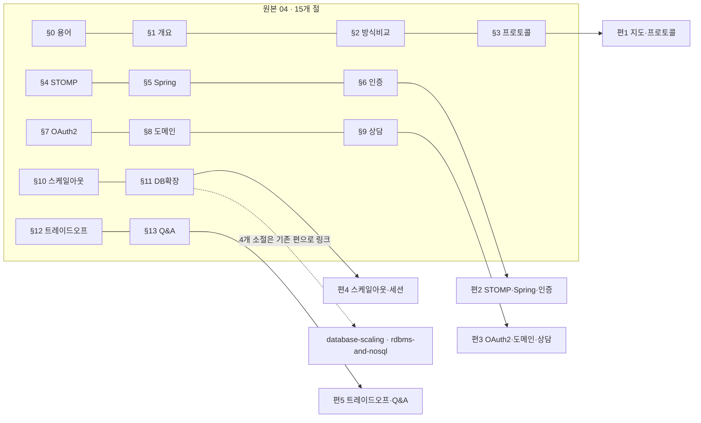
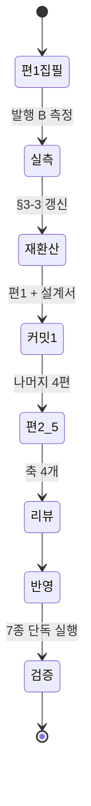

# `websocket-realtime` 분할 설계 — 원본 04를 5편으로

> **이 문서의 범위는 원본 1개다.** `java-backend/04-WebSocket-실시간채팅-인증-확장.md` (58,503 B).
> 나머지 원본 6개는 다음 배치이며 이 설계서가 다루지 않는다.
>
> ⚠️ **배치 스코프 지시는 이 설계서에만 적는다**(발행 게이트 설계서 §3-7).
> 영구 규칙 목록(`GC-*`·`CR-*`·발행 체크리스트)에 옮기지 않는다.
>
> 2026-08-18 착수. §3의 편수·비율은 **편1 완주 전까지 초안이다.**

---

## 1. 요약

| 항목 | 값 |
| --- | --- |
| 원본 | `C:\Users\aeby\vscode\yanadoo-exit\shared\knowledge\java-backend\04-WebSocket-실시간채팅-인증-확장.md` |
| 원본 크기 | 58,503 B (H2 절 합계 58,152 B) |
| 발행 카테고리 | `backend-engineering` (order 70, 발행 전 15편) |
| **발행 편수(초안)** | **5편** — 편1 실측 후 §3-3에서 재환산한다 |
| 시리즈 | `websocket-realtime` / `seriesOrder` 1~5 |
| 신규 태그 | **0개** — `websocket`은 조건 ②에서 탈락(§5) |
| 발행 제외 | §14 경력 연결 포인트 · 문서 머리 출처 인용문 |
| 카테고리 진입 후 | 15편 → **20편** |

### 1-1. 절차 — 앞 배치가 확립한 순서를 그대로 쓴다

| 단계 | 무엇 | 상태 |
| :---: | --- | :---: |
| ① | 절 경계로 잠정 묶음 (§3) | 완료 |
| ② | **편1만 완주 → 실측 비율을 §3-2에 써 넣고 커밋** | — |
| ③ | 그 비율로 §3을 재환산 (§3-3) | — |
| ④ | 나머지 4편 | — |

앞 배치에서 네 편을 동시에 띄웠다가 재환산이 실행될 틈이 없었고, 계획 1.40이 실측 1.81로
빗나가 한 편이 31.9 KB로 갔다. **②를 건너뛰지 마라.**

---

## 2. 원본 절별 실측 — 성분까지 갈랐다

`LC_ALL=C awk`로 코드블록 내부를 먼저 떼어 낸 뒤 표(`^|`) · 인용(`^>`) · 불릿(`^- `, `^1. `) ·
산문을 갈라 바이트로 셌다. 백분율은 절 합계 대비다.

| 절 | 합계 B | 산문% | 표% | 코드% | 불릿% | 도식 |
| --- | ---: | ---: | ---: | ---: | ---: | ---: |
| 0. 용어·약어 사전 | 2,773 | 0.1 | **98.7** | 0.0 | 0.0 | 0 |
| 1. 한눈에 보기 | 1,488 | 4.2 | 0.0 | 30.8 | **63.0** | 1 |
| 2. 실시간 통신 방식 비교 | 2,156 | 0.2 | 44.2 | 17.9 | 30.0 | 1 |
| 3. WebSocket 프로토콜 | 4,180 | 0.1 | 41.3 | 30.0 | 21.2 | 1 |
| 4. STOMP | 2,841 | 10.8 | 36.3 | 14.3 | 31.2 | 1 |
| 5. Spring의 WebSocket 지원 | 4,085 | 0.1 | 36.4 | **45.7** | 12.9 | 0 |
| 6. 인증·인가 | 2,907 | 8.0 | 30.4 | 21.4 | 33.0 | 2 |
| 7. 회원가입·OAuth2 | 3,403 | 0.1 | 22.5 | 41.6 | 24.2 | 3 |
| 8. 채팅 도메인 | 3,426 | 0.1 | 26.3 | 14.8 | **51.8** | 3 |
| 9. 상담 서비스 확장 | 1,238 | 0.3 | 39.5 | 15.8 | 39.4 | 1 |
| 10. 확장 (1) 웹서버 스케일아웃 | 8,067 | 9.6 | 43.6 | 24.4 | 16.5 | **7** |
| 11. 확장 (2) 데이터베이스 | 6,027 | 0.1 | 26.3 | 28.6 | 38.8 | 3 |
| 12. 트레이드오프·장애 시나리오 | 2,711 | 0.1 | **95.6** | 0.0 | 0.0 | 0 |
| 13. 면접 예상 질문 25문 | 11,626 | 0.0 | 46.7 | 0.0 | 0.0 | 0 |
| 14. 경력 연결 포인트 *(제외)* | 1,224 | 0.0 | 75.1 | 0.0 | 22.2 | 0 |
| **합계** | **58,152** | **2.4** | **43.0** | **18.6** | **20.4** | **23** |

인용 10.8%(6,308 B) — 그중 6,111 B가 §13 한 절에 몰려 있다.

**이 원본의 성질은 두 줄로 요약된다.** 산문이 2.4%로 사실상 없고, 표가 43%로 코퍼스에서 가장 높다.

### 2-1. ⚠️ 성분으로 비율을 계산하지 마라 — 앞 배치가 두 번 틀렸다

앞 배치 설계서 §2-1이 「산문 비중이 높으면 더 부푼다」를 적었다가 편1 실측 뒤 **반대**임을 확인하고
초안을 취소선으로 남겼다. 계수 모델(`비산문 ×1.05 + 산문 ×3.5`)로 원본 01을 역검산하면 1.21이
나오는데 실측은 1.81이었다.

**쓸 수 있는 것은 계수가 아니라 같은 역할·같은 성분의 편끼리 견주는 것뿐이다.**

| 역할 | 앞 배치들의 실측 | 이번 적용 |
| --- | --- | ---: |
| 지도편 (용어 사전 + 시리즈 목차) | 2.02 · **2.12** — 두 배치가 일치했다 | 2.05 (§3 참조 — 순수 지도편이 아니다) |
| 본편 (불릿 없음) | 1.62 · 1.74 | — |
| 본편 (불릿 15% · 인용 22%) | **1.99** | **1.90** |
| Q&A편 (표+인용, 산문 0%) | 1.77 | **1.77** |

이번 원본의 불릿은 **20.4%**로 앞 배치에서 1.99로 튄 편(15%)보다 높고, 산문은 2.4%로 더 낮다.
둘 다 비율을 올리는 방향이다. 반면 표 43%가 반대로 누른다. **두 힘이 상쇄되는 구간이라
초안 1.90은 신뢰 구간이 넓다** — 그래서 §1-1 ②가 더 중요하다.

---

## 3. 분할표 — 5편 (초안)



| 편 | 원본 절 | 원본 B | 역할 | 비율(초안) | 예상 발행 B | 도식 |
| :---: | --- | ---: | --- | ---: | ---: | ---: |
| 1 | §0 · §1 · §2 · §3 | 10,597 | `map` | 2.05 | 21,724 | 3 |
| 2 | §4 · §5 · §6 | 9,833 | 본편 | 1.90 | 18,683 | 3 |
| 3 | §7 · §8 · §9 | 8,067 | 본편 | 1.90 | 15,327 | 7 |
| 4 | §10 · §11(선별) | 10,567 | 본편 | 1.90 | 20,077 | 8 |
| 5 | §12 · §13 | 14,337 | `qna` | 1.77 | 25,376 | **0** |
| | | **53,401** | | **1.89** | **101,187** | 21 |

**편5의 도식 0개는 결함이 아니다 — 기존 Q&A편 실측이 그렇다.**

| 기존 Q&A편 | 도식 | 크기 |
| --- | ---: | ---: |
| `database-scaling-qna` | 1 | 29,251 B |
| `database-fundamentals-qna` | 0 | 26,322 B |
| `redis-cache-qna` | 0 | 14,495 B |

⇒ **억지로 만들지 않는다.** 하나 넣는다면 설명 없이는 안 서는 답변 하나에만 넣는다
(`database-scaling-qna`가 Saga 보상 트랜잭션 하나에 쓴 방식). 도식 수는 이 편의 검산 대상이 아니다.

### 3-1. 편1이 순수 지도편이 아닌 이유

`§0+§1+§2`만 묶으면 6,417 B이고 지도편 비율 2.10을 적용해도 **13.5 KB로 하한 13.3 KB 턱걸이**다.
앞 배치 지도편의 원본은 9,876 B였다 — 이번은 그보다 35% 작다.

⇒ `§3`(WebSocket 프로토콜)을 편1에 넣는다. 「무엇을 언제 고르나」의 답을 프로토콜 수준에서
마무리하는 구성이라 주제도 끊기지 않는다. 대신 **비율은 순수 지도편 2.10이 아니라 2.05**로 잡는다.

### 3-2. slug 근거

| 편 | slug | 근거 |
| :---: | --- | --- |
| 1 | `realtime-transport-and-websocket` | 「무엇을 고르나」와 「그것이 어떻게 도는가」를 한 이름에 담는다 |
| 2 | `stomp-and-spring-websocket` | 규약(STOMP)과 그것을 얹는 프레임워크 층이 한 편이다 |
| 3 | `oauth2-login-and-chat-domain` | 인증 완성 + 도메인 모델. `-and-` 연결은 기존 관례 |
| 4 | `realtime-scaleout-and-session` | 이 편의 논점은 서버 대수가 아니라 **상태를 어디에 두는가**다 |
| 5 | `websocket-realtime-qna` | Q&A편은 `<series>-qna` — `redis-cache-qna`·`database-scaling-qna` 관례 |

### 3-3. ✅ 편1 실측 후 재환산 — 완료

**편1 실측: 원본 10,597 B → 발행 23,237 B · 비율 2.19** (초안 2.05 대비 **+7.0%**, 도식 3, CRLF 0)

앞 배치 규칙 1에 따라 **이 값을 본편에도 그대로 적용**한다. 「지도편 프리미엄」 보정은
실측된 적이 없고, 이번 편1은 §3(본편 성격)을 4,180 B 포함하므로 순수 지도편도 아니다.

| 편 | 원본 B | 비율 | 재환산 목표 B | 밴드 ±15% | 초안 대비 |
| :---: | ---: | ---: | ---: | --- | ---: |
| 1 ✅ | 10,597 | **2.19**(실측) | — | 23,237 (확정) | +7.0% |
| 2 | 9,833 | 2.19 | 21,534 | 18,304 ~ 24,764 | +15.3% |
| 3 | 8,067 | 2.19 | 17,667 | 15,017 ~ 20,317 | +15.3% |
| 4 | 10,567 | 2.19 | 23,142 | 19,671 ~ 26,613 | +15.3% |
| 5 | 14,337 | 1.77~1.89 | 25,376 ~ 27,097 | 하단 강제 없음 · 상한 경고 30,100 | — |
| **합계** | **53,401** | | **약 111,000** | | |

**편5만 Q&A 역할 비율을 유지한다.** 1.77은 두 배치에서 각각 나온 값이고, 편1의 상향(+7%)은
지도편·본편 성질에서 나온 것이라 문답 형식에 그대로 옮길 근거가 없다. 대신 **하단을 강제하지 않고
상한만 경고**로 준다(§8-2).

전 편이 하한 13,300 B(SOFT) 위이고, 상한 29,400 B에 닿는 편은 없다.

---

## 4. 발행 제외

| 대상 | B | 사유 |
| --- | ---: | --- |
| 문서 머리 출처 인용문 (3행) | ~200 | 금칙어. `scripts/check-forbidden.mjs`가 정본 |
| §14 경력 연결 포인트 | 1,224 | 개인 경력 연결. 앞 3배치 모두 제외했다 |

§14 안의 회사명 4개(SK브로드밴드·CJ헬로비전 TVING·야나두)는 **제외로 함께 사라진다.**
본문 §0~§13에는 사명이 없다 — grep으로 확인했다.

---

## 5. 태그 설계 — `websocket`을 추가하지 않는다

새 태그 조건 4개 중 **②(2개 이상 카테고리)를 만족하지 못한다.** 현재 실시간 통신을 다루는
카테고리는 `backend-engineering` 하나뿐이고, `high-traffic` 원본은 미발행이다.
`django`가 조건 ①은 만족했으나 ②에서 탈락한 것과 같은 형태다.

⇒ **후보로만 기록한다.** `high-traffic` 발행 시 재검토한다.

| 편 | 태그(통제 어휘 안에서) |
| :---: | --- |
| 1 | `api-design` · `event-driven` · `java` · `spring` |
| 2 | `spring` · `java` · `event-driven` · `api-design` |
| 3 | `authentication` · `security` · `spring` · `database` |
| 4 | `scalability` · `distributed-systems` · `redis` · `caching` |
| 5 | `scalability` · `authentication` · `spring` · `distributed-systems` |

문서당 4개(허용 3~5), 같은 패싯 최대 2개, 카테고리 슬러그와 중복 금지 — 전부 만족한다.

---

## 6. 검산 — 도식 절별 대조 (`CR-6.2`)

원본 도식 23개 중 §14에 0개, 편별 배분은 §3 표의 마지막 열과 같다(합계 21 + 편5 신규).
편4가 8개로 가장 많다 — §10 하나에 7개가 몰려 있기 때문이다. **한 편에 8개는 앞 배치 최대치와
같은 수준**이므로, 편4 집필자는 도식을 줄이지 말고 **절 경계에 맞춰 배치**만 확인한다.

---

## 7. 링크 지형 — ⚠️ **이 배치의 핵심 위험이자 기회**

### 7-1. §11은 대부분 이미 발행됐다 — **개념 중복이지 축자 중복이 아니다**

원본은 구식 어휘(`Master-Slave`)를 쓰고 발행본은 DDIA 관례(`단일 리더`)를 쓴다.
**`grep 'Master-Master'`는 0건을 냈지만 중복이 없다는 뜻이 아니었다.**
`dup-scan`은 이 유형을 보지 못한다(CLAUDE.md 함정 표).

| 원본 소절 | 기존 발행본 | 처리 |
| --- | --- | --- |
| 11-1 Clustering (Master-Slave/Master-Master/Active-Standby) | `replication-topologies-and-lag.md` (단일 리더·다중 리더·리더리스) | **링크로 대체** |
| 11-2 `AbstractRoutingDataSource` 읽기/쓰기 분리 | 없음 — **고유** | 편4에서 쓴다 |
| 11-3 Partitioning (수평·수직) | `partitioning-fundamentals.md` (「수직 파티셔닝」 4회) | **링크로 대체** |
| 11-4 Sharding | `partitioning-strategies-and-sharding.md` | **링크로 대체** |
| 11-5 NoSQL 검토 | `rdbms-and-nosql-fundamentals.md` | **링크로 대체** |
| 11-6 최종 DB 아키텍처 (AS-IS → TO-BE) | 없음 — **고유**(서비스 맥락) | 편4에서 쓴다 |

⇒ **편4는 §11을 다시 설명하지 않는다.** 「이 서비스에서 그 선택을 어떻게 적용했는가」만 쓰고
개념은 기존 편으로 넘긴다. 원본 6,027 B 중 유효분은 약 2,500 B다.

### 7-2. 그래서 카테고리 고립이 함께 풀린다

HANDOFF가 지적한 「`backend-engineering`으로 들어오는 카테고리 밖 링크가 1개뿐」의 반대편 —
**시리즈 사이 링크**가 이 배치에서 4개 이상 생긴다. `redis-cache` 시리즈로도 이어진다
(§10-4 세션 외부화 · §10-5 Pub/Sub 전파).

| 나가는 링크 | 대상 시리즈 |
| --- | --- |
| 편4 → 복제 토폴로지 | `database-scaling` |
| 편4 → 파티셔닝·샤딩 (2건) | `database-scaling` |
| 편4 → RDBMS/NoSQL 선택 | `database-fundamentals` |
| 편4 → Redis 저장 구조·운영 | `redis-cache` |
| 편3 → 데이터 모델링 | `database-fundamentals` |

### 7-3. 시리즈 지도편 규칙 (앞 배치에서 확립)

`CR-4.3`은 시리즈 첫 글에 전체 목차를 요구하고 링크 검사는 대상 실재를 요구한다.
⇒ **지도편을 링크 없이 먼저 내고, 이후 각 편 커밋에 그 편의 목차 링크 한 줄을 함께 넣는다.**

---

## 8. 배치 계획



### 8-1. 편별 검증 (편마다, 커밋 직전)

| 순서 | 명령 | 통과 기준 |
| :---: | --- | --- |
| 1 | `npm run check-forbidden:verify` → `npm run check-forbidden` | self-test 전건 통과 후 **HARD 0** |
| 2 | `npm run dup-scan:verify` → `npm run dup-scan -- --category backend-engineering` | self-test 통과 후 잔여 건은 고유명사만 |
| 3 | `npx vitest run tests/blog` | 전건 통과 |
| 4 | `npx tsc --noEmit` | 0 |

⚠️ **파이프 뒤 종료코드는 마지막 명령의 것이다.** 종료코드를 읽을 명령은 **단독 실행**한다.
⚠️ **pre-commit 훅은 인덱스가 아니라 작업트리를 본다.** 편별로 쓰고 **즉시 커밋**한다.
⚠️ 커밋은 반드시 `git commit -m "메시지" -- <경로>` 형태로 — `git add` 경로 지정만으로는
다른 에이전트의 스테이지가 함께 담긴다.

### 8-2. 예산 — **상한 경고로만 준다**

앞 배치가 밴드를 1.70~1.95로 좁게 줘서 집필자들이 자연 집필분의 14~17%를 걷어냈다.
그 앞 배치는 예산을 주지 않아 31.9 KB로 넘쳤다. **둘 다 예산이 추정이었던 것이 뿌리다.**

| 규칙 | 이번 적용 |
| --- | --- |
| 첫 편 실측 비율을 본편에도 그대로 적용 | 「지도편 프리미엄」 보정은 실측된 적이 없다 |
| 밴드 폭 | **±15%** |
| 하한 | **강제하지 않는다** — 13.3 KB(SOFT)만 지킨다 |
| 상한 | 29.4 KB 초과는 **경고**이지 금지가 아니다(금지선 13) |

---

## 9. 집필 브리프에 그대로 넣을 것

1. **이 원본은 산문이 2.4%다.** 표·불릿·코드를 산문으로 **푸는 것**이 작업의 본체다.
   표를 그대로 옮기고 앞뒤에 한 줄씩 붙이는 방식은 이 원본에서 통하지 않는다
2. **§11의 네 소절은 쓰지 마라**(§7-1). 링크로 넘기고, 이 서비스 맥락의 적용만 쓴다
3. **`LazyConnectionDataSourceProxy`가 왜 필요한가**는 이 원본에서 가장 값어치 있는 대목이다
   (커넥션 획득 시점 때문에 `readOnly` 플래그가 아직 없어 라우팅이 master로 떨어진다).
   축약하지 마라
4. **수치는 원본에 있는 것만 쓴다.** 없는 벤치마크를 지어내지 않는다
5. **실측과 추측을 구분해 표기한다**

### 9-1. 이 원본 특유의 위험

| 위험 | 왜 | 검증 방법 |
| --- | --- | --- |
| 구식 어휘 혼입 | 원본이 `Master-Slave`를 쓴다. 발행본은 `단일 리더`다 | `grep -n 'Master-Slave\|Slave'` — 발행 전 0건 |
| §10-5와 Redis 편 중복 | Pub/Sub 전파가 `redis-storage-and-operations`와 겹칠 수 있다 | 해당 편을 열어 **의미로** 대조. dup-scan으로는 안 잡힌다 |
| Q&A 25문 중 22~24번 | 파티셔닝·샤딩·NoSQL — 기존 Q&A편과 겹칠 수 있다 | `database-scaling-qna.md` 문항 목록과 대조. **채팅 맥락 적용**으로 차별화 |
| 편5 도식 0개 | 원본에 없다 | 앞 배치 Q&A편 방식 확인 후 동일 적용 |

---

## 10. 배치 완료 — 실측과 회고

커밋 `31f2d52`(설계) · `3554ae2`(편1+재환산) · `d8048fb`(편2) · `64b3c7b`(편3) ·
`75b6da2`(편4) · `173a74d`(편5). 발행본 139 → **144편**.

### 10-1. 예측 대 실측

| 편 | 원본 B | 재환산 목표 B | **최종 발행 B** | 최종 비율 | 밴드 |
| :---: | ---: | ---: | ---: | ---: | :---: |
| 1 | 10,597 | — (실측 기준) | **23,536** | 2.22 | — |
| 2 | 9,833 | 21,534 | **19,550** | 1.99 | 안 |
| 3 | 8,067 | 17,667 | **16,592** | 2.06 | 안 |
| 4 | 10,567 | 23,142 | **20,371** | 1.93 | 안 |
| 5 | 14,337 | 25,376~27,097 | **21,399** | 1.49 | 하단 미달 |
| | **53,401** | 약 111,000 | **101,448** | **1.90** | |

편1의 최종치가 실측 시점(23,237)보다 큰 것은 목차 링크 4줄이 나중에 붙었기 때문이다.

### 10-2. ✅ 예산을 상한 경고로만 준 것은 옳았다

§8-2가 정한 세 규칙이 전부 제 몫을 했다.

| 규칙 | 결과 |
| --- | --- |
| 첫 편 실측을 본편에 그대로 적용 | 편2~4가 목표의 91~94%로 들어왔다. 앞 배치처럼 걷어내게 만들지 않았다 |
| 밴드 ±15% | 편2~4 전부 밴드 안. 조정이 필요 없었다 |
| **하단 강제하지 않음** | **편5가 이 규칙 덕분에 살았다**(아래) |

### 10-3. ⚠️ Q&A편은 비율이 구조적으로 낮다 — 다음 배치가 알아야 할 것

**편5가 1.49로 목표(1.77)를 16% 밑돌았고, 이것은 결함이 아니다.**

| 배치 | 원본 Q&A절의 성분 | 발행 비율 |
| --- | --- | ---: |
| 앞 배치(원본 01) | 표 + **인용문 34%** | 1.77 |
| 이번(원본 04) | 표 46.7% + 인용 나머지, **산문 0%** | **1.49** |

앞 배치 Q&A편이 1.77이었던 것은 **인용문 덩어리를 산문으로 풀 여지가 컸기** 때문이다.
이번 원본 §13은 이미 표로 압축된 문답이고, 발행본도 표 형식이 관례라 풀어쓸 자리가 없었다.

⇒ **Q&A편 비율은 원본 Q&A절의 인용 비중으로 갈린다.** 1.77을 상수로 쓰지 마라.
⇒ 원본 항목(선택지 7·실패 모드 10·25문항·심화 4)을 전부 담았는지가 판정 기준이고,
크기가 아니다. 담았으면 그대로 낸다.

### 10-4. ⚠️ 새 유형 — **참고한 발행본이 출처인 중복**

앞 배치가 「원본 사이의 중복」을 새 유형으로 기록했는데, 이번엔 다른 경로가 두 번 나왔다.

| 자리 | 무엇을 복제했나 | 검출 |
| --- | --- | --- |
| 편1 도입·용어 절 | `partitioning-fundamentals`의 **지도편 상용구** | dup-scan 6건 → 4건이 실질 |
| 편5 도입·description | `database-scaling-qna`의 **Q&A편 상용구** | dup-scan 23건 → 6건이 실질 |

**형식을 따르는 것과 문장을 옮기는 것은 다르다.** 기존 편을 열어 구조를 익힌 직후에
쓰면 문장이 딸려 온다. 원본이 아니라 **내가 참고한 발행본**이 출처다.

⇒ **판정 기준을 숫자로 잡을 수 있다.** 기존 Q&A편은 단독 스캔에서 2~3건인데
편5 초안은 23건이었다. **같은 역할의 기존 편과 건수를 견주면 관례 이탈이 드러난다.**
「Q&A편은 원래 겹친다」로 넘어갈 뻔한 자리였다.

### 10-5. ✅ §11 링크 대체는 예측대로 작동했다

설계 §7-1이 지목한 대로 §11 여섯 소절 중 넷을 쓰지 않고 기존 편으로 넘겼다.

| 예측 | 실측 |
| --- | --- |
| 시리즈 사이 링크 4개 이상 | 편4에서 **5종 7건**, 편3에서 3건, 편5에서 2건 |
| §11 유효분 약 2,500 B | 편4가 §10 중심으로 서고 DB 절은 「달라지는 것 셋」으로 압축됐다 |

`grep 'Master-Master'`가 0건을 냈지만 개념은 전부 발행돼 있었다.
**dup-scan으로는 잡히지 않는 유형이므로 설계 단계의 수동 대조가 유일한 방어선이다.**

### 10-6. 컨트롤러가 저지른 것

| # | 무엇 | 어떻게 드러났나 |
| ---: | --- | --- |
| 1 | 편1에서 지도편 상용구를 복제 | dup-scan |
| 2 | 편5에서 Q&A편 상용구를 복제 | dup-scan **+ 기존 편과 건수 비교** |
| 3 | 편2에서 `SimpleBroker`·`Relay`를 용어 사전에만 두고 본문에서 안 다룸 | 크기 미달을 조사하다 발견 |
| 4 | 편4에서 「면접」 사용 | 금칙어 SOFT |
| 5 | 편4 코드의 `master`·`slave`가 본문 「원본·복제본」과 어긋남 | 설계 §9-1의 구식 어휘 검사 |
| 6 | 편5 도식을 「새로 그려야 한다」고 설계서에 적음 | 기존 Q&A편 3편 실측(0·0·1)이 뒤집음 |

3번이 값어치 있는 실패다. **크기 미달을 「예산 문제」로 보지 않고 「무엇이 빠졌나」로
읽었더니 실질 구멍이 나왔다.** 채운 뒤 크기도 함께 맞았다.

6번은 설계 단계에서 **원본만 보고 기준을 세운** 경우다. 발행본 실측이 기준이어야 했다.

### 10-7. 최종 검사

```
발행본 144편 · 5편 합계 101,448 B · 도식 22 · CRLF 0
금칙어     verify 15/15 → 소스 HARD 0(146파일) · 산출물 HARD 0(424파일)
dup-scan   verify 7/7 → 배치 잔여 12건 전부 Spring API·SQL 식별자
vitest     50/50 · tsc 0 · build EXIT 0(225 페이지)
sitemap    210 → 216 URL (5편 + `java` 태그 페이지 신규)
링크       편1 목차 → 2~5 · 각 편 맺음 → 다음 편 · 기존 카테고리로 10건
```

`java` 태그는 통제 어휘에 있었으나 실제 사용 편이 0이라 페이지가 없던 상태였다.
**어휘에 등록된 것과 페이지가 존재하는 것은 다르다.**

### 10-8. 다음 배치가 가져갈 것

1. **Q&A편 비율 1.77을 상수로 쓰지 마라**(§10-3). 원본 Q&A절의 인용 비중을 먼저 재라
2. **코드 비중이 높은 편은 비율이 낮다.** 코드 블록은 축자 복사라 1.0이 확정이다.
   편2가 코드 29.4%로 1.99, 편1이 19.8%로 2.22였다
3. **기존 편과 dup-scan 건수를 견줘라**(§10-4). 절대 건수가 아니라 같은 역할 편과의 비교가 신호다
4. **크기 미달은 먼저 「무엇이 빠졌나」로 읽어라**(§10-6 3번)
5. 설계서에 기준을 적을 때 **원본이 아니라 발행본을 실측하라**(§10-6 6번)
