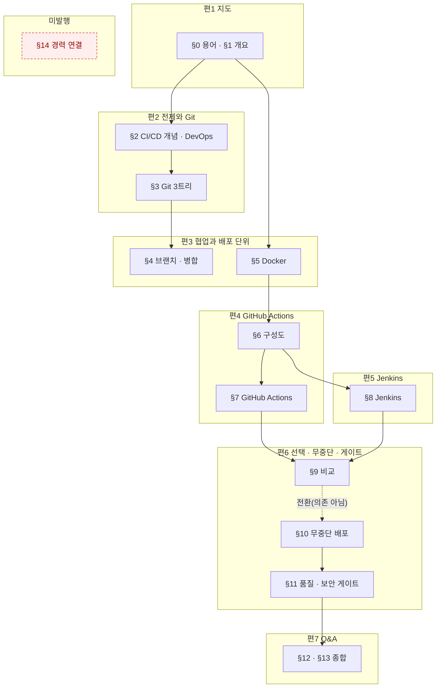

# `java-backend/06-CI-CD` 분할 설계 — 원본 1개를 7편으로

> 대상: `C:\Users\aeby\vscode\yanadoo-exit\shared\knowledge\java-backend\06-CI-CD-GitHub-Actions-Jenkins.md` (**83,252 B**, 읽기 전용)
> 카테고리: `backend-engineering` (현재 25편 → 33편)
> 작성: 2026-08-19 · 앞 배치: `2026-08-18-spring-batch-split-design.md`

---

## 1. 절차

### 1-1. 앞 배치가 확립한 순서를 그대로 쓴다

| # | 단계 | 근거 |
| ---: | --- | --- |
| ① | 원본 절별 **성분** 실측 | §2 |
| ② | **편1을 먼저 쓰고 실측으로 나머지를 재환산** | 앞 배치 §10-1 |
| ③ | 편마다 검증하고 **즉시 커밋** | pre-commit 훅이 작업트리를 본다 (인수인계 §3) |
| ④ | `dup-scan`은 편마다, 그리고 **Q&A편 정합성 점검 뒤에 다시** | 앞 배치 §10-5-b |
| ⑤ | 커밋은 `git commit -m "…" -- <경로>` 형태 | 인수인계 §4 |

⚠️ **②를 건너뛰지 마라.** 이번은 특히 그렇다 — §2-4가 보이듯 **원본 성분으로 비율을
예측하려는 시도가 5개 표본에서 전부 실패했다.**

### 1-2. 앞 배치 §10-11이 물려준 9개 규칙의 처리

| # | 규칙 | 이번 처리 |
| ---: | --- | --- |
| 1 | Q&A편은 `항목 수 × 460 B`로 잡아라 | ✅ §3-3에서 적용 — 58항목 |
| 2 | 본편 비율은 값이 아니라 ±10% 밴드 | ✅ §3-2 |
| 3 | 앞 배치 §10을 먼저 읽고 브리프를 써라 | ✅ 이 설계서를 쓰기 전에 §10-1~§10-11 전문을 읽었다 |
| 4 | `dup-scan` 건수는 앞 배치와 나란히 놓고 읽어라 | §8-3 |
| 5 | 지어낸 수치는 「틀리면 오해하나」로 판정 | §9-2 |
| 6 | 같은 단어의 다른 뜻은 설계에서 지목하라 | ✅ §7-1 — 이번은 **Stage**가 걸렸다 |
| 7 | 화이트리스트 정규식으로 전수 검사를 대신하지 마라 | §8-2 |
| 8 | `compose.mjs`의 mermaid 바이트를 분리하라 | ✅ **완료** — 커밋 `b683345`. §2-1이 그 결과다 |
| 9 | Q&A편 브리프에 「형제편도 오염원」을 넣어라 | §4-8 |

---

## 2. 원본 실측

### 2-1. 절별 성분

`npm run compose -- <원본>` (커밋 `b683345`에서 도식·코드를 분리했다)

| 절 | 합계 B | 산문% | 표% | 코드% | 도식% | 불릿% | 인용% | 도식 |
| --- | ---: | ---: | ---: | ---: | ---: | ---: | ---: | ---: |
| ~~(머리말)~~ | ~~390~~ | 0.0 | 0.0 | 0.0 | 0.0 | 0.0 | 81.8 | 0 |
| 0. 용어·약어 사전 | 5,443 | 0.1 | 99.4 | 0.0 | 0.0 | 0.0 | 0.0 | 0 |
| 1. 한눈에 보기 | 1,732 | 11.0 | 0.0 | 0.0 | 32.7 | 54.7 | 0.0 | 1 |
| 2. 과거 vs 현재 | 4,157 | 7.4 | 66.8 | 0.0 | 0.0 | 0.0 | 20.9 | 0 |
| 3. 형상관리와 Git 내부 동작 | 7,267 | 11.9 | 57.1 | 0.0 | 8.7 | 8.5 | 9.2 | 2 |
| 4. 브랜치·병합 전략 | 5,620 | 17.5 | 38.3 | **16.5** | 0.0 | 13.5 | 8.9 | 0 |
| 5. Docker 기초 | 4,642 | 7.4 | 64.8 | 7.3 | 8.7 | 0.0 | 7.4 | 1 |
| 6. CI/CD 구성도 | 2,086 | 0.2 | 75.6 | 0.0 | 15.3 | 0.0 | 0.0 | 1 |
| 7. GitHub Actions | 9,332 | 17.5 | 41.4 | **18.4** | 15.5 | 0.0 | 3.7 | 3 |
| 8. Jenkins | 11,658 | 12.1 | 58.9 | 8.3 | 7.1 | 2.2 | 8.5 | 2 |
| 9. GHA vs Jenkins | 2,437 | 0.2 | 73.2 | 0.0 | 0.0 | 0.0 | 24.5 | 0 |
| 10. 무중단 배포 | 5,273 | 22.4 | 35.9 | **19.6** | 7.3 | 0.0 | 10.8 | 1 |
| 11. 품질·보안 게이트 | 5,044 | 14.9 | 32.8 | 12.9 | 0.0 | 12.4 | 20.6 | 0 |
| 12. 트레이드오프·장애 | 4,025 | 0.1 | 96.7 | 0.0 | 0.0 | 0.0 | 0.0 | 0 |
| 13. 면접 예상 질문 | 11,891 | 4.2 | 54.1 | 0.0 | 0.0 | 0.0 | 40.9 | 0 |
| ~~14. 경력 연결 포인트~~ | ~~2,255~~ | 26.8 | 57.4 | 0.0 | 0.0 | 14.1 | 0.0 | 0 |
| **합계** | **83,252** | **10.6** | **56.2** | **6.8** | **5.5** | **4.2** | **13.3** | **11** |

절대 바이트: 도식 4,576 · **코드 5,627** · 표 46,753

#### 🔴 배정하지 않는 조각이 **둘** 있다 — 합계가 안 맞는 것이 정상이다

§3-2 배정표의 원본 B 합계는 **80,607**이고 원본 전체는 **83,252**다. 차이 2,645 B는 두 조각이다.

| 조각 | B | 배정하지 않는 이유 |
| --- | ---: | --- |
| **(머리말)** | 390 | 세 줄짜리 인용 블록(작성 기준일 · 출처 · 목적). **출처 줄이 HARD 금칙어를 포함**해 어느 편에 넣어도 `check-forbidden`이 커밋을 막는다 |
| **§14 경력 연결** | 2,255 | HARD 5종 + 익명화 무효 + 「본인이 모른다고 적은 목록」 — §3-2 참조 |

이 표가 없으면 다음 배치에서 「합계가 2,645 안 맞네」를 본 사람이 그 조각을 어딘가에 채워 넣는다.
**배정하지 않은 이유를 적지 않은 옳은 판단은, 다음 사람에게는 실수로 보인다.**
발행본의 출처 표기는 원본 머리말을 옮기는 것이 아니라, 본문에서 **「원본」**으로만 지칭한다(§7-2).

### 2-2. 🔴 이 원본에는 **진짜 코드가 있다** — 앞 배치와 결정적으로 다른 점

| | 원본 05 | **원본 06** | 배수 |
| --- | ---: | ---: | ---: |
| 코드 B | 446 | **5,627** | **12.6×** |
| 도식 B | 5,244 | 4,576 | 0.87× |

앞 배치의 「코드 11.6%」는 실은 도식이었고 자바 코드는 446 B뿐이었다(앞 배치 §10-7).
**이번은 다르다** — `yaml` 워크플로 · `Jenkinsfile`(groovy) · `Dockerfile` · `bash`가 실재한다.

⚠️ **코드는 축자 이식이라 비율이 1.0으로 고정된다.** 따라서 코드 비중이 높은 절일수록
전체 비율이 **내려간다.** 코드가 몰린 절은 §4(16.5%) · §7(18.4%) · §10(19.6%)이다.
⇒ **이 세 절을 담는 편에 다른 편과 같은 비율을 주면 과대 추정이 된다.** §3-2에서 반영한다.

### 2-3. 표가 56.2% — 코퍼스에서 가장 높다

| 원본 | 표% | 산문% |
| --- | ---: | ---: |
| 02 | 59.4 | 9.4 |
| **06 (이번)** | **56.2** | **10.6** |
| 01 | 54.5 | 6.7 |
| 03 | 49.7 | 11.7 |
| 05 | 47.9 | 15.5 |
| 04 | 42.7 | 2.4 |

### 2-4. 🔴 **성분으로 비율을 예측하려는 시도가 5개 표본에서 전부 실패한다**

앞 배치들이 물려준 설명은 두 갈래였고 **둘 다 실측에 반증된다.**

| 물려받은 설명 | 출처 | 실측 |
| --- | --- | --- |
| 「표 밀도가 높은 원본이라 1.40」 | 인수인계 §8 표의 괄호 | ❌ 03(표 49.7%)=1.40, 05(표 47.9%)=2.06. **1.8%p 차이에 비율은 1.5배** |
| 「산문 비중이 높은 원본일수록 비율이 크다」 | 03 설계서 §1-1 원문 | ❌ **정확히 반대다** — 아래 표 |

| 원본 | 산문% | 표% | 코드% | **실측 합계 비율** |
| --- | ---: | ---: | ---: | ---: |
| 01 | 6.7 | 54.5 | 3.6 | 1.81 |
| 02 | 9.4 | 59.4 | 1.1 | 1.98 |
| 03 | **11.7** | 49.7 | 2.9 | **1.40** ← 최저인데 산문은 2위 |
| 04 | **2.4** | 42.7 | 7.0 | 1.90 ← 산문 최저인데 비율은 4위 |
| 05 | 15.5 | 47.9 | 0.9 | 2.06 |
| **06 (이번)** | **10.6** | **56.2** | **6.8** | **?** |

산문%로 정렬하면 04 → 01 → 02 → 06 → 03 → 05 이고, 비율로 정렬하면 03 → 01 → 04 → 02 → 05 다.
**두 순서가 일치하지 않는다.** 「배치가 지날수록 두꺼워진다」는 가설도 03이 깨뜨린다(1.81 →
1.98 → **1.40** → 1.90 → 2.06, 단조가 아니다).

⇒ **이 설계서는 원본 성분으로 비율을 정하지 않는다.** 대신 두 가지를 쓴다:

| 예측기 | 근거 | 쓰는 곳 |
| --- | --- | --- |
| **고정 비용** (도입 + 용어 + 목차) | 두 배치가 5% 안에서 같다 | 지도편 (§3-1) |
| **항목 패리티** (항목 수 × 460 B) | 두 배치가 2.4% 안에서 같다 | Q&A편 (§3-3) |
| 코퍼스 비율 **밴드** | 예측 불가라 실측으로 좁힌다 | 본편 (§3-2) — **편1 실측 뒤 재환산** |

**분모를 바꾸면 안정적인 양이 드러난다.** 앞 배치가 Q&A편에서 발견한 원리를 지도편에도 적용한다.

---

## 3. 편 구성과 예산

### 3-1. 지도편(편1) — **고정 비용 방식으로 잡는다**

앞 배치 §3-6의 분해를 그대로 쓴다.

| 성분 | 04 편1 | 05 편1 | **06 편1 (예산)** | 근거 |
| --- | ---: | ---: | ---: | --- |
| 도입 | 1,291 | 1,667 | **1,500** | 두 배치 평균 |
| 용어 정리 | 4,471 | 5,311 | **6,500** | §3-1-c로 **억제한 값**. 그대로 옮기면 9,700 |
| 시리즈 구성 + 정리 | 2,765 | 1,984 | **2,800** | 두 배치 평균 + 7편 목차 |
| **고정 비용 소계** | **8,527** | **8,962** | **10,800** | |
| 본문(§1 대응) | 15,009 | 13,888 | **3,500** | 1,732 × 2.0 |
| **합계** | 23,536 | 22,850 | **≈ 14,300** | §3-2 편1 목표와 일치 |

**「그대로 옮기면 9,700 B」의 근거** — 원본 §0을 발행본 「용어 정리」로 옮길 때의 실측 비율:

| 배치 | 원본 §0 | 발행 용어 정리 | 비율 |
| --- | ---: | ---: | ---: |
| 04 | 2,773 | 4,471 | 1.61 |
| 05 | 2,743 | 5,311 | 1.94 |

평균 1.78 × 5,443 = **9,688**. 이번 §0은 **5,443 B로 앞 배치의 2배**다(용어 **51개**).
그 값을 그대로 쓰지 않는 이유가 §3-1-c다.

⚠️ **표의 값은 억제 후(6,500)이고, 9,700은 억제하지 않았을 때다.** 두 숫자가 같은 표에
있으면 집필자가 어느 쪽을 예산으로 받을지 헷갈린다 — **예산은 6,500이다.**

### 3-1-b. ⚠️ 그래서 **§2를 지도편에 붙이지 않는다** — 앞 배치와 반대 판단이다

앞 배치는 「§0+§1만으로는 4,761 B라 지도편이 10 KB로 하한을 깬다」며 §2를 붙였다.
**이번은 그 전제가 성립하지 않는다.** §0이 2배라 §0+§1만으로 7,175 B이고 예산이 17.1 KB다.

여기에 §2(4,157 B)를 붙이면 지도편이 25 KB를 넘고, 무엇보다 **용어표 9.7 KB + 개념 설명**으로
지도편이 「읽는 글」이 아니라 「찾아보는 표」가 된다.

### 3-1-c. 🔴 용어 51개를 통째로 옮기지 마라

억제하지 않으면 용어 정리가 지도편의 **57%**(9,700 / 17,100)다. 앞 배치는 19%(04) · 23%(05)였다.
**같은 형태를 유지하면서 분량만 2배가 되면 형태가 바뀐 것이다.**

⇒ **지침**: 지도편에는 **시리즈 전체에 걸치는 용어만** 싣는다(CI · CD · DevOps · 형상관리 ·
컨테이너 · 파이프라인 등). 특정 편에서만 쓰는 용어(Executor · Newman · Composite Action 등)는
**그 편의 첫 등장 자리에서 정의**한다.
목표: 지도편 용어 정리를 **6,000 ~ 6,500 B**(전체의 45% 이하)로 억제.

🔴 **하단을 더 내리지 마라 — 합계가 하한을 깬다.** 구성 요소가 이렇게 맞물린다:

```
도입 1,500 + 용어 6,500 + 시리즈 구성 2,800 + 본문 3,500 = 14,300   ← 목표
도입 1,500 + 용어 5,000 + 시리즈 구성 2,800 + 본문 3,500 = 12,800   ← 하한(13.3 KB) 미달
```

용어를 더 줄이고 싶으면 **줄인 만큼 「시리즈 구성」으로 돌린다** — 7편 각각의 소개를
충실히 쓰는 쪽이 용어표를 늘리는 것보다 지도편의 형태에 맞다.
이번 지도편은 앞 배치(23.5 KB · 22.9 KB)보다 훨씬 작은데, **원본 §1이 1,732 B로 작기 때문**이다.
그 차이를 용어표로 메우면 §3-1-b가 피하려던 「찾아보는 표」가 된다.

⚠️ 이 지침은 **분량 조절이 아니라 형태 유지**가 목적이다. 집필자가 「하한을 채우려고」
용어를 도로 늘리면 취지가 뒤집힌다.

### 3-2. 본편 예산 — 값이 아니라 밴드로 준다

코퍼스 5배치 실측 본편 비율의 폭은 **1.41 ~ 2.18**이다. 예측이 안 되므로(§2-4)
**중앙값 1.95를 초기값으로 쓰고 ±10% 밴드**를 준다. **편1 실측 뒤 전 편을 재환산한다.**

⚠️ **코드 비중 보정**: 코드는 비율 1.0이 확정이다. 코드 비중이 코퍼스 평균(3.1%)보다
현저히 높은 절을 담는 편은 **비율을 낮춰 잡는다.**

🔴 **단, 「코드%」를 그대로 쓰면 안 된다 — 축자 이식 대상만 1.0이다.** 구조 리뷰 실측:
§4의 코드 16.5%는 **전부 ` ```text ` 블록 5개**(`281`·`290`·`302`·`310`·`324`)로
git 명령 예시와 충돌 마커다. 해설을 붙이면 얼마든지 늘어난다.
진짜 축자 코드(`yaml`·`groovy`·`dockerfile`·`bash`)는 **§5·§7·§8·§10·§11에만** 있다.
⇒ 편3의 축자 코드는 §5의 339 B뿐(**3.3%**)이라 하향 근거가 거의 없다. **1.80 → 1.90으로 되돌린다.**

| 편 | 원본 절 | 원본 B | 코드% | 축자 코드% | 초기 비율 | **목표 B** | 밴드(±10%) |
| :---: | --- | ---: | ---: | ---: | ---: | ---: | --- |
| 1 | §0 + §1 (지도편) | 7,175 | 0.0 | 0.0 | — | **14,300** | 13,500 ~ 15,000 |
| 2 | §2 + §3 | 11,424 | 0.0 | 0.0 | 1.95 | **22,300** | 20,100 ~ 24,500 |
| 3 | §4 + §5 | 10,262 | 12.4 | **3.3** | **1.90** | **19,500** | 17,600 ~ 21,500 |
| 4 | §6 + §7 | 11,418 | 15.0 | 15.0 | **1.75** | **20,000** | 18,000 ~ 22,000 |
| 5 | §8 | 11,658 | 8.3 | 8.3 | 1.90 | **22,200** | 20,000 ~ 24,400 |
| 6 | §9 + §10 + §11 | 12,754 | 13.2 | 13.2 | **1.80** | **23,000** | 20,700 ~ 25,300 |
| 7 | §12 + §13 (Q&A) | 15,916 | 0.0 | 0.0 | — | **26,700** | §3-3 |
| **합계** | | **80,607** | | | | **≈ 148,000** | |

겉보기 합계 비율 **1.84**. 앞 배치(2.06)보다 낮게 잡은 것은 코드 12.6배(§2-2) 때문이다.

편6 코드%는 구성 절의 **가중평균으로 직접 계산했다** — (2,437×0.0 + 5,273×19.6 + 5,044×12.9) ÷ 12,754 = **13.2%**.
표에 값을 옮겨 적지 말고 이렇게 계산하라. 절을 재배치하면 이 값이 따라 움직인다.

#### 🔴 §14를 **발행하지 않는다** — 그래서 8편이 아니라 7편이다

초안은 §11+§14를 편7로 묶었다. 구조 리뷰가 두 방향에서 무너뜨렸다.

| 축 | 실측 |
| --- | --- |
| **금칙어** | §14 다섯 줄에 HARD가 5종 — 회사명 2·직책 1·제품명 2. 커밋이 막힌다 |
| **익명화 무효** | 회사를 「OTT 서비스」로 익명화한 뒤 제품명을 남기면 그 제품명이 회사를 한 단어로 특정한다 |
| **본인이 모른다고 적은 목록** | 「보완이 필요한 항목」이 자기 조직의 브랜치 전략을 모른다는 자백이다. 익명화로 해결되지 않는다 |
| **주제 묶음이 아님** | §14의 4개 항목을 §11과 대조하면 연결 **0개**. 각각 §4·§5·§10으로 흩어진다 |

넷째 줄이 결정적이다. 초안 §3-4 표의 「갈랐을 때의 손해」 칸이 이미 자백하고 있었다 —
**「§14가 어디에도 못 붙는다」**. 그것은 의존이 아니라 **잔여 처리**였고, 잔여를 붙일 곳이
없다는 것은 묶음의 근거가 아니라 **묶지 말라는 신호**다.

부수 효과로 초안의 최대 위험이 사라졌다. 편6·편7이 목표 13,900 B로 하한(13.3 KB)과
밴드 하단이 겹쳐 「여유가 없다」고 적혀 있었는데, 재구성 후 최소 편이 **14,300 B(편1)** 이고
편6은 **23,000 B**다. 하한에 걸리는 편이 없다.

### 3-3. Q&A편(편7) — 항목 패리티

앞 배치 공식: **목표 B = 항목 수 × 약 460 B**

| 원본 | 항목 | 실측 B | 항목당 B |
| --- | ---: | ---: | ---: |
| `websocket-realtime-qna` (04) | 46 | 21,399 | 465 |
| `spring-batch-qna` (05) | 45 | 20,441 | 454 |

**이번 항목 수 (전수 집계, 컨트롤러가 직접 셌다)**

| 출처 | 항목 | 세는 방법 |
| --- | ---: | --- |
| §12-1 선택지 | 10 | 표 행 11 − 헤더 1 |
| §12-2 실패 모드 | 13 | 표 행 14 − 헤더 1 |
| §13 기본 질문 | 30 | 표의 `#` 열 1~30 |
| §13 심화 문답 | 5 | `**Q.` 로 시작하는 줄 |
| **합계** | **58** | |

⇒ **목표 26,700 B** (58 × 460). 앞 배치의 **1.31배**다.

**나누지 않는 이유**: 149편 중 31편(21%)이 이미 25 KB를 넘고 최대는 45.8 KB다.
둘로 나누면 각 13 KB대가 되어 오히려 하한에 걸리고, 「Q&A편은 지도편 목차가 유일한 inbound」
(인수인계 §8)라는 취약점이 둘로 늘어난다.

### 3-4. 편 구성 근거 — 왜 이렇게 묶었나

원본은 최대 절이 11,891 B라 **H2 하나로는 목표에 못 미친다.** `CR-4.1a`에 따라 인접 H2를
묶는데, 묶는 축은 분량이 아니라 **의존 관계**다(§2 scout 실측).



**간선 두 개는 약하다** — 구조 리뷰가 원본과 대조해 잡았다. 편 배정은 안 바뀌지만
집필자가 없는 인과를 지어내지 않도록 적어 둔다.

| 간선 | 초안 | 실측 |
| --- | --- | --- |
| `§2 → §5` | CI/CD 개념이 Docker로 이어진다 | ❌ §5-1은 VM/컨테이너 비교로 시작하고 §2(폭포수·애자일)에 기대지 않는다. 실제 연결은 §1 `73`행 「전제는 형상관리(Git)와 **재현 가능한 실행 단위**」 ⇒ **`§0 → §5`가 맞다** |
| `§9 → §10` | 비교의 결론이 배포 전략의 전제 | ⚠️ §9는 도구 비교, §10은 도구 무관 전략이라 **의존이 아니라 전환**이다. 편6 집필자는 억지 연결을 만들지 마라 |

| 묶음 | 왜 함께 가야 하나 | 갈랐을 때의 손해 |
| --- | --- | --- |
| §2 + §3 | §2가 「왜 자동화인가」를, §3이 「그 전제인 형상관리」를 답한다. §3만 떼면 Git 튜토리얼이 된다 | 시리즈의 전제가 사라진다 |
| §4 + §5 | 둘 다 **「재현 가능한 단위를 어떻게 만드나」** 다 — §4는 이력의 단위(커밋·브랜치), §5는 실행의 단위(이미지). 원본 `379` 「"빌드 결과 = 이미지"로 배포 단위 통일 가능」이 그 프레임의 근거다 | 각각 11.8 KB · 9.3 KB로 하한 미달 |
| §6 + §7 | §6의 구성도가 §7 실습의 무대다. §6은 2,086 B로 단독 불가 | 도식과 설명이 갈린다 (`CR-4.5` 위반) |
| §9 + §10 + §11 | **파이프라인을 통과한 뒤에 무엇을 보장하나** — §10은 가용성(무중단), §11은 품질·보안. §9는 그 앞에서 도구 선택을 닫는다 | §9는 2,437 B, §11은 단독 9,584 B로 **둘 다 하한 미달** |

---

## 4. 편별 상세

*(제목은 초안이다. 편1 집필 후 재환산 시 갱신한다. 태그는 §5-2 참조)*

| 편 | slug | 제목(초안) | `role` | `seriesOrder` |
| :---: | --- | --- | --- | :---: |
| 1 | `cicd-pipeline-fundamentals` | 배포를 사람 손에서 떼어내기 — CI/CD 자동화 지도 | `map` | 1 |
| 2 | `version-control-as-cicd-premise` | 자동화의 전제는 형상관리다 — Git 3트리와 되돌리기 | | 2 |
| 3 | `branching-and-container-units` | 되돌릴 수 있는 단위 만들기 — 브랜치 전략과 컨테이너 | | 3 |
| 4 | `github-actions-pipeline` | GitHub Actions — 이벤트에서 배포까지 | | 4 |
| 5 | `jenkins-declarative-pipeline` | Jenkins — 파이프라인을 코드로 남기기 | | 5 |
| 6 | `zero-downtime-and-quality-gates` | 멈추지 않고 바꾸기 — 무중단 배포와 품질·보안 게이트 | | 6 |
| 7 | `cicd-qna` | CI/CD 자동화 Q&A — 고를 때·터졌을 때·설명해야 할 때 | | 7 |

slug 충돌 검사 완료(`content/blog/` 전체, 7개 전부 0건).
초안의 `zero-downtime-deployment-strategies`·`quality-and-security-gates`는 **쓰지 않는다** — §14 미발행으로 두 편이 하나가 됐다.

#### 🔴 4-1. 프론트매터 공통값 — **여기서 못박지 않으면 시리즈가 갈라진다**

`lib/blog/frontmatter.ts:112~116`은 `series`가 있으면 `seriesOrder`가 숫자일 것만 검사한다.
**`series` 문자열의 값은 아무것도 검사하지 않는다.** 7기가 `cicd`·`ci-cd`·`cicd-automation`을
제각각 쓰면 한 시리즈가 셋으로 갈라지고 **빌드는 그대로 통과한다.**

| 필드 | 값 | 근거 |
| --- | --- | --- |
| `category` | `backend-engineering` | |
| `series` | **`"cicd-automation"`** | 기존 36개 series와 충돌 없음. 원본 제목이 「CI/CD 자동화」 |
| `seriesOrder` | 위 표의 값 | `map`도 1을 갖는다(앞 배치 `batch-processing-fundamentals`) |
| `date` | **`"2026-07-26"`** | **커밋일이 아니라 원본 작성 기준일이다.** 앞 배치 5편 전부 이 값을 쓴다 |
| `role` | 편1만 `"map"`, 나머지 없음 | `links.test.ts:85`가 이 값으로만 고립을 면제한다 |

#### 4-2. 편별 브리프 필수 문구 — **여기서 잘라 쓴다**

설계서 곳곳의 지시를 편별로 모았다. 브리프를 쓸 때 해당 행을 그대로 옮긴다.
**브리프는 설계서를 읽지 않는 사람이 받는다** — 「설계서 §7-1 참조」라고 쓰면 전달되지 않는다.

| 편 | 반드시 넣을 것 |
| :---: | --- |
| **1** | ① 용어 51개를 다 싣지 마라 — 시리즈 전체에 걸치는 것만, 6,000~6,500 B(§3-1-c) ② **낱말 구분표를 실어라**(§7-1-b) — 파이프라인·워크플로·블루그린·게이트·Stage가 이 시리즈에서 무엇을 가리키는지, 블로그의 다른 용법과 대비해서 ③ `master`/`slave` 표기 방침을 **여기서 정한다**(§9-3) ④ 나가는 링크 1개(§6-3) |
| **2** | ① **§3-7의 태그 문단(원본 `259~261`)을 「Git 명령 요약표」로 축소하지 마라** — 「실무 배포 기준은 브랜치가 아니라 태그」가 **뒤 4편의 전제**다 ② `Stage`는 여기서 Git Index 뜻이다. 편1 구분표를 가리켜라 |
| **3** | ① 이 편의 전제는 **편2 끝의 태그 문단**이다 ② `Stage`의 **셋째 뜻(Docker 멀티스테이지)** 이 여기 있다(원본 `432`) — 편1 구분표를 가리켜라 ③ §4의 ` ```text ` 블록은 축자 코드가 아니다. 해설을 붙여라(§3-2) |
| **4** | ① **GHA·Jenkins 계층 대조표를 세우지 마라** — 그 표는 편6이 싣는다(§7-1-e). 자기 계층만 설명하고 넘겨라 ② 시크릿 UI 경로에 「2026년 7월 기준」을 넣어라(§9-4) |
| **5** | ① `stage()`를 처음 쓰는 자리에서 편1 구분표를 가리키고 **Git Stage와 다르다**를 명시하라 ② 요금·타임아웃 수치에 시점을 넣어라(§9-4) |
| **6** | ① **`app-cicd.conf` 치환**(§9-1) — 이름을 스스로 정하지 마라 ② 헬스체크 스크립트는 **결함째 싣고 그 사실을 명시**하라(§9-2) — 고치면 편7의 답이 무너진다 ③ 배포 전략 비교표를 **새로 세우지 말고** `elasticsearch-operations`를 링크하라(§7-1-c) ④ 롤링 배포의 세션 직렬화 문제는 `realtime-scaleout-and-session`이 이미 다뤘다 — 한 문장으로 짚고 링크(§7-1-d) ⑤ 계층 대조표는 여기가 원본 위치다(원본 `925`) |
| **7** | ① 제목·본문에 「면접」·「예상 질문」을 쓰지 마라 — **「고를 때·터졌을 때·설명해야 할 때」** 프레임 ② 편6과 **같은 `app-cicd.conf`** 를 써라 ③ 58항목 전부에 근거 편을 지목하라(§9 표 #2) |
| **전 편** | ① 원본을 지칭할 때 **「원본」** — 「강의」·「수강」 금지(§7-2) ② 본편은 **지도편만** 링크한다. 다른 본편을 가리키지 마라(§6-2) ③ 프론트매터 공통값(§4-1)을 그대로 쓴다 |

---

## 5. 태그

`content/blog/tags.ts` 통제 어휘 **안에서만** 쓴다. 글당 3~5개, **같은 패싯 최대 2개**.
어휘 확장이 필요하면 **별도 커밋**으로 분리한다(인수인계 §8 확정 결정).

⚠️ 앞 배치에서 초안이 「같은 패싯 최대 2개」를 위반한 적이 있다(앞 배치 §5-1).
**태그를 정한 뒤 패싯별로 세어라.**

### 5-1. 🔴 `ci-cd`는 **전 편 필수**다 — 이 태그가 두 번째 링크 구조다

실측: 149편 중 `ci-cd` 태그를 단 **1편**만 쓴다 — `ai-transformation/sdlc-human-gates.md`.
`/blog/tags/ci-cd/`가 사실상 빈 페이지로 존재해 왔다는 뜻이다.

이번 배치 7편이 전부 달면 **1 → 8편**이 되고, 그 페이지가 시리즈 목록 역할을 하면서
`backend-engineering`과 `ai-transformation`을 **자동으로** 잇는다.
§6-3의 본문 링크와 달리 사람이 유지보수하지 않아도 끊기지 않는다 —
카테고리 고립(§7-4)에 대한 두 번째 대비책이다.

### 5-2. 편별 배정 — 패싯 기호를 함께 적었다

패싯: **A** 스택 · **B** 엔지니어링 · **C** AI · **D** 프로덕트 · **E** 검색 · **F** 기타

| 편 | 원본 절 | 필수 | 편별 | 패싯 카운트 |
| ---: | --- | --- | --- | --- |
| 1 | §0+§1 지도 | `ci-cd`ᴮ | `deployment`ᴮ `terminology`ᶠ `docker`ᴬ | B2 A1 F1 |
| 2 | §2+§3 형상관리 | `ci-cd`ᴮ | `deployment`ᴮ `engineering-leadership`ᴰ | B2 D1 |
| 3 | §4+§5 브랜치·Docker | `ci-cd`ᴮ | `docker`ᴬ `deployment`ᴮ | B2 A1 |
| 4 | §6+§7 GitHub Actions | `ci-cd`ᴮ | `docker`ᴬ `security`ᴮ | B2 A1 |
| 5 | §8 Jenkins | `ci-cd`ᴮ | `docker`ᴬ `deployment`ᴮ | B2 A1 |
| 6 | §9+§10+§11 무중단·게이트 | `ci-cd`ᴮ | `deployment`ᴮ `payments`ᴰ | B2 D1 |
| 7 | §12+§13 Q&A | `ci-cd`ᴮ | `troubleshooting`ᴮ `docker`ᴬ `payments`ᴰ | B2 A1 D1 |

**편6이 함정이다.** `deployment`·`security`·`ci-cd`가 전부 패싯 B라 셋을 같이 달면 위반이다.
§11이 PG 도메인이므로 `security` 대신 `payments`ᴰ를 골라 교차성을 얻는다.
편4는 반대로 `security`를 살린다 — §7의 시크릿 관리가 그 편의 실질 내용이기 때문이다.
같은 단어가 두 편에 다 어울릴 때 **어느 편에 줄지는 패싯 균형이 정한다.**

### 5-3. 어휘 확장 판정 — `git`·`jenkins`·`github-actions`를 **추가하지 않는다**

이 시리즈의 주제어 세 개가 어휘에 없다. 넣을지 실측으로 판정했다.

| 후보 | ① 3편 이상 | ② 2개 이상 카테고리 | ③ 상하위 대체 불가 | 판정 |
| --- | --- | --- | --- | --- |
| `git` | ✅ 기존 12편이 5회 이상 언급 | ✅ agentic-coding·ai-transformation | ❌ | **미추가** |
| `jenkins` | ❌ 이번 배치 1편뿐 | ❌ backend-engineering 전용 | — | **미추가** |
| `github-actions` | ❌ 이번 배치 1편뿐 | ❌ backend-engineering 전용 | — | **미추가** |

`git`이 ③에서 탈락한 이유: 편2의 슬러그가 `version-control-as-cicd-premise` —
**「CI/CD의 전제로서의 형상관리」로 이미 규정**했으므로 `ci-cd`가 상위 개념으로 성립한다.
①②를 만족해도 ③ 하나로 탈락한다(`django`가 ②로 탈락한 것과 같은 구조, `tags.ts` 주석).

다음 사람이 같은 질문을 다시 하지 않도록 **탈락도 근거와 함께 남긴다.**
어휘가 82종에서 안 늘어난 것은 후보가 없어서가 아니라 **떨어뜨린 것**이다.

---

## 6. 링크 구조

### 6-1. 시리즈 지도편은 「완성해서 커밋」할 수 없다

`CR-4.3`은 시리즈 첫 글에 전체 목차를 요구하고, 링크 검사는 대상이 실재할 것을 요구한다.
편별 커밋을 유지하면 지도편이 항상 먼저 나오므로 목차 링크가 전부 죽는다.

**해소법(3배치 연속 사용)**: 지도편을 **링크 없이** 먼저 내고, 이후 각 편 커밋에
**그 편의 목차 링크 한 줄을 함께** 넣는다.

🔴 **마지막 편(편7 Q&A)의 목차 링크를 빠뜨리면 그 편이 고립으로 훅에 막힌다** —
Q&A편은 지도편 목차가 **유일한 inbound**다.

**7편에서도 그대로 작동한다.** `links.test.ts:85`는 `role === "map"`인 편만 고립을
면제하므로, 편1이 `map`이고 편2~편7이 각자 커밋에서 목차 한 줄을 받으면 inbound ≥ 1이
보장된다. 편 수는 이 논리에 영향을 주지 않는다.

### 6-2. 🔴 편 사이 링크 — **「앞 편과 뒤 편」이 아니다**

초안은 「각 편이 앞 편과 뒤 편을 참조한다」였다. **뒤 편은 아직 존재하지 않는다.**
`links.test.ts:44~52`가 모든 `/blog/<cat>/<slug>/` 대상의 실재를 요구하고
`.githooks/pre-commit:18`이 매 커밋마다 그 검사를 돌린다. 편2 커밋 시점에 편3은 없다.
이대로 브리프에 넣으면 **7기 중 6기가 막힌다.**

앞 배치(`spring-batch` 5편) 실측 패턴은 다르다:

| 편 | 시리즈 내부 outbound |
| --- | --- |
| 편1 (`role: map`) | 편2·편3·편4·편5 **전부** |
| 편2 ~ 편4 (본편) | **편1만** |
| 편5 (Q&A) | 편1·편2·편3·편4 **전부** |

즉 **본편은 지도편만 뒤로 참조하고, Q&A편이 전 편을 앞으로 모은다.**
커밋 로그도 같은 말을 한다 — 매 커밋이 정확히 **「지도편 + 그 편」 두 파일**이다.

```
27855d3 feat(blog): spring-batch 편4 — 성능 최적화와 병렬화
  content/blog/backend-engineering/batch-performance-and-parallelism.md
  content/blog/backend-engineering/batch-processing-fundamentals.md
```

이번 배치도 이 패턴을 그대로 쓴다. 본편(편2~편6)이 **다른 본편을 참조하지 마라** —
쓰고 싶으면 그 편이 이미 커밋된 뒤여야 하고, 그러면 편 순서에 숨은 의존이 생긴다.

### 6-3. 카테고리 밖으로 나가는 링크 — **이번 배치의 숙제**

#### 실측 — 인수인계가 기록한 것보다 나쁘다

| 방향 | 인수인계 기록 | 실측 |
| --- | --- | --- |
| inbound (밖 → `backend-engineering`) | 1편 | **1편** (`ai-agent/ai-agent-qna-operations.md`) — 일치 |
| outbound (`backend-engineering` → 밖) | *기록 없음* | **0** — 링크 111개가 **전부 카테고리 내부** |

인수하기 전 조사가 inbound만 셌다. 나가는 쪽은 아무도 보지 않았고, 실제로 **한 개도 없다.**
25편이 서로만 가리키는 닫힌 섬이다.

#### 나가는 링크 3개 — 편별로 **분산**한다

지도편에 몰면 편1만 문이 생기고 나머지 6편은 그대로 섬이다.

| 편 | 나가는 곳 | 걸 자리 |
| ---: | --- | --- |
| 1 | `](/blog/ai-transformation/sdlc-human-gates/)` | 파이프라인에서 **사람이 승인하는 지점**은 어디인가 — 시리즈 전체의 맥락 |
| 6 | `](/blog/search-engineering/elasticsearch-operations/)` | 「블루그린」이 **인덱스 세트**를 바꾸는 경우 — §7-1 다의어 해소와 같은 자리 |
| 7 | `](/blog/ai-agent/llm-app-bottleneck-shift/)` | Q&A 「LLM 앱의 CI/CD는 무엇이 다른가」 |

편6의 링크는 **다의어 대응과 링크 숙제를 한 번에 처리한다** — 같은 단어를 다르게 쓰는
다른 글을 가리키는 것이 독자에게 가장 유용한 링크다.

#### 들어오는 링크는 **마감 단계 별도 커밋**으로 뺀다

위 3편에 이번 시리즈로 오는 링크를 거는 것은 **발행본 3편을 수정**하는 일이다.
집필과 섞으면 어느 커밋이 무엇을 바꿨는지 흐려지고, 「참고한 발행본이 출처인 중복」(커밋 `3fae7f3`)이
재발할 자리이기도 하다. §8-4 마감 절차에서 `docs:`가 아닌 **`feat(blog):` 별도 커밋**으로 처리한다.

목표: outbound **0 → 3**, inbound **1 → 4**.

---

## 7. 위험

### 7-1. 🔴 **`Stage`가 이 시리즈 안에서 두 가지를 가리킨다**

앞 배치에서 「파티셔닝」이 세 뜻으로 쓰여 문제가 됐고, 설계 단계에서 지목해 편4가 막았다.
**이번 원본에서 같은 구조의 위험을 실측했다.**

| 단어 | 뜻 | 어디 | 충돌하는 편 | 위험 |
| --- | :---: | --- | --- | :---: |
| **`Stage`/스테이지** | **3** | ① Git Index(§0 `19`·§3 `196,253`) ② **Docker 멀티스테이지**(§5 `432`) ③ Jenkins `stage()`(§8 `803`·§10 `994`·§11 `1060,1080`) | **편2 ↔ 편3 ↔ 편5 ↔ 편6** | 🔴 |
| **「환경」** | **3** | ① 배포 등급 = 환경 브랜치 staging/production(§4 `342`) ② 병렬 인스턴스 쌍 = Blue/Green(§10 `54,973`) ③ 실행 환경 `any`/`docker`(§8 `816`) | **편3 ↔ 편6 ↔ 편5** | 🟠 |
| `Job` / `Step` | 2 | GHA 2계층(§7-1 `516`) ↔ Jenkins 3계층(§8-2 `750`·§9 `925`) | 편4 ↔ 편5 | 🟠 |
| `Pipeline` | 2 | 흐름 일반(§1·§6·§10) ↔ Jenkins Groovy DSL(§0 `38`·§8-3 `744`) | 편1·4·6 ↔ 편5 | 🟡 |

**뜻이 하나뿐인 것 — 없는 위험을 만들지 마라** (전수 확인):
`태그`(전부 git tag, docker image tag 논의 없음) · `Agent`(원본 안에서는 전부 Jenkins 빌드 노드,
`sshagent`는 스텝 이름) · `Runner` · `Executor` · `이미지`(전부 컨테이너 이미지) · `배포/릴리스` · `빌드`.
`Artifact`는 §0이 GHA 뜻으로 정의했는데 `112`가 일반 뜻이라 경계선이지만 독자가 혼동할 층위가 아니다.

#### 🔴 `Stage`는 **세 뜻**이다 — 놓친 셋째가 편3에 있다

초안은 Git ↔ Jenkins 2뜻으로 보고 대응을 **편5 집필자에게만** 지시했다. 실측하면 다르다.

```
432:| 멀티스테이지 빌드 | 빌드 스테이지에서 컴파일하고 런타임 스테이지에는 산출물만 복사 |   ← §5, 편3
803:  stage('Build Source Code')      ← §8,  편5
994:  stage('Change UpStream Conf')   ← §10, 편6
1060: stage('API Integration Test')   ← §11, 편6
```

Jenkins `stage`도 편5 하나가 아니라 **편5·편6**에 걸친다. 실제 지형은 **편2 ↔ 편3 ↔ 편5 ↔ 편6**이고,
편3·편6 집필자는 초안대로면 이 경고를 **브리프에서 받지 못한다.**

**더 나쁜 것 — §0 용어사전이 한쪽으로 기울어 있다.** 원본 `19`행:

```
| Stage | Index / Staging Area | 다음 커밋에 포함시킬 변경을 모아두는 대기 장소 |
```

§0은 편1 지도편에 실린다. **시리즈 첫 글이 세 뜻 중 하나만 정의해 놓는 것**이다.
같은 편향이 `Job`·`Step`(원본 `27`·`28`, GHA 뜻으로만 정의)에도 있다.

⇒ **대응**: 아래 §7-1-b의 구분표를 **편1 지도편에** 싣는다. 편3·편5·편6은 각자
처음 쓰는 자리에서 그 표를 가리키고 어느 뜻인지 명시한다.

#### 🔴 7-1-b. 편1이 실을 구분표 — **카테고리 안팎의 기존 용법까지 포함한다**

초안은 **시리즈 안**만 봤다. 이 블로그에는 이미 149편이 있고, 같은 낱말이 다른 뜻으로
자리를 잡고 있다. 「`Workflow`는 뜻이 하나뿐」이라는 초안의 단언이 그 증거다 —
시리즈 안에서는 맞지만 블로그 전체로는 틀리다.

| 낱말 | 이 시리즈에서 | 블로그의 다른 자리 | 실측 |
| --- | --- | --- | --- |
| **파이프라인** | CI/CD 단계 흐름 | Redis 원자 연산 묶음(`cache-invalidation-and-concurrency:117`) · ML/데이터 변환(`batch-processing-fundamentals:92,204`) · 요구사항→서비스 흐름(`rdbms-and-nosql-fundamentals:86`, **다른 시리즈의 지도편**) · 청크 루프(`chunk-processing-and-item-readers:29`) | 299건 / 91파일 — **같은 카테고리 안에만 4뜻** |
| **워크플로** | `.github/workflows/*.yml` | 「LLM과 도구가 **미리 정의된 코드 경로**로 오케스트레이션되는 시스템」(`ai-agent/agent-vs-workflow:25` — **글 제목이 이 낱말이다**) · Airflow 오케스트레이션(`batch-processing-fundamentals:93`) | 1,622건 / 103파일 |
| **블루그린** | **서버 세트** 전환 | **인덱스·노드 세트** 전환(`search-engineering/elasticsearch-operations:182`·`search-engineering-qna:266`) | §7-1-c 참조 |
| **게이트** | Quality Gate — 기계 판정 관문 | **사람 게이트** — 배포 승인자·시크릿·감사로그(`ai-transformation/sdlc-human-gates`, 58건) | 321건 / 60파일 |
| **카나리** | §0 `55`가 정의 | `sdlc-human-gates:36`이 **이미 용어표로 정의** | 정의 중복 |

**편1 지도편이 「이 시리즈에서 이 낱말들이 무엇을 가리키는가」를 못박는다.**
CI/CD 7편이 더해지면 `backend-engineering` 32편 안에 「파이프라인」이 **다섯 뜻**이 된다.

#### 🔴 7-1-c. 「블루그린」은 낱말이 아니라 **표가 통째로 겹친다**

편6의 §10-2 배포 전략 비교표가 **이미 발행된 두 편의 표와 열 구성까지 같다.**

| | 원본 §10-2 (편6) | `elasticsearch-operations:180` | `search-engineering-qna:264` |
| --- | --- | --- | --- |
| 열 | 전략·방식·**인프라 비용**·롤백 속도·리스크·언제 | 방식·다운타임·**자원**·언제 | 방식·다운타임·**자원**·언제 |
| Blue-Green 자원 | **2배** | **2배** | **2배** |
| 전환 대상 | **애플리케이션 서버 세트** | **ES 인덱스·노드 세트** | **ES 인덱스·노드 세트** |

같은 3전략 · 같은 「2배」 · 같은 판단 축인데 **전환 대상이 다르다.** 두 겹의 위험이다:

1. **다의어** — 「블루그린」이 인덱스 전환과 서버 전환을 동시에 가리키게 된다.
2. **의미 중복** — `dup-scan`의 맹점(「같은 의미, 다른 낱말」)에 정확히 해당한다.
   표기가 「블루그린」 대 「Blue-Green」으로 갈려 **축자 스캐너를 빠져나간다.**

⇒ 편6은 이 표를 **다시 세우지 말고**, 「전환 대상이 무엇이냐가 다르다」를 축으로
`elasticsearch-operations`를 링크한다(§6-3). 링크가 다의어 해소를 겸한다.

#### 🔴 7-1-d. 같은 카테고리 안에 편6의 내용이 **이미 있다**

원본 §10-2 마지막 문단(`977`):
> 「Rolling과 Canary는 두 버전이 동시에 트래픽을 받습니다. 따라서 **DB 스키마 변경은 하위 호환**이어야 하고,
> **세션·캐시 직렬화 포맷도 양방향 호환**이어야 합니다.」

`backend-engineering/realtime-scaleout-and-session:112` (**같은 카테고리, 이미 발행**):
> 「필드를 하나 추가하고 **롤링 배포**를 하면, 아직 교체되지 않은 구버전 서버가
> 신버전 서버가 써 놓은 세션을 역직렬화하지 못한다.」

편6이 이걸 모르고 쓰면 **같은 카테고리 안에서 이미 쓴 것을 다시 쓰는 편**이 된다.
뒤집으면 이것도 링크 기회다 — 편6은 한 문장으로 짚고 그 글을 가리킨다.

#### 7-1-e. GHA·Jenkins 계층 대조표는 **편4가 세우지 않는다**

초안은 「편4가 계층 대조표를 세운다」였으나, **그 표는 원본에 이미 있고 위치가 §9 `925`(편6)** 이다:

```
| 구조 단위 | Workflow → Job → Step → Action | Job/Pipeline → Stage → Step |
```

편4가 따로 세우면 편6과 겹쳐 `dup-scan`에 뜬다. ⇒ **표는 편6이 싣고**, 편4는
자기 계층(Workflow → Job → Step)만 설명한 뒤 「Jenkins와의 대조는 편6」으로 넘긴다.

### 7-2. 🔴 SOFT 금칙어는 「면접」 하나가 아니다 — 「강의」가 **13곳, 5개 편**에 흩어진다

초안은 「면접」만 경고했다. 실측하면 「강의」가 **13곳**이고 그중 하나는 **H3 제목**이다.

| 원본 줄 | 편 | 내용 |
| ---: | :---: | --- |
| 74 · 145 | 1 | 「**강의** 결론은 "둘 다 알아야 한다"」 |
| **216** | **2** | **H3 제목** 「3-5. **강의** 도입부 3개 질문에 답하기」 |
| 433 | 3 | 「**강의** Jenkins 파이프라인이 이 옵션을 씁니다」 |
| 561 | 4 | 「**강의**의 컨테이너 실습에서…」 |
| 755 · 938 · 980 · 1033 | 5 · 6 | 「**강의** 결론은…」 「**강의**가 Nginx + Docker Compose로 구현한 순서」 |
| 1130 · 1226 · 1238 · 1260 | 6 · 7 | 「이 **강의** 자료에 실제로 그 사례가 있습니다」 |

**앞 배치가 쓴 치환 규칙이 설계서에 없었다** — `spring-batch` 5편에 「강의」 0건이고,
전부 **「원본」**으로 바뀌어 있다:

> 「**원본**은 배치가 필요한 영역을 일곱으로 나눠 놓았다」 (`batch-processing-fundamentals.md:43`)

⇒ **규칙**: 원본을 지칭할 때는 **「원본」**을 쓴다. 「강의」·「수강」·「강의 자료」를 쓰지 않는다.
출처를 밝히지 않는 것은 머리말 390 B를 배정하지 않은 것(§2-1)과 같은 판단이다.

§13 제목 「면접 **예상 질문** & 답변 포인트」는 SOFT가 **둘 겹친다**(`면접`·`예상 질문`).
⇒ 편7은 **「고를 때·터졌을 때·설명해야 할 때」** 프레임(앞 배치 편5)을 이어받는다.

`npm run check-forbidden`이 SOFT로 잡으므로 **커밋 전 반드시 확인**한다.

### 7-3. ⚠️ 원본이 같은 재료를 두 번 적는다 — 앞 배치와 같은 구조

§12·§13이 §2~§11의 재료를 더 무뚝뚝하게 다시 적는다. 분할하면 축자 중복으로 검출된다.
앞 배치는 세 번 만나 세 번 다 유지했다 — 통일하면 원본의 서술 곡선이 뭉개진다.

⇒ **`dup-scan` 출력을 결함 목록으로 읽지 마라.** §8-3의 읽는 법을 따른다.

### 7-4. 카테고리 고립 — 이번 배치의 숙제

*(`isolation-map` 조사 결과 반영 예정)*

---

## 8. 검증

### 8-1. 편별 (편마다, 커밋 직전)

```bash
npm run check-forbidden:verify   # 증명 먼저
npm run check-forbidden          # HARD 0
npx vitest run tests/blog        # 전부 통과
npx tsc --noEmit                 # EXIT 0
npm run dup-scan:verify          # 증명 먼저
npm run dup-scan -- content/blog/backend-engineering/<slug>.md   # 열어서 판정
```

⚠️ **종료 코드를 볼 명령은 단독 실행한다** — 파이프 뒤 `$?`는 마지막 명령의 것이다.

⚠️ `dup-scan`의 인자는 **`--category <slug>` 또는 `.md`로 끝나는 경로**여야 한다
(`dup-scan.mjs:277~285`). slug만 주면 「대상이 없다」로 **exit 1**이 난다 —
초안의 `npm run dup-scan -- <이번 편>`은 그대로 치면 실패한다.

### 8-2. 지어낸 수치 — 집필자에게 **전수 열거**를 시킨다

앞 배치에서 컨트롤러의 화이트리스트 정규식이 「8조각 → 16조각」을 놓쳤고 **집필자의
전수 열거가 잡았다.** 둘은 서로 다른 것을 놓친다 — **둘 다 돌린다.**

판정 기준은 「원본에 없는 숫자인가」가 아니라 **「틀렸을 때 독자가 시스템을 오해하는가」**다.

### 8-3. `dup-scan` 읽는 법

| 무엇 | 어떻게 |
| --- | --- |
| 절대값으로 읽지 마라 | **앞 배치를 같은 명령으로 잰 값과 나란히 놓아라** (앞 배치 21건 / 그 앞 84건) |
| Q&A편은 점검 **뒤에** 다시 돌려라 | 형제편 정독이 그대로 오염원이다 (앞 배치 §10-5-b) |
| 의미 중복은 못 잡는다 | §7-1의 `Stage`가 그것이다 |

### 8-4. 배치 완료 후

```bash
npm run build                    # sitemap 갱신
npm run check-forbidden:built    # 산출물 HARD 0
npm run check-baseline           # 비블로그 불변 (로컬 전용 — CI에서는 뺐다)
npm run check-counts:verify      # 증명 먼저
npm run check-counts             # README 3곳 + CHANGELOG 일치  ← 이번 배치 신설
```

⚠️ `check-counts`가 **배치 마감을 강제한다.** README와 CHANGELOG를 갱신하지 않으면
CI가 막는다. 3배치가 CHANGELOG에서 통째로 빠졌던 문제(인수인계 §11)의 대응이다.

---

## 9. 이 원본 특유의 위험

| # | 위험 | 검증 방법 |
| ---: | --- | --- |
| 1 | **코드가 실재한다**(5,627 B) — 축자 이식해야 하는데 집필자가 각색할 수 있다 | 원본 코드 블록과 발행본을 **줄 단위 대조**. 특히 `yaml` 들여쓰기. **단 §9-1의 예외 하나를 먼저 읽어라** |
| 2 | **§13이 35문항**으로 편7에 몰린다 — 본문편과 답이 어긋날 수 있다 | 각 문항의 **근거 편을 지목**하며 대조. 그 뒤 `dup-scan` 재실행 |
| 3 | `master` / `slave` 구식 어휘 | **8개 절에 걸친다** — §9-3 참조 |
| 4 | §14가 **실명 경력**을 담는다 | **발행하지 않는다** — §3-2 참조. 익명화로 해결되지 않는다 |
| 5 | §11의 PG(결제) 도메인이 **회사 내부 절차**를 담을 수 있다 | 원본을 읽고 조직 고유 절차인지 업계 통용인지 판정 |
| 6 | 원본이 **자기 코드의 버그를 사례로 쓴다** | §9-2 참조. 편6과 편7의 정합이 걸려 있다 |
| 7 | 버전·요금·UI 경로가 **시간이 지나면 틀려진다** | §9-4 참조 |

### 9-1. 🔴 축자 이식의 **예외 한 곳** — 그대로 옮기면 커밋이 막힌다

위 표 #1(「줄 단위 대조」)과 금칙어 스캐너가 **정확히 한 지점에서 서로를 막는다.**
원본 `999`행, §10-3 Blue-Green Jenkins stage 코드 **한가운데**다:

```groovy
docker exec api-gateway cp ${NGINX_CONF_PATH}/green-shutdown.conf ${NGINX_CONF_PATH}/<금칙어>-cicd.conf
```

파일명에 HARD 금칙어가 들어 있다(`check-forbidden.mjs`는 대소문자를 구분하지 않는다).
전수 확인 결과 **원본 전체에서 이 한 줄뿐**이다.

⇒ **치환명을 여기서 지정한다: `app-cicd.conf`.**
주변이 `app-green`·`docker-compose-app.yml`이라 명명 규칙과 일관된다.
**집필자 재량으로 두지 마라** — 7기가 제각각 고치면 편6과 편7의 코드가 갈린다.
편7(Q&A)이 이 스크립트를 인용할 때도 같은 이름을 쓴다.

이 예외를 적어 두지 않으면 편6 집필자는 훅에 막힌 뒤 임의로 이름을 바꾸고,
그러면 표 #1의 「줄 단위 대조」 검증이 **통과했는데 거짓**이 된다.

### 9-2. 🔴 원본이 **자기 코드의 결함을 사례로 쓴다** — 고쳐 실으면 편7의 답이 무너진다

§10-3 헬스체크 스크립트(`1015~1023`)는 `seq 5`로 도는데 판정이 `retry_count -eq 10`이라
**5회 전부 실패해도 `exit 1`에 닿지 않는다.** 원본이 `1025~1029`에서 스스로 지적하고,
**편7의 §12-2 첫 행(`1159` 「헬스체크 게이트 무력화」)과 §13 심화문답(`1238`)이 이 결함을 답의 소재로 쓴다.**

⇒ **편6은 결함째 싣고 그 사실을 명시한다.** 고쳐서 실으면 편7의 답이 가리킬 대상이 사라진다.
「축자 이식」과 「독자가 복사해 쓸 코드」가 갈리는 지점이다 — 이 코드는 **읽을 코드**이지
복사할 코드가 아니라는 것을 본문이 말해야 한다.

### 9-3. `master`/`slave` — 범위가 §3·§4가 아니라 **8개 절**이다

초안은 「§3·§4에 `origin/master`가 실재한다」로 한정하고 「편2에서 한 번 정하라」고 했다.
실측 분포는 **§0 `34,35` · §3 `223` · §4 `283,363` · §7 `543` · §8 `732,893` · §13 `1200`** 이다.
§0에 있다는 것은 **편1이 먼저 나온다**는 뜻이라 「편2에서 정한다」는 순서가 성립하지 않는다.

⇒ **편1이 정한다.** §0 용어사전에서 `Agent / Worker / Slave`를 다룰 때 표기 방침을 못박고,
편2~편7은 그것을 따른다. 환경변수명(`JENKINS_SLAVE_SSH_PUBKEY`)은 **식별자라 바꾸지 않는다** —
바꾸면 독자가 실제로 쓸 수 없다. 산문에서만 현행 어휘를 쓴다.

### 9-4. 버전·요금·UI 경로는 **시점을 명시하고 쓴다**

원본 작성 기준일은 2026-07-26이라 아직 낡지 않았지만, **발행본은 원본과 달리 시간이 지나도 남는다.**

| 종류 | 원본 위치 |
| --- | --- |
| 요금 정책 | §7-3 `557` · §9 `933` 「Public 무료 / Private는 분당 과금」, §6-3 `489` |
| 서비스 한도 | §7-3 `554` 「6시간 타임아웃」 |
| UI 경로 | §11-4 `1106` 「Settings → Secrets and Variables → Actions」 |
| 버전 | `617`·`624` `actions/upload-artifact@v4`, `418` `FROM openjdk:21-jdk`, `718` 「포트 50000 JNLP」 |

⇒ 이 값들을 쓸 때는 **「2026년 7월 기준」을 문장 안에 넣는다.** 표에만 적고 넘어가지 마라.
UI 경로는 「설정 → 시크릿 화면(2026년 7월 기준 경로)」처럼 **기능으로도 함께 지칭**한다.

---

## 10. 배치 완료 — 실측과 회고

*(배치 종료 시 작성. 다음 배치는 이 절을 **표만이 아니라 문단째** 읽어라 — 앞 배치 §10-11 #3)*
