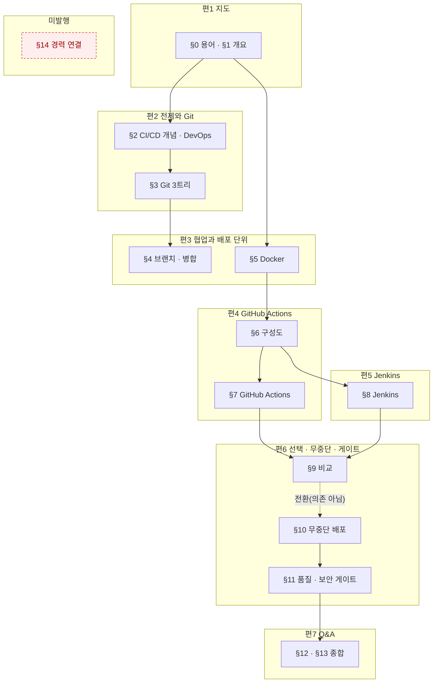

# `java-backend/06-CI-CD` 분할 설계 — 원본 1개를 7편으로

> 대상: `C:\Users\aeby\vscode\yanadoo-exit\shared\knowledge\java-backend\06-CI-CD-GitHub-Actions-Jenkins.md` (**83,252 B**, 읽기 전용)
> 카테고리: `backend-engineering` (현재 25편 → 32편)
> 작성: 2026-08-19 · 앞 배치: `2026-08-18-spring-batch-split-design.md`

---

## 1. 절차

### 1-1. 앞 배치가 확립한 순서를 그대로 쓴다

| # | 단계 | 근거 |
| ---: | --- | --- |
| ① | 원본 절별 **성분** 실측 | §2 |
| ② | **편1을 먼저 쓰고 실측으로 나머지를 재환산** | 앞 배치 §10-1 |
| ③ | 편마다 검증하고 **즉시 커밋** | pre-commit 훅이 작업트리를 본다 (인수인계 §3) |
| ④ | `dup-scan`은 편마다, 그리고 **Q&A편 정합성 점검 뒤에 다시** | 앞 배치 §10-5-b |
| ⑤ | 커밋은 `git commit -m "…" -- <경로>` 형태 | 인수인계 §4 |

⚠️ **②를 건너뛰지 마라.** 이번은 특히 그렇다 — §2-4가 보이듯 **원본 성분으로 비율을
예측하려는 시도가 5개 표본에서 전부 실패했다.**

### 1-2. 앞 배치 §10-11이 물려준 9개 규칙의 처리

| # | 규칙 | 이번 처리 |
| ---: | --- | --- |
| 1 | Q&A편은 `항목 수 × 460 B`로 잡아라 | ✅ §3-3에서 적용 — 58항목 |
| 2 | 본편 비율은 값이 아니라 ±10% 밴드 | ✅ §3-2 |
| 3 | 앞 배치 §10을 먼저 읽고 브리프를 써라 | ✅ 이 설계서를 쓰기 전에 §10-1~§10-11 전문을 읽었다 |
| 4 | `dup-scan` 건수는 앞 배치와 나란히 놓고 읽어라 | §8-3 |
| 5 | 지어낸 수치는 「틀리면 오해하나」로 판정 | §9-2 |
| 6 | 같은 단어의 다른 뜻은 설계에서 지목하라 | ✅ §7-1 — 이번은 **Stage**가 걸렸다 |
| 7 | 화이트리스트 정규식으로 전수 검사를 대신하지 마라 | §8-2 |
| 8 | `compose.mjs`의 mermaid 바이트를 분리하라 | ✅ **완료** — 커밋 `b683345`. §2-1이 그 결과다 |
| 9 | Q&A편 브리프에 「형제편도 오염원」을 넣어라 | §4-8 |

---

## 2. 원본 실측

### 2-1. 절별 성분

`npm run compose -- <원본>` (커밋 `b683345`에서 도식·코드를 분리했다)

| 절 | 합계 B | 산문% | 표% | 코드% | 도식% | 불릿% | 인용% | 도식 |
| --- | ---: | ---: | ---: | ---: | ---: | ---: | ---: | ---: |
| ~~(머리말)~~ | ~~390~~ | 0.0 | 0.0 | 0.0 | 0.0 | 0.0 | 81.8 | 0 |
| 0. 용어·약어 사전 | 5,443 | 0.1 | 99.4 | 0.0 | 0.0 | 0.0 | 0.0 | 0 |
| 1. 한눈에 보기 | 1,732 | 11.0 | 0.0 | 0.0 | 32.7 | 54.7 | 0.0 | 1 |
| 2. 과거 vs 현재 | 4,157 | 7.4 | 66.8 | 0.0 | 0.0 | 0.0 | 20.9 | 0 |
| 3. 형상관리와 Git 내부 동작 | 7,267 | 11.9 | 57.1 | 0.0 | 8.7 | 8.5 | 9.2 | 2 |
| 4. 브랜치·병합 전략 | 5,620 | 17.5 | 38.3 | **16.5** | 0.0 | 13.5 | 8.9 | 0 |
| 5. Docker 기초 | 4,642 | 7.4 | 64.8 | 7.3 | 8.7 | 0.0 | 7.4 | 1 |
| 6. CI/CD 구성도 | 2,086 | 0.2 | 75.6 | 0.0 | 15.3 | 0.0 | 0.0 | 1 |
| 7. GitHub Actions | 9,332 | 17.5 | 41.4 | **18.4** | 15.5 | 0.0 | 3.7 | 3 |
| 8. Jenkins | 11,658 | 12.1 | 58.9 | 8.3 | 7.1 | 2.2 | 8.5 | 2 |
| 9. GHA vs Jenkins | 2,437 | 0.2 | 73.2 | 0.0 | 0.0 | 0.0 | 24.5 | 0 |
| 10. 무중단 배포 | 5,273 | 22.4 | 35.9 | **19.6** | 7.3 | 0.0 | 10.8 | 1 |
| 11. 품질·보안 게이트 | 5,044 | 14.9 | 32.8 | 12.9 | 0.0 | 12.4 | 20.6 | 0 |
| 12. 트레이드오프·장애 | 4,025 | 0.1 | 96.7 | 0.0 | 0.0 | 0.0 | 0.0 | 0 |
| 13. 면접 예상 질문 | 11,891 | 4.2 | 54.1 | 0.0 | 0.0 | 0.0 | 40.9 | 0 |
| ~~14. 경력 연결 포인트~~ | ~~2,255~~ | 26.8 | 57.4 | 0.0 | 0.0 | 14.1 | 0.0 | 0 |
| **합계** | **83,252** | **10.6** | **56.2** | **6.8** | **5.5** | **4.2** | **13.3** | **11** |

절대 바이트: 도식 4,576 · **코드 5,627** · 표 46,753

#### 🔴 배정하지 않는 조각이 **둘** 있다 — 합계가 안 맞는 것이 정상이다

§3-2 배정표의 원본 B 합계는 **80,607**이고 원본 전체는 **83,252**다. 차이 2,645 B는 두 조각이다.

| 조각 | B | 배정하지 않는 이유 |
| --- | ---: | --- |
| **(머리말)** | 390 | 세 줄짜리 인용 블록(작성 기준일 · 출처 · 목적). **출처 줄이 HARD 금칙어를 포함**해 어느 편에 넣어도 `check-forbidden`이 커밋을 막는다 |
| **§14 경력 연결** | 2,255 | HARD 5종 + 익명화 무효 + 「본인이 모른다고 적은 목록」 — §3-2 참조 |

이 표가 없으면 다음 배치에서 「합계가 2,645 안 맞네」를 본 사람이 그 조각을 어딘가에 채워 넣는다.
**배정하지 않은 이유를 적지 않은 옳은 판단은, 다음 사람에게는 실수로 보인다.**
발행본의 출처 표기는 원본 머리말을 옮기는 것이 아니라, 본문에서 **「원본」**으로만 지칭한다(§7-2).

### 2-2. 🔴 이 원본에는 **진짜 코드가 있다** — 앞 배치와 결정적으로 다른 점

| | 원본 05 | **원본 06** | 배수 |
| --- | ---: | ---: | ---: |
| 코드 B | 446 | **5,627** | **12.6×** |
| 도식 B | 5,244 | 4,576 | 0.87× |

앞 배치의 「코드 11.6%」는 실은 도식이었고 자바 코드는 446 B뿐이었다(앞 배치 §10-7).
**이번은 다르다** — `yaml` 워크플로 · `Jenkinsfile`(groovy) · `Dockerfile` · `bash`가 실재한다.

⚠️ **코드는 축자 이식이라 비율이 1.0으로 고정된다.** 따라서 코드 비중이 높은 절일수록
전체 비율이 **내려간다.** 코드가 몰린 절은 §4(16.5%) · §7(18.4%) · §10(19.6%)이다.
⇒ **이 세 절을 담는 편에 다른 편과 같은 비율을 주면 과대 추정이 된다.** §3-2에서 반영한다.

### 2-3. 표가 56.2% — 코퍼스에서 가장 높다

| 원본 | 표% | 산문% |
| --- | ---: | ---: |
| 02 | 59.4 | 9.4 |
| **06 (이번)** | **56.2** | **10.6** |
| 01 | 54.5 | 6.7 |
| 03 | 49.7 | 11.7 |
| 05 | 47.9 | 15.5 |
| 04 | 42.7 | 2.4 |

### 2-4. 🔴 **성분으로 비율을 예측하려는 시도가 5개 표본에서 전부 실패한다**

앞 배치들이 물려준 설명은 두 갈래였고 **둘 다 실측에 반증된다.**

| 물려받은 설명 | 출처 | 실측 |
| --- | --- | --- |
| 「표 밀도가 높은 원본이라 1.40」 | 인수인계 §8 표의 괄호 | ❌ 03(표 49.7%)=1.40, 05(표 47.9%)=2.06. **1.8%p 차이에 비율은 1.5배** |
| 「산문 비중이 높은 원본일수록 비율이 크다」 | 03 설계서 §1-1 원문 | ⚠️ **반대가 아니라 무상관이다**(ρ=+0.30) — 아래 표 |

| 원본 | 산문% | 표% | 코드% | **실측 합계 비율** |
| --- | ---: | ---: | ---: | ---: |
| 01 | 6.7 | 54.5 | 3.6 | 1.81 |
| 02 | 9.4 | 59.4 | 1.1 | 1.98 |
| 03 | **11.7** | 49.7 | 2.9 | **1.40** ← 최저인데 산문은 2위 |
| 04 | **2.4** | 42.7 | 7.0 | 1.90 ← 산문 최저인데 비율은 4위 |
| 05 | 15.5 | 47.9 | 0.9 | 2.06 |
| **06 (이번)** | **10.6** | **56.2** | **6.8** | **?** |

산문%로 정렬하면 04 → 01 → 02 → 06 → 03 → 05 이고, 비율로 정렬하면 03 → 01 → 04 → 02 → 05 다.
**두 순서가 일치하지 않는다.** 다만 「일치하지 않는다」는 「반대다」가 아니다 —
ρ=+0.30은 **무의미**이지 역상관이 아니다. 「반대」로 물려주면 다음 세션이
「그럼 산문이 적을수록 비율이 크겠군」으로 **새 상수를 앉힌다.** 이 리포에서 이미 두 번 일어난 패턴이다.

#### 🔴 2-4-b. 「배치가 지날수록 두꺼워진다」는 **기각하면 안 됐다** — 축을 잘못 잡았다

초안은 이 가설을 `1.81 → 1.98 → 1.40 → 1.90 → 2.06, 단조가 아니다`로 기각했다.
**그 수열은 원본 파일 번호 순이다. 발행 순서가 아니다.** 예산 리뷰가 git에서 실측했다:

```
2026-08-18 13:40  redis-cache-design                ← 원본 03  ★ 이 카테고리의 첫 배치
2026-08-18 16:28  rdbms-and-nosql-fundamentals      ← 원본 01
2026-08-18 18:23  partitioning-fundamentals         ← 원본 02
2026-08-18 21:01  realtime-transport-and-websocket  ← 원본 04
2026-08-18 23:06  batch-processing-fundamentals     ← 원본 05
```

발행 순으로 세우면 **1.40 → 1.81 → 1.98 → 1.90 → 2.06** — 뒤집힘이 한 번(4%)뿐이다.
**03은 가설을 깨는 반례가 아니라 가설이 예측하는 「첫 배치의 최저값」이었다.**

| 후보 예측기 | ρ (비율과) |
| --- | ---: |
| **발행 시각 순서** | **0.90** |
| 편수 | 0.90 |
| 코드% | −0.60 |
| ~~원본 파일 번호 순~~ ← *초안이 쓴 축* | ~~0.40~~ |
| 산문% | 0.30 |
| 표% | −0.10 |

**초안이 기각한 가설이 초안이 검토한 모든 성분 예측기보다 강하다.**

#### 🔴 2-4-c. 인과가 리포 안에 이미 적혀 있었다 — **비율은 원본이 아니라 「준 예산」의 성질이다**

| 배치 | 준 지시 | 자연 집필 | 착지 |
| --- | --- | ---: | ---: |
| 03 (첫) | 예산 없음 | — | **1.40** |
| 01 | — | — | 1.81 |
| 02 | 밴드 1.70~1.95 | **2.09~2.32** | **1.98** (14~17% 걷어냄) |
| 04 | ±15%, 하한 강제 안 함 | — | 1.90 |
| 05 | 2.0 | 본편 **2.13~2.18** | **2.06** |

`database-scaling` 설계서 §10-2 원문:
> 「본편 넷의 **자연 집필 비율이 2.09~2.32**였는데 밴드를 1.70~1.95로 줬다.
> 그 결과 집필자들이 **14~17%를 걷어냈다.**」

⇒ **「실측 비율」은 원본의 성질이 아니라 그 배치에 준 예산의 성질이다.**
초안이 이 종속변수를 원본 성분에 회귀시켜 아무것도 못 찾은 것은 당연하다 —
**지배항이 원본이 아니라 지시문이다.** 결론(「성분으로 정하지 않는다」)은 맞지만 이유가 틀렸다.

이것이 §1-1 ②(편1을 먼저 쓰고 재환산)를 **더 강하게** 정당화한다.
비율이 지시문에 걸려 있다면 사전 예측은 원리적으로 불가능하고, **실측 재환산만이 유일한 교정 수단이다.**

⇒ **이 설계서는 원본 성분으로 비율을 정하지 않는다.** 대신 세 가지를 쓴다:

| 예측기 | 5표본 폭 | 쓰는 곳 |
| --- | ---: | --- |
| **고정 비용** (도입 + 용어 + 목차) | 34.6% (03 제외) · 121% (포함) | 지도편 (§3-1) |
| **항목 패리티** (항목 수 × B) | **50.5%** | Q&A편 (§3-3) — **밴드로 준다** |
| 코퍼스 비율 **밴드** | 47.1% | 본편 (§3-2) — **편1 실측 뒤 재환산** |

#### ⚠️ 2-4-d. 이 두 예측기도 **2표본에 기댄 것이었다** — 정직하게 적어 둔다

초안은 「분모를 바꾸면 안정적인 양이 드러난다」고 썼다. **5표본으로 재면 그렇지 않다.**
고정 비용은 34.6~121%, 항목 패리티는 **50.5%로 대체 대상(47.1%)보다 오히려 불안정하다.**
「2.4% 안에서 같다」는 **인접한 두 배치를 골랐을 때만** 나온 값이다.

**남의 예측기를 5표본으로 무너뜨리고 자기 예측기를 2표본으로 세우면 안 된다.**
그래도 이 둘을 쓰는 이유는 「더 낫기 때문」이 아니라 **지도편과 Q&A편은 비율로 잡을 근거가
더 없기 때문**이다. 둘 다 **점 추정이 아니라 밴드로** 준다.

#### 2-4-e. 다만 **흩어짐에는 축이 있다** — 세 축이 서로 다르다

「폭이 넓다」로 끝내면 예산을 못 짠다. 5표본으로 재면 각 성분이 서로 **다른 축**에 걸린다.

| 성분 | 지배 축 | ρ | 근거 |
| --- | --- | ---: | --- |
| 본편 비율 | **발행 순서**(= 준 예산) | 0.90 | §2-4-b · §2-4-c |
| 지도편 용어 정리 | **발행 순서**(집필 밀도) | **1.00** | §3-1-e — 0.53→1.12→1.39→1.61→1.81 단조 |
| Q&A편 항목당 B | **원본 B** | 0.90 | §3-3-a — 발행 순서로는 0.10 |

**세 축을 섞어 쓰지 마라.** 「발행 순서로 커진다」를 Q&A편에 적용하면 틀리고,
「원본이 크면 커진다」를 본편에 적용하면 틀린다.
공통점은 하나 — **어느 것도 원본의 산문·표·코드 비중으로는 설명되지 않는다.**

---

## 3. 편 구성과 예산

### 3-1. 지도편(편1) — **고정 비용 방식으로 잡는다**

앞 배치 §3-6의 분해를 쓰되 **표본을 2개에서 발행본 5편 전수로 늘렸다.**

#### 🔴 3-1-a. 초안의 「05 편1 = 22,850」은 **발행본이 아니라 초안이었다**

22,850은 `2026-08-18-spring-batch-split-design.md` §3-6이 **재환산 시점에** 잰 값이다.
그 초안은 리뷰를 거쳐 **12.7% 깎여서** 발행됐다.

| | 초안(§3-6이 인용한 값) | **발행본** |
| --- | ---: | ---: |
| `batch-processing-fundamentals.md` 전체 | 22,850 | **19,939** |
| 고정 비용 소계 | 8,962 | **7,977** |

**초안을 실측이라 부르면 안 된다.** 이 설계서는 발행본만 쓴다 — 파이프라인이 실제로
받아들인 값은 발행본이다(앞 배치 §3-6의 판정 논리와 같다).

#### 3-1-b. 발행 지도편 5편 전수 분해 (frontmatter 제외 기준)

발행 순서로 세웠다. 절 경계는 H2 위치로 잘라 `wc -c`로 직접 쟀다.

| 성분 | 03 | 01 | 02 | 04 | 05 | **06 (예산)** | 근거 |
| --- | ---: | ---: | ---: | ---: | ---: | ---: | --- |
| 도입 | 784 | 824 | 1,151 | 1,291 | 1,250 | **1,500** | 5편이 단조 상승, 최대 위 |
| 용어 정리 | 1,175 | 3,408 | 4,766 | 4,471 | **4,972** | **6,500** | §3-1-e로 **억제한 값**. 그대로 옮기면 9,900~10,900 |
| 시리즈 구성 + 정리 | 2,064 | 2,384 | 2,988 | 2,765 | 1,755 | **2,800** | 5편 평균 2,391 + 7편 목차 몫 |
| **고정 비용 소계** | **4,023** | **6,616** | **8,905** | **8,527** | **7,977** | **10,800** | |
| 본문 | 11,459 | 12,106 | 8,115 | 14,303 | 11,287 | **3,500** | 1,732 × 2.0 |
| 본문 + 고정 | 15,482 | 18,722 | 17,020 | 22,831 | 19,264 | **≈ 14,300** | §3-2 편1 목표와 일치 |
| + frontmatter | 583 | 670 | 641 | 705 | 675 | **≈ 700** | |
| **파일 전체** | 16,065 | 19,392 | 17,661 | 23,536 | 19,939 | **≈ 15,000** | |

⚠️ **예산 10,800은 코퍼스 최대(8,905)보다 21% 크다.** 정당한 이유는 용어뿐이고,
그 근거가 §3-1-e다. 도입·시리즈 구성은 코퍼스 안에 있다.

#### 🔴 3-1-c. 예산 기준과 검사기 기준이 **frontmatter만큼 어긋난다**

`tests/blog/content/schema.test.ts:47`은 `Buffer.byteLength(fs.readFileSync(...))` —
**frontmatter를 포함한 파일 전체**를 잰다. 그런데 이 설계서의 예산 14,300은
앞 배치 표를 이어받아 **frontmatter를 뺀 값**이다.

| | 값 |
| --- | ---: |
| 예산(설계서 기준) | 14,300 |
| frontmatter 실측(5편 583~705) | +700 |
| **검사기가 볼 값** | **≈ 15,000** |
| 검사기 하한 | 13,300 |

⇒ **여유는 1,000이 아니라 1,700이다.** 두 기준을 섞어 쓰지 마라 —
집필자에게 주는 목표는 **본문+고정 14,300**이고, `npm test`가 보는 것은 **15,000**이다.

**「그대로 옮기면 얼마인가」의 근거** — 원본 §0을 발행본 「용어 정리」로 옮길 때의 실측 비율.
초안은 04·05 두 표본에 05의 **초안값**(5,311)까지 써서 평균 1.78을 냈다. **5편 전수·발행본으로 다시 잰다.**

| 발행순 | 배치 | 원본 §0 | 용어 수 | 발행 용어 정리 | **비율** | 용어당 발행 B |
| :---: | :---: | ---: | ---: | ---: | ---: | ---: |
| 1 | 03 | 2,196 | 21 | 1,175 | **0.53** | 56 |
| 2 | 01 | 3,033 | 30 | 3,408 | **1.12** | 114 |
| 3 | 02 | 3,439 | 32 | 4,766 | **1.39** | 149 |
| 4 | 04 | 2,773 | 24 | 4,471 | **1.61** | 186 |
| 5 | 05 | 2,743 | 24 | 4,972 | **1.81** | 207 |
| — | **06** | **5,443** | **51** | ? | ? | ? |

🔴 **비율도 용어당 B도 발행 순서로 완전 단조다(ρ = 1.00).** §2-4-b와 같은 축이다.
원본 쪽은 오히려 안정적이다 — 원본 §0의 용어당 B는 101~116으로 6배치가 거의 같고,
**06도 107로 그 안에 있다.** 즉 부푸는 것은 원본이 아니라 **집필 밀도**다.

⇒ **「평균 1.78」은 쓰면 안 된다.** 최근값 1.81을 그대로 써도 `1.81 × 5,443 = 9,852`이고,
단조 추세를 인정하면 그 이상이다. **그대로 옮기면 9,900 ~ 10,900 B다** —
9,700은 과소추정이었고, 억제의 필요는 초안이 적은 것보다 **크다.**

**억제 6,500이 실제로 요구하는 것** — 나누면 지시가 분명해진다.

| 방식 | 계산 | 뜻 |
| --- | --- | --- |
| 개수를 줄인다 | 6,500 ÷ **190**(04 밀도) = **34개** | 51개 중 **17개를 각 편으로 내린다** |
| 밀도를 줄인다 | 6,500 ÷ 51 = **127 B/개** | 최근 4배치(114~207) **전부보다 낮다** — 비현실적 |

⇒ **개수로 줄여라. 밀도로 줄이지 마라.** 51개를 다 싣고 짧게 쓰는 것은 코퍼스에 전례가 없다.

⚠️ **표의 값은 억제 후(6,500)이고, 9,900~10,900은 억제하지 않았을 때다.** 두 숫자가 같은 표에
있으면 집필자가 어느 쪽을 예산으로 받을지 헷갈린다 — **예산은 6,500이다.**

#### 3-1-d. ⚠️ 그래서 **§2를 지도편에 붙이지 않는다** — 앞 배치와 반대 판단이다

앞 배치는 「§0+§1만으로는 4,761 B라 지도편이 10 KB로 하한을 깬다」며 §2를 붙였다.
**이번은 그 전제가 성립하지 않는다.** §0이 2배라 §0+§1만으로 7,175 B이고 예산이 14.3 KB다.

여기에 §2(4,157 B)를 붙이면 지도편이 22 KB를 넘고, 무엇보다 **용어표 6.5 KB + 개념 설명**으로
지도편이 「읽는 글」이 아니라 「찾아보는 표」가 된다.

#### 3-1-e. 🔴 용어 51개를 통째로 옮기지 마라

억제하지 않으면 용어 정리가 지도편의 **57%**(10,400 / 18,200)다. 발행본 다섯은 이렇다
(§3-1-b 표의 용어 값 ÷ 본문+고정):

| 배치(발행순) | 03 | 01 | 02 | 04 | 05 | **06 예산** |
| --- | ---: | ---: | ---: | ---: | ---: | ---: |
| 용어 B | 1,175 | 3,408 | 4,766 | 4,471 | **4,972** | **6,500** |
| 지도편 내 비중 | 7.6% | 18.2% | 28.0% | 19.6% | 25.8% | **45.5%** |

**같은 형태를 유지하면서 분량만 2배가 되면 형태가 바뀐 것이다.**

⚠️ **「억제」라는 말에 속지 마라 — 6,500 B는 코퍼스 최대치보다 크다.** 6,500은
역대 최대(4,972)보다 **31% 크고**, 비중으로는 역대 최대(28.0%)의 **1.6배**다.
그래도 정당한 이유는 **원본 §0 자체가 2배**(2,743 → 5,443)이기 때문이다.
9,900~10,900에서 줄이는 것이지 4,972에서 늘리는 것이 아니라는 점을 착각하지 마라 —
**두 기준선이 있고 이 값은 그 사이에 있다.**

⇒ **지침**: 지도편에는 **시리즈 전체에 걸치는 용어만** 싣는다(CI · CD · DevOps · 형상관리 ·
컨테이너 · 파이프라인 등). 특정 편에서만 쓰는 용어(Executor · Newman · Composite Action 등)는
**그 편의 첫 등장 자리에서 정의**한다.
목표: 지도편 용어 정리를 **6,000 ~ 6,500 B**(전체의 45% 이하)로 억제.

🔴 **하단을 더 내리려면 다른 성분으로 옮겨라 — 뺄셈만 하면 하한을 깬다.**
검사기는 frontmatter를 포함해 재므로(§3-1-c) 식에 700을 더해서 본다:

```
fm 700 + 도입 1,500 + 용어 6,500 + 시리즈 구성 2,800 + 본문 3,500 = 15,000   ← 목표, 하한 대비 +1,700
fm 700 + 도입 1,500 + 용어 4,800 + 시리즈 구성 2,800 + 본문 3,500 = 13,300   ← 하한과 동률
```

⇒ **다른 성분을 그대로 두고 용어만 줄일 수 있는 한계는 4,800 B다.**
그런데 4,800은 코퍼스 최대(4,972)와 거의 같다 — 즉 **뺄셈만으로 얻을 수 있는 여유가
사실상 없다.** 용어를 더 줄이고 싶으면 **줄인 만큼 「시리즈 구성」으로 돌린다** — 7편 각각의
소개를 충실히 쓰는 쪽이 용어표를 늘리는 것보다 지도편의 형태에 맞다.
이번 지도편은 발행본 다섯(16.1 ~ 23.5 KB)의 하단보다도 작은데, **원본 §1이 1,732 B로 작기 때문**이다.
그 차이를 용어표로 메우면 §3-1-d가 피하려던 「찾아보는 표」가 된다.

⚠️ 이 지침은 **분량 조절이 아니라 형태 유지**가 목적이다. 집필자가 「하한을 채우려고」
용어를 도로 늘리면 취지가 뒤집힌다.

#### 밀려난 용어는 **편2~편6의 예산 안에서 흡수된다**

지도편에서 뺀 용어는 사라지는 것이 아니라 각 편의 첫 등장 자리로 간다.
그 몫이 §3-2 목표에 따로 잡혀 있지 않으므로 크기를 확인해 둔다.

| | 값 |
| --- | ---: |
| 원본 §0 개당 | 5,443 ÷ 51 = **107 B** — 6배치 101~116 안 |
| 발행 시 개당 | **190 B** (04 실측 186) ~ **207 B** (05 실측, 코퍼스 최대) |
| 지도편에 남길 것 | 약 34개 (6,500 ÷ 190) |
| ~~**각 편으로 흩어질 것**~~ | ~~약 17개 = **3,230 ~ 3,520 B**~~ |
| ~~편당 (5편에 분산)~~ | ~~**650 ~ 700 B** — 본편 목표의 **3.5% 미만**~~ |

~~⇒ ±10% 밴드 안에서 흡수된다. **별도 예산을 잡지 않는다.**~~

#### 3-1-g. 「17개」는 틀린 수였다 — 25개다 `[편1 실측 후 정정]`

위 표의 17은 `51 − 34`다. 그 뺄셈은 **34가 순수 승계분일 때만** 성립한다.
발행본 101줄이 밝히듯 34는 두 출처의 합이다:

```
    34 (발행 용어)  =  26 (원본 §0 승계)  +  8 (★ 원본에 없음)
    51 (원본 §0)    −  26                 =  25  ← 각 편으로 내려간 것
```

역방향 차집합 0건으로 확정값이다. **발행본은 거짓을 적지 않았다** — ★ 8개를 명시했다.
틀린 것은 이 설계서와 검증 기록 쪽이다. 두 수를 빼면 나오는 값이라 아무도 검산하지 않았다.

정정된 하방 예산:

| | 종전 (17개 가정) | **실측 (25개)** |
| --- | ---: | ---: |
| 내려가는 용어 | 17 | **25** |
| 총 바이트 (× 190~207) | 3,230 ~ 3,520 | **4,750 ~ 5,175** |
| 편당 균등 가정 | 650 ~ 700 | **950 ~ 1,035** |

**그러나 균등 가정 자체가 틀렸다.** 용어는 편에 고르게 흩어지지 않고 **도구를 따라 뭉친다**:

| 편 | 받는 용어 (원본 첫 등장 줄) | 개수 | 바이트 (×190~207) |
| :---: | --- | ---: | ---: |
| 편2 | WD(169) · Stage/Index(169) · HEAD(198) | 3 | 570 ~ 621 |
| 편3 | Fast-forward(275) · 3-way merge(276) · Rebase(277) · Squash(320) | 4 | 760 ~ 828 |
| 편4 | Job(515) · Step(516) · Action(517) · Context(601) · Argo CD(466) | 5 | 950 ~ 1,035 |
| **편5** | Controller/Master(713) · Agent/Worker/Slave(713) · Executor(718) · Post-build Action(740) · Freestyle(744) · Pipeline(744) · Poll SCM(775) · ngrok(788) · Declarative Pipeline(791) · Scripted Pipeline(824) · DinD(895) | **11** | **2,090 ~ 2,277** |
| 편6 | Newman(1054) · Jenkinsfile(924) | 2 | 380 ~ 414 |
| 편7 | — | 0 | 0 |
| **미배정 · §14 전속** | **없음** | **0** | — |

**25개 중 11개(44%)가 편5 한 편에 몰린다.** 편5 목표 22,200 B의 9.4~10.3%로,
±10% 밴드를 통째로 먹는다. 종전 문단이 「한 편에 몰리면 밴드 상단으로 간다」고
예상은 했으나 **크기를 산정하지 않아 예산에 반영되지 않았다.**

우연이 아니라 구조다 — 편5는 원본 §8(Jenkins) 단독이고, Jenkins는 GitHub Actions와 달리
고유 명사 체계를 통째로 가진다. **§3-2의 편5 목표를 22,200 → 23,000 B로 올린다**
(밴드 20,700~25,300). 나머지 편은 밴드 안에서 흡수된다.

고아는 0건이다. 「각 편의 첫 등장 자리에서 정의한다」는 선언은 행선지 측면에서 이행 가능하다.
다만 **`Jenkinsfile`은 원본 첫 등장이 924줄(§9 = 편6)인데 편1이 「편5가 다룬다」고 약속했다** —
개념은 §8-3(편5)에 있으므로 편5 집필자가 낱말을 앞당겨 도입한다(§7-5 브리프 지시).

### 🔴 3-1-f. 편1 실측 — **예산표에 줄이 하나 빠져 있었다** (§1-1 ② 산출물)

편1이 **18,615 B**로 나왔다. 밴드 상단(파일 기준 15,700)을 **2,915 초과**다.
성분으로 가르면 초과분의 정체가 한 곳에 몰려 있다.

| 성분 | 예산 | **실측** | 차 | 판정 |
| --- | ---: | ---: | ---: | --- |
| 도입 | 1,500 | 1,531 | +31 | ✅ |
| 용어 정리 | 6,500 | **5,169** | **−1,331** | ✅ 억제 지시를 초과 달성. 용어 **34개**(지시값과 일치) |
| **낱말 구분표** | **없음** | **3,343** | **+3,343** | 🔴 **예산에 줄이 없다** |
| 본문(§1 대응) | 3,500 | 4,016 | +516 | ⚠️ 비율 **2.32** |
| 시리즈 구성 + 정리 | 2,800 | 3,838 | +1,038 | ⚠️ 7편이라 커진다. 코퍼스 최대 2,988 |
| **본문+고정** | **14,300** | **17,897** | +3,597 | |
| frontmatter | ~700 | 718 | +18 | ✅ |
| **파일 전체** | **≈15,000** | **18,615** | **+3,615** | |

**초과 3,597 중 3,343이 낱말 구분표다.** §7-1-b가 「편1이 실어라」로 **필수 지시**를 내렸는데
§3-1-b 성분표에는 그 줄이 없었다. 성분표를 앞 배치에서 그대로 물려받았고,
**앞 배치에는 이 항목이 존재하지 않았기 때문**이다.

⇒ **집필자의 초과가 아니라 예산의 결함이다.** 글을 깎지 않는다. 예산표를 고친다.

| 성분 | **고친 예산** | 근거 |
| --- | ---: | --- |
| 도입 | 1,500 | 유지 |
| 용어 정리 | 5,200 | 실측. 6,500은 상한이었고 34개는 5,200에 들어간다 |
| **낱말 구분표** | **3,300** | **신설.** 다의어 8낱말 + `master`/`slave` 방침 |
| 본문(§1 대응) | 4,000 | 실측 |
| 시리즈 구성 + 정리 | 3,800 | 실측. 7편이라 코퍼스(1,755~2,988)를 넘는다 |
| **합계** | **17,800** | 파일 기준 **≈18,500** |
| **리뷰 반영분** | **+726** | 아래 |
| **확정** | — | **19,341** |

리뷰 둘이 낸 지적 8건을 반영해 726 B가 늘었다. 늘어난 쪽이 대부분이다 —
도식에 반려 경로를 그리고, 승인 게이트가 도메인을 탄다는 조건을 문단으로 밝히고,
표에서 뺀 블루그린을 산문으로 옮겼다. **정정은 대체로 글을 늘린다**:
틀린 주장은 한 줄이지만 맞는 주장은 조건을 달아야 한다.

19,341은 발행 지도편 다섯(16,065 · 17,661 · 19,392 · 19,939 · 23,536) 중 **3위**다.
코퍼스 밖이 아니다. 밴드가 틀렸지 글이 틀리지 않았다.

#### 🔴 이 항목을 낳은 것이 **초과를 낳았다** — 다음 배치가 반복할 자리

| | |
| --- | --- |
| 무엇이 일어났나 | 설계서 §7-1-b가 「필수」로 지시한 산출물이 §3-1 예산표에 없었다 |
| 왜 안 보였나 | 성분표를 앞 배치에서 물려받았는데, **새 지시는 §7(위험)에서 나왔고 §3(예산)에 반영되지 않았다** |
| 일반 규칙 | 🔴 **§7·§9에서 「이 편은 ~을 반드시 실어라」를 새로 만들면, §3 예산표에 줄을 추가하라.** 지시와 예산은 다른 절에 살기 때문에 서로를 모른다 |

#### ⚠️ 성분별 비율이 갈렸다 — **가설로만 적는다 (n=2)**

같은 집필자·같은 글 안에서 두 값이 나왔다:

| 원본 성분 | 원본 B | 발행 B | 비율 |
| --- | ---: | ---: | ---: |
| §1 — 불릿 54.7% · 도식 32.7% · 산문 11.0% (표·코드 0) | 1,732 | 4,016 | **2.32** |
| ~~§0 중 실은 34개분 — 표 99.4%~~ | ~~3,638 (= 34 × 107)~~ | ~~5,169~~ | ~~**1.42**~~ |
| §0 **승계 26행끼리** — 표 99.4% | **2,742** | **3,133** | **1.14** |

**1.42는 분모가 틀린 값이었다.** `34 × 107` 은 34개 전부를 원본 §0의 개당 바이트로 환산한 것인데,
34 중 8개(★)는 §0에 존재하지 않는다(§3-1-g). 원본에 없는 것을 원본 바이트로 환산했다.

고칠 때 같은 함정을 한 번 더 밟을 뻔했다 — 분모만 승계분으로 좁히고 분자를 절 전체로 두면
1.91이 나온다. **분자에는 원본에 대응이 없는 것이 두 덩이나 들어 있다:**

```
    절 전체 5,233 B
      = 승계 26행  3,133   ← 원본 2,742 에 대응.  이것만이 「팽창」이다
      + ★ 신규 8행 1,140   ← 원본에 없음.  팽창이 아니라 추가
      + 표 밖 산문   960   ← 절 제목 · H3 소절 7개 · 도입 문단
```

그래서 이 자리에서 세 개의 값이 나왔다. **비율은 분자·분모의 항목 집합이 같을 때만 비교 가능하다.**

| 값 | 어떻게 나왔나 | 무엇을 재나 |
| ---: | --- | --- |
| ~~1.42~~ | 3,638(= 34 × 107) → 5,169 | 분모가 원본에 없는 8개를 포함. **무효** |
| 1.91 | 2,742 → 5,233 | 「승계분 대비 절 전체가 몇 배인가」 — 팽창률이 아니다 |
| **1.14** | 2,742 → 3,133 | **승계 26행끼리. 이것이 집필 팽창률이다** |
| 0.96 | 5,443 → 5,233 | §3-1-e 계열(원본 §0 전체 기준). C-3 검정용 |

표는 거의 이식이고 불릿은 산문으로 풀리니 그럴듯하다. 그리고 2.32는 앞 배치가 기록한
「자연 집필 비율 2.09~2.32」의 상단과 정확히 겹친다(§2-4-c).

**정정 결과 C-4의 격차는 오히려 벌어졌다** — 예측은 표 1.4 · 비표 2.3 이었는데
실측은 **1.14 대 2.32로 2배 차**다. 방향은 더 강하게 지지되고 표 쪽 크기는 예측보다 낮다.

🔴 **그래도 이것으로 편2~편6 예산을 다시 짜지 마라.** 표본이 **한 글 안의 두 점**이다.
§2-4-d에서 「2표본으로 자기 예측기를 세우면 안 된다」고 적어 놓고 같은 짓을 하는 자리다.
**§10-0에 C-4로 올려 다음 배치가 판정하게 한다.**

다만 집필자에게 줄 말은 하나 생겼다 — **밴드 1.95는 자연 집필(2.1~2.3)을 깎은 값이다.**
브리프에 그렇게 적어라. 모르면 집필자는 자연스럽게 쓰고 밴드를 넘긴다.

### 3-2. 본편 예산 — 값이 아니라 밴드로 준다

코퍼스 5배치 실측 본편 비율의 폭은 **1.41 ~ 2.18**이다. 예측이 안 되므로(§2-4)
**중앙값 1.95를 초기값으로 쓰고 ±10% 밴드**를 준다. **편1 실측 뒤 전 편을 재환산한다.**

⚠️ **코드 비중 보정**: 코드는 비율 1.0이 확정이다. 코드 비중이 코퍼스 평균(3.1%)보다
현저히 높은 절을 담는 편은 **비율을 낮춰 잡는다.**

🔴 **단, 「코드%」를 그대로 쓰면 안 된다 — 축자 이식 대상만 1.0이다.** 구조 리뷰 실측:
§4의 코드 16.5%는 **전부 ` ```text ` 블록 5개**(`281`·`290`·`302`·`310`·`324`)로
git 명령 예시와 충돌 마커다. 해설을 붙이면 얼마든지 늘어난다.
진짜 축자 코드(`yaml`·`groovy`·`dockerfile`·`bash`)는 **§5·§7·§8·§10·§11에만** 있다.
⇒ 편3의 축자 코드는 §5의 339 B뿐(**3.3%**)이라 하향 근거가 거의 없다. **1.80 → 1.90으로 되돌린다.**

| 편 | 원본 절 | 원본 B | 코드% | 축자 코드% | 초기 비율 | **목표 B** | 밴드(±10%) |
| :---: | --- | ---: | ---: | ---: | ---: | ---: | --- |
| 1 | §0 + §1 (지도편) | 7,175 | 0.0 | 0.0 | — | ~~14,300~~ → ~~17,800~~ → ~~19,341~~ → ~~19,615~~ → **20,002** | **발행 확정** (§7-5-d) |
| 2 | §2 + §3 | 11,424 | 0.0 | 0.0 | 1.95 | ~~22,300~~ → ~~22,566~~ → **22,600** | **발행 확정** · 밴드 20,100 ~ 24,500 안 |
| 3 | §4 + §5 | 10,262 | 12.4 | **3.3** | **1.90** | **19,500** | 17,600 ~ 21,500 |
| 4 | §6 + §7 | 11,418 | 15.0 | 15.0 | **1.75** | **20,000** | 18,000 ~ 22,000 |
| 5 | §8 | 11,658 | 8.3 | 8.3 | 1.90 | ~~22,200~~ → **23,000** | 20,700 ~ 25,300 (§3-1-g) |
| 6 | §9 + §10 + §11 | 12,754 | 13.2 | 13.2 | **1.80** | **23,000** | 20,700 ~ 25,300 |
| 7 | §12 + §13 (Q&A) | 15,916 | 0.0 | 0.0 | — | **28,000** | 26,300 ~ 29,200 (§3-3) |
| **합계** | | **80,607** | | | | **≈ 155,100** | |

겉보기 합계 비율 **1.92**(편1 실측 반영 전 1.85 → 실측 후 1.90 → 리뷰·용어 반영 후 1.92).
앞 배치(2.06)보다 낮게 잡은 것은 코드 12.6배(§2-2) 때문이다.

🔴 **이 표는 배치 중에 세 번 올라갔다.** 세 번 다 원인이 같다 —
**§7·§9가 「이 편은 ~을 반드시 실어라」를 지시했는데 §3 예산표에 대응하는 줄이 없었다.**
낱말 구분표(+3,300)가 그랬고, 편5의 용어 11개(+800)가 그랬다.
다음 배치는 §7을 쓸 때마다 §3에 줄을 추가하는지 확인하라(§3-1-f의 일반 규칙).

⚠️ **편1은 이제 밴드가 아니라 실측값이다**(§3-1-f). 아래는 왜 원래 밴드가 빗나갔는지의 기록이다.

| | 하단 | 목표(초안) | 상단 | **실측** |
| --- | ---: | ---: | ---: | ---: |
| 설계서 기준 (frontmatter 제외) | 13,500 | 14,300 | 15,000 | **17,897** |
| 파일 전체 (frontmatter +700) | 14,200 | 15,000 | 15,700 | **18,615** |

밴드 폭은 **±5%**였다(±10%면 12,870으로 절대 하한 12,600에 붙는다).
빗나간 이유는 폭이 좁아서가 아니라 **성분표에 낱말 구분표(3,343 B) 줄이 없었기 때문**이다 —
±10%였어도 넘겼다. **밴드를 넓혀서 고칠 문제가 아니었다.**

🔴 **기준이 둘이라는 것은 그대로 유효하다**(§3-1-c) — 집필자에게 주는 값은 frontmatter 제외이고
`npm test`가 보는 값은 +700이다. **다른 편의 밴드는 전부 설계서 기준 ±10%다.**

#### R-1. 재환산은 **한 숫자만** 고쳐라 — 비율의 분해식

편1 실측 뒤 일곱 칸을 손으로 고치면 반드시 하나를 빠뜨린다. 비율은 이렇게 분해된다.

```
r = 축자코드%  +  (1 − 축자코드%) × r_비코드
```

축자 코드는 이식이므로 비율 1.0이 확정이고, 나머지만 집필 비율을 탄다.
**재환산에서 움직이는 값은 `r_비코드` 하나뿐이다.** 표의 초기 비율은 전부 이 식의 출력이다.

| 편 | 축자코드% | r_비코드 | ⇒ r |
| :---: | ---: | ---: | ---: |
| 2 | 0.0 | 1.95 | 1.95 |
| 3 | 3.3 | 1.93 | **1.90** |
| 4 | 15.0 | 1.88 | **1.75** |
| 5 | 8.3 | 1.98 | **1.90** |
| 6 | 13.2 | 1.92 | **1.80** |

도출된 `r_비코드`가 1.88~1.98로 **흩어져 있는 것 자체가 손튜닝의 잔여**다.
원리대로라면 한 배치 안에서 이 값은 **하나**여야 한다 — 코드 비중이 다를 뿐 집필자는 같다.

⇒ **재환산 절차**: 편1을 쓴 뒤 그 실측에서 `r_비코드` **단일 값**을 정하고,
편2~편6의 목표 B를 위 식으로 **다시 계산한다.** 표의 「초기 비율」 칸을 손으로 고치지 마라.
현재 표의 값은 재환산 전까지 쓰는 임시값이고, `r_비코드`의 폭이 5%라 지금은 무해하다.

#### R-2. 초기값 1.95의 출처 — **두 수열을 섞지 마라**

이 설계서에는 「본편 비율」 수열이 **둘** 나온다. 혼동하면 근거가 무너진다.

| 수열 | 값 | 쓰는 곳 |
| --- | --- | --- |
| **배치 전체** 겉보기 비율 | 1.40 · 1.81 · 1.90 · 1.98 · 2.06 | §2-4-b (발행 순서 ρ=0.90) |
| **편별** 본편 비율 | 1.41 ~ 2.18 | 위 문단(밴드 폭의 근거) |

1.95는 **배치 전체 수열**에서 나왔다. 03(첫 배치, 예산 지시 없음 — §2-4-b)을 뺀 네 값
`1.81 · 1.90 · 1.98 · 2.06`의 중앙값 **1.94**, 평균 **1.94**를 올림한 것이다.
5개를 다 쓰면 중앙값이 1.90으로 내려간다 — **03을 빼는 판단이 이 숫자를 만든다.**

편6 코드%는 구성 절의 **가중평균으로 직접 계산했다** — (2,437×0.0 + 5,273×19.6 + 5,044×12.9) ÷ 12,754 = **13.2%**.
표에 값을 옮겨 적지 말고 이렇게 계산하라. 절을 재배치하면 이 값이 따라 움직인다.

#### 🔴 §14를 **발행하지 않는다** — 그래서 8편이 아니라 7편이다

초안은 §11+§14를 편7로 묶었다. 구조 리뷰가 두 방향에서 무너뜨렸다.

| 축 | 실측 |
| --- | --- |
| **금칙어** | §14 다섯 줄에 HARD가 5종 — 회사명 2·직책 1·제품명 2. 커밋이 막힌다 |
| **익명화 무효** | 회사를 「OTT 서비스」로 익명화한 뒤 제품명을 남기면 그 제품명이 회사를 한 단어로 특정한다 |
| **본인이 모른다고 적은 목록** | 「보완이 필요한 항목」이 자기 조직의 브랜치 전략을 모른다는 자백이다. 익명화로 해결되지 않는다 |
| **주제 묶음이 아님** | §14의 4개 항목을 §11과 대조하면 연결 **0개**. 각각 §4·§5·§10으로 흩어진다 |

넷째 줄이 결정적이다. 초안 §3-4 표의 「갈랐을 때의 손해」 칸이 이미 자백하고 있었다 —
**「§14가 어디에도 못 붙는다」**. 그것은 의존이 아니라 **잔여 처리**였고, 잔여를 붙일 곳이
없다는 것은 묶음의 근거가 아니라 **묶지 말라는 신호**다.

부수 효과로 초안의 최대 위험이 사라졌다. 편6·편7이 목표 13,900 B로 하한(13.3 KB)과
밴드 하단이 겹쳐 「여유가 없다」고 적혀 있었는데, 재구성 후 최소 편이 **14,300 B(편1)** 이고
편6은 **23,000 B**다. 하한에 걸리는 편이 없다.

### 3-3. Q&A편(편7) — 항목 패리티

앞 배치 공식: **목표 B = 항목 수 × 약 460 B**

#### 🔴 3-3-a. 460은 **인접한 두 배치만 골랐을 때** 나온 값이다 — 5편 전수 실측

초안은 04·05 두 편만 보고 「2.4% 안에서 같다」고 적었다. 카테고리의 Q&A편 **5편 전수**는 이렇다.

| 발행본 | 원본 | 원본 B | 항목 | 발행 B | **항목당 B** | 발행 순서 |
| --- | :---: | ---: | ---: | ---: | ---: | :---: |
| `redis-cache-qna` | 03 | 46,777 | 44 | 14,495 | **329.4** | 1번째 ★첫 배치 |
| `spring-batch-qna` | 05 | 48,950 | 45 | 20,441 | 454.2 | 5번째 |
| `websocket-realtime-qna` | 04 | 58,503 | 46 | 21,399 | 465.2 | 4번째 |
| `database-fundamentals-qna` | 01 | 72,618 | 55 | 26,322 | 478.6 | 2번째 |
| `database-scaling-qna` | 02 | 71,139 | 59 | 29,251 | **495.8** | 3번째 |

폭은 **50.5%** — §3-2가 대체하려는 비율 예측기(47.1%)보다 **오히려 넓다.**
03을 빼도 454~496으로 **9.2%**다. 「460 상수」로 쓸 만한 값이 아니다.

**그런데 흩어짐에 축이 있다.** 원본 B 오름차순으로 세우면 항목당 B의 순위가 `1,2,3,5,4`다.

| 후보 축 | ρ (항목당 B와) |
| --- | ---: |
| **원본 B** | **0.90** |
| 발행 순서 | 0.10 |

⇒ **본편 비율(§2-4-b)과 지배항이 다르다.** 본편은 발행 순서(=준 예산)에 걸리고,
Q&A편은 **원본 크기**에 걸린다. 두 축을 섞어 쓰지 마라.
그럴듯한 기전: 원본이 클수록 한 항목에 딸린 맥락이 많아 풀어 쓸 것이 많다.

**이번 항목 수 (전수 집계, 컨트롤러가 직접 셌다)**

| 출처 | 항목 | 세는 방법 |
| --- | ---: | --- |
| §12-1 선택지 | 10 | 표 행 11 − 헤더 1 |
| §12-2 실패 모드 | 13 | 표 행 14 − 헤더 1 |
| §13 기본 질문 | 30 | 표의 `#` 열 1~30 |
| §13 심화 문답 | 5 | `**Q.` 로 시작하는 줄 |
| **합계** | **58** | |

#### 3-3-b. 그래서 **점 추정이 아니라 밴드로 준다** — 목표 28,000 B

06의 원본 83,251 B는 **코퍼스 최대**이자 관측 구간(46.8k~72.6k) **바깥**이다.
03을 뺀 4점으로 회귀하면 기울기 0.001433 B/B, 83,251에서 **502.7**이 나온다.
4점을 10 k 넘게 외삽한 값이므로 **점 추정으로 쓰지 않고 밴드 상단으로만 쓴다.**

| 값 | 항목당 B | 58항목 환산 | 근거 |
| --- | ---: | ---: | --- |
| 밴드 하단 | 454 | **26,300** | 03 제외 실측 최소(05) |
| **목표** | **483** | **28,000** | 실측 상단과 외삽 사이 |
| 밴드 상단 | 503 | **29,200** | 4점 회귀 외삽 |

⇒ **목표 28,000 B, 밴드 26,300 ~ 29,200.** 앞 배치(20,441)의 **1.37배**다.
밴드가 위로 넓은 것(−6.1% / +4.3%)은 대칭이 아니라 **06이 관측 구간 위쪽 바깥이기 때문**이다.

⚠️ 이 밴드는 §1-1 ②의 **편1 재환산 대상이 아니다.** 편1 재환산은 본편 비율만 건드린다.
Q&A편은 분모가 원본 B가 아니라 항목 수라 편1 실측이 정보를 주지 않는다.

**나누지 않는 이유**: 149편 중 31편(21%)이 이미 25 KB를 넘고 최대는 45.8 KB다.
둘로 나누면 각 13 KB대가 되어 오히려 하한에 걸리고, 「Q&A편은 지도편 목차가 유일한 inbound」
(인수인계 §8)라는 취약점이 둘로 늘어난다.

### 3-4. 편 구성 근거 — 왜 이렇게 묶었나

원본은 최대 절이 11,891 B라 **H2 하나로는 목표에 못 미친다.** `CR-4.1a`에 따라 인접 H2를
묶는데, 묶는 축은 분량이 아니라 **의존 관계**다(§2 scout 실측).



**간선 두 개는 약하다** — 구조 리뷰가 원본과 대조해 잡았다. 편 배정은 안 바뀌지만
집필자가 없는 인과를 지어내지 않도록 적어 둔다.

| 간선 | 초안 | 실측 |
| --- | --- | --- |
| `§2 → §5` | CI/CD 개념이 Docker로 이어진다 | ❌ §5-1은 VM/컨테이너 비교로 시작하고 §2(폭포수·애자일)에 기대지 않는다. 실제 연결은 §1 `73`행 「전제는 형상관리(Git)와 **재현 가능한 실행 단위**」 ⇒ **`§0 → §5`가 맞다** |
| `§9 → §10` | 비교의 결론이 배포 전략의 전제 | ⚠️ §9는 도구 비교, §10은 도구 무관 전략이라 **의존이 아니라 전환**이다. 편6 집필자는 억지 연결을 만들지 마라 |

| 묶음 | 왜 함께 가야 하나 | 갈랐을 때의 손해 |
| --- | --- | --- |
| §2 + §3 | §2가 「왜 자동화인가」를, §3이 「그 전제인 형상관리」를 답한다. §3만 떼면 Git 튜토리얼이 된다 | 시리즈의 전제가 사라진다 |
| §4 + §5 | 둘 다 **「재현 가능한 단위를 어떻게 만드나」** 다 — §4는 이력의 단위(커밋·브랜치), §5는 실행의 단위(이미지). 원본 `379` 「"빌드 결과 = 이미지"로 배포 단위 통일 가능」이 그 프레임의 근거다 | 각각 11.8 KB · 9.3 KB로 하한 미달 |
| §6 + §7 | §6의 구성도가 §7 실습의 무대다. §6은 2,086 B로 단독 불가 | 도식과 설명이 갈린다 (`CR-4.5` 위반) |
| §9 + §10 + §11 | **파이프라인을 통과한 뒤에 무엇을 보장하나** — §10은 가용성(무중단), §11은 품질·보안. §9는 그 앞에서 도구 선택을 닫는다 | §9는 2,437 B, §11은 단독 9,584 B로 **둘 다 하한 미달** |

---

## 4. 편별 상세

*(제목은 초안이다. 편1 집필 후 재환산 시 갱신한다. 태그는 §5-2 참조)*

| 편 | slug | 제목(초안) | `role` | `seriesOrder` |
| :---: | --- | --- | --- | :---: |
| 1 | `cicd-pipeline-fundamentals` | 배포를 사람 손에서 떼어내기 — CI/CD 자동화 지도 | `map` | 1 |
| 2 | `version-control-as-cicd-premise` | 자동화의 전제는 형상관리다 — Git 3트리와 되돌리기 | | 2 |
| 3 | `branching-and-container-units` | 되돌릴 수 있는 단위 만들기 — 브랜치 전략과 컨테이너 | | 3 |
| 4 | `github-actions-pipeline` | GitHub Actions — 이벤트에서 배포까지 | | 4 |
| 5 | `jenkins-declarative-pipeline` | Jenkins — 파이프라인을 코드로 남기기 | | 5 |
| 6 | `zero-downtime-and-quality-gates` | 멈추지 않고 바꾸기 — 무중단 배포와 품질·보안 게이트 | | 6 |
| 7 | `cicd-qna` | CI/CD 자동화 Q&A — 고를 때·터졌을 때·설명해야 할 때 | | 7 |

slug 충돌 검사 완료(`content/blog/` 전체, 7개 전부 0건).
초안의 `zero-downtime-deployment-strategies`·`quality-and-security-gates`는 **쓰지 않는다** — §14 미발행으로 두 편이 하나가 됐다.

#### 🔴 4-1. 프론트매터 공통값 — **여기서 못박지 않으면 시리즈가 갈라진다**

`lib/blog/frontmatter.ts:112~116`은 `series`가 있으면 `seriesOrder`가 숫자일 것만 검사한다.
**`series` 문자열의 값은 아무것도 검사하지 않는다.** 7기가 `cicd`·`ci-cd`·`cicd-automation`을
제각각 쓰면 한 시리즈가 셋으로 갈라지고 **빌드는 그대로 통과한다.**

| 필드 | 값 | 근거 |
| --- | --- | --- |
| `category` | `backend-engineering` | |
| `series` | **`"cicd-automation"`** | 기존 36개 series와 충돌 없음. 원본 제목이 「CI/CD 자동화」 |
| `seriesOrder` | 위 표의 값 | `map`도 1을 갖는다(앞 배치 `batch-processing-fundamentals`) |
| `date` | **`"2026-07-26"`** | **커밋일이 아니라 원본 작성 기준일이다.** 앞 배치 5편 전부 이 값을 쓴다 |
| `updated` | **`"2026-08-19"`** | 발행일. 앞 배치는 `"2026-08-18"`을 **5편 모두** 썼다 — 이것이 `date`와 갈리는 쌍이다 |
| `role` | 편1만 `"map"`, 나머지 없음 | `links.test.ts:85`가 이 값으로만 고립을 면제한다 |
| `featured` / `draft` | `false` / `false` | |

#### 4-2. 편별 브리프 필수 문구 — **여기서 잘라 쓴다**

설계서 곳곳의 지시를 편별로 모았다. 브리프를 쓸 때 해당 행을 그대로 옮긴다.
**브리프는 설계서를 읽지 않는 사람이 받는다** — 「설계서 §7-1 참조」라고 쓰면 전달되지 않는다.

| 편 | 반드시 넣을 것 |
| :---: | --- |
| **1** | ① 용어 51개를 다 싣지 마라 — 시리즈 전체에 걸치는 것만, 6,000~6,500 B(§3-1-e) ② **낱말 구분표를 실어라**(§7-1-b) — 파이프라인·워크플로·블루그린·게이트·Stage가 이 시리즈에서 무엇을 가리키는지, 블로그의 다른 용법과 대비해서 ③ `master`/`slave` 표기 방침을 **여기서 정한다**(§9-3) ④ 나가는 링크 1개(§6-3) |
| **2** | ① **§3-7의 태그 문단(원본 `259~261`)을 「Git 명령 요약표」로 축소하지 마라** — 「실무 배포 기준은 브랜치가 아니라 태그」가 **뒤 4편의 전제**다 ② `Stage`는 여기서 Git Index 뜻이다. 편1 구분표를 가리켜라 |
| **3** | ① 이 편의 전제는 **편2 끝의 태그 문단**이다 ② `Stage`의 **셋째 뜻(Docker 멀티스테이지)** 이 여기 있다(원본 `432`) — 편1 구분표를 가리켜라 ③ §4의 ` ```text ` 블록은 축자 코드가 아니다. 해설을 붙여라(§3-2) |
| **4** | ⓪ **`Release`를 트리거 절에서 정의하라**(§7-5 ⑧) — 편1 도식이 「Tag Release」를 쓰는데 정의된 자리가 없다 ① **GHA·Jenkins 계층 대조표를 세우지 마라** — 그 표는 편6이 싣는다(§7-1-e). 자기 계층만 설명하고 넘겨라 ② 시크릿 UI 경로에 「2026년 7월 기준」을 넣어라(§9-4) |
| **5** | ① `stage()`를 처음 쓰는 자리에서 편1 구분표를 가리키고 **Git Stage와 다르다**를 명시하라 ② 요금·타임아웃 수치에 시점을 넣어라(§9-4) |
| **6** | ① **`app-cicd.conf` 치환**(§9-1) — 이름을 스스로 정하지 마라 ② 헬스체크 스크립트는 **결함째 싣고 그 사실을 명시**하라(§9-2) — 고치면 편7의 답이 무너진다 ③ 배포 전략 비교표를 **새로 세우지 말고** `elasticsearch-operations`를 링크하라(§7-1-c) ④ 롤링 배포의 세션 직렬화 문제는 `realtime-scaleout-and-session`이 이미 다뤘다 — 한 문장으로 짚고 링크(§7-1-d) ⑤ 계층 대조표는 여기가 원본 위치다(원본 `925`) |
| **7** | ① 제목·본문에 「면접」·「예상 질문」을 쓰지 마라 — **「고를 때·터졌을 때·설명해야 할 때」** 프레임 ② 편6과 **같은 `app-cicd.conf`** 를 써라 ③ 58항목 전부에 근거 편을 지목하라(§9 표 #2) |
| **전 편** | ① 원본을 지칭할 때 **「원본」** — 「강의」·「수강」 금지(§7-2) ② 본편은 **지도편만** 링크한다. 다른 본편을 가리키지 마라(§6-2) ③ 프론트매터 공통값(§4-1)을 그대로 쓴다 ④ 🔴 **「목표 비율은 자연 집필보다 낮게 잡은 값이다」를 브리프에 적어라**(§3-1-f) — 코퍼스 실측 자연 집필은 2.1~2.3인데 밴드는 1.75~1.95다. 모르면 집필자는 자연스럽게 쓰고 밴드를 넘긴 뒤 「왜 넘었지」를 못 설명한다 ⑤ 편1이 정한 것을 따른다 — **낱말 구분표**(어느 뜻인지 명시하고 편1을 가리켜라) · **`master`/`slave` 방침**(산문은 현행 어휘, 식별자는 원본 그대로) |

---

## 5. 태그

`content/blog/tags.ts` 통제 어휘 **안에서만** 쓴다. 글당 3~5개, **같은 패싯 최대 2개**.
어휘 확장이 필요하면 **별도 커밋**으로 분리한다(인수인계 §8 확정 결정).

⚠️ 앞 배치에서 초안이 「같은 패싯 최대 2개」를 위반한 적이 있다(앞 배치 §5-1).
**태그를 정한 뒤 패싯별로 세어라.**

### 5-1. 🔴 `ci-cd`는 **전 편 필수**다 — 이 태그가 두 번째 링크 구조다

실측: 149편 중 `ci-cd` 태그를 단 **1편**만 쓴다 — `ai-transformation/sdlc-human-gates.md`.
`/blog/tags/ci-cd/`가 사실상 빈 페이지로 존재해 왔다는 뜻이다.

이번 배치 7편이 전부 달면 **1 → 8편**이 되고, 그 페이지가 시리즈 목록 역할을 하면서
`backend-engineering`과 `ai-transformation`을 **자동으로** 잇는다.
§6-3의 본문 링크와 달리 사람이 유지보수하지 않아도 끊기지 않는다 —
카테고리 고립(§7-4)에 대한 두 번째 대비책이다.

### 5-2. 편별 배정 — 패싯 기호를 함께 적었다

패싯: **A** 스택 · **B** 엔지니어링 · **C** AI · **D** 프로덕트 · **E** 검색 · **F** 기타

| 편 | 원본 절 | 필수 | 편별 | 패싯 카운트 |
| ---: | --- | --- | --- | --- |
| 1 | §0+§1 지도 | `ci-cd`ᴮ | `deployment`ᴮ `terminology`ᶠ `docker`ᴬ | B2 A1 F1 |
| 2 | §2+§3 형상관리 | `ci-cd`ᴮ | `deployment`ᴮ `engineering-leadership`ᴰ | B2 D1 |
| 3 | §4+§5 브랜치·Docker | `ci-cd`ᴮ | `docker`ᴬ `deployment`ᴮ | B2 A1 |
| 4 | §6+§7 GitHub Actions | `ci-cd`ᴮ | `docker`ᴬ `security`ᴮ | B2 A1 |
| 5 | §8 Jenkins | `ci-cd`ᴮ | `docker`ᴬ `deployment`ᴮ | B2 A1 |
| 6 | §9+§10+§11 무중단·게이트 | `ci-cd`ᴮ | `deployment`ᴮ `payments`ᴰ | B2 D1 |
| 7 | §12+§13 Q&A | `ci-cd`ᴮ | `troubleshooting`ᴮ `docker`ᴬ `payments`ᴰ | B2 A1 D1 |

**편6이 함정이다.** `deployment`·`security`·`ci-cd`가 전부 패싯 B라 셋을 같이 달면 위반이다.
§11이 PG 도메인이므로 `security` 대신 `payments`ᴰ를 골라 교차성을 얻는다.
편4는 반대로 `security`를 살린다 — §7의 시크릿 관리가 그 편의 실질 내용이기 때문이다.
같은 단어가 두 편에 다 어울릴 때 **어느 편에 줄지는 패싯 균형이 정한다.**

### 5-3. 어휘 확장 판정 — `git`·`jenkins`·`github-actions`를 **추가하지 않는다**

이 시리즈의 주제어 세 개가 어휘에 없다. 넣을지 실측으로 판정했다.

| 후보 | ① 3편 이상 | ② 2개 이상 카테고리 | ③ 상하위 대체 불가 | 판정 |
| --- | --- | --- | --- | --- |
| `git` | ✅ 기존 12편이 5회 이상 언급 | ✅ agentic-coding·ai-transformation | ❌ | **미추가** |
| `jenkins` | ❌ 이번 배치 1편뿐 | ❌ backend-engineering 전용 | — | **미추가** |
| `github-actions` | ❌ 이번 배치 1편뿐 | ❌ backend-engineering 전용 | — | **미추가** |

`git`이 ③에서 탈락한 이유: 편2의 슬러그가 `version-control-as-cicd-premise` —
**「CI/CD의 전제로서의 형상관리」로 이미 규정**했으므로 `ci-cd`가 상위 개념으로 성립한다.
①②를 만족해도 ③ 하나로 탈락한다(`django`가 ②로 탈락한 것과 같은 구조, `tags.ts` 주석).

다음 사람이 같은 질문을 다시 하지 않도록 **탈락도 근거와 함께 남긴다.**
어휘가 82종에서 안 늘어난 것은 후보가 없어서가 아니라 **떨어뜨린 것**이다.

---

## 6. 링크 구조

### 6-1. 시리즈 지도편은 「완성해서 커밋」할 수 없다

`CR-4.3`은 시리즈 첫 글에 전체 목차를 요구하고, 링크 검사는 대상이 실재할 것을 요구한다.
편별 커밋을 유지하면 지도편이 항상 먼저 나오므로 목차 링크가 전부 죽는다.

**해소법(3배치 연속 사용)**: 지도편을 **링크 없이** 먼저 내고, 이후 각 편 커밋에
**그 편의 목차 링크 한 줄을 함께** 넣는다.

🔴 **마지막 편(편7 Q&A)의 목차 링크를 빠뜨리면 그 편이 고립으로 훅에 막힌다** —
Q&A편은 지도편 목차가 **유일한 inbound**다.

**7편에서도 그대로 작동한다.** `links.test.ts:85`는 `role === "map"`인 편만 고립을
면제하므로, 편1이 `map`이고 편2~편7이 각자 커밋에서 목차 한 줄을 받으면 inbound ≥ 1이
보장된다. 편 수는 이 논리에 영향을 주지 않는다.

### 6-2. 🔴 편 사이 링크 — **「앞 편과 뒤 편」이 아니다**

초안은 「각 편이 앞 편과 뒤 편을 참조한다」였다. **뒤 편은 아직 존재하지 않는다.**
`links.test.ts:44~52`가 모든 `/blog/<cat>/<slug>/` 대상의 실재를 요구하고
`.githooks/pre-commit:18`이 매 커밋마다 그 검사를 돌린다. 편2 커밋 시점에 편3은 없다.
이대로 브리프에 넣으면 **7기 중 6기가 막힌다.**

앞 배치(`spring-batch` 5편) 실측 패턴은 다르다:

| 편 | 시리즈 내부 outbound |
| --- | --- |
| 편1 (`role: map`) | 편2·편3·편4·편5 **전부** |
| 편2 ~ 편4 (본편) | **편1만** |
| 편5 (Q&A) | 편1·편2·편3·편4 **전부** |

즉 **본편은 지도편만 뒤로 참조하고, Q&A편이 전 편을 앞으로 모은다.**
커밋 로그도 같은 말을 한다 — 매 커밋이 정확히 **「지도편 + 그 편」 두 파일**이다.

```
27855d3 feat(blog): spring-batch 편4 — 성능 최적화와 병렬화
  content/blog/backend-engineering/batch-performance-and-parallelism.md
  content/blog/backend-engineering/batch-processing-fundamentals.md
```

이번 배치도 이 패턴을 그대로 쓴다. 본편(편2~편6)이 **다른 본편을 참조하지 마라** —
쓰고 싶으면 그 편이 이미 커밋된 뒤여야 하고, 그러면 편 순서에 숨은 의존이 생긴다.

### 6-3. 카테고리 밖으로 나가는 링크 — **이번 배치의 숙제**

#### 실측 — 인수인계가 기록한 것보다 나쁘다

| 방향 | 인수인계 기록 | 실측 |
| --- | --- | --- |
| inbound (밖 → `backend-engineering`) | 1편 | **1편** (`ai-agent/ai-agent-qna-operations.md`) — 일치 |
| outbound (`backend-engineering` → 밖) | *기록 없음* | **0** — 링크 111개가 **전부 카테고리 내부** |

인수하기 전 조사가 inbound만 셌다. 나가는 쪽은 아무도 보지 않았고, 실제로 **한 개도 없다.**
25편이 서로만 가리키는 닫힌 섬이다.

#### 나가는 링크 3개 — 편별로 **분산**한다

지도편에 몰면 편1만 문이 생기고 나머지 6편은 그대로 섬이다.

| 편 | 나가는 곳 | 걸 자리 |
| ---: | --- | --- |
| 1 | `](/blog/ai-transformation/sdlc-human-gates/)` | 파이프라인에서 **사람이 승인하는 지점**은 어디인가 — 시리즈 전체의 맥락 |
| 6 | `](/blog/search-engineering/elasticsearch-operations/)` | 「블루그린」이 **인덱스 세트**를 바꾸는 경우 — §7-1 다의어 해소와 같은 자리 |
| 7 | `](/blog/ai-agent/llm-app-bottleneck-shift/)` | Q&A 「LLM 앱의 CI/CD는 무엇이 다른가」 |

편6의 링크는 **다의어 대응과 링크 숙제를 한 번에 처리한다** — 같은 단어를 다르게 쓰는
다른 글을 가리키는 것이 독자에게 가장 유용한 링크다.

#### 들어오는 링크는 **마감 단계 별도 커밋**으로 뺀다

위 3편에 이번 시리즈로 오는 링크를 거는 것은 **발행본 3편을 수정**하는 일이다.
집필과 섞으면 어느 커밋이 무엇을 바꿨는지 흐려지고, 「참고한 발행본이 출처인 중복」(커밋 `3fae7f3`)이
재발할 자리이기도 하다. §8-4 마감 절차에서 `docs:`가 아닌 **`feat(blog):` 별도 커밋**으로 처리한다.

목표: outbound **0 → 3**, inbound **1 → 4**.

---

## 7. 위험

### 7-1. 🔴 **`Stage`가 이 시리즈 안에서 두 가지를 가리킨다**

앞 배치에서 「파티셔닝」이 세 뜻으로 쓰여 문제가 됐고, 설계 단계에서 지목해 편4가 막았다.
**이번 원본에서 같은 구조의 위험을 실측했다.**

| 단어 | 뜻 | 어디 | 충돌하는 편 | 위험 |
| --- | :---: | --- | --- | :---: |
| **`Stage`/스테이지** | **3** | ① Git Index(§0 `19`·§3 `196,253`) ② **Docker 멀티스테이지**(§5 `432`) ③ Jenkins `stage()`(§8 `803`·§10 `994`·§11 `1060,1080`) | **편2 ↔ 편3 ↔ 편5 ↔ 편6** | 🔴 |
| **「환경」** | **3** | ① 배포 등급 = 환경 브랜치 staging/production(§4 `342`) ② 병렬 인스턴스 쌍 = Blue/Green(§10 `54,973`) ③ 실행 환경 `any`/`docker`(§8 `816`) | **편3 ↔ 편6 ↔ 편5** | 🟠 |
| `Job` / `Step` | 2 | GHA 2계층(§7-1 `516`) ↔ Jenkins 3계층(§8-2 `750`·§9 `925`) | 편4 ↔ 편5 | 🟠 |
| `Pipeline` | 2 | 흐름 일반(§1·§6·§10) ↔ Jenkins Groovy DSL(§0 `38`·§8-3 `744`) | 편1·4·6 ↔ 편5 | 🟡 |

**뜻이 하나뿐인 것 — 없는 위험을 만들지 마라** (전수 확인):
`태그`(전부 git tag, docker image tag 논의 없음) · `Agent`(원본 안에서는 전부 Jenkins 빌드 노드,
`sshagent`는 스텝 이름) · `Runner` · `Executor` · `이미지`(전부 컨테이너 이미지) · `배포/릴리스` · `빌드`.
`Artifact`는 §0이 GHA 뜻으로 정의했는데 `112`가 일반 뜻이라 경계선이지만 독자가 혼동할 층위가 아니다.

#### 🔴 `Stage`는 **세 뜻**이다 — 놓친 셋째가 편3에 있다

초안은 Git ↔ Jenkins 2뜻으로 보고 대응을 **편5 집필자에게만** 지시했다. 실측하면 다르다.

```
432:| 멀티스테이지 빌드 | 빌드 스테이지에서 컴파일하고 런타임 스테이지에는 산출물만 복사 |   ← §5, 편3
803:  stage('Build Source Code')      ← §8,  편5
994:  stage('Change UpStream Conf')   ← §10, 편6
1060: stage('API Integration Test')   ← §11, 편6
```

Jenkins `stage`도 편5 하나가 아니라 **편5·편6**에 걸친다. 실제 지형은 **편2 ↔ 편3 ↔ 편5 ↔ 편6**이고,
편3·편6 집필자는 초안대로면 이 경고를 **브리프에서 받지 못한다.**

**더 나쁜 것 — §0 용어사전이 한쪽으로 기울어 있다.** 원본 `19`행:

```
| Stage | Index / Staging Area | 다음 커밋에 포함시킬 변경을 모아두는 대기 장소 |
```

§0은 편1 지도편에 실린다. **시리즈 첫 글이 세 뜻 중 하나만 정의해 놓는 것**이다.
같은 편향이 `Job`·`Step`(원본 `27`·`28`, GHA 뜻으로만 정의)에도 있다.

⇒ **대응**: 아래 §7-1-b의 구분표를 **편1 지도편에** 싣는다. 편3·편5·편6은 각자
처음 쓰는 자리에서 그 표를 가리키고 어느 뜻인지 명시한다.

#### 🔴 7-1-b. 편1이 실을 구분표 — **카테고리 안팎의 기존 용법까지 포함한다**

초안은 **시리즈 안**만 봤다. 이 블로그에는 이미 149편이 있고, 같은 낱말이 다른 뜻으로
자리를 잡고 있다. 「`Workflow`는 뜻이 하나뿐」이라는 초안의 단언이 그 증거다 —
시리즈 안에서는 맞지만 블로그 전체로는 틀리다.

| 낱말 | 이 시리즈에서 | 블로그의 다른 자리 | 실측 |
| --- | --- | --- | --- |
| **파이프라인** | CI/CD 단계 흐름 | Redis 원자 연산 묶음(`cache-invalidation-and-concurrency:117`) · ML/데이터 변환(`batch-processing-fundamentals:92,204`) · 요구사항→서비스 흐름(`rdbms-and-nosql-fundamentals:86`, **다른 시리즈의 지도편**) · 청크 루프(`chunk-processing-and-item-readers:29`) | 299건 / 91파일 — **같은 카테고리 안에만 4뜻** |
| **워크플로** | `.github/workflows/*.yml` | 「LLM과 도구가 **미리 정의된 코드 경로**로 오케스트레이션되는 시스템」(`ai-agent/agent-vs-workflow:25` — **글 제목이 이 낱말이다**) · Airflow 오케스트레이션(`batch-processing-fundamentals:93`) | 1,622건 / 103파일 |
| **블루그린** | **서버 세트** 전환 | **인덱스·노드 세트** 전환(`search-engineering/elasticsearch-operations:182`·`search-engineering-qna:266`) | §7-1-c 참조 |
| **게이트** | Quality Gate — 기계 판정 관문 | **사람 게이트** — 배포 승인자·시크릿·감사로그(`ai-transformation/sdlc-human-gates`, 58건) | 321건 / 60파일 |
| **카나리** | §0 `55`가 정의 | `sdlc-human-gates:36`이 **이미 용어표로 정의** | 정의 중복 |

**편1 지도편이 「이 시리즈에서 이 낱말들이 무엇을 가리키는가」를 못박는다.**
CI/CD 7편이 더해지면 `backend-engineering` 32편 안에 「파이프라인」이 **다섯 뜻**이 된다.

#### 🔴 7-1-c. 「블루그린」은 낱말이 아니라 **표가 통째로 겹친다**

편6의 §10-2 배포 전략 비교표가 **이미 발행된 두 편의 표와 열 구성까지 같다.**

| | 원본 §10-2 (편6) | `elasticsearch-operations:180` | `search-engineering-qna:264` |
| --- | --- | --- | --- |
| 열 | 전략·방식·**인프라 비용**·롤백 속도·리스크·언제 | 방식·다운타임·**자원**·언제 | 방식·다운타임·**자원**·언제 |
| Blue-Green 자원 | **2배** | **2배** | **2배** |
| 전환 대상 | **애플리케이션 서버 세트** | **ES 인덱스·노드 세트** | **ES 인덱스·노드 세트** |

같은 3전략 · 같은 「2배」 · 같은 판단 축인데 **전환 대상이 다르다.** 두 겹의 위험이다:

1. **다의어** — 「블루그린」이 인덱스 전환과 서버 전환을 동시에 가리키게 된다.
2. **의미 중복** — `dup-scan`의 맹점(「같은 의미, 다른 낱말」)에 정확히 해당한다.
   표기가 「블루그린」 대 「Blue-Green」으로 갈려 **축자 스캐너를 빠져나간다.**

⇒ 편6은 이 표를 **다시 세우지 말고**, 「전환 대상이 무엇이냐가 다르다」를 축으로
`elasticsearch-operations`를 링크한다(§6-3). 링크가 다의어 해소를 겸한다.

#### 🔴 7-1-d. 같은 카테고리 안에 편6의 내용이 **이미 있다**

원본 §10-2 마지막 문단(`977`):
> 「Rolling과 Canary는 두 버전이 동시에 트래픽을 받습니다. 따라서 **DB 스키마 변경은 하위 호환**이어야 하고,
> **세션·캐시 직렬화 포맷도 양방향 호환**이어야 합니다.」

`backend-engineering/realtime-scaleout-and-session:112` (**같은 카테고리, 이미 발행**):
> 「필드를 하나 추가하고 **롤링 배포**를 하면, 아직 교체되지 않은 구버전 서버가
> 신버전 서버가 써 놓은 세션을 역직렬화하지 못한다.」

편6이 이걸 모르고 쓰면 **같은 카테고리 안에서 이미 쓴 것을 다시 쓰는 편**이 된다.
뒤집으면 이것도 링크 기회다 — 편6은 한 문장으로 짚고 그 글을 가리킨다.

#### 7-1-e. GHA·Jenkins 계층 대조표는 **편4가 세우지 않는다**

초안은 「편4가 계층 대조표를 세운다」였으나, **그 표는 원본에 이미 있고 위치가 §9 `925`(편6)** 이다:

```
| 구조 단위 | Workflow → Job → Step → Action | Job/Pipeline → Stage → Step |
```

편4가 따로 세우면 편6과 겹쳐 `dup-scan`에 뜬다. ⇒ **표는 편6이 싣고**, 편4는
자기 계층(Workflow → Job → Step)만 설명한 뒤 「Jenkins와의 대조는 편6」으로 넘긴다.

### 7-2. 🔴 SOFT 금칙어는 「면접」 하나가 아니다 — 「강의」가 **13곳, 5개 편**에 흩어진다

초안은 「면접」만 경고했다. 실측하면 「강의」가 **13곳**이고 그중 하나는 **H3 제목**이다.

| 원본 줄 | 편 | 내용 |
| ---: | :---: | --- |
| 74 · 145 | 1 | 「**강의** 결론은 "둘 다 알아야 한다"」 |
| **216** | **2** | **H3 제목** 「3-5. **강의** 도입부 3개 질문에 답하기」 |
| 433 | 3 | 「**강의** Jenkins 파이프라인이 이 옵션을 씁니다」 |
| 561 | 4 | 「**강의**의 컨테이너 실습에서…」 |
| 755 · 938 · 980 · 1033 | 5 · 6 | 「**강의** 결론은…」 「**강의**가 Nginx + Docker Compose로 구현한 순서」 |
| 1130 · 1226 · 1238 · 1260 | 6 · 7 | 「이 **강의** 자료에 실제로 그 사례가 있습니다」 |

**앞 배치가 쓴 치환 규칙이 설계서에 없었다** — `spring-batch` 5편에 「강의」 0건이고,
전부 **「원본」**으로 바뀌어 있다:

> 「**원본**은 배치가 필요한 영역을 일곱으로 나눠 놓았다」 (`batch-processing-fundamentals.md:43`)

⇒ **규칙**: 원본을 지칭할 때는 **「원본」**을 쓴다. 「강의」·「수강」·「강의 자료」를 쓰지 않는다.
출처를 밝히지 않는 것은 머리말 390 B를 배정하지 않은 것(§2-1)과 같은 판단이다.

§13 제목 「면접 **예상 질문** & 답변 포인트」는 SOFT가 **둘 겹친다**(`면접`·`예상 질문`).
⇒ 편7은 **「고를 때·터졌을 때·설명해야 할 때」** 프레임(앞 배치 편5)을 이어받는다.

`npm run check-forbidden`이 SOFT로 잡으므로 **커밋 전 반드시 확인**한다.

### 7-3. ⚠️ 원본이 같은 재료를 두 번 적는다 — 앞 배치와 같은 구조

§12·§13이 §2~§11의 재료를 더 무뚝뚝하게 다시 적는다. 분할하면 축자 중복으로 검출된다.
앞 배치는 세 번 만나 세 번 다 유지했다 — 통일하면 원본의 서술 곡선이 뭉개진다.

⇒ **`dup-scan` 출력을 결함 목록으로 읽지 마라.** §8-3의 읽는 법을 따른다.

### 7-4. 카테고리 고립 — 🔴 **검사기가 있다는 사실이 이 문제를 덮고 있었다**

#### 7-4-a. `links.test.ts`가 보는 것은 **편 고립**이지 카테고리 고립이 아니다

곁작업 조사가 「고립 검사는 이미 있다(70% 완료)」로 보고했다. **다른 문제를 푸는 검사다.**

| | 편 고립 | **카테고리 고립** |
| --- | --- | --- |
| 질문 | 이 **글**로 들어오는 링크가 0인가 | 이 **카테고리** 밖으로 나가는 링크가 0인가 |
| 검사기 | `tests/blog/content/links.test.ts:73` | **없다** |
| 방향 | inbound | outbound |
| `backend-engineering` 25편 | **전부 통과** | **0건 — 완전한 섬** |

🔴 **25편이 서로를 촘촘히 가리켜서 편 고립 검사를 전원 통과하면서 카테고리로는 섬이다.**
검사기가 초록불이라는 사실이 숙제를 안 보이게 만들었다. 두 지표는 오히려 **반대로 움직인다** —
내부 링크를 늘릴수록 편 고립은 낫고 카테고리 고립은 그대로다.

#### 7-4-b. 전 카테고리 위상 실측 (배치 전 기준, 6개 카테고리 149편)

```bash
# ]( /blog/<카테고리>/... 를 파일별로 세고, 자기 카테고리는 뺀다
node -e '...'   # 재현 스크립트는 §10 회고에 남긴다
```

| 카테고리 | 편수 | 나가는 | 나가는 상대 | 들어오는 | **편당 나가는 링크** |
| --- | ---: | ---: | --- | ---: | ---: |
| `ai-transformation` | 11 | 72 | agentic-coding 45 · ai-agent 17 · rag 10 | 2 | **6.55** |
| `ai-agent` | 51 | 40 | rag 39 · backend-engineering 1 | 46 | 0.78 |
| `rag` | 25 | 19 | ai-agent 16 · search-engineering 3 | 50 | 0.76 |
| `agentic-coding` | 31 | 12 | ai-agent 12 | 45 | 0.39 |
| `search-engineering` | 6 | 1 | rag 1 | 4 | 0.17 |
| **`backend-engineering`** | **25** | **0** | **—** | **1** | **0.00** |

**두 번째로 큰 카테고리가 유일하게 0이다.** 그리고 들어오는 링크도 1건뿐이라
양방향으로 가장 약하다. `ai-transformation`은 반대 극단이다 — 11편이 72건을 내보내고
2건만 받는다(**발신 전용 허브**). 즉 이 블로그의 링크 위상은 고르지 않고,
`backend-engineering`이 그 분포의 바닥이다.

⇒ **§6-3의 「outbound 0 → 3」은 이 표에서 나온 값이다.** 3건이면 편당 0.10으로
`search-engineering`(0.17) 아래지만, **0에서 벗어나는 것 자체가 이번 배치의 목표**다.
32편 기준 편당 0.09 — 다음 배치가 이어받을 숙제로 §10에 남긴다.

#### 7-4-c. `PUBLISHING-CHECKLIST.md`가 **낡았다** — 마감 때 고친다

`docs/superpowers/PUBLISHING-CHECKLIST.md:25`:

> | 내부 링크 실재 · inbound 0 고립 · 기존 산출물 불변 | 신설 게이트 (**아직 없다**) |

**셋 다 이미 있다.** 같은 문서 `:33`의 `CR-1.7`(「내부 링크 실재 (신설 링크 검사)」, 현재 위치 `—`)도 같다.

| 항목 | 실제 위치 |
| --- | --- |
| 내부 링크 실재 | `tests/blog/content/links.test.ts:44` |
| inbound 0 고립 | `tests/blog/content/links.test.ts:73` |
| 기존 산출물 불변 | `scripts/check-baseline.mjs` — **로컬 전용**(CI에서는 뺐다, `deploy.yml:72~90`) |

⇒ 마감 단계에서 이 두 자리를 갱신한다. **그리고 「카테고리 고립」을 「검사기 없음」 칸에 새로 적는다** —
7-4-a가 밝혔듯 그 자리는 지금 비어 있는데 비어 있다는 사실조차 적혀 있지 않다.

---

### 7-5. 편1이 편2~편7에 넘기는 것 `[리뷰 2건 실측]`

편1 발행 후 위험 축 둘로 나눠 리뷰했다(`review-cicd01-terms` = 용어 축소 정합성,
`review-cicd01-fidelity` = 원본 충실도·링크·표기 방침). 두 리뷰가 **독립적으로 같은 표를
지적했고 서로 다른 행을 부정했다** — 한 명에게 맡겼다면 자기가 지적한 행 하나만 고치고 끝났다.

다음 편들이 반드시 브리프에 넣어야 할 것:

| # | 인계 사항 | 해당 편 | 왜 지금 넘기나 |
| :---: | --- | :---: | --- |
| ① | **내려간 용어 25개**를 첫 등장 자리에서 정의한다. 편별 목록은 §3-1-g 표 | 전 편 | 편1이 선언했고 고아 0건으로 이행 가능함이 확인됐다 |
| ② | **`Jenkinsfile`을 §8-3 자리에서 앞당겨 도입**한다 | **편5** | 원본 첫 등장은 924줄(§9=편6)인데 편1이 「편5가 다룬다」고 약속했다. 개념은 §8-3에 있다 |
| ③ | **`master`/`slave` 방침의 구멍을 메운다** — 원본 27줄 중 **25줄이 브랜치명**이다. 편1 방침은 「산문 vs 환경변수명·설정 키」로만 갈라 **셸 명령·YAML 값·Git Flow 고유명에 답이 없다.** ~~원본 341줄이 쓰는 `master(main)` 병기를 표준으로 삼는다~~ → **편2가 정한 절 첫머리 선언 방식을 표준으로 삼는다**(§7-5-b) | 편2=3 · 편3=**9** · 편4=6 · 편5=4 · 편7=3 | 편3이 최다 부담이다 |
| ④ | **`fastcampus-cicd.conf` 금칙어 지뢰** — 원본 999줄 §10-3 Groovy 코드블록 안에 있다. 그대로 인용하면 **HARD로 잡혀 커밋이 막힌다** | **편6** | 코드블록 안이라 눈으로 훑을 때 놓치기 쉽다 |
| ⑤ | **편1로 되돌아오는 링크를 건다** | 전 편 | 편1 inbound **0**. `role: map`이 고립 검사를 면제하므로 **CI가 영원히 안 잡는다.** 다른 시리즈 지도편은 4·3·8건 |
| ⑥ | **편1이 §2·§9의 알맹이를 먼저 썼다** — 도입부가 §2-1·§2-3이고, 「둘 다 알아야 한다 + 레거시 마이그레이션」이 §9 결론이다 | 편2 · 편6 | 그대로 쓰면 중복이다. dup-scan은 축자만 보므로 **뜻 중복은 사람이 판정해야 한다** |
| ⑦ | **승인 게이트의 조건성.** 편1 도식은 「규제 도메인은 사람이 누른다」로 조건을 달았다. 원본 §2-2는 Continuous Deployment의 사람 개입을 「원칙적으로 없음」이라 적는다 | **편2** | 조건 없이 실으면 편1과 정면 충돌한다 |
| ⑧ | **`Release`를 정의하라.** 원본 `259`의 명령 칸은 「`git tag` / Release」인데 편2가 `git tag`만 옮겨 GitHub Release가 정의된 자리를 잃었다 | **편4** | 편1 `40` 도식이 「Tag Release」를 트리거로 이미 쓴다. 편4의 트리거 절이 자연스러운 자리다 |

#### 7-5-a. 고치지 않기로 판정한 것

| 지적 | 판정 | 근거 |
| --- | --- | --- |
| Canary 행의 「(표준 개념 보강)」을 지웠다 (원본 55줄) | **수정 안 함** | 그 표시는 원본 저자가 **강의 밖 내용**임을 구분한 것이다. 발행본은 강의를 언급하지 않으므로(「강의」 0건) 그 표시가 가리키는 대비 자체가 없다 |
| VCS · L4/L7 · SonarQube · GitOps 4개가 **단일 편 전속**인데 지도편에 남았다 (약 760 B) | **기록만** | 편1이 적은 선정 기준(「일곱 편 어디에서든 다시 나오는 것들」)을 위반하는 것은 맞다. 그러나 지금 빼면 용어 정리가 30개로 줄어 §3-1-e의 34개 지시와 어긋나고, 다시 넣을 자리를 각 편이 떠안는다. **다음 배치의 선정 기준을 쓸 때 이 4개를 사례로 쓰라** |
| 미사용 용어 13개 (승계분에 몰림) | **기록만** | 지도편은 정의상 앞으로 나올 것을 미리 놓는 자리다. ★ 신규 8개는 **100% 본문에서 쓰인다** — 죽은 무게가 승계 쪽에 몰려 있다는 사실이 다음 배치의 선정 기준에 쓸 신호다 |

#### 7-5-b. `master` 표기 — **편2가 정한 것이 표준이다** `[집필자 판단, 채택]`

위 ③에 적었던 `master(main)` 병기는 **폐기한다.** 근거로 삼은 원본 341줄이 산문인데,
실제로 걸리는 줄의 대부분은 **복사해서 실행하는 셸 명령**이다. 편2가 만난 3줄 중 2줄이
`git reset --hard origin/master`·`git pull origin master` 였고, 여기에 병기를 넣으면
글은 친절해지고 명령은 죽는다. 편1의 원 방침(「식별자는 원본 그대로」)이 이미 답을
갖고 있었는데 브리프가 그것을 브랜치명에 적용할 길을 못 찾아 산문 사례를 끌어온 것이다.

**채택한 방식** — 명령은 원본 그대로 두고, 그 명령이 나오는 **절의 첫머리에서 한 번 선언**한다.
편2 `144`줄의 실제 문장:

> 명령은 원본이 적은 그대로 옮긴다. 저장소가 실제로 가진 ref 이름은 고치면 돌아가지
> 않기 때문이다. 기본 브랜치를 `main`으로 두는 저장소라면 아래 `origin/master`는
> `origin/main`으로 읽으면 된다.

| 자리 | 어떻게 쓰나 |
| --- | --- |
| 산문 | **`main`.** 현행 어휘만 쓴다 |
| 셸 명령 · YAML 값 · 환경변수명 · 설정 키 | **원본 그대로.** 고치면 실행이 안 된다 |
| Git Flow 등 고유명 | **원본 그대로.** `master` 브랜치가 그 전략의 정의에 들어 있다 |
| 선언 위치 | 원본 그대로 쓰는 첫 자리 **직전**. 절마다 한 번이면 충분하다 |

🔴 **선언보다 앞에 원본 표기가 나오면 안 된다.** 독자가 이유를 모르는 채로 먼저 만난다.
편3은 이 낱말을 **9줄**에서 만나 시리즈 최다 부담이고, 그중 Git Flow 고유명이 섞여 있어
선언을 절마다 나눠 달아야 할 가능성이 높다.

**일반화** — 브리프의 지시가 근거를 **다른 문맥에서** 끌어오면 이런 일이 생긴다.
산문 사례로 명령의 표기를 정할 수 없다. 검증에 「방침을 지켰나」가 아니라
**「걸리는 줄 전문을 인용하라」**를 넣은 것이 이것을 잡았다.

#### 7-5-c. 편2 리뷰 판정 `[리뷰 1건 · 실행 근거 있음]`

편2도 위험 축 둘로 나눠 리뷰했다. 충실도 축(`review-cicd02-fidelity`)이
**차단 0건 · 비차단 7건**을 냈고 판정 근거를 실행으로 남겼다 — 격리 저장소에서
`reset` 세 모드를 돌려 HEAD·Index·WD **아홉 칸**을 표와 대조했고, bare 원격과
클론 둘로 `fetch`/`pull`의 트리 귀속을 재현했다. **원본 충실도 축에서 가장 위험했던
두 자리(조건 없는 「CD는 사람 개입 없음」 · `reset` 모드 오기)가 둘 다 실측으로 없었다.**

| # | 지적 | 판정 | 실제로 한 것 |
| :---: | --- | --- | --- |
| 1 | 「게이트」 낱말 귀속이 편1 구분표와 반대다 | **채택 — 편1을 고쳤다** | 뿌리가 편1이었다. 그 표는 사람 게이트를 「블로그의 다른 자리」 칸에만 두었는데 **편1 자신이 `45`·`53`·`57`·`204`에서 승인 게이트를 시리즈 안 어휘로 쓴다.** 행을 다시 써 시리즈 안 두 뜻(Quality Gate · 승인 게이트)을 명시하고, 바깥 링크는 **규모 대비**로 살렸다(배포 한 지점 ↔ 수명주기 여러 지점) |
| 2 | 「멈출 자리 셋」의 산술이 답을 못 받았다 | **채택** | 편2가 「사람이 누르면 정의상 Delivery」를 못 박은 결과 게이트 없는 조직은 멈출 자리가 **둘**이 된다. 편2는 그 소멸을 「조건을 떼고 읽으면」이라는 **오독의 결과로만** 서술했는데, 편1 `55`는 그것을 실재 구성으로 이미 인정했다. 문단을 보태 「셋과 둘은 규제 축의 양 끝」으로 닫았다 |
| 3 | `:32` 정의 문장에 「운영 반영 앞」 한정이 빠졌다 | **채택** | 한정 없이 읽으면 PR 승인이 있는 모든 조직이 Delivery가 되어 **셋째 열이 공집합**이 된다 |
| 4 | `:78` 도식 라벨 「메타데이터만」이 틀렸다 | **채택 · 문안은 바꿨다** | 리뷰어가 실행으로 증명했다 — fetch 뒤 네트워크 없이 `git show origin/master:f.txt` 가 내용을 낸다. **fetch는 객체를 받는다.** 제안 문안 「병합 없이」는 쓰지 않았다 — **바로 아래 화살표 라벨이 이미 `= fetch + merge`** 라 같은 말을 두 번 한다. 본문 `138`의 「Local Repository에서 멈추고」에 맞춰 **「여기까지만」** 으로 갔다 |
| 5 | `:96` 「각각」이 표 행 순서와 반대 | **채택** | 표 순서는 ①WD ②Stage ③Local Repository. Stage를 받치는 것이 재작업, Local Repository를 받치는 것이 원격이다 |
| 6 | 원본 §2-1의 「편1이 이미 그렸다」가 거짓 귀속이다 | **미채택 — 진단이 틀렸다** | 아래 |
| 7 | `:193` 「Release」 누락 | **채택 — 편4로 넘겼다** | §7-5 ⑧ |

**#6을 채택하지 않은 이유** — 편2 `22`가 주장한 것은 「**애자일이 왜 이 전부의 방아쇠였는지**는
편1이 이미 그렸다」다. 편1 `15`·`17`이 실제로 그것을 그린다(「이 방식이 그럭저럭 버틴 이유는
하나다 — 릴리즈가 드물었기 때문이다」 → 「애자일로 주기가 짧아지면서 그 전제가 사라졌다」).
리뷰어는 「폭포수 vs 애자일 **대조표**가 없다」를 확인한 뒤 「거짓 귀속」으로 결론했는데,
**편2는 표를 실었다고 주장한 적이 없다.** 진단(표 4행 부재)은 맞고 판정(귀속 거짓)이 틀렸다.

다만 진단 자체는 기록할 값이 있다. 원본 §2-1 표 5행 중 편1이 옮긴 것은 **배포 주기 한 행**이고
나머지 넷(진행 방식 · 요구사항 · 피드백 대응 · 적합한 경우)은 시리즈에서 사라졌다.
**처음에는 넷 다 의도적 누락으로 판정했다** — 프로젝트 관리 일반론이라 CI/CD 논증을
지지하지 않는다고 봤다. 그 반박을 리뷰어에게 그대로 돌려주자 리뷰어가 전제를 스스로
정정하고 갈래를 다시 값매겼고, **판정이 부분적으로 뒤집혔다**(§7-5-d).

**일반화** — 리뷰어의 **진단과 판정을 분리해서 받아라.** 이번 7건 중 진단이 틀린 것은 하나,
판정이 틀린 것은 하나(#4 문안), 나머지 다섯은 그대로 채택했다. 편1 리뷰에서도 같은 비율이 나왔다.
「처방 문안을 그대로 붙여넣지 않는다」가 체크리스트 §8에 있는 이유가 이것이다.

반영 결과(1차): 편2 **22,214 → 22,566**(밴드 안) · 편1 **19,469 → 19,615**.
2차(F6~F8, §7-5-d·§7-5-e): 편2 **→ 22,600** · 편1 **→ 20,002**.

#### 7-5-d. §2-1 판정이 뒤집힌 과정 `[리뷰어 자기정정 · 실행 근거 있음]`

위 #6에서 돌려준 반박은 하나였다 — **「진단은 맞고 판정이 틀렸다. 편2 `22`는 표를 실었다고
주장한 적이 없다.」** 리뷰어는 이것을 받아들이고 **자기 갈래의 정의부터 무효로 만들었다**:
원래 ㉮는 「편2를 고친다」였는데, 편2 `22`가 참이면 고칠 문장이 없어 갈래 자체가 성립하지 않는다.
그래서 갈래를 다시 정의해 값을 매겼다.

| 갈래 | 내용 | 바이트 | 판정 |
| :---: | --- | ---: | --- |
| ㉮' | 발행본을 고치지 않고 **의도적 미채택으로 배치 로그에 기록** | ±0 | 미채택 |
| **㉯-소** | **한 문단(표 없음)으로 압축해 편1에 싣는다** | **+308** | **채택** |
| ㉯-대 | 4행 표 + 요약 한 줄 | +788 | 미채택 |

**어느 편에 싣느냐가 갈래보다 중요했다.** 리뷰어는 편2가 아니라 **편1**을 지목했고 근거 셋을 댔다:

| 근거 | 내용 |
| --- | --- |
| 여유 | 편1은 지도편이라 밴드가 없다. 편2는 밴드 상한까지 2,286 B뿐이었다 |
| 자기모순 | 편2가 실으면 자기 문장 `22`(「다시 쓰지 않고 한 칸 안쪽만 본다」)와 정면으로 충돌한다 |
| 접합면 | 편1 `15`·`17`이 이미 그 사슬을 갖고 있어 **앞마디만 붙이면 된다** |

**문안은 리뷰어 제안을 쓰지 않았다.** 제안 첫 문장이 「배포 주기만이 아니다」로 시작하는데
편1 `17`이 바로 아래에서 주기를 상세히 다뤄 **같은 낱말을 두 번 꺼낸다.** 대신 리뷰어가
`[의심]`으로 남겨 둔 **삽입 위치**(「`15`와 `17` 사이가 유력하나 문단 경계를 실측하지 않았다」)를
실측해 채택했다 — 그 자리가 정확했다. `15`가 「릴리즈가 드물었기 때문이다」로 끝나고 `17`이
「애자일로 주기가 짧아지면서」로 시작해, **왜 잦아졌는가라는 인과 한 칸이 비어 있었다.**
새 문단은 그 칸만 채운다(요구사항 확정 ↔ 지속 반영 · 시장 진입 속도).

실측: 편1 **19,615 → 20,002**(+387. 견적 +308과 79 B 차).
회수한 것은 §2-1 표의 **요구사항 행 + 원본 `105`의 시장 근거** 둘이다.
나머지 셋(진행 방식 · 피드백 대응 · 적합한 경우)은 **여전히 의도적 미채택**이다 —
전수 배정 규칙은 **「썼거나, 안 썼다고 기록했거나」** 를 요구하지 「다 썼는가」를 묻지 않는다.

**일반화 — 반박은 리뷰어에게 돌려줘라.** §7-5-c의 일반화(「진단과 판정을 분리해서 받아라」)에
한 겹이 더 붙는다. 판정이 틀렸다고 **버리면 진단까지 같이 버려진다.** 반박을 돌려주면
리뷰어는 자기 전제를 정정하고 **더 나은 선택지 집합을 다시 만든다** — 이번에 ㉮가 무효가 되고
㉯가 소/대로 쪼개진 것이 그 결과다. 처음 받은 7건 중 이것만이 「미채택」이었는데,
돌려준 뒤에는 **채택으로 바뀌었다.**

#### 7-5-e. 편2 시리즈 정합성 축 리뷰 `[리뷰 1건 · 실행 근거 있음]`

충실도 축과 별도로 시리즈 정합성 축(`review-cicd02-series`)을 돌렸다.
**차단 0건 · 비차단 4건 · 편3 인계 10건.** 충실도 축이 못 보는 것을 잡았다:

| # | 지적 | 판정 | 근거 |
| :---: | --- | --- | --- |
| F6 | `:207`이 **편6에 없는 것을 예고**한다 | **채택** | 원본을 직접 확인했다. §9~§11(편6)의 롤백은 「순차 되돌림」·「설정 되돌림」이고 §10 스크립트는 태그 없이 `docker pull ${DOCKERHUB_REPOSITORY}` 를 받는다. 태그↔롤백을 잇는 것은 **§13 Q22(편7)뿐**이다. 편7 예고로 바꿨다 |
| F7 | `:89`의 편1 구분표 링크에 **앵커가 없다** | **채택** | 편1은 20,002 B다. 「구분표」를 가리키면서 글 첫머리로 보내면 독자가 표를 찾아야 한다. `#시리즈-안에서-갈리는-넷` 을 붙였다 |
| — | 편2가 편3~편7로 나가는 링크가 **0건** | **편3 이후로 넘긴다** | §6-2 링크 위상이 「지도편이 앞으로 링크한다」이므로 본편끼리 거는 것은 규격 밖이다. 편2가 예고로만 잇는 것이 맞다 |
| — | 편1(5 H2/12 H3) vs 편2(9 H2/3 H3) **정책이 갈린다** | **기록만** | 어느 쪽도 틀리지 않았다. 편3 브리프에 **H2 6~7 + H3 4~6**을 명시해 수렴시킨다 |

**브리프 전제 정정 1건** — 이 리뷰가 「편1이 용어 26개만 실었다」를 전제로 위험을 짰는데
**틀렸다.** 편1 용어 정리의 데이터 행은 **34개**(승계 26 + ★신규 8)이고 편1 `105` 본문도
「여기 모은 34개」라 적는다. 브리프의 숫자를 리뷰어가 검산하지 않으면 **위험 설정 자체가
틀린 자리에 놓인다** — 다음 브리프는 숫자마다 산출 근거를 같이 적는다.

### 7-6. 편3 집필 결정 사항 — **집필 전에 정한다** `[실측]`

편2에서 집필자 보고가 오지 않아 표기 방침·용어 배정·중복 회피를 **발행본에서 역산**해야 했고,
그 역산에 리뷰어 둘을 더 썼다. 원인은 결정 문서를 **사후 산출물**로 뒀기 때문이다.
편3부터는 뒤집는다 — 아래 표들이 **집필에 필요한 입력**이므로, 사후 보고가 오든 안 오든 남는다.

#### 7-6-a. 논지는 이미 정해져 있다 — 새로 만들지 마라

편1·편2가 편3의 논지를 **두 번 못 박았다.** 집필자는 이 문장을 증명하는 글을 쓰는 것이지
논지를 고르는 것이 아니다.

| 출처 | 문장 |
| --- | --- |
| 편1 `194` | 「브랜치 전략은 「무엇을 언제 합치는가」의 규칙이고 컨테이너는 「합친 것을 무엇에 담아 나르는가」의 답이다. **둘이 한 편에 있는 것은 각각 CI의 입력과 출력이기 때문이다.**」 |
| 편2 `218` | 「이 편이 「어느 시점인가」를 정했다면 **편3은 「어느 덩어리인가」를 정한다.**」 |

**브랜치와 Docker가 한 편에 있는 이유를 다시 변론하지 마라.** 이미 두 번 했다.
편3은 그 자리에서 시작한다.

#### 7-6-b. 앞의 두 편이 편3에 건 약속 — **전부 답해야 한다**

| # | 출처 | 약속 | 편3이 할 일 |
| :---: | --- | --- | --- |
| ① | 편1 `36` | 편2·편3이 전제를 하나씩 맡는다. 편3 몫은 **재현 가능한 실행 단위** | §5(Docker)를 「전제의 나머지 절반」으로 열어라. 도구 소개로 열지 마라 |
| ② | 편1 `80` | `Stage` 뜻 ② = **Docker 멀티스테이지 빌드의 한 층** | 원본 `432`(멀티스테이지) 자리에서 **명시적으로 갈라라.** 편2가 뜻 ①을 이미 갈랐다 |
| ③ | 편1 `82` | 「환경」 뜻 ① = **배포 등급(staging·production)** | 원본 `342` GitLab Flow 행의 `environment 브랜치` 가 유일한 자리다. **여기서 안 하면 뜻 ①이 시리즈에서 사라진다** |
| ④ | 편1 `186` | 「무엇을 단위로 합치고 무엇을 단위로 나르는가」 | 두 물음이 각각 §4·§5에 대응한다. 제목·도입이 이 대구를 살려라 |
| ⑤ | 편1 `202` | 편7의 「배포가 실패했는데 롤백이 안 된다」가 **편3·편6에 걸린다** | 편3은 롤백을 다루지 않는다. **이미지 태그가 되돌릴 대상을 지목한다**는 한 줄만 남겨라 |
| ⑥ | 편2 `71` | 「줄기를 **언제 어떤 규칙으로** 합칠지가 브랜치 전략」 | 편2가 「줄기 하나 안」만 봤다고 선을 그었다. 편3이 여러 줄기를 연다 |
| ⑦ | 편2 `207` | 「편3이 브랜치 전략을 다루면서 **릴리즈 단위를 어디서 끊는지** 정한다」 | 원본 `340` Git Flow 행의 「릴리즈 브랜치에서 안정화 후 태깅」이 답이다. **명시적으로 답해라** |
| ⑧ | 편2 `218` | 「어느 덩어리인가」 | 위 7-6-a |
| ⑨ | 편2 `89` | 멀티스테이지는 편3 | ②와 같은 자리 |
| ⑩ | — | **편1로 돌아오는 링크** | §6-2. 편3도 편1을 뒤로 참조하고, 커밋은 **「편1 + 편3」 두 파일**이다 |

**⑤·⑦이 특히 위험하다** — 원본을 순서대로 옮기기만 하면 둘 다 답하지 않은 채 끝난다.
원본에는 그 물음이 없기 때문이다. 물음을 만든 것은 앞의 두 편이다.

#### 7-6-c. 절 구성과 바이트 배분 `[권고. 밴드만 지키면 조정 가능]`

목표 **19,500 B** · 밴드 **17,600 ~ 21,500**. 원본 §4(5,619) + §5(4,641) = **10,261 B**, 비율 1.90.

| H2 | 제목(안) | 원본 | H3 | 배분 |
| :---: | --- | --- | :---: | ---: |
| — | 도입 | — | — | 900 |
| 1 | 왜 나누고 어떻게 합치는가 | §4-1 · §4-2 | 0 | 4,100 |
| 2 | 합칠 때 터지는 것 | §4-3 · §4-4 | 2 | 3,500 |
| 3 | 브랜치 전략은 팀 조건이 정한다 | §4-5 · §4-6 | 2 | 3,500 |
| 4 | 나르는 단위 — 컨테이너 | §5-1 · §5-2 | 2 | 3,000 |
| 5 | Dockerfile — 이미지를 코드로 적는다 | §5-3 · §5-4 | 0 | 2,200 |
| 6 | Compose와 손에 익는 명령 | §5-5 | 0 | 1,500 |
| 7 | 정리 | — | — | 800 |
| | **합계** | | **6** | **19,500** |

H2 **7개** · H3 **6개**. 편1(5 H2 / 12 H3)과 편2(9 H2 / 3 H3)가 정책이 갈렸으므로(§7-5-e)
편3이 중간값으로 수렴시킨다. **병합 3종은 H3 셋이 아니라 표 하나다** — 원본 `271`이 이미 표다.

#### 7-6-d. `master` 9줄 — **줄마다 판정이 다르다**

§7-5-b의 표준(산문은 `main`, 실행되는 자리는 원본 그대로)을 9줄에 적용한 결과다.
**편2의 선언은 실행되는 명령의 ref만 면제한다.** 산문과 표는 안 덮인다.

| 원본 줄 | 유형 | 편3 처리 | 이유 |
| ---: | :---: | :---: | --- |
| 283 · 285 · 292 · 295 · 297 | 코드블록 | **원본 그대로** | 복사해서 실행하는 명령이다. 고치면 안 돈다 |
| **336** | **산문** | **`main`** | 편2 선언이 안 덮는다. 편1의 원 방침(산문은 현행 어휘)이 그대로 적용된다 |
| **340** | 표 (Git Flow) | **원본 그대로** | `master`가 **Git Flow라는 전략의 정의에 들어 있다.** §7-5-b 3행 |
| **341** | 표 (GitHub Flow) | **`main`** | 원본이 `master(main)` 로 병기한 자리다. 병기를 **단일화**한다 — GitHub Flow의 현행 기본이 `main`이다 |
| 363 | 인라인 코드 | **`origin/main`** | 실행되는 명령이 아니라 **개념을 가리키는 산문**이다 |

**선언은 두 번 한다.** H2 1의 첫 코드블록 직전에 한 번(283~297 커버),
H2 3의 전략 표 직전에 한 번(340 커버). §7-5-b의 「절마다 한 번」 규칙이다.

#### 7-6-e. 용어 첫 등장 4개

편1이 내려보낸 25개 중 편3 몫이다. **첫 등장 자리에서 정의한다.**

| 용어 | 원본 첫 등장 | 자리 |
| --- | ---: | --- |
| Fast-forward | 275 | H2 1의 병합 표 |
| 3-way merge | 276 | 〃 |
| Rebase | 277 | 〃 |
| Squash | 320 | H2 2 |

셋이 같은 표 안에 몰려 있다. **표 셀 안 정의는 짧아진다** — 표 아래 산문 한 문단으로
셋의 차이가 「무엇을 남기는가」임을 받쳐라(선형 / 병합 커밋 / 재적용).

#### 7-6-f. 원본 §4-5의 귀속 — **절반만 원본이다**

원본 `334` 제목이 「브랜치 전략 비교 (원본 전략#1·#2 + **표준 개념 보강**)」이고,
표 4행 중 귀속 표시가 있는 것은 둘뿐이다.

| 행 | 귀속 | 처리 |
| --- | --- | --- |
| Git Flow | 원본 「전략#1」 | 그대로 |
| GitHub Flow | 원본 「전략#2」 | 그대로 |
| GitLab Flow | **표준 추가분** | 그대로 싣되 `environment 브랜치` 로 약속 ③을 갚는다 |
| Trunk Based | **표준 추가분** | 그대로 |

편1이 Canary 행에서 「(표준 개념 보강)」 표시를 지운 선례가 있다(§7-5-a 1행) — **같게 간다.**
발행본은 원본을 언급하지 않으므로 그 표시가 가리키는 대비 자체가 글 안에 없다.

#### 7-6-g. 코드 펜스·도식·낱말

| 항목 | 실측 | 편3 방침 |
| --- | --- | --- |
| 코드 펜스 | 편1·편2 모두 **0개**(mermaid 제외). 원본 §4에 ```text 5개 | **편3이 시리즈 최초로 연다.** 절차(충돌 표지·rebase 진행)는 펜스, 명령 나열은 **편2식 표** |
| mermaid | 편1·편2는 **노드·엣지 라벨 모두 큰따옴표.** 원본 `385` 도식은 따옴표 없음 | 큰따옴표로 통일 |
| 「강의」 | **원본 `433`에 있다** | 「원본」으로 바꾼다. 발행본의 「강의」는 0건이어야 한다 |
| 「면접」 | 원본 `336` · `355`~`359` | **삭제.** `check-forbidden` SOFT 대상이다 |
| 종결어미 | 원본 §4+§5에 입니다 10줄 · 됩니다 2줄 · 습니다 2줄 | **「~다」** 로 통일 |
| 인용 블록 | 원본 `355`~`359` · `451`~`455` | **산문으로 흡수.** 편1·편2에 인용 블록이 없다 |

`355`~`359`는 「면접의 함정」 틀이지만 알맹이(「평가되는 건 팀 상황을 근거로 선택을
설명할 수 있는가」)가 **편2의 「감사 요건이 정한다」와 직결된다.** 틀만 버리고 알맹이는 살려라.

#### 7-6-h. 중복 회피 — **한 자리가 유력하다**

`dup-scan`은 축자만 본다. 뜻 중복은 사람이 잡아야 한다(§7-5 ⑥).

| 위험 | 내용 | 지시 |
| --- | --- | --- |
| **최유력** | 원본 §4-4의 「강제 푸시 금지」를 **편2 `177`이 이미 결론까지 냈다** | 편3은 **되짚기만.** 다시 논증하지 마라 |
| 중 | HEAD가 §4에서 재등장한다 | 편2가 정의했다. **되짚기만** |
| 하 | 「어느 시점을 지목한다」 | 편2의 논지다. 편3은 「어느 덩어리」로 간다(7-6-a) |

#### 7-6-i. 프런트매터·태그·링크

| 항목 | 값 |
| --- | --- |
| `seriesOrder` | `3` |
| `role` | **없음**(지도편만 `map`) |
| 태그 | `["ci-cd", "deployment", "docker"]` — §7-4 배정표 그대로. **새 태그를 만들지 마라**(어휘 확장은 별도 커밋) |
| 편1 참조 | 낱말 구분표 → `#시리즈-안에서-갈리는-넷` · `master` 표기 절 → **앵커 실측 후 사용** |
| 편2 참조 | 편2 `207`(태그) · `177`(강제 푸시) 자리로 되짚는다 |
| 커밋 | **「편1 + 편3」 두 파일**(§6-2). 편1 구성표·구성 산문의 편3 자리에 링크를 건다 |

앵커는 **반드시 실측한다.** em dash가 든 제목은 하이픈 **2개**로 슬러그화된다.

## 8. 검증

### 8-1. 편별 (편마다, 커밋 직전)

```bash
npm run check-forbidden:verify   # 증명 먼저
npm run check-forbidden          # HARD 0
npx vitest run tests/blog        # 전부 통과
npx tsc --noEmit                 # EXIT 0
npm run dup-scan:verify          # 증명 먼저
npm run dup-scan -- content/blog/backend-engineering/<slug>.md   # 열어서 판정
```

⚠️ **종료 코드를 볼 명령은 단독 실행한다** — 파이프 뒤 `$?`는 마지막 명령의 것이다.

⚠️ `dup-scan`의 인자는 **`--category <slug>` 또는 `.md`로 끝나는 경로**여야 한다
(`dup-scan.mjs:277~285`). slug만 주면 「대상이 없다」로 **exit 1**이 난다 —
초안의 `npm run dup-scan -- <이번 편>`은 그대로 치면 실패한다.

### 8-2. 지어낸 수치 — 집필자에게 **전수 열거**를 시킨다

앞 배치에서 컨트롤러의 화이트리스트 정규식이 「8조각 → 16조각」을 놓쳤고 **집필자의
전수 열거가 잡았다.** 둘은 서로 다른 것을 놓친다 — **둘 다 돌린다.**

판정 기준은 「원본에 없는 숫자인가」가 아니라 **「틀렸을 때 독자가 시스템을 오해하는가」**다.

### 8-3. `dup-scan` 읽는 법

| 무엇 | 어떻게 |
| --- | --- |
| 절대값으로 읽지 마라 | **앞 배치를 같은 명령으로 잰 값과 나란히 놓아라** (앞 배치 21건 / 그 앞 84건) |
| Q&A편은 점검 **뒤에** 다시 돌려라 | 형제편 정독이 그대로 오염원이다 (앞 배치 §10-5-b) |
| 의미 중복은 못 잡는다 | §7-1의 `Stage`가 그것이다 |

### 8-4. 배치 완료 후

```bash
npm run build                    # sitemap 갱신
npm run check-forbidden:built    # 산출물 HARD 0
npm run check-baseline           # 비블로그 불변 (로컬 전용 — CI에서는 뺐다)
npm run check-counts:verify      # 증명 먼저
npm run check-counts             # README 3곳 + CHANGELOG 일치  ← 이번 배치 신설
```

⚠️ `check-counts`가 **배치 마감을 강제한다.** README와 CHANGELOG를 갱신하지 않으면
CI가 막는다. 3배치가 CHANGELOG에서 통째로 빠졌던 문제(인수인계 §11)의 대응이다.

---

## 9. 이 원본 특유의 위험

| # | 위험 | 검증 방법 |
| ---: | --- | --- |
| 1 | **코드가 실재한다**(5,627 B) — 축자 이식해야 하는데 집필자가 각색할 수 있다 | 원본 코드 블록과 발행본을 **줄 단위 대조**. 특히 `yaml` 들여쓰기. **단 §9-1의 예외 하나를 먼저 읽어라** |
| 2 | **§13이 35문항**으로 편7에 몰린다 — 본문편과 답이 어긋날 수 있다 | 각 문항의 **근거 편을 지목**하며 대조. 그 뒤 `dup-scan` 재실행 |
| 3 | `master` / `slave` 구식 어휘 | **8개 절에 걸친다** — §9-3 참조 |
| 4 | §14가 **실명 경력**을 담는다 | **발행하지 않는다** — §3-2 참조. 익명화로 해결되지 않는다 |
| 5 | §11의 PG(결제) 도메인이 **회사 내부 절차**를 담을 수 있다 | 원본을 읽고 조직 고유 절차인지 업계 통용인지 판정 |
| 6 | 원본이 **자기 코드의 버그를 사례로 쓴다** | §9-2 참조. 편6과 편7의 정합이 걸려 있다 |
| 7 | 버전·요금·UI 경로가 **시간이 지나면 틀려진다** | §9-4 참조 |

### 9-1. 🔴 축자 이식의 **예외 한 곳** — 그대로 옮기면 커밋이 막힌다

위 표 #1(「줄 단위 대조」)과 금칙어 스캐너가 **정확히 한 지점에서 서로를 막는다.**
원본 `999`행, §10-3 Blue-Green Jenkins stage 코드 **한가운데**다:

```groovy
docker exec api-gateway cp ${NGINX_CONF_PATH}/green-shutdown.conf ${NGINX_CONF_PATH}/<금칙어>-cicd.conf
```

파일명에 HARD 금칙어가 들어 있다(`check-forbidden.mjs`는 대소문자를 구분하지 않는다).
전수 확인 결과 **원본 전체에서 이 한 줄뿐**이다.

⇒ **치환명을 여기서 지정한다: `app-cicd.conf`.**
주변이 `app-green`·`docker-compose-app.yml`이라 명명 규칙과 일관된다.
**집필자 재량으로 두지 마라** — 7기가 제각각 고치면 편6과 편7의 코드가 갈린다.
편7(Q&A)이 이 스크립트를 인용할 때도 같은 이름을 쓴다.

이 예외를 적어 두지 않으면 편6 집필자는 훅에 막힌 뒤 임의로 이름을 바꾸고,
그러면 표 #1의 「줄 단위 대조」 검증이 **통과했는데 거짓**이 된다.

### 9-2. 🔴 원본이 **자기 코드의 결함을 사례로 쓴다** — 고쳐 실으면 편7의 답이 무너진다

§10-3 헬스체크 스크립트(`1015~1023`)는 `seq 5`로 도는데 판정이 `retry_count -eq 10`이라
**5회 전부 실패해도 `exit 1`에 닿지 않는다.** 원본이 `1025~1029`에서 스스로 지적하고,
**편7의 §12-2 첫 행(`1159` 「헬스체크 게이트 무력화」)과 §13 심화문답(`1238`)이 이 결함을 답의 소재로 쓴다.**

⇒ **편6은 결함째 싣고 그 사실을 명시한다.** 고쳐서 실으면 편7의 답이 가리킬 대상이 사라진다.
「축자 이식」과 「독자가 복사해 쓸 코드」가 갈리는 지점이다 — 이 코드는 **읽을 코드**이지
복사할 코드가 아니라는 것을 본문이 말해야 한다.

### 9-3. `master`/`slave` — 범위가 §3·§4가 아니라 **8개 절**이다

초안은 「§3·§4에 `origin/master`가 실재한다」로 한정하고 「편2에서 한 번 정하라」고 했다.
실측 분포는 **§0 `34,35` · §3 `223` · §4 `283,363` · §7 `543` · §8 `732,893` · §13 `1200`** 이다.
§0에 있다는 것은 **편1이 먼저 나온다**는 뜻이라 「편2에서 정한다」는 순서가 성립하지 않는다.

⇒ **편1이 정한다.** §0 용어사전에서 `Agent / Worker / Slave`를 다룰 때 표기 방침을 못박고,
편2~편7은 그것을 따른다. 환경변수명(`JENKINS_SLAVE_SSH_PUBKEY`)은 **식별자라 바꾸지 않는다** —
바꾸면 독자가 실제로 쓸 수 없다. 산문에서만 현행 어휘를 쓴다.

### 9-4. 버전·요금·UI 경로는 **시점을 명시하고 쓴다**

원본 작성 기준일은 2026-07-26이라 아직 낡지 않았지만, **발행본은 원본과 달리 시간이 지나도 남는다.**

| 종류 | 원본 위치 |
| --- | --- |
| 요금 정책 | §7-3 `557` · §9 `933` 「Public 무료 / Private는 분당 과금」, §6-3 `489` |
| 서비스 한도 | §7-3 `554` 「6시간 타임아웃」 |
| UI 경로 | §11-4 `1106` 「Settings → Secrets and Variables → Actions」 |
| 버전 | `617`·`624` `actions/upload-artifact@v4`, `418` `FROM openjdk:21-jdk`, `718` 「포트 50000 JNLP」 |

⇒ 이 값들을 쓸 때는 **「2026년 7월 기준」을 문장 안에 넣는다.** 표에만 적고 넘어가지 마라.
UI 경로는 「설정 → 시크릿 화면(2026년 7월 기준 경로)」처럼 **기능으로도 함께 지칭**한다.

---

## 10. 배치 완료 — 실측과 회고

*(배치 종료 시 작성. 다음 배치는 이 절을 **표만이 아니라 문단째** 읽어라 — 앞 배치 §10-11 #3)*

### 10-0. 🔴 배치가 끝나면 **반드시 이 표를 채워라** — 가설 셋이 여기서 판정된다

이번 설계서는 §2-4-e에서 세 가설을 세웠다. **6번째 표본이 없으면 전부 미검증으로 남는다.**
회고를 「무엇이 어려웠나」로 쓰지 말고 **먼저 숫자를 채운 다음** 쓴다.

| 가설 | 예측한 값 | 실측 | 판정 |
| --- | ---: | ---: | :---: |
| **C-1** 본편 비율은 발행 순서로 커진다 | 05(2.06) **이상** | | |
| **C-2** Q&A 항목당 B는 원본 B로 커진다 | **≥ 496** (02 최대 초과) | | |
| **C-3** 지도편 용어 비율은 단조 상승한다 | **≥ 1.81** | 0.96 | **검정 불가** |
| **C-4** 비율은 원본 **성분**에 갈린다 — 표는 낮고 불릿/산문은 높다 | 표 **≈1.4** · 비표 **≈2.3** | 표 **1.14** · 비표 **2.32** | **방향 지지 · 크기 미달** |

**C-3을 「기각」이 아니라 「검정 불가」로 적는 이유.** 실측 0.96은 예측 1.81에 한참 못 미치지만,
편1은 앞 5편과 달리 **용어를 51개에서 26개로 억제했다**(승계율 51%). 앞 5편이 전량 승계였다면
같은 지표에 개입 효과와 발행 순서 효과가 섞인 것이라 관측이 아니다.
억제를 보정한 추정치는 약 1.32(= 5,443 × 1.14 + 산문 960, ÷ 5,443)로 여전히 예측에 못 미치지만,
**보정 자체가 추정이라 확증도 기각도 아니다.**

이것이 §2-4-c가 이미 적은 교훈의 재현이다 — 「실측 비율은 원본의 성질이 아니라
**그 배치에 준 예산의 성질**이다.」 여기서는 예산이 아니라 억제 지시가 그 자리를 차지했다.
다음 배치가 C-3을 다시 검정하려면 **억제 없이 전량 승계한 지도편**이 필요하다.

**C-4는 이번 배치가 만든 가설이다**(§3-1-f). 근거가 **한 글 안의 두 점**뿐이라
이번 배치의 예산에는 반영하지 않았다. 다음 배치는 본편 6편에서 절별로 재라 —
`compose.mjs`가 원본 성분을 주고, 발행본은 H2로 잘라 `wc -c` 하면 된다.
**맞으면 §2-4의 결론(「원본 성분으로 비율을 정하지 않는다」)이 절 단위에서는 뒤집힌다.**
배치 단위로는 무상관인데 절 단위로는 갈릴 수 있다 — 집계하면 성분비가 평균으로 씻기기 때문이다.

측정 명령 — **발행본 기준으로, 초안으로 재지 마라(§3-1-a)**:

```bash
# C-1  겉보기 배치 비율
#      분자 = 발행 7편 파일 크기 합, 분모 = 80,607 (§3-2 원본 B 합계, §14 제외)
cd content/blog/backend-engineering
cat cicd-*.md <7편 파일들> | wc -c

# C-2  Q&A 항목당 B — 항목 수는 §3-3의 58 (§12-1 10 + §12-2 13 + §13 30 + 심화 5)
wc -c < <Q&A편>.md            # ÷ 58

# C-3  용어 정리 비율 — 원본 §0 = 5,443 B (9~66행)
#      발행 「용어 정리」 H2 구간을 잘라 wc -c        # ÷ 5,443
```

**함께 남길 것** (다음 배치가 §3-1-b·§3-3-a 표에 한 줄을 더할 수 있도록):

| 항목 | 값 |
| --- | --- |
| 편1 성분 분해 | 도입 / 용어 / 시리즈 구성+정리 / 본문 / frontmatter |
| 편1 `r_비코드` 실측 | §3-2 R-1의 식으로 역산한 값 |
| 재환산 전후 목표 B | 일곱 편 각각 |
| 발행 시각 | `git log --format='%ad %s' --date=short` |
