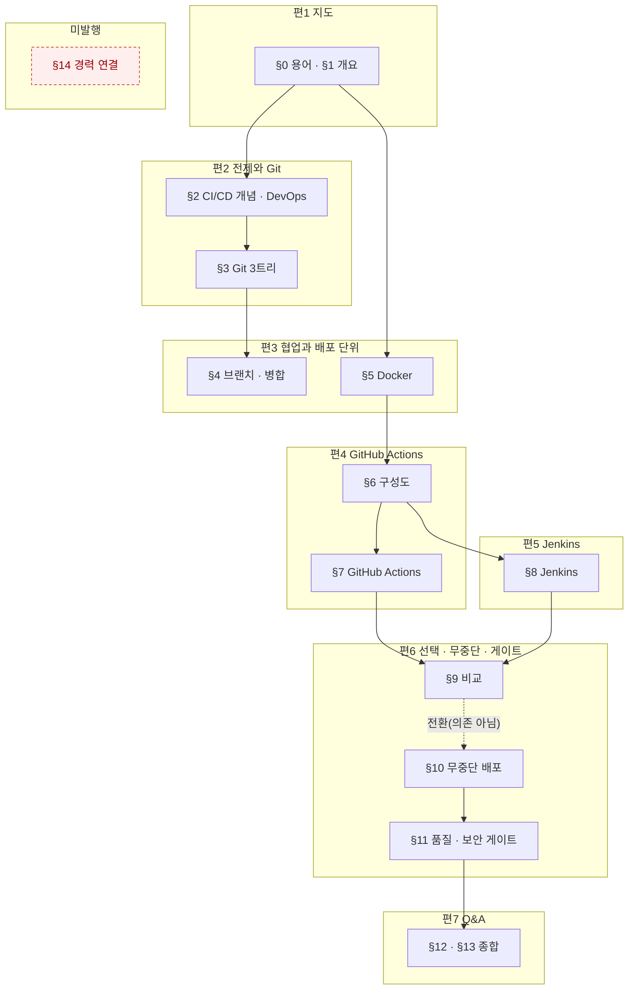
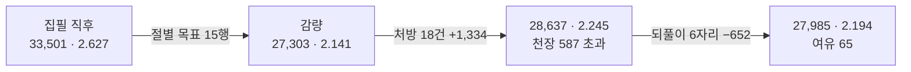
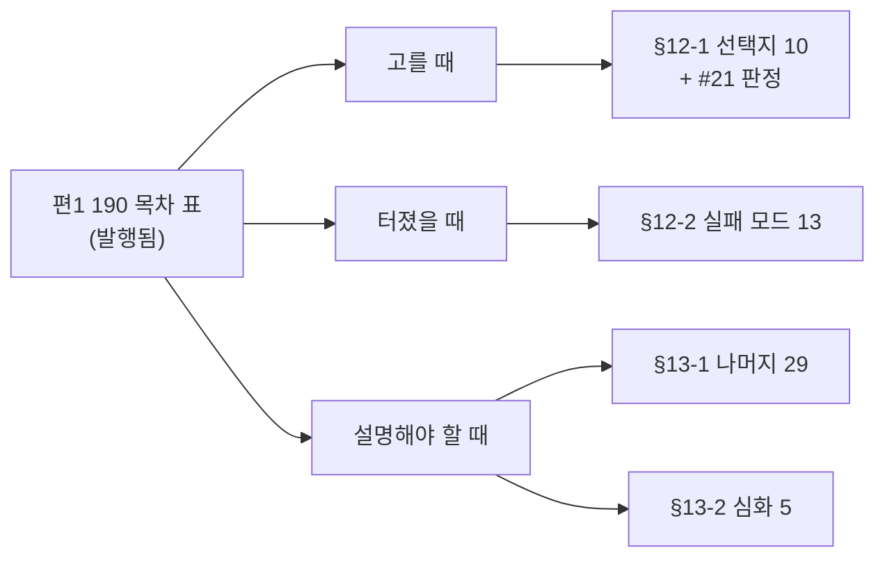

# `java-backend/06-CI-CD` 분할 설계 — 원본 1개를 7편으로

> 대상: `C:\Users\aeby\vscode\yanadoo-exit\shared\knowledge\java-backend\06-CI-CD-GitHub-Actions-Jenkins.md` (**83,252 B**, 읽기 전용)
> 카테고리: `backend-engineering` (현재 25편 → 32편)
> 작성: 2026-08-19 · 앞 배치: `2026-08-18-spring-batch-split-design.md`

---

## 1. 절차

### 1-1. 앞 배치가 확립한 순서를 그대로 쓴다

| # | 단계 | 근거 |
| ---: | --- | --- |
| ① | 원본 절별 **성분** 실측 | §2 |
| ② | **편1을 먼저 쓰고 실측으로 나머지를 재환산** | 앞 배치 §10-1 |
| ③ | 편마다 검증하고 **즉시 커밋** | pre-commit 훅이 작업트리를 본다 (인수인계 §3) |
| ④ | `dup-scan`은 편마다, 그리고 **Q&A편 정합성 점검 뒤에 다시** | 앞 배치 §10-5-b |
| ⑤ | 커밋은 `git commit -m "…" -- <경로>` 형태 | 인수인계 §4 |

⚠️ **②를 건너뛰지 마라.** 이번은 특히 그렇다 — §2-4가 보이듯 **원본 성분으로 비율을
예측하려는 시도가 5개 표본에서 전부 실패했다.**

### 1-2. 앞 배치 §10-11이 물려준 9개 규칙의 처리

| # | 규칙 | 이번 처리 |
| ---: | --- | --- |
| 1 | Q&A편은 `항목 수 × 460 B`로 잡아라 | ✅ §3-3에서 적용 — 58항목 |
| 2 | 본편 비율은 값이 아니라 ±10% 밴드 | ✅ §3-2 |
| 3 | 앞 배치 §10을 먼저 읽고 브리프를 써라 | ✅ 이 설계서를 쓰기 전에 §10-1~§10-11 전문을 읽었다 |
| 4 | `dup-scan` 건수는 앞 배치와 나란히 놓고 읽어라 | §8-3 |
| 5 | 지어낸 수치는 「틀리면 오해하나」로 판정 | §9-2 |
| 6 | 같은 단어의 다른 뜻은 설계에서 지목하라 | ✅ §7-1 — 이번은 **Stage**가 걸렸다 |
| 7 | 화이트리스트 정규식으로 전수 검사를 대신하지 마라 | §8-2 |
| 8 | `compose.mjs`의 mermaid 바이트를 분리하라 | ✅ **완료** — 커밋 `b683345`. §2-1이 그 결과다 |
| 9 | Q&A편 브리프에 「형제편도 오염원」을 넣어라 | §4-8 |

---

## 2. 원본 실측

### 2-1. 절별 성분

`npm run compose -- <원본>` (커밋 `b683345`에서 도식·코드를 분리했다)

| 절 | 합계 B | 산문% | 표% | 코드% | 도식% | 불릿% | 인용% | 도식 |
| --- | ---: | ---: | ---: | ---: | ---: | ---: | ---: | ---: |
| ~~(머리말)~~ | ~~390~~ | 0.0 | 0.0 | 0.0 | 0.0 | 0.0 | 81.8 | 0 |
| 0. 용어·약어 사전 | 5,443 | 0.1 | 99.4 | 0.0 | 0.0 | 0.0 | 0.0 | 0 |
| 1. 한눈에 보기 | 1,732 | 11.0 | 0.0 | 0.0 | 32.7 | 54.7 | 0.0 | 1 |
| 2. 과거 vs 현재 | 4,157 | 7.4 | 66.8 | 0.0 | 0.0 | 0.0 | 20.9 | 0 |
| 3. 형상관리와 Git 내부 동작 | 7,267 | 11.9 | 57.1 | 0.0 | 8.7 | 8.5 | 9.2 | 2 |
| 4. 브랜치·병합 전략 | 5,620 | 17.5 | 38.3 | **16.5** | 0.0 | 13.5 | 8.9 | 0 |
| 5. Docker 기초 | 4,642 | 7.4 | 64.8 | 7.3 | 8.7 | 0.0 | 7.4 | 1 |
| 6. CI/CD 구성도 | 2,086 | 0.2 | 75.6 | 0.0 | 15.3 | 0.0 | 0.0 | 1 |
| 7. GitHub Actions | 9,332 | 17.5 | 41.4 | **18.4** | 15.5 | 0.0 | 3.7 | 3 |
| 8. Jenkins | 11,658 | 12.1 | 58.9 | 8.3 | 7.1 | 2.2 | 8.5 | 2 |
| 9. GHA vs Jenkins | 2,437 | 0.2 | 73.2 | 0.0 | 0.0 | 0.0 | 24.5 | 0 |
| 10. 무중단 배포 | 5,273 | 22.4 | 35.9 | **19.6** | 7.3 | 0.0 | 10.8 | 1 |
| 11. 품질·보안 게이트 | 5,044 | 14.9 | 32.8 | 12.9 | 0.0 | 12.4 | 20.6 | 0 |
| 12. 트레이드오프·장애 | 4,025 | 0.1 | 96.7 | 0.0 | 0.0 | 0.0 | 0.0 | 0 |
| 13. 면접 예상 질문 | 11,891 | 4.2 | 54.1 | 0.0 | 0.0 | 0.0 | 40.9 | 0 |
| ~~14. 경력 연결 포인트~~ | ~~2,255~~ | 26.8 | 57.4 | 0.0 | 0.0 | 14.1 | 0.0 | 0 |
| **합계** | **83,252** | **10.6** | **56.2** | **6.8** | **5.5** | **4.2** | **13.3** | **11** |

절대 바이트: 도식 4,576 · **코드 5,627** · 표 46,753

#### 🔴 배정하지 않는 조각이 **둘** 있다 — 합계가 안 맞는 것이 정상이다

§3-2 배정표의 원본 B 합계는 **80,607**이고 원본 전체는 **83,252**다. 차이 2,645 B는 두 조각이다.

| 조각 | B | 배정하지 않는 이유 |
| --- | ---: | --- |
| **(머리말)** | 390 | 세 줄짜리 인용 블록(작성 기준일 · 출처 · 목적). **출처 줄이 HARD 금칙어를 포함**해 어느 편에 넣어도 `check-forbidden`이 커밋을 막는다 |
| **§14 경력 연결** | 2,255 | HARD 5종 + 익명화 무효 + 「본인이 모른다고 적은 목록」 — §3-2 참조 |

이 표가 없으면 다음 배치에서 「합계가 2,645 안 맞네」를 본 사람이 그 조각을 어딘가에 채워 넣는다.
**배정하지 않은 이유를 적지 않은 옳은 판단은, 다음 사람에게는 실수로 보인다.**
발행본의 출처 표기는 원본 머리말을 옮기는 것이 아니라, 본문에서 **「원본」**으로만 지칭한다(§7-2).

### 2-2. 🔴 이 원본에는 **진짜 코드가 있다** — 앞 배치와 결정적으로 다른 점

| | 원본 05 | **원본 06** | 배수 |
| --- | ---: | ---: | ---: |
| 코드 B | 446 | **5,627** | **12.6×** |
| 도식 B | 5,244 | 4,576 | 0.87× |

앞 배치의 「코드 11.6%」는 실은 도식이었고 자바 코드는 446 B뿐이었다(앞 배치 §10-7).
**이번은 다르다** — `yaml` 워크플로 · `Jenkinsfile`(groovy) · `Dockerfile` · `bash`가 실재한다.

⚠️ **코드는 축자 이식이라 비율이 1.0으로 고정된다.** 따라서 코드 비중이 높은 절일수록
전체 비율이 **내려간다.** 코드가 몰린 절은 §4(16.5%) · §7(18.4%) · §10(19.6%)이다.
⇒ **이 세 절을 담는 편에 다른 편과 같은 비율을 주면 과대 추정이 된다.** §3-2에서 반영한다.

### 2-3. 표가 56.2% — 코퍼스에서 가장 높다

| 원본 | 표% | 산문% |
| --- | ---: | ---: |
| 02 | 59.4 | 9.4 |
| **06 (이번)** | **56.2** | **10.6** |
| 01 | 54.5 | 6.7 |
| 03 | 49.7 | 11.7 |
| 05 | 47.9 | 15.5 |
| 04 | 42.7 | 2.4 |

### 2-4. 🔴 **성분으로 비율을 예측하려는 시도가 5개 표본에서 전부 실패한다**

앞 배치들이 물려준 설명은 두 갈래였고 **둘 다 실측에 반증된다.**

| 물려받은 설명 | 출처 | 실측 |
| --- | --- | --- |
| 「표 밀도가 높은 원본이라 1.40」 | 인수인계 §8 표의 괄호 | ❌ 03(표 49.7%)=1.40, 05(표 47.9%)=2.06. **1.8%p 차이에 비율은 1.5배** |
| 「산문 비중이 높은 원본일수록 비율이 크다」 | 03 설계서 §1-1 원문 | ⚠️ **반대가 아니라 무상관이다**(ρ=+0.30) — 아래 표 |

| 원본 | 산문% | 표% | 코드% | **실측 합계 비율** |
| --- | ---: | ---: | ---: | ---: |
| 01 | 6.7 | 54.5 | 3.6 | 1.81 |
| 02 | 9.4 | 59.4 | 1.1 | 1.98 |
| 03 | **11.7** | 49.7 | 2.9 | **1.40** ← 최저인데 산문은 2위 |
| 04 | **2.4** | 42.7 | 7.0 | 1.90 ← 산문 최저인데 비율은 4위 |
| 05 | 15.5 | 47.9 | 0.9 | 2.06 |
| **06 (이번)** | **10.6** | **56.2** | **6.8** | **?** |

산문%로 정렬하면 04 → 01 → 02 → 06 → 03 → 05 이고, 비율로 정렬하면 03 → 01 → 04 → 02 → 05 다.
**두 순서가 일치하지 않는다.** 다만 「일치하지 않는다」는 「반대다」가 아니다 —
ρ=+0.30은 **무의미**이지 역상관이 아니다. 「반대」로 물려주면 다음 세션이
「그럼 산문이 적을수록 비율이 크겠군」으로 **새 상수를 앉힌다.** 이 리포에서 이미 두 번 일어난 패턴이다.

#### 🔴 2-4-b. 「배치가 지날수록 두꺼워진다」는 **기각하면 안 됐다** — 축을 잘못 잡았다

초안은 이 가설을 `1.81 → 1.98 → 1.40 → 1.90 → 2.06, 단조가 아니다`로 기각했다.
**그 수열은 원본 파일 번호 순이다. 발행 순서가 아니다.** 예산 리뷰가 git에서 실측했다:

```
2026-08-18 13:40  redis-cache-design                ← 원본 03  ★ 이 카테고리의 첫 배치
2026-08-18 16:28  rdbms-and-nosql-fundamentals      ← 원본 01
2026-08-18 18:23  partitioning-fundamentals         ← 원본 02
2026-08-18 21:01  realtime-transport-and-websocket  ← 원본 04
2026-08-18 23:06  batch-processing-fundamentals     ← 원본 05
```

발행 순으로 세우면 **1.40 → 1.81 → 1.98 → 1.90 → 2.06** — 뒤집힘이 한 번(4%)뿐이다.
**03은 가설을 깨는 반례가 아니라 가설이 예측하는 「첫 배치의 최저값」이었다.**

| 후보 예측기 | ρ (비율과) |
| --- | ---: |
| **발행 시각 순서** | **0.90** |
| 편수 | 0.90 |
| 코드% | −0.60 |
| ~~원본 파일 번호 순~~ ← *초안이 쓴 축* | ~~0.40~~ |
| 산문% | 0.30 |
| 표% | −0.10 |

**초안이 기각한 가설이 초안이 검토한 모든 성분 예측기보다 강하다.**

#### 🔴 2-4-c. 인과가 리포 안에 이미 적혀 있었다 — **비율은 원본이 아니라 「준 예산」의 성질이다**

| 배치 | 준 지시 | 자연 집필 | 착지 |
| --- | --- | ---: | ---: |
| 03 (첫) | 예산 없음 | — | **1.40** |
| 01 | — | — | 1.81 |
| 02 | 밴드 1.70~1.95 | **2.09~2.32** | **1.98** (14~17% 걷어냄) |
| 04 | ±15%, 하한 강제 안 함 | — | 1.90 |
| 05 | 2.0 | 본편 **2.13~2.18** | **2.06** |

`database-scaling` 설계서 §10-2 원문:
> 「본편 넷의 **자연 집필 비율이 2.09~2.32**였는데 밴드를 1.70~1.95로 줬다.
> 그 결과 집필자들이 **14~17%를 걷어냈다.**」

⇒ **「실측 비율」은 원본의 성질이 아니라 그 배치에 준 예산의 성질이다.**
초안이 이 종속변수를 원본 성분에 회귀시켜 아무것도 못 찾은 것은 당연하다 —
**지배항이 원본이 아니라 지시문이다.** 결론(「성분으로 정하지 않는다」)은 맞지만 이유가 틀렸다.

이것이 §1-1 ②(편1을 먼저 쓰고 재환산)를 **더 강하게** 정당화한다.
비율이 지시문에 걸려 있다면 사전 예측은 원리적으로 불가능하고, **실측 재환산만이 유일한 교정 수단이다.**

⇒ **이 설계서는 원본 성분으로 비율을 정하지 않는다.** 대신 세 가지를 쓴다:

| 예측기 | 5표본 폭 | 쓰는 곳 |
| --- | ---: | --- |
| **고정 비용** (도입 + 용어 + 목차) | 34.6% (03 제외) · 121% (포함) | 지도편 (§3-1) |
| **항목 패리티** (항목 수 × B) | **50.5%** | Q&A편 (§3-3) — **밴드로 준다** |
| 코퍼스 비율 **밴드** | 47.1% | 본편 (§3-2) — **편1 실측 뒤 재환산** |

#### ⚠️ 2-4-d. 이 두 예측기도 **2표본에 기댄 것이었다** — 정직하게 적어 둔다

초안은 「분모를 바꾸면 안정적인 양이 드러난다」고 썼다. **5표본으로 재면 그렇지 않다.**
고정 비용은 34.6~121%, 항목 패리티는 **50.5%로 대체 대상(47.1%)보다 오히려 불안정하다.**
「2.4% 안에서 같다」는 **인접한 두 배치를 골랐을 때만** 나온 값이다.

**남의 예측기를 5표본으로 무너뜨리고 자기 예측기를 2표본으로 세우면 안 된다.**
그래도 이 둘을 쓰는 이유는 「더 낫기 때문」이 아니라 **지도편과 Q&A편은 비율로 잡을 근거가
더 없기 때문**이다. 둘 다 **점 추정이 아니라 밴드로** 준다.

#### 2-4-e. 다만 **흩어짐에는 축이 있다** — 세 축이 서로 다르다

「폭이 넓다」로 끝내면 예산을 못 짠다. 5표본으로 재면 각 성분이 서로 **다른 축**에 걸린다.

| 성분 | 지배 축 | ρ | 근거 |
| --- | --- | ---: | --- |
| 본편 비율 | **발행 순서**(= 준 예산) | 0.90 | §2-4-b · §2-4-c |
| 지도편 용어 정리 | **발행 순서**(집필 밀도) | **1.00** | §3-1-e — 0.53→1.12→1.39→1.61→1.81 단조 |
| Q&A편 항목당 B | **원본 B** | 0.90 | §3-3-a — 발행 순서로는 0.10 |

**세 축을 섞어 쓰지 마라.** 「발행 순서로 커진다」를 Q&A편에 적용하면 틀리고,
「원본이 크면 커진다」를 본편에 적용하면 틀린다.
공통점은 하나 — **어느 것도 원본의 산문·표·코드 비중으로는 설명되지 않는다.**

---

## 3. 편 구성과 예산

### 3-1. 지도편(편1) — **고정 비용 방식으로 잡는다**

앞 배치 §3-6의 분해를 쓰되 **표본을 2개에서 발행본 5편 전수로 늘렸다.**

#### 🔴 3-1-a. 초안의 「05 편1 = 22,850」은 **발행본이 아니라 초안이었다**

22,850은 `2026-08-18-spring-batch-split-design.md` §3-6이 **재환산 시점에** 잰 값이다.
그 초안은 리뷰를 거쳐 **12.7% 깎여서** 발행됐다.

| | 초안(§3-6이 인용한 값) | **발행본** |
| --- | ---: | ---: |
| `batch-processing-fundamentals.md` 전체 | 22,850 | **19,939** |
| 고정 비용 소계 | 8,962 | **7,977** |

**초안을 실측이라 부르면 안 된다.** 이 설계서는 발행본만 쓴다 — 파이프라인이 실제로
받아들인 값은 발행본이다(앞 배치 §3-6의 판정 논리와 같다).

#### 3-1-b. 발행 지도편 5편 전수 분해 (frontmatter 제외 기준)

발행 순서로 세웠다. 절 경계는 H2 위치로 잘라 `wc -c`로 직접 쟀다.

| 성분 | 03 | 01 | 02 | 04 | 05 | **06 (예산)** | 근거 |
| --- | ---: | ---: | ---: | ---: | ---: | ---: | --- |
| 도입 | 784 | 824 | 1,151 | 1,291 | 1,250 | **1,500** | 5편이 단조 상승, 최대 위 |
| 용어 정리 | 1,175 | 3,408 | 4,766 | 4,471 | **4,972** | **6,500** | §3-1-e로 **억제한 값**. 그대로 옮기면 9,900~10,900 |
| 시리즈 구성 + 정리 | 2,064 | 2,384 | 2,988 | 2,765 | 1,755 | **2,800** | 5편 평균 2,391 + 7편 목차 몫 |
| **고정 비용 소계** | **4,023** | **6,616** | **8,905** | **8,527** | **7,977** | **10,800** | |
| 본문 | 11,459 | 12,106 | 8,115 | 14,303 | 11,287 | **3,500** | 1,732 × 2.0 |
| 본문 + 고정 | 15,482 | 18,722 | 17,020 | 22,831 | 19,264 | **≈ 14,300** | §3-2 편1 목표와 일치 |
| + frontmatter | 583 | 670 | 641 | 705 | 675 | **≈ 700** | |
| **파일 전체** | 16,065 | 19,392 | 17,661 | 23,536 | 19,939 | **≈ 15,000** | |

⚠️ **예산 10,800은 코퍼스 최대(8,905)보다 21% 크다.** 정당한 이유는 용어뿐이고,
그 근거가 §3-1-e다. 도입·시리즈 구성은 코퍼스 안에 있다.

#### 🔴 3-1-c. 예산 기준과 검사기 기준이 **frontmatter만큼 어긋난다**

`tests/blog/content/schema.test.ts:47`은 `Buffer.byteLength(fs.readFileSync(...))` —
**frontmatter를 포함한 파일 전체**를 잰다. 그런데 이 설계서의 예산 14,300은
앞 배치 표를 이어받아 **frontmatter를 뺀 값**이다.

| | 값 |
| --- | ---: |
| 예산(설계서 기준) | 14,300 |
| frontmatter 실측(5편 583~705) | +700 |
| **검사기가 볼 값** | **≈ 15,000** |
| 검사기 하한 | 13,300 |

⇒ **여유는 1,000이 아니라 1,700이다.** 두 기준을 섞어 쓰지 마라 —
집필자에게 주는 목표는 **본문+고정 14,300**이고, `npm test`가 보는 것은 **15,000**이다.

**「그대로 옮기면 얼마인가」의 근거** — 원본 §0을 발행본 「용어 정리」로 옮길 때의 실측 비율.
초안은 04·05 두 표본에 05의 **초안값**(5,311)까지 써서 평균 1.78을 냈다. **5편 전수·발행본으로 다시 잰다.**

| 발행순 | 배치 | 원본 §0 | 용어 수 | 발행 용어 정리 | **비율** | 용어당 발행 B |
| :---: | :---: | ---: | ---: | ---: | ---: | ---: |
| 1 | 03 | 2,196 | 21 | 1,175 | **0.53** | 56 |
| 2 | 01 | 3,033 | 30 | 3,408 | **1.12** | 114 |
| 3 | 02 | 3,439 | 32 | 4,766 | **1.39** | 149 |
| 4 | 04 | 2,773 | 24 | 4,471 | **1.61** | 186 |
| 5 | 05 | 2,743 | 24 | 4,972 | **1.81** | 207 |
| — | **06** | **5,443** | **51** | ? | ? | ? |

🔴 **비율도 용어당 B도 발행 순서로 완전 단조다(ρ = 1.00).** §2-4-b와 같은 축이다.
원본 쪽은 오히려 안정적이다 — 원본 §0의 용어당 B는 101~116으로 6배치가 거의 같고,
**06도 107로 그 안에 있다.** 즉 부푸는 것은 원본이 아니라 **집필 밀도**다.

⇒ **「평균 1.78」은 쓰면 안 된다.** 최근값 1.81을 그대로 써도 `1.81 × 5,443 = 9,852`이고,
단조 추세를 인정하면 그 이상이다. **그대로 옮기면 9,900 ~ 10,900 B다** —
9,700은 과소추정이었고, 억제의 필요는 초안이 적은 것보다 **크다.**

**억제 6,500이 실제로 요구하는 것** — 나누면 지시가 분명해진다.

| 방식 | 계산 | 뜻 |
| --- | --- | --- |
| 개수를 줄인다 | 6,500 ÷ **190**(04 밀도) = **34개** | 51개 중 **17개를 각 편으로 내린다** |
| 밀도를 줄인다 | 6,500 ÷ 51 = **127 B/개** | 최근 4배치(114~207) **전부보다 낮다** — 비현실적 |

⇒ **개수로 줄여라. 밀도로 줄이지 마라.** 51개를 다 싣고 짧게 쓰는 것은 코퍼스에 전례가 없다.

⚠️ **표의 값은 억제 후(6,500)이고, 9,900~10,900은 억제하지 않았을 때다.** 두 숫자가 같은 표에
있으면 집필자가 어느 쪽을 예산으로 받을지 헷갈린다 — **예산은 6,500이다.**

#### 3-1-d. ⚠️ 그래서 **§2를 지도편에 붙이지 않는다** — 앞 배치와 반대 판단이다

앞 배치는 「§0+§1만으로는 4,761 B라 지도편이 10 KB로 하한을 깬다」며 §2를 붙였다.
**이번은 그 전제가 성립하지 않는다.** §0이 2배라 §0+§1만으로 7,175 B이고 예산이 14.3 KB다.

여기에 §2(4,157 B)를 붙이면 지도편이 22 KB를 넘고, 무엇보다 **용어표 6.5 KB + 개념 설명**으로
지도편이 「읽는 글」이 아니라 「찾아보는 표」가 된다.

#### 3-1-e. 🔴 용어 51개를 통째로 옮기지 마라

억제하지 않으면 용어 정리가 지도편의 **57%**(10,400 / 18,200)다. 발행본 다섯은 이렇다
(§3-1-b 표의 용어 값 ÷ 본문+고정):

| 배치(발행순) | 03 | 01 | 02 | 04 | 05 | **06 예산** |
| --- | ---: | ---: | ---: | ---: | ---: | ---: |
| 용어 B | 1,175 | 3,408 | 4,766 | 4,471 | **4,972** | **6,500** |
| 지도편 내 비중 | 7.6% | 18.2% | 28.0% | 19.6% | 25.8% | **45.5%** |

**같은 형태를 유지하면서 분량만 2배가 되면 형태가 바뀐 것이다.**

⚠️ **「억제」라는 말에 속지 마라 — 6,500 B는 코퍼스 최대치보다 크다.** 6,500은
역대 최대(4,972)보다 **31% 크고**, 비중으로는 역대 최대(28.0%)의 **1.6배**다.
그래도 정당한 이유는 **원본 §0 자체가 2배**(2,743 → 5,443)이기 때문이다.
9,900~10,900에서 줄이는 것이지 4,972에서 늘리는 것이 아니라는 점을 착각하지 마라 —
**두 기준선이 있고 이 값은 그 사이에 있다.**

⇒ **지침**: 지도편에는 **시리즈 전체에 걸치는 용어만** 싣는다(CI · CD · DevOps · 형상관리 ·
컨테이너 · 파이프라인 등). 특정 편에서만 쓰는 용어(Executor · Newman · Composite Action 등)는
**그 편의 첫 등장 자리에서 정의**한다.
목표: 지도편 용어 정리를 **6,000 ~ 6,500 B**(전체의 45% 이하)로 억제.

🔴 **하단을 더 내리려면 다른 성분으로 옮겨라 — 뺄셈만 하면 하한을 깬다.**
검사기는 frontmatter를 포함해 재므로(§3-1-c) 식에 700을 더해서 본다:

```
fm 700 + 도입 1,500 + 용어 6,500 + 시리즈 구성 2,800 + 본문 3,500 = 15,000   ← 목표, 하한 대비 +1,700
fm 700 + 도입 1,500 + 용어 4,800 + 시리즈 구성 2,800 + 본문 3,500 = 13,300   ← 하한과 동률
```

⇒ **다른 성분을 그대로 두고 용어만 줄일 수 있는 한계는 4,800 B다.**
그런데 4,800은 코퍼스 최대(4,972)와 거의 같다 — 즉 **뺄셈만으로 얻을 수 있는 여유가
사실상 없다.** 용어를 더 줄이고 싶으면 **줄인 만큼 「시리즈 구성」으로 돌린다** — 7편 각각의
소개를 충실히 쓰는 쪽이 용어표를 늘리는 것보다 지도편의 형태에 맞다.
이번 지도편은 발행본 다섯(16.1 ~ 23.5 KB)의 하단보다도 작은데, **원본 §1이 1,732 B로 작기 때문**이다.
그 차이를 용어표로 메우면 §3-1-d가 피하려던 「찾아보는 표」가 된다.

⚠️ 이 지침은 **분량 조절이 아니라 형태 유지**가 목적이다. 집필자가 「하한을 채우려고」
용어를 도로 늘리면 취지가 뒤집힌다.

#### 밀려난 용어는 **편2~편6의 예산 안에서 흡수된다**

지도편에서 뺀 용어는 사라지는 것이 아니라 각 편의 첫 등장 자리로 간다.
그 몫이 §3-2 목표에 따로 잡혀 있지 않으므로 크기를 확인해 둔다.

| | 값 |
| --- | ---: |
| 원본 §0 개당 | 5,443 ÷ 51 = **107 B** — 6배치 101~116 안 |
| 발행 시 개당 | **190 B** (04 실측 186) ~ **207 B** (05 실측, 코퍼스 최대) |
| 지도편에 남길 것 | 약 34개 (6,500 ÷ 190) |
| ~~**각 편으로 흩어질 것**~~ | ~~약 17개 = **3,230 ~ 3,520 B**~~ |
| ~~편당 (5편에 분산)~~ | ~~**650 ~ 700 B** — 본편 목표의 **3.5% 미만**~~ |

~~⇒ ±10% 밴드 안에서 흡수된다. **별도 예산을 잡지 않는다.**~~

#### 3-1-g. 「17개」는 틀린 수였다 — 25개다 `[편1 실측 후 정정]`

위 표의 17은 `51 − 34`다. 그 뺄셈은 **34가 순수 승계분일 때만** 성립한다.
발행본 101줄이 밝히듯 34는 두 출처의 합이다:

```
    34 (발행 용어)  =  26 (원본 §0 승계)  +  8 (★ 원본에 없음)
    51 (원본 §0)    −  26                 =  25  ← 각 편으로 내려간 것
```

역방향 차집합 0건으로 확정값이다. **발행본은 거짓을 적지 않았다** — ★ 8개를 명시했다.
틀린 것은 이 설계서와 검증 기록 쪽이다. 두 수를 빼면 나오는 값이라 아무도 검산하지 않았다.

정정된 하방 예산:

| | 종전 (17개 가정) | **실측 (25개)** |
| --- | ---: | ---: |
| 내려가는 용어 | 17 | **25** |
| 총 바이트 (× 190~207) | 3,230 ~ 3,520 | **4,750 ~ 5,175** |
| 편당 균등 가정 | 650 ~ 700 | **950 ~ 1,035** |

**그러나 균등 가정 자체가 틀렸다.** 용어는 편에 고르게 흩어지지 않고 **도구를 따라 뭉친다**:

| 편 | 받는 용어 (원본 첫 등장 줄) | 개수 | 바이트 (×190~207) |
| :---: | --- | ---: | ---: |
| 편2 | WD(169) · Stage/Index(169) · HEAD(198) | 3 | 570 ~ 621 |
| 편3 | Fast-forward(275) · 3-way merge(276) · Rebase(277) · Squash(320) | 4 | 760 ~ 828 |
| 편4 | Job(515) · Step(516) · Action(517) · Context(601) · Argo CD(466) | 5 | 950 ~ 1,035 |
| **편5** | Controller/Master(713) · Agent/Worker/Slave(713) · Executor(718) · Post-build Action(740) · Freestyle(744) · Pipeline(744) · Poll SCM(775) · ngrok(788) · Declarative Pipeline(791) · Scripted Pipeline(824) · DinD(895) | **11** | **2,090 ~ 2,277** |
| 편6 | Newman(1054) · Jenkinsfile(924) | 2 | 380 ~ 414 |
| 편7 | — | 0 | 0 |
| **미배정 · §14 전속** | **없음** | **0** | — |

**25개 중 11개(44%)가 편5 한 편에 몰린다.** 편5 목표 22,200 B의 9.4~10.3%로,
±10% 밴드를 통째로 먹는다. 종전 문단이 「한 편에 몰리면 밴드 상단으로 간다」고
예상은 했으나 **크기를 산정하지 않아 예산에 반영되지 않았다.**

우연이 아니라 구조다 — 편5는 원본 §8(Jenkins) 단독이고, Jenkins는 GitHub Actions와 달리
고유 명사 체계를 통째로 가진다. **§3-2의 편5 목표를 22,200 → 23,000 B로 올린다**
(밴드 20,700~25,300). 나머지 편은 밴드 안에서 흡수된다.

고아는 0건이다. 「각 편의 첫 등장 자리에서 정의한다」는 선언은 행선지 측면에서 이행 가능하다.
다만 **`Jenkinsfile`은 원본 첫 등장이 924줄(§9 = 편6)인데 편1이 「편5가 다룬다」고 약속했다** —
개념은 §8-3(편5)에 있으므로 편5 집필자가 낱말을 앞당겨 도입한다(§7-5 브리프 지시).

### 🔴 3-1-f. 편1 실측 — **예산표에 줄이 하나 빠져 있었다** (§1-1 ② 산출물)

편1이 **18,615 B**로 나왔다. 밴드 상단(파일 기준 15,700)을 **2,915 초과**다.
성분으로 가르면 초과분의 정체가 한 곳에 몰려 있다.

| 성분 | 예산 | **실측** | 차 | 판정 |
| --- | ---: | ---: | ---: | --- |
| 도입 | 1,500 | 1,531 | +31 | ✅ |
| 용어 정리 | 6,500 | **5,169** | **−1,331** | ✅ 억제 지시를 초과 달성. 용어 **34개**(지시값과 일치) |
| **낱말 구분표** | **없음** | **3,343** | **+3,343** | 🔴 **예산에 줄이 없다** |
| 본문(§1 대응) | 3,500 | 4,016 | +516 | ⚠️ 비율 **2.32** |
| 시리즈 구성 + 정리 | 2,800 | 3,838 | +1,038 | ⚠️ 7편이라 커진다. 코퍼스 최대 2,988 |
| **본문+고정** | **14,300** | **17,897** | +3,597 | |
| frontmatter | ~700 | 718 | +18 | ✅ |
| **파일 전체** | **≈15,000** | **18,615** | **+3,615** | |

**초과 3,597 중 3,343이 낱말 구분표다.** §7-1-b가 「편1이 실어라」로 **필수 지시**를 내렸는데
§3-1-b 성분표에는 그 줄이 없었다. 성분표를 앞 배치에서 그대로 물려받았고,
**앞 배치에는 이 항목이 존재하지 않았기 때문**이다.

⇒ **집필자의 초과가 아니라 예산의 결함이다.** 글을 깎지 않는다. 예산표를 고친다.

| 성분 | **고친 예산** | 근거 |
| --- | ---: | --- |
| 도입 | 1,500 | 유지 |
| 용어 정리 | 5,200 | 실측. 6,500은 상한이었고 34개는 5,200에 들어간다 |
| **낱말 구분표** | **3,300** | **신설.** 다의어 8낱말 + `master`/`slave` 방침 |
| 본문(§1 대응) | 4,000 | 실측 |
| 시리즈 구성 + 정리 | 3,800 | 실측. 7편이라 코퍼스(1,755~2,988)를 넘는다 |
| **합계** | **17,800** | 파일 기준 **≈18,500** |
| **리뷰 반영분** | **+726** | 아래 |
| **확정** | — | **19,341** |

리뷰 둘이 낸 지적 8건을 반영해 726 B가 늘었다. 늘어난 쪽이 대부분이다 —
도식에 반려 경로를 그리고, 승인 게이트가 도메인을 탄다는 조건을 문단으로 밝히고,
표에서 뺀 블루그린을 산문으로 옮겼다. **정정은 대체로 글을 늘린다**:
틀린 주장은 한 줄이지만 맞는 주장은 조건을 달아야 한다.

19,341은 발행 지도편 다섯(16,065 · 17,661 · 19,392 · 19,939 · 23,536) 중 **3위**다.
코퍼스 밖이 아니다. 밴드가 틀렸지 글이 틀리지 않았다.

#### 🔴 이 항목을 낳은 것이 **초과를 낳았다** — 다음 배치가 반복할 자리

| | |
| --- | --- |
| 무엇이 일어났나 | 설계서 §7-1-b가 「필수」로 지시한 산출물이 §3-1 예산표에 없었다 |
| 왜 안 보였나 | 성분표를 앞 배치에서 물려받았는데, **새 지시는 §7(위험)에서 나왔고 §3(예산)에 반영되지 않았다** |
| 일반 규칙 | 🔴 **§7·§9에서 「이 편은 ~을 반드시 실어라」를 새로 만들면, §3 예산표에 줄을 추가하라.** 지시와 예산은 다른 절에 살기 때문에 서로를 모른다 |

#### ⚠️ 성분별 비율이 갈렸다 — **가설로만 적는다 (n=2)**

같은 집필자·같은 글 안에서 두 값이 나왔다:

| 원본 성분 | 원본 B | 발행 B | 비율 |
| --- | ---: | ---: | ---: |
| §1 — 불릿 54.7% · 도식 32.7% · 산문 11.0% (표·코드 0) | 1,732 | 4,016 | **2.32** |
| ~~§0 중 실은 34개분 — 표 99.4%~~ | ~~3,638 (= 34 × 107)~~ | ~~5,169~~ | ~~**1.42**~~ |
| §0 **승계 26행끼리** — 표 99.4% | **2,742** | **3,133** | **1.14** |

**1.42는 분모가 틀린 값이었다.** `34 × 107` 은 34개 전부를 원본 §0의 개당 바이트로 환산한 것인데,
34 중 8개(★)는 §0에 존재하지 않는다(§3-1-g). 원본에 없는 것을 원본 바이트로 환산했다.

고칠 때 같은 함정을 한 번 더 밟을 뻔했다 — 분모만 승계분으로 좁히고 분자를 절 전체로 두면
1.91이 나온다. **분자에는 원본에 대응이 없는 것이 두 덩이나 들어 있다:**

```
    절 전체 5,233 B
      = 승계 26행  3,133   ← 원본 2,742 에 대응.  이것만이 「팽창」이다
      + ★ 신규 8행 1,140   ← 원본에 없음.  팽창이 아니라 추가
      + 표 밖 산문   960   ← 절 제목 · H3 소절 7개 · 도입 문단
```

그래서 이 자리에서 세 개의 값이 나왔다. **비율은 분자·분모의 항목 집합이 같을 때만 비교 가능하다.**

| 값 | 어떻게 나왔나 | 무엇을 재나 |
| ---: | --- | --- |
| ~~1.42~~ | 3,638(= 34 × 107) → 5,169 | 분모가 원본에 없는 8개를 포함. **무효** |
| 1.91 | 2,742 → 5,233 | 「승계분 대비 절 전체가 몇 배인가」 — 팽창률이 아니다 |
| **1.14** | 2,742 → 3,133 | **승계 26행끼리. 이것이 집필 팽창률이다** |
| 0.96 | 5,443 → 5,233 | §3-1-e 계열(원본 §0 전체 기준). C-3 검정용 |

표는 거의 이식이고 불릿은 산문으로 풀리니 그럴듯하다. 그리고 2.32는 앞 배치가 기록한
「자연 집필 비율 2.09~2.32」의 상단과 정확히 겹친다(§2-4-c).

**정정 결과 C-4의 격차는 오히려 벌어졌다** — 예측은 표 1.4 · 비표 2.3 이었는데
실측은 **1.14 대 2.32로 2배 차**다. 방향은 더 강하게 지지되고 표 쪽 크기는 예측보다 낮다.

🔴 **그래도 이것으로 편2~편6 예산을 다시 짜지 마라.** 표본이 **한 글 안의 두 점**이다.
§2-4-d에서 「2표본으로 자기 예측기를 세우면 안 된다」고 적어 놓고 같은 짓을 하는 자리다.
**§10-0에 C-4로 올려 다음 배치가 판정하게 한다.**

다만 집필자에게 줄 말은 하나 생겼다 — **밴드 1.95는 자연 집필(2.1~2.3)을 깎은 값이다.**
브리프에 그렇게 적어라. 모르면 집필자는 자연스럽게 쓰고 밴드를 넘긴다.

### 3-2. 본편 예산 — 값이 아니라 밴드로 준다

코퍼스 5배치 실측 본편 비율의 폭은 **1.41 ~ 2.18**이다. 예측이 안 되므로(§2-4)
**중앙값 1.95를 초기값으로 쓰고 ±10% 밴드**를 준다. **편1 실측 뒤 전 편을 재환산한다.**

⚠️ **코드 비중 보정**: 코드는 비율 1.0이 확정이다. 코드 비중이 코퍼스 평균(3.1%)보다
현저히 높은 절을 담는 편은 **비율을 낮춰 잡는다.**

🔴 **단, 「코드%」를 그대로 쓰면 안 된다 — 축자 이식 대상만 1.0이다.** 구조 리뷰 실측:
§4의 코드 16.5%는 **전부 ` ```text ` 블록 5개**(`281`·`290`·`302`·`310`·`324`)로
git 명령 예시와 충돌 마커다. 해설을 붙이면 얼마든지 늘어난다.
진짜 축자 코드(`yaml`·`groovy`·`dockerfile`·`bash`)는 **§5·§7·§8·§10·§11에만** 있다.
⇒ 편3의 축자 코드는 §5의 339 B뿐(**3.3%**)이라 하향 근거가 거의 없다. **1.80 → 1.90으로 되돌린다.**

| 편 | 원본 절 | 원본 B | 코드% | 축자 코드% | 초기 비율 | **목표 B** | 밴드(±10%) |
| :---: | --- | ---: | ---: | ---: | ---: | ---: | --- |
| 1 | §0 + §1 (지도편) | 7,175 | 0.0 | 0.0 | — | ~~14,300~~ → ~~17,800~~ → ~~19,615~~ → ~~20,002~~ → ~~20,150~~ → ~~20,326~~ → ~~20,438~~ → ~~20,558~~ → **20,561** | **발행 확정** (§7-5-d · §7-7-j · §7-7-k · §7-8-k) |
| 2 | §2 + §3 | 11,424 | 0.0 | 0.0 | 1.95 | ~~22,300~~ → ~~22,566~~ → **22,600** | **발행 확정** · 밴드 20,100 ~ 24,500 안 |
| 3 | §4 + §5 | 10,262 | 12.4 | **3.3** | **1.90** | ~~19,500~~ → ~~21,450~~ → **21,474** | **발행 확정** · 밴드 17,600 ~ 21,500 안(여유 26) |
| 4 | §6 + §7 | 11,418 | 15.0 | 15.0 | **1.93** | ~~19,500~~ → ~~21,960~~ → **21,985** | **발행 확정 · 리뷰 반영 완료**(§7-8-j) · 밴드 18,000 ~ 22,000 안(여유 15) |
| 5 | §8 | 11,658 | 8.3 | 8.3 | **2.15** | ~~23,000~~ → ~~24,959~~ → **25,046** | **발행 확정 · 리뷰 반영 완료**(§7-8-k) · 밴드 20,700 ~ 25,300 안(여유 254) |
| 6 | §9 + §10 + §11 | 12,754 | 13.2 | 13.2 | **2.00** | ~~23,000~~ → **25,500** (§7-9-c) | ~~20,700 ~ 25,300~~ → **22,950 ~ 28,050** (§7-9-c) |
| 7 | §12 + §13 (Q&A) | 15,916 | 0.0 | 0.0 | — | **28,000** | 26,300 ~ 29,200 (§3-3) |
| **합계** | | **80,607** | | | | **≈ 155,100** | |

⚠️ **이 표의 「코드%」 두 열은 축자 이식 언어(`yaml`·`groovy`·`bash`·`dockerfile`)만 센다.**
`mermaid` 와 ` ```text ` 는 제외다 — 다시 그리거나 해설을 붙이면 늘어나기 때문이다(§3-2 머리말).
**§7-7-k 의 성분표는 정의가 다르다** — 거기서 「코드」는 **모든 펜스 블록**이다.
두 표의 숫자를 섞어 쓰지 마라.

🔴 **편7에 이 비율을 갖다 대지 마라 — 축이 다르다.** 한때 여기에
「28,000 / 15,916 = 1.759 로 실측 최소보다 낮다」고 적었으나 **철회한다.**
§3-3 이 Q&A편은 **원본 크기**에 걸린다고 5편 전수로 보였다(항목당 B와의 ρ: 원본 B **0.90** ·
발행 순서 0.10). 편7의 28,000 은 **58항목 × 483 B** 에서 나온 값이지 비율에서 나온 값이 아니다.

다만 **§7-9-c 의 하한 공식으로 교차 검산하면 §3-3 이 독립적으로 지지된다.**
편7 성분 실측은 표 64.9% · 인용 30.5% · **산문 4.6%**(730 B)로 시리즈 최악이고,
고정 15,186 + 하한 7,594 + 도입 1,800 + 정리 1,100 = **최소 25,680** 이다.
§3-3 의 밴드 하단 26,300 이 그보다 620 크다 — **다른 축에서 나온 두 값이 같은 구간을 가리킨다.**

겉보기 합계 비율 **1.92**(편1 실측 반영 전 1.85 → 실측 후 1.90 → 리뷰·용어 반영 후 1.92).
앞 배치(2.06)보다 낮게 잡은 것은 코드 12.6배(§2-2) 때문이다.

🔴 **이 표는 배치 중에 세 번 올라갔다.** 세 번 다 원인이 같다 —
**§7·§9가 「이 편은 ~을 반드시 실어라」를 지시했는데 §3 예산표에 대응하는 줄이 없었다.**
낱말 구분표(+3,300)가 그랬고, 편5의 용어 11개(+800)가 그랬다.
다음 배치는 §7을 쓸 때마다 §3에 줄을 추가하는지 확인하라(§3-1-f의 일반 규칙).

⚠️ **편1은 이제 밴드가 아니라 실측값이다**(§3-1-f). 아래는 왜 원래 밴드가 빗나갔는지의 기록이다.

| | 하단 | 목표(초안) | 상단 | **실측** |
| --- | ---: | ---: | ---: | ---: |
| 설계서 기준 (frontmatter 제외) | 13,500 | 14,300 | 15,000 | **17,897** |
| 파일 전체 (frontmatter +700) | 14,200 | 15,000 | 15,700 | **18,615** |

밴드 폭은 **±5%**였다(±10%면 12,870으로 절대 하한 12,600에 붙는다).
빗나간 이유는 폭이 좁아서가 아니라 **성분표에 낱말 구분표(3,343 B) 줄이 없었기 때문**이다 —
±10%였어도 넘겼다. **밴드를 넓혀서 고칠 문제가 아니었다.**

🔴 **기준이 둘이라는 것은 그대로 유효하다**(§3-1-c) — 집필자에게 주는 값은 frontmatter 제외이고
`npm test`가 보는 값은 +700이다. **다른 편의 밴드는 전부 설계서 기준 ±10%다.**

#### R-1. 재환산은 **한 숫자만** 고쳐라 — 비율의 분해식

편1 실측 뒤 일곱 칸을 손으로 고치면 반드시 하나를 빠뜨린다. 비율은 이렇게 분해된다.

```
r = 축자코드%  +  (1 − 축자코드%) × r_비코드
```

축자 코드는 이식이므로 비율 1.0이 확정이고, 나머지만 집필 비율을 탄다.
**재환산에서 움직이는 값은 `r_비코드` 하나뿐이다.** 표의 초기 비율은 전부 이 식의 출력이다.

| 편 | 축자코드% | r_비코드 | ⇒ r |
| :---: | ---: | ---: | ---: |
| 2 | 0.0 | 1.95 | 1.95 |
| 3 | 3.3 | 1.93 | **1.90** |
| 4 | 15.0 | 1.88 | **1.75** |
| 5 | 8.3 | 1.98 | **1.90** |
| 6 | 13.2 | 1.92 | ~~**1.80**~~ → **2.00** |

도출된 `r_비코드`가 1.88~1.98로 **흩어져 있는 것 자체가 손튜닝의 잔여**다.
원리대로라면 한 배치 안에서 이 값은 **하나**여야 한다 — 코드 비중이 다를 뿐 집필자는 같다.

⇒ **재환산 절차**: 편1을 쓴 뒤 그 실측에서 `r_비코드` **단일 값**을 정하고,
편2~편6의 목표 B를 위 식으로 **다시 계산한다.** 표의 「초기 비율」 칸을 손으로 고치지 마라.
현재 표의 값은 재환산 전까지 쓰는 임시값이고, `r_비코드`의 폭이 5%라 지금은 무해하다.

#### R-2. 초기값 1.95의 출처 — **두 수열을 섞지 마라**

이 설계서에는 「본편 비율」 수열이 **둘** 나온다. 혼동하면 근거가 무너진다.

| 수열 | 값 | 쓰는 곳 |
| --- | --- | --- |
| **배치 전체** 겉보기 비율 | 1.40 · 1.81 · 1.90 · 1.98 · 2.06 | §2-4-b (발행 순서 ρ=0.90) |
| **편별** 본편 비율 | 1.41 ~ 2.18 | 위 문단(밴드 폭의 근거) |

1.95는 **배치 전체 수열**에서 나왔다. 03(첫 배치, 예산 지시 없음 — §2-4-b)을 뺀 네 값
`1.81 · 1.90 · 1.98 · 2.06`의 중앙값 **1.94**, 평균 **1.94**를 올림한 것이다.
5개를 다 쓰면 중앙값이 1.90으로 내려간다 — **03을 빼는 판단이 이 숫자를 만든다.**

편6 코드%는 구성 절의 **가중평균으로 직접 계산했다** — (2,437×0.0 + 5,273×19.6 + 5,044×12.9) ÷ 12,754 = **13.2%**.
표에 값을 옮겨 적지 말고 이렇게 계산하라. 절을 재배치하면 이 값이 따라 움직인다.

#### 🔴 §14를 **발행하지 않는다** — 그래서 8편이 아니라 7편이다

초안은 §11+§14를 편7로 묶었다. 구조 리뷰가 두 방향에서 무너뜨렸다.

| 축 | 실측 |
| --- | --- |
| **금칙어** | §14 다섯 줄에 HARD가 5종 — 회사명 2·직책 1·제품명 2. 커밋이 막힌다 |
| **익명화 무효** | 회사를 「OTT 서비스」로 익명화한 뒤 제품명을 남기면 그 제품명이 회사를 한 단어로 특정한다 |
| **본인이 모른다고 적은 목록** | 「보완이 필요한 항목」이 자기 조직의 브랜치 전략을 모른다는 자백이다. 익명화로 해결되지 않는다 |
| **주제 묶음이 아님** | §14의 4개 항목을 §11과 대조하면 연결 **0개**. 각각 §4·§5·§10으로 흩어진다 |

넷째 줄이 결정적이다. 초안 §3-4 표의 「갈랐을 때의 손해」 칸이 이미 자백하고 있었다 —
**「§14가 어디에도 못 붙는다」**. 그것은 의존이 아니라 **잔여 처리**였고, 잔여를 붙일 곳이
없다는 것은 묶음의 근거가 아니라 **묶지 말라는 신호**다.

부수 효과로 초안의 최대 위험이 사라졌다. 편6·편7이 목표 13,900 B로 하한(13.3 KB)과
밴드 하단이 겹쳐 「여유가 없다」고 적혀 있었는데, 재구성 후 최소 편이 **14,300 B(편1)** 이고
편6은 **23,000 B**다. 하한에 걸리는 편이 없다.

### 3-3. Q&A편(편7) — 항목 패리티

앞 배치 공식: **목표 B = 항목 수 × 약 460 B**

#### 🔴 3-3-a. 460은 **인접한 두 배치만 골랐을 때** 나온 값이다 — 5편 전수 실측

초안은 04·05 두 편만 보고 「2.4% 안에서 같다」고 적었다. 카테고리의 Q&A편 **5편 전수**는 이렇다.

| 발행본 | 원본 | 원본 B | 항목 | 발행 B | **항목당 B** | 발행 순서 |
| --- | :---: | ---: | ---: | ---: | ---: | :---: |
| `redis-cache-qna` | 03 | 46,777 | 44 | 14,495 | **329.4** | 1번째 ★첫 배치 |
| `spring-batch-qna` | 05 | 48,950 | 45 | 20,441 | 454.2 | 5번째 |
| `websocket-realtime-qna` | 04 | 58,503 | 46 | 21,399 | 465.2 | 4번째 |
| `database-fundamentals-qna` | 01 | 72,618 | 55 | 26,322 | 478.6 | 2번째 |
| `database-scaling-qna` | 02 | 71,139 | 59 | 29,251 | **495.8** | 3번째 |

폭은 **50.5%** — §3-2가 대체하려는 비율 예측기(47.1%)보다 **오히려 넓다.**
03을 빼도 454~496으로 **9.2%**다. 「460 상수」로 쓸 만한 값이 아니다.

**그런데 흩어짐에 축이 있다.** 원본 B 오름차순으로 세우면 항목당 B의 순위가 `1,2,3,5,4`다.

| 후보 축 | ρ (항목당 B와) |
| --- | ---: |
| **원본 B** | **0.90** |
| 발행 순서 | 0.10 |

⇒ **본편 비율(§2-4-b)과 지배항이 다르다.** 본편은 발행 순서(=준 예산)에 걸리고,
Q&A편은 **원본 크기**에 걸린다. 두 축을 섞어 쓰지 마라.
그럴듯한 기전: 원본이 클수록 한 항목에 딸린 맥락이 많아 풀어 쓸 것이 많다.

**이번 항목 수 (전수 집계, 컨트롤러가 직접 셌다)**

| 출처 | 항목 | 세는 방법 |
| --- | ---: | --- |
| §12-1 선택지 | 10 | 표 행 11 − 헤더 1 |
| §12-2 실패 모드 | 13 | 표 행 14 − 헤더 1 |
| §13 기본 질문 | 30 | 표의 `#` 열 1~30 |
| §13 심화 문답 | 5 | `**Q.` 로 시작하는 줄 |
| **합계** | **58** | |

#### 3-3-b. 그래서 **점 추정이 아니라 밴드로 준다** — 목표 28,000 B

06의 원본 83,251 B는 **코퍼스 최대**이자 관측 구간(46.8k~72.6k) **바깥**이다.
03을 뺀 4점으로 회귀하면 기울기 0.001433 B/B, 83,251에서 **502.7**이 나온다.
4점을 10 k 넘게 외삽한 값이므로 **점 추정으로 쓰지 않고 밴드 상단으로만 쓴다.**

| 값 | 항목당 B | 58항목 환산 | 근거 |
| --- | ---: | ---: | --- |
| 밴드 하단 | 454 | **26,300** | 03 제외 실측 최소(05) |
| **목표** | **483** | **28,000** | 실측 상단과 외삽 사이 |
| 밴드 상단 | 503 | **29,200** | 4점 회귀 외삽 |

⇒ **목표 28,000 B, 밴드 26,300 ~ 29,200.** 앞 배치(20,441)의 **1.37배**다.
밴드가 위로 넓은 것(−6.1% / +4.3%)은 대칭이 아니라 **06이 관측 구간 위쪽 바깥이기 때문**이다.

⚠️ 이 밴드는 §1-1 ②의 **편1 재환산 대상이 아니다.** 편1 재환산은 본편 비율만 건드린다.
Q&A편은 분모가 원본 B가 아니라 항목 수라 편1 실측이 정보를 주지 않는다.

**나누지 않는 이유**: 149편 중 31편(21%)이 이미 25 KB를 넘고 최대는 45.8 KB다.
둘로 나누면 각 13 KB대가 되어 오히려 하한에 걸리고, 「Q&A편은 지도편 목차가 유일한 inbound」
(인수인계 §8)라는 취약점이 둘로 늘어난다.

### 3-4. 편 구성 근거 — 왜 이렇게 묶었나

원본은 최대 절이 11,891 B라 **H2 하나로는 목표에 못 미친다.** `CR-4.1a`에 따라 인접 H2를
묶는데, 묶는 축은 분량이 아니라 **의존 관계**다(§2 scout 실측).



**간선 두 개는 약하다** — 구조 리뷰가 원본과 대조해 잡았다. 편 배정은 안 바뀌지만
집필자가 없는 인과를 지어내지 않도록 적어 둔다.

| 간선 | 초안 | 실측 |
| --- | --- | --- |
| `§2 → §5` | CI/CD 개념이 Docker로 이어진다 | ❌ §5-1은 VM/컨테이너 비교로 시작하고 §2(폭포수·애자일)에 기대지 않는다. 실제 연결은 §1 `73`행 「전제는 형상관리(Git)와 **재현 가능한 실행 단위**」 ⇒ **`§0 → §5`가 맞다** |
| `§9 → §10` | 비교의 결론이 배포 전략의 전제 | ⚠️ §9는 도구 비교, §10은 도구 무관 전략이라 **의존이 아니라 전환**이다. 편6 집필자는 억지 연결을 만들지 마라 |

| 묶음 | 왜 함께 가야 하나 | 갈랐을 때의 손해 |
| --- | --- | --- |
| §2 + §3 | §2가 「왜 자동화인가」를, §3이 「그 전제인 형상관리」를 답한다. §3만 떼면 Git 튜토리얼이 된다 | 시리즈의 전제가 사라진다 |
| §4 + §5 | 둘 다 **「재현 가능한 단위를 어떻게 만드나」** 다 — §4는 이력의 단위(커밋·브랜치), §5는 실행의 단위(이미지). 원본 `379` 「"빌드 결과 = 이미지"로 배포 단위 통일 가능」이 그 프레임의 근거다 | 각각 11.8 KB · 9.3 KB로 하한 미달 |
| §6 + §7 | §6의 구성도가 §7 실습의 무대다. §6은 2,086 B로 단독 불가 | 도식과 설명이 갈린다 (`CR-4.5` 위반) |
| §9 + §10 + §11 | **파이프라인을 통과한 뒤에 무엇을 보장하나** — §10은 가용성(무중단), §11은 품질·보안. §9는 그 앞에서 도구 선택을 닫는다 | §9는 2,437 B, §11은 단독 9,584 B로 **둘 다 하한 미달** |

---

## 4. 편별 상세

*(제목은 초안이다. 편1 집필 후 재환산 시 갱신한다. 태그는 §5-2 참조)*

| 편 | slug | 제목(초안) | `role` | `seriesOrder` |
| :---: | --- | --- | --- | :---: |
| 1 | `cicd-pipeline-fundamentals` | 배포를 사람 손에서 떼어내기 — CI/CD 자동화 지도 | `map` | 1 |
| 2 | `version-control-as-cicd-premise` | 자동화의 전제는 형상관리다 — Git 3트리와 되돌리기 | | 2 |
| 3 | `branching-and-container-units` | 되돌릴 수 있는 단위 만들기 — 브랜치 전략과 컨테이너 | | 3 |
| 4 | `github-actions-pipeline` | GitHub Actions — 이벤트에서 배포까지 | | 4 |
| 5 | `jenkins-declarative-pipeline` | Jenkins — 파이프라인을 코드로 남기기 | | 5 |
| 6 | `zero-downtime-and-quality-gates` | 멈추지 않고 바꾸기 — 무중단 배포와 품질·보안 게이트 | | 6 |
| 7 | `cicd-qna` | CI/CD 자동화 Q&A — 고를 때·터졌을 때·설명해야 할 때 | | 7 |

slug 충돌 검사 완료(`content/blog/` 전체, 7개 전부 0건).
초안의 `zero-downtime-deployment-strategies`·`quality-and-security-gates`는 **쓰지 않는다** — §14 미발행으로 두 편이 하나가 됐다.

#### 🔴 4-1. 프론트매터 공통값 — **여기서 못박지 않으면 시리즈가 갈라진다**

`lib/blog/frontmatter.ts:112~116`은 `series`가 있으면 `seriesOrder`가 숫자일 것만 검사한다.
**`series` 문자열의 값은 아무것도 검사하지 않는다.** 7기가 `cicd`·`ci-cd`·`cicd-automation`을
제각각 쓰면 한 시리즈가 셋으로 갈라지고 **빌드는 그대로 통과한다.**

| 필드 | 값 | 근거 |
| --- | --- | --- |
| `category` | `backend-engineering` | |
| `series` | **`"cicd-automation"`** | 기존 36개 series와 충돌 없음. 원본 제목이 「CI/CD 자동화」 |
| `seriesOrder` | 위 표의 값 | `map`도 1을 갖는다(앞 배치 `batch-processing-fundamentals`) |
| `date` | **`"2026-07-26"`** | **커밋일이 아니라 원본 작성 기준일이다.** 앞 배치 5편 전부 이 값을 쓴다 |
| `updated` | **`"2026-08-19"`** | 발행일. 앞 배치는 `"2026-08-18"`을 **5편 모두** 썼다 — 이것이 `date`와 갈리는 쌍이다 |
| `role` | 편1만 `"map"`, 나머지 없음 | `links.test.ts:85`가 이 값으로만 고립을 면제한다 |
| `featured` / `draft` | `false` / `false` | |

#### 4-2. 편별 브리프 필수 문구 — **여기서 잘라 쓴다**

설계서 곳곳의 지시를 편별로 모았다. 브리프를 쓸 때 해당 행을 그대로 옮긴다.
**브리프는 설계서를 읽지 않는 사람이 받는다** — 「설계서 §7-1 참조」라고 쓰면 전달되지 않는다.

| 편 | 반드시 넣을 것 |
| :---: | --- |
| **1** | ① 용어 51개를 다 싣지 마라 — 시리즈 전체에 걸치는 것만, 6,000~6,500 B(§3-1-e) ② **낱말 구분표를 실어라**(§7-1-b) — 파이프라인·워크플로·블루그린·게이트·Stage가 이 시리즈에서 무엇을 가리키는지, 블로그의 다른 용법과 대비해서 ③ `master`/`slave` 표기 방침을 **여기서 정한다**(§9-3) ④ 나가는 링크 1개(§6-3) |
| **2** | ① **§3-7의 태그 문단(원본 `259~261`)을 「Git 명령 요약표」로 축소하지 마라** — 「실무 배포 기준은 브랜치가 아니라 태그」가 **뒤 4편의 전제**다 ② `Stage`는 여기서 Git Index 뜻이다. 편1 구분표를 가리켜라 |
| **3** | ① 이 편의 전제는 **편2 끝의 태그 문단**이다 ② `Stage`의 **셋째 뜻(Docker 멀티스테이지)** 이 여기 있다(원본 `432`) — 편1 구분표를 가리켜라 ③ §4의 ` ```text ` 블록은 축자 코드가 아니다. 해설을 붙여라(§3-2) |
| **4** | ⓪ **`Release`를 트리거 절에서 정의하라**(§7-5 ⑧) — 편1 도식이 「Tag Release」를 쓰는데 정의된 자리가 없다 ① **GHA·Jenkins 계층 대조표를 세우지 마라** — 그 표는 편6이 싣는다(§7-1-e). 자기 계층만 설명하고 넘겨라 ② 시크릿 UI 경로에 「2026년 7월 기준」을 넣어라(§9-4) |
| **5** | ① `stage()`를 처음 쓰는 자리에서 편1 구분표를 가리키고 **Git Stage와 다르다**를 명시하라 ② 요금·타임아웃 수치에 시점을 넣어라(§9-4) |
| **6** | ① **`app-cicd.conf` 치환**(§9-1) — 이름을 스스로 정하지 마라 ② 헬스체크 스크립트는 **결함째 싣고 그 사실을 명시**하라(§9-2) — 고치면 편7의 답이 무너진다 ③ 배포 전략 비교표를 **새로 세우지 말고** `elasticsearch-operations`를 링크하라(§7-1-c) ④ 롤링 배포의 세션 직렬화 문제는 `realtime-scaleout-and-session`이 이미 다뤘다 — 한 문장으로 짚고 링크(§7-1-d) ⑤ 계층 대조표는 여기가 원본 위치다(원본 `925`) |
| **7** | ① 제목·본문에 「면접」·「예상 질문」을 쓰지 마라 — **「고를 때·터졌을 때·설명해야 할 때」** 프레임 ② 편6과 **같은 `app-cicd.conf`** 를 써라 ③ 58항목 전부에 근거 편을 지목하라(§9 표 #2) |
| **전 편** | ① 원본을 지칭할 때 **「원본」** — 「강의」·「수강」 금지(§7-2) ② 본편은 **뒤 편을 링크하지 않는다.** 지도편과 **이미 발행된 앞 편**은 가리켜도 된다(§6-2 — 2026-08-19 개정) ③ 프론트매터 공통값(§4-1)을 그대로 쓴다 ④ 🔴 **「목표 비율은 자연 집필보다 낮게 잡은 값이다」를 브리프에 적어라**(§3-1-f) — 코퍼스 실측 자연 집필은 2.1~2.3인데 밴드는 1.75~1.95다. 모르면 집필자는 자연스럽게 쓰고 밴드를 넘긴 뒤 「왜 넘었지」를 못 설명한다 ⑤ 편1이 정한 것을 따른다 — **낱말 구분표**(어느 뜻인지 명시하고 편1을 가리켜라) · **`master`/`slave` 방침**(산문은 현행 어휘, 식별자는 원본 그대로) |

---

## 5. 태그

`content/blog/tags.ts` 통제 어휘 **안에서만** 쓴다. 글당 3~5개, **같은 패싯 최대 2개**.
어휘 확장이 필요하면 **별도 커밋**으로 분리한다(인수인계 §8 확정 결정).

⚠️ 앞 배치에서 초안이 「같은 패싯 최대 2개」를 위반한 적이 있다(앞 배치 §5-1).
**태그를 정한 뒤 패싯별로 세어라.**

### 5-1. 🔴 `ci-cd`는 **전 편 필수**다 — 이 태그가 두 번째 링크 구조다

실측: 149편 중 `ci-cd` 태그를 단 **1편**만 쓴다 — `ai-transformation/sdlc-human-gates.md`.
`/blog/tags/ci-cd/`가 사실상 빈 페이지로 존재해 왔다는 뜻이다.

이번 배치 7편이 전부 달면 **1 → 8편**이 되고, 그 페이지가 시리즈 목록 역할을 하면서
`backend-engineering`과 `ai-transformation`을 **자동으로** 잇는다.
§6-3의 본문 링크와 달리 사람이 유지보수하지 않아도 끊기지 않는다 —
카테고리 고립(§7-4)에 대한 두 번째 대비책이다.

### 5-2. 편별 배정 — 패싯 기호를 함께 적었다

패싯: **A** 스택 · **B** 엔지니어링 · **C** AI · **D** 프로덕트 · **E** 검색 · **F** 기타

| 편 | 원본 절 | 필수 | 편별 | 패싯 카운트 |
| ---: | --- | --- | --- | --- |
| 1 | §0+§1 지도 | `ci-cd`ᴮ | `deployment`ᴮ `terminology`ᶠ `docker`ᴬ | B2 A1 F1 |
| 2 | §2+§3 형상관리 | `ci-cd`ᴮ | `deployment`ᴮ `engineering-leadership`ᴰ | B2 D1 |
| 3 | §4+§5 브랜치·Docker | `ci-cd`ᴮ | `docker`ᴬ `deployment`ᴮ | B2 A1 |
| 4 | §6+§7 GitHub Actions | `ci-cd`ᴮ | `docker`ᴬ `security`ᴮ | B2 A1 |
| 5 | §8 Jenkins | `ci-cd`ᴮ | `docker`ᴬ `deployment`ᴮ | B2 A1 |
| 6 | §9+§10+§11 무중단·게이트 | `ci-cd`ᴮ | `deployment`ᴮ `payments`ᴰ | B2 D1 |
| 7 | §12+§13 Q&A | `ci-cd`ᴮ | `troubleshooting`ᴮ `docker`ᴬ `payments`ᴰ | B2 A1 D1 |

**편6이 함정이다.** `deployment`·`security`·`ci-cd`가 전부 패싯 B라 셋을 같이 달면 위반이다.
§11이 PG 도메인이므로 `security` 대신 `payments`ᴰ를 골라 교차성을 얻는다.
편4는 반대로 `security`를 살린다 — §7의 시크릿 관리가 그 편의 실질 내용이기 때문이다.
같은 단어가 두 편에 다 어울릴 때 **어느 편에 줄지는 패싯 균형이 정한다.**

### 5-3. 어휘 확장 판정 — `git`·`jenkins`·`github-actions`를 **추가하지 않는다**

이 시리즈의 주제어 세 개가 어휘에 없다. 넣을지 실측으로 판정했다.

| 후보 | ① 3편 이상 | ② 2개 이상 카테고리 | ③ 상하위 대체 불가 | 판정 |
| --- | --- | --- | --- | --- |
| `git` | ✅ 기존 12편이 5회 이상 언급 | ✅ agentic-coding·ai-transformation | ❌ | **미추가** |
| `jenkins` | ❌ 이번 배치 1편뿐 | ❌ backend-engineering 전용 | — | **미추가** |
| `github-actions` | ❌ 이번 배치 1편뿐 | ❌ backend-engineering 전용 | — | **미추가** |

`git`이 ③에서 탈락한 이유: 편2의 슬러그가 `version-control-as-cicd-premise` —
**「CI/CD의 전제로서의 형상관리」로 이미 규정**했으므로 `ci-cd`가 상위 개념으로 성립한다.
①②를 만족해도 ③ 하나로 탈락한다(`django`가 ②로 탈락한 것과 같은 구조, `tags.ts` 주석).

다음 사람이 같은 질문을 다시 하지 않도록 **탈락도 근거와 함께 남긴다.**
어휘가 82종에서 안 늘어난 것은 후보가 없어서가 아니라 **떨어뜨린 것**이다.

---

## 6. 링크 구조

### 6-1. 시리즈 지도편은 「완성해서 커밋」할 수 없다

`CR-4.3`은 시리즈 첫 글에 전체 목차를 요구하고, 링크 검사는 대상이 실재할 것을 요구한다.
편별 커밋을 유지하면 지도편이 항상 먼저 나오므로 목차 링크가 전부 죽는다.

**해소법(3배치 연속 사용)**: 지도편을 **링크 없이** 먼저 내고, 이후 각 편 커밋에
**그 편의 목차 링크 한 줄을 함께** 넣는다.

🔴 **마지막 편(편7 Q&A)의 목차 링크를 빠뜨리면 그 편이 고립으로 훅에 막힌다** —
Q&A편은 지도편 목차가 **유일한 inbound**다.

**7편에서도 그대로 작동한다.** `links.test.ts:85`는 `role === "map"`인 편만 고립을
면제하므로, 편1이 `map`이고 편2~편7이 각자 커밋에서 목차 한 줄을 받으면 inbound ≥ 1이
보장된다. 편 수는 이 논리에 영향을 주지 않는다.

### 6-2. 🔴 편 사이 링크 — **「앞 편과 뒤 편」이 아니다**

초안은 「각 편이 앞 편과 뒤 편을 참조한다」였다. **뒤 편은 아직 존재하지 않는다.**
`links.test.ts:44~52`가 모든 `/blog/<cat>/<slug>/` 대상의 실재를 요구하고
`.githooks/pre-commit:18`이 매 커밋마다 그 검사를 돌린다. 편2 커밋 시점에 편3은 없다.
이대로 브리프에 넣으면 **7기 중 6기가 막힌다.**

앞 배치(`spring-batch` 5편) 실측 패턴은 다르다:

| 편 | 시리즈 내부 outbound |
| --- | --- |
| 편1 (`role: map`) | 편2·편3·편4·편5 **전부** |
| 편2 ~ 편4 (본편) | **편1만** |
| 편5 (Q&A) | 편1·편2·편3·편4 **전부** |

즉 **본편은 지도편만 뒤로 참조하고, Q&A편이 전 편을 앞으로 모은다.**
커밋 로그도 같은 말을 한다 — 매 커밋이 정확히 **「지도편 + 그 편」 두 파일**이다.

```
27855d3 feat(blog): spring-batch 편4 — 성능 최적화와 병렬화
  content/blog/backend-engineering/batch-performance-and-parallelism.md
  content/blog/backend-engineering/batch-processing-fundamentals.md
```

이번 배치도 이 패턴을 쓰되 **한 곳을 푼다.**
본편(편2~편6)은 **뒤 편을 링크하지 마라. 이미 발행된 앞 편은 링크해도 된다.**
뒤 편 예고는 지도편을 경유한다.

⚠️ **개정 — 2026-08-19, 편4 리뷰 F1.** 원래는 「본편이 **다른 본편을** 참조하지 마라」였고
근거는 「쓰고 싶으면 그 편이 이미 커밋된 뒤여야 하고, 그러면 편 순서에 숨은 의존이 생긴다」였다.
실측이 근거 셋을 전부 무너뜨렸다:

| 원래 근거 | 실측 |
| --- | --- |
| 대상 편이 아직 없어 링크가 깨진다 | **뒤 링크에만 해당한다.** 앞 편은 이미 발행돼 있다 |
| 편 순서에 **숨은** 의존이 생긴다 | 숨어 있지 않다 — `seriesOrder`가 프런트매터에 박혀 있고 §4-1이 고정한다 |
| 지도편을 허브로 모으면 구조가 한곳에 남는다 | **그 강제가 잘못된 귀속을 낳았다.** 편3 `32`가 실제 출처(편2 `148`)를 가리킬 수 없어 편1로 갔고, 편1에 없는 말을 편1에 귀속시켰다(편3 F1). 편1에 문장을 넣어 해결했다 |

규칙이 막으려던 것은 **깨진 링크**인데 편4의 넷(`16`·`107`·`109`·`324`)은 깨지지 않는다 —
앵커 실측 HIT · 내용 대조 일치 · 그중 `107`·`324`는 **절 단위 앵커**라 편1 경유로는
도달할 수 없는 자리를 연다. 편4를 고치는 대신 규칙을 고친 이유다.

**소급하지 않는다.** 편2·편3은 옛 규칙대로 발행됐고 그대로 정합하다.
편3 `32`의 재검토(편1 우회 → 편2 `148` 직접 링크)도 **하지 않는다** — 편1에 대응 문장을
이미 넣어 두어(편3 F1 수정) 되돌리면 그 문장이 고아가 되고, 편3의 밴드 여유는 26 B뿐이다.

### 6-3. 카테고리 밖으로 나가는 링크 — **이번 배치의 숙제**

#### 실측 — 인수인계가 기록한 것보다 나쁘다

| 방향 | 인수인계 기록 | 실측 |
| --- | --- | --- |
| inbound (밖 → `backend-engineering`) | 1편 | **1편** (`ai-agent/ai-agent-qna-operations.md`) — 일치 |
| outbound (`backend-engineering` → 밖) | *기록 없음* | **0** — 링크 111개가 **전부 카테고리 내부** |

인수하기 전 조사가 inbound만 셌다. 나가는 쪽은 아무도 보지 않았고, 실제로 **한 개도 없다.**
25편이 서로만 가리키는 닫힌 섬이다.

#### 나가는 링크 3개 — 편별로 **분산**한다

지도편에 몰면 편1만 문이 생기고 나머지 6편은 그대로 섬이다.

| 편 | 나가는 곳 | 걸 자리 |
| ---: | --- | --- |
| 1 | `](/blog/ai-transformation/sdlc-human-gates/)` | 파이프라인에서 **사람이 승인하는 지점**은 어디인가 — 시리즈 전체의 맥락 |
| 6 | `](/blog/search-engineering/elasticsearch-operations/)` | 「블루그린」이 **인덱스 세트**를 바꾸는 경우 — §7-1 다의어 해소와 같은 자리 |
| 7 | `](/blog/ai-agent/llm-app-bottleneck-shift/)` | Q&A 「LLM 앱의 CI/CD는 무엇이 다른가」 |

편6의 링크는 **다의어 대응과 링크 숙제를 한 번에 처리한다** — 같은 단어를 다르게 쓰는
다른 글을 가리키는 것이 독자에게 가장 유용한 링크다.

#### 들어오는 링크는 **마감 단계 별도 커밋**으로 뺀다

위 3편에 이번 시리즈로 오는 링크를 거는 것은 **발행본 3편을 수정**하는 일이다.
집필과 섞으면 어느 커밋이 무엇을 바꿨는지 흐려지고, 「참고한 발행본이 출처인 중복」(커밋 `3fae7f3`)이
재발할 자리이기도 하다. §8-4 마감 절차에서 `docs:`가 아닌 **`feat(blog):` 별도 커밋**으로 처리한다.

목표: outbound **0 → 3**, inbound **1 → 4**.

---

## 7. 위험

### 7-1. 🔴 **`Stage`가 이 시리즈 안에서 두 가지를 가리킨다**

앞 배치에서 「파티셔닝」이 세 뜻으로 쓰여 문제가 됐고, 설계 단계에서 지목해 편4가 막았다.
**이번 원본에서 같은 구조의 위험을 실측했다.**

| 단어 | 뜻 | 어디 | 충돌하는 편 | 위험 |
| --- | :---: | --- | --- | :---: |
| **`Stage`/스테이지** | **3** | ① Git Index(§0 `19`·§3 `196,253`) ② **Docker 멀티스테이지**(§5 `432`) ③ Jenkins `stage()`(§8 `803`·§10 `994`·§11 `1060,1080`) | **편2 ↔ 편3 ↔ 편5 ↔ 편6** | 🔴 |
| **「환경」** | **3** | ① 배포 등급 = 환경 브랜치 staging/production(§4 `342`) ② 병렬 인스턴스 쌍 = Blue/Green(§10 `54,973`) ③ 실행 환경 `any`/`docker`(§8 `816`) | **편3 ↔ 편6 ↔ 편5** | 🟠 |
| `Job` / `Step` | 2 | GHA 2계층(§7-1 `516`) ↔ Jenkins 3계층(§8-2 `750`·§9 `925`) | 편4 ↔ 편5 | 🟠 |
| `Pipeline` | 2 | 흐름 일반(§1·§6·§10) ↔ Jenkins Groovy DSL(§0 `38`·§8-3 `744`) | 편1·4·6 ↔ 편5 | 🟡 |

**뜻이 하나뿐인 것 — 없는 위험을 만들지 마라** (전수 확인):
`태그`(전부 git tag, docker image tag 논의 없음) · `Agent`(원본 안에서는 전부 Jenkins 빌드 노드,
`sshagent`는 스텝 이름) · `Runner` · `Executor` · `이미지`(전부 컨테이너 이미지) · `배포/릴리스` · `빌드`.
`Artifact`는 §0이 GHA 뜻으로 정의했는데 `112`가 일반 뜻이라 경계선이지만 독자가 혼동할 층위가 아니다.

#### 🔴 `Stage`는 **세 뜻**이다 — 놓친 셋째가 편3에 있다

초안은 Git ↔ Jenkins 2뜻으로 보고 대응을 **편5 집필자에게만** 지시했다. 실측하면 다르다.

```
432:| 멀티스테이지 빌드 | 빌드 스테이지에서 컴파일하고 런타임 스테이지에는 산출물만 복사 |   ← §5, 편3
803:  stage('Build Source Code')      ← §8,  편5
994:  stage('Change UpStream Conf')   ← §10, 편6
1060: stage('API Integration Test')   ← §11, 편6
```

Jenkins `stage`도 편5 하나가 아니라 **편5·편6**에 걸친다. 실제 지형은 **편2 ↔ 편3 ↔ 편5 ↔ 편6**이고,
편3·편6 집필자는 초안대로면 이 경고를 **브리프에서 받지 못한다.**

**더 나쁜 것 — §0 용어사전이 한쪽으로 기울어 있다.** 원본 `19`행:

```
| Stage | Index / Staging Area | 다음 커밋에 포함시킬 변경을 모아두는 대기 장소 |
```

§0은 편1 지도편에 실린다. **시리즈 첫 글이 세 뜻 중 하나만 정의해 놓는 것**이다.
같은 편향이 `Job`·`Step`(원본 `27`·`28`, GHA 뜻으로만 정의)에도 있다.

⇒ **대응**: 아래 §7-1-b의 구분표를 **편1 지도편에** 싣는다. 편3·편5·편6은 각자
처음 쓰는 자리에서 그 표를 가리키고 어느 뜻인지 명시한다.

#### 🔴 7-1-b. 편1이 실을 구분표 — **카테고리 안팎의 기존 용법까지 포함한다**

초안은 **시리즈 안**만 봤다. 이 블로그에는 이미 149편이 있고, 같은 낱말이 다른 뜻으로
자리를 잡고 있다. 「`Workflow`는 뜻이 하나뿐」이라는 초안의 단언이 그 증거다 —
시리즈 안에서는 맞지만 블로그 전체로는 틀리다.

| 낱말 | 이 시리즈에서 | 블로그의 다른 자리 | 실측 |
| --- | --- | --- | --- |
| **파이프라인** | CI/CD 단계 흐름 | Redis 원자 연산 묶음(`cache-invalidation-and-concurrency:117`) · ML/데이터 변환(`batch-processing-fundamentals:92,204`) · 요구사항→서비스 흐름(`rdbms-and-nosql-fundamentals:86`, **다른 시리즈의 지도편**) · 청크 루프(`chunk-processing-and-item-readers:29`) | 299건 / 91파일 — **같은 카테고리 안에만 4뜻** |
| **워크플로** | `.github/workflows/*.yml` | 「LLM과 도구가 **미리 정의된 코드 경로**로 오케스트레이션되는 시스템」(`ai-agent/agent-vs-workflow:25` — **글 제목이 이 낱말이다**) · Airflow 오케스트레이션(`batch-processing-fundamentals:93`) | 1,622건 / 103파일 |
| **블루그린** | **서버 세트** 전환 | **인덱스·노드 세트** 전환(`search-engineering/elasticsearch-operations:182`·`search-engineering-qna:266`) | §7-1-c 참조 |
| **게이트** | Quality Gate — 기계 판정 관문 | **사람 게이트** — 배포 승인자·시크릿·감사로그(`ai-transformation/sdlc-human-gates`, 58건) | 321건 / 60파일 |
| **카나리** | §0 `55`가 정의 | `sdlc-human-gates:36`이 **이미 용어표로 정의** | 정의 중복 |

**편1 지도편이 「이 시리즈에서 이 낱말들이 무엇을 가리키는가」를 못박는다.**
CI/CD 7편이 더해지면 `backend-engineering` 32편 안에 「파이프라인」이 **다섯 뜻**이 된다.

#### 🔴 7-1-c. 「블루그린」은 낱말이 아니라 **표가 통째로 겹친다**

편6의 §10-2 배포 전략 비교표가 **이미 발행된 두 편의 표와 열 구성까지 같다.**

| | 원본 §10-2 (편6) | `elasticsearch-operations:180` | `search-engineering-qna:264` |
| --- | --- | --- | --- |
| 열 | 전략·방식·**인프라 비용**·롤백 속도·리스크·언제 | 방식·다운타임·**자원**·언제 | 방식·다운타임·**자원**·언제 |
| Blue-Green 자원 | **2배** | **2배** | **2배** |
| 전환 대상 | **애플리케이션 서버 세트** | **ES 인덱스·노드 세트** | **ES 인덱스·노드 세트** |

같은 3전략 · 같은 「2배」 · 같은 판단 축인데 **전환 대상이 다르다.** 두 겹의 위험이다:

1. **다의어** — 「블루그린」이 인덱스 전환과 서버 전환을 동시에 가리키게 된다.
2. **의미 중복** — `dup-scan`의 맹점(「같은 의미, 다른 낱말」)에 정확히 해당한다.
   표기가 「블루그린」 대 「Blue-Green」으로 갈려 **축자 스캐너를 빠져나간다.**

⇒ 편6은 이 표를 **다시 세우지 말고**, 「전환 대상이 무엇이냐가 다르다」를 축으로
`elasticsearch-operations`를 링크한다(§6-3). 링크가 다의어 해소를 겸한다.

#### 🔴 7-1-d. 같은 카테고리 안에 편6의 내용이 **이미 있다**

원본 §10-2 마지막 문단(`977`):
> 「Rolling과 Canary는 두 버전이 동시에 트래픽을 받습니다. 따라서 **DB 스키마 변경은 하위 호환**이어야 하고,
> **세션·캐시 직렬화 포맷도 양방향 호환**이어야 합니다.」

`backend-engineering/realtime-scaleout-and-session:112` (**같은 카테고리, 이미 발행**):
> 「필드를 하나 추가하고 **롤링 배포**를 하면, 아직 교체되지 않은 구버전 서버가
> 신버전 서버가 써 놓은 세션을 역직렬화하지 못한다.」

편6이 이걸 모르고 쓰면 **같은 카테고리 안에서 이미 쓴 것을 다시 쓰는 편**이 된다.
뒤집으면 이것도 링크 기회다 — 편6은 한 문장으로 짚고 그 글을 가리킨다.

#### 7-1-e. GHA·Jenkins 계층 대조표는 **편4가 세우지 않는다**

초안은 「편4가 계층 대조표를 세운다」였으나, **그 표는 원본에 이미 있고 위치가 §9 `925`(편6)** 이다:

```
| 구조 단위 | Workflow → Job → Step → Action | Job/Pipeline → Stage → Step |
```

편4가 따로 세우면 편6과 겹쳐 `dup-scan`에 뜬다. ⇒ **표는 편6이 싣고**, 편4는
자기 계층(Workflow → Job → Step)만 설명한 뒤 「Jenkins와의 대조는 편6」으로 넘긴다.

### 7-2. 🔴 SOFT 금칙어는 「면접」 하나가 아니다 — 「강의」가 **13곳, 5개 편**에 흩어진다

초안은 「면접」만 경고했다. 실측하면 「강의」가 **13곳**이고 그중 하나는 **H3 제목**이다.

| 원본 줄 | 편 | 내용 |
| ---: | :---: | --- |
| 74 · 145 | 1 | 「**강의** 결론은 "둘 다 알아야 한다"」 |
| **216** | **2** | **H3 제목** 「3-5. **강의** 도입부 3개 질문에 답하기」 |
| 433 | 3 | 「**강의** Jenkins 파이프라인이 이 옵션을 씁니다」 |
| 561 | 4 | 「**강의**의 컨테이너 실습에서…」 |
| 755 · 938 · 980 · 1033 | 5 · 6 | 「**강의** 결론은…」 「**강의**가 Nginx + Docker Compose로 구현한 순서」 |
| 1130 · 1226 · 1238 · 1260 | 6 · 7 | 「이 **강의** 자료에 실제로 그 사례가 있습니다」 |

**앞 배치가 쓴 치환 규칙이 설계서에 없었다** — `spring-batch` 5편에 「강의」 0건이고,
전부 **「원본」**으로 바뀌어 있다:

> 「**원본**은 배치가 필요한 영역을 일곱으로 나눠 놓았다」 (`batch-processing-fundamentals.md:43`)

⇒ **규칙**: 원본을 지칭할 때는 **「원본」**을 쓴다. 「강의」·「수강」·「강의 자료」를 쓰지 않는다.
출처를 밝히지 않는 것은 머리말 390 B를 배정하지 않은 것(§2-1)과 같은 판단이다.

§13 제목 「면접 **예상 질문** & 답변 포인트」는 SOFT가 **둘 겹친다**(`면접`·`예상 질문`).
⇒ 편7은 **「고를 때·터졌을 때·설명해야 할 때」** 프레임(앞 배치 편5)을 이어받는다.

`npm run check-forbidden`이 SOFT로 잡으므로 **커밋 전 반드시 확인**한다.

### 7-3. ⚠️ 원본이 같은 재료를 두 번 적는다 — 앞 배치와 같은 구조

§12·§13이 §2~§11의 재료를 더 무뚝뚝하게 다시 적는다. 분할하면 축자 중복으로 검출된다.
앞 배치는 세 번 만나 세 번 다 유지했다 — 통일하면 원본의 서술 곡선이 뭉개진다.

⇒ **`dup-scan` 출력을 결함 목록으로 읽지 마라.** §8-3의 읽는 법을 따른다.

### 7-4. 카테고리 고립 — 🔴 **검사기가 있다는 사실이 이 문제를 덮고 있었다**

#### 7-4-a. `links.test.ts`가 보는 것은 **편 고립**이지 카테고리 고립이 아니다

곁작업 조사가 「고립 검사는 이미 있다(70% 완료)」로 보고했다. **다른 문제를 푸는 검사다.**

| | 편 고립 | **카테고리 고립** |
| --- | --- | --- |
| 질문 | 이 **글**로 들어오는 링크가 0인가 | 이 **카테고리** 밖으로 나가는 링크가 0인가 |
| 검사기 | `tests/blog/content/links.test.ts:73` | **없다** |
| 방향 | inbound | outbound |
| `backend-engineering` 25편 | **전부 통과** | **0건 — 완전한 섬** |

🔴 **25편이 서로를 촘촘히 가리켜서 편 고립 검사를 전원 통과하면서 카테고리로는 섬이다.**
검사기가 초록불이라는 사실이 숙제를 안 보이게 만들었다. 두 지표는 오히려 **반대로 움직인다** —
내부 링크를 늘릴수록 편 고립은 낫고 카테고리 고립은 그대로다.

#### 7-4-b. 전 카테고리 위상 실측 (배치 전 기준, 6개 카테고리 149편)

```bash
# ]( /blog/<카테고리>/... 를 파일별로 세고, 자기 카테고리는 뺀다
node -e '...'   # 재현 스크립트는 §10 회고에 남긴다
```

| 카테고리 | 편수 | 나가는 | 나가는 상대 | 들어오는 | **편당 나가는 링크** |
| --- | ---: | ---: | --- | ---: | ---: |
| `ai-transformation` | 11 | 72 | agentic-coding 45 · ai-agent 17 · rag 10 | 2 | **6.55** |
| `ai-agent` | 51 | 40 | rag 39 · backend-engineering 1 | 46 | 0.78 |
| `rag` | 25 | 19 | ai-agent 16 · search-engineering 3 | 50 | 0.76 |
| `agentic-coding` | 31 | 12 | ai-agent 12 | 45 | 0.39 |
| `search-engineering` | 6 | 1 | rag 1 | 4 | 0.17 |
| **`backend-engineering`** | **25** | **0** | **—** | **1** | **0.00** |

**두 번째로 큰 카테고리가 유일하게 0이다.** 그리고 들어오는 링크도 1건뿐이라
양방향으로 가장 약하다. `ai-transformation`은 반대 극단이다 — 11편이 72건을 내보내고
2건만 받는다(**발신 전용 허브**). 즉 이 블로그의 링크 위상은 고르지 않고,
`backend-engineering`이 그 분포의 바닥이다.

⇒ **§6-3의 「outbound 0 → 3」은 이 표에서 나온 값이다.** 3건이면 편당 0.10으로
`search-engineering`(0.17) 아래지만, **0에서 벗어나는 것 자체가 이번 배치의 목표**다.
32편 기준 편당 0.09 — 다음 배치가 이어받을 숙제로 §10에 남긴다.

#### 7-4-c. `PUBLISHING-CHECKLIST.md`가 **낡았다** — 마감 때 고친다

`docs/superpowers/PUBLISHING-CHECKLIST.md:25`:

> | 내부 링크 실재 · inbound 0 고립 · 기존 산출물 불변 | 신설 게이트 (**아직 없다**) |

**셋 다 이미 있다.** 같은 문서 `:33`의 `CR-1.7`(「내부 링크 실재 (신설 링크 검사)」, 현재 위치 `—`)도 같다.

| 항목 | 실제 위치 |
| --- | --- |
| 내부 링크 실재 | `tests/blog/content/links.test.ts:44` |
| inbound 0 고립 | `tests/blog/content/links.test.ts:73` |
| 기존 산출물 불변 | `scripts/check-baseline.mjs` — **로컬 전용**(CI에서는 뺐다, `deploy.yml:72~90`) |

⇒ 마감 단계에서 이 두 자리를 갱신한다. **그리고 「카테고리 고립」을 「검사기 없음」 칸에 새로 적는다** —
7-4-a가 밝혔듯 그 자리는 지금 비어 있는데 비어 있다는 사실조차 적혀 있지 않다.

---

### 7-5. 편1이 편2~편7에 넘기는 것 `[리뷰 2건 실측]`

편1 발행 후 위험 축 둘로 나눠 리뷰했다(`review-cicd01-terms` = 용어 축소 정합성,
`review-cicd01-fidelity` = 원본 충실도·링크·표기 방침). 두 리뷰가 **독립적으로 같은 표를
지적했고 서로 다른 행을 부정했다** — 한 명에게 맡겼다면 자기가 지적한 행 하나만 고치고 끝났다.

다음 편들이 반드시 브리프에 넣어야 할 것:

| # | 인계 사항 | 해당 편 | 왜 지금 넘기나 |
| :---: | --- | :---: | --- |
| ① | **내려간 용어 25개**를 첫 등장 자리에서 정의한다. 편별 목록은 §3-1-g 표 | 전 편 | 편1이 선언했고 고아 0건으로 이행 가능함이 확인됐다 |
| ② | **`Jenkinsfile`을 §8-3 자리에서 앞당겨 도입**한다 | **편5** | 원본 첫 등장은 924줄(§9=편6)인데 편1이 「편5가 다룬다」고 약속했다. 개념은 §8-3에 있다 |
| ③ | **`master`/`slave` 방침의 구멍을 메운다** — 원본 27줄 중 **25줄이 브랜치명**이다. 편1 방침은 「산문 vs 환경변수명·설정 키」로만 갈라 **셸 명령·YAML 값·Git Flow 고유명에 답이 없다.** ~~원본 341줄이 쓰는 `master(main)` 병기를 표준으로 삼는다~~ → **편2가 정한 절 첫머리 선언 방식을 표준으로 삼는다**(§7-5-b) | 편2=3 · 편3=**9** · 편4=6 · 편5=4 · 편7=3 | 편3이 최다 부담이다 |
| ④ | **`fastcampus-cicd.conf` 금칙어 지뢰** — 원본 999줄 §10-3 Groovy 코드블록 안에 있다. 그대로 인용하면 **HARD로 잡혀 커밋이 막힌다** | **편6** | 코드블록 안이라 눈으로 훑을 때 놓치기 쉽다 |
| ⑤ | **편1로 되돌아오는 링크를 건다** | 전 편 | 편1 inbound **0**. `role: map`이 고립 검사를 면제하므로 **CI가 영원히 안 잡는다.** 다른 시리즈 지도편은 4·3·8건 |
| ⑥ | **편1이 §2·§9의 알맹이를 먼저 썼다** — 도입부가 §2-1·§2-3이고, 「둘 다 알아야 한다 + 레거시 마이그레이션」이 §9 결론이다 | 편2 · 편6 | 그대로 쓰면 중복이다. dup-scan은 축자만 보므로 **뜻 중복은 사람이 판정해야 한다** |
| ⑦ | **승인 게이트의 조건성.** 편1 도식은 「규제 도메인은 사람이 누른다」로 조건을 달았다. 원본 §2-2는 Continuous Deployment의 사람 개입을 「원칙적으로 없음」이라 적는다 | **편2** | 조건 없이 실으면 편1과 정면 충돌한다 |
| ⑧ | **`Release`를 정의하라.** 원본 `259`의 명령 칸은 「`git tag` / Release」인데 편2가 `git tag`만 옮겨 GitHub Release가 정의된 자리를 잃었다 | **편4** | 편1 `40` 도식이 「Tag Release」를 트리거로 이미 쓴다. 편4의 트리거 절이 자연스러운 자리다 |

#### 7-5-a. 고치지 않기로 판정한 것

| 지적 | 판정 | 근거 |
| --- | --- | --- |
| Canary 행의 「(표준 개념 보강)」을 지웠다 (원본 55줄) | **수정 안 함** | 그 표시는 원본 저자가 **강의 밖 내용**임을 구분한 것이다. 발행본은 강의를 언급하지 않으므로(「강의」 0건) 그 표시가 가리키는 대비 자체가 없다 |
| VCS · L4/L7 · SonarQube · GitOps 4개가 **단일 편 전속**인데 지도편에 남았다 (약 760 B) | **기록만** | 편1이 적은 선정 기준(「일곱 편 어디에서든 다시 나오는 것들」)을 위반하는 것은 맞다. 그러나 지금 빼면 용어 정리가 30개로 줄어 §3-1-e의 34개 지시와 어긋나고, 다시 넣을 자리를 각 편이 떠안는다. **다음 배치의 선정 기준을 쓸 때 이 4개를 사례로 쓰라** |
| 미사용 용어 13개 (승계분에 몰림) | **기록만** | 지도편은 정의상 앞으로 나올 것을 미리 놓는 자리다. ★ 신규 8개는 **100% 본문에서 쓰인다** — 죽은 무게가 승계 쪽에 몰려 있다는 사실이 다음 배치의 선정 기준에 쓸 신호다 |

#### 7-5-b. `master` 표기 — **편2가 정한 것이 표준이다** `[집필자 판단, 채택]`

위 ③에 적었던 `master(main)` 병기는 **폐기한다.** 근거로 삼은 원본 341줄이 산문인데,
실제로 걸리는 줄의 대부분은 **복사해서 실행하는 셸 명령**이다. 편2가 만난 3줄 중 2줄이
`git reset --hard origin/master`·`git pull origin master` 였고, 여기에 병기를 넣으면
글은 친절해지고 명령은 죽는다. 편1의 원 방침(「식별자는 원본 그대로」)이 이미 답을
갖고 있었는데 브리프가 그것을 브랜치명에 적용할 길을 못 찾아 산문 사례를 끌어온 것이다.

**채택한 방식** — 명령은 원본 그대로 두고, 그 명령이 나오는 **절의 첫머리에서 한 번 선언**한다.
편2 `144`줄의 실제 문장:

> 명령은 원본이 적은 그대로 옮긴다. 저장소가 실제로 가진 ref 이름은 고치면 돌아가지
> 않기 때문이다. 기본 브랜치를 `main`으로 두는 저장소라면 아래 `origin/master`는
> `origin/main`으로 읽으면 된다.

| # | 자리 | 어떻게 쓰나 |
| :---: | --- | --- |
| 1 | 산문 | **`main`.** 현행 어휘만 쓴다 |
| 2 | **자기완결 실행 기록**(셸 세션·데모) · 환경변수명 · 설정 키 | **원본 그대로.** 고치면 실행이 안 되거나 기록의 앞뒤가 어긋난다 |
| 3 | Git Flow 등 고유명 | **원본 그대로.** `master` 브랜치가 그 전략의 정의에 들어 있다 |
| 4 | **독자가 자기 리포에 맞춰 채우는 설정값** | **`main`.** 원본 그대로 두면 **틀린 안내**가 된다 `[편4에서 신설]` |
| 5 | **도식 라벨 · 반환값 예시** | **`main`.** 실행되지도 복사되지도 않는다 `[편4에서 신설]` |
| 6 | 선언 위치 | 원본 그대로 쓰는 첫 자리 **직전**. 절마다 한 번이면 충분하다 |

🔴 **선언보다 앞에 원본 표기가 나오면 안 된다.** 독자가 이유를 모르는 채로 먼저 만난다.
편3은 이 낱말을 **9줄**에서 만나 시리즈 최다 부담이었고, 그중 Git Flow 고유명이 섞여 있어
선언을 두 번 나눠 달았다(§7-6-d).

**정정 — 2행이 원래 「셸 명령 · YAML 값 · 환경변수명 · 설정 키」였다** `[편4 실측으로 갈랐다]`

편3까지의 표는 **문법 종류**로 갈랐다 — 산문이냐, 명령이냐, 설정 키냐. 편4 구간의 6줄에
대 보니 그 축이 답을 못 낸다. 편4의 `524`·`540`은 **YAML 값**이라 옛 2행에 걸려
「원본 그대로」가 되는데, 그러면 독자가 `branches: [master]` 를 자기 리포에 붙여 넣고
**워크플로가 아무 오류 없이 영영 안 돈다.** 기본 브랜치가 `main`인 리포에서 조용히 실패한다.

실제 기준은 문법이 아니라 하나다 — **「그 문자열이 그 이름이어야만 성립하는 자리인가.」**

| 그 이름이어야 성립하나 | 그런 자리 | 판정 |
| :---: | --- | --- |
| 그렇다 | 이미 실행된 세션의 기록 · 전략의 정의 · 제3자 저장소의 실제 ref | 원본 그대로 |
| 아니다 | 독자가 채워 넣을 설정값 · 도식 라벨 · 반환값 예시 · 산문 | **`main`** |

**왜 늦게 드러났나** — 편2·편3이 만난 `master`가 **전부 자기완결 데모**였다. 편3의 코드블록은
한 세션의 기록이라 이름을 바꾸면 앞뒤가 어긋나고, 편2의 3줄 중 2줄은 실행되는 셸 명령이었다.
**표본이 한 종류뿐이면 그 종류의 특징을 규칙의 근거로 착각한다** — 「코드블록 안이니까」가
이유처럼 보였지만 진짜 이유는 「기록이니까」였다. 편4가 처음으로 **템플릿**(독자가 복사해
고쳐 쓰는 것)을 들고 오면서 둘이 갈렸다.

**결과: 편4는 6줄 전부 `main`이고 선언이 필요 없다** — 편3이 두 번 선언한 것과 정반대다.
어긋나 보이지 않는다. 편3의 선언이 이미 「기본 브랜치를 `main`으로 두는 저장소라면」이라
적었기 때문이다. **편3은 기록이라 원본의 이름을 쓰고, 편4는 템플릿이라 독자의 이름을 쓴다.**

**일반화** — 브리프의 지시가 근거를 **다른 문맥에서** 끌어오면 이런 일이 생긴다.
산문 사례로 명령의 표기를 정할 수 없다. 검증에 「방침을 지켰나」가 아니라
**「걸리는 줄 전문을 인용하라」**를 넣은 것이 이것을 잡았고, **같은 지시가 편4에서는
규칙 자체의 축이 틀렸다는 것까지 잡았다.** 「지켰나」만 물으면 규칙은 영원히 검증되지 않는다 —
전문을 인용시켜야 규칙의 결함이 드러난다.

#### 7-5-c. 편2 리뷰 판정 `[리뷰 1건 · 실행 근거 있음]`

편2도 위험 축 둘로 나눠 리뷰했다. 충실도 축(`review-cicd02-fidelity`)이
**차단 0건 · 비차단 7건**을 냈고 판정 근거를 실행으로 남겼다 — 격리 저장소에서
`reset` 세 모드를 돌려 HEAD·Index·WD **아홉 칸**을 표와 대조했고, bare 원격과
클론 둘로 `fetch`/`pull`의 트리 귀속을 재현했다. **원본 충실도 축에서 가장 위험했던
두 자리(조건 없는 「CD는 사람 개입 없음」 · `reset` 모드 오기)가 둘 다 실측으로 없었다.**

| # | 지적 | 판정 | 실제로 한 것 |
| :---: | --- | --- | --- |
| 1 | 「게이트」 낱말 귀속이 편1 구분표와 반대다 | **채택 — 편1을 고쳤다** | 뿌리가 편1이었다. 그 표는 사람 게이트를 「블로그의 다른 자리」 칸에만 두었는데 **편1 자신이 `45`·`53`·`57`·`204`에서 승인 게이트를 시리즈 안 어휘로 쓴다.** 행을 다시 써 시리즈 안 두 뜻(Quality Gate · 승인 게이트)을 명시하고, 바깥 링크는 **규모 대비**로 살렸다(배포 한 지점 ↔ 수명주기 여러 지점) |
| 2 | 「멈출 자리 셋」의 산술이 답을 못 받았다 | **채택** | 편2가 「사람이 누르면 정의상 Delivery」를 못 박은 결과 게이트 없는 조직은 멈출 자리가 **둘**이 된다. 편2는 그 소멸을 「조건을 떼고 읽으면」이라는 **오독의 결과로만** 서술했는데, 편1 `55`는 그것을 실재 구성으로 이미 인정했다. 문단을 보태 「셋과 둘은 규제 축의 양 끝」으로 닫았다 |
| 3 | `:32` 정의 문장에 「운영 반영 앞」 한정이 빠졌다 | **채택** | 한정 없이 읽으면 PR 승인이 있는 모든 조직이 Delivery가 되어 **셋째 열이 공집합**이 된다 |
| 4 | `:78` 도식 라벨 「메타데이터만」이 틀렸다 | **채택 · 문안은 바꿨다** | 리뷰어가 실행으로 증명했다 — fetch 뒤 네트워크 없이 `git show origin/master:f.txt` 가 내용을 낸다. **fetch는 객체를 받는다.** 제안 문안 「병합 없이」는 쓰지 않았다 — **바로 아래 화살표 라벨이 이미 `= fetch + merge`** 라 같은 말을 두 번 한다. 본문 `138`의 「Local Repository에서 멈추고」에 맞춰 **「여기까지만」** 으로 갔다 |
| 5 | `:96` 「각각」이 표 행 순서와 반대 | **채택** | 표 순서는 ①WD ②Stage ③Local Repository. Stage를 받치는 것이 재작업, Local Repository를 받치는 것이 원격이다 |
| 6 | 원본 §2-1의 「편1이 이미 그렸다」가 거짓 귀속이다 | **미채택 — 진단이 틀렸다** | 아래 |
| 7 | `:193` 「Release」 누락 | **채택 — 편4로 넘겼다** | §7-5 ⑧ |

**#6을 채택하지 않은 이유** — 편2 `22`가 주장한 것은 「**애자일이 왜 이 전부의 방아쇠였는지**는
편1이 이미 그렸다」다. 편1 `15`·`17`이 실제로 그것을 그린다(「이 방식이 그럭저럭 버틴 이유는
하나다 — 릴리즈가 드물었기 때문이다」 → 「애자일로 주기가 짧아지면서 그 전제가 사라졌다」).
리뷰어는 「폭포수 vs 애자일 **대조표**가 없다」를 확인한 뒤 「거짓 귀속」으로 결론했는데,
**편2는 표를 실었다고 주장한 적이 없다.** 진단(표 4행 부재)은 맞고 판정(귀속 거짓)이 틀렸다.

다만 진단 자체는 기록할 값이 있다. 원본 §2-1 표 5행 중 편1이 옮긴 것은 **배포 주기 한 행**이고
나머지 넷(진행 방식 · 요구사항 · 피드백 대응 · 적합한 경우)은 시리즈에서 사라졌다.
**처음에는 넷 다 의도적 누락으로 판정했다** — 프로젝트 관리 일반론이라 CI/CD 논증을
지지하지 않는다고 봤다. 그 반박을 리뷰어에게 그대로 돌려주자 리뷰어가 전제를 스스로
정정하고 갈래를 다시 값매겼고, **판정이 부분적으로 뒤집혔다**(§7-5-d).

**일반화** — 리뷰어의 **진단과 판정을 분리해서 받아라.** 이번 7건 중 진단이 틀린 것은 하나,
판정이 틀린 것은 하나(#4 문안), 나머지 다섯은 그대로 채택했다. 편1 리뷰에서도 같은 비율이 나왔다.
「처방 문안을 그대로 붙여넣지 않는다」가 체크리스트 §8에 있는 이유가 이것이다.

반영 결과(1차): 편2 **22,214 → 22,566**(밴드 안) · 편1 **19,469 → 19,615**.
2차(F6~F8, §7-5-d·§7-5-e): 편2 **→ 22,600** · 편1 **→ 20,002**.

#### 7-5-d. §2-1 판정이 뒤집힌 과정 `[리뷰어 자기정정 · 실행 근거 있음]`

위 #6에서 돌려준 반박은 하나였다 — **「진단은 맞고 판정이 틀렸다. 편2 `22`는 표를 실었다고
주장한 적이 없다.」** 리뷰어는 이것을 받아들이고 **자기 갈래의 정의부터 무효로 만들었다**:
원래 ㉮는 「편2를 고친다」였는데, 편2 `22`가 참이면 고칠 문장이 없어 갈래 자체가 성립하지 않는다.
그래서 갈래를 다시 정의해 값을 매겼다.

| 갈래 | 내용 | 바이트 | 판정 |
| :---: | --- | ---: | --- |
| ㉮' | 발행본을 고치지 않고 **의도적 미채택으로 배치 로그에 기록** | ±0 | 미채택 |
| **㉯-소** | **한 문단(표 없음)으로 압축해 편1에 싣는다** | **+308** | **채택** |
| ㉯-대 | 4행 표 + 요약 한 줄 | +788 | 미채택 |

**어느 편에 싣느냐가 갈래보다 중요했다.** 리뷰어는 편2가 아니라 **편1**을 지목했고 근거 셋을 댔다:

| 근거 | 내용 |
| --- | --- |
| 여유 | 편1은 지도편이라 밴드가 없다. 편2는 밴드 상한까지 2,286 B뿐이었다 |
| 자기모순 | 편2가 실으면 자기 문장 `22`(「다시 쓰지 않고 한 칸 안쪽만 본다」)와 정면으로 충돌한다 |
| 접합면 | 편1 `15`·`17`이 이미 그 사슬을 갖고 있어 **앞마디만 붙이면 된다** |

**문안은 리뷰어 제안을 쓰지 않았다.** 제안 첫 문장이 「배포 주기만이 아니다」로 시작하는데
편1 `17`이 바로 아래에서 주기를 상세히 다뤄 **같은 낱말을 두 번 꺼낸다.** 대신 리뷰어가
`[의심]`으로 남겨 둔 **삽입 위치**(「`15`와 `17` 사이가 유력하나 문단 경계를 실측하지 않았다」)를
실측해 채택했다 — 그 자리가 정확했다. `15`가 「릴리즈가 드물었기 때문이다」로 끝나고 `17`이
「애자일로 주기가 짧아지면서」로 시작해, **왜 잦아졌는가라는 인과 한 칸이 비어 있었다.**
새 문단은 그 칸만 채운다(요구사항 확정 ↔ 지속 반영 · 시장 진입 속도).

실측: 편1 **19,615 → 20,002**(+387. 견적 +308과 79 B 차).
회수한 것은 §2-1 표의 **요구사항 행 + 원본 `105`의 시장 근거** 둘이다.
나머지 셋(진행 방식 · 피드백 대응 · 적합한 경우)은 **여전히 의도적 미채택**이다 —
전수 배정 규칙은 **「썼거나, 안 썼다고 기록했거나」** 를 요구하지 「다 썼는가」를 묻지 않는다.

**일반화 — 반박은 리뷰어에게 돌려줘라.** §7-5-c의 일반화(「진단과 판정을 분리해서 받아라」)에
한 겹이 더 붙는다. 판정이 틀렸다고 **버리면 진단까지 같이 버려진다.** 반박을 돌려주면
리뷰어는 자기 전제를 정정하고 **더 나은 선택지 집합을 다시 만든다** — 이번에 ㉮가 무효가 되고
㉯가 소/대로 쪼개진 것이 그 결과다. 처음 받은 7건 중 이것만이 「미채택」이었는데,
돌려준 뒤에는 **채택으로 바뀌었다.**

#### 7-5-e. 편2 시리즈 정합성 축 리뷰 `[리뷰 1건 · 실행 근거 있음]`

충실도 축과 별도로 시리즈 정합성 축(`review-cicd02-series`)을 돌렸다.
**차단 0건 · 비차단 4건 · 편3 인계 10건.** 충실도 축이 못 보는 것을 잡았다:

| # | 지적 | 판정 | 근거 |
| :---: | --- | --- | --- |
| F6 | `:207`이 **편6에 없는 것을 예고**한다 | **채택** | 원본을 직접 확인했다. §9~§11(편6)의 롤백은 「순차 되돌림」·「설정 되돌림」이고 §10 스크립트는 태그 없이 `docker pull ${DOCKERHUB_REPOSITORY}` 를 받는다. 태그↔롤백을 잇는 것은 **§13 Q22(편7)뿐**이다. 편7 예고로 바꿨다 |
| F7 | `:89`의 편1 구분표 링크에 **앵커가 없다** | **채택** | 편1은 20,002 B다. 「구분표」를 가리키면서 글 첫머리로 보내면 독자가 표를 찾아야 한다. `#시리즈-안에서-갈리는-넷` 을 붙였다 |
| — | 편2가 편3~편7로 나가는 링크가 **0건** | **편3 이후로 넘긴다** | §6-2 링크 위상이 「지도편이 앞으로 링크한다」이므로 본편끼리 거는 것은 규격 밖이다. 편2가 예고로만 잇는 것이 맞다 ⚠️ **근거는 옛 §6-2다**(2026-08-19 개정). **판정 결과는 그대로 유효하다** — 편2에게 편3~편7은 전부 **뒤 편**이라 개정 후에도 금지다 |
| — | 편1(5 H2/12 H3) vs 편2(9 H2/3 H3) **정책이 갈린다** | **기록만** | 어느 쪽도 틀리지 않았다. 편3 브리프에 **H2 6~7 + H3 4~6**을 명시해 수렴시킨다 |

**브리프 전제 정정 1건** — 이 리뷰가 「편1이 용어 26개만 실었다」를 전제로 위험을 짰는데
**틀렸다.** 편1 용어 정리의 데이터 행은 **34개**(승계 26 + ★신규 8)이고 편1 `105` 본문도
「여기 모은 34개」라 적는다. 브리프의 숫자를 리뷰어가 검산하지 않으면 **위험 설정 자체가
틀린 자리에 놓인다** — 다음 브리프는 숫자마다 산출 근거를 같이 적는다.

### 7-6. 편3 집필 결정 사항 — **집필 전에 정한다** `[실측]`

편2에서 집필자 보고가 오지 않아 표기 방침·용어 배정·중복 회피를 **발행본에서 역산**해야 했고,
그 역산에 리뷰어 둘을 더 썼다. 원인은 결정 문서를 **사후 산출물**로 뒀기 때문이다.
편3부터는 뒤집는다 — 아래 표들이 **집필에 필요한 입력**이므로, 사후 보고가 오든 안 오든 남는다.

#### 7-6-a. 논지는 이미 정해져 있다 — 새로 만들지 마라

편1·편2가 편3의 논지를 **두 번 못 박았다.** 집필자는 이 문장을 증명하는 글을 쓰는 것이지
논지를 고르는 것이 아니다.

| 출처 | 문장 |
| --- | --- |
| 편1 `194` | 「브랜치 전략은 「무엇을 언제 합치는가」의 규칙이고 컨테이너는 「합친 것을 무엇에 담아 나르는가」의 답이다. **둘이 한 편에 있는 것은 각각 CI의 입력과 출력이기 때문이다.**」 |
| 편2 `218` | 「이 편이 「어느 시점인가」를 정했다면 **편3은 「어느 덩어리인가」를 정한다.**」 |

**브랜치와 Docker가 한 편에 있는 이유를 다시 변론하지 마라.** 이미 두 번 했다.
편3은 그 자리에서 시작한다.

#### 7-6-b. 앞의 두 편이 편3에 건 약속 — **전부 답해야 한다**

| # | 출처 | 약속 | 편3이 할 일 |
| :---: | --- | --- | --- |
| ① | 편1 `36` | 편2·편3이 전제를 하나씩 맡는다. 편3 몫은 **재현 가능한 실행 단위** | §5(Docker)를 「전제의 나머지 절반」으로 열어라. 도구 소개로 열지 마라 |
| ② | 편1 `80` | `Stage` 뜻 ② = **Docker 멀티스테이지 빌드의 한 층** | 원본 `432`(멀티스테이지) 자리에서 **명시적으로 갈라라.** 편2가 뜻 ①을 이미 갈랐다 |
| ③ | 편1 `82` | 「환경」 뜻 ① = **배포 등급(staging·production)** | 원본 `342` GitLab Flow 행의 `environment 브랜치` 가 유일한 자리다. **여기서 안 하면 뜻 ①이 시리즈에서 사라진다** |
| ④ | 편1 `186` | 「무엇을 단위로 합치고 무엇을 단위로 나르는가」 | 두 물음이 각각 §4·§5에 대응한다. 제목·도입이 이 대구를 살려라 |
| ⑤ | 편1 `202` | 편7의 「배포가 실패했는데 롤백이 안 된다」가 **편3·편6에 걸린다** | 편3은 롤백을 다루지 않는다. **이미지 태그가 되돌릴 대상을 지목한다**는 한 줄만 남겨라 |
| ⑥ | 편2 `71` | 「줄기를 **언제 어떤 규칙으로** 합칠지가 브랜치 전략」 | 편2가 「줄기 하나 안」만 봤다고 선을 그었다. 편3이 여러 줄기를 연다 |
| ⑦ | 편2 `207` | 「편3이 브랜치 전략을 다루면서 **릴리즈 단위를 어디서 끊는지** 정한다」 | 원본 `340` Git Flow 행의 「릴리즈 브랜치에서 안정화 후 태깅」이 답이다. **명시적으로 답해라** |
| ⑧ | 편2 `218` | 「어느 덩어리인가」 | 위 7-6-a |
| ⑨ | 편2 `89` | 멀티스테이지는 편3 | ②와 같은 자리 |
| ⑩ | — | **편1로 돌아오는 링크** | §6-2. 편3도 편1을 뒤로 참조하고, 커밋은 **「편1 + 편3」 두 파일**이다 |

**⑤·⑦이 특히 위험하다** — 원본을 순서대로 옮기기만 하면 둘 다 답하지 않은 채 끝난다.
원본에는 그 물음이 없기 때문이다. 물음을 만든 것은 앞의 두 편이다.

#### 7-6-c. 절 구성과 바이트 배분 `[권고. 밴드만 지키면 조정 가능]`

목표 **19,500 B** · 밴드 **17,600 ~ 21,500**. 원본 §4(5,619) + §5(4,641) = **10,261 B**, 비율 1.90.

| H2 | 제목(안) | 원본 | H3 | 배분 |
| :---: | --- | --- | :---: | ---: |
| — | 도입 | — | — | 900 |
| 1 | 왜 나누고 어떻게 합치는가 | §4-1 · §4-2 | 0 | 4,100 |
| 2 | 합칠 때 터지는 것 | §4-3 · §4-4 | 2 | 3,500 |
| 3 | 브랜치 전략은 팀 조건이 정한다 | §4-5 · §4-6 | 2 | 3,500 |
| 4 | 나르는 단위 — 컨테이너 | §5-1 · §5-2 | 2 | 3,000 |
| 5 | Dockerfile — 이미지를 코드로 적는다 | §5-3 · §5-4 | 0 | 2,200 |
| 6 | Compose와 손에 익는 명령 | §5-5 | 0 | 1,500 |
| 7 | 정리 | — | — | 800 |
| | **합계** | | **6** | **19,500** |

H2 **7개** · H3 **6개**. 편1(5 H2 / 12 H3)과 편2(9 H2 / 3 H3)가 정책이 갈렸으므로(§7-5-e)
편3이 중간값으로 수렴시킨다. **병합 3종은 H3 셋이 아니라 표 하나다** — 원본 `271`이 이미 표다.

#### 7-6-d. `master` 9줄 — **줄마다 판정이 다르다**

§7-5-b의 표준(산문은 `main`, 실행되는 자리는 원본 그대로)을 9줄에 적용한 결과다.
**편2의 선언은 실행되는 명령의 ref만 면제한다.** 산문과 표는 안 덮인다.

| 원본 줄 | 유형 | 편3 처리 | 이유 |
| ---: | :---: | :---: | --- |
| 283 · 285 · 292 · 295 · 297 | 코드블록 | **원본 그대로** | 복사해서 실행하는 명령이다. 고치면 안 돈다 |
| **336** | **산문** | **`main`** | 편2 선언이 안 덮는다. 편1의 원 방침(산문은 현행 어휘)이 그대로 적용된다 |
| **340** | 표 (Git Flow) | **원본 그대로** | `master`가 **Git Flow라는 전략의 정의에 들어 있다.** §7-5-b 3행 |
| **341** | 표 (GitHub Flow) | **`main`** | 원본이 `master(main)` 로 병기한 자리다. 병기를 **단일화**한다 — GitHub Flow의 현행 기본이 `main`이다 |
| 363 | 인라인 코드 | **`origin/main`** | 실행되는 명령이 아니라 **개념을 가리키는 산문**이다 |

**선언은 두 번 한다.** H2 1의 첫 코드블록 직전에 한 번(283~297 커버),
H2 3의 전략 표 직전에 한 번(340 커버). §7-5-b의 「절마다 한 번」 규칙이다.

#### 7-6-e. 용어 첫 등장 4개

편1이 내려보낸 25개 중 편3 몫이다. **첫 등장 자리에서 정의한다.**

| 용어 | 원본 첫 등장 | 자리 |
| --- | ---: | --- |
| Fast-forward | 275 | H2 1의 병합 표 |
| 3-way merge | 276 | 〃 |
| Rebase | 277 | 〃 |
| Squash | 320 | H2 2 |

셋이 같은 표 안에 몰려 있다. **표 셀 안 정의는 짧아진다** — 표 아래 산문 한 문단으로
셋의 차이가 「무엇을 남기는가」임을 받쳐라(선형 / 병합 커밋 / 재적용).

#### 7-6-f. 원본 §4-5의 귀속 — **절반만 원본이다**

원본 `334` 제목이 「브랜치 전략 비교 (원본 전략#1·#2 + **표준 개념 보강**)」이고,
표 4행 중 귀속 표시가 있는 것은 둘뿐이다.

| 행 | 귀속 | 처리 |
| --- | --- | --- |
| Git Flow | 원본 「전략#1」 | 그대로 |
| GitHub Flow | 원본 「전략#2」 | 그대로 |
| GitLab Flow | **표준 추가분** | 그대로 싣되 `environment 브랜치` 로 약속 ③을 갚는다 |
| Trunk Based | **표준 추가분** | 그대로 |

편1이 Canary 행에서 「(표준 개념 보강)」 표시를 지운 선례가 있다(§7-5-a 1행) — **같게 간다.**
발행본은 원본을 언급하지 않으므로 그 표시가 가리키는 대비 자체가 글 안에 없다.

#### 7-6-g. 코드 펜스·도식·낱말

| 항목 | 실측 | 편3 방침 |
| --- | --- | --- |
| 코드 펜스 | 편1·편2 모두 **0개**(mermaid 제외). 원본 §4에 ```text 5개 | **편3이 시리즈 최초로 연다.** 절차(충돌 표지·rebase 진행)는 펜스, 명령 나열은 **편2식 표** |
| mermaid | 편1·편2는 **노드·엣지 라벨 모두 큰따옴표.** 원본 `385` 도식은 따옴표 없음 | 큰따옴표로 통일 |
| 「강의」 | **원본 `433`에 있다** | 「원본」으로 바꾼다. 발행본의 「강의」는 0건이어야 한다 |
| 「면접」 | 원본 `336` · `355`~`359` | **삭제.** `check-forbidden` SOFT 대상이다 |
| 종결어미 | 원본 §4+§5에 입니다 10줄 · 됩니다 2줄 · 습니다 2줄 | **「~다」** 로 통일 |
| 인용 블록 | 원본 `355`~`359` · `451`~`455` | **산문으로 흡수.** 편1·편2에 인용 블록이 없다 |

`355`~`359`는 「면접의 함정」 틀이지만 알맹이(「평가되는 건 팀 상황을 근거로 선택을
설명할 수 있는가」)가 **편2의 「감사 요건이 정한다」와 직결된다.** 틀만 버리고 알맹이는 살려라.

#### 7-6-h. 중복 회피 — **한 자리가 유력하다**

`dup-scan`은 축자만 본다. 뜻 중복은 사람이 잡아야 한다(§7-5 ⑥).

| 위험 | 내용 | 지시 |
| --- | --- | --- |
| **최유력** | 원본 §4-4의 「강제 푸시 금지」를 **편2 `177`이 이미 결론까지 냈다** | 편3은 **되짚기만.** 다시 논증하지 마라 |
| 중 | HEAD가 §4에서 재등장한다 | 편2가 정의했다. **되짚기만** |
| 하 | 「어느 시점을 지목한다」 | 편2의 논지다. 편3은 「어느 덩어리」로 간다(7-6-a) |

#### 7-6-i. 프런트매터·태그·링크

| 항목 | 값 |
| --- | --- |
| `seriesOrder` | `3` |
| `role` | **없음**(지도편만 `map`) |
| 태그 | `["ci-cd", "deployment", "docker"]` — §7-4 배정표 그대로. **새 태그를 만들지 마라**(어휘 확장은 별도 커밋) |
| 편1 참조 | 낱말 구분표 → `#시리즈-안에서-갈리는-넷` · `master` 표기 절 → **앵커 실측 후 사용** |
| 편2 참조 | 편2 `207`(태그) · `177`(강제 푸시) 자리로 되짚는다 |
| 커밋 | **「편1 + 편3」 두 파일**(§6-2). 편1 구성표·구성 산문의 편3 자리에 링크를 건다 |

앵커는 **반드시 실측한다.** em dash가 든 제목은 하이픈 **2개**로 슬러그화된다.

### 7-7. 편4 집필 결정 사항 — **집필 전에 정한다** `[실측]`

§7-6이 편3에서 통했다. 집필자가 벗어난 3건을 근거와 함께 보고했고, 편2 때 리뷰어 두 번을
써서 역산했던 것을 한 번에 받았다. 같은 형식으로 편4를 연다.

**편4의 성분이 앞의 세 편과 다르다.** 원본 11,418 B 중 산문이 **2,498 B(21.9%)** 뿐이고
나머지 8,920 B가 코드와 표다. 편3 집필자가 마지막 보고에서 「편4는 YAML이 주내용이라
코드 비중이 급증할 자리」라 경고한 것이 수치로도 맞다. 이 절의 분량 배분(§7-7-c)이
앞 세 편보다 중요한 이유가 그것이다.

#### 7-7-a. 편4가 물려받은 약속 — **전부 답해야 한다**

| # | 건 자리 | 약속한 것 | 갚을 자리 |
| :---: | --- | --- | --- |
| ① | 편1 `196` | 「저장소 이벤트가 **곧** 트리거인 모델」 | **편 전체의 축.** 제목·도입·마무리가 이 문장 위에 선다 |
| ② | 편1 `196` | Workflow → Job → Step **세 층** | H2 3 |
| ③ | 편1 `196` | **Runner** | H2 4 |
| ④ | 편1 `196` | **마켓플레이스 액션을 조립하는 방식** | H2 6 |
| ⑤ | 편1 `81` | 「GitHub Actions는 **Job이 가운데 층**」 | H2 3. **층 이름을 못 박아야 편5가 성립한다** — 편1 `198`이 「편4를 읽고 오면 같은 개념이 다른 이름과 다른 층에 놓인 것이 보인다」로 편5를 편4 위에 세웠다 |
| ⑥ | 편1 `136` | 「Artifact는 **Job 간**에 전달한다. Step끼리는 파일시스템을 공유하므로 필요 없다」 | H2 6. 원본 `612`가 같은 말을 한다. **어긋나면 편1이 틀린 것이 된다** |
| ⑦ | 편1 `70` | 편4·편5가 나란히 있는 이유는 **레거시 마이그레이션** | 마무리 |
| ⑧ | 편3 `249` | 「이 편이 정한 **두 단위**가 거기서 **워크플로의 시작과 끝**으로 다시 나타난다」 | 도입 + H2 7 |
| ⑨ | 편2 리뷰 #7 (§7-5 ⑧) | **`Release`를 정의하라** | H2 3의 이벤트 절 |
| ⑩ | §6-2 링크 위상 | 편1로 돌아오는 링크 | 본문 중 |

**⑧이 가장 구체적이라 가장 위험하다.** 편3이 정한 두 단위는 **브랜치**(합치는 단위)와
**컨테이너 이미지**(나르는 단위)다. 편4의 워크플로는 브랜치 이벤트에서 **시작**해
이미지를 레지스트리에 밀어 넣고 **끝난다** — 원본 §7-7 실습#2가 정확히 그 모양이다.
이 대응을 명시하지 않으면 편3의 마지막 문장이 허공에 뜬다.

**편3이 줄 번호로 넘긴 것이 넷 더 있다** — 약속표와 달리 명시적 예고가 아니라
**비워 둔 자리**라 놓치기 쉽다:

| 편3 | 넘긴 것 | 편4가 할 것 |
| ---: | --- | --- |
| `139`~`141` | PR 이벤트가 트리거라는 지점 | `on: pull_request` 로 그 문장을 **구현**한다 |
| `138` | 브랜치 보호 규칙(필수 체크) | 워크플로가 그 「필수 체크」의 실체라는 것 |
| `196`~`223` | Dockerfile이 **무엇인가**까지만. 누가 언제 실행하는지는 안 했다 | 워크플로가 그것을 **언제 부르는가** |
| `249` | 「두 단위가 워크플로의 시작과 끝으로 다시 나타난다」 | 약속 ⑧ |

**`docker build` · `docker push` · 레지스트리는 편4가 처음 여는 자리다.**
편3에 `docker push` 는 **0건**이고 레지스트리는 개념표 한 행뿐이다(실측).
원본 `701`~`705`(실습#2)가 근거다.

**⑨는 원본에 근거가 없다.** 원본 `259`의 명령 칸이 「`git tag` / Release」인데 편2가
`git tag`만 옮겨 GitHub Release가 정의를 잃었다. 편1 `40` 도식은 「Tag Release」를
트리거로 이미 쓴다. 원본을 아무리 읽어도 이 숙제는 안 보이므로 **여기 적힌 것이 유일한 근거다.**

#### 7-7-b. 원본 실측 `[실측 2회 · 독립 교차 확인]`

| 구간 | 범위 | 전체 | 코드 | 표 | 산문 |
| --- | --- | ---: | ---: | ---: | ---: |
| §6 구성도 | `459`~`494` (36줄) | 2,086 | 320 | 1,576 | 190 |
| §7 GitHub Actions | `495`~`710` (216줄) | 9,332 | 3,160 | 3,864 | 2,308 |
| **합계** | 252줄 | **11,418** | **3,480** | **5,440** | **2,498** |

설계문서 §3-2의 편4 원본값 11,418 B와 **차 0**이다. §8은 `711`부터 시작한다.

코드블록 **10개** — 도식이 절반을 넘는다:

| 언어 | 개수 | 바이트 | 어디 |
| --- | :---: | ---: | --- |
| `mermaid` | 4 | 1,766 | `468`(320) `499`(471) `665`(476) `693`(499) |
| `yaml` | 5 | 1,321 | `532`(166) `581`(126) `590`(192) `614`(358) `634`(479) |
| `bash` | 1 | 393 | `680` |

인용 블록 1개(`543`~`547`). 원본 하위 절은 §6이 3개(6-1·6-2·6-3), §7이 7개(7-1~7-7)에
굵은 소제목 4개(`579` `601` `663` `691`)다.

#### 7-7-c. 절 구성과 바이트 배분 `[권고. 밴드만 지키면 조정 가능]`

**목표 19,500 B · 밴드 18,000 ~ 22,000 B**(설계문서 §3-2). 목표를 §3-2의 20,000이 아니라
19,500으로 내려 잡는다 — **편3이 목표 19,500을 21,450으로 넘겼다.** 같은 비율로 넘치면
편4는 22,000, 즉 밴드 천장에 정확히 닿는다.

| H2 | 제목(가안) | 원본 | 실을 것 | 목표 B |
| :---: | --- | --- | --- | ---: |
| — | (도입, 무제목) | — | 편3 이어받기 + 축 문장 | **1,800** |
| 2 | 도구를 고르기 전에 그림을 먼저 그린다 | §6 전체 | 표 3 + mermaid 1 | 4,300 |
| | ├ H3 서버를 직접 두는 두 갈래 | §6-1 | | |
| | ├ H3 클라우드에 맡기는 두 갈래 | §6-2 | | |
| | └ H3 그래서 무엇이 「캡」인가 | §6-3 | | |
| 3 | 저장소에서 일어난 일이 곧 트리거다 | §7-1·7-2 | mermaid 1 + 표 1 + yaml 1 | 3,300 |
| | ├ H3 Workflow → Job → Step | §7-1 | | |
| | └ H3 무엇이 워크플로를 깨우는가 | §7-2 | **⑨ `Release` 정의가 여기** | |
| 4 | 어디서 도는가 — Runner 두 종 | §7-3 | 표 1 | 1,800 |
| 5 | 워크플로를 쓰는 문법 | §7-4 | yaml 2 + 표 1 | 3,000 |
| | ├ H3 Step 사이로 값을 넘긴다 | `579` | | |
| | └ H3 Context — 도는 중의 상황을 읽는다 | `601` | | |
| 6 | Job 사이에는 파일이 안 넘어간다 | §7-5·7-6 | yaml 2 + 표 1 | 2,600 |
| | ├ H3 Artifact | §7-5 | **⑥ 편1 `136`과 어긋나면 안 된다** | |
| | └ H3 Composite Action | §7-6 | ④ | |
| 7 | 조립하면 이렇게 된다 | §7-7 | mermaid 2 + bash 1 | 1,700 |
| 8 | 정리 | — | 목록 + ⑦ | **1,000** |
| | **계** | | | **19,500** |

**H2 7~8 · H3 6~7.** 편3이 H2 7 · H3 6으로 들어왔고 편2가 H2 9 · H3 3이었다 —
편3 쪽으로 수렴시킨다.

🔴 **도입 배분을 900에서 1,800으로 올렸다** — §7-6-c가 편3에 준 900이 **이상값이었다.**
세 편 실측 어디와도 안 맞는다:

| | 편1 | 편2 | 편3 |
| --- | ---: | ---: | ---: |
| 머리말 B | 2,636 | 2,095 | **1,759** |
| 전체 대비 | 13.1% | 9.3% | 8.2% |

편3의 1,759는 계획 대비 **+95%**로 찍혔지만 시리즈에서 **가장 짧은 도입**이다.
계획치를 그대로 물려주면 편4도 가짜 이탈을 낸다. 나머지 일곱 절에서 900을 걷어 균형을 맞췄다.

성분별로 보면 배수가 셋으로 갈린다. **이 표가 이 절의 핵심이다:**

| 성분 | 원본 | 편4 목표 | 배수 | 왜 |
| --- | ---: | ---: | :---: | --- |
| 코드 10블록 | 3,480 | 3,300 ~ 3,600 | **≈ 1.0** | 코드는 늘릴 수 없다. 줄이거나 그대로다 |
| 표 | 5,440 | 6,000 ~ 6,600 | ≈ 1.15 | 열 하나·행 하나 정도만 는다 |
| 산문 | 2,498 | 6,300 ~ 7,000 | **≈ 2.7** | 여기서만 는다 |
| 신설(도입·접합·정리) | — | 2,400 ~ 3,200 | — | 시리즈 접합면 |
| **계** | **11,418** | **19,500** | **1.71** | |

🔴 **코드 비중이 시리즈 최고가 된다** — 3,480 / 19,500 = **17.8%**(설계문서 §3-2 예상 15.0%,
편3 실적 5.9%). 이 자체는 문제가 아니다. 편4가 도구 문법 편이다. 문제가 되는 것은
**코드가 산문을 대신할 때**다. 블록마다 **무엇을 보라는 문장**을 붙여라 —
안 붙이면 분량은 차는데 읽을 것이 없다. 편3의 ` ```text ` 지시(§7 편별 지시표 3행 ③)와 같은 규칙이다.

#### 7-7-d. `master` 6줄 — **판정이 끝났다. 6줄 전부 `main`이고 선언은 필요 없다**

§7-5-b의 축을 편4 실측으로 갈아탔다(문법 종류 → 「그 이름이어야만 성립하는가」).
그 새 축으로 6줄이 전부 한쪽으로 떨어진다:

| 줄 | 자리 | 원문 | 새 표 | 판정 |
| ---: | --- | --- | :---: | :---: |
| `524` | 표 안 인라인 | `` `branches: [master]` `` | 4행 | **`main`** |
| `540` | yaml 코드 | `default: master` | 4행 | **`main`** |
| `543` | 인용 블록 산문 | 「master 브랜치를 그대로 배포하지 않고」 | 1행 | **`main`** |
| `605` | 표 안 반환값 예시 | `(master, v1.0.0 …)` | 5행 | **`main`** |
| `659` | 표 안 문법 예시 | `` `owner/repo@master` `` | 5행 | **`main`** |
| `667` | mermaid 노드 라벨 | `PR dev→master` | 5행 | **`main`** |

**편3이 두 번 선언한 것과 정반대다.** 편3의 코드블록은 이미 실행된 한 세션의 **기록**이라
이름을 바꾸면 앞뒤가 어긋났다. 편4의 것은 독자가 자기 리포에 복사해 쓰는 **템플릿**이다.
`524`·`540`을 원본 그대로 두면 기본 브랜치가 `main`인 리포에서 **워크플로가 아무 오류 없이
영영 안 돈다** — 틀린 안내가 된다.

⇒ **편4에는 「원본 그대로 옮긴다」 선언문을 쓰지 마라.** 쓸 자리가 없다.
편3이 이미 「기본 브랜치를 `main`으로 두는 저장소라면」이라 적어 두었으므로 어긋나 보이지도 않는다.

#### 7-7-e. 용어 첫 등장 5개

편1 `107`이 「특정 편에서만 쓰는 것은 그 편이 처음 쓰는 자리에서 정의한다」로 넘겼다.

| 용어 | 원본 | 편1이 이미 한 것 | 편4가 할 것 |
| --- | ---: | --- | --- |
| `Job` | `515` | `81`이 **GHA↔Jenkins 층 대비**를 이미 실었다 | **자기 층만** 정의. 대비를 다시 쓰지 마라(§7-7-g ①) |
| `Step` | `516` | 위와 같음 | 위와 같음 |
| `Action` | `517` | 없음(`107`이 편4로 넘김) | **정의한다** |
| `Context` | `601` | 없음(`107`이 편4로 넘김) | **정의한다** |
| `Argo CD` | `466` | `175` GitOps 항목이 **괄호로 이름만** 댔다 | **한 줄 정의.** GitOps 자체는 편1을 가리켜라 |

배정 견적은 5개 950 ~ 1,035 B(§3-1). `Argo CD`는 편1이 이름을 대 놨으므로 실제로는 더 짧아진다.

#### 7-7-f. 시점을 명시할 것 — 🔴 **§9-4의 편 배정이 틀렸다**

§7 편별 지시표 4행 ②가 「시크릿 UI 경로에 「2026년 7월 기준」을 넣어라」인데,
그 UI 경로는 원본 `1106`(§11-4)으로 **편6 구간이다.** 편4 구간(`459`~`710`)에는 없다 —
`secrets.EC2_SSH_KEY` 한 줄(`681`)이 전부고 그것은 UI 경로가 아니라 YAML 문법이다.

정작 편4 구간에 있는 넷이 지시표에서 빠졌다:

| 대상 | 원본 | 실제 편 | 옛 배정 |
| --- | ---: | :---: | --- |
| 「6시간 타임아웃」 | `554` | **편4** | 누락 |
| 「Public 무료 / Private는 사용량 과금」 | `557` | **편4** | 누락 |
| 도구 3종 비용(크레딧 10,000 등) | `489` | **편4** | 누락 |
| `actions/upload-artifact@v4` · `download-artifact@v4` | `617`·`624` | **편4** | 누락 |
| Settings → Secrets and Variables → Actions | `1106` | **편6** | **편4에 잘못 붙어 있었다** |

⇒ 편4는 위 **넷**에 「2026년 7월 기준」을 넣는다. 시크릿 UI 경로는 편6이 받는다.
**왜 어긋났나** — §9-4가 대상을 「종류」로 묶어 나열했고(요금·한도·UI 경로·버전),
편별 지시표는 그중 하나만 골라 옮겼다. 종류별 목록을 편별 목록으로 옮길 때
**원본 줄 번호를 구간에 대 보지 않으면** 이렇게 된다.

#### 7-7-g. 금지와 함정

**① GHA·Jenkins 계층 대조표를 세우지 마라 — 단, §6-3은 예외다.**
금지 대상은 「Workflow ↔ Pipeline, Job ↔ Stage」식 **계층 대응표**다(편6이 싣는다, §7-1-e).
원본 §6-3 `487`~`491`은 **비용·설치·설정 난이도** 축의 **도구 선택표**로 다른 물건이다.
🔴 규칙을 넓게 읽으면 §6-3이 통째로 사라져 **전수 배정이 깨진다.** §6-3은 싣는다.

**② Jenkins가 편4에 먼저 나온다.** 원본 §6-1 둘째 행과 `468` mermaid가 Jenkins를 쓴다.
편5가 아직 없다. **설명하지 말고** 「서버를 직접 두는 다른 갈래(편5)」로만 지칭하라.

**③ 원본 `561`에 「강의」가 있다.** 낱말 표준상 0건이어야 한다. 문장을 다시 써라.

**④ 「피자 한 판을 나눠 먹을 수 있는 규모」**(`465`)는 업계에 널리 퍼진 표현이다.
특정 인물·회사의 말로 **귀속하지 마라.** 귀속 없이 쓰거나 풀어 써라.

**⑤ 원본 `543` 인용 블록**(「실무에서는 master 브랜치를 그대로 배포하지 않고 릴리즈 진행 후
특정 태그를 배포합니다」)은 **편7 Q22와 이어진다.** 편2 `207`이 이 질문을 편7로 예고했다.
여기서 결론까지 내지 말고 **트리거 종류의 하나로만 짚고 넘겨라.**

**⑥ 「환경」을 GitHub Actions의 `environment` 로 쓰려면 편3 `112`를 되짚어라.**
편1 `82`가 「환경」의 뜻①을 **배포 등급**으로 정했고 편3 `112`가 그 자리를 채웠다.
GHA의 `environment` 는 그 뜻①과 겹친다. **새로 정의하면 편3의 정의와 충돌한다** — 되짚기만 하라.

**⑦ `security` 태그를 받았다.** 근거가 본문에 실제로 있어야 한다 — 원본 `558`의
「저장소에 쓰기 권한 있는 사람이 러너 머신에서 코드를 실행 — Public 저장소에 붙이면 위험」이
그 근거다. **이 줄을 빼면 태그가 근거를 잃는다.**

#### 7-7-h. 중복 회피 — 두 자리가 유력하다

| 위험 | 어디서 겹치나 | 어떻게 |
| --- | --- | --- |
| **Dockerfile 재설명** | §7-7 실습#2가 「컨테이너 이미지 배포」다. 편3이 Dockerfile·멀티스테이지를 이미 다 썼다 | 이미지를 **만드는 법**은 쓰지 마라. 워크플로가 그것을 **언제 부르는가**만 쓴다 |
| **PR·머지 재설명** | §7-2의 `pull_request` 이벤트. 편2가 PR·머지·강제 푸시를 이미 썼다 | PR이 **무엇인지** 쓰지 마라. PR이 **이벤트라는 것**만 쓴다 |

🔴 **2문단 개시 틀을 물려받지 마라.** 편2 `16`과 편3 `16`이 **같은 3박자**로 연다 —
편1 링크 → 두 전제 제시 → 이 편의 몫. 두 편은 **전제 편**이라 그 틀이 맞았다.
**편4는 도구 편이다.** 세 편 연속이면 시리즈가 상투구로 읽힌다.

`dup-scan` 은 **잡아 주지 않는다.** 축자만 보기 때문이다. 실제로 편3의 `dup-scan` 3건 중
2건이 결함이었고 그중 하나가 바로 이 자리인데, 집필자가 **열어 보았기 때문에** 잡혔다.
「링크 제목이라 당연함」으로 넘겼으면 그대로 나갔다.

#### 7-7-i. 프런트매터·태그·링크

| 항목 | 값 |
| --- | --- |
| slug | `github-actions-pipeline` (§7-3 slug 표, 충돌 검사 완료) |
| `seriesOrder` | `4` |
| `role` | **없음**(지도편만 `map`) |
| 태그 | `["ci-cd", "docker", "security"]` — §5 배정표 그대로. **새 태그를 만들지 마라** |
| 편1 참조 | 낱말 구분표 → `#시리즈-안에서-갈리는-넷`(실측 완료). 용어 정리 앵커는 **직접 실측하라** |
| 편3 참조 | 편3 `249`가 넘긴 「두 단위」를 되짚는다 |
| 커밋 | **「편1 + 편4」 두 파일**(§6-2). 편1 구성표·구성 산문의 편4 자리에 링크를 건다 |

앵커는 **반드시 실측한다**(`github-slugger`로 실행해 확인). em dash가 든 제목은 하이픈 **2개**로 슬러그화된다.

#### 7-7-j. 편3 리뷰가 남긴 것 `[리뷰 2건 · 실행 근거 있음]`

편3도 위험 축 둘로 나눴다. **차단 0건.** 충실도 축이 결함 6건(반영 5 · 미채택 1),
시리즈 축이 결함 3건(반영 1 · 미채택 2)과 편4 브리프 8건을 냈다.
두 축의 지적은 **이번에도 겹치지 않았다** — 편2에 이어 두 배치 연속이다.

| 축 | 결함 | 반영 | 편3 증감 | 편1 증감 |
| --- | :---: | :---: | ---: | ---: |
| 원본 충실도 | 6 | 5 | **+24 B** (21,450 → 21,474) | — |
| 시리즈 정합성 | 3 | 1 | ±0 | **+176 B** (20,150 → 20,326) |

**여유 50 B가 판정을 갈랐다.** 충실도 축은 처방마다 바이트를 달아 왔고 합계 +24 B로
맞춰 넣었다. 시리즈 축은 아예 **처방을 전부 편3 밖으로 뺐다** — 편1을 고치거나(F1),
고치지 않는 쪽을 권하거나(F2·F3). 브리프에 「늘리는 처방은 어디를 줄일지까지 적어라」를
넣은 것이 이 형태를 만들었다.

##### 미채택 3건 — **기록해 둔다**

| # | 지적 | 왜 안 했나 |
| :---: | --- | --- |
| D5 | 원본 `427`의 「최적화 관점(표준 개념 보강)」 귀속 표지가 사라졌다 | +60 B로 여유를 넘고, **발행본이 원본을 언급하지 않아** 그 표지가 가리킬 대비가 글 안에 없다. 원본에서 그것은 원저자가 자기 보탠 것을 구분한 표지인데, 발행본에서는 전부가 필자의 것이라 구분할 상대가 없다 |
| F2 | `47` `git merge master` 와 `74` `>>>>>>> main` 이 같은 흐름에서 갈린다 | 원본도 같고(`292`/`315`), **편3 `32`의 선언이 이미 해소한다** — 「기본 브랜치가 `main`인 저장소라면 아래 `master`를 `main`으로 읽으면 된다」를 적용하면 둘이 맞는다 |
| F3 | 넷 중 `Squash`만 「X는 …다」 정의문이 없다 | 정의문 한 줄(+60~80 B)을 넣으려면 `83`의 「무엇이 바뀌었는지 보러 온 리뷰어에게는 노이즈다」를 잘라야 하는데 **그 문장이 squash를 왜 하는지의 동기다.** 교환이 손해다. 제목 「커밋을 하나로 묶는다」가 정의를 대신한다 |

##### F2가 남긴 교훈 — **판정표를 한쪽 표기로만 짜면 짝이 샌다**

§7-6-d의 `master` 판정표는 `master`가 든 9줄로만 짰다. 그래서 같은 흐름 안의
`main` 쪽 짝(`74` `>>>>>>> main`)이 판정 밖으로 샜다. 원본이 그렇게 적었으므로
결과는 옳았지만, **판정 범위가 우연히 맞은 것이지 설계로 맞은 것이 아니다.**

⇒ 편4~편7의 판정표는 **양쪽 표기를 함께 열거한다.** 편4는 실측으로 닫혔다:

| 표기 | 편4 구간(`459`~`710`) |
| --- | --- |
| `master` | **6줄** (§7-7-d) |
| `main` | **0건** — 샐 짝이 없다 |
| `dev` | `667` 1건. `master`와 **같은 줄**(`PR dev→master`)이라 판정에 딸려 온다 |

`667`을 `PR dev→main`으로 적으면 `dev`는 그대로 둔다. 기능 브랜치명이라 현행 어휘와 충돌하지 않는다.

##### 시리즈 축 항목 7은 **폐기됐다**

리뷰어가 「원본 `524` `branches: [master]`·`540` `default: master`는 **YAML 값**이라
원본 그대로」라 적었다. 브리프가 준 §7-5-b 옛 표를 정확히 적용한 결과다.
**그 표를 그 사이에 갈아탔다**(§7-5-b 정정) — 두 줄 다 `main`이 맞다.

🔴 이것이 규칙 개정의 가장 강한 근거다. **규칙을 성실히 적용한 독립 관찰자가
틀린 답에 도달했다.** 집필자 한 사람의 실수가 아니라 규칙이 그렇게 시킨다.

##### 편6 브리프에 넘길 것 — **지금 적지 않으면 잃는다**

> 편3 `176`이 「되돌아갈 곳은 브랜치가 아니라 **직전 이미지 태그**이고, 되돌리는 절차는
> 편6이 맡는다」로 넘겼다. 그런데 편6이 받을 원본 §10의 롤백은 **LB·프록시 설정 전환**이다.
> 편6은 「Blue 환경이 물고 있는 것이 곧 직전 이미지 태그」라는 한 줄로 두 기전을 이어야 한다.
> 잇지 않으면 편3의 예고가 편6에서 답을 못 받는다.

편2가 남긴 편6 항목(「편2가 이 편에 없는 것을 예고해 두었었다 — F6으로 제거」,
편1의 게이트 삼분 기준)과 함께 편6 결정 문서에서 처리한다.

##### 검증 상태

시리즈 축 리뷰어가 「돌리지 못했다 — **미검증으로 취급하라**」로 넘긴 셋을 컨트롤러가 실행했다.

| 항목 | 결과 |
| --- | --- |
| `npm test` (vitest) | 종료코드 **0** · 5 파일 52 테스트 통과 |
| `npx tsc --noEmit` | 종료코드 **0** |
| `npm run build` → `check-forbidden:built` | 종료코드 **0** · 산출물 446개 **HARD 0건** (§7-6 반영 전 시점) |

⚠️ 마지막 항목은 이번 리뷰 반영(편1 +176 · 편3 +24) **이전**에 돌린 것이다.
배치 마감(§8-a)에서 다시 돌린다.

#### 7-7-k. 편4 집필 결과 — 🔴 **예산 방식이 틀렸다** `[실측 · 컨트롤러 재현 확인]`

편4 실측 **21,960 B**. 밴드 18,000 ~ 22,000 **안**(천장까지 40 B), 목표 19,500 대비 **+12.6%**.
커밋 `84dd06c`(편4 신규 + 편1 링크 2줄). 검사 6종 전부 단독 실행, 종료코드 전부 0.
편1은 20,326 → **20,438**.

초과는 집필자 이탈이 아니다. **§7-7-c의 예산이 애초에 성립하지 않았다.**

##### ① 절별 예산이 자기 고정 콘텐츠를 못 덮는다

집필자가 신고했고 컨트롤러가 원본에서 재현했다. 절 7이 가장 심하다.

| 절 | 예산 | 원본 코드 | 남는 자리 |
| :---: | ---: | ---: | ---: |
| 2 | 4,300 | 320 | 3,980 |
| 3 | 3,300 | 637 | 2,663 |
| 4 | 1,800 | 0 | 1,800 |
| 5 | 3,000 | 318 | 2,682 |
| 6 | 2,600 | 837 | 1,763 |
| **7** | **1,700** | **1,368** | 🔴 **332** |

절 7의 332 B 안에 H2 헤딩 · 볼드 소제목 2개 · 코드블록 3개의 캡션이 전부 들어가야 했다.
**브리프 위험 1(「코드가 산문을 대신하면 안 된다」)과 §7-7-c의 예산이 서로 모순했다** —
집필자는 둘 중 하나를 어길 수밖에 없었다. 절 7에 +1,557, 절 3에 +1,458을 쓰고
나머지 여섯 절에서 −550을 회수해 밴드에 넣었다. **판단이 옳다.**

##### ② 성분 배수가 두 방향으로 틀렸고, 두 오류가 서로를 가렸다

발행본 넷을 성분별로 재고 원본 구간과 나눈 실측이다.

| 편 | 코드 | 표 | 산문+인용 |
| :---: | ---: | ---: | ---: |
| 1 (지도편) | ×1.13 | ×1.49 | ×9.17 |
| 2 | ×1.44 | **×0.90** | ×3.80 |
| 3 | ×1.01 | ×1.03 | ×4.01 |
| 4 | ×1.02 | ×1.01 | ×4.89 |
| **§7-7-c 계획치** | ×1.00 | 🔴 **×1.15** | 🔴 **×2.70** |

편1은 지도편이라 이상값이다 — 낱말 구분표 3,343 B를 **새로 만들었다**. 본편 셋만 본다.

🔴 **표는 코드와 같은 부류다.** 편2에서는 오히려 **줄었다**(×0.90).
원본 표의 각 행은 사실이라 옮기면 그대로이고, 설명은 표가 아니라 **산문**으로 나간다 —
「표를 넣었으면 무엇을 말하는지 한 줄로 요약한다」는 문서 규칙이 팽창을 전부 산문 쪽으로 민다.

🔴 **총량 검산이 통과한 이유가 이것이다.** 표를 ×1.15로 과대평가하고 산문을 ×2.70으로
과소평가해 **두 오류가 상쇄됐다.** 합계는 맞고 절 단위는 음수였다.
⇒ **성분 배수는 합계로 검산하면 안 된다. 절마다 확인하라.**

##### ③ 그러므로 예산은 이렇게 짠다 — **고정을 먼저 빼라**

```
고정 = 코드 + 표          (×1.0)
절 예산 = 고정 + 산문·인용 × k     k = 3.8 ~ 4.9 (본편 셋 실측)
```

절차는 셋이다.

1. 원본 소절마다 **코드+표를 먼저 잰다.** 그것이 그 절의 하한이다
2. 남는 목표를 산문·인용 비례로 나눈다
3. 🔴 **하한을 준다** — 비례 배분이 「H2 헤딩 + 표마다 캡션 1줄 + 개시 문단」에 못 미치면 올린다

3번이 없으면 **원본이 설명을 안 남긴 절이 가장 적게 받는다.** 그런데 새 설명이 가장 많이
필요한 곳이 바로 거기다. 편5 §8-4가 그 극단이다 — 원본 2,038 B 중 표가 1,978 B(97.1%)이고
산문이 61 B라, 비례로는 232 B밖에 안 간다.

##### ④ 집필자 이탈 3건 — **전부 정당**

| # | 이탈 | 판정 |
| :---: | --- | --- |
| 1 | 절 7 +1,557 · 절 3 +1,458, 나머지에서 −550 회수 | **정당.** 위 ①이 원인이다. 예산이 틀렸지 집필이 틀리지 않았다 |
| 2 | 원본 `561`(self-hosted면 SSH 불필요)을 절 4가 아니라 **절 7에서** 갚았다 | 내용 누락은 아니다. **예고가 시연이 됐다** — 리뷰 시리즈 축에 판정을 넘겼다 |
| 3 | H3 제목을 원본 §6-3의 「무엇이 "캡"인가」 대신 「그래서 무엇을 고르는가 — 축은 셋이다」로 | **정당.** 은유를 본문에서 설명하지 않으므로 제목만 남기면 독자가 답을 못 받는다 |

##### ⑤ 사실 정정 — 이 문서와 브리프가 틀렸다

`tests/blog/schema.test.ts` 는 **없다.** 하한 `MIN_BYTES = 13_300`(SOFT)은
**`tests/blog/content/schema.test.ts:16`** 에 있다. 브리프는 고쳤다.

##### ⑥ 집필자가 잡은 것 — 스캐너가 못 본 13자 겹침

편3 `139` ↔ 편4 `102` 의 「컴파일·포맷·린트·테스트」가 축자로 겹친다.
`dup-scan` 은 못 잡았고(임계 미만), 집필자가 **열어 봐서** 찾았다.
원본 §7-2의 고정 열거라 정당 판정했으나 **「0건」은 아니다.**
⇒ 편3의 「`dup-scan` 은 같은 뜻 다른 낱말을 못 본다」에 **「짧은 축자 겹침도 못 본다」를 더한다.**

### 7-8. 편5(Jenkins) 집필 전 결정 `[컨트롤러 실측]`

편4 마감 전에 원본 §8을 실측해 정해 둔 것이다. **집필 브리프는 이 절을 되풀이하지 않는다.**

#### 7-8-a. 편5가 받은 약속 — **10건**

편4는 Jenkins 선참조가 금지였다(§7-7-g ②). 그래서 **편5의 인입 약속은 편1·편3에 있고,
편4는 「대비」로만 남겼다.**

| 출처 | 약속 |
| --- | --- |
| 편1 `70` | 「옮기려면 Jenkinsfile을 읽을 수 있어야 한다」 — **편4와 편5가 나란히 있는 이유** |
| 편1 `80` | Stage 뜻③ = Jenkins `stage()` 블록 |
| 편1 `81` | Jenkins의 Job은 **등록된 작업 항목 전체**, 가운데 층 이름은 **Stage** |
| 편1 `83` | Pipeline 뜻② = Jenkins가 Groovy DSL로 적는 **정의 그 자체** |
| 편1 `97` | 「파이프라인」을 홀로 쓰지 말고 **「Jenkins Pipeline」** 으로 한정 |
| 편1 `103` | `JENKINS_SLAVE_SSH_PUBKEY` 를 그대로 적는다 |
| 편1 `107` | Jenkins의 `Executor`·`Freestyle` 은 **편5가 처음 쓰는 자리에서 정의한다** |
| 편1 `188`·`198` | 「서버를 직접 가지면 무엇이 달라지는가」 · Declarative 문법 · Jenkinsfile 형상관리 · Controller/Agent 분리 |
| 편3 `220` | 원본의 Jenkins 파이프라인은 재현성을 골라 `--no-cache` 를 쓴다 |
| 편3 `222` | 편5·편6이 쓸 Jenkins `stage()` 블록 |

편4가 남긴 것 셋은 **리뷰 시리즈 축의 판정을 기다린다**(§7-8-j) — `31`(Jenkins 자리),
`93`(「Job이 다른 높이로 간다」), `333`(「서버를 먼저 세우고」 반대 순서).
🔴 **`93`은 편1 `81`의 대비표와 어긋나면 안 된다.**

🔴 **`Executor` 는 편6(`926`·`1148`·`1164`)과 편7(`1195`)이 다시 쓴다.**
편5가 정의를 미루면 뒤가 무너진다. 원본 사전 `36`·`37`행이 근거다.

#### 7-8-b. 원본 실측 — **표 58.9%, 시리즈 최고**

원본 §8 = `711`~`917`, **207줄 / 11,657 B**(§3-2 기재 11,658과 차 −1, 마지막 줄 개행 없음).

| 성분 | B | 비중 |
| --- | ---: | ---: |
| 표 | **6,863** | **58.9%** |
| 산문 | 2,014 | 17.3% |
| 코드 | 1,790 | 15.4% |
| 인용 | 991 | 8.5% |

편4의 §6+§7이 표 47.6%였다. **편5는 「표의 편」이다.** 산문이 2,014 B뿐이라
§7-7-k가 정정한 배수(산문 ×3.8~4.9)를 걸어도 8,000 B대다.

⚠️ **성분 합계 검산을 반드시 넣어라.** 초안 스크립트가 펜스 안 줄을 두 번 세서
코드를 30.2%로 냈다. **개별 숫자는 전부 그럴듯했고 합계 행만 어긋났다.**

##### 코드블록 4개 · 표 10개 · 인용 2개

| 줄 | 언어 | B | | 줄 | 표 행 | B |
| ---: | --- | ---: | --- | ---: | ---: | ---: |
| `715` | mermaid | 335 | | `725` | 6 | 620 |
| `793` | groovy | 498 | | `736` | 5 | 353 |
| `855` | groovy | 465 | | `746` | 8 | 625 |
| `876` | mermaid | 488 | | **`763`** | **17** | **1,514** |
| | | | | `783` | 7 | 464 |
| | | | | **`813`** | **15** | **1,200** |
| | | | | `831` | 7 | 381 |
| | | | | `841` | 5 | 292 |
| | | | | `891` | 5 | 746 |
| | | | | `907` | 8 | 668 |

축자 이식 대상은 **groovy 963 B**뿐이다(§3-2의 8.3%와 일치). mermaid 823 B는 다시 그린다.

인용은 둘이다 — `755`~`759`(452 B, Freestyle vs Pipeline 판단 기준)와
`897`~`901`(537 B, Docker socket 마운트 = 호스트 root 동등).

#### 7-8-c. 목표 **23,000** 과 절별 배분 — 🔴 **고정을 먼저 뺀다**

§7-7-k가 정한 방식이다. **비례 배분만 하면 절 단위에서 음수가 난다.**

```
고정 = 코드 + 표          (×1.0)
절 예산 = 고정 + 산문·인용 × k
k = 3.83   (본편 실측 3.80 ~ 4.89 의 하단. 편5는 고정이 커서 k가 낮아도 목표에 닿는다)
```

| 원본 소절 | 고정 | 산문·인용 | ×3.83 | 하한 | **배분** |
| --- | ---: | ---: | ---: | ---: | ---: |
| 8-1 구조 Controller/Agent | 956 | 377 | 1,444 | 490 | 2,400 |
| 8-2 작업 3요소 | 353 | 205 | 785 | 410 | 1,140 |
| 8-3 Freestyle vs Pipeline | 625 | 487 | 1,865 | 510 | 2,490 |
| **8-4 Freestyle 설정** | **1,978** | **61** | **234** | 🔴 **530** | **2,510** |
| 8-5 Declarative 문법 | 2,372 | 543 | 2,080 | 730 | 4,290 |
| 8-6 승인 게이트 `input` | 466 | 459 | 1,758 | 370 | 2,220 |
| 8-7 실무 흐름 | 1,235 | 639 | 2,447 | 590 | 3,540 |
| 8-8 Groovy 최소 문법 | 668 | 219 | 839 | 410 | 1,510 |
| **합계** | **8,653** | **2,990** | | | **20,100** |

여기에 도입 **1,800** + 정리 **1,100** = **23,000**. 밴드 **20,700 ~ 25,300**.

🔴 **8-4가 §7-7-k가 경고한 그 자리다.** 원본 2,038 B 중 표가 1,978 B(97.1%)이고
산문이 **61 B**라, 비례로는 234 B밖에 안 간다. 하한 530을 줘서 296을 올렸고
8-5·8-7에서 회수했다. **원본이 설명을 안 남긴 절일수록 새 설명이 가장 많이 필요하다.**

##### H2 구성 — 7개 + 정리

`8-1`과 `8-2`를 한 H2로 묶는다. 둘 다 「Jenkins의 구성 요소」이고, 8-2 단독은 1,140 B로 얇다.

| H2 | 원본 | B |
| :---: | --- | ---: |
| — | (도입) | 1,800 |
| 1 | 8-1 + 8-2 — 노드와 작업 단위 | 3,540 |
| 2 | 8-3 Freestyle vs Pipeline | 2,490 |
| 3 | 8-4 Freestyle 설정 | 2,510 |
| 4 | 8-5 Declarative 문법 | 4,290 |
| 5 | 8-6 승인 게이트 | 2,220 |
| 6 | 8-7 실무 흐름 | 3,540 |
| 7 | 8-8 Groovy 최소 문법 | 1,510 |
| — | 정리 | 1,100 |

##### 집필 결과 — 목표 23,000 → 실측 **24,959** (+8.5%) `[컨트롤러 검산]`

| 구간 | 예산 | 실측 | 차 |
| --- | ---: | ---: | ---: |
| 프런트매터 | — | 698 | — |
| 도입 | 1,800 | 1,280 | **−520** |
| H2-1 8-1+8-2 노드와 작업 단위 | 3,540 | 4,135 | **+595** |
| H2-2 8-3 Freestyle vs Pipeline | 2,490 | 2,435 | −55 |
| **H2-3 8-4 Freestyle 설정** | **2,510** | **3,529** | 🔴 **+1,019** |
| H2-4 8-5 Declarative 문법 | 4,290 | 4,583 | +293 |
| H2-5 8-6 승인 게이트 | 2,220 | 2,202 | −18 |
| H2-6 8-7 실무 흐름 | 3,540 | 3,529 | −11 |
| H2-7 8-8 Groovy | 1,510 | 1,293 | −217 |
| 정리 | 1,100 | 1,275 | +175 |
| **합** | **23,000** | **24,261**(본문) | **+1,261** |

⚠️ **집필자 보고의 H2-1 예산 「3,379」는 오류다.** 위 표대로 2,400 + 1,140 = **3,540**이고,
그것을 넣어야 절별 차의 합(**+1,261**)이 실측 총계와 닫힌다. 집필자 값으로는 +1,422로 **161 어긋난다**.
§7-7-k가 남긴 「성분 합계를 총계로 검산하라」가 이번에는 **남의 표에서** 오류를 잡았다.

##### 🔴 8-4의 하한 530은 절대량으로 너무 작다 — **계획 결함이 재발했다**

집필자가 규칙 충돌로 신고했고 **타당하다.**

| | 값 |
| --- | ---: |
| 배분 2,510 중 고정(17행 표) | 1,936 |
| 산문에 남는 것 | **574** |
| 하한 | 530 |
| 집필자가 실제로 쓴 산문 | **1,526** (하한의 **2.88×**) |

브리프가 같은 절을 「가장 많이 써야 하는 절」로 지목했는데 예산은 산문 574를 준다 —
한국어 574 B는 **서너 문장**이다. 17행 표를 해설하기엔 모자라고, 하한만 지키면
원본(산문 61 B + 17행 표)과 다를 것이 없어진다.

**§7-7-k의 하한은 방향은 맞았지만 크기가 틀렸다.** 하한을 비례값의 보정으로 잡은 것이
원인이다 — 비례값이 234일 때 530은 ×2.3이지만 **해설해야 할 고정 1,978에 견주면 27%**다.

⇒ **편6 예산에서 고칠 것**(§7-9에서 확정): 하한을 **고정 대비**로 걸어야 한다.
후보는 `하한 = max(비례값, 고정 × 0.5)` — 8-4라면 989가 되어 530보다 낫다.
편4 절 7(고정 1,368 / 예산 1,700)도 같은 계열이었다. **두 배치 연속이다.**

#### 7-8-d. `master` 표기 판정 — 6줄 중 **2줄이 오탐**

| 줄 | 문자열 | 자리 | §7-5-b | 판정 |
| ---: | --- | --- | :---: | --- |
| `717` | `Jenkins Controller / Master` | mermaid 노드 라벨 | 5행 | **`Controller` 단독.** 편1 `103`이 제어 노드 이름을 정했다 |
| `732` | `JENKINS_SLAVE_SSH_PUBKEY` | 환경변수명 | 2행 | **원본 그대로** |
| `815` | 자바의 `main()` | 자바 진입점 | — | **대상 아님** (동음이의) |
| `825` | `when { branch 'master' }` | 독자가 자기 리포에 채우는 값 | 4행 | **`main`** |
| `893` | 「master 배포는 버전을 특정할 수 없고」 | 산문 | 1행 | **`main`** |
| `894` | `DevOps` | — | — | **대상 아님** (동음이의) |

선언(6행)은 **`732` 직전 한 번**이면 된다 — 원본 그대로 쓰는 자리가 거기 하나뿐이다.

🔴 **스캔이 두 번 거짓말했다.**
① 소문자 `slave` 로만 찾아 `JENKINS_SLAVE_SSH_PUBKEY` 를 **0건**으로 냈다.
   대소문자를 무시하니 `717` `Master` 도 같이 나왔다.
② 편3 F2 교훈대로 양쪽 표기를 열거하니 이번엔 **동음이의어 2건**이 딸려 왔다.
⇒ **넓히면 오탐, 좁히면 누락. 스캔은 후보만 만든다. 열어서 읽어라.**

#### 7-8-e. 용어 — **정의 의무 2건**

| 용어 | 원본 | 편5가 할 것 |
| --- | ---: | --- |
| `Executor` | 사전 `36` · 본문 `729` | **정의한다.** 편6·편7이 다시 쓴다 |
| `Freestyle` | 사전 `37` · `744` | **정의한다.** 편6 `1148`이 다시 쓴다 |
| `Job` | `736` 부근 | 🔴 **편1 `81`의 뜻으로만** — 「등록된 작업 항목 전체」. GHA의 가운데 층이 아니다 |
| `Stage` | `736` 부근 | 편1 `80`의 뜻③. **편1 낱말 구분표를 되짚고 새로 정의하지 마라** |
| `Pipeline` | 전편 | 편1 `97`대로 **「Jenkins Pipeline」** 으로 한정 |

#### 7-8-f. §9-4 항목 — **`718` 하나**

「포트 50000 JNLP」가 §9-4의 「버전」에 지목돼 있다. **「2026년 7월 기준」을 문장 안에 넣어라.**

🔴 **편3이 이것을 놓쳤다.** `201`의 `FROM openjdk:21-jdk` 에 시점 표기가 없고
발행된 세 편에 「2026년」이 **0건**이었다. 리뷰 두 축 다 못 잡았다 —
**§9-4가 브리프에 없었기 때문이다.** 편4 브리프부터 명시했고 편5도 명시한다.
편3은 배치 마감에서 고친다.

#### 7-8-g. 금지 — **7건**

| # | 금지 |
| :---: | --- |
| ① | **편6 선참조 금지.** 무중단 배포·품질 게이트·§9 비교표(`918`~`947`)는 편6 것이다 |
| ② | **GHA와의 계층 대조표를 새로 만들지 마라.** 편1 `81`이 이미 했고 §9 비교표는 편6 것이다. **되짚기만 하라** |
| ③ | 인용 `755`의 **「강의 결론은」** 표현 제거. 편4가 `561`에서 같은 처리를 했다 |
| ④ | **「스테이지」·「환경」·「파이프라인」을 새로 정의하지 마라.** 편1 낱말 구분표를 링크로 되짚는다 |
| ⑤ | 인용 `897`(Docker socket = 호스트 root 동등)은 **유지한다.** `security` 태그의 근거다 |
| ⑥ | 🔴 **개시 틀 — 갈라야 할 것은 2박자 하나다.** ~~편2·편3이 「장면 → 지도 → 목차」 3박자, 편4가 「명제 → 상속 → 대가」~~ **이 서술은 실측과 어긋나 폐기한다**(편4 리뷰 F5). 실측: 편2 `14`~`18` · 편3 `14`~`18` · 편4 `14`~`18`이 **1·3박자는 갈랐는데 2박자가 같다** — 「앞 편 링크 → 둘 제시 → 이 편의 몫」. 바뀐 것은 링크 대상(편1·편1·**편3**)과 「둘」의 내용(전제·전제·**단위**)뿐이다. 편4가 그렇게 된 것은 약속 ⑧(두 단위를 도입에서 갚아라)이 강제한 것이라 **편4의 결함이 아니다.** 편5는 **2박자를 갈라라** |
| ⑦ | 편3 `220`이 예고한 `--no-cache` 는 **되짚기만.** Docker 재설명은 편3 중복이다 |

#### 7-8-h. 중복 회피

`dup-scan` 을 돌리되 **두 가지를 못 본다.**

- **같은 뜻 다른 낱말** — 편3에서 확인됐다
- **짧은 축자 겹침** — 편4에서 확인됐다(편3 `139` ↔ 편4 `102`, 13자)

⇒ 편4의 Runner 절(`132`~`149`)과 편5의 Controller/Agent 절이 **같은 문제를 다루는 자리**다.
축자로 안 겹쳐도 **뜻으로 겹칠 수 있다.** 열어서 대조하라.

#### 7-8-i. 프런트매터

| 키 | 값 |
| --- | --- |
| slug | `jenkins-pipeline-and-agents` |
| seriesOrder | 5 |
| series | `cicd-automation` |
| category | `backend-engineering` |
| tags | `["ci-cd", "security"]` — `security` 근거는 `897` 인용 |
| date | `2026-07-26` |

#### 7-8-j. 편4 리뷰 결과 — **두 축 · 차단 0 · 결함 10건** `[실측 · 컨트롤러 재현 확인]`

리뷰어 둘을 위험 축으로 갈라 띄웠다. 충실도 4건 · 시리즈 6건, **차단 0건**.

🔴 **축이 겹친 결함이 처음 나왔다.** D2(「무중단 배포」를 이름으로 안 댐)는 원본 `689` 대조로도 걸리고
편1 `153`의 ★ 공용 용어 대조로도 걸린다. 앞 두 배치는 두 축의 결함이 하나도 겹치지 않았다 —
**축을 나눈 것이 중복이 아니라는 증거이면서, 동시에 한 축만 돌렸으면 놓쳤을 자리가 아니라는 뜻이기도 하다.**

##### ① 반영 7건 — 21,960 → **21,985** (상한 22,000 · 여유 15)

| # | 축 | 발행본 | 무엇 | ±B |
| :---: | :---: | ---: | --- | ---: |
| D1 | 충실도 | `324` | `gradlew` 원본 사실 4개 중 1개만 남았다. ①자동 다운로드가 ②③의 **원인**인데 그것이 빠졌다 | **+66** |
| D2 | 양축 | `302` | 원본이 쓴 「다운타임」·「무중단 배포」가 발행본 **0건** | **+32** |
| D3 | 충실도 | `181` | `$GITHUB_OUTPUT` 설명이 「파일은 남는다」에서 멈췄다. **원본에 없는 집필자 추가분이라 원본 대조로는 안 걸리는 사각지대** | **+52** |
| F2 | 시리즈 | `107` | 「필수 체크」를 낫표로 감싸 앞 편 인용처럼 썼는데 편1·편2·편3·원본 **어디에도 없다** | **−6** |
| F3 | 시리즈 | `54` | 같은 H2 안에서 「축」이 둘 → 셋으로 바뀌는데 표시가 없다 | **+7** |
| F6 | 시리즈 | `130` | 「배포 단위」가 시리즈에서 **세 뜻**이 됐다(편2 태그 · 편3 이미지 · 편4 트리거별 대상) | **±0** |
| 절삭 | — | `62` | 밴드를 지키려고 끝 문장을 덜었다 | **−126** |

##### ② 반영하지 않은 3건

| # | 무엇 | 왜 |
| :---: | --- | --- |
| D4 | `58` self-hosted 「설치도 간편」 소실 | **예산 밖**(+42, 여유 15). 리뷰어 스스로 「넷 중 가장 약하다」. 🔴 **편7 Q&A의 도구 선택 문답으로 넘긴다** — 처방을 그 편 밖으로 뺀 둘째 사례다 |
| F4 | 「파이프라인」 한정어 **0/11** (편2 3/7 · 편3 1/5) | **규칙 충돌이 원인이다.** 원본의 한정어는 셋 다 「**Jenkins** 파이프라인」이었고 §7-7-g ②(Jenkins 선참조 금지)가 그것을 벗기게 했다. §7-8-a가 편5에 「「Jenkins Pipeline」으로 한정」을 물려줬으므로 편5에서 해소된다 |
| 절삭 | `124` 앞 문장(−71) | **기각.** 코드블록 바로 다음 줄이라 블록과 산문을 잇는 유일한 다리이고, 자르면 뒤 문장의 「입력받는」이 「입력칸」을 잃는다 |

##### ③ 리뷰어의 조합표가 실행 불가였다 — **±B를 검산하라**

| 항목 | 리뷰어 | 실측 | 차 |
| --- | ---: | ---: | ---: |
| D1 · D2 · 절삭 `62` | 89 · 32 · −126 | 89 · 32 · −126 | **0** |
| D3 | 58 | 62(리뷰어 문구) · 82(수정 문구) | **+4 ~ +24** |
| D4 | 39 | 42 | **+3** |

리뷰어가 권한 「D1+D2」는 절삭 없이 **22,081로 천장을 81 B 넘는다** — 그 조합이 표에 없었다.
최대 조합 「넷 전부 + `62`+`124` 절삭」은 `124` 절삭이 기각이라 성립하지 않는다.
⇒ **처방을 받기 전에 조합을 직접 세워라.** 리뷰어는 한 축만 보므로 두 축의 합을 아무도 계산하지 않는다.

##### ④ 처방 문구가 아직 정의되지 않은 낱말을 쓸 수 있다

D3의 리뷰어 원안은 「러너가 그 파일을 읽어 `steps` **Context**에 채운다」였다.
그런데 `Context`는 **바로 다음 H3(`198`)에서 정의된다.** 정의 전에 쓰는 낱말이다.
「러너가 그것을 `steps.<id>.outputs`로 옮긴다」로 갈았다 — 뒤 문장의 「`id`를 안 붙이면
참조할 이름이 없다」와 오히려 더 맞물린다(그 `<id>`가 바로 그 `id`다).

**지적이 옳아도 해법은 틀릴 수 있다. 처방은 그 편의 진행 순서 안에서 성립하는지 확인하고 채택한다.**

##### ⑤ 🔴 규칙이 결함을 만든 자리가 **셋** — 세 배치 연속이다

| 자리 | 규칙이 시킨 것 | 처방 위치 |
| --- | --- | --- |
| 편3 F1 | §6-2가 본편끼리 링크를 금해 실제 출처(편2 `148`)를 못 가리키게 했다 → **편1에 없는 말을 편1에 귀속** | 편1 |
| **편4 F1** | 같은 §6-2. 편4는 규칙을 어기고 **정확한 링크 4개**를 걸었다 — 앵커 HIT · 내용 일치 · 둘은 절 단위 | **설계문서(§6-2 개정)** |
| **편4 F4** | §7-7-g ②가 「Jenkins 파이프라인」의 한정어를 벗기게 해 편1 `97`의 전칭을 깼다 | 없음(편5에서 해소) |
| **편4 F5** | 약속 ⑧(두 단위를 도입에서 갚아라)이 개시 2박자를 강제했다 | 설계문서(§7-8-g ⑥) |

**집필자 이탈로 보이는 것의 절반이 규칙 충돌이다.** 리뷰 브리프에 「이것이 계획의 결함인지
집필자의 이탈인지 판정하라」를 넣어야 걸린다 — 넷 다 리뷰어가 그 구분을 해 줘서 잡혔다.

##### ⑥ 설계문서에 낫표를 쓰면 집필자가 인용으로 옮긴다

§7-7-a `1476`이 「필수 체크」를 낫표로 감쌌고 집필자가 **앞 편 인용처럼** 옮겼다(F2).
같은 편 `217`의 32자 겹침은 편1 `136`에 **실재하는** 문장을 낫표+링크로 인용한 것이라 정당하다 —
겉모습은 같고 하나만 결함이다. ⇒ **브리프에 낫표를 쓸 때는 그 낱말이 앞 편에 실재하는지 먼저 확인한다.**

##### ⑦ 편5·편7이 받을 것

| 대상 | 받을 것 |
| :---: | --- |
| **편5** | §7-8-g ⑥의 근거를 **실측으로 갈았다**(F5). 갈아야 할 것은 **2박자 하나**다 |
| **편5** | 편4 `31`·`93`·`333`은 **정당한 대비로 판정됐다.** 새로 세우지 말고 **받아서 열어라.** 특히 `93`은 편1 `81`과 축자로 맞으므로 「Job = 등록된 작업 항목 전체 / 가운데 층 = Stage」를 그대로 이어야 한다 |
| **편5** | 「파이프라인」 한정어를 **세어 보고하라**(F4). 시리즈를 되돌릴 수 있는 자리다 |
| **편5** | 「격리」가 편4에서 3층(Job·Step·러너)이 됐다. **Agent 격리를 쓰면 넷째다** |
| **편7** | 🔴 편4 `130`이 **새 약속**을 걸었다 — 「`push` 배포와 `release`·`workflow_dispatch` 배포의 **선택**」 |
| **편7** | 🔴 **「배포 단위」의 뜻을 못박아야 한다** — 편2 `207`(태그) · 편3 `152`(이미지) · 편4 `130`(트리거별 대상) 셋이 갈렸다. 편1 다의어표에 없다 |
| **편7** | D4가 이관됐다 — 원본 `489`의 「self-hosted 설치도 간편」 |
| **편7** | §6-2 개정으로 편7의 「전 편을 앞으로 모은다」 역할이 약해진다. **편7의 링크 몫을 다시 정하라** |

#### 7-8-k. 편5 두 축 리뷰 결과 — **차단 0 · 반영 13 · 판정만 4** (커밋 `f9e3672`)

##### ① 두 축이 무엇을 잡았나

| 축 | 결함 | 성격 |
| --- | :---: | --- |
| 원본 충실도 | 7 + 관찰 2 | 코드·인용·표 행은 **전부 깨끗**. 걸린 것은 **원본에 없는 것을 만든 자리**였다 |
| 시리즈 정합 | 6 + 관찰 1 | 링크·용어층·중복은 **전수 깨끗**. 걸린 것은 전부 **「앞 편이 약속한 낱말이 도착하지 않았다」** 계열 |

**두 축이 겹친 결함은 0건이다.** 같은 줄을 둘이 짚은 자리도 없었다.

##### ② 반영 13건 — 편5 24,959 → **25,046** (천장 25,300, 여유 254) · 편1 20,558 → **20,561**

| # | 줄 | 무엇 | ±B |
| :---: | ---: | --- | ---: |
| D1 | `146`·`164`·`182` | 「열두 개」 3회 → 「열세」. 표는 13행이다 | ±0 |
| D2 | `244` | `(DevOps)` 복원 | +8 |
| D3 | `117` | ngrok 괄호절 복원 — **원본 축자 대신 「실습에서는」을 뺀 문구** | +49 |
| D4 | `153` | `Global Tool Configuration`에 시점 표기 | +33 |
| D5 | `86` | 「세 섹션 = 세 질문」 틀을 실측에 맞춘다 | −1 |
| D6 | `86` | `options` 3섹션 1:1 대응 해제 | −7 |
| D7 | `237` | 「가운데 여섯 단계」 → **「여덟」** | ±0 |
| F1 | `124`·`247` | `Jenkinsfile` 0건 → 두 자리에 복원 | +5 / −2 |
| F3 | `220` | H2에 `Jenkins` 한정어 복원(원본 §8-7) | +8 |
| F6 | `255` | 편4 `148`을 감싼 낫표 해제 | −6 |
| F2 | 편1 `95` | 승인 게이트 배정 `(편1·2·6)` → `(편1·2·5·6)` | +3 |

##### ③ 🔴 D1이 가장 무거운 이유 — **원본에 대조할 문장이 없다**

원본 §8 전체에서 「12」가 나오는 자리는 cron 예시(`0 * * * *`를 12개 작업에) **하나뿐**이다.
즉 원본에는 **블록 개수를 세는 서술이 아예 없다.** 집필자가 만든 수치이고 그것이 틀렸다.

⇒ **원본 대조로는 절대 안 잡힌다.** 대조할 원본 문장이 없기 때문이다.
편4 D3(`id`를 안 붙이면…)과 같은 사각지대이며, 세 자리에서 반복됐는데도
집필자 자신이 그 문장을 보고서에 **도입문으로 인용해 놓고 통과**시켰다.
**인용은 했고 세지는 않았다.**

##### ④ 🔴 컨트롤러가 틀린 것 둘

| 무엇 | 어떻게 드러났나 | 교훈 |
| --- | --- | --- |
| **브리프가 비율을 손실 신호로 줬다** | 위험 2에 「원본 58.9% → 발행본 27.7%」를 표 손실 신호로 적었다. 실측은 **행 83 = 83 · 표 바이트 6,863 → 6,920(+57)**. 비중 하락은 **분모가 2.08배**가 된 결과다 | **비율은 분자와 분모가 함께 움직인다.** 손실은 **절대량이나 항목 수**로 본다. 이 리포는 한 배치 전에 같은 교훈을 커밋 `869fabe`에 적었다 — **되밟았다** |
| **커밋 해시 기록이 히스토리에 없었다** | 브리프가 준 `5c1cf01`을 리뷰어가 `git merge-base --is-ancestor`로 물어 **NO**를 받았다. 실제는 `445ec2a` | **`--amend`는 새 커밋을 만든다.** 이전 해시는 GC 전까지 살아 있어 `git cat-file -t`가 `commit`을 돌려준다 — **존재 확인으로는 안 걸리고 조상 확인으로만 걸린다.** amend 뒤에는 해시를 다시 읽어라 |

⚠️ 다행히 오염은 **브리프 → 리뷰어 경로에서 그쳤다.** 리포의 영구 문서에는 안 박혔다.

🔴 **그런데 브리프가 틀린 방향을 가리켰는데도 리뷰어가 실제 손실을 찾았다.**
행 대조로 0건이 나오자 **토큰 스윕 49개**로 방법을 바꿔 셀 **안**의 삭제(D2·D3)를 잡았다.
⇒ **서브에이전트가 컨트롤러 컨텍스트를 상속하지 않는다는 성질이 컨트롤러의 오류까지 막았다.**

##### ⑤ 리뷰어가 틀린 것 — **±B 2건**

브리프에 「**네 ±B를 검산하라**」를 넣었는데도 F1의 둘이 틀렸다.

| 처방 | 리뷰어 | 실측 | 차 |
| --- | ---: | ---: | ---: |
| F1a `124` 「폼 대신 파일을」→「폼 대신 Jenkinsfile을」 | +7 | **+5** | −2 |
| F1b `247` 「정의 파일의 소재지」→「Jenkinsfile의 소재지」 | ±0 | **−2** | −2 |

여유가 넉넉해 결론은 안 바뀌었다. **다만 경고를 브리프에 넣는 것만으로는 부족하다** —
편4 리뷰는 **조합**의 합계를 안 냈고, 편5 리뷰는 조합표를 완벽히 냈지만 **개별 항의 값**이 틀렸다.
⇒ 다음 브리프는 「±B를 검산하라」가 아니라 **「before/after 문자열을 그대로 적어라」**로 바꾼다.
컨트롤러가 재면 되고, 그러면 리뷰어의 산술에 의존하지 않는다.

##### ⑥ 처방을 리뷰어 안보다 낫게 고친 둘

| # | 리뷰어 안 | 채택안 | 왜 |
| :---: | --- | --- | --- |
| D3 | 원본 축자 `(실습에서는 ngrok으로 임시 도메인 발급)` +54 | `(ngrok 같은 터널링 도구로 임시 발급)` **+49** | 원본 그대로 되살리면 **「실습에서는」이 §7-8-g ③이 걷어낸 바로 그 강의 흔적**이다. 원본에 없던 「터널링 도구」를 밝혀 독자에게 더 친절하다 |
| D7 | 「가운데 여섯 단계**(4~9)**는」 +5 | 「가운데 **여덟** 단계는」 **±0** | 리뷰어 안은 「여섯」을 살리려 범위를 박는데, 그러면 바로 뒤 **「다른 것은 양 끝이다」가 거짓**이 된다. 양 끝 2 + 가운데 8 = 10으로 도식과 닫힌다 |

🔴 **처방을 고를 때 「무엇이 틀렸나」보다 「이 문장이 이미 무엇을 주장하는가」를 먼저 본다.**
D7이 그 예다 — 숫자를 문장에 맞추니 **±0 B**로 끝났다.

##### ⑦ 규칙이 결함을 만든 자리 — 편4의 넷에서 **둘로 줄었다**

| # | 성격 | 규칙 |
| :---: | --- | --- |
| **D4** | **계획 결함** | §7-8-f가 §9-4 대상을 「`718` 하나」로 못 박아 `153`의 UI 경로를 **아무도 안 봤다** |
| **D5** | **혼합** | §7-8-c가 그 절에 산문 574 B를 주고 브리프는 같은 절을 「가장 많이 써야 하는 절」로 지목했다. 충돌이 **검증 불가능한 새 산문 1,526 B**를 낳았고 그 안에서 틀이 나왔다 |
| D2·D3 | **집필자 이탈** | §7-8-d는 `894`를 「대상 아님」으로 **명시 판정**했고, §7-8-g ③은 `755` **한 줄만** 지목했다. 둘 다 규칙이 「손대지 마라」 쪽이었다 |

⇒ **「한정」을 명시한 규칙은 두 방향으로 샌다.** §7-8-f의 한정은 **누락**을 낳았고(D4),
§7-8-g ③의 한정은 **확대 적용**을 낳았다(D3). 한정을 쓸 때는 **밖은 어떻게 하나**를 같이 적는다.

##### ⑧ 두 배치 연속으로 재발한 것 둘

| 재발 | 편3·편4 | 편5 |
| --- | --- | --- |
| **낫표가 인용 아닌 것을 인용으로 만든다** | 편4 F2 — 「필수 체크」가 어디에도 없었다 | **F6** — 편4 `148`을 축자 아닌 채로 감쌌다 |
| **시점 표기 없는 버전·UI 경로** | 편3 `openjdk:21-jdk` | **D4** `Global Tool Configuration` |

⇒ 둘 다 §7-9 브리프에 **선제 항목**으로 넣는다. 「사후에 잡는다」가 두 번 실패했다.

##### ⑨ 판정만 하고 고치지 않은 넷

| # | 무엇 | 판정 |
| :---: | --- | --- |
| F4 | 개시 4축 중 ④가 거짓 — 「이 편의 앞쪽/뒤쪽」이 편3 `16`의 「앞 절반/뒤 절반」 틀 | **기록만.** 개시 틀은 편6에서 다시 잰다 |
| F5 | 「격리」 1건 잔존(`118` 사내망 격리). 집필자 자기보고 「안 썼다」가 틀렸다 | **유지** — 원본 축자이고 네트워크 격리라 Agent 격리와 뜻이 다르다. **편6 Blue/Green이 넷째 뜻을 만들지 판정할 것** |
| O1 | S10에 「10.」을 더해 「열 단계」가 됐다. 원본은 1~9만 번호를 매겼다 | **유지** — 도식 10노드와 본문이 자기정합이고, D7을 「여덟」로 고치니 양 끝 2 + 가운데 8로 닫힌다 |
| O2 | `curl -X POST …?token=` — 현대 Jenkins는 CSRF crumb을 요구할 수 있다 | **미검증으로 남긴다.** 원본 축자이고 설정에 따라 여전히 도는 경로다. 확증 없이 「틀렸다」고 박으면 그것이 새 오류다. **편7 Q&A 후보** |

##### ⑩ 이번 회차에 따로 발견한 것 — **앵커 실존을 보는 검사기가 없다**

`links.test.ts`는 앵커를 **떼어 낸 뒤 다시 보지 않는다.** 떼는 것 자체는 옳다(주석이 이유를 적어 뒀다).
발행본 154편의 앵커 링크 **20개가 전부 이번 배치에서 나왔고**(편5 10 · 편4 6 · 편3 3 · 편2 1 · 나머지 149편 0),
§6-2 개정이 그 관행을 넓혔다. F3이 **H2 제목을 바꿨으므로** 이번에 실제로 위험했다 —
스크립트로 재어 20/20 무사를 확인했다.

⇒ 상세와 구현 시 주의(**`buildToc` 을 그대로는 못 쓴다** — H2·H3만 슬러거에 먹인다)는
배치 마감 항목에 적었다. **§8-a에서 채택 여부를 판정한다.**

##### ⑪ 편6·편7이 받을 것

| 받을 것 | 어디로 | 근거 |
| --- | :---: | --- |
| 「격리」 넷째 뜻이 생기는지 판정 | 편6 | F5 |
| GHA vs Jenkins 비교표(원본 §9 `918`~`947`) · 무중단 3전략 · Quality Gate | 편6 | 집필자 ⑤ |
| `docker-compose down`~`up` 사이 구간 | 편6 | 편5 `279` 예고 |
| 낫표·시점 표기 **선제 점검** | 편6 | ⑧ |
| `if: always()` — 편1·편4에 0건 | 편7 | 시리즈 리뷰 위험 6 |
| O2 CSRF crumb | 편7 | ⑨ |
| 「둘 중 무엇을 고르나」(원본 §9 선택 기준) | 편7 | 편1 `202` |

##### ⑫ 🔴 편1 `97`의 전칭은 **여전히 거짓이다**

「뒤의 편들은 「파이프라인」을 홀로 쓰지 않는다」 — 시리즈 합 **7/33(21%)**.
편5는 3/10이었고, 미한정 7건 중 **4건이 원본 축자**라 손댈 수 있던 것은 `220` 하나뿐이었다(F3).

⇒ **표가 58.9%인 편에 산문 규칙을 전칭으로 건 것이 계획 결함이다.**
§7-9에서 편1 `97`을 **고칠지, 전칭을 내릴지** 판정한다. 세 편 연속 실패한 규칙이다.

### 7-9. 편6(무중단 배포·품질 게이트) 집필 전 결정 `[컨트롤러 실측]`

원본 **§9 + §10 + §11**, `918`~`1137`, **12,754 B**. 시리즈에서 **원본 절이 셋인 유일한 편**이다.

#### 7-9-a. 편6이 받은 약속 — **다섯 편 전부가 여기로 밀었다**

편6은 시리즈에서 약속을 가장 많이 받은 편이다. 편1의 제목 자체가 이 편의 질문이다.

| # | 출처 | 약속 | 성격 |
| :---: | --- | --- | --- |
| ① | 편1 `2` (title) | 「사람 손에서 뗀 배포를 **무엇으로 멈추는가**」 | **시리즈 제목** |
| ② | 편1 `21` | 「그 기계를 **어떻게 멈출 수 있게 만드는가**」 | 시리즈 문제 정의 |
| ③ | 편1 `200` | 「**첫 문장의 「어떻게 멈출 수 있게 만드는가」가 이 편에서 답을 받는다**」 | 🔴 명시 지목 |
| ④ | 편1 `49`~`59` | 갈래 셋 중 **승인 게이트·Health Check 둘**이 편6 | 도식 이행 |
| ⑤ | 편1 `95` | Quality Gate(편6) **와** 승인 게이트(편6 포함) — **둘 다** 받는다 | 용어 삼분 |
| ⑥ | 편1 `153`~`160` | 무중단·Rolling·Blue-Green·Canary·HA·L4/L7·Health Check **한 줄 정의만** 해 뒀다 | 설명 의무 |
| ⑦ | 편1 `168`~`169` | SonarQube·Quality Gate **한 줄 정의만** | 설명 의무 |
| ⑧ | 편1 `189` | 제목 「무중단 배포와 품질·보안 게이트」 · 부제 「**멈추지 않고 바꾸되, 잘못됐을 때 멈추려면**」 | 제목 확정 |
| ⑨ | 편1 `200` | 「**세 전략이 각각 무엇을 대가로 무엇을 얻는지**」 | 트레이드오프 |
| ⑩ | 편1 `200` | 「테스트 리포트·API 테스트·정적 분석의 Quality Gate가 **여기서 붙는다**」 | §11 전체 |
| ⑪ | 편2 `40` | 「기계가 수치로 판정하는 Quality Gate는 **편6이 맡는다**」 | 명시 지목 |
| ⑫ | 편3 `176` | 🔴 「되돌아갈 곳은 브랜치가 아니라 **직전 이미지 태그**이고, **되돌리는 절차는 편6이 맡는다**」 | **원본에 없다 — c 참조** |
| ⑬ | 편4 `302` | 「죽인 직후 재기동까지 **서비스가 떠 있지 않은 구간**, 곧 다운타임… 없애는 무중단 배포가 편6의 주제」 | 다운타임 구간 |
| ⑭ | 편5 `279` | 「**`docker-compose down`과 `up` 사이의 구간**」 + 「**실패시키는** 쪽의 관문」 | 다운타임 구간 |

⑬과 ⑭가 **같은 자리를 가리킨다.** 편4와 편5가 각각 자기 마지막 그림에서 같은 공백을 지목했다.
편6은 그 하나를 확실히 닫아야 한다 — **두 편이 예고한 자리를 한 번만 닫으면 한쪽이 새 것으로 남는다.**

⑫는 성격이 다르다. **원본 §10에 롤백 절차가 없다.** §10-2 표에 「롤백 속도」 열이,
§10-4에 「되돌릴 여지를 남긴다」가 있을 뿐 절차는 어디에도 없다.
⇒ **원본 없이 써야 하는 유일한 덩어리다.** §10-3의 1단계(upstream에서 제외 → reload)가
그대로 롤백 조작이므로 **유도는 되지만 원본이 말하지 않는다.** c의 예산에 순증으로 잡았다.

#### 7-9-b. 원본 실측 — **고정 콘텐츠 75.9%, 시리즈 최고**

```
                     구간      B      코드           표            인용          산문
§9  비교표         918~ 947  2,436     0  0.0%   1,785 73.3%    598 24.5%     54  2.2%
§10-1 왜 이중화    950~ 966    895     0  0.0%     564 63.0%      0  0.0%    332 37.1%
§10-2 전략 비교    967~ 977  1,448     0  0.0%   1,011 69.8%      0  0.0%    438 30.2%
§10-3 Blue-Green   978~1030  2,408 1,419 58.9%       0  0.0%    568 23.6%    422 17.5%
§10-4 불변 원칙   1031~1041    477     0  0.0%     320 67.1%      0  0.0%    158 33.1%
§11-1 JUnit       1044~1053    298    80 26.8%       0  0.0%      0  0.0%    219 73.5%
§11-2 Newman      1054~1069    726   227 31.3%       0  0.0%      0  0.0%    500 68.9%
§11-3 SonarQube   1070~1101  1,528   342 22.4%     199 13.0%    536 35.1%    452 29.6%
§11-4 시크릿      1102~1117  1,074     0  0.0%     650 60.5%      0  0.0%    425 39.6%
§11-5 PG 도메인   1118~1137  1,365     0  0.0%     807 59.1%    503 36.8%     56  4.1%
───────────────────────────────────────────────────────────────────────────────────
합계                        12,655 2,068 16.3%   5,336 42.2%  2,205 17.4%  3,056 24.2%
```

⚠️ 이 표의 「코드」는 **모든 펜스 블록**이다. §3-2의 「축자 코드%」(13.2)는 `mermaid`와 ` ```text `를
제외한 값이라 정의가 다르다(§7-7-k ④ 참조). 두 표의 숫자를 섞어 쓰지 마라.

**산문이 24.2%뿐이다.** 나머지 75.9%가 표·인용·코드 — 전부 축자 이식이라 압축 여지가 없다.
편5의 표 58.9%가 시리즈 최고였는데, 편6은 **표 42.2% 위에 인용 17.4%와 코드 16.3%가 겹친다.**

| 편 | 고정(코드+표+인용) | 산문 | 하방 경직성 |
| :---: | ---: | ---: | --- |
| 5 | 65.9% | 34.1% | 표가 지배 |
| **6** | **75.9%** | **24.2%** | 🔴 **셋이 겹친다** |

두 절은 **산문이 사실상 없다** — §9가 54 B, §11-5가 56 B다. 표를 던져 놓고 설명이 없다.
이 둘이 §7-8-c 하한 결함의 최악 조건이고, c의 하한 공식이 정확히 이 둘만 잡아냈다.

#### 7-9-c. 목표 **25,500** 과 절별 배분 — 🔴 **계획 1.80은 실측 최소보다 낮다**

##### 계획값의 근거가 실측에서 무너진다

§3-2는 「축자 코드 비중이 높은 편은 비율을 낮춰 잡는다」로 편6을 **1.80**까지 내렸다.
발행본 5편 중 비교 가능한 4편(편1은 지도편이라 성격이 다르다)으로 회귀했다:

| 편 | 원본 B | 발행 B | 축자 코드% | **실측 비율** | 밴드 천장 | **여유** |
| :---: | ---: | ---: | ---: | ---: | ---: | ---: |
| 2 | 11,424 | 22,600 | 0.0 | 1.978 | 24,500 | 1,900 |
| 3 | 10,262 | 21,474 | 3.3 | 2.093 | 21,500 | **26** |
| 4 | 11,418 | 21,985 | 15.0 | 1.925 | 22,000 | **15** |
| 5 | 11,658 | **25,046** | 8.3 | **2.148** | 25,300 | **254** |

```
비율 = 2.0644 - 0.00425 x 코드%      R2 = 0.074
```

**방향은 맞고 설명력이 없다.** 기울기는 음수지만 코드 비중이 비율 변동의 **7%**밖에
설명하지 못한다. 편6을 2.03에서 1.80까지(−11%) 끌어내린 근거로는 빈약하다.

🔴 **더 큰 신호는 여유 열이다. 코드를 담은 세 편이 연속으로 천장에 붙었다** — 26 · 15 · 254.
코드 0%인 편2만 1,900이 남았다. **계획은 정반대를 가정했다.**

이유가 있다. **코드 블록은 축자 이식이라 줄일 수 없다.** 분량을 맞추려면 산문을 깎아야 하는데
코드가 클수록 깎을 수 있는 부분의 비중이 작다.
⇒ **코드는 비율을 낮추는 것이 아니라 하방 경직성을 만든다.** 편6은 여기에 표와 인용까지 겹친다.

##### 재산정

| 기준 | 비율 | 예상 B | 현재 밴드(20,700~25,300) |
| --- | ---: | ---: | --- |
| 계획 | 1.800 | 22,957 | 안 |
| 실측 **최소** | 1.925 | 24,551 | 안 (여유 749) |
| **회귀 예측** | **2.008** | **25,610** | 🔴 +310 초과 |
| 실측 평균 | 2.036 | 25,967 | 🔴 +667 초과 |
| 실측 최대 | 2.148 | 27,396 | 🔴 +2,096 초과 |

편6에는 가중 요인이 둘 더 있다.

| 요인 | 방향 | 크기 |
| --- | :---: | --- |
| **원본 절이 셋**(§9+§10+§11) — 다른 편은 둘 이하 | ↑ | 도입·전환·정리 접합부가 두 번 더 든다 |
| **a⑫ 롤백 절차가 원본에 없다** | ↑ | 순증. §10-3 뒤에 400~600 B |

⇒ **목표 25,500 · 밴드 22,950 ~ 28,050**으로 확정한다. 회귀 25,610과 평균 25,967 사이이고,
가중 요인 둘을 반영하면 회귀값보다 아래로 잡을 근거가 없다.

⚠️ **편7(목표 28,000 · 밴드 26,300~29,200)과 천장이 1,750 B 겹친다.** 겹침 자체는 문제가 아니다 —
밴드는 각 편의 허용 구간이지 서로 배타적인 구획이 아니고, 원본이 편6 12,754 · 편7 15,916 이라
편7이 큰 것이 자연스럽다. **편7 재산정은 §7-10 에서 하되 이 비율 축을 쓰지 않는다**(§3-2 주석 참조).

~~편7도 같은 병이 있다 —
28,000 / 15,916 = **1.759**로 실측 최소 1.925보다도 낮다.~~ **← 철회. 축을 섞어 썼다.**
편6 천장을 좁혀서 겹침을 푸는 것은 거꾸로다 — 편6의 계획값이 낮았던 것이 원인이다.

##### 절별 배분 — 고정을 먼저 빼고, 남은 산문을 나눈다

본문 = 25,500 − 도입 1,800 − 정리 1,100 = **22,600**.
고정 9,609가 거의 그대로 이식되므로 **산문 예산 = 22,600 − 9,609 = 12,991** (원본 산문의 **4.25배**).

| 절 | 원본 | 고정 | 원본 산문 | 비례값 | **하한** | **→ 산문** | **절 합계** |
| --- | ---: | ---: | ---: | ---: | ---: | ---: | ---: |
| §9 비교표 | 2,436 | 2,383 | 54 | 230 | **1,192** | **1,192** 🔒 | **3,575** |
| §10-1 왜 이중화 | 895 | 564 | 332 | 1,411 | 282 | 1,256 | 1,820 |
| §10-2 전략 비교 | 1,448 | 1,011 | 438 | 1,862 | 506 | 1,657 | 2,668 |
| §10-3 Blue-Green | 2,408 | 1,987 | 422 | 1,794 | 994 | 1,596 | 3,583 |
| §10-4 불변 원칙 | 477 | 320 | 158 | 672 | 160 | 598 | 918 |
| §11-1 JUnit | 298 | 80 | 219 | 931 | 40 | 828 | 908 |
| §11-2 Newman | 726 | 227 | 500 | 2,125 | 114 | 1,891 | 2,118 |
| §11-3 SonarQube | 1,528 | 1,077 | 452 | 1,921 | 539 | 1,710 | 2,787 |
| §11-4 시크릿 | 1,074 | 650 | 425 | 1,807 | 325 | 1,608 | 2,258 |
| §11-5 PG 도메인 | 1,365 | 1,310 | 56 | 238 | **655** | **655** 🔒 | **1,965** |
| **합계** | **12,655** | **9,609** | **3,056** | | | **12,991** | **22,600** |

+ 도입 1,800 + 정리 1,100 = **25,500** ✓

🔒 표시가 하한에 걸린 절이다. 초과분 1,379를 나머지 여덟 절에서 **89.0%**로 균등 축소했다.

##### 🔴 하한 공식을 여기서 확정한다 — **하한 = max(비례값, 고정 × 0.5)**

§7-8-c의 하한은 「비례값의 보정」이라 방향은 맞고 크기가 틀렸다(편5 H2-3: 하한 530인데
그 절이 설명해야 할 고정 콘텐츠가 1,978 — **27%**). 새 공식을 편6 실측으로 검산했다:

| 검산 항목 | 결과 | 판정 |
| --- | --- | --- |
| 하한이 걸린 절 | **§9와 §11-5 딱 둘** | ✅ 원본 산문이 54·56 B인 두 절과 정확히 일치 |
| 나머지 여덟 절 | 비례값이 하한을 넘겨 자유 배분 | ✅ 공식이 배분을 지배하지 않는다 |
| 편5 H2-3 소급 적용 | max(530, 989) = **989** (실제 집필 1,526) | 530보다 훨씬 가깝다 |

계수 0.5가 너무 크면 여덟 절 전부에 걸려 배분이 공식에 지배당하고, 너무 작으면
§9(비례값 230 B로 16행 비교표를 설명해야 한다)를 놓친다. **둘 다 일어나지 않았다.**

🔴 **「16행」은 헤더를 포함한 행 수다. 비교축은 15개다.** 편6 집필자가 잡아 보고했고
발행본은 실측대로 「축 열다섯 개」로 썼다. 편5가 13행 표를 「열두 개」라 쓴 것과 **같은 종류**다 —
표를 바이트로 재는 자리와 개수로 세는 자리가 섞이면 헤더 한 줄이 항목 하나로 둔갑한다.
§3-3 이 편7 항목을 「표 행 11 − 헤더 1」로 센 것이 옳은 표기다. **개수를 적을 때는 헤더를 뺐는지 밝혀라.**

⇒ **§7-8-c의 하한 방식을 이 공식으로 대체한다.** 편7도 이 공식으로 배분한다.

#### 7-9-d. 개시 틀 — 🔴 **네 편 연속 같은 2박자다. 편6에서 끊는다**

| 편 | 1박 | 2박 |
| :---: | --- | --- |
| 2 | 장면(「원격 최신으로 맞춰 주세요」) | 편1 링크 |
| 3 | 질문 둘(무엇을 합치고 무엇에 담는가) | 편1 링크 |
| 4 | 장면(파일 한 장 넣으면 돈다) | 앞 편이 정한 두 단위 |
| 5 | 장면(빈 화면과 버튼 하나) | 편4 대비 |

편4 리뷰에서 「세 편 연속이면 상투구」로 지적했는데 편5가 넷째가 됐다.
**「장면/질문 → 앞 편 연결」이 이 시리즈의 기본형으로 굳었다.**

편6에는 탈출구가 있다. **시리즈 제목에 직접 답할 수 있는 유일한 편**이기 때문이다.

⇒ **권고: §10-3의 결함 코드로 연다.** 헬스체크가 5회 전부 실패해도 배포가 계속되는 스크립트다
(§9-2). 「멈추게 만들었다고 생각했는데 안 멈추는 코드」는 장면이지만 **앞 편 연결이 아니라
편1 `21`의 문제 정의에 직접 닿는다.** a③이 요구한 「답을 받는다」가 첫 문단부터 성립한다.

⚠️ **강제하지 않는다.** 조건은 하나다 — **2박에 앞 편 링크를 놓지 마라.** 다섯 편 연속이 된다.

#### 7-9-e. 용어 — 「격리」가 **넷째·다섯째 뜻**을 받는다

##### 「격리」 — 이미 셋이고 편6이 둘을 더한다

발행본 5편에 13회 나온다(편1 1 · 편3 4 · 편4 7 · 편5 1). 편6 범위에 두 뜻이 더 있다:

| 자리 | 원본 | 뜻 |
| --- | --- | --- |
| §9 표 「실행 노드」 | 「Job 간 완전 격리」 | 실행 환경이 서로 안 섞인다 |
| §10-1 표 | 「장애 격리」 | 한 서버가 죽어도 서비스가 산다 |

🔴 **둘은 방향이 반대다.** 앞은 「섞이지 않게 나눈다」이고 뒤는 「죽어도 나머지가 산다」다.
같은 낱말이 한 편 안에서 반대 방향으로 두 번 나오는 것은 이 시리즈에서 처음이다.

⇒ **편1 `99`의 방식을 그대로 쓴다.** 편1은 블루그린을 두고 「어디서나 뜻이 같다.
갈리는 것은 두 벌로 두는 **대상**이다」로 처리했다. 편6도 **뜻이 갈린다는 사실을 명시하고**
둘을 나란히 놓는다. **한쪽을 다른 낱말로 바꾸지 마라** — 원본 표의 낱말이다.

##### Blue-Green — 🔴 **편1 `99`가 이미 정의했다. 다시 정의하지 마라**

> 반대로 **블루그린은 뜻이 갈리지 않는다.** 어디서나 「같은 구성을 두 벌 두고 통째로 전환」이다.
> 갈리는 것은 두 벌로 두는 **대상**이고, 그 대상이 상태를 가지면 값이 달라진다 …
> 이 시리즈가 다루는 무상태 애플리케이션 서버와 같은 낱말을 쓰지만 드는 값이 다르다.

편6은 **구현 흐름만** 받는다. 그리고 편1이 「무상태 애플리케이션 서버」를 전제로 못박았으니
편6도 그 전제 안에서 쓴다. §10-2 표의 「인프라 비용 2배」는 그 전제 위에서만 참이다.

##### 앞 편이 이미 정한 것 — 되짚기만 한다

| 낱말 | 정한 곳 | 편6에서 |
| --- | --- | --- |
| `Stage` (셋째 뜻: Jenkins) | 편2 `89` · 편5 | §10-3 `stage('...')` 그대로 쓴다. 재정의 금지 |
| `Job` | 편1 `81`(GHA 가운데 층 vs Jenkins 작업 항목) | §9 표 「구조 단위」 행이 이것이다. **표만 싣고 해설을 다시 쓰지 마라** |
| 「환경」 (배포 등급) | 편3 `112` | Environment protection rules 설명에 필요하면 되짚기만 |
| 이미지 태그 = 되돌릴 대상 | 편3 `176` | a⑫의 전제. 재정의 없이 이어받는다 |

##### 편6이 처음 여는 낱말 — **정의 의무 9건**

앞 5편에 **0회**인 것들이다: 로드 밸런싱 · 리버스 프록시 · 롤링(한글) · 카나리(한글) ·
Newman · Postman · 회귀 테스트 · 시크릿(한글) · 소나큐브(한글).

⚠️ 한글·라틴 표기가 갈린다. `Rolling`·`Canary`·`SonarQube`는 편1 용어표에 **라틴으로만** 있다.
**편6이 한글 표기를 처음 쓴다면 라틴을 병기하고, 아니면 라틴으로 통일하라.** 섞지 마라.

#### 7-9-f. 시점을 명시할 것 — **두 자리. 그리고 한정 밖도 적는다**

§9-4가 편6 범위에서 지목한 것:

| 종류 | 원본 | 쓸 때 |
| --- | --- | --- |
| 요금 정책 | §9 `933` 「Public 무료 / Private는 분당 과금」 | 「2026년 7월 기준」을 **문장 안에** |
| UI 경로 | §11-4 `1106` 「Settings → Secrets and Variables → Actions」 | 「설정 → 시크릿 화면(2026년 7월 기준 경로)」처럼 **기능으로도 함께 지칭** |

🔴 **한정 밖은 이렇게 한다.** §7-8-f는 「`718` 하나」로 한정했고, 그 결과 편5에서
Global Tool Configuration의 화면명 변경(D4)이 **한정 밖이라 누락**됐다.
⇒ **위 둘은 반드시 하는 것이고, 목록에 없더라도 버전·요금·한도·UI 경로·플러그인 화면명이
나오면 같은 처리를 한다.** 이 표는 하한이지 상한이 아니다.

편6 범위에서 목록 밖으로 걸릴 후보를 미리 짚어 둔다 — §11-3의 `withSonarQubeEnv`·
`http://sonarqube:9000`, §11-2의 Newman 리포터 옵션, §9 표의 「Marketplace Actions」.

#### 7-9-g. 금지 — **8건**

| # | 금지 | 근거 |
| :---: | --- | --- |
| ① | 🔴 **`fastcampus-cicd.conf`를 그대로 쓰지 마라. `app-cicd.conf`로 치환한다** | §9-1. 실측으로 재확인했다 — 편6 범위 HARD **1건**, 원본 `999` 그 한 줄뿐 |
| ② | 🔴 **헬스체크 스크립트를 고쳐 싣지 마라** | §9-2. 편7 §12-2 `1159`·§13 `1238`이 이 결함을 답의 소재로 쓴다. **결함째 싣고 그 사실을 명시한다** |
| ③ | **편7 선참조 금지** — 「둘 중 무엇을 고르나」의 **선택 기준**은 편7 몫 | 편1 `204`가 편7에 배정했다. §9 표는 **싣되 판정하지 마라** |
| ④ | **「강의」 표현 제거 4건** — 원본 `938`·`980`·`1033`·`1130` | SOFT 실측 4건. 「원본 슬라이드」(§11-3 인용)도 같다 |
| ⑤ | **「면접」 표현 제거 1건** — 원본 §10-3 인용 끝 | SOFT 실측 1건. 그 문장의 내용(실패를 실패로 못 만드는 게이트)은 **살리되 면접 프레임을 벗긴다** |
| ⑥ | **「실습#1」 금지** (§11-4) | 강의 흔적. §7-8-g ③과 같은 종류 |
| ⑦ | **Blue-Green을 다시 정의하지 마라** | e 참조. 편1 `99` |
| ⑧ | **승인 게이트·`input` 스텝을 다시 설명하지 마라** | h 참조 |

#### 7-9-h. 중복 회피 — **세 자리가 유력하다**

발행본 5편 대비 낱말 빈도를 전수로 쟀다. 🔴 표시가 포화 구간이다.

| 낱말 | 편1 | 편2 | 편3 | 편4 | 편5 | 합 | 편6에서 |
| --- | ---: | ---: | ---: | ---: | ---: | ---: | --- |
| 승인 | 11 | 8 | 6 | — | 11 | **36** 🔴 | §11-5 「승인 없는 운영 반영 금지」 행이 **편5 중복** |
| `input` | — | — | — | 5 | 6 | **11** 🔴 | §11-5가 또 쓰면 3중. **표 행만 남기고 해설 금지** |
| 자격증명 | — | — | — | — | 6 | 6 | §11-4 시크릿 표의 **Jenkins 열이 편5 중복** |
| Credentials | — | — | — | — | 3 | 3 | 같은 자리 |
| 격리 | 1 | — | 4 | 7 | 1 | 13 | e 참조 — 뜻이 갈린다는 사실을 명시 |

⇒ **§11-4와 §11-5는 표를 싣되 산문 해설을 줄인다.** 배분(c)에서 §11-5가 하한 655에 묶인 것이
이 판단과 맞는다 — 그 절은 원래 설명할 것이 적다.

반대로 **편1이 이름만 대고 넘긴 열 낱말**(⑥⑦)은 중복이 아니라 **미납**이다.
`Nginx`·`L4`·`L7`·`Blue-Green`·`Rolling`·`Canary`·`SonarQube`·`Quality Gate`·`고가용성`·`Health Check` —
전부 편1 용어표에 **한 줄 정의만** 있고 편2~편5에는 거의 안 나온다. **편6이 처음 설명한다.**

#### 7-9-i. 익명화 판정 — §9-5에 답한다. **PG 도메인은 익명화하지 않는다**

§9(위험 5)가 「§11의 PG(결제) 도메인이 **회사 내부 절차**를 담을 수 있다 — 원본을 읽고
조직 고유 절차인지 업계 통용인지 판정」을 남겼다. 원본 `1118`~`1137`을 읽고 판정했다.

| 근거 | 내용 |
| --- | --- |
| 원본 `1130` | 「**강의가** "금융권처럼 금융감독원 관리·감독을 받는 IT 기업은…"고 정리한 부분입니다」 |
| 표 7행 | 태그 배포 · `input` 승인 · SCM 관리 · Quality Gate · 회귀 검증 · Blue-Green · 권한 분리 |

⇒ **화자의 회사가 아니라 강의가 예로 든 도메인이다.** 표 7행은 전부 업계 통용 관행이고
조직 고유 절차가 없다. **익명화 대상이 아니다.** 「OTT 서비스」·「IPTV 서비스」 치환 규칙은
발신자의 소속에 적용되는 것이지 강의 예제에 적용되지 않는다.

⚠️ **단 「강의」·「실습#1」은 g④⑥으로 제거한다.** 그것은 익명화가 아니라 출처 표현 문제다.
그리고 태그 `payments`가 붙는 근거가 이 절이므로 **절을 통째로 빼지 마라**(c에서 1,965 B 배정).

#### 7-9-j. 프런트매터·태그·링크

파일명과 제목은 **§5가 이미 정했다.**

| 항목 | 값 |
| --- | --- |
| 파일 | `content/blog/backend-engineering/zero-downtime-and-quality-gates.md` (§5) |
| 제목 | 「멈추지 않고 바꾸기 — 무중단 배포와 품질·보안 게이트」 (§5 · 편1 `189`) |
| `seriesOrder` | `6` |
| `series` | `cicd-automation` |
| `date` | `2026-07-26` (원본 기준일) |
| `category` | `backend-engineering` |

⚠️ §5의 파일명이 그대로 간 적도, 안 간 적도 있다 — 편5는 계획 `jenkins-declarative-pipeline`이
실제로는 `jenkins-pipeline-and-agents`가 됐다. **바꾸려면 §5를 같이 고쳐라.** 조용히 갈아타지 마라.

##### 태그 — **4개. 계획(§6-3)의 3개에 `security`를 더한다**

§6-3이 편6에 `ci-cd`ᴮ + `deployment`ᴮ `payments`ᴰ 를 배정했다. **`security`를 추가한다.**

| 태그 | 근거 |
| --- | --- |
| `ci-cd` | 시리즈 공통 |
| `deployment` | §10 전체가 배포 전략이다 |
| `security` | **§11 제목이 「품질·보안 게이트」다.** §11-3 보안 취약점 검출 · §11-4 시크릿 관리 전 절 |
| `payments` | §11-5. i의 판정으로 이 절이 유지되므로 근거가 산다 |

넷 다 `tags.ts`에 있다. **어휘 확장 불필요.** 편1도 4개(`ci-cd` `deployment` `terminology` `docker`)라 전례가 있다.

##### 🔴 링크 위상 §6-2 — **개정본을 읽어라. 앞 편 링크가 풀렸다**

§6-2는 **2026-08-19 편4 리뷰 F1으로 개정됐다.** 현행 규칙은 이렇다:

> 본편(편2~편6)은 **뒤 편을 링크하지 마라. 이미 발행된 앞 편은 링크해도 된다.**

⇒ **편6은 편1~편5를 모두 링크할 수 있다.** 편7만 금지다. 실측이 그 관행을 보여 준다 —
편4가 편2·편3을, 편5가 편2·편3·편4를 직접 링크했다.

**그리고 편1을 갱신해 편6을 앞으로 링크한다** — `189` 표의 `| 6 |` 행과 `200`의 「**편6 —**」.
커밋은 **「편1 + 편6」 두 파일**이다.

##### 🔴 나가는 링크 — **계획이 배정한 대상을 편1이 먼저 썼다**

§6-3이 편6에 `elasticsearch-operations`(「블루그린」이 인덱스 세트를 바꾸는 경우)를 배정했는데
**편1 `99`가 이미 그 링크를 걸었다.** 그리고 실측하면 상태가 더 나쁘다:

| 편 | 카테고리 **밖** 링크 |
| :---: | --- |
| 1 | `sdlc-human-gates` ×2 · `agent-vs-workflow` ×1 · `elasticsearch-operations` ×1 |
| 2·3·4·5 | **0** |

**§6-2가 막으려던 것이 정확히 일어났다** — 「지도편에 몰면 편1만 문이 생기고 나머지 6편은
그대로 섬이다」. 편1이 셋을 다 가졌다.

⇒ **편6은 다른 대상을 쓴다.**

| 대상 | 걸 자리 |
| --- | --- |
| `](/blog/agentic-coding/agentic-coding-qna-governance/)` | **「에러 없이 실패하는 배포가 있다」** — §10-3 헬스체크 결함(5회 실패해도 `exit 1`에 안 닿는다)과 **같은 명제**다. d에서 이 코드로 편을 열라고 권고했으므로 **도입부에 자연스럽게 붙는다** |

블루그린 다의어를 굳이 다시 걸 필요가 없다 — **편1 `99`가 이미 그 일을 했다**(e 참조).

#### 7-9-k. 🔴 편1 `97`의 전칭 — **거짓이다. 편1을 고친다**

편1 `97`이 이렇게 적었다:

> 그래서 뒤의 편들은 이 낱말을 홀로 쓰지 않고 **「CI/CD 파이프라인」**·**「Jenkins Pipeline」** 처럼 한정어를 붙인다.

전수 실측(편2~편5, 「파이프라인」 바로 앞의 한정어 유무):

| 편 | 전체 | 한정어 없음 | 비율 |
| :---: | ---: | ---: | ---: |
| 2 | 7 | 4 | 57% |
| 3 | 5 | 4 | 80% |
| 4 | 11 | 10 | 91% |
| 5 | 10 | 6 | 60% |
| **합** | **33** | **24** | **73%** |

**세 편 연속 실패했고 편5에서도 실패했다.** 그런데 매칭 줄을 열어 보면 대부분 정당하다 —
편2 `3`·편3 `3`·편4 `2`는 프런트매터의 주제어이고, 편2 `42`·편3 `79`는 문맥이 이미
CI/CD로 확립된 뒤다. **뒤 편들이 잘못한 것이 아니라 편1이 100%를 약속한 것이 잘못이다.**

⇒ **판정: 편1 `97`을 고친다.** 24곳을 고치는 것은 비현실적이고, 고칠 이유도 없다.

| | 문장 |
| --- | --- |
| 현재 | 그래서 뒤의 편들은 이 낱말을 **홀로 쓰지 않고** 「CI/CD 파이프라인」·「Jenkins Pipeline」 처럼 한정어를 붙인다. |
| 개정 | 그래서 뒤의 편들은 **혼동이 생기는 자리에서** 「CI/CD 파이프라인」·「Jenkins Pipeline」 처럼 한정어를 붙인다. **문맥이 이미 CI/CD로 잡힌 뒤에는 홀로 쓴다.** |

**교훈은 규칙 쪽에 있다.** 「~하지 않는다」는 전칭은 뒤 편 전부를 인질로 잡는다.
편1이 세 배치 동안 이 문장 하나로 세 번 실패를 기록했다.
⇒ **지도편에 전칭을 쓸 때는 「예외는 어디인가」를 같이 적는다.** §7-8-k가 §7-8-f·§7-8-g ③에서
찾은 「한정은 두 방향으로 샌다」와 **같은 병의 반대쪽 얼굴**이다 — 한정을 안 쓰면 전칭이 거짓이 된다.

#### 7-9-l. 편7이 받을 것 — **편6이 열지 않는다**

| 항목 | 근거 |
| --- | --- |
| 「둘 중 무엇을 고르나」 — GHA vs Jenkins **선택 기준** | 편1 `204`. §9 표는 편6이 싣되 **판정은 편7** |
| ~~원본 §9 결론부 인용(「둘 다 알아야 한다」·레거시 마이그레이션)~~ → **「리더 관점」만** | 🔴 **§7-9-m ⑦ D8에서 뒤집혔다.** 편1 `70`이 결론과 레거시 마이그레이션을 **이미 발행했다** — 편7이 실으면 중복이다. 결론은 편1 링크로 참조하고 「리더 관점」만 새로 쓴다 |
| 헬스체크 결함(원본 `1015`~`1029`) | §9-2. 편6은 **코드와 사실만**, 답은 편7 §12-2 `1159`·§13 `1238` |
| 「배포가 실패했는데 롤백이 안 된다」 | 편1 `204`가 「편3과 편6에 걸친다」고 배정 — **질문은 편7** |
| 원본 `543` 태그 배포 결론(Q22) | §7-7-g ⑤ |
| 편4 D4 이관분 · 「배포 단위」 3뜻 못박기 · 편4 `130`의 새 약속 | §7-8-j |
| Q29는 편2 DevOps H3에 · `if: always()` · O2 CSRF crumb | §7-8-k ⑪ |


#### 7-9-m. 편6 두 축 리뷰 결과 — **차단 0 · 반영 18 · 판정만 3 · 🔴 감량 6**

##### ① 두 축이 무엇을 잡았나 — **이번엔 겹쳤다**

| 축 | 결함 | 성격 |
| --- | :---: | --- |
| 원본 충실도 | 11 | 코드 블록·인용은 깨끗. 걸린 것은 **원본에 없는 사실을 만든 자리**(L4/L7, 「2배」, `sonar.login`)와 **시점 표기 누락** |
| 시리즈 정합 | 9 + 판정 3 | 링크·용어층은 깨끗. 걸린 것은 **약속을 넘기는 문장이 없는 것**과 **출처 귀속** |

🔴 **편5(§7-8-k)에서는 겹친 결함이 0건이었는데 이번엔 1건 겹쳤다** —
정리 절의 JUnit 모순(충실도 D1 = 시리즈 D2)을 두 축이 **독립적으로** 찾았다.
축을 나눈 값어치가 여기서 실증된다: 한 축이 못 봤어도 다른 축이 잡았을 자리다.

##### ② 반영 18건 — 편6 27,303 → **28,637** (+1,334)

| # | 줄 | 축 | 무엇 | ±B |
| :---: | ---: | :---: | --- | ---: |
| D3 | `77` | 충실도 | L4는 전송 계층 — **리버스 프록시를 L4의 일로 적은 것이 거짓**. 시리즈 D9(전송 계층 미표기)를 흡수한다 | +180 |
| D3 | `81` | 충실도 | L7 Nginx가 둘을 맡는 이유 | +102 |
| D9 | `102` | 충실도 | 「2배」 — 원본에 없는 수치 | −24 |
| D2 | `146` | 충실도 | `if`에 else가 없다 — **아래 스크립트와 같은 구멍** | +280 |
| D4 | `187` | 충실도 | 플러그인 표기 | +41 |
| D6 | `232` | 충실도 | `sonar.login` — 원본 축자 | +26 |
| D11 | `238` | 충실도 | Secret text 표기 | +33 |
| D5 | `254` | 충실도 | 기준일 명시 | +47 |
| D10 | `260` | 충실도 | 부분 문자열 오탐 방지 | +31 |
| D7·D8 | `274` | 충실도 | 기준일 명시 | +55 |
| D4 | `58` | 시리즈 | 편1 귀속 — 「빌려 쓰는 쪽/직접 가지는 쪽」의 출처 | +118 |
| D3 | `152`·`286` | 시리즈 | Health Check 표기 통일 | +12 |
| D6 | `234` | 시리즈 | 편2 링크 | +79 |
| D2 | `287` | 시리즈 | 정리 절 JUnit 모순 — **넷을 다 열거하는 시리즈판 채택** | +142 |
| D5 | `289` | 시리즈 | 승인 게이트 출처가 **편5**임을 밝힌다 | +64 |
| D1 | 끝 | 시리즈 | **편7 예고** — 다섯 편 전부에 있는 것이 편6에만 없었다 | +198 |
| J2 | `175` | 판정 | 「판정 대상」 → 「보는 대상」 (JUnit은 판정하지 않는다) | +6 |

##### ③ 🔴 겹친 두 자리의 판정 — **문안이 둘이면 하나를 고른다**

| 줄 | 충돌 | 채택 | 이유 |
| ---: | --- | --- | --- |
| `287` | 충실도판(모순만 제거) vs 시리즈판(넷을 다 열거) | **시리즈판** | 모순 제거는 최소 수선이고, 열거는 절이 원래 하려던 일이다 |
| `77` | 충실도 D3(L4 사실 정정) vs 시리즈 D9(전송 계층 미표기) | **충실도판** | 사실을 고치면서 「전송 계층」도 함께 제공된다 — 시리즈 D9가 자동으로 닫힌다 |

🔴 **이 소절 제목의 「하나를 고른다」는 편7 `88`에서 깨졌다.** 두 처방이 각자 반쪽이라 어느 쪽도
상대를 흡수하지 못했고 **셋째 문안을 세워야** 했다. 고친 규칙은 **§7-10-l ②** 에 있다 —
겹친 자리는 처방 이름이 아니라 **요구를 표로 갈라 놓고** 판정한다.

##### ④ 기각 1건 — J2

시리즈 리뷰가 정리 절 「아래 넷」을 H3 5개와 안 맞는다고 지적했다.
**기각한다** — 결제 도메인 절은 품질 게이트가 아니라 **적용 사례**다. 「넷」이 맞다.
다만 같은 문장의 「판정 대상」은 JUnit에 안 맞아 「보는 대상」으로 고쳤다(위 표 J2).

##### ⑤ 🔴 바이트 추정이 **축별로 갈렸다** — 이번 배치 세 번째 축 혼동

충실도 리뷰어가 「순증 **500~600 B**」라 했고 그것을 **축 전체의 값으로 읽었다.**
자기 축만 센 값이었고 시리즈 축 처방 **521 B**가 별도로 있었다.

| | 추정 | 실제 |
| --- | ---: | ---: |
| 충실도 축 | 500~600 | 813 |
| 시리즈 축 | (없음) | 521 |
| **합계** | **500~600** | **1,334** |

⇒ 27,303 + 1,334 = **28,637**로 천장 28,050을 **587 B 넘겼다.**

🔴 **백업 없이 적용했다.** 신규 untracked 파일이라 git에도 없어 되돌릴 수 없었다.

| 다음부터 | |
| --- | --- |
| **축이 둘이면 바이트를 합쳐서 계산한 뒤 적용한다** | 리뷰어는 자기 축만 센다. 합산은 컨트롤러의 일이다 |
| **적용 전에 백업을 뜬다** | untracked 파일은 git이 지켜 주지 않는다 |

##### ⑥ 감량 6자리 — 28,637 → **27,985** (천장까지 65 B)

🔴 **여섯 중 셋이 「처방이 만든 되풀이」였다.**
처방은 「빠진 것을 채워라」만 보고 **「채우면 무엇이 남아도는가」는 보지 않는다.**

| 줄 | 무엇을 지웠나 | 왜 되풀이가 됐나 | −B |
| ---: | --- | --- | ---: |
| `79` | 리버스 프록시·로드 밸런싱 정의 문장 + 「둘은 한 장비의 두 기능」 | **`77` 처방이 방금 둘을 정의했고**, 아래 Nginx 표가 또 말한다 | 277 |
| `81` | 「같은 자리에서」 | `77`이 「그 위 계층의 일」이라 이미 말했다 | 20 |
| `146` | 「이것이 없으면 …트래픽은 없어진 쪽으로 간다」 | **같은 처방 안**에서 「reload 성공을 확인하고서야 내린다」가 이미 말한다 | 181 |
| `60` | 「여기서는 대조 위치만 확인한다」 | `64`가 절 마무리 자리에서 같은 말을 한다 | 44 |
| `64` | 「표는 …나란히 둘 뿐이다」 | `38`이 절 첫 줄에서 「같은 질문에 다르게 답한다」로 이미 말했다 | 99 |
| `156` | 「결함을 고치지 않고 그대로」의 군더더기 | 앞 인용 블록이 이미 결론을 냈다 | 31 |

**되풀이는 셋이 모여야 보인다.** `38` → `60` → `64`는 각각 읽으면 다 자연스럽다.
표·코드를 걷어내고 **산문만 늘어놓아야** 같은 말이 셋인 것이 드러난다.



##### ⑦ 편7으로 넘어가는 것 — **§7-9-l을 고친다**

| # | 판정 | 조치 |
| :---: | --- | --- |
| D7 | 시리즈 — **편6 정리 절이 「롤백이 안 된다」를 부분 선점**했다 | 편7은 **되풀이가 아니라 이어받는 형태**로 쓴다. 편6은 조작을, 편7은 질문을 |
| D8 | 🔴 시리즈 — **편1 `70`이 「둘 다 알아야 한다」·레거시 마이그레이션을 이미 발행했다** | **§7-9-l의 배정이 틀렸다.** 편7이 그것을 실으면 편1과 중복이다. 편7이 받는 것은 **「리더 관점」뿐**이고, 결론은 **편1을 링크로 참조**한다 |
| J2 | 결제 도메인은 품질 게이트가 아니다 | 편7 §12-1 트레이드오프 표에서도 같은 구분을 지킨다 |

⇒ §7-9-l 둘째 행을 이 판정으로 대체한다.

### 7-10. 편7(Q&A) 집필 전 결정 `[컨트롤러 실측 · 편6 확정본 기준]`

편6 커밋(`6ee868b`) 이후 재측정했다. **잠정치와 판정이 하나도 바뀌지 않았다** —
겹침 51 · 가벼움 6 · 순증 1. 편6 감량(−652 B)이 겹침 구조를 흔들지 않았다.

#### 7-10-a. 편7이 받은 약속 — **6건. 편6이 하나 더 만들었다**

| # | 출처 | 약속 | 대응 |
| :---: | --- | --- | --- |
| ① | 편1 `180` | 「편7이 **운영과 설명 자리에서 되돌아오는 질문**을 모은다」 | 편 전체의 성격 |
| ② | 편1 `190` 목차 표 | 🔴 「**고를 때 · 터졌을 때 · 설명해야 할 때**」 | **대절 셋 — 이미 발행됐다** |
| ③ | 편1 `202` | 「둘 중 무엇을 고르나」(편4·5) · 「**배포가 실패했는데 롤백이 안 된다**」(편3·6) | #21 · **순증** |
| ④ | 편2 `207` | 「브랜치를 그대로 배포하면 무엇이 안 되는가」를 **질문 하나로 정면에서** | #22 |
| ⑤ | 편4 `130` | `push` 배포 vs `release`·`workflow_dispatch` 배포의 **선택** | **순증** |
| ⑥ | 🔴 **편6 정리 절** | 「게이트들이 **막아야 할 것이 왔을 때 정말 막는지를 무엇으로 아는가**」 + 「다음 편은 이 물음이 돌아오는 형태를 모은다」 | **#30 성과 측정** |

🔴 **⑥이 편7의 결론 자리를 정했다.** 편6이 던진 물음(「무엇으로 아는가」)과
58항목 중 **유일한 완전 순증**(#30 성과 측정 — DORA·리드 타임·배포 빈도가 6편 전부 0)이
같은 자리에서 만난다. 우연이 아니라 **편7이 새로 쓸 것이 거기 하나뿐**이기 때문이다.

⇒ #30을 표의 서른 번째 행으로 처리하지 마라. **편을 닫는 자리에 놓는다.**

#### 7-10-b. 원본 실측 — **산문 4.6%, 시리즈 최악**

| 절 | 구간 | 종류 | 항목 | B | 항목당 B |
| --- | --- | :---: | ---: | ---: | ---: |
| §12-1 트레이드오프 | 1140~1154 | 표 | 10 | 1,559 | 156 |
| §12-2 실패 모드 | 1155~1174 | 표 | 13 | 2,418 | 186 |
| §13-1 예상 질문 | 1175~1209 | 표 | 30 | 6,485 | 216 |
| §13-2 난도 높은 | 1210~1269 | 인용 | **5** | 5,406 | **1,081** |
| **합계** | | | **58** | **15,868** | **274** |

성분: **표 64.9% · 인용 30.5% · 산문 4.6%(730 B) · 코드 0.**
편6의 산문 24.2%가 시리즈 최악인 줄 알았는데 **편7이 그 다섯 배 심하다.**

⚠️ 첫 측정에서 59가 나왔다 — 스크립트가 `### 난도 높은 질문 모범답변` **헤딩을 항목으로 셌다.**
§3-3이 「`**Q.` 로 시작하는 줄」이라고 **세는 방법까지** 적어 둔 덕에 어느 쪽이 틀렸는지 즉시 갈렸다.
**세는 방법을 표에 적어 두는 것이 검산을 가능하게 한다.**

#### 7-10-c. 목표 **28,000** 과 배분 — 🔴 **483을 균일 배분하지 마라**

표 53항목 평균 **197 B** · 인용 5항목 평균 **1,081 B** — **5.5배**다.

| | 값 |
| --- | ---: |
| 균일 배분 시 §13-2 | 5 × 483 = **2,415 B** |
| 원본 §13-2 인용 고정분 | **4,858 B** |
| 비율 | **0.50** |

⇒ **인용을 그대로 실어도 배당의 두 배다.** 483은 58항목 **평균**이지 배분 지시가 아니다.

§7-9-c의 하한 공식 `하한 = max(비례값, 고정 × 0.5)`으로 가른다:

| 항목 | B | 항목당 |
| --- | ---: | ---: |
| §13-2 고정(인용) 4,858 + 산문 하한 2,429 | **7,287** | **1,457** |
| 도입 | 1,800 | |
| 정리 | 1,100 | |
| **표 53항목 잔여** | **17,813** | **336** |
| **합계** | **28,000** | |

검산: 28,000 / 58 = **483 B** — §3-3의 목표와 정확히 맞는다. ✅
표 336 B는 원본 197 B 대비 **1.70배**다.

🔴 **본편 비율 축(§2-4-b)을 여기 갖다 대지 마라.** §3-3이 Q&A편은 원본 크기에 걸린다고
5편 전수로 보였다(항목당 B와의 ρ: 원본 B **0.90** · 발행 순서 0.10).
이 배치에서 축을 섞은 것이 **세 번**이다(§7-9-m ⑤).

밴드: **26,300 ~ 29,200.**

#### 7-10-d. 🔴 절 구성은 **이미 발행됐다** — 새로 정하는 것이 아니라 확인하는 것

편1 목차 표에 「고를 때 · 터졌을 때 · 설명해야 할 때」가 **박혀 있다.**
원본 구조가 여기에 정확히 대응한다:

| 편1이 약속한 축 | 원본 | 항목 | 배당 B |
| --- | --- | ---: | ---: |
| **고를 때** | §12-1 선택지 트레이드오프 + §13-1 #21 | 10 + 1 | 3,696 |
| **터졌을 때** | §12-2 실패 모드 | 13 | 4,368 |
| **설명해야 할 때** | §13-1 나머지 29 + §13-2 심화 5 | 34 | 17,036 |

⇒ 집필자에게 「원본 §12·§13 순서대로」가 아니라 **이 세 축으로** 지시한다.
그래야 편1의 목차 표가 거짓이 되지 않는다.



#### 7-10-e. 🔴 역할 배정 — **58항목 중 51(88%)이 이미 답을 받았다**

발행 6편에서 각 항목의 판별 낱말을 substring으로 셌다. **정규식은 쓰지 않았다** —
한국어 조사가 낱말에 직접 붙고 강조가 낱말을 쪼갠다.

| 판정 | 건수 | 비율 |
| --- | ---: | ---: |
| 겹침 (3회 이상) | **51** | 88% |
| 가벼움 (1~2회) | **6** | 10% |
| 🆕 순증 (0회) | **1** | 2% |

가장 심한 겹침: #14 Workflow/Job/Step(**편4 36회**) · #22 태그 배포(**다섯 편**) ·
#4 fetch vs pull(편2 21) · #15 Job 간 전달(편4 25) · #17 Controller/Agent(편5 23) ·
#23 무중단 전략(편6 22).

##### 역할 넷 — **지정하지 않으면 58항목이 전부 「설명」이 된다**

| 역할 | 편7이 하는 일 | 분량 |
| --- | --- | --- |
| **압축** | 한 문장 답 + **앞 편 링크**. 다시 설명하지 않는다 | 작다 |
| **판정** | 앞 편이 「둘 다 쓴다」로 남긴 것에 **선택 기준**을 준다 | 크다 |
| **순증** | 어디에도 없는 것을 새로 쓴다 | 크다 |
| **교차** | 여러 편에 흩어진 것을 한 자리에 모은다 | 중간 |

| 역할 | 항목 수 |
| --- | ---: |
| **압축** | 약 41 |
| 교차 | 약 7 |
| 판정 | 약 6 |
| 순증 | 4 |

🔴 **압축이 7할이다.** 브리프에 못박지 않으면 41항목이 재설명으로 부풀고
정작 판정·순증 10항목이 얇아진다. **분량 배분보다 역할 배정이 먼저다.**

##### 항목별 지정

**§12-1 선택지 10 — 절 단위로 「교차」.** 트레이드오프 표 자체가 교차 장치다.
표를 싣고 **각 행에 앞 편 포인터**를 붙인다. 단 `GitHub Actions`·`Jenkins` 두 행은
#21과 묶여 **판정**을 요구한다.

**§12-2 실패 모드 13**

| 항목 | 역할 | 근거 |
| --- | :---: | --- |
| 헬스체크 게이트 무력화 | 🔴 **판정** | 편6이 **결함째** 실었다. 답이 여기다(원본 `1159`) |
| 강제 푸시로 히스토리 파괴 | **순증** | 편2·3에 1회씩. 실패 모드로는 처음 |
| 아키텍처 불일치 | **순증** | 편3 2 · 편5 1. arm64/amd64 실패는 처음 |
| DB 스키마 비호환 | **순증** | **편6 1회뿐**. #25가 편6 5회로 나온 것은 키워드 `Rolling`이 잡힌 탓이고 「스키마」 자체는 1회다 |
| 나머지 9 | **압축** | 편2·4·5·6이 이미 다뤘다 |

**§13-1 예상 질문 30**

| # | 역할 | 비고 |
| --- | :---: | --- |
| 1~20 | **압축** | 편2·3·4·5 |
| **21** | 🔴 **판정** | GHA vs Jenkins 선택 기준. 여섯 편에 1회씩만 — 아무도 판정하지 않았다 |
| **22** | **교차** | 태그 배포 — **다섯 편**에 흩어져 있다. 약속 ④ |
| 23~28 | **압축** | 편6 |
| 29 | **압축** | 편2 DevOps |
| **30** | 🔴 **순증** | 성과 측정. **6편 전부 0.** 약속 ⑥이 여기로 온다 |

**§13-2 심화 5 — 편7의 무게중심.** 항목당 1,457 B.

| 항목 | 역할 | 근거 |
| --- | :---: | --- |
| `pull` vs `fetch`+`merge` 팀 규칙 | **판정** | 편2가 사실을 줬다. 편7은 **규칙**을 준다 |
| **왜 아직 Jenkins인가** | 🔴 **판정** | 편1 1 · 편6 1 — §7-9-g ③(편6에 원본 §9 결론부 금지)이 지켜졌다는 신호 |
| 자동화했는데 장애가 늘었다 | **교차** | 편1 4 · 편6 6 |
| 결제 서비스 CI/CD 차별점 | **교차** | 편1 3 · 편3 3 · 편6 3 |
| 리더로서 문화 정착 | **판정** | 편1 4 · 편2 9 · 편3 3에 재료가 흩어져 있다 |

⇒ **심화 5건에 「압축」이 하나도 없다.** 여기가 편7이 새로 쓰는 자리다.

#### 7-10-f. 순증 예산 — **4건 × 400~600 B ≈ 2,000 B**

§7-9-c가 편6의 순증(편3 `176` 되돌리기 절차)에 400~600 B를 따로 잡았던 것과 같다.
**표 336 B 배당으로는 못 쓴다.**

| 순증 | 원본에 없다는 근거 |
| --- | --- |
| ③ 「배포가 실패했는데 롤백이 안 된다」 | §12-2 실패 모드 13건 전수 대조 — **「롤백 불능」 항목이 없다.** 편3 `176`·편6 「되돌리는 절차」가 재료를 주지만 실패 모드로서는 처음 |
| ⑤ `push` vs `release`·`workflow_dispatch` | §12-1 선택지 10건에 **그 축이 없다** |
| #30 성과 측정 | DORA·리드 타임·배포 빈도가 **6편 전부 0** |
| DB 스키마 비호환 | 편6 1회 |

⇒ 총액 28,000 안에서 잡는다. 표 53항목 배당을 336 → **약 298**로 조정하거나,
밴드 상단(29,200)까지 여유가 1,200 B 있으므로 **초과분을 거기서 흡수한다.**

#### 7-10-g. 개시 틀 — **다섯 편이 쓴 것을 피한다**

§7-9-d가 「네 편 연속 같은 2박자」를 지적했고 편6이 **코드 제시**로 끊었다.

| 편 | 개시 |
| --- | --- |
| 4 | 「~하면 그다음 push부터 빌드가 돈다」 — 사실 → 뒤집기 |
| 5 | 「띄우고 접속하면 빈 화면」 — 사실 → 뒤집기 |
| 6 | 「배포 파이프라인 한가운데에 이런 스크립트가 놓여 있다」 — **코드 제시** |

⇒ 편7은 **질문 자체로 연다.** Q&A편이므로 그것이 자연스럽고, 앞 셋과 겹치지 않는다.
편6의 마지막 물음(약속 ⑥)을 받아서 여는 형태가 가장 짧다.

⚠️ **「이번 편에서는 ~을 다룬다」류의 목차 낭독으로 열지 마라.** 여섯 편 어디에도 없다.

#### 7-10-h. 용어 — **새로 정의할 것이 없다**

편1~편6이 어휘를 다 깔았다. 편7이 새 정의를 넣으면 그 자체가 **「압축이 아니라 설명」**의 징후다.

⚠️ 단 하나 예외: **#30의 지표 낱말**(DORA·배포 빈도·리드 타임·MTTR·변경 실패율)은
6편 전부에 0회이므로 **처음 나온다.** 여기만 정의를 쓴다.

#### 7-10-i. 금지 — **9건**

| # | 금지 |
| :---: | --- |
| 1 | **§14(실명 경력)를 싣지 마라.** 이번 원본의 발행 제외 구간이다 |
| 2 | **원본 §9 결론부의 「둘 다 알아야 한다」·레거시 마이그레이션을 다시 쓰지 마라** — 편1 `70`이 이미 발행했다(§7-9-m ⑦ D8). **편1을 링크로 참조**하고 편7은 「리더 관점」만 새로 쓴다 |
| 3 | 「강의」·「수업」·「과제」 표현 |
| 4 | 사명 실명 — 「OTT 서비스」·「IPTV 서비스」로 익명화. **PG/결제 도메인은 익명화하지 않는다**(§7-9-i) |
| 5 | `master`/`slave` — 원본 표기를 그대로 옮기지 마라 |
| 6 | 원본에 없는 수치를 만들지 마라. 지표는 **정의만** 쓰고 이 조직의 값을 지어내지 마라 |
| 7 | 버전·요금·UI 경로에 **시점 표기 없이** 쓰지 마라(§9-4) |
| 8 | 앞 편이 이미 설명한 것을 다시 설명하지 마라 — **압축 41항목의 정의가 이것이다** |
| 9 | 편7에서 편8을 예고하지 마라. **마지막 편이다** |

#### 7-10-j. 🔴 중복 회피 — **이 편의 최대 위험**

88%가 겹치므로 `dup-scan`이 아니라 **의미 중복**이 문제다.
`dup-scan.mjs`는 축자 일치만 본다 — 「같은 뜻, 다른 낱말」을 못 본다(CLAUDE.md 함정표).

| 위험 | 대응 |
| --- | --- |
| 앞 편 문장을 바꿔 쓴 재설명 | **압축 항목은 한 문장 + 링크**로 강제한다. 두 문장을 넘으면 재설명이다 |
| 표 행을 원본에서 그대로 옮김 | 원본 표 자체는 실어도 된다. 다만 **각 행에 앞 편 포인터**를 붙여 교차 장치로 만든다 |
| §13-2 인용 5건 | 인용은 **원본 축자**로 싣는다. 그 앞뒤 산문이 인용을 되풀이하지 않게 한다 |

#### 7-10-k. 프런트매터·태그·링크

| 항목 | 값 |
| --- | --- |
| 슬러그 | `questions-that-come-back` |
| 경로 | `content/blog/backend-engineering/questions-that-come-back.md` |
| 제목 | 「되돌아오는 질문은 편의 경계를 가로지른다 — 고를 때·터졌을 때·설명해야 할 때」 |
| date | `2026-07-26` (여섯 편 전부 동일) |
| tags | `["ci-cd", "deployment", "engineering-leadership", "payments"]` — 전부 기존 어휘. **확장 없음** |

**나가는 링크** — 압축 41항목이 각각 앞 편을 가리키므로 링크가 많아진다.
편별로 최소 1회씩은 나오게 하되, **같은 문단에서 같은 편을 두 번 링크하지 마라.**

**들어오는 링크** — 편1~편6에서 편7로 가는 링크는 **배치 마감에서 별도 커밋**으로 넣는다(§8-a).
편1 `190` 목차 표의 `| 7 |` 행과 `202` 예고 문단이 대상이다.


#### 7-10-l. 편7 두 축 리뷰 결과 — **차단급 3 · 반영 30 · 🔴 겹친 자리는 배타가 아니었다**

`[리뷰어 2명 실측 + 컨트롤러 판정 · 편7 처방 적용 후]`

##### ① 수치

| 축 | 결함 | 리뷰어가 신고한 순증 | 차단급 |
| --- | ---: | ---: | ---: |
| 원본 충실도 | 9 (🔴3 · 🟠3 · 🟡3) | **+2 B** | 1 |
| 시리즈 정합 | 8 (차단급 2 · 높음 3 · 중간 2 · 낮음 1) | **−2 B** | 2 |
| **합계** | **17** | **0 B** | **3** |

적용은 **30자리**다 — 처방 26 + 겹침 통합 1 + 컨트롤러 추가 3(이음매·대상/이름).
파일 **29,185 → 29,192 B**(**+7**), 상한 29,200 대비 여유 **8 B**.

##### ② 🔴 겹친 자리는 「둘 중 하나」가 아니었다

`88` 한 줄을 세 처방이 짚었는데, **둘은 다른 문장이었고 겹친 것은 하나뿐**이었다.

| 처방 | 문장 | 무엇을 고치나 |
| --- | :---: | --- |
| 시리즈 D4 | 둘째 | 「앞 편들은 다루지 않았다」가 거짓 — 편5 `55`·`162`가 이미 실었다 |
| 충실도 C | 셋째 | 사실 오류 — 웹훅이 아니라 원격 트리거, crumb은 일회성이 아니다 |
| 시리즈 D3 | 셋째 | 편5 `96` 귀속 다리 + 「도」로 앞 표와 병렬 |

C와 D3이 겹치는데, **한쪽을 버리는 문제가 아니었다.**

| 요구 | C | D3 | 통합안 |
| --- | :---: | :---: | :---: |
| 웹훅 → 원격 트리거 | ✅ | ✅ | ✅ |
| 「일회성」 제거 | ✅ | ❌ | ✅ |
| 편5 `96` 귀속 | ❌ | ✅ | ✅ |
| 「도」로 표와 병렬 | ❌ | ✅ | ✅ |

**각자 반쪽이었다.** 넷을 다 만족하는 한 문장을 세우니 **+10 B** — 따로 적용(−9 +29 = **+20**)의 절반이다.

> 겹친 자리를 「배타」로 읽으면 하나를 버리고, 그러면 버린 쪽의 결함이 그대로 발행된다.
> **겹침은 손실이 아니라 압축 기회다** — 두 요구를 한 문장이 함께 지면 바이트가 줄어든다.

🔴 **§7-9-m ③의 규칙 「문안이 둘이면 하나를 고른다」는 이 자리에서 깨졌다.**

| 배치 | 겹침 | 어떻게 풀렸나 |
| --- | --- | --- |
| 편6 `77` | 충실도 D3(L4 사실 정정) vs 시리즈 D9(전송 계층 미표기) | **흡수** — 충실도판이 시리즈 요구도 함께 제공했다. 하나를 골랐다 |
| 편7 `88` | 충실도 C(사실 정정) vs 시리즈 D3(귀속 다리) | **흡수 안 됨** — 각자 상대의 요구를 못 낸다. **셋째 문안을 세웠다** |

⇒ 규칙을 고친다. **겹친 자리는 처방 이름이 아니라 요구를 표로 갈라 놓고 판정한다.**
요구가 한쪽에 다 들어가면 흡수, 갈라지면 **새 문안**이다.
「하나를 고른다」로 시작하면 갈라진 경우에 **버린 쪽 결함이 그대로 발행된다.**

##### ③ 🔴 새 함정 — **조건부 처방은 ±B 합계에 안 잡힌다**

컨트롤러 예측은 **−10 B**였는데 실제는 **+3 B**였다. 차 **13 B**의 정체:

충실도 리뷰어가 결함 4의 **부수 발견**으로 이렇게 적었다 —
「`216`은 「다섯 문단이 다른 편에서 온다」고 적고 **네 개만 매핑**한다. **처방 B를 넣으면**
「품질 게이트와 무중단은 편6이다」로 **함께 고쳐야 한다**.」

이것은 **처방 표 밖**에 있었다. 리뷰어의 「내 축 순증 합계 +2 B」는 표만 센 값이다.
B를 채택한 이상 이 조건부 항목은 **선택이 아니라 딸린 것**이고, 그것이 +13 B였다.

| 리뷰어가 쓰는 자리 | 합계에 잡히나 |
| --- | :---: |
| 처방 표의 행 | ✅ |
| **「~하면 함께 고쳐야 한다」 (조건부)** | ❌ |
| 「예비 절삭」 | ❌ (의도적 — 다른 축이 순증을 낼 때 쓴다) |

⇒ **브리프에 한 줄을 더한다**: 「조건부 처방·부수 발견도 ±B를 적고, **순증 합계에 조건부 소계를 따로 적어라.**」

##### ④ 처방이 **되풀이**만 만드는 것이 아니라 **이음매**도 만든다

편6에서 배운 것은 「처방이 되풀이를 만든다」였다(§7-9-m). 편7은 짝을 하나 더 냈다.

시리즈 off3이 `114` 산문에서 「① 확장 ② 배포 ③ 정리」 명명을 걷어냈다(−69 B, 편6 재설명 절삭).
그러자 **표 `86`은 3걸음, 산문 `114`는 「편6이 적은 네 걸음」** — 같은 화면에 수가 둘이 됐다.
원본은 `1171`이 3걸음, `1203`이 4걸음이라 **둘 다 참**인데, 편7 안에서는 독자가 멈춘다.
「걸음 나눔」으로 세는 것을 없애 막았다(+3 B).


**절삭 처방은 지운 자리만 보지 말고, 지운 것이 붙들고 있던 이음매를 보라.**

##### ⑤ 리뷰어가 컨트롤러에게 넘긴 판정 — **2건 다 값어치를 했다**

축을 나눈 리뷰어는 자기 처방의 사각을 알지만 **다른 축을 볼 권한이 없다.**
브리프가 그것을 명시적으로 넘기게 했고, 둘 다 실제 결함이었다.

| 넘긴 것 | 판정 |
| --- | --- |
| 「off3 절삭은 「확장 → 배포 → 정리」 명명이 산문에서 사라진다 — 충실도 축이 산문에 그 명명을 요구하면 충돌한다」 | **충돌 없음.** 충실도 축은 그 명명을 「원본 `1171`에 이미 있음」으로 **과잉 신고 3건 중 하나**로 언급했을 뿐 산문에 요구하지 않았다. 표 `86`이 명명을 유지한다 ⇒ 채택 |
| 「D-2를 다 반영해도 `60` 표 머리의 「대상 ≠ 이름」은 남는다」 | **실재한다.** `162`가 「배포 대상 = **이름**」으로 못 박는데 `60`은 「그 **대상**을 부르는 이름」으로 갈라 쓴다. 낱말을 못 박겠다는 편이 자기 안에서 두 뜻으로 쓰는 자리다 ⇒ `60`·`66`·`164`를 「올릴 것」·「그것」으로 고쳤다(**+1 B**) |

##### ⑥ 편6에서 겪은 것이 **재현되지 않았다**

| 편6의 실패 | 편7에서 넣은 장치 | 결과 |
| --- | --- | --- |
| 축별 추정을 합치지 않아 상한을 **587 B** 초과 | 두 브리프 모두에 「**내 축 순증 합계를 보고 첫머리에 적어라**」 | 합산 **0 B** — 초과 없음 |
| 처방을 **백업 없이** 적용해 untracked 파일이라 되돌릴 수 없었다 | 처방 **전에** `bak-07-before-review.md` 확보 | 되돌릴 수 있는 상태 유지 |
| 순증 처방만 있고 뺄 자리가 없었다 | 「순증 처방을 내면 **같은 절에서 뺄 자리를 함께 지목**하라」 | 충실도 축이 절별로 순증 0을 맞춰 옴 |
| 소절 측정에서 `##` 를 경계에 안 넣어 롤백 절이 **6,943 B**로 나왔다(실제 1,608) | `##` 도 경계에 넣어 재측정한 뒤 브리프에 실었다 | 리뷰어가 틀린 방향을 받지 않았다 |

**남은 하나** — 예측(−10)과 실제(+3)의 13 B 차. ③이 원인이고 처방은 브리프 한 줄이다.

## 8. 검증

### 8-1. 편별 (편마다, 커밋 직전)

```bash
npm run check-forbidden:verify   # 증명 먼저
npm run check-forbidden          # HARD 0
npx vitest run tests/blog        # 전부 통과
npx tsc --noEmit                 # EXIT 0
npm run dup-scan:verify          # 증명 먼저
npm run dup-scan -- content/blog/backend-engineering/<slug>.md   # 열어서 판정
```

⚠️ **종료 코드를 볼 명령은 단독 실행한다** — 파이프 뒤 `$?`는 마지막 명령의 것이다.

⚠️ `dup-scan`의 인자는 **`--category <slug>` 또는 `.md`로 끝나는 경로**여야 한다
(`dup-scan.mjs:277~285`). slug만 주면 「대상이 없다」로 **exit 1**이 난다 —
초안의 `npm run dup-scan -- <이번 편>`은 그대로 치면 실패한다.

### 8-2. 지어낸 수치 — 집필자에게 **전수 열거**를 시킨다

앞 배치에서 컨트롤러의 화이트리스트 정규식이 「8조각 → 16조각」을 놓쳤고 **집필자의
전수 열거가 잡았다.** 둘은 서로 다른 것을 놓친다 — **둘 다 돌린다.**

판정 기준은 「원본에 없는 숫자인가」가 아니라 **「틀렸을 때 독자가 시스템을 오해하는가」**다.

### 8-3. `dup-scan` 읽는 법

| 무엇 | 어떻게 |
| --- | --- |
| 절대값으로 읽지 마라 | **앞 배치를 같은 명령으로 잰 값과 나란히 놓아라** (앞 배치 21건 / 그 앞 84건) |
| Q&A편은 점검 **뒤에** 다시 돌려라 | 형제편 정독이 그대로 오염원이다 (앞 배치 §10-5-b) |
| 의미 중복은 못 잡는다 | §7-1의 `Stage`가 그것이다 |

### 8-4. 배치 완료 후

```bash
npm run build                    # sitemap 갱신
npm run check-forbidden:built    # 산출물 HARD 0
npm run check-baseline           # 비블로그 불변 (로컬 전용 — CI에서는 뺐다)
npm run check-counts:verify      # 증명 먼저
npm run check-counts             # README 3곳 + CHANGELOG 일치  ← 이번 배치 신설
```

⚠️ `check-counts`가 **배치 마감을 강제한다.** README와 CHANGELOG를 갱신하지 않으면
CI가 막는다. 3배치가 CHANGELOG에서 통째로 빠졌던 문제(인수인계 §11)의 대응이다.

---

## 9. 이 원본 특유의 위험

| # | 위험 | 검증 방법 |
| ---: | --- | --- |
| 1 | **코드가 실재한다**(5,627 B) — 축자 이식해야 하는데 집필자가 각색할 수 있다 | 원본 코드 블록과 발행본을 **줄 단위 대조**. 특히 `yaml` 들여쓰기. **단 §9-1의 예외 하나를 먼저 읽어라** |
| 2 | **§13이 35문항**으로 편7에 몰린다 — 본문편과 답이 어긋날 수 있다 | 각 문항의 **근거 편을 지목**하며 대조. 그 뒤 `dup-scan` 재실행 |
| 3 | `master` / `slave` 구식 어휘 | **8개 절에 걸친다** — §9-3 참조 |
| 4 | §14가 **실명 경력**을 담는다 | **발행하지 않는다** — §3-2 참조. 익명화로 해결되지 않는다 |
| 5 | §11의 PG(결제) 도메인이 **회사 내부 절차**를 담을 수 있다 | 원본을 읽고 조직 고유 절차인지 업계 통용인지 판정 |
| 6 | 원본이 **자기 코드의 버그를 사례로 쓴다** | §9-2 참조. 편6과 편7의 정합이 걸려 있다 |
| 7 | 버전·요금·UI 경로가 **시간이 지나면 틀려진다** | §9-4 참조 |

### 9-1. 🔴 축자 이식의 **예외 한 곳** — 그대로 옮기면 커밋이 막힌다

위 표 #1(「줄 단위 대조」)과 금칙어 스캐너가 **정확히 한 지점에서 서로를 막는다.**
원본 `999`행, §10-3 Blue-Green Jenkins stage 코드 **한가운데**다:

```groovy
docker exec api-gateway cp ${NGINX_CONF_PATH}/green-shutdown.conf ${NGINX_CONF_PATH}/<금칙어>-cicd.conf
```

파일명에 HARD 금칙어가 들어 있다(`check-forbidden.mjs`는 대소문자를 구분하지 않는다).
전수 확인 결과 **원본 전체에서 이 한 줄뿐**이다.

⇒ **치환명을 여기서 지정한다: `app-cicd.conf`.**
주변이 `app-green`·`docker-compose-app.yml`이라 명명 규칙과 일관된다.
**집필자 재량으로 두지 마라** — 7기가 제각각 고치면 편6과 편7의 코드가 갈린다.
편7(Q&A)이 이 스크립트를 인용할 때도 같은 이름을 쓴다.

이 예외를 적어 두지 않으면 편6 집필자는 훅에 막힌 뒤 임의로 이름을 바꾸고,
그러면 표 #1의 「줄 단위 대조」 검증이 **통과했는데 거짓**이 된다.

### 9-2. 🔴 원본이 **자기 코드의 결함을 사례로 쓴다** — 고쳐 실으면 편7의 답이 무너진다

§10-3 헬스체크 스크립트(`1015~1023`)는 `seq 5`로 도는데 판정이 `retry_count -eq 10`이라
**5회 전부 실패해도 `exit 1`에 닿지 않는다.** 원본이 `1025~1029`에서 스스로 지적하고,
**편7의 §12-2 첫 행(`1159` 「헬스체크 게이트 무력화」)과 §13 심화문답(`1238`)이 이 결함을 답의 소재로 쓴다.**

⇒ **편6은 결함째 싣고 그 사실을 명시한다.** 고쳐서 실으면 편7의 답이 가리킬 대상이 사라진다.
「축자 이식」과 「독자가 복사해 쓸 코드」가 갈리는 지점이다 — 이 코드는 **읽을 코드**이지
복사할 코드가 아니라는 것을 본문이 말해야 한다.

### 9-3. `master`/`slave` — 범위가 §3·§4가 아니라 **8개 절**이다

초안은 「§3·§4에 `origin/master`가 실재한다」로 한정하고 「편2에서 한 번 정하라」고 했다.
실측 분포는 **§0 `34,35` · §3 `223` · §4 `283,363` · §7 `543` · §8 `732,893` · §13 `1200`** 이다.
§0에 있다는 것은 **편1이 먼저 나온다**는 뜻이라 「편2에서 정한다」는 순서가 성립하지 않는다.

⇒ **편1이 정한다.** §0 용어사전에서 `Agent / Worker / Slave`를 다룰 때 표기 방침을 못박고,
편2~편7은 그것을 따른다. 환경변수명(`JENKINS_SLAVE_SSH_PUBKEY`)은 **식별자라 바꾸지 않는다** —
바꾸면 독자가 실제로 쓸 수 없다. 산문에서만 현행 어휘를 쓴다.

### 9-4. 버전·요금·UI 경로는 **시점을 명시하고 쓴다**

원본 작성 기준일은 2026-07-26이라 아직 낡지 않았지만, **발행본은 원본과 달리 시간이 지나도 남는다.**

| 종류 | 원본 위치 |
| --- | --- |
| 요금 정책 | §7-3 `557` · §9 `933` 「Public 무료 / Private는 분당 과금」, §6-3 `489` |
| 서비스 한도 | §7-3 `554` 「6시간 타임아웃」 |
| UI 경로 | §11-4 `1106` 「Settings → Secrets and Variables → Actions」 |
| 버전 | `617`·`624` `actions/upload-artifact@v4`, `418` `FROM openjdk:21-jdk`, `718` 「포트 50000 JNLP」 |

⇒ 이 값들을 쓸 때는 **「2026년 7월 기준」을 문장 안에 넣는다.** 표에만 적고 넘어가지 마라.
UI 경로는 「설정 → 시크릿 화면(2026년 7월 기준 경로)」처럼 **기능으로도 함께 지칭**한다.

---

## 10. 배치 완료 — 실측과 회고

*(배치 종료 시 작성. 다음 배치는 이 절을 **표만이 아니라 문단째** 읽어라 — 앞 배치 §10-11 #3)*

### 10-0. 🔴 배치가 끝나면 **반드시 이 표를 채워라** — 가설 셋이 여기서 판정된다

이번 설계서는 §2-4-e에서 세 가설을 세웠다. **6번째 표본이 없으면 전부 미검증으로 남는다.**
회고를 「무엇이 어려웠나」로 쓰지 말고 **먼저 숫자를 채운 다음** 쓴다.

| 가설 | 예측한 값 | 실측 | 판정 |
| --- | ---: | ---: | :---: |
| **C-1** 본편 비율은 발행 순서로 커진다 | 05(2.06) **이상** | | |
| **C-2** Q&A 항목당 B는 원본 B로 커진다 | **≥ 496** (02 최대 초과) | | |
| **C-3** 지도편 용어 비율은 단조 상승한다 | **≥ 1.81** | 0.96 | **검정 불가** |
| **C-4** 비율은 원본 **성분**에 갈린다 — 표는 낮고 불릿/산문은 높다 | 표 **≈1.4** · 비표 **≈2.3** | 표 **1.14** · 비표 **2.32** | **방향 지지 · 크기 미달** |

**C-3을 「기각」이 아니라 「검정 불가」로 적는 이유.** 실측 0.96은 예측 1.81에 한참 못 미치지만,
편1은 앞 5편과 달리 **용어를 51개에서 26개로 억제했다**(승계율 51%). 앞 5편이 전량 승계였다면
같은 지표에 개입 효과와 발행 순서 효과가 섞인 것이라 관측이 아니다.
억제를 보정한 추정치는 약 1.32(= 5,443 × 1.14 + 산문 960, ÷ 5,443)로 여전히 예측에 못 미치지만,
**보정 자체가 추정이라 확증도 기각도 아니다.**

이것이 §2-4-c가 이미 적은 교훈의 재현이다 — 「실측 비율은 원본의 성질이 아니라
**그 배치에 준 예산의 성질**이다.」 여기서는 예산이 아니라 억제 지시가 그 자리를 차지했다.
다음 배치가 C-3을 다시 검정하려면 **억제 없이 전량 승계한 지도편**이 필요하다.

**C-4는 이번 배치가 만든 가설이다**(§3-1-f). 근거가 **한 글 안의 두 점**뿐이라
이번 배치의 예산에는 반영하지 않았다. 다음 배치는 본편 6편에서 절별로 재라 —
`compose.mjs`가 원본 성분을 주고, 발행본은 H2로 잘라 `wc -c` 하면 된다.
**맞으면 §2-4의 결론(「원본 성분으로 비율을 정하지 않는다」)이 절 단위에서는 뒤집힌다.**
배치 단위로는 무상관인데 절 단위로는 갈릴 수 있다 — 집계하면 성분비가 평균으로 씻기기 때문이다.

측정 명령 — **발행본 기준으로, 초안으로 재지 마라(§3-1-a)**:

```bash
# C-1  겉보기 배치 비율
#      분자 = 발행 7편 파일 크기 합, 분모 = 80,607 (§3-2 원본 B 합계, §14 제외)
cd content/blog/backend-engineering
cat cicd-*.md <7편 파일들> | wc -c

# C-2  Q&A 항목당 B — 항목 수는 §3-3의 58 (§12-1 10 + §12-2 13 + §13 30 + 심화 5)
wc -c < <Q&A편>.md            # ÷ 58

# C-3  용어 정리 비율 — 원본 §0 = 5,443 B (9~66행)
#      발행 「용어 정리」 H2 구간을 잘라 wc -c        # ÷ 5,443
```

**함께 남길 것** (다음 배치가 §3-1-b·§3-3-a 표에 한 줄을 더할 수 있도록):

| 항목 | 값 |
| --- | --- |
| 편1 성분 분해 | 도입 / 용어 / 시리즈 구성+정리 / 본문 / frontmatter |
| 편1 `r_비코드` 실측 | §3-2 R-1의 식으로 역산한 값 |
| 재환산 전후 목표 B | 일곱 편 각각 |
| 발행 시각 | `git log --format='%ad %s' --date=short` |
