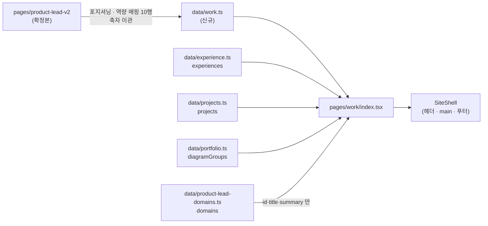

# `/work` 통합 노트 — `product-lead*` 4갈래에서 무엇을 남기고 무엇을 버렸나

**정본 계획서**: [`2026-08-25-redesign-phase-1-2.md` §Task 11](2026-08-25-redesign-phase-1-2.md) (L1994~2166)
**작성 시점**: 2026-08-28, 코드를 옮기기 **전**
**왜 먼저 쓰나**: 옮긴 뒤에 적으면 「왜 빠졌지」를 다음 사람이 다시 묻는다. 버린 것에도 이유가 있다는 사실은 코드에 남지 않는다.

---

## 1. 통합 대상 — 실측

| 출처 | 줄 수 | 성격 |
| --- | --- | --- |
| `pages/product-lead-v2/index.tsx` | 331 | **사용자 확정본.** v2 링크로 전달을 마쳤다 |
| `pages/product-lead/index.tsx` | 331 | `-v2` 의 **개정 이전본** |
| `pages/product-lead-loadmap/index.tsx` | 579 | 도메인별 실행 설계 — `data/` + `RoadmapDomain` 컴포넌트 |
| `pages/product-lead-wiki/index.tsx` + `[slug].tsx` | 88 + 96 | 내부 위키 인덱스. `noindex` |

계획서가 적은 줄 수(317·317·565·88)와 다르다 — 계획 수립 이후 커밋들이 이 파일들을 건드렸다. **문구의 기준은 계획서 인용문이 아니라 현재 파일이다.**

## 2. 남길 것 / 버릴 것

| 출처 | 남긴다 | 버린다 | 근거 |
| --- | --- | --- | --- |
| `-v2` | 포지셔닝 문구 · 역량 매핑 표(10행) | 자체 히어로(프로필 코인·`hero-hello`) · 자체 내비 · CTA 버튼 묶음 · 「핵심 요약」 4카드 · 「더 보기」 | 셸이 내비·푸터를 대체한다. 「핵심 요약」은 계획서 Step 1 표의 남길 목록에 없고, 그 안의 NCMS 서사는 역량 매핑 2행이 이미 담는다 |
| `-loadmap` | 도메인 **요약**(`id`·`title`·`summary`) | `RoadmapDomain` 컴포넌트의 인터랙션 · `pmOrg` · 로드맵 상세 | T14 가 `components/roadmap-domain.tsx` 를 지운다. 지워질 컴포넌트에 새 페이지를 묶으면 T14 가 자기가 만든 코드를 되돌리게 된다 |
| `-wiki` | 없음 | 전부 | 내부 문서다. `noindex` 이고 T13 이 스텁으로 접는다 |
| 구 `pages/index.tsx` | `data/diagrams/**` 시스템 다이어그램 (`SystemDiagramCard`) | — | T10 이 홈에서 걷어낸 자산의 새 거처 |

## 3. 계획서와 실물이 어긋난 3건 — 사용자 결정

계획서가 쓰인 뒤에 사용자가 `-v2` 를 개정했고, 계획서의 문구 규칙이 **개정 이전 상태**를 가리키고 있었다.

| # | 계획서 | 실물 | 2026-08-28 결정 |
| --- | --- | --- | --- |
| 1 | Step 1 표는 포지셔닝·역량 매핑·NCMS 서사·도메인 요약을 남기라 함 | Step 2 **예시 코드에는 넷 중 하나도 없다** (경력·프로젝트·시스템 구조뿐) | **Step 1 표를 따른다.** 예시 코드는 골격으로만 쓴다 |
| 2 | 「원조 구축」은 유지 표현. 지우지 않는다 | `-v2` 에 **0건.** 「1세대 구축」·「발주 PM」으로 개정됨. 「원조 구축」·「발주사 PM」은 구 `product-lead` 에만 | **`-v2` 확정본 우선.** 계획서 문구 규칙 표를 이 사실로 정정한다 |
| 3 | Step 4: 「처음」이 TVING CMS 문맥에 없어야 함 | `-v2:73` — *"OTT CMS 도메인을 **처음** 다룬, 재구축 판단의 출발점."* | **`-v2` 유지.** 금지된 것은 「처음 **구축한/만든**」(원조 주장)이지 커리어 순서 서술이 아니다 |

3번은 검사 방식도 바꿨다. 계획서의 `grep '처음'` 은 확정본까지 잡아 사람이 매번 무시하게 되므로 — **무시하는 습관이 붙은 검사는 없는 것과 같다** — 패턴을 `처음\s*(구축|만든|만들|세운|개발한)` 으로 좁혀 `tests/work/work-data.test.ts` 와 `e2e/work.spec.ts` 에 넣었다.

## 4. 계획서가 사실과 달랐던 것 하나 더

계획서 Step 1·Step 3 은 *「T8 에서 만든 `/work/` 200 검사」* 가 있다고 전제한다. **없었다.**
`e2e/smoke.spec.ts:114`·`:140` 이 2026-08-26 에 `/work/`·`/about/` 을 라우트 배열에서 명시적으로 뺐고,
`npx playwright test --grep "work"` 는 `No tests found` 로 응답한다(2026-08-28 실측).

⇒ T11 의 red 는 **이 태스크에서 새로 만들었다.** 두 배열에 `/work/` 를 되돌리고, `e2e/work.spec.ts` 를 신설했다.

## 5. 진입점 복구 — 계획서에 없고 테스트 상수에 있었다

HANDOFF §2-2 는 *「T11 `/work` 가 그 진입점을 받는다」* 고 적었지만, 계획서 Task 11 은 방법을 말하지 않는다. 실물에 답이 있었다.

```
e2e/shell.spec.ts:52   "Work", // 선행 계획서 T11 로 이월
```

`components/site-header.tsx` 의 `NAV` 는 `Atlas`·`Blog` 뿐이다. **`pages/work/index.tsx` 를 만드는 것만으로는 도달 가능해지지 않는다.** `NAV_ABSENT` → `NAV_PRESENT` 로 옮기는 것이 T11 의 일이라고 테스트 상수가 예약해 두었다.

> `data/product-lead-teaser.ts` 는 **아무도 소비하지 않는다.** T10 이 데이터만 추출하고 홈에 붙이지 않았고, 그 파일의 `ctaHref: "/product-lead-v2/"` 는 어디서도 렌더되지 않는다. HANDOFF 가 말한 「인바운드 0건」의 실체가 이것이다. 이 데이터의 거처는 T13(스텁)·T14(고아 자산)에서 판단한다 — T11 은 `pages/index.tsx` 를 건드리지 않는다.

## 6. `/work` 의 최종 구성



섹션 순서 — 위에서 아래로:

| # | 섹션 | 출처 | 개수 검사 |
| --- | --- | --- | --- |
| 0 | eyebrow · h1 · 포지셔닝 2문장 | `workPositioning` | h1 정확히 1개 |
| 1 | 요구 역량 매핑 (표) | `capabilityMap` | `tbody tr` = 10 |
| 2 | 경력 | `experiences` | `li` = `experiences.length` |
| 3 | 프로젝트 | `projects` | `li` = `projects.length` |
| 4 | 시스템 구조 | `diagramGroups` | `[data-diagram-group]` = `diagramGroups.length` |
| 5 | 도메인 실행 설계 | `domains` | `li` = `domains.length` |

**개수를 테스트에 상수로 적지 않았다.** `/atlas` 가 엣지 1,053 중 156 만 그리고도 E2E 74건을 통과시킨 사고가 이 리포에 있다 — 「데이터에 있다」와 「화면에 그려졌다」를 잇는 유일한 방법은 양쪽에서 센 수를 맞추는 것이다.

> ⚠️ **위 표의 「프로젝트」 행은 처음에 `—` 로 비어 있었고, 그것이 그대로 구멍이 됐다.**
> 뮤테이션 실측(2026-08-28): 카드를 **0개 렌더해도 E2E 70건이 전부 초록**이었다.
> 표가 빈 칸을 보여 주는 것과 사람이 그 칸을 채우는 것은 다른 일이다 —
> 다섯 섹션 중 넷에만 개수 대조가 있으면 **초록의 개수는 커버리지를 증명하지 않는다.**

**최종 구조는 이 표보다 한 겹 더 나뉘었다.** 리뷰가 「282줄 인라인」을 관례 이탈로 지적해
`components/work/section-*.tsx` **6개**로 추출했고 `pages/work/index.tsx` 는 **53줄 조립 코드**가 됐다.
경위는 [`reports/2026-08-28-t11-work.md`](../reports/2026-08-28-t11-work.md) 를 보라.

## 7. 축자 이관 문구 — 여기서 복사한다

원본은 `pages/product-lead-v2/index.tsx`. **한 글자도 고치지 않는다.**

### 포지셔닝 (`-v2:183`·`:186`)

```
lead: 20년간 OTT·커머스 플랫폼의 코어를 설계·재구축하고, 20~30인 조직을 총괄해 온 리더.
sub:  차세대 CMS 재구축을 발주 PM으로 완주하고, 커머스·AI 플랫폼까지 총괄하는 프로덕트 리더.
```

`eyebrow` 와 `heading` 은 `-v2` 에 대응물이 없다(자체 히어로를 버렸으므로). 계획서 Step 2 예시 코드의 것을 쓴다 — `Work` / `로드맵에서 출시까지, 그리고 그 뒤의 지표까지`.

### 역량 매핑 10행 (`-v2:88~99`)

| # | need | evidence |
| --- | --- | --- |
| 1 | 콘텐츠·플랫폼 코어 엔진 로드맵 | OTT·N-Screen의 CMS·검색·편성·통합 API를 설계·운영 (CJ헬로비전, SKB) |
| 2 | 대규모 CMS 재구축·현대화 | SKB 차세대 CMS(NCMS) 재구축 발주 PM(MSA 설계·검토) + TVING CMS 1세대 구축 리드 |
| 3 | 커머스 결제·정산·구독 도메인 | 야나두 교육·커머스 플랫폼 총괄 — 결제·정산·구독 등 커머스 핵심 도메인 서비스 개발 관리 |
| 4 | 플랫폼 거버넌스·요구사항 모듈화 | MSA 설계, 통합 이미지/API 플랫폼, 확장 가능한 DB 설계 연구(석사 논문) |
| 5 | MSA · API 설계 · 클라우드 | Spring Boot 기반 API·MSA, 온프레미스(IDC)와 AWS 모두 운영 |
| 6 | 백오피스·내부 운영 UX 고도화 | CMS·편성·백오피스 운영 도구 개발을 제품 단위로 총괄 |
| 7 | OTT · 스트리밍 도메인 | KT·CJ헬로비전·SK브로드밴드에서 OTT/N-Screen/STB 20년 |
| 8 | 커머스 플랫폼 | 야나두 교육·커머스 플랫폼 총괄 |
| 9 | AI 기반 메타데이터 자동화 | 검색·추천·딥메타 실무 + AI 챗봇 서비스 직접 개발·런칭 |
| 10 | PM·크로스펑셔널 조직 리딩 | 기획·PM 포함 전 직군 20~30명 총괄 |

2행이 NCMS 발주 PM 서사를 담는다. `confirm?: boolean` 필드가 원본 타입에 있으나 **10행 모두 값이 없다** — 타입만 옮기고 값은 넣지 않는다.

## 8. 이 태스크가 남기는 것

| 항목 | 다음 태스크 |
| --- | --- |
| 구 라우트 5개(`product-lead`·`-v2`·`-loadmap`·`-wiki`)가 그대로 살아 있다 | **T13** — 9 URL 을 파일 4개 스텁으로 |
| `components/roadmap-domain.tsx` · `lib/wiki.ts` 등 고아 자산 | **T14** — 호출자 0건이 증명된 뒤 삭제 |
| `data/product-lead-teaser.ts` 가 소비처 없이 남는다 | **T13·T14** — 거처 판단 |
| `NAV_ABSENT` 에 `About` 만 남는다 | **T12** — `/about` 신설 시 `NAV_PRESENT` 로 |
