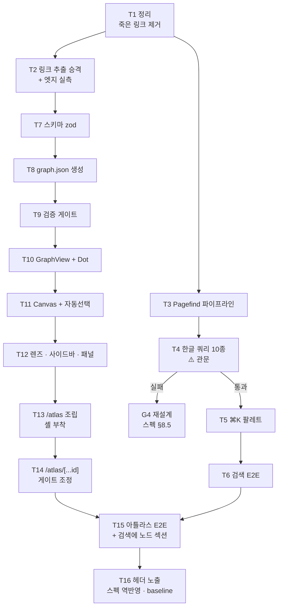
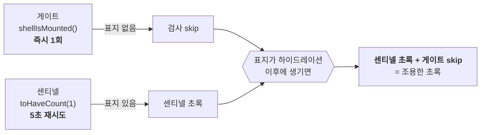
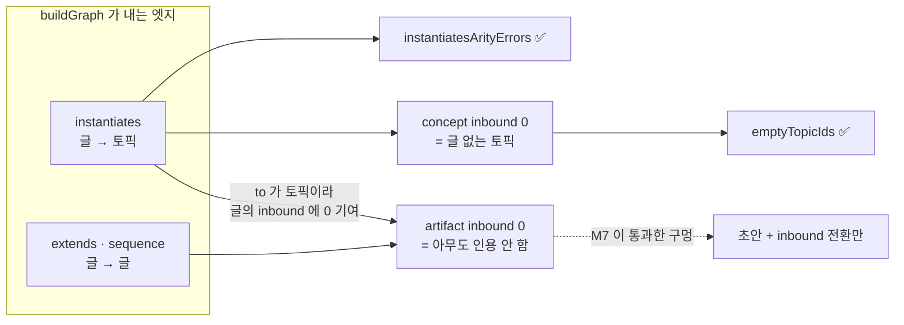

# 아틀라스 · 검색 구현 계획

> **For agentic workers:** REQUIRED SUB-SKILL: Use superpowers:subagent-driven-development (recommended) or superpowers:executing-plans to implement this plan task-by-task. Steps use checkbox (`- [ ]`) syntax for tracking.

**Goal:** 글 156편에서 지식그래프(`/atlas`)와 전문 검색(`⌘K`)을 만든다. **메인 페이지와 `/blog`는 건드리지 않는다.**

**Architecture:** 빌드타임 파싱만으로 `graph.json`(노드 162 · 엣지 실측)을 만들고, 렌더러 추상화 뒤에 SVG·Canvas 두 구현을 둔다. 검색은 Pagefind가 `out/`의 HTML을 스캔해 정적 인덱스를 만들고, 브라우저는 검색어에 해당하는 조각만 `fetch`한다. **LLM 런타임 호출이 없다.**

**Tech Stack:** Next.js 14 Pages Router · 정적 export · zod · Pagefind · d3-force(Canvas) · Playwright

**Spec:** [`docs/superpowers/specs/2026-08-25-redesign-and-atlas.md`](../specs/2026-08-25-redesign-and-atlas.md) — §7 아틀라스 · §8 검색 · §11 품질 게이트

**선행 계획서:** [`2026-08-25-redesign-phase-1-2.md`](./2026-08-25-redesign-phase-1-2.md) — 단계 1(T1~T8)이 완료돼 이 계획서의 전제다. **단계 2(T9~T13)는 이 계획서로 대체되지 않고 뒤로 미뤄졌다.** §「이월된 것」 참조.

---

## 진행 상황 — 2026-08-26

**태스크 안의 `- [ ]` 체크박스는 믿지 마라.** 이 리포의 계획서 전부에서 한 번도 갱신된 적이 없다.
진행 여부는 아래 표와 `git log` 로 판단한다.

| 태스크 | 상태 | 커밋 | 산출 |
| --- | --- | --- | --- |
| T1 죽은 링크 제거 | ✅ | `4752d05` | E2E 실패 12 → 2 |
| T2 링크 추출 승격 + 엣지 실측 | ✅ | `3c636a0` | `lib/atlas/links.ts` · **노드 162 · 엣지 1,053** |
| T3 Pagefind 파이프라인 | ✅ | `6b9305f` | `check-pagefind` + CI 게이트 · 인덱스 242p |
| T4 한글 쿼리 관문 | ✅ | `8c2cf2e` | **기본형 8/8 통과.** §「실측 기록」 |
| 이중 리뷰 반영 | ✅ | `6340797` | CRITICAL 1 · HIGH 4 · MEDIUM 3 · LOW 2 |
| T5 `⌘K` 커맨드 팔레트 | ✅ | `3645778` | `lib/search/` 4개 · `lib/ui/scroll-lock.ts` · `components/search/` 2개. **테스트 185 → 205** |
| T5 이중 리뷰 반영 | ✅ | `3645778`(동일 커밋) | CRITICAL 1 · HIGH 3 · MEDIUM 7 · LOW 8 |
| T6 검색 E2E | ✅ | `053f37c` | `e2e/search.spec.ts` 신규(센티넬 2 · 게이트 5). E2E **46 → 48건** |
| T6 이중 리뷰 반영 | ✅ | `053f37c`(동일 커밋) | 채택 8 · 기각 1. **거짓 보증 1건** 포함 — 아래 §「T6 실측 기록」 |
| 계획서 결함 4건 반영 | ✅ | `7b7a7f5` | 번호 매핑 표 · `[...id]` 정정 · 낡은 기대치 · T10 조건 확정. §「결함」 아래쪽 4행 |
| T7 노드·엣지 zod 스키마 | ✅ | `9e57604` | `lib/atlas/types.ts` · `tests/atlas/types.test.ts`(**24건, 전부 거부 검사**). 테스트 **205 → 229** |
| T8 MDX → 그래프 매핑 | ✅ | `eeac2af` | `lib/atlas/build.ts` · `tests/atlas/build.test.ts`(**14건**). **노드 162 · 엣지 1,053 — T2 실측과 네 항목 모두 일치.** 테스트 **229 → 243** |
| T8 이중 리뷰 반영 | ✅ | `f7ef37c` | 위험 축 3개 병렬. **코드 결함 1건**(정준 순서 없음) + **테스트 구멍 13건**(뮤테이션 27종 중 13종 생존). 재주입으로 13/14 사멸 확인. 테스트 **243 → 248** |
| 리뷰 A2 반영 — 링크 추출의 산문 전처리 | ✅ | `7d12581` | `proseOnly` 를 export 해 **세 곳**(아틀라스 엣지 · 슬래시 검사 · 앵커 검사)이 같은 전처리를 본다. `tests/atlas/links.test.ts` 신규 17건. 테스트 **248 → 265** |
| T9 — 그래프 무결성 게이트 | ✅ | `8ba39e5` | 초안 코드의 **다섯 곳**을 고쳤다. 뮤테이션 **18종**으로 실행 검증 — 「inbound 0 으로 바꿔라」는 지시를 따르고도 **죽은 검사가 안 살아났다**(M7: `instantiates` 를 통째로 지워도 exit 0). 검사를 셋으로 나눴다. `pre-commit` 에 `tests/atlas` 를 얹었다. 테스트 **265 → 289** |
| 부수 — 소스의 생 NUL 2개 | ✅ | `73d0425` | `tests/atlas/build.test.ts` 를 **ripgrep 이 통째로 건너뛰고 있었다.** 「없다」와 「못 읽었다」가 같은 침묵이었다 |
| T10 레이아웃 + SVG 렌더러 + 목록 뷰 | ✅ | `3137e99` · 기록 `050a10c` | `lib/atlas/layout.ts`(순수 함수) · SVG 는 포인터 전용, 키보드·SR 경로는 목록 뷰로. **노드 162 는 Dot 임계(≤300) 안이라 힘 기반 시뮬레이션을 쓰지 않는다** — 시뮬레이션은 빌드마다 결과가 달라 기준선 해시를 흔든다. WCAG 1.4.11 을 배경 3종 × 2테마 × 6항목 = 36칸으로 잰다 |
| T11 `/atlas` + 노드 상세 + GC-6 게이트 정규화 | ✅ | `d217827` · 기록 `d7385d3`·`40ee14c` | `pages/atlas/[...id].tsx`(**catch-all — 노드 id 에 슬래시가 있다**) · `lib/atlas/neighbors.ts`. 노드 상세는 `graph` 를 싣지 않는다(그대로 넘기면 산출물 **+70.5 MB**). `isTarget` 에 `atlas/` 제외를 더해 기준선 감시 대상을 14 개로 유지 |
| T12 헤더 등재 · 아틀라스 E2E · 접근성 (12a) | ✅ | `3ba2e33` → `530da98` → `7e9bcfc` → `ca61f1f` | NAV 에 Atlas 등재 · `e2e/atlas.spec.ts` 신규 · 검색 인덱스 필터 · **셸 밖 도착지 4곳의 `<main tabIndex={-1}>`**. 이중 리뷰 2축 × 2라운드 통과 |
| T12 기준선 · 역반영 (12b) | ✅ | 이 커밋 | `scripts/baseline.json` **1회 갱신**(9건 전부 `product-lead*`) · 스펙 D-1·D-2 역반영 · 계획서 낡은 칸 · `TOOL-TRAPS.md` 3건 |

**T6 을 시작하기 전에 반드시 읽을 것:** §「T5 실측 기록」. T6 스펙 초안이 검사하는 접근명·로케이터가 실제 구현과 맞는지 **실측으로 확인해 뒀다** — 그중 하나는 「깨질 것」이라 판단했다가 측정에서 뒤집혔다.

### ~~지금 초록이 아닌 것 — 전부 의도된 것이다~~ → ✅ **해소됨 (2026-08-27, `ca61f1f`)**

> **이 절의 전제가 사라졌다. `npm run e2e` 는 이제 `74 passed · 0 failed · 0 skipped` 다**
> (2026-08-27 실측, `npm run build` 직후). **그 빨강을 만날 사람이 더는 없다는 것이 이 계획서의 결과다.**
>
> | 이 절이 예약했던 빨강 | 무엇이 해소했나 |
> | --- | --- |
> | `/atlas/` 셸 센티넬 **4 failed** (× 2파일 × 2프로젝트) | **T11 `d217827`** — `pages/atlas/index.tsx` · `[...id].tsx` 가 `SiteShell` 을 감쌌다. 센티넬이 초록이 되면서 **skip 26건이 동시에 깨어났다** |
> | `shell.spec.ts` 의 asPath 검사 (skip 26건에 포함) | **T12/12a `3ba2e33`** — `components/site-header.tsx` 의 `NAV` 에 Atlas 를 등재했다 |
>
> **절을 지우지 않는 이유** — 「의도된 빨강」과 「회귀」를 어떻게 갈랐는지가 이 계획서에서 가장
> 재사용 가능한 부분이다. 아래 ⚠️ 세 개는 **지금도 유효하다**(센티넬 중복의 근거 · 낡은 수치 금지 · `out/` 낡음의 exit 1).
>
> 아래는 **해소 전 원문**이다.

| 검사 | 상태(2026-08-27, 해소 전) | 언제 초록이 되나 |
| --- | --- | --- |
| `npm run e2e` | **4 failed** (18 passed · 26 skipped) — 총 **48건** | `/atlas/` 셸 센티넬이 `shell.spec.ts`·`search.spec.ts` **양쪽에** 있고 각각 desktop·mobile 이라 4건이다. **T13**(「/atlas 조립 · 셸 부착」)에서 셸이 붙으면 초록이 되고 skip 26건이 동시에 깨어난다 |
| `shell.spec.ts` 의 asPath 검사 | 위 26건에 포함돼 skip | **T16**(헤더 노출)에서 `/atlas/` 를 NAV 에 올려야 한다. **T13~T16 은 태스크 세 개 길이고, 그 구간 내내 이 1건 × 2프로젝트가 빨간 것이 정상이다.** 그 빨강의 뜻은 「asPath 가 틀렸다」가 아니라 「셸은 붙였는데 NAV 에 안 올렸다」다 |

⚠️ **센티넬이 두 파일에 중복된 것은 의도다.** 센티넬의 임무는 「이 파일의 skip 이 정당한가」를 그 파일 안에서 답하는 것이라 스위트마다 하나씩 필요하다. 실측으로 확인한 근거: `-g` 필터를 걸면 센티넬이 통째로 빠져 **`4 skipped` · 종료코드 0** 이 된다 — 센티넬 없는 스위트는 조용한 초록이 된다.

⚠️ **이 수치를 낡은 채로 두지 마라.** 다음 사람에게 「낡은 숫자」와 「회귀」는 구별되지 않는다. T6 에서 검사 1개를 늘렸을 때 이 표와 `CLAUDE.md` 를 함께 고쳐야 했고, 리뷰가 그것을 지적으로 잡았다.

⚠️ **`npm run e2e` 는 `out/` 이 소스보다 오래되면 테스트를 하나도 안 돌리고 exit 1 을 낸다.** 그 1 은 위의 「의도된 빨강 2건」이 내는 1 과 **구별되지 않는다.** `scripts/` 도 소스로 세므로 스크립트를 하나 추가하기만 해도 그렇게 된다 — 반드시 `npm run build` 를 먼저 돌리고, `$?` 가 아니라 **요약 줄**을 읽어라.

### 이 계획서를 실행하며 드러난 계획서 자체의 결함

같은 종류가 또 나올 수 있으니 남긴다. **전부 「계획서를 글자 그대로 따랐다면 잘못됐을」 것들이다.**

| 위치 | 계획서가 말한 것 | 실제 |
| --- | --- | --- |
| T1 전제 | 「헤더가 죽은 링크 2개를 렌더한다」 | 렌더하지 않는다. `SiteShell` 이 아직 어느 페이지에도 안 붙어 `data-site-shell` 이 산출물에 **0건**이다 |
| T1 Step 4 | `grep -c 'href="/work/"' out/blog/index.html` 로 검증 | 수정 **전에도 0** 이라 아무것도 증명하지 못한다. 소스의 `NAV` 배열을 검사해야 한다 |
| T1 Step 1·5 | 실패 14 → 6 | 실측 **12 → 2**. `smoke.spec.ts` 에는 셸 센티넬이 없는데 계획서가 없는 검사를 세었다 |
| T1 Step 3 | `const SHELL_PATHS = ["/atlas/"];` | 그대로 하면 센티넬과 `gotoWithShell` 호출부 8곳이 **다른 경로**를 보게 된다. `SHELL_HOME` 상수로 묶어야 한다 |
| T2 Step 2 | 「`key(` 호출을 전부 `postKey(` 로」 | `.map(key)` 형태 2곳을 놓친다. `grep -c` 가 세는 것은 **줄 수**다 |
| T2 Step 3 | 「165 passed」 | `npm test` 는 `vitest run` 전체라 실측 테스트를 만들면 166 이 된다 |
| T4 쿼리 목록 | 판정 대상 8건에 「카나리 배포」 | 원문 **0건**이다. 계획서 스스로 「원문에 없으면 쿼리가 잘못된 것」이라 적어 두고 그 쿼리를 판정에 넣었다 |
| File Structure 표 · mermaid | T1~T16 | 본문 태스크는 **T1~T12** 다. 표의 `canvas-renderer.tsx` · `use-renderer-choice.ts` · `lens-picker.tsx` · `topic-sidebar.tsx` 4개는 §「후속 계획서로 넘긴 것」으로 빠졌다 — **이번에 만들지 않는다** |
| T5 Step 1 | `declare module "/pagefind/pagefind.js";` 를 두면 TS2307 이 풀린다 | **풀리지 않는다.** TypeScript 는 `/` 로 시작하는 지정자를 모듈 이름이 아니라 **루트 경로**로 해석해 ambient 선언을 적용하지 않는다. `--listFiles` 로 그 `.d.ts` 가 프로그램에 들어간 것까지 확인하고도 에러가 같다. **선언 파일로는 못 고친다** — 대안(`new Function`) 이 유일한 경로다 |
| T5 Step 2 | 「`h.url` 이 `/blog/xxx/index.html` 형태로 올 수 있다」 | 조각 242개를 풀어 세어 보니 **`index.html` 로 끝나는 것 0건**, 241건이 `/` 로 끝난다. `.replace()` 는 **넣으면 안 되는 코드**였다 |
| T5 「T5 로 넘긴 것」 | 「`404.html` 이 인덱스에 들어 있다」 (1건) | **2건이다.** `/404/` 와 `/404.html` 이 따로 있다. 「242 = index.html 241 + 404.html 1」이라는 산식 자체가 틀렸다 |
| T5 본문 코드 | 결과를 그대로 렌더한다 | 인덱스 242건 중 **65건이 태그 목록 페이지**다. 「임베딩」 상위 10 중 4건, 「검색엔진」은 글이 **3개뿐**이었다. 계획서는 이 오염을 **한 번도 언급하지 않는다** |
| T5 본문 코드 | 조사 전처리는 §「T5 의 입력」에 「값어치가 크다」로만 적혀 있다 | 코드에는 **없다.** 실측하니 7종 전부 넓어졌다(벡터가 3→56 · 검색엔진을 2→19). 「입력」 절과 「코드」 절이 따로 놀았다 |
| **T6 Step 1** | `SHELL_MARKER` 와 `gotoWithShell` 을 스펙 파일 안에 **다시 정의**하고 `SEARCH_PATHS` 를 새로 둔다 | 셋 다 `e2e/shell-gate.ts` 에 **이미 export 돼 있다.** 스펙의 Interfaces 절은 「Consumes: `shell-gate.ts` 의 `SHELL_MARKER`」라고 적어 놓고 **코드는 복제한다.** 더 나쁜 것은 이게 **위 T1 Step 3 에서 똑같이 지적된 결함의 재발**이라는 점이다 — 스펙이 리포의 현재 상태가 아니라 **자기 초안**을 참조하고 있다 |
| **T6 Step 1** | 「다이얼로그 안 **첫** link 의 `href` 가 `/blog/` 로 시작한다」 | 조사 제안을 `<a>` 로 바꾸는 순간 깨진다. 계획서는 §「T5 실측 기록」④에 「**링크로 바꾸면 T6 ②가 깨진다**」고 적어 두었다 — 즉 **테스트가 구현에 채운 족쇄를 발견해 놓고 그것을 지키라고 요구한다.** 결과 `role="listbox"` 안으로 좁히면 그 결합 자체가 사라진다 |
| **T6 Step 1** | 「첫 결과의 `href` 가 `/blog/`」로 G4 를 증명한다 | **오늘의 랭킹에 기댄다.** 필터를 통과하면서 `/blog/` 로 시작하지 않는 페이지가 이미 **12건**(`/`·`/en/`·`/notion/`·`/product-lead*`) 있고, T13 이 만들 `/atlas/` 는 빌드 끝의 `npx pagefind --site out` 에 **자동 편입되는데 `isIndexNoise` 는 그것을 모른다.** 셸이 붙는 바로 그 태스크에서 빨개질 수 있었다 |
| **T6 Step 1** | 팔레트 검사 **4종** | `Ctrl+K` **토글**이 빠졌다. 구현은 「토글이다 — 열린 상태에서 다시 누르면 닫힌다(계획서 원안)」라고 **주석까지 달아 둔 명시적 계약**인데 검사가 없어, 그 분기가 통째로 사라져도 초록이다 |
| **T6 Step 2** | 「총 12건」 | 위 토글을 넣으면 **14건**이다. 초안의 산식이 아니라 실행 결과를 기준으로 삼아야 한다 |
| **진행 상황 표(이 문서 위쪽)** | 셸 부착 **T11** · NAV 등재 **T12** | 다이어그램·File Structure 표·T1 본문이 전부 **T13**(조립·셸 부착) · **T16**(헤더 노출)이다. 이 오기가 `e2e/shell-gate.ts` · `e2e/shell.spec.ts` · `components/site-header.tsx` 의 주석 **5곳**에 퍼져 있었고, 그중 하나는 **skip 메시지**라 나중에 그 빨강을 만나는 사람이 읽는 유일한 안내문이었다 |
| **번호 체계가 두 개다** (2026-08-27 T7 착수 전 발견) | 섹션 제목은 `## Task 7` ~ `## Task 12` 로 **6개** | mermaid · File Structure 표 · 코드 주석 **30곳**은 전부 **T1~T16** 이다. 원인은 T11(Canvas) · T12(렌즈)가 §「후속 계획서로 넘긴 것」으로 빠지면서 뒤가 당겨진 것인데 **섹션 제목만 순번을 다시 매겼다.** 코드 주석은 위 행에서 T13·T16 으로 정정됐으므로 **남은 어긋남은 섹션 제목뿐이다** — §「태스크 번호 매핑」에 표를 넣고 제목에 T 번호를 병기했다 |
| **File Structure 표** (2026-08-27 발견) | `pages/atlas/[id].tsx` | **이대로 만들면 동작하지 않는다.** T7 이 글 노드 id 를 `<category>/<slug>` 로 정하는 순간 id 에 `/` 가 들어가는데, Next.js 의 `[id]` 는 **한 세그먼트만** 받는다 — 노드 162 개 중 글 **156 개가 전부 404** 다. T11 본문(`- Create:` 줄과 코드 블록)은 `[...id].tsx` 로 옳게 적혀 있어 **같은 문서 안에서 두 갈래**였고, 표가 더 눈에 띈다 |
| **완료 판정 `npm test`** (2026-08-27 실측) | `190 passed` | **205 passed** 다. T5 가 20 건을 더했다(185→205). 낡은 기대치는 **회귀와 구분되지 않는다** — 이 리포의 `CLAUDE.md` 가 E2E 수치에 대해 같은 말을 한다 |
| **T10 의 ⚠️** (2026-08-27 발견) | 「T8 의 실측 엣지 수를 먼저 보라. 300 을 크게 넘으면 …그때는 규칙을 함께 넣는다」 | **T2 가 이미 쟀다 — 엣지 1,053 이다.** 임계의 **3.5 배**라 조건은 T2 시점에 이미 발동했다. 「보고 정한다」로 남겨 두면 T10 실행자가 조건 없이 만들고 화면이 뭉갠 뒤에야 발견한다 — T10 본문에 **확정 규칙**으로 옮겼다 |
| **File Structure 표가 본문과 또 갈렸다** (2026-08-27 T7 직후 발견) | `scripts/build-atlas.mjs`(T8) · `scripts/check-atlas.mjs`(T9) · `package.json` 에 `build:atlas`·`check-atlas` 스크립트 | **셋 다 만들지 않는다.** T8 본문이 §「왜 CLI 스크립트를 만들지 않나」에서 이미 철회했고(`.mjs` 는 `@/` 별칭 TypeScript 를 못 읽는다), T9 본문은 `tests/atlas/integrity.test.ts` 다. 표에는 그 대체물이 **아예 없었다.** 위 `[id].tsx` 행과 **같은 유형**이다 — 본문은 고쳐졌는데 표가 안 따라왔다 |

| **File Structure 표가 또 갈렸다 — 네 번째** (2026-08-27 T8 착수 전 발견) | `scripts/count-edges.mjs` — 「엣지 수 실측 (1회용 계측기, 커밋한다)」 (T2) | **존재한 적이 없다.** `git log --all -- scripts/count-edges.mjs` → **0건**. T2 Step 4 본문은 이 `.mjs` 초안을 싣자마자 *「⚠️ 위 import 는 동작하지 않는다」* 로 **그 자리에서 철회하고** `tests/atlas/count-edges.test.ts` 로 바꾼 뒤 마지막에 `rm` 한다. §「D-2가 바꾸는 수치」도 그렇게 적었다. 즉 계측기는 테스트로 만들어졌고 쓰고 버려졌는데 **표만 `.mjs` 로 남았다.** T8 Step 5 가 「T2 에서 적어 둔 수치와 대조한다」고 지시하므로, 실행자가 이 표를 믿고 없는 파일을 쫓는다 |
| **T8 Step 3 코드 — 토픽 노드의 title·summary** (2026-08-27 T8 착수 전 발견) | `title: c` (slug) · `summary` 가 「N편」 | **화면에 그대로 나간다.** T10 은 `{t.title}` 을(2583 행), T11 은 `title={`${node.title} — Atlas`}` · `description={node.summary}` 를(2826 행) 렌더하므로, 한글 사이트의 아틀라스에 「rag」·「search-engineering」이 뜨고 노드 상세의 meta description 이 「12편」이 된다. `content/blog/categories.ts` 에 `name`(「RAG · 검색증강생성」)과 `description` 이 이미 있고 `findCategory(slug)` 도 있다 — **데이터는 있는데 안 읽었다.** 미등록 slug 폴백과 함께 T8 에서 고쳤다 |
| **T8 Step 1 코드 — draft 테스트의 사각** (2026-08-27 T8 착수 전 발견) | `draft 는 그래프에 들어가지 않는다` 가 `artifact` 개수만 본다 | 카테고리 목록을 **필터 전** 배열(`all`)에서 뽑아도 **초록이다.** 그러면 엣지가 하나도 없는 고아 토픽 노드가 남는데, 이것이 정확히 T7 실측 기록 ②가 T8 로 넘긴 「글 0 편 카테고리」 문제다 — **계획서가 문제를 넘겨 놓고 그것을 잡는 테스트는 안 썼다.** 「초안만 있는 카테고리는 토픽 노드도 만들지 않는다」를 추가했다 |

| **T11 이 그래프 전체를 페이지마다 심는다** (2026-08-27 T8 이중 리뷰 B-F1 · **최대 발견**) | `pages/atlas/index.tsx` 와 `pages/atlas/[...id].tsx` 가 `props: { graph, node }` | **산출물이 2.3 배가 된다.** 실측: `JSON.stringify(graph)` = **226,605 B**. Next 는 props 를 **두 번** 쓴다 — `__NEXT_DATA__` 인라인 + `_next/data/*.json`. 163 페이지(목록 1 + 노드 162) × 2 ≈ **73.9 MB** 증가. 현재 `du -sk out` = 57,696 KB. `lib/blog/types.ts` 가 **정확히 같은 이유**로 `PostSummary`(body·toc 제거)를 만든 전례가 있는데 아틀라스는 안 따랐다. 실측 축약 여지: 슬림 노드(id/type/title/topics)만 **30,296 B**. 노드 상세는 `{ node, neighbors }` 면 최대 차수 51 기준 페이지당 **~3 KB** |
| **T11 NodePanel 이 상호 링크를 두 줄로 낸다** (2026-08-27 T8 이중 리뷰 B-F3) | `graph.edges.filter((e) => e.from === node.id \|\| e.to === node.id)` | **양방향 `extends` 쌍이 179 개다**(실측). 같은 이웃이 「이어짐」으로 두 번 나오는데 key 가 `from\|to\|type` 이라 **React 경고도 안 뜬다** — 조용히 중복된다. T8 은 (from,to) 쌍만 dedupe 하므로 무방향 dedupe 은 소비자 책임이다. 최대 차수: `topic/ai-agent` 51 · `topic/backend-engineering` 32 |
| **T9 의 「고립된 artifact 노드가 없다」는 죽은 검사다** (2026-08-27 T8 이중 리뷰 B-F7) | 차수 0 인 artifact 를 센다 | **구조적으로 항상 0 이다** — `buildGraph` 가 모든 글에 `instantiates` 를 하나씩 붙인다. 자기검사 ①~④ 에 고아 케이스가 없어 **그 사실조차 드러나지 않는다.** 대상을 **inbound 0** 으로 바꾸면 실측 4편이 나오고, 그 4편이 전부 `role: "map"` 이면서 최대 허브다(outbound ~~30·26·22·6~~ → **31·23·12·7**, T9 실측으로 갱신 — A4 수치는 A2(`7d12581`) 이전이라 낡았다) — ~~이웃 탐색 UI 로는 **절대 도달할 수 없는 최상위 노드**다(리뷰 A4)~~ ⇒ ⚠️ **이 문장은 틀렸다**(T9 리뷰). `## Task 11` 의 `NodePanel` 은 무방향이라 하위 글 상세에서 그 4편이 뜬다. 영구히 비는 것은 **방향을 따르는 자리**(백링크 목록)다. ⇒ ⚠️ **그리고 대상을 바꾸는 것만으로는 죽은 검사가 살아나지 않았다** — `instantiates` 는 `to` 가 토픽이라 글의 inbound 에 기여하지 않는다. 뮤테이션 M7 실측: `instantiates` 를 통째로 지워도 게이트가 초록이었다. T9 가 검사를 **셋**으로 나눈 이유다(§「Task 9」①) |
| **`outboundKeys` 가 마크다운 구조를 모른다** (2026-08-27 T8 이중 리뷰 A2) | `links.ts` 의 정규식이 raw text 를 훑는다 | **코드 펜스·인라인 코드·HTML 주석 안의 예시 링크가 진짜 `extends` 엣지가 된다.** 실측(합성 입력): 셋 다 `["rag/a"]` 를 반환한다. 이미지 `` 와 이스케이프 `\[x\](...)` 도 마찬가지. 실데이터 오늘 incidence **0** 이지만 — **이 리포는 지금 「아틀라스는 이렇게 링크한다」는 글을 쓰는 중이다.** 잠복이 아니라 예정된 사고다. ⇒ **✅ 해결 `7d12581`.** `proseOnly` 를 export 해 세 곳이 같은 전처리를 본다. **거울상 결함이 더 아팠다** — 슬래시 검사와 앵커 검사도 raw body 를 읽어 펜스 안 예시가 **가짜 위반**이 됐다(고칠 수 없는 빨강). extends 798 유지 확인. §「A2 실측 기록」 |

**이 표가 한 가지를 말한다 — 이 계획서에서 가장 자주 틀리는 곳은 File Structure 표다.**
본문을 고칠 때 표를 같이 고치지 않은 흔적이 **네 군데**(`[id].tsx` · `build-atlas.mjs` · `check-atlas.mjs` · `count-edges.mjs`)에서 나왔다.
넷 다 같은 모양이다 — **본문이 결정을 바꿨고, 표는 초안 그대로다.** 표가 더 눈에 띄므로 실행자는 표를 먼저 믿는다.
T9 이후를 시작하기 전에 File Structure 표의 해당 행을 **본문과 대조한 뒤** 착수하라.
표가 먼저 읽히고 더 눈에 띄므로 **실행자는 본문이 아니라 표를 따른다.** 태스크를 끝낼 때 표를 함께 갱신하라.

**T6 의 다섯 행이 한 방향을 가리킨다.** 스펙 초안은 *스펙을 쓰던 시점의 리포*를 상대로 정확했고,
그 뒤 T1~T5 가 바꿔 놓은 것(공유 게이트 모듈 · 조사 제안 버튼 · 노이즈 필터 · 토글)을 모른다.
**태스크 브리프는 앞선 태스크에서 배운 것을 모른다** — 컨트롤러가 손으로 옮기지 않으면
구현자는 초안을 글자 그대로 따르고, 그 결과가 위 표다.

---

## Global Constraints

스펙과 리포 규칙에서 그대로 옮긴 것이다. **모든 태스크의 요구사항에 이 절이 암묵적으로 포함된다.**

| # | 제약 | 정확한 값 |
| --- | --- | --- |
| GC-1 | App Router 금지 | `app/` 디렉터리 규약을 도입하지 않는다. Pages Router만 |
| GC-2 | 정적 export | `output: "export"`. API 라우트·ISR·서버 액션·`next/image` 로더 전부 빌드를 깨뜨린다 |
| GC-3 | 경로 별칭 | 상대경로 대신 `@/components/...`, `@/lib/...`. 상대경로도 빌드는 통과하므로 리뷰에서 잡아야 한다 |
| GC-4 | `tsconfig.json` 동결 · **`target: es5`** | `target`을 바꾸면 전체가 재방출되어 「기존 페이지 불변」이 깨진다. **es5라서 `for...of`로 이터레이터를 직접 돌면 TS2802가 난다** — `Map`·`Set`·`matchAll` 순회는 전부 `Array.from()`으로 배열화한 뒤 돈다. vitest는 esbuild로 타입을 벗겨 통과시키므로 **`npx tsc --noEmit`을 따로 돌려야 잡힌다** |
| GC-5 | 한글 본문 | 새 컴포넌트에 `break-keep`. `dark:` 변형은 **토큰으로 표현되지 않은 색에만** — 토큰(`text-n9`·`bg-n1`·`text-signal`)만 쓰면 `dark:`가 하나도 없는 것이 정답이다 |
| GC-6 | 커밋 | 메시지는 **한글**. `git push`는 사용자가 명시적으로 요청할 때만 |
| GC-7 | 모션 | 전 구간 `prefers-reduced-motion: reduce` 대응. 그래프는 reduce면 **목록 뷰**로 떨어진다(§7.7) |
| GC-8 | `lang="ko"` | `pages/_document.tsx`의 `<Html lang="ko">`를 **바꾸지 않는다.** Pagefind의 한글 세그멘테이션이 이 값을 보고 켜진다 — **이 값이 `en`이었다면 검색 설계 전체가 성립하지 않는다**(스펙 §8.2) |
| GC-9 | 액센트 면적 | 액센트는 첫 화면 픽셀의 **5% 이하**. 그래프 노드를 전부 액센트로 칠하지 않는다 — 선택·강조된 소수에만 |
| GC-10 | 두 번째 액센트 금지 | 액센트 색은 `--signal` **하나뿐이다.** 노드 타입 구분은 명도(`--n5`~`--n9`)와 크기로 한다 |
| **GC-11** | **메인 페이지 불변** | **`pages/index.tsx`를 수정하지 않는다.** 현재 히어로(`hero-hello` 손글씨)와 앵커 섹션을 그대로 둔다. `check-baseline`의 `index.html` 해시가 이 계획서 중에 **더 바뀌면 안 된다** |
| **GC-12** | **`/blog` 불변** | `pages/blog/**`와 `content/blog/**`를 수정하지 않는다. 아틀라스는 글 데이터를 **읽기만** 한다 |

### GC-11·GC-12를 검증하는 방법

「안 건드렸다」는 주장은 검증되지 않으면 무의미하다. 각 태스크의 커밋 전에 확인한다.

```bash
git diff --name-only HEAD | grep -E '^(pages/index\.tsx|pages/blog/|content/blog/)' && echo "GC-11/12 위반" || echo "OK"
```

⚠️ `grep`이 아무것도 못 찾으면 종료코드 1이라 `&&`가 건너뛰고 `||`가 실행된다 — 위 한 줄은 그 성질을 이용한 것이다. **파이프 뒤의 `$?`를 읽지 마라**(리포 트랩표 참조).

---

## 결정 사항 — 스펙과 다른 점

계획 단계에서 사용자와 확정한 것이다. **스펙 본문과 갈라진 채로 두지 않는다** — T16에서 스펙에 역반영한다.

| # | 항목 | 스펙 | 이 계획서 | 근거 |
| --- | --- | --- | --- | --- |
| D-1 | 단계 순서 | 2(메인·히어로) → 3(검색) → 4(아틀라스) | **3 → 4를 먼저.** 2는 이월 | 사용자가 현재 히어로를 유지하기로 함. 아래 §「이월된 것」 |
| D-2 | 태그 노드화 | §7.3이 「결정 사항」으로 미룸(§15 미확정) | **사이드바 필터로만. 그래프 노드로 넣지 않는다** | 최대 허브 `ai-agent`가 **44편**을 잇고 2·3위가 35·32다. 힘 기반 레이아웃에서 이 셋이 화면을 지배해 「글끼리의 관계」가 아니라 「태그 성게」가 보인다 |
| D-3 | 노드 상세 | `/atlas/[...id]` — **catch-all 이다.** id 에 `/` 가 들어가 `[id]` 로는 못 받는다(T7) | **그대로. 정적 생성한다** | 스펙 §4의 「노드 ↔ 글 양방향 연결」이 URL 없이는 성립하지 않는다 |
| D-4 | 검색 우선 | — | **검색을 아틀라스보다 먼저** | 한글 쿼리 10종이 **관문**이다(§8.5). 실패하면 G4를 다시 설계해야 하므로 야상을 먼저 건넌다 |

### D-2가 바꾸는 수치

| 항목 | 스펙(태그 포함) | 이 계획서(태그 제외) |
| --- | ---: | ---: |
| `artifact` 노드 (글) | 156 | 156 |
| `concept` 노드 (카테고리) | 6 | 6 |
| `concept` 노드 (태그) | 64 | **0** |
| **노드 합계** | 226 | **162** |
| `instantiates` 엣지 (태그) | 618 | **0** |
| `instantiates` 엣지 (카테고리) | 156 | 156 |
| `extends` 엣지 (본문 링크) | 추정 미상 | **798** (T2 실측 · 고유쌍) |
| `sequence` 엣지 (series) | 미상 | **99** (T2 실측 · series 37개) |
| **엣지 합계** | 「1,000 안팎」 | **1,053** |

**T2 실측 (2026-08-26).** `tests/atlas/count-edges.test.ts`로 셌고 그 파일은 T2에서 지웠다.

| 항목 | 값 | 읽는 법 |
| --- | ---: | --- |
| `extends` raw | 1,480 | 중복 포함 링크 총수 |
| `extends` 고유쌍 | **798** | 그래프에 그려지는 것 |
| `extends` 대상 없음 | **0** | 죽은 링크가 없다 — 링크 무결성 검사가 실제로 일하고 있다는 독립 확인 |
| `extends` 자기 참조 | 0 | — |
| `extends` 상호 링크 쌍 | **179** | `a→b`와 `b→a`가 둘 다 있는 쌍. 무방향으로 그리면 선이 179개 줄어든다 |
| `sequence` | 99 | series 37개 |
| 엣지 합계 | **1,053** | 방향 유지 |
| 엣지 합계 (무방향) | **874** | 화면에 실제로 보이는 선의 수 |

⚠️ **스펙의 「엣지 1,000 안팎」은 우연히 맞았다.** 사전 조사의 「`](/blog/` 기준 1,100건」은 `grep -c`로 센 값이라 **링크 수가 아니라 줄 수**다 — 한 줄에 링크가 둘이면 1로 센다. 실제 raw는 1,480이고, 고유쌍으로 줄이면 798이다. 두 오차가 반대 방향으로 상쇄돼 합계가 추정치 근처에 떨어졌을 뿐이다.

⚠️ **렌더러 판정이 갈라진다.** 1,053은 §7.5의 「Dot ≤300 · Canvas ≤2,000」에서 **Canvas 구간**이다. 그런데 Canvas는 §「후속 계획서로 넘긴 것」으로 빠져 있어, 이 계획서의 T10은 **SVG 하나로 엣지 1,053개(무방향 874개)를 그려야 한다.** T10에서 다음 중 하나를 정해야 한다 — ① 무방향으로 그려 874로 줄인다 ② 초기 뷰에서 엣지를 간선 가중치 상위 N개로 자른다 ③ Canvas를 이 계획서로 되가져온다.

---

## 이월된 것 — 선행 계획서의 단계 2

**삭제가 아니라 보류다.** 선행 계획서 `2026-08-25-redesign-phase-1-2.md`의 T9~T13은 그대로 남아 있고, 이 작업이 끝난 뒤 다시 꺼낸다.

| 태스크 | 내용 | 상태 |
| --- | --- | --- |
| T9 | 히어로 B — 아틀라스 점등 | **이월.** 아래 리뷰 4건을 먼저 해결해야 한다 |
| T10 | 메인 5섹션 — `pages/index.tsx` 재작성 | 이월 (GC-11이 이걸 막는다) |
| T11 | `/work` 통합 | 이월 |
| T12 | `/about` 신규 | 이월 |
| T13 | `product-lead*` 스텁화 | 이월 |

### T9가 이월된 이유 — 실측 4건

2026-08-26에 T9를 구현하고 위험 축별로 리뷰한 결과, **4건 모두 구현이 아니라 계획 자체의 결함**이었다. 히어로를 다시 만들 때 이 수치들이 출발점이다.

| # | 발견 | 실측 |
| --- | --- | --- |
| 1 | **GC-9 위반** — 점등 완료 시 액센트가 보이는 화면의 **15.68%**(상한의 3.1배). p≈0.20에서 이미 5%를 넘는다 | 원-사각형 교집합 격자 적분, `preserveAspectRatio="slice"` 크롭 반영. mobile 393×851 / desktop 1280×720 양쪽 |
| 2 | **LCP가 서드파티에 묶임** — 히어로 한글을 그리는 Pretendard가 jsdelivr에서 **10건 / 216KB 렌더 블로킹**. 계획서의 게이트는 three.js(600KB)를 막고 있었는데 **위험 축이 어긋나 있었다** | 네트워크 실측 |
| 3 | **reduce에서 h1이 선행사를 잃음** — `p=1` 고정이라 페이지의 유일한 h1이 「그 판단은 글 156편으로…」가 되고, 문구 ①②는 `aria-hidden`이라 접근성 트리에도 없다 | ariaSnapshot 실측 |
| 4 | **정적 구간 66.7vh** — 노드 점등이 `p=0.6167`, 엣지가 `0.6548`, 문구 ③ 경계가 `0.6667`에 끝나 **p의 33.3%가 완전 정적**이다. 그리고 `0.6667`은 코드 어디에도 상수로 없다 — `stagger`의 `0.6`·`NODES.length`·`LINES.length`가 우연히 만든 값이라 노드를 하나 늘리면 조용히 바뀐다 | 계산 |

**GC-9가 이 구조에서 정의되지 않는다는 것이 1번의 핵심이다.** 히어로가 `sticky top-0 h-screen`이라 `p=0`부터 `1`까지 **첫 화면을 떠나지 않는다.** `p=0`만 재면 0%, 사용자가 보는 시간으로 재면 15.7%다. 히어로를 다시 설계할 때 **GC-9의 「첫 화면」을 먼저 다시 정의해야 한다.**

부수 발견 2건도 함께 남긴다.

- **Playwright의 `getByRole(role, { name })`은 기본이 부분 문자열 매칭이다.** `exact: true` 없이는 `aria-hidden`을 통째로 지워도 검사가 초록이다(대조군 실측 확인).
- **`opacity-0`은 텍스트 선택·`Ctrl+F`에서 빠지지 않는다.** h1 전체를 드래그하면 84자, 세 문장이 전부 딸려 나온다. 숨기려면 `visibility: hidden`이 함께 필요하다.

---

## File Structure

| 파일 | 책임 | 태스크 |
| --- | --- | --- |
| `components/site-header.tsx` | **수정** — 미완성 라우트 링크 제거 | T1 |
| `e2e/smoke.spec.ts` · `e2e/shell.spec.ts` | **수정** — 사라진 라우트 검사 정리 | T1 |
| `lib/atlas/links.ts` | 본문 내부 링크 추출 — `links.test.ts`에서 승격. **리뷰 A2 로 `proseOnly` 추가**(산문이 아닌 구간 제거) | T2 · A2 |
| `tests/atlas/links.test.ts` | `outboundKeys`·`proseOnly` 단위 테스트 17건 + 기존 동작 회귀 방지선 | A2 |
| `tests/blog/content/links.test.ts` | **수정** — 승격된 함수를 호출하도록. **리뷰 A2 로 슬래시 검사·앵커 링크 추출에 `proseOnly` 적용** | T2 · A2 |
| ~~`scripts/count-edges.mjs`~~ | ~~엣지 수 실측 (1회용 계측기, 커밋한다)~~ — **존재한 적이 없다.** T2 는 `tests/atlas/count-edges.test.ts` 로 세고 그 파일을 지웠다(T2 Step 4 · §「D-2가 바꾸는 수치」). 지금 이 수치를 다시 내려면 `tests/atlas/build.test.ts` 의 §「실데이터」를 `--reporter=verbose` 로 돌린다 | ~~T2~~ |
| `package.json` | **수정** — T3 은 `pagefind`·`check-pagefind` 스크립트, T7 은 `zod` 의존 추가 | T3·T7 |
| `lib/search/pagefind-loader.ts` | Pagefind 런타임 동적 로드 + 타입 | T5 |
| `components/search/command-palette.tsx` | `⌘K` 팔레트 UI | T5 |
| `components/search/search-button.tsx` | 헤더 우측 검색 버튼 | T5 |
| `e2e/search.spec.ts` | 검색 E2E (게이트 + 센티넬) | T6 |
| `lib/atlas/types.ts` | 노드·엣지 타입 + zod 스키마 | T7 |
| `tests/atlas/types.test.ts` | 스키마 **거부** 검사 + 토픽 접두사 충돌 | T7 |
| `lib/atlas/build.ts` | MDX → 노드·엣지 매핑 (순수 함수) | T8 |
| ~~`scripts/build-atlas.mjs`~~ | ~~`graph.json` 생성 CLI~~ — **만들지 않는다.** T8 본문 §「왜 CLI 스크립트를 만들지 않나」 참조 | ~~T8~~ |
| `tests/atlas/build.test.ts` | 매핑 단위 테스트 | T8 |
| ~~`scripts/check-atlas.mjs`~~ | ~~스키마 검증 게이트 + `--self-test`~~ — **만들지 않는다.** 아래 줄로 대체됐다 | ~~T9~~ |
| `tests/atlas/integrity.test.ts` | 그래프 무결성 게이트 — `npm test` 에 얹힌다 | T9 |
| `components/atlas/graph-view.tsx` | 렌더러 추상화 — 레이아웃·상태·상호작용 | T10 |
| `components/atlas/dot-renderer.tsx` | SVG 렌더러 (≤300 노드 · reduce · 저사양) | T10 |
| `components/atlas/list-view.tsx` | 목록 뷰 (reduce 기본값) | T10 |
| ~~`components/atlas/canvas-renderer.tsx`~~ | ~~Canvas 2D 렌더러 (데스크톱 기본)~~ — **이월.** §「후속 계획서로 넘긴 것」 | ~~T11~~ |
| ~~`lib/atlas/use-renderer-choice.ts`~~ | ~~렌더러 자동 선택 + 수동 토글 저장~~ — **이월** | ~~T11~~ |
| ~~`components/atlas/lens-picker.tsx`~~ | ~~렌즈 3종~~ — **이월** | ~~T12~~ |
| ~~`components/atlas/topic-sidebar.tsx`~~ | ~~좌측 토픽·태그 필터 (D-2)~~ — **이월** | ~~T12~~ |
| `components/atlas/node-panel.tsx` | 노드 상세 패널 — 무방향 dedupe 계약을 함께 진다(T9 실측 기록 참조) | **T13** (`## Task 11`) |
| `pages/atlas/index.tsx` | 아틀라스 페이지 — 3분할 | T13 |
| `pages/atlas/[...id].tsx` | 노드 상세 162개 정적 생성 | T14 |
| `scripts/check-baseline.mjs` | **수정** — `atlas/` 제외 규칙 | T14 |
| `scripts/generate-sitemap.mjs` | **수정** — 노드 상세 정책 | T14 |
| `e2e/atlas.spec.ts` | 아틀라스 E2E | T15 |

---

## 실행 순서와 그 이유



### 태스크 번호 매핑 — **읽기 전에 이것부터**

**이 문서에는 번호가 두 벌 있다.** 위 다이어그램 · File Structure 표 · 코드 주석 30곳은
**T1~T16** 을 쓰고, 아래 본문 섹션 제목은 `## Task 7` ~ `## Task 12` 로 **6개**뿐이다.
어긋난 이유는 오타가 아니라 **T11(Canvas) · T12(렌즈)가 §「후속 계획서로 넘긴 것」으로 빠지면서**
뒤가 당겨졌는데 섹션 제목만 다시 매겨진 것이다.

| 본문 섹션 | 다이어그램·코드의 T 번호 | 내용 |
| --- | --- | --- |
| `## Task 7` | **T7** | 노드·엣지 zod 스키마 |
| `## Task 8` | **T8** | MDX → `graph.json` 매핑 |
| `## Task 9` | **T9** | 그래프 무결성 게이트 |
| `## Task 10` | **T10** | 레이아웃 + SVG(Dot) 렌더러 |
| — | ~~T11 Canvas · T12 렌즈~~ | **이월.** 후속 계획서로 빠졌다 — 이번에 만들지 않는다 |
| `## Task 11` | **T13 + T14** | `/atlas` 조립·셸 부착(T13) + `/atlas/[...id]` 노드 상세·게이트 조정(T14) |
| `## Task 12` | **T15 + T16** | 아틀라스 E2E(T15) + 헤더 노출·스펙 역반영·baseline(T16) |

**코드와 E2E skip 메시지는 T 번호(오른쪽 열)로 말한다.** `e2e/shell-gate.ts` 의
「셸 미부착 — T13 에서 켜진다」를 읽고 `## Task 13` 을 찾으면 없다. **`## Task 11` 이다.**

| 순서 결정 | 이유 |
| --- | --- |
| **T1이 맨 앞** | 지금 헤더가 `/work`·`/about`으로 가는 **죽은 링크 2개**를 렌더한다. 그 상태로 새 화면을 붙이면 어디까지가 의도된 빨강인지 알 수 없다 |
| **T4가 분기점** | 한글 분절 품질은 156편으로 **실제 인덱스를 만들어 봐야만 안다**(§8.5). 여기서 실패하면 UI를 만들기 전에 설계를 바꿔야 한다 — UI를 먼저 만들면 그 작업이 통째로 버려진다 |
| **T2가 T7보다 앞** | 엣지 실측치가 없으면 렌더러 임계(Dot ≤300 · Canvas ≤2,000)를 정할 수 없다. 스키마를 짜기 전에 규모를 안다 |
| **T10에 Dot이 먼저** | Dot은 추가 번들이 ~0이고 reduce·저사양의 **fallback**이다. fallback을 먼저 만들면 그 뒤 어떤 렌더러가 실패해도 화면이 빈다는 일이 없다 |
| **T14에 게이트 조정** | `/atlas/[...id]` 162개가 생기는 **바로 그 태스크**에서 `check-baseline`과 sitemap을 함께 고친다. 나중으로 미루면 그 사이의 모든 커밋이 게이트 실패 상태가 된다 |

---

## 이 환경의 함정 — 실행자가 반드시 읽을 것

리포 `CLAUDE.md`의 트랩표에서 **이 계획서에 실제로 걸리는 것만** 추렸다. 전부 이 리포에서 실제로 당한 것이다.

| 함정 | 무슨 일이 일어나나 | 대응 |
| --- | --- | --- |
| **파이프 뒤의 종료코드** | `$?`는 **마지막** 명령의 것이라 `cmd \| head`는 항상 0이다 | 종료코드를 읽을 명령은 **단독으로** 실행한다 |
| **`target: es5` + 이터레이터** | `for (const x of map)` / `matchAll()` 직접 순회가 **TS2802**. vitest는 esbuild로 타입을 벗겨 통과시키므로 테스트가 초록인 채 `tsc`만 빨갛다 | `Array.from()`으로 배열화. **`npx tsc --noEmit`을 별도 단계로 돌린다** |
| **`Write` 도구가 CRLF를 날린다** | 전체 교체 시 CR이 전부 사라진다. `core.autocrlf=true`가 정규화해서 **`git diff`로는 안 보인다** | 기존 파일 수정은 `Edit`. 먼저 `tr -cd '\r' < f \| wc -c`로 세고, 뒤에도 세서 비교 |
| **`sed -i`가 CR을 전부 지운다** | 위와 같은 결과. Git Bash의 `sed`는 LF로 다시 쓴다 | CRLF 파일에 `sed -i` 금지 |
| **Playwright 종료코드가 양방향으로 거짓말** | `-g`로 매칭 0건이면 `No tests found`인데 **exit 1**. 반대로 `retries`가 있으면 재시도 통과가 `flaky`로 집계되고 **exit 0** | **요약 줄**(`N passed / N failed / N skipped`)을 읽는다. `retries: 0` 유지 |
| **`getByRole(role, { name })`이 부분 문자열** | 접근명이 길어져도 초록이라 `aria-hidden` 회귀를 못 잡는다 | 새로 쓰는 검사는 **`exact: true`**를 붙인다 |
| **`next/head`가 하이드레이션에서 head를 되살린다** | 산출물에서 태그를 지워도 DOM 검사는 초록 | `page.request.get()`으로 **원본 응답**을 검사한다. `e2e/raw-html.ts`에 헬퍼가 있다 |
| **React가 `#__next` 안의 손 주입 마크업을 버린다** | 산출물에 프로브를 넣어 셀렉터를 시험하면 0건이 나온다 | `<body>` 속성이나 `<head>` 노드로 시험한다 |
| **`grep -r`이 `out/`·`node_modules`를 훑는다** | 120초 타임아웃 | 경로를 명시하거나 `--include` |
| **Tailwind가 주석 안의 클래스도 추출한다** | 주석에 쓴 `bg-[url('./${logo}')]`가 실제 CSS로 나가 PostCSS가 없는 모듈을 찾다 빌드가 죽는다 | **대괄호 임의값 클래스를 주석에 쓰지 마라** |
| **Tailwind variant 클래스에 리터럴 백슬래시** | 빌드된 CSS의 선택자가 `.focus-visible\:ring-signal`이다. 잘못 이스케이프하면 0건 + exit 1이 나와 「방출 안 됨」처럼 읽힌다 | `grep -F`에 백슬래시 하나로. **아는 클래스로 대조군을 먼저 확인** |

---

## Task 1: 죽은 링크를 없앤다

**Files:**
- Modify: `components/site-header.tsx:19-23` (`NAV` 배열)
- Modify: `e2e/smoke.spec.ts:113-152` (라우트 검사)
- Modify: `e2e/shell.spec.ts:24` (`SHELL_PATHS`)

**Interfaces:**
- Consumes: 선행 계획서 T7의 `SiteHeader`
- Produces: 없음. 상태 정합 태스크다

**왜 지금인가:** 헤더가 `/work/`·`/about/` 링크를 렌더하는데 두 라우트가 없다. 스펙 §4가 못박은 규칙 — *「미완성 라우트는 링크를 렌더하지 않는다. 비활성 표시도 하지 않는다 — 죽은 링크가 있는 사이트로 읽힌다」* — 을 지금 상태가 위반하고 있다. E2E 8건이 그 때문에 빨갛고, **그 빨강이 앞으로 만들 화면의 빨강과 섞이면 아무 정보도 주지 않는다.**

- [ ] **Step 1: 현재 빨강의 개수를 먼저 센다**

고치기 전에 세어 둬야 고친 뒤와 비교할 수 있다.

```bash
npm run build
npm run e2e
```

Expected: 요약 줄에 **14 failed**. 내역은 `smoke.spec.ts` 8건 + `shell.spec.ts` 4건 + (히어로 스펙은 삭제됐으므로 0건). 정확한 숫자를 적어 둔다.

⚠️ `npm run e2e`는 **빌드된 `out/`**을 띄운다. `e2e/global-setup.ts`가 `out/`이 소스보다 오래되면 exit 1로 거부하므로 빌드를 먼저 돌린다.

- [ ] **Step 2: `NAV`에서 미완성 라우트를 뺀다**

`components/site-header.tsx:19-23`을 이렇게 바꾼다. **주석을 그대로 유지하고 `/work`·`/about` 줄만 지운다** — 주석이 이 배열의 규칙을 설명하고 있다.

```tsx
const NAV: NavItem[] = [
  { href: "/blog/", label: "Blog" },
];
```

주석에 이월 사실을 한 줄 덧붙인다.

```tsx
/**
 * 내비 항목.
 *
 * ⚠️ 미완성 라우트는 여기에 넣지 않는다. 비활성으로 두지도 않는다 —
 *    죽은 링크가 있는 사이트로 읽힌다(설계서 §4).
 *
 *    /atlas  → T16 에서 추가한다.
 *    ⌘K 검색 → T5 에서 우측에 추가한다.
 *    /work · /about → 선행 계획서 T11·T12 로 이월됐다. 그 태스크를 할 때 되살린다.
 */
```

⚠️ **`Edit` 도구로 수정하라.** 이 파일이 CRLF인지 먼저 확인한다.

```bash
tr -cd '\r' < components/site-header.tsx | wc -c
```

0이 아니면 CRLF다 — `Write`로 전체를 다시 쓰면 CR이 전부 사라지고 `git diff`에는 안 보인다.

- [ ] **Step 3: E2E의 사라진 라우트 검사를 정리한다**

`e2e/smoke.spec.ts`의 라우트 배열 두 곳에서 `/work/`·`/about/`을 뺀다.

```ts
// 200 응답 검사 (115행 부근)
for (const path of ["/", "/blog/", "/en/"]) {

// canonical 자기참조 검사 (138행 부근)
for (const path of ["/blog/"]) {
```

`e2e/shell.spec.ts:24`의 센티넬 경로를 아틀라스로 옮긴다.

```ts
/**
 * 게이트가 여는 경로 전부.
 *
 * ⚠️ `gotoWithShell` 에 새 경로를 넘길 때는 **반드시 여기에도 넣어라.**
 *    셸이 붙는 시점이 경로마다 다르므로 센티넬도 경로마다 있어야 한다.
 *
 *    2026-08-26: `/` 와 `/work/` 를 뺐다. 메인은 GC-11 로 건드리지 않고,
 *    `/work/` 는 선행 계획서 T11 로 이월됐다. 셸이 처음 붙는 곳은 `/atlas/` 이고 T13 이다.
 */
const SHELL_PATHS = ["/atlas/"];
```

- [ ] **Step 4: 링크가 실제로 사라졌는지 산출물에서 확인한다**

DOM이 아니라 **산출물**을 본다. 하이드레이션이 되살리는 종류의 거짓 초록을 피한다.

```bash
npm run build
grep -c 'href="/work/"' out/blog/index.html
```

Expected: **0**. 종료코드는 1이 된다(grep은 0건에 1을 낸다) — 그것이 정상이다.

대조군을 함께 본다. 「grep이 애초에 동작하는가」를 증명하지 않은 0은 믿을 수 없다.

```bash
grep -c 'href="/blog/"' out/blog/index.html
```

Expected: **1 이상**.

- [ ] **Step 5: 빨강이 줄었는지 센다**

```bash
npm run e2e
```

Expected: 요약 줄의 failed가 **14 → 6**으로 줄어든다.

| 남는 빨강 | 건수 | 왜 정상인가 |
| --- | ---: | --- |
| `shell.spec.ts` 셸 센티넬 `/atlas/` | 2 (desktop·mobile) | T13에서 켜진다 |
| `smoke.spec.ts` 셸 부착 센티넬 | 2 | 같음 |
| 그 외 | 2 | Step 1에서 적어 둔 내역과 대조해 **줄어든 8건이 `/work`·`/about` 것인지 확인**한다 |

숫자가 6이 아니면 **멈추고 내역을 비교하라.** 6보다 적으면 센티넬까지 지운 것이고, 많으면 다른 것을 깨뜨린 것이다.

- [ ] **Step 6: 커밋**

```bash
git add components/site-header.tsx e2e/smoke.spec.ts e2e/shell.spec.ts
git commit -m "fix(shell): 라우트가 없는 Work·About 링크를 헤더에서 뺀다

설계서 §4 — 미완성 라우트는 링크를 렌더하지 않는다. 비활성으로도 두지 않는다.
두 라우트는 선행 계획서 T11·T12 로 이월됐고 그때 되살린다.

E2E 의 사라진 라우트 검사도 함께 정리했다. 셸 센티넬은 /atlas/ 로 옮긴다 —
셸이 처음 붙는 곳이 거기이기 때문이다. 그때까지 빨간 것이 정상이다.

실패 14건 → 6건."
```

---

## Task 2: 링크 추출을 승격하고 엣지를 실측한다

**Files:**
- Create: `lib/atlas/links.ts`
- Modify: `tests/blog/content/links.test.ts:25-33` (`outboundKeys` 제거 후 import)
- Create: `scripts/count-edges.mjs`

**Interfaces:**
- Consumes: `lib/blog/loader.ts`의 `readPosts()`, `lib/blog/types.ts`의 `Post`
- Produces:
  - `outboundKeys(post: Post): string[]` — 본문에서 `<category>/<slug>` 형태의 키 배열
  - `postKey(post: Post): string` — `${categorySlug}/${slug}`
  - 실측 수치 (엣지 3종의 고유 쌍 개수)

**왜 이 순서인가:** 스펙 §7.4가 *「`tests/blog/content/links.test.ts`(345줄)가 이미 이 일의 절반을 하고 있다」*고 지목했다. 추출 로직을 새로 쓰면 **검사기와 데이터 생성기가 서로 다른 코드로 같은 일을 하게 되고, 그때부터 엣지가 어긋날 수 있다.** 같은 함수를 공유하면 어긋날 방법이 없다.

- [ ] **Step 1: `lib/atlas/links.ts`를 만든다**

`links.test.ts:25-33`의 함수를 **한 글자도 바꾸지 말고** 옮긴다. 주석까지 옮긴다 — 그 주석은 실전 사고의 기록이다.

```ts
import type { Post } from "@/lib/blog/types";

/**
 * 본문의 /blog/<category>/<slug>/ 링크를 뽑는다. 앵커(#)와 질의(?)는 떼어 낸다.
 *
 * 꼬리의 `(?:[#?][^)]*)?` 를 지우지 마라. `[^)#?]` 가 #·? 를 배제하므로 이 그룹이 없으면
 * 앵커 링크는 「떼어 내지는」 것이 아니라 **매칭 자체가 실패해 통째로 사라진다.**
 * 그러면 죽은 링크 검사와 inbound 계수가 그 링크를 조용히 빠뜨린다.
 *
 * tsconfig의 `target`이 es5라 이터레이터를 for-of로 직접 돌면 TS2802가 난다.
 * vitest는 esbuild로 타입을 벗겨 내 통과시키지만 `tsc --noEmit`은 잡는다 —
 * 그래서 이 파일의 순회는 전부 Array.from으로 배열화한 뒤 돈다.
 *
 * ⚠️ 이 함수는 링크 무결성 검사(tests/blog/content/links.test.ts)와
 *    아틀라스 엣지 생성(lib/atlas/build.ts)이 **함께 쓴다.**
 *    두 곳이 같은 코드를 보므로 엣지와 검사가 어긋날 수 없다 — 그게 승격한 이유다(스펙 §7.4).
 */
export function outboundKeys(post: Post): string[] {
  const keys: string[] = [];
  for (const m of Array.from(post.body.matchAll(/\]\(\/blog\/([^)#?]+?)\/?(?:[#?][^)]*)?\)/g))) {
    const target = m[1].replace(/\/$/, "");
    // <category>/<slug> 두 조각이 아닌 것은 카테고리 인덱스 링크다. 편 대 편 관계가 아니다.
    if (target.split("/").length === 2) keys.push(target);
  }
  return keys;
}

/** 글 1편의 안정 키. 노드 `id` 와 엣지의 양끝이 전부 이 값이다. */
export function postKey(post: Post): string {
  return `${post.categorySlug}/${post.slug}`;
}
```

- [ ] **Step 2: 테스트가 승격된 함수를 쓰도록 바꾼다**

`tests/blog/content/links.test.ts`에서 `outboundKeys` 정의(25-33행)와 `key` 정의(36행)를 지우고 import로 바꾼다.

```ts
import { outboundKeys, postKey } from "@/lib/atlas/links";
```

`const key = (p: Post) => ...` 를 지웠으므로 파일 안의 `key(` 호출을 전부 `postKey(`로 바꾼다.

```bash
grep -c 'key(' tests/blog/content/links.test.ts
```

바꾸기 전 개수를 세고, 바꾼 뒤 `postKey(` 개수가 같은지 확인한다.

⚠️ `key(`는 `postKey(`의 부분 문자열이다 — 한 번 치환한 뒤 다시 세면 `postKey(`도 함께 잡힌다. **치환 전에 세고, 치환 후에는 `postKey(`로 센다.**

- [ ] **Step 3: 테스트가 그대로 통과하는지 확인한다**

승격은 **동작을 바꾸지 않는 리팩터링**이다. 결과가 달라지면 옮기다 뭔가 틀린 것이다.

```bash
npm test
```

Expected: **165 passed**. 하나라도 줄거나 늘면 멈춘다.

```bash
npx tsc --noEmit
```

Expected: 종료코드 **0**. (GC-4 — vitest는 타입을 안 본다. 이 단계를 건너뛰지 마라.)

- [ ] **Step 4: 엣지 실측기를 만든다**

스펙의 「1,000 안팎」은 추정이고, 사전 조사의 「1,100건」은 **중복을 포함한 raw 개수**다. 고유 쌍이 몇 개인지 세야 렌더러 임계를 정할 수 있다.

`scripts/count-edges.mjs`:

```js
/**
 * 아틀라스 엣지 수 실측기.
 *
 * 스펙 §7.3 은 엣지를 「1,000 안팎」으로 추정했지만 본문 링크를 세지 않고 적은 값이다.
 * 렌더러 임계(Dot ≤300 · Canvas ≤2,000 · 스펙 §7.5)가 이 숫자에 걸려 있으므로
 * 추정이 아니라 실측이 필요하다.
 *
 * ⚠️ raw 개수와 고유 쌍은 다르다. 한 글이 같은 글을 본문에서 3번 링크하면 raw 3, 고유 1이다.
 *    그래프에 그려지는 것은 고유 쌍이다.
 *
 * 실행: node scripts/count-edges.mjs
 */
import { readPosts } from "../lib/blog/loader.ts";
```

⚠️ **위 import는 동작하지 않는다.** `lib/blog/loader.ts`는 TypeScript이고 `@/` 별칭을 쓰므로 Node가 직접 못 읽는다. 대신 **vitest 안에서 세는 임시 테스트**로 만든다 — 이 리포는 이미 `tests/`에서 `readPosts()`를 부르고 있다.

`tests/atlas/count-edges.test.ts`:

```ts
import { describe, it } from "vitest";
import { readPosts } from "@/lib/blog/loader";
import { outboundKeys, postKey } from "@/lib/atlas/links";

/**
 * 실측용 테스트. 단언하지 않고 **수치를 출력**한다.
 *
 * 왜 테스트 안에서 세나: `lib/blog/loader.ts` 가 TS + `@/` 별칭이라 순수 Node 스크립트로는
 * 못 읽는다. vitest 는 이미 이 모듈을 부르고 있으므로 여기가 가장 싼 실행 경로다.
 *
 * 이 파일은 T2 이후 지운다 — 수치를 계획서에 적고 나면 역할이 끝난다.
 */
describe("엣지 실측", () => {
  it("수치를 출력한다", () => {
    const posts = readPosts();
    const published = new Set(posts.map(postKey));

    // extends — 본문 링크. 고유 (from,to) 쌍만 센다. 자기 참조는 뺀다.
    const extendsPairs = new Set<string>();
    let extendsRaw = 0;
    let extendsDangling = 0;
    for (const p of posts) {
      const from = postKey(p);
      for (const to of outboundKeys(p)) {
        extendsRaw++;
        if (!published.has(to)) { extendsDangling++; continue; }
        if (to === from) continue;
        extendsPairs.add(`${from}->${to}`);
      }
    }

    // instantiates — 글 → 카테고리. 글 1편당 1개다.
    const categories = new Set(posts.map((p) => p.categorySlug));

    // sequence — 같은 series 안에서 seriesOrder 로 이웃을 잇는다.
    const bySeries = new Map<string, number>();
    for (const p of posts) {
      if (!p.series) continue;
      bySeries.set(p.series, (bySeries.get(p.series) ?? 0) + 1);
    }
    let sequenceEdges = 0;
    for (const n of Array.from(bySeries.values())) sequenceEdges += Math.max(0, n - 1);

    const nodes = posts.length + categories.size;
    const edges = extendsPairs.size + posts.length + sequenceEdges;

    console.log(JSON.stringify({
      글: posts.length,
      카테고리: categories.size,
      노드합계: nodes,
      extends_raw: extendsRaw,
      extends_고유쌍: extendsPairs.size,
      extends_대상없음: extendsDangling,
      instantiates: posts.length,
      series_개수: bySeries.size,
      sequence: sequenceEdges,
      엣지합계: edges,
    }, null, 2));
  });
});
```

- [ ] **Step 5: 돌려서 수치를 얻는다**

```bash
npx vitest run tests/atlas/count-edges.test.ts
```

출력된 JSON을 **이 계획서의 D-2 표에 적는다.** 그리고 아래 판정을 한다.

| 엣지 합계 | 렌더러 판정 (스펙 §7.5) |
| --- | --- |
| ≤ 300 | Dot(SVG) 하나로 충분. T11의 Canvas를 **생략할 수 있다** |
| 301 ~ 2,000 | 계획대로 Dot + Canvas |
| > 2,000 | Canvas도 버겁다. **T11에서 노드 상위 N개만 그리는 규칙을 추가**한다 |

⚠️ `extends_대상없음`이 0이 아니면 **본문에 죽은 링크가 있다는 뜻**이고, 그건 기존 링크 무결성 테스트가 잡았어야 하는 것이다. 0이 아니면 멈추고 원인을 찾는다.

- [ ] **Step 6: 커밋**

실측 테스트는 **커밋하지 않는다** — 수치를 얻고 나면 역할이 끝난다. 승격만 커밋한다.

```bash
rm tests/atlas/count-edges.test.ts
git add lib/atlas/links.ts tests/blog/content/links.test.ts
git commit -m "refactor(atlas): 본문 링크 추출을 lib/atlas/links.ts 로 승격

설계서 §7.4. 링크 무결성 검사와 아틀라스 엣지 생성이 **같은 함수**를 보게 한다 —
따로 구현하면 그때부터 엣지와 검사가 어긋날 수 있다.

동작은 바꾸지 않았다. 테스트 165건 그대로 통과."
```

---

# 검색 — Pagefind

## Task 3: Pagefind 인덱스 파이프라인

**Files:**
- Modify: `package.json` (`devDependencies`, `scripts`)
- Create: `scripts/check-pagefind.mjs`
- Modify: `.gitignore` (`out/pagefind` 는 이미 `out/` 이 무시되므로 확인만)

**Interfaces:**
- Consumes: `npm run build`의 산출물 `out/`
- Produces:
  - `out/pagefind/**` — 정적 인덱스
  - `npm run check-pagefind` — 인덱스가 비어 있지 않은지 (스펙 §11의 신규 게이트)

**핵심 제약 (스펙 §8.2):** Pagefind의 한글 세그멘테이션은 **`<html lang>`을 보고 켜진다.** `pages/_document.tsx`가 이미 `<Html lang="ko">`이므로 조건을 만족한다 — **이 값을 절대 건드리지 마라**(GC-8). `en`이었다면 §8 전체가 성립하지 않는다.

- [ ] **Step 1: 설치하고 실제 출력 구조를 확인한다**

```bash
npm install -D pagefind
npm run build
npx pagefind --site out
```

⚠️ `npx pagefind`는 **extended release가 기본값**이다(스펙 §8.2 확인 완료). CJK 세그멘테이션이 extended에만 있으므로 이 기본값이 중요하다 — `--force-language` 같은 옵션으로 바꾸지 마라.

돌아간 뒤 **무엇이 생겼는지 직접 본다.** 다음 스텝의 검증기가 이 구조에 의존한다.

```bash
ls out/pagefind/
cat out/pagefind/pagefind-entry.json
```

Expected: `pagefind.js` · `pagefind-entry.json` · `index/` · `fragment/`가 보이고, entry JSON 안에 언어 키가 있다. **실제로 본 구조를 다음 스텝의 스크립트와 대조하라** — 다르면 스크립트를 실제 구조에 맞춘다.

- [ ] **Step 2: 검증기를 쓴다**

`scripts/check-pagefind.mjs`:

```js
/**
 * Pagefind 인덱스가 실제로 만들어졌는지 본다.
 *
 * 왜 필요한가: `npx pagefind` 는 스캔할 HTML 을 하나도 못 찾아도 **성공으로 끝난다.**
 * 그러면 out/pagefind/ 가 생기긴 하는데 안이 비어 있고, 화면에서는
 * 「검색해도 아무것도 안 나온다」로만 보인다 — 이 리포가 반복해서 데인 「거짓 0」 과 같은 얼굴이다.
 *
 * 종료코드
 *   0  정상
 *   1  인덱스가 비었거나 한국어가 없다
 *   2  out/pagefind 자체가 없다 (빌드를 안 돌렸다) — 「0건」 과 구분한다
 */
import fs from "node:fs";
import path from "node:path";

const DIR = path.join("out", "pagefind");
const ENTRY = path.join(DIR, "pagefind-entry.json");

if (!fs.existsSync(DIR)) {
  console.error(`✖ ${DIR} 가 없다. \`npm run build\` 를 먼저 돌려라.`);
  process.exit(2);
}
if (!fs.existsSync(ENTRY)) {
  console.error(`✖ ${ENTRY} 가 없다. pagefind 가 끝까지 돌지 않았다.`);
  process.exit(2);
}

const entry = JSON.parse(fs.readFileSync(ENTRY, "utf8"));
const langs = entry.languages ?? {};
const names = Object.keys(langs);

if (names.length === 0) {
  console.error("✖ 인덱스에 언어가 하나도 없다. 스캔된 HTML 이 0건이다.");
  process.exit(1);
}

// 한국어 키는 `ko` 또는 `ko-kr` 로 나올 수 있다. 앞부분만 본다.
const ko = names.find((n) => n.toLowerCase().startsWith("ko"));
if (!ko) {
  console.error(`✖ 한국어 인덱스가 없다. 잡힌 언어: ${names.join(", ")}`);
  console.error("  pages/_document.tsx 의 <Html lang=\"ko\"> 를 확인하라 (GC-8).");
  process.exit(1);
}

const pages = langs[ko].page_count ?? 0;
if (pages < 100) {
  console.error(`✖ 한국어 페이지가 ${pages} 건뿐이다. 글이 156 편이므로 너무 적다.`);
  process.exit(1);
}

console.log(`✔ pagefind 인덱스 정상 — 언어 ${names.join(", ")} / ${ko} 페이지 ${pages} 건`);
```

⚠️ `page_count`라는 필드 이름은 Step 1에서 **실제 JSON을 보고 확인한 것으로 맞춰라.** 다르면 그 이름으로 바꾸고, 없으면 `Object.keys(langs[ko])`를 출력해 무엇이 있는지 먼저 본다.

- [ ] **Step 3: 빌드 파이프라인에 넣는다**

`package.json`의 `scripts`를 수정한다.

```json
"build": "next build && node scripts/generate-sitemap.mjs && npx pagefind --site out",
"check-pagefind": "node scripts/check-pagefind.mjs",
```

⚠️ **`pagefind`를 `generate-sitemap` 앞에 두지 마라.** sitemap 스크립트가 `out/`을 훑어 라우트를 만드는데, pagefind가 먼저 돌면 `out/pagefind/`가 라우트로 잡힐 수 있다.

- [ ] **Step 4: 돌려서 확인한다**

```bash
npm run build
npm run check-pagefind
```

Expected: `✔ pagefind 인덱스 정상 — 언어 ko / ko 페이지 N 건`, 종료코드 **0**. N은 156보다 크다(카테고리·태그 목록 페이지도 잡히므로).

거짓 초록이 아닌지 **일부러 깨뜨려 확인한다.**

```bash
mv out/pagefind/pagefind-entry.json out/pagefind/pagefind-entry.json.bak
npm run check-pagefind
```

Expected: 종료코드 **2**, `pagefind-entry.json 가 없다`. 되돌린다.

```bash
mv out/pagefind/pagefind-entry.json.bak out/pagefind/pagefind-entry.json
```

**이 확인을 건너뛰지 마라.** 「0건」과 「파일 없음」이 같은 메시지로 나오는 검증기는 이 리포에서 실제로 사고를 냈다.

- [ ] **Step 5: 커밋**

```bash
git add package.json package-lock.json scripts/check-pagefind.mjs
git commit -m "feat(search): Pagefind 정적 인덱스 파이프라인

설계서 §8.2~8.3. 빌드 뒤 `npx pagefind --site out` 한 줄이면 out/ 의 HTML 이
인덱싱된다. 인프라가 필요 없다 — 정적 호스팅을 데이터베이스처럼 쓴다.

한글 세그멘테이션은 <html lang=\"ko\"> 를 보고 켜진다. 그 값이 en 이었다면
이 설계 전체가 성립하지 않았다 — _document.tsx 를 건드리지 마라.

check-pagefind 는 「빈 인덱스」와 「파일 없음」을 종료코드 1/2 로 구분한다.
성공으로 끝나는 빈 인덱스가 화면에서는 「검색해도 안 나온다」 로만 보이기 때문이다."
```

---

## Task 4: 한글 쿼리 10종 실측 — **이 계획서의 관문**

**Files:**
- Create: `scripts/probe-search.mjs`

**Interfaces:**
- Consumes: T3의 `out/pagefind/**`
- Produces: 통과/실패 판정 하나. **실패하면 T5~T6을 만들지 않는다**

**왜 이것이 관문인가 (스펙 §8.5):** 한글 분절 품질은 **156편으로 실제 인덱스를 만들어 봐야만 안다.** Pagefind 문서는 중국어 예시만 보여준다. 여기서 실패하면 G4(*「`⌘K`에서 **본문 키워드**로 글이 잡힌다」*)를 다시 설계해야 하고, **UI를 먼저 만들었다면 그 작업이 통째로 버려진다.**

⚠️ 스펙이 「티어 다운」이라 부른 경로(MiniSearch로 `title`+`description`+`tags`만)는 **안전망이 아니라 목표 포기**다. 실측 결과 `description`의 중앙값이 110자이고 200자 이상은 18편뿐이라, 본문을 인덱싱하지 않으면 본문 키워드가 잡힐 리 없다.

- [ ] **Step 1: 프로브를 쓴다**

Pagefind는 브라우저 API다. Node에서 직접 못 부르므로 **Playwright로 실제 페이지에서 부른다.**

`scripts/probe-search.mjs`:

```js
/**
 * 한글 쿼리 10종을 실제 인덱스에 던져 본다. 스펙 §8.5 의 관문.
 *
 * 왜 Playwright 인가: pagefind.js 는 브라우저 런타임 API 다. Node 에서 import 해도
 * WebAssembly 로딩과 fetch 경로가 맞지 않는다. 실제 페이지에서 부르는 것이 유일하게 정직한 측정이다.
 *
 * 실행: node scripts/probe-search.mjs
 * 전제: npm run build 가 끝나 있고 out/pagefind/ 가 있다.
 */
import { chromium } from "playwright";
import http from "node:http";
import fs from "node:fs";
import path from "node:path";

/**
 * 쿼리 10종.
 *
 * 두 갈래를 섞었다 — **기본형**은 사용자가 실제로 치는 것이고, **조사형**은
 * 한글 스테밍 미지원(스펙 §8.2)이 어디까지 아픈지 재는 것이다.
 * 판정은 기본형으로만 한다. 조사형은 참고 수치다.
 */
const QUERIES = [
  { q: "검색엔진",     kind: "기본형" },
  { q: "RAG",          kind: "기본형" },
  { q: "임베딩",       kind: "기본형" },
  { q: "벡터",         kind: "기본형" },
  { q: "컨텍스트",     kind: "기본형" },
  { q: "프롬프트",     kind: "기본형" },
  { q: "서브에이전트", kind: "기본형" },
  { q: "카나리 배포",  kind: "기본형·복합어" },
  { q: "검색엔진을",   kind: "조사형(참고)" },
  { q: "임베딩의",     kind: "조사형(참고)" },
];

const PORT = 4188;
const ROOT = "out";
const MIME = { ".html": "text/html", ".js": "text/javascript", ".json": "application/json", ".css": "text/css", ".wasm": "application/wasm" };

const server = http.createServer((req, res) => {
  let rel = decodeURIComponent(req.url.split("?")[0]);
  if (rel.endsWith("/")) rel += "index.html";
  const file = path.join(ROOT, rel);
  if (!fs.existsSync(file) || fs.statSync(file).isDirectory()) { res.writeHead(404); res.end(); return; }
  res.writeHead(200, { "Content-Type": MIME[path.extname(file)] ?? "application/octet-stream" });
  fs.createReadStream(file).pipe(res);
});

await new Promise((r) => server.listen(PORT, r));

const browser = await chromium.launch();
const page = await browser.newPage();
await page.goto(`http://localhost:${PORT}/blog/`);

const rows = [];
for (const { q, kind } of QUERIES) {
  const n = await page.evaluate(async (query) => {
    // webpackIgnore 가 아니라 순수 브라우저 import 다 — 번들러를 거치지 않는다.
    const pf = await import("/pagefind/pagefind.js");
    const r = await pf.search(query);
    return r.results.length;
  }, q);
  rows.push({ q, kind, n });
}

await browser.close();
server.close();

const pad = (s, w) => String(s) + " ".repeat(Math.max(0, w - [...String(s)].length * 2));
console.log("쿼리".padEnd(20) + "종류".padEnd(20) + "결과");
for (const r of rows) console.log(pad(r.q, 20) + pad(r.kind, 20) + r.n);

const base = rows.filter((r) => r.kind.startsWith("기본형"));
const hit = base.filter((r) => r.n > 0).length;
console.log(`\n기본형 ${hit}/${base.length} 건이 1건 이상 반환`);

if (hit < base.length - 1) {
  console.error("✖ 관문 실패 — 기본형이 2건 이상 0을 냈다. 스펙 §8.5 로 돌아가라.");
  process.exit(1);
}
console.log("✔ 관문 통과");
```

- [ ] **Step 2: 돌린다**

```bash
npm run build
node scripts/probe-search.mjs
```

⚠️ **파이프를 걸지 마라.** 종료코드를 읽어야 한다.

- [ ] **Step 3: 판정한다**

| 결과 | 판정 | 다음 |
| --- | --- | --- |
| 기본형 8/8 또는 7/8 | **통과** | T5로 간다 |
| 기본형 6/8 이하 | **실패** | **멈춘다.** 아래 절차 |
| 조사형이 0 | 참고. 실패 아님 | 팔레트에 「조사를 떼고 검색해 보세요」 힌트를 넣을지 T5에서 판단 |

**실패했을 때 할 일** — 고치려 들지 말고 원인을 먼저 가른다.

```bash
# ① 인덱스에 한국어가 있는가
npm run check-pagefind

# ② 특정 단어가 원문에 실제로 있는가 (없는 단어로 검색하고 있었을 수 있다)
grep -rl "임베딩" content/blog | wc -l
```

①이 실패면 T3의 문제다. ②가 0이면 **쿼리가 잘못된 것**이지 검색이 잘못된 게 아니다 — 쿼리를 원문에 있는 말로 바꾸고 다시 잰다. 둘 다 정상인데 결과가 0이면 그때가 진짜 §8.5의 실패이고, **본문을 문단 단위 정적 JSON 청크로 자르는 3순위 대안**을 새로 설계해야 한다(스펙 §8.5).

- [ ] **Step 4: 수치를 기록하고 커밋**

출력 표를 **이 계획서의 아래 「실측 기록」 절에 붙여 넣는다.** 나중에 검색 품질이 나빠졌을 때 비교할 기준선이 된다.

```bash
git add scripts/probe-search.mjs
git commit -m "test(search): 한글 쿼리 10종 프로브 — 설계서 §8.5 의 관문

한글 분절 품질은 156편으로 실제 인덱스를 만들어 봐야만 안다. Pagefind 문서는
중국어 예시만 보여준다.

pagefind.js 는 브라우저 런타임 API 라 Node 에서 못 부른다. 실제 페이지에서
부르는 것이 유일하게 정직한 측정이라 Playwright 를 쓴다.

판정은 기본형으로만 한다. 조사형은 스테밍 미지원이 어디까지 아픈지 재는 참고 수치다."
```

### 실측 기록

**2026-08-26 · 관문 통과 (기본형 8/8).** pagefind 1.5.2 · 인덱스 242 페이지 / 67,139 단어 / 언어 `ko` 1종.

| 쿼리 | 종류 | 원문 파일 | 검색 결과 |
| --- | --- | ---: | ---: |
| 검색엔진 | 기본형 | 12 | 19 |
| RAG | 기본형 | 62 | 112 |
| 임베딩 | 기본형 | 44 | 45 |
| 벡터 | 기본형 | 45 | 56 |
| 컨텍스트 | 기본형 | 89 | 113 |
| 프롬프트 | 기본형 | 108 | 131 |
| 서브에이전트 | 기본형 | 17 | 17 |
| 벡터 검색 | 기본형·복합어 | 11 | 51 |
| 검색엔진을 | 조사형(참고) | 2 | 2 |
| 임베딩의 | 조사형(참고) | **0** | **44** |
| 프롬프트를 | 조사형(참고) | 44 | 44 |
| 벡터가 | 조사형(참고) | 3 | 3 |
| 컨텍스트에 | 조사형(참고) | 29 | 35 |

「원문 파일」은 `content/blog` 에서 그 문자열을 그대로 포함하는 `.md`/`.mdx` 파일 수다. 프로브가 직접 센다 — 「검색이 못 찾았다」와 「원문에 없는 말을 찾았다」를 구분하기 위해서다.

#### 이 표에서 읽어야 할 것 — T5 의 입력

| 발견 | 근거 | T5 에 미치는 영향 |
| --- | --- | --- |
| **한글 세그멘테이션이 실제로 켜져 있다** | 「임베딩의」가 원문 **0 건**인데 검색 **44 건**을 냈고, 그 44 는 「임베딩」이 든 파일 수 44 와 정확히 일치한다 | G4 가 성립한다. 티어 다운(MiniSearch) 은 필요 없다 |
| **조사가 붙으면 사실상 정확 어절 매칭이 된다** | 검색엔진을 2=2 · 프롬프트를 44=44 · 벡터가 3=3 — 검색 결과가 원문의 그 **어절** 등장 파일 수와 같다 | 「벡터가」를 치면 「벡터」 45 편 중 **3 편만** 나온다. **입력에서 조사를 떼는 전처리**를 넣을 값어치가 크다 |
| **분절 폴백은 정확 매치가 0 일 때만 작동하는 것으로 보인다** | 「임베딩의」만 넓게 잡혔고 나머지 4 종은 좁게 잡혔다. 유일한 차이가 원문 등장 여부다 | 「조금 치면 많이, 정확히 치면 적게」 나오는 역설. 결과가 적을 때 조사를 뗀 재검색을 **자동 제안**하는 편이 힌트 문구보다 낫다 |
| **공백이 든 쿼리는 구문 검색이 아니다** | 「벡터 검색」이 원문 11 편인데 결과 51 건 — 「벡터」와 「검색」이 각각 든 문서까지 잡는다 | 복합어를 정확히 찾고 싶은 사용자에게는 결과가 넓다. 랭킹 상위가 실제 복합어인지 T5 에서 눈으로 확인한다 |

⚠️ **스펙 §8.2 가 걱정한 「스테밍 미지원」은 0 건 실패로 나타나지 않았다.** 조사형 5 종 전부 2 건 이상을 냈다. 대신 **결과 수 급감**(19→2, 131→44, 56→3)으로 나타난다. 「검색이 안 된다」가 아니라 「검색이 좁아진다」가 이 리포의 실제 증상이다.

⚠️ 조사형을 계획서 초안의 2 종에서 **5 종으로 늘렸다.** 2 종만으로는 「임베딩의 44」와 「검색엔진을 2」가 서로 모순돼 보여 패턴을 읽을 수 없었다.

#### T5 로 넘긴 것 — 리뷰에서 나왔지만 이 태스크에서 안 고친 것

| 항목 | 실측 | 왜 T5 인가 |
| --- | --- | --- |
| **`404.html` 이 인덱스에 들어 있다** | 인덱스 242 = `out` 의 HTML 242 (= `index.html` 241 + `404.html` 1). 조각도 242. `data-pagefind-body` 가 어디에도 없어 pagefind 가 전 페이지를 무조건 담았다 | 빼려면 `pages/404.tsx` 를 새로 만들어 `data-pagefind-ignore` 를 넣어야 한다 — 커스텀 404 는 화면 설계가 딸린 별도 작업이다. 팔레트에서 결과를 거르는 편이 싸다면 T5 에서 그렇게 한다 |
| **조각이 gzip 이라 어떤 검사기도 못 읽는다** | `.pf_fragment` 242 개가 `\037\213\b` 로 시작한다. `check-forbidden:built` 는 `out/blog` 만 보므로 이 파일들을 아예 안 본다. 한 번 손으로 풀어 3,992,070 바이트를 스캔했고 **누출 없음** | 배포물에 본문 사본이 하나 더 생긴 것이라 금칙어 게이트의 사각지대다. 리포 `CLAUDE.md` 트랩표에 넣어 뒀다. 자동화할지는 T5 에서 검색 UI 를 붙여 보고 정한다 |

---

### T5 실측 기록

**2026-08-27 · 완료.** 아래는 전부 실측이다. 추측은 「추정」이라 표기했다.

#### ① 인덱스 242건의 실제 구성 — 계획서는 「글 156편」만 세고 있었다

조각 242개를 gzip 해제해 `url` 을 전수 집계했다. **조각은 순수 JSON 이 아니라 `pagefind_dcd` 접두사가 붙어 있어 그냥 `JSON.parse` 하면 죽는다** — 첫 `{` 부터 잘라야 한다.

| 종류 | 건수 | 검색 결과로 쓸모 |
| --- | ---: | --- |
| 글 `/blog/<cat>/<slug>/` | 156 | ○ |
| **태그 목록 `/blog/tags/<tag>/`** | **65** | ✕ — 여러 글의 제목·요약 묶음이라 어떤 검색어에도 걸린다 |
| 카테고리 목록 `/blog/<cat>/` | 6 | △ — 7건뿐이라 뒤덮지 못하고, 「검색엔진」 같은 쿼리엔 좋은 목적지다. **남긴다** |
| `/blog/` 인덱스 | 1 | △ — 위와 같다 |
| **404** (`/404/` · `/404.html`) | **2** | ✕ |
| 기타 실제 페이지 (`/`, `/en/`, `/product-lead*/`, `/notion/`) | 12 | ○ |

**거르는 대상은 태그 목록 65 + 404 2 = 67건(27.7%)** 이다. `lib/search/korean.ts` 의 `isIndexNoise` 가 URL 로 판정한다.

#### ② 오염은 결과가 적을 때 가장 심하다 — 평균만 보면 놓친다

상위 10 결과의 구성을 쿼리별로 셌다.

| 쿼리 | 총 결과 | 상위 10 중 글 | 태그 | 그 밖 |
| --- | ---: | ---: | ---: | ---: |
| 프롬프트 | 131 | **10** | 0 | 0 |
| 서브에이전트 | 17 | **10** | 0 | 0 |
| 배포 | 113 | 9 | 1 | 0 |
| 벡터 | 56 | 8 | 1 | 1 |
| 임베딩 | 45 | 5 | **4** | 1 |
| **검색엔진** | **19** | **3** | **4** | 3 |

**도움이 가장 필요한 쿼리에서 가장 나쁘다.** 「프롬프트」는 거를 필요가 없고 「검색엔진」은 상위 10 중 글이 3개뿐이다.

#### ③ 조사 제거 — 7종 전부 결과가 넓어졌다

| 입력 | 결과 | 조사 제거 후 | 결과 |
| --- | ---: | --- | ---: |
| 벡터가 | 3 | 벡터 | **56** |
| 검색엔진을 | 2 | 검색엔진 | **19** |
| 인덱스는 | 13 | 인덱스 | 64 |
| 트랜잭션이 | 9 | 트랜잭션 | 37 |
| 프롬프트를 | 44 | 프롬프트 | 131 |
| 컨텍스트에 | 35 | 컨텍스트 | 113 |
| 임베딩의 | 44 | 임베딩 | 45 |

**오작동 대조군 20개**(평가·증가·속도·경로·정의·강의·유사도·가용성·데이터·카프카·메타·동기화·의존·빈도·제도·국가·추가·단가·회의·주의) 중 오작동은 **1건뿐**이었고 — 「유사도」→「유사」 — 원인은 조사 목록의 **「도」** 하나였다. 속도·빈도·제도·강도·밀도가 전부 같은 함정이라 **「도」를 목록에서 뺐다. 그 뒤 오작동 0건.** 이 20개는 `tests/search/` 에 대조군으로 박아 두었고, 목록이 줄면 테스트가 빨개진다.

**안전장치는 규칙 밖에 뒀다** — 제안은 **결과가 넓어질 때만** 뜬다. 조사를 잘못 뗀 말은 결과가 늘지 않으므로 제안 자체가 나타나지 않는다. 규칙의 오류를 규칙으로 막으려 하지 않았다.

#### ④ T6 계약 — 「깨질 것」이라 본 것이 측정에서 뒤집혔다

구현은 `<ul role="listbox">` → `<li role="option">` → 그 안에 `<a href>` 다. **ARIA 1.2 에서 `option` 은 children-presentational 역할이라 자손의 역할이 강등된다** — 그러면 T6 의 `getByRole("link")` 가 0건이 되어 검사가 깨진다. 논증으로는 깨지는 게 맞다.

구조만 떼어낸 픽스처로 Playwright 를 돌린 결과다.

| 로케이터 | 결과 |
| --- | ---: |
| `getByRole("dialog", { name: "사이트 검색", exact: true })` | 1 |
| `getByRole("dialog")` (전체) | 1 — 숨은 모바일 드로어는 `display:none` 이라 안 잡힌다 |
| **`locator('[role="dialog"]')`** | **2** — 숨김을 무시하고 센다 |
| **다이얼로그 안 `getByRole("link")`** | **2** (첫 `href` = `/blog/rag/first/`) |
| `getByRole("option")` | 2 |
| `getByLabel("검색어", { exact: true })` | 1 |

**Chromium/Playwright 는 `option → a` 에 그 규칙을 적용하지 않는다.** `tabIndex={-1}` 을 붙인 뒤 재측정해도 동일했다(tabindex 는 역할 계산과 무관).

⚠️ **T6 작성 시 지킬 것 3가지**
1. `locator('[role="dialog"]')` 를 쓰지 마라 — **2**가 나온다. 접근성 로케이터(`getByRole`)를 써야 1이다.
2. 입력에 `role="combobox"` 가 있어 `getByRole("textbox", { name: "검색어" })` 로는 **안 잡힌다.** `getByLabel("검색어")` 를 쓴다.
3. 조사 제안은 `<button>` 이라 `getByRole("link").first()` 를 오염시키지 않는다. **링크로 바꾸면 T6 ②가 깨진다.**

#### ⑤ 로더 — `declare module` 은 원리적으로 불가능하다

`import(/* webpackIgnore: true */ "/pagefind/pagefind.js")` 는 **TS2307** 을 낸다. `types/pagefind.d.ts` 에 `declare module "/pagefind/pagefind.js";` 를 넣고 `tsc --listFiles` 로 그 파일이 프로그램에 들어간 것까지 확인했는데도 **에러가 같다.** 원인은 `include` 가 아니라 TypeScript 가 `/` 로 시작하는 지정자를 **루트 경로**로 해석하는 것이다. 선언 파일로는 못 고친다.

그래서 `new Function('return import("/pagefind/pagefind.js")')()` 로 갔다. `out/` 을 정적 서빙한 실 브라우저에서 **같은 식을 그대로 평가**해 확인했다.

| 항목 | 값 |
| --- | --- |
| `pf.search("임베딩").results.length` | **45** |
| 첫 결과 `url` | `/blog/rag/rag-pipeline-retrieval/` |
| `excerpt` 의 `<mark>` | 있음 |
| 콘솔 · 페이지 에러 | **0건** |

CSP 는 이 리포 어디에도 없다(`next.config.js` headers 없음 · `_document.tsx` http-equiv 0건 · `public/` 에 `_headers` 류 없음). GitHub Pages 도 CSP 헤더를 보내지 않는다. **다른 호스팅으로 옮기면 `unsafe-eval` 이 필요하다** — 이 경로의 유일한 전제다.

#### ⑥ 조각 비용과 지연 보충

stub 은 URL 을 모른다. `data()` 를 불러야 알 수 있고 그 호출이 곧 조각 다운로드다.

| 항목 | 값 |
| --- | ---: |
| 조각 242개 합계 (gzip 상태) | 1,549 KB |
| 평균 · 중앙값 · 최대 | 6,555 B · 7,180 B · 15,624 B |
| 상위 8건 로드 | 51 KB |
| 상위 20건 로드 | 128 KB |

잡음율 27.7% 에서 첫 배치 8건이 전부 통과할 확률은 `0.723^8 ≈ 7%` — 즉 **대부분의 검색이 2차 배치를 받는다.** 그래서 `collectHits` 가 남은 필요 건수 `need + 2` 만큼만 받도록 했다(여유 2의 근거: 2건만 더 필요할 때 딱 2건을 받으면 그중 하나가 잡음일 확률이 약 47% 라 왕복이 한 번 더 는다). **기대 12~13조각 ≈ 80KB.**

#### ⑦ 「T5 로 넘긴 것」 2건의 처리

| 항목 | 처리 |
| --- | --- |
| `404.html` 이 인덱스에 있다 | **팔레트에서 거른다.** 실제로는 2건(`/404/`·`/404.html`)이었다. `pages/404.tsx` 를 새로 만드는 길은 화면 설계가 딸리므로 택하지 않았다 |
| 조각이 gzip 이라 금칙어 검사기가 못 읽는다 | **자동화하지 않았다.** 대신 팔레트가 `safeExcerpt` 로 `<mark>` 외 태그를 무력화한다 — 조각 242개 전수 스캔 결과 `<script`·`onerror=`·`javascript:`·`<iframe` **0건**, `` — 1회만 로드하고 캐시한다
  - `<CommandPalette />` — 전역 단축키를 스스로 등록한다. props 없음
  - `<SearchButton />` — 헤더용 트리거

**이름 제약 (스펙 §8.4):** **「Ask」라고 부르지 않는다.** 이름이 상호작용을 정한다 — `Ask`는 문장을 치게 만들고 문장은 검색어로 나쁜 입력이라 결과가 빈약해진다. 화면 문구는 `검색` / `Search`다.

- [ ] **Step 1: 로더를 쓴다**

```ts
// lib/search/pagefind-loader.ts

/**
 * Pagefind 런타임을 브라우저에서 1회만 로드한다.
 *
 * ⚠️ `/pagefind/pagefind.js` 는 **빌드 시점에 존재하지 않는다.** `npx pagefind` 가
 *    `next build` 뒤에 만들기 때문이다(package.json 의 build 스크립트 순서).
 *    그래서 번들러가 이 경로를 해석하려 들면 빌드가 「없는 모듈」로 죽는다.
 *    `webpackIgnore` 주석이 그걸 막는다 — 지우지 마라.
 *
 * ⚠️ 서버에서 부르면 안 된다. 정적 export 라 빌드 중에도 이 모듈이 평가되므로
 *    `typeof window` 가드가 필요하다.
 */

export type PagefindData = {
  url: string;
  excerpt: string;
  meta: { title?: string } & Record<string, string | undefined>;
};

export type PagefindResult = {
  id: string;
  data: () => Promise<PagefindData>;
};

export type PagefindApi = {
  search: (query: string) => Promise<{ results: PagefindResult[] }>;
  options?: (opts: Record<string, unknown>) => Promise<void>;
};

let cached: Promise<PagefindApi> | null = null;

export function loadPagefind(): Promise<PagefindApi> {
  if (typeof window === "undefined") {
    return Promise.reject(new Error("pagefind 는 브라우저에서만 로드한다"));
  }
  if (!cached) {
    cached = import(/* webpackIgnore: true */ "/pagefind/pagefind.js") as Promise<PagefindApi>;
  }
  return cached;
}
```

TypeScript가 `/pagefind/pagefind.js`를 모듈로 못 찾아 **TS2307**을 낸다. 파일 맨 위에 선언을 둔다.

```ts
declare module "/pagefind/pagefind.js";
```

⚠️ 그래도 `tsc`가 거부하면 **대안 경로**를 쓴다. 번들러도 타입체커도 정적 분석할 수 없는 형태다.

```ts
    // 대안 — webpackIgnore 가 먹지 않을 때. Function 생성자 안의 import 는
    // 번들러가 파싱하지 않으므로 어떤 설정에서도 그대로 런타임에 남는다.
    cached = new Function('return import("/pagefind/pagefind.js")')() as Promise<PagefindApi>;
```

**둘 중 하나가 반드시 동작한다.** 주 경로를 먼저 시도하고, `npm run build`가 「모듈을 찾을 수 없음」으로 죽으면 대안으로 바꾼다.

- [ ] **Step 2: 팔레트를 쓴다**

```tsx
// components/search/command-palette.tsx
import { useCallback, useEffect, useRef, useState } from "react";
import Link from "next/link";
import { loadPagefind, type PagefindData } from "@/lib/search/pagefind-loader";
import { cn } from "@/lib/utils";

const MAX_RESULTS = 8;
const DEBOUNCE_MS = 160;

type Hit = PagefindData & { id: string };

/**
 * ⌘K / Ctrl K 커맨드 팔레트.
 *
 * 키 판별은 `navigator.platform` 이 아니라 **두 키를 모두 받는 것**으로 한다(설계서 §8.4).
 * 판별에 실패해도 단축키는 동작해야 하기 때문이다. 라벨만 플랫폼을 따라 그린다.
 */
export function CommandPalette() {
  const [open, setOpen] = useState(false);
  const [query, setQuery] = useState("");
  const [hits, setHits] = useState<Hit[]>([]);
  const [busy, setBusy] = useState(false);
  const inputRef = useRef<HTMLInputElement>(null);
  const restoreRef = useRef<HTMLElement | null>(null);

  // ── 전역 단축키 ──────────────────────────────────────────────
  useEffect(() => {
    const onKey = (e: KeyboardEvent) => {
      const inField =
        e.target instanceof HTMLElement &&
        (e.target.tagName === "INPUT" ||
          e.target.tagName === "TEXTAREA" ||
          e.target.isContentEditable);

      if ((e.metaKey || e.ctrlKey) && e.key.toLowerCase() === "k") {
        e.preventDefault();
        setOpen((v) => !v);
        return;
      }
      // `/` 단독 — 입력 요소에 포커스가 없을 때만(설계서 §8.4)
      if (e.key === "/" && !inField && !e.metaKey && !e.ctrlKey && !e.altKey) {
        e.preventDefault();
        setOpen(true);
      }
    };
    window.addEventListener("keydown", onKey);
    return () => window.removeEventListener("keydown", onKey);
  }, []);

  // ── 열림 상태: 포커스 이동과 복원 ────────────────────────────
  useEffect(() => {
    if (open) {
      restoreRef.current = document.activeElement as HTMLElement | null;
      inputRef.current?.focus();
    } else {
      setQuery("");
      setHits([]);
      restoreRef.current?.focus();
    }
  }, [open]);

  // ── 검색 (디바운스) ──────────────────────────────────────────
  useEffect(() => {
    const q = query.trim();
    if (q.length < 2) {
      setHits([]);
      return;
    }
    let cancelled = false;
    const timer = window.setTimeout(async () => {
      setBusy(true);
      try {
        const pf = await loadPagefind();
        const res = await pf.search(q);
        // data() 는 지연 로드다. 상위 N 개만 펼친다 — 전부 펼치면 조각을 156개 받는다.
        const top = res.results.slice(0, MAX_RESULTS);
        const loaded = await Promise.all(
          top.map(async (r) => ({ ...(await r.data()), id: r.id })),
        );
        if (!cancelled) setHits(loaded);
      } catch {
        if (!cancelled) setHits([]);
      } finally {
        if (!cancelled) setBusy(false);
      }
    }, DEBOUNCE_MS);
    return () => {
      cancelled = true;
      window.clearTimeout(timer);
    };
  }, [query]);

  const close = useCallback(() => setOpen(false), []);

  if (!open) return null;

  return (
    <div
      className="fixed inset-0 z-[60] flex items-start justify-center bg-n0/80 p-4 pt-[10vh] backdrop-blur-sm"
      onClick={close}
    >
      <div
        role="dialog"
        aria-modal="true"
        aria-label="사이트 검색"
        className="w-full max-w-2xl overflow-hidden rounded-lg border border-n4 bg-n1 shadow-2xl"
        onClick={(e) => e.stopPropagation()}
        onKeyDown={(e) => {
          if (e.key === "Escape") close();
        }}
      >
        <input
          ref={inputRef}
          type="search"
          value={query}
          onChange={(e) => setQuery(e.target.value)}
          placeholder="글 제목·본문에서 검색"
          aria-label="검색어"
          className="w-full border-b border-n4 bg-transparent px-4 py-4 text-body text-n9 outline-none placeholder:text-n5"
        />

        <div role="status" aria-live="polite" className="sr-only">
          {busy ? "검색 중" : `${hits.length}건`}
        </div>

        <ul className="max-h-[60vh] overflow-y-auto">
          {hits.map((h) => (
            <li key={h.id}>
              <Link
                href={h.url}
                onClick={close}
                className="block border-b border-n3 px-4 py-3 hover:bg-n3 focus-visible:bg-n3 focus-visible:outline-none"
              >
                <p className="text-card-title font-semibold text-n9 break-keep">
                  {h.meta.title ?? h.url}
                </p>
                <p
                  className="mt-1 text-label text-n6 break-keep [&_mark]:bg-signal-soft [&_mark]:text-n9"
                  dangerouslySetInnerHTML={{ __html: h.excerpt }}
                />
              </Link>
            </li>
          ))}
          {query.trim().length >= 2 && !busy && hits.length === 0 && (
            <li className="px-4 py-6 text-center text-label text-n6 break-keep">
              결과가 없습니다. 조사를 떼고 낱말만 넣어 보세요 — 한글은 어근 매칭이 되지 않습니다.
            </li>
          )}
        </ul>
      </div>
    </div>
  );
}
```

⚠️ **`dangerouslySetInnerHTML`을 쓰는 이유:** Pagefind의 `excerpt`가 일치 부분을 `<mark>`로 감싸 돌려준다. 이 HTML은 **우리 빌드가 우리 콘텐츠에서 만든 것**이지 사용자 입력이 아니다. 외부 입력을 여기 넣지 마라.

⚠️ **`h.url`이 `/blog/xxx/index.html` 형태로 올 수 있다.** Step 4에서 실제 값을 확인하고, `.html`이 붙어 나오면 `h.url.replace(/index\.html$/, "")`로 다듬는다.

- [ ] **Step 3: 헤더 버튼을 만들고 붙인다**

```tsx
// components/search/search-button.tsx
import { useEffect, useState } from "react";
import { Search } from "lucide-react";

/**
 * 헤더 우측 검색 트리거.
 *
 * 라벨만 플랫폼을 따라 그린다 — 단축키 자체는 두 키를 모두 받으므로(command-palette.tsx)
 * 이 판별이 틀려도 기능은 멀쩡하다.
 *
 * ⚠️ 첫 렌더는 서버와 같아야 한다. `navigator` 를 초기 state 에서 읽으면
 *    하이드레이션 불일치가 난다 — useEffect 로 미룬다.
 */
export function SearchButton({ onOpen }: { onOpen: () => void }) {
  const [mac, setMac] = useState(false);
  useEffect(() => {
    setMac(/Mac|iPhone|iPad/.test(navigator.userAgent));
  }, []);

  return (
    <button
      type="button"
      onClick={onOpen}
      aria-label="검색 열기"
      className="inline-flex items-center gap-2 rounded-md border border-n4 px-3 py-1.5 text-label text-n6 hover:border-n5 hover:text-n8"
    >
      <Search className="h-4 w-4" aria-hidden="true" />
      <span className="hidden sm:inline">검색</span>
      <kbd className="hidden rounded border border-n4 px-1.5 py-0.5 text-[0.7rem] text-n5 sm:inline">
        {mac ? "⌘K" : "Ctrl K"}
      </kbd>
    </button>
  );
}
```

팔레트가 단축키를 스스로 듣고 있으므로, 버튼과 팔레트가 **같은 열림 상태**를 봐야 한다. `CommandPalette`에 제어 props를 두지 않기로 했으므로, 버튼은 키보드 이벤트를 합성해 보낸다 — 상태를 두 곳에 두지 않는 가장 단순한 방법이다.

`components/site-header.tsx`의 우측 영역(테마 토글 옆)에 넣는다.

```tsx
<SearchButton
  onOpen={() =>
    window.dispatchEvent(new KeyboardEvent("keydown", { key: "k", ctrlKey: true }))
  }
/>
```

그리고 `components/site-shell.tsx`에 팔레트를 **한 번만** 마운트한다(헤더가 아니라 셸이다 — 헤더는 모바일 드로어에서 두 번 렌더될 수 있다).

```tsx
<CommandPalette />
```

- [ ] **Step 4: 실제 URL 형태를 확인한다**

```bash
npm run build
npm run e2e -- --version   # 설치 확인용. 실패해도 무방
```

브라우저에서 `out/`을 띄우고 팔레트를 열어 `임베딩`을 친 뒤, 첫 결과의 링크 주소를 본다. 개발자도구 콘솔에서 직접 확인하는 편이 빠르다.

```js
const pf = await import("/pagefind/pagefind.js");
const r = await pf.search("임베딩");
console.log((await r.results[0].data()).url);
```

Expected: `/blog/<category>/<slug>/` 형태. **`index.html`이 붙어 나오면** Step 2의 `href`를 다듬는다.

```tsx
href={h.url.replace(/index\.html$/, "")}
```

- [ ] **Step 5: 타입과 빌드를 확인한다**

```bash
npx tsc --noEmit
```

Expected: 종료코드 **0**.

```bash
npm run build
```

Expected: 종료코드 **0**. 여기서 「모듈 `/pagefind/pagefind.js`를 찾을 수 없음」이 나오면 Step 1의 **대안 경로**로 바꾼다.

- [ ] **Step 6: 커밋**

```bash
git add lib/search/pagefind-loader.ts components/search/ components/site-header.tsx components/site-shell.tsx
git commit -m "feat(search): ⌘K 커맨드 팔레트

설계서 §8.4. 「Ask」라고 부르지 않는다 — 이름이 상호작용을 정하고, 문장은
검색어로 나쁜 입력이라 결과가 빈약해진다.

키 판별은 navigator.platform 이 아니라 metaKey || ctrlKey 를 둘 다 받는 것으로 한다.
판별이 틀려도 단축키는 동작해야 하기 때문이다. 라벨만 플랫폼을 따라 그린다.

pagefind.js 는 next build 뒤에 생기므로 빌드 시점에 없다. webpackIgnore 로
번들러가 해석하지 못하게 막는다."
```

---

## Task 6: 검색 E2E

> ⚠️ **아래 Step 1 의 코드는 초안이고, 실제로 만든 것과 다르다.** 초안을 글자 그대로 옮기면
> 결함 5건이 그대로 들어간다 — 무엇이 왜 달라졌는지는 이 절 끝의 §「T6 실측 기록」에 있다.
> **실제 산출물은 `e2e/search.spec.ts` 다.** 코드가 필요하면 계획서가 아니라 그 파일을 보라.

**Files:**
- Create: `e2e/search.spec.ts`
- Modify: `e2e/shell-gate.ts` (`SHELL_HOME` 승격 · 술어 주석) · `e2e/shell.spec.ts` (센티넬 술어 · 번호) · `components/site-header.tsx` (주석 번호)

**Interfaces:**
- Consumes: T5의 `<CommandPalette />`, `e2e/shell-gate.ts`의 `SHELL_MARKER`
- Produces: 검색 회귀 게이트

**게이트 규칙:** 이 리포는 **게이트 + 센티넬 쌍**으로만 skip을 쓴다(`e2e/shell-gate.ts` 참조). 셸이 아직 어느 페이지에도 안 붙어 있으므로(T13에서 붙는다) 팔레트도 마운트되지 않는다 — **그 사실을 센티넬이 빨갛게 알리고, 나머지는 skip한다.**

- [ ] **Step 1: 스펙을 쓴다**

```ts
// e2e/search.spec.ts
import { expect, test, type Page } from "@playwright/test";

/**
 * ⌘K 검색 E2E.
 *
 * 팔레트는 components/site-shell.tsx 에 마운트되므로 **셸이 붙은 페이지에서만** 존재한다.
 * T13 에서 /atlas 에 셸이 붙기 전까지 아래는 전부 skip 되고 센티넬만 빨갛다.
 *
 * ⚠️ 「T13 전이니까 그냥 빨갛게 둔다」로 하지 마라. 원인과 무관한 빨강은 아무 정보도 주지 않는다.
 */

const SHELL_MARKER = "[data-site-shell]";
const SEARCH_PATHS = ["/atlas/"];

async function gotoWithShell(page: Page, path: string): Promise<void> {
  await page.goto(path);
  test.skip(
    (await page.locator(SHELL_MARKER).count()) === 0,
    `셸 미부착: ${path} — T13 에서 켜진다 (같은 파일의 센티넬을 보라)`,
  );
}

test.describe("검색 센티넬 (게이트를 통과하지 않는다)", () => {
  for (const path of SEARCH_PATHS) {
    test(`셸이 ${path} 에 붙어 있다 — 이게 빨간 동안 이 파일은 skip 된다`, async ({ page }) => {
      await page.goto(path);
      await expect(
        page.locator(SHELL_MARKER),
        `${path} 에 data-site-shell 이 없다. T13 이전이면 정상이고, 그 뒤면 회귀다`,
      ).toHaveCount(1);
    });
  }

  test("pagefind 인덱스가 배포물에 있다", async ({ page }) => {
    // 이건 셸과 무관하다 — T3 의 산출물이므로 지금 초록이어야 한다.
    const res = await page.request.get("/pagefind/pagefind-entry.json");
    expect(res.status(), "pagefind 인덱스가 out/ 에 없다. npm run build 를 확인하라").toBe(200);
    const body = await res.json();
    const langs = Object.keys(body.languages ?? {});
    expect(langs.some((l) => l.toLowerCase().startsWith("ko")), `잡힌 언어: ${langs.join(", ")}`).toBe(true);
  });
});

test.describe("검색 팔레트 (셸 부착 시 켜짐)", () => {
  test("Ctrl+K 로 열리고 Escape 로 닫힌다", async ({ page }) => {
    await gotoWithShell(page, "/atlas/");
    const dialog = page.getByRole("dialog", { name: "사이트 검색", exact: true });

    await expect(dialog).toHaveCount(0);
    await page.keyboard.press("Control+k");
    await expect(dialog).toBeVisible();

    await page.keyboard.press("Escape");
    await expect(dialog).toHaveCount(0);
  });

  test("본문 키워드로 글이 잡힌다 — G4", async ({ page }) => {
    await gotoWithShell(page, "/atlas/");
    await page.keyboard.press("Control+k");
    await page.getByLabel("검색어", { exact: true }).fill("임베딩");

    // 첫 결과가 /blog/ 로 간다. 개수가 아니라 **연결**을 본다.
    const first = page.getByRole("dialog", { name: "사이트 검색", exact: true })
      .getByRole("link").first();
    await expect(first).toBeVisible({ timeout: 10_000 });
    await expect(first).toHaveAttribute("href", /^\/blog\//);
  });

  test("`/` 단독으로도 열린다", async ({ page }) => {
    await gotoWithShell(page, "/atlas/");
    await page.keyboard.press("/");
    await expect(page.getByRole("dialog", { name: "사이트 검색", exact: true })).toBeVisible();
  });

  test("입력 중에는 `/` 가 팔레트를 열지 않는다", async ({ page }) => {
    await gotoWithShell(page, "/atlas/");
    await page.keyboard.press("Control+k");
    const input = page.getByLabel("검색어", { exact: true });
    await input.fill("검색");
    await input.press("/");
    // 팔레트는 하나뿐이어야 한다 — 중첩해서 열리면 안 된다
    await expect(page.getByRole("dialog", { name: "사이트 검색", exact: true })).toHaveCount(1);
    await expect(input).toHaveValue("검색/");
  });
});
```

⚠️ `getByRole(..., { name })`에 **`exact: true`를 붙였다.** 기본이 부분 문자열 매칭이라, 접근명이 오염돼도 초록이 나오는 것을 이 리포에서 실제로 확인했다(함정표 참조).

- [ ] **Step 2: 돌려서 예상 상태를 확인한다**

```bash
npm run build
npm run e2e -- e2e/search.spec.ts
```

Expected 요약: 프로젝트가 desktop·mobile 둘이므로 총 **12건**.

| 묶음 | 건수 | 기대 |
| --- | ---: | --- |
| 센티넬 — 셸 부착 | 2 | **실패** (T13까지 정상) |
| 센티넬 — pagefind 인덱스 | 2 | **통과** |
| 팔레트 4항목 | 8 | **skip** |

숫자가 다르면 멈춘다. 특히 **pagefind 인덱스 검사가 빨가면 T3이 깨진 것**이므로 그것부터 고친다.

- [ ] **Step 3: 커밋**

```bash
git add e2e/search.spec.ts
git commit -m "test(e2e): 검색 팔레트 게이트 + 센티넬

셸이 어느 페이지에도 안 붙어 있어(T13 대기) 팔레트 검사는 전부 skip 된다.
그 skip 이 정상인지는 같은 파일의 센티넬이 알려 준다 — 이 리포가 skip 을 쓰는 유일한 근거다.

pagefind 인덱스 검사만 게이트를 통과하지 않는다. T3 의 산출물이라 지금 초록이어야 하고,
빨가면 셸이 아니라 빌드 파이프라인 문제다.

getByRole 의 name 에는 전부 exact:true 를 붙였다 — 기본이 부분 문자열이라
접근명이 오염돼도 초록이 나온다."
```

---

### T6 실측 기록

#### ① 최종 수치 (2026-08-27 · `npm run build` 직후)

| 명령 | 종료코드 | 결과 |
| --- | ---: | --- |
| `npm run build` | 0 | Pagefind v1.5.2 · `ko` 인덱스 242p · sitemap 232 URL |
| `npx tsc --noEmit` · `npm run lint` | 0 · 0 | 에러 0 · 경고 0 |
| `npm run e2e -- e2e/search.spec.ts` | 1 | **14건** — 2 failed · 2 passed · 10 skipped |
| `npm run e2e` | 1 | **48건** — 4 failed · 18 passed · 26 skipped |

실패 4건은 전부 셸 부착 센티넬이고 메시지가 `Expected: true / Received: false` 다 — `shellIsMounted()` 술어가 정상 실패한 형태이지 스위트 붕괴가 아니다. 이 구분을 검증자에게 **명시적으로 시켰다.** 개수만 맞으면 통과로 보고되기 때문이다.

#### ② 가장 값비싼 결함 — 내가 쓴 주석이 거짓 보증이었다

초안의 검사에 이런 주석을 달았다: 「`isIndexNoise` 가 사라지면 첫 결과가 태그 목록이 되어 **이 검사가 잡는다**」. 리뷰어가 실인덱스로 재 봤다.

| 조건 | 「임베딩」 1위 | 검사 결과 |
| --- | --- | --- |
| 필터 있음 | `/blog/rag/rag-pipeline-retrieval/` | 초록 |
| **필터를 통째로 지움** | `/blog/rag/rag-pipeline-retrieval/` | **초록** |

태그 페이지는 전부 `/blog/tags/…` 라 `/^\/blog\//` 를 **그대로 통과한다.** 그 보증은 성립한 적이 없다.

**이것이 이 리포가 반복해서 데인 「검증되지 않은 안심」의 새 사례다.** `check-forbidden` 이 한글 금칙어를 못 잡으면서 0 을 보고하던 것과 같은 얼굴이고, 이번에는 **주석이 그 역할을 했다.** 주석은 코드처럼 실행되지 않으므로 틀려도 아무 신호를 내지 않는다.

> **규칙:** 검사에 「이것이 X 를 잡는다」고 적으려면 **X 를 실제로 깨뜨려 빨개지는 것을 봐야 한다.** 못 보겠으면 그 문장을 쓰지 말고, 대신 그 방어를 실제로 하는 곳을 가리켜라. (여기서는 `tests/search/` 의 `isIndexNoise` 단위 테스트가 경계 케이스까지 들고 있다.)

#### ③ 게이트와 센티넬이 **다른 술어**를 보고 있었다



`shell-gate.ts` 가 경고하던 「센티넬 초록 + 게이트 skip」이 **경로가 아니라 타이밍으로** 재현될 수 있었다. 오늘은 `data-site-shell` 이 정적 HTML 에 있어 안 터진다 — **T13 이 `pages/atlas/index.tsx` 에 `dynamic(..., { ssr: false })` 를 쓰면 그날 터진다.**

고친 방식: 센티넬이 `shellIsMounted()` 를 **그대로 호출**한다. 술어가 하나뿐이면 갈라질 수 없다. 중첩 마운트(2개 이상)만 `toHaveCount(1)` 로 따로 본다 — 그건 게이트가 원리적으로 못 잡는다(둘 다 「> 0」이다).

#### ④ 기각한 지적 1건 — 「배타적인 두 검사」

리뷰어가 `NAV_ABSENT` 의 `"Atlas"`(헤더에 Atlas 링크 0개여야 통과)와 asPath 검사(Atlas 링크가 **있어야** 통과)를 「어느 쪽으로도 전부 초록이 될 수 없는 결함」으로 판정했다. **기각한다** — T16 에서 그 항목을 `NAV_ABSENT` → `NAV_PRESENT` 로 옮기면 해소되는 **설계된 중간 상태**이고, 두 주석에 이미 적혀 있다.

다만 리뷰어가 그 두 주석을 다 읽고도 오독했다. **주석이 서로를 가리키지 않으면 각각 맞아도 함께 틀리게 읽힌다** — 그래서 `shell.spec.ts` 의 `"Atlas"` 줄에 상호작용을 명시했다.

#### ⑤ T13 으로 넘긴 것 — 지금 검증할 수 없는 위험 2건

| 위험 | 왜 지금 못 고치나 | T13 직후 확인법 |
| --- | --- | --- |
| **하이드레이션 경합** — 5개 검사가 전부 `page.goto` 직후 키를 치는데, `keydown` 리스너는 `useEffect` 안에서 붙는다. 게이트가 보는 `data-site-shell` 은 SSR 산출물이라 **하이드레이션을 증명하지 않는다** | 「안 열리면 다시 누른다」로 못 막는다 — **`Ctrl+K` 가 토글이라 두 번째 입력이 팔레트를 닫는다.** 기다릴 대상(하이드레이션 후에만 참인 것)도 셸이 붙기 전엔 존재하지 않는다 | `--repeat-each=30` 을 desktop·mobile 양쪽에. 실패율이 0이 아니면 `gotoWithShell` 뒤에 하이드레이션 대기를 넣고 재측정 |
| **`/atlas/` 가 검색 인덱스에 자동 편입** — 빌드 끝의 `npx pagefind --site out` 은 새 페이지를 무조건 색인하고 `isIndexNoise` 는 `/atlas/` 를 모른다 | `/atlas/` 가 아직 없다 | 「임베딩」 상위 10 을 다시 재서 `/atlas/` 가 결과를 뒤덮는지 본다. 뒤덮으면 `isIndexNoise` 에 규칙을 넣는다 — **E2E 를 고치는 것이 아니다** |

두 번째 위험 때문에 G4 검사를 **「1위가 `/blog/`」에서 「결과 집합에 `/blog/` 가 하나라도」**로 바꿨다. 랭킹이 바뀌어도, 글이 늘어도, `/atlas/` 가 편입돼도 깨지지 않으면서 「검색이 동작하고 글로 연결된다」는 여전히 증명한다.

#### ⑥ 검사하지 않기로 한 것 — T15 로

Tab 포커스 트랩 순환 · 조사 제안 버튼(코퍼스 의존이라 단위 테스트가 맞다) · `safeExcerpt` 무해화 · 열린 팔레트 axe 스캔 · 헤더 검색 버튼의 합성 `KeyboardEvent` 경로. **`ArrowDown → Enter` 로 글에 도달하고 포커스가 `#main` 으로 가는 주 이동 모델**도 미검증인데, `router.push` 후 포커스 이동이라 셸과 라우트가 둘 다 있어야 의미가 있다 — T15 에서 반드시 넣어라.

---

# 아틀라스 — 데이터

## Task 7: 노드·엣지 스키마

**Files:**
- Modify: `package.json` (`zod` 추가)
- Create: `lib/atlas/types.ts`

**Interfaces:**
- Consumes: 없음
- Produces:
  - `AtlasNode` · `AtlasEdge` · `AtlasGraph` 타입
  - `atlasGraphSchema` — zod 스키마
  - `topicId(slug: string): string` — 토픽 노드의 id 규칙
  - `NODE_TYPES` · `EDGE_TYPES` 상수 배열

**설계 결정 — `id`는 URL 조각이다:** `/atlas/[id]`가 노드 상세 URL이므로(D-3) **id가 그대로 경로가 된다.** 글 노드의 id를 `<category>/<slug>`로 두면 `/`가 들어가 `[id]` 하나로는 못 받는다.

| 노드 | `id` | URL |
| --- | --- | --- |
| 글 | `agentic-coding/subagent-firewall` | `/atlas/agentic-coding/subagent-firewall/` |
| 토픽(카테고리) | `topic/rag` | `/atlas/topic/rag/` |

⇒ **라우트는 `pages/atlas/[...id].tsx` catch-all로 받는다.** 글 URL(`/blog/<category>/<slug>/`)과 모양이 대칭이라 읽기도 좋다. `topic`이 카테고리 slug와 충돌하지 않는지 확인했다 — 6개는 `agentic-coding`·`ai-agent`·`ai-transformation`·`backend-engineering`·`rag`·`search-engineering`이다.

- [ ] **Step 1: zod를 설치한다**

```bash
npm install zod
```

`dependencies`에 넣는다(devDependencies가 아니다) — `getStaticProps`가 빌드 시점에 부르므로 런타임 의존이다.

- [ ] **Step 2: 타입과 스키마를 쓴다**

```ts
// lib/atlas/types.ts
import { z } from "zod";

/**
 * 아틀라스 스키마. 설계서 §7.1~7.2.
 *
 * ⚠️ 1차 데이터(이 계획서)에는 `claim`·`procedure` 노드가 **없다.**
 *    글은 주장이 아니라 산출물이라 자동 매핑으로 나오지 않는다 — 저작이 필요한 단계 5 의 일이다.
 *    그래도 타입에는 넣어 둔다. 나중에 노드를 추가할 때 **UI 를 고치지 않아도 되게** 하는 것이
 *    하이브리드 스키마를 고른 이유다(§7.9).
 *
 * ⚠️ 태그는 노드가 아니다(D-2). `tags` 필드로만 남고 사이드바 필터가 쓴다.
 *    최대 허브 `ai-agent` 가 44 편을 이어 힘 기반 레이아웃을 지배하기 때문이다.
 */

export const NODE_TYPES = ["artifact", "concept", "claim", "procedure"] as const;
export const ORIGINS = ["mine", "external", "derived"] as const;
export const CONFIDENCES = ["settled", "working", "speculative"] as const;
export const EDGE_TYPES = [
  "supports",
  "contradicts",
  "extends",
  "instantiates",
  "depends_on",
  "sequence",
] as const;

export const atlasNodeSchema = z.object({
  /** URL 조각이다. 글은 `<category>/<slug>`, 토픽은 `topic/<slug>`. */
  id: z.string().min(1),
  type: z.enum(NODE_TYPES),
  title: z.string().min(1),
  summary: z.string(),
  origin: z.enum(ORIGINS),
  confidence: z.enum(CONFIDENCES),
  /** 소속 카테고리 slug. 토픽 노드는 자기 자신을 담는다. */
  topics: z.array(z.string()),
  tags: z.array(z.string()),
  source: z
    .object({ kind: z.enum(["note", "external"]), ref: z.string() })
    .optional(),
  updated: z.string(),
});

export const atlasEdgeSchema = z.object({
  from: z.string().min(1),
  to: z.string().min(1),
  type: z.enum(EDGE_TYPES),
  note: z.string().optional(),
});

export const atlasGraphSchema = z.object({
  nodes: z.array(atlasNodeSchema),
  edges: z.array(atlasEdgeSchema),
  meta: z.object({
    /** 빌드 시각이 아니라 **글의 최신 updated** 다. 빌드마다 바뀌면 diff 가 무의미해진다. */
    latest: z.string(),
    counts: z.object({
      artifact: z.number().int().nonnegative(),
      concept: z.number().int().nonnegative(),
      extendsEdges: z.number().int().nonnegative(),
      instantiatesEdges: z.number().int().nonnegative(),
      sequenceEdges: z.number().int().nonnegative(),
    }),
  }),
});

export type AtlasNode = z.infer<typeof atlasNodeSchema>;
export type AtlasEdge = z.infer<typeof atlasEdgeSchema>;
export type AtlasGraph = z.infer<typeof atlasGraphSchema>;

/** 토픽 노드의 id. 글 id(`<category>/<slug>`)와 절대 겹치지 않게 접두사를 둔다. */
export function topicId(slug: string): string {
  return `topic/${slug}`;
}
```

⚠️ **`meta.latest`를 빌드 시각으로 하지 마라.** 빌드할 때마다 값이 바뀌면 `graph`가 들어간 산출물의 해시가 매번 달라지고, `check-baseline`이 영원히 빨개진다. 글의 `updated` 중 최댓값을 쓴다 — 내용이 안 바뀌면 값도 안 바뀐다.

- [ ] **Step 3: 타입만 확인하고 커밋**

```bash
npx tsc --noEmit
```

Expected: 종료코드 **0**.

```bash
git add package.json package-lock.json lib/atlas/types.ts
git commit -m "feat(atlas): 노드·엣지 zod 스키마

설계서 §7.1~7.2. id 가 곧 URL 조각이라 글은 <category>/<slug>,
토픽은 topic/<slug> 로 둔다 — 라우트는 [...id] catch-all 로 받는다.

claim·procedure 는 1차 데이터에 없지만 타입에는 넣는다. 나중에 노드를 더할 때
UI 를 고치지 않아도 되게 하는 것이 하이브리드 스키마를 고른 이유다.

태그는 노드가 아니다 — 최대 허브가 44편을 이어 레이아웃을 지배한다."
```

### T7 실측 기록

실측 2026-08-27 · 커밋 `9e57604`.

| 검사 | 결과 |
| --- | --- |
| `npx tsc --noEmit` | **0** — `target: es5` 에서 zod 가 문제를 일으키지 않았다 |
| `npm run lint` | **0** |
| `npm test` | **229 passed** (T6 직후 205 → T7 이 24 건 추가) |
| `npm run build` | **0** · Pagefind 242p (변동 없음) |

#### ① `zod` 는 **v4.4.3** 이다 — 계획서 코드는 v3 시절인데 그대로 통과했다

`npm install zod` 가 v4 를 가져온다. 계획서 본문의 `z.object` · `z.enum(ARR as const)` ·
`z.number().int().nonnegative()` · `z.infer` 는 **v4 에서도 그대로 동작했다** — 한 글자도 고치지 않았다.
운이 좋았던 것이지 검증된 것이 아니다. **T8·T9 가 새 zod API 를 쓸 때는 v4 문서를 봐라** —
v3 기준으로 기억하고 있는 것(`.refine` 의 시그니처, `errorMap`, `z.record` 의 인자 수)이 갈린 지점이다.

#### ② 카테고리는 **6 개가 아니라 12 개**다 — 계획서는 디렉터리만 셌다

T7 본문이 *「`topic` 이 카테고리 slug 와 충돌하지 않는지 확인했다 — 6개는 …」* 이라고 적었다.
그 6 개는 `content/blog/` 의 **디렉터리**이고, `content/blog/categories.ts` 의 **등록은 12 개**다.

```
등록 12: ai-transformation · agentic-coding · ai-agent · rag · search-engineering ·
         high-traffic · backend-engineering · platform-architecture · python-ml-serving ·
         product-management · ai-product-planning · glossary
글 있음 6: agentic-coding · ai-agent · ai-transformation · backend-engineering ·
         rag · search-engineering
```

충돌은 **12 개 전부에 대해 없다** — 결론은 같지만 근거의 범위가 달랐다.
손으로 확인한 주장이라 카테고리가 늘면 조용히 썩는다. `tests/atlas/types.test.ts` 로 내렸다.

⚠️ **T8 이 여기에 걸린다.** 글이 0 편인 카테고리 6 개를 토픽 노드로 만들지 말지 정해야 한다.
만들면 **엣지가 하나도 없는 고아 노드 6 개**가 그래프에 뜨고, T9 의 무결성 검사가 그것을
결함으로 볼지 정상으로 볼지도 함께 정해야 한다. 이 리포에는 이미
`fix/hide-empty-categories` 브랜치가 있다 — **화면에서는 빈 카테고리를 빼기로 한 전례**다.

#### ③ `zod` 는 브라우저 번들에 실리지 않았다 — 대조군과 함께 잰 값이다

`zod` 를 `dependencies` 에 넣으면 클라이언트 컴포넌트가 `lib/atlas/types.ts` 에서
**값**을 가져오는 순간 번들에 실린다. 지금은 소비자가 없어 0 이다.

```
청크 93 개 중
  useState  (대조군) → 13 개   ← 검사기가 살아 있다
  ZodError            →  0 개
  _zod                →  0 개
```

**대조군 없는 0 은 증거가 아니다** — 경로가 틀려도 같은 0 이 나온다.

⇒ **T10 이 `components/atlas/*` 를 만들 때 이 측정을 다시 하라.** 규칙은 `lib/atlas/types.ts` 상단
주석에 적어 뒀다: 클라이언트에서는 `import type` 만 쓴다. `isolatedModules: true` 라
`import type` 이 아니면 트랜스파일러가 타입 전용 import 를 지우지 못하고 모듈이 통째로 딸려온다.

#### ④ T8 로 넘긴 것

| 항목 | 왜 T7 에서 안 했나 |
| --- | --- |
| 글 0 편 카테고리의 토픽 노드 처리 | 위 ②. `buildGraph` 가 노드를 만드는 곳이 T8 이다 |
| `meta.latest` 의 실제 값 | 「글의 최신 `updated`」라고 스키마에 적었지만 그 값을 **읽는 코드가 T8** 이다. 빌드 시각을 넣으면 `check-baseline` 이 영원히 빨개진다 |
| 엣지 1,053 의 재확인 | T2 의 실측 출력이다. `buildGraph` 의 중복 제거·자기참조 제외 규칙이 T8 에서 정해지므로 **같은 수가 나온다는 보장이 없다.** T10 의 렌더링 규칙이 이 수에 걸려 있다 → **✅ T8 에서 네 항목 모두 일치 확인**(§「T8 실측 기록」①) |

---

## Task 8: MDX → 그래프 매핑

**Files:**
- Create: `lib/atlas/build.ts`
- Create: `tests/atlas/build.test.ts`

**Interfaces:**
- Consumes: T2의 `outboundKeys`·`postKey`, T7의 스키마, `lib/blog/loader.ts`의 `readPosts`
- Produces: `buildGraph(posts: Post[]): AtlasGraph` — **순수 함수.** 파일을 쓰지 않는다

**왜 CLI 스크립트를 만들지 않나:** `lib/blog/loader.ts`는 TypeScript이고 `@/` 별칭을 쓰므로 **순수 Node 스크립트(`.mjs`)가 읽지 못한다.** 정적 export라 `getStaticProps`가 빌드 시점에 돌므로, 거기서 `buildGraph()`를 부르면 별칭도 타입도 그대로 동작한다 — `graph.json` 파일도, 생성기 CLI도, 새 게이트도 필요 없다. 검증은 이미 게이트인 `npm test`에 얹힌다.

- [ ] **Step 1: 실패하는 테스트를 먼저 쓴다**

```ts
// tests/atlas/build.test.ts
import { describe, expect, it } from "vitest";
import { buildGraph } from "@/lib/atlas/build";
import { atlasGraphSchema, topicId } from "@/lib/atlas/types";
import type { Post } from "@/lib/blog/types";

/** 테스트용 최소 Post. 실제 로더를 안 타므로 156편에 의존하지 않는다. */
function post(over: Partial<Post> & { slug: string; categorySlug: string }): Post {
  return {
    title: `제목 ${over.slug}`,
    description: "설명",
    category: over.categorySlug,
    tags: [],
    date: "2026-01-01",
    featured: false,
    draft: false,
    body: "",
    toc: [],
    ...over,
  } as Post;
}

describe("buildGraph", () => {
  it("글 1편이 artifact 노드 1개가 된다", () => {
    const g = buildGraph([post({ slug: "a", categorySlug: "rag" })]);
    const n = g.nodes.find((x) => x.id === "rag/a");
    expect(n).toBeDefined();
    expect(n!.type).toBe("artifact");
    expect(n!.origin).toBe("mine");
    expect(n!.source).toEqual({ kind: "note", ref: "/blog/rag/a/" });
  });

  it("카테고리가 concept 노드 1개와 instantiates 엣지가 된다", () => {
    const g = buildGraph([
      post({ slug: "a", categorySlug: "rag" }),
      post({ slug: "b", categorySlug: "rag" }),
    ]);
    expect(g.nodes.filter((n) => n.type === "concept")).toHaveLength(1);
    expect(g.nodes.find((n) => n.id === topicId("rag"))).toBeDefined();
    expect(g.edges.filter((e) => e.type === "instantiates")).toHaveLength(2);
  });

  it("태그는 노드가 되지 않는다 — D-2", () => {
    const g = buildGraph([post({ slug: "a", categorySlug: "rag", tags: ["벡터", "임베딩"] })]);
    expect(g.nodes).toHaveLength(2); // 글 1 + 토픽 1
    expect(g.nodes.find((n) => n.id === "rag/a")!.tags).toEqual(["벡터", "임베딩"]);
  });

  it("본문 링크가 extends 엣지가 되고, 중복은 한 번만 센다", () => {
    const g = buildGraph([
      post({
        slug: "a",
        categorySlug: "rag",
        body: "[x](/blog/rag/b/) 그리고 다시 [y](/blog/rag/b/#앵커)",
      }),
      post({ slug: "b", categorySlug: "rag" }),
    ]);
    const ext = g.edges.filter((e) => e.type === "extends");
    expect(ext).toHaveLength(1);
    expect(ext[0]).toMatchObject({ from: "rag/a", to: "rag/b" });
  });

  it("대상이 없는 링크는 엣지가 되지 않는다", () => {
    const g = buildGraph([post({ slug: "a", categorySlug: "rag", body: "[x](/blog/rag/없음/)" })]);
    expect(g.edges.filter((e) => e.type === "extends")).toHaveLength(0);
  });

  it("자기 자신을 가리키는 링크는 엣지가 되지 않는다", () => {
    const g = buildGraph([post({ slug: "a", categorySlug: "rag", body: "[x](/blog/rag/a/)" })]);
    expect(g.edges.filter((e) => e.type === "extends")).toHaveLength(0);
  });

  it("series 가 seriesOrder 순으로 이웃을 잇는다", () => {
    const g = buildGraph([
      post({ slug: "c", categorySlug: "rag", series: "S", seriesOrder: 3 }),
      post({ slug: "a", categorySlug: "rag", series: "S", seriesOrder: 1 }),
      post({ slug: "b", categorySlug: "rag", series: "S", seriesOrder: 2 }),
    ]);
    const seq = g.edges.filter((e) => e.type === "sequence");
    expect(seq).toHaveLength(2);
    expect(seq).toContainEqual({ from: "rag/a", to: "rag/b", type: "sequence" });
    expect(seq).toContainEqual({ from: "rag/b", to: "rag/c", type: "sequence" });
  });

  it("draft 는 그래프에 들어가지 않는다", () => {
    const g = buildGraph([post({ slug: "a", categorySlug: "rag", draft: true })]);
    expect(g.nodes.filter((n) => n.type === "artifact")).toHaveLength(0);
  });

  it("meta.latest 는 빌드 시각이 아니라 글의 최신 updated 다", () => {
    const g = buildGraph([
      post({ slug: "a", categorySlug: "rag", date: "2026-01-01", updated: "2026-05-05" }),
      post({ slug: "b", categorySlug: "rag", date: "2026-03-03" }),
    ]);
    expect(g.meta.latest).toBe("2026-05-05");
  });

  it("스키마를 통과한다", () => {
    const g = buildGraph([post({ slug: "a", categorySlug: "rag", body: "[x](/blog/rag/b/)" }), post({ slug: "b", categorySlug: "rag" })]);
    expect(() => atlasGraphSchema.parse(g)).not.toThrow();
  });
});
```

- [ ] **Step 2: 실패를 확인한다**

```bash
npx vitest run tests/atlas/build.test.ts
```

Expected: **FAIL** — `Cannot find module '@/lib/atlas/build'`.

- [ ] **Step 3: 구현한다**

⚠️ **아래 코드는 초안이다. 실제 구현은 2 곳이 다르다** — 토픽 노드의 `title`·`summary` 를
`content/blog/categories.ts` 에서 가져온다. 근거는 §「T8 실측 기록」②. 이 블록을 그대로
복사하면 아틀라스에 「rag」가 뜬다.

```ts
// lib/atlas/build.ts
import { outboundKeys, postKey } from "@/lib/atlas/links";
import type { AtlasEdge, AtlasGraph, AtlasNode } from "@/lib/atlas/types";
import { topicId } from "@/lib/atlas/types";
import type { Post } from "@/lib/blog/types";

/**
 * 글 목록에서 아틀라스 그래프를 만든다. 설계서 §7.3.
 *
 * **순수 함수다** — 파일을 읽지도 쓰지도 않는다. 호출자는 `getStaticProps` 이고,
 * 정적 export 라 빌드 시점에 한 번 돈다.
 *
 * ⚠️ tsconfig 의 target 이 es5 라 Map·Set 을 for-of 로 직접 돌면 TS2802 다.
 *    순회는 전부 Array.from 으로 배열화한 뒤 돈다(GC-4).
 */
export function buildGraph(all: Post[]): AtlasGraph {
  const posts = all.filter((p) => !p.draft);
  const published = new Set(posts.map(postKey));

  const nodes: AtlasNode[] = [];
  const edges: AtlasEdge[] = [];

  // ── artifact 노드 — 글 1편 = 노드 1개 ──────────────────────
  for (const p of posts) {
    nodes.push({
      id: postKey(p),
      type: "artifact",
      title: p.title,
      summary: p.description,
      origin: "mine",
      confidence: "working",
      topics: [p.categorySlug],
      tags: p.tags ?? [],
      source: { kind: "note", ref: `/blog/${postKey(p)}/` },
      updated: p.updated ?? p.date,
    });
  }

  // ── concept 노드 — 카테고리만. 태그는 노드가 아니다(D-2) ────
  const categories = Array.from(new Set(posts.map((p) => p.categorySlug))).sort();
  for (const c of categories) {
    const members = posts.filter((p) => p.categorySlug === c);
    nodes.push({
      id: topicId(c),
      type: "concept",
      title: c,
      summary: `${members.length}편`,
      origin: "derived",
      confidence: "settled",
      topics: [c],
      tags: [],
      updated: members.reduce((m, p) => (p.updated ?? p.date) > m ? (p.updated ?? p.date) : m, ""),
    });
  }

  // ── instantiates — 글 → 토픽 ────────────────────────────────
  for (const p of posts) {
    edges.push({ from: postKey(p), to: topicId(p.categorySlug), type: "instantiates" });
  }

  // ── extends — 본문 링크. 고유 (from,to) 쌍만 ────────────────
  const seen = new Set<string>();
  for (const p of posts) {
    const from = postKey(p);
    for (const to of outboundKeys(p)) {
      if (to === from) continue;           // 자기 참조
      if (!published.has(to)) continue;    // 대상 없음 — 링크 무결성 테스트가 따로 잡는다
      const k = `${from}->${to}`;
      if (seen.has(k)) continue;           // 같은 글을 여러 번 링크해도 엣지는 하나
      seen.add(k);
      edges.push({ from, to, type: "extends" });
    }
  }

  // ── sequence — series 안에서 seriesOrder 순 이웃 ────────────
  const series = new Map<string, Post[]>();
  for (const p of posts) {
    if (!p.series) continue;
    const arr = series.get(p.series) ?? [];
    arr.push(p);
    series.set(p.series, arr);
  }
  for (const group of Array.from(series.values())) {
    const ordered = group
      .slice()
      .sort((a, b) => (a.seriesOrder ?? 0) - (b.seriesOrder ?? 0));
    for (let i = 0; i < ordered.length - 1; i++) {
      edges.push({ from: postKey(ordered[i]), to: postKey(ordered[i + 1]), type: "sequence" });
    }
  }

  const latest = posts.reduce((m, p) => {
    const d = p.updated ?? p.date;
    return d > m ? d : m;
  }, "");

  return {
    nodes,
    edges,
    meta: {
      latest,
      counts: {
        artifact: posts.length,
        concept: categories.length,
        extendsEdges: edges.filter((e) => e.type === "extends").length,
        instantiatesEdges: edges.filter((e) => e.type === "instantiates").length,
        sequenceEdges: edges.filter((e) => e.type === "sequence").length,
      },
    },
  };
}
```

- [ ] **Step 4: 통과를 확인한다**

```bash
npx vitest run tests/atlas/build.test.ts
```

Expected: **10 passed**. (실제로는 착수 전 리뷰가 3 건을 더해 **13**, Step 5 를 더하면 **14** 였다 — §「T8 실측 기록」②③)

```bash
npx tsc --noEmit
```

Expected: 종료코드 **0**. (es5 이터레이터 함정이 여기서 잡힌다 — vitest는 통과시켜도 `tsc`는 잡는다.)

- [ ] **Step 5: 실데이터로 규모를 확인한다**

단위 테스트는 합성 데이터다. **실제 156편으로 돌려 T2의 실측치와 맞는지 본다.**

`tests/atlas/build.test.ts` 맨 아래에 덧붙인다.

```ts
describe("실데이터", () => {
  it("규모를 출력한다", async () => {
    const { readPosts } = await import("@/lib/blog/loader");
    const g = buildGraph(readPosts());
    console.log(JSON.stringify(g.meta.counts, null, 2));
    console.log(`노드 ${g.nodes.length} · 엣지 ${g.edges.length}`);
    expect(atlasGraphSchema.parse(g)).toBeTruthy();
  });
});
```

```bash
npx vitest run tests/atlas/build.test.ts
```

**T2에서 적어 둔 수치와 대조한다.** 다르면 멈추고 원인을 찾는다 — 같은 함수를 쓰는데 값이 다르면 필터(`draft`·자기참조·중복)에서 갈린 것이다.

- [ ] **Step 6: 커밋**

```bash
npm test
git add lib/atlas/build.ts tests/atlas/build.test.ts
git commit -m "feat(atlas): MDX 156편 → 노드·엣지 매핑

설계서 §7.3. LLM 호출 없이 빌드타임 파싱만으로 만든다.

순수 함수다 — 파일을 읽지도 쓰지도 않는다. graph.json 도 생성기 CLI 도 만들지 않았다.
lib/blog/loader.ts 가 TS + @/ 별칭이라 순수 Node 스크립트가 못 읽기 때문이고,
정적 export 라 getStaticProps 가 빌드 시점에 도는 것으로 충분하다.

meta.latest 는 빌드 시각이 아니라 글의 최신 updated 다. 빌드마다 바뀌면
산출물 해시가 매번 달라져 check-baseline 이 영원히 빨개진다."
```

---

### T8 실측 기록

실측 2026-08-27 · 커밋 `eeac2af`.

| 검사 | 결과 |
| --- | --- |
| `npx tsc --noEmit` | **0** — `target: es5` 이터레이터 함정 없음. Map·Set 순회를 전부 `Array.from` 으로 배열화했다 |
| `npm run lint` | **0** |
| `npm test` | **243 passed** (T7 직후 229 → T8 이 14 건 추가) |
| 규모 | **노드 162 · 엣지 1,053** |

#### ① T2 의 실측치와 **네 항목 모두** 일치했다 — 우연이 아니라 T2 의 설계다

```
artifact 156 · concept 6            → 노드 162
extends 798 · instantiates 156 · sequence 99 → 엣지 1,053
```

T7 실측 기록 ④가 *「`buildGraph` 의 중복 제거·자기참조 제외 규칙이 T8 에서 정해지므로
**같은 수가 나온다는 보장이 없다**」* 고 적어 둔 항목이다. 같은 수가 나왔고, 이유는 T2 가
`outboundKeys` 를 `lib/atlas/links.ts` 로 **승격해 검사기와 생성기가 같은 함수를 보게 했기**
때문이다(설계서 §7.4). 추출을 따로 구현했다면 규칙을 새로 정하는 이 시점에 갈렸을 것이다.

⇒ **T10 의 렌더러 임계 판정은 그대로다.** 1,053 은 §7.5 의 「Dot ≤300」의 3.5 배이고,
Canvas 가 후속 계획서로 빠졌으므로 T10 은 여전히 SVG 하나로 이 수를 감당할 방법을 정해야 한다.

`lib/atlas/links.ts` 의 「T8 이 끝나면 이 문단을 「두 곳이 함께 쓴다」로 고쳐라」 지시를 이행했다.

#### ② 계획서 Step 3 코드를 2 곳 고쳤다 — 둘 다 착수 전 리뷰에서 나왔다

| 고친 곳 | 계획서 | 실제 |
| --- | --- | --- |
| 토픽 노드 `title` | `c` (slug) | `findCategory(c)?.name ?? c` — 미등록 slug 만 폴백 |
| 토픽 노드 `summary` | 「N편」 | `findCategory(c)?.description` — 미등록이면 「N편」으로 폴백 |

근거는 §「결함」의 해당 행에 있다. 요약하면 **T10·T11 이 이 두 값을 그대로 렌더한다** —
slug 를 넣으면 한글 사이트에 「rag」가 뜨고 노드 상세의 meta description 이 「12편」이 된다.
데이터(`content/blog/categories.ts` 의 `name`·`description`)와 조회 함수(`findCategory`)가
**이미 있는데 안 읽은 것**이다.

#### ③ 글 0 편 카테고리 — **토픽 노드를 만들지 않는다**로 확정

T7 실측 기록 ②가 T8 로 넘긴 결정이다. 등록 12 개 중 글이 있는 것은 6 개다.

| 선택지 | 결과 | 판정 |
| --- | --- | --- |
| 12 개 전부 노드로 | 엣지가 하나도 없는 **고아 노드 6 개**. T9 무결성 검사가 이것을 결함으로 볼지 정상으로 볼지도 함께 정해야 한다 | ✗ |
| 글이 1 편 이상인 것만 | 노드 162 = 156 + 6. `getPublishedCategories` 와 같은 규칙 | ✅ |

`buildGraph(posts: Post[])` 가 글 목록만 받으므로 **구조적으로도 전자가 불가능하다.**
다만 그 성질에 기대면 카테고리 목록을 `draft` 필터 **전** 배열에서 뽑는 순간 조용히 깨진다 —
계획서의 draft 테스트는 `artifact` 개수만 봐서 그 경우에도 초록이었다.
「초안만 있는 카테고리는 토픽 노드도 만들지 않는다」를 추가해 내렸다.

#### ④ vitest 기본 리포터는 비-TTY 에서 `console.log` 를 삼킨다

Step 5 의 목적은 규모를 **출력해서 T2 와 대조하는 것**인데, 첫 실행에서 출력이 안 나왔다.

```
npx vitest run tests/atlas/build.test.ts | grep 노드   → 0건
npx vitest run tests/atlas/build.test.ts --reporter=verbose > f  → 「노드 162 · 엣지 1053」
```

**0 은 「출력이 없다」가 아니라 「못 읽었다」였다.** 이 리포 `CLAUDE.md` 의 Pagefind gzip·
이모지 로케일 행과 같은 유형이다 — 대조군 없는 0 은 증거가 아니다.
그대로 믿었으면 「T2 와 대조했다」가 거짓 기록으로 남았다.
테스트 파일 주석에 명령을 적어 두었다.

#### ⑤ `meta.latest` 검사기를 대조군으로 증명했다

「빌드 시각을 넣으면 안 된다」는 T7 이 넘긴 항목이라 **검사가 실제로 잡는지** 확인했다.
`const latest = new Date().toISOString()` 을 심으니 합성·실데이터 **2 건이 함께 빨개졌다.**
실데이터 쪽 단언은 `toMatch(/^\d{4}-\d{2}-\d{2}$/)` 다 — 내용이 늘어도 안 썩는다.

#### ⑥ 이중 리뷰 — 위험 축 3개 병렬 (`f7ef37c`)

**T8 안에서 고친 것: 코드 결함 1 · 테스트 구멍 13.**

**A1 정준 순서가 없었다 (코드 결함).** `build.ts` 는 「시계를 보지 않는다」로 결정론을 막아 놓고
**입력 순서**는 안 막았다. 실측: 156편 중 **154편이 날짜 동률**이라 사실상 전체 순서를
`loader.ts` 의 `title.localeCompare(t, "ko")` 가 정한다. 타이브레이커를 코드포인트로 바꾸니
**156칸 중 125칸이 이동**했다 — 로컬 Windows 와 CI Linux 의 ICU 데이터가 다르면 내용이 같아도
산출물 해시가 달라진다. `nodes` 는 id, `edges` 는 `(type, from, to)` 로 정렬한다.
**`localeCompare` 가 아니라 코드포인트 비교여야 한다** — 여기서 로케일을 쓰면 막으려던 것을 다시 들인다.

**뮤테이션 27종 중 13종이 살아남았다.** 재주입으로 사멸을 확인했다(대조군 포함 14종 중 13종 사멸).

| 살아남았던 돌연변이 | 무엇이 깨지나 | 지금 |
| --- | --- | --- |
| `instantiates` 의 `from`/`to` 반전 | T11 의 「이 토픽의 글」 조회가 통째로 반전 | **잡힘(2)** |
| `published` 를 `posts` 대신 `all` 에서 | draft 를 가리키는 링크가 **dangling 엣지**가 된다 | **잡힘** |
| `if (!p.series) continue` 무력화 | 가짜 sequence 19개 (99 → 118) | **잡힘** |
| artifact·concept 노드 필드 6개 | 「최근 갱신」 정렬·토픽 필터가 죽는다 | **전부 잡힘** |
| `origin`·`confidence` 4자리 중 3자리 | enum 안이라 스키마도 통과한다 | **전부 잡힘** |
| `categories.sort()` 제거 | — | **생존(등가)** — A1 정준 정렬이 출력에 영향을 못 주게 만들었다 |

**실데이터 단언에서 항등식을 뺐다.** `edges.length === extends + instantiates + sequence` 는
`counts` 를 그 `edges` 배열에서 필터해 만들었으니 **항상 참**이다 — 축 A 와 축 C 가 독립적으로
같은 자리를 지목했다. `.toBeTruthy()` 도 뺐다: **zod v4 의 `.parse` 는 성공하면 항상 객체를
돌려주므로 falsy 가 될 수 없다.** 실질 게이트는 throw 뿐이라 `not.toThrow()` 로 통일했다.

⚠️ **측정기를 먼저 증명하라.** 뮤테이션 1회차에서 `--reporter=basic` 을 썼는데 vitest 4 에
그 리포터가 없어 **테스트가 시작조차 안 됐고**, 파싱 실패가 「14종 전부 생존」으로 읽혔다.
C 축의 보고와 겹쳐 보여 그럴듯했다. 대조군(이미 「잡힘」으로 실측된 돌연변이)을 넣자 드러났다.

#### ⑦ T9 로 넘긴 것 — 리뷰가 경계를 다시 그었다

착수 시점에 내가 적은 3건 중 **2건은 이미 구조적으로 보장된다**(리뷰 B-F7 실측).
「T9 가 검사해야 한다」와 「T9 가 검사해도 항상 초록이다」는 다르다.

| 항목 | 오늘 실측 | T8 이 구조적으로 보장하나 | T9 가 할 일 |
| --- | --- | --- | --- |
| 노드 `id` 유일성 | 0 | ✗ | **검사한다** |
| `instantiates` 양끝 실재 | 0 | **보장됨** — 토픽 노드를 같은 `posts` 에서 뽑는다 | 회귀 감시용으로만 |
| `sequence` 양끝 실재 | 0 | **보장됨** — 같은 `posts` 배열 안에서만 잇는다 | 회귀 감시용으로만 |
| 고아 artifact(차수 0) | 0 | **보장됨** — 모든 글이 `instantiates` 를 하나 갖는다 | ⚠️ **죽은 검사다.** 대상을 **inbound 0** 으로 바꿔라 → ⚠️ **바꿔도 안 살아난다.** T9 실측 기록 ① |
| 같은 타입 엣지 중복 | 0 | ✗ — `extends` 만 dedupe | **검사한다** ✅ |
| 무방향 중복 | **179 쌍** | ✗ | **`## Task 11`(T13+T14) 의 `NodePanel` 이 진다.** 그 본문 Step 1 에 계약을 적어 두었다 — 초안은 「(아래)」라고만 적었고 **수신처가 없었다.** 실제 기록은 2,760 줄 **위쪽** B-F3 행 하나뿐이라 T11 실행자가 볼 수 없었다 |
| id 의 URL 안전성 | 0 | ✗ | `encodeURI(id) !== id` 로 검사한다 |

**T8 이 새로 보장하는 것 2건** — `instantiates` 의 방향(글 → 토픽)과 노드·엣지의 정준 순서.
둘 다 `tests/atlas/build.test.ts` 의 실데이터 불변식에 들어갔다.

---

### A2 실측 기록 — 링크 추출의 산문 전처리

실측 2026-08-27 · 커밋 `7d12581`. 테스트 **248 → 265** · `tsc` 0 · `lint` 0 · extends **798 변동 없음**.

#### ① 아틀라스보다 **검사기 쪽 결함이 더 아팠다**

리뷰 A2 는 「예시 링크가 진짜 엣지가 된다」를 지목했다. 고치러 들어가 보니 같은 raw body 를
읽는 곳이 **셋**이었고, 나머지 둘의 증상이 더 나빴다.

| 읽는 곳 | 펜스 안 예시가 만드는 것 | 나쁜 정도 |
| --- | --- | --- |
| `outboundKeys` (아틀라스 엣지) | **없는 관계**가 그래프에 생긴다 | 조용히 틀린다 |
| 「내부 링크가 슬래시로 끝난다」 | **가짜 위반** — 발행이 막힌다 | 고칠 수 없는 빨강 |
| 「모든 앵커 링크가 헤딩에 닿는다」 | **가짜 위반** — 발행이 막힌다 | 고칠 수 없는 빨강 |

*「슬래시를 빠뜨리면 안 된다」*를 설명하려면 **빠뜨린 예시를 보여야 한다.** 그 순간 검사기가
그것을 진짜 위반으로 잡고, 예시를 지우는 것 말고는 통과할 방법이 없다.
⇒ `proseOnly` 를 export 해 셋이 같은 전처리를 본다. T2 가 `outboundKeys` 를 승격한 것과 같은 이유다.

#### ② ⚠️ **헤딩 쪽에는 넣으면 안 된다** — 실측으로 뒤집혔다

「양쪽 다 산문에서만 뽑으면 일관된다」고 판단해 `docs` 생성 지점에 넣었더니 **앵커 2건이 가짜로 끊겼다.**

```
## `master`/`slave` 표기는 이렇게 쓴다     ← headingIds 가 이 텍스트 그대로 id 를 만든다
      ↓ proseOnly 가 인라인 코드를 지우면
##  /  표기는 이렇게 쓴다                  ← id 가 달라져 #master--slave-표기는-… 에 닿지 못한다
```

| 어느 쪽 | `proseOnly` | 왜 |
| --- | --- | --- |
| 링크를 **뽑는** 쪽 (`anchorLinks` · `outboundKeys` · 슬래시 검사) | **넣는다** | 코드 안 예시는 링크가 아니다 |
| 대상 **헤딩** 쪽 (`brokenAnchors` 의 `headingIds`) | **넣지 않는다** | 헤딩 id 는 인라인 코드를 **포함해** 계산된다 |

전처리는 대칭이 아니다. 「일관되게 적용」이 오히려 결함이었다.

#### ③ 대조쌍으로 증명했다 — 실제 글에 넣고 쟀다

| 실험 | 위치 | `npm test` |
| --- | --- | --- |
| 죽은 링크 · 슬래시 누락 · 죽은 앵커 | **펜스 밖** | **2 failed** (exit 1) — 검사기가 살아 있다 |
| 같은 내용 | **펜스 안** | 265 passed (exit 0) |
| 같은 내용 | **인라인 코드** | 265 passed (exit 0) |

「펜스 안이 초록이다」만 재면 **검사기가 죽어서 초록인 경우와 구분되지 않는다.**
이 리포가 반복해 적은 「대조군 없는 0 은 증거가 아니다」의 링크 판본이다.

#### ④ 구현 메모

- 펜스는 **줄 단위 토글**로 판정한다. 정규식 역참조보다 안전하고, **닫히지 않은 펜스를 끝까지
  코드로 볼 수 있다**(열어 놓고 안 닫은 문서에서 뒷부분을 산문으로 보면 없는 관계가 대량 생긴다)
- **줄 수를 보존한다.** 지운 구간을 빈 문자열로 만들면 줄 번호로 보고하는 검사기가 어긋난다
- `tests/blog/content/links.test.ts` 는 **CRLF 파일(CR 330)** 이다. `Write`·`sed -i` 는 CR 을 통째로
  날리고 `core.autocrlf=true` 라 `git diff` 로는 안 보인다 — `Edit` 로만 손댔고 편집 후 CR/LF 균형을 셌다
- **고치지 않은 것 2종**: 이미지 `` 와 이스케이프 `\[x\](/blog/…)` 도 추출된다(리뷰 A3 실측).
  둘 다 실데이터 **0 건**이고, 막으려면 `]( ` 앞을 보는 lookbehind 가 필요한데 그 정규식은
  `links.ts` 주석이 「지우지 마라」고 경고한 앵커 꼬리와 얽힌다. **위험 대비 이득이 없다고 판단했다**

---

## Task 9: 그래프 무결성 게이트

**Files:**
- Create: `tests/atlas/integrity.test.ts` ✅
- Modify: `.githooks/pre-commit` ✅ — 훅의 vitest 범위에 `tests/atlas` 를 더한다

**Interfaces:**
- Consumes: T8의 `buildGraph`
- Produces: 회귀 게이트. **`pre-commit` 과 CI 양쪽**에서 돈다

**왜 별도 태스크인가 (스펙 §11):** *「스키마 검증을 빌드 중단으로 두는 이유는 **깨진 엣지가 화면에 보이지 않기 때문**이다. 노드가 하나 덜 그려져도 사람 눈은 잡지 못한다. 사람이 못 잡는 오류는 기계가 막아야 한다.」*

- [x] **Step 1** — 무결성 11 + 자기검사 13 을 쓴다
- [x] **Step 2** — `.githooks/pre-commit` 의 vitest 범위에 `tests/atlas` 를 더한다
- [x] **Step 3** — 전체 게이트 확인 후 커밋

⚠️ **초안 코드 블록은 삭제했다.** 실구현과 **다섯 곳**이 달랐고, 그중 둘은 초안대로 쓰면
**아무것도 막지 못하는 검사**가 된다. 남겨 두면 다음 사람이 그것을 옮겨 쓴다 — 이 계획서에서
가장 자주 일어난 사고가 정확히 그 모양이다(§「착수 전 발견」의 File Structure 표 네 건).
**정본은 `tests/atlas/integrity.test.ts` 다.**

### 완료 실측 (2026-08-27)

| 항목 | 값 |
| --- | --- |
| `npm test` | **265 → 289** (+24 · 무결성 11 + 자기검사 13) |
| `npx tsc --noEmit` | 0 |
| `npm run lint` | 0 |
| 훅이 실제로 부르는 `npx vitest run tests/blog tests/atlas` | **138 passed** · exit 0 |
| `sh -n .githooks/pre-commit` · `git config core.hooksPath` | 0 · `.githooks` |
| `.githooks/pre-commit` CR/LF | **26 / 26** — CRLF 유지 |

전부 `verifier` 가 구현자와 별개로 단독 실행해 잰 값이다.

### 초안이 틀린 다섯 곳

| # | 초안 | 실구현 | 초안대로 두면 |
| --- | --- | --- | --- |
| 1 | 「고립된 artifact」 = **차수 0** | **inbound 0 이면서 `role: "map"` 이 아닌 글** + `instantiates` 개수 검사 + 빈 토픽 검사 | 구조적으로 항상 초록 — **죽은 검사** |
| 2 | `/[\s?#]/` 로 id 검사 | `encodeURI(id) !== id` | 한글 slug 를 통과시킨다 |
| 3 | `counts` **3 필드** 비교 | **5 필드 전부** | `instantiatesEdges`·`sequenceEdges` 를 0 으로 박아도 초록 |
| 4 | (없음) | `(from,to,type)` **중복 엣지** 검사 | ⑦ 표가 「검사한다」로 지정했는데 코드에 없었다 |
| 5 | 자기검사가 판정식을 **복붙** | 헬퍼를 무결성·자기검사가 **공유** | 무결성 로직을 고치면 자기검사가 **옛 로직**을 증명한다 |

**5 번이 가장 조용한 결함이다.** 자기검사는 「검사기가 정말 잡는가」를 증명하려고 있는데,
판정식을 복사해 갖고 있으면 그 증명이 실물과 무관해진다. 초록은 그대로라 발각되지 않는다.

---

### ① 대상을 바꿔도 죽은 검사는 살아나지 않았다 — 뮤테이션 M7

착수 시점의 지시는 *「차수 0 은 죽은 검사다. **inbound 0** 으로 바꿔라」* 였다. 바꿨고, 실측 4 편이
나왔다. 살아난 것처럼 보였다. **아니었다.**

`instantiates` 엣지는 `from` = 글, `to` = 토픽이다. 그래서 **글의 inbound 에 1도 기여하지 않는다.**

| 뮤테이션 M7 — `instantiates` 생성을 통째로 제거 | 결과 |
| --- | --- |
| 엣지 총수 | 1,053 → **897** |
| artifact 중 inbound 0 | 4 → **4 (불변)** |
| concept 중 inbound 0 | 0 → **6** (토픽 6 개가 통째로 고아) |
| 게이트 | **exit 0 · 전부 초록** |

매핑이 완전히 붕괴했는데 게이트가 아무 말도 하지 않았다. `n.type === "artifact"` 필터가
노드의 나머지 절반을 구조적으로 안 보기 때문이다 — **초안의 죽은 검사와 같은 계열의 사각이
자리만 옮겨 살아남았다.**



⇒ 검사를 **셋**으로 나눴다. 자기검사 ⑨ 가 그 관계를 코드로 못 박는다 — M7 그래프에서
앞의 둘은 빨갛고 `strandedNonMapIds` 는 **초록임을 단언한다.** 그 줄이 없으면 다음 사람이
「비슷하니 합치자」로 되돌린다.

| 검사 | 무엇을 막나 | 새 글에 영향 |
| --- | --- | --- |
| `instantiatesArityErrors` | 글의 소속 매핑 붕괴 (0 개도 2 개도) | 없음 |
| `emptyTopicIds` | 글 0 편인 토픽 노드 | 없음 |
| `strandedNonMapIds` | 아무도 인용하지 않는 글 | **있다 — ③ 참조** |

### ② 자기검사도 공회전한다 — `not.toContain` 은 픽스처가 틀려도 참이다

초안 자기검사는 픽스처를 `graph.nodes[0]` 으로 잡았다. 오늘은 정렬 결과가 우연히 artifact 라
동작하지만, 뮤테이션 M8 로 첫 노드가 concept 가 되자 **⑦ 만 초록을 유지했다** —
`not.toContain` 은 픽스처 타입이 틀려도 항상 참이기 때문이다.

⇒ 픽스처를 `filter((n) => n.type === "artifact")[0]` 로 **타입으로** 고르고, ⑦ 을 **차등 대조**로
바꿨다 — `role` 을 주기 **전에는 반드시 잡힌다**를 먼저 단언한다. 이제 픽스처가 어긋나면
그 줄이 빨개진다.

**모든 자기검사에 대조군을 붙였다.** 「깨진 쪽이 빨갛다」만 재면 픽스처가 엉뚱해서 빨간 경우와
구분되지 않는다.

### ③ 새 글은 이 게이트에 걸린다 — 그것이 의도다

`strandedNonMapIds` 는 콘텐츠 정책이다. **새 글은 정의상 인용해 줄 글이 없어 inbound 0 으로
시작하므로**, `role: map` 이 아니면 빨개진다. 실측: 156 편 중 시리즈 없는 글 20 편 + 시리즈
첫 글 37 편 = **57 편(37%)** 이 본문 인용으로만 inbound 를 얻는다.

이것을 게이트로 **유지**하기로 정했다 — 「누가 이 글로 들어오는가」를 정하지 않은 글은
아틀라스에서 떠 있는 점이 된다. 대신 두 가지를 했다.

| 문제 | 조치 |
| --- | --- |
| 로컬 `pre-commit` 은 `tests/blog` 만 돌아 **커밋·푸시가 통과하고 CI 배포 단계에서 터졌다** | 훅의 vitest 범위에 **`tests/atlas` 를 더했다.** 훅은 `content/blog/` 를 건드리는 커밋에만 도니 새 글을 쓰는 바로 그 순간 빨개진다. 실측 부담 +396ms |
| 에러가 id 만 던져 **무엇을 해야 하는지** 말하지 않았다 | 메시지에 조치 두 갈래를 넣었다 — ① 인용하는 글을 만든다(권장) ② 최상위 지도면 `role: map`. 그리고 **②는 빨강을 끄는 스위치가 아니라 선언이다**를 메시지 안에 적었다 |

⚠️ 훅의 `tests/atlas` 를 지우면 이 게이트는 **배포 단계로 되돌아간다.** 파일 헤더 주석이 그 사실을 진다.

### ④ 부수 발견 — 소스에 박힌 생 NUL 2 개가 리포 전역 검색을 갈라놓았다

`tests/atlas/build.test.ts` 바이트 11273·11283 에 **실제 NUL 바이트**가 있었다
(`` `${e.type}\0${e.from}` `` 의 `\0` 이 이스케이프가 아니라 진짜 NUL 로 들어갔다).

**ripgrep 은 NUL 을 만나면 그 파일을 바이너리로 보고 조용히 건너뛴다.** 리포 전역
`Grep '정준|결정론'` 이 23 개 파일을 찾으면서 이 파일을 뺐고, 아무 표시도 남지 않았다 —
**「이 파일에는 그 말이 없다」와 「이 파일을 읽지 않았다」가 같은 침묵이다.**
`\u0000` 이스케이프로 치환했다. 런타임 동작은 같고 파일은 다시 텍스트다.

### T10·T11 이 이어받을 것

| 사실 | 실측 | 받는 곳 |
| --- | --- | --- |
| inbound 0 인 글 **4 편** · 전부 `role: "map"` · outbound **31 · 23 · 12 · 7** | 2026-08-27 | 리뷰 A4 의 `30·26·22·6` 은 **낡았다** — A2(`7d12581`)가 펜스 안 예시 링크를 걷어낸 뒤 값이 달라졌다 |
| 그 4 편은 **방향을 따르는 자리에서 영구히 빈다** | — | 「도달 불가」가 아니다. `## Task 11` 의 `NodePanel` 은 무방향이라 하위 글에서 뜬다. 비는 것은 **백링크 목록**이다 |
| 무방향 `extends` 중복 **179 쌍** | — | **`## Task 11` Step 1** 에 dedupe 를 넣어 두었다 |
| `AtlasNode` 에 **`role` 이 없다** | — | 그래프만으로 지도 글을 식별할 수 없다. 진입점·강조를 그래프에서 뽑으려면 **T7 스키마에 올려야 한다** |

```bash
git add tests/atlas/integrity.test.ts .githooks/pre-commit
git commit -m "test(atlas): 그래프 무결성 게이트 + 자기검사"
```

---

# 아틀라스 — 화면

## Task 10: 레이아웃과 SVG 렌더러

> ⚠️ **이 절의 코드를 그대로 옮기지 마라.** Step 3 의 `DotRenderer` 는 엣지 1,053 개를 전부 그려
> 같은 절의 산문이 요구한 규칙을 배신하고, Step 2 의 레이아웃 상수는 최대 무리 32 편을 가정해
> 실측 51 편에서 클러스터가 이웃을 삼킨다. 액센트 면적 경고의 수치도 틀렸다.
> 무엇을 어떻게 바꿨는지는 이 절 끝의 **§ T10 실측 기록**에 있다.

**Files:**
- Create: `lib/atlas/layout.ts`
- Create: `components/atlas/dot-renderer.tsx`
- Create: `components/atlas/list-view.tsx`
- Create: `tests/atlas/layout.test.ts`

**Interfaces:**
- Consumes: T7의 `AtlasGraph`
- Produces:
  - `layoutRadial(graph: AtlasGraph): Map<string, Point>` — 결정론적 좌표
  - `<DotRenderer graph selected onSelect />`
  - `<ListView graph onSelect />`

**왜 힘 기반이 아닌가:** 노드가 **162개**로 스펙 §7.5의 Dot 임계(≤300) 안이다. 힘 기반 시뮬레이션은 ① `d3-force` 의존을 더하고 ② 매 프레임 재계산이라 `reduced-motion`과 충돌하며 ③ **빌드마다 결과가 달라져** 스냅샷과 `check-baseline`이 흔들린다. 결정론적 방사형 배치는 셋 다 없다.

⚠️ **이 조건은 이미 발동했다 — 조건문이 아니라 요구사항이다.** 초안은 「T8의 실측 엣지 수를 먼저 보라. 300을 크게 넘으면 그때 규칙을 넣는다」였는데, **T2가 이미 쟀다: 엣지 1,053** (`3c636a0`). 임계의 **3.5배**다.

⇒ **「엣지를 선택 노드 주변만 그린다」 규칙을 이 태스크에서 반드시 넣는다.** 노드 162개는 Dot 임계(≤300) 안이라 **노드는 전부 그리고, 엣지만 줄인다.** 선택 노드가 없는 초기 상태의 규칙도 함께 정해야 한다 — 1,053개를 다 그리면 그 화면이 첫인상이 된다.

| 상태 | 그리는 엣지 | 왜 |
| --- | --- | --- |
| 선택 없음(초기) | 없음 또는 토픽↔글 엣지만 | 1,053개를 겹쳐 그리면 노드가 선에 묻힌다 |
| 노드 선택됨 | 그 노드에 붙은 엣지만(1-hop) | 「이 글이 무엇과 이어지나」가 아틀라스의 질문이다 |

~~**이 표의 수치를 T10 구현 전에 실측으로 다시 확인하라** — 1,053은 T2의 `scripts/count-edges.mjs` 출력이고, T8의 `graph.json`이 같은 수를 낸다는 보장이 없다(중복 제거·자기참조 제외 규칙이 T8에서 정해진다).~~

✅ **확인됐다 (2026-08-27 · T8 `eeac2af`).** `buildGraph` 가 낸 값이 T2 실측과 **네 항목 모두 일치**한다 — extends 798 · instantiates 156 · sequence 99 · 노드 162. 근거는 §「T8 실측 기록」①.
위 문장의 `scripts/count-edges.mjs` 와 `graph.json` 은 **둘 다 존재하지 않는 파일이다**(§「결함」 참조) — 그래서 취소선으로 남긴다. 지금 이 수치를 다시 내는 방법은 `npx vitest run tests/atlas/build.test.ts --reporter=verbose` 하나다.

- [ ] **Step 1: 레이아웃 테스트를 먼저 쓴다**

```ts
// tests/atlas/layout.test.ts
import { describe, expect, it } from "vitest";
import { buildGraph } from "@/lib/atlas/build";
import { layoutRadial } from "@/lib/atlas/layout";
import { readPosts } from "@/lib/blog/loader";

const graph = buildGraph(readPosts());

describe("layoutRadial", () => {
  it("모든 노드에 좌표를 준다", () => {
    const pos = layoutRadial(graph);
    const missing = graph.nodes.filter((n) => !pos.has(n.id));
    expect(missing.map((n) => n.id)).toHaveLength(0);
  });

  it("결정론적이다 — 두 번 돌려 같은 값", () => {
    const a = layoutRadial(graph);
    const b = layoutRadial(graph);
    for (const n of graph.nodes) {
      expect(a.get(n.id)).toEqual(b.get(n.id));
    }
  });

  it("좌표가 viewBox 0..100 안에 있다", () => {
    const pos = layoutRadial(graph);
    for (const p of Array.from(pos.values())) {
      expect(p.x).toBeGreaterThanOrEqual(0);
      expect(p.x).toBeLessThanOrEqual(100);
      expect(p.y).toBeGreaterThanOrEqual(0);
      expect(p.y).toBeLessThanOrEqual(100);
    }
  });

  it("같은 토픽의 글이 서로 가깝다", () => {
    const pos = layoutRadial(graph);
    const rag = graph.nodes.filter((n) => n.type === "artifact" && n.topics[0] === "rag");
    const other = graph.nodes.filter((n) => n.type === "artifact" && n.topics[0] === "search-engineering");
    if (rag.length < 2 || other.length < 1) return; // 데이터가 없으면 건너뛴다
    const d = (a: string, b: string) => {
      const p = pos.get(a)!, q = pos.get(b)!;
      return Math.hypot(p.x - q.x, p.y - q.y);
    };
    const within = d(rag[0].id, rag[1].id);
    const across = d(rag[0].id, other[0].id);
    expect(within).toBeLessThan(across);
  });
});
```

- [ ] **Step 2: 실패를 확인하고 구현한다**

```bash
npx vitest run tests/atlas/layout.test.ts   # FAIL — 모듈 없음
```

```ts
// lib/atlas/layout.ts
import type { AtlasGraph } from "@/lib/atlas/types";

export type Point = { x: number; y: number };

/**
 * 결정론적 방사형 배치. 설계서 §7.5 의 Dot 렌더러용.
 *
 * 토픽 6개를 큰 원주에 균등 배치하고, 각 토픽의 글을 그 주위 작은 원에 둔다.
 * 같은 토픽이 뭉치므로 클러스터가 눈에 보이고, extends 엣지가 클러스터를 가로지르는 선이 된다.
 *
 * **왜 힘 기반이 아닌가:** 시뮬레이션은 빌드마다 결과가 달라 스냅샷과 기준선 해시를 흔든다.
 * 노드 162 개는 §7.5 의 Dot 임계(≤300) 안이라 정적 배치로 충분하다.
 *
 * ⚠️ 정렬을 빼지 마라. `graph.nodes` 의 순서에 의존하면 글 하나를 더할 때
 *    **전체 좌표가 밀려** diff 가 통째로 바뀐다.
 */
export function layoutRadial(graph: AtlasGraph): Map<string, Point> {
  const pos = new Map<string, Point>();
  const CX = 50, CY = 50;
  const TOPIC_R = 26;   // 토픽 원의 반지름
  const MEMBER_R = 15;  // 각 토픽 주위 글들의 반지름

  const topics = graph.nodes
    .filter((n) => n.type === "concept")
    .slice()
    .sort((a, b) => a.id.localeCompare(b.id));

  topics.forEach((t, ti) => {
    const a = (2 * Math.PI * ti) / Math.max(1, topics.length) - Math.PI / 2;
    const tx = CX + TOPIC_R * Math.cos(a);
    const ty = CY + TOPIC_R * Math.sin(a);
    pos.set(t.id, { x: round(tx), y: round(ty) });

    const members = graph.nodes
      .filter((n) => n.type === "artifact" && n.topics[0] === t.topics[0])
      .slice()
      .sort((x, y) => x.id.localeCompare(y.id));

    members.forEach((m, mi) => {
      // 글이 많은 토픽은 두 겹으로 돌려 겹침을 줄인다
      const ring = Math.floor(mi / 16);
      const inRing = mi % 16;
      const r = MEMBER_R * (1 + ring * 0.45);
      const b = (2 * Math.PI * inRing) / 16 + ti * 0.37; // 토픽마다 시작 각을 어긋내 겹침을 줄인다
      pos.set(m.id, {
        x: round(clamp(tx + r * Math.cos(b))),
        y: round(clamp(ty + r * Math.sin(b))),
      });
    });
  });

  // 토픽이 없는 글(있을 수 없지만 방어) — 중앙에 둔다
  for (const n of graph.nodes) {
    if (!pos.has(n.id)) pos.set(n.id, { x: CX, y: CY });
  }
  return pos;
}

const clamp = (v: number) => Math.min(98, Math.max(2, v));
const round = (v: number) => Math.round(v * 100) / 100;
```

- [ ] **Step 3: SVG 렌더러를 쓴다**

```tsx
// components/atlas/dot-renderer.tsx
import { useMemo } from "react";
import { layoutRadial } from "@/lib/atlas/layout";
import type { AtlasGraph } from "@/lib/atlas/types";

/**
 * SVG 렌더러. 설계서 §7.5 의 Dot.
 *
 * ⚠️ 노드를 전부 액센트로 칠하지 마라(GC-9). 액센트는 **선택된 것과 그 이웃**에만 쓴다.
 *    162 개를 전부 amber 로 칠하면 첫 화면 액센트 면적이 상한을 몇 배로 넘는다 —
 *    선행 계획서 T9 가 정확히 그 이유로 반려됐다(15.68%).
 */
export function DotRenderer({
  graph,
  selected,
  onSelect,
}: {
  graph: AtlasGraph;
  selected: string | null;
  onSelect: (id: string) => void;
}) {
  // graph 는 getStaticProps 가 준 뒤 바뀌지 않는다. selected 가 바뀔 때마다
  // 162 노드의 삼각함수를 다시 돌 이유가 없다.
  const pos = useMemo(() => layoutRadial(graph), [graph]);
  const neighbors = new Set<string>();
  if (selected) {
    for (const e of graph.edges) {
      if (e.from === selected) neighbors.add(e.to);
      if (e.to === selected) neighbors.add(e.from);
    }
  }

  return (
    <svg
      viewBox="0 0 100 100"
      className="h-full w-full"
      role="img"
      aria-label={`지식 그래프 — 노드 ${graph.nodes.length}개, 연결 ${graph.edges.length}개`}
    >
      <g>
        {graph.edges.map((e, i) => {
          const a = pos.get(e.from), b = pos.get(e.to);
          if (!a || !b) return null;
          const lit = selected != null && (e.from === selected || e.to === selected);
          return (
            <line
              key={`${e.from}|${e.to}|${e.type}|${i}`}
              x1={a.x} y1={a.y} x2={b.x} y2={b.y}
              stroke={lit ? "var(--signal)" : "var(--n4)"}
              strokeWidth={lit ? 0.3 : 0.12}
              opacity={selected == null ? 0.45 : lit ? 0.9 : 0.12}
            />
          );
        })}
      </g>
      <g>
        {graph.nodes.map((n) => {
          const p = pos.get(n.id);
          if (!p) return null;
          const isTopic = n.type === "concept";
          const isSel = n.id === selected;
          const isNb = neighbors.has(n.id);
          return (
            <circle
              key={n.id}
              cx={p.x} cy={p.y}
              r={isTopic ? 1.9 : isSel ? 1.5 : 0.9}
              fill={isSel || isNb ? "var(--signal)" : isTopic ? "var(--n7)" : "var(--n5)"}
              opacity={selected == null ? 0.85 : isSel || isNb ? 1 : 0.25}
              className="cursor-pointer"
              onClick={() => onSelect(n.id)}
              role="button"
              tabIndex={0}
              aria-label={n.title}
              onKeyDown={(ev) => {
                if (ev.key === "Enter" || ev.key === " ") { ev.preventDefault(); onSelect(n.id); }
              }}
            />
          );
        })}
      </g>
    </svg>
  );
}
```

- [ ] **Step 4: 목록 뷰를 쓴다**

`reduced-motion`과 저사양의 기본값이다(스펙 §7.7). **그래프를 못 그리는 상황에서도 내용에는 도달할 수 있어야 한다.**

```tsx
// components/atlas/list-view.tsx
import type { AtlasGraph } from "@/lib/atlas/types";

/**
 * 목록 뷰. 설계서 §7.7 — prefers-reduced-motion 과 저사양의 기본값이다.
 *
 * 그래프가 「보기 좋은 것」이라면 이쪽은 「반드시 닿는 것」이다.
 * 스크린리더 사용자도 여기로 온다 — SVG 원 162 개를 훑는 것은 탐색이 아니다.
 */
export function ListView({ graph, onSelect }: { graph: AtlasGraph; onSelect: (id: string) => void }) {
  const topics = graph.nodes.filter((n) => n.type === "concept");
  return (
    <div className="space-y-8">
      {topics.map((t) => {
        const members = graph.nodes.filter(
          (n) => n.type === "artifact" && n.topics[0] === t.topics[0],
        );
        return (
          <section key={t.id} aria-labelledby={`t-${t.topics[0]}`}>
            <h3 id={`t-${t.topics[0]}`} className="text-card-title font-semibold text-n9 break-keep">
              {t.title} <span className="text-label text-n6">{members.length}편</span>
            </h3>
            <ul className="mt-3 space-y-1">
              {members.map((m) => (
                <li key={m.id}>
                  <button
                    type="button"
                    onClick={() => onSelect(m.id)}
                    className="text-left text-body text-n7 break-keep hover:text-signal"
                  >
                    {m.title}
                  </button>
                </li>
              ))}
            </ul>
          </section>
        );
      })}
    </div>
  );
}
```

- [ ] **Step 5: 확인하고 커밋**

```bash
npx vitest run tests/atlas/layout.test.ts
npx tsc --noEmit
```

Expected: 각각 **4 passed**, 종료코드 **0**.

```bash
git add lib/atlas/layout.ts components/atlas/ tests/atlas/layout.test.ts
git commit -m "feat(atlas): 결정론적 방사형 레이아웃 + SVG 렌더러 + 목록 뷰

설계서 §7.5·§7.7. 노드 162개는 Dot 임계(≤300) 안이라 힘 기반 시뮬레이션이 필요 없다.
시뮬레이션은 빌드마다 결과가 달라 스냅샷과 기준선 해시를 흔든다.

액센트는 **선택된 노드와 그 이웃**에만 쓴다. 162개를 전부 칠하면 GC-9 를 몇 배로 넘는다 —
선행 계획서 T9 가 정확히 그 이유로 반려됐다(실측 15.68%).

목록 뷰는 reduced-motion·저사양의 기본값이자 스크린리더의 경로다.
SVG 원 162개를 훑는 것은 탐색이 아니다."
```


### T10 실측 기록

구현 뒤 위험 축별 리뷰어 2명 + 독립 검증자 1명을 띄웠다. **지적 14건 중 13건이 실제 결함**이었고,
그중 절반은 코드가 아니라 **테스트가 거짓말을 하고 있던 것**이었다. 아래는 그 기록이다.

#### ① 계획서 T10 의 코드에 있던 결함 3건 — 구현에서 바꾼 곳

| 계획서 원안 | 무엇이 틀렸나 | 조치 |
| --- | --- | --- |
| `DotRenderer` 가 `graph.edges.map()` 으로 **1,053 개를 전부** 그린다 | 같은 태스크의 **산문**은 「선택 노드 주변만 그려라」를 요구하고 표까지 그려 놓았다. 코드가 산문을 배신한다 | `visibleEdges(graph, selected)` — 선택 없으면 토픽이 끝점인 **156**, 선택되면 1-hop(최대 51 · 중앙값 8) |
| 링 분할 `MEMBER_R=15` · 링당 16칸 | 실측 최대 무리가 **51 편**이라 반지름이 `15×(1+3×0.45)=35.25` 까지 벌어지는데 토픽 원 반지름은 26 이다 — **클러스터가 이웃 토픽을 삼킨다.** 원안은 최대 32 편을 가정한 상수였다 | 해바라기(phyllotaxis) 배치. 밀도를 `sqrt(안쪽² + n·면적/π)` 로 잡아 무리 크기와 무관하게 최소 간격 **2.80** 고정 |
| `<svg role="img">` 안에 `<circle role="button" tabIndex={0}>` × 162 | `role="img"` 와 포커스 가능한 자식이 함께 서는 것은 맞다(아래 ③ 참조). 다만 정지점 162 개는 탐색이 아니다 | SVG 는 포인터 전용, 키보드·SR 경로는 `<ListView />` |

#### ② 계획서 T10 의 **경고 문구 자체**가 틀렸다 — GC-9

계획서는 「162 개를 전부 amber 로 칠하면 GC-9 를 **몇 배로** 넘는다」고 적었다. 실측하면 **넘지 않는다.**

| 구성 | 뷰박스 면적 비율 | GC-9 (5%) |
| --- | --- | --- |
| 선택 전 (액센트 0회) | **0%** | 통과 |
| 최악의 선택 1개 (`topic/ai-agent`, 차수 51) | **1.4%** | 통과 |
| 노드 **162 개 전부**를 액센트로 | **4.65%** | **통과** — 계획서 주장과 반대다 |
| 엣지 1,053 개를 강조 굵기로 (계획서 원안 코드) | **46.5%** | 위반 |

점 반지름이 0.9 라 하나가 2.54 밖에 안 된다. **면적을 지배하는 것은 점이 아니라 선이다** —
엣지는 평균 길이 14.7 · 최대 77.0 이라 굵기 0.3 만 곱해도 점 162 개를 통째로 넘어선다.
(초기 화면의 156 개는 쉬는 굵기 0.12 로 **1.51%** 다.)
액센트 규칙 자체는 옳지만 근거는 면적이 아니라 **의미**다 — 액센트가 어디에나 있으면 아무것도 가리키지 못한다.

⚠️ 뷰박스 비율로 GC-9 을 판정할 수 있는 근거: `viewBox="0 0 100 100"` + 기본 `preserveAspectRatio="xMidYMid meet"`
이므로 뷰박스 전체가 요소 안에 들어간다. 따라서 `액센트/뷰박스 ≥ 액센트/화면` 이고 **뷰박스 비율이 상한**이다.
`slice` 로 바꾸면 이 논거가 무너진다.

#### ③ 이번에 당한 함정 — 픽스처를 「편한 것」으로 고르면 테스트가 조용히 거짓이 된다

한 태스크 안에서 **같은 부류를 다섯 번** 밟았다. 전부 초록인데 아무것도 재지 않고 있었다.

| 테스트 | 픽스처 | 왜 아무것도 안 쟀나 |
| --- | --- | --- |
| 「같은 토픽이 가깝다」(계획서 원안) | 데이터 없으면 `return` | 「면제가 동작했다」와 「대상이 아니었다」가 같은 초록 |
| 「자기 자신은 이웃이 아니다」 | 실데이터 | 자기참조 엣지가 **0 건**이라 `set.delete` 유무와 무관하게 초록 |
| 「선을 두 번 그리지 않는다」 | `null` · `topic/ai-agent` | 둘 다 `instantiates` 뿐이라 **중복이 원래 없는 자리**. 중복 179 쌍은 전부 글↔글 `extends` 에서 나온다 |
| 「백링크가 사라지면 외톨이가 된다」 | `inbound == 0` 인 지도 글 4 편 | **inbound 가 0 이면 이웃이 100% outbound 에서 온다** — inbound 가지를 지워도 값이 안 변한다. 올바른 픽스처는 정반대(`inbound>0 && outbound==0` = 토픽 6 개) |
| 「클러스터가 이웃을 안 삼킨다」 | 실데이터(토픽 6개) | `CLUSTER_R_MAX` 가 상한이라 **오늘의 계산값(12.90)이 상한(14) 아래면 상한을 바꿔도 좌표가 안 움직인다.** 결합하지 않는 상수를 찌른 뮤턴트는 「죽지 않은 것」이 아니라 「아무것도 안 바꾼 것」이다 |

⇒ **모든 부정 단언에 차등 대조군을 붙였다.** 「거르기 **전에는** 잡힌다」를 먼저 단언하고 「거른 **후에는** 안 잡힌다」를 단언한다.
앞줄이 없으면 뒷줄은 아무것도 재지 않는다. 픽스처는 인덱스가 아니라 **술어로** 고른다.

#### ④ 같은 실수를 축만 바꿔 재현했다 — 「오늘의 데이터를 상수에 굳힌다」

계획서의 「최대 32 편」 상수를 비판하고 해바라기로 고쳤는데, 그 첫 판이 **토픽 6 개**를 상수에 굳혔다.

| 굳힌 것 | 언제 깨지나 | 실측 |
| --- | --- | --- |
| 계획서: 무리 최대 32 편 | 51 편 | 클러스터가 이웃 토픽 중심을 9 넘어선다 |
| 내 첫 판: `CLUSTER_R_MAX = 14` 에 「`TOPIC_R/2 = 16` 보다 작으니 안전」 | **토픽 8 개** | worstGap **−0.572** · stray 1. 부등식은 K=6 일 때만 참이고 실제로는 `TOPIC_R·sin(π/K)` 다 (K=7 이면 이미 13.89 < 14) |

⇒ `clusterCap(K) = min(viewBox한계, TOPIC_R·sin(π/K) − MIN_GAP/2)` 로 **유도**하고,
K=2~12 · 한 토픽 1~80 편을 합성 데이터로 미는 봉투 테스트를 넣었다.
봉투 **바깥**도 못박았다 — 「한 토픽 200 편이면 실제로 겹친다」를 단언한다.
한계를 적어 두지 않으면 「지금 안전」과 「영원히 안전」이 구별되지 않는다.

#### ⑤ 상수를 테스트와 공유하면 한 방향의 회귀가 통째로 눈먼다

겹침 테스트가 `NODE_RADIUS` 를 피검체와 **같은 모듈에서** import 한다. 렌더러와 테스트가 어긋나지 않게 한
조치인데, 그 대가로 **반지름을 줄이는 변경은 기대값도 같이 줄어 원리상 못 잡는다**(뮤턴트 `selected 1.5→0.9` 생존).
⇒ `expect(NODE_RADIUS).toEqual({...})` 리터럴 단언 한 줄로 막았다. 늘리는 방향은 겹침 테스트가, 줄이는 방향은 이 줄이 잡는다.

#### ⑥ 접근성 — 판단은 맞고 근거는 틀렸다

`role="img"` 가 자식을 접근성 트리에서 지운다고 적었는데 **거짓이다.** ARIA 의 Presentational Children 규칙에는
**포커스 가능한 자손 예외**가 있다. Chromium 실측에서 계획서 원안의 원들은 이름을 갖고 노출됐고 탭 순서에도 들어갔다
(원안 `getByRole("button")` **5** vs 구현 **2**). 즉 「어차피 안 읽혔다」가 아니라 **읽히던 것을 지운 것**이다.

결정(SVG 포인터 전용)은 유지하되 근거를 교체했다 — ① 목록도 버튼이 글 수만큼 있어 SVG 에 정지점을 두면 **두 배**가 된다
② 목록에는 토픽 제목·섹션 구조가 있어 건너뛸 수 있지만 SVG 탭 순서는 배치 순서뿐이다.

**주석이 틀린 것이 코드가 틀린 것보다 위험하다** — 다음 사람이 검증 없이 상속하고, 브리프에 그대로 실린다.

#### ⑦ WCAG 1.4.11 — 토큰 주석이 용도를 이미 경고하고 있었다

첫 판은 글 점에 `--n5 @ 0.85`, 엣지에 `--n4 @ 0.45` 를 썼다. 둘 다 `globals.css` 가 각각
「비활성 — WCAG 대비 요건 제외 대상」·「테두리」로 정의한 토큰이다. 아틀라스의 점은 **클릭 대상이자 본문**이라 면제 대상이 아니다.

| 토큰 | 어떤 불투명도에서도 3:1 에 닿나 | 최대(라이트/다크) |
| --- | --- | --- |
| `--n4` | **못 닿는다** | 1.23 / 1.40 |
| `--n5` | **못 닿는다** | 2.39 / 2.59 |
| `--n6` | 0.85 부터 | 3.42 / 3.86 |
| `--n7` | 0.6(다크)·0.85(라이트) 부터 | 7.22 / 7.81 |

⇒ `ATLAS_PALETTE` 로 토큰을 한곳에 모으고 `--n4`·`--n5` 를 금지 목록에 넣었다.

#### ⑧ 2 라운드 — 「고쳤다」와 「고침이 잠겼다」는 다르다

지적을 반영한 뒤 같은 리뷰어들을 **새로 띄우지 않고 재소집**해(원래 컨텍스트 유지) 「네가 지목한 것만
재확인하라」고 보냈다. 그러자 조치 자체의 허점이 3 건 더 나왔다.

| 2 라운드 지적 | 무엇이 문제였나 |
| --- | --- |
| 봉투가 **격자가 아니라 대각선 하나**였다 | `syntheticGraph(k, round(156/k))` 로 총 노드를 156 에 묶으니 K 가 커지면 n 이 자동으로 줄었다. K 와 n 은 서로를 잡아먹는 두 축인데 그 사선만 훑고 있었다 |
| 내가 넣은 「NaN 방지 바닥」이 **방지하는 것이 없고 겹침을 만든다** | `r² = inner² + span·(mi+0.5)/n` 의 계수가 (0,1) 이라 r² 는 늘 두 제곱수 사이다 — NaN 은 원리상 안 나온다. 반면 그 바닥이 상한을 이웃 한계 **위로** 밀어올려 K≥17 에서 겹침을 만들었다(K=17·n=5: 바닥 있음 −0.045 / 없음 +0.314) |
| 「Chromium 실측」이 과장 | `getByRole` 개수는 Playwright 가 주입 JS 로 자체 계산한 값이고, 브라우저가 실제로 잰 것은 **탭 순서뿐**이다. 같은 도구 호출에서 나온 두 값의 신뢰 수준이 다르다 |

#### ⑨ 실측 격자 — K 와 n 은 서로를 잡아먹는다

「처음 겹치는 n」. 2026-08-27 측정(리뷰어와 K=6~12 전 구간 일치).

| K | 2 | 3 | 4 | 6 | 7 | 8 | 9 | 10 | 11 | 12 | 14 | 17 | 20 |
| --- | --- | --- | --- | --- | --- | --- | --- | --- | --- | --- | --- | --- | --- |
| 처음 깨지는 n | 114 | 114 | 114 | 96 | 68 | **49** | 37 | 27 | 20 | 15 | 9 | 9 | 4 |

K≤4 가 전부 114 인 것은 이웃 클러스터가 아니라 **viewBox 상한**이 먼저 물기 때문이다.
K≥6 부터 이웃 한계가 먼저 물어 급격히 좁아진다.

🔴 **K=8 은 n=49 에서 깨지는데 오늘 `ai-agent` 가 51 편이다. 카테고리를 둘만 더 만들면 그 자리에서 겹친다.**

**지금 고칠 수 없다.** K=8·n=51 은 이웃 조건이 `TOPIC_R ≥ (12.90+1.2)/sin(π/8) = 36.85` 를,
viewBox 조건이 `TOPIC_R ≤ 48−12.90 = 35.10` 을 요구해 **해가 없다.** 밀도(`AREA_PER_NODE` 9)를
낮추면 풀리지만(7 이면 필요 반지름 11.57 로 내려가 해가 생긴다) 그건 모든 좌표를 바꾸는 재설계라
방금 끝낸 리뷰가 통째로 무효가 된다. ⇒ **고치는 대신 정확한 발동 조건과 함께 잠갔다.**
격자 테스트가 「안쪽은 안전」과 「그 n 에서 실제로 깨진다」를 둘 다 단언하므로,
카테고리가 8 개가 되는 순간 정확한 숫자와 함께 빨개진다.

#### ⑩ 알고 두는 미검증 가지 2 개

「생존 뮤턴트가 없다」가 목표가 아니다. **모르는 생존이 없는 것**이 목표다.

| 가지 | 왜 테스트가 못 밟나 | 어떻게 했나 |
| --- | --- | --- |
| `clamp` (좌표를 2..98 로 자름) | `clusterCap` 의 `byViewBox` 항이 이미 `TOPIC_R + 반지름 ≤ 48` 을 보장해 **그 계산이 틀렸을 때만** 지나간다. 실측 최대 확장 47.87 | 이중 안전망임을 주석에 명시. 항등으로 바꿔도 안 빨개진다는 사실까지 적었다 |
| `orphanRing` 의 상한 15 | 고아 실측 0 건. 30 개까지만 밀어 테스트하는데 상한이 무는 것은 **39 개부터**다 | 「39 개를 넘으면 링 위에서 서로 겹친다 — 그때는 링이 아니라 원반 배치로 바꿔라」를 주석에 적었다 |

#### ⑪ 파생 수치는 그것을 낳은 상수가 바뀌면 조용히 낡는다

상한을 고정 `14` 에서 `TOPIC_R·sin(π/K) − MIN_GAP/2` 유도식으로 바꾸자,
그 상한으로 계산해 둔 주석 수치가 전부 낡았다. 상수는 코드라 컴파일러가 보지만 **주석 속 파생값은 아무도 안 본다.**

| 주석에 있던 값 | 실측 | 왜 틀렸나 |
| --- | --- | --- |
| 「62 편에서 상한이 발동」 | **70 편** | 옛 상한 14 로 계산한 값. 유도식(14.80)으로 바뀌며 낡았다 |
| 「고아 21 개부터 겹친다」 | **16 개** | 내가 검산 없이 쓴 값 |
| 「엣지 전부 강조 시 > 100%」 | **46.5%** | 내가 검산 없이 쓴 값. 리뷰어 추산 44% 와 일치 |
| 「최대 확장 44.90」 | **47.87** (상계는 48) | 고정 cap 시절의 산수 |

⇒ 수치를 주석에서 빼고 **테스트 단언으로 옮기는 것**이 근본 해법이다. 낡으면 빨개진다.
남긴 수치는 전부 이번에 다시 잰 것이다.

#### T11 이 이어받을 것

| 사실 | 실측 | 받는 곳 |
| --- | --- | --- |
| **설계서 §7.7 의 플로차트는 그래프와 목록을 `prefers-reduced-motion` 으로 분기시킨다** | 2026-08-27 | ⚠️ **차단 요건.** 사양대로 하나만 마운트하면 no-preference 기기에서 페이지의 키보드 경로가 **0 이 된다**(WCAG 2.1.1). 분기를 「그래프를 보일지 말지」로 읽고 **목록은 항상 실어라.** 설계서 §7.7 전체에 키보드·스크린리더 언급이 0 건이다 |
| 라이브 영역은 **`ListView` 안에** 넣었다 (T11 몫이 아니다) | `sr-only role="status" aria-live="polite"` 1개 | ⚠️ `<DotRenderer />` 에 **두 번째 라이브 영역을 두지 마라** — 한 번의 선택이 두 번 낭독된다. 페이지 단위로 올리고 싶으면 `ListView` 쪽을 먼저 빼라. 선례는 `components/search/command-palette.tsx` |
| `ATLAS_PALETTE` 대비는 **배경 `--n0` 기준으로만** 쟀다 | — | 아틀라스를 카드(`--n1`)나 구분면(`--n3`) 위에 올리면 다시 재야 한다 |
| 좌표 안정성: 글 +1 → 그 토픽 **12/51** 이동(최대 Δ24) · 다른 토픽 0 / **카테고리 +1 → 162 중 130 이동** | — | 「정적 배치라 스냅샷이 안 흔들린다」는 **글 추가에만** 참이다. 새 카테고리는 `check-baseline` 갱신과 함께 넣어라 |
| `graph` 참조가 매 렌더 바뀌면 `useMemo` 가 무의미해진다 | 미확인(호출부가 아직 없다) | `graph={{...graph}}` 처럼 인라인으로 만들지 마라. 비용 자체는 162 노드라 작다 |
| 엣지 타입별 색을 넣으면 중복 제거가 「임의로 고른 타입으로 칠한다」가 된다 | `extends`+`sequence` 동시 존재 **93 쌍** | 오늘은 렌더러가 `e.type` 을 안 읽어 손실 0. 타입별 색을 넣는 순간 `visibleEdges` 를 고쳐야 한다 |
| 🔴 **카테고리를 8 개로 늘리면 레이아웃이 겹친다** | K=8 은 n=49 에서 깨지고 `ai-agent` 가 51 편 | 카테고리 분리 계획이 있으면 **먼저 `AREA_PER_NODE` 를 낮추는 재설계**를 해야 한다. 격자 테스트가 그때 정확한 숫자로 빨개진다 |
| 이 커밋은 **훅도 CI 도 안 거친다** | — | `pre-commit` 은 `content/blog/` 가 스테이징에 없으면 즉시 `exit 0`, CI 는 `on: push: branches: [main]`. 현재 브랜치는 `feat/site-renewal` — 유일한 게이트는 손으로 돌린 `tsc`·`vitest`·`lint` 다 |

```bash
git add lib/atlas/layout.ts components/atlas/ tests/atlas/layout.test.ts
git commit -m "feat(atlas): 결정론적 방사형 레이아웃 + SVG 렌더러 + 목록 뷰"
```
---

## Task 11 (= 다이어그램·코드의 **T13 + T14**): `/atlas` 와 노드 상세

> **T13** = `/atlas` 조립 · **셸 부착** — `e2e/shell-gate.ts` 와 `e2e/shell.spec.ts` 의 센티넬 4건이 여기서 초록이 되고 skip 26건이 깨어난다.
> **T14** = `/atlas/[...id]` 노드 상세 + `check-baseline` · sitemap 조정.
> 헤더 NAV 등재는 여기가 **아니다** — T16(`## Task 12`)이다. 그 사이 구간에서 asPath 검사 1건 × 2프로젝트가 빨간 것이 정상이다.

**Files:**
- Create: `pages/atlas/index.tsx`
- Create: `pages/atlas/[...id].tsx`
- Create: `components/atlas/node-panel.tsx`
- Modify: `scripts/check-baseline.mjs` (`isTarget`)
- Modify: `scripts/generate-sitemap.mjs` (`EXCLUDE`)

**Interfaces:**
- Consumes: T8의 `buildGraph`, T10의 렌더러, 선행 계획서 T7의 `SiteShell`
- Produces: `/atlas/` 와 `/atlas/<id>/` 162개. **셸이 처음 붙는 페이지다**

**게이트가 여기서 걸린다:** `check-baseline`의 `isTarget`은 `blog/`만 제외한다. 노드 상세 162개가 생기면 **감시 대상이 13개에서 175개로 불어난다.** 아틀라스 노드는 글이 늘면 함께 느는 것이라 blog와 같은 이유로 제외해야 한다.

- [ ] **Step 1: 노드 패널을 쓴다**

```tsx
// components/atlas/node-panel.tsx
import Link from "next/link";
import type { AtlasEdge, AtlasGraph, AtlasNode } from "@/lib/atlas/types";

const EDGE_LABEL: Record<AtlasEdge["type"], string> = {
  supports: "뒷받침",
  contradicts: "반박",
  extends: "이어짐",
  instantiates: "속함",
  depends_on: "의존",
  sequence: "다음 편",
};

/** 선택된 노드의 상세. 그래프에서는 우측 패널, 노드 상세 페이지에서는 본문으로 쓴다. */
export function NodePanel({ graph, node }: { graph: AtlasGraph; node: AtlasNode }) {
  // ⚠️ **무방향 dedupe 는 여기 책임이다.** ⑦ 표가 T9 에서 이 자리로 넘긴 계약이다.
  //    실측 양방향 `extends` 쌍 **179 개**. 아래 필터는 방향을 안 보므로 A↔B 가 둘 다 걸려
  //    같은 이웃이 「이어짐」으로 **두 번** 나오고, key 가 `from|to|type` 이라
  //    **React 경고도 안 뜬다** — 조용히 중복된다(T8 이중 리뷰 B-F3).
  //    T8 은 (from,to) 쌍만 dedupe 한다. 무방향은 그래프의 성질이 아니라 **표시 계약**이라
  //    소비자 몫이다 — 빌더에서 지우면 방향이 필요한 화면이 정보를 잃는다.
  //
  // ⚠️ **inbound 0 인 글 4 편이 있다**(T9 실측 · 전부 `role: "map"` · outbound 31·23·12·7).
  //    이 패널은 무방향이라 그 4 편도 하위 글 상세에서 「이어짐」으로 뜬다 — 도달은 된다.
  //    영구히 비는 것은 **방향을 따르는 자리**다. 「이 글을 인용한 글」 같은 백링크 목록을
  //    만든다면 그 4 편에서 항상 빈칸이고, 그것이 정상이라는 표시가 필요하다.
  const seen = new Set<string>();
  const linked = graph.edges
    .filter((e) => e.from === node.id || e.to === node.id)
    .map((e) => ({ edge: e, otherId: e.from === node.id ? e.to : e.from }))
    .filter((x) => {
      const k = `${x.edge.type}|${[node.id, x.otherId].sort().join("~")}`;
      if (seen.has(k)) return false;
      seen.add(k);
      return true;
    })
    .map((x) => ({ edge: x.edge, other: graph.nodes.find((n) => n.id === x.otherId) }))
    .filter((x): x is { edge: AtlasEdge; other: AtlasNode } => Boolean(x.other));

  return (
    <div>
      <p className="text-label uppercase tracking-widest text-n6">
        {node.type === "concept" ? "토픽" : "글"}
      </p>
      <h2 className="mt-2 text-section font-bold text-n9 break-keep">{node.title}</h2>
      {node.summary && <p className="mt-3 text-body text-n7 break-keep">{node.summary}</p>}

      {node.source?.kind === "note" && (
        <Link
          href={node.source.ref}
          className="mt-4 inline-block text-body text-signal underline underline-offset-4"
        >
          원문 읽기 →
        </Link>
      )}

      {node.tags.length > 0 && (
        <ul className="mt-4 flex flex-wrap gap-2">
          {node.tags.map((t) => (
            <li key={t} className="rounded border border-n4 px-2 py-0.5 text-label text-n6">
              {t}
            </li>
          ))}
        </ul>
      )}

      <h3 className="mt-8 text-card-title font-semibold text-n9">
        연결 <span className="text-label text-n6">{linked.length}</span>
      </h3>
      <ul className="mt-3 space-y-2">
        {linked.map(({ edge, other }) => (
          <li key={`${edge.from}|${edge.to}|${edge.type}`} className="text-body break-keep">
            <span className="text-label text-n6">{EDGE_LABEL[edge.type]}</span>{" "}
            <Link href={`/atlas/${other.id}/`} className="text-n8 underline underline-offset-4 hover:text-signal">
              {other.title}
            </Link>
          </li>
        ))}
      </ul>
    </div>
  );
}
```

- [ ] **Step 2: `/atlas` 페이지를 쓴다**

```tsx
// pages/atlas/index.tsx
import { useState } from "react";
import type { GetStaticProps } from "next";
import { SiteShell } from "@/components/site-shell";
import { DotRenderer } from "@/components/atlas/dot-renderer";
import { ListView } from "@/components/atlas/list-view";
import { NodePanel } from "@/components/atlas/node-panel";
import { buildGraph } from "@/lib/atlas/build";
import { readPosts } from "@/lib/blog/loader";
import type { AtlasGraph } from "@/lib/atlas/types";

/**
 * 지식 아틀라스. 설계서 §7.
 *
 * 그래프는 **빌드 시점에** getStaticProps 에서 만든다 — 정적 export 라 여기가 빌드타임이고,
 * lib/blog/loader.ts 의 `@/` 별칭도 그대로 동작한다. graph.json 파일이 따로 필요 없는 이유다.
 */
export const getStaticProps: GetStaticProps<{ graph: AtlasGraph }> = async () => ({
  props: { graph: buildGraph(readPosts()) },
});

export default function AtlasPage({ graph }: { graph: AtlasGraph }) {
  const [selected, setSelected] = useState<string | null>(null);
  const node = selected ? graph.nodes.find((n) => n.id === selected) ?? null : null;

  return (
    <SiteShell title="Atlas — 지식 아틀라스" description={`글 ${graph.meta.counts.artifact}편을 잇는 지식 그래프`}>
      <div className="mx-auto w-full max-w-7xl px-4 py-12 sm:px-6 lg:px-8">
        <h1 className="text-section font-bold text-n9 break-keep">지식 아틀라스</h1>
        <p className="mt-2 text-body text-n7 break-keep">
          글 {graph.meta.counts.artifact}편 · 토픽 {graph.meta.counts.concept}개 · 연결 {graph.edges.length}개
        </p>

        <div className="mt-8 grid gap-8 lg:grid-cols-[1fr_20rem]">
          <div className="aspect-square w-full rounded-lg border border-n4 bg-n1 p-2">
            {/* 모션이 없는 정적 SVG 라 reduced-motion 에서도 그대로 쓴다.
                목록 뷰는 그 아래에 **항상** 둔다 — 그래프가 보조, 목록이 본선이다. */}
            <DotRenderer graph={graph} selected={selected} onSelect={setSelected} />
          </div>

          <aside className="lg:sticky lg:top-24 lg:h-fit">
            {node ? (
              <NodePanel graph={graph} node={node} />
            ) : (
              <p className="text-body text-n6 break-keep">노드를 누르면 여기에 상세가 나옵니다.</p>
            )}
          </aside>
        </div>

        <section className="mt-16" aria-label="전체 목록">
          <h2 className="text-card-title font-semibold text-n9">전체 목록</h2>
          <div className="mt-6">
            <ListView graph={graph} onSelect={setSelected} />
          </div>
        </section>
      </div>
    </SiteShell>
  );
}
```

⚠️ `SiteShell`의 props 이름(`title`·`description`)은 **실제 시그니처를 확인하고 맞춰라.**

```bash
grep -n "export function SiteShell" -A 12 components/site-shell.tsx
```

- [ ] **Step 3: 노드 상세를 쓴다**

```tsx
// pages/atlas/[...id].tsx
import type { GetStaticPaths, GetStaticProps } from "next";
import { SiteShell } from "@/components/site-shell";
import { NodePanel } from "@/components/atlas/node-panel";
import { buildGraph } from "@/lib/atlas/build";
import { readPosts } from "@/lib/blog/loader";
import type { AtlasGraph, AtlasNode } from "@/lib/atlas/types";

/**
 * ⚠️ `[...id]` catch-all 이다. 노드 id 에 `/` 가 들어가기 때문이다
 *    (글 `<category>/<slug>` · 토픽 `topic/<slug>`).
 *    `[id]` 로 두면 슬래시가 든 id 가 통째로 404 가 된다.
 */
export const getStaticPaths: GetStaticPaths = async () => {
  const graph = buildGraph(readPosts());
  return {
    paths: graph.nodes.map((n) => ({ params: { id: n.id.split("/") } })),
    fallback: false,
  };
};

export const getStaticProps: GetStaticProps<{ graph: AtlasGraph; node: AtlasNode }> = async (ctx) => {
  const parts = ctx.params?.id;
  const id = Array.isArray(parts) ? parts.join("/") : String(parts ?? "");
  const graph = buildGraph(readPosts());
  const node = graph.nodes.find((n) => n.id === id);
  if (!node) return { notFound: true };
  return { props: { graph, node } };
};

export default function AtlasNodePage({ graph, node }: { graph: AtlasGraph; node: AtlasNode }) {
  return (
    <SiteShell title={`${node.title} — Atlas`} description={node.summary}>
      <div className="mx-auto w-full max-w-3xl px-4 py-12 sm:px-6 lg:px-8">
        <NodePanel graph={graph} node={node} />
      </div>
    </SiteShell>
  );
}
```

- [ ] **Step 4: 게이트를 조정한다**

`scripts/check-baseline.mjs`의 `isTarget`에 아틀라스를 더한다.

```js
/** 블로그 산출물은 이 검사의 대상이 아니다 — 글을 더하면 당연히 바뀐다.
 *  아틀라스도 같은 이유다: 노드가 글에서 자동 생성되므로 글이 늘면 함께 는다.
 *  제외하지 않으면 감시 대상이 13개에서 175개로 불어나 기준선이 사실상 무의미해진다. */
function isTarget(rel) {
  const norm = rel.split(path.sep).join("/");
  return norm.endsWith(".html") && !norm.startsWith("blog/") && !norm.startsWith("atlas/");
}
```

sitemap은 **`/atlas/` 목록만 넣고 노드 상세 162개는 뺀다.** 노드 상세는 글의 요약과 연결만 담아 원문(`/blog/**`)과 중복 색인될 수 있다.

`scripts/generate-sitemap.mjs`의 `EXCLUDE`에 규칙을 더한다.

```js
// atlas/ 목록은 남기고 노드 상세만 뺀다 — 노드는 글의 요약이라 원문과 중복 색인된다.
const EXCLUDE = [/^product-lead-wiki(\/|$)/, /^product-lead-loadmap(\/|$)/, /^notion(\/|$)/, /^404$/, /^atlas\/.+/];
```

⚠️ `/^atlas\/.+/`는 `atlas` 자신(빈 꼬리)은 남기고 하위만 뺀다. **`/^atlas(\/|$)/`로 쓰면 목록까지 사라진다.**

- [ ] **Step 5: 빌드하고 수치를 확인한다**

```bash
npm run build
```

```bash
ls out/atlas/ | head
find out/atlas -name index.html | wc -l
grep -c '<loc>' out/sitemap.xml
```

Expected:
- `out/atlas` 아래 노드 디렉터리들 + `index.html`
- 노드 상세 개수 = T8의 노드 수 + 1(목록)
- sitemap `<loc>` = **233** (기존 232 + `/atlas/` 1개). 노드 상세가 새면 숫자가 튄다

```bash
npm run check-baseline
```

Expected: **exit 1이되 「변경」 목록이 T1 때와 같아야 한다.** `atlas/`가 목록에 나타나면 Step 4의 제외가 안 먹은 것이다.

- [ ] **Step 6: 커밋**

```bash
npx tsc --noEmit
npm test
git add pages/atlas components/atlas/node-panel.tsx scripts/check-baseline.mjs scripts/generate-sitemap.mjs
git commit -m "feat(atlas): /atlas 와 노드 상세 페이지

설계서 §7·§4. 그래프는 getStaticProps 에서 빌드 시점에 만든다.

라우트는 [...id] catch-all 이다 — 노드 id 에 슬래시가 들어가기 때문이다
(글 <category>/<slug> · 토픽 topic/<slug>). [id] 로 두면 통째로 404 가 된다.

check-baseline 에 atlas/ 제외를 더했다. 노드가 글에서 자동 생성되므로 blog 와 같은 이유다 —
제외하지 않으면 감시 대상이 13개에서 175개로 불어나 기준선이 무의미해진다.

sitemap 은 /atlas/ 목록만 넣고 노드 상세는 뺀다. 노드는 글의 요약이라 원문과 중복 색인된다."
```

---

## Task 12 (= 다이어그램·코드의 **T15 + T16**): E2E · 헤더 노출 · 스펙 역반영

> **T15** = 아틀라스 E2E + 검색에 노드 섹션. §「T6 실측 기록 ⑥」이 「T15 로」 넘긴 미검증 6종이 여기 들어온다.
> **T16** = 헤더 NAV 에 `/atlas/` 등재 · 스펙 역반영 · baseline 갱신. `e2e/shell.spec.ts` 의 `"Atlas"` 를 `NAV_ABSENT` → `NAV_PRESENT` 로 옮기는 것이 여기다.

**Files:**
- Create: `e2e/atlas.spec.ts`
- Modify: `components/site-header.tsx` (`NAV`에 Atlas 추가)
- Modify: `docs/superpowers/specs/2026-08-25-redesign-and-atlas.md` (§7.3·§12·§15)

**Interfaces:**
- Consumes: T11의 `/atlas`, T6의 검색 E2E
- Produces: 초록이 된 게이트

- [ ] **Step 1: 아틀라스 E2E를 쓴다**

```ts
// e2e/atlas.spec.ts
import { expect, test } from "@playwright/test";

test.describe("아틀라스", () => {
  test("셸이 붙어 있다", async ({ page }) => {
    await page.goto("/atlas/");
    await expect(page.locator("[data-site-shell]")).toHaveCount(1);
  });

  test("그래프와 목록이 함께 있다", async ({ page }) => {
    await page.goto("/atlas/");
    await expect(page.getByRole("img", { name: /지식 그래프/ })).toBeVisible();
    await expect(page.getByRole("heading", { name: "전체 목록", exact: true })).toBeVisible();
  });

  test("목록에서 고르면 상세가 뜬다", async ({ page }) => {
    await page.goto("/atlas/");
    await page.getByRole("heading", { name: "전체 목록", exact: true })
      .locator("xpath=following::button[1]").click();
    await expect(page.getByRole("heading", { name: "연결", exact: false })).toBeVisible();
  });

  test("노드 상세가 정적으로 존재하고 원문으로 이어진다", async ({ page }) => {
    // 원본 응답을 본다 — 하이드레이션이 되살리는 종류의 거짓 초록을 피한다
    const list = await page.request.get("/atlas/");
    expect(list.status()).toBe(200);

    await page.goto("/atlas/");
    const firstLink = page.getByRole("link", { name: "원문 읽기 →", exact: true });
    await page.getByRole("heading", { name: "전체 목록", exact: true })
      .locator("xpath=following::button[1]").click();
    await expect(firstLink).toHaveAttribute("href", /^\/blog\//);
  });

  test("sitemap 에 노드 상세가 새지 않는다", async ({ page }) => {
    const res = await page.request.get("/sitemap.xml");
    const xml = await res.text();
    const atlasLocs = xml.match(/<loc>[^<]*\/atlas\/[^<]*<\/loc>/g) ?? [];
    // /atlas/ 하나만 있어야 한다
    expect(atlasLocs, `sitemap 의 atlas 항목: ${atlasLocs.join(" ")}`).toHaveLength(1);
  });
});
```

- [ ] **Step 2: 헤더에 Atlas를 노출한다**

`components/site-header.tsx`의 `NAV`에 추가한다. **라우트가 실제로 생긴 지금이 스펙 §4가 허용하는 시점이다.**

```tsx
const NAV: NavItem[] = [
  { href: "/atlas/", label: "Atlas" },
  { href: "/blog/", label: "Blog" },
];
```

- [ ] **Step 3: 전체 게이트를 돌린다**

```bash
npm run build
npm test
npx tsc --noEmit
npm run lint
npm run check-pagefind
npm run e2e
```

Expected — **아래는 T11 이전에 쓰인 초안이었다. 2026-08-27 T12 종료 시점 실측으로 갈아 끼웠다.**

| 검사 | ~~초안의 기대~~ | 실측 (2026-08-27, `ca61f1f`) |
| --- | --- | --- |
| `npm test` | ~~190 passed~~ | **354 passed / 15 파일** |
| `npx vitest run tests/blog tests/atlas` (훅 범위) | — | **200 passed / 11 파일** |
| `tsc` · `lint` | 종료코드 0 | **0 · 0** (`✔ No ESLint warnings or errors`) |
| `check-pagefind` | `✔` | **`✔` ko 페이지 405 · 조각 405** |
| `npm run e2e` | ~~failed 0~~ | **74 passed · 0 failed · 0 skipped** |
| `check-counts` | — | **`✅` 156편 / 6개 카테고리** |
| `probe-search` | — | **`✔` 기본형 8/8** |

⚠️ `npm run e2e`의 요약 줄을 읽어라. skip이 남아 있다면 **어느 게이트가 아직 안 열렸는지** 확인한다.
**skip 은 0 이 됐다** — 무엇이 그것을 열었는지는 위쪽 §「지금 초록이 아닌 것 → 해소됨」에 있다.

- [ ] **Step 4: 기준선을 갱신한다 — 사람이 1회만**

~~`check-baseline`은 T1 이전부터 exit 1이다(선행 계획서 단계 1의 토큰 변경).~~
**⚠️ 정정 (2026-08-27) — 그때의 exit 1 과 원인이 다르다.** T11 `d217827` 이 `isTarget` 에 `atlas/` 제외를
더하면서 이미 한 번 갱신해 exit 0 이 됐고, **여기서 본 9건은 12a 의 접근성 수정(`<main tabIndex={-1}>`)이
새로 만든 것**이다. 「T1 이전부터 빨갛다」를 그대로 믿었다면 **델타를 보지 않고 눌렀을 것**이다.

**이 계획서가 끝나는 지금이 갱신 시점이다.**

누르기 전에 셋을 눈으로 본다(스펙 §11.1).

```bash
npm run check-baseline
```

| 확인 | 기대값 | 실측 (2026-08-27) |
| --- | --- | --- |
| 변경된 항목 | `index.html` + `product-lead*` 9개. **`en/index.html`·`notion/index.html`·`404` 계열이 목록에 없어야 한다** | **9건 · 전부 `product-lead*`**(`product-lead/`·`-v2/`·`-loadmap/` + `-wiki/` 6장). `index.html`·`en`·`notion`·`404` **0건** |
| 새 항목 | **없어야 한다.** `atlas/`가 보이면 T11 Step 4의 제외가 안 먹은 것이다 | **0.** `baseline.json` diff 가 `9 insertions / 9 deletions` — 항목 수 14 불변 |
| 사라진 항목 | 없어야 한다 | **0** |
| 델타의 내용 | — | `<main id="main">` 한 줄에 `tabindex="-1"` + `focus:outline-none` 이 붙은 것뿐 |

`en`·`notion`이 목록에 있으면 **갱신하지 말고 원인을 먼저 찾는다.** 재설계 대상이 아니므로 그 둘이 바뀌었다면 의도치 않은 회귀다.

확인이 끝나면 갱신한다.

```bash
npm run check-baseline:update
npm run check-baseline
```

Expected: 두 번째 명령이 종료코드 **0**.

- [ ] **Step 5: 스펙에 역반영한다**

계획서와 스펙이 갈라진 채로 두지 않는다. 세 곳을 고친다.

| 스펙 위치 | 고칠 것 |
| --- | --- |
| §7.3 끝 (「태그를 그래프 노드로 넣을지…결정 사항이다」) | **D-2로 확정됐다고 적는다** — 사이드바 필터로만. 근거는 44차수 허브 |
| §12 단계 계획 표 | 단계 2와 3·4의 **순서가 바뀌었다**고 적는다. 단계 2는 이 계획서 뒤로 미뤄졌다 |
| §15 미확정 | 「태그 노드화」 항목을 **닫는다**(§7.3으로 이동) |

§6(히어로)에는 선행 계획서 T9의 실측 4건을 참조로 남긴다 — 다시 설계할 때 출발점이다.

- [ ] **Step 6: 커밋**

```bash
git add e2e/atlas.spec.ts components/site-header.tsx scripts/baseline.json docs/superpowers/specs/2026-08-25-redesign-and-atlas.md
git commit -m "feat(atlas): 헤더 노출 + E2E + 기준선 갱신

라우트가 실제로 생겼으므로 이제 헤더에 Atlas 를 넣는다 — 설계서 §4 가 허용하는 시점이다.

기준선은 여기서 **1회만** 갱신한다. 단계마다 --update 를 돌리면 그 습관이 남아
이 검사가 죽는다. en·notion·404 가 변경 목록에 없음을 확인하고 눌렀다.

스펙에 역반영: 태그 노드화를 §15 미확정에서 §7.3 결정으로 옮기고,
단계 2 와 3·4 의 순서가 바뀐 것을 §12 에 적었다."
```

---

## 완료 판정

이 계획서가 끝났다는 것은 아래가 **전부 초록**이라는 뜻이다. 하나라도 빨가면 끝나지 않았다.

| 검사 | 명령 | 기대 |
| --- | --- | --- |
| 타입 | `npx tsc --noEmit` | 0 |
| 린트 | `npm run lint` | 0 |
| 단위 | `npm test` | **354 passed / 15 파일** — 2026-08-27 T12 종료 시점 실측(T9 직후 289 → T10·T11·T12 가 65 추가). 낡은 숫자는 회귀와 구분되지 않으므로 **각 태스크가 끝날 때 실측으로 갱신한다** |
| 단위 (훅) | `npx vitest run tests/blog tests/atlas` | **200 passed / 11 파일** — 같은 시점 실측. `.githooks/pre-commit` 이 실제로 부르는 명령이다. T9 가 `tests/atlas` 를 훅 범위에 넣었다 — 새 글의 링크 누락을 커밋 시점에 잡기 위해서다 |
| 빌드 | `npm run build` | 0 |
| 검색 인덱스 | `npm run check-pagefind` | `✔` — 실측 **ko 페이지 405 · 조각 405** |
| 기준선 | `npm run check-baseline` | **0** — T12 Step 4(12b)에서 갱신 완료. `✅ GC-6 — 비블로그 산출물 14개 불변` |
| E2E | `npm run e2e` | **failed 0** — 실측 **74 passed · 0 failed · 0 skipped**. `$?` 가 아니라 **요약 줄**을 읽어라 |
| 발행본 수 | `npm run check-counts` | `✅` — 실측 **156편 / 6개 카테고리** |
| 한글 검색 | `node scripts/probe-search.mjs` | `✔ 관문 통과` — 실측 **기본형 8/8** |
| GC-11 | `git diff --name-only <시작커밋>..HEAD \| grep -c '^pages/index.tsx'` | **0** |
| GC-12 | `git diff --name-only <시작커밋>..HEAD \| grep -c '^\(pages/blog/\|content/blog/\)'` | **0** |

마지막 두 줄이 **이 계획서의 약속**이다 — 메인과 블로그를 건드리지 않고 새 기능을 붙였다는 것.

---

## 후속 계획서로 넘긴 것

**여기서 멈추는 이유:** 스펙 §12가 *「단계 3~4는 앞 단계의 **실물을 보고** 써야 추측이 섞이지 않는다」*고 지시한다. 아래는 전부 T2·T8의 **실측 수치를 봐야 설계가 정해지는** 것들이다.

| 항목 | 스펙 | 무엇을 보고 정하나 |
| --- | --- | --- |
| Canvas 2D 렌더러 | §7.5 | **엣지 수.** 300 이하면 SVG 하나로 충분해 이 작업 자체가 불필요하다 |
| 렌더러 자동 선택 · Three 승격 | §7.7 | 위와 같음. Canvas가 없으면 승격 로직도 없다 |
| 렌즈 3종 (전체·토픽별·클러스터별) | §7.6 | 클러스터 탐지(Louvain)는 **엣지 밀도**에 따라 결과가 쓸모 있는지가 갈린다 |
| 좌측 토픽·태그 사이드바 필터 | §7.8 | ⚠️ **D-2가 「태그는 사이드바 필터로만 쓴다」고 정했는데 이 계획서는 그 사이드바를 만들지 않는다.** T11의 노드 패널이 태그를 나열하는 것이 전부다. 고유 태그 64개 중 **10개는 1회만 등장**하므로 필터로서 쓸모가 있는지는 그래프 실물을 보고 정한다 |
| 검색 결과에 아틀라스 노드 섹션 | §8.4 | T4의 한글 분절 실측치 |
| `claim`·`procedure` 노드 (LLM 원자노트) | §7.9 · 단계 5 | 1차 데이터의 실물 |
| 히어로 재설계 | §6 | 이 계획서 §「이월된 것」의 실측 4건 |
| `/work` · `/about` · `product-lead*` 스텁 | §4 | 선행 계획서 T11~T13 그대로 |

### T12 이중 리뷰가 남긴 범위 밖 관찰 2건 — 이월

12a 의 리뷰가 잡았지만 **이번 범위가 아니라 손대지 않은 것**이다. 고치지 않기로 한 이유까지 남긴다.

| # | 관찰 | 왜 이번에 안 고쳤나 | 후속에서 볼 것 |
| --- | --- | --- | --- |
| 1 | **`/en/` · `/` · `/notion/` 3장이 `tabIndex` 커버리지 0** — `<main id="main">` 에 `tabIndex={-1}` 이 없어 검색 팔레트의 `focus()` 가 조용한 무동작이 된다 | `/en/`·`/notion/` 은 **기준선 금지 대상**(바뀌면 회귀로 판정된다), `/` 는 **GC-11** 로 이 계획서가 건드리지 않기로 약속한 파일이다 | 히어로 재설계(§6)로 `/` 를 다시 만들 때 함께. `/en/`·`/notion/` 은 기준선 갱신을 동반하므로 **델타를 눈으로 확인하는 절차와 묶어서** |
| 2 | **`renderedMarkup` 이 `<script` 의 닫는 태그를 못 찾으면 그 이후를 통째로 버릴 수 있다** | **현 산출물에 해당 사례가 없다.** 없는 사례를 상대로 고치면 「고쳤다」는 증거를 만들 수 없다 — 이 리포가 반복해서 데인 「증명되지 않은 0」과 같은 구조다 | 대조군을 먼저 만든다 — 닫는 태그 없는 `<script` 를 넣은 픽스처에서 **지금 코드가 실제로 버리는지** 재고, 그 다음에 고친다 |

**후속 계획서를 쓰기 전에 이 계획서의 「실측 기록」 절과 T8 Step 5의 출력을 먼저 읽어라.**

