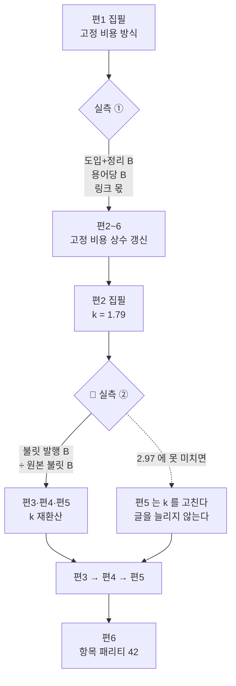

# `java-backend/08-스프링부트-인증-쿠버네티스` 분할 설계 — 원본 1개를 **6편**으로

> 대상: `C:\Users\aeby\vscode\yanadoo-exit\shared\knowledge\java-backend\08-스프링부트-인증-쿠버네티스.md` (**50,917 B**, 읽기 전용)
> 카테고리: `backend-engineering` (현재 37편 → 배치 후 43편)
> 착수: 2026-08-29 · 앞 배치: `2026-08-29-multimodule-kafka-split-design.md`
> 시리즈 슬러그: **`auth-service-on-kubernetes`** (§3-0-a)

> 🔴 **설계는 §9까지 채워졌다. 남은 것은 집필과 §10 마감이다.**
> 앞 배치 설계서 **§10-5 의 12개 규칙**을 먼저 읽고 시작하라 — 그것이 이 문서의 입력이다.
> 이번 배치가 처음 부딪히는 변수는 **불릿**이고, 그 위험은 §3-5 에 모여 있다.

---

## 1. 절차 — 앞 배치가 확립한 순서를 그대로 쓴다

| # | 단계 | 상태 |
| ---: | --- | --- |
| ① | 원본 절별 **성분** 실측 | ✅ **완료** — §2 |
| ② | 편 구성·예산·태그·링크·위험·검증 설계 | ✅ **완료** — §3~§9 |
| ③ | **편1을 먼저 쓰고 실측으로 고정 비용·용어당 B 를 확정** | 미착수 |
| ④ | 🔴 **편2를 쓰고 불릿 비율을 실측해 편3·4·5 를 재환산** | 미착수 — §3-5-b |
| ⑤ | 편마다 검증하고 **즉시 커밋** | 미착수 — §8 · §9-1 |
| ⑥ | `dup-scan` 은 편마다, 그리고 Q&A편 뒤에 배치 전체로 한 번 더 | 미착수 — §8-4 |
| ⑦ | 커밋은 `git commit -m "…" -- <경로>` 형태 | 미착수 |

**앞 배치와 달라진 것은 ④ 하나다.** 앞 배치는 편1 실측 하나로 나머지를 재환산했는데,
이번에는 편1의 불릿 비율을 본편에 쓸 수 없어 재환산 지점이 둘로 나뉜다 — 근거는 §3-5-b 다.

규칙 9(검사기 자기 증명을 먼저)는 이행했다 — `npm run compose:verify` 가 **9/9** 를 낸 뒤에
§2 의 수치를 받았다. **증명 없는 수치는 거짓 수치와 구분되지 않는다.**

### 1-2. 앞 배치 §10-5 가 물려준 12개 규칙의 처리

| # | 규칙 | 이 설계서가 어디서 지켰나 |
| ---: | --- | --- |
| 1 | 본편 목표 비율을 **2.20** 으로 | §3-2 — k=1.79 로 계산하면 겉보기 평균이 2.20 이 된다 |
| 2 | **도입·정리 3,300 B 를 상수로 먼저 빼고** 곱하라 | §3-2 — 예산 공식 자체를 그 형태로 바꿨다 |
| 3 | **겉보기 비율로 편끼리 비교하지 마라** | §3-4 — 겉보기 열은 참고로만 두고 판정은 k 로 한다 |
| 4 | **원본 표의 개수와 합칠 계획을 먼저 적어라** | §3-0 표 개수 실측 · §3-2-b 절별 합칠 계획 |
| 5 | Q&A편 브리프 첫 줄에 **「N항목 밖의 절을 만들지 마라」** | §4-1 편6 행 — 42항목 |
| 6 | Q&A편 밴드 판정은 **링크 몫을 뺀 값**으로 | §3-3 — 294 를 분리해 표에 적었다 |
| 7 | 링크 몫은 **경로 길이 + 4 B** | §3-0-a — 슬러그 길이 + 31 로 정리하고 앞 배치 5건으로 역검증 |
| 8 | 원본과의 축자 겹침은 **사람이 20자 기준으로** | §8-4 — 이번은 대조 단위를 **셀·불릿**으로 바꿨다 |
| 9 | 비율 예측에 **원본 B 축을 쓰지 마라** | §3-2 — k 는 발행 순서 축의 값이다. 다만 §3-4 가 원본 크기의 희석 효과를 별도로 적었다 |
| 10 | 카테고리 간 링크 **집계 스크립트를 설계서에 박아라** | §6-3 — 스크립트를 코드 블록으로 넣고 앞 배치 마감값과 일치를 확인했다 |
| 11 | 지도편의 **도입까지** 형제편이 먼저 읽어라 | §4-2 말미 |
| 12 | Q&A편 발행 커밋에 **형제편 링크 수정을 함께** | §3-0-a 말미 · §9-1 커밋 7 |

12개가 모두 이 문서 안에 자리를 얻었다. 규칙이 살아 있는지는 다음 배치 §10 이 판정한다.

---

## 2. 원본 실측

### 2-1. 절별 성분

`npm run compose -- <원본>` 출력이다.

| 절 | 합계 B | 산문% | 표% | 코드% | 도식% | 불릿% | 인용% | 도식 |
| --- | ---: | ---: | ---: | ---: | ---: | ---: | ---: | ---: |
| (머리말) | 388 | 0.0 | 0.0 | 0.0 | 0.0 | 0.0 | 75.8 | 0 |
| 0. 용어·약어 사전 | 2,108 | 0.2 | 98.3 | 0.0 | 0.0 | 0.0 | 0.0 | 0 |
| 1. 한눈에 보기 | 1,197 | 16.3 | 0.0 | 0.0 | 20.9 | 60.5 | 0.0 | 1 |
| 2. 런칭 프로세스와 산출물 | 2,295 | 19.6 | 43.4 | 0.0 | 12.3 | 20.1 | 0.0 | 1 |
| 3. 인증 도메인 | 4,597 | 22.9 | 40.7 | 0.0 | 11.0 | 20.6 | 0.0 | 1 |
| 4. 요구사항 분석 4종 세트 | 4,710 | 20.1 | 49.1 | 0.0 | 12.6 | 14.7 | 0.0 | 3 |
| 5. 요구사항 명세서 | 4,221 | 8.1 | 72.3 | 0.0 | 0.0 | 5.7 | 10.5 | 0 |
| 6. DB 설계 — 명세서에서 ERD로 | 3,786 | 25.3 | 27.5 | 0.0 | 19.0 | 20.9 | 0.0 | 3 |
| 7. Spring + JPA CRUD API | 2,408 | 0.2 | 36.9 | 30.2 | 7.4 | 19.2 | 0.0 | 1 |
| 8. 인증 구현 — 세션 vs 토큰 | 4,760 | 7.5 | 42.3 | 2.7 | 18.6 | 24.0 | 0.0 | 2 |
| 9. 쿠버네티스 배포 | 4,343 | 0.1 | 29.2 | 16.7 | 17.6 | 30.2 | 0.0 | 2 |
| 10. 롤링 업데이트·프로브·스케일링 | 2,921 | 0.1 | 40.9 | 0.0 | 10.7 | 42.7 | 0.0 | 1 |
| 11. 기능 고도화 | 1,678 | 0.2 | 34.3 | 0.0 | 0.0 | 56.0 | 0.0 | 0 |
| 12. 트레이드오프·장애 시나리오 | 1,965 | 0.2 | 93.9 | 0.0 | 0.0 | 0.0 | 0.0 | 0 |
| 13. 면접 예상 질문 | 8,212 | 0.0 | 45.7 | 0.0 | 0.0 | 53.1 | 0.0 | 0 |
| 14. 경력 연결 포인트 | 1,329 | 0.0 | 59.7 | 0.0 | 0.0 | 37.8 | 0.0 | 0 |
| **합계** | **50,918** | **8.5** | **46.5** | **3.1** | **8.8** | **18.6** | **10.0** | **15** |

도식 4,496 B · 코드 1,580 B · 표 23,676 B

### 2-2. 배정에서 빼는 두 조각 — 1,717 B

| 조각 | B | 빼는 이유 |
| --- | ---: | --- |
| 머리말 | 388 | 원본 문서의 메타 정보다. 발행본에 대응물이 없다 |
| §14 경력 연결 포인트 | 1,329 | **실명 경력**(회사·기간·직책). 어조 자료로만 쓰고 본문에 전사하지 않는다 |

⇒ **배정 원본 49,201 B**

### 2-3. 항목 수 — Q&A편 예산의 입력

| 출처 | 항목 | 세는 방법 |
| --- | ---: | --- |
| §12-1 선택지 비교 | 5 | 표 행 7 − 헤더 2 |
| §12-2 실패 모드 | 8 | 표 행 10 − 헤더 2 |
| §13 기본 질문 | 25 | 표의 `#` 열 |
| §13 난도 높은 문항 | **4** | `**Q.` 로 시작하는 인용 블록 — 07(3개)보다 하나 많다 |
| **합계** | **42** | |

용어 사전(§0)은 **23개**다(표 행 25 − 헤더 2). 07과 우연히 같다.

### 2-4. 🔴 07과 성분이 정반대다 — 산문이 아니라 불릿과 도식이 많다

| 축 | 07 (앞 배치) | 08 (이번) | 무엇이 달라지나 |
| --- | ---: | ---: | --- |
| 배정 원본 B | 38,977 | **49,201** | 코퍼스 관측 구간 **안**이라 외삽 문제가 없다 |
| 산문% | **21.6** (코퍼스 최대) | **8.5** | 원본 문장을 그대로 옮길 위험이 낮다 |
| 불릿% | 1.6 | **18.6** | **처음 보는 비중.** 불릿은 어느 성분으로 부풀지 미관측이다 |
| 도식 수 | 8 | **15** | 도식 비율은 07에서 0.96~1.03 이었다 — 늘 자리가 없는 성분이다 |
| 표% | 50.3 | 46.5 | 비슷하다 |
| 코드% | 2.5 | 3.1 | 비슷하다 |

🔴 **이번 배치가 처음 부딪히는 것은 「불릿」이다.** 여섯 배치의 성분 회귀에 불릿이 유의미한
비중으로 들어온 적이 없다(07은 1.6%). 앞 배치 §10-2-d 가 「옮길 때 늘어날 자리가 구조적으로
없는 성분」으로 코드·도식·인용 셋을 꼽았는데, **불릿이 그 부류인지 산문 부류인지 모른다.**

⇒ 편1 실측에서 **불릿을 따로 세어라.** 불릿이 산문으로 풀리면 비율이 크게 오르고, 불릿로
남으면 1.0 언저리에 머문다. 어느 쪽인지가 이 배치의 예산 정확도를 좌우한다.

---

## 3. 편 구성과 예산

### 3-0. 절 배정 — **6편**

```mermaid
flowchart LR
    subgraph S1["편1 · 지도 — 5,600"]
        A0["§0 용어사전 2,108"]
        A1["§1 한눈에 1,197"]
        A2["§2 런칭 프로세스 2,295"]
    end
    subgraph S2["편2 · 무엇을 만드나 — 9,307"]
        B3["§3 인증 도메인 4,597"]
        B4["§4 요구사항 4종 4,710"]
    end
    subgraph S3["편3 · 명세에서 스키마로 — 8,007"]
        C5["§5 명세서 4,221"]
        C6["§6 DB 설계 3,786"]
    end
    subgraph S4["편4 · 구현 — 7,168"]
        D7["§7 CRUD API 2,408"]
        D8["§8 세션 vs 토큰 4,760"]
    end
    subgraph S5["편5 · 배포와 운영 — 8,942"]
        E9["§9 쿠버네티스 4,343"]
        E10["§10 롤링·프로브 2,921"]
        E11["§11 기능 고도화 1,678"]
    end
    subgraph S6["편6 · 문답 — 10,177"]
        F12["§12 트레이드오프 1,965"]
        F13["§13 면접 문답 8,212"]
    end
    S1 --> S2 --> S3 --> S4 --> S5 --> S6
```



| 편 | 절 | 원본 B | 표 | 도식 | 예산 방식 |
| :---: | --- | ---: | ---: | ---: | --- |
| 1 | §0 · §1 · §2 | 5,600 | 2 | 2 | **고정 비용** (§3-1) |
| 2 | §3 · §4 | 9,307 | 8 | 4 | 비율 밴드 (§3-2) |
| 3 | §5 · §6 | 8,007 | 7 | 3 | 비율 밴드 (§3-2) |
| 4 | §7 · §8 | 7,168 | 6 | 3 | 비율 밴드 (§3-2) |
| 5 | §9 · §10 · §11 | 8,942 | 6 | 3 | 비율 밴드 — 🔴 **불릿 39%** (§3-5) |
| 6 | §12 · §13 | 10,177 | 3 | 0 | **항목 패리티** (§3-3) |
| | **합계** | **49,201** | **32** | **15** | |

표 개수는 규칙 4가 요구한 값이다 — 성분 백분율만 보고 표 예산을 잡으면 앞 배치처럼 251 B 가
빈다. 합칠 계획은 §3-2-b 에 절별로 적었다.

**왜 6편인가** — 셋을 동시에 만족하는 유일한 수다.

| 제약 | 값 | 출처 |
| --- | --- | --- |
| 분량 하한 | 편당 **13,300 B** 이상 | `tests/blog/content/schema.test.ts` `MIN_BYTES` (SOFT) |
| 주제 경계 | 지도 / 요구사항 / 설계 / 구현 / 배포·운영 / Q&A **여섯** | §2-1 절 구조 |
| 배치 총량 | 약 113,000 B | §3-4 |

5편으로 합치면 §7·§8(구현)이 §5·§6(설계)이나 §9~§11(배포)에 흡수된다. 앞은 「스키마를
정하는 판단」과 「그 스키마 위에 인증을 얹는 판단」이 한 편에 섞이고, 뒤는 인증 구현이 배포
이야기에 묻힌다. **§8은 이 원본에서 두 번째로 큰 절(4,760 B)이고 주제가 독립적이다.**

7편으로 쪼개면 §7 CRUD(2,408) 혼자 한 편이 되어 예산이 약 7,600 B — 하한을 **5,700 B
미달**한다. §11(1,678)도 마찬가지다.

### 3-0-a. 슬러그와 링크 몫 — 규칙 7 을 예산에 먼저 넣는다

앞 배치 §10-2-a 의 공식을 이 시리즈에 적용한 값이다. 경로는
`/blog/backend-engineering/<슬러그>/` 이므로 **링크 1건 순증 = 슬러그 길이 + 31 B** 다
(고정 접두 26 + 뒤 슬래시 1 + `[**N**](…)` 순증 4).

| 편 | 슬러그 | 길이 | **링크 1건 순증** |
| :---: | --- | ---: | ---: |
| 1 | `auth-service-launch-map` | 23 | **54** |
| 2 | `auth-domain-and-requirements` | 28 | **59** |
| 3 | `requirements-spec-to-erd` | 24 | **55** |
| 4 | `session-vs-token-authentication` | 31 | **62** |
| 5 | `kubernetes-deployment-and-rollout` | 33 | **64** |
| 6 | `auth-kubernetes-qna` | 19 | **50** |

공식은 앞 배치 다섯 편에서 모두 맞았다(63 · 64 · 66 · 69 · 49 를 슬러그 길이로 역산하면
36 · 37 · 39 · 42 · 22 로 정확히 일치한다). ⇒ 아래 예산표의 링크 몫은 **추정이 아니라 계산값**이다.

편별 링크 몫은 그 편이 **거는** 링크의 합이다.

| 편 | 거는 대상 | 링크 몫 |
| :---: | --- | ---: |
| 1 | 편2·3·4·5·6 (구성 표) | 59+55+62+64+50 = **290** |
| 2 | 편3 (맺음말) | **55** |
| 3 | 편4 | **62** |
| 4 | 편5 | **64** |
| 5 | 편6 | **50** |
| 6 | 편1·2·3·4·5 | 54+59+55+62+64 = **294** |

⚠️ 규칙 12 — 편6 발행 커밋에 **편1·편2·편3·편4·편5 의 링크 수정을 함께 넣는다.** 편6은
마지막 편이라 들어오는 링크가 없어 `links.test.ts` 를 고립 1편으로 떨어뜨린다. 앞 배치에서
편4·편5 두 번 재현됐다.

### 3-1. 편1(지도편) — 고정 비용 방식 · 용어 **23개 전량 승계**

| 성분 | 07 실측 | **08 예산** | 근거 |
| --- | ---: | ---: | --- |
| frontmatter | 759 | **760** | 편수·원본과 무관하게 고정 |
| 도입 | 1,973 | **1,950** | 코퍼스 안 |
| 본문 (§1 한눈에 + §2 런칭) | 8,094 | **9,200** | 원본 2,862 → 3,492 (×1.22). 아래 탄력 계산 |
| 용어 정리 (**23개 전량**) | 4,800 (23개) | **4,880** | 23 × 212 B — §3-1-a |
| 시리즈 구성 + 정리 | 3,365 (5편) | **3,970** | 6편. 아래 편수 회귀 |
| 인바운드 링크 몫 | 264 | **290** | §3-0-a — 계산값 |
| **합계** | **19,254** | **21,050** | 겉보기 비율 **3.759** |

**본문 9,200 의 근거** — 지도편 본문은 원본 크기에 비례하지 않는다. 앞 배치 §3-5-a 가
코퍼스 6배치로 잰 값이 「원본 폭 72% 대비 지도편 폭 46%」, 즉 **탄력 0.64** 다.
원본이 ×1.22 커지므로 1.22^0.64 = ×1.136 → 8,094 × 1.136 = 9,193 ≈ **9,200**.

**시리즈 구성 3,970 의 근거** — 06(7편) 4,571 · 07(5편) 3,365 두 점으로 편당 603 B,
상수 350 B 다. 6편이면 350 + 6×603 = **3,968**. 두 점 회귀이므로 편1 실측에서 세 번째 점이
들어오면 다시 푼다.

#### 3-1-a. C-3 검정 — 두 번째 억제 없는 표본

원본 §0 은 **23개**(표 행 25 − 헤더 2)로, 앞 배치와 우연히 같다. **억제가 다시 없다.**

발행 용어당 B 코퍼스(발행 순서): `56 → 114 → 149 → 186 → 207 → 154`(06, 억제로 미달)
`→ 208.7`(07, 억제 없음).

| 값 | 용어당 B | 23개 환산 | 근거 |
| --- | ---: | ---: | --- |
| 밴드 하단 | 205 | 4,720 | 07 실측(208.7) 바로 아래 |
| **목표** | **212** | **4,880** | 207 → 208.7 의 증분(+1.7)보다 넉넉히 위 |
| 밴드 상단 | 235 | 5,410 | 단조 상승이 이어질 경우 |

⚠️ **집필자에게 개수 억제를 지시하지 마라.** 23개를 전부 실어라. 밀도가 밴드를 넘으면
밴드를 고치지 글을 깎지 않는다.

### 3-2. 편2~5(본편) — **고정 비용을 상수로 뺀 뒤 곱한다**

규칙 1(목표 비율 2.20)과 규칙 2(도입·정리 3,300 을 먼저 빼라)는 그대로 겹쳐 쓸 수 없다.
2.20 은 **겉보기** 비율이고, 3,300 을 뺀 뒤에 곱할 값은 **고정 비용 뺀** 비율이기 때문이다.
둘을 동시에 만족시키는 형태는 하나뿐이다.

> **목표 B = 3,300 + 원본 B × k + 링크 몫**, k = **1.79**

k 는 앞 배치 본편 셋의 고정 비용 뺀 비율 **1.763 · 1.914 · 1.698** 의 산술평균이다.
이 형태로 계산하면 겉보기 비율이 원본 크기에 따라 2.15~2.26 으로 흩어지고 **평균이 2.20** 이
된다 — 규칙 1 이 말한 값이 자동으로 나온다.

| 편 | 원본 B | 3,300 + 원본×1.79 | +링크 | **목표 B** | 겉보기 | 밴드 (k 1.65~1.93) |
| :---: | ---: | ---: | ---: | ---: | ---: | --- |
| 2 | 9,307 | 19,960 | 55 | **20,015** | 2.151 | 18,710 ~ 21,320 |
| 3 | 8,007 | 17,633 | 62 | **17,695** | 2.210 | 16,570 ~ 18,820 |
| 4 | 7,168 | 16,131 | 64 | **16,195** | 2.259 | 15,190 ~ 17,200 |
| 5 | 8,942 | 19,306 | 50 | **19,356** | 2.165 | 18,100 ~ 20,610 |

밴드 폭 k ± 0.14 는 앞 배치 실측 셋(1.698 ~ 1.914)을 감싸는 최소 폭이다.

#### 3-2-a. 이번에는 하한 제약에 걸리는 편이 없다

앞 배치는 편4 밴드 하단이 `MIN_BYTES` 를 밑돌아 그 편만 비율을 다시 잡아야 했다(§3-2-b).
이번에는 가장 작은 편4의 밴드 하단조차 **15,190 B** 로 하한보다 1,890 B 위다.

| 편 | 밴드 하단 | 하한까지 여유 |
| :---: | ---: | ---: |
| 2 | 18,710 | +5,410 |
| 3 | 16,570 | +3,270 |
| 4 | **15,190** | **+1,890** |
| 5 | 18,100 | +4,800 |

⇒ **집필 브리프에 반려선을 따로 적을 필요가 없다.** 다만 하한이 SOFT 게이트(보고만 하고
실패시키지 않는다)라는 사실은 변하지 않으므로, §8-1 ⑦ 의 바이트 확인은 편마다 그대로 한다.

#### 3-2-b. 표를 합칠 계획 — 규칙 4

앞 배치에서 표 비율이 0.92 ~ 1.69 로 흩어진 원인은 성분의 성질이 아니라 **표를 합칠 것인가
그대로 옮길 것인가**라는 집필 판단이었다. 그래서 절마다 미리 정한다.

| 편 | 원본 표 | 합칠 계획 | 예상 표 비율 |
| :---: | ---: | --- | ---: |
| 2 | 8 | §3 의 SSO·OAuth·SAML·App2App·JWT **5표를 「인증 방식 비교」 1표로 합친다.** §4 의 3표는 4종 세트가 서로 다른 산출물이라 그대로 | **≈ 1.05** |
| 3 | 7 | §5 의 「기능적 요구사항 → API 매핑」과 §6-2 「엔티티 식별」은 **같은 표를 두 단계로 읽는 것**이라 하나로 합쳐 열을 늘린다. 나머지 5표는 유지 | **≈ 1.20** |
| 4 | 6 | §8-1 세션 vs 토큰 비교표에 §8-2 회전 정책의 「왜」 열을 붙인다. 코드 골격 표는 그대로 | **≈ 1.15** |
| 5 | 6 | §9-2 오브젝트 역할 비교와 §10-1 배포 전략 비교는 축이 달라 합치지 않는다. **6표 전부 유지** | **≈ 1.30** |

편5의 표 비율만 높게 잡은 것은 합치지 않기 때문이다. 표를 합치면 행이 줄어 총량이 내려간다.

### 3-3. 편6(Q&A편) — 항목 패리티 · **C-2 6점 재회귀**

**항목 수 42** 는 §2-3 에서 실측했다(§12-1 5 · §12-2 8 · §13 기본 25 · 난도 4).

**항목당 B — 원본 B 축 회귀에 07 실측을 6번째 점으로 넣었다**

| 발행본 | 원본 B | 항목 | 항목당 B |
| --- | ---: | ---: | ---: |
| `kafka-notification-qna` | 40,862 | 44 | **439.2** ← 07, 새로 들어온 점 |
| `spring-batch-qna` | 48,950 | 45 | 454.2 |
| `websocket-realtime-qna` | 58,503 | 46 | 465.2 |
| `database-scaling-qna` | 71,139 | 59 | 495.8 |
| `database-fundamentals-qna` | 72,618 | 55 | 478.6 |
| `cicd-qna` | 83,251 | 58 | 503.3 |
| **08 (이번)** | **49,201** | **42** | **?** |

6점 최소제곱: 기울기 **0.0014896 B/B** · 절편 **379.54** · **r = 0.967**.
49,201 에서 **452.83**.

🔴 **착수본이 예고한 「5점 기울기로는 약 456」은 어림이 틀렸다.** 5점 회귀를 절편까지 제대로
풀면 49,201 에서 **453.85** 다. 6점 값(452.83)과의 차는 1.0 B — 새 점이 회귀선 위에 거의
그대로 얹혔다는 뜻이고, 이는 하향 외삽이었던 07 예측(441.8 → 실측 439.2)이 맞았다는
사실과 같은 이야기다.

| 값 | 항목당 B | 42항목 환산 | +링크 294 | 근거 |
| --- | ---: | ---: | ---: | --- |
| 밴드 하단 | 430 | 18,060 | 18,354 | 07 실측(439.2) 아래 |
| **목표** | **452.8** | **19,019** | **19,313** | 6점 회귀 |
| 밴드 상단 | 475 | 19,950 | 20,244 | 관측(454.2~465.2) 안 |

🔴 **밴드 판정은 링크 294 를 뺀 값으로 한다**(규칙 6). 항목당 B 는 분자에 링크가 섞이면
축이 오염된다. 앞 배치가 19,602 에서 278 을 빼 19,324 로 판정한 것과 같다.

⚠️ 이번 원본은 코퍼스 관측 구간(40,862 ~ 83,251) **안**이다. 외삽이 아니므로 밴드를 앞
배치처럼 넓힐 이유가 없다 — −5%/+5% 로 대칭이다.

⚠️ 그리고 편6은 **본편이 아니다.** 비율(19,313 ÷ 10,177 = **1.90**)을 편2~5 와 나란히 놓고
「낮다」고 판단하지 마라. 축이 다르다.

### 3-4. 배치 총량

| 편 | 목표 B | 겉보기 비율 |
| :---: | ---: | ---: |
| 1 지도 | 21,050 | 3.759 |
| 2 무엇을 만드나 | 20,015 | 2.151 |
| 3 명세에서 스키마로 | 17,695 | 2.210 |
| 4 구현 | 16,195 | 2.259 |
| 5 배포와 운영 | 19,356 | 2.165 |
| 6 Q&A | 19,313 | 1.898 |
| **합계** | **113,624** | **2.309** |

지도편 지분은 **18.5%** 로 코퍼스(12.3 ~ 25.2%) 한가운데다. 앞 배치 실측 배치 비율이
2.337 이었으므로 이번 설계값 2.309 는 그보다 한 눈금 아래다 — 원본이 26% 커져 고정 비용
지분이 희석된 결과이고, C-1 이 예측하는 방향(발행 순서가 늦을수록 비율 상승)과는 반대다.
**§10-0 에서 반드시 이 점을 판정하라.**

### 3-5. 🔴 이번 배치의 새 변수는 **불릿**이다 — 편5·편6은 원본에 산문이 없다

착수본 §2-4 가 지목한 위험의 실제 모양이다. 절별 백분율을 편별로 환산하면 이렇다.

| 편 | 원본 B | 산문 | 표 | 코드 | 도식 | **불릿** | 인용 | 불릿 지분 |
| :---: | ---: | ---: | ---: | ---: | ---: | ---: | ---: | ---: |
| 1 | 5,600 | 649 | 3,068 | 0 | 532 | **1,185** | 0 | 21.2% |
| 2 | 9,307 | 1,999 | 4,184 | 0 | 1,099 | **1,639** | 0 | 17.6% |
| 3 | 8,007 | 1,300 | 4,093 | 0 | 719 | **1,032** | 443 | 12.9% |
| 4 | 7,168 | 362 | 2,902 | 856 | 1,064 | **1,605** | 0 | 22.4% |
| 5 | 8,942 | **11** | 3,038 | 725 | 1,077 | **3,499** | 0 | **39.1%** |
| 6 | 10,177 | **4** | 5,598 | 0 | 0 | **4,361** | 0 | **42.9%** |

**편5와 편6의 원본 산문은 각각 11 B 와 4 B 다 — 사실상 0이다.**

앞 배치 §10-2-d 가 세운 모델은 「표·코드·도식·인용은 1.0 언저리로 수렴하고 **비율을 움직이는
것은 산문 하나뿐**」이었다. 그 모델은 08 편5·편6 에서 **분모가 없어 작동하지 않는다.**
목표 B 를 채우려면 그 몫이 전부 불릿에서 나와야 한다.

#### 3-5-a. 편5 예산이 요구하는 불릿 비율은 **2.97** 이다

편5 목표 19,356 에서 고정 비용 3,300 과 링크 50 을 빼면 본문 몫이 16,006 B 다.
다른 성분에 앞 배치 실측 비율을 그대로 주면 남는 몫이 불릿에 떨어진다.

| 성분 | 원본 B | 적용 비율 | 발행 B |
| --- | ---: | ---: | ---: |
| 표 | 3,038 | 1.25 (§3-2-b) | 3,798 |
| 코드 | 725 | 0.95 | 689 |
| 도식 | 1,077 | 1.00 | 1,077 |
| 산문 | 11 | 3.40 | 37 |
| **불릿** | **3,499** | **← 나머지** | **10,405** |
| **본문 합계** | | | **16,006** |

⇒ **불릿 비율 2.97 이 나와야 예산이 맞는다.** 이 값에는 근거가 없다. 여섯 배치의 성분
회귀에 불릿이 유의미한 비중으로 들어온 적이 없기 때문이다(07은 1.6%).

가늠할 수 있는 것은 인접 사례 하나뿐이다. 앞 배치 편5의 표 비율 **1.693** 은 §13 표 25행의
「핵심 답변 뼈대」가 **명사구 나열**이라 완결된 문장으로 풀면 행당 158 B 가 227 B 가 된
결과였다. 불릿도 명사구 나열이라는 점에서 같은 부류로 보이고, 그렇다면 값은 **1.7 언저리**다.

**불릿이 1.7 이면 편5는 이렇게 된다.**

| | 목표 | 불릿 1.7 일 때 |
| --- | ---: | ---: |
| 불릿 발행 B | 10,405 | 5,948 |
| 본문 합계 | 16,006 | 11,549 |
| **편5 전체** | **19,356** | **14,899** |
| 겉보기 비율 | 2.165 | **1.666** |
| `MIN_BYTES` | | 통과 (+1,599) |

하한은 넘지만 목표를 **−23%** 로 밑돈다. 밴드 하단(18,100)에도 3,201 B 미달이다.

#### 3-5-b. ⇒ 재환산 지점을 **둘**로 늘린다

앞 배치는 편1 실측 하나로 나머지를 재환산했다. 이번에는 그것으로 부족하다 —
**편1의 불릿 비율은 본편에 쓸 수 없기 때문**이다. 지도편 본문은 원본에 대응물이 없는 서술을
많이 포함해 겉보기 비율이 3.76 이고, 성분 축으로 재면 불릿 비율이 4를 넘는 값이 나온다.
그것은 불릿의 성질이 아니라 지도편의 성질이다.



| 지점 | 무엇을 확정하나 | 무엇을 재환산하나 |
| --- | --- | --- |
| **편1 발행 뒤** | 고정 비용(도입+정리) · 용어당 B · 링크 몫 공식 | 편2~6 의 고정 비용 상수 3,300 |
| 🔴 **편2 발행 뒤** | **불릿 비율** — 본편 첫 표본 | **편3·편4·편5 의 k** |

편2를 기준점으로 고르는 이유는 셋이다: 본편 중 첫 편이고, 불릿 지분 17.6% 로 07(1.6%)과
08 편5(39.1%) 사이에 있으며, 산문 1,999 B 가 남아 있어 **두 축을 같은 편에서 동시에 잴 수
있다.** 편3·편4는 그 값을 받아 쓰고, 편5는 필요하면 k 자체를 바꾼다.

⚠️ **편5의 예산이 밴드를 벗어나면 글을 늘리지 말고 k 를 고쳐라.** 불릿 비율이 2.97 이 아닌
것은 집필의 실패가 아니라 관측이다. 앞 배치 §10-2-f 가 「원본에 대응물이 없는 절을 새로
써서」 값을 부풀린 자리와 정확히 같은 함정이다 — 그때는 897 B 짜리 절 하나가 항목당 B 를
464.8 로 밀어 올렸다.

---

## 4. 편별 상세

| 편 | 제목 방향 | 여는 질문 | 닫는 문장이 넘겨줄 것 |
| :---: | --- | --- | --- |
| 1 | 사내 인증 서비스를 처음부터 배포까지 | 「요구사항 문서가 어떻게 배포된 서비스가 되나」 | 다섯 편이 각각 어느 단계를 맡는지 |
| 2 | 인증 도메인과 요구사항 — 무엇을 만들 것인가 | 「인증과 인가는 무엇이 다른가」 | 요구사항이 명세로 굳는 자리 |
| 3 | 명세에서 스키마로 — 요구사항 표가 ERD가 되는 과정 | 「API 표에서 엔티티를 어떻게 뽑나」 | 스키마 위에 무엇을 얹을 것인가 |
| 4 | 세션이냐 토큰이냐 — 인증 구현의 갈림길 | 「무엇을 포기하고 무엇을 얻나」 | 만든 것을 어떻게 띄울 것인가 |
| 5 | 쿠버네티스 배포와 무중단 운영 | 「띄운 뒤에 무엇이 바뀌나」 | 이 판단들에 되돌아오는 질문 |
| 6 | 되돌아오는 질문들 — 인증 서비스 설계 문답 | 「고를 때 · 터졌을 때 · 설명해야 할 때」 | — |

### 4-1. 편별 주제 경계 — 넘지 말아야 할 선

| 편 | 다루는 것 | **다루지 않는 것** |
| :---: | --- | --- |
| 1 | 용어 · 전체 지도 · 단계별 산출물 | 어떤 판단도 **결론까지 끌고 가지 않는다.** 각 편이 답한다 |
| 2 | 인증 방식의 종류와 선택 기준 · 요구사항 산출물 4종 | **구현**(§8)과 **스키마**(§6). 편3·편4의 몫 |
| 3 | 명세서 · ERD · 매핑 테이블 · 권한 검사 흐름 | **Spring 코드**(§7). 편4의 몫 |
| 4 | 계층 구조 · DTO 분리 · 세션/토큰 · BCrypt · 필터 체인 | **배포 형태**(ConfigMap·Secret). 편5의 몫 |
| 5 | 클러스터 구조 · 이미지 → 레지스트리 → 배포 · 프로브 · 스케일링 · 변경 대응 | **인증 로직 자체**. 편4가 이미 답했다 |
| 6 | 42항목의 재구성 | 🔴 **42항목 밖의 절을 만들지 마라** (규칙 5) |

### 4-2. 🔴 낱말이 편을 가로지르는 자리 — 편1이 먼저 정한다

| 낱말 | 편마다 다른 뜻 | 편1 용어 정리에서 확정할 것 |
| --- | --- | --- |
| **역할(role)** | 편3에서는 `role` **테이블 행**, 편4에서는 Spring Security 의 `ROLE_` 권한 문자열, 편5에서는 조직 개편에 따라 바뀌는 **정책 단위** | 세 층이 같은 낱말을 쓴다는 것을 편1이 먼저 밝힌다 |
| **토큰** | 편4에서는 Access/Refresh **JWT**, 편2에서는 OAuth 의 **위임 자격증명** | 편2의 토큰은 「남의 자원에 접근할 권한」, 편4의 토큰은 「내가 누구인지의 증명」 |
| **세션** | 편4에서는 서버 저장소에 놓인 **인증 상태**, 편5에서는 파드가 죽으면 사라지는 **상태 있음** | 편5의 「무상태」 논의가 편4의 선택을 되짚는 자리다 |
| **매핑 테이블** | 편3에서는 `role_api_mapping` **스키마**, 편5(§11)에서는 배포 없이 정책을 바꾸는 **운영 수단** | 같은 표가 설계 결정이자 운영 수단이라는 것 |
| **프로브** | 편5 안에서만 쓰이지만 Liveness 와 Readiness 가 **정반대 실패 대응**을 부른다 | 편1은 이름만 놓고, 구분은 편5가 한다 |

⚠️ **「인증」과 「인가」를 편1 도입에서 섞어 쓰지 마라.** 원본 §3-1 이 이 구분으로 시작하고,
편2 전체가 그 구분 위에 서 있다. 편1 도입이 뭉뚱그리면 편2가 그 문장을 다시 써야 한다.

⚠️ 규칙 11 — 편2~6 집필자는 편1의 **예고 문단만이 아니라 도입까지** 먼저 읽는다. 앞 배치에서
축자 중복 1건이 편1 **도입**에서 나왔다.

---

## 5. 태그

`content/blog/tags.ts` 는 **닫힌 집합**이다. 변환자는 목록 밖 문자열을 쓰지 않는다.

| 편 | 태그 | 패싯 검사 |
| :---: | --- | --- |
| 1 | `terminology` · `authentication` · `kubernetes` · `spring` | F1 · B1 · A2 ✅ |
| 2 | `authentication` · `security` · `prd` · `java` | B2 · D1 · A1 ✅ |
| 3 | `database` · `api-design` · `prd` · `spring` | B2 · D1 · A1 ✅ |
| 4 | `spring` · `java` · `authentication` · `security` | A2 · B2 ✅ |
| 5 | `kubernetes` · `docker` · `deployment` · `scalability` | A2 · B2 ✅ |
| 6 | `authentication` · `troubleshooting` · `kubernetes` · `spring` | B2 · A2 ✅ |

규칙: 문서당 4개(허용 3~5) · **같은 패싯 최대 2개** · 카테고리 슬러그와 중복 금지.

⇒ **새 태그 후보 0건.** `jwt` · `oauth` · `rbac` 가 후보로 떠올랐으나 셋 다 조건 ②(2편 이상이
서로 다른 카테고리)를 못 넘는다 — 이 카테고리 전용이 된다. `authentication` · `security`
두 태그가 상위 개념으로 전부 덮으므로 조건 ③도 못 넘는다.

---

## 6. 링크 구조

### 6-1. 시리즈 내부

| 편 | 나가는 링크 |
| :---: | --- |
| 1 | 편2·3·4·5·6 전부 (구성 표) |
| 2 | 편3(명세로 넘김) · 편1(되돌아감) |
| 3 | 편4 · 편2 |
| 4 | 편5 · 편3 |
| 5 | 편6 · 편4 |
| 6 | 편1~5 각 1회 이상 |

링크 몫은 §3-0-a 에서 **예산 안에 이미 들어 있다.** 마감에서 다시 더하지 마라.

### 6-2. 나가는 카테고리 간 링크 (목표 **3건 이상**)

앞 배치는 카테고리 **밖**으로 나가는 링크가 설계상 1건이었다. 이번 원본은 요구사항·배포라는
두 축이 다른 카테고리와 자연스럽게 닿으므로 목표를 올린다.

| 편 | 대상 | 카테고리 밖 | 걸 자리 |
| :---: | --- | :---: | --- |
| 2 | `ai-transformation/sdlc-human-gates` | ✅ | §4 요구사항 산출물이 게이트가 되는 대목 |
| 3 | `backend-engineering/sql-execution-and-indexes` | — | §6-4 최종 스키마의 인덱스 판단 |
| 4 | `backend-engineering/transactions-and-concurrency-control` | — | §8-2 Refresh Token 회전의 경합 |
| 5 | `agentic-coding/empty-folder-to-deploy` | ✅ | §9-4 이미지 → 레지스트리 → 배포 |
| 6 | `ai-agent/code-execution-sandbox-limits` | ✅ | §12 격리 수준의 트레이드오프 |

카테고리 밖으로 나가는 링크는 편2·편5·편6 셋이다. **집필 브리프에 편별로 대상 슬러그를
그대로 적어라** — 변환자는 자기 편만 보므로 어디에 무엇이 있는지 모른다.

### 6-3. 들어오는 링크 — 규칙 10, **집계 스크립트를 여기 박는다**

앞 배치 §10-3 이 「값만 옮겨 적으면 다음 배치가 증감을 계산할 수 없다」고 지적한 자리다.
아래 명령이 이 표를 만든 것이고, 배치 마감에서 **같은 명령을 다시 돌린다.**

```bash
for c in $(ls content/blog | grep -v '\.'); do
  out=$(grep -rho "](/blog/[a-z-]*/" content/blog/$c --include='*.md' \
        | sed 's#](/blog/##; s#/$##' | grep -v "^$c$" | wc -l)
  inn=$(grep -rho "](/blog/$c/" content/blog --include='*.md' | wc -l)
  own=$(grep -rho "](/blog/$c/" content/blog/$c --include='*.md' | wc -l)
  echo -e "$c\t나감 $out\t들어옴 $((inn-own))\t편수 $(ls content/blog/$c/*.md | wc -l)"
done
```

**2026-08-29 배치 착수 시점 실측**

| 카테고리 | 나감 | 들어옴 | 편수 |
| --- | ---: | ---: | ---: |
| `agentic-coding` | 12 | 47 | 31 |
| `ai-agent` | 41 | 48 | 51 |
| `ai-transformation` | 72 | **2** | 11 |
| **`backend-engineering`** | **11** | **3** | **37** |
| `rag` | 20 | 52 | 25 |
| `search-engineering` | 1 | 5 | 6 |

이 값은 앞 배치 §10-3 의 마감 실측(나감 11 · 들어옴 3)과 **정확히 일치한다.** ⇒ 스크립트가
같은 규칙으로 세고 있음이 확인됐다. §6-3 과 §10-3 이 1건 어긋났던 앞 배치의 문제는 여기서
끝난다.

**37편에 진입로가 셋이다.** 이번 배치가 끝나면 43편이 되므로 손 놓으면 다시 나빠진다.
검사기(`links.test.ts`)는 「한 방향이라도 0인가」만 본다.

| 수정할 글 | 걸 링크 | 근거 |
| --- | --- | --- |
| `agentic-coding/deploy-checklist-debugging` | → 편5 | 배포 실패의 원인 분류가 프로브·롤아웃과 같은 문제다 |
| `ai-agent/code-execution-sandbox-limits` | → 편5 또는 편1 | 컨테이너 격리 수준이 같은 축이다 |
| `ai-transformation/sdlc-human-gates` | → 편2 | 편2가 이 글로 나가므로 상호 연결이 된다 |

⚠️ 수정은 **해당 편 발행 뒤 별도 커밋**으로 한다. 기존 발행본을 고치면 그 편의 바이트가
늘어나므로, 밴드를 이미 넘긴 편은 피한다.

---

## 7. 이 원본 특유의 위험

| # | 위험 | 왜 이 원본인가 | 대응 |
| :---: | --- | --- | --- |
| ① | 🔴 **불릿 18.6%** — 코퍼스 미관측 성분 | 편5 39% · 편6 43%. 예산이 요구하는 비율 2.97 에 근거가 없다 | §3-5. 편2 실측으로 재환산 |
| ② | **편5·편6은 원본 산문이 0** | 앞 배치 모델의 유일한 설명 변수가 분모에서 사라진다 | §3-5-a. k 를 고치되 글을 늘리지 않는다 |
| ③ | **도식 15개** — 앞 배치의 두 배 | 도식 비율은 늘 1.0 언저리라 **늘어날 자리가 없다.** 4,496 B 가 예산에서 고정된다 | 도식을 산문으로 풀어 설명하지 마라. §3-2-b 의 표 계획과 같은 이유 |
| ④ | **산문 8.5%** — 코퍼스 최소 | 원본 문장을 그대로 옮길 위험은 **낮다**. 앞 배치(21.6%)와 정반대 | 그래도 `dup-scan` 은 편마다. §8-3 |
| ⑤ | **§13 이 53% 불릿** | 표 45.7% 와 합쳐 99%. 모범답변 인용이 앞 배치와 달리 **없다**(난도 문항 4개는 인용) | 편6은 불릿을 문장으로 푸는 작업이 대부분이다 |
| ⑥ | **「역할」이 세 층에서 다른 뜻** | 테이블 행 · Security 권한 문자열 · 정책 단위 | §4-2. 편1 용어 정리에서 확정 |
| ⑦ | **§14 실명 경력** | 회사명·기간·직책 | §2-2. 어조 자료로만, 본문 전사 금지 |
| ⑧ | **`role` frontmatter 키** | `"map"` 하나만 허용된다. 편6에 적으면 **빌드가 죽는다** | 지도편(편1)에만 |
| ⑨ | **편수가 6으로 늘었다** | 앞 배치는 5편. 편1 「시리즈 구성」 예산이 두 점 회귀의 외삽이다 | 편1 실측에서 세 번째 점을 얻어 다시 푼다. §3-1 |

### 7-1. frontmatter 고정값

| 키 | 값 | 근거 |
| --- | --- | --- |
| `category` | `"backend-engineering"` | |
| `date` | `"2026-07-26"` | **원본 작성 기준일.** 37편이 예외 없다 |
| `updated` | 발행일 | |
| `series` | `"auth-service-on-kubernetes"` | |
| `seriesOrder` | 1~6 | |
| `role` | `"map"` — **편1에만** | 위험 ⑧ |

---

## 8. 검증

### 8-1. 편마다 (발행 전)

| # | 명령 | 판정 |
| ---: | --- | --- |
| ① | `npm run check-forbidden:verify` | 자기 증명 통과 |
| ② | `npm run check-forbidden` | **HARD 0건** |
| ③ | `npm run dup-scan:verify` | 자기 증명 통과 |
| ④ | `npm run dup-scan -- --category backend-engineering` | **건수를 사람이 읽는다** |
| ⑤ | `npm test` | 초록 |
| ⑥ | `npx tsc --noEmit` | 초록 (vitest 는 타입을 검사하지 않는다) |
| ⑦ | `git cat-file -p HEAD:<경로> \| wc -c` | 밴드 안 |

🔴 ④는 **자문 도구라 발견이 있어도 exit 0** 이다. 종료 코드로 판정하지 마라.
🔴 ⑦은 `wc -c` 를 디스크 파일에 쓰지 마라. `core.autocrlf=true` 라 줄 수만큼 크게 나온다.
🔴 ④의 출력은 카테고리 전체 누적이라 수백 건이 쏟아진다. **파일로 리다이렉트한 뒤
`grep '<슬러그>'`** 로 이번 편 것만 본다.

### 8-2. 편마다 (발행 뒤) — 성분 실측

앞 배치가 편마다 성분을 재서 「깎을 곳」을 찾아낸 절차다. 이번에는 **불릿 축이 하나 더 붙는다.**

| 잴 것 | 왜 |
| --- | --- |
| 도입 + 정리 B | 고정 비용 3,300 상수가 맞는지 |
| **불릿 발행 B ÷ 원본 불릿 B** | 🔴 이번 배치의 새 변수. 편2 값이 편3·4·5 를 재환산한다 |
| 표 · 코드 · 도식 · 산문 비율 | 앞 배치와 같은 축 |

⚠️ **초과가 났을 때 표부터 깎지 마라.** 앞 배치 편4는 초과가 전부 산문과 도입·정리에 있었고
표는 오히려 0.92 였다. 성분을 재기 전에 깎으면 엉뚱한 데를 깎는다.

### 8-3. 리뷰 브리프에 넣을 규칙

| 규칙 | |
| --- | --- |
| 처방마다 ±B 를 적어라 | 추정이 아니라 **제안한 문안을 실제로 세어서** |
| 순증 처방에는 같은 절에서 **뺄 자리를 함께 지목**하라 | 「늘려라」만 있고 「줄여라」가 없으면 채택 불가 |
| **내 축 순증 합계를 보고 첫머리에** | 축 사이의 합산은 컨트롤러가 한다 |
| **조건부 처방도 표 안에** | 「~하면 함께 고쳐야 한다」도 조건 성립 시의 ±B 와 함께 |
| 처방 반영 뒤 **그 편 전체**를 훑어라 | 수·이름·순서가 갈리지 않는지 |
| 두 리뷰어가 같은 줄에 서면 **표로 갈라라** | 배타가 아니라 각자 반쪽일 수 있다 |

⚠️ 리뷰어는 `Write` 도구가 없다. 브리프에 **보고 파일 경로와 heredoc 작성**을 명시하지 않으면
유휴 상태가 된다. 유휴 알림이 오면 메시지가 아니라 **파일로 판단**하라.

### 8-4. dup-scan 순서와 원본 대조

`dup-scan` 은 편마다 한 번, 그리고 **편6 발행 뒤 배치 전체로 한 번 더** 돌린다.

🔴 규칙 8 — `dup-scan` 은 **발행본끼리만** 본다. **원본과의 축자 겹침은 사람이 20자 기준으로
대조한다.** 앞 배치 편5에서 20자 초과 2건이 이 방법으로만 잡혔다.

이번 원본은 산문 8.5% 로 코퍼스 최소라 위험이 낮지만, **표 46.5% 와 불릿 18.6% 는 그대로
옮기기 쉬운 성분**이다. 겹침의 모양이 문장이 아니라 **표의 셀과 불릿 한 줄**로 나타난다.
⇒ 대조 단위를 문장이 아니라 **셀·불릿 항목**으로 잡아라.

---

## 9. 산출물

| 종류 | 개수 | 경로 |
| --- | ---: | --- |
| 신규 발행본 | **6** | `content/blog/backend-engineering/` |
| 기존 발행본 수정 (인바운드) | 3 | `agentic-coding/` 2편 · `ai-transformation/` 1편 — §6-3 |
| 시리즈 등록 | 1 | `auth-service-on-kubernetes` |
| 새 태그 | **0** | §5 |
| 카테고리 편수 | 37 → **43** | `README.md` · `CHANGELOG.md` |

⚠️ `npm run check-counts` 는 README 3자리와 CHANGELOG 편수가 실제와 어긋나면 잡는다.
마감 전에 반드시 돌려라.

### 9-1. 커밋 단위

| # | 커밋 | 포함 |
| ---: | --- | --- |
| 1 | 편1 발행 | 편1 `.md` + README·CHANGELOG |
| 2 | 설계서 갱신 | 편1 실측 → §10-2 · 편2~6 재환산 |
| 3~6 | 편2~5 발행 | 각 편 `.md` + 앞 편 링크 수정 |
| 7 | 편6 발행 | 편6 `.md` + **편1~5 링크 수정 5건** (규칙 12) |
| 8 | 인바운드 링크 | 타 카테고리 3편 수정 |
| 9 | 배치 마감 | 설계서 §10 · HANDOFF |

커밋은 `git commit -m "…" -- <경로>` 형태로 경로를 명시한다. 병렬 에이전트가 도는 동안
`git add .` 는 남의 작업을 함께 집어삼킨다.

---

## 10. 배치 완료 — 실측과 회고

*(배치 종료 시 작성. 다음 배치는 이 절을 **표만이 아니라 문단째** 읽어라.)*

### 10-0. 🔴 배치가 끝나면 반드시 이 표를 채워라

| 가설 | 예측 | 실측 | 판정 |
| --- | ---: | ---: | :---: |
| **C-1** 본편 비율은 발행 순서로 커진다 | ≥ 2.20 (앞 배치 평균 2.229) | | |
| **C-2** Q&A 항목당 B 는 원본 B 로 커진다 | **452.8** (6점 회귀, 구간 안) | | |
| **C-3** 지도편 용어당 B 는 단조 상승한다 | **≥ 209** (억제 없는 두 번째 표본) | | |
| **C-4** 비율은 성분이 아니라 **옮기는 방식**에 갈린다 | 표 1.05~1.30 (§3-2-b 계획대로) | | |
| 🔴 **C-7 불릿은 산문 부류인가 명사구 부류인가** | 산문 부류면 ≈2.97, 명사구 부류면 ≈1.7 | | |
| **C-8** 고정 비용 3,300 은 편수·원본과 무관한 상수인가 | 6편 전부 3,000~3,600 | | |

**C-7 이 이번 배치의 주된 관측이다.** 앞 배치가 「비율을 움직이는 것은 산문 하나뿐」이라는
모델을 세웠는데, 이번 원본의 편5·편6 에는 산문이 없다. 불릿이 그 자리를 대신하는지가
다음 배치의 예산 모델을 정한다.

⚠️ **배치 겉보기 비율 2.309 는 앞 배치 실측 2.337 보다 낮다.** C-1(발행 순서가 늦을수록
비율 상승)과 방향이 반대이므로, 실측이 어느 쪽으로 나오든 §10-0 에 **원본이 26% 커져
고정 비용 지분이 희석된 효과**를 함께 적어라. 하나만 적으면 다음 배치가 잘못된 상수를
물려받는다.
