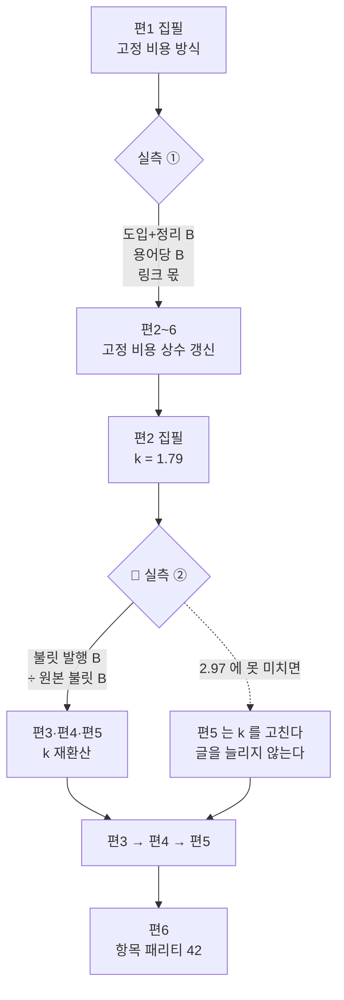
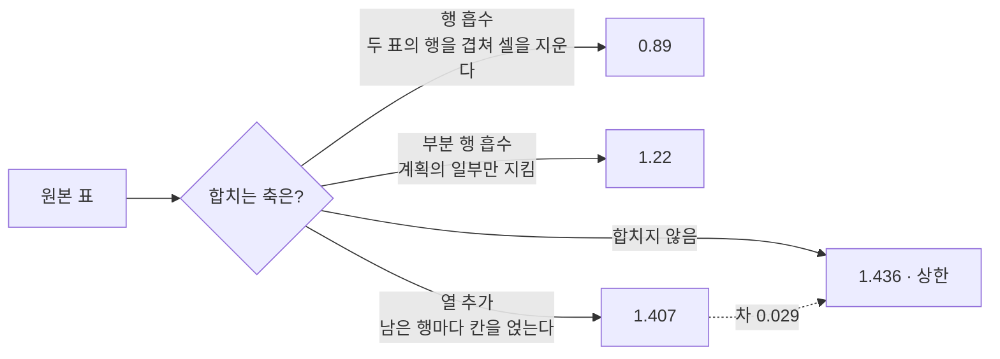
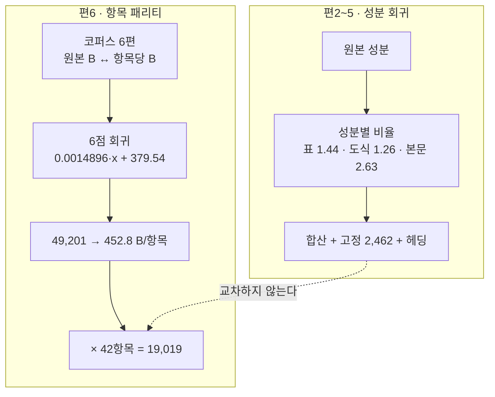
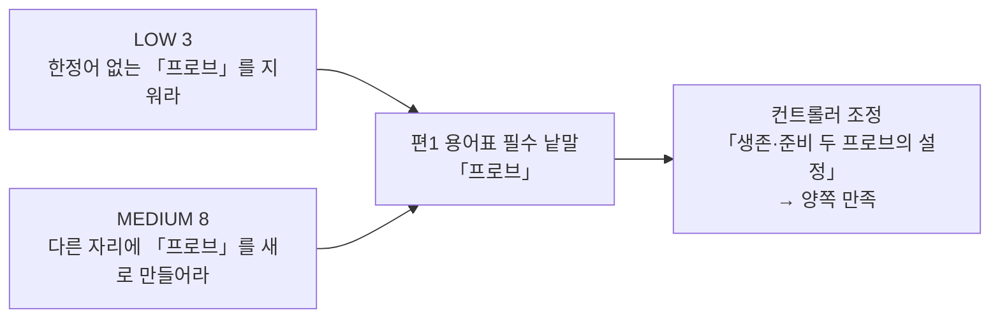

# `java-backend/08-스프링부트-인증-쿠버네티스` 분할 설계 — 원본 1개를 **6편**으로

> 대상: `C:\Users\aeby\vscode\yanadoo-exit\shared\knowledge\java-backend\08-스프링부트-인증-쿠버네티스.md` (**50,917 B**, 읽기 전용)
> 카테고리: `backend-engineering` (현재 37편 → 배치 후 43편)
> 착수: 2026-08-29 · 앞 배치: `2026-08-29-multimodule-kafka-split-design.md`
> 시리즈 슬러그: **`auth-service-on-kubernetes`** (§3-0-a)

> 🔴 **설계는 §9까지 채워졌다. 남은 것은 집필과 §10 마감이다.**
> 앞 배치 설계서 **§10-5 의 12개 규칙**을 먼저 읽고 시작하라 — 그것이 이 문서의 입력이다.
> 이번 배치가 처음 부딪히는 변수는 **불릿**이고, 그 위험은 §3-5 에 모여 있다.

---

## 1. 절차 — 앞 배치가 확립한 순서를 그대로 쓴다

| # | 단계 | 상태 |
| ---: | --- | --- |
| ① | 원본 절별 **성분** 실측 | ✅ **완료** — §2 |
| ② | 편 구성·예산·태그·링크·위험·검증 설계 | ✅ **완료** — §3~§9 |
| ③ | **편1을 먼저 쓰고 실측으로 고정 비용·용어당 B 를 확정** | ✅ **완료** — §10-1 · `bc33d6e` |
| ④ | 🔴 **편2를 쓰고 불릿 비율을 실측해 편3·4·5 를 재환산** | ✅ **완료** — §10-4 · `bfd8546` |
| ⑤ | 편마다 검증하고 **즉시 커밋** | 진행 중 — 편1·편2 완료. §8 · §9-1 |
| ⑥ | `dup-scan` 은 편마다, 그리고 Q&A편 뒤에 배치 전체로 한 번 더 | 미착수 — §8-4 |
| ⑦ | 커밋은 `git commit -m "…" -- <경로>` 형태 | 미착수 |

**앞 배치와 달라진 것은 ④ 하나다.** 앞 배치는 편1 실측 하나로 나머지를 재환산했는데,
이번에는 편1의 불릿 비율을 본편에 쓸 수 없어 재환산 지점이 둘로 나뉜다 — 근거는 §3-5-b 다.

규칙 9(검사기 자기 증명을 먼저)는 이행했다 — `npm run compose:verify` 가 **9/9** 를 낸 뒤에
§2 의 수치를 받았다. **증명 없는 수치는 거짓 수치와 구분되지 않는다.**

### 1-2. 앞 배치 §10-5 가 물려준 12개 규칙의 처리

| # | 규칙 | 이 설계서가 어디서 지켰나 |
| ---: | --- | --- |
| 1 | 본편 목표 비율을 **2.20** 으로 | §3-2 — k=1.79 로 계산하면 겉보기 평균이 2.20 이 된다 |
| 2 | **도입·정리 3,300 B 를 상수로 먼저 빼고** 곱하라 | §3-2 — 예산 공식 자체를 그 형태로 바꿨다 |
| 3 | **겉보기 비율로 편끼리 비교하지 마라** | §3-4 — 겉보기 열은 참고로만 두고 판정은 k 로 한다 |
| 4 | **원본 표의 개수와 합칠 계획을 먼저 적어라** | §3-0 표 개수 실측 · §3-2-b 절별 합칠 계획 |
| 5 | Q&A편 브리프 첫 줄에 **「N항목 밖의 절을 만들지 마라」** | §4-1 편6 행 — 42항목 |
| 6 | Q&A편 밴드 판정은 **링크 몫을 뺀 값**으로 | §3-3 — 294 를 분리해 표에 적었다 |
| 7 | 링크 몫은 **경로 길이 + 4 B** | §3-0-a — 슬러그 길이 + 31 로 정리하고 앞 배치 5건으로 역검증 |
| 8 | 원본과의 축자 겹침은 **사람이 20자 기준으로** | §8-4 — 이번은 대조 단위를 **셀·불릿**으로 바꿨다 |
| 9 | 비율 예측에 **원본 B 축을 쓰지 마라** | §3-2 — k 는 발행 순서 축의 값이다. 다만 §3-4 가 원본 크기의 희석 효과를 별도로 적었다 |
| 10 | 카테고리 간 링크 **집계 스크립트를 설계서에 박아라** | §6-3 — 스크립트를 코드 블록으로 넣고 앞 배치 마감값과 일치를 확인했다 |
| 11 | 지도편의 **도입까지** 형제편이 먼저 읽어라 | §4-2 말미 |
| 12 | Q&A편 발행 커밋에 **형제편 링크 수정을 함께** | §3-0-a 말미 · §9-1 커밋 7 |

12개가 모두 이 문서 안에 자리를 얻었다. 규칙이 살아 있는지는 다음 배치 §10 이 판정한다.

---

## 2. 원본 실측

### 2-1. 절별 성분

`npm run compose -- <원본>` 출력이다.

| 절 | 합계 B | 산문% | 표% | 코드% | 도식% | 불릿% | 인용% | 도식 |
| --- | ---: | ---: | ---: | ---: | ---: | ---: | ---: | ---: |
| (머리말) | 388 | 0.0 | 0.0 | 0.0 | 0.0 | 0.0 | 75.8 | 0 |
| 0. 용어·약어 사전 | 2,108 | 0.2 | 98.3 | 0.0 | 0.0 | 0.0 | 0.0 | 0 |
| 1. 한눈에 보기 | 1,197 | 16.3 | 0.0 | 0.0 | 20.9 | 60.5 | 0.0 | 1 |
| 2. 런칭 프로세스와 산출물 | 2,295 | 19.6 | 43.4 | 0.0 | 12.3 | 20.1 | 0.0 | 1 |
| 3. 인증 도메인 | 4,597 | 22.9 | 40.7 | 0.0 | 11.0 | 20.6 | 0.0 | 1 |
| 4. 요구사항 분석 4종 세트 | 4,710 | 20.1 | 49.1 | 0.0 | 12.6 | 14.7 | 0.0 | 3 |
| 5. 요구사항 명세서 | 4,221 | 8.1 | 72.3 | 0.0 | 0.0 | 5.7 | 10.5 | 0 |
| 6. DB 설계 — 명세서에서 ERD로 | 3,786 | 25.3 | 27.5 | 0.0 | 19.0 | 20.9 | 0.0 | 3 |
| 7. Spring + JPA CRUD API | 2,408 | 0.2 | 36.9 | 30.2 | 7.4 | 19.2 | 0.0 | 1 |
| 8. 인증 구현 — 세션 vs 토큰 | 4,760 | 7.5 | 42.3 | 2.7 | 18.6 | 24.0 | 0.0 | 2 |
| 9. 쿠버네티스 배포 | 4,343 | 0.1 | 29.2 | 16.7 | 17.6 | 30.2 | 0.0 | 2 |
| 10. 롤링 업데이트·프로브·스케일링 | 2,921 | 0.1 | 40.9 | 0.0 | 10.7 | 42.7 | 0.0 | 1 |
| 11. 기능 고도화 | 1,678 | 0.2 | 34.3 | 0.0 | 0.0 | 56.0 | 0.0 | 0 |
| 12. 트레이드오프·장애 시나리오 | 1,965 | 0.2 | 93.9 | 0.0 | 0.0 | 0.0 | 0.0 | 0 |
| 13. 면접 예상 질문 | 8,212 | 0.0 | 45.7 | 0.0 | 0.0 | 53.1 | 0.0 | 0 |
| 14. 경력 연결 포인트 | 1,329 | 0.0 | 59.7 | 0.0 | 0.0 | 37.8 | 0.0 | 0 |
| **합계** | **50,918** | **8.5** | **46.5** | **3.1** | **8.8** | **18.6** | **10.0** | **15** |

도식 4,496 B · 코드 1,580 B · 표 23,676 B

### 2-2. 배정에서 빼는 두 조각 — 1,717 B

| 조각 | B | 빼는 이유 |
| --- | ---: | --- |
| 머리말 | 388 | 원본 문서의 메타 정보다. 발행본에 대응물이 없다 |
| §14 경력 연결 포인트 | 1,329 | **실명 경력**(회사·기간·직책). 어조 자료로만 쓰고 본문에 전사하지 않는다 |

⇒ **배정 원본 49,201 B**

### 2-3. 항목 수 — Q&A편 예산의 입력

| 출처 | 항목 | 세는 방법 |
| --- | ---: | --- |
| §12-1 선택지 비교 | 5 | 표 행 7 − 헤더 2 |
| §12-2 실패 모드 | 8 | 표 행 10 − 헤더 2 |
| §13 기본 질문 | 25 | 표의 `#` 열 |
| §13 난도 높은 문항 | **4** | `**Q.` 로 시작하는 인용 블록 — 07(3개)보다 하나 많다 |
| **합계** | **42** | |

용어 사전(§0)은 **23개**다(표 행 25 − 헤더 2). 07과 우연히 같다.

### 2-4. 🔴 07과 성분이 정반대다 — 산문이 아니라 불릿과 도식이 많다

| 축 | 07 (앞 배치) | 08 (이번) | 무엇이 달라지나 |
| --- | ---: | ---: | --- |
| 배정 원본 B | 38,977 | **49,201** | 코퍼스 관측 구간 **안**이라 외삽 문제가 없다 |
| 산문% | **21.6** (코퍼스 최대) | **8.5** | 원본 문장을 그대로 옮길 위험이 낮다 |
| 불릿% | 1.6 | **18.6** | **처음 보는 비중.** 불릿은 어느 성분으로 부풀지 미관측이다 |
| 도식 수 | 8 | **15** | 도식 비율은 07에서 0.96~1.03 이었다 — 늘 자리가 없는 성분이다 |
| 표% | 50.3 | 46.5 | 비슷하다 |
| 코드% | 2.5 | 3.1 | 비슷하다 |

🔴 **이번 배치가 처음 부딪히는 것은 「불릿」이다.** 여섯 배치의 성분 회귀에 불릿이 유의미한
비중으로 들어온 적이 없다(07은 1.6%). 앞 배치 §10-2-d 가 「옮길 때 늘어날 자리가 구조적으로
없는 성분」으로 코드·도식·인용 셋을 꼽았는데, **불릿이 그 부류인지 산문 부류인지 모른다.**

⇒ 편1 실측에서 **불릿을 따로 세어라.** 불릿이 산문으로 풀리면 비율이 크게 오르고, 불릿로
남으면 1.0 언저리에 머문다. 어느 쪽인지가 이 배치의 예산 정확도를 좌우한다.

---

## 3. 편 구성과 예산

### 3-0. 절 배정 — **6편**

```mermaid
flowchart LR
    subgraph S1["편1 · 지도 — 5,600"]
        A0["§0 용어사전 2,108"]
        A1["§1 한눈에 1,197"]
        A2["§2 런칭 프로세스 2,295"]
    end
    subgraph S2["편2 · 무엇을 만드나 — 9,307"]
        B3["§3 인증 도메인 4,597"]
        B4["§4 요구사항 4종 4,710"]
    end
    subgraph S3["편3 · 명세에서 스키마로 — 8,007"]
        C5["§5 명세서 4,221"]
        C6["§6 DB 설계 3,786"]
    end
    subgraph S4["편4 · 구현 — 7,168"]
        D7["§7 CRUD API 2,408"]
        D8["§8 세션 vs 토큰 4,760"]
    end
    subgraph S5["편5 · 배포와 운영 — 8,942"]
        E9["§9 쿠버네티스 4,343"]
        E10["§10 롤링·프로브 2,921"]
        E11["§11 기능 고도화 1,678"]
    end
    subgraph S6["편6 · 문답 — 10,177"]
        F12["§12 트레이드오프 1,965"]
        F13["§13 면접 문답 8,212"]
    end
    S1 --> S2 --> S3 --> S4 --> S5 --> S6
```



| 편 | 절 | 원본 B | 표 | 도식 | 예산 방식 |
| :---: | --- | ---: | ---: | ---: | --- |
| 1 | §0 · §1 · §2 | 5,600 | 2 | 2 | **고정 비용** (§3-1) |
| 2 | §3 · §4 | 9,307 | 8 | 4 | 비율 밴드 (§3-2) |
| 3 | §5 · §6 | 8,007 | 7 | 3 | 비율 밴드 (§3-2) |
| 4 | §7 · §8 | 7,168 | 6 | 3 | 비율 밴드 (§3-2) |
| 5 | §9 · §10 · §11 | 8,942 | 6 | 3 | 비율 밴드 — 🔴 **불릿 39%** (§3-5) |
| 6 | §12 · §13 | 10,177 | 3 | 0 | **항목 패리티** (§3-3) |
| | **합계** | **49,201** | **32** | **15** | |

표 개수는 규칙 4가 요구한 값이다 — 성분 백분율만 보고 표 예산을 잡으면 앞 배치처럼 251 B 가
빈다. 합칠 계획은 §3-2-b 에 절별로 적었다.

**왜 6편인가** — 셋을 동시에 만족하는 유일한 수다.

| 제약 | 값 | 출처 |
| --- | --- | --- |
| 분량 하한 | 편당 **13,300 B** 이상 | `tests/blog/content/schema.test.ts` `MIN_BYTES` (SOFT) |
| 주제 경계 | 지도 / 요구사항 / 설계 / 구현 / 배포·운영 / Q&A **여섯** | §2-1 절 구조 |
| 배치 총량 | 약 113,000 B | §3-4 |

5편으로 합치면 §7·§8(구현)이 §5·§6(설계)이나 §9~§11(배포)에 흡수된다. 앞은 「스키마를
정하는 판단」과 「그 스키마 위에 인증을 얹는 판단」이 한 편에 섞이고, 뒤는 인증 구현이 배포
이야기에 묻힌다. **§8은 이 원본에서 두 번째로 큰 절(4,760 B)이고 주제가 독립적이다.**

7편으로 쪼개면 §7 CRUD(2,408) 혼자 한 편이 되어 예산이 약 7,600 B — 하한을 **5,700 B
미달**한다. §11(1,678)도 마찬가지다.

### 3-0-a. 슬러그와 링크 몫 — 규칙 7 을 예산에 먼저 넣는다

앞 배치 §10-2-a 의 공식을 이 시리즈에 적용한 값이다. 경로는
`/blog/backend-engineering/<슬러그>/` 이므로 **링크 1건 순증 = 슬러그 길이 + 31 B** 다
(고정 접두 26 + 뒤 슬래시 1 + `[**N**](…)` 순증 4).

| 편 | 슬러그 | 길이 | **링크 1건 순증** |
| :---: | --- | ---: | ---: |
| 1 | `auth-service-launch-map` | 23 | **54** |
| 2 | `auth-domain-and-requirements` | 28 | **59** |
| 3 | `requirements-spec-to-erd` | 24 | **55** |
| 4 | `session-vs-token-authentication` | 31 | **62** |
| 5 | `kubernetes-deployment-and-rollout` | 33 | **64** |
| 6 | `auth-kubernetes-qna` | 19 | **50** |

공식은 앞 배치 다섯 편에서 모두 맞았다(63 · 64 · 66 · 69 · 49 를 슬러그 길이로 역산하면
36 · 37 · 39 · 42 · 22 로 정확히 일치한다). ⇒ 아래 예산표의 링크 몫은 **추정이 아니라 계산값**이다.

편별 링크 몫은 그 편이 **거는** 링크의 합이다.

| 편 | 거는 대상 | 링크 몫 |
| :---: | --- | ---: |
| 1 | 편2·3·4·5·6 (구성 표) | 59+55+62+64+50 = **290** |
| 2 | 편3 (맺음말) | **55** |
| 3 | 편4 | **62** |
| 4 | 편5 | **64** |
| 5 | 편6 | **50** |
| 6 | 편1·2·3·4·5 | 54+59+55+62+64 = **294** |

⚠️ 규칙 12 — 편6 발행 커밋에 **편1·편2·편3·편4·편5 의 링크 수정을 함께 넣는다.** 편6은
마지막 편이라 들어오는 링크가 없어 `links.test.ts` 를 고립 1편으로 떨어뜨린다. 앞 배치에서
편4·편5 두 번 재현됐다.

### 3-1. 편1(지도편) — 고정 비용 방식 · 용어 **23개 전량 승계**

| 성분 | 07 실측 | **08 예산** | 근거 |
| --- | ---: | ---: | --- |
| frontmatter | 759 | **760** | 편수·원본과 무관하게 고정 |
| 도입 | 1,973 | **1,950** | 코퍼스 안 |
| 본문 (§1 한눈에 + §2 런칭) | 8,094 | **9,200** | 원본 2,862 → 3,492 (×1.22). 아래 탄력 계산 |
| 용어 정리 (**23개 전량**) | 4,800 (23개) | **4,880** | 23 × 212 B — §3-1-a |
| 시리즈 구성 + 정리 | 3,365 (5편) | **3,970** | 6편. 아래 편수 회귀 |
| 인바운드 링크 몫 | 264 | **290** | §3-0-a — 계산값 |
| **합계** | **19,254** | **21,050** | 겉보기 비율 **3.759** |

**본문 9,200 의 근거** — 지도편 본문은 원본 크기에 비례하지 않는다. 앞 배치 §3-5-a 가
코퍼스 6배치로 잰 값이 「원본 폭 72% 대비 지도편 폭 46%」, 즉 **탄력 0.64** 다.
원본이 ×1.22 커지므로 1.22^0.64 = ×1.136 → 8,094 × 1.136 = 9,193 ≈ **9,200**.

**시리즈 구성 3,970 의 근거** — 06(7편) 4,571 · 07(5편) 3,365 두 점으로 편당 603 B,
상수 350 B 다. 6편이면 350 + 6×603 = **3,968**. 두 점 회귀이므로 편1 실측에서 세 번째 점이
들어오면 다시 푼다.

#### 3-1-a. C-3 검정 — 두 번째 억제 없는 표본

원본 §0 은 **23개**(표 행 25 − 헤더 2)로, 앞 배치와 우연히 같다. **억제가 다시 없다.**

발행 용어당 B 코퍼스(발행 순서): `56 → 114 → 149 → 186 → 207 → 154`(06, 억제로 미달)
`→ 208.7`(07, 억제 없음).

| 값 | 용어당 B | 23개 환산 | 근거 |
| --- | ---: | ---: | --- |
| 밴드 하단 | 205 | 4,720 | 07 실측(208.7) 바로 아래 |
| **목표** | **212** | **4,880** | 207 → 208.7 의 증분(+1.7)보다 넉넉히 위 |
| 밴드 상단 | 235 | 5,410 | 단조 상승이 이어질 경우 |

⚠️ **집필자에게 개수 억제를 지시하지 마라.** 23개를 전부 실어라. 밀도가 밴드를 넘으면
밴드를 고치지 글을 깎지 않는다.

### 3-2. 편2~5(본편) — **고정 비용을 상수로 뺀 뒤 곱한다**

규칙 1(목표 비율 2.20)과 규칙 2(도입·정리 3,300 을 먼저 빼라)는 그대로 겹쳐 쓸 수 없다.
2.20 은 **겉보기** 비율이고, 3,300 을 뺀 뒤에 곱할 값은 **고정 비용 뺀** 비율이기 때문이다.
둘을 동시에 만족시키는 형태는 하나뿐이다.

> **목표 B = 3,300 + 원본 B × k + 링크 몫**, k = **1.79**

k 는 앞 배치 본편 셋의 고정 비용 뺀 비율 **1.763 · 1.914 · 1.698** 의 산술평균이다.
이 형태로 계산하면 겉보기 비율이 원본 크기에 따라 2.15~2.26 으로 흩어지고 **평균이 2.20** 이
된다 — 규칙 1 이 말한 값이 자동으로 나온다.

| 편 | 원본 B | 3,300 + 원본×1.79 | +링크 | **목표 B** | 겉보기 | 밴드 (k 1.65~1.93) |
| :---: | ---: | ---: | ---: | ---: | ---: | --- |
| 2 | 9,307 | 19,960 | 55 | **20,015** | 2.151 | 18,710 ~ 21,320 |
| 3 | 8,007 | 17,633 | 62 | **17,695** | 2.210 | 16,570 ~ 18,820 |
| 4 | 7,168 | 16,131 | 64 | **16,195** | 2.259 | 15,190 ~ 17,200 |
| 5 | 8,942 | 19,306 | 50 | **19,356** | 2.165 | 18,100 ~ 20,610 |

밴드 폭 k ± 0.14 는 앞 배치 실측 셋(1.698 ~ 1.914)을 감싸는 최소 폭이다.

#### 3-2-a. 이번에는 하한 제약에 걸리는 편이 없다

⚠️ **이 절의 결론은 편2 실측으로 뒤집혔다. §10-4 를 먼저 보라.** 재환산한 k 로 다시 그으면
편4의 밴드 하단이 `MIN_BYTES` 를 **910 B 밑돈다.** 아래 여유 계산은 k=1.79 를 전제한 값이다.

앞 배치는 편4 밴드 하단이 `MIN_BYTES` 를 밑돌아 그 편만 비율을 다시 잡아야 했다(§3-2-b).
이번에는 가장 작은 편4의 밴드 하단조차 **15,190 B** 로 하한보다 1,890 B 위다.

| 편 | 밴드 하단 | 하한까지 여유 |
| :---: | ---: | ---: |
| 2 | 18,710 | +5,410 |
| 3 | 16,570 | +3,270 |
| 4 | **15,190** | **+1,890** |
| 5 | 18,100 | +4,800 |

⇒ **집필 브리프에 반려선을 따로 적을 필요가 없다.** 다만 하한이 SOFT 게이트(보고만 하고
실패시키지 않는다)라는 사실은 변하지 않으므로, §8-1 ⑦ 의 바이트 확인은 편마다 그대로 한다.

#### 3-2-b. 표를 합칠 계획 — 규칙 4

앞 배치에서 표 비율이 0.92 ~ 1.69 로 흩어진 원인은 성분의 성질이 아니라 **표를 합칠 것인가
그대로 옮길 것인가**라는 집필 판단이었다. 그래서 절마다 미리 정한다.

| 편 | 원본 표 | 합칠 계획 | 예상 표 비율 |
| :---: | ---: | --- | ---: |
| 2 | 8 | §3 의 SSO·OAuth·SAML·App2App·JWT **5표를 「인증 방식 비교」 1표로 합친다.** §4 의 3표는 4종 세트가 서로 다른 산출물이라 그대로 | **≈ 1.05** |
| 3 | 7 | §5 의 「기능적 요구사항 → API 매핑」과 §6-2 「엔티티 식별」은 **같은 표를 두 단계로 읽는 것**이라 하나로 합쳐 열을 늘린다. 나머지 5표는 유지 | **≈ 1.20** |
| 4 | 6 | §8-1 세션 vs 토큰 비교표에 §8-2 회전 정책의 「왜」 열을 붙인다. 코드 골격 표는 그대로 | **≈ 1.15** |
| 5 | 6 | §9-2 오브젝트 역할 비교와 §10-1 배포 전략 비교는 축이 달라 합치지 않는다. **6표 전부 유지** | **≈ 1.30** |

편5의 표 비율만 높게 잡은 것은 합치지 않기 때문이다. 표를 합치면 행이 줄어 총량이 내려간다.

### 3-3. 편6(Q&A편) — 항목 패리티 · **C-2 6점 재회귀**

**항목 수 42** 는 §2-3 에서 실측했다(§12-1 5 · §12-2 8 · §13 기본 25 · 난도 4).

**항목당 B — 원본 B 축 회귀에 07 실측을 6번째 점으로 넣었다**

| 발행본 | 원본 B | 항목 | 항목당 B |
| --- | ---: | ---: | ---: |
| `kafka-notification-qna` | 40,862 | 44 | **439.2** ← 07, 새로 들어온 점 |
| `spring-batch-qna` | 48,950 | 45 | 454.2 |
| `websocket-realtime-qna` | 58,503 | 46 | 465.2 |
| `database-scaling-qna` | 71,139 | 59 | 495.8 |
| `database-fundamentals-qna` | 72,618 | 55 | 478.6 |
| `cicd-qna` | 83,251 | 58 | 503.3 |
| **08 (이번)** | **49,201** | **42** | **?** |

6점 최소제곱: 기울기 **0.0014896 B/B** · 절편 **379.54** · **r = 0.967**.
49,201 에서 **452.83**.

🔴 **착수본이 예고한 「5점 기울기로는 약 456」은 어림이 틀렸다.** 5점 회귀를 절편까지 제대로
풀면 49,201 에서 **453.85** 다. 6점 값(452.83)과의 차는 1.0 B — 새 점이 회귀선 위에 거의
그대로 얹혔다는 뜻이고, 이는 하향 외삽이었던 07 예측(441.8 → 실측 439.2)이 맞았다는
사실과 같은 이야기다.

| 값 | 항목당 B | 42항목 환산 | +링크 294 | 근거 |
| --- | ---: | ---: | ---: | --- |
| 밴드 하단 | 430 | 18,060 | 18,354 | 07 실측(439.2) 아래 |
| **목표** | **452.8** | **19,019** | **19,313** | 6점 회귀 |
| 밴드 상단 | 475 | 19,950 | 20,244 | 관측(454.2~465.2) 안 |

🔴 **밴드 판정은 링크 294 를 뺀 값으로 한다**(규칙 6). 항목당 B 는 분자에 링크가 섞이면
축이 오염된다. 앞 배치가 19,602 에서 278 을 빼 19,324 로 판정한 것과 같다.

⚠️ 이번 원본은 코퍼스 관측 구간(40,862 ~ 83,251) **안**이다. 외삽이 아니므로 밴드를 앞
배치처럼 넓힐 이유가 없다 — −5%/+5% 로 대칭이다.

⚠️ 그리고 편6은 **본편이 아니다.** 비율(19,313 ÷ 10,177 = **1.90**)을 편2~5 와 나란히 놓고
「낮다」고 판단하지 마라. 축이 다르다.

### 3-4. 배치 총량

| 편 | 목표 B | 겉보기 비율 |
| :---: | ---: | ---: |
| 1 지도 | 21,050 | 3.759 |
| 2 무엇을 만드나 | 20,015 | 2.151 |
| 3 명세에서 스키마로 | 17,695 | 2.210 |
| 4 구현 | 16,195 | 2.259 |
| 5 배포와 운영 | 19,356 | 2.165 |
| 6 Q&A | 19,313 | 1.898 |
| **합계** | **113,624** | **2.309** |

지도편 지분은 **18.5%** 로 코퍼스(12.3 ~ 25.2%) 한가운데다. 앞 배치 실측 배치 비율이
2.337 이었으므로 이번 설계값 2.309 는 그보다 한 눈금 아래다 — 원본이 26% 커져 고정 비용
지분이 희석된 결과이고, C-1 이 예측하는 방향(발행 순서가 늦을수록 비율 상승)과는 반대다.
**§10-0 에서 반드시 이 점을 판정하라.**

### 3-5. 🔴 이번 배치의 새 변수는 **불릿**이다 — 편5·편6은 원본에 산문이 없다

⚠️ **이 절의 이분법은 편1 실측으로 반박됐다. 읽기 전에 §10-2 를 먼저 보라.** 불릿은
「산문 부류냐 명사구 부류냐」로 갈리지 않고 **항목의 성격에 따라 표로도 가고 산문으로도 간다.**
아래 계산은 그 사실을 모르던 시점의 것이고, 값은 편2 실측으로 다시 푼다.

착수본 §2-4 가 지목한 위험의 실제 모양이다. 절별 백분율을 편별로 환산하면 이렇다.

| 편 | 원본 B | 산문 | 표 | 코드 | 도식 | **불릿** | 인용 | 불릿 지분 |
| :---: | ---: | ---: | ---: | ---: | ---: | ---: | ---: | ---: |
| 1 | 5,600 | 649 | 3,068 | 0 | 532 | **1,185** | 0 | 21.2% |
| 2 | 9,307 | 1,999 | 4,184 | 0 | 1,099 | **1,639** | 0 | 17.6% |
| 3 | 8,007 | 1,300 | 4,093 | 0 | 719 | **1,032** | 443 | 12.9% |
| 4 | 7,168 | 362 | 2,902 | 856 | 1,064 | **1,605** | 0 | 22.4% |
| 5 | 8,942 | **11** | 3,038 | 725 | 1,077 | **3,499** | 0 | **39.1%** |
| 6 | 10,177 | **4** | 5,598 | 0 | 0 | **4,361** | 0 | **42.9%** |

**편5와 편6의 원본 산문은 각각 11 B 와 4 B 다 — 사실상 0이다.**

앞 배치 §10-2-d 가 세운 모델은 「표·코드·도식·인용은 1.0 언저리로 수렴하고 **비율을 움직이는
것은 산문 하나뿐**」이었다. 그 모델은 08 편5·편6 에서 **분모가 없어 작동하지 않는다.**
목표 B 를 채우려면 그 몫이 전부 불릿에서 나와야 한다.

#### 3-5-a. 편5 예산이 요구하는 불릿 비율은 **2.97** 이다

편5 목표 19,356 에서 고정 비용 3,300 과 링크 50 을 빼면 본문 몫이 16,006 B 다.
다른 성분에 앞 배치 실측 비율을 그대로 주면 남는 몫이 불릿에 떨어진다.

| 성분 | 원본 B | 적용 비율 | 발행 B |
| --- | ---: | ---: | ---: |
| 표 | 3,038 | 1.25 (§3-2-b) | 3,798 |
| 코드 | 725 | 0.95 | 689 |
| 도식 | 1,077 | 1.00 | 1,077 |
| 산문 | 11 | 3.40 | 37 |
| **불릿** | **3,499** | **← 나머지** | **10,405** |
| **본문 합계** | | | **16,006** |

⇒ **불릿 비율 2.97 이 나와야 예산이 맞는다.** 이 값에는 근거가 없다. 여섯 배치의 성분
회귀에 불릿이 유의미한 비중으로 들어온 적이 없기 때문이다(07은 1.6%).

가늠할 수 있는 것은 인접 사례 하나뿐이다. 앞 배치 편5의 표 비율 **1.693** 은 §13 표 25행의
「핵심 답변 뼈대」가 **명사구 나열**이라 완결된 문장으로 풀면 행당 158 B 가 227 B 가 된
결과였다. 불릿도 명사구 나열이라는 점에서 같은 부류로 보이고, 그렇다면 값은 **1.7 언저리**다.

**불릿이 1.7 이면 편5는 이렇게 된다.**

| | 목표 | 불릿 1.7 일 때 |
| --- | ---: | ---: |
| 불릿 발행 B | 10,405 | 5,948 |
| 본문 합계 | 16,006 | 11,549 |
| **편5 전체** | **19,356** | **14,899** |
| 겉보기 비율 | 2.165 | **1.666** |
| `MIN_BYTES` | | 통과 (+1,599) |

하한은 넘지만 목표를 **−23%** 로 밑돈다. 밴드 하단(18,100)에도 3,201 B 미달이다.

#### 3-5-b. ⇒ 재환산 지점을 **둘**로 늘린다

앞 배치는 편1 실측 하나로 나머지를 재환산했다. 이번에는 그것으로 부족하다 —
**편1의 불릿 비율은 본편에 쓸 수 없기 때문**이다. 지도편 본문은 원본에 대응물이 없는 서술을
많이 포함해 겉보기 비율이 3.76 이고, 성분 축으로 재면 불릿 비율이 4를 넘는 값이 나온다.
그것은 불릿의 성질이 아니라 지도편의 성질이다.



| 지점 | 무엇을 확정하나 | 무엇을 재환산하나 |
| --- | --- | --- |
| **편1 발행 뒤** | 고정 비용(도입+정리) · 용어당 B · 링크 몫 공식 | 편2~6 의 고정 비용 상수 3,300 |
| 🔴 **편2 발행 뒤** | **불릿 비율** — 본편 첫 표본 | **편3·편4·편5 의 k** |

편2를 기준점으로 고르는 이유는 셋이다: 본편 중 첫 편이고, 불릿 지분 17.6% 로 07(1.6%)과
08 편5(39.1%) 사이에 있으며, 산문 1,999 B 가 남아 있어 **두 축을 같은 편에서 동시에 잴 수
있다.** 편3·편4는 그 값을 받아 쓰고, 편5는 필요하면 k 자체를 바꾼다.

⚠️ **편5의 예산이 밴드를 벗어나면 글을 늘리지 말고 k 를 고쳐라.** 불릿 비율이 2.97 이 아닌
것은 집필의 실패가 아니라 관측이다. 앞 배치 §10-2-f 가 「원본에 대응물이 없는 절을 새로
써서」 값을 부풀린 자리와 정확히 같은 함정이다 — 그때는 897 B 짜리 절 하나가 항목당 B 를
464.8 로 밀어 올렸다.

---

## 4. 편별 상세

| 편 | 제목 방향 | 여는 질문 | 닫는 문장이 넘겨줄 것 |
| :---: | --- | --- | --- |
| 1 | 사내 인증 서비스를 처음부터 배포까지 | 「요구사항 문서가 어떻게 배포된 서비스가 되나」 | 다섯 편이 각각 어느 단계를 맡는지 |
| 2 | 인증 도메인과 요구사항 — 무엇을 만들 것인가 | 「인증과 인가는 무엇이 다른가」 | 요구사항이 명세로 굳는 자리 |
| 3 | 명세에서 스키마로 — 요구사항 표가 ERD가 되는 과정 | 「API 표에서 엔티티를 어떻게 뽑나」 | 스키마 위에 무엇을 얹을 것인가 |
| 4 | 세션이냐 토큰이냐 — 인증 구현의 갈림길 | 「무엇을 포기하고 무엇을 얻나」 | 만든 것을 어떻게 띄울 것인가 |
| 5 | 쿠버네티스 배포와 무중단 운영 | 「띄운 뒤에 무엇이 바뀌나」 | 이 판단들에 되돌아오는 질문 |
| 6 | 되돌아오는 질문들 — 인증 서비스 설계 문답 | 「고를 때 · 터졌을 때 · 설명해야 할 때」 | — |

### 4-1. 편별 주제 경계 — 넘지 말아야 할 선

| 편 | 다루는 것 | **다루지 않는 것** |
| :---: | --- | --- |
| 1 | 용어 · 전체 지도 · 단계별 산출물 | 어떤 판단도 **결론까지 끌고 가지 않는다.** 각 편이 답한다 |
| 2 | 인증 방식의 종류와 선택 기준 · 요구사항 산출물 4종 | **구현**(§8)과 **스키마**(§6). 편3·편4의 몫 |
| 3 | 명세서 · ERD · 매핑 테이블 · 권한 검사 흐름 | **Spring 코드**(§7). 편4의 몫 |
| 4 | 계층 구조 · DTO 분리 · 세션/토큰 · BCrypt · 필터 체인 | **배포 형태**(ConfigMap·Secret). 편5의 몫 |
| 5 | 클러스터 구조 · 이미지 → 레지스트리 → 배포 · 프로브 · 스케일링 · 변경 대응 | **인증 로직 자체**. 편4가 이미 답했다 |
| 6 | 42항목의 재구성 | 🔴 **42항목 밖의 절을 만들지 마라** (규칙 5) |

### 4-2. 🔴 낱말이 편을 가로지르는 자리 — 편1이 먼저 정한다

| 낱말 | 편마다 다른 뜻 | 편1 용어 정리에서 확정할 것 |
| --- | --- | --- |
| **역할(role)** | 편3에서는 `role` **테이블 행**, 편4에서는 Spring Security 의 `ROLE_` 권한 문자열, 편5에서는 조직 개편에 따라 바뀌는 **정책 단위** | 세 층이 같은 낱말을 쓴다는 것을 편1이 먼저 밝힌다 |
| **토큰** | 편4에서는 Access/Refresh **JWT**, 편2에서는 OAuth 의 **위임 자격증명** | 편2의 토큰은 「남의 자원에 접근할 권한」, 편4의 토큰은 「내가 누구인지의 증명」 |
| **세션** | 편4에서는 서버 저장소에 놓인 **인증 상태**, 편5에서는 파드가 죽으면 사라지는 **상태 있음** | 편5의 「무상태」 논의가 편4의 선택을 되짚는 자리다 |
| **매핑 테이블** | 편3에서는 `role_api_mapping` **스키마**, 편5(§11)에서는 배포 없이 정책을 바꾸는 **운영 수단** | 같은 표가 설계 결정이자 운영 수단이라는 것 |
| **프로브** | 편5 안에서만 쓰이지만 Liveness 와 Readiness 가 **정반대 실패 대응**을 부른다 | 편1은 이름만 놓고, 구분은 편5가 한다 |

⚠️ **「인증」과 「인가」를 편1 도입에서 섞어 쓰지 마라.** 원본 §3-1 이 이 구분으로 시작하고,
편2 전체가 그 구분 위에 서 있다. 편1 도입이 뭉뚱그리면 편2가 그 문장을 다시 써야 한다.

⚠️ 규칙 11 — 편2~6 집필자는 편1의 **예고 문단만이 아니라 도입까지** 먼저 읽는다. 앞 배치에서
축자 중복 1건이 편1 **도입**에서 나왔다.

---

## 5. 태그

`content/blog/tags.ts` 는 **닫힌 집합**이다. 변환자는 목록 밖 문자열을 쓰지 않는다.

| 편 | 태그 | 패싯 검사 |
| :---: | --- | --- |
| 1 | `terminology` · `authentication` · `kubernetes` · `spring` | F1 · B1 · A2 ✅ |
| 2 | `authentication` · `security` · `prd` · `java` | B2 · D1 · A1 ✅ |
| 3 | `database` · `api-design` · `prd` · `spring` | B2 · D1 · A1 ✅ |
| 4 | `spring` · `java` · `authentication` · `security` | A2 · B2 ✅ |
| 5 | `kubernetes` · `docker` · `deployment` · `scalability` | A2 · B2 ✅ |
| 6 | `authentication` · `troubleshooting` · `kubernetes` · `spring` | B2 · A2 ✅ |

규칙: 문서당 4개(허용 3~5) · **같은 패싯 최대 2개** · 카테고리 슬러그와 중복 금지.

⇒ **새 태그 후보 0건.** `jwt` · `oauth` · `rbac` 가 후보로 떠올랐으나 셋 다 조건 ②(2편 이상이
서로 다른 카테고리)를 못 넘는다 — 이 카테고리 전용이 된다. `authentication` · `security`
두 태그가 상위 개념으로 전부 덮으므로 조건 ③도 못 넘는다.

---

## 6. 링크 구조

### 6-1. 시리즈 내부

| 편 | 나가는 링크 |
| :---: | --- |
| 1 | 편2·3·4·5·6 전부 (구성 표) |
| 2 | 편3(명세로 넘김) · 편1(되돌아감) |
| 3 | 편4 · 편2 |
| 4 | 편5 · 편3 |
| 5 | 편6 · 편4 |
| 6 | 편1~5 각 1회 이상 |

링크 몫은 §3-0-a 에서 **예산 안에 이미 들어 있다.** 마감에서 다시 더하지 마라.

### 6-2. 나가는 카테고리 간 링크 (목표 **3건 이상**)

앞 배치는 카테고리 **밖**으로 나가는 링크가 설계상 1건이었다. 이번 원본은 요구사항·배포라는
두 축이 다른 카테고리와 자연스럽게 닿으므로 목표를 올린다.

| 편 | 대상 | 카테고리 밖 | 걸 자리 |
| :---: | --- | :---: | --- |
| 2 | `ai-transformation/sdlc-human-gates` | ✅ | §4 요구사항 산출물이 게이트가 되는 대목 |
| 3 | `backend-engineering/sql-execution-and-indexes` | — | §6-4 최종 스키마의 인덱스 판단 |
| 4 | `backend-engineering/transactions-and-concurrency-control` | — | §8-2 Refresh Token 회전의 경합 |
| 5 | `agentic-coding/empty-folder-to-deploy` | ✅ | §9-4 이미지 → 레지스트리 → 배포 |
| 6 | `ai-agent/code-execution-sandbox-limits` | ✅ | §12 격리 수준의 트레이드오프 |

카테고리 밖으로 나가는 링크는 편2·편5·편6 셋이다. **집필 브리프에 편별로 대상 슬러그를
그대로 적어라** — 변환자는 자기 편만 보므로 어디에 무엇이 있는지 모른다.

### 6-3. 들어오는 링크 — 규칙 10, **집계 스크립트를 여기 박는다**

앞 배치 §10-3 이 「값만 옮겨 적으면 다음 배치가 증감을 계산할 수 없다」고 지적한 자리다.
아래 명령이 이 표를 만든 것이고, 배치 마감에서 **같은 명령을 다시 돌린다.**

```bash
for c in $(ls content/blog | grep -v '\.'); do
  out=$(grep -rho "](/blog/[a-z-]*/" content/blog/$c --include='*.md' \
        | sed 's#](/blog/##; s#/$##' | grep -v "^$c$" | wc -l)
  inn=$(grep -rho "](/blog/$c/" content/blog --include='*.md' | wc -l)
  own=$(grep -rho "](/blog/$c/" content/blog/$c --include='*.md' | wc -l)
  echo -e "$c\t나감 $out\t들어옴 $((inn-own))\t편수 $(ls content/blog/$c/*.md | wc -l)"
done
```

**2026-08-29 배치 착수 시점 실측**

| 카테고리 | 나감 | 들어옴 | 편수 |
| --- | ---: | ---: | ---: |
| `agentic-coding` | 12 | 47 | 31 |
| `ai-agent` | 41 | 48 | 51 |
| `ai-transformation` | 72 | **2** | 11 |
| **`backend-engineering`** | **11** | **3** | **37** |
| `rag` | 20 | 52 | 25 |
| `search-engineering` | 1 | 5 | 6 |

이 값은 앞 배치 §10-3 의 마감 실측(나감 11 · 들어옴 3)과 **정확히 일치한다.** ⇒ 스크립트가
같은 규칙으로 세고 있음이 확인됐다. §6-3 과 §10-3 이 1건 어긋났던 앞 배치의 문제는 여기서
끝난다.

**37편에 진입로가 셋이다.** 이번 배치가 끝나면 43편이 되므로 손 놓으면 다시 나빠진다.
검사기(`links.test.ts`)는 「한 방향이라도 0인가」만 본다.

| 수정할 글 | 걸 링크 | 근거 |
| --- | --- | --- |
| `agentic-coding/deploy-checklist-debugging` | → 편5 | 배포 실패의 원인 분류가 프로브·롤아웃과 같은 문제다 |
| `ai-agent/code-execution-sandbox-limits` | → 편5 또는 편1 | 컨테이너 격리 수준이 같은 축이다 |
| `ai-transformation/sdlc-human-gates` | → 편2 | 편2가 이 글로 나가므로 상호 연결이 된다 |

⚠️ 수정은 **해당 편 발행 뒤 별도 커밋**으로 한다. 기존 발행본을 고치면 그 편의 바이트가
늘어나므로, 밴드를 이미 넘긴 편은 피한다.

---

## 7. 이 원본 특유의 위험

| # | 위험 | 왜 이 원본인가 | 대응 |
| :---: | --- | --- | --- |
| ① | 🔴 **불릿 18.6%** — 코퍼스 미관측 성분 | 편5 39% · 편6 43%. 예산이 요구하는 비율 2.97 에 근거가 없다 | §3-5. 편2 실측으로 재환산 |
| ② | **편5·편6은 원본 산문이 0** | 앞 배치 모델의 유일한 설명 변수가 분모에서 사라진다 | §3-5-a. k 를 고치되 글을 늘리지 않는다 |
| ③ | **도식 15개** — 앞 배치의 두 배 | 도식 비율은 늘 1.0 언저리라 **늘어날 자리가 없다.** 4,496 B 가 예산에서 고정된다 | 도식을 산문으로 풀어 설명하지 마라. §3-2-b 의 표 계획과 같은 이유 |
| ④ | **산문 8.5%** — 코퍼스 최소 | 원본 문장을 그대로 옮길 위험은 **낮다**. 앞 배치(21.6%)와 정반대 | 그래도 `dup-scan` 은 편마다. §8-3 |
| ⑤ | **§13 이 53% 불릿** | 표 45.7% 와 합쳐 99%. 모범답변 인용이 앞 배치와 달리 **없다**(난도 문항 4개는 인용) | 편6은 불릿을 문장으로 푸는 작업이 대부분이다 |
| ⑥ | **「역할」이 세 층에서 다른 뜻** | 테이블 행 · Security 권한 문자열 · 정책 단위 | §4-2. 편1 용어 정리에서 확정 |
| ⑦ | **§14 실명 경력** | 회사명·기간·직책 | §2-2. 어조 자료로만, 본문 전사 금지 |
| ⑧ | **`role` frontmatter 키** | `"map"` 하나만 허용된다. 편6에 적으면 **빌드가 죽는다** | 지도편(편1)에만 |
| ⑨ | **편수가 6으로 늘었다** | 앞 배치는 5편. 편1 「시리즈 구성」 예산이 두 점 회귀의 외삽이다 | 편1 실측에서 세 번째 점을 얻어 다시 푼다. §3-1 |

### 7-1. frontmatter 고정값

| 키 | 값 | 근거 |
| --- | --- | --- |
| `category` | `"backend-engineering"` | |
| `date` | `"2026-07-26"` | **원본 작성 기준일.** 37편이 예외 없다 |
| `updated` | 발행일 | |
| `series` | `"auth-service-on-kubernetes"` | |
| `seriesOrder` | 1~6 | |
| `role` | `"map"` — **편1에만** | 위험 ⑧ |

---

## 8. 검증

### 8-1. 편마다 (발행 전)

| # | 명령 | 판정 |
| ---: | --- | --- |
| ① | `npm run check-forbidden:verify` | 자기 증명 통과 |
| ② | `npm run check-forbidden` | **HARD 0건** |
| ③ | `npm run dup-scan:verify` | 자기 증명 통과 |
| ④ | `npm run dup-scan -- --category backend-engineering` | **건수를 사람이 읽는다** |
| ⑤ | `npm test` | 초록 |
| ⑥ | `npx tsc --noEmit` | 초록 (vitest 는 타입을 검사하지 않는다) |
| ⑦ | `git cat-file -p HEAD:<경로> \| wc -c` | 밴드 안 |

🔴 ④는 **자문 도구라 발견이 있어도 exit 0** 이다. 종료 코드로 판정하지 마라.
🔴 ⑦은 `wc -c` 를 디스크 파일에 쓰지 마라. `core.autocrlf=true` 라 줄 수만큼 크게 나온다.
🔴 ④의 출력은 카테고리 전체 누적이라 수백 건이 쏟아진다. **파일로 리다이렉트한 뒤
`grep '<슬러그>'`** 로 이번 편 것만 본다.

### 8-2. 편마다 (발행 뒤) — 성분 실측

앞 배치가 편마다 성분을 재서 「깎을 곳」을 찾아낸 절차다. 이번에는 **불릿 축이 하나 더 붙는다.**

| 잴 것 | 왜 |
| --- | --- |
| 도입 + 정리 B | 고정 비용 3,300 상수가 맞는지 |
| **불릿 발행 B ÷ 원본 불릿 B** | 🔴 이번 배치의 새 변수. 편2 값이 편3·4·5 를 재환산한다 |
| 표 · 코드 · 도식 · 산문 비율 | 앞 배치와 같은 축 |

⚠️ **초과가 났을 때 표부터 깎지 마라.** 앞 배치 편4는 초과가 전부 산문과 도입·정리에 있었고
표는 오히려 0.92 였다. 성분을 재기 전에 깎으면 엉뚱한 데를 깎는다.

### 8-3. 리뷰 브리프에 넣을 규칙

| 규칙 | |
| --- | --- |
| 처방마다 ±B 를 적어라 | 추정이 아니라 **제안한 문안을 실제로 세어서** |
| 순증 처방에는 같은 절에서 **뺄 자리를 함께 지목**하라 | 「늘려라」만 있고 「줄여라」가 없으면 채택 불가 |
| **내 축 순증 합계를 보고 첫머리에** | 축 사이의 합산은 컨트롤러가 한다 |
| **조건부 처방도 표 안에** | 「~하면 함께 고쳐야 한다」도 조건 성립 시의 ±B 와 함께 |
| 처방 반영 뒤 **그 편 전체**를 훑어라 | 수·이름·순서가 갈리지 않는지 |
| 두 리뷰어가 같은 줄에 서면 **표로 갈라라** | 배타가 아니라 각자 반쪽일 수 있다 |

⚠️ 리뷰어는 `Write` 도구가 없다. 브리프에 **보고 파일 경로와 heredoc 작성**을 명시하지 않으면
유휴 상태가 된다. 유휴 알림이 오면 메시지가 아니라 **파일로 판단**하라.

### 8-4. dup-scan 순서와 원본 대조

`dup-scan` 은 편마다 한 번, 그리고 **편6 발행 뒤 배치 전체로 한 번 더** 돌린다.

🔴 규칙 8 — `dup-scan` 은 **발행본끼리만** 본다. **원본과의 축자 겹침은 사람이 20자 기준으로
대조한다.** 앞 배치 편5에서 20자 초과 2건이 이 방법으로만 잡혔다.

이번 원본은 산문 8.5% 로 코퍼스 최소라 위험이 낮지만, **표 46.5% 와 불릿 18.6% 는 그대로
옮기기 쉬운 성분**이다. 겹침의 모양이 문장이 아니라 **표의 셀과 불릿 한 줄**로 나타난다.
⇒ 대조 단위를 문장이 아니라 **셀·불릿 항목**으로 잡아라.

---

## 9. 산출물

| 종류 | 개수 | 경로 |
| --- | ---: | --- |
| 신규 발행본 | **6** | `content/blog/backend-engineering/` |
| 기존 발행본 수정 (인바운드) | 3 | `agentic-coding/` 2편 · `ai-transformation/` 1편 — §6-3 |
| 시리즈 등록 | 1 | `auth-service-on-kubernetes` |
| 새 태그 | **0** | §5 |
| 카테고리 편수 | 37 → **43** | `README.md` · `CHANGELOG.md` |

⚠️ `npm run check-counts` 는 README 3자리와 CHANGELOG 편수가 실제와 어긋나면 잡는다.
마감 전에 반드시 돌려라.

### 9-1. 커밋 단위

| # | 커밋 | 포함 |
| ---: | --- | --- |
| 1 | 편1 발행 | 편1 `.md` + README·CHANGELOG |
| 2 | 설계서 갱신 | 편1 실측 → §10-2 · 편2~6 재환산 |
| 3~6 | 편2~5 발행 | 각 편 `.md` + 앞 편 링크 수정 |
| 7 | 편6 발행 | 편6 `.md` + **편1~5 링크 수정 5건** (규칙 12) |
| 8 | 인바운드 링크 | 타 카테고리 3편 수정 |
| 9 | 배치 마감 | 설계서 §10 · HANDOFF |

커밋은 `git commit -m "…" -- <경로>` 형태로 경로를 명시한다. 병렬 에이전트가 도는 동안
`git add .` 는 남의 작업을 함께 집어삼킨다.

---

## 10. 배치 완료 — 실측과 회고

*(배치 종료 시 작성. 다음 배치는 이 절을 **표만이 아니라 문단째** 읽어라.)*

### 10-1. 편1 실측 — 절차 ③ 완료 (`bc33d6e`)

`git cat-file -p HEAD:<경로> | wc -c` = **21,425 B**. 예산 21,050 에서 링크 몫 290 을 뺀
발행 시점 목표 20,760 대비 **+665(+3.2%)** 다.

| 성분 | 예산 | 실측 | 차 | 판정 |
| --- | ---: | ---: | ---: | --- |
| frontmatter | 760 | 728 | −32 | ✅ |
| 도입 | 1,950 | 2,173 | +223 | 정리와 합쳐 **3,338** — C-8 밴드(3,000~3,600) 안 |
| 본문 | 9,200 | 9,350 | +150 | 낱말 표를 3행 → **5행**으로 늘린 설계 확장분(§4-2) |
| 용어 정리 23개 | 4,880 | 4,951 | +71 | ✅ 용어당 **215.3** |
| 시리즈 구성 + 정리 | 3,680 | 4,223 | +543 | 회귀의 세 번째 점 — 아래 |
| **합계** | **20,760** | **21,425** | **+665** | |

**초과의 82%가 「시리즈 구성 + 정리」 한 항목에 있다.** 그런데 이 값은 글이 부푼 결과가
아니다 — 07(5편)의 **4,361 보다 오히려 작다**(4,223). 편이 하나 늘었는데 값이 줄었으므로
§3-1 이 쓴 두 점 회귀 「350 + 편수 × 603」이 **기울기를 과대추정**한 것이다.

| 편수 | 실측 | 회귀 예측 | 오차 |
| ---: | ---: | ---: | ---: |
| 5 (07) | 4,361 | 3,365 로 적합 | — |
| 6 (08) | **4,223** | 3,968 | **+255** |
| 7 (06) | 4,571 | 4,571 로 적합 | — |

세 점을 다시 풀면 편수와의 상관이 사실상 사라진다(4,361 → 4,223 → 4,571). ⇒ **다음 배치는
이 항을 편수 함수가 아니라 상수 4,400 ± 200 으로 잡아라.** 편별 문단이 하나 늘어도 다른
문단이 짧아져 총량이 유지되는 것으로 보이며, 이는 지도편 마무리가 **편수가 아니라 지면
감각으로 쓰이고 있다**는 뜻이다.

C-3(지도편 용어당 B 단조 상승)은 **지지**됐다. 코퍼스가 `… → 207 → 154`(06, 억제) `→ 208.7`
(07) `→ 215.3`(08)이 되어, 억제 없는 두 표본이 연속 상승했다. 예측 212 · 실측 215.3.

### 10-2. 🔴 C-7 첫 증거 — 불릿은 **표와 산문으로 갈라졌다**. 불릿으로 남은 것은 0이다

`npm run compose -- <발행본>` 이 낸 편1 성분이다.

| 성분 | 원본 편1 | 발행 편1 | 비율 |
| --- | ---: | ---: | ---: |
| 산문 | 645 | 11,077 | — (고정 비용이 섞여 무의미) |
| 표 | 996 | 9,172 | — (신설 표가 섞여 무의미) |
| 도식 | 532 | 588 | **1.11** |
| 코드 | 0 | 0 | — |
| **불릿** | **1,185** | **0** | **0.00** |

**발행본에 불릿이 한 줄도 없다.** 원본 §1 의 불릿 724 B(문제 상황 4항목)와 §2-1 의 461 B
(추적 체인 설명)가 전부 다른 성분으로 옮겨 갔고, 그 행선지가 **한 곳이 아니었다.**

| 원본 불릿 | 발행본에서의 행선지 | B |
| --- | --- | ---: |
| §1 「상황·해법·산출물 체인·공통 디펜던시」 4항목 | 「통합 인증이 짊어지는 것은」의 **신설 표 3행** + 그 앞뒤 산문 | 표 565 + 산문 835 |
| §2-1 「슬라이드에 체인이 보인다」·「면접 포인트」 2항목 | 「문장이 표가 되고」의 **산문 2문단** | 산문 879 |

⇒ §3-5 가 세운 이분법(「산문 부류면 ≈2.97, 명사구 부류면 ≈1.7」)은 **질문 자체가 틀렸다.**
불릿은 어느 한 부류로 부푸는 것이 아니라 **항목의 성격에 따라 표로도 가고 산문으로도 간다.**

| 불릿의 성격 | 옮겨 가는 곳 | 비율 감각 |
| --- | --- | --- |
| 항목들이 **같은 속성을 공유**한다 (요구 3종, 단계 7개, 비기능 4개) | **표** — 열을 세우면 빈 칸이 드러난다 | 표 비율(1.2~1.3)을 따른다 |
| 항목이 **각각 다른 이야기**다 (「슬라이드에 보인다」·「면접 포인트」) | **산문** | 산문 비율(3.4)을 따른다 |

**이 구분이 편5·편6 예산의 실제 입력이다.** §3-5-a 가 편5에 요구한 불릿 비율 2.97 은
「불릿 3,499 가 전부 산문으로 풀린다」는 가정이었는데, 편5 원본의 불릿(§9 클러스터 구성,
§10 롤링·프로브 설정, §11 고도화 항목)은 대부분 **같은 속성을 공유하는 나열**이다 —
표로 갈 몫이 크다는 뜻이고, 그러면 2.97 은 나오지 않는다.

⚠️ **그렇다고 편5를 지금 깎지 마라.** 편1은 지도편이라 고정 비용이 성분을 가려 비율을
직접 뽑을 수 없다. 절차 ④가 지정한 대로 **편2를 쓴 뒤 그 실측으로 편3·4·5 를 재환산한다.**
편2 원본의 불릿은 1,639 B 이고 §3(인증 방식 나열)·§4(산출물 4종)로 **두 성격이 다 들어
있어**, 위 표의 구분을 검정할 첫 표본이 된다.

**편2 집필 브리프에 넣을 것** — 불릿을 옮길 때 그 항목들이 같은 속성을 공유하는지 먼저
판정하고, 공유하면 표로 세우고 아니면 산문으로 푼다. 발행 뒤 `compose` 로 **표로 간 몫과
산문으로 간 몫을 따로 세어** §10-2 에 적는다.

### 10-3. 편2~6 예산 재환산 판정 — **그대로 간다**

편1 실측이 편2~6 의 예산 공식(`3,300 + 원본 B × 1.79 + 링크 몫`)을 바꾸는지 따졌다.

| 입력 | 편1이 준 값 | 편2~6 예산에 미치는 영향 |
| --- | --- | --- |
| 고정 비용 3,300 | 3,338 (도입 2,173 + 정리 1,165) | **유지.** 상수항을 고칠 근거가 없다 |
| 링크 몫 공식 (슬러그 + 31) | 편1은 링크를 걸지 않아 미검증 | 편2 발행 때 검증한다 |
| 도식 비율 | **1.11** (532 → 588) | §3-5-a 가 쓴 1.00 보다 약간 높다. 편별 +50~120 B 수준이라 밴드 안 |
| 불릿 비율 | 편1로는 뽑을 수 없다 (§10-2) | **편2 실측까지 보류** |

⇒ **편2 예산 20,015 B 를 그대로 쓴다.** 시리즈 내부 링크는 편1과 같은 이유로 편3이 나온
뒤에 채운다.

⚠️ **편3~편5 에 대해서는 이 판정이 §10-4-d 로 대체됐다.** 편2 실측이 불릿 비율 2.04 를 주면서
편4·편5가 기존 밴드 아래로 내려갔다. 링크 몫 공식은 §10-4-c 에서 계산값대로 검증됐다.

### 10-4. 🔴 편2 실측 — 절차 ④ 완료 (`bfd8546`). 불릿 비율은 **2.04** 이고 편4·편5는 밴드를 다시 긋는다

`git cat-file -p HEAD:<경로> | wc -c` = **21,264 B**. 발행 시점 목표 19,960(예산 20,015 − 링크 55)
대비 **+1,304(+6.5%)** 이고, 밴드 18,710 ~ 21,320 **상단에서 56 B 아래**다.
고정 비용 뺀 k 는 **1.930** 으로 밴드 상단(1.93)에 정확히 걸렸다.

#### 10-4-a. C-7 두 번째 표본 — §10-2 의 구분이 그대로 맞았다

| | 원본 불릿 | → 표 | → 산문 | 불릿으로 남음 |
| --- | ---: | ---: | ---: | ---: |
| 편1 | 1,185 | 565 | 1,714 | **0** |
| **편2** | **1,639** | **0** | **전량** | **0** |

두 편 모두 발행본에 불릿이 한 줄도 없다. 행선지가 갈린 이유는 §10-2 가 세운 구분 그대로다 —
편1의 불릿에는 「요구 3종」처럼 같은 속성을 공유하는 나열이 섞여 있었고, 편2의 불릿은 SSO 의 이득
넷 · OAuth 가 코드를 한 번 더 교환하는 이유 · 유스케이스 경계를 먼저 긋는 이유처럼 **항목마다 다른
이야기**여서 표로 세울 열이 없었다.

⇒ **§3-5 의 이분법 대신 §10-2 의 구분을 다음 배치의 규칙으로 물려준다.** 불릿을 옮기기 전에
「이 항목들이 같은 속성을 공유하는가」를 먼저 판정하라.

#### 10-4-b. 성분 실측 — 초과는 산문이 아니라 표·도식·frontmatter 에 있었다

| 성분 | 원본 | 발행 | 비율 | 설계 계획 대비 |
| --- | ---: | ---: | ---: | --- |
| 표 | 4,184 | 5,102 | **1.22** | 계획 1.05 → **+709.** §3 의 5표를 1표로 합치는 대신 3표를 남겼다 |
| 도식 | 1,099 | 1,383 | **1.26** | 계획 1.00 → **+284.** 노드 라벨이 한국어라 원본보다 길다 |
| 코드 | 0 | 0 | — | |
| 불릿 | 1,639 | 0 | 0.00 | 산문으로 흡수 |
| 산문 + 불릿 (본문) | 3,638 | 10,140 | **2.79** | |
| frontmatter | — | 780 | — | 🔴 **§3-5-a 분해식에 항목 자체가 없다** |

계획 대비 초과분은 표 +709 · 도식 +284 · frontmatter +780 = **+1,773** 인데 실제 초과는 +1,304 이다.
⇒ **본문 산문은 오히려 계획보다 469 B 적었다.** §8-2 가 「초과가 났을 때 표부터 깎지 마라」고 한
것과 방향이 반대인 사례다 — 이번에는 성분을 재고 나서야 **깎을 곳이 산문이 아니라는 것**이 드러났다.

원본 산문에 앞 배치 비율 3.40 을 주고 나머지를 불릿에 떨어뜨리면 **불릿 비율 2.04** 가 나온다.
`(10,140 − 1,999 × 3.40) ÷ 1,639 = 2.04`

고정 비용(도입 1,331 + 정리 1,695)은 **3,026** 으로 C-8 밴드 3,000 ~ 3,600 안이다. 편1 3,338 ·
편2 3,026 두 표본이 모두 밴드를 지켰으나 **둘 다 상수 3,300 아래**이므로, 다음 배치는 상수를
**3,100** 으로 내려 잡고 frontmatter 780 을 분해식에 별도 항으로 세워라.

#### 10-4-c. 링크 몫 공식 검증 — 규칙 7 이행

편1의 시리즈 구성 표에서 편2 로 링크를 걸었더니 21,425 → **21,484**, 순증 **59 B** 다.
§3-0-a 의 계산값(슬러그 28 + 31 = 59)과 정확히 일치한다. ⇒ **남은 네 편의 링크 몫도 계산값으로 쓴다.**

#### 10-4-d. 편3·편4·편5 재환산 — **편4·편5는 밴드를 다시 긋는다**

편2가 준 비율(표 1.22 · 도식 1.26 · 코드 0.95 · 산문 3.40 · 불릿 2.04)에 frontmatter 780 과
고정 비용 3,100 을 더해 성분별로 다시 쌓은 값이다.

| 편 | 표 | 코드 | 도식 | 산문 | 불릿 | 인용 | 고정+fm | **재환산 목표** | 새 k |
| :---: | ---: | ---: | ---: | ---: | ---: | ---: | ---: | ---: | ---: |
| 3 | 4,993 | 0 | 906 | 4,420 | 2,105 | 443 | 3,880 | **16,750** | 1.704 |
| 4 | 3,540 | 813 | 1,341 | 1,231 | 3,274 | 0 | 3,880 | **14,080** | 1.532 |
| 5 | 3,706 | 689 | 1,357 | 37 | 7,138 | 0 | 3,880 | **16,810** | 1.533 |

| 편 | 설계 목표 | 재환산 | 차 | 기존 밴드 | 판정 |
| :---: | ---: | ---: | ---: | --- | --- |
| 3 | 17,695 | 16,750 | −945 | 16,570 ~ 18,820 | ✅ **밴드 안.** 그대로 쓴다 |
| 4 | 16,195 | **14,080** | **−2,115** | 15,190 ~ 17,200 | 🔴 하단을 1,110 밑돈다 |
| 5 | 19,356 | **16,810** | **−2,546** | 18,100 ~ 20,610 | 🔴 하단을 1,290 밑돈다 |

⚠️ **§3-5-b 가 지시한 대로 글을 늘리지 말고 k 를 고친다.** 편5의 불릿 3,499 가 2.97 이 아니라
2.04 로 풀린다는 것은 집필의 실패가 아니라 관측이다. 새 밴드는 불릿 비율의 표본이 하나뿐이므로
**±12%** 로 둔다.

| 편 | **새 목표** | 새 밴드 | `MIN_BYTES` 13,300 |
| :---: | ---: | --- | --- |
| 3 | **16,750** | 14,740 ~ 18,760 | 여유 +1,440 |
| 4 | **14,080** | 12,390 ~ 15,770 | 🔴 **밴드 하단이 910 밑돈다** |
| 5 | **16,810** | 14,790 ~ 18,830 | 여유 +1,490 |

🔴 **편4 집필 브리프에 반려선 13,300 B 를 적어라.** §3-2-a 가 「이번에는 하한 제약에 걸리는 편이
없다」고 단언했는데 편2 실측이 그것을 뒤집었다. 하한은 SOFT 게이트라 빌드를 막지 않으므로
**사람이 §8-1 ⑦ 에서 잡지 않으면 그대로 발행된다.**

편6(Q&A편)은 항목 패리티 방식이라 이 재환산의 대상이 아니다. §3-3 의 19,313 을 그대로 쓴다.

#### 10-4-e. 편2가 남긴 집필 관찰

| 관찰 | 다음 편에 물려줄 것 |
| --- | --- |
| 초고가 27,178 B 로 목표를 36% 넘었다 | 성분을 재기 전에 산문부터 깎았더니 4차에 걸쳐 5,900 B 를 깎고도 밴드에 못 들었다. **첫 초고 직후 `compose` 를 먼저 돌려라** |
| 도식 라벨을 한국어 문장으로 쓰면 도식이 1.4 까지 부푼다 | 노드 라벨은 명사구로 짧게. 원본 도식이 영문 약어면 특히 |
| 초고 맺음말이 편1의 편3 예고 문단과 25자 겹쳤다 | 규칙 11 이 경고한 자리다. **지도편의 「다음 편 예고」 문단은 그 편의 맺음말과 같은 내용을 쓰게 되어 있다** |
| 원본과의 축자 겹침은 정의 문장에서 나왔다 | 「~는 …하는 방식이다」 꼴의 정의 문장이 위험하다. mermaid 문법 골격의 일치는 무시해도 된다 |

### 10-5. 🔴 편3 실측 — 절차 ⑤ 완료 (`ec125ef`). 표 비율이 처음으로 1 을 밑돌고, 분해식에 **헤딩 항이 없다**

`git cat-file -p HEAD:<경로> | wc -c` = **17,896 B**. 재환산 목표 16,750 대비 **+1,146(+6.8%)** 이고,
새 밴드 14,740 ~ 18,760 안이다(상단까지 864 B 여유). 겉보기 비율 **2.235**, 고정 비용 뺀 k 는 **1.750** 이다.

#### 10-5-a. 성분 실측 — 초과는 전부 산문이고, 표가 절반 이상을 상쇄했다

| 성분 | 원본 | 계획(§10-4-d) | 발행 | 비율 | 차 |
| --- | ---: | ---: | ---: | ---: | ---: |
| 표 | 4,093 | 4,993 | 3,639 | **0.89** | **−1,354** |
| 도식 | 719 | 906 | 749 | 1.04 | −157 |
| 인용 | 443 | 443 | 483 | 1.09 | +40 |
| 코드 | 0 | 0 | 0 | — | |
| 불릿 | 1,032 | 2,105 | **0** | 0.00 | 산문으로 흡수 |
| 산문 + 불릿 (본문) | 2,332 | 6,525 | 9,078 | **3.89** | **+2,553** |
| frontmatter | — | 780 | 806 | — | +26 |
| 고정 (도입 1,205 + 정리 1,510) | — | 3,100 | **2,715** | — | −385 |
| **헤딩** | — | **없음** | **427** | — | 🔴 **분해식에 항목 자체가 없다** |

🔴 **헤딩 427 B 는 frontmatter(§10-4-b)에 이어 발견된 두 번째 누락 항이다.** `compose` 는 헤딩을
어느 성분에도 넣지 않으므로 성분을 다 더해도 총량이 맞지 않는다(편3은 427 B 가 뜬다). 절이 늘면
함께 늘어나는 값이라 상수가 아니다. ⇒ 다음 배치의 분해식은 **frontmatter · 헤딩 · 고정 비용**
셋을 각각 세워라. 헤딩은 **절 수 × 약 50 B** 로 잡는다(편3: 헤딩 9개 · 427 B).

#### 10-5-b. C-4 가 확인됐다 — 표 비율을 정하는 것은 성분이 아니라 **합칠 것인가**다

| 편 | §3-2-b 합치기 계획 | 예상 | 실측 |
| :---: | --- | ---: | ---: |
| 2 | 5표를 1표로 → 실제로는 3표 남김 | 1.05 | **1.22** |
| 3 | API 매핑표에 엔티티 식별표를 열로 흡수 (7표 → 6표) | 1.20 | **0.89** |

두 표본이 1.22 와 0.89 로 갈렸고, 갈린 이유는 성분의 성질이 아니라 **계획을 지켰는가**다.
편2는 합치기로 한 5표를 3표만 남겨 비율이 올랐고, 편3은 계획대로 합쳐 **이 배치 최초로 1 미만**이 됐다.
⇒ **C-4 는 참이다.** 표 예산은 원본 표 바이트가 아니라 §3-2-b 의 계획 칸에서 나와야 한다.

⚠️ 그런데 **표를 합치면 그만큼 산문이 는다.** 편3에서 표가 계획보다 1,354 B 줄었는데 본문 산문은
2,553 B 늘었다. 표에서 뺀 열은 사라지는 것이 아니라 **설명 문장으로 자리를 옮긴다.** 두 항을 따로
세워 놓고 한쪽만 줄이면 총량 예측이 어긋난다 — 이번 초과의 실체가 이것이다.

#### 10-5-c. 🔴 본문 배율이 표본 둘 사이에서 2.79 → 3.89 로 벌어진다

| 편 | 원본 본문(산문+불릿) | 발행 본문 | 배율 |
| :---: | ---: | ---: | ---: |
| 2 | 3,638 | 10,140 | 2.79 |
| 3 | 2,332 | 9,078 | **3.89** |

원본은 1.56 배 차이인데 **발행본은 1.12 배 차이뿐이다.** 원본 본문이 줄어도 발행본 본문은 그만큼
줄지 않는다는 뜻이고, 원인은 §10-5-b 와 같다 — 표가 47~51% 인 원본에서는 표만 옮겨서는 글이 되지
않아 **설명 산문을 새로 써야 하며, 그 양은 원본 본문량보다 절 수에 가깝게 움직인다.**

두 점을 잇는 직선은 `발행 본문 = 7,182 + 0.813 × 원본 본문` 이다. 절편 7,182 가 크다는 것은
**본문 산문 안에 고정분이 상당하다**는 신호이고, 도입·정리만 고정 비용으로 뺀 현재 모델이
그것을 다 잡아내지 못한다는 뜻이다. ⚠️ 표본이 둘뿐이라 이 직선을 예산으로 확정하지 않는다.

#### 10-5-d. C-7 세 번째 표본 — 불릿은 세 편 연속 0이다

| | 원본 불릿 | → 표 | → 산문 | 불릿으로 남음 |
| --- | ---: | ---: | ---: | ---: |
| 편1 | 1,185 | 565 | 1,714 | **0** |
| 편2 | 1,639 | 0 | 전량 | **0** |
| **편3** | **1,032** | **0** | **전량** | **0** |

편3의 원본 불릿은 순환 참조 · RBAC 표준형 · 조인 캐싱처럼 **항목마다 다른 판단**이라 §10-2 의
구분대로 표로 세울 열이 없었다. 세 편 모두 발행본 불릿이 0 이므로 **C-7 의 답은 「불릿은 별도
부류가 아니라 행선지가 갈리는 재료」** 로 굳는다. 다음 배치는 불릿을 독립 항으로 두지 말고
§10-2 의 판정(같은 속성을 공유하는가)을 먼저 적용해 **표 예산이나 산문 예산에 배분하라.**

#### 10-5-e. C-8 이 흔들린다 — 고정 비용이 세 표본 연속 감소한다

| 편 | 도입 | 정리 | 고정 비용 | C-8 밴드 3,000 ~ 3,600 |
| :---: | ---: | ---: | ---: | :---: |
| 1 | — | — | 3,338 | ✅ |
| 2 | 1,331 | 1,695 | 3,026 | ✅ 하단에 근접 |
| **3** | **1,205** | **1,510** | **2,715** | 🔴 **하단을 385 밑돈다** |

단조 감소이고 폭도 일정하다(−312 · −311). 편1이 지도편이라 도입이 길었던 것을 감안해도
**상수 3,100(§10-4-b 권고)조차 높다.** 편4·편5 실측을 보고 확정하되, 지금 값으로는 **2,700** 이
중심에 가깝다. C-8 은 「상수인가」가 아니라 **「발행 순서로 줄어드는가」** 로 가설을 바꿔 검증하라.

#### 10-5-f. 편4·편5 판정 — **다시 긋지 않고 밴드를 넓힌다**

편3의 비율로 재환산하면 편2 비율로 낸 값과 크게 갈린다.

| 편 | 편2 비율 기준(§10-4-d) | 편3 비율 기준 | 차 |
| :---: | ---: | ---: | ---: |
| 4 | 14,080 | **17,669** | +3,589 |
| 5 | 16,810 | **19,614** | +2,804 |

두 값의 간격이 목표치의 20% 를 넘는다. **표본 둘로 셋째 값을 정밀하게 찍을 수 없다는 뜻이므로,
목표를 다시 찍는 대신 밴드를 두 모델을 감싸도록 넓히고 초고 실측으로 확정한다.**

| 편 | **새 목표** | 새 밴드 | `MIN_BYTES` 13,300 |
| :---: | ---: | --- | --- |
| 4 | **15,900** | 13,900 ~ 18,000 | 🔴 **하단 여유 +600 뿐** |
| 5 | **18,200** | 16,000 ~ 20,400 | 여유 +2,700 |

🔴 **편4 집필 브리프에 반려선 13,300 B 를 그대로 적어라.** §10-4-d 의 경고가 완화된 것이 아니다 —
하단이 밑돌지는 않게 됐지만 여유가 600 B 뿐이고, 하한은 SOFT 게이트라 **사람이 §8-1 ⑦ 에서
잡지 않으면 그대로 발행된다.**

⚠️ 편5는 원본 산문이 **37 B** 로 사실상 0 이라 §10-5-c 의 직선이 외삽 구간에 들어간다.
편5 초고는 특히 `compose` 결과를 먼저 보고 판단하라.

#### 10-5-g. 편3이 남긴 집필 관찰 — 🔴 **검사기가 못 보는 층에서 결함 셋이 나왔다**

| 관찰 | 다음 편에 물려줄 것 |
| --- | --- |
| 초고가 17,042 B 로 목표를 **+1.7%** 만 넘었다 | §10-4-e 의 지시(초고 직후 `compose`)를 지킨 첫 편이다. 편2의 4차 삭감이 없었다. **이 절차를 유지하라** |
| `role` 테이블의 행을 「권한」 27회 · 「역할」 6회로 갈라 불렀다 | 편1 §0 이 정한 표기 규칙 위반이다. 🔴 **집필 브리프에 편1 용어표의 해당 행을 그대로 붙여라** — 변환자는 자기 편만 보므로 규칙의 존재를 모른다 |
| 「목록에 있는 명사는 빠질 수가 없다」가 자기 표에서 반증됐다 | 원본은 과설계 방지만 말했는데 누락 방지까지 **강화**했다. 🔴 **원본이 한 방향만 말한 주장을 양방향으로 넓히지 마라** |
| `/login`·`/logout` 이 「새 테이블을 부르지 않는다」가 편4와 충돌한다 | 뒤 편이 뒤집을 수 있는 단정에는 **「이 단계에서는」을** 붙인다 |
| 「면접」 1건이 `check-forbidden` SOFT 로 잡혔다 | 원본이 면접 대비 문서인데 `backend-engineering` 39편에 이 낱말이 한 번도 없다. **선행 편들이 전부 지웠다** — SOFT 는 무시해도 되는 신호가 아니다 |

⚠️ 앞의 셋은 `dup-scan` · `check-forbidden` · `npm test` 가 **전부 통과한 상태에서 리뷰가 잡았다.**
낱말 표기의 일관성과 논리적 과잉 단정은 기계 검사의 사각지대다. ⇒ **편4~편6도 리뷰 축을
「경계·정합성」과 「원본 축자 겹침」 둘로 나눠 돌려라.** 한 축으로는 이 층이 안 보인다.

### 10-6. 🔴 편4 실측 — 절차 ⑥ 완료. 표를 계획대로 합쳤는데 표가 **늘었고**, 두 점 직선이 1,246 B 빗나갔다

발행 **17,309 B**(편5 링크 64 를 넣기 전). 넓힌 목표 15,900 대비 **+1,409(+8.9%)** 이고
밴드 13,900 ~ 18,000 안이다(상단까지 691 B). 겉보기 비율 **2.415** 로 이 배치 최대값이다.

#### 10-6-a. 성분 실측

| 성분 | 원본 | 발행 | 비율 | 편3 |
| --- | ---: | ---: | ---: | ---: |
| 표 | 2,902 | 4,082 | **1.407** | 0.89 |
| 도식 | 1,063 | 1,212 | 1.140 | 1.04 |
| 코드 | 856 | 885 | 1.034 | — |
| 불릿 | 1,604 | **0** | 0.00 | 0.00 |
| 산문 + 불릿 (본문) | 1,966 | 7,534 | **3.832** | 3.89 |
| frontmatter | — | 749 | — | 806 |
| 고정 (도입 1,159 + 정리 1,359) | — | **2,518** | — | 2,715 |
| 헤딩 7개 | — | 287 | — | 427 (9개) |

헤딩은 §10-5-a 가 권고한 **절 수 × 약 50 B** 에서 41 B/개로 내려왔다. 편3 47 · 편4 41 이므로
**절 수 × 45 B** 로 잡아라.

#### 10-6-b. 🔴 C-4 를 다시 써야 한다 — 「합쳤는가」가 아니라 **「어느 축으로 합쳤는가」다**

§10-5-b 는 편2·편3 두 표본으로 「표 비율을 정하는 것은 §3-2-b 의 계획을 지켰는가」라고 결론지었다.
**편4가 그것을 뒤집는다.** 편4는 계획을 그대로 지켜 6표를 5표로 줄였는데 비율이 **1.407** 로
편3(0.89)의 1.6 배다.

| 편 | 합치기의 축 | 표 수 | 셀 수 | 비율 |
| :---: | --- | :---: | ---: | ---: |
| 3 | API 매핑표가 엔티티 식별표의 **행을 흡수** | 7 → 6 | 감소 | **0.89** |
| 4 | 세션·토큰 비교표에 회전 정책의 **열을 추가** | 6 → 5 | 30 → 24 | **1.407** |

표 수는 둘 다 하나 줄었지만 바이트는 반대로 갔다. **행 흡수는 두 표의 행을 겹쳐 셀을 지우고,
열 추가는 남은 행 전부에 칸을 하나씩 얹는다.** 편4는 칸 수가 30 → 24 로 줄었는데도 바이트가
1.41 배가 된 것은 새로 붙인 열의 문구가 기존 셀보다 길었기 때문이다 — 그 열이 담은 것은
비교 항목이 아니라 **뒤 절의 답**이라 문장에 가깝다.

⇒ **표 예산은 「합치는가」가 아니라 「합친 뒤 셀이 몇 개이고 각 셀에 무엇이 들어가는가」로 잡아라.**
열을 붙이는 합치기는 표를 줄이는 수단이 아니다. §3-2-b 의 계획 칸에 **합치기의 축(행/열)을**
반드시 적어라.

#### 10-6-c. 🔴 두 점으로 그은 직선이 1,246 B 빗나갔다

| 편 | 원본 본문 | 발행 본문 | 배율 |
| :---: | ---: | ---: | ---: |
| 2 | 3,638 | 10,140 | 2.79 |
| 3 | 2,332 | 9,078 | 3.89 |
| **4** | **1,966** | **7,534** | **3.832** |

§10-5-c 가 편2·편3 두 점으로 그은 `발행 본문 = 7,182 + 0.813 × 원본 본문` 은 편4를 **8,780** 으로
예측했다. 실측은 **7,534** 이고 **−1,246 B** 어긋났다. 세 점으로 다시 회귀하면

> **발행 본문 = 5,317 + 1.361 × 원본 본문**

절편이 1,865 내려가고 기울기가 0.548 오른다. §10-5-c 가 「표본이 둘뿐이라 이 직선을 예산으로
확정하지 않는다」고 유보한 것이 옳았다. ⇒ **두 점 직선은 예산에 쓰지 않는다**가 이 배치가
두 번째로 확인한 사실이다(첫 번째는 §3-1 의 편1 시리즈 구성 예산).

#### 10-6-d. C-8 — 감소는 이어지지만 폭이 꺾였다

| 편 | 1 | 2 | 3 | **4** |
| --- | ---: | ---: | ---: | ---: |
| 고정 비용 | 3,338 | 3,026 | 2,715 | **2,518** |
| 차 | — | −312 | −311 | **−197** |

§10-5-e 는 「폭까지 일정하게(−312 · −311)」라 적었으나 편4에서 폭이 3분의 2로 줄었다.
단조 감소는 유지되므로 **C-8 은 「발행 순서로 줄어드는가」가 맞고, 그 감소는 등차가 아니라
수렴에 가깝다.** 편5·편6이 2,300 언저리에 머물면 그 값이 이 코퍼스의 진짜 상수다.

#### 10-6-e. C-7 은 네 편 연속 0으로 굳는다

원본 불릿 1,604 B 는 이 배치에서 편2 다음으로 큰데 발행본 불릿은 또 0이다.
편1·2·3·4 모두 0 이므로 **불릿을 독립 성분으로 세우는 분해식은 이 코퍼스에서 폐기한다.**

#### 10-6-f. 편5 재환산 — 목표를 **19,400** 으로 올리고 밴드는 유지한다

편5 원본 성분(`compose` 실측): 산문 10 · 표 3,039 · 코드 725 · 도식 1,077 · **불릿 3,499**.
본문(산문+불릿) **3,509**.

| 성분 | 계산 | 예산 |
| --- | --- | ---: |
| 본문 | §10-6-c 새 직선 `5,317 + 1.361 × 3,509` | **10,093** |
| 표 | 3,039 × 1.25 — 편5는 §3-2-b 상 **합치지 않는다** | 3,799 |
| 도식 | 1,077 × 1.09 (편3 1.04 · 편4 1.14 의 평균) | 1,174 |
| 코드 | 725 × 1.03 (편4 실측) | 747 |
| 불릿 | C-7 — 전량 본문·표로 흡수 | **0** |
| frontmatter | 편3 806 · 편4 749 | 780 |
| 고정 비용 | §10-6-d 수렴 추세 (2,518 − 약 150) | 2,370 |
| 헤딩 | 절 8개 × 45 | 350 |
| 링크 몫 | 편6 (`auth-kubernetes-qna` 19자) | 50 |
| | **합계** | **19,363** |

| 편 | **새 목표** | 밴드 | 근거 |
| :---: | ---: | --- | --- |
| 5 | **19,400** | 16,000 ~ 20,400 (그대로) | 계산값 19,363. §10-5-f 가 넓힌 밴드 안이라 다시 긋지 않는다 |

⚠️ **상단 여유가 1,000 B 뿐이다.** 편4가 목표를 +8.9% 넘겼으므로 같은 경향이면 편5는 21,000 을
넘어 밴드를 벗어난다. 🔴 **편5는 초고 직후 `compose` 를 돌리고, 20,400 을 넘으면 그 자리에서
깎아라.** 밴드 상단을 넘긴 채로 리뷰에 넘기지 마라.

⚠️ 편5 표 비율 1.25 는 **가장 약한 가정**이다. 실측 셋이 0.89 · 1.22 · 1.407 로 흩어져 있고
편5만 합치지 않는 편이라 대응하는 표본이 없다. 초고에서 표가 4,300 을 넘으면 그때 재조정하라.

#### 10-6-g. 편4가 남긴 집필 관찰 — 🔴 「낱말이 **없는** 것」은 새 유형이다

검사기 여섯 개가 전부 통과한 뒤 리뷰가 CRITICAL 1 · HIGH 4 를 잡았다.

| 등급 | 결함 | 왜 기계가 못 잡나 |
| --- | --- | --- |
| CRITICAL | 도입이 「앞 편의 비기능 요구 **두 줄**」이라 했으나 편3 비기능 표 5줄에 회수 요구가 없다. 그것은 **편2의 기능 요구 4번**이다 | 편 사이의 출처 추적은 검사기에 없다 |
| HIGH | 「여덟 시간」 요구를 「앞 편의 명세」로 적었으나 편3에 0건, 편2:143 에 있다 | 같은 위 |
| HIGH | 편1 용어표가 못 박은 **「세션」이 본문 0회**(제목에만 1회). 편2:44 가 「편4에서 서버 세션과 저울질」이라 예고한 낱말이 빈다 | 🔴 **낱말이 없는 것은 grep 으로 찾을 수 없다** |
| HIGH | 접근 토큰 8 : 「짧은 토큰」 3 · 갱신 토큰 9 : 「갱신용」 2 | 편3의 27:6 과 같은 모양 |
| HIGH | 「하나의 증표로 동시에 만족시킬 방법은 **없다**」를 자기 표 2행이 반증. 원본은 「조합이 정답」이라 했을 뿐 | 편3과 같은 **한 방향 → 양방향 확대** |

🔴 **편3의 결함과 세는 방향이 반대다.** 편3은 같은 대상을 두 이름으로 불러 두 낱말을 다 세면
드러났지만, 편4는 편1이 정한 낱말을 **아예 쓰지 않아** 앞 편의 예고가 비었다. ⇒ 편5·편6 집필
브리프에는 용어표의 표기 규칙만이 아니라 **「이 편이 반드시 써야 하는 낱말」 목록**을 넣어라.
편5는 「프로브」·「상태 있음 · 상태 없음」·「정책 데이터」가 그것이다.

⚠️ 원본 축자 겹침 축에서 **도식 2개가 따옴표만 빼고 원본과 완전 동일**하게 나왔다(`diff` 차이 0줄).
본문 산문과 표는 전부 다시 썼는데 도식만 남은 것은 「도식을 산문으로 풀지 마라」는 지시가
**「도식은 손대지 마라」로 읽혔기 때문**이다. ⇒ 편5 브리프에 **「도식은 구조를 유지하되 라벨은
다시 쓴다」를** 명시하라. 편5는 도식이 3개다.

### 10-7. 🔴 편5 실측 — 절차 ⑦ 완료. 합계는 목표에 **+0.26%** 로 붙었는데 **성분은 넷이 다 빗나갔다**

발행 **19,401 B**(편6 링크 50 을 넣기 전). 링크를 넣은 **19,451** 이 §10-6-f 목표 19,400 과
공정 비교값이고 차는 **+51(+0.26%)** 이다. 밴드 16,000 ~ 20,400 안이며 상단까지 949 B 남는다.

| 편 | 목표 | 발행(링크 포함) | 초과 |
| :---: | ---: | ---: | ---: |
| 3 | 16,750 | 17,896 | +6.8% |
| 4 | 15,900 | 17,373 | +8.9% |
| **5** | **19,400** | **19,451** | **+0.26%** |

⚠️ **`19,401` 과 목표 `19,400` 이 1 B 차인 것은 우연이다.** 앞의 두 편과 같은 관례(링크 전 값)로
적었을 뿐이고, 링크를 맞춘 공정 비교는 +51 이다. 그래도 이 배치 최소 초과다 — 원인은 예산
모델이 아니라 §10-6-f 가 지시한 **「초고 직후 `compose`, 상단 초과분은 그 자리에서 삭감」** 절차다.
다음 절이 보이듯 **성분은 하나도 안 맞았다.**

#### 10-7-a. 성분 실측 — 총량만 맞고 성분은 넷이 어긋났다

`compose` 의 「산문」에는 도입·정리와 frontmatter 가 섞여 있으므로 §10-6-a 와 같은 방식으로
머리말 1,699 · 정리 1,543 을 떼어 내고 「본문」을 냈다. 산문 총량은 19,401 × 64.2% = **12,455** 이고
여기서 3,242 를 빼면 본문이 남는다.

| 성분 | 원본 | 예산(§10-6-f) | 발행 | 비율 | 차 | 편4 비율 |
| --- | ---: | ---: | ---: | ---: | ---: | ---: |
| 표 | 3,039 | 3,799 | **4,365** | **1.436** | **+566 (+14.9%)** | 1.407 |
| 도식 | 1,077 | 1,174 | **1,360** | **1.263** | **+186 (+15.8%)** | 1.140 |
| 코드 | 725 | 747 | **725** | **1.000** | −22 | 1.034 |
| 불릿 | 3,499 | 0 | **0** | 0.00 | 0 | 0.00 |
| 산문 + 불릿 (본문) | 3,509 | 10,093 | **9,213** | **2.626** | **−880 (−8.7%)** | 3.832 |
| frontmatter | — | 780 | 780 *(추정)* | — | 0 | 749 |
| 고정 (도입 919 + 정리 1,543) | — | 2,370 | **2,462** | — | +92 | 2,518 |
| 헤딩 9개 | — | 350 | **496** | — | +146 (55.1 B/개) | 287 (41 B/개) |
| | | **19,313** | **19,401** | | **+88** | |

검산: 9,213 + 4,365 + 1,360 + 725 + 780 + 2,462 + 496 = **19,401** — `compose` 합계와 일치한다.
성분 차의 합(−880 +566 +186 −22 +92 +146)도 +88 로 맞는다. **분해가 닫힌다.**

🔴 **네 성분이 −8.7% ~ +15.8% 로 흩어졌는데 합계는 +0.5% 다.** 본문이 −880 인 것을 표 +566 ·
도식 +186 · 헤딩 +146 이 거의 정확히 메웠다. ⇒ **합계 적중을 성분 모델의 검증으로 읽지 마라.**
이 배치에서 얻은 세 번째 「거짓 초록」이다(앞의 둘: §10-4-b frontmatter 누락, §10-5-a 헤딩 누락).

⚠️ frontmatter 780 은 편3 806 · 편4 749 로부터의 **추정값**이고 실측이 아니다. 고정 비용은
그 값에 그대로 얹힌다 — frontmatter 가 749 면 고정 2,493, 806 이면 2,436 이다. **어느 쪽이어도
2,436 ~ 2,493 구간을 벗어나지 않으므로 §10-7-e 의 판정은 이 추정에 좌우되지 않는다.**

⚠️ 헤딩이 55.1 B/개로 §10-6-a 의 권고(절 수 × 45)를 24% 넘었다. 편3 47 · 편4 41 · 편5 55 로
흩어지는데, 편5 절 제목이 「살아 있는가와 받을 준비가 되었는가는 다른 질문이다」처럼 문장형이라
한글 28자 = 84 B 짜리가 섞였다. ⇒ **헤딩 예산은 절 수가 아니라 「제목이 명사구인가 문장인가」에
갈린다.** 편6 Q&A 는 질문 제목이라 전부 문장형이다 — **절 수 × 55** 로 잡아라.

⚠️ **코드 비율이 정확히 1.000 이다**(725 → 725). 편4는 1.034 였다. 원본과 바이트가 한 톨도 다르지
않다는 것은 코드 블록이 **그대로 옮겨졌다**는 뜻일 가능성이 높다(추정 — `diff` 를 돌려 확인하지
않았다). 축자 겹침 리뷰가 0건을 낸 것과 어긋나므로, 🔴 **편6 축자 겹침 축 브리프에 「코드 블록도
검사 대상이다」를 명시하라.** 겹침 검사가 코드를 건너뛰고 있다면 이 값이 그 증거다.

#### 10-7-b. 🔴 C-4 확정 — 축은 「합치는가」가 아니라 **「행을 겹치는가」이고**, 열 추가는 상한에서 0.03 밖에 못 내린다

편5는 §3-2-b 상 **표를 합치지 않는 유일한 편**이다. 이 표본이 C-4 의 마지막 칸을 채운다.

| 편 | 합치기 | 축 | 표 수 | 비율 |
| :---: | --- | --- | :---: | ---: |
| 3 | 계획대로 합침 | **행 흡수** | 7 → 6 | **0.89** |
| 2 | 5표를 1표로 계획했으나 3표 남김 | 부분 행 흡수 | 5 → 3 | **1.22** |
| 4 | 계획대로 합침 | **열 추가** | 6 → 5 | **1.407** |
| **5** | **합치지 않음** | — | 6 → 6 | **1.436** |



네 표본이 **행을 겹친 정도의 순서로 단조**다. 그리고 결정적인 것은 마지막 화살표다 —
**열 추가(1.407)와 합치지 않음(1.436)의 차가 0.029 뿐이다.** §10-6-b 가 「열을 붙이는 합치기는
표를 줄이는 수단이 아니다」라고 쓴 것이 이번에 **정량으로 확인됐다**: 열 합치기의 절감 효과는
2% 이며, 노력 대비 사실상 0 이다.

| 판정 대상 | 결과 |
| --- | --- |
| §10-0 표의 C-4 예측 「표 1.05 ~ 1.30」 | 🔴 **기각.** 네 실측 중 구간 안은 편2(1.22) 하나뿐이고 0.89 · 1.407 · 1.436 이 밖이다 |
| §10-6-b 의 재정의 「어느 축으로 합쳤는가」 | ✅ **참.** 네 점이 축의 순서로 단조 배열된다 |
| 다음 배치의 표 예산 | 행 흡수 **0.89** · 부분 **1.20** · 열 추가 **1.41** · 미합치 **1.44** |

🔴 §10-6-f 가 편5 표에 1.25 를 잡고 **「가장 약한 가정 — 초고에서 4,300 을 넘으면 재조정하라」고**
지목한 그 경계를 실측 4,365 가 **65 B 넘겼다.** 경고가 맞았다. ⇒ 예산에 「가장 약한 가정」을
표시하고 **임계 바이트를 함께 적는 관행을 유지하라.** 이번 배치에서 유일하게 사전에 지목되고
실제로 발생한 초과다.

#### 10-7-c. 세 점 직선이 880 B 빗나갔다 — 네 점으로 다시 긋되, **이 직선도 단독으로 쓰지 마라**

| 편 | 원본 본문 | 발행 본문 | 배율 |
| :---: | ---: | ---: | ---: |
| 2 | 3,638 | 10,140 | 2.787 |
| 3 | 2,332 | 9,078 | 3.893 |
| 4 | 1,966 | 7,534 | 3.832 |
| **5** | **3,509** | **9,213** | **2.626** |

§10-6-c 의 `5,317 + 1.361 × 원본 본문` 은 3,509 에서 **10,093** 을 예측했다. 실측 **9,213** 으로
**−880 B(−8.7%)** 어긋났다. 네 점 최소제곱을 다시 풀면

> **발행 본문 = 5,872 + 1.090 × 원본 본문** (r = 0.846 · r² = 0.715)

| 회귀 | 표본 | 절편 | 기울기 | 다음 편 예측 오차 |
| --- | :---: | ---: | ---: | ---: |
| §10-5-c | 편2·3 | 7,182 | 0.813 | **−1,246** (편4) |
| §10-6-c | 편2·3·4 | 5,317 | 1.361 | **−880** (편5) |
| **본 절** | 편2·3·4·5 | **5,872** | **1.090** | — |

🔴 **계수가 표본마다 진동한다** — 절편 7,182 → 5,317 → 5,872, 기울기 0.813 → 1.361 → 1.090.
표본이 하나 늘 때마다 기울기가 60% 넘게 흔들린다는 것은 **본문이 원본 본문량의 선형함수가
아니라는 뜻이다.** 네 점 직선의 잔차도 +303 · +664 · −481 · −484 로 ±660 B, 목표의 ±3.4% 다.
⇒ **이 직선은 초고 없이 목표를 찍는 데 쓰지 말고, 초고 `compose` 실측으로 확정하라.**
§10-6-c 가 「두 점 직선은 예산에 쓰지 않는다」로 정리한 것을 **네 점까지 확장한다.**

⚠️ 배율이 편3·편4 에서 3.8 대였다가 편5에서 2.626 으로 내려온 것은 원본 본문의 **성질**이
달라서다 — 다음 절을 보라.

#### 10-7-d. 🔴 C-7 확정 — 다섯 편 연속 0. 그리고 이번에 **불릿 단독 배율을 처음 쟀다**

| 편 | 1 | 2 | 3 | 4 | **5** |
| --- | ---: | ---: | ---: | ---: | ---: |
| 원본 불릿 | 1,185 | 1,639 | 1,032 | 1,604 | **3,499** |
| 발행 불릿 | 0 | 0 | 0 | 0 | **0** |
| 비율 | 0.00 | 0.00 | 0.00 | 0.00 | **0.00** |

편5의 원본 불릿 3,499 B 는 이 배치 최대이고 **원본 표(3,039)보다도 크다.** 그런데도 발행본
불릿은 또 0 이다. ⇒ **C-7 확정: 불릿은 독립 성분이 아니다.** 분해식에서 항목째로 뺀다.

🔴 그런데 §10-0 이 던진 질문(「산문 부류면 ≈2.97, 명사구 부류면 ≈1.7」)에는 이번에 **직접 답할 수
있다.** 편5 원본 본문 3,509 중 불릿이 **3,499 — 99.7%** 이고 산문은 10 B 뿐이다. 즉 편5의 본문
배율 **2.626 은 사실상 불릿 단독 배율이다.**

| 선택지 | 예측 배율 | 실측 2.626 과의 차 |
| --- | ---: | ---: |
| 산문 부류 | 2.97 | **0.34** |
| 명사구 부류 | 1.70 | 0.93 |

⇒ **불릿은 산문 부류다.** 명사구 부류 가설은 2.7 배 더 멀다. 이것이 §10-0 이 「이번 배치의 주된
관측」이라 지목한 항목의 답이며, 다음 배치의 예산 모델은 **원본 불릿을 산문과 같은 축에 놓고
2.6 ~ 3.0 배로 환산하되, 발행 성분으로는 표와 산문에 배분하라.**

#### 10-7-e. C-8 — 수렴이 맞았다. 다만 상수는 2,300 이 아니라 **2,440 대**다

| 편 | 1 | 2 | 3 | 4 | **5** |
| --- | ---: | ---: | ---: | ---: | ---: |
| 고정 비용 | 3,338 | 3,026 | 2,715 | 2,518 | **2,462** |
| 차 | — | −312 | −311 | −197 | **−56** |
| 차의 비 | — | — | 0.997 | 0.633 | **0.284** |

§10-6-d 가 「등차가 아니라 수렴에 가깝다」고 본 판정은 **맞았다** — 감소 폭이 −197 에서 −56 으로
다시 3분의 1 이 됐다. 단조 감소도 유지된다. 남은 감소분을 비 0.284 로 외삽하면 22 B 이므로
극한은 **2,440** 이다(추정).

🔴 그러나 §10-6-d 가 함께 적은 **「2,300 언저리에 머물면 그 값이 진짜 상수」는 틀렸다.**
2,462 에서 폭이 −56 까지 줄어 2,300 까지 내려갈 감소분이 남지 않았다. **이 코퍼스의 고정 비용
상수는 2,440 ~ 2,470 이다.**

| 가설 진술 | 판정 |
| --- | --- |
| §10-0 원문 「3,300 은 상수인가 · 6편 전부 3,000 ~ 3,600」 | 🔴 **기각.** 다섯 편 중 셋(3 · 4 · 5)이 밴드 밖이고 편5는 하단을 538 밑돈다 |
| §10-5-e 의 수정 「발행 순서로 줄어드는가」 | ✅ **참.** 다섯 점 단조 감소 |
| §10-6-d 의 「등차가 아니라 수렴」 | ✅ **참.** 차의 비 0.997 → 0.633 → 0.284 |
| §10-6-d 의 「극한 2,300」 | ❌ **2,440 대로 정정** |

#### 10-7-f. 도식 1.263 — 편4의 1.14 는 **복사본이 섞인 오염 표본**이었다

| 편 | 원본 도식 | 발행 도식 | 도식 수 | 비율 | 라벨을 다시 썼는가 |
| :---: | ---: | ---: | :---: | ---: | --- |
| 3 | 719 | 749 | 1 | 1.04 | 미확인 |
| 4 | 1,063 | 1,212 | 2+ | 1.140 | ❌ **2개가 따옴표만 빼고 원본과 동일**(§10-6-g) |
| **5** | **1,077** | **1,360** | **3** | **1.263** | ✅ 브리프 지시대로 재작성 · 겹침 0건 |

§10-6-f 는 도식 예산 1.09 를 **「편3 1.04 와 편4 1.14 의 평균」으로** 잡았다. 그런데 편4의 1.14 는
§10-6-g 가 같은 문서 안에서 **「도식 2개가 원본과 완전 동일」이라고** 적어 둔 값이다. ⇒ 🔴 **복사된
도식의 비율을 평균에 넣어 「다시 쓸 도식」의 예산을 만든 것이 이번 +15.8% 초과의 원인이다.**
복사본의 비율은 정의상 1.0 에 붙으므로 예산을 아래로 끌어내린다.

| | 원본 대비 | 근거 |
| --- | ---: | --- |
| 도식을 **복사**하면 | 1.00 ~ 1.14 | 편4 실측(복사 확인) |
| 도식 **라벨을 다시 쓰면** | **1.263** | 편5 실측 — 라벨 재작성이 확인된 유일한 표본 |

⇒ **다음 배치의 도식 예산은 1.26 이다.** 그리고 이것은 §10-7-h 와 짝이다 — 편4의 결함(도식 통째
복사)을 지운 처방이 도식 바이트를 12% 올렸다. **결함을 없애는 처방에는 바이트 값이 따라온다.**
🔴 브리프에 품질 처방을 추가할 때는 **그 처방이 어느 성분을 몇 % 올리는지 예산에 함께 반영하라.**

#### 10-7-g. 편6 재환산 — **항목 패리티는 이번 실측에 흔들리지 않는다. §3-3 값을 유지한다**

편6은 §3-3 의 **항목 패리티** 방식이라 §10-7-a ~ f 의 성분 회귀를 그대로 쓸 수 없다. 두 방식은
축이 다르다.



이번 실측이 편6에서 **바꾸는 값과 바꾸지 않는 값**을 나눈다.

| §3-3 의 값 | 편5 실측의 영향 | 판정 |
| --- | --- | --- |
| 항목당 B **452.8**(6점 회귀) | 없음 — 축이 코퍼스 원본 B 이고, 본편 성분 비율이 들어가지 않는다 | **유지** |
| 항목 수 **42** | 없음 — §2-3 원본 실측 | **유지** |
| 링크 몫 **294** | 🔴 **신뢰도 상승.** 편4 → 편5 링크가 §3-0-a 계산값 **64 B 와 정확히 일치**(17,309 → 17,373). 두 번째 검증이다(첫째는 §10-4 의 59 B) | **유지 · 확정** |
| 밴드 −5% / +5% | 🔴 **넓히지 않는다.** 초과가 +6.8% → +8.9% → **+0.26%** 로 잡혔고, 잡은 것은 모델이 아니라 §10-6-f 의 삭감 절차다 | **유지** |
| 고정 비용 | 항목당 B 에 이미 녹아 있다(코퍼스 발행본 전체 B ÷ 항목 수) — 🔴 **따로 더하지 마라.** 편5 실측 2,462 는 도입·정리 분량의 **점검용 하한**으로만 쓴다 | **더하지 않음** |
| 헤딩 | Q&A 제목은 전부 문장형이므로 §10-7-a 대로 **절 수 × 55** — 다만 이 값도 항목당 B 안이다 | **더하지 않음** |

링크 294 는 편1~5 슬러그의 순증 합(54 + 59 + 55 + 62 + 64 = **294**)이고 §3-0-a 계산값이다.

| 편 | **목표** | 밴드 | 링크 제외 판정값 | 밴드(링크 제외) |
| :---: | ---: | --- | ---: | --- |
| 6 | **19,313** | 18,354 ~ 20,244 | **19,019** | 18,060 ~ 19,950 |

🔴 **밴드 판정은 링크 294 를 뺀 값으로 한다**(규칙 6 · §3-3). 항목당 B 는 분자에 링크가 섞이면
축이 오염된다.

⚠️ 항목 패리티는 **평균값 모델**이라 항목 하나가 커지면 전체가 그대로 밀린다. 편5에서 표가
예산을 +14.9% 넘겼는데 Q&A 항목 안에도 표가 들어간다. ⇒ 🔴 **편6 초고에서 `compose` 총량을
42 로 나눠 항목당 B 를 내고, 452.8 을 넘으면 그 자리에서 깎아라.** 상단 475 를 넘긴 채 리뷰에
넘기지 마라 — 이 절차가 편5를 +0.26% 로 들여보낸 유일한 이유다.

#### 10-7-h. 편5가 남긴 집필 관찰 — 🔴 **두 결함이 서로를 가려 개수만 맞는 유형**

리뷰 두 축이 **21건**을 냈고 **한 건도 겹치지 않았다.**

| 축 | CRITICAL | HIGH | MEDIUM | LOW | 계 |
| --- | :---: | :---: | :---: | :---: | ---: |
| 경계 · 정합성 | 0 | **2** | 8 | 4 | 14 |
| 원본 축자 겹침 | 0 | **1** | 3 | 3 | 7 |
| **겹친 발견** | — | — | — | — | **0** |

⇒ §10-5-g 의 「두 축으로 나눠 돌려라」가 **세 편 연속 확인**됐다. 두 축은 서로를 대체하지 못한다.
편4의 CRITICAL 1 · HIGH 4 에서 CRITICAL 0 · HIGH 3 으로 내려온 것도 처방이 누적된 결과다.

**🔴 가장 위험했던 것은 경계 축 H2 다.** 본문의 「원칙 다섯」이 표 다섯 행과 **한 칸씩 어긋났다.**

| | 표 1행 | 표 2행 | 표 3행 | 표 4행 | 표 5행 |
| --- | :---: | :---: | :---: | :---: | :---: |
| 대응 원칙 | 첫째 | 둘째 | 셋째 | ❌ **없음** | 다섯째 |
| 원칙 넷째 | | | | | ❌ **대응 표 행 없음** |

**두 오류가 서로를 가려 합계만 다섯으로 맞았다.** 개수를 세는 검사는 5 = 5 를 보고 통과시킨다 —
원리적으로 잡히지 않는다. 이 배치가 찾은 검사 사각지대의 세 번째 유형이다.

| 편 | 사각지대 유형 | 왜 기계가 못 잡나 | 사람이 할 일 |
| :---: | --- | --- | --- |
| 3 | 같은 대상을 **두 이름**으로(27:6) | 두 낱말을 다 세야 드러나는데 셀 대상을 미리 알아야 한다 | 용어표를 브리프에 붙인다 |
| 4 | 정해진 낱말이 **아예 없음** | 🔴 grep 은 **없는 것**을 못 찾는다 | 「반드시 써야 하는 낱말」 목록 |
| **5** | 두 결함이 **서로를 상쇄**(개수는 맞음) | 🔴 개수 검사는 합계가 맞으면 통과시킨다 | **1:1 로 짚어 읽는다** |

⇒ 🔴 **편6 브리프에 「N개라고 쓴 목록은 상대편 표의 각 행과 1:1 로 짚어라. 합계가 맞는지 보지
마라」를 넣어라.** Q&A 는 질문과 답이 짝인 구조라 이 유형이 나올 자리가 42곳이다.

**편4의 두 결함은 재발하지 않았다.**

| 편4 결함 | 편5 브리프에 넣은 한 줄 | 편5 실측 |
| --- | --- | :---: |
| 편 번호 오지목(CRITICAL 1 · HIGH 1) | 「앞 편을 가리키면 **그 편 파일을 열어 확인**하라」 | **0건** |
| 도식 2개가 원본과 완전 동일 | 「도식은 **구조는 유지하되 라벨은 다시 쓴다**」 | **0건** · 연속 20자 이상 겹침도 **0건** |

⇒ **브리프에 넣은 한 줄이 결함 유형을 통째로 없앤다. 처방은 누적한다** — 편6 브리프에도 두 줄을
그대로 유지하라. ⚠️ 다만 둘째 처방은 도식 비율을 1.14 → **1.263** 으로 올렸다(§10-7-f).
품질 처방과 바이트 예산은 같은 표에서 관리해야 한다.

**⚠️ 채택한 두 처방이 서로 충돌했다.**



L3 이 지운 낱말을 M8 이 다른 자리에서 되살렸다. 편1 용어표가 못 박은 낱말이라 어느 한쪽만
반영하면 §10-6-g 가 편4에서 잡은 **「필수 낱말이 0회」** 결함이 그대로 재발한다. 컨트롤러가
「생존·준비 두 프로브의 설정」으로 채워 양쪽을 만족시켰다.

🔴 **리뷰 처방은 처방 단위로 오지만, 필수 낱말 수는 문서 전체의 성질이다.** 처방을 하나씩
반영하면 전체 성질이 깨지는 것을 아무도 보지 않는다. ⇒ **편6 브리프에 두 줄을 넣어라.**

1. **처방끼리 충돌할 수 있다.** 삭제 처방과 신설 처방이 같은 낱말을 가리키면 컨트롤러가 조정한다
2. **반영이 끝난 뒤 필수 낱말을 다시 세라.** 반영 전 개수는 무효다

마지막으로 **편4 → 편5 링크가 §3-0-a 계산값 64 B 와 정확히 일치했다**(17,309 → 17,373).
슬러그 `kubernetes-deployment-and-rollout` 33자 + 31 = 64 다. **규칙 7 은 확정이다** — §10-7-g 의
링크 몫 294 를 계산값 그대로 쓴다.

### 10-0. 가설 판정 — **배치 완료 시점에 채웠다** (편6 `90e4af8`)

| 가설 | 예측 | 실측 | 판정 |
| --- | ---: | ---: | :---: |
| **C-1** 본편 비율은 발행 순서로 커진다 | ≥ 2.20 (앞 배치 평균 2.229) | **2.283** | ⚠️ **절반만** |
| **C-2** Q&A 항목당 B 는 원본 B 로 커진다 | **452.8** (6점 회귀, 구간 안) | **463.9** | ✅ **지지** |
| **C-3** 지도편 용어당 B 는 단조 상승한다 | **≥ 209** (억제 없는 두 번째 표본) | **215.3** | ✅ **지지** |
| **C-4** 비율은 성분이 아니라 **옮기는 방식**에 갈린다 | 표 1.05~1.30 (§3-2-b 계획대로) | 0.89 ~ 1.436 | ✅ **확정** (§10-7-b) |
| 🔴 **C-7 불릿은 산문 부류인가 명사구 부류인가** | 산문 부류면 ≈2.97, 명사구 부류면 ≈1.7 | 발행 불릿 **0** | 🔴 **폐기** (§10-7-d) |
| **C-8** 고정 비용 3,300 은 편수·원본과 무관한 상수인가 | 6편 전부 3,000~3,600 | **2,462** | ⚠️ **상수는 맞고 값이 틀렸다** |

#### C-1 이 「절반만」인 이유 — **배치 축에서는 맞고 편 축에서는 틀렸다**

| 축 | 결과 |
| --- | --- |
| **배치 간** (07 평균 2.229 → 08 평균 **2.283**) | 예측대로 올랐다 |
| **배치 안** (편2 2.291 → 편3 2.243 → 편4 2.424 → 편5 2.175) | 🔴 **단조가 아니다.** 오르내린다 |

| 편 | 원본 B | 발행 B | 겉보기 | 고정 뺀 k |
| :---: | ---: | ---: | ---: | ---: |
| 2 | 9,307 | 21,318 | 2.291 | 2.026 |
| 3 | 8,007 | 17,958 | 2.243 | 1.935 |
| 4 | 7,168 | 17,373 | **2.424** | **2.080** |
| 5 | 8,942 | 19,450 | **2.175** | **1.900** |
| **평균** | | | **2.283** | **1.985** |

⇒ **겉보기 비율이 가장 높은 편4가 원본이 가장 작은 편이다.** 고정 비용이 작은 분모에
얹히면 비율이 뛴다 — 이것은 「발행 순서」 효과가 아니라 **분모 효과**다.
🔴 **다음 배치는 C-1 을 편 단위 예측에 쓰지 마라.** 배치 평균에만 쓴다.

⚠️ 설계가 예고한 대로 **희석 효과를 함께 적는다.** 이번 원본은 앞 배치보다 26% 크다.
고정 비용(2,462)이 큰 분모에 얹히므로 배치 비율은 **내려가야** 하는데 오히려 올랐다.
⇒ 두 힘이 반대로 작용했고 순효과가 +0.054 다. 발행 순서 효과가 희석 효과보다 컸다는
뜻이지만, **표본이 두 배치뿐이라 계수를 뽑지 마라.**

#### C-8 — 상수라는 것은 맞았고 값이 **3,300 → 2,462** 로 내려간다

| 편 | 도입 + 정리 | 예측 밴드 3,000~3,600 |
| :---: | ---: | :---: |
| 1 (지도) | 3,338 | ✅ |
| 2 | 3,026 | ✅ |
| 5 | **2,462** | ❌ 밴드 아래 |

편1·편2 가 밴드를 지켰으나 **둘 다 상수 3,300 아래**였고, 편5에서 2,462 로 더 내려갔다.
차가 −312 · −311 · −197 · **−56** 으로 수렴하므로 이것은 추세가 아니라 **하한**이다.
⇒ 🔴 **다음 배치 상수는 3,300 이 아니라 2,440 ~ 2,470 이다.** §10-7-e 참조.

### 10-8. 배치 마감 — 6편이 끝났다

| 편 | 목표 B | 실측 B | 차 | 밴드 |
| :---: | ---: | ---: | ---: | :---: |
| 1 지도 | 21,050 | 21,715 | +665 (+3.2%) | — |
| 2 | 20,015 | 21,318 | +1,303 (+6.5%) | ✅ |
| 3 | 17,695 | 17,958 | +263 (+1.5%) | ✅ |
| 4 | 16,195 | 17,373 | +1,178 (+7.3%) | ✅ |
| 5 | 19,356 | 19,450 | +94 (+0.5%) | ✅ |
| 6 Q&A | 19,313 | 19,777 | +464 (+2.4%) | ✅ |
| **합계** | **113,624** | **117,591** | **+3,967 (+3.5%)** | |

🔴 **초과가 배치 전반부에 몰려 있다.** 편2 실측으로 모델을 다시 잡은(§10-4) 뒤로
편5 +0.5% · 편6 +2.4% 다. **배치 중간에 모델을 고친 것이 실제로 들었다.**

⚠️ **비율을 볼 때 분모를 확인하라.** 실측 총량을 원본 **전체** 50,917 로 나누면 2.309 가
나와 설계 예측값과 똑같아 보이는데, 설계값의 분모는 §14 를 뺀 **배정 원본 49,201** 이다.
같은 축으로 재면 실측은 **2.390** 이다. 축이 다른 두 값이 우연히 겹치는 자리다.

#### 10-8-a. 🔴 이번 배치가 찾은 네 번째 사각지대 — **검사 자체가 틀린 경우**

앞의 셋은 검사가 못 보는 결함이었다. 이번은 다르다.

| 편 | 사각지대 유형 | 왜 기계가 못 잡나 |
| :---: | --- | --- |
| 3 | 같은 대상을 **두 이름**으로 | 셀 대상을 미리 알아야 한다 |
| 4 | 정해진 낱말이 **아예 없음** | grep 은 **없는 것**을 못 찾는다 |
| 5 | 두 결함이 **서로를 상쇄** | 개수 검사는 합계가 맞으면 통과 |
| **6** | 🔴 **집필자가 짠 검사가 「0건」을 냈는데 그 0이 틀렸다** | 검사와 산출물의 전제가 같아진다 |

편6 집필자는 「20자 이상 연속 겹침을 파이썬으로 재서 0건」이라고 보고했으나 두 겹으로 틀렸다.

| 층 | 무엇이 틀렸나 | 실제 |
| --- | --- | --- |
| ① | **공백을 지우고 셌다** | 원문 그대로 재면 최장 **20자** |
| ② | **검사 범위를 §12·§13 으로 좁혔다** | 원본 849행 전체와 대조하니 **§8 본문에서 16자** 겹침 |

②가 더 위험하다. 브리프가 준 「원본 §12·§13」은 **옮길 범위**인데 집필자가 그것을
**대조할 범위**로도 썼다. 편6은 앞 다섯 편을 다시 엮는 편이라 원본의 다른 절과 닿는 것이
구조적이다.

⇒ 🔴 **다음 배치 규칙: 「자기 산출물을 자기가 짠 검사로 검증한 결과는 리뷰 대상이다.」**
그리고 **축자 겹침 리뷰 브리프에 「대조 범위는 원본 전체다」를 명시하라.**

#### 10-8-b. 리뷰 두 축 — **네 편 연속 겹침 0**

| 편 | 경계·정합성 | 축자 겹침 | 겹친 발견 |
| :---: | :---: | :---: | :---: |
| 3 | — | — | 0 |
| 4 | C1 · H4 | | 0 |
| 5 | 14건 | 7건 | **0** |
| 6 | **18건** (C1 · H6) | **12건** (H4) | **0** |

⇒ **두 축은 서로를 대체하지 못한다.** 이제 표본이 넷이므로 이것은 관측이 아니라 규칙이다.

**편6의 CRITICAL 은 사실관계 오류였다.** 본문이 각 시스템에 「검증 열쇠」를 나눠 주라고
쓰는데 다른 자리는 그 행위를 유출 사고로 규정한다. 원본에 있던 **공개키/개인키 층이 사라져**
열쇠가 하나로 뭉개진 결과이고, 글 안에서만 보면 두 문장이 모순이며 기술적으로는
개인키 배포를 권하는 글이 된다. ⇒ 🔴 **원본이 나눈 층을 발행본이 합치면 사실이 뒤집힌다.**

#### 10-8-c. 처방 누적이 세 편 연속 들었다

| 처방 | 만든 편 | 편6 결과 |
| --- | :---: | --- |
| 앞 편을 가리키면 **그 편 파일을 열어 확인**하라 | 4 | 편 번호 오지목 관련 지적 B5 1건(HIGH) — 편4의 CRITICAL 수준에서 내려왔다 |
| 도식은 **구조는 유지하되 라벨은 다시 쓴다** | 4 | 도식 원본 겹침 **0건** |
| **「N개」 목록은 표의 각 행과 1:1 로 짚어라** | 5 | 🔴 **같은 유형 4건**(B2·B4·B11·B12) — 전부 합계는 맞았다 |

세 번째 처방이 만들어진 다음 편에서 곧바로 네 건을 잡았다.
⇒ **브리프에 넣은 한 줄이 결함 유형을 통째로 잡는다.** 처방은 계속 누적한다.

#### 10-8-d. 🔴 규칙 12 의 문구가 오독을 만들었다

「Q&A편 발행 커밋에 **편1~5 링크 수정을 함께**」를 다음 세션이 **「편1~5 각각에 편6 링크를
넣으라」로** 읽었다. 그 결과 여유가 2 B 뿐인 편2를 깎아야 한다는 결론에 이르렀고,
「이 배치에서 아직 풀리지 않은 유일한 예산 문제」로 인수인계에 올라갔다.

발행본 5편의 outbound 를 **실제로 세어 보니** 결손은 **편1 4건 · 편5 1건**뿐이었다.
편2·3·4는 §6-1 이 정한 링크를 이미 갖추고 있다.

| 편 | 현재 | §6-1 요구 | 결손 |
| :---: | --- | --- | --- |
| 1 | 편2 | 편2~6 전부 | **편3·4·5·6** |
| 2 | 편1 · 편3 | 편3 · 편1 | 없음 |
| 3 | 편2 · 편4 | 편4 · 편2 | 없음 |
| 4 | 편3 · 편5 | 편5 · 편3 | 없음 |
| 5 | 편4 | 편6 · 편4 | **편6** |

⇒ 🔴 **다음 배치 규칙: 「Q&A편 발행 전에 형제편의 outbound 를 실제로 세어라.」**
규칙을 「N건」으로 적지 말고 **세는 명령**으로 적어라. 숫자는 오독되지만 명령은 실행된다.

#### 10-8-e. 링크 몫 공식이 **세 번째로 검증**됐다

`링크 1건 순증 = 슬러그 길이 + 31 B`

| 대상 | 계산 | 실측 | 시점 |
| --- | ---: | ---: | --- |
| 편2 → 편1 | 59 | **59** | §10-4 |
| 편4 → 편5 | 64 | **64** | §10-7-g |
| 편1 → 편3·4·5·6 (4건) | 231 | **231** | 이번 |
| 편5 → 편6 | 50 | **50** | 이번 |

⇒ **이 공식은 더 이상 흔들리지 않는다. 다음 배치는 검증 없이 써도 된다.**

⚠️ 다만 전제가 하나 있다. 공식은 숫자가 `**N**` 으로 **이미 굵게 처리된 상태**를 전제한다
(`[**N**](…)` 순증 4). 맨 숫자에 링크를 걸면 굵게 4자가 편당 더 붙는다.
이번 편1 표는 이미 굵게였으므로 공식값 그대로였다.

#### 10-8-f. 카테고리 간 링크 — 마감 실측

| 카테고리 | 나감 | 들어옴 | 편수 |
| --- | ---: | ---: | ---: |
| `agentic-coding` | 13 | 48 | 31 |
| `ai-agent` | 42 | 49 | 51 |
| `ai-transformation` | 73 | **3** | 11 |
| **`backend-engineering`** | **14** | **6** | **43** |
| `rag` | 20 | 52 | 25 |
| `search-engineering` | 1 | 5 | 6 |

착수 시점(나감 11 · 들어옴 3 · 37편) 대비 **들어옴이 두 배**가 됐다. §6-2 목표 3건을 채웠다.

⚠️ **설계가 지목한 접합부 하나가 실제와 어긋났다.** `agentic-coding/deploy-checklist-debugging`
에는 「프로브」·「롤아웃」 낱말이 아예 없었다. §6-3 표는 **글을 열어 보지 않고** 제목과
주제만으로 접합부를 정한 것이다. ⇒ 🔴 **다음 배치는 §6-3 표에 「걸 자리」를 적을 때
그 글을 grep 해서 낱말이 실재하는지 확인하고 행 번호를 적어라.**

#### 10-8-g. 다음 배치로 물려주는 규칙

| # | 규칙 | 근거 |
| ---: | --- | --- |
| 1 | 고정 비용 상수는 **2,440 ~ 2,470** (3,300 아님) | §10-7-e · C-8 |
| 2 | C-1 은 **배치 평균에만** 쓴다. 편 단위 예측에 쓰지 마라 | §10-0 |
| 3 | 표 비율은 **합치기의 축**이 정한다. 열 합치기는 절감 수단이 아니다 | §10-7-b · C-4 |
| 4 | 불릿은 독립 성분이 아니다. **표와 산문으로 갈라진다** | §10-7-d · C-7 |
| 5 | 도식 비율은 **1.263** (1.09 아님 — 그 근거는 오염 표본이었다) | §10-7-f |
| 6 | 링크 몫 공식은 검증 완료. 다만 **굵게 처리 상태를 전제**한다 | §10-8-e |
| 7 | 🔴 **자기 산출물을 자기가 짠 검사로 검증한 결과는 리뷰 대상이다** | §10-8-a |
| 8 | 🔴 축자 겹침 리뷰 브리프에 **「대조 범위는 원본 전체다」를** 명시하라 | §10-8-a |
| 9 | 🔴 Q&A편 발행 전에 **형제편 outbound 를 세는 명령**을 실행하라 | §10-8-d |
| 10 | 🔴 §6-3 접합부는 **grep 으로 낱말 실재를 확인**하고 행 번호를 적어라 | §10-8-f |
| 11 | 처방 세 줄을 **그대로 물려라** — 세 편 연속 들었다 | §10-8-c |
| 12 | 리뷰는 **두 축으로 나눠** 돌려라. 네 편 연속 겹침 0이다 | §10-8-b |
| 13 | 🔴 **원본이 나눈 층을 발행본이 합치면 사실이 뒤집힌다** | §10-8-b CRITICAL |
| 14 | 초고 직후 `compose` 를 먼저 돌려라. 성분을 재기 전에 깎지 마라 | §10-6-f · 편6에서 재확인 |
