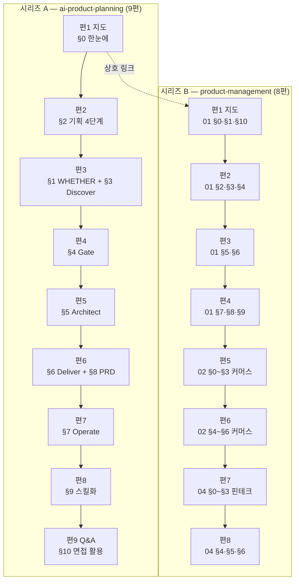

# `pm-harness/03` · `pm-po/01·02·04` 분할 설계 — 원본 4개를 **두 시리즈 17편**으로

> 작성 2026-08-30 · 범위 B 안(선별 이관) 확정 후 착수 · 앞 배치 `2026-08-29-auth-k8s-split-design.md` §10-8-g 규칙 14개를 승계한다

## 0. 이 배치가 앞 배치와 다른 네 가지

앞 배치까지는 **원본 1개를 여러 편으로 나누는** 일이었다. 이번은 **원본 4개를 두 시리즈로
나눠 담는** 일이고, 그래서 앞 배치의 모델을 그대로 쓸 수 없는 자리가 넷 생긴다.

| # | 무엇이 다른가 | 어디서 다루나 |
| ---: | --- | --- |
| ① | **시리즈가 둘이다.** 고정 비용이 발행 순서로 줄어드는 성질(C-8)이 시리즈마다 따로 시작한다 | §3-1 · 가설 H-1 |
| ② | **산문 24.6%** — 코퍼스 최대치다. 원본 문장을 그대로 옮길 위험이 역대 가장 높다 | §7-1 · §8-4 |
| ③ | **인용 11.7~24.9%** — 이제껏 독립 성분으로 다뤄본 적이 없는 크기다 | §2-5 · 가설 H-3 |
| ④ | 🔴 **배정 원본의 7.7% 가 발행 불가 자료다.** 「💼 면접 활용」 개인 경력 메모 20개 | §2-4-a · 가설 H-7 |

**넷 다 「앞 배치 값을 그대로 쓰면 틀리는」 자리다.** 각 절이 대안을 적는다.

④ 가 이번 배치의 가장 큰 특이점이고, **설계 초안을 뒤집은 유일한 발견**이다. 편수가 18에서
17로 줄고 시리즈 B 배정이 68,701 → 58,636 B 로 **14.7% 내려갔다**(뒤집어 보면 초안이
**17.2% 부풀어 있었다**). 자세한 경위는 §2-4-a · §2-4-b 에 있다.

⚠️ 같은 사실을 두 비율로 적은 것은 **분모가 다르기 때문**이다. 감소율의 분모는 초안값이고
부풀림률의 분모는 확정값이다. 앞 배치 §10-8 이 경고한 「분모를 확인하라」가 이 문서 안에서도
적용된다.

---

## 1. 절차

| # | 단계 | 상태 |
| ---: | --- | --- |
| ① | 원본 절별 **성분** 실측 | ✅ **완료** — §2 |
| ② | 편 구성·예산·태그·링크·위험·검증 설계 | ✅ **완료** — §3~§9 |
| ③ | **시리즈 A 편1(지도편)을 먼저 쓰고 실측으로 고정 비용을 확정** | ✅ **완료** — §10-1 |
| ④ | 🔴 **시리즈 A 편2를 쓰고 인용 비율을 실측해 편3 이후를 재환산** | ✅ **완료** — §10-2. 상수·k 모두 유지 |
| ⑤ | 🔴 **시리즈 B 편1에서 고정 비용을 다시 잰다** — 시리즈가 바뀌면 리셋되는지 판정 | ✅ **완료** — §10-10. **리셋될 것이 없다**(A 3,834 대 B 3,859) |
| ⑥ | 편마다 검증하고 **즉시 커밋** | 진행 중 — §8 · §9-1. **B 편2 까지 완료**(§10-11) |
| ⑦ | `dup-scan` 은 편마다, 그리고 시리즈마다 배치 전체로 한 번 더 | 미착수 — §8-4 |
| ⑧ | 커밋은 `git commit -m "…" -- <경로>` 형태 | 미착수 |

**앞 배치와 달라진 것은 ⑤ 하나다.** 재환산 지점이 둘에서 셋으로 늘어난다 — 시리즈 경계가
고정 비용을 리셋하는지가 미지수이기 때문이다.

규칙 9(검사기 자기 증명을 먼저)는 이행했다 — `npm run compose:verify` 가 **9/9** 를 낸 뒤에
§2 의 수치를 받았다. **증명 없는 수치는 거짓 수치와 구분되지 않는다.**

### 1-1. 원본 경로 — 🔴 어느 문서에도 적혀 있지 않았다

```
C:/Users/aeby/vscode/yanadoo-exit/shared/knowledge/pm-harness/
C:/Users/aeby/vscode/yanadoo-exit/shared/knowledge/pm-po/
```

이 배치를 시작할 때 경로를 몰라 `java-backend`·`langgraph` 같은 **다른 폴더명으로 역추적**해야
했다. HANDOFF 도 요구사항 문서도 폴더명만 적고 루트를 적지 않았다.
⇒ **다음 배치도 같은 일을 겪지 않도록 이 절을 남긴다.**

### 1-2. 앞 배치 §10-8-g 가 물려준 14개 규칙의 처리

| # | 규칙 | 이 설계서가 어디서 지켰나 |
| ---: | --- | --- |
| 1 | 고정 비용 상수는 **2,440 ~ 2,470** | §3-2 — 2,455 를 상수로 넣었다. 다만 시리즈 경계 리셋 여부는 H-1 이 판정한다 |
| 2 | C-1 은 **배치 평균에만** 쓴다 | §3-5 — 편 단위 판정은 밴드로만 한다 |
| 3 | 표 비율은 **합치기의 축**이 정한다. 열 합치기는 절감 수단이 아니다 | §3-2-b — 절마다 「행을 겹치는가」로 적었다 |
| 4 | 불릿은 독립 성분이 아니다 | §2-4 — 이번 원본은 불릿이 애초에 0.4~16.1% 다. §2-5 가 대신 **인용**을 새 변수로 잡는다 |
| 5 | 도식 비율은 **1.263** | §3-3 — 도식 예산의 계수로 그대로 썼다 |
| 6 | 링크 몫 공식은 **슬러그 길이 + 31** | §3-0-a — 본편·Q&A편 **15편** 전부 계산했다. 지도편 2편은 §3-1 의 고정 비용 방식이라 대상이 아니다 |
| 7 | 🔴 **자기 산출물을 자기가 짠 검사로 검증한 결과는 리뷰 대상이다** | §8-1 ⑧ · §8-3 |
| 8 | 🔴 축자 겹침 브리프에 **「대조 범위는 원본 전체다」** 명시 | §8-4 — 브리프 문구를 그대로 박았다 |
| 9 | 🔴 Q&A편 발행 전에 **형제편 outbound 를 세는 명령**을 실행 | §6-1 말미 — 명령을 코드 블록으로 넣었다 |
| 10 | 🔴 §6-3 접합부는 **grep 으로 낱말 실재를 확인**하고 행 번호를 적어라 | §6-3 — 표에 행 번호 열을 만들었다 |
| 11 | 처방 세 줄을 **그대로 물려라** | §8-3 — 세 줄을 브리프 고정 문구로 넣었다 |
| 12 | 리뷰는 **두 축으로 나눠** 돌려라 | §8-3 |
| 13 | 🔴 **원본이 나눈 층을 발행본이 합치면 사실이 뒤집힌다** | §7-2 — 이번 원본의 해당 자리를 미리 지목했다 |
| 14 | 초고 직후 `compose` 를 먼저 돌려라 | §8-2 |

14개가 모두 자리를 얻었다. 규칙이 살아 있는지는 §10 이 판정한다.

---

## 2. 원본 실측

`npm run compose -- <원본>` 출력이다. 자기 검사 **9/9** 통과 뒤에 받았다.

### 2-1. 원본 4개 총괄

| 원본 | 합계 B | 산문% | 표% | 코드% | 도식% | 불릿% | 인용% | 도식 수 |
| --- | ---: | ---: | ---: | ---: | ---: | ---: | ---: | ---: |
| `pm-harness/03` 기획 하네스 | 76,934 | 5.8 | 61.3 | 7.5 | 6.2 | 0.4 | 11.7 | 13 |
| `pm-po/01` 프로덕트 개론 | 32,809 | 17.6 | 38.8 | 0.0 | 4.0 | 16.1 | 18.6 | 3 |
| `pm-po/02` 커머스 | 18,026 | 19.7 | 43.4 | 0.0 | 4.5 | 6.1 | 20.2 | 3 |
| `pm-po/04` 핀테크 | 20,724 | 24.6 | 33.5 | 0.0 | 3.8 | 7.3 | 24.9 | 3 |
| **합계** | **148,493** | | | | | | | **22** |

**이 표가 말하는 것**: 두 원본군은 성분이 정반대다. `pm-harness` 는 표 61% · 산문 6% 의
**정리형** 문서이고, `pm-po` 는 산문 18~25% · 인용 19~25% 의 **서술형** 문서다.
⇒ **두 시리즈에 같은 예산 모델을 쓰면 한쪽이 반드시 빗나간다.** §3-2 가 k 를 시리즈별로 나눈다.

### 2-2. 절별 성분 — 시리즈 A (`pm-harness/03`)

| 절 | 합계 B | 산문% | 표% | 코드% | 도식% | 인용% | 도식 수 |
| --- | ---: | ---: | ---: | ---: | ---: | ---: | ---: |
| (머리말) | 1,034 | 0.4 | 0.0 | 0.0 | 0.0 | 99.4 | 0 |
| §0 한눈에 보기 | 8,646 | 6.0 | 71.3 | 0.0 | 10.1 | 8.6 | 2 |
| §1 WHETHER 3질문 | 5,163 | 3.4 | 54.4 | 0.0 | 8.5 | 18.0 | 1 |
| §2 기획 4단계 | 9,769 | 12.0 | 55.9 | 0.0 | 5.0 | 19.2 | 2 |
| §3 Discover | 4,773 | 0.1 | 73.5 | 0.0 | 7.2 | 13.5 | 1 |
| §4 Gate | 6,971 | 6.9 | 61.0 | 0.0 | 12.0 | 12.7 | 2 |
| §5 Architect | 6,428 | 7.0 | 65.4 | 0.0 | 5.6 | 12.7 | 1 |
| §6 Deliver | 4,612 | 2.3 | 69.1 | 6.6 | 10.8 | 0.0 | 1 |
| §7 Operate | 6,493 | 5.2 | 65.8 | 0.0 | 10.0 | 9.6 | 2 |
| §8 PRD Writer | 4,721 | 4.8 | 69.8 | 16.1 | 0.0 | 0.0 | 0 |
| §9 스킬화·Package-and-Ship | 7,624 | 7.4 | 55.9 | 22.8 | 3.8 | 3.3 | 1 |
| §10 면접 활용 | 6,931 | 0.1 | 83.1 | 0.0 | 0.0 | 13.5 | 0 |
| 부록 A 명령 치트시트 | 1,111 | 12.5 | 0.0 | 82.5 | 0.0 | 0.0 | 0 |
| 부록 B 복붙 프롬프트 | 2,658 | 10.6 | 0.0 | 75.9 | 0.0 | 11.1 | 0 |

### 2-3. 절별 성분 — 시리즈 B (`pm-po/01·02·04`)

<details>
<summary>세 원본의 절별 표 (펼치기)</summary>

**`pm-po/01` 프로덕트 개론**

| 절 | 합계 B | 산문% | 표% | 도식% | 불릿% | 인용% |
| --- | ---: | ---: | ---: | ---: | ---: | ---: |
| (머리말) | 722 | 0.6 | 0.0 | 0.0 | 0.0 | 91.1 |
| §0 용어 풀이 | 1,551 | 0.3 | 98.3 | 0.0 | 0.0 | 0.0 |
| §1 제품의 이해 | 4,797 | 5.6 | 48.6 | 8.9 | 15.2 | 16.0 |
| §2 PM 역할과 이해관계자 | 2,644 | 8.6 | 62.9 | 0.0 | 0.0 | 20.7 |
| §3 제품조직 | 1,962 | 0.2 | 27.9 | 30.7 | 11.1 | 27.1 |
| §4 제품전략 | 3,731 | 21.8 | 40.5 | 0.0 | 15.1 | 18.8 |
| §5 제품전술 | 2,474 | 30.9 | 32.5 | 0.0 | 13.2 | 16.3 |
| §6 제품 목표수립 | 4,114 | 14.7 | 44.8 | 6.6 | 15.1 | 14.7 |
| §7 제품기획 | 3,584 | 21.6 | 25.8 | 0.0 | 36.0 | 13.3 |
| §8 제품관리 | 2,126 | 30.5 | 19.8 | 0.0 | 24.9 | 19.4 |
| §9 심화 과정 | 4,048 | 41.0 | 11.4 | 0.0 | 25.2 | 18.6 |
| §10 결론 | 325 | 1.2 | 0.0 | 0.0 | 0.0 | 80.0 |
| §11 다른 파트와의 연계 | 731 | 0.0 | 95.1 | 0.0 | 0.0 | 0.0 |

**`pm-po/02` 커머스**

| 절 | 합계 B | 산문% | 표% | 도식% | 불릿% | 인용% |
| --- | ---: | ---: | ---: | ---: | ---: | ---: |
| (머리말) | 615 | 0.7 | 0.0 | 0.0 | 0.0 | 92.5 |
| §0 용어 풀이 | 945 | 0.4 | 97.1 | 0.0 | 0.0 | 0.0 |
| §1 커머스의 이해 | 2,850 | 5.3 | 55.1 | 10.1 | 8.5 | 15.1 |
| §2 회원 도메인 | 1,632 | 22.7 | 28.2 | 17.6 | 0.0 | 24.9 |
| §3 상품 도메인 | 3,221 | 13.2 | 51.8 | 0.0 | 10.9 | 17.2 |
| §4 가격 도메인 | 1,775 | 21.6 | 50.9 | 0.0 | 0.0 | 21.1 |
| §5 주문 도메인 | 3,972 | 39.5 | 32.8 | 6.1 | 4.2 | 12.0 |
| §6 케이스 스터디 | 3,016 | 21.4 | 33.0 | 0.0 | 11.6 | 27.4 |

**`pm-po/04` 핀테크**

| 절 | 합계 B | 산문% | 표% | 도식% | 불릿% | 인용% |
| --- | ---: | ---: | ---: | ---: | ---: | ---: |
| (머리말) | 790 | 0.5 | 0.0 | 0.0 | 0.0 | 88.5 |
| §0 용어 풀이 | 1,423 | 0.3 | 98.1 | 0.0 | 0.0 | 0.0 |
| §1 핀테크 정의 | 1,527 | 32.0 | 20.7 | 0.0 | 0.0 | 35.2 |
| §2 전자금융 관련 법 | 2,917 | 25.3 | 25.0 | 9.4 | 9.7 | 25.0 |
| §3 오픈뱅킹 | 3,013 | 15.4 | 40.4 | 7.7 | 9.4 | 21.2 |
| §4 마이데이터 | 4,142 | 38.3 | 14.8 | 6.8 | 18.2 | 15.9 |
| §5 업권 경쟁 구도 | 2,325 | 16.1 | 45.2 | 0.0 | 0.0 | 34.4 |
| §6 스페셜 — 마이데이터 추가 논점 | 4,587 | 31.2 | 35.4 | 0.0 | 4.1 | 24.0 |

</details>

### 2-4. 배정에서 빼는 조각 — **7,661 B**

| 조각 | B | 왜 빼나 |
| --- | ---: | --- |
| 머리말 4개 | 3,161 | 원본 문서의 메타 정보다. 발행본에 대응물이 없다 |
| `pm-harness/03` 부록 A | 1,111 | 원본이 **「원형 보존」**이라고 명시한 명령 치트시트다. 코드 82.5% 로, 발행본에 옮기면 축자 겹침이 대량 발생한다 |
| `pm-harness/03` 부록 B | 2,658 | 같은 이유. 코드 75.9% 의 복붙 프롬프트다 |
| `pm-po/01` §11 다른 파트와의 연계 | 731 | 원본 문서 사이의 링크표다. 발행본의 링크 구조는 §6 이 따로 설계한다 |
| 🔴 **「💼 면접 활용」 블록 20개** | **10,065** | **§2-4-a 가 따로 다룬다** |
| **합계** | **17,726** | |

`pm-harness/03` §10 면접 활용(6,931)은 **빼지 않는다.** 하위 절 10-4 의 「주의」 4항목까지
Q&A편의 소재가 된다. 절 제목이 같지만 §2-4-a 의 블록과는 다른 것이다.

| 시리즈 | 원본 합계 | 뺀 값 | **배정 원본** |
| :---: | ---: | ---: | ---: |
| A | 76,934 | 1,034 + 1,111 + 2,658 | **72,131** |
| B | 71,559 | 2,127 + 731 + 10,065 | **58,636** |
| | | **총계** | **130,767** |

> ⚠️ 앞 배치 §10-8 이 경고한 자리다. **총량 비율을 볼 때 분모를 확인하라.**
> 원본 전체 148,493 이 아니라 **배정 130,767** 이 이 설계서 전체의 분모다.

#### 2-4-a. 🔴 「💼 면접 활용」 블록 — **`pm-po` 원본의 14.6% 가 발행 불가 자료다**

`pm-po` 세 원본에는 `> 💼 **면접 활용** — …` 형태의 인용 블록이 **20개** 있다. 원본 내용을
저자의 이력서·경력에 연결하는 개인 메모이고, **금칙어가 전부 이 블록 안에 있다.**

| 원본 | 블록 | B | 금칙어 |
| --- | ---: | ---: | --- |
| `pm-po/01` | 9 | 4,886 | 야나두 3 · TVING 3 · 커머스개발 1 |
| `pm-po/02` | 5 | 2,187 | 야나두 2 · 커머스개발 1 |
| `pm-po/04` | 6 | 2,992 | 야나두 1 |
| `pm-harness/03` | **0** | 0 | 허우용 1 · 패스트캠퍼스 1 (머리말 — 이미 뺐다) |
| **합계** | **20** | **10,065** | **14건** |

**⇒ 판정: 20개 블록을 배정에서 전량 뺀다.** 근거는 셋이 겹친다.

| 근거 | 무엇을 막나 |
| --- | --- |
| `CR-2.1` | 「면접에서 자주 나오는」 같은 **수식이 있으면 안 된다.** 블록 형식 자체가 위반이다 |
| `CR-2.4` | **개인 경력 서사를 제거**한다 |
| 금지선 44 | **지운 자리를 일반화로 메우지 마라.** 새로 쓴 문장은 지적 타율 100% 다 |

살려서 익명화하는 길은 세 번째 근거가 막는다. 회사명을 걷어내면 블록의 요지(「내 경력의
이 대목이 저 개념에 해당한다」)가 통째로 사라지고, 남는 자리를 메우는 순간 **원본이 하지
않은 주장**이 생긴다. `PUBLISHING-CHECKLIST.md` §4 가 「삭제와 최소 치환을 우선 채택하라」고
정한 이유가 그것이다.

절별 분포는 §3-0 의 시리즈 B 배정표에 반영했다.

#### 2-4-b. 🔴 이 절이 두 번 틀렸다 — 둘 다 **합계를 믿어서** 생겼다

| # | 무엇이 틀렸나 | 어떻게 잡았나 |
| ---: | --- | --- |
| ① | 빼는 조각 합계를 **8,946** 으로 적었다. 네 행을 더하면 7,661 이다 | **처방 ③** — 「합계가 맞는지 보지 말고 각 행을 1:1 로 짚어라」 |
| ② | 「💼 면접 활용」 블록 10,065 B 를 **아예 못 봤다.** 성분표의 인용% 안에 섞여 보이지 않았다 | 원본에 금칙어가 실재하는지 **직접 grep** 했다 |

②가 더 무겁다. `compose` 는 인용을 **한 성분으로** 셀 뿐 그 인용이 발행 가능한지는 모른다.
**성분 실측이 통과했다는 것은 배정이 타당하다는 뜻이 아니다.**

⇒ 🔴 **다음 배치로 물릴 규칙: 성분 실측 다음 단계는 「배정 원본에 금칙어가 실재하는지
직접 세는 것」이다.** 이 배치는 그 검사가 없어 설계 초안이 시리즈 B 예산을 **17.2% 부풀린 채**
편 구성까지 확정했다.

측정 명령은 아래다. `LC_ALL=C` 가 빠지면 이모지 패턴이 조용히 0을 낸다 — 실제로 이 배치에서
같은 패턴이 로케일 유무에 따라 9와 0으로 갈렸다.

```bash
R="<원본 루트>"
for w in 야나두 yanadoo 히츠 티빙 TVING 커머스개발 허우용 패스트캠퍼스 아르고스 실장; do
  n=$(LC_ALL=C grep -o "$w" "$R/<파일>" | wc -l)
  [ "$n" -gt 0 ] && printf "  %-14s %s\n" "$w" "$n"
done
```

### 2-5. 🔴 이번 배치의 새 변수는 **인용**이다

앞 배치의 새 변수는 불릿이었고, C-7 은 「불릿은 표와 산문으로 갈라진다」로 확정됐다.
이번 원본에서 불릿은 0.4~16.1% 로 이미 작다. 대신 **인용이 크다.**

| 성분 | 앞 배치 원본 | 이번 배치 (배정 가중평균) | 차 |
| --- | ---: | ---: | ---: |
| 산문 | 8.5% | **11.6%** | +3.1 |
| 표 | — | **51.3%** | — |
| 인용 | (미측정) | **15.9%** | — |
| 불릿 | 24.5% | **5.6%** | −18.9 |

인용문이 원본에서 하는 일은 **셋**이다. 초안은 둘로 봤는데, §2-4-a 가 세 번째를 찾았다.

| # | 용도 | 크기 | 발행본에서 |
| ---: | --- | ---: | --- |
| ① | 절 도입의 한 줄 요약 (머리말 88~99% 가 전부 이것이다) | 3,161 | 도입 **산문**으로 푼다 (§7-3) |
| ② | 실무 조언의 강조 | 나머지 | 인용으로 남거나 표로 접힌다 |
| ③ | 🔴 **저자 경력 메모** (`> 💼 **면접 활용**`) | **10,065** | **옮기지 않는다** (§2-4-a) |

③이 `pm-po` 인용의 절반 가까이를 차지한다. **인용%가 크다는 관측 자체는 맞았으나, 그 크기를
「발행본에 옮길 소재」로 읽은 것이 틀렸다.**

⇒ 🔴 **가설 H-3 을 다시 쓴다**(§10-0). 「인용은 산문과 표로 갈라진다」가 아니라
**「인용은 세 용도로 갈라지고, 그중 하나는 배정 대상이 아니다」**이다. 배정에 남은 ①·② 의
배율은 시리즈 B 편2 초고 `compose` 로 재고 편3 이후를 재환산한다.

---

## 3. 편 구성과 예산

### 3-0. 절 배정 — **두 시리즈 17편**



🔴 **시리즈 B 가 9편에서 8편으로 줄었다.** §2-4-a 가 배정 원본을 10,065 B 줄이자 핀테크 3편
구성(편7 원본 4,928 B)의 목표가 **12,606 B** 로 하한 13,300 을 밑돌았다. 절을 다시 묶어
2편으로 합쳤다. **하한이 편수를 정한 첫 사례다.**

**두 시리즈는 지도편끼리 상호 링크한다.** 「기획 공정」(A)과 「도메인 지식」(B)은 같은 직무의
두 축이므로, 독자가 어느 쪽으로 들어와도 다른 쪽을 찾을 수 있어야 한다.

#### 시리즈 A 절 배정 — 배정 원본 **72,131 B**

| 편 | 슬러그 | 절 | 원본 B |
| :---: | --- | --- | ---: |
| 1 지도 | `planning-harness-map` | §0 | 8,646 |
| 2 | `four-stages-of-planning` | §2 | 9,769 |
| 3 | `whether-three-questions` | §1 + §3 | 9,936 |
| 4 | `whether-gate` | §4 | 6,971 |
| 5 | `architect-stage` | §5 | 6,428 |
| 6 | `deliver-and-prd` | §6 + §8 | 9,333 |
| 7 | `operate-stage` | §7 | 6,493 |
| 8 | `skill-packaging` | §9 | 7,624 |
| 9 Q&A | `planning-harness-qna` | §10 | 6,931 |
| | | **합계** | **72,131** |

#### 시리즈 B 절 배정 — 배정 원본 **58,636 B**

원본 B 는 **「💼 면접 활용」 블록을 뺀 값**이다. 괄호 안이 뺀 크기다.

| 편 | 슬러그 | 절 | 원본 B | (뺀 값) |
| :---: | --- | --- | ---: | ---: |
| 1 지도 | `product-management-map` | 01 §0 · §1 · §10 | **6,019** | 654 |
| 2 | `product-org-and-strategy` | 01 §2 · §3 · §4 | **6,761** | 1,576 |
| 3 | `tactics-and-goal-setting` | 01 §5 · §6 | **5,590** | 998 |
| 4 | `planning-and-product-ops` | 01 §7 · §8 · §9 | **8,101** | 1,657 |
| 5 | `commerce-member-and-catalog` | 02 §0 · §1 · §2 · §3 | **7,830** | 818 |
| 6 | `commerce-pricing-and-order` | 02 §4 · §5 · §6 | **7,394** | 1,369 |
| 7 | `fintech-regulation-and-open-banking` | 04 §0 · §1 · §2 · §3 | **7,522** | 1,358 |
| 8 | `mydata-and-market-structure` | 04 §4 · §5 · §6 | **9,419** | 1,635 |
| | | **합계** | **58,636** | **10,065** |

두 표의 합계 72,131 · 58,636 은 §2-4 의 배정 원본과 일치하고, 뺀 값 합계 10,065 는 §2-4-a 와
일치한다. **원본 절이 빠짐없이 어느 한 편에 배정됐고, 뺀 블록도 빠짐없이 회수됐다는 뜻이다.**

⚠️ 편7·편8 의 슬러그가 바뀌었다. 3편이 2편으로 합쳐지면서 `open-banking-and-mydata` 가
둘로 갈렸다 — 오픈뱅킹은 편7의 규제 흐름에, 마이데이터는 편8의 시장 구조에 붙는다.

#### 3-0-a. 링크 몫 — 규칙 6

앞 배치가 세 번 검증한 공식을 그대로 쓴다.

> **링크 몫 = 슬러그 길이 + 31 B**

| 시리즈 | 편 | 슬러그 길이 | 링크 몫 |
| :---: | :---: | ---: | ---: |
| A | 2 `four-stages-of-planning` | 23 | 54 |
| A | 3 `whether-three-questions` | 23 | 54 |
| A | 4 `whether-gate` | 12 | 43 |
| A | 5 `architect-stage` | 15 | 46 |
| A | 6 `deliver-and-prd` | 15 | 46 |
| A | 7 `operate-stage` | 13 | 44 |
| A | 8 `skill-packaging` | 15 | 46 |
| A | 9 `planning-harness-qna` | 20 | 51 |
| B | 2 `product-org-and-strategy` | 24 | 55 |
| B | 3 `tactics-and-goal-setting` | 24 | 55 |
| B | 4 `planning-and-product-ops` | 24 | 55 |
| B | 5 `commerce-member-and-catalog` | 27 | 58 |
| B | 6 `commerce-pricing-and-order` | 26 | 57 |
| B | 7 `fintech-regulation-and-open-banking` | 35 | 66 |
| B | 8 `mydata-and-market-structure` | 27 | 58 |

🔴 규칙 6 은 이 공식이 **굵게 처리 상태를 전제**한다고 못박았다. 링크를 `**[텍스트](경로)**`
형태로 감싸면 몫이 4 B 늘어난다. 브리프에 **「링크에 굵게를 겹치지 마라」**를 넣는다.

### 3-1. 지도편 — 고정 비용 방식 · **시리즈마다 따로 잰다**

지도편은 원본 절의 배율로 잡지 않는다. 앞 배치 편1 실측이 **21,715 B** 였고, 그 편의 성격
(용어 전량 승계 + 전체 조망 + 형제편 예고)은 이번 두 지도편과 같다.

| 시리즈 | 지도편 | 승계 용어 | 예고할 형제편 | **목표 B** |
| :---: | --- | ---: | ---: | ---: |
| A | `planning-harness-map` | §0 표에서 추출 (편1 집필 시 확정) | 8 | **21,000** |
| B | `product-management-map` | 01·02·04 §0 용어 3표 = **합산 후 중복 제거** | 8 | **21,000** |

🔴 **시리즈 B 지도편의 용어 승계가 앞 배치와 다르다.** 앞 배치는 원본 1개의 용어표 하나를
승계했는데, 이번 B 는 **원본 3개에 §0 용어 풀이가 각각 있다**(1,551 · 945 · 1,423 B).
셋을 그대로 이으면 중복이 남는다. ⇒ **편1 집필 전에 세 표를 합쳐 중복을 제거하고, 남은
개수를 §10-1 에 기록하라.** 그 개수가 용어당 B 를 확정하는 입력이다.

### 3-2. 본편 예산 — **k 를 시리즈별로 나눈다**

앞 배치가 확정한 형태를 쓰되, k 를 하나로 두지 않는다.

> **목표 B = 2,455 + 원본 B × k + 링크 몫**

고정 비용 2,455 는 규칙 1(2,440 ~ 2,470)의 중앙값이다. k 는 앞 배치 본편 넷의 실측에서
역산했다.

| 앞 배치 편 | 실측 B | 고정 비용 | 링크 | 원본 B | 역산 k |
| :---: | ---: | ---: | ---: | ---: | ---: |
| 2 | 21,318 | 3,026 | 55 | 9,307 | 1.960 |
| 3 | 17,958 | 2,715 | 62 | 8,007 | 1.896 |
| 4 | 17,373 | 2,518 | 64 | 7,168 | 2.063 |
| 5 | 19,450 | 2,462 | 50 | 8,942 | 1.894 |
| | | | | **평균** | **1.953** |

🔴 **그런데 이 k 를 두 시리즈에 그대로 쓰면 안 된다.** 앞 배치 원본은 산문 8.5% 였고,
§10-7-c 가 「배율이 원본 본문의 **성질**에 따라 2.626 ~ 3.893 으로 흔들린다」고 확정했다.

| 시리즈 | 원본 성분 | 앞 배치 대비 | **채택 k** | 근거 |
| :---: | --- | --- | ---: | --- |
| A | 표 61% · 산문 5.8% | 표가 훨씬 많다 | **1.85** | 표는 옮길 때 부풀지 않는다. 앞 배치 편3·편5(표 비율 낮은 편)의 k 1.89 를 하향 조정 |
| B | 산문 18~25% · 인용 19~25% | 산문이 3배 | **2.05** | 산문은 풀어 쓰면 늘어난다. 앞 배치 편4(산문 최다)의 k 2.063 을 채택 |

**밴드는 k ± 0.14 다** — 앞 배치 실측 넷(1.894 ~ 2.063)을 감싸는 최소 폭이다.

#### 시리즈 A 예산 (k = 1.85 · 밴드 1.71 ~ 1.99)

| 편 | 원본 B | 2,455 + 원본×1.85 | +링크 | **목표 B** | 겉보기 | 밴드 |
| :---: | ---: | ---: | ---: | ---: | ---: | --- |
| 2 | 9,769 | 20,528 | 54 | **20,582** | 2.107 | 19,215 ~ 21,950 |
| 3 | 9,936 | 20,837 | 54 | **20,891** | 2.103 | 19,505 ~ 22,275 |
| 4 | 6,971 | 15,351 | 43 | **15,394** | 2.208 | 14,420 ~ 16,370 |
| 5 | 6,428 | 14,347 | 46 | **14,393** | 2.239 | 13,495 ~ 15,295 |
| 6 | 9,333 | 19,721 | 46 | **19,767** | 2.118 | 18,460 ~ 21,075 |
| 7 | 6,493 | 14,467 | 44 | **14,511** | 2.235 | 13,605 ~ 15,420 |
| 8 | 7,624 | 16,559 | 46 | **16,605** | 2.178 | 15,540 ~ 17,670 |

#### 시리즈 B 예산 (k = 2.05 · 밴드 1.91 ~ 2.19)

원본 B 는 **「💼 면접 활용」 블록을 뺀 값**이다(§2-4-a).

| 편 | 원본 B | 2,455 + 원본×2.05 | +링크 | **목표 B** | 겉보기 | 밴드 |
| :---: | ---: | ---: | ---: | ---: | ---: | --- |
| 2 | 6,761 | 16,315 | 55 | **16,370** | 2.421 | 15,425 ~ 17,320 |
| 3 | 5,590 | 13,914 | 55 | **13,969** | 2.499 | **13,187** ~ 14,752 |
| 4 | 8,101 | 19,062 | 55 | **19,117** | 2.360 | 17,985 ~ 20,250 |
| 5 | 7,830 | 18,507 | 58 | **18,565** | 2.371 | 17,470 ~ 19,660 |
| 6 | 7,394 | 17,613 | 57 | **17,670** | 2.390 | 16,635 ~ 18,705 |
| 7 | 7,522 | 17,875 | 66 | **17,941** | 2.385 | 16,890 ~ 18,995 |
| 8 | 9,419 | 21,764 | 58 | **21,822** | 2.317 | 20,505 ~ 23,140 |

#### 3-2-a. 🔴 하한 제약 — **편 구성을 바꾼 첫 배치다**

`MIN_BYTES` 는 **13,300 B** 다(`tests/blog/content/schema.test.ts:16` · SOFT 게이트).
k = 2.05 에서 이 하한이 요구하는 최소 원본은 **5,263 B**, 밴드 하단 기준으로는 **5,649 B** 다.

| 시리즈 | 편 | 밴드 하단 | 하한 대비 |
| :---: | :---: | ---: | ---: |
| B | **3** | **13,187** | 🔴 **−113** |
| A | **5** | **13,495** | +195 |
| A | **7** | **13,605** | +305 |
| A | 4 | 14,420 | +1,120 |

🔴 **B-3 만 밴드 하단이 하한을 밑돈다(−113 B).** A-5 · A-7 은 하단이 하한을 넘지만 여유가
200~300 B 뿐이라 같이 관리한다. 앞 배치는 가장 좁은 편의 여유가 1,890 B 였다.

그리고 초안의 핀테크 3편 구성은 **목표 자체가** 하한을 밑돌았다(편7 12,606 B). 이것은
반려선으로 관리할 수 있는 문제가 아니라 **편 구성이 틀린 것**이므로 2편으로 합쳤다.

| 판정 | 조치 |
| --- | --- |
| 목표 B 가 하한 미만 | **편 구성을 고친다.** 절을 다시 묶는다 |
| 밴드 하단만 하한 미만 | **반려선으로 관리한다.** 구성은 유지한다 |

⇒ 🔴 **집필 브리프 반려선**: B-3 · A-5 · A-7 은 초고가 **13,300 B 를 밑돌면 반려**한다.
인접 편에 합치지 말고 — 세 편 모두 주제가 독립적이다 — **원본 인용 ①·② 를 표로 펴서
채운다**(§2-5). 🔴 **③ 경력 메모로 채우는 것은 금지다.**

#### 3-2-b. 표를 합칠 계획 — 규칙 3

규칙 3 은 「표 비율을 정하는 것은 **행을 겹치는가**이고, 열 추가는 상한에서 0.03 밖에 못
내린다」고 확정했다. 그래서 절마다 **행 겹침 여부**로 적는다.

| 시리즈 | 편 | 원본 표 성격 | 행을 겹치는가 | 예상 표 비율 |
| :---: | :---: | --- | --- | ---: |
| A | 2 | 4단계 × 산출물 표가 단계마다 하나씩 | 🔴 **겹친다** — 4표를 「단계 → 산출물 → 판정 기준」 1표로 | ≈ 1.00 |
| A | 3 | WHETHER 3질문 표 + Discover 도구 표 | 겹치지 않는다 — 축이 다르다 | ≈ 1.30 |
| A | 4 | Gate 통과 기준표 2개 | 🔴 **겹친다** — 통과·반려를 한 표의 두 열로 | ≈ 1.05 |
| A | 5 | Architect 산출물 표 | 겹치지 않는다 | ≈ 1.30 |
| A | 6 | Deliver 체크리스트 + PRD 항목표 | 겹치지 않는다 — 서로 다른 산출물 | ≈ 1.25 |
| A | 7 | Operate 지표표 2개 | 🔴 **겹친다** — 지표·주기를 한 표로 | ≈ 1.05 |
| A | 8 | 스킬 패키징 단계표 | 겹치지 않는다 | ≈ 1.30 |
| B | 2 | 역할표 · 조직 비교표 · 전략 프레임표 | 겹치지 않는다 — 셋이 다른 층위다 | ≈ 1.35 |
| B | 3 | 전술표 + OKR 표 | 겹치지 않는다 | ≈ 1.30 |
| B | 4 | 기획·관리·심화 표 다수 | 🔴 **겹친다** — 기획 산출물표와 관리 체크표를 「단계 → 산출물 → 점검」 1표로 | ≈ 1.05 |
| B | 5 | 회원·상품 도메인 표 | 겹치지 않는다 — 도메인이 다르다 | ≈ 1.35 |
| B | 6 | 가격·주문·케이스 표 | 겹치지 않는다 | ≈ 1.35 |
| B | 7 | 법령 표 2개 + 오픈뱅킹 API 표 | 🔴 **법령만 겹친다** — 전자금융법·시행령을 한 표의 **두 열**로. API 표는 축이 달라 유지 | ≈ 1.15 |
| B | 8 | 마이데이터 표 + 업권 비교표 + 스페셜 논점 | 겹치지 않는다 — §7-2 가 「확정 제도와 논의 중인 쟁점을 섞지 마라」로 막는다 | ≈ 1.35 |

### 3-3. 도식 예산 — 규칙 5

도식 비율 **1.263** 을 쓴다. 앞 배치 편4의 1.14 는 복사본이 섞인 오염 표본이었으므로 쓰지 않는다.

| 시리즈 | 원본 도식 B | 원본 도식 수 | 예상 발행 도식 B | 편수 | 편당 평균 |
| :---: | ---: | ---: | ---: | ---: | ---: |
| A | 4,785 | 13 | **6,043** | 9 | 671 |
| B | 2,905 | 9 | **3,669** | 8 | 459 |

🔴 **A 는 도식이 13개인데 B 는 9개다.** 편당으로는 A 1.4개 · B 1.1개다. 두 시리즈의 도식
밀도가 다르다는 사실을 브리프에 적어야 한다 — **B 시리즈에 A 와 같은 밀도를 요구하면
근거 없는 도식이 만들어진다.**

⚠️ 도식 B 는 §2-4-a 의 차감에 영향받지 않는다. 「💼 면접 활용」은 인용 블록이라 도식을
담지 않는다. **성분마다 차감 대상이 다르다는 것을 예산 계산에서 혼동하지 마라.**

### 3-4. A-9(Q&A편) — 항목 패리티 · **두 방식이 교차 검증된다**

Q&A편은 원본 배율이 아니라 **항목 수**로 잡는 것이 앞 배치의 방식이다. 원본 §10 의 항목을
하위 절별로 셌다(헤더 행 제외).

| 하위 절 | 항목 |
| --- | ---: |
| 10-1 네 개의 연결 축 | 4 |
| 10-2 예상 질문 → 30초 답변 뼈대 | 8 |
| 10-3 면접 대화용 어휘 | 10 |
| 10-4 사용 시 반드시 지킬 것 | 4 |
| **합계** | **26** |

| 방식 | 계산 | 값 |
| --- | --- | ---: |
| 항목 패리티 | 2,455 + 26 × 471 + 51 | 14,752 |
| 원본 배율 (k = 1.85) | 2,455 + 6,931 × 1.85 + 51 | 15,328 |
| **채택** | 두 값의 중앙 | **15,000** |

항목당 471 B 는 앞 배치 편6(42항목 · 19,777 B 실측)에서 고정 비용과 링크를 뺀 값이다.
**두 방식이 576 B(3.8%) 안에서 만나므로 어느 쪽도 단독으로 틀리지 않았다.**

🔴 **A-9 브리프 첫 줄: 「26항목 밖의 절을 만들지 마라」**(규칙 5 의 승계).

### 3-5. 배치 총량

| 시리즈 | 편수 | 지도 | 본편 | Q&A | **합계** |
| :---: | ---: | ---: | ---: | ---: | ---: |
| A | 9 | 21,000 | 122,143 | 15,000 | **158,143** |
| B | 8 | 21,000 | 125,454 | — | **146,454** |
| | **17** | | | **총계** | **304,597** |

배정 원본 130,767 대비 겉보기 **2.329** 다. 앞 배치 실측 2.390 보다 낮은 것은 시리즈 A 의
k 를 1.85 로 내렸기 때문이며, 의도한 결과다.

⚠️ 규칙 2 — **이 2.329 는 배치 평균에만 쓴다.** 편 단위 판정은 §3-2 의 밴드로만 한다.

| 항목 | 초안 | 확정 | 차 |
| --- | ---: | ---: | ---: |
| 편수 | 18 | **17** | −1 |
| 배정 원본 | 139,547 | **130,767** | −8,780 |
| 발행 총량 | 324,688 | **304,597** | −20,091 |

**초안과 확정의 차 20,090 B 는 발행본 한 편 크기의 약 1.1배다.** §2-4-a 의 검사가 없었다면
그만큼을 「쓸 수 있다」고 계획한 채 착수했을 것이다.

### 3-6. 🔴 재환산 지점이 **셋**이다

| 지점 | 언제 | 무엇을 재는가 | 무엇을 다시 긋는가 |
| :---: | --- | --- | --- |
| ① | A 편1 발행 뒤 | 고정 비용 · 용어당 B | A 편2~9 |
| ② | A 편2 발행 뒤 | **인용 배율**(H-3) · 표 비율 | A 편3~9 |
| ③ | **B 편1 발행 뒤** | 고정 비용이 **리셋되는가**(H-1) | B 편2~9 전부 |

③ 이 이번 배치에만 있는 지점이다. C-8(고정 비용은 발행 순서로 단조 감소해 2,440 대로 수렴)이
**시리즈 경계에서 리셋되는지 아니면 카테고리와 무관하게 이어지는지**를 아무도 모른다.

- 리셋된다면 B 편1의 고정 비용은 **3,3xx** 로 나온다 → B 예산의 상수를 3,300 으로 올린다
- 이어진다면 **2,4xx** 로 나온다 → 상수 2,455 를 유지한다

⇒ **B 편1 초고 `compose` 를 보기 전에 B 편2 를 쓰지 마라.**

---

## 4. 편별 상세

### 4-1. 편별 주제 경계 — 넘지 말아야 할 선

| 시리즈 | 편 | 이 편이 다루는 것 | 🔴 넘지 말아야 할 선 |
| :---: | :---: | --- | --- |
| A | 1 | 하네스 전체 조망 · 용어 · 8편 예고 | 개별 스테이지의 **판정 기준**을 적지 마라. 그것은 편4~8의 몫이다 |
| A | 2 | 탐색·기획·제작·성장 4단계의 **순환 구조** | WHETHER 3질문을 여기서 설명하지 마라 — 편3이다 |
| A | 3 | 만들지 말지를 묻는 3질문 + Discover 도구 | Gate 의 **통과 기준**은 편4다 |
| A | 4 | WHETHER 게이트의 통과·반려 판정 | Architect 설계 산출물은 편5다 |
| A | 5 | 설계 스테이지의 산출물 | PRD 표준은 편6이다 |
| A | 6 | 딜리버리 체크리스트 + PRD Writer | 스킬로 굳히는 과정은 편8이다 |
| A | 7 | 운영과 순환 · 지표 | 팀 자산화는 편8이다 |
| A | 8 | 스킬화와 Package-and-Ship | 면접 활용은 편9다 |
| A | 9 | 26항목 Q&A | 🔴 **26항목 밖의 절을 만들지 마라** |
| B | 1 | 제품·PM 정의 · 용어 · 8편 예고 | 조직·전략은 편2다 |
| B | 2 | 이해관계자 · 기능조직 대 목적조직 · 전략 | 전술·목표는 편3이다 |
| B | 3 | 전술과 목표 수립 | 기획 실무는 편4다 |
| B | 4 | 기획·관리·심화 | 도메인 사례는 편5부터다 |
| B | 5 | 커머스 회원·상품 도메인 | 가격·주문은 편6이다 |
| B | 6 | 커머스 가격·주문 · 케이스 스터디 | 핀테크는 편7부터다 |
| B | 7 | 핀테크 정의 · 전자금융 관련 법 · 오픈뱅킹 | 마이데이터는 편8이다. 🔴 **법과 시행령을 섞지 마라**(§7-2) |
| B | 8 | 마이데이터 · 업권 경쟁 · 추가 논점 | 🔴 **확정 제도와 논의 중인 쟁점을 같은 층으로 쓰지 마라**(§7-2) |

### 4-2. 🔴 낱말이 시리즈를 가로지르는 자리

앞 배치는 낱말이 **편**을 가로지르는 문제를 다뤘다. 이번은 **시리즈**를 가로지른다.

| 낱말 | A 에서의 뜻 | B 에서의 뜻 | 누가 먼저 정하나 |
| --- | --- | --- | --- |
| **기획** | 하네스의 4단계 중 두 번째 스테이지 | PM 직무의 산출물 작성 행위 (01 §7) | 🔴 **A 편1이 먼저 정하고, B 편1이 「다른 뜻으로 쓴다」고 명시한다** |
| **제품 전략** | Gate 통과 판정의 입력 | 독립된 절 (01 §4) | B 편2 |
| **PRD** | 스킬로 굳히는 표준 (A 편6) | 기획 산출물의 하나 (B 편4) | A 편6 |
| **지표** | Operate 스테이지의 순환 입력 | 목표 수립의 산출물 (01 §6) | B 편3 |

⇒ **A 편1 도입은 B 편1 집필자가 반드시 먼저 읽는다**(규칙 11 의 확장 적용).

---

## 5. 태그

태그는 `content/blog/tags.ts` 의 **닫힌 집합**이다. 목록 밖 문자열은 어떤 이유로도 쓰지 않는다.

### 5-1. 🔴 이 배치가 패싯 D 를 처음으로 채운다

§5-2 배정을 태그별로 집계한 값이다.

| 태그 | 현재 | 이번 배치 | 합계 |
| --- | ---: | ---: | ---: |
| `product-strategy` | 6 | +5 | 11 |
| `prd` | 2 | +4 | 6 |
| `product-discovery` | **0** | **+3** | 3 |
| `product-metrics` | **0** | **+3** | 3 |
| `data-driven` | 2 | +3 | 5 |
| `payments` | 2 | **+3** | 5 |
| `commerce` | 1 | **+2** | 3 |
| `org-design` | 22 | +2 | 24 |
| `user-research` | **0** | **+1** | 1 |
| `career` | **0** | **+1** | 1 |
| `saas` | 1 | +1 | 2 |
| `knowledge-management` | 18 | +1 | 19 |

패싯 D 18개 중 **7개가 0건**이었다(`product-discovery` · `product-metrics` · `ab-testing` ·
`user-research` · `global-service` · `startup` · `career`). 이번 배치가 그중 **넷**을 채운다.
`ab-testing` · `global-service` · `startup` 은 배정 원본에 대응 내용이 없어 0으로 남는다.

⚠️ `user-research` 와 `career` 는 **각 1건**이라 싱글톤이다. 요구사항 문서 §13-3 이 경계한
상태이므로, 다음 배치가 같은 태그를 쓸 원본을 고르면 해소된다. **지금 억지로 늘리지 마라** —
글에 없는 내용으로 태그를 맞추는 것이 태그를 비워 두는 것보다 나쁘다.

⚠️ **선별 축이 태그 통제 어휘와 맞아떨어진 것은 우연이 아니다.** 요구사항 문서 §13-3 이
「`pm-po` 도메인 태그는 `commerce`·`payments`·`saas` 만 두고 `o2o`·`si`·`logistics` 는 만들지
않는다」고 정했다. **커머스와 핀테크를 고른 B 안의 선별은 이 결정과 정합한다** — O2O·물류를
골랐다면 붙일 태그가 없었다.

### 5-2. 편별 태그 배정

| 시리즈 | 편 | 태그 |
| :---: | :---: | --- |
| A | 1 | `product-discovery` `prd` `claude-code` |
| A | 2 | `product-discovery` `product-strategy` |
| A | 3 | `product-discovery` `user-research` |
| A | 4 | `product-strategy` `evaluation` |
| A | 5 | `prd` `context-engineering` |
| A | 6 | `prd` `claude-code` |
| A | 7 | `product-metrics` `data-driven` |
| A | 8 | `claude-code` `knowledge-management` |
| A | 9 | `career` `product-strategy` |
| B | 1 | `product-strategy` `org-design` |
| B | 2 | `org-design` `product-strategy` |
| B | 3 | `product-metrics` `data-driven` |
| B | 4 | `product-metrics` `prd` |
| B | 5 | `commerce` `saas` |
| B | 6 | `commerce` `payments` |
| B | 7 | `payments` `ai-governance` |
| B | 8 | `payments` `data-driven` |

⚠️ **`ai-governance` 를 B-7 에 붙인 것은 전자금융법의 규제 성격 때문이다.** 이 태그가 AI 맥락
밖에서 쓰이는 첫 사례이므로, 리뷰 축 하나가 **태그 적합성**을 별도로 본다(§8-3).

---

## 6. 링크 구조

### 6-1. 시리즈 내부

각 시리즈는 앞 배치와 같은 사슬 구조다.

| 시리즈 | 편 | 나가는 링크 |
| :---: | :---: | --- |
| A | 1 지도 | 형제편 **8개** 전부 |
| A | 2~8 | 앞 편 1 · 다음 편 1 · 지도편 1 |
| A | 9 Q&A | 앞 편 1 · 지도편 1 · 본편 중 인용하는 편들 |
| B | 1 지도 | 형제편 **7개** 전부 |
| B | 2~8 | 앞 편 1 · 다음 편 1 · 지도편 1 |

🔴 **규칙 9 — Q&A편(A-9) 발행 전에 형제편 outbound 를 세는 명령을 실행한다.**

```bash
# A-9 발행 직전에 실행. 편1~8 각각이 A-9 를 가리키는지 센다.
cd content/blog/ai-product-planning && \
for f in planning-harness-map four-stages-of-planning whether-three-questions \
         whether-gate architect-stage deliver-and-prd operate-stage skill-packaging; do
  n=$(grep -c "planning-harness-qna" "$f.md")
  printf "%-28s %s\n" "$f" "$n"
done
```

앞 배치는 이 명령이 없어 「편1~5 각각에 편6 링크」로 오독했고, 실제 결손은 편1 4건 · 편5 1건뿐
이었다. **세는 명령을 실행한 뒤에 결손 목록을 만든다.**

### 6-2. 시리즈 간 링크 — 목표 **4건 이상**

두 시리즈는 같은 직무의 두 축이므로 서로를 가리켜야 한다.

| 걸 자리 | 가리킬 곳 | 근거 |
| --- | --- | --- |
| A-1 지도 도입 | B-1 지도 | 「기획 공정을 쓰기 전에 제품이 무엇인지」 |
| B-1 지도 도입 | A-1 지도 | 「제품을 정의했다면 다음은 공정이다」 |
| A-6 PRD Writer | B-4 기획·관리 | PRD 가 두 시리즈에서 다른 층위로 나온다(§4-2) |
| B-3 목표 수립 | A-7 Operate | 지표가 순환의 입력이 되는 자리 |

### 6-3. 다른 카테고리에서 들어오는 링크 — 규칙 10

🔴 규칙 10 은 「접합부를 **grep 으로 낱말 실재를 확인**하고 행 번호를 적어라」고 했다.
앞 배치는 제목만 보고 접합부를 정했다가 낱말이 아예 없는 글을 지목했다.

**⇒ 이 표는 편1 착수 전에 아래 명령으로 채운다.** ✅ **2026-08-31 채웠다.**

```bash
# 후보 글에 낱말이 실재하는지 확인하고 행 번호를 얻는다
cd content/blog && LC_ALL=C grep -c "프로덕트\|기획\|PRD\|이해관계자\|제품 전략\|로드맵" */*.md \
  > /tmp/j.txt; LC_ALL=C sort -t: -k2 -rn /tmp/j.txt | awk -F: '$2>0'
# 상위 후보의 실제 문맥을 연다 (개수만 보고 정하지 않는다)
LC_ALL=C grep -n "<패턴>" <후보>.md
```

⚠️ 설계 당시 적어 둔 명령을 **두 곳 고쳐서 실행했다.** ① `LC_ALL=C` 가 없었다 — 한글
패턴이므로 로케일에 따라 거짓 0 이 난다. ② `| head -40` 은 SIGPIPE 로 긴 grep 을 죽인다.
파일별 **개수**를 먼저 세어 후보를 좁힌 뒤, 좁혀진 파일만 `-n` 으로 열었다.

**후보 모수는 167편 전체다.** 설계서가 지목한 `agentic-coding`·`ai-transformation` 두
카테고리로 좁히지 않고 `*/*.md` 로 돌린 결과, 낱말이 있는 글이 **30편**이었고 그중 상위
5편이 아래 표다. 두 카테고리 밖에서는 유의미한 후보가 나오지 않아 **설계의 예측은 맞았지만,
좁혀서 확인한 것이 아니라 넓혀서 확인한 뒤 같은 결론에 도달했다.**

| # | 걸 글 | 행 번호 | 실재하는 낱말 | 가리킬 곳 | 확인 |
| ---: | --- | ---: | --- | --- | :---: |
| 1 | `ai-transformation/discovery-to-growth-tooling.md` | 116 · 124 · 135 | 「기획·요구사항」 절 제목 · PRD 골격 · **ChatPRD** 도구 표 | **A-1** 지도 | ✅ |
| 2 | `ai-transformation/sdlc-human-gates.md` | 178 · 444 | 「② 기획 — PRD·유저스토리·우선순위」 · 게이트 없을 때의 증상 | **A-4** WHETHER 게이트 | ✅ |
| 3 | `ai-transformation/lean-three-layer-harness.md` | 122 · 434 | `prd-작성` Skill 정의 행 · 「PRD 도구 → PRD Skill」 흡수 표 | **A-8** 스킬화 | ✅ |
| 4 | `ai-transformation/agent-definition-by-department.md` | 317 · 318 | `product-strategist` PRD 10섹션 · `roadmap-planner` 로드맵 | **B-4** 기획·관리 | ✅ |
| 5 | `agentic-coding/thirty-agent-catalog.md` | 56~62 · 207~210 | JTBD · RICE · **NSM/OMTM** · AARRR 용어표 · 기획 4종 카탈로그 | **B-3** 목표 수립 | ✅ |

**다섯 글 모두 말미에 「이 글이 다루지 않은 것」(5번은 「다음 편으로」) 절이 있고, 그 절이
이미 링크 표를 담고 있다.** 새 절을 만들지 말고 그 표에 행을 추가한다.

| # | 링크를 넣을 절 | 그 절의 행 번호 |
| ---: | --- | ---: |
| 1 | `## 이 글이 다루지 않은 것` | 416 |
| 2 | `## 이 글이 다루지 않은 것` | 452 |
| 3 | `## 이 글이 다루지 않은 것` | 459 |
| 4 | `## 이 글이 다루지 않은 것` | 429 |
| 5 | `## 다음 편으로` | 282 |

🔴 **행 번호는 2026-08-31 기준이다.** 커밋 20(§9-1)까지 사이에 해당 글이 수정되면 어긋난다.
링크를 걸 때 **행 번호로 찾지 말고 절 제목으로 찾아라.** 행 번호는 「그때 낱말이 실재했다」는
증거일 뿐 편집 좌표가 아니다.

⚠️ **5번은 A 가 아니라 B 를 가리킨다.** `thirty-agent-catalog` 의 기획 4종은 JTBD·RICE·NSM
같은 **PM 직무 어휘**이지 하네스 공정이 아니다. 낱말이 겹친다고 A 로 보내면 §4-2 가 경고한
「기획」의 두 뜻이 섞인다.

### 6-4. 카테고리 간 링크 마감 실측 명령

배치 마감 시 §10 에 넣을 집계다.

```bash
cd content/blog && for c in */; do
  c=${c%/}
  [ -f "$c" ] && continue
  out=$(grep -ho "/blog/[a-z-]*/" "$c"/*.md 2>/dev/null | grep -v "/blog/$c/" | wc -l)
  inn=$(grep -rho "/blog/$c/" --include="*.md" . 2>/dev/null | wc -l)
  n=$(ls "$c"/*.md 2>/dev/null | wc -l)
  printf "%-24s 나감 %3s  들어옴 %3s  편수 %3s\n" "$c" "$out" "$inn" "$n"
done
```

---

## 7. 이 원본 특유의 위험

### 7-1. 🔴 산문 24.6% — **코퍼스 최대치다**

| 배치 | 원본 산문% | 축자 겹침 결과 |
| --- | ---: | --- |
| spring-batch | 21.6 | 직전 최대였다 |
| auth-k8s | 8.5 | 위험이 낮아 20자 기준으로 충분했다 |
| **이번 `pm-po/04`** | **24.6** | **미지** |

산문이 많다는 것은 **원본 문장을 그대로 옮길 자리가 많다**는 뜻이다. 앞 배치는 대조 단위를
**셀·불릿**으로 바꿔 20자 기준을 적용했는데, 이번에는 산문 문단이 대조 단위가 된다.

⇒ **§8-4 의 대조 단위를 「문단」으로 바꾸고, 기준을 20자로 유지한다.**

### 7-2. 🔴 원본이 나눈 층을 합치면 사실이 뒤집히는 자리 — 규칙 13

규칙 13 이 CRITICAL 로 물려준 유형이다. 이번 원본에서 해당하는 자리를 미리 지목한다.

| 원본 | 원본이 나눈 층 | 합치면 무엇이 뒤집히나 |
| --- | --- | --- |
| `pm-po/04` §2 | **전자금융거래법**과 **시행령**을 다른 표로 뒀다 | 합치면 「법에 있는 것」과 「시행령에 있는 것」이 섞여 **규제 근거를 잘못 인용하게 된다** |
| `pm-po/04` §4 · §6 | 마이데이터를 **본절**과 **스페셜 추가 논점**으로 나눴다 | 합치면 확정 제도와 논의 중인 쟁점이 같은 층으로 읽힌다 |
| `pm-po/02` §4 | **정가 · 판매가 · 할인가**를 다른 행으로 뒀다 | 합치면 커머스 가격 도메인의 핵심 구분이 사라진다 |
| `pm-harness/03` §4 | **통과 기준**과 **반려 기준**을 다른 표로 뒀다 | §3-2-b 가 「한 표의 두 열로 겹친다」고 계획했다 — 🔴 **열로 나누는 것은 허용되지만 행으로 섞으면 안 된다** |

⇒ 마지막 행이 **규칙 3 과 규칙 13 이 부딪히는 자리**다. 「행을 겹쳐 총량을 줄여라」와
「층을 합치지 마라」가 같은 표를 가리킨다. **판정: 층은 열로 보존하고 행만 겹친다.**

### 7-2-a. 🔴 배정 원본에 금칙어가 **14건** 있다

§2-4-a 가 뺀 20개 블록으로 금칙어 14건 중 12건이 사라진다. 나머지 2건은 `pm-harness/03`
머리말에 있고 그것도 배정 밖이다. **⇒ 배정 원본에 남은 금칙어는 0건이다.**

그러나 이것은 **원본을 그대로 옮길 때의 이야기**다. 집필자가 원본을 읽는 동안 금칙어를
본다는 사실은 변하지 않는다. 앞 배치들이 발행본을 HARD 0 으로 유지한 것은 검사기가 잡아서가
아니라 집필자가 애초에 옮기지 않았기 때문이다.

⇒ **브리프에 넣는다: 「원본에서 회사명·인명을 보더라도 발행본에 옮기지 마라. 지운 자리를
일반화로 메우지도 마라 — 삭제가 기본이고, 의미 손실 없이 치환 가능할 때만 치환한다.」**

⚠️ **`check-forbidden` 은 `content/blog` 만 본다.** 설계서와 원본은 대상이 아니므로,
이 배치에서 그것들이 깨끗하다는 보고는 나오지 않는다. **검사기의 침묵을 통과로 읽지 마라.**

### 7-3. 인용이 많은 원본의 함정

머리말 4개가 88~99% 인용이다. 이것을 그대로 옮기면 **발행본 도입이 인용 블록으로 시작한다.**
앞 배치까지의 발행본은 전부 산문 도입이었다.

⇒ **브리프: 원본 머리말의 인용은 발행본 도입 산문으로 푼다. 인용 블록으로 시작하지 마라.**

### 7-4. frontmatter 고정값

| 필드 | 시리즈 A | 시리즈 B |
| --- | --- | --- |
| `category` | `"ai-product-planning"` | `"product-management"` |
| `series` | `"planning-harness"` | `"product-management-domains"` |
| `seriesOrder` | 1 ~ 9 | 1 ~ 9 |
| `date` | 원본 작성 기준일 승계 | 원본 작성 기준일 승계 |
| `updated` | 발행일 | 발행일 |
| `featured` | 지도편만 `true` 검토 | 지도편만 `true` 검토 |
| `draft` | `false` | `false` |

---

## 8. 검증

### 8-0. 설계서 자신의 검산 — **착수 전에 한 번**

이 설계서의 §2~§3 수치는 손으로 더한 값이고, 실제로 **두 번 틀렸다**(§2-4-b). 그래서 착수
전에 독립 계산으로 다시 맞췄다. 검산이 확인한 항목은 다음과 같다.

| 검산 항목 | 계산값 | 판정 |
| --- | ---: | :---: |
| A 배정 합계 = 편별 원본의 합 | 72,131 | ✅ |
| B 배정 합계 = 편별 원본의 합 | 58,636 | ✅ |
| B 배정 = 원본 71,559 − 머리말 2,127 − §11 731 − 면접활용 10,065 | 58,636 | ✅ |
| 면접 활용 차감 = 원본 3개 블록의 합 | 10,065 | ✅ |
| A·B 본편 목표 합 = `2,455 + 원본×k + 링크` 의 합 | 122,143 · 125,454 | ✅ |
| 발행 총량 · 겉보기 비율 | 304,597 · 2.329 | ✅ |
| 밴드 하단이 하한 13,300 을 밑도는 편 | **B-3 하나** | ✅ |

🔴 **검산은 설계서의 합계 칸을 입력으로 쓰지 않는다.** 편별 값만 읽어 다시 더하고, 그 결과를
설계서 값과 대조한다. 합계를 입력으로 쓰면 틀린 합계가 자기 자신을 검증한다 —
규칙 7(자기 검사 결과는 리뷰 대상이다)이 설계 단계에 적용되는 형태다.

이 검산에서 B-3 목표가 13,970 이 아니라 **13,969** 임이 드러났다(반올림 차 1 B). 크기는
작지만 **표의 값이 공식의 값과 다르다는 사실 자체**가 문제이므로 표를 고쳤다.

### 8-1. 편마다 (발행 전) — 여덟 검사

| # | 검사 | 통과선 |
| ---: | --- | --- |
| ① | `npm run check-forbidden:verify` | 자기 증명 통과 |
| ② | `npm run check-forbidden` | **HARD 0** |
| ③ | `npm run dup-scan:verify` | 자기 증명 통과 |
| ④ | `npm run dup-scan -- --category <slug>` | 해당 편 관련 0건 (사람이 목록을 연다) |
| ⑤ | `npm test` | 전부 통과 |
| ⑥ | `npx tsc --noEmit` | 통과 |
| ⑦ | `npm run compose -- <발행본>` | 밴드 안 |
| ⑧ | 🔴 **집필자 자기 검사 결과의 독립 재측정** | 규칙 7 |

⑧ 이 앞 배치가 추가한 검사다. **집필자가 「0건」을 보고하면 컨트롤러가 다시 잰다.**
앞 배치에서 집필자의 「20자 겹침 0건」이 두 겹으로 틀렸다 — 공백을 지우고 셌고, 검사 범위를
브리프가 준 범위로 좁혔다.

### 8-2. 편마다 (발행 뒤) — 규칙 14

**초고 직후 `compose` 를 먼저 돌린다. 성분을 재기 전에 깎지 않는다.**
실측값을 §10 에 기록하고, 재환산 지점(§3-6)이면 다음 편 예산을 다시 긋는다.

### 8-3. 리뷰 브리프에 넣을 규칙

**리뷰는 두 축으로 나눠 돌린다**(규칙 12 · 네 편 연속 겹침 0).

| 축 | 무엇을 보나 |
| :---: | --- |
| **정확성** | 사실 오류 · 원본과의 불일치 · 편 경계 위반 · 링크 오지목 |
| **검사 유효성** | 집필자가 돌린 검사가 실제로 그것을 잡는가 (규칙 7) |

🔴 **처방 세 줄을 그대로 물린다**(규칙 11 · 세 편 연속 들었다).

> ① 앞 편을 가리키면 **그 편 파일을 열어 확인**하라.
> ② 도식은 **구조는 유지하되 라벨은 다시 쓴다.**
> ③ **「N개」 목록은 표의 각 행과 1:1 로 짚어라. 합계가 맞는지 보지 마라.**

이번 배치가 추가하는 넷째 처방은 §7-2 에서 나온다.

> ④ **원본이 다른 표로 나눈 것을 한 표의 행으로 섞지 마라. 열로는 합쳐도 된다.**

### 8-4. dup-scan 순서와 원본 대조

1. `npm run dup-scan:verify` 로 자기 증명
2. `npm run dup-scan -- --category <slug>` 로 카테고리 스캔
3. 사람이 원본과 대조 — **대조 단위 「문단」 · 기준 20자**

🔴 **규칙 8 — 브리프에 이 문장을 그대로 넣는다.**

> **대조 범위는 배정 절이 아니라 원본 전체다.** 옮긴 범위만 대조하면 다른 절에 있는
> 같은 문장을 놓친다. 공백을 지우지 말고 원문 그대로 센다.

---

## 9. 산출물

### 9-1. 커밋 단위

| # | 커밋 | 내용 |
| ---: | --- | --- |
| 1 | 설계서 | 이 문서 |
| 2~10 | A 편1~9 | 편마다 발행 + 검증. 🔴 **커밋 2 에는 카테고리 간 링크 한 쌍이 들어간다**(§10-1-c) |
| 11~18 | B 편1~8 | 편마다 발행 + 검증. 🔴 **커밋 11 에도 같은 쌍이 들어간다** — 새 카테고리의 첫 편은 고립 검사에 구조적으로 걸린다 |
| 19 | 시리즈 간 링크 | §6-2 4건 |
| 19-a | **형제편 링크 부착** | 편1의 구성 표에 편2~9 링크를 붙인다. 각 편 발행 시 그 행만 붙여 왔으므로 마지막에 전수 확인한다 |
| 20 | 카테고리 간 링크 | §6-3 |
| 21 | 마감 | §10 실측·회고 + README · CHANGELOG · HANDOFF |

커밋은 `git commit -m "…" -- <경로>` 형태로 경로를 명시한다.

🔴 **A-9(Q&A편) 커밋에는 §6-1 명령으로 확인한 형제편 링크 수정을 함께 넣는다**(규칙 9).

### 9-2. 산출 파일

```
content/blog/ai-product-planning/   9편
content/blog/product-management/    8편
docs/superpowers/plans/2026-08-30-pm-batch-split-design.md
```

발행 후 총 편수는 **167 + 17 = 184편**이다.

---

## 10. 배치 완료 — 실측과 회고

### 10-0. 가설 — **배치 완료 시점에 채운다**

| # | 가설 | 판정 |
| :---: | --- | :---: |
| **H-1** | 고정 비용의 단조 감소(C-8)는 **시리즈 경계에서 리셋된다** | ❌ **물음이 성립하지 않는다** — B 편1 3,859 가 A 편1 3,834 와 **25 B(0.65%)** 차이다. 리셋되는 것이 아니라 **시리즈 경계가 고정 비용에 아무 일도 하지 않는다.** 지도편 고정 비용은 원본도 시리즈도 아닌 **배치**가 정한다 (§10-10-a) |
| **H-2** | 시리즈별 k 분리(A 1.85 · B 2.05)가 단일 k 보다 정확하다 | 🔶 **A 편2 역산 1.885 · 밴드 안** — A 쪽은 지지된다. B 표본이 없어 「분리가 더 정확한가」는 미판정 |
| **H-3** | 인용은 **세 용도로 갈라지고**, 배정에 남은 ①·②의 배율은 산문 배율에 가깝다 | ❌ **물음이 성립하지 않는다** — 인용은 발행본에서 인용으로 남지 않고 산문에 합류한다(1,876 → 52). 성분을 갈라 잴 수 없다. 다시 쓴 형태는 §10-2-c |
| **H-4** | 산문 24.6% 원본에서 축자 겹침은 대조 단위를 문단으로 바꾸면 잡힌다 | ☐ |
| **H-5** | 밴드 하단이 하한에 붙은 세 편(B-3 · A-5 · A-7)은 **반려선 없이도** 하한을 넘는다 | ☐ |
| **H-6** | 시리즈 간 링크 4건은 두 카테고리의 인바운드를 **동시에** 올린다 | ☐ |
| **H-7** | 🔴 **성분 실측만으로는 배정 가능량을 알 수 없다.** 금칙어·정책 위반 블록을 따로 세야 한다 | **✅ 착수 전 확인** |

H-7 은 이미 참으로 판정됐다 — §2-4-a 가 그 증거다. 배치 완료 시점에 판정하는 것이 아니라
**착수 전에 판정된 유일한 가설**이며, 그래서 §11 지시가 아니라 다음 배치로 물릴 규칙이 된다.

### 10-1. A 편1 실측 — 절차 ③

발행 `content/blog/ai-product-planning/planning-harness-map.md` · 2026-08-31.

발행 `content/blog/ai-product-planning/planning-harness-map.md` · 2026-08-31.
🔴 **리뷰 두 축의 지적 11건을 반영한 뒤의 최종값이다.** 반영 전 초판 수치를 인용하지 마라 —
아래 10-1-g 가 초판이 무엇을 틀렸는지 적는다.

| 항목 | 설계값 | 실측 | 차 |
| --- | ---: | ---: | ---: |
| 발행 B | 21,000 | **23,347** | +2,347 (+11.2%) |
| 원본 §0 | 8,646 | 8,646 | — |
| 겉보기 배율 | 2.429 | **2.700** | +0.271 |
| 고정 비용 (도입 + 정리) | (상수 2,455) | **3,834** (2,926 + 908) | +1,379 |
| 용어 개수 | 표에서 추출 | **36개 전량 승계** | — |
| 용어절 B | — | **5,367** | — |
| 도식 | (편당 평균 671) | **2개 · 849 B** | +178 |

⚠️ 발행 B 는 형제편 링크 8개를 **뺀** 값이다. 아래 10-1-c 가 이유를 적는다. 링크를 전부
붙이면 약 +384 B 로 **23,731** 이 된다.

⚠️ **`wc -c` 는 23,346, `compose` 합계는 23,347 이다.** 1 B 차이는 마지막 개행 처리이며
둘 다 맞다. 예산에 넣을 때 어느 쪽을 썼는지 밝히지 않으면 다음 배치가 재현하지 못한다.

#### 10-1-a. C-3(지도편 용어당 B 는 단조 상승한다) — **「상승한다」는 반증됐고, 「무엇이 변수인가」는 말할 수 없다**

앞 배치가 두 표본으로 지지 판정을 내린 상수다(`208.7 → 215.3`). 이번 값이 크게 어긋나
지도편 전량을 다시 쟀다. **아래는 자기 증명 7/7 을 통과한 집계기의 출력이다** — 초판 집계는
증명이 없었고 실제로 다섯 편에서 틀렸다(10-1-g).

> **재현 명령** — `npm run map-terms:verify` 로 증명한 뒤 `npm run map-terms` 를 돌린다.
> 스크래치패드가 아니라 `scripts/map-terms.mjs` 에 두었다. **설계서가 인용하는 수치는
> 재현할 수 있어야 하고, 재현 수단이 세션과 함께 사라지면 그 수치는 검증 불가가 된다.**

| 용어 수 | 용어절 B | 용어당 B | 편 |
| ---: | ---: | ---: | --- |
| **없음** | 0 | — | `topic-map-reading-paths` |
| **없음** | 0 | — | `ai-transformation-knowledge-map` |
| 7 | 587 | 83.9 | `search-system-overview` |
| 11 | 1,157 | 105.2 | `redis-cache-design` |
| 18 | 1,743 | 96.8 | `rag-knowledge-map` |
| 23 | 4,933 | 214.5 | `auth-service-launch-map` (앞 배치 편1) |
| 23 | 4,782 | 207.9 | `notification-center-architecture-map` |
| 24 | 4,954 | 206.4 | `batch-processing-fundamentals` |
| 24 | 4,453 | 185.5 | `realtime-transport-and-websocket` |
| 29 | 3,390 | 116.9 | `rdbms-and-nosql-fundamentals` |
| 32 | 4,748 | 148.4 | `partitioning-fundamentals` |
| 34 | 5,216 | 153.4 | `cicd-pipeline-fundamentals` |
| 36 | **5,367** | **148.6** | **이번 편1** |
| 41 | 5,204 | 126.9 | `ai-agent-knowledge-map` |

지도편은 **14편**이고 그중 **2편은 용어절이 아예 없다.** 용어절이 있는 12편만 위에서 값을 낸다.

##### 말할 수 있는 것

**「용어당 B 가 올라간다」는 반증됐다.** 용어가 가장 많은 편(41개)이 **126.9** 로, 23개 편의
**214.5** 보다 낮다. 앞 배치가 근거로 삼은 두 표본은 **둘 다 23개대**였다 — 표본이 한 구간에
몰려 있어 그 구간 밖에서 값이 어떻게 되는지 보지 못한 것이다.

⇒ **「용어당 B × 개수」로 예산을 곱하지 마라.** 개수가 많은 편에서 크게 부푼다.
41개에 214.5 를 곱하면 8,795 가 나오는데 실측은 5,204 로 **69% 과대추정**된다.

##### 🔴 말할 수 없는 것 — 초판이 여기서 넘어갔다

초판은 「실제 변수는 순서가 아니라 개수다」라고 단정했다. **이 데이터로는 그렇게 말할 수 없다.**

| 왜 말할 수 없나 | 근거 |
| --- | --- |
| 발행 순서를 복원할 수 없다 | 14편 중 **12편의 `date` 가 `2026-07-26` 으로 같다.** 순서를 모르는데 「순서가 변수가 아니다」를 판정할 수 없다 |
| 논증이 순환한다 | 표를 **용어 수로 정렬해 놓고** 그 표를 보며 「개수가 변수다」라고 결론지었다 |
| 「5,000 B 상수」는 표본 부족이다 | 23개 이상 **9편**의 용어절은 3,390 ~ 5,367 이고 **폭이 평균(4,781)의 41%** 다. 상수라 부를 폭이 아니다 |
| 용어절이 없는 지도편이 둘이다 | 「지도편은 용어절을 5,000 B 쯤 갖는다」는 전제 자체의 반례다 |

⇒ **예산 처방은 상수가 아니라 밴드로 둔다. 용어절 3,400 ~ 5,400 이며, 개수로 곱하지 않는다.**
B 시리즈 지도편도 이 밴드로 잡되, **무엇이 진짜 변수인지는 판정하지 않은 채로 둔다.**
표본이 12편뿐이고 그중 절반이 한 카테고리(`backend-engineering`)에서 나왔다.

#### 10-1-b. 고정 비용은 리셋되는 정도가 아니라 **더 높게 시작했다**

| 배치 | 편1 고정 비용 | 편2 | 수렴값 |
| --- | ---: | ---: | ---: |
| 앞 배치 | 3,338 | 3,026 | 2,455 |
| **이번 A 시리즈** | **3,834** | ? | ? |

H-1 은 「시리즈 경계에서 리셋된다」였는데, 실측은 리셋보다 강하다 — **앞 배치 편1보다 496 B
높다.** 도입이 2,926 인 것이 원인이고, 이 배치의 도입이 길어진 이유는 §4-2 가 요구한
「기획」 낱말 가르기를 도입 다음 절에 따로 두면서 도입 자체도 늘어난 데 있다.

⚠️ **A 편2~9 의 상수 2,455 를 지금 고치지 마라.** 지도편의 고정 비용은 본편과 성질이 다르고
(앞 배치도 편1 3,338 대 편2 3,026 으로 312 B 차이가 났다), 표본이 하나다.
**편2 초고 `compose` 를 보고 그때 확정한다** — 재환산 지점 ②가 그 자리다.

#### 10-1-c. 🔴 설계가 놓친 것 — **새 카테고리의 첫 편은 반드시 테스트에 걸린다**

§9-1 은 「편마다 발행 + 검증」으로 커밋을 나눴는데, 편1 커밋에서 `npm test` 가 **2건 실패**했다.

| 실패 | 원인 | 처리 |
| --- | --- | --- |
| 죽은 링크 8건 | 편1이 §6-1 대로 형제편 8개를 가리켰으나 편2~9가 아직 없다 | **링크를 벗기고 제목만 둔다.** 각 편 발행 시 그 행에 붙인다 (앞 배치 편1도 링크 0건으로 커밋했다 — `bc33d6e`) |
| 카테고리 고립 1건 | `ai-product-planning` 이 바깥과 양방향으로 이어지지 않았다 | **§6-3 링크를 커밋 20 까지 미룰 수 없다.** 편1 커밋에 한 쌍을 넣었다 |

둘째가 앞 배치에 없던 문제다. 앞 배치의 편1은 이미 글이 있는 카테고리에 들어갔으므로
고립 검사에 걸리지 않았다. **이번은 카테고리를 새로 여는 첫 편이라 구조적으로 걸린다.**

⇒ **§9-1 을 고친다. 커밋 2(A 편1)와 커밋 11(B 편1)에는 카테고리 간 링크 한 쌍이 들어간다.**
편1에서 나가는 링크와 기존 글에서 들어오는 링크를 같은 커밋에 넣지 않으면 게이트가 열리지 않는다.

이번 커밋에 넣은 쌍은 §6-3 표의 1번·2번이며, 들어오는 링크는 **본편이 아니라 지도편을
가리키게 했다.** 편4·편8이 아직 없기도 하지만, 카테고리 입구를 가리키는 것이 지도편의 역할이다.

#### 10-1-d. 도식 배율 1.263 은 지도편에 맞지 않는다

| 항목 | 원본 §0 | 발행 편1 | 배율 |
| --- | ---: | ---: | ---: |
| 도식 B | 873 | **849** | **0.972** |
| 도식 수 | 2 | 2 | 1.0 |

규칙 5 의 **1.263 과 반대 방향**이다. 처방 ②(도식은 구조를 유지하되 라벨은 다시 쓴다)를
지키면 라벨이 짧아져 오히려 줄어든다 — 원본 도식의 라벨에는 원본에서만 통하는 약어와
플러그인 이름이 들어 있는데, 발행본은 그것을 일반 낱말로 바꾸기 때문이다.

⇒ **1.263 은 본편에만 쓴다.** 지도편 도식 예산은 원본과 같은 크기로 잡는다.

#### 10-1-e. 🔴 새 도구 함정 — **공백 제거 정규화가 원본 대조에서 더 느슨하다**

규칙 8(대조 범위는 원본 전체)을 이행하려고 원본 대조 스크립트를 따로 썼다. `dup-scan` 은
발행본끼리만 보고 원본은 리포 밖에 있어 그 스캔에 잡히지 않는다. 두 정규화로 각각 쟀다.

| 방식 | 검출 | 최장 |
| --- | ---: | ---: |
| ① 공백 제거 (`dup-scan` 과 같은 정규화) | **2건** | 34자 |
| ② 공백 보존 (규칙 8 이 요구하는 방식) | **7건** | 45자 |

**공백을 지우면 20자 윈도우가 그만큼 더 많은 실질 내용을 담아 덜 걸린다.** 「공백을 지우면
더 엄격해진다」는 직관과 반대다. ①만 돌렸다면 용어 풀이 5건을 그대로 발행했을 것이다.

⇒ **원본 대조는 두 방식을 모두 돌린다.** `dup-scan` 통과는 발행본끼리의 결론일 뿐
원본과의 겹침에 대해서는 아무 말도 하지 않는다.

검출된 7건 가운데 5건(용어 풀이)은 재작성했고, 남은 것을 정당으로 판정했다.

🔴 **초판은 남은 것을 「2건」으로 적었으나 실제로는 3건이었다.** 판정표에  를 빠뜨렸고,
리뷰가 그것을 잡았다. **판정에서 빠진 건은 「정당」이 아니라 「보지 않은 것」이다.**
뒤이어 용어 원어를 복원하면서  의 풀네임이 새로 걸려 최종 3건이 됐다.

| 남은 겹침 | 위치 | 판정 근거 |
| --- | --- | --- |
| 원 자료 인용문 45자 | L35 | `>` 블록으로 인용을 명시했고 앞 문장이 출처를 밝힌다 |
| 「단위경제 · Unit Economics · 고객」 23자 | L144 | 용어표 첫 두 열은 정의상 원본과 같다. 뜻풀이로 넘어간 것은 「고객」 한 낱말뿐 |
| 「가드레일 지표 · guardrail metric」 25자 | L173 | 같음. 뜻풀이는 전부 다시 썼다 |
| `Discovery · Definition · Delivery · Growth` 36자 | L162 | **용어의 원어 자체다.** 달리 표기할 방법이 없다 |

#### 10-1-f. 재환산 — A 편2~9

| 항목 | 조치 |
| --- | --- |
| 고정 비용 2,455 | **유지.** 지도편 표본 하나로 본편 상수를 고치지 않는다 (10-1-b) |
| k = 1.85 | **유지.** 지도편은 배율 방식이 아니라 역산 대상이 아니다 |
| 용어 승계 | 편2~9는 편1의 36행에서 **자기 글이 쓰는 행만 추린다.** 다시 정의하지 않는다 |
| 도식 예산 | 본편은 1.263 유지, **지도편만 1.0** (10-1-d) |

⇒ **A 편2~9 예산은 §3-2 표 그대로 간다.** 이번 실측은 상수를 바꾸지 않았고, 바꿀 근거는
편2 실측에서 나온다.

#### 10-1-g. 🔴 리뷰가 잡은 것 — **집계기에 자기 증명이 없었다**

리뷰 두 축이 지적 11건을 냈고 전부 반영했다. 초판의 수치를 인용하면 안 되는 이유가 여기 있다.

| 축 | 지적 | 무엇이 틀렸나 |
| :---: | --- | --- |
| 검사 유효성 | 🔴 집계 모수 | 지도편은 **11편이 아니라 14편**이다. 용어절 제목이 `## 통합 용어집` 인 편(41개 · 5,204 B — **표의 최대 표본**)이 빠졌고, 용어절이 없는 2편을 표에서 지웠다 |
| 검사 유효성 | 🔴 용어 수 | **11행 중 5행이 부풀었다.** 표가 여럿인 절에서 표마다 헤더 행을 데이터로 셌다 |
| 검사 유효성 | 🔴 고정 비용 | 3,750 이 아니라 **3,834** 다. 초고 시점 값을 적고 본문을 고친 뒤 다시 재지 않았다 |
| 검사 유효성 | 🔴 판정 | 「순서가 아니라 개수다」는 **말할 수 없다**(10-1-a) |
| 검사 유효성 | 🟡 남은 겹침 | 「2건」이라 적었으나 판정표에서 `L144` 가 빠져 실제로는 3건이었다 |
| 정확성 | 🔴 링크 오지목 | 접합부 글을 「기획 **이후** 단계」로 적었으나 그 글은 요구사항·기획·디자인을 포함한 여섯 단계 전부를 다룬다 |
| 정확성 | 🟡 분모 | 표에 편9 행이 있는데 그 행은 주장이 `—` 다. 「여덟 편이 각자 주장을」·「여덟 줄 가운데 여섯 줄」의 분모가 하나 부풀었다 — **처방 ③ 이 그대로 적중했다** |

##### 원인은 하나다

규칙 9 는 「검사기 자기 증명을 먼저」다. 이 배치는 그것을 `compose`(9/9) · `check-forbidden`(15/15)
· `dup-scan`(7/7)에 **이행했다.** 그런데 **그 자리에서 짠 `node -e` 집계 한 줄에는 이행하지 않았다.**

「검사기」를 `npm run` 으로 등록된 것만으로 좁게 읽은 것이 원인이다. **수치를 만들어 설계서 상수로
올리는 것은 전부 검사기다.** 즉석 집계도 마찬가지이며, 오히려 즉석이라 더 위험하다 — 리뷰가 없으면
아무도 그 열 줄을 다시 읽지 않는다.

⇒ 정정한 집계기에 자기 증명 7개를 붙였고 통과를 확인한 뒤 위 표의 수치를 받았다. 증명 항목은
「헤더 행을 데이터로 세지 않는가」 · 「표가 여럿이면 표 개수만큼 부풀지 않는가」 · 「제목이 다른
용어절도 찾는가」 · 「용어절 없음을 0과 구분하는가」 넷이 핵심이다. **넷 다 초판이 실제로 틀린 자리다.**

##### 다음 배치로 넘길 규칙

> **수치를 만들어 문서에 올리는 스크립트는 그것이 한 줄이어도 검사기다. 자기 증명 없이 나온
> 수치를 설계서에 적지 마라.** 「0건」뿐 아니라 **「N개」도 증명 대상이다.**

> **본문을 고쳤으면 실측을 다시 재라.** 초고 시점의 값을 최종값으로 적으면, 그 값을 상수로 쓰는
> 다음 편들이 전부 어긋난다.

### 10-2. A 편2 실측 — 절차 ④ · **재환산 지점 ②**

발행 `content/blog/ai-product-planning/four-stages-of-planning.md` · 2026-08-31.

| 항목 | 설계값 | 실측 | 차 |
| --- | ---: | ---: | ---: |
| 발행 B | 20,582 | **20,928** | +346 (+1.7%) |
| 원본 §2 | 9,769 | 9,769 | — |
| 겉보기 배율 | 2.107 | **2.142** | +0.035 |
| 밴드 (19,215 ~ 21,950) | — | **안** | — |
| 고정 비용 (도입 + 정리) | (상수 2,455) | **3,114** (1,999 + 1,115) | +659 |
| 표 | — | **5,934** | — |
| 도식 | (편당 평균 671) | **2개 · 549 B** | −122 |

⚠️ **`wc -c` 는 20,927, `compose` 합계는 20,928 이다.** 편1과 같은 1 B 차이(마지막 개행)이며
이 표는 `compose` 값을 쓴다.

#### 10-2-a. 🔴 고정 비용 상수 2,455 — **유지한다**

§10-1-b 가 「편2 초고 `compose` 를 보고 그때 확정한다」고 미뤄 둔 판정이다.

| 배치 | 편1 | 편2 | 편3 | 편4 | 편5 | 수렴값 |
| --- | ---: | ---: | ---: | ---: | ---: | ---: |
| 앞 배치 | 3,338 | 3,026 | 2,715 | 2,518 | 2,462 | 2,455 |
| **이번 A 시리즈** | **3,834** | **3,114** | ? | ? | ? | ? |

편1 시점에 앞 배치보다 **+496 B(+14.9%)** 높았던 것이 편2에서 **+88 B(+2.9%)** 로 줄었다.
**시리즈 경계가 만든 초과분은 한 편 만에 거의 사라진다.**

| 근거 | 값 |
| --- | --- |
| **예산이 실제로 맞았다** | 상수 2,455 로 계산한 목표 대비 오차 **+1.7%** 이고 밴드 한복판이다 |
| **편2 값은 수렴 궤적 위에 있다** | 앞 배치는 이 자리(3,026)에서 편3~5 를 거쳐 2,455 로 내려갔다. 편2 값을 상수로 굳히면 그 하강분을 미리 없애는 셈이다 |
| **올리면 일곱 편이 부푼다** | 상수를 3,114 으로 올리면 편3~9 가 편당 659 B, 합계 **4,613 B** 과대 배정된다 |

⇒ **A 편3~9 예산은 §3-2 표 그대로 간다.** 상수도 k 도 바꾸지 않는다.

역산 k 도 두 방식 모두 밴드(1.71 ~ 1.99) 안이다 — 상수 2,455 를 쓰면 **1.885**, 실측 고정 비용
3,114 를 쓰면 **1.818** 이다. **k = 1.85 유지.**

#### 10-2-b. 🔴 고정 비용의 정의를 못박는다 — `compose` 의 「(머리말)」은 frontmatter 를 **포함한다**

편1 실측을 재현하다 확인했다. 편1의 「도입 2,926」은 frontmatter 709 + 도입 산문 2,217 이고,
편2의 1,999 는 frontmatter 817 + 도입 산문 1,182 다.

| 편 | frontmatter | 도입 산문 | 정리 | 고정 비용 |
| :---: | ---: | ---: | ---: | ---: |
| A 편1 | 709 | 2,217 | 908 | 3,834 |
| A 편2 | **817** | 1,182 | 1,115 | 3,114 |

🔴 **`description` 이 길면 고정 비용이 그만큼 올라간다.** 편2는 도입 산문이 편1의 절반인데도
frontmatter 가 108 B 더 커서 차이가 그만큼 상쇄됐다. 설계서가 「도입이 길어졌다」로 읽은 값에
스키마 필드가 섞여 있다는 뜻이다.

⇒ **다음 배치로 물릴 규칙: 고정 비용을 인용할 때 frontmatter 포함 여부를 밝혀라.** 이 설계서의
모든 고정 비용 수치는 **포함** 값이다. 두 정의가 섞이면 800 B 안팎이 조용히 어긋난다.

#### 10-2-c. H-3 — **가설을 다시 쓴다. 인용 배율은 측정할 수 없다**

§2-5 는 「배정에 남은 ①·②의 배율은 산문 배율에 가깝다」로 가설을 세웠다. 재 보니 그 물음이
성립하지 않는다.

| 성분 | 원본 §2 | 발행 편2 | 배율 |
| --- | ---: | ---: | ---: |
| 표 | 5,461 | 5,934 | **1.087** |
| 도식 | 488 | 549 | **1.125** |
| 인용 | 1,876 | **52** | **0.028** |
| 산문 | 1,172 | 13,771 | 11.75 |
| **산문 + 인용** | **3,048** | **13,823** | **4.535** |

**인용은 발행본에서 인용으로 남지 않았다.** §7-3 의 브리프(원본 머리말의 인용은 도입 산문으로
푼다)를 지키면 인용이 산문으로 흡수되고, 흡수된 뒤에는 두 성분을 갈라 잴 방법이 없다.
그래서 산문 11.75 라는 값도 실체가 아니다 — 인용이 옮겨 들어온 몫이 분자에 섞여 있다.

⇒ 🔴 **H-3 을 이렇게 고쳐 판정한다: 「인용 ①·②는 산문에 합류하므로 성분별 배율을 따로
읽으면 안 되고, 산문과 인용을 한 덩어리로 묶어야 배율이 나온다.」 이 편의 값은 4.535 다.**

##### 🔴 말할 수 없는 것

편1로 같은 계산을 하면 **9.80** 이 나온다(원본 §0 산문 519 + 인용 744 = 1,263 → 발행
12,383). 두 표본이 **2배 넘게** 갈리므로 이 값을 상수로 쓸 수 없다. §10-1-a 가 지도편
용어당 B 에서 겪은 것과 같은 형태이며, 여기서도 판정을 미룬다.

⇒ **덩어리 배율은 상수가 아니라 관측값으로만 남긴다. 편3 실측이 세 번째 표본이다.**

#### 10-2-d. 표 비율 1.087 — 규칙 3 의 첫 본편 실측

§3-2-b 는 편2의 표 비율을 **≈ 1.00** 으로 예상했다(4표를 「단계 → 산출물 → 판정 기준」
1표로 겹친다). 실측 **1.087** 로 예상을 8.7% 넘겼고, 겹치기가 실제로 작동했다.

⚠️ **편1의 표 배율 1.557 과 나란히 놓지 마라.** 지도편의 표는 원본 표를 옮긴 것이 아니라
용어표를 새로 만든 것이다(5,367 B). **본편 표본은 이 편 하나뿐이므로 규칙 3 이 이번 배치에서도
참인지는 편3(예상 1.30 · 겹치지 않는 편)이 판정한다.**

#### 10-2-e. 도식 — 본편에서도 1.263 에 못 미친다

| 편 | 원본 도식 B | 발행 도식 B | 배율 |
| :---: | ---: | ---: | ---: |
| A 편1 (지도) | 873 | 849 | 0.972 |
| **A 편2 (본편)** | **488** | **549** | **1.125** |

§10-1-d 는 「1.263 은 본편에만 쓴다」로 정리했는데, 본편 첫 표본도 **1.125** 로 밑돈다.
원인은 같다 — 처방 ②(구조는 유지하되 라벨은 다시 쓴다)를 지키면 라벨이 짧아진다.

⇒ **편3~9 도식 예산은 1.263 이 아니라 1.13 안팎으로 잡되, 표본이 하나이므로 상수로 굳히지
않는다.** 밑돌아도 반려 사유가 아니다.

#### 10-2-f. 🔴 원본 대조기를 만들었다 — `scripts/source-overlap.mjs`

§10-1-e 는 원본 대조를 「따로 쓴 스크립트」로 돌렸고 그 스크립트는 남지 않았다. §10-1-a 가
정한 방침(재현 수단이 세션과 함께 사라지면 그 수치는 검증 불가다)에 따라 리포에 두었다.

> `node scripts/source-overlap.mjs --self-test` 로 **12/12** 를 증명한 뒤 본 스캔을 돌린다.
> `node scripts/source-overlap.mjs <발행본> <원본> [--min 20]`

자기 증명이 실제로 잡은 것이 셋이다. **셋 다 이 검사기가 없었다면 「깨끗하다」로 지나갔을 자리다.**

| # | 증명이 잡은 것 | 무엇이 문제였나 |
| ---: | --- | --- |
| ① | 검사 데이터의 공통 접두가 **19자** 였다 | 임계값 20자 미만이라 ①번 항목이 아무것도 검출하지 못했다. **양성 대조가 음성으로 통과할 뻔했다** |
| ② | 표 구분선과 mermaid 문법이 **내용으로 세어졌다** | 첫 스캔의 15건 중 6건이 `flowchart LR` · `\| --- \| --- \|` 였다. 열 수가 같은 두 표는 구분선이 반드시 겹친다 |
| ③ | 🔴 도식 라벨 대조가 **구조적 0** 을 냈다 | 라벨은 열 자 안팎이라 20자 기준을 대면 통째로 베껴 와도 0건이다. 실제로 `④ 성장 다음 탐색 거리` 가 원본과 **완전히 같았는데** 임계값 방식은 0건을 보고했다 |

③이 §10-1-e 와 같은 유형이다. **검사기가 낸 0 은 「없다」가 아니라 「이 기준으로는 보이지
않는다」이며, 기준이 대상의 크기와 맞지 않으면 영원히 0 이 나온다.** 라벨은 임계값이 아니라
**통째 일치**로 판정하도록 고쳤다.

#### 10-2-g. 원본 대조 결과 — 검출 15건 · 재작성 9건 · 정당 3건

| 방식 | 첫 스캔 | 거짓 양성 제거 후 | 재작성 뒤 |
| --- | ---: | ---: | ---: |
| ① 공백 보존 | 15 | 9 | **2** |
| ② 공백 제거 | 11 | 4 | **1** |
| ③ 도식 라벨 통째 일치 | — | **1** | **0** |

편1과 달리 이번 겹침은 **표 셀에 몰렸다.** 표 넷을 원본에서 옮기면서 행은 겹쳤지만 셀 텍스트를
다시 쓰지 않은 것이 원인이다.

⇒ 🔴 **브리프에 넣는다: 「행을 겹치라」는 지시는 셀 텍스트를 그대로 옮기라는 뜻이 아니다.
표를 합친 뒤 셀마다 다시 써라.**

남은 3건의 판정이다.

| 남은 겹침 | 실질 | 판정 근거 |
| --- | ---: | --- |
| `Discovery · Definition · Delivery · Growth` | 37자 | **용어의 원어 자체다.** §10-1-e 가 같은 건을 이미 정당으로 판정했다 |
| 「\*\*한계비용이 0이 아니다\*\*」 | 11자 | 경제학 용어에 주장 하나가 붙은 형태이고 달리 쓸 말이 없다. 파이프와 굵게 기호를 빼면 임계값 미만이다 |
| 「찾았다 \| \| \*\*② 기획\*\* \|」 | 3자 | **표 셀 경계다.** 앞 셀의 종결어미와 다음 셀의 단계 이름이 파이프로 이어졌을 뿐이다 |

⚠️ 뒤의 둘은 **검사기가 셀 경계 기호를 내용으로 세어 생긴 값**이다. `dup-scan` 과 같은 한계이며,
고치려면 표를 셀 단위로 쪼개 대조해야 한다. **이번에는 고치지 않고 한계로 적어 둔다** — 실질
자수가 임계값을 한참 밑돌아 판정이 뒤집히지 않는다.

#### 10-2-h. 편1에 형제편 링크를 붙였다

§9-1 19-a 대로 편1 구성 표의 편2 행에 링크를 달았고, 예고 제목을 실제 발행 제목으로 맞췄다.

| 항목 | 값 |
| --- | ---: |
| 편1 발행 B (편2 링크 부착 전) | 23,347 |
| **편1 발행 B (부착 뒤)** | **23,409** |
| 증가 | +62 |

⚠️ §3-0-a 공식은 54 B(슬러그 23 + 31)를 예측했는데 실제는 62 B 다. **차 8 B 는 링크가 아니라
제목을 바꾼 몫이다** — 예고 제목과 발행 제목이 달라 함께 고쳤다. 공식이 틀린 것이 아니다.

⇒ 🔴 **다음 편부터는 편1 구성 표의 예고 제목을 발행 제목과 맞춰 두고 링크만 붙인다.** 그래야
링크 몫 실측이 오염되지 않는다.

### 10-3. A 편3 실측 — 절차 ⑤ · **규칙 3 을 판정한다**

발행 `content/blog/ai-product-planning/whether-three-questions.md` · 2026-08-31.

**리뷰 2축 반영 뒤의 값이다.** 초고 실측과 반영 뒤 실측을 함께 적는다 — 리뷰가 분량을 늘렸고,
그 증가가 밴드 여유를 얼마나 먹었는지가 편4~9 의 초고 목표에 영향을 준다.

| 항목 | 설계값 | 초고 | **반영 뒤** | 차 (반영 뒤 − 설계) |
| --- | ---: | ---: | ---: | ---: |
| 발행 B | 20,891 | 21,672 | **21,964** | +1,073 (+5.1%) |
| 원본 §1 + §3 | 9,936 | 9,936 | 9,936 | — |
| 겉보기 배율 | 2.103 | 2.181 | **2.211** | +0.108 |
| 밴드 (19,505 ~ 22,275) | — | 안 | **안** | 상단까지 **311** |
| 고정 비용 (머리말 + 정리) | (상수 2,455) | 2,993 | **2,993** | +538 |
| 표 | — | 8,139 | **8,073** | — |
| 도식 | (1.13 안팎) | 905 | **2개 · 905 B** | — |

🔴 **리뷰 반영이 +292 B 를 더했고 밴드 상단 여유가 603 에서 311 로 줄었다.** CRITICAL 1건을
고치면서 문단을 다시 쓴 몫이 대부분이다. ⇒ **편4~9 는 초고를 목표 B 근처가 아니라 목표에서
1~2% 아래로 뽑아 리뷰 반영분을 미리 비워 둔다.** A-5 · A-7 처럼 하한이 가까운 편에서는 반대
방향으로 작동하므로 이 편들만 예외다.

⚠️ **`wc -c` 는 21,963, `compose` 합계는 21,964 다.** 편1·편2와 같은 1 B 차이(마지막 개행)이며
이 표는 `compose` 값을 쓴다. 🔴 **이 차이는 절 수에 비례하지 않는다** — 편3은 절이 12개인데도
차가 1 B 다. 검사 유효성 리뷰가 원본 발췌본에서 「절당 +1 B」로 관측한 것은 같은 마지막 개행
1 B 이며, 절 수만큼 누적된다는 추정은 발행본에서 재현되지 않았다.

#### 10-3-a. 🔴 규칙 3 이 이번 배치에서도 참이다 — 오차 **0.9%**

§10-2-d 는 「본편 표본이 편2 하나뿐이므로 규칙 3 이 이번 배치에서도 참인지는 **편3(예상 1.30 ·
겹치지 않는 편)이 판정한다**」로 판정을 미뤄 두었다. 그 판정이 나왔다.

| 편 | §3-2-b 예상 | 행을 겹치는가 | 실측 표 비율 | 오차 |
| :---: | ---: | --- | ---: | ---: |
| A 편2 | 1.00 | 겹친다 | 1.087 | +8.7% |
| **A 편3** | **1.30** | **겹치지 않는다** | **1.278** | **−1.7%** |

원본 표 B **6,317** 에 대해 발행 표 8,073 이다(초고 8,139 기준으로는 1.288 · −0.9%). 🔴 **원본
표 B 는 검사 유효성 리뷰가 `compose` 로 직접 재어 역산값과 정확히 일치함을 확인했다** — 이 편의
표 비율 판정은 백분율 역산에 기대고 있지 않다. **예상 1.30 과 실측 1.288 의
차가 1% 미만이고, 겹치는 편과 겹치지 않는 편의 비율 차(1.087 대 1.288)가 §3-2-b 가 예측한
방향과 크기 그대로다.** ⇒ **규칙 3 유지. 편4~9 의 §3-2-b 예상값을 그대로 쓴다.**

⚠️ 두 표본으로 확정한 것이 아니라 **두 표본이 서로 다른 쪽에서 맞았다**는 점이 근거다. 겹치는
편은 예상을 위로 넘겼고 겹치지 않는 편은 예상에 붙었다. 겹치기의 절감 효과가 예상보다 **작다**는
방향으로만 어긋난다.

#### 10-3-b. 고정 비용 — 감소하지만 앞 배치보다 **느리다**

| 배치 | 편1 | 편2 | 편3 | 편4 | 편5 | 수렴값 |
| --- | ---: | ---: | ---: | ---: | ---: | ---: |
| 앞 배치 | 3,338 | 3,026 | **2,715** | 2,518 | 2,462 | 2,455 |
| **이번 A 시리즈** | **3,834** | **3,114** | **2,993** | ? | ? | ? |
| 편별 감소폭 (앞 배치) | — | −312 | **−311** | −197 | −56 | — |
| **편별 감소폭 (이번)** | — | **−720** | **−121** | ? | ? | ? |

🔴 **앞 배치 대비 초과분이 편2에서 +88 로 줄었다가 편3에서 +278 로 다시 벌어졌다.** 값 자체는
감소했으므로(3,114 → 2,993) C-8 의 단조 감소는 깨지지 않았지만, **하강 속도가 앞 배치의
39%(−121 대 −311)에 그친다.**

| 관측 | 무엇을 뜻하나 |
| --- | --- |
| 편2 감소폭 −720 이 편1의 시리즈 경계 초과분을 한 번에 털었다 | 시리즈 경계 비용은 **첫 편에만** 붙고 둘째 편에서 소진된다 |
| 편3 감소폭이 −121 로 급락했다 | 경계 비용을 턴 뒤의 하강은 앞 배치보다 완만하다. **2,455 로 수렴하는 편이 더 뒤로 밀린다** |

⇒ **상수 2,455 는 계속 유지한다.** 편3 예산 오차가 +3.7% 로 편2(+1.7%)보다 커졌으나 밴드
상단까지 603 B 가 남았고, 상수를 올리면 §10-2-a 가 든 근거 셋이 그대로 되살아난다. 다만
**A-5 · A-7(밴드 하단 여유 195 · 305 B)에서는 이 완만한 하강이 반대로 유리하게 작동한다** —
고정 비용이 예상보다 높게 유지되면 하한 미달 위험이 줄어든다.

역산 k 는 상수 2,455 기준 **1.958**, 실측 고정 비용 2,993 기준 **1.904** 로 둘 다 밴드
(1.71 ~ 1.99) 안이다. **k = 1.85 유지.** 다만 상수 기준 1.958 은 밴드 상단 1.99 까지 0.032 밖에
남기지 않으므로, 편4~9 초고가 이보다 더 부풀면 밴드를 벗어난다.

🔴 **편4~9 예산에 쓰는 것은 상수 기준 값이다.** 한 산식에 실측 고정 비용과 설계 상수를 섞으면
안 된다 — §3-2 의 목표 B 공식이 상수 2,455 를 쓰므로, 그 공식의 검산인 역산 k 도 같은 상수로
계산해야 비교가 성립한다. 실측 기준 1.875 는 **고정 비용이 상수보다 얼마나 높은지를 보는 별개의
지표**이고 예산 입력이 아니다. 검사 유효성 리뷰가 두 값의 용도가 갈라지지 않았다고 지적했다.

#### 10-3-c. 도식 — 세 표본 모두 1.263 을 밑돈다

| 편 | 성격 | 원본 도식 B | 발행 도식 B | 배율 |
| :---: | --- | ---: | ---: | ---: |
| A 편1 | 지도 | 873 | 849 | 0.972 |
| A 편2 | 본편 | 488 | 549 | 1.125 |
| **A 편3** | **본편** | **787** | **905** | **1.150** |

⚠️ 초안은 원본 도식을 **783** 으로 적었다. §2-2 의 백분율(§1 8.5% · §3 7.2%)에서 **역산한 값**
이고 실측은 **787** 이다. 검사 유효성 리뷰가 잡았고 재측정으로 확인했다 — `wc -c` 로 두 mermaid
블록이 441 + 346 이다. 배율은 1.156 에서 **1.150** 으로 내려가나 판정은 바뀌지 않는다.

🔴 **같은 방법으로 역산한 표 6,317 은 실측과 정확히 일치했다.** 백분율 역산이 표에서는 맞고
도식에서 4 B 어긋난 것은 **분모가 작을수록 반올림 오차의 비중이 커지기 때문**이다. ⇒ **작은
성분은 역산하지 말고 직접 재라.** 도식·코드처럼 원본에서 1,000 B 를 밑도는 성분이 대상이다.

§10-2-e 가 「1.13 안팎으로 잡되 상수로 굳히지 않는다」로 정리한 값에 편3이 붙었다. 본편 두
표본이 **1.125 · 1.150** 으로 좁게 모인다. ⇒ **편4~9 도식 예산은 1.14 로 잡는다.** 규칙 5 의
1.263 은 이 배치에서 세 번 연속 빗나갔으므로 **다음 배치에 「1.263 은 원본 도식이 라벨을 길게
쓴 경우에만 성립한다」로 물린다.**

#### 10-3-d. H-3 — 세 번째 표본도 갈린다. **판정을 다시 미룬다**

§10-2-c 가 「덩어리 배율은 상수가 아니라 관측값으로만 남긴다. 편3 실측이 세 번째 표본이다」로
남겨 둔 자리다.

| 편 | 원본 산문 + 인용 | 발행 산문 + 인용 | 덩어리 배율 |
| :---: | ---: | ---: | ---: |
| A 편1 (지도) | 1,263 | 12,383 | **9.80** |
| A 편2 (본편) | 3,048 | 13,823 | **4.535** |
| **A 편3 (본편)** | **1,754** | **11,985** | **6.83** |

본편 두 표본이 **4.535 와 6.83** 으로 1.5배 갈린다. 원본 산문+인용이 작을수록 배율이 커지는
방향인데, 이는 **분모가 작아지면 배율이 커지는 산술 효과**일 뿐 성분의 성질을 말해 주지 않는다.

🔴 **⇒ H-3 을 이렇게 마감한다: 「산문+인용 덩어리 배율은 원본 덩어리 크기에 반비례하므로
배율로 예산을 잡을 수 없다.」** 이 성분의 예산은 배율이 아니라 **총량에서 표·도식·고정 비용을
뺀 잔여**로 잡아야 한다. 편2·편3 모두 그렇게 만들어졌다.

#### 10-3-e. 원본 대조 — **② 공백 제거 0건 · ③ 도식 라벨 0건**

| 방식 | 편2 (재작성 뒤) | **편3 (초고)** |
| --- | ---: | ---: |
| ① 공백 보존 | 2 | **1** |
| ② 공백 제거 | 1 | **0** |
| ③ 도식 라벨 통째 일치 | 0 | **0** |

편3은 **재작성 없이** 이 값이 나왔다. §10-2-g 가 브리프에 넣은 「표를 합친 뒤 셀마다 다시
써라」를 집필 중에 적용한 결과다.

남은 ① 1건은 `| WHETHER | whether | ` 22자이고 **용어표의 셀 경계와 원어**다. 실질은 15자이며
§10-2-g 가 같은 유형을 이미 정당으로 판정했다.

#### 10-3-e-1. 🔴 규칙 8 을 보고 계층에서 어겼다 — 검사 유효성 리뷰의 지적

초안은 이 자리를 「**② 가 0 이라는 것이 ① 1건보다 강한 증거다**」로 적었다. **틀렸다.**

| 규칙 8 이 정한 것 | 초안이 한 것 |
| --- | --- |
| 「공백을 지우지 말고 **원문 그대로** 센다」 | 공백을 지운 ② 를 판정 근거로 올리고 ① 을 보조로 내렸다 |

⚠️ 앞 배치의 실패는 「집필자가 공백을 지우고 셌다」였다. 이번에는 **측정은 두 방식을 다 돌렸으나
보고에서 규칙 8 이 금지한 쪽을 앞세웠다.** 같은 실패가 측정 계층에서 보고 계층으로 옮겨 온
형태이며, 커밋 메시지에는 ① 이 아예 빠졌다.

⇒ 🔴 **판정은 ① 공백 보존으로 한다. ② 는 참고 수치로만 인용하고, ① 의 건수를 반드시 함께
적는다.** 검사기를 옳게 돌리고도 **어느 출력을 인용하는가에서 규칙이 깨질 수 있다.**

#### 10-3-f. dup-scan — 발행 직후 2건이 나왔고 둘 다 고쳤다

초고는 편2와 **22자 · 20자** 두 자리에서 겹쳤다.

| 겹친 것 | 자수 | 원인 | 조치 |
| --- | ---: | --- | --- |
| 「편의 용어 정리에서 이 편이 실제로 쓰는 행만 추렸다」 | 22 | **「이 편이 쓴 용어」 절의 도입 문구가 편마다 정형화된다** | 문장을 다시 썼다 |
| 「같은 처지의 사람 다섯 이상에게 지난 행동을 물었」 | 20 | 앞 편 표의 통과 조건을 **따옴표로 인용**했다 | 인용을 풀어 서술로 바꿨다 |

🔴 **첫째 행이 편4~9 에서 반복될 자리다.** 모든 편이 「이 편이 쓴 용어」 절을 두므로 도입 문구가
구조적으로 겹친다. ⇒ **브리프에 넣는다: 「이 편이 쓴 용어」 절의 도입 한 줄은 편마다 다르게
쓴다.** 둘째 행은 반대 교훈이다 — **앞 편을 가리킬 때 그 편의 문장을 따옴표로 옮기면 축자
겹침이 된다. 가리키되 다시 말하라.**

#### 10-3-g. 리뷰 2축 — **정확성 9건 · 검사 유효성 4건**

규칙 12 의 두 축을 돌렸고 **두 축의 지적이 겹치지 않았다**(다섯 편 연속).

##### 🔴 CRITICAL 1건 — 원본 공식을 정확히 반대로 옮겼다

| 항목 | 내용 |
| --- | --- |
| 원본 | `Risk = Impact × (6 − Confidence)` — **확신도가 높을수록 위험도가 내려간다** |
| 초고 | 「충격과 지금의 **확신도를 곱해**」로 적고, 「**확신이 높은데 충격이 큰 가정**이 가장 위험한 자리로 올라온다」로 문단 하나를 그 위에 세웠다 |
| 조치 | 「충격에 **확신이 모자란 정도**를 곱해」로 고치고 문단을 다시 썼다 |

⚠️ **이 오독이 위험한 이유는 그것이 그럴듯한 서사를 만들어 냈기 때문이다.** 「아무도 의심하지
않는 전제가 무너질 때 가장 크게 무너진다」는 문장은 그 자체로 읽히고, 초고는 그 자리를 「이
표에서 가장 실용적인 부분」이라고 강조까지 했다. **원본과 대조하지 않으면 검사기 어느 것도 이
유형을 잡지 못한다** — 축자 겹침도 금칙어도 분량도 정상이었다.

⇒ 🔴 **다음 배치로 물릴 규칙: 원본에 수식이나 부호가 있으면 발행본이 그 방향(더하는가 빼는가 ·
비례인가 반비례인가)을 유지하는지 별도로 대조하라.** 이번 배치의 남은 편에도 적용한다 — A-4 의
증거 채점표, A-5 의 단위경제, A-7 의 지표 계산이 해당한다.

##### 나머지 지적

| 축 | 심각도 | 지적 | 조치 |
| :---: | :---: | --- | --- |
| 정확성 | MAJOR | 「**세 행이 모두** 물음의 구조는 그대로 둔다」가 같은 표의 「셋째 관문**만** 다시 연다」와 모순 | 문장을 갈라 다시 썼다 |
| 정확성 | MAJOR | 도입의 「판정은 다음 편의 몫」과 본문의 「**통과 조건**」이 같은 낱말로 충돌 | 본문을 「조건」으로 바꿨다. **편 경계 위반은 아니다** — 원본 §1-3 은 편3 배정이고 금지선은 Gate 의 기준이다 |
| 정확성 | MINOR | 원본의 대안 경로(행동 증거)가 빠져 인터뷰가 유일 조건처럼 읽힘 | 대안을 되살렸다 |
| 정확성 | MINOR | 원본에 없는 출처 3단 서열을 신설 | 1위만 남기고 완화했다 |
| 정확성 | MINOR | 사례의 주어가 「안전 이해」에서 「위험」으로 이동 | 원본 뜻으로 되돌렸다 |
| 정확성 | MINOR | 「앞 편에서 갈라 둔」의 원출처는 편2가 아니라 편1 | 「지도편이 갈라 두고 앞 편이 다시 짚은」으로 고쳤다 |
| 정확성 | MINOR | 용어표의 `HITL` 은 편1 용어표가 **편5·편7** 로 배정 | 용어표에서 뺐다. 본문 표현은 남긴다 |
| 정확성 | MINOR | 원본 §1-5 `Fail Loud` 표 미수록 | **기각.** 편1 용어표가 편4·편6 으로 배정했다 |
| 검사 | — | ⑧ 보고가 규칙 8 을 우회 | §10-3-e-1 |
| 검사 | — | ④ 도식 역산 4 B 오차 | §10-3-c |
| 검사 | — | ⑤ 머리말 1 B 오기 | 이 절의 표 |
| 검사 | — | ⑥ 한 산식에 실측과 상수를 혼용 | §10-3-b 말미 |

##### 🔴 검사 유효성 축이 **기각한 것**도 기록한다

리뷰가 「`compose` 의 절 합계가 `wc -c` 보다 **절 수만큼** 크다」를 사각지대로 보고했다.
**발행본에서 재현되지 않는다** — 편3은 절이 12개인데 차가 1 B 다. 원본 발췌본에서 관측한 1 B 는
절 수와 무관한 **마지막 개행**이며, 편1·편2에서도 같은 1 B 였다.

⚠️ **리뷰의 보고를 그대로 설계서에 옮겼다면 「절이 많은 편은 예산이 누적 오차를 먹는다」는
없는 제약이 규칙으로 굳을 뻔했다.** 규칙 7 은 집필자의 자기 검사를 리뷰 대상으로 삼는데,
**리뷰의 결론도 같은 대우를 받아야 한다.**

---

### 10-4. A 편4 실측 — 절차 ⑥ · **원본이 작은 편에서 배율이 무너진다**

발행 `content/blog/ai-product-planning/whether-gate.md` · 2026-09-01.

| 항목 | 설계값 | 초고 | **반영 뒤** | 차 (반영 뒤 − 설계) |
| --- | ---: | ---: | ---: | ---: |
| 발행 B | 15,394 | 20,689 | **16,153** | +759 (+4.9%) |
| 원본 §4 | 6,971 | 6,971 | 6,971 | — |
| 겉보기 배율 | 2.208 | 2.968 | **2.317** | +0.109 |
| 밴드 (14,420 ~ 16,370) | — | **벗어남 (+4,319)** | **안** | 상단까지 **217** |
| 고정 비용 (머리말 + 정리) | (상수 2,455) | 2,996 | **2,527** | +72 |
| 표 | — | 6,231 | **6,428** | 총량의 **39.8%** |
| 도식 | (예산 813) | 942 | **2개 · 950 B** | +137 |

🔴 **초고가 밴드를 34% 초과했다. 이 배치의 어느 편보다 큰 이탈이다.** 원인은 분량 감각이
직전 편에 고정된 것이다 — 편3의 원본은 9,936 B 인데 편4는 **6,971 B** 로 30% 작은데도 같은
밀도로 해설을 붙였다. 표와 도식은 원본 승계라 줄지 않으므로, 원본이 작아지면 **줄일 수 있는
것은 산문뿐이고 그 몫이 급격히 좁아진다.**

⇒ 🔴 **다음 편부터는 초고를 쓰기 전에 산문 예산을 역산해서 브리프에 적어라.**
`산문 예산 = 목표 B − (원본 표 B × 배율) − (원본 도식 B × 1.263)` 이다. 편4에서 이 값은
**8,227 B** 였는데 초고는 12,500 B 를 썼다. 총량을 목표로 잡으면 초과가 다 쓴 뒤에야 드러난다.

#### 10-4-a. 표 비율이 코퍼스 최대치를 넘었다

| 편 | 발행 B | 표 B | 표 % |
| :---: | ---: | ---: | ---: |
| A-2 | 21,963 | — | — |
| A-3 | 21,964 | 8,073 | 36.8 |
| **A-4** | **16,153** | **6,428** | **39.8** |

원본 §4 는 소절 10개 가운데 **9개가 표**다. 표는 승계 대상이므로 비율을 낮추려면 산문을
늘려야 하는데, 그러면 총량이 밴드를 벗어난다. **표가 조밀한 절에서 k 단일 상수는 구조적으로
빡빡하다** — A-6(§6+§8)과 B-4 가 같은 성격이므로 초고 전에 역산을 먼저 하라.

#### 10-4-b. 🔴 용어표를 지도편에서 복사해 47자 축자 복제가 났다

`dup-scan` 이 **22건**을 잡았고 그중 10건이 용어표였다. 최장 47자다.

| 편 | 용어표 처리 | 최장 겹침 |
| :---: | --- | ---: |
| A-3 | 뜻풀이를 **그 편의 맥락으로 다시 씀** | 22자 (셀 경계와 원어) |
| A-4 초고 | 지도편 뜻풀이를 **그대로 복사** | **47자** |
| A-4 반영 뒤 | 다시 씀 | 21자 (셀 경계와 원어) |

⚠️ **표 헤더가 「이 편에서의 뜻」인데 지도편 뜻풀이를 옮기면 헤더와 내용이 어긋난다.**
편3이 이미 옳게 처리한 것을 편4가 되풀이하지 못한 것이므로, 이것은 새 발견이 아니라
**앞 편의 처리 방식을 확인하지 않은 결과**다. ⇒ **용어표를 쓸 때는 직전 편의 용어표를 먼저 연다.**

#### 10-4-c. 원본 대조 — 셀 경계만 남기까지 세 번 돌렸다

| 회차 | ① 공백 보존 | ② 공백 제거 | ③ 도식 라벨 |
| :---: | --- | --- | --- |
| 1 | 11건 · 최장 36자 | 2건 · 26자 | **1건** (`사람의 결정`) |
| 2 | 7건 · 최장 29자 | 0건 | 0건 |
| 3 | **2건 · 최장 21자** | 0건 | 0건 |

남은 2건은 `| evidence-rubric |` 과 `| reopen_trigger |` 로 **용어표의 원어 셀**이다. 정의상
원본과 같아야 한다. 도식 라벨 `사람의 결정` 은 6자짜리 일반 명사구인데도 **통째 일치**로 걸렸다 —
§8-4 의 판정 방식이 의도대로 작동한 사례다.

#### 10-4-d. 리뷰 2축 — 정확성 6건 · 검사 유효성 5건

**여섯 편 연속으로 두 축의 지적이 겹치지 않았다.**

🔴 **직전 편이 물린 「수식·부호 방향 대조」가 첫 적용에서 통과했다.** 증거 채점표의 세 구간
(75 이상 / 55~74 / 35 미만)이 경계 숫자·행동·방향 모두 원본과 일치했고, **원본에 비어 있는
35~54 구간을 신설하지 않은 것**까지 확인됐다. 처방이 작동한다.

| 축 | 심각도 | 지적 | 조치 |
| :---: | :---: | --- | --- |
| 정확성 | MAJOR | 「다섯 칸이 검사한다」인데 도식의 5번째 칸은 보류로 가는 화살표가 없고 본문은 「**네** 검사를 모두 통과」라 쓴다 | 「앞 네 칸이 검사하고 다섯째가 판정한다」로 갈랐다 |
| 정확성 | MAJOR | 원본이 `build`(루브릭)와 `GO`(최종)를 다른 낱말로 구분하는데 둘 다 「착수」로 옮겼다 | 루브릭 쪽을 「제작」으로 바꾸고 구분을 본문에 명시했다 |
| 정확성 | MAJOR | `PRD` 를 「기획서」로 옮겼는데 시리즈는 **「요구사항 문서」**로 일관되게 옮긴다 | 실측으로 관례를 확인하고 고쳤다 |
| 정확성 | MINOR | 도입이 「보류인데 진행하는 경우」로 좁혀 놓고 도식은 통과 갈래를 함께 그린다 | 도입의 범위를 넓혔다 |
| 정확성 | MINOR | 원본에 없는 주장 2건 (증거 등급 간격 · 비용 분포의 꼬리) | 뺐다. 여기서 나온 여유가 나머지 반영분을 흡수했다 |
| 정확성 | MINOR | `GREEN(목표 마진 달성)` · `RED(불성립)` 괄호 정의와 `one-way door` 누락 | 판정 기준과 되돌릴 수 없는 결정의 근거를 되살렸다 |
| 검사 | — | 여덟 검사를 **전부 재실행해 8/8 재현**. 거짓 수치 없음 | — |
| 검사 | — | 🔴 **`compose` 합계가 파일 실측보다 항상 +1 B** (`compose.mjs:64`) | §10-4-e |
| 검사 | — | ④ 의 「전부 용어표의 원어 셀」이라는 **집필자 판정 문구가 부정확** — 21자에는 산문 「모의 계산」도 들어 있다 | 이 절의 §10-4-c 에서 문구를 정정했다 |
| 검사 | — | 내부 링크 실재 · mermaid 문법을 검사하는 것이 **아예 없다** | 이 편은 손으로 확인했다. 검사기 신설은 다음 배치로 |
| 검사 | — | 🔴 **편 간 용어 연속성을 보는 검사기가 없다** | §10-4-f |

##### 10-4-e. `compose` 의 +1 B 는 절 수와 무관한 상수다

`B = (s) => Buffer.byteLength(s + "\n")` 이 파일 끝 개행이 만든 빈 원소를 한 번 더 센다.
편1~4 전부 차가 **정확히 1** 이다 (16,152/16,153 · 20,981/20,982 · 22,006/22,007 · 23,497/23,498).

⚠️ **직전 편 리뷰가 보고했다가 기각된 「절 합계가 절 수만큼 크다」는 이번에도 재현되지 않았다.**
편4는 절이 13개인데 오차는 1 B 다. **기각이 옳았음이 독립적으로 재확인됐다** — 규칙 7 이
리뷰의 결론에도 적용된다는 근거가 하나 더 쌓였다.

##### 10-4-f. 🔴 편 사이에서 낱말이 갈렸는데 검사기가 잡지 못했다

| 위치 | 편4를 부르는 낱말 |
| --- | --- |
| 편3 말미의 예고 | 통과와 **반려** |
| 편4 `description` | 통과와 **보류** |
| 편4 본문의 판정 | **착수** · 보류 · 추가조사 |

**셋이 서로 달랐고 여덟 검사 가운데 아무것도 이것을 보지 못한다.** `dup-scan` 은 같은 낱말을
찾지 다른 낱말을 찾지 않는다. 편3의 예고와 편4의 `description` 을 본문 낱말에 맞춰 고쳤다.

⇒ 🔴 **다음 배치로 물릴 규칙: 편 N 을 쓸 때 편 N−1 이 그 편을 예고한 문장을 열어, 거기 쓰인
낱말이 편 N 본문에 실재하는지 `grep` 으로 확인하라.** 예고는 앞 편 집필 시점의 낱말로 쓰이므로
뒤 편이 용어를 정리하면 조용히 어긋난다.

---

### 10-5. A 편5 실측 — 절차 ⑦ · **역산 처방이 첫 적용에서 작동했다**

발행 `content/blog/ai-product-planning/architect-stage.md` · 2026-09-01.

| 항목 | 설계값 | 초고 | **반영 뒤** | 차 (반영 뒤 − 설계) |
| --- | ---: | ---: | ---: | ---: |
| 발행 B | 14,393 | 14,999 | **14,742** | +349 (+2.4%) |
| 원본 §5 | 6,428 | 6,428 | 6,428 | — |
| 겉보기 배율 | 2.239 | 2.333 | **2.293** | +0.054 |
| 밴드 (13,495 ~ 15,295) | — | **안** | **안** | 상단까지 **553** · 하한까지 1,442 |
| 고정 비용 (머리말 + 정리) | (상수 2,455) | 2,742 | **2,681** | +226 |
| 표 | (예산 6,350) | 6,546 | **6,738** | 총량의 **45.7%** |
| 도식 | (예산 455) | 614 | **2개 · 614 B** | +159 |

🔴 **초고가 처음으로 밴드 안에 들어왔다.** 편4가 물린 「초고를 쓰기 전에 산문 예산을 역산하라」를
그대로 적용한 결과다. 역산에 쓸 배율은 **편4의 원본과 발행본을 성분별로 대비해** 먼저 뽑았다 —
표 4,251 → 6,422 로 **1.511**, 도식 834 → 946 으로 **1.134** 다. 편5 산문 예산은 **6,300 B** 로
나왔고 초고 산문은 7,229 B 였다(+929). 그런데도 총량 초과는 +4.2% 에 그쳤다.

| 편 | 초고의 밴드 이탈 | 초고 전 역산 |
| :---: | --- | :---: |
| A-3 | 안 | 없음 |
| A-4 | **벗어남 (+34%)** | 없음 |
| **A-5** | **안 (+4.2%)** | **있음** |

#### 10-5-a. 🔴 복제를 지우면 분량이 는다

용어표 뜻풀이 넷과 산문 넉 줄을 다시 쓰자 **14,999 → 15,231 (+232 B)** 이 됐고 밴드 상단 여유가
**296 에서 65 로** 줄었다. 원본과 겹치지 않게 고쳐 쓴 문장은 원래 문장보다 길어지기 때문이다.

⇒ 🔴 **복제 제거를 마친 뒤에 `compose` 를 한 번 더 돌린다.** 초고 직후의 값으로 밴드를 판정하면
반영 뒤에 벗어난다. 편5는 여기서 **뒤의 표와 내용이 겹치는 해설 다섯 곳**을 덜어 14,742 로 내렸다.
편3의 리뷰 반영이 +292 B 였으므로 상단 여유 65 B 로는 리뷰를 받을 수 없다.

#### 10-5-b. 편4가 물린 처방 셋이 모두 통과했다

| 처방 | 출처 | 결과 |
| --- | :---: | --- |
| 초고 전에 산문 예산을 역산한다 | §10-4 | 초고가 **밴드 안** |
| 편 N−1 의 예고 낱말이 편 N 본문에 실재하는지 `grep` | §10-4-f | 「착수 판정」 4 · 「설계 단계」 3 · 「산출물」 4 · 「코드가 아니라 문서」 4 — **전부 실재** |
| 직전 편의 용어표를 먼저 연다 | §10-4-b | `dup-scan` **0건** (편4는 반영 뒤 21자) |

용어표 12행의 뜻풀이를 전부 이 편의 맥락으로 다시 쓴 결과 카테고리 안 겹침이 **0건**이다.
배치를 통틀어 처음이며, 지도편이 편5에 배정한 용어가 10개로 가장 많은 편에서 나온 값이다.

#### 10-5-c. 원본 대조 — 두 회차에 셀 경계만 남았다

| 회차 | ① 공백 보존 | ② 공백 제거 | ③ 도식 라벨 |
| :---: | --- | --- | --- |
| 1 | 7건 · 최장 29자 | 1건 · 21자 | **0건** |
| 2 | **1건 · 29자** | 1건 · 21자 | 0건 |

1회차 7건 가운데 **4건이 산문 축자 복제**였다(「복잡도가 폭발하고 유지보수가 무너진다」 등).
남은 1건은 `| 단위경제 | Unit Economics | ` 로 용어표의 셀 경계와 원어다. 편4는 세 회차가
필요했는데 편5는 두 번에 끝났다 — **1회차 목록에서 셀 경계와 산문을 먼저 갈라 놓고 산문만
고쳤기** 때문이다. 도식 라벨은 원본 라벨 90개에 대해 처음부터 0건이었다(처방 ②).

#### 10-5-d. `grep -c` 가 도식 수를 절반으로 보고했다

산출물에서 `grep -c mermaid` 가 **1**을 냈다. 도식은 2개이고 `grep -o … | wc -l` 은 **2**를 낸다.
두 도식의 표지가 한 줄에 들어가서다. **편4 페이지를 대조군으로 세어 같은 값이 나오는 것을 확인**한
뒤에야 정상임이 판정됐다. CLAUDE.md 의 「줄이 아니라 출현 횟수를 센다」가 산출물 검증에서
재현된 사례다.

---

### 10-6. A 편6 실측 — 절차 ⑧ · **코드 배율을 처음 쟀다**

발행 `content/blog/ai-product-planning/deliver-and-prd.md` · 2026-09-01.

| 항목 | 설계값 | 초고 | **반영 뒤** | 차 (반영 뒤 − 설계) |
| --- | ---: | ---: | ---: | ---: |
| 발행 B | 19,767 | 20,146 | **20,447** | +680 (+3.4%) |
| 원본 §6+§8 | 9,333 | 9,333 | 9,333 | — |
| 겉보기 배율 | 2.118 | 2.158 | **2.191** | +0.073 |
| 밴드 (18,460 ~ 21,075) | — | **안** | **안** | 상단까지 **628** · 하한까지 1,987 |
| 고정 비용 (머리말 + 정리) | (상수 2,455) | 2,904 | **2,904** | +449 |
| 표 | (예산 10,093) | 8,899 | **9,077** | 총량의 **44.4%** |
| 도식 | (예산 628) | 500 | **1개 · 500 B** | −128 |
| **코드** | (예산 1,066) | 1,219 | **1,219** | **+153** |

초고가 두 편 연속으로 밴드 안에 들어왔다. 역산에 쓴 표 배율은 편4(1.511)와 편5(1.603)의
평균 1.557 이었는데, 실측은 **1.400** 으로 둘보다 낮았다. 인수인계서가 채택했던 1.511 을
그대로 썼다면 산문 예산이 299 B 더 컸을 것이므로, 보수적으로 잡은 쪽이 상단 여유를 남겼다.

#### 10-6-a. 🔴 코드 배율은 **1.144** 다 — 이 배치의 첫 표본

편1~5 의 코드는 전부 0 B 였다. 편6 원본에 코드 1,066 B(§6-3 훅 306 · §8-3 스킬 정의 760)가
있어 처음으로 배율이 나왔다.

| 성분 | 원본 B | 발행 B | **배율** | 표본 수 |
| --- | ---: | ---: | ---: | ---: |
| 표 | 6,482 | 9,077 | 1.400 | 3 (1.511 · 1.603 · 1.400) |
| 도식 | 497 | 500 | **1.006** | 4 — 넷 모두 1.263 을 밑돈다 |
| **코드** | **1,066** | **1,219** | **1.144** | **1** |

배율이 1.144 에 그친 이유는 **주석만 한글로 옮겼기 때문**이다. 식별자(`sys.exit`·`file_path`)와
구조는 그대로 두고 주석·문자열만 한국어로 바꾸면 그 줄에서만 바이트가 늘어난다. 원본 주석을
그대로 두면 1.0 에, 코드 전체를 풀어 설명하면 표 배율에 가까워질 것이다.

⇒ **편8(원본 §9 · 코드 22.8%)이 이 배율의 두 번째 표본이 된다.** §9 코드는 1,738 B 로 편6의
1.6배이므로, 1.144 를 그대로 적용하면 발행 코드 1,988 B 다. 편8 예산 16,605 의 12.0% 다.

#### 10-6-b. 복제를 지우니 이번에도 늘었다 — **+183 B**

| 편 | 복제 제거 전 | 제거 뒤 | 증가 | 남은 상단 여유 |
| :---: | ---: | ---: | ---: | ---: |
| 5 | 14,999 | 15,231 | +232 | 65 → (삭감 후 553) |
| **6** | 20,146 | **20,329** | **+183** | **746** |

두 편 연속으로 같은 방향이며 크기도 비슷하다. **복제 제거는 평균 +200 B 로 예산에 미리
반영해야 하는 항목이다.** 편6은 초고 시점에 상단 여유가 929 B 였으므로 삭감 없이 흡수됐다.
편5가 5곳을 덜어내야 했던 것과의 차이는 초고를 목표보다 얼마나 여유 있게 잡았는가에서 나왔다.

#### 10-6-c. 원본 대조 — 세 회차 · 남은 1건은 **파이썬 관용구**

| 회차 | ① 공백 보존 | ② 공백 제거 | ③ 도식 라벨 |
| :---: | --- | --- | --- |
| 1 | 10건 · 최장 37자 | 2건 · 최장 29자 | **0건** |
| 2 | 2건 · 최장 33자 | 1건 · 29자 | 0건 |
| 3 | **1건 · 33자** | 1건 · 29자 | 0건 |

1회차 10건의 내역은 표 셀 6 · 산문 2 · 코드 1 · 항목명 1 이었다. 남은 1건은
`, file=sys.stderr) sys.exit(2) #` 로 **표준 오류로 출력하고 종료 코드 2 로 끝내는 파이썬
관용구**다. 이 훅의 요지 자체가 「종료 코드 2 로 쓰기를 취소한다」이므로 달리 쓸 수 없다.
⇒ **정당한 축자로 판정한다.** 도식 라벨은 원본 90개에 대해 세 회차 모두 0건이었다.

🔴 **코드가 있는 편은 원본 대조에서 「정당」 판정이 반드시 남는다.** 편8도 같은 상황이 되므로
0건을 목표로 잡지 마라 — 코드 관용구를 억지로 비틀면 동작하지 않는 코드가 발행된다.

#### 10-6-d. 편 경계 · 예고 낱말 — `grep` 으로 확인했다

편5의 예고에 「표준으로 굳히는」이 있어 편8(스킬화)과 겹쳐 읽힐 위험을 인수인계서가 지목했다.
본문을 쓴 뒤 세어 확인했다.

| 확인 항목 | 낱말 | 출현 |
| --- | --- | ---: |
| 편5 예고의 실재 | 요구사항 문서 · 표준 · 매번 · 만들기 시작 | 11 · 13 · 8 · 3 |
| 지도편 예고의 실재 | 딜리버리 · 완료 조건 · 여섯 항목 · 증거 | 2 · 11 · 4 · 10 |
| **편8 경계 침범** | 패키징 · 배포 · 팀 자산 · 스킬화 | **0 · 0 · 0 · 0** |

⇒ 편5의 예고 문장은 고치지 않았다. 편6은 표준의 **내용과 고정**까지만 다루고, 그것을 팀이
공유하는 자산으로 만드는 과정에는 들어가지 않았다.

⚠️ 지도편이 예고한 「빌드 파이프라인」만 낱말로 0건이었다. 발행본이 영어 조어를 순화하는
관례를 지켰기 때문인데, 독자가 예고를 보고 와서 찾을 대상은 있어야 하므로 도식 앞에
「관문에서 산출물까지가 한 줄로 이어져 있다」는 문장을 넣어 대응시켰다.

#### 10-6-e. 🔴 새 도구 함정 — **`cd` 는 리셋되지 않고 유지된다**

§10-5-d 가 「앞 명령의 `cd` 뒤 작업 디렉터리가 리셋된다」고 적었는데, 이번에는 **반대**가
일어났다. 낱말을 세려고 `cd content/blog/ai-product-planning` 를 한 뒤, 다음 명령의
`ls out/blog/...` 가 「그런 디렉터리가 없다」를 냈다. `out` 이 아니라 **작업 디렉터리가**
옮겨져 있었다.

| 무엇이 위험했나 | 왜 |
| --- | --- |
| `npm run build` 는 **성공했다** | npm 이 `package.json` 을 상위로 탐색해 리포 루트 기준으로 돈다 |
| `check-forbidden:built` 도 **502개 파일 · HARD 0** 을 냈다 | 스캐너는 스크립트 위치 기준으로 산출물을 찾는다 |
| 그런데 `ls out/` 은 **없다**고 했다 | 이것만 상대 경로였다 |

⇒ 셋 가운데 둘이 정상 값을 내서 「산출물이 없는데 스캔이 0을 냈다」로 오독할 뻔했다.
**리포 파일은 절대 경로로 열거나 `cd` 를 같은 명령에 붙인다** 는 §10-5-d 의 처방이 방향과
무관하게 유효하다.

#### 10-6-f. 편7 산문 예산 역산 — **초고 전에 이 값을 지켜라**

편4가 물리고 편5·편6에서 연속으로 작동한 처방이다. 편7 목표는 **14,511 B**,
밴드 **13,605 ~ 15,420** 이며 🔴 **13,300 을 밑돌면 반려**다(§11-5).

| 성분 | 원본 §7 | 배율 | 발행 예산 |
| --- | ---: | ---: | ---: |
| 표 | 4,272 | 1.400 | **5,981** |
| 도식 | 649 | 1.05 | **681** |
| 코드 | 0 | — | 0 |
| frontmatter | — | — | 950 |
| **산문** | 338 | — | **6,899** |

표 배율은 세 실측(1.511 · 1.603 · 1.400) 가운데 **하한**을 썼다. §3-2-b 가 편7을 「지표표
둘을 한 표로 겹친다」로 계획했으므로 배율이 낮은 쪽에 붙는다. 도식은 네 표본 모두 1.263 을
밑돌았으므로 1.05 로 내렸다.

⚠️ 원본 §7 의 **인용 9.6%(623 B)** 는 예산 칸에 없다. §7-3 이 「원본 인용은 발행본 산문으로
푼다」로 정했으므로 그 몫은 산문 6,899 안에서 소화된다. **인용을 따로 잡아 총량에 더하지 마라.**

---

### 10-7. A 편7 실측 — 절차 ⑨ · **역산 처방이 세 편 연속 작동했다**

발행 `content/blog/ai-product-planning/operate-stage.md` · 2026-09-01.

| 항목 | 설계값 | 초고 | **반영 뒤** | 차 (반영 뒤 − 설계) |
| --- | ---: | ---: | ---: | ---: |
| 발행 B | 14,511 | 14,926 | **14,992** | +481 (+3.3%) |
| 원본 §7 | 6,493 | 6,493 | 6,493 | — |
| 겉보기 배율 | 2.235 | 2.299 | **2.309** | +0.074 |
| 밴드 (13,605 ~ 15,420) | — | **안** | **안** | 상단까지 **428** · 하한 13,300 까지 1,692 |
| 고정 비용 (머리말 + 정리) | (상수 2,455) | 2,835 | **2,835** | +380 |
| 표 | (예산 5,981) | 5,959 | **5,864** | 총량의 **39.1%** · 배율 **1.373** |
| 도식 | (예산 681) | 505 | **2개 · 505 B** | −176 · 배율 **0.778** |
| 코드 | (예산 0) | 0 | **0** | — |

🔴 **하한 반려 대상(§11-5)이었으나 반려되지 않았다.** 최초 초고가 16,233 으로 상단을 813 넘겨,
삭감이 필요한 방향이 하한이 아니라 **상단**이었다. 하한 305 B 여유를 걱정하며 시작한 편에서
실제로 벌어진 일은 그 반대였다.

#### 10-7-a. 🔴 도식 배율이 **1.0 을 밑돌았다** — 0.778

도식은 이 배치에서 다섯 표본 연속 예상을 밑돌았고, 이번에는 등가(1.0)마저 깼다.

| 편 | 원본 도식 B | 발행 도식 B | 배율 |
| :---: | ---: | ---: | ---: |
| 1 지도 | — | 849 | (§10-1-d) |
| 2~6 | — | — | 전부 1.263 미달 |
| **7** | **649** | **505** | **0.778** |

원인은 라벨 재작성이다. 처방 ②가 「구조는 유지하되 라벨은 다시 쓴다」를 요구하는데, 원본
라벨은 예시를 달고 있고(`출시 전 게이트 가설<br/>예: 지불자가 돈을 낸다`) 발행본은 그 예시를
본문 산문으로 옮기며 라벨을 짧게 만든다. **처방 ②를 지키면 도식은 구조적으로 줄어든다.**

⇒ **다음 편 역산의 도식 계수는 1.263 도 1.05 도 아니라 1.00 을 쓴다.** 도식이 예산을 밑도는
몫은 산문이 흡수하므로 총량에는 해가 없지만, 계수를 크게 잡으면 산문 예산이 그만큼 깎여
초고가 하한 쪽으로 밀린다.

#### 10-7-b. 복제 제거가 **+22 B** 에 그쳤다 — 겹친 것이 산문이 아니라 표 셀이었다

| 편 | 복제 제거 증분 | 겹친 것 |
| :---: | ---: | --- |
| 5 | +232 | 산문 |
| 6 | +183 | 산문 |
| **7** | **+22** | **표 셀 한 칸** |

⇒ **「복제 제거는 +200」은 산문이 겹쳤을 때의 값이다.** 표만 겹친 편에서는 한 자릿수에서
두 자릿수에 그친다. 다음 편 예산에서 이 몫을 잡을 때 **무엇이 겹쳤는지를 먼저 보라.**

원본 대조에서 남은 1건은 `| 가드레일 지표 | guardrail metric | ` 34자로, 지도편이 편7에
배정한 용어명과 원어, 표 셀 경계뿐이다. 용어명을 바꾸면 지도편과 어긋나므로 **정당 축자**다.

#### 10-7-c. 🔴 리뷰 2축 — 정확성 7건 · 검사 유효성 6건

처방 ③(「N개」 목록을 표의 각 행과 1:1 로 짚어라)이 **MAJOR 2건을 혼자 잡았다.**

| # | 축 | 심각도 | 무엇이었나 |
| ---: | --- | --- | --- |
| 1 | 정확성 | MAJOR | 단계 정의표의 활동 사슬이 **7개**인데 갈래 표는 **8행**. 「대조」가 빠졌다 |
| 2 | 정확성 | MAJOR | 「세 덩이」 귀속 오류. 원본이 **학습**에 귀속한 명제를 규칙화·채점에 붙여 **같은 편 안의 다른 표와 모순**됐다 |
| 3 | 정확성 | MAJOR | 열 합치기로 생긴 빈 칸을 **창작으로 채웠다** — 원본 7-4 에 없는 내용이 「지키는 지표」 열에 들어갔다 |
| 4 | 정확성 | MINOR | 용어표 도입문 「본문에 나온 것을 추린 것」이 거짓. 여섯 용어 모두 본문 등장 **0회** |
| 5·6 | 정확성 | MINOR | 원본에 없는 행동 주장(「출시를 멈춘다」)과 수치 주장(「몇 배씩」) |
| 7 | 정확성 | INFO | 원본은 **p95** 인데 시리즈는 **p90** — 지도편 배정이므로 편7만의 잘못이 아니다 |

🔴 **3번이 §7-2 가 예고한 자리에서 그대로 발생했다.** 설계서는 「층은 열로 보존하고 행만
겹친다」까지 정했지만, **열로 갈랐을 때 한쪽 층에 원본 근거가 없는 칸이 생긴다**는 것은
예고하지 않았다. 열 합치기의 진짜 위험은 층이 섞이는 것이 아니라 **빈 칸을 메우려는 압력**이다.

⇒ **규칙으로 물린다: 표를 열로 겹쳤으면, 각 열의 셀마다 원본 근거 위치를 확인하라.
근거가 없는 칸은 창작하지 말고 행을 빼거나 산문으로 옮겨라.**

4번은 집필자의 자기 검사가 **거짓 통과**를 낸 자리이기도 하다. 용어 6개를 `grep -o … | wc -l`
로 세어 각 1회씩 나오자 실재한다고 판정했는데, **그 1회가 용어표 행 자신이었다.** 본문 범위를
잘라 세지 않았다. ⇒ **용어 실재 확인은 용어표 절을 제외한 범위에서 센다.**

#### 10-7-d. 🔴 밴드와 하한이 **기계 검사 밖에 있다** — 검사 유효성 축의 발견

| 무엇이 없나 | 근거 | 결과 |
| --- | --- | --- |
| 밴드(13,605 ~ 15,420)를 판정하는 검사기 | `grep -rn '13605\|15420' scripts/ tests/` **0건**. `compose` 출력에 합격 줄이 없다 | 「밴드 안」은 **사람의 손계산**이고 누구도 재검증하지 못한다 |
| 하한 미달을 **실패로** 내는 검사 | `tests/blog/content/schema.test.ts:62` 가 `process.stderr.write` 로 경고만 한다 | 이미 **5편이 13,300 B 미달**인데 54/54 가 통과한다 |

🔴 **하한 반려 대상 배치에서 「테스트 초록」을 근거로 삼으면 미달본이 통과한다.** 이 편은
통과했지만 통과의 근거는 테스트가 아니라 `compose` 출력을 사람이 읽은 것이다.

⇒ **다음 배치 규칙: 분량 판정은 `npm test` 결과가 아니라 stderr 의 `[SOFT]` 목록과
`compose` 출력을 눈으로 읽어 한다.** 밴드를 기계로 옮기는 것은 별건 작업으로 남긴다.

부수 실측 하나 — **`compose` 총량은 `wc -c` 보다 항상 1 B 크다.** 세 편에서 재현됐다
(14,992/14,991 · 14,788/14,787 · 16,199/16,198). 상수 오프셋이라 판정에는 영향이 없으나
**두 방법 교차 검증에서 1 B 차이를 「불일치」로 오독하지 마라.**

#### 10-7-e. 🔴 지도편의 형제편 링크가 **편5부터 끊겨 있었다**

§9-1 의 커밋 19-a 는 「각 편 발행 시 그 행만 붙여 왔으므로 마지막에 전수 확인한다」고 적었다.
편7 발행 시 확인해 보니 **편2·3·4만 붙어 있고 편5·편6은 붙지 않았다.**

⇒ 편7 커밋에서 편5·편6·편7 **세 행을 함께 붙였다.** 관례가 지켜졌다는 진술이 두 편 동안
사실이 아니었는데도 아무 검사에 걸리지 않았다. **관례는 검사기가 없으면 조용히 끊긴다.**

#### 10-7-f. 편8 산문 예산 역산 — **초고 전에 이 값을 지켜라**

편8 목표는 **16,605 B**, 밴드 **15,540 ~ 17,670** 이다. 하한 반려 대상은 아니다.

| 성분 | 원본 §9 | 배율 | 발행 예산 |
| --- | ---: | ---: | ---: |
| 표 | 4,262 | 1.500 | **6,393** |
| 코드 | 1,738 | 1.144 | **1,988** |
| 도식 | 290 | 1.00 | **290** |
| frontmatter | — | — | 950 |
| **산문** | 564 | — | **6,984** |

표 배율은 **겹치지 않는 편의 두 실측(1.603 · 1.400)의 평균 1.502** 를 반올림해 썼다.
§3-2-b 가 편8을 「겹치지 않는다」로 계획했으므로 겹치는 편의 실측(1.511 · 1.373)은 쓰지 않는다.
🔴 **겹침 여부와 실측 배율이 잘 대응하지 않는다는 점에 주의하라** — 편4는 겹치는데 1.511,
편5는 겹치지 않는데 1.603 이었다. 겹침은 배율을 가르는 유일한 변수가 아니다.

코드 배율 1.144 는 §10-6-a 의 유일한 표본이다. **편8이 두 번째 표본이 되므로 반드시 실측하라.**
도식은 §10-7-a 에 따라 1.00 을 쓴다.

⚠️ 원본 §9 의 **인용 3.3%(252 B)** 는 예산 칸에 없다. §7-3 에 따라 산문 6,984 안에서 소화된다.

⚠️ 편8은 **원형 보존 코드 블록이 넷**이다(`discover/SKILL.md` · 플러그인 구조 · 배포 절차 ·
출시 체크리스트). §11-2 가 부록 A·B 를 배정에서 뺐지만 §9 안의 원형 보존 블록은 배정 안이다.
**원형 보존 자료는 원본 대조에서 축자 겹침이 0 이 되지 않는다** — §10-6-c 가 파이썬 관용구로
겪은 것과 같은 유형이므로 **정당 축자로 판정하고 기록하라.**

---

### 10-8. A 편8 실측 — 절차 ⑩ · **처방 ②의 두 요구가 서로 당긴다**

발행 `content/blog/ai-product-planning/skill-packaging.md` · 2026-09-02.

| 항목 | 설계값 | 초고 | **반영 뒤** | 차 (반영 뒤 − 설계) |
| --- | ---: | ---: | ---: | ---: |
| 발행 B | 16,605 | 15,687 | **16,549** | −56 (−0.3%) |
| 원본 §9 | 7,624 | 7,624 | 7,624 | — |
| 겉보기 배율 | 2.178 | 2.058 | **2.171** | −0.007 |
| 밴드 (15,540 ~ 17,670) | — | **안** | **안** | 상단까지 **1,121** · 하한 13,300 까지 3,249 |
| 표 | (예산 6,393) | 5,640 | **6,298** | 총량의 **38.1%** · 배율 **1.478** |
| 코드 | (예산 1,988) | 1,854 | **1,851** | 배율 **1.065** — 두 번째 표본 |
| 도식 | (예산 290) | 289 | **1개 · 305 B** | 배율 **1.052** — 여섯 표본 중 처음으로 1.0 을 넘겼다 |
| 산문 | (예산 6,984) | 7,247 | **7,430** | +446 |

역산 처방이 **네 편 연속** 작동했다. 이번에는 초고가 하한 쪽으로 918 B 밀렸는데, 원인은
**원본이 표로 둔 것을 산문으로 풀어 버린 것**이었다(§10-8-b).

#### 10-8-a. 🔴 처방 ②의 두 요구가 서로 당긴다 — 요소는 유지하고 낱말을 바꾼다

정확성 리뷰가 도식 라벨에서 원본 다섯 요소 가운데 하나(`무엇을`)가 빠진 것을 잡았다. 그것을
되살리자 라벨이 원본과 **통째로 일치**해 이번에는 처방 ② 를 어겼다.

| 상태 | 라벨 | `source-overlap` ③ |
| --- | --- | ---: |
| 초고 | `① 의도 언제·입력·출력·검증` | 16건 |
| 리뷰 반영 | `① 의도 무엇을·언제·입력·출력·검증` | **17건** — 원본과 통째 일치 |
| 최종 | `① 의도 무엇을·언제·넣을 것·낼 것·검증` | 16건 |

⇒ **처방 ② 의 「구조는 유지」와 「라벨은 다시 쓴다」가 같은 라벨에서 부딪힌다.** 요소를 빼면
정확성에 걸리고, 요소를 그대로 되살리면 축자에 걸린다. **판정: 요소 수는 유지하고 낱말만
바꾼다.** 이 절차를 밟았더니 도식이 289 → 305 B 로 늘어 배율이 처음으로 1.0 을 넘겼다.

⚠️ §10-7-a 가 「도식 계수는 1.00 을 쓴다」로 정했는데 이번 실측은 **1.052** 다. 여섯 표본이
0.778 ~ 1.052 로 흩어져 있으므로 **계수를 올리지 마라** — 산문 예산이 깎여 초고가 하한으로
밀리는 쪽이 더 비싸다(§10-7-a 의 근거는 그대로 유효하다).

#### 10-8-b. 🔴 초고가 918 B 모자랐던 원인은 **원본의 표를 산문으로 푼 것**이다

초고의 표는 예산 6,393 대비 **5,640** 으로 753 B 모자랐다. 원본 §9-8 의 피치 카드(5행)를
산문 한 문단으로 풀어 쓴 것이 원인이었고, 표로 되살리자 총량이 15,687 → 16,246 으로 올랐다.

⇒ **원본이 표로 둔 것을 산문으로 푸는 것은 총량을 두 방향으로 깎는다** — 표 예산에서 빠지고,
같은 내용이 산문에서는 더 짧게 끝난다. §7-3 이 「인용은 산문으로 푼다」고 했지만 **표는
인용이 아니다.**

#### 10-8-c. 코드 배율 두 번째 표본은 **1.065** 다 — 원형 보존 블록이 많을수록 낮다

| 편 | 원본 코드 B | 발행 코드 B | 배율 | 성격 |
| :---: | ---: | ---: | ---: | --- |
| 6 | 1,282 | 1,466 | 1.144 | 훅 스크립트 · 정의 파일. 주석과 문자열만 한글로 옮겼다 |
| **8** | **1,738** | **1,851** | **1.065** | **원형 보존 넷** — 정의 파일 · 디렉터리 트리 · 매니페스트 둘 · 배포 명령 |

⇒ **원형 보존 블록은 배율을 1.0 쪽으로 끌어내린다.** 명령어·경로·JSON 키는 바꿀 수 없으므로
한글로 풀어 쓸 여지가 주석뿐이다. **다음 배치의 코드 계수는 원형 보존 비중으로 나눠 잡아라** —
두 표본의 평균 1.105 를 그대로 쓰면 원형 보존이 많은 편에서 예산이 남는다.

#### 10-8-d. 복제 제거 +176 B · 리뷰 반영 +127 B

| 편 | 복제 제거 증분 | 겹친 것 |
| :---: | ---: | --- |
| 5 | +232 | 산문 |
| 6 | +183 | 산문 |
| 7 | +22 | 표 셀 한 칸 |
| **8** | **+176** | **용어표 뜻 칸 넷 · 용어표 도입문 하나** |

용어표가 통째로 겹친 것은 이번이 처음이다. 지도편의 뜻 칸을 그대로 옮기면 46자·34자·22자가
한꺼번에 걸린다. 용어표 도입문도 편7 과 한 글자도 다르지 않았는데, **편3 은 같은 자리를 다르게
썼다**(「여기서 실제로 쓰인 것만 옮겼다」). ⇒ **용어표는 뜻 칸과 도입문을 편마다 다시 쓴다.**

원본 대조는 18 → **10건**으로 줄었고 남은 것은 전부 원형 보존이다 — 배포 명령 84자,
`scripts/` · `references/` · `assets/` 39자, `.claude-plugin/` 계열 경로와 키 여섯, 스킬 폴더
경로 둘이다. §10-7-f 의 예고대로 **정당 축자로 판정한다.**

#### 10-8-e. 🔴 리뷰 2축 — 정확성 8건 · 검사 유효성 5건

| # | 축 | 심각도 | 무엇이었나 |
| ---: | --- | --- | --- |
| 1 | 정확성 | MAJOR | 정의 파일의 스펙 수치를 좁혔다. 원본 `3~5개` 를 「서넛」으로 옮겨 원형 보존 자료의 값이 달라졌다 |
| 2 | 정확성 | MINOR | 원본이 세운 갈림 축의 절반(`1:1 공유` 대 `팀 배포`)을 「받는 사람의 수가 아니라」로 부정했다 |
| 3 | 정확성 | MINOR | 도식 라벨에서 원본 다섯 요소 중 하나를 지웠다 (§10-8-a) |
| 4 | 정확성 | MINOR | 「하나라도 비면 돌아가지 않는다」 — 카탈로그와 공개 우선이 비어도 동작은 한다 |
| 5 | 정확성 | MINOR | 원본이 인용으로 둔 명제의 범위를 「조직의 AI 역량」에서 「조직이 가진 역량」으로 넓혔다 |
| 6 | 정확성 | MINOR | 「가장 자주 걸리는 자리」 — 빈도 단정의 근거가 원본에 없다 |
| 7·8 | 정확성 | INFO | `README` 를 「저장소 설명」으로 옮겨 다른 필드로 읽힐 수 있다 · 다음 편 예고가 글 안에서 두 갈래로 갈렸다 |
| 9 | 검사 유효성 | MAJOR | **`check-counts` 를 보고표에 넣지 않았다** — CHANGELOG 가 174 여서 실패 상태였다 |
| 10 | 검사 유효성 | MAJOR | 원본 대조 보고값 「11건」이 재측정 10건과 어긋났다 (§10-8-f) |
| 11 | 검사 유효성 | MINOR | 원형 보존으로 넘긴 22자 하나가 **바꿔도 동작이 깨지지 않는 한국어 나열**이었다 |
| 12·13 | 검사 유효성 | MAJOR·INFO | `npm test` 통과는 분량의 근거가 아니다(§10-7-d 재확인) · `compose` 와 `wc -c` 의 1 B 오프셋 |

🔴 **1번이 §10-7-f 가 예고한 자리에서 예고하지 않은 방식으로 터졌다.** 예고는 「원형 보존
자료는 축자 겹침이 0 이 되지 않으니 정당 축자로 판정하라」였는데, 실제 사고는 **겹침을 피하려
스펙 수치를 흐린 것**이었다. ⇒ **원형 보존 자료의 수치와 키는 겹침을 피하려고 바꾸지 마라.
바꿀 수 있는 것은 주석과 나열 순서뿐이다.**

용어 실재 확인은 §10-7-c 의 규칙대로 **용어표 절(221~233행)을 제외한 범위**에서 셌고 여섯 모두
본문에 있었다. 직전 편의 거짓 통과는 재발하지 않았다.

#### 10-8-f. 🔴 보고값이 최신이 아니었다 — **수정할 때마다 다시 재라**

원본 대조를 「11건」으로 보고했는데 재측정은 **10건**이었다. 마지막 수정 뒤 재측정하지 않고
한 건 전의 값을 그대로 적은 것이며, 검사 유효성 축이 「어느 수치와도 맞지 않는다」로 잡았다.

⇒ **검사값은 파일을 고칠 때마다 다시 재고, 보고 직전에 다시 잰 값으로 적는다.** 규칙 7
(자기 검사 결과는 리뷰 대상이다)이 **값의 정확성이 아니라 값의 신선도**에서 걸린 첫 사례다.

#### 10-8-g. 편9(A-9 Q&A) 착수 전 확인 사항

편9는 원본 배율이 아니라 **항목 수**로 잡는다(§3-4). 예산 역산 표를 만들지 말고 항목 패리티를
쓴다. 착수 전에 다음 셋을 반드시 한다.

| # | 할 일 | 근거 |
| ---: | --- | --- |
| 1 | §6-1 의 형제편 outbound 세는 명령을 **실행한 뒤** 결손 목록을 만든다 | 규칙 9 |
| 2 | 편8 말미의 예고 낱말이 편9 본문에 실재하는지 `grep` 으로 확인한다 | §10-4-f |
| 3 | 편9 커밋에 형제편 링크 수정을 함께 넣는다 | §9-1 커밋 20 |

⚠️ 편8 말미는 편9를 「자기가 만든 것을 설명해야 하는 자리에서 받는 질문들」로 예고했다.
**면접이라는 낱말은 쓰지 않았다** — 금칙어 SOFT 이기 때문이다. 편9 집필자는 이 경계를 안다.

⚠️ 지도편 176행이 플러그인 묶음을 「**다섯 스테이지**를 스킬로 구현해 한데 묶은 것」으로
정의하는데, 원본에도 편8 에도 근거가 없다(편8 의 예시 묶음은 스킬 둘이다). 정확성 리뷰가
「이 편의 결함은 아니다」로 분류했다. **편9 커밋에서 지도편 쪽을 고칠지 판단하라.**

---

### 10-9. A 편9 실측 — 절차 ⑪ · **Q&A편에는 배율 모델이 적용되지 않는다**

| 항목 | 값 |
| --- | ---: |
| 슬러그 | `planning-harness-qna` |
| 원본 | `pm-harness/03` §10 — **6,931 B · 26항목** |
| 설계값(§3-4 항목 패리티) | 15,000 |
| **실측** | **15,835 B** — 설계값 대비 **+5.6%** |
| 밴드 | 14,358 ~ 16,299 · **안**(상단까지 464 B) |
| 성분 | 산문 55.7% · 표 40.5%(6,411 B) · 도식 2.6%(415 B · 1개) · 인용 0% |

**항목당 실측은 513 B 다** — (15,835 − 2,455 − 51) ÷ 26. §3-4 가 앞 배치에서 가져온 471 B 보다
**8.9% 높다.** 다음 배치의 Q&A편은 471 이 아니라 **513** 으로 잡아라.

#### 10-9-a. 🔴 이 편에서 표 배율이 **1.113** 으로 무너졌다 — 원본이 이미 표였기 때문이다

| 표본 | 원본 표 B | 발행 표 B | 배율 |
| --- | ---: | ---: | ---: |
| 편2~8 (5 표본) | — | — | **1.478** |
| **편9** | 5,760 (원본의 83.1%) | 6,411 | **1.113** |

원본 §10 은 표가 **83.1%** 다. 코퍼스에서 본 적 없는 값이며, 앞 편들의 원본은 표가 절반을
넘지 않았다. **표 배율 1.478 은 「산문을 표로 바꾸면 늘어난다」를 재던 값이지 「표를 표로
옮기면 늘어난다」가 아니다.** 원본이 이미 표인 자리에서는 늘릴 여지가 셀 안쪽밖에 없다.

⇒ **표 배율 표본에 편9를 넣지 마라.** 넣으면 평균이 1.478 → 1.417 로 내려가 다음 배치의
산문 예산이 근거 없이 늘어난다. 🔴 **성분 배율은 원본의 성분 구성이 비슷할 때만 이어진다.**

도식 배율은 아예 잴 수 없다. 원본 §10 의 도식은 **0개**이고 발행본의 415 B 는 10-1 표의 네 축을
다섯 스테이지에 대응시켜 **새로 만든 것**이다. A 시리즈 도식 잔여 예산 881 B(6,043 − 실사용
5,162) 안에서 썼다.

인용도 마찬가지다. 원본 13.5%(936 B)가 발행본에서 **0%** 다 — §7-3 대로 전부 산문으로 풀었다.

#### 10-9-b. 분량이 다섯 번 움직였다 — **리뷰 반영이 복제 제거보다 크다**

| 단계 | B | 증감 |
| --- | ---: | ---: |
| 초고 | 14,857 | — |
| 복제 제거(원본 대조 ① 7건 · ② 2건) | 15,014 | **+157** |
| 형제편 링크 부착 | 15,051 | +37 |
| **리뷰 2축 반영** | 15,785 | **+734** |
| 도식 노드 표기 교체 | 15,835 | +50 |

「복제를 지우면 분량이 는다」가 **다섯 번째로 재현됐다**(+157). 그러나 이번 편에서 총량을
가장 크게 움직인 것은 복제 제거가 아니라 **리뷰 반영(+734)** 이다. 정확성 축이 잡은
누락 요소를 되살리는 작업이 대부분이었다.

⇒ **초고를 밴드 상단 가까이 맞추지 마라.** 편8까지는 복제 제거분 200 B 안팎만 보면 됐지만,
누락 요소가 많은 편에서는 리뷰 반영이 그 네 배로 들어온다.

#### 10-9-c. 🔴 리뷰 2축 — 정확성 7건 · 검사 유효성 1건 · **겹침 0**

규칙 12 의 두 축 분리가 **다섯 편 연속** 겹침 0 을 냈다.

**정확성 축의 MAJOR 는 처방 ③이 잡았다.** 「여덟 줄 모두 넷째 조각이 자기 사례」라고 쓴
일반화가 5번 행에서 거짓이었다 — 원본 §10-2 #5 에는 그 칸이 아예 없다. 합계 8은 맞았으므로
**행별로 짚지 않으면 통과하는 오류**였다.

| 지적 | 무엇이었나 |
| --- | --- |
| MAJOR | 자기 사례의 자리를 여덟 줄에서 같다고 일반화했으나 실제로는 **다섯 · 둘 · 없음** 셋으로 갈린다 |
| MINOR ×2 | 원본 요소 누락 — #5 의 「실패율」, 10-4 의 「근거 없는 수치를 넣지 않는다」 |
| MINOR | #2 에서 원본 ④(효과)를 지우고 원본에 없던 ③을 신설했다 |
| MINOR | (라)의 「중단도 성공」을 「보류도 결론이다」로 옮겨 **뜻이 약해졌다** — 보류는 아직 정하지 않은 상태다 |
| MINOR | 도식이 산문을 뒷받침하지 않았다 — (다)를 두 곳에만 걸고 「고리 전체」라고 썼다 |
| MINOR | 지도편에 쓴 「목록 파일」이 편8 어휘가 아니다(편8 은 매니페스트와 카탈로그를 나눠 부른다) |

#### 10-9-d. 🔴 검사 유효성 축의 발견 — **임계값 통과는 축자 회피의 증명이 아니다**

이 배치에서 처음 나온 유형이다. `source-overlap` ①이 20자 기준으로 **0건**이었는데,
`--min 16` 으로 낮추자 **6건**이 나왔고 그중 4건이 발행본의 **같은 표 행 계열**이었다.

| 원본 | 발행본 초고 | 겹침 |
| --- | --- | ---: |
| 판단을 개인 역량에 맡기지 않고 **통과 조건이 있는 지점(게이트)**을 | 판단을 개인 기량에 맡기지 않고 **통과 조건이 붙은 지점**을 | 19자 |
| **결정 로그**로 남겨 다음 판단의 입력으로 ④ | 기록으로 남겨 다음 판단의 입력으로 쓴다 ④ | 17자 |
| ③ 안 만들기로 한 것도 영구 기록 — 같은 실수 반복 방지 | ③ 안 만들기로 한 것도 영구히 남겨 같은 실수를 막는다 | 17자 |

①②③④ 항목 구조와 순서까지 원본과 같고 사이사이가 축자였다. **「겹치지 않는다」가 아니라
「20자를 넘지 않게 잘게 끊겼다」에 가깝다.** 검사기는 정상이고 임계값이 이 형태를 못 잡는다.

고친 뒤 `--min 16` 은 **1건**으로 줄었고 그것은 셀 경계 조각(`설계 판단] | | 8 |`)이다.
편5·편6이 「셀 경계만 남았다」로 판정한 것과 같은 상태다.

⇒ 🔴 **다음 편부터 `source-overlap` 을 `--min 16` 으로도 돌리고, 임계 바로 아래에 무더기가
있으면 20자 0건을 통과로 세지 마라.** 항목 구조가 원본과 같은 편(Q&A·체크리스트)에서 특히
그렇다.

#### 10-9-e. 도식은 **화면에서 확인해야 한다** — 소스가 실렸다는 것은 렌더됐다는 뜻이 아니다

subgraph 에 갈래를 연결하는 문법을 처음 썼다. 산출물에 `subgraph` 문자열이 실린 것까지는
`grep` 으로 확인됐지만, 브라우저로 열자 **원형 노드 `(( ))` 에서 한글 라벨이 잘렸다** —
「나 멈춰 세우는 지…」, subgraph 제목도 「…도는 고」에서 끊겼다.

| 확인 방법 | 무엇을 말해 주나 |
| --- | --- |
| `grep -o mermaid` | 도식이 **몇 개** 실렸는지 |
| 브라우저 | 라벨이 **읽히는지** |

기존 편 관례인 `["…"]` 대괄호 표기로 바꾸자 해결됐다. ⚠️ **축소 렌더에서 라벨이 잘리는 것은
편9만의 문제가 아니다** — 편7의 발행본 도식도 같고, 확대 보기가 그것을 전제로 붙어 있다.
확대하면 온전히 보인다. **이 편에서 고칠 일이 아니라 사이트 전반의 별건이다.**

#### 10-9-f. 시리즈 A 마감 — 9편 · 형제편 링크 결손 2건이었다

§6-1 의 세는 명령을 실행한 결과 편1~8 **전부 0** 이 나왔으나, §6-1 표가 요구하는 곳은
**지도편과 편8 둘뿐**이다. 규칙 9 가 막으려던 오독이 이번에도 재현될 뻔했다 — 명령의 출력은
「전부 결손」으로 읽히지만 **판정 기준은 명령이 아니라 §6-1 표**다.

| 편 | B | 편 | B |
| :---: | ---: | :---: | ---: |
| 1 지도 | 23,680 | 6 | 20,491 |
| 2 | 20,982 | 7 | 15,038 |
| 3 | 22,007 | 8 | 16,549 |
| 4 | 16,199 | **9** | **15,835** |
| 5 | 14,788 | **합계** | **165,569** |

🔴 **남은 것은 시리즈 B 8편이고, 재환산 지점은 B 편1 뒤 하나다**(§3-6). 고정 비용이 시리즈
경계에서 리셋되는지는 아직 아무도 모른다.

---

### 10-10. B 편1 실측 — 절차 ⑤ · **고정 비용은 시리즈가 아니라 배치의 성질이다**

발행 `content/blog/product-management/product-management-map.md` · 2026-09-02.

| 항목 | 설계값 | 실측 | 차 |
| --- | ---: | ---: | ---: |
| 발행 B | 21,000 | **24,761** | +3,761 (+17.9%) |
| 배정 원본 | 6,019 | 6,019 | — |
| 겉보기 배율 | 3.489 | **4.114** | +0.625 |
| 고정 비용 (도입 + 정리) | — | **3,859** (2,631 + 1,228) | A 편1 대비 **+25** |
| 용어 개수 | 3표 합산 후 중복 제거 | **36개 · 중복 0** | — |
| 용어절 B | — | **6,092** (용어당 169.2) | A 편1 대비 +725 |
| 도식 | (편당 평균 459) | **1개 · 442 B** | −17 |

⚠️ 발행 B 는 형제편 링크 7개를 **뺀** 값이다(§10-1-c 와 같은 처리). 전부 붙이면 링크 몫
합계 404 B 가 더해져 **25,165** 가 된다.

⚠️ **`wc -c` 는 24,760, `compose` 합계는 24,761 이다.** A 편1과 똑같은 1 B 차이이며 마지막
개행 처리다. 어느 쪽을 썼는지 밝히지 않으면 다음 배치가 재현하지 못한다.

#### 10-10-a. 🔴 H-1 판정 — **리셋되지 않는다. 시리즈 경계는 고정 비용에 아무 일도 하지 않는다**

| 배치 · 시리즈 | 편1 고정 비용 | 편2 | 수렴값 |
| --- | ---: | ---: | ---: |
| 앞 배치 | 3,338 | 3,026 | 2,455 |
| 이번 A 시리즈 | 3,834 | (§10-2 · 상수 유지) | 2,455 |
| **이번 B 시리즈** | **3,859** | ? | ? |

H-1 은 「시리즈가 바뀌면 고정 비용이 리셋되는가」였다. 답은 **리셋될 것이 없다**이다.
A 편1 3,834 와 B 편1 3,859 의 차는 **25 B(0.65%)** 인데, 두 시리즈는 원본 문서가 다르고
배정 원본 크기도 8,646 대 6,019 로 **30% 차이**가 난다. 그런데도 같은 값이 나왔다.

⇒ **지도편 고정 비용은 원본이 아니라 「지도편이라는 형식」이 정한다.** 앞 배치 3,338 과
이번 두 편 3,834·3,859 를 가른 것은 시리즈가 아니라 **배치**다 — §10-1-b 가 지목한
「낱말 가르기 절을 따로 두면서 도입이 늘었다」가 두 시리즈에 공통으로 걸려 있다.

⇒ 🔴 **B 편2~8 의 상수 2,455 를 지금 고치지 마라.** 근거는 §10-1-b 와 같다. 지도편의 고정
비용은 본편과 성질이 다르며, **B 편2 초고 `compose` 로 확정한다.**

#### 10-10-b. 지도편은 네 덩어리로 갈리고, 원본 배율은 그중 하나에만 걸린다

겉보기 배율이 A 2.700 대 B 4.114 로 벌어졌는데, 이는 원본 크기가 달라서이지 글이 부푼
것이 아니다. 아래는 두 지도편을 같은 기준(**형제편 링크 제외**)으로 갈라 본 것이다.

| 덩어리 | A 편1 | B 편1 | 크기를 정하는 것 |
| --- | ---: | ---: | --- |
| 고정 비용 (도입 + 정리) | 3,834 | 3,859 | **형식** — 원본과 무관하다 |
| 용어절 | 5,367 | 6,092 | **용어 개수** — 공교롭게 둘 다 36개 |
| 예고절 (주장 표 + 구성 표) | 3,465 | 3,586 | **형제편 수** — A 8편 · B 7편 |
| 본문 몫 | 10,681 | 11,224 | **원본** |
| **합계** | **23,347** | **24,761** | |

**원본 배율이 걸리는 곳은 마지막 행 하나뿐이고, 그 위 셋은 원본이 절반으로 줄어도 거의
그대로다.** 지도편 목표를 원본 배율로 잡으면 안 되는 이유가 여기 있다(§3-1 의 전제가
두 표본으로 확인됐다).

⚠️ **용어당 B 는 A 149.1 → B 169.2 로 또 올랐다.** §10-1-a 가 「단조 상승」을 반증했으므로
이 값을 상승 추세로 읽지 마라. 이번 편은 용어가 **세 도메인에 걸쳐** 있어 뜻 열에 도메인
맥락이 한 겹 더 들어갔다는 것이 관측 가능한 차이다.

#### 10-10-c. 🔴 새 도구 함정 — **개행을 바꾸면 원본 대조가 거짓 0 을 낸다**

축자 겹침을 고치려고 `python` 한 줄 스크립트로 문자열을 치환했더니, `io.open(p, "w")` 의
기본 개행 변환이 파일 전체를 **CRLF 로 바꿨다**(CR 238개). 그 뒤 `source-overlap` 이 세
원본 모두에서 **20자 0건 · 16자 0건**을 냈다.

| 시점 | ① 공백 보존 | ② 공백 제거 |
| --- | ---: | ---: |
| 고치기 전 | 11건 | 5건 |
| CRLF 상태 (**거짓**) | **0건** | **0건** |
| CR 제거 후 (참) | 6건 | 3건 |

**0건이 「다 고쳐졌다」로 보였다는 것이 이 함정의 핵심이다.** 여섯 곳을 고쳤으니 줄어드는
것은 당연했고, 임계값을 16자로 낮춰도 0이라는 점만 이상했다. 실제로 잡아낸 것은 임계값
재확인이 아니라 **CR 바이트를 직접 센 것**이다 — 대조군으로 A 편1을 함께 셌더니 CR 0 이었다.

⇒ **발행본을 스크립트로 고쳤으면 검사기를 돌리기 전에 `tr -cd '\r' | wc -c` 로 CR 을 세라.**
읽기와 쓰기 양쪽에 `newline=""` 를 주면 개행이 보존된다. `Edit` 도구에는 이 문제가 없다.

#### 10-10-d. 고립 검사는 예고대로 왔고, 선제 대응으로 통과했다

§10-1-c 가 「새 카테고리의 첫 편은 반드시 테스트에 걸린다」고 남긴 그대로였다. 이번에는
걸리기 전에 처리했다.

| 처리 | 내용 |
| --- | --- |
| 형제편 링크 | 편2~8 이 아직 없으므로 **제목만 두고 링크를 벗겼다** |
| 카테고리 간 링크 쌍 | 나감 2건(둘 다 A-1 지도) · 들어옴 2건(§6-3 표의 **4번·5번**) |

들어오는 링크가 가리켜야 할 B-4 · B-3 이 아직 없으므로 **지도편을 가리키게 했다** — A 편1
과 같은 처리이며, 커밋 20 에서 본편으로 옮긴다.

`npm test` **54/54 통과**. 편1 커밋에서 2건이 깨졌던 A 시리즈와 달리 한 번에 통과했다.
**§10-1-c 가 설계서를 고쳐 둔 것이 실제로 작동했다.**

#### 10-10-e. 원본 대조에 남은 것 — 용어 원어와 법령명뿐이다

`--min 16` 까지 낮춘 최종 상태다.

| 원본 | ① 공백 보존 | ② 공백 제거 | 남은 것의 성격 |
| --- | ---: | ---: | --- |
| `01` 프로덕트 개론 | 7 | 3 | 용어 원어 열(`Process Innovation (PI)` 등)과 표 셀 경계 |
| `02` 커머스 | 2 | 1 | 용어 원어 열(`Condition Pricing`) |
| `04` 핀테크 | 5 | 2 | 법령명 세 개 나열과 조문 번호 |

**문장 축자는 0건이다.** 「개인정보보호법 · 정보통신망법 · 신용정보법」은 데이터 3법의 정의
그 자체라 바꿔 쓸 방법이 없다. 편5·편6 이 「셀 경계만 남았다」로 판정한 상태와 같다.

🔴 **고쳐 쓰면 늘어난다는 것을 다시 확인했다.** 겹침 열두 곳을 고친 뒤 총량이 **+73 B**
였다. CLAUDE.md 가 기록한 앞 사례(+232 B)보다 작지만 방향은 같다.

#### 10-10-f. 재환산 — B 편2~8 은 **바꾸지 않는다**

| 항목 | 판정 | 근거 |
| --- | --- | --- |
| 고정 비용 상수 2,455 | **유지** | 지도편 값 3,859 는 본편에 쓰지 않는다 (10-10-a) |
| k = 2.05 | **유지** | 지도편에는 애초에 적용되지 않았다 (10-10-b) |
| 밴드 ±0.14 | **유지** | — |
| 반려선 (B-3 · 13,300 B) | **유지** | §3-2-a |

⇒ **재환산 지점 셋이 모두 지나갔다**(§3-6). 남은 일곱 편은 §3-2 의 예산표를 그대로 쓰고,
B 편2 초고 `compose` 에서 상수와 k 를 마지막으로 검산한다.

---

### 10-11. B 편2 실측 — 절차 ⑥ · **k 는 맞았고 어긋난 것은 고정 비용뿐이다**

발행 `content/blog/product-management/product-org-and-strategy.md` · 2026-09-02.

| 항목 | 설계값 | 실측 | 차 |
| --- | ---: | ---: | ---: |
| 발행 B | 16,370 | **16,913** | +543 (+3.3%) |
| 배정 원본 | 6,761 | 6,761 | — |
| 밴드 | 15,425 ~ 17,320 | — | **안** |
| 고정 비용 (frontmatter + 도입 + 정리) | (상수 2,455) | **3,013** (826 + 901 + 1,286) | +558 |
| 역산 k — 상수 2,455 기준 | 2.05 | **2.130** | +0.080 |
| 역산 k — 실측 고정 비용 기준 | 2.05 | **2.048** | **−0.002** |
| 표 | (≈1.35 배) | 4,759 (원본 3,721 · **1.279**) | −0.07 |
| 도식 | (편당 평균 459) | **1개 · 621 B** (원본 602 · **1.032**) | +162 |

⚠️ 고정 비용은 §10-2-b 의 정의대로 **frontmatter 포함** 값이다. `compose` 합계 16,913 ·
`wc -c` 16,912 로 늘 보던 1 B 오프셋이다.

#### 10-11-a. 🔴 초과분 543 의 거의 전부가 고정 비용 초과 558 이다

두 역산 k 를 나란히 놓으면 어디가 어긋났는지가 한 줄로 드러난다.

| 무엇을 상수로 두었나 | 역산 k | 밴드 1.91 ~ 2.19 |
| --- | ---: | :---: |
| 설계 상수 2,455 | 2.130 | 안 |
| **실측 고정 비용 3,013** | **2.048** | **설계 k 2.05 와 0.002 차** |

**k 2.05 는 틀리지 않았다.** 본문 몫은 설계가 예측한 그대로 나왔고, 초과한 543 B 는 본문이
아니라 도입·정리·frontmatter 라는 형식 비용에서 왔다. 이것은 §10-2-a 가 A 편2에서 내린 판정과
같은 형태이며, 이번에는 **오차가 0.002 로 좁혀져 더 분명하다.**

⇒ 🔴 **그래도 상수 2,455 를 고치지 마라.** §10-3-b 가 못박은 이유가 그대로 유효하다 — 한
산식에 실측 고정 비용과 설계 상수를 섞으면 비교가 깨진다. **예산은 상수 기준으로 잡고, 실측
고정 비용은 「얼마나 높게 시작했는지」를 보는 별개의 지표로 남긴다.**

#### 10-11-b. 시리즈 첫 본편의 고정 비용은 **세 배치에서 100 B 안에 모인다**

| 배치 · 시리즈 | 첫 본편 고정 비용 | 그 시리즈의 뒤 편들 |
| --- | ---: | --- |
| 앞 배치 | 3,026 | 2,715 → 2,518 → 2,462 |
| 이번 A 시리즈 | 3,114 | 2,993 → 2,527 → 2,681 → 2,904 → 2,835 |
| **이번 B 시리즈** | **3,013** | ? |

세 값이 **3,013 ~ 3,114**, 폭 101 B 안에 있다. 배치도 원본도 시리즈도 다른데 같은 자리에
모였다 — H-1 이 지도편에서 확인한 「형식이 고정 비용을 정한다」가 **본편의 첫 편에서도**
성립한다는 뜻이다.

⇒ **B 편3~8 에 쓰는 시사점은 둘이다.**

| 시사점 | 내용 |
| --- | --- |
| 초반 편은 상수를 넘는다 | 첫 본편은 상수보다 550 안팎 높게 시작한다. **밴드 상단 여유를 그만큼 미리 빼 두고 초고를 잡아라** |
| 🔴 하한 미달 위험은 **줄어든다** | B-3 은 밴드 하단이 하한을 113 B 밑돈다(§3-2-a). 고정 비용이 상수보다 높게 시작하므로 그 차이가 하단을 밀어 올린다. §10-3-b 가 관측한 것과 같다 |

#### 10-11-c. 🔴 밴드 안이라는 판정과 발행 가능하다는 판정은 다르다

초고가 **19,143 B** 로 상한을 10.5% 넘겨 다섯 차례에 걸쳐 깎았다.

| 회차 | 합계 B | 상한 대비 |
| ---: | ---: | ---: |
| 초고 | 19,143 | +10.5% |
| 1차 | 18,202 | +5.1% |
| 2차 | 17,856 | +3.1% |
| 3차 | 17,476 | +0.9% |
| 4차 | 17,307 | **안** (여유 13 B) |
| 5차 | 16,891 | 안 (여유 429 B) |
| 겹침 수정 뒤 | **16,913** | 안 (여유 407 B) |

**4차에서 멈췄다면 겹침을 고치는 순간 밴드를 나갔을 것이다.** 앞 사례의 증가폭이 +73 · +232 B
였고 이번은 +22 B 였으니 4차 여유 13 B 로는 세 사례 모두 감당하지 못한다.

⇒ **밴드 상한 판정은 「겹침 수정분을 담을 여유가 있는가」까지 포함해서 내려라.** CLAUDE.md 가
「복제를 지운 뒤 다시 `compose` 를 돌려라」고 적은 규칙의 앞단이다 — 다시 돌리는 것만으로는
이미 늦은 경우가 있다.

#### 10-11-d. 🔴 임계값을 낮추자 건수가 늘었다 — 함정 41 의 대조군이다

§10-10-c 는 임계값을 16자로 낮춰도 0건이라 **검사기가 대상을 잃은 것**이었다. 같은 절차를
이번에 밟았더니 반대 결과가 나왔다.

| 임계값 | ① 공백 보존 | ② 공백 제거 | 남은 것 |
| ---: | ---: | ---: | --- |
| 20자 | 1 | 0 | 표 셀 경계 |
| **16자** | **6** | **1** | 용어 원어 표기(`Product Manager` 등)와 셀 경계뿐 |

**건수가 늘었다는 사실 자체가 검사기가 문단을 쥐고 있다는 증거다.** 문장 축자는 두 임계값
모두 0건이며 CR 도 0이다 — 이번 편은 `Edit` 도구로 고쳤다.

⇒ **함정 41 의 판정 규칙을 이렇게 정리한다.** 임계값을 낮췄을 때 **건수가 늘면 검사기가
살아 있고, 그대로 0이면 대상을 잃은 것**이다. 0건 하나만으로는 두 상태가 구분되지 않는다.

#### 10-11-e. 도식 배율의 두 번째 표본은 **1.032** 다

규칙 5 는 도식 비율 1.263 을 쓰라고 했고, §10-1-d 는 「지도편 도식은 원본과 같은 크기」라
관측했다. 이번 본편도 원본 602 → 발행 621 로 **1.032** 다.

⚠️ **표본이 둘뿐이므로 규칙 5 를 지금 고치지 않는다.** 다만 두 표본 모두 「원본 도식의 구조를
유지하고 라벨만 다시 쓴」 경우이며, 그 조건에서는 크기가 거의 변하지 않는다. 처방 ②를 지킨
도식은 부풀지 않는다고 읽는 편이 정확하다.

#### 10-11-f. 원본 대조와 복제 스캔에 남은 것

| 검사 | 검출 | 처리 |
| --- | ---: | --- |
| `dup-scan` (카테고리) | 4건 | 정형 문구 1건(「앞 편의 용어 정리에서…」)과 뜻 열 2건을 고쳐 씀. 남은 3건은 **용어 원어 열** |
| `source-overlap` `01` | 1건 | 표 셀 경계(`\| 투자 \| 비용 \|`). 개념어 자체라 바꿀 수 없다 |
| `source-overlap` `02` · `04` | 0건 | 배정 밖 원본과의 겹침 없음 |
| 도식 라벨 통째 일치 | **0건** | 처방 ② 이행 |

🔴 **표 헤더가 원본과 통째로 같아지는 자리를 처음 만났다.** `| 항목 | 기능조직 | 목적조직 |`
이 원본 헤더와 20자 일치했다. 셀 내용을 아무리 다시 써도 **헤더는 원본의 낱말을 그대로 쓰기
쉽다.** 「갈리는 지점」으로 바꿔 해소했다.

⇒ **다음 편은 표를 만들 때 헤더도 대조 대상으로 보라.** 원본이 「항목」·「구분」 같은 무색
낱말을 쓰면 발행본도 같은 낱말을 고르게 된다.

---

## 11. 이 배치에서만 유효한 지시

배치가 끝나면 취소선을 긋되 삭제하지 않는다 — 다른 문서가 번호로 인용한다.

| # | 지시 |
| ---: | --- |
| 1 | 배정 원본은 **130,767 B** 다. 원본 전체 148,493 을 분모로 쓰지 마라 |
| 2 | `pm-harness/03` 부록 A·B 는 **원형 보존 자료라 배정에서 뺐다.** 발행본에 옮기지 마라 |
| 3 | 🔴 **「💼 면접 활용」 블록 20개(10,065 B)는 배정 밖이다.** 익명화해서 살리지도 마라 |
| 4 | B 시리즈 지도편은 §0 용어표 **3개를 합쳐 중복을 제거**한 뒤 승계한다 |
| 5 | B-3 · A-5 · A-7 은 초고가 **13,300 B 를 밑돌면 반려**한다 |
| 6 | `ai-governance` 를 AI 맥락 밖(B-7 전자금융법)에 쓰는 첫 사례다. 리뷰가 별도로 본다 |
| 7 | 「기획」은 두 시리즈에서 뜻이 다르다. **A 편1이 먼저 정한다** |
| 8 | `user-research` · `career` 는 싱글톤으로 남는다. **글에 없는 내용으로 태그를 맞추지 마라** |
| 9 | 🔴 **A-9(Q&A편)은 26항목 밖의 절을 만들지 마라** — 항목 수와 원본 배율 두 방식이 교차 검증되는 구조라 항목을 늘려 분량을 맞추면 검증이 무너진다. §3-4 에 있던 지시를 번호로 올렸으며 편9 집필에서 지켰다 |
