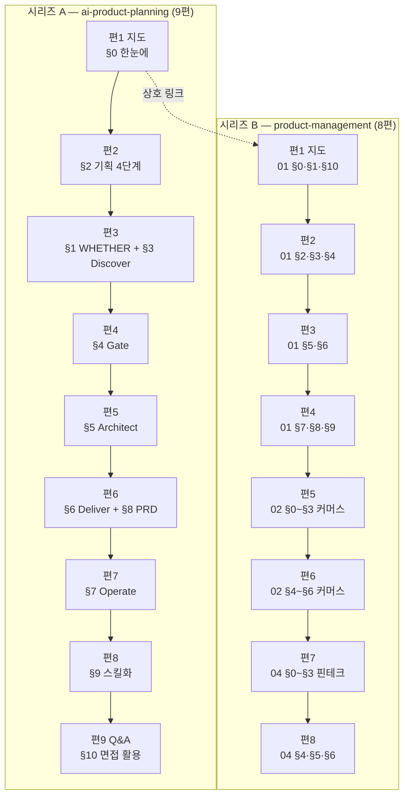

# `pm-harness/03` · `pm-po/01·02·04` 분할 설계 — 원본 4개를 **두 시리즈 17편**으로

> 작성 2026-08-30 · 범위 B 안(선별 이관) 확정 후 착수 · 앞 배치 `2026-08-29-auth-k8s-split-design.md` §10-8-g 규칙 14개를 승계한다

## 0. 이 배치가 앞 배치와 다른 네 가지

앞 배치까지는 **원본 1개를 여러 편으로 나누는** 일이었다. 이번은 **원본 4개를 두 시리즈로
나눠 담는** 일이고, 그래서 앞 배치의 모델을 그대로 쓸 수 없는 자리가 넷 생긴다.

| # | 무엇이 다른가 | 어디서 다루나 |
| ---: | --- | --- |
| ① | **시리즈가 둘이다.** 고정 비용이 발행 순서로 줄어드는 성질(C-8)이 시리즈마다 따로 시작한다 | §3-1 · 가설 H-1 |
| ② | **산문 24.6%** — 코퍼스 최대치다. 원본 문장을 그대로 옮길 위험이 역대 가장 높다 | §7-1 · §8-4 |
| ③ | **인용 11.7~24.9%** — 이제껏 독립 성분으로 다뤄본 적이 없는 크기다 | §2-5 · 가설 H-3 |
| ④ | 🔴 **배정 원본의 7.7% 가 발행 불가 자료다.** 「💼 면접 활용」 개인 경력 메모 20개 | §2-4-a · 가설 H-7 |

**넷 다 「앞 배치 값을 그대로 쓰면 틀리는」 자리다.** 각 절이 대안을 적는다.

④ 가 이번 배치의 가장 큰 특이점이고, **설계 초안을 뒤집은 유일한 발견**이다. 편수가 18에서
17로 줄고 시리즈 B 배정이 68,701 → 58,636 B 로 **14.7% 내려갔다**(뒤집어 보면 초안이
**17.2% 부풀어 있었다**). 자세한 경위는 §2-4-a · §2-4-b 에 있다.

⚠️ 같은 사실을 두 비율로 적은 것은 **분모가 다르기 때문**이다. 감소율의 분모는 초안값이고
부풀림률의 분모는 확정값이다. 앞 배치 §10-8 이 경고한 「분모를 확인하라」가 이 문서 안에서도
적용된다.

---

## 1. 절차

| # | 단계 | 상태 |
| ---: | --- | --- |
| ① | 원본 절별 **성분** 실측 | ✅ **완료** — §2 |
| ② | 편 구성·예산·태그·링크·위험·검증 설계 | ✅ **완료** — §3~§9 |
| ③ | **시리즈 A 편1(지도편)을 먼저 쓰고 실측으로 고정 비용을 확정** | ✅ **완료** — §10-1 |
| ④ | 🔴 **시리즈 A 편2를 쓰고 인용 비율을 실측해 편3 이후를 재환산** | ✅ **완료** — §10-2. 상수·k 모두 유지 |
| ⑤ | 🔴 **시리즈 B 편1에서 고정 비용을 다시 잰다** — 시리즈가 바뀌면 리셋되는지 판정 | 미착수 — §10-0 H-1 |
| ⑥ | 편마다 검증하고 **즉시 커밋** | 미착수 — §8 · §9-1 |
| ⑦ | `dup-scan` 은 편마다, 그리고 시리즈마다 배치 전체로 한 번 더 | 미착수 — §8-4 |
| ⑧ | 커밋은 `git commit -m "…" -- <경로>` 형태 | 미착수 |

**앞 배치와 달라진 것은 ⑤ 하나다.** 재환산 지점이 둘에서 셋으로 늘어난다 — 시리즈 경계가
고정 비용을 리셋하는지가 미지수이기 때문이다.

규칙 9(검사기 자기 증명을 먼저)는 이행했다 — `npm run compose:verify` 가 **9/9** 를 낸 뒤에
§2 의 수치를 받았다. **증명 없는 수치는 거짓 수치와 구분되지 않는다.**

### 1-1. 원본 경로 — 🔴 어느 문서에도 적혀 있지 않았다

```
C:/Users/aeby/vscode/yanadoo-exit/shared/knowledge/pm-harness/
C:/Users/aeby/vscode/yanadoo-exit/shared/knowledge/pm-po/
```

이 배치를 시작할 때 경로를 몰라 `java-backend`·`langgraph` 같은 **다른 폴더명으로 역추적**해야
했다. HANDOFF 도 요구사항 문서도 폴더명만 적고 루트를 적지 않았다.
⇒ **다음 배치도 같은 일을 겪지 않도록 이 절을 남긴다.**

### 1-2. 앞 배치 §10-8-g 가 물려준 14개 규칙의 처리

| # | 규칙 | 이 설계서가 어디서 지켰나 |
| ---: | --- | --- |
| 1 | 고정 비용 상수는 **2,440 ~ 2,470** | §3-2 — 2,455 를 상수로 넣었다. 다만 시리즈 경계 리셋 여부는 H-1 이 판정한다 |
| 2 | C-1 은 **배치 평균에만** 쓴다 | §3-5 — 편 단위 판정은 밴드로만 한다 |
| 3 | 표 비율은 **합치기의 축**이 정한다. 열 합치기는 절감 수단이 아니다 | §3-2-b — 절마다 「행을 겹치는가」로 적었다 |
| 4 | 불릿은 독립 성분이 아니다 | §2-4 — 이번 원본은 불릿이 애초에 0.4~16.1% 다. §2-5 가 대신 **인용**을 새 변수로 잡는다 |
| 5 | 도식 비율은 **1.263** | §3-3 — 도식 예산의 계수로 그대로 썼다 |
| 6 | 링크 몫 공식은 **슬러그 길이 + 31** | §3-0-a — 본편·Q&A편 **15편** 전부 계산했다. 지도편 2편은 §3-1 의 고정 비용 방식이라 대상이 아니다 |
| 7 | 🔴 **자기 산출물을 자기가 짠 검사로 검증한 결과는 리뷰 대상이다** | §8-1 ⑧ · §8-3 |
| 8 | 🔴 축자 겹침 브리프에 **「대조 범위는 원본 전체다」** 명시 | §8-4 — 브리프 문구를 그대로 박았다 |
| 9 | 🔴 Q&A편 발행 전에 **형제편 outbound 를 세는 명령**을 실행 | §6-1 말미 — 명령을 코드 블록으로 넣었다 |
| 10 | 🔴 §6-3 접합부는 **grep 으로 낱말 실재를 확인**하고 행 번호를 적어라 | §6-3 — 표에 행 번호 열을 만들었다 |
| 11 | 처방 세 줄을 **그대로 물려라** | §8-3 — 세 줄을 브리프 고정 문구로 넣었다 |
| 12 | 리뷰는 **두 축으로 나눠** 돌려라 | §8-3 |
| 13 | 🔴 **원본이 나눈 층을 발행본이 합치면 사실이 뒤집힌다** | §7-2 — 이번 원본의 해당 자리를 미리 지목했다 |
| 14 | 초고 직후 `compose` 를 먼저 돌려라 | §8-2 |

14개가 모두 자리를 얻었다. 규칙이 살아 있는지는 §10 이 판정한다.

---

## 2. 원본 실측

`npm run compose -- <원본>` 출력이다. 자기 검사 **9/9** 통과 뒤에 받았다.

### 2-1. 원본 4개 총괄

| 원본 | 합계 B | 산문% | 표% | 코드% | 도식% | 불릿% | 인용% | 도식 수 |
| --- | ---: | ---: | ---: | ---: | ---: | ---: | ---: | ---: |
| `pm-harness/03` 기획 하네스 | 76,934 | 5.8 | 61.3 | 7.5 | 6.2 | 0.4 | 11.7 | 13 |
| `pm-po/01` 프로덕트 개론 | 32,809 | 17.6 | 38.8 | 0.0 | 4.0 | 16.1 | 18.6 | 3 |
| `pm-po/02` 커머스 | 18,026 | 19.7 | 43.4 | 0.0 | 4.5 | 6.1 | 20.2 | 3 |
| `pm-po/04` 핀테크 | 20,724 | 24.6 | 33.5 | 0.0 | 3.8 | 7.3 | 24.9 | 3 |
| **합계** | **148,493** | | | | | | | **22** |

**이 표가 말하는 것**: 두 원본군은 성분이 정반대다. `pm-harness` 는 표 61% · 산문 6% 의
**정리형** 문서이고, `pm-po` 는 산문 18~25% · 인용 19~25% 의 **서술형** 문서다.
⇒ **두 시리즈에 같은 예산 모델을 쓰면 한쪽이 반드시 빗나간다.** §3-2 가 k 를 시리즈별로 나눈다.

### 2-2. 절별 성분 — 시리즈 A (`pm-harness/03`)

| 절 | 합계 B | 산문% | 표% | 코드% | 도식% | 인용% | 도식 수 |
| --- | ---: | ---: | ---: | ---: | ---: | ---: | ---: |
| (머리말) | 1,034 | 0.4 | 0.0 | 0.0 | 0.0 | 99.4 | 0 |
| §0 한눈에 보기 | 8,646 | 6.0 | 71.3 | 0.0 | 10.1 | 8.6 | 2 |
| §1 WHETHER 3질문 | 5,163 | 3.4 | 54.4 | 0.0 | 8.5 | 18.0 | 1 |
| §2 기획 4단계 | 9,769 | 12.0 | 55.9 | 0.0 | 5.0 | 19.2 | 2 |
| §3 Discover | 4,773 | 0.1 | 73.5 | 0.0 | 7.2 | 13.5 | 1 |
| §4 Gate | 6,971 | 6.9 | 61.0 | 0.0 | 12.0 | 12.7 | 2 |
| §5 Architect | 6,428 | 7.0 | 65.4 | 0.0 | 5.6 | 12.7 | 1 |
| §6 Deliver | 4,612 | 2.3 | 69.1 | 6.6 | 10.8 | 0.0 | 1 |
| §7 Operate | 6,493 | 5.2 | 65.8 | 0.0 | 10.0 | 9.6 | 2 |
| §8 PRD Writer | 4,721 | 4.8 | 69.8 | 16.1 | 0.0 | 0.0 | 0 |
| §9 스킬화·Package-and-Ship | 7,624 | 7.4 | 55.9 | 22.8 | 3.8 | 3.3 | 1 |
| §10 면접 활용 | 6,931 | 0.1 | 83.1 | 0.0 | 0.0 | 13.5 | 0 |
| 부록 A 명령 치트시트 | 1,111 | 12.5 | 0.0 | 82.5 | 0.0 | 0.0 | 0 |
| 부록 B 복붙 프롬프트 | 2,658 | 10.6 | 0.0 | 75.9 | 0.0 | 11.1 | 0 |

### 2-3. 절별 성분 — 시리즈 B (`pm-po/01·02·04`)

<details>
<summary>세 원본의 절별 표 (펼치기)</summary>

**`pm-po/01` 프로덕트 개론**

| 절 | 합계 B | 산문% | 표% | 도식% | 불릿% | 인용% |
| --- | ---: | ---: | ---: | ---: | ---: | ---: |
| (머리말) | 722 | 0.6 | 0.0 | 0.0 | 0.0 | 91.1 |
| §0 용어 풀이 | 1,551 | 0.3 | 98.3 | 0.0 | 0.0 | 0.0 |
| §1 제품의 이해 | 4,797 | 5.6 | 48.6 | 8.9 | 15.2 | 16.0 |
| §2 PM 역할과 이해관계자 | 2,644 | 8.6 | 62.9 | 0.0 | 0.0 | 20.7 |
| §3 제품조직 | 1,962 | 0.2 | 27.9 | 30.7 | 11.1 | 27.1 |
| §4 제품전략 | 3,731 | 21.8 | 40.5 | 0.0 | 15.1 | 18.8 |
| §5 제품전술 | 2,474 | 30.9 | 32.5 | 0.0 | 13.2 | 16.3 |
| §6 제품 목표수립 | 4,114 | 14.7 | 44.8 | 6.6 | 15.1 | 14.7 |
| §7 제품기획 | 3,584 | 21.6 | 25.8 | 0.0 | 36.0 | 13.3 |
| §8 제품관리 | 2,126 | 30.5 | 19.8 | 0.0 | 24.9 | 19.4 |
| §9 심화 과정 | 4,048 | 41.0 | 11.4 | 0.0 | 25.2 | 18.6 |
| §10 결론 | 325 | 1.2 | 0.0 | 0.0 | 0.0 | 80.0 |
| §11 다른 파트와의 연계 | 731 | 0.0 | 95.1 | 0.0 | 0.0 | 0.0 |

**`pm-po/02` 커머스**

| 절 | 합계 B | 산문% | 표% | 도식% | 불릿% | 인용% |
| --- | ---: | ---: | ---: | ---: | ---: | ---: |
| (머리말) | 615 | 0.7 | 0.0 | 0.0 | 0.0 | 92.5 |
| §0 용어 풀이 | 945 | 0.4 | 97.1 | 0.0 | 0.0 | 0.0 |
| §1 커머스의 이해 | 2,850 | 5.3 | 55.1 | 10.1 | 8.5 | 15.1 |
| §2 회원 도메인 | 1,632 | 22.7 | 28.2 | 17.6 | 0.0 | 24.9 |
| §3 상품 도메인 | 3,221 | 13.2 | 51.8 | 0.0 | 10.9 | 17.2 |
| §4 가격 도메인 | 1,775 | 21.6 | 50.9 | 0.0 | 0.0 | 21.1 |
| §5 주문 도메인 | 3,972 | 39.5 | 32.8 | 6.1 | 4.2 | 12.0 |
| §6 케이스 스터디 | 3,016 | 21.4 | 33.0 | 0.0 | 11.6 | 27.4 |

**`pm-po/04` 핀테크**

| 절 | 합계 B | 산문% | 표% | 도식% | 불릿% | 인용% |
| --- | ---: | ---: | ---: | ---: | ---: | ---: |
| (머리말) | 790 | 0.5 | 0.0 | 0.0 | 0.0 | 88.5 |
| §0 용어 풀이 | 1,423 | 0.3 | 98.1 | 0.0 | 0.0 | 0.0 |
| §1 핀테크 정의 | 1,527 | 32.0 | 20.7 | 0.0 | 0.0 | 35.2 |
| §2 전자금융 관련 법 | 2,917 | 25.3 | 25.0 | 9.4 | 9.7 | 25.0 |
| §3 오픈뱅킹 | 3,013 | 15.4 | 40.4 | 7.7 | 9.4 | 21.2 |
| §4 마이데이터 | 4,142 | 38.3 | 14.8 | 6.8 | 18.2 | 15.9 |
| §5 업권 경쟁 구도 | 2,325 | 16.1 | 45.2 | 0.0 | 0.0 | 34.4 |
| §6 스페셜 — 마이데이터 추가 논점 | 4,587 | 31.2 | 35.4 | 0.0 | 4.1 | 24.0 |

</details>

### 2-4. 배정에서 빼는 조각 — **7,661 B**

| 조각 | B | 왜 빼나 |
| --- | ---: | --- |
| 머리말 4개 | 3,161 | 원본 문서의 메타 정보다. 발행본에 대응물이 없다 |
| `pm-harness/03` 부록 A | 1,111 | 원본이 **「원형 보존」**이라고 명시한 명령 치트시트다. 코드 82.5% 로, 발행본에 옮기면 축자 겹침이 대량 발생한다 |
| `pm-harness/03` 부록 B | 2,658 | 같은 이유. 코드 75.9% 의 복붙 프롬프트다 |
| `pm-po/01` §11 다른 파트와의 연계 | 731 | 원본 문서 사이의 링크표다. 발행본의 링크 구조는 §6 이 따로 설계한다 |
| 🔴 **「💼 면접 활용」 블록 20개** | **10,065** | **§2-4-a 가 따로 다룬다** |
| **합계** | **17,726** | |

`pm-harness/03` §10 면접 활용(6,931)은 **빼지 않는다.** 하위 절 10-4 의 「주의」 4항목까지
Q&A편의 소재가 된다. 절 제목이 같지만 §2-4-a 의 블록과는 다른 것이다.

| 시리즈 | 원본 합계 | 뺀 값 | **배정 원본** |
| :---: | ---: | ---: | ---: |
| A | 76,934 | 1,034 + 1,111 + 2,658 | **72,131** |
| B | 71,559 | 2,127 + 731 + 10,065 | **58,636** |
| | | **총계** | **130,767** |

> ⚠️ 앞 배치 §10-8 이 경고한 자리다. **총량 비율을 볼 때 분모를 확인하라.**
> 원본 전체 148,493 이 아니라 **배정 130,767** 이 이 설계서 전체의 분모다.

#### 2-4-a. 🔴 「💼 면접 활용」 블록 — **`pm-po` 원본의 14.6% 가 발행 불가 자료다**

`pm-po` 세 원본에는 `> 💼 **면접 활용** — …` 형태의 인용 블록이 **20개** 있다. 원본 내용을
저자의 이력서·경력에 연결하는 개인 메모이고, **금칙어가 전부 이 블록 안에 있다.**

| 원본 | 블록 | B | 금칙어 |
| --- | ---: | ---: | --- |
| `pm-po/01` | 9 | 4,886 | 야나두 3 · TVING 3 · 커머스개발 1 |
| `pm-po/02` | 5 | 2,187 | 야나두 2 · 커머스개발 1 |
| `pm-po/04` | 6 | 2,992 | 야나두 1 |
| `pm-harness/03` | **0** | 0 | 허우용 1 · 패스트캠퍼스 1 (머리말 — 이미 뺐다) |
| **합계** | **20** | **10,065** | **14건** |

**⇒ 판정: 20개 블록을 배정에서 전량 뺀다.** 근거는 셋이 겹친다.

| 근거 | 무엇을 막나 |
| --- | --- |
| `CR-2.1` | 「면접에서 자주 나오는」 같은 **수식이 있으면 안 된다.** 블록 형식 자체가 위반이다 |
| `CR-2.4` | **개인 경력 서사를 제거**한다 |
| 금지선 44 | **지운 자리를 일반화로 메우지 마라.** 새로 쓴 문장은 지적 타율 100% 다 |

살려서 익명화하는 길은 세 번째 근거가 막는다. 회사명을 걷어내면 블록의 요지(「내 경력의
이 대목이 저 개념에 해당한다」)가 통째로 사라지고, 남는 자리를 메우는 순간 **원본이 하지
않은 주장**이 생긴다. `PUBLISHING-CHECKLIST.md` §4 가 「삭제와 최소 치환을 우선 채택하라」고
정한 이유가 그것이다.

절별 분포는 §3-0 의 시리즈 B 배정표에 반영했다.

#### 2-4-b. 🔴 이 절이 두 번 틀렸다 — 둘 다 **합계를 믿어서** 생겼다

| # | 무엇이 틀렸나 | 어떻게 잡았나 |
| ---: | --- | --- |
| ① | 빼는 조각 합계를 **8,946** 으로 적었다. 네 행을 더하면 7,661 이다 | **처방 ③** — 「합계가 맞는지 보지 말고 각 행을 1:1 로 짚어라」 |
| ② | 「💼 면접 활용」 블록 10,065 B 를 **아예 못 봤다.** 성분표의 인용% 안에 섞여 보이지 않았다 | 원본에 금칙어가 실재하는지 **직접 grep** 했다 |

②가 더 무겁다. `compose` 는 인용을 **한 성분으로** 셀 뿐 그 인용이 발행 가능한지는 모른다.
**성분 실측이 통과했다는 것은 배정이 타당하다는 뜻이 아니다.**

⇒ 🔴 **다음 배치로 물릴 규칙: 성분 실측 다음 단계는 「배정 원본에 금칙어가 실재하는지
직접 세는 것」이다.** 이 배치는 그 검사가 없어 설계 초안이 시리즈 B 예산을 **17.2% 부풀린 채**
편 구성까지 확정했다.

측정 명령은 아래다. `LC_ALL=C` 가 빠지면 이모지 패턴이 조용히 0을 낸다 — 실제로 이 배치에서
같은 패턴이 로케일 유무에 따라 9와 0으로 갈렸다.

```bash
R="<원본 루트>"
for w in 야나두 yanadoo 히츠 티빙 TVING 커머스개발 허우용 패스트캠퍼스 아르고스 실장; do
  n=$(LC_ALL=C grep -o "$w" "$R/<파일>" | wc -l)
  [ "$n" -gt 0 ] && printf "  %-14s %s\n" "$w" "$n"
done
```

### 2-5. 🔴 이번 배치의 새 변수는 **인용**이다

앞 배치의 새 변수는 불릿이었고, C-7 은 「불릿은 표와 산문으로 갈라진다」로 확정됐다.
이번 원본에서 불릿은 0.4~16.1% 로 이미 작다. 대신 **인용이 크다.**

| 성분 | 앞 배치 원본 | 이번 배치 (배정 가중평균) | 차 |
| --- | ---: | ---: | ---: |
| 산문 | 8.5% | **11.6%** | +3.1 |
| 표 | — | **51.3%** | — |
| 인용 | (미측정) | **15.9%** | — |
| 불릿 | 24.5% | **5.6%** | −18.9 |

인용문이 원본에서 하는 일은 **셋**이다. 초안은 둘로 봤는데, §2-4-a 가 세 번째를 찾았다.

| # | 용도 | 크기 | 발행본에서 |
| ---: | --- | ---: | --- |
| ① | 절 도입의 한 줄 요약 (머리말 88~99% 가 전부 이것이다) | 3,161 | 도입 **산문**으로 푼다 (§7-3) |
| ② | 실무 조언의 강조 | 나머지 | 인용으로 남거나 표로 접힌다 |
| ③ | 🔴 **저자 경력 메모** (`> 💼 **면접 활용**`) | **10,065** | **옮기지 않는다** (§2-4-a) |

③이 `pm-po` 인용의 절반 가까이를 차지한다. **인용%가 크다는 관측 자체는 맞았으나, 그 크기를
「발행본에 옮길 소재」로 읽은 것이 틀렸다.**

⇒ 🔴 **가설 H-3 을 다시 쓴다**(§10-0). 「인용은 산문과 표로 갈라진다」가 아니라
**「인용은 세 용도로 갈라지고, 그중 하나는 배정 대상이 아니다」**이다. 배정에 남은 ①·② 의
배율은 시리즈 B 편2 초고 `compose` 로 재고 편3 이후를 재환산한다.

---

## 3. 편 구성과 예산

### 3-0. 절 배정 — **두 시리즈 17편**



🔴 **시리즈 B 가 9편에서 8편으로 줄었다.** §2-4-a 가 배정 원본을 10,065 B 줄이자 핀테크 3편
구성(편7 원본 4,928 B)의 목표가 **12,606 B** 로 하한 13,300 을 밑돌았다. 절을 다시 묶어
2편으로 합쳤다. **하한이 편수를 정한 첫 사례다.**

**두 시리즈는 지도편끼리 상호 링크한다.** 「기획 공정」(A)과 「도메인 지식」(B)은 같은 직무의
두 축이므로, 독자가 어느 쪽으로 들어와도 다른 쪽을 찾을 수 있어야 한다.

#### 시리즈 A 절 배정 — 배정 원본 **72,131 B**

| 편 | 슬러그 | 절 | 원본 B |
| :---: | --- | --- | ---: |
| 1 지도 | `planning-harness-map` | §0 | 8,646 |
| 2 | `four-stages-of-planning` | §2 | 9,769 |
| 3 | `whether-three-questions` | §1 + §3 | 9,936 |
| 4 | `whether-gate` | §4 | 6,971 |
| 5 | `architect-stage` | §5 | 6,428 |
| 6 | `deliver-and-prd` | §6 + §8 | 9,333 |
| 7 | `operate-stage` | §7 | 6,493 |
| 8 | `skill-packaging` | §9 | 7,624 |
| 9 Q&A | `planning-harness-qna` | §10 | 6,931 |
| | | **합계** | **72,131** |

#### 시리즈 B 절 배정 — 배정 원본 **58,636 B**

원본 B 는 **「💼 면접 활용」 블록을 뺀 값**이다. 괄호 안이 뺀 크기다.

| 편 | 슬러그 | 절 | 원본 B | (뺀 값) |
| :---: | --- | --- | ---: | ---: |
| 1 지도 | `product-management-map` | 01 §0 · §1 · §10 | **6,019** | 654 |
| 2 | `product-org-and-strategy` | 01 §2 · §3 · §4 | **6,761** | 1,576 |
| 3 | `tactics-and-goal-setting` | 01 §5 · §6 | **5,590** | 998 |
| 4 | `planning-and-product-ops` | 01 §7 · §8 · §9 | **8,101** | 1,657 |
| 5 | `commerce-member-and-catalog` | 02 §0 · §1 · §2 · §3 | **7,830** | 818 |
| 6 | `commerce-pricing-and-order` | 02 §4 · §5 · §6 | **7,394** | 1,369 |
| 7 | `fintech-regulation-and-open-banking` | 04 §0 · §1 · §2 · §3 | **7,522** | 1,358 |
| 8 | `mydata-and-market-structure` | 04 §4 · §5 · §6 | **9,419** | 1,635 |
| | | **합계** | **58,636** | **10,065** |

두 표의 합계 72,131 · 58,636 은 §2-4 의 배정 원본과 일치하고, 뺀 값 합계 10,065 는 §2-4-a 와
일치한다. **원본 절이 빠짐없이 어느 한 편에 배정됐고, 뺀 블록도 빠짐없이 회수됐다는 뜻이다.**

⚠️ 편7·편8 의 슬러그가 바뀌었다. 3편이 2편으로 합쳐지면서 `open-banking-and-mydata` 가
둘로 갈렸다 — 오픈뱅킹은 편7의 규제 흐름에, 마이데이터는 편8의 시장 구조에 붙는다.

#### 3-0-a. 링크 몫 — 규칙 6

앞 배치가 세 번 검증한 공식을 그대로 쓴다.

> **링크 몫 = 슬러그 길이 + 31 B**

| 시리즈 | 편 | 슬러그 길이 | 링크 몫 |
| :---: | :---: | ---: | ---: |
| A | 2 `four-stages-of-planning` | 23 | 54 |
| A | 3 `whether-three-questions` | 23 | 54 |
| A | 4 `whether-gate` | 12 | 43 |
| A | 5 `architect-stage` | 15 | 46 |
| A | 6 `deliver-and-prd` | 15 | 46 |
| A | 7 `operate-stage` | 13 | 44 |
| A | 8 `skill-packaging` | 15 | 46 |
| A | 9 `planning-harness-qna` | 20 | 51 |
| B | 2 `product-org-and-strategy` | 24 | 55 |
| B | 3 `tactics-and-goal-setting` | 24 | 55 |
| B | 4 `planning-and-product-ops` | 24 | 55 |
| B | 5 `commerce-member-and-catalog` | 27 | 58 |
| B | 6 `commerce-pricing-and-order` | 26 | 57 |
| B | 7 `fintech-regulation-and-open-banking` | 35 | 66 |
| B | 8 `mydata-and-market-structure` | 27 | 58 |

🔴 규칙 6 은 이 공식이 **굵게 처리 상태를 전제**한다고 못박았다. 링크를 `**[텍스트](경로)**`
형태로 감싸면 몫이 4 B 늘어난다. 브리프에 **「링크에 굵게를 겹치지 마라」**를 넣는다.

### 3-1. 지도편 — 고정 비용 방식 · **시리즈마다 따로 잰다**

지도편은 원본 절의 배율로 잡지 않는다. 앞 배치 편1 실측이 **21,715 B** 였고, 그 편의 성격
(용어 전량 승계 + 전체 조망 + 형제편 예고)은 이번 두 지도편과 같다.

| 시리즈 | 지도편 | 승계 용어 | 예고할 형제편 | **목표 B** |
| :---: | --- | ---: | ---: | ---: |
| A | `planning-harness-map` | §0 표에서 추출 (편1 집필 시 확정) | 8 | **21,000** |
| B | `product-management-map` | 01·02·04 §0 용어 3표 = **합산 후 중복 제거** | 8 | **21,000** |

🔴 **시리즈 B 지도편의 용어 승계가 앞 배치와 다르다.** 앞 배치는 원본 1개의 용어표 하나를
승계했는데, 이번 B 는 **원본 3개에 §0 용어 풀이가 각각 있다**(1,551 · 945 · 1,423 B).
셋을 그대로 이으면 중복이 남는다. ⇒ **편1 집필 전에 세 표를 합쳐 중복을 제거하고, 남은
개수를 §10-1 에 기록하라.** 그 개수가 용어당 B 를 확정하는 입력이다.

### 3-2. 본편 예산 — **k 를 시리즈별로 나눈다**

앞 배치가 확정한 형태를 쓰되, k 를 하나로 두지 않는다.

> **목표 B = 2,455 + 원본 B × k + 링크 몫**

고정 비용 2,455 는 규칙 1(2,440 ~ 2,470)의 중앙값이다. k 는 앞 배치 본편 넷의 실측에서
역산했다.

| 앞 배치 편 | 실측 B | 고정 비용 | 링크 | 원본 B | 역산 k |
| :---: | ---: | ---: | ---: | ---: | ---: |
| 2 | 21,318 | 3,026 | 55 | 9,307 | 1.960 |
| 3 | 17,958 | 2,715 | 62 | 8,007 | 1.896 |
| 4 | 17,373 | 2,518 | 64 | 7,168 | 2.063 |
| 5 | 19,450 | 2,462 | 50 | 8,942 | 1.894 |
| | | | | **평균** | **1.953** |

🔴 **그런데 이 k 를 두 시리즈에 그대로 쓰면 안 된다.** 앞 배치 원본은 산문 8.5% 였고,
§10-7-c 가 「배율이 원본 본문의 **성질**에 따라 2.626 ~ 3.893 으로 흔들린다」고 확정했다.

| 시리즈 | 원본 성분 | 앞 배치 대비 | **채택 k** | 근거 |
| :---: | --- | --- | ---: | --- |
| A | 표 61% · 산문 5.8% | 표가 훨씬 많다 | **1.85** | 표는 옮길 때 부풀지 않는다. 앞 배치 편3·편5(표 비율 낮은 편)의 k 1.89 를 하향 조정 |
| B | 산문 18~25% · 인용 19~25% | 산문이 3배 | **2.05** | 산문은 풀어 쓰면 늘어난다. 앞 배치 편4(산문 최다)의 k 2.063 을 채택 |

**밴드는 k ± 0.14 다** — 앞 배치 실측 넷(1.894 ~ 2.063)을 감싸는 최소 폭이다.

#### 시리즈 A 예산 (k = 1.85 · 밴드 1.71 ~ 1.99)

| 편 | 원본 B | 2,455 + 원본×1.85 | +링크 | **목표 B** | 겉보기 | 밴드 |
| :---: | ---: | ---: | ---: | ---: | ---: | --- |
| 2 | 9,769 | 20,528 | 54 | **20,582** | 2.107 | 19,215 ~ 21,950 |
| 3 | 9,936 | 20,837 | 54 | **20,891** | 2.103 | 19,505 ~ 22,275 |
| 4 | 6,971 | 15,351 | 43 | **15,394** | 2.208 | 14,420 ~ 16,370 |
| 5 | 6,428 | 14,347 | 46 | **14,393** | 2.239 | 13,495 ~ 15,295 |
| 6 | 9,333 | 19,721 | 46 | **19,767** | 2.118 | 18,460 ~ 21,075 |
| 7 | 6,493 | 14,467 | 44 | **14,511** | 2.235 | 13,605 ~ 15,420 |
| 8 | 7,624 | 16,559 | 46 | **16,605** | 2.178 | 15,540 ~ 17,670 |

#### 시리즈 B 예산 (k = 2.05 · 밴드 1.91 ~ 2.19)

원본 B 는 **「💼 면접 활용」 블록을 뺀 값**이다(§2-4-a).

| 편 | 원본 B | 2,455 + 원본×2.05 | +링크 | **목표 B** | 겉보기 | 밴드 |
| :---: | ---: | ---: | ---: | ---: | ---: | --- |
| 2 | 6,761 | 16,315 | 55 | **16,370** | 2.421 | 15,425 ~ 17,320 |
| 3 | 5,590 | 13,914 | 55 | **13,969** | 2.499 | **13,187** ~ 14,752 |
| 4 | 8,101 | 19,062 | 55 | **19,117** | 2.360 | 17,985 ~ 20,250 |
| 5 | 7,830 | 18,507 | 58 | **18,565** | 2.371 | 17,470 ~ 19,660 |
| 6 | 7,394 | 17,613 | 57 | **17,670** | 2.390 | 16,635 ~ 18,705 |
| 7 | 7,522 | 17,875 | 66 | **17,941** | 2.385 | 16,890 ~ 18,995 |
| 8 | 9,419 | 21,764 | 58 | **21,822** | 2.317 | 20,505 ~ 23,140 |

#### 3-2-a. 🔴 하한 제약 — **편 구성을 바꾼 첫 배치다**

`MIN_BYTES` 는 **13,300 B** 다(`tests/blog/content/schema.test.ts:16` · SOFT 게이트).
k = 2.05 에서 이 하한이 요구하는 최소 원본은 **5,263 B**, 밴드 하단 기준으로는 **5,649 B** 다.

| 시리즈 | 편 | 밴드 하단 | 하한 대비 |
| :---: | :---: | ---: | ---: |
| B | **3** | **13,187** | 🔴 **−113** |
| A | **5** | **13,495** | +195 |
| A | **7** | **13,605** | +305 |
| A | 4 | 14,420 | +1,120 |

🔴 **B-3 만 밴드 하단이 하한을 밑돈다(−113 B).** A-5 · A-7 은 하단이 하한을 넘지만 여유가
200~300 B 뿐이라 같이 관리한다. 앞 배치는 가장 좁은 편의 여유가 1,890 B 였다.

그리고 초안의 핀테크 3편 구성은 **목표 자체가** 하한을 밑돌았다(편7 12,606 B). 이것은
반려선으로 관리할 수 있는 문제가 아니라 **편 구성이 틀린 것**이므로 2편으로 합쳤다.

| 판정 | 조치 |
| --- | --- |
| 목표 B 가 하한 미만 | **편 구성을 고친다.** 절을 다시 묶는다 |
| 밴드 하단만 하한 미만 | **반려선으로 관리한다.** 구성은 유지한다 |

⇒ 🔴 **집필 브리프 반려선**: B-3 · A-5 · A-7 은 초고가 **13,300 B 를 밑돌면 반려**한다.
인접 편에 합치지 말고 — 세 편 모두 주제가 독립적이다 — **원본 인용 ①·② 를 표로 펴서
채운다**(§2-5). 🔴 **③ 경력 메모로 채우는 것은 금지다.**

#### 3-2-b. 표를 합칠 계획 — 규칙 3

규칙 3 은 「표 비율을 정하는 것은 **행을 겹치는가**이고, 열 추가는 상한에서 0.03 밖에 못
내린다」고 확정했다. 그래서 절마다 **행 겹침 여부**로 적는다.

| 시리즈 | 편 | 원본 표 성격 | 행을 겹치는가 | 예상 표 비율 |
| :---: | :---: | --- | --- | ---: |
| A | 2 | 4단계 × 산출물 표가 단계마다 하나씩 | 🔴 **겹친다** — 4표를 「단계 → 산출물 → 판정 기준」 1표로 | ≈ 1.00 |
| A | 3 | WHETHER 3질문 표 + Discover 도구 표 | 겹치지 않는다 — 축이 다르다 | ≈ 1.30 |
| A | 4 | Gate 통과 기준표 2개 | 🔴 **겹친다** — 통과·반려를 한 표의 두 열로 | ≈ 1.05 |
| A | 5 | Architect 산출물 표 | 겹치지 않는다 | ≈ 1.30 |
| A | 6 | Deliver 체크리스트 + PRD 항목표 | 겹치지 않는다 — 서로 다른 산출물 | ≈ 1.25 |
| A | 7 | Operate 지표표 2개 | 🔴 **겹친다** — 지표·주기를 한 표로 | ≈ 1.05 |
| A | 8 | 스킬 패키징 단계표 | 겹치지 않는다 | ≈ 1.30 |
| B | 2 | 역할표 · 조직 비교표 · 전략 프레임표 | 겹치지 않는다 — 셋이 다른 층위다 | ≈ 1.35 |
| B | 3 | 전술표 + OKR 표 | 겹치지 않는다 | ≈ 1.30 |
| B | 4 | 기획·관리·심화 표 다수 | 🔴 **겹친다** — 기획 산출물표와 관리 체크표를 「단계 → 산출물 → 점검」 1표로 | ≈ 1.05 |
| B | 5 | 회원·상품 도메인 표 | 겹치지 않는다 — 도메인이 다르다 | ≈ 1.35 |
| B | 6 | 가격·주문·케이스 표 | 겹치지 않는다 | ≈ 1.35 |
| B | 7 | 법령 표 2개 + 오픈뱅킹 API 표 | 🔴 **법령만 겹친다** — 전자금융법·시행령을 한 표의 **두 열**로. API 표는 축이 달라 유지 | ≈ 1.15 |
| B | 8 | 마이데이터 표 + 업권 비교표 + 스페셜 논점 | 겹치지 않는다 — §7-2 가 「확정 제도와 논의 중인 쟁점을 섞지 마라」로 막는다 | ≈ 1.35 |

### 3-3. 도식 예산 — 규칙 5

도식 비율 **1.263** 을 쓴다. 앞 배치 편4의 1.14 는 복사본이 섞인 오염 표본이었으므로 쓰지 않는다.

| 시리즈 | 원본 도식 B | 원본 도식 수 | 예상 발행 도식 B | 편수 | 편당 평균 |
| :---: | ---: | ---: | ---: | ---: | ---: |
| A | 4,785 | 13 | **6,043** | 9 | 671 |
| B | 2,905 | 9 | **3,669** | 8 | 459 |

🔴 **A 는 도식이 13개인데 B 는 9개다.** 편당으로는 A 1.4개 · B 1.1개다. 두 시리즈의 도식
밀도가 다르다는 사실을 브리프에 적어야 한다 — **B 시리즈에 A 와 같은 밀도를 요구하면
근거 없는 도식이 만들어진다.**

⚠️ 도식 B 는 §2-4-a 의 차감에 영향받지 않는다. 「💼 면접 활용」은 인용 블록이라 도식을
담지 않는다. **성분마다 차감 대상이 다르다는 것을 예산 계산에서 혼동하지 마라.**

### 3-4. A-9(Q&A편) — 항목 패리티 · **두 방식이 교차 검증된다**

Q&A편은 원본 배율이 아니라 **항목 수**로 잡는 것이 앞 배치의 방식이다. 원본 §10 의 항목을
하위 절별로 셌다(헤더 행 제외).

| 하위 절 | 항목 |
| --- | ---: |
| 10-1 네 개의 연결 축 | 4 |
| 10-2 예상 질문 → 30초 답변 뼈대 | 8 |
| 10-3 면접 대화용 어휘 | 10 |
| 10-4 사용 시 반드시 지킬 것 | 4 |
| **합계** | **26** |

| 방식 | 계산 | 값 |
| --- | --- | ---: |
| 항목 패리티 | 2,455 + 26 × 471 + 51 | 14,752 |
| 원본 배율 (k = 1.85) | 2,455 + 6,931 × 1.85 + 51 | 15,328 |
| **채택** | 두 값의 중앙 | **15,000** |

항목당 471 B 는 앞 배치 편6(42항목 · 19,777 B 실측)에서 고정 비용과 링크를 뺀 값이다.
**두 방식이 576 B(3.8%) 안에서 만나므로 어느 쪽도 단독으로 틀리지 않았다.**

🔴 **A-9 브리프 첫 줄: 「26항목 밖의 절을 만들지 마라」**(규칙 5 의 승계).

### 3-5. 배치 총량

| 시리즈 | 편수 | 지도 | 본편 | Q&A | **합계** |
| :---: | ---: | ---: | ---: | ---: | ---: |
| A | 9 | 21,000 | 122,143 | 15,000 | **158,143** |
| B | 8 | 21,000 | 125,454 | — | **146,454** |
| | **17** | | | **총계** | **304,597** |

배정 원본 130,767 대비 겉보기 **2.329** 다. 앞 배치 실측 2.390 보다 낮은 것은 시리즈 A 의
k 를 1.85 로 내렸기 때문이며, 의도한 결과다.

⚠️ 규칙 2 — **이 2.329 는 배치 평균에만 쓴다.** 편 단위 판정은 §3-2 의 밴드로만 한다.

| 항목 | 초안 | 확정 | 차 |
| --- | ---: | ---: | ---: |
| 편수 | 18 | **17** | −1 |
| 배정 원본 | 139,547 | **130,767** | −8,780 |
| 발행 총량 | 324,688 | **304,597** | −20,091 |

**초안과 확정의 차 20,090 B 는 발행본 한 편 크기의 약 1.1배다.** §2-4-a 의 검사가 없었다면
그만큼을 「쓸 수 있다」고 계획한 채 착수했을 것이다.

### 3-6. 🔴 재환산 지점이 **셋**이다

| 지점 | 언제 | 무엇을 재는가 | 무엇을 다시 긋는가 |
| :---: | --- | --- | --- |
| ① | A 편1 발행 뒤 | 고정 비용 · 용어당 B | A 편2~9 |
| ② | A 편2 발행 뒤 | **인용 배율**(H-3) · 표 비율 | A 편3~9 |
| ③ | **B 편1 발행 뒤** | 고정 비용이 **리셋되는가**(H-1) | B 편2~9 전부 |

③ 이 이번 배치에만 있는 지점이다. C-8(고정 비용은 발행 순서로 단조 감소해 2,440 대로 수렴)이
**시리즈 경계에서 리셋되는지 아니면 카테고리와 무관하게 이어지는지**를 아무도 모른다.

- 리셋된다면 B 편1의 고정 비용은 **3,3xx** 로 나온다 → B 예산의 상수를 3,300 으로 올린다
- 이어진다면 **2,4xx** 로 나온다 → 상수 2,455 를 유지한다

⇒ **B 편1 초고 `compose` 를 보기 전에 B 편2 를 쓰지 마라.**

---

## 4. 편별 상세

### 4-1. 편별 주제 경계 — 넘지 말아야 할 선

| 시리즈 | 편 | 이 편이 다루는 것 | 🔴 넘지 말아야 할 선 |
| :---: | :---: | --- | --- |
| A | 1 | 하네스 전체 조망 · 용어 · 8편 예고 | 개별 스테이지의 **판정 기준**을 적지 마라. 그것은 편4~8의 몫이다 |
| A | 2 | 탐색·기획·제작·성장 4단계의 **순환 구조** | WHETHER 3질문을 여기서 설명하지 마라 — 편3이다 |
| A | 3 | 만들지 말지를 묻는 3질문 + Discover 도구 | Gate 의 **통과 기준**은 편4다 |
| A | 4 | WHETHER 게이트의 통과·반려 판정 | Architect 설계 산출물은 편5다 |
| A | 5 | 설계 스테이지의 산출물 | PRD 표준은 편6이다 |
| A | 6 | 딜리버리 체크리스트 + PRD Writer | 스킬로 굳히는 과정은 편8이다 |
| A | 7 | 운영과 순환 · 지표 | 팀 자산화는 편8이다 |
| A | 8 | 스킬화와 Package-and-Ship | 면접 활용은 편9다 |
| A | 9 | 26항목 Q&A | 🔴 **26항목 밖의 절을 만들지 마라** |
| B | 1 | 제품·PM 정의 · 용어 · 8편 예고 | 조직·전략은 편2다 |
| B | 2 | 이해관계자 · 기능조직 대 목적조직 · 전략 | 전술·목표는 편3이다 |
| B | 3 | 전술과 목표 수립 | 기획 실무는 편4다 |
| B | 4 | 기획·관리·심화 | 도메인 사례는 편5부터다 |
| B | 5 | 커머스 회원·상품 도메인 | 가격·주문은 편6이다 |
| B | 6 | 커머스 가격·주문 · 케이스 스터디 | 핀테크는 편7부터다 |
| B | 7 | 핀테크 정의 · 전자금융 관련 법 · 오픈뱅킹 | 마이데이터는 편8이다. 🔴 **법과 시행령을 섞지 마라**(§7-2) |
| B | 8 | 마이데이터 · 업권 경쟁 · 추가 논점 | 🔴 **확정 제도와 논의 중인 쟁점을 같은 층으로 쓰지 마라**(§7-2) |

### 4-2. 🔴 낱말이 시리즈를 가로지르는 자리

앞 배치는 낱말이 **편**을 가로지르는 문제를 다뤘다. 이번은 **시리즈**를 가로지른다.

| 낱말 | A 에서의 뜻 | B 에서의 뜻 | 누가 먼저 정하나 |
| --- | --- | --- | --- |
| **기획** | 하네스의 4단계 중 두 번째 스테이지 | PM 직무의 산출물 작성 행위 (01 §7) | 🔴 **A 편1이 먼저 정하고, B 편1이 「다른 뜻으로 쓴다」고 명시한다** |
| **제품 전략** | Gate 통과 판정의 입력 | 독립된 절 (01 §4) | B 편2 |
| **PRD** | 스킬로 굳히는 표준 (A 편6) | 기획 산출물의 하나 (B 편4) | A 편6 |
| **지표** | Operate 스테이지의 순환 입력 | 목표 수립의 산출물 (01 §6) | B 편3 |

⇒ **A 편1 도입은 B 편1 집필자가 반드시 먼저 읽는다**(규칙 11 의 확장 적용).

---

## 5. 태그

태그는 `content/blog/tags.ts` 의 **닫힌 집합**이다. 목록 밖 문자열은 어떤 이유로도 쓰지 않는다.

### 5-1. 🔴 이 배치가 패싯 D 를 처음으로 채운다

§5-2 배정을 태그별로 집계한 값이다.

| 태그 | 현재 | 이번 배치 | 합계 |
| --- | ---: | ---: | ---: |
| `product-strategy` | 6 | +5 | 11 |
| `prd` | 2 | +4 | 6 |
| `product-discovery` | **0** | **+3** | 3 |
| `product-metrics` | **0** | **+3** | 3 |
| `data-driven` | 2 | +3 | 5 |
| `payments` | 2 | **+3** | 5 |
| `commerce` | 1 | **+2** | 3 |
| `org-design` | 22 | +2 | 24 |
| `user-research` | **0** | **+1** | 1 |
| `career` | **0** | **+1** | 1 |
| `saas` | 1 | +1 | 2 |
| `knowledge-management` | 18 | +1 | 19 |

패싯 D 18개 중 **7개가 0건**이었다(`product-discovery` · `product-metrics` · `ab-testing` ·
`user-research` · `global-service` · `startup` · `career`). 이번 배치가 그중 **넷**을 채운다.
`ab-testing` · `global-service` · `startup` 은 배정 원본에 대응 내용이 없어 0으로 남는다.

⚠️ `user-research` 와 `career` 는 **각 1건**이라 싱글톤이다. 요구사항 문서 §13-3 이 경계한
상태이므로, 다음 배치가 같은 태그를 쓸 원본을 고르면 해소된다. **지금 억지로 늘리지 마라** —
글에 없는 내용으로 태그를 맞추는 것이 태그를 비워 두는 것보다 나쁘다.

⚠️ **선별 축이 태그 통제 어휘와 맞아떨어진 것은 우연이 아니다.** 요구사항 문서 §13-3 이
「`pm-po` 도메인 태그는 `commerce`·`payments`·`saas` 만 두고 `o2o`·`si`·`logistics` 는 만들지
않는다」고 정했다. **커머스와 핀테크를 고른 B 안의 선별은 이 결정과 정합한다** — O2O·물류를
골랐다면 붙일 태그가 없었다.

### 5-2. 편별 태그 배정

| 시리즈 | 편 | 태그 |
| :---: | :---: | --- |
| A | 1 | `product-discovery` `prd` `claude-code` |
| A | 2 | `product-discovery` `product-strategy` |
| A | 3 | `product-discovery` `user-research` |
| A | 4 | `product-strategy` `evaluation` |
| A | 5 | `prd` `context-engineering` |
| A | 6 | `prd` `claude-code` |
| A | 7 | `product-metrics` `data-driven` |
| A | 8 | `claude-code` `knowledge-management` |
| A | 9 | `career` `product-strategy` |
| B | 1 | `product-strategy` `org-design` |
| B | 2 | `org-design` `product-strategy` |
| B | 3 | `product-metrics` `data-driven` |
| B | 4 | `product-metrics` `prd` |
| B | 5 | `commerce` `saas` |
| B | 6 | `commerce` `payments` |
| B | 7 | `payments` `ai-governance` |
| B | 8 | `payments` `data-driven` |

⚠️ **`ai-governance` 를 B-7 에 붙인 것은 전자금융법의 규제 성격 때문이다.** 이 태그가 AI 맥락
밖에서 쓰이는 첫 사례이므로, 리뷰 축 하나가 **태그 적합성**을 별도로 본다(§8-3).

---

## 6. 링크 구조

### 6-1. 시리즈 내부

각 시리즈는 앞 배치와 같은 사슬 구조다.

| 시리즈 | 편 | 나가는 링크 |
| :---: | :---: | --- |
| A | 1 지도 | 형제편 **8개** 전부 |
| A | 2~8 | 앞 편 1 · 다음 편 1 · 지도편 1 |
| A | 9 Q&A | 앞 편 1 · 지도편 1 · 본편 중 인용하는 편들 |
| B | 1 지도 | 형제편 **7개** 전부 |
| B | 2~8 | 앞 편 1 · 다음 편 1 · 지도편 1 |

🔴 **규칙 9 — Q&A편(A-9) 발행 전에 형제편 outbound 를 세는 명령을 실행한다.**

```bash
# A-9 발행 직전에 실행. 편1~8 각각이 A-9 를 가리키는지 센다.
cd content/blog/ai-product-planning && \
for f in planning-harness-map four-stages-of-planning whether-three-questions \
         whether-gate architect-stage deliver-and-prd operate-stage skill-packaging; do
  n=$(grep -c "planning-harness-qna" "$f.md")
  printf "%-28s %s\n" "$f" "$n"
done
```

앞 배치는 이 명령이 없어 「편1~5 각각에 편6 링크」로 오독했고, 실제 결손은 편1 4건 · 편5 1건뿐
이었다. **세는 명령을 실행한 뒤에 결손 목록을 만든다.**

### 6-2. 시리즈 간 링크 — 목표 **4건 이상**

두 시리즈는 같은 직무의 두 축이므로 서로를 가리켜야 한다.

| 걸 자리 | 가리킬 곳 | 근거 |
| --- | --- | --- |
| A-1 지도 도입 | B-1 지도 | 「기획 공정을 쓰기 전에 제품이 무엇인지」 |
| B-1 지도 도입 | A-1 지도 | 「제품을 정의했다면 다음은 공정이다」 |
| A-6 PRD Writer | B-4 기획·관리 | PRD 가 두 시리즈에서 다른 층위로 나온다(§4-2) |
| B-3 목표 수립 | A-7 Operate | 지표가 순환의 입력이 되는 자리 |

### 6-3. 다른 카테고리에서 들어오는 링크 — 규칙 10

🔴 규칙 10 은 「접합부를 **grep 으로 낱말 실재를 확인**하고 행 번호를 적어라」고 했다.
앞 배치는 제목만 보고 접합부를 정했다가 낱말이 아예 없는 글을 지목했다.

**⇒ 이 표는 편1 착수 전에 아래 명령으로 채운다.** ✅ **2026-08-31 채웠다.**

```bash
# 후보 글에 낱말이 실재하는지 확인하고 행 번호를 얻는다
cd content/blog && LC_ALL=C grep -c "프로덕트\|기획\|PRD\|이해관계자\|제품 전략\|로드맵" */*.md \
  > /tmp/j.txt; LC_ALL=C sort -t: -k2 -rn /tmp/j.txt | awk -F: '$2>0'
# 상위 후보의 실제 문맥을 연다 (개수만 보고 정하지 않는다)
LC_ALL=C grep -n "<패턴>" <후보>.md
```

⚠️ 설계 당시 적어 둔 명령을 **두 곳 고쳐서 실행했다.** ① `LC_ALL=C` 가 없었다 — 한글
패턴이므로 로케일에 따라 거짓 0 이 난다. ② `| head -40` 은 SIGPIPE 로 긴 grep 을 죽인다.
파일별 **개수**를 먼저 세어 후보를 좁힌 뒤, 좁혀진 파일만 `-n` 으로 열었다.

**후보 모수는 167편 전체다.** 설계서가 지목한 `agentic-coding`·`ai-transformation` 두
카테고리로 좁히지 않고 `*/*.md` 로 돌린 결과, 낱말이 있는 글이 **30편**이었고 그중 상위
5편이 아래 표다. 두 카테고리 밖에서는 유의미한 후보가 나오지 않아 **설계의 예측은 맞았지만,
좁혀서 확인한 것이 아니라 넓혀서 확인한 뒤 같은 결론에 도달했다.**

| # | 걸 글 | 행 번호 | 실재하는 낱말 | 가리킬 곳 | 확인 |
| ---: | --- | ---: | --- | --- | :---: |
| 1 | `ai-transformation/discovery-to-growth-tooling.md` | 116 · 124 · 135 | 「기획·요구사항」 절 제목 · PRD 골격 · **ChatPRD** 도구 표 | **A-1** 지도 | ✅ |
| 2 | `ai-transformation/sdlc-human-gates.md` | 178 · 444 | 「② 기획 — PRD·유저스토리·우선순위」 · 게이트 없을 때의 증상 | **A-4** WHETHER 게이트 | ✅ |
| 3 | `ai-transformation/lean-three-layer-harness.md` | 122 · 434 | `prd-작성` Skill 정의 행 · 「PRD 도구 → PRD Skill」 흡수 표 | **A-8** 스킬화 | ✅ |
| 4 | `ai-transformation/agent-definition-by-department.md` | 317 · 318 | `product-strategist` PRD 10섹션 · `roadmap-planner` 로드맵 | **B-4** 기획·관리 | ✅ |
| 5 | `agentic-coding/thirty-agent-catalog.md` | 56~62 · 207~210 | JTBD · RICE · **NSM/OMTM** · AARRR 용어표 · 기획 4종 카탈로그 | **B-3** 목표 수립 | ✅ |

**다섯 글 모두 말미에 「이 글이 다루지 않은 것」(5번은 「다음 편으로」) 절이 있고, 그 절이
이미 링크 표를 담고 있다.** 새 절을 만들지 말고 그 표에 행을 추가한다.

| # | 링크를 넣을 절 | 그 절의 행 번호 |
| ---: | --- | ---: |
| 1 | `## 이 글이 다루지 않은 것` | 416 |
| 2 | `## 이 글이 다루지 않은 것` | 452 |
| 3 | `## 이 글이 다루지 않은 것` | 459 |
| 4 | `## 이 글이 다루지 않은 것` | 429 |
| 5 | `## 다음 편으로` | 282 |

🔴 **행 번호는 2026-08-31 기준이다.** 커밋 20(§9-1)까지 사이에 해당 글이 수정되면 어긋난다.
링크를 걸 때 **행 번호로 찾지 말고 절 제목으로 찾아라.** 행 번호는 「그때 낱말이 실재했다」는
증거일 뿐 편집 좌표가 아니다.

⚠️ **5번은 A 가 아니라 B 를 가리킨다.** `thirty-agent-catalog` 의 기획 4종은 JTBD·RICE·NSM
같은 **PM 직무 어휘**이지 하네스 공정이 아니다. 낱말이 겹친다고 A 로 보내면 §4-2 가 경고한
「기획」의 두 뜻이 섞인다.

### 6-4. 카테고리 간 링크 마감 실측 명령

배치 마감 시 §10 에 넣을 집계다.

```bash
cd content/blog && for c in */; do
  c=${c%/}
  [ -f "$c" ] && continue
  out=$(grep -ho "/blog/[a-z-]*/" "$c"/*.md 2>/dev/null | grep -v "/blog/$c/" | wc -l)
  inn=$(grep -rho "/blog/$c/" --include="*.md" . 2>/dev/null | wc -l)
  n=$(ls "$c"/*.md 2>/dev/null | wc -l)
  printf "%-24s 나감 %3s  들어옴 %3s  편수 %3s\n" "$c" "$out" "$inn" "$n"
done
```

---

## 7. 이 원본 특유의 위험

### 7-1. 🔴 산문 24.6% — **코퍼스 최대치다**

| 배치 | 원본 산문% | 축자 겹침 결과 |
| --- | ---: | --- |
| spring-batch | 21.6 | 직전 최대였다 |
| auth-k8s | 8.5 | 위험이 낮아 20자 기준으로 충분했다 |
| **이번 `pm-po/04`** | **24.6** | **미지** |

산문이 많다는 것은 **원본 문장을 그대로 옮길 자리가 많다**는 뜻이다. 앞 배치는 대조 단위를
**셀·불릿**으로 바꿔 20자 기준을 적용했는데, 이번에는 산문 문단이 대조 단위가 된다.

⇒ **§8-4 의 대조 단위를 「문단」으로 바꾸고, 기준을 20자로 유지한다.**

### 7-2. 🔴 원본이 나눈 층을 합치면 사실이 뒤집히는 자리 — 규칙 13

규칙 13 이 CRITICAL 로 물려준 유형이다. 이번 원본에서 해당하는 자리를 미리 지목한다.

| 원본 | 원본이 나눈 층 | 합치면 무엇이 뒤집히나 |
| --- | --- | --- |
| `pm-po/04` §2 | **전자금융거래법**과 **시행령**을 다른 표로 뒀다 | 합치면 「법에 있는 것」과 「시행령에 있는 것」이 섞여 **규제 근거를 잘못 인용하게 된다** |
| `pm-po/04` §4 · §6 | 마이데이터를 **본절**과 **스페셜 추가 논점**으로 나눴다 | 합치면 확정 제도와 논의 중인 쟁점이 같은 층으로 읽힌다 |
| `pm-po/02` §4 | **정가 · 판매가 · 할인가**를 다른 행으로 뒀다 | 합치면 커머스 가격 도메인의 핵심 구분이 사라진다 |
| `pm-harness/03` §4 | **통과 기준**과 **반려 기준**을 다른 표로 뒀다 | §3-2-b 가 「한 표의 두 열로 겹친다」고 계획했다 — 🔴 **열로 나누는 것은 허용되지만 행으로 섞으면 안 된다** |

⇒ 마지막 행이 **규칙 3 과 규칙 13 이 부딪히는 자리**다. 「행을 겹쳐 총량을 줄여라」와
「층을 합치지 마라」가 같은 표를 가리킨다. **판정: 층은 열로 보존하고 행만 겹친다.**

### 7-2-a. 🔴 배정 원본에 금칙어가 **14건** 있다

§2-4-a 가 뺀 20개 블록으로 금칙어 14건 중 12건이 사라진다. 나머지 2건은 `pm-harness/03`
머리말에 있고 그것도 배정 밖이다. **⇒ 배정 원본에 남은 금칙어는 0건이다.**

그러나 이것은 **원본을 그대로 옮길 때의 이야기**다. 집필자가 원본을 읽는 동안 금칙어를
본다는 사실은 변하지 않는다. 앞 배치들이 발행본을 HARD 0 으로 유지한 것은 검사기가 잡아서가
아니라 집필자가 애초에 옮기지 않았기 때문이다.

⇒ **브리프에 넣는다: 「원본에서 회사명·인명을 보더라도 발행본에 옮기지 마라. 지운 자리를
일반화로 메우지도 마라 — 삭제가 기본이고, 의미 손실 없이 치환 가능할 때만 치환한다.」**

⚠️ **`check-forbidden` 은 `content/blog` 만 본다.** 설계서와 원본은 대상이 아니므로,
이 배치에서 그것들이 깨끗하다는 보고는 나오지 않는다. **검사기의 침묵을 통과로 읽지 마라.**

### 7-3. 인용이 많은 원본의 함정

머리말 4개가 88~99% 인용이다. 이것을 그대로 옮기면 **발행본 도입이 인용 블록으로 시작한다.**
앞 배치까지의 발행본은 전부 산문 도입이었다.

⇒ **브리프: 원본 머리말의 인용은 발행본 도입 산문으로 푼다. 인용 블록으로 시작하지 마라.**

### 7-4. frontmatter 고정값

| 필드 | 시리즈 A | 시리즈 B |
| --- | --- | --- |
| `category` | `"ai-product-planning"` | `"product-management"` |
| `series` | `"planning-harness"` | `"product-management-domains"` |
| `seriesOrder` | 1 ~ 9 | 1 ~ 9 |
| `date` | 원본 작성 기준일 승계 | 원본 작성 기준일 승계 |
| `updated` | 발행일 | 발행일 |
| `featured` | 지도편만 `true` 검토 | 지도편만 `true` 검토 |
| `draft` | `false` | `false` |

---

## 8. 검증

### 8-0. 설계서 자신의 검산 — **착수 전에 한 번**

이 설계서의 §2~§3 수치는 손으로 더한 값이고, 실제로 **두 번 틀렸다**(§2-4-b). 그래서 착수
전에 독립 계산으로 다시 맞췄다. 검산이 확인한 항목은 다음과 같다.

| 검산 항목 | 계산값 | 판정 |
| --- | ---: | :---: |
| A 배정 합계 = 편별 원본의 합 | 72,131 | ✅ |
| B 배정 합계 = 편별 원본의 합 | 58,636 | ✅ |
| B 배정 = 원본 71,559 − 머리말 2,127 − §11 731 − 면접활용 10,065 | 58,636 | ✅ |
| 면접 활용 차감 = 원본 3개 블록의 합 | 10,065 | ✅ |
| A·B 본편 목표 합 = `2,455 + 원본×k + 링크` 의 합 | 122,143 · 125,454 | ✅ |
| 발행 총량 · 겉보기 비율 | 304,597 · 2.329 | ✅ |
| 밴드 하단이 하한 13,300 을 밑도는 편 | **B-3 하나** | ✅ |

🔴 **검산은 설계서의 합계 칸을 입력으로 쓰지 않는다.** 편별 값만 읽어 다시 더하고, 그 결과를
설계서 값과 대조한다. 합계를 입력으로 쓰면 틀린 합계가 자기 자신을 검증한다 —
규칙 7(자기 검사 결과는 리뷰 대상이다)이 설계 단계에 적용되는 형태다.

이 검산에서 B-3 목표가 13,970 이 아니라 **13,969** 임이 드러났다(반올림 차 1 B). 크기는
작지만 **표의 값이 공식의 값과 다르다는 사실 자체**가 문제이므로 표를 고쳤다.

### 8-1. 편마다 (발행 전) — 여덟 검사

| # | 검사 | 통과선 |
| ---: | --- | --- |
| ① | `npm run check-forbidden:verify` | 자기 증명 통과 |
| ② | `npm run check-forbidden` | **HARD 0** |
| ③ | `npm run dup-scan:verify` | 자기 증명 통과 |
| ④ | `npm run dup-scan -- --category <slug>` | 해당 편 관련 0건 (사람이 목록을 연다) |
| ⑤ | `npm test` | 전부 통과 |
| ⑥ | `npx tsc --noEmit` | 통과 |
| ⑦ | `npm run compose -- <발행본>` | 밴드 안 |
| ⑧ | 🔴 **집필자 자기 검사 결과의 독립 재측정** | 규칙 7 |

⑧ 이 앞 배치가 추가한 검사다. **집필자가 「0건」을 보고하면 컨트롤러가 다시 잰다.**
앞 배치에서 집필자의 「20자 겹침 0건」이 두 겹으로 틀렸다 — 공백을 지우고 셌고, 검사 범위를
브리프가 준 범위로 좁혔다.

### 8-2. 편마다 (발행 뒤) — 규칙 14

**초고 직후 `compose` 를 먼저 돌린다. 성분을 재기 전에 깎지 않는다.**
실측값을 §10 에 기록하고, 재환산 지점(§3-6)이면 다음 편 예산을 다시 긋는다.

### 8-3. 리뷰 브리프에 넣을 규칙

**리뷰는 두 축으로 나눠 돌린다**(규칙 12 · 네 편 연속 겹침 0).

| 축 | 무엇을 보나 |
| :---: | --- |
| **정확성** | 사실 오류 · 원본과의 불일치 · 편 경계 위반 · 링크 오지목 |
| **검사 유효성** | 집필자가 돌린 검사가 실제로 그것을 잡는가 (규칙 7) |

🔴 **처방 세 줄을 그대로 물린다**(규칙 11 · 세 편 연속 들었다).

> ① 앞 편을 가리키면 **그 편 파일을 열어 확인**하라.
> ② 도식은 **구조는 유지하되 라벨은 다시 쓴다.**
> ③ **「N개」 목록은 표의 각 행과 1:1 로 짚어라. 합계가 맞는지 보지 마라.**

이번 배치가 추가하는 넷째 처방은 §7-2 에서 나온다.

> ④ **원본이 다른 표로 나눈 것을 한 표의 행으로 섞지 마라. 열로는 합쳐도 된다.**

### 8-4. dup-scan 순서와 원본 대조

1. `npm run dup-scan:verify` 로 자기 증명
2. `npm run dup-scan -- --category <slug>` 로 카테고리 스캔
3. 사람이 원본과 대조 — **대조 단위 「문단」 · 기준 20자**

🔴 **규칙 8 — 브리프에 이 문장을 그대로 넣는다.**

> **대조 범위는 배정 절이 아니라 원본 전체다.** 옮긴 범위만 대조하면 다른 절에 있는
> 같은 문장을 놓친다. 공백을 지우지 말고 원문 그대로 센다.

---

## 9. 산출물

### 9-1. 커밋 단위

| # | 커밋 | 내용 |
| ---: | --- | --- |
| 1 | 설계서 | 이 문서 |
| 2~10 | A 편1~9 | 편마다 발행 + 검증. 🔴 **커밋 2 에는 카테고리 간 링크 한 쌍이 들어간다**(§10-1-c) |
| 11~18 | B 편1~8 | 편마다 발행 + 검증. 🔴 **커밋 11 에도 같은 쌍이 들어간다** — 새 카테고리의 첫 편은 고립 검사에 구조적으로 걸린다 |
| 19 | 시리즈 간 링크 | §6-2 4건 |
| 19-a | **형제편 링크 부착** | 편1의 구성 표에 편2~9 링크를 붙인다. 각 편 발행 시 그 행만 붙여 왔으므로 마지막에 전수 확인한다 |
| 20 | 카테고리 간 링크 | §6-3 |
| 21 | 마감 | §10 실측·회고 + README · CHANGELOG · HANDOFF |

커밋은 `git commit -m "…" -- <경로>` 형태로 경로를 명시한다.

🔴 **A-9(Q&A편) 커밋에는 §6-1 명령으로 확인한 형제편 링크 수정을 함께 넣는다**(규칙 9).

### 9-2. 산출 파일

```
content/blog/ai-product-planning/   9편
content/blog/product-management/    8편
docs/superpowers/plans/2026-08-30-pm-batch-split-design.md
```

발행 후 총 편수는 **167 + 17 = 184편**이다.

---

## 10. 배치 완료 — 실측과 회고

### 10-0. 가설 — **배치 완료 시점에 채운다**

| # | 가설 | 판정 |
| :---: | --- | :---: |
| **H-1** | 고정 비용의 단조 감소(C-8)는 **시리즈 경계에서 리셋된다** | 🔶 **A 편1: 리셋보다 강하다**(3,834 대 앞 배치 3,338). **A 편2에서 초과분이 +88 B 로 줄어 궤적에 복귀했다** — 경계 효과는 한 편만 간다. B 편1 에서 확정 (§10-1-b · §10-2-a) |
| **H-2** | 시리즈별 k 분리(A 1.85 · B 2.05)가 단일 k 보다 정확하다 | 🔶 **A 편2 역산 1.885 · 밴드 안** — A 쪽은 지지된다. B 표본이 없어 「분리가 더 정확한가」는 미판정 |
| **H-3** | 인용은 **세 용도로 갈라지고**, 배정에 남은 ①·②의 배율은 산문 배율에 가깝다 | ❌ **물음이 성립하지 않는다** — 인용은 발행본에서 인용으로 남지 않고 산문에 합류한다(1,876 → 52). 성분을 갈라 잴 수 없다. 다시 쓴 형태는 §10-2-c |
| **H-4** | 산문 24.6% 원본에서 축자 겹침은 대조 단위를 문단으로 바꾸면 잡힌다 | ☐ |
| **H-5** | 밴드 하단이 하한에 붙은 세 편(B-3 · A-5 · A-7)은 **반려선 없이도** 하한을 넘는다 | ☐ |
| **H-6** | 시리즈 간 링크 4건은 두 카테고리의 인바운드를 **동시에** 올린다 | ☐ |
| **H-7** | 🔴 **성분 실측만으로는 배정 가능량을 알 수 없다.** 금칙어·정책 위반 블록을 따로 세야 한다 | **✅ 착수 전 확인** |

H-7 은 이미 참으로 판정됐다 — §2-4-a 가 그 증거다. 배치 완료 시점에 판정하는 것이 아니라
**착수 전에 판정된 유일한 가설**이며, 그래서 §11 지시가 아니라 다음 배치로 물릴 규칙이 된다.

### 10-1. A 편1 실측 — 절차 ③

발행 `content/blog/ai-product-planning/planning-harness-map.md` · 2026-08-31.

발행 `content/blog/ai-product-planning/planning-harness-map.md` · 2026-08-31.
🔴 **리뷰 두 축의 지적 11건을 반영한 뒤의 최종값이다.** 반영 전 초판 수치를 인용하지 마라 —
아래 10-1-g 가 초판이 무엇을 틀렸는지 적는다.

| 항목 | 설계값 | 실측 | 차 |
| --- | ---: | ---: | ---: |
| 발행 B | 21,000 | **23,347** | +2,347 (+11.2%) |
| 원본 §0 | 8,646 | 8,646 | — |
| 겉보기 배율 | 2.429 | **2.700** | +0.271 |
| 고정 비용 (도입 + 정리) | (상수 2,455) | **3,834** (2,926 + 908) | +1,379 |
| 용어 개수 | 표에서 추출 | **36개 전량 승계** | — |
| 용어절 B | — | **5,367** | — |
| 도식 | (편당 평균 671) | **2개 · 849 B** | +178 |

⚠️ 발행 B 는 형제편 링크 8개를 **뺀** 값이다. 아래 10-1-c 가 이유를 적는다. 링크를 전부
붙이면 약 +384 B 로 **23,731** 이 된다.

⚠️ **`wc -c` 는 23,346, `compose` 합계는 23,347 이다.** 1 B 차이는 마지막 개행 처리이며
둘 다 맞다. 예산에 넣을 때 어느 쪽을 썼는지 밝히지 않으면 다음 배치가 재현하지 못한다.

#### 10-1-a. C-3(지도편 용어당 B 는 단조 상승한다) — **「상승한다」는 반증됐고, 「무엇이 변수인가」는 말할 수 없다**

앞 배치가 두 표본으로 지지 판정을 내린 상수다(`208.7 → 215.3`). 이번 값이 크게 어긋나
지도편 전량을 다시 쟀다. **아래는 자기 증명 7/7 을 통과한 집계기의 출력이다** — 초판 집계는
증명이 없었고 실제로 다섯 편에서 틀렸다(10-1-g).

> **재현 명령** — `npm run map-terms:verify` 로 증명한 뒤 `npm run map-terms` 를 돌린다.
> 스크래치패드가 아니라 `scripts/map-terms.mjs` 에 두었다. **설계서가 인용하는 수치는
> 재현할 수 있어야 하고, 재현 수단이 세션과 함께 사라지면 그 수치는 검증 불가가 된다.**

| 용어 수 | 용어절 B | 용어당 B | 편 |
| ---: | ---: | ---: | --- |
| **없음** | 0 | — | `topic-map-reading-paths` |
| **없음** | 0 | — | `ai-transformation-knowledge-map` |
| 7 | 587 | 83.9 | `search-system-overview` |
| 11 | 1,157 | 105.2 | `redis-cache-design` |
| 18 | 1,743 | 96.8 | `rag-knowledge-map` |
| 23 | 4,933 | 214.5 | `auth-service-launch-map` (앞 배치 편1) |
| 23 | 4,782 | 207.9 | `notification-center-architecture-map` |
| 24 | 4,954 | 206.4 | `batch-processing-fundamentals` |
| 24 | 4,453 | 185.5 | `realtime-transport-and-websocket` |
| 29 | 3,390 | 116.9 | `rdbms-and-nosql-fundamentals` |
| 32 | 4,748 | 148.4 | `partitioning-fundamentals` |
| 34 | 5,216 | 153.4 | `cicd-pipeline-fundamentals` |
| 36 | **5,367** | **148.6** | **이번 편1** |
| 41 | 5,204 | 126.9 | `ai-agent-knowledge-map` |

지도편은 **14편**이고 그중 **2편은 용어절이 아예 없다.** 용어절이 있는 12편만 위에서 값을 낸다.

##### 말할 수 있는 것

**「용어당 B 가 올라간다」는 반증됐다.** 용어가 가장 많은 편(41개)이 **126.9** 로, 23개 편의
**214.5** 보다 낮다. 앞 배치가 근거로 삼은 두 표본은 **둘 다 23개대**였다 — 표본이 한 구간에
몰려 있어 그 구간 밖에서 값이 어떻게 되는지 보지 못한 것이다.

⇒ **「용어당 B × 개수」로 예산을 곱하지 마라.** 개수가 많은 편에서 크게 부푼다.
41개에 214.5 를 곱하면 8,795 가 나오는데 실측은 5,204 로 **69% 과대추정**된다.

##### 🔴 말할 수 없는 것 — 초판이 여기서 넘어갔다

초판은 「실제 변수는 순서가 아니라 개수다」라고 단정했다. **이 데이터로는 그렇게 말할 수 없다.**

| 왜 말할 수 없나 | 근거 |
| --- | --- |
| 발행 순서를 복원할 수 없다 | 14편 중 **12편의 `date` 가 `2026-07-26` 으로 같다.** 순서를 모르는데 「순서가 변수가 아니다」를 판정할 수 없다 |
| 논증이 순환한다 | 표를 **용어 수로 정렬해 놓고** 그 표를 보며 「개수가 변수다」라고 결론지었다 |
| 「5,000 B 상수」는 표본 부족이다 | 23개 이상 **9편**의 용어절은 3,390 ~ 5,367 이고 **폭이 평균(4,781)의 41%** 다. 상수라 부를 폭이 아니다 |
| 용어절이 없는 지도편이 둘이다 | 「지도편은 용어절을 5,000 B 쯤 갖는다」는 전제 자체의 반례다 |

⇒ **예산 처방은 상수가 아니라 밴드로 둔다. 용어절 3,400 ~ 5,400 이며, 개수로 곱하지 않는다.**
B 시리즈 지도편도 이 밴드로 잡되, **무엇이 진짜 변수인지는 판정하지 않은 채로 둔다.**
표본이 12편뿐이고 그중 절반이 한 카테고리(`backend-engineering`)에서 나왔다.

#### 10-1-b. 고정 비용은 리셋되는 정도가 아니라 **더 높게 시작했다**

| 배치 | 편1 고정 비용 | 편2 | 수렴값 |
| --- | ---: | ---: | ---: |
| 앞 배치 | 3,338 | 3,026 | 2,455 |
| **이번 A 시리즈** | **3,834** | ? | ? |

H-1 은 「시리즈 경계에서 리셋된다」였는데, 실측은 리셋보다 강하다 — **앞 배치 편1보다 496 B
높다.** 도입이 2,926 인 것이 원인이고, 이 배치의 도입이 길어진 이유는 §4-2 가 요구한
「기획」 낱말 가르기를 도입 다음 절에 따로 두면서 도입 자체도 늘어난 데 있다.

⚠️ **A 편2~9 의 상수 2,455 를 지금 고치지 마라.** 지도편의 고정 비용은 본편과 성질이 다르고
(앞 배치도 편1 3,338 대 편2 3,026 으로 312 B 차이가 났다), 표본이 하나다.
**편2 초고 `compose` 를 보고 그때 확정한다** — 재환산 지점 ②가 그 자리다.

#### 10-1-c. 🔴 설계가 놓친 것 — **새 카테고리의 첫 편은 반드시 테스트에 걸린다**

§9-1 은 「편마다 발행 + 검증」으로 커밋을 나눴는데, 편1 커밋에서 `npm test` 가 **2건 실패**했다.

| 실패 | 원인 | 처리 |
| --- | --- | --- |
| 죽은 링크 8건 | 편1이 §6-1 대로 형제편 8개를 가리켰으나 편2~9가 아직 없다 | **링크를 벗기고 제목만 둔다.** 각 편 발행 시 그 행에 붙인다 (앞 배치 편1도 링크 0건으로 커밋했다 — `bc33d6e`) |
| 카테고리 고립 1건 | `ai-product-planning` 이 바깥과 양방향으로 이어지지 않았다 | **§6-3 링크를 커밋 20 까지 미룰 수 없다.** 편1 커밋에 한 쌍을 넣었다 |

둘째가 앞 배치에 없던 문제다. 앞 배치의 편1은 이미 글이 있는 카테고리에 들어갔으므로
고립 검사에 걸리지 않았다. **이번은 카테고리를 새로 여는 첫 편이라 구조적으로 걸린다.**

⇒ **§9-1 을 고친다. 커밋 2(A 편1)와 커밋 11(B 편1)에는 카테고리 간 링크 한 쌍이 들어간다.**
편1에서 나가는 링크와 기존 글에서 들어오는 링크를 같은 커밋에 넣지 않으면 게이트가 열리지 않는다.

이번 커밋에 넣은 쌍은 §6-3 표의 1번·2번이며, 들어오는 링크는 **본편이 아니라 지도편을
가리키게 했다.** 편4·편8이 아직 없기도 하지만, 카테고리 입구를 가리키는 것이 지도편의 역할이다.

#### 10-1-d. 도식 배율 1.263 은 지도편에 맞지 않는다

| 항목 | 원본 §0 | 발행 편1 | 배율 |
| --- | ---: | ---: | ---: |
| 도식 B | 873 | **849** | **0.972** |
| 도식 수 | 2 | 2 | 1.0 |

규칙 5 의 **1.263 과 반대 방향**이다. 처방 ②(도식은 구조를 유지하되 라벨은 다시 쓴다)를
지키면 라벨이 짧아져 오히려 줄어든다 — 원본 도식의 라벨에는 원본에서만 통하는 약어와
플러그인 이름이 들어 있는데, 발행본은 그것을 일반 낱말로 바꾸기 때문이다.

⇒ **1.263 은 본편에만 쓴다.** 지도편 도식 예산은 원본과 같은 크기로 잡는다.

#### 10-1-e. 🔴 새 도구 함정 — **공백 제거 정규화가 원본 대조에서 더 느슨하다**

규칙 8(대조 범위는 원본 전체)을 이행하려고 원본 대조 스크립트를 따로 썼다. `dup-scan` 은
발행본끼리만 보고 원본은 리포 밖에 있어 그 스캔에 잡히지 않는다. 두 정규화로 각각 쟀다.

| 방식 | 검출 | 최장 |
| --- | ---: | ---: |
| ① 공백 제거 (`dup-scan` 과 같은 정규화) | **2건** | 34자 |
| ② 공백 보존 (규칙 8 이 요구하는 방식) | **7건** | 45자 |

**공백을 지우면 20자 윈도우가 그만큼 더 많은 실질 내용을 담아 덜 걸린다.** 「공백을 지우면
더 엄격해진다」는 직관과 반대다. ①만 돌렸다면 용어 풀이 5건을 그대로 발행했을 것이다.

⇒ **원본 대조는 두 방식을 모두 돌린다.** `dup-scan` 통과는 발행본끼리의 결론일 뿐
원본과의 겹침에 대해서는 아무 말도 하지 않는다.

검출된 7건 가운데 5건(용어 풀이)은 재작성했고, 남은 것을 정당으로 판정했다.

🔴 **초판은 남은 것을 「2건」으로 적었으나 실제로는 3건이었다.** 판정표에  를 빠뜨렸고,
리뷰가 그것을 잡았다. **판정에서 빠진 건은 「정당」이 아니라 「보지 않은 것」이다.**
뒤이어 용어 원어를 복원하면서  의 풀네임이 새로 걸려 최종 3건이 됐다.

| 남은 겹침 | 위치 | 판정 근거 |
| --- | --- | --- |
| 원 자료 인용문 45자 | L35 | `>` 블록으로 인용을 명시했고 앞 문장이 출처를 밝힌다 |
| 「단위경제 · Unit Economics · 고객」 23자 | L144 | 용어표 첫 두 열은 정의상 원본과 같다. 뜻풀이로 넘어간 것은 「고객」 한 낱말뿐 |
| 「가드레일 지표 · guardrail metric」 25자 | L173 | 같음. 뜻풀이는 전부 다시 썼다 |
| `Discovery · Definition · Delivery · Growth` 36자 | L162 | **용어의 원어 자체다.** 달리 표기할 방법이 없다 |

#### 10-1-f. 재환산 — A 편2~9

| 항목 | 조치 |
| --- | --- |
| 고정 비용 2,455 | **유지.** 지도편 표본 하나로 본편 상수를 고치지 않는다 (10-1-b) |
| k = 1.85 | **유지.** 지도편은 배율 방식이 아니라 역산 대상이 아니다 |
| 용어 승계 | 편2~9는 편1의 36행에서 **자기 글이 쓰는 행만 추린다.** 다시 정의하지 않는다 |
| 도식 예산 | 본편은 1.263 유지, **지도편만 1.0** (10-1-d) |

⇒ **A 편2~9 예산은 §3-2 표 그대로 간다.** 이번 실측은 상수를 바꾸지 않았고, 바꿀 근거는
편2 실측에서 나온다.

#### 10-1-g. 🔴 리뷰가 잡은 것 — **집계기에 자기 증명이 없었다**

리뷰 두 축이 지적 11건을 냈고 전부 반영했다. 초판의 수치를 인용하면 안 되는 이유가 여기 있다.

| 축 | 지적 | 무엇이 틀렸나 |
| :---: | --- | --- |
| 검사 유효성 | 🔴 집계 모수 | 지도편은 **11편이 아니라 14편**이다. 용어절 제목이 `## 통합 용어집` 인 편(41개 · 5,204 B — **표의 최대 표본**)이 빠졌고, 용어절이 없는 2편을 표에서 지웠다 |
| 검사 유효성 | 🔴 용어 수 | **11행 중 5행이 부풀었다.** 표가 여럿인 절에서 표마다 헤더 행을 데이터로 셌다 |
| 검사 유효성 | 🔴 고정 비용 | 3,750 이 아니라 **3,834** 다. 초고 시점 값을 적고 본문을 고친 뒤 다시 재지 않았다 |
| 검사 유효성 | 🔴 판정 | 「순서가 아니라 개수다」는 **말할 수 없다**(10-1-a) |
| 검사 유효성 | 🟡 남은 겹침 | 「2건」이라 적었으나 판정표에서 `L144` 가 빠져 실제로는 3건이었다 |
| 정확성 | 🔴 링크 오지목 | 접합부 글을 「기획 **이후** 단계」로 적었으나 그 글은 요구사항·기획·디자인을 포함한 여섯 단계 전부를 다룬다 |
| 정확성 | 🟡 분모 | 표에 편9 행이 있는데 그 행은 주장이 `—` 다. 「여덟 편이 각자 주장을」·「여덟 줄 가운데 여섯 줄」의 분모가 하나 부풀었다 — **처방 ③ 이 그대로 적중했다** |

##### 원인은 하나다

규칙 9 는 「검사기 자기 증명을 먼저」다. 이 배치는 그것을 `compose`(9/9) · `check-forbidden`(15/15)
· `dup-scan`(7/7)에 **이행했다.** 그런데 **그 자리에서 짠 `node -e` 집계 한 줄에는 이행하지 않았다.**

「검사기」를 `npm run` 으로 등록된 것만으로 좁게 읽은 것이 원인이다. **수치를 만들어 설계서 상수로
올리는 것은 전부 검사기다.** 즉석 집계도 마찬가지이며, 오히려 즉석이라 더 위험하다 — 리뷰가 없으면
아무도 그 열 줄을 다시 읽지 않는다.

⇒ 정정한 집계기에 자기 증명 7개를 붙였고 통과를 확인한 뒤 위 표의 수치를 받았다. 증명 항목은
「헤더 행을 데이터로 세지 않는가」 · 「표가 여럿이면 표 개수만큼 부풀지 않는가」 · 「제목이 다른
용어절도 찾는가」 · 「용어절 없음을 0과 구분하는가」 넷이 핵심이다. **넷 다 초판이 실제로 틀린 자리다.**

##### 다음 배치로 넘길 규칙

> **수치를 만들어 문서에 올리는 스크립트는 그것이 한 줄이어도 검사기다. 자기 증명 없이 나온
> 수치를 설계서에 적지 마라.** 「0건」뿐 아니라 **「N개」도 증명 대상이다.**

> **본문을 고쳤으면 실측을 다시 재라.** 초고 시점의 값을 최종값으로 적으면, 그 값을 상수로 쓰는
> 다음 편들이 전부 어긋난다.

### 10-2. A 편2 실측 — 절차 ④ · **재환산 지점 ②**

발행 `content/blog/ai-product-planning/four-stages-of-planning.md` · 2026-08-31.

| 항목 | 설계값 | 실측 | 차 |
| --- | ---: | ---: | ---: |
| 발행 B | 20,582 | **20,928** | +346 (+1.7%) |
| 원본 §2 | 9,769 | 9,769 | — |
| 겉보기 배율 | 2.107 | **2.142** | +0.035 |
| 밴드 (19,215 ~ 21,950) | — | **안** | — |
| 고정 비용 (도입 + 정리) | (상수 2,455) | **3,114** (1,999 + 1,115) | +659 |
| 표 | — | **5,934** | — |
| 도식 | (편당 평균 671) | **2개 · 549 B** | −122 |

⚠️ **`wc -c` 는 20,927, `compose` 합계는 20,928 이다.** 편1과 같은 1 B 차이(마지막 개행)이며
이 표는 `compose` 값을 쓴다.

#### 10-2-a. 🔴 고정 비용 상수 2,455 — **유지한다**

§10-1-b 가 「편2 초고 `compose` 를 보고 그때 확정한다」고 미뤄 둔 판정이다.

| 배치 | 편1 | 편2 | 편3 | 편4 | 편5 | 수렴값 |
| --- | ---: | ---: | ---: | ---: | ---: | ---: |
| 앞 배치 | 3,338 | 3,026 | 2,715 | 2,518 | 2,462 | 2,455 |
| **이번 A 시리즈** | **3,834** | **3,114** | ? | ? | ? | ? |

편1 시점에 앞 배치보다 **+496 B(+14.9%)** 높았던 것이 편2에서 **+88 B(+2.9%)** 로 줄었다.
**시리즈 경계가 만든 초과분은 한 편 만에 거의 사라진다.**

| 근거 | 값 |
| --- | --- |
| **예산이 실제로 맞았다** | 상수 2,455 로 계산한 목표 대비 오차 **+1.7%** 이고 밴드 한복판이다 |
| **편2 값은 수렴 궤적 위에 있다** | 앞 배치는 이 자리(3,026)에서 편3~5 를 거쳐 2,455 로 내려갔다. 편2 값을 상수로 굳히면 그 하강분을 미리 없애는 셈이다 |
| **올리면 일곱 편이 부푼다** | 상수를 3,114 으로 올리면 편3~9 가 편당 659 B, 합계 **4,613 B** 과대 배정된다 |

⇒ **A 편3~9 예산은 §3-2 표 그대로 간다.** 상수도 k 도 바꾸지 않는다.

역산 k 도 두 방식 모두 밴드(1.71 ~ 1.99) 안이다 — 상수 2,455 를 쓰면 **1.885**, 실측 고정 비용
3,114 를 쓰면 **1.818** 이다. **k = 1.85 유지.**

#### 10-2-b. 🔴 고정 비용의 정의를 못박는다 — `compose` 의 「(머리말)」은 frontmatter 를 **포함한다**

편1 실측을 재현하다 확인했다. 편1의 「도입 2,926」은 frontmatter 709 + 도입 산문 2,217 이고,
편2의 1,999 는 frontmatter 817 + 도입 산문 1,182 다.

| 편 | frontmatter | 도입 산문 | 정리 | 고정 비용 |
| :---: | ---: | ---: | ---: | ---: |
| A 편1 | 709 | 2,217 | 908 | 3,834 |
| A 편2 | **817** | 1,182 | 1,115 | 3,114 |

🔴 **`description` 이 길면 고정 비용이 그만큼 올라간다.** 편2는 도입 산문이 편1의 절반인데도
frontmatter 가 108 B 더 커서 차이가 그만큼 상쇄됐다. 설계서가 「도입이 길어졌다」로 읽은 값에
스키마 필드가 섞여 있다는 뜻이다.

⇒ **다음 배치로 물릴 규칙: 고정 비용을 인용할 때 frontmatter 포함 여부를 밝혀라.** 이 설계서의
모든 고정 비용 수치는 **포함** 값이다. 두 정의가 섞이면 800 B 안팎이 조용히 어긋난다.

#### 10-2-c. H-3 — **가설을 다시 쓴다. 인용 배율은 측정할 수 없다**

§2-5 는 「배정에 남은 ①·②의 배율은 산문 배율에 가깝다」로 가설을 세웠다. 재 보니 그 물음이
성립하지 않는다.

| 성분 | 원본 §2 | 발행 편2 | 배율 |
| --- | ---: | ---: | ---: |
| 표 | 5,461 | 5,934 | **1.087** |
| 도식 | 488 | 549 | **1.125** |
| 인용 | 1,876 | **52** | **0.028** |
| 산문 | 1,172 | 13,771 | 11.75 |
| **산문 + 인용** | **3,048** | **13,823** | **4.535** |

**인용은 발행본에서 인용으로 남지 않았다.** §7-3 의 브리프(원본 머리말의 인용은 도입 산문으로
푼다)를 지키면 인용이 산문으로 흡수되고, 흡수된 뒤에는 두 성분을 갈라 잴 방법이 없다.
그래서 산문 11.75 라는 값도 실체가 아니다 — 인용이 옮겨 들어온 몫이 분자에 섞여 있다.

⇒ 🔴 **H-3 을 이렇게 고쳐 판정한다: 「인용 ①·②는 산문에 합류하므로 성분별 배율을 따로
읽으면 안 되고, 산문과 인용을 한 덩어리로 묶어야 배율이 나온다.」 이 편의 값은 4.535 다.**

##### 🔴 말할 수 없는 것

편1로 같은 계산을 하면 **9.80** 이 나온다(원본 §0 산문 519 + 인용 744 = 1,263 → 발행
12,383). 두 표본이 **2배 넘게** 갈리므로 이 값을 상수로 쓸 수 없다. §10-1-a 가 지도편
용어당 B 에서 겪은 것과 같은 형태이며, 여기서도 판정을 미룬다.

⇒ **덩어리 배율은 상수가 아니라 관측값으로만 남긴다. 편3 실측이 세 번째 표본이다.**

#### 10-2-d. 표 비율 1.087 — 규칙 3 의 첫 본편 실측

§3-2-b 는 편2의 표 비율을 **≈ 1.00** 으로 예상했다(4표를 「단계 → 산출물 → 판정 기준」
1표로 겹친다). 실측 **1.087** 로 예상을 8.7% 넘겼고, 겹치기가 실제로 작동했다.

⚠️ **편1의 표 배율 1.557 과 나란히 놓지 마라.** 지도편의 표는 원본 표를 옮긴 것이 아니라
용어표를 새로 만든 것이다(5,367 B). **본편 표본은 이 편 하나뿐이므로 규칙 3 이 이번 배치에서도
참인지는 편3(예상 1.30 · 겹치지 않는 편)이 판정한다.**

#### 10-2-e. 도식 — 본편에서도 1.263 에 못 미친다

| 편 | 원본 도식 B | 발행 도식 B | 배율 |
| :---: | ---: | ---: | ---: |
| A 편1 (지도) | 873 | 849 | 0.972 |
| **A 편2 (본편)** | **488** | **549** | **1.125** |

§10-1-d 는 「1.263 은 본편에만 쓴다」로 정리했는데, 본편 첫 표본도 **1.125** 로 밑돈다.
원인은 같다 — 처방 ②(구조는 유지하되 라벨은 다시 쓴다)를 지키면 라벨이 짧아진다.

⇒ **편3~9 도식 예산은 1.263 이 아니라 1.13 안팎으로 잡되, 표본이 하나이므로 상수로 굳히지
않는다.** 밑돌아도 반려 사유가 아니다.

#### 10-2-f. 🔴 원본 대조기를 만들었다 — `scripts/source-overlap.mjs`

§10-1-e 는 원본 대조를 「따로 쓴 스크립트」로 돌렸고 그 스크립트는 남지 않았다. §10-1-a 가
정한 방침(재현 수단이 세션과 함께 사라지면 그 수치는 검증 불가다)에 따라 리포에 두었다.

> `node scripts/source-overlap.mjs --self-test` 로 **12/12** 를 증명한 뒤 본 스캔을 돌린다.
> `node scripts/source-overlap.mjs <발행본> <원본> [--min 20]`

자기 증명이 실제로 잡은 것이 셋이다. **셋 다 이 검사기가 없었다면 「깨끗하다」로 지나갔을 자리다.**

| # | 증명이 잡은 것 | 무엇이 문제였나 |
| ---: | --- | --- |
| ① | 검사 데이터의 공통 접두가 **19자** 였다 | 임계값 20자 미만이라 ①번 항목이 아무것도 검출하지 못했다. **양성 대조가 음성으로 통과할 뻔했다** |
| ② | 표 구분선과 mermaid 문법이 **내용으로 세어졌다** | 첫 스캔의 15건 중 6건이 `flowchart LR` · `\| --- \| --- \|` 였다. 열 수가 같은 두 표는 구분선이 반드시 겹친다 |
| ③ | 🔴 도식 라벨 대조가 **구조적 0** 을 냈다 | 라벨은 열 자 안팎이라 20자 기준을 대면 통째로 베껴 와도 0건이다. 실제로 `④ 성장 다음 탐색 거리` 가 원본과 **완전히 같았는데** 임계값 방식은 0건을 보고했다 |

③이 §10-1-e 와 같은 유형이다. **검사기가 낸 0 은 「없다」가 아니라 「이 기준으로는 보이지
않는다」이며, 기준이 대상의 크기와 맞지 않으면 영원히 0 이 나온다.** 라벨은 임계값이 아니라
**통째 일치**로 판정하도록 고쳤다.

#### 10-2-g. 원본 대조 결과 — 검출 15건 · 재작성 9건 · 정당 3건

| 방식 | 첫 스캔 | 거짓 양성 제거 후 | 재작성 뒤 |
| --- | ---: | ---: | ---: |
| ① 공백 보존 | 15 | 9 | **2** |
| ② 공백 제거 | 11 | 4 | **1** |
| ③ 도식 라벨 통째 일치 | — | **1** | **0** |

편1과 달리 이번 겹침은 **표 셀에 몰렸다.** 표 넷을 원본에서 옮기면서 행은 겹쳤지만 셀 텍스트를
다시 쓰지 않은 것이 원인이다.

⇒ 🔴 **브리프에 넣는다: 「행을 겹치라」는 지시는 셀 텍스트를 그대로 옮기라는 뜻이 아니다.
표를 합친 뒤 셀마다 다시 써라.**

남은 3건의 판정이다.

| 남은 겹침 | 실질 | 판정 근거 |
| --- | ---: | --- |
| `Discovery · Definition · Delivery · Growth` | 37자 | **용어의 원어 자체다.** §10-1-e 가 같은 건을 이미 정당으로 판정했다 |
| 「\*\*한계비용이 0이 아니다\*\*」 | 11자 | 경제학 용어에 주장 하나가 붙은 형태이고 달리 쓸 말이 없다. 파이프와 굵게 기호를 빼면 임계값 미만이다 |
| 「찾았다 \| \| \*\*② 기획\*\* \|」 | 3자 | **표 셀 경계다.** 앞 셀의 종결어미와 다음 셀의 단계 이름이 파이프로 이어졌을 뿐이다 |

⚠️ 뒤의 둘은 **검사기가 셀 경계 기호를 내용으로 세어 생긴 값**이다. `dup-scan` 과 같은 한계이며,
고치려면 표를 셀 단위로 쪼개 대조해야 한다. **이번에는 고치지 않고 한계로 적어 둔다** — 실질
자수가 임계값을 한참 밑돌아 판정이 뒤집히지 않는다.

#### 10-2-h. 편1에 형제편 링크를 붙였다

§9-1 19-a 대로 편1 구성 표의 편2 행에 링크를 달았고, 예고 제목을 실제 발행 제목으로 맞췄다.

| 항목 | 값 |
| --- | ---: |
| 편1 발행 B (편2 링크 부착 전) | 23,347 |
| **편1 발행 B (부착 뒤)** | **23,409** |
| 증가 | +62 |

⚠️ §3-0-a 공식은 54 B(슬러그 23 + 31)를 예측했는데 실제는 62 B 다. **차 8 B 는 링크가 아니라
제목을 바꾼 몫이다** — 예고 제목과 발행 제목이 달라 함께 고쳤다. 공식이 틀린 것이 아니다.

⇒ 🔴 **다음 편부터는 편1 구성 표의 예고 제목을 발행 제목과 맞춰 두고 링크만 붙인다.** 그래야
링크 몫 실측이 오염되지 않는다.

---

## 11. 이 배치에서만 유효한 지시

배치가 끝나면 취소선을 긋되 삭제하지 않는다 — 다른 문서가 번호로 인용한다.

| # | 지시 |
| ---: | --- |
| 1 | 배정 원본은 **130,767 B** 다. 원본 전체 148,493 을 분모로 쓰지 마라 |
| 2 | `pm-harness/03` 부록 A·B 는 **원형 보존 자료라 배정에서 뺐다.** 발행본에 옮기지 마라 |
| 3 | 🔴 **「💼 면접 활용」 블록 20개(10,065 B)는 배정 밖이다.** 익명화해서 살리지도 마라 |
| 4 | B 시리즈 지도편은 §0 용어표 **3개를 합쳐 중복을 제거**한 뒤 승계한다 |
| 5 | B-3 · A-5 · A-7 은 초고가 **13,300 B 를 밑돌면 반려**한다 |
| 6 | `ai-governance` 를 AI 맥락 밖(B-7 전자금융법)에 쓰는 첫 사례다. 리뷰가 별도로 본다 |
| 7 | 「기획」은 두 시리즈에서 뜻이 다르다. **A 편1이 먼저 정한다** |
| 8 | `user-research` · `career` 는 싱글톤으로 남는다. **글에 없는 내용으로 태그를 맞추지 마라** |
