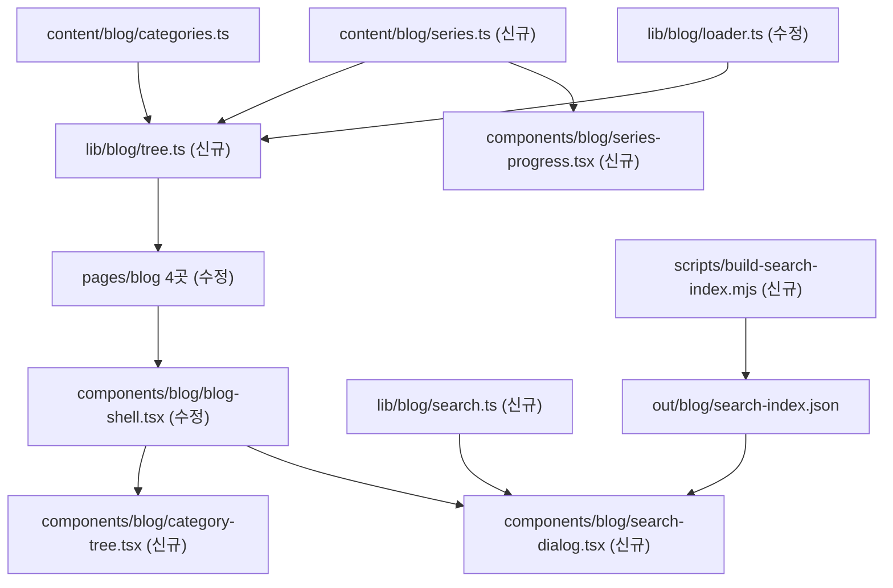
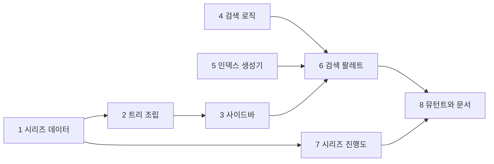

# 블로그 탐색 개편 작업계획서 — 검색 · 카테고리 트리 · 읽기 순서

> **For agentic workers:** REQUIRED SUB-SKILL: Use superpowers:subagent-driven-development (recommended) or superpowers:executing-plans to implement this plan task-by-task. Steps use checkbox (`- [ ]`) syntax for tracking.

**Goal:** 발행본 184편에 검색 팔레트 · 3단 카테고리 트리 · 시리즈 진행도라는 세 가지 탐색 수단을 새 라우트 없이 더한다.

**Architecture:** 신규 데이터는 `content/blog/series.ts` 하나뿐이다. 트리는 순수 함수 `buildTree` 가 빌드 타임에 조립해 `getStaticProps` 로 내려보내고, 검색은 빌드가 끝난 뒤 `.mjs` 스크립트가 `out/_next/data` 의 `post.toc` 를 재사용해 `out/blog/search-index.json` 을 조립하며, 브라우저는 첫 `Cmd+K` 에만 그것을 `fetch` 한다.

**Tech Stack:** Next.js 14 Pages Router · TypeScript · Tailwind CSS · Radix Dialog (`components/ui/dialog.tsx`) · Vitest · Node `.mjs` 스크립트 (신규 의존성 0개)

**Spec:** [`../specs/2026-09-04-blog-navigation-design.md`](../specs/2026-09-04-blog-navigation-design.md)

---

## Global Constraints

프로젝트 전역 제약이다. 아래는 모든 태스크의 요구사항에 암묵적으로 포함된다.

| 제약 | 값 |
| --- | --- |
| 라우터 | **Pages Router 전용.** `app/` 디렉터리를 만들지 않는다 |
| 정적 export | `output: "export"` · `trailingSlash: true`. API 라우트 · ISR · 서버 액션은 빌드를 깨뜨린다 |
| 경로 별칭 | `@/lib/...` · `@/components/...` · `@/content/...`. 상대 경로를 쓰지 않는다 |
| `tsconfig.json` | **동결.** `target` 은 `es5` 이므로 `Map` 이터레이터를 전개하지 말고 `Array.from` 을 쓴다 |
| 한글 본문 클래스 | `break-keep` 필수 · 새 컴포넌트마다 `dark:` 변형 필수 |
| 커밋 메시지 | 한글 |
| `git push` | 사용자가 명시적으로 요청할 때만. `main` 은 곧 프로덕션이다 |
| 신규 의존성 | **0개.** devDependency 하나가 CI Node 버전으로 배포를 깨뜨린 전례가 있다 |
| 컴포넌트의 import | `@/lib/blog/loader` 를 컴포넌트에서 import 하지 않는다 (`node:fs` 가 클라이언트 번들에 들어간다). 타입은 `@/lib/blog/types` 에서 직접 가져온다 |
| 검사기 실행 순서 | **증명한 뒤 스캔.** `:verify` 가 항상 먼저다 |

### 착수 전에 알아야 할 실측값

설계서 §1 의 표를 이 계획서 작성 시점에 다시 셌다. 한 값이 설계서와 어긋난다.

| 항목 | 실측 (2026-09-04) | 설계서 | 비고 |
| --- | ---: | ---: | --- |
| 발행본 | 184편 | 184편 | 일치. `draft: true` 는 0편이다 |
| 카테고리 | 8개 | 8개 | 일치 |
| 시리즈 | 41개 · 164편 소속 | 41개 · 164편 | 일치 |
| **시리즈 없는 편** | **20편** | 14편 | 🔴 **설계서 §8 이 낡았다.** 20편이 맞다 |
| 헤딩 | 2,671개 | 2,671개 | 일치 |
| 태그 | 71개 | 71개 | 일치 |
| `role: "map"` | 15편 | 15편 | 일치 |

시리즈 없는 20편의 내역은 `ai-transformation` 8편 · `search-engineering` 6편 · `agentic-coding` 3편 · `rag` 2편 · `ai-agent` 1편이다. 설계서 §6-3 이 사례로 든 두 카테고리는 맞지만 합계가 틀렸다.

### 설계서 §8 「열려 있는 것」의 결정

착수 시점에 정하기로 한 세 가지를 이 계획서가 확정한다.

| 항목 | 결정 | 어느 태스크에서 |
| --- | --- | --- |
| 41개 시리즈의 한글 표시명 | Task 1 의 `series.ts` 에 전부 적었다 | Task 1 |
| 시리즈 없는 편의 트리 표시 | **「독립편」** · 슬러그는 `__standalone` · 시리즈 목록의 맨 뒤 | Task 2 |
| 카나리로 쓸 편 | **`ai-agent/ai-agent-qna-fundamentals`** (헤딩 26개) · 임계값 **20개** | Task 5 |

카나리를 26 이 아니라 20 으로 두는 이유는, 편을 정상적으로 손보다 헤딩이 몇 개 줄었을 때 검사기가 죽으면 안 되기 때문이다. 20 은 「구조가 깨져 `toc` 를 못 읽는 상태」와 「정상 편집」을 가르는 값이다.

---

## 만들고 고치는 파일



| 파일 | 신규·수정 | 책임 |
| --- | --- | --- |
| `content/blog/series.ts` | 신규 | 41개 시리즈의 `slug`·`name`·`categorySlug`·`order`. 로직 없음 |
| `lib/blog/types.ts` | 수정 | 트리 타입 4개 추가. 선언 전용 · `fs` 를 모른다 |
| `lib/blog/tree.ts` | 신규 | `buildTree` 순수 함수. `fs` 를 모르므로 픽스처로 단위 테스트된다 |
| `lib/blog/search.ts` | 신규 | 정규화 · 매칭 · 점수. 클라이언트 번들에 들어가는 유일한 로직 |
| `lib/blog/loader.ts` | 수정 | `getBlogTree` · `getSeriesContext` 추가 |
| `scripts/build-search-index.mjs` | 신규 | 인덱스 생성 + `--self-test` + 가드 4종 |
| `components/blog/category-tree.tsx` | 신규 | 사이드바 3단. `<details>` 기반이라 JS 없이 동작한다 |
| `components/blog/search-dialog.tsx` | 신규 | 검색 팔레트. 기존 `components/ui/dialog.tsx` 를 쓴다 |
| `components/blog/series-progress.tsx` | 신규 | 「n편 중 k번째」와 시리즈 목차 |
| `components/blog/blog-shell.tsx` | 수정 | `categories` → `tree` · 헤더에 검색 버튼 |
| `pages/blog/**` 5곳 | 수정 | `getStaticProps` 가 트리를 넘긴다. 설계서 §5-2 는 4곳이라고 적었으나 실제로는 태그 페이지가 둘이라 5곳이다 |
| `package.json` | 수정 | `build` 에 인덱스 생성 · 스크립트 2개 추가 |
| `scripts/mutate.mjs` | 수정 | 뮤턴트 8개 추가 (50 → 58) |
| `.github/workflows/deploy.yml` | 수정 | 인덱스 생성기 증명 단계 추가 |
| `tests/blog/content/series.test.ts` | 신규 | 발행본 전량 대조 5케이스 |
| `tests/blog/tree.test.ts` | 신규 | `buildTree` 단위 |
| `tests/blog/search.test.ts` | 신규 | 매칭 · 점수 단위 |

---

## 태스크 흐름



Task 4 와 Task 5 는 Task 1~3 과 독립이므로 순서를 바꿔도 된다. Task 8 은 마지막이어야 한다.

---

### Task 1: 시리즈 데이터와 발행본 전량 대조

**Files:**
- Create: `content/blog/series.ts`
- Create: `tests/blog/content/series.test.ts`

**Interfaces:**
- Consumes: `content/blog/categories.ts` 의 `blogCategories` (슬러그 대조용)
- Produces:
  - `export type BlogSeries = { slug: string; name: string; categorySlug: string; order: number }`
  - `export const blogSeries: BlogSeries[]`
  - `export function findSeries(slug: string): BlogSeries | undefined`
  - `export function seriesOfCategory(categorySlug: string): BlogSeries[]` — `order` 오름차순

- [ ] **Step 1: 실패하는 테스트를 쓴다**

`tests/blog/content/series.test.ts` 를 만든다. 케이스 5개이며 5번이 나머지 넷을 지킨다.

```typescript
import { describe, expect, it } from "vitest";
import { blogSeries, findSeries, seriesOfCategory } from "@/content/blog/series";
import { blogCategories } from "@/content/blog/categories";
import { readPosts } from "@/lib/blog/loader";

/**
 * 시리즈 정의와 발행본의 전량 대조.
 *
 * 🔴 케이스 5가 먼저다. 대조군이 0개면 나머지 넷은 영원히 통과한다 —
 * 이 리포에서 자기 검사 21/21 안의 한 케이스가 정확히 그 상태였다.
 */
describe("시리즈 정의", () => {
  const posts = readPosts();
  const withSeries = posts.filter((p) => p.series);

  it("🔴 대조군이 40개 이상이다 (0건 가드)", () => {
    const used = new Set(withSeries.map((p) => p.series));
    expect(used.size, "시리즈를 쓰는 편을 하나도 읽지 못했다").toBeGreaterThanOrEqual(40);
    expect(blogSeries.length).toBeGreaterThanOrEqual(40);
  });

  it("발행본의 모든 series 값이 series.ts 에 있다", () => {
    for (const post of withSeries) {
      expect(findSeries(post.series as string), `${post.categorySlug}/${post.slug}`).toBeDefined();
    }
  });

  it("series.ts 의 모든 항목이 1편 이상을 갖는다", () => {
    for (const s of blogSeries) {
      const n = withSeries.filter((p) => p.series === s.slug).length;
      expect(n, `고아 정의: ${s.slug}`).toBeGreaterThan(0);
    }
  });

  it("categorySlug 가 실제 편들의 카테고리와 일치한다", () => {
    for (const s of blogSeries) {
      expect(blogCategories.some((c) => c.slug === s.categorySlug), `없는 카테고리: ${s.categorySlug}`).toBe(true);
      for (const post of withSeries.filter((p) => p.series === s.slug)) {
        expect(post.categorySlug, `${s.slug} 가 카테고리를 넘나든다`).toBe(s.categorySlug);
      }
    }
  });

  it("seriesOrder 가 1..n 연속이고 중복이 없다", () => {
    for (const s of blogSeries) {
      const orders = withSeries
        .filter((p) => p.series === s.slug)
        .map((p) => p.seriesOrder as number)
        .sort((a, b) => a - b);
      expect(orders, `${s.slug} 의 순서에 구멍이나 중복이 있다`).toEqual(
        orders.map((_, i) => i + 1)
      );
    }
  });

  it("seriesOfCategory 가 order 오름차순으로 돌려준다", () => {
    for (const c of blogCategories) {
      const list = seriesOfCategory(c.slug);
      const sorted = [...list].sort((a, b) => a.order - b.order);
      expect(list).toEqual(sorted);
    }
  });
});
```

- [ ] **Step 2: 테스트가 실패하는지 확인한다**

Run: `npx vitest run tests/blog/content/series.test.ts`
Expected: FAIL — `Failed to resolve import "@/content/blog/series"`

- [ ] **Step 3: `content/blog/series.ts` 를 쓴다**

41개 전부다. `order` 는 화면 정렬값이라 언제든 바꿀 수 있으므로 중간 삽입을 위해 10 단위로 둔다.

```typescript
/**
 * 블로그 시리즈 정의 — 단일 소스.
 *
 * `categories.ts` 와 같은 자리·같은 모양이다. 새 관례를 만들지 않는다.
 *
 * slug 는 발행본 frontmatter 의 `series` 값과 정확히 같아야 한다. 대조는
 * tests/blog/content/series.test.ts 가 발행본 전량에 대해 한다.
 *
 * name 은 사이드바 트리의 중간 층에 찍히는 한글 표시명이다. 이것이 없어서
 * 41개 시리즈가 데이터로만 있고 화면에 드러나지 않았다.
 *
 * order 는 URL 이 아니라 정렬값이라 언제든 바꿀 수 있다. 카테고리 안에서
 * 「기초 → 심화 → 사례 → Q&A」 순으로 둔다.
 */
export type BlogSeries = {
  slug: string;
  name: string;
  categorySlug: string;
  /** 카테고리 안에서의 정렬 순서. 작을수록 앞. 중간 삽입을 위해 10 단위로 둔다 */
  order: number;
};

export const blogSeries: BlogSeries[] = [
  // agentic-coding — 8개 · 28편
  { slug: "claude-md-context", name: "CLAUDE.md 와 컨텍스트 설계", categorySlug: "agentic-coding", order: 10 },
  { slug: "rules-hooks-skills", name: "규칙 · 훅 · 스킬", categorySlug: "agentic-coding", order: 20 },
  { slug: "claude-code-tools", name: "Claude Code 도구와 권한", categorySlug: "agentic-coding", order: 30 },
  { slug: "claude-code-extensions", name: "Claude Code 확장 메커니즘", categorySlug: "agentic-coding", order: 40 },
  { slug: "subagent-design", name: "서브에이전트 설계", categorySlug: "agentic-coding", order: 50 },
  { slug: "agent-definition-catalog", name: "에이전트 정의 카탈로그", categorySlug: "agentic-coding", order: 60 },
  { slug: "agent-operations", name: "에이전트 팀 운영", categorySlug: "agentic-coding", order: 70 },
  { slug: "agentic-coding-qna", name: "에이전틱 코딩 Q&A", categorySlug: "agentic-coding", order: 80 },

  // ai-agent — 15개 · 50편
  { slug: "agent-fundamentals", name: "에이전트 기초", categorySlug: "ai-agent", order: 10 },
  { slug: "langgraph-core", name: "LangGraph 핵심", categorySlug: "ai-agent", order: 20 },
  { slug: "langchain-fundamentals", name: "LangChain 기초", categorySlug: "ai-agent", order: 30 },
  { slug: "crewai-autogen", name: "CrewAI · AutoGen", categorySlug: "ai-agent", order: 40 },
  { slug: "multi-agent-patterns", name: "멀티에이전트 패턴", categorySlug: "ai-agent", order: 50 },
  { slug: "agent-architecture-2025", name: "2025 에이전트 아키텍처", categorySlug: "ai-agent", order: 60 },
  { slug: "self-correcting-rag", name: "자기교정 RAG", categorySlug: "ai-agent", order: 70 },
  { slug: "agent-harness", name: "Agent Harness", categorySlug: "ai-agent", order: 80 },
  { slug: "loop-engineering", name: "Loop Engineering", categorySlug: "ai-agent", order: 90 },
  { slug: "llm-app-trends", name: "LLM 앱 개발 동향", categorySlug: "ai-agent", order: 100 },
  { slug: "chatgpt-clone", name: "ChatGPT 클론 만들기", categorySlug: "ai-agent", order: 110 },
  { slug: "perplexity-clone", name: "Perplexity 클론 만들기", categorySlug: "ai-agent", order: 120 },
  { slug: "coding-agent", name: "코딩 에이전트", categorySlug: "ai-agent", order: 130 },
  { slug: "report-automation", name: "리포트 자동화", categorySlug: "ai-agent", order: 140 },
  { slug: "ai-agent-qna", name: "AI 에이전트 Q&A", categorySlug: "ai-agent", order: 150 },

  // ai-product-planning — 1개 · 9편
  { slug: "planning-harness", name: "기획 하네스", categorySlug: "ai-product-planning", order: 10 },

  // ai-transformation — 1개 · 3편
  { slug: "department-agents", name: "부서별 에이전트 설계", categorySlug: "ai-transformation", order: 10 },

  // backend-engineering — 8개 · 43편
  { slug: "database-fundamentals", name: "데이터베이스 기초", categorySlug: "backend-engineering", order: 10 },
  { slug: "database-scaling", name: "데이터베이스 확장", categorySlug: "backend-engineering", order: 20 },
  { slug: "redis-cache", name: "Redis 캐시", categorySlug: "backend-engineering", order: 30 },
  { slug: "spring-batch", name: "Spring Batch", categorySlug: "backend-engineering", order: 40 },
  { slug: "websocket-realtime", name: "WebSocket 실시간", categorySlug: "backend-engineering", order: 50 },
  { slug: "kafka-notification-center", name: "Kafka 알림센터", categorySlug: "backend-engineering", order: 60 },
  { slug: "auth-service-on-kubernetes", name: "쿠버네티스 인증 서비스", categorySlug: "backend-engineering", order: 70 },
  { slug: "cicd-automation", name: "CI/CD 자동화", categorySlug: "backend-engineering", order: 80 },

  // product-management — 1개 · 8편
  { slug: "product-management-domains", name: "도메인별 프로덕트 매니지먼트", categorySlug: "product-management", order: 10 },

  // rag — 7개 · 23편
  { slug: "rag-core-concepts", name: "RAG 핵심 개념", categorySlug: "rag", order: 10 },
  { slug: "rag-pipeline", name: "RAG 파이프라인", categorySlug: "rag", order: 20 },
  { slug: "document-parsing", name: "문서 파싱", categorySlug: "rag", order: 30 },
  { slug: "agentic-rag", name: "Agentic RAG", categorySlug: "rag", order: 40 },
  { slug: "dify-workflow", name: "Dify 워크플로우", categorySlug: "rag", order: 50 },
  { slug: "langgraph-modularization", name: "LangGraph 모듈화", categorySlug: "rag", order: 60 },
  { slug: "rag-qna", name: "RAG Q&A", categorySlug: "rag", order: 70 },
];

export function findSeries(slug: string): BlogSeries | undefined {
  return blogSeries.find((s) => s.slug === slug);
}

export function seriesOfCategory(categorySlug: string): BlogSeries[] {
  return blogSeries.filter((s) => s.categorySlug === categorySlug).sort((a, b) => a.order - b.order);
}
```

- [ ] **Step 4: 테스트가 통과하는지 확인한다**

Run: `npx vitest run tests/blog/content/series.test.ts`
Expected: PASS — 6 passed

- [ ] **Step 5: 0건 가드가 실제로 무언가를 지키는지 되돌려 본다**

`content/blog/series.ts` 의 `blogSeries` 배열에서 마지막 항목 (`rag-qna`) 을 임시로 지우고 다시 돌린다.

Run: `npx vitest run tests/blog/content/series.test.ts`
Expected: FAIL — 「발행본의 모든 series 값이 series.ts 에 있다」가 떨어진다

확인했으면 지운 줄을 되돌린다. **통과만 보고는 케이스가 헛도는지 알 수 없다.**

- [ ] **Step 6: 타입 검사**

Run: `npx tsc --noEmit`
Expected: 오류 없음

- [ ] **Step 7: 커밋**

`content/blog/series.ts` 는 `^content/blog/` 로 시작하므로 pre-commit 훅의 **발행본 9단이 전부 돈다.** 3~4분 걸린다.

```bash
git add content/blog/series.ts tests/blog/content/series.test.ts
git commit -m "기능: 41개 시리즈의 표시명을 정의하고 발행본 전량과 대조한다"
```

---

### Task 2: 트리 조립 — 순수 함수와 타입

**Files:**
- Modify: `lib/blog/types.ts` (파일 끝에 추가)
- Create: `lib/blog/tree.ts`
- Create: `tests/blog/tree.test.ts`
- Modify: `lib/blog/loader.ts` (파일 끝에 추가)

**Interfaces:**
- Consumes: Task 1 의 `BlogSeries`·`blogSeries`·`seriesOfCategory`, 기존 `PostSummary`·`BlogCategory`
- Produces:
  - `lib/blog/types.ts`: `TreePost` · `TreeSeries` · `TreeCategory` · `BlogTree` · `SeriesContext` · `STANDALONE_SLUG`
  - `lib/blog/tree.ts`: `buildTree(posts, categories, series, expanded): BlogTree`
  - `lib/blog/loader.ts`: `getBlogTree(expanded?: string | null): BlogTree` · `getSeriesContext(categorySlug, slug): SeriesContext | null`

🔴 `SeriesContext` 타입이 `loader.ts` 가 아니라 `types.ts` 에 사는 이유는 Task 7 의 컴포넌트가 그것을 써야 하기 때문이다. 컴포넌트가 `@/lib/blog/loader` 를 가리키면 `node:fs` 가 클라이언트 번들로 들어간다.

- [ ] **Step 1: 타입을 먼저 추가한다**

`lib/blog/types.ts` 의 끝에 붙인다. 이 파일은 선언 전용이며 `fs` 를 모른다.

파일 맨 위에 import 한 줄을 더한다. `content/blog/series.ts` 는 순수 데이터라 `fs` 를 끌고 오지 않는다.

```typescript
import type { BlogSeries } from "@/content/blog/series";
```

```typescript
/** 시리즈에 속하지 않은 편을 묶는 가짜 시리즈의 슬러그. 실제 시리즈와 충돌하지 않도록 접두사를 둔다 */
export const STANDALONE_SLUG = "__standalone";

/** 트리의 잎. 링크를 만드는 데 필요한 최소한만 담는다 — 페이지 HTML 에 직렬화되기 때문이다 */
export type TreePost = {
  slug: string;
  title: string;
  /** 시리즈에 속하지 않으면 null */
  seriesOrder: number | null;
};

export type TreeSeries = {
  slug: string;
  name: string;
  posts: TreePost[];
};

export type TreeCategory = {
  slug: string;
  name: string;
  count: number;
  /**
   * 펼친 카테고리에만 채워진다. 나머지는 **빈 배열**이다.
   *
   * 전체 트리를 항상 싣는 안은 페이지당 약 18 KB 를 184편 × 4종 라우트 전부에 얹고
   * 발행본이 늘수록 같이 는다. 카테고리를 넘나드는 이동은 검색이 맡는다.
   */
  series: TreeSeries[];
};

export type BlogTree = {
  categories: TreeCategory[];
  /** 펼친 카테고리의 슬러그. 블로그 홈처럼 현재 카테고리가 없으면 null */
  expanded: string | null;
};

/**
 * 본문 페이지의 「n편 중 k번째」에 쓰는 시리즈 문맥.
 *
 * 🔴 이 타입이 loader.ts 가 아니라 여기에 사는 이유는 컴포넌트가 그것을 쓰기 때문이다.
 * 컴포넌트가 `@/lib/blog/loader` 를 가리키면 `node:fs` 가 클라이언트 번들에 들어간다.
 */
export type SeriesContext = {
  series: BlogSeries;
  posts: TreePost[];
  /** 1부터 센다. posts 안에서 현재 편이 몇 번째인가 */
  position: number;
};
```

- [ ] **Step 2: 실패하는 테스트를 쓴다**

`tests/blog/tree.test.ts` 를 만든다. 픽스처로만 판정하므로 `fs` 를 쓰지 않는다.

```typescript
import { describe, expect, it } from "vitest";
import { buildTree } from "@/lib/blog/tree";
import { STANDALONE_SLUG, type PostSummary } from "@/lib/blog/types";
import type { BlogCategory } from "@/content/blog/categories";
import type { BlogSeries } from "@/content/blog/series";

const CATEGORIES: BlogCategory[] = [
  { slug: "rag", name: "RAG · 검색증강생성", description: "d", order: 40 },
  { slug: "search-engineering", name: "검색 엔지니어링", description: "d", order: 50 },
];

const SERIES: BlogSeries[] = [
  { slug: "rag-pipeline", name: "RAG 파이프라인", categorySlug: "rag", order: 20 },
  { slug: "rag-core-concepts", name: "RAG 핵심 개념", categorySlug: "rag", order: 10 },
];

function post(over: Partial<PostSummary>): PostSummary {
  return {
    title: "제목",
    description: "설명",
    category: "rag",
    categorySlug: "rag",
    slug: "s",
    tags: [],
    date: "2026-01-01",
    featured: false,
    draft: false,
    ...over,
  } as PostSummary;
}

const POSTS: PostSummary[] = [
  post({ slug: "p2", title: "파이프라인 2", series: "rag-pipeline", seriesOrder: 2 }),
  post({ slug: "p1", title: "파이프라인 1", series: "rag-pipeline", seriesOrder: 1 }),
  post({ slug: "c1", title: "핵심 1", series: "rag-core-concepts", seriesOrder: 1 }),
  post({ slug: "alone", title: "혼자 있는 편" }),
  post({ slug: "se1", title: "검색 편", category: "search-engineering", categorySlug: "search-engineering" }),
];

describe("buildTree", () => {
  it("펼치지 않은 카테고리는 이름과 편수만 갖는다", () => {
    const tree = buildTree(POSTS, CATEGORIES, SERIES, null);
    expect(tree.categories.map((c) => [c.slug, c.count, c.series.length])).toEqual([
      ["rag", 4, 0],
      ["search-engineering", 1, 0],
    ]);
  });

  it("펼친 카테고리만 시리즈를 채운다", () => {
    const tree = buildTree(POSTS, CATEGORIES, SERIES, "rag");
    expect(tree.expanded).toBe("rag");
    expect(tree.categories[0].series.map((s) => s.slug)).toEqual([
      "rag-core-concepts",
      "rag-pipeline",
      STANDALONE_SLUG,
    ]);
    expect(tree.categories[1].series).toEqual([]);
  });

  it("시리즈는 order 오름차순이고 독립편이 맨 뒤다", () => {
    const tree = buildTree(POSTS, CATEGORIES, SERIES, "rag");
    const last = tree.categories[0].series[tree.categories[0].series.length - 1];
    expect(last.slug).toBe(STANDALONE_SLUG);
    expect(last.name).toBe("독립편");
    expect(last.posts.map((p) => p.slug)).toEqual(["alone"]);
  });

  it("시리즈 안의 편은 seriesOrder 오름차순이다", () => {
    const tree = buildTree(POSTS, CATEGORIES, SERIES, "rag");
    const pipeline = tree.categories[0].series.find((s) => s.slug === "rag-pipeline");
    expect(pipeline?.posts.map((p) => p.slug)).toEqual(["p1", "p2"]);
  });

  it("독립편이 없으면 그 묶음을 만들지 않는다", () => {
    const only = POSTS.filter((p) => p.series);
    const tree = buildTree(only, CATEGORIES, SERIES, "rag");
    expect(tree.categories[0].series.some((s) => s.slug === STANDALONE_SLUG)).toBe(false);
  });

  it("편이 0편인 카테고리는 트리에 넣지 않는다", () => {
    const tree = buildTree([], CATEGORIES, SERIES, null);
    expect(tree.categories).toEqual([]);
  });

  it("🔴 정의되지 않은 series 값을 만나면 던진다", () => {
    const orphan = [post({ slug: "x", series: "없는-시리즈", seriesOrder: 1 })];
    expect(() => buildTree(orphan, CATEGORIES, SERIES, "rag")).toThrow(/없는-시리즈/);
  });
});
```

- [ ] **Step 3: 테스트가 실패하는지 확인한다**

Run: `npx vitest run tests/blog/tree.test.ts`
Expected: FAIL — `Failed to resolve import "@/lib/blog/tree"`

- [ ] **Step 4: `lib/blog/tree.ts` 를 쓴다**

```typescript
import type { BlogCategory } from "@/content/blog/categories";
import type { BlogSeries } from "@/content/blog/series";
import {
  STANDALONE_SLUG,
  type BlogTree,
  type PostSummary,
  type TreeCategory,
  type TreePost,
  type TreeSeries,
} from "@/lib/blog/types";

/**
 * 카테고리 → 시리즈 → 편의 3단 트리를 만든다.
 *
 * 🔴 **순수 함수이고 `fs` 를 모른다.** 그래야 픽스처로 단위 테스트할 수 있고, 실제
 * 발행본 184편이 아니라 몇 편짜리 표본으로 정렬 규칙을 고정할 수 있다.
 *
 * 펼침 범위는 `expanded` 하나뿐이다. 전체 트리를 항상 싣지 않는 이유는 설계서 §2-2 에 있다.
 *
 * @param posts      날짜 내림차순으로 정렬된 편 목록 (readPosts 의 출력 순서)
 * @param categories 표시할 카테고리. 호출부가 getPublishedCategories 로 걸러 넘긴다
 * @param series     시리즈 정의 전량
 * @param expanded   펼칠 카테고리 슬러그. 없으면 null
 */
export function buildTree(
  posts: PostSummary[],
  categories: BlogCategory[],
  series: BlogSeries[],
  expanded: string | null
): BlogTree {
  const nodes: TreeCategory[] = [];

  for (const category of categories) {
    const mine = posts.filter((p) => p.categorySlug === category.slug);
    // 편이 0편인 카테고리는 페이지도 없다. 트리에 이름만 남기면 죽은 링크가 된다.
    if (mine.length === 0) continue;

    nodes.push({
      slug: category.slug,
      name: category.name,
      count: mine.length,
      series: category.slug === expanded ? groupBySeries(mine, series, category.slug) : [],
    });
  }

  return { categories: nodes, expanded };
}

function toTreePost(post: PostSummary): TreePost {
  return { slug: post.slug, title: post.title, seriesOrder: post.seriesOrder ?? null };
}

/**
 * 한 카테고리의 편들을 시리즈로 묶는다. 독립편은 맨 뒤의 가짜 시리즈 하나로 모은다.
 *
 * 🔴 정의되지 않은 `series` 값을 만나면 **던진다.** 슬러그를 그대로 이름으로 쓰면
 * 화면에 `rag-pipeline` 같은 영문이 찍히는데, 그것은 조용한 불일치다 —
 * 이 리포가 반복해서 겪은 실패의 모양이다. tests/blog/content/series.test.ts 가
 * 먼저 잡지만, 그 검사를 지워도 빌드가 서도록 여기에도 둔다.
 */
function groupBySeries(posts: PostSummary[], series: BlogSeries[], categorySlug: string): TreeSeries[] {
  const defined = series.filter((s) => s.categorySlug === categorySlug).sort((a, b) => a.order - b.order);
  const out: TreeSeries[] = [];

  for (const post of posts) {
    if (!post.series) continue;
    if (!defined.some((s) => s.slug === post.series)) {
      throw new Error(
        `[blog] ${categorySlug}/${post.slug}: series.ts 에 없는 시리즈입니다: ${post.series}`
      );
    }
  }

  for (const s of defined) {
    const members = posts
      .filter((p) => p.series === s.slug)
      .sort((a, b) => (a.seriesOrder ?? 0) - (b.seriesOrder ?? 0));
    if (members.length === 0) continue;
    out.push({ slug: s.slug, name: s.name, posts: members.map(toTreePost) });
  }

  // 독립편은 posts 가 들어온 순서(날짜 내림차순)를 그대로 유지한다.
  const standalone = posts.filter((p) => !p.series);
  if (standalone.length > 0) {
    out.push({ slug: STANDALONE_SLUG, name: "독립편", posts: standalone.map(toTreePost) });
  }

  return out;
}
```

- [ ] **Step 5: 테스트가 통과하는지 확인한다**

Run: `npx vitest run tests/blog/tree.test.ts`
Expected: PASS — 7 passed

- [ ] **Step 6: 로더에 조회 함수를 더한다**

`lib/blog/loader.ts` 의 끝에 붙인다. import 문 세 줄도 파일 상단에 더한다.

파일 상단 import 에 추가할 것:

```typescript
import { blogSeries, findSeries } from "@/content/blog/series";
import { buildTree } from "@/lib/blog/tree";
import type { BlogTree, SeriesContext } from "@/lib/blog/types";
```

파일 끝에 추가할 것:

```typescript
/**
 * 사이드바 트리. `expanded` 로 준 카테고리만 시리즈까지 펼친다.
 *
 * 페이지의 getStaticProps 에서만 부른다 — readPosts 가 fs 를 쓴다.
 */
export function getBlogTree(expanded: string | null = null): BlogTree {
  return buildTree(getPostSummaries(), getPublishedCategories(), blogSeries, expanded);
}

/**
 * 본문 페이지의 「n편 중 k번째」에 쓸 시리즈 문맥.
 *
 * 시리즈에 속하지 않는 편이면 null 이다 — 실측 20편이 그렇다.
 * `getAdjacentPosts` 가 이미 시리즈를 닫힌 단위로 잇고 있으므로, 이 함수는
 * 그 이웃 관계를 다시 만들지 않고 **목록과 현재 위치만** 돌려준다.
 */
export function getSeriesContext(categorySlug: string, slug: string): SeriesContext | null {
  const list = getPostsByCategory(categorySlug);
  const current = list.find((p) => p.slug === slug);
  if (!current?.series) return null;

  const series = findSeries(current.series);
  if (!series) throw new Error(`[blog] series.ts 에 없는 시리즈입니다: ${current.series}`);

  const members = list
    .filter((p) => p.series === current.series)
    .sort((a, b) => (a.seriesOrder ?? 0) - (b.seriesOrder ?? 0))
    .map((p) => ({ slug: p.slug, title: p.title, seriesOrder: p.seriesOrder ?? null }));

  return { series, posts: members, position: members.findIndex((p) => p.slug === slug) + 1 };
}
```

- [ ] **Step 7: 전체 테스트와 타입 검사**

Run: `npx vitest run tests/blog && npx tsc --noEmit`
Expected: **67 passed** (기존 54 + `series` 6 + `tree` 7) · 타입 오류 없음

실제 수는 실행해서 확인하고, 어긋나면 **실측값을 Task 8 의 문서 갱신에 쓴다.**

- [ ] **Step 8: 커밋**

```bash
git add lib/blog/types.ts lib/blog/tree.ts lib/blog/loader.ts tests/blog/tree.test.ts
git commit -m "기능: 카테고리·시리즈·편의 3단 트리를 순수 함수로 조립한다"
```

---

### Task 3: 사이드바를 3단 트리로 바꾼다

**Files:**
- Create: `components/blog/category-tree.tsx`
- Modify: `components/blog/blog-shell.tsx`
- Modify: `pages/blog/index.tsx`
- Modify: `pages/blog/[category]/index.tsx`
- Modify: `pages/blog/[category]/[slug].tsx`
- Modify: `pages/blog/tags/index.tsx`
- Modify: `pages/blog/tags/[tag].tsx`

**Interfaces:**
- Consumes: Task 2 의 `BlogTree`·`getBlogTree`
- Produces:
  - `CategoryTree({ tree, activePostSlug, onNavigate }): JSX.Element`
  - `BlogShell` 의 props 가 `{ tree: BlogTree; toc?: TocEntry[]; children: ReactNode }` 로 바뀐다 — `categories` 와 `activeCategory` 는 사라진다

- [ ] **Step 1: `components/blog/category-tree.tsx` 를 쓴다**

`<details>`·`<summary>` 로 짓는다. JS 가 꺼져도 아코디언이 동작하며, 상태를 React 로 들지 않아도 된다.

```tsx
import { STANDALONE_SLUG, type BlogTree, type TreeSeries } from "@/lib/blog/types";
import { cn } from "@/lib/utils";
import Link from "next/link";

type Props = {
  tree: BlogTree;
  /** 본문 페이지에서만 넘어온다. 현재 편이 속한 시리즈를 펼친 채로 그린다 */
  activePostSlug?: string;
  onNavigate?: () => void;
};

function seriesHasPost(series: TreeSeries, slug?: string): boolean {
  return !!slug && series.posts.some((p) => p.slug === slug);
}

export function CategoryTree({ tree, activePostSlug, onNavigate }: Props) {
  return (
    <ul className="space-y-1">
      {tree.categories.map((category) => {
        const active = category.slug === tree.expanded;

        return (
          <li key={category.slug}>
            <Link
              href={`/blog/${category.slug}/`}
              onClick={onNavigate}
              aria-current={active ? "page" : undefined}
              className={cn(
                "flex items-baseline justify-between gap-2 rounded-md px-3 py-2 text-sm transition-colors break-keep",
                active
                  ? "bg-blue-50 font-semibold text-blue-700 dark:bg-blue-950/50 dark:text-blue-300"
                  : "text-slate-600 hover:bg-slate-100 dark:text-slate-300 dark:hover:bg-slate-800"
              )}
            >
              <span className="min-w-0">{category.name}</span>
              <span className="shrink-0 text-xs tabular-nums text-slate-400 dark:text-slate-500">
                {category.count}
              </span>
            </Link>

            {category.series.length > 0 ? (
              <ul className="mt-0.5 space-y-0.5 border-l border-slate-200 pl-2 dark:border-slate-800">
                {category.series.map((series) => (
                  <li key={series.slug}>
                    <details open={seriesHasPost(series, activePostSlug)}>
                      <summary className="flex cursor-pointer list-none items-baseline justify-between gap-2 rounded-md px-2 py-1.5 text-xs text-slate-500 transition-colors hover:bg-slate-100 break-keep dark:text-slate-400 dark:hover:bg-slate-800">
                        <span className="min-w-0">
                          {series.slug === STANDALONE_SLUG ? "독립편" : series.name}
                        </span>
                        <span className="shrink-0 tabular-nums text-slate-400 dark:text-slate-500">
                          {series.posts.length}
                        </span>
                      </summary>
                      <ul className="mt-0.5 space-y-0.5 border-l border-slate-200 pl-2 dark:border-slate-800">
                        {series.posts.map((post) => {
                          const here = post.slug === activePostSlug;
                          return (
                            <li key={post.slug}>
                              <Link
                                href={`/blog/${category.slug}/${post.slug}/`}
                                onClick={onNavigate}
                                aria-current={here ? "page" : undefined}
                                className={cn(
                                  "block rounded-md px-2 py-1 text-xs leading-snug transition-colors break-keep",
                                  here
                                    ? "font-semibold text-blue-700 dark:text-blue-300"
                                    : "text-slate-500 hover:bg-slate-100 hover:text-slate-900 dark:text-slate-400 dark:hover:bg-slate-800 dark:hover:text-slate-100"
                                )}
                              >
                                {post.seriesOrder !== null ? (
                                  <span className="mr-1 tabular-nums text-slate-400 dark:text-slate-500">
                                    {post.seriesOrder}.
                                  </span>
                                ) : null}
                                {post.title}
                              </Link>
                            </li>
                          );
                        })}
                      </ul>
                    </details>
                  </li>
                ))}
              </ul>
            ) : null}
          </li>
        );
      })}

      <li>
        <Link
          href="/blog/tags/"
          onClick={onNavigate}
          className="mt-2 block rounded-md border-t border-slate-200 px-3 pt-3 text-sm text-slate-600 transition-colors hover:bg-slate-100 dark:border-slate-800 dark:text-slate-300 dark:hover:bg-slate-800"
        >
          태그 전체
        </Link>
      </li>
    </ul>
  );
}
```

- [ ] **Step 2: `BlogShell` 을 고친다**

`components/blog/blog-shell.tsx` 에서 다음을 바꾼다.

1. 상단 import 를 교체한다.

```tsx
import { CategoryTree } from "@/components/blog/category-tree";
import { ThemeToggle } from "@/components/theme-toggle";
import type { BlogTree, TocEntry } from "@/lib/blog/types";
import { Menu, PenLine, X } from "lucide-react";
import Link from "next/link";
import { useState, type ReactNode } from "react";
```

`cn` 과 `BlogCategory` 의 import 는 지운다 — 파일 안의 `CategoryList` 함수를 통째로 지우면 쓰이지 않는다.

2. props 타입을 교체한다.

```tsx
type BlogShellProps = {
  /**
   * 사이드바 트리. 현재 카테고리만 펼쳐진 상태로 넘어온다(getBlogTree).
   *
   * 이 컴포넌트는 클라이언트에서도 렌더되므로 파일시스템을 읽을 수 없다 —
   * 호출하는 쪽의 getStaticProps 가 넘겨야 한다.
   * **선택 인자로 두지 않는다.** 폴백을 두면 한 페이지에서 빠뜨렸을 때
   * 그 페이지만 다르게 보이는 불일치가 조용히 생긴다.
   * 필수로 두면 빠뜨린 곳이 타입 오류로 드러난다.
   */
  tree: BlogTree;
  /** 본문 페이지에서만 넘어온다. 현재 편이 속한 시리즈를 펼쳐 그린다 */
  activePostSlug?: string;
  toc?: TocEntry[];
  children: ReactNode;
};
```

3. 파일 안의 `function CategoryList({ ... })` 를 통째로 지운다.

4. 컴포넌트 시그니처와 두 호출부를 바꾼다.

```tsx
export function BlogShell({ tree, activePostSlug, toc, children }: BlogShellProps) {
```

모바일 서랍 안:

```tsx
<CategoryTree tree={tree} activePostSlug={activePostSlug} onNavigate={() => setOpen(false)} />
```

좌측 사이드바 안:

```tsx
<CategoryTree tree={tree} activePostSlug={activePostSlug} />
```

- [ ] **Step 3: 페이지 다섯 곳을 고친다**

`pages/blog/index.tsx` — `categories` props 는 카드 목록에도 쓰이므로 **남긴다.** 트리를 따로 더한다.

```tsx
// import 교체
import { getBlogTree, getPostSummaries, getPublishedCategories } from "@/lib/blog/loader";
import type { BlogTree, PostSummary } from "@/lib/blog/types";

type Props = {
  tree: BlogTree;
  categories: CategoryWithCount[];
  featured: PostSummary[];
  recent: PostSummary[];
};

export const getStaticProps: GetStaticProps<Props> = () => {
  const posts = getPostSummaries();

  return {
    props: {
      tree: getBlogTree(null),
      categories: getPublishedCategories().map((c) => ({
        ...c,
        count: posts.filter((p) => p.categorySlug === c.slug).length,
      })),
      featured: posts.filter((p) => p.featured),
      recent: posts.slice(0, 10),
    },
  };
};

export default function BlogHomePage({ tree, categories, featured, recent }: Props) {
```

그리고 `<BlogShell categories={categories}>` 를 `<BlogShell tree={tree}>` 로 바꾼다.

`pages/blog/[category]/index.tsx`:

```tsx
import { getBlogTree, getPostsByCategory, getPublishedCategories } from "@/lib/blog/loader";
import type { BlogTree, PostSummary } from "@/lib/blog/types";

type Props = { tree: BlogTree; category: BlogCategory; posts: PostSummary[] };

export const getStaticProps: GetStaticProps<Props> = ({ params }) => {
  const slug = String(params?.category);
  const category = findCategory(slug);
  if (!category) throw new Error(`[blog] 없는 카테고리입니다: ${slug}`);

  return { props: { tree: getBlogTree(slug), category, posts: getPostsByCategory(slug) } };
};

export default function BlogCategoryPage({ tree, category, posts }: Props) {
```

`<BlogShell categories={categories} activeCategory={category.slug}>` 를 `<BlogShell tree={tree}>` 로 바꾼다. `getPublishedCategories` 의 import 는 `getStaticPaths` 가 여전히 쓰므로 남긴다.

`pages/blog/[category]/[slug].tsx`:

```tsx
import { getAdjacentPosts, getAllPosts, getBlogTree, getPost } from "@/lib/blog/loader";
import type { BlogTree, Post, PostSummary } from "@/lib/blog/types";

type Props = {
  tree: BlogTree;
  post: Post;
  prev: PostSummary | null;
  next: PostSummary | null;
};

export const getStaticProps: GetStaticProps<Props> = ({ params }) => {
  const category = String(params?.category);
  const slug = String(params?.slug);
  const post = getPost(category, slug);
  const { prev, next } = getAdjacentPosts(category, slug);

  return { props: { tree: getBlogTree(category), post, prev, next } };
};

export default function BlogPostPage({ tree, post, prev, next }: Props) {
```

`<BlogShell ...>` 은 이렇게 바꾼다.

```tsx
<BlogShell tree={tree} activePostSlug={post.slug} toc={post.toc}>
```

`getPublishedCategories` 의 import 를 지운다 — 이 파일에서는 더 쓰이지 않는다.

`pages/blog/tags/index.tsx` 와 `pages/blog/tags/[tag].tsx` — 두 곳 모두 `categories: getPublishedCategories()` 를 `tree: getBlogTree(null)` 로 바꾸고, props 타입의 `categories: BlogCategory[]` 를 `tree: BlogTree` 로, JSX 의 `<BlogShell categories={categories}>` 를 `<BlogShell tree={tree}>` 로 바꾼다. `BlogCategory` 의 import 를 지운다.

- [ ] **Step 4: 타입 검사로 빠뜨린 곳을 찾는다**

Run: `npx tsc --noEmit`
Expected: 오류 없음

**이 단계가 「필수 인자로 둔다」는 설계 결정이 실제로 값을 하는 자리다.** 다섯 페이지 중 하나라도 빠뜨리면 여기서 드러난다.

- [ ] **Step 5: 빌드하고 화면을 연다**

Run: `npm run build`
Expected: 오류 없이 `out/` 생성

Run: `npm run dev`
Expected: `http://localhost:3000/blog/ai-agent/` 에서 사이드바가 「AI 에이전트 51」 아래에 시리즈 15개와 「독립편 1」을 보여 준다. 본문 페이지에서는 현재 편이 속한 시리즈만 펼쳐져 있다.

- [ ] **Step 6: 커밋**

```bash
git add components/blog/category-tree.tsx components/blog/blog-shell.tsx pages/blog
git commit -m "기능: 사이드바를 카테고리·시리즈·편의 3단 트리로 바꾼다"
```

---

### Task 4: 검색 로직 — 정규화 · 매칭 · 점수

**Files:**
- Create: `lib/blog/search.ts`
- Create: `tests/blog/search.test.ts`

**Interfaces:**
- Consumes: 없음. 이 모듈은 인덱스 없이도 테스트된다
- Produces:
  - `IndexPost` · `SearchIndex` · `SearchHit` 타입
  - `MIN_QUERY_LENGTH = 2` · `MAX_RESULTS = 20` · `MAX_HEADINGS = 3`
  - `normalize(text: string): string`
  - `tokenize(query: string): string[]`
  - `search(index: SearchIndex, query: string): SearchHit[]`

인덱스 스키마의 키는 한 글자다. 184편 × 2,671 헤딩이 반복되므로 키 이름이 그대로 바이트가 된다.

| 키 | 뜻 |
| --- | --- |
| `c` | 카테고리 슬러그 |
| `s` | 편 슬러그 |
| `t` | 제목 |
| `d` | 설명 |
| `g` | 태그 배열 |
| `e` | 시리즈 슬러그 (없으면 생략) |
| `o` | 시리즈 순서 (없으면 생략) |
| `h` | 헤딩 배열. 각 항목은 `[텍스트, 앵커id]` |

- [ ] **Step 1: 실패하는 테스트를 쓴다**

`tests/blog/search.test.ts` 를 만든다. 🔴 첫 케이스가 이 설계의 핵심이다 — 조사가 붙어도 걸려야 한다.

```typescript
import { describe, expect, it } from "vitest";
import { MIN_QUERY_LENGTH, normalize, search, tokenize, type SearchIndex } from "@/lib/blog/search";

const INDEX: SearchIndex = {
  v: 1,
  posts: [
    {
      c: "ai-agent",
      s: "langgraph-state-reducer",
      t: "LangGraph는 그래프 라이브러리가 아니다 — State와 Reducer가 정하는 것",
      d: "랭그래프를 쓰면서 자주 어긋나는 지점",
      g: ["ai-agent", "langgraph"],
      e: "langgraph-core",
      o: 1,
      h: [
        ["State와 Reducer", "state와-reducer"],
        ["Reducer가 정하는 것", "reducer가-정하는-것"],
        ["채널이라는 이름", "채널이라는-이름"],
        ["덧붙임", "덧붙임"],
      ],
    },
    {
      c: "rag",
      s: "rag-pipeline-1",
      t: "RAG 파이프라인 (1) 왜 RAG인가",
      d: "도입 근거와 대안",
      g: ["rag"],
      e: "rag-pipeline",
      o: 1,
      h: [["랭그래프와의 비교", "랭그래프와의-비교"]],
    },
    {
      c: "rag",
      s: "rag-standalone",
      t: "검색 품질을 재는 법",
      d: "랭그래프 이야기는 나오지 않는다",
      g: ["rag", "search"],
      h: [],
    },
  ],
};

describe("normalize", () => {
  it("소문자화하고 연속 공백을 하나로 줄인다", () => {
    expect(normalize("  LangGraph   State ")).toBe("langgraph state");
  });

  it("유니코드를 NFC 로 맞춘다", () => {
    // 조합형(NFD)으로 쓴 「가」와 완성형(NFC)의 「가」가 같아야 한다.
    expect(normalize("가")).toBe(normalize("가"));
  });
});

describe("tokenize", () => {
  it("공백으로 나눈다", () => {
    expect(tokenize("랭그래프 state")).toEqual(["랭그래프", "state"]);
  });

  it(`${MIN_QUERY_LENGTH}자 미만 토큰을 버린다`, () => {
    expect(tokenize("a 랭그래프")).toEqual(["랭그래프"]);
  });

  it("남는 토큰이 없으면 빈 배열이다", () => {
    expect(tokenize("a b")).toEqual([]);
  });
});

describe("search", () => {
  it("🔴 조사가 붙어도 찾는다 — 「랭그래프」가 「랭그래프를」을 건진다", () => {
    const hits = search(INDEX, "랭그래프");
    expect(hits.map((h) => h.post.s)).toContain("langgraph-state-reducer");
  });

  it("🔴 토크나이저를 쓰지 않으므로 낱말 중간도 걸린다", () => {
    // 「랭그래프와의」는 토크나이저라면 다른 토큰이 된다.
    const hits = search(INDEX, "랭그래프");
    expect(hits.map((h) => h.post.s)).toContain("rag-pipeline-1");
  });

  it("전 토큰 AND — 둘 다 있는 편만 남는다", () => {
    const hits = search(INDEX, "랭그래프 reducer");
    expect(hits.map((h) => h.post.s)).toEqual(["langgraph-state-reducer"]);
  });

  it(`${MIN_QUERY_LENGTH}자 미만 질의는 0건이다`, () => {
    expect(search(INDEX, "랭")).toEqual([]);
    expect(search(INDEX, "")).toEqual([]);
  });

  it("제목 매치가 설명 매치보다 앞선다", () => {
    const hits = search(INDEX, "rag");
    expect(hits[0].post.s).toBe("rag-pipeline-1");
  });

  it("전방 일치에 보너스가 붙는다", () => {
    const front = search(INDEX, "langgraph");
    const inner = search(INDEX, "그래프 라이브러리");
    expect(front[0].score).toBeGreaterThan(inner[0].score);
  });

  it("태그 완전 일치를 잡는다", () => {
    const hits = search(INDEX, "search");
    expect(hits.map((h) => h.post.s)).toContain("rag-standalone");
  });

  it("매치된 헤딩을 최대 3개까지 단다", () => {
    const hits = search(INDEX, "reducer");
    const target = hits.find((h) => h.post.s === "langgraph-state-reducer");
    expect(target?.headings.length).toBeLessThanOrEqual(3);
    expect(target?.headings[0].id).toBe("state와-reducer");
  });

  it("매치가 없으면 빈 배열이다", () => {
    expect(search(INDEX, "존재하지않는말")).toEqual([]);
  });

  it("동점이면 시리즈 순서 다음 제목 가나다순으로 안정 정렬한다", () => {
    const hits = search(INDEX, "rag");
    const slugs = hits.map((h) => h.post.s);
    expect(slugs.indexOf("rag-pipeline-1")).toBeLessThan(slugs.indexOf("rag-standalone"));
  });
});
```

- [ ] **Step 2: 테스트가 실패하는지 확인한다**

Run: `npx vitest run tests/blog/search.test.ts`
Expected: FAIL — `Failed to resolve import "@/lib/blog/search"`

- [ ] **Step 3: `lib/blog/search.ts` 를 쓴다**

```typescript
/**
 * 검색 매칭 — 클라이언트 번들에 들어가는 유일한 검색 로직이다.
 *
 * 🔴 **토크나이저를 쓰지 않는다.** 한국어는 조사가 낱말에 붙으므로 「랭그래프」로
 * 검색했을 때 「랭그래프를」이 걸려야 하는데, 토크나이저는 이 둘을 다른 토큰으로
 * 만든다. 같은 기전이 이 리포의 도구 함정 목록에도 있다 — `**IDOL**을` 이
 * `IDOL을` 과 매칭되지 않는 것과 같은 문제다.
 *
 * 그래서 판정은 **부분 문자열 포함**이다. 대신 1자 질의는 결과가 폭증하고 순위가
 * 무의미해지므로 2자를 하한으로 둔다.
 *
 * `fs` 도 DOM 도 모른다. 인덱스 없이 픽스처만으로 테스트된다.
 */

/** 인덱스의 편 하나. 키가 한 글자인 이유는 184편 × 2,671 헤딩만큼 반복되기 때문이다 */
export type IndexPost = {
  /** 카테고리 슬러그 */
  c: string;
  /** 편 슬러그 */
  s: string;
  /** 제목 */
  t: string;
  /** 설명 */
  d: string;
  /** 태그 */
  g: string[];
  /** 시리즈 슬러그 */
  e?: string;
  /** 시리즈 순서 */
  o?: number;
  /** 헤딩 — [텍스트, 앵커 id] */
  h: [string, string][];
};

export type SearchIndex = { v: number; posts: IndexPost[] };

export type SearchHit = {
  post: IndexPost;
  score: number;
  headings: { text: string; id: string }[];
};

export const MIN_QUERY_LENGTH = 2;
export const MAX_RESULTS = 20;
export const MAX_HEADINGS = 3;

const SCORE = { title: 100, titleFront: 50, tag: 80, heading: 40, headingFront: 20, description: 20 };

/** 유니코드 NFC · 소문자화 · 연속 공백 축약. 마크업은 인덱스를 만들 때 이미 벗겨져 있다 */
export function normalize(text: string): string {
  return text.normalize("NFC").toLowerCase().replace(/\s+/g, " ").trim();
}

/** 질의를 공백으로 나누고 짧은 토큰을 버린다 */
export function tokenize(query: string): string[] {
  return normalize(query)
    .split(" ")
    .filter((t) => t.length >= MIN_QUERY_LENGTH);
}

/** 한 필드에서 토큰 하나가 얻는 점수. 매치가 없으면 0 */
function scoreField(field: string, token: string, base: number, frontBonus: number): number {
  const at = field.indexOf(token);
  if (at === -1) return 0;
  return at === 0 ? base + frontBonus : base;
}

function scorePost(post: IndexPost, tokens: string[]): SearchHit | null {
  const title = normalize(post.t);
  const description = normalize(post.d);
  const tags = post.g.map(normalize);
  const headings = post.h.map(([text, id]) => ({ text, id, key: normalize(text) }));

  let total = 0;
  const matched = new Map<string, { text: string; id: string }>();

  for (const token of tokens) {
    let best = 0;

    best += scoreField(title, token, SCORE.title, SCORE.titleFront);
    if (tags.some((tag) => tag === token)) best += SCORE.tag;
    best += scoreField(description, token, SCORE.description, 0);

    for (const heading of headings) {
      const gained = scoreField(heading.key, token, SCORE.heading, SCORE.headingFront);
      if (gained === 0) continue;
      best += gained;
      // 같은 헤딩이 여러 토큰에 걸려도 한 번만 단다.
      if (!matched.has(heading.id)) matched.set(heading.id, { text: heading.text, id: heading.id });
    }

    // 🔴 전 토큰 AND. 하나라도 어디에도 없으면 이 편은 결과가 아니다.
    if (best === 0) return null;
    total += best;
  }

  return { post, score: total, headings: Array.from(matched.values()).slice(0, MAX_HEADINGS) };
}

/**
 * 편 단위로 묶어 점수순으로 돌려준다.
 *
 * 동점이면 시리즈 순서 → 제목 가나다순이다. 정렬 기준이 없으면 같은 점수의 편들이
 * 빌드마다 다른 차례로 나오는데, 그러면 같은 질의가 다른 화면을 만든다.
 */
export function search(index: SearchIndex, query: string): SearchHit[] {
  const tokens = tokenize(query);
  if (tokens.length === 0) return [];

  const hits: SearchHit[] = [];
  for (const post of index.posts) {
    const hit = scorePost(post, tokens);
    if (hit) hits.push(hit);
  }

  hits.sort((a, b) => {
    if (a.score !== b.score) return b.score - a.score;
    const ao = a.post.o ?? Number.MAX_SAFE_INTEGER;
    const bo = b.post.o ?? Number.MAX_SAFE_INTEGER;
    if (ao !== bo) return ao - bo;
    return a.post.t.localeCompare(b.post.t, "ko");
  });

  return hits.slice(0, MAX_RESULTS);
}
```

- [ ] **Step 4: 테스트가 통과하는지 확인한다**

Run: `npx vitest run tests/blog/search.test.ts`
Expected: PASS — 15 passed

- [ ] **Step 5: AND 판정이 실제로 무언가를 지키는지 되돌려 본다**

`scorePost` 의 `if (best === 0) return null;` 를 `if (false) return null;` 로 바꾸고 돌린다.

Run: `npx vitest run tests/blog/search.test.ts`
Expected: FAIL — 「전 토큰 AND」가 떨어진다

확인했으면 되돌린다.

- [ ] **Step 6: 타입 검사와 커밋**

Run: `npx tsc --noEmit`
Expected: 오류 없음

```bash
git add lib/blog/search.ts tests/blog/search.test.ts
git commit -m "기능: 조사가 붙은 한국어를 부분 문자열로 매칭하는 검색 로직을 넣는다"
```

---

### Task 5: 인덱스 생성기 — 가드 넷을 단 열 번째 검사기

**Files:**
- Create: `scripts/build-search-index.mjs`
- Modify: `package.json`
- Modify: `.github/workflows/deploy.yml`

**Interfaces:**
- Consumes: `out/_next/data/<buildId>/blog/**.json` 의 `pageProps.post` (Task 4 가 정한 인덱스 스키마로 옮긴다) · `content/blog/*/*.md` (수 대조용)
- Produces:
  - `out/blog/search-index.json`
  - `export function decideExit({ target, sourceCount, indexed, canary }): { code: number; why: string }`
  - `export function toIndexPost(post): IndexPost`
  - npm 스크립트 `search-index` · `search-index:verify`

**왜 `out/blog/` 아래인가.** 루트에 두면 `out/search-index.json` 이 되는데, `check-forbidden --built` 는 `out/blog` 와 `out/_next/data/**/blog/**.json` 만 본다. 제목·설명·헤딩 2,671개가 금칙어 검사를 우회하는 새 산출물이 된다. `out/blog/` 아래면 `BUILT_EXT` 가 `json` 을 포함하므로 기존 검사기가 그대로 잡는다.

- [ ] **Step 1: `scripts/build-search-index.mjs` 를 쓴다**

```javascript
#!/usr/bin/env node
// 검색 인덱스를 만든다. 생성기이면서 검증기다.
//
// 🔴 **소스를 다시 파싱하지 않는다.** 렌더러가 이미 만든 `post.toc` 를 재사용하므로
// 헤딩 텍스트와 앵커 id 의 진실원이 하나로 유지된다. 다시 파싱하면 목차와 앵커가
// 조용히 어긋나고, 그때 검색 결과는 없는 자리로 착지한다.
//
// 🔴 **인덱스는 out/blog/ 아래에 둔다.** 루트에 두면 check-forbidden --built 의
// 스캔 범위(out/blog + out/_next/data/**/blog/**.json) 밖이 되어, 제목·설명·헤딩
// 2,671개가 금칙어 검사를 우회하는 새 산출물이 생긴다.
//
// 생성물이므로 리포에 커밋하지 않는다 (.gitignore 의 out/ 이 이미 덮는다).
// 커밋하면 본문보다 낡을 수 있고, 이 리포가 세 세션 연속 겪은 실패가 정확히
// 「수를 늘렸는데 그 수가 적힌 곳을 안 고쳤다」다.
//
// 사용법:
//   node scripts/build-search-index.mjs --self-test   가드가 실제로 작동하는지 증명한다
//   node scripts/build-search-index.mjs               인덱스를 만든다 (빌드 뒤에)
//
// 종료 코드: 0 정상 · 2 대상 없음 · 수 어긋남 · 카나리 실패

import { readFileSync, writeFileSync, readdirSync, existsSync, mkdirSync, statSync } from "node:fs";
import { join } from "node:path";
import { pathToFileURL } from "node:url";

const OUT = "out";
const DATA_ROOT = join(OUT, "_next", "data");
const CONTENT_ROOT = join("content", "blog");
const INDEX_PATH = join(OUT, "blog", "search-index.json");
const SCHEMA_VERSION = 1;

// ---------------------------------------------------------------------------
// 카나리
// ---------------------------------------------------------------------------

// 반드시 인덱스에 들어가야 하는 편이다. 구조가 바뀌어 toc 를 못 읽으면 이 편의 헤딩이
// 0개가 되는데, 그것을 「위반 없음」으로 세면 빈 인덱스가 성공으로 나간다.
//
// 임계값이 실측(26개)이 아니라 20 인 이유는, 편을 정상적으로 손보다 헤딩이 몇 개
// 줄었을 때 검사기가 죽으면 안 되기 때문이다. 20 은 「구조가 깨졌다」와 「정상 편집」을
// 가르는 값이지 이 편의 현재 헤딩 수가 아니다.
export const CANARY_POST = "ai-agent/ai-agent-qna-fundamentals";
export const CANARY_MIN_HEADINGS = 20;

/** 카나리가 만족되면 null, 아니면 왜 아닌지 */
export function checkCanary(posts) {
  const found = posts.find((p) => `${p.c}/${p.s}` === CANARY_POST);
  if (!found) return `카나리 편이 인덱스에 없다: ${CANARY_POST}`;
  if (found.h.length < CANARY_MIN_HEADINGS) {
    return `카나리 편의 헤딩이 ${found.h.length}개다 (${CANARY_MIN_HEADINGS}개 이상이어야 한다)`;
  }
  return null;
}

// ---------------------------------------------------------------------------
// 종료 코드
// ---------------------------------------------------------------------------

/**
 * 집계만 받아 종료 코드를 정한다.
 *
 * 🔴 이 함수를 따로 뽑은 이유는 뮤테이션이다. 가드가 `main` 안에 흩어져 있으면 자기
 * 검사는 그것을 볼 수 없고, 가드를 통째로 지워도 케이스가 전부 통과한다.
 *
 * 순서가 규칙이다. **못 본 것이 있으면 본 것의 결과를 말하지 않는다.**
 */
export function decideExit({ target, sourceCount, indexed, canary }) {
  if (!target) {
    return { code: 2, why: `${DATA_ROOT} 가 없다. 먼저 \`npm run build\` 를 돌려라 — 안 만든 것을 「깨끗함」으로 세지 않는다.` };
  }
  if (sourceCount === 0) {
    return { code: 2, why: `${CONTENT_ROOT} 에서 .md 를 하나도 찾지 못했다. 0건이 아니라 대상 없음이다.` };
  }
  if (indexed !== sourceCount) {
    return { code: 2, why: `소스 ${sourceCount}편 중 ${indexed}편만 인덱스에 들어갔다. 일부만 담은 인덱스는 0건이 아니다.` };
  }
  if (canary) {
    return { code: 2, why: `카나리 실패 — ${canary}` };
  }
  return { code: 0, why: `${indexed}편을 인덱스에 담았다.` };
}

// ---------------------------------------------------------------------------
// 변환
// ---------------------------------------------------------------------------

/** 렌더러가 만든 post 객체를 인덱스 스키마로 옮긴다. 키가 한 글자인 이유는 반복 횟수 때문이다 */
export function toIndexPost(post) {
  const row = {
    c: post.categorySlug,
    s: post.slug,
    t: post.title,
    d: post.description,
    g: post.tags ?? [],
    h: (post.toc ?? []).map((entry) => [entry.text, entry.id]),
  };
  if (post.series) {
    row.e = post.series;
    row.o = post.seriesOrder;
  }
  return row;
}

// ---------------------------------------------------------------------------
// 수집
// ---------------------------------------------------------------------------

function walkJson(dir, out = []) {
  for (const entry of readdirSync(dir, { withFileTypes: true })) {
    const full = join(dir, entry.name);
    if (entry.isDirectory()) walkJson(full, out);
    else if (entry.name.endsWith(".json")) out.push(full);
  }
  return out;
}

/** out/_next/data/<buildId>/blog 를 찾는다. buildId 는 빌드마다 바뀐다 */
export function findBlogDataRoot(root = DATA_ROOT) {
  if (!existsSync(root)) return null;
  for (const buildId of readdirSync(root)) {
    const candidate = join(root, buildId, "blog");
    if (existsSync(candidate) && statSync(candidate).isDirectory()) return candidate;
  }
  return null;
}

/**
 * 산출물 JSON 에서 편만 골라 인덱스 행으로 바꾼다.
 *
 * ⚠️ 카테고리 페이지와 태그 페이지의 JSON 도 같은 트리에 있다 (실측 264개 중 편은 184개).
 * `pageProps.post` 가 있는 것만 편이다.
 */
export function collectPosts(blogDataRoot) {
  const posts = [];
  for (const file of walkJson(blogDataRoot)) {
    const json = JSON.parse(readFileSync(file, "utf8"));
    const post = json?.pageProps?.post;
    if (post?.slug && post?.categorySlug) posts.push(toIndexPost(post));
  }
  return posts;
}

/** content/blog/<카테고리>/<슬러그>.md 의 수. 인덱스 편 수와 대조하기 위한 독립 계수다 */
export function countSourcePosts(root = CONTENT_ROOT) {
  if (!existsSync(root)) return 0;
  let n = 0;
  for (const categorySlug of readdirSync(root)) {
    const dir = join(root, categorySlug);
    if (!statSync(dir).isDirectory()) continue;
    for (const name of readdirSync(dir)) if (name.endsWith(".md")) n++;
  }
  return n;
}

// ---------------------------------------------------------------------------
// 자기 검사
// ---------------------------------------------------------------------------

const EXIT_CASES = [
  ["① 산출물이 없으면 종료 2 다", { target: null, sourceCount: 184, indexed: 0, canary: null }, 2],
  ["② 소스가 0편이면 종료 2 다 — 0건이 아니라 대상 없음이다", { target: "x", sourceCount: 0, indexed: 0, canary: null }, 2],
  ["③ 🔴 소스보다 적게 담기면 종료 2 다", { target: "x", sourceCount: 184, indexed: 183, canary: null }, 2],
  ["④ 🔴 소스보다 많이 담겨도 종료 2 다", { target: "x", sourceCount: 184, indexed: 185, canary: null }, 2],
  ["⑤ 🔴 카나리가 실패하면 종료 2 다", { target: "x", sourceCount: 184, indexed: 184, canary: "헤딩 0개" }, 2],
  ["⑥ 전부 맞으면 종료 0 이다", { target: "x", sourceCount: 184, indexed: 184, canary: null }, 0],
];

const SAMPLE_POST = {
  title: "제목",
  description: "설명",
  categorySlug: "ai-agent",
  slug: "ai-agent-qna-fundamentals",
  tags: ["ai-agent"],
  series: "ai-agent-qna",
  seriesOrder: 1,
  toc: Array.from({ length: CANARY_MIN_HEADINGS }, (_, i) => ({ depth: 2, text: `헤딩 ${i}`, id: `헤딩-${i}` })),
};

export function selfTest() {
  const results = [];

  for (const [label, summary, expected] of EXIT_CASES) {
    results.push([decideExit(summary).code === expected, label]);
  }

  const row = toIndexPost(SAMPLE_POST);
  results.push([row.c === "ai-agent" && row.s === "ai-agent-qna-fundamentals", "⑦ 카테고리와 슬러그를 옮긴다"]);
  results.push([row.e === "ai-agent-qna" && row.o === 1, "⑧ 시리즈와 순서를 옮긴다"]);
  results.push([toIndexPost({ ...SAMPLE_POST, series: undefined, seriesOrder: undefined }).e === undefined, "⑨ 시리즈가 없으면 키를 만들지 않는다"]);
  results.push([
    Array.isArray(row.h[0]) && row.h[0].length === 2 && row.h[0][1] === "헤딩-0",
    "⑩ 🔴 헤딩을 [텍스트, 앵커id] 로 옮긴다 — 앵커를 재생성하지 않는다",
  ]);

  results.push([checkCanary([row]) === null, "⑪ 카나리 편이 헤딩 임계를 넘으면 통과다"]);
  results.push([checkCanary([]) !== null, "⑫ 🔴 카나리 편이 없으면 실패다"]);
  results.push([
    checkCanary([{ ...row, h: row.h.slice(0, CANARY_MIN_HEADINGS - 1) }]) !== null,
    "⑬ 🔴 카나리 편의 헤딩이 임계 미만이면 실패다",
  ]);

  // 🔴 대조할 것이 실제로 있는지 먼저 센다. 필터를 통과한 집합으로 그 필터를 검사할 수 없다 —
  // 「편이 아닌 JSON 을 걸러낸다」는 케이스는 걸러낼 것이 0개면 영원히 통과한다.
  const mixed = [
    { pageProps: { post: SAMPLE_POST } },
    { pageProps: { categories: [], tags: [] } },
    { pageProps: { post: { title: "슬러그가 없다" } } },
  ];
  const notPost = mixed.filter((j) => !j?.pageProps?.post?.slug).length;
  const kept = mixed.filter((j) => j?.pageProps?.post?.slug && j?.pageProps?.post?.categorySlug).length;
  results.push([notPost === 2 && kept === 1, `⑭ 🔴 편이 아닌 JSON ${notPost}개를 거르고 ${kept}개만 담는다 (거를 것이 실제로 있다)`]);

  // 🔴 검사기가 출력하는 라벨도 자기 검사 항목이다. 「무엇을 한다」고 적어 둔 것과
  // 실제 동작이 같은지를 케이스로 고정한다.
  const wrongCount = decideExit({ target: "x", sourceCount: 184, indexed: 183, canary: null });
  results.push([/183/.test(wrongCount.why) && /184/.test(wrongCount.why), "⑮ 수가 어긋나면 두 수를 다 말한다"]);

  for (const [ok, label] of results) console.log(`${ok ? "✅" : "❌"} ${label}`);
  const passed = results.filter(([ok]) => ok).length;
  console.log(`\n${passed}/${results.length}`);
  return passed === results.length ? 0 : 1;
}

// ---------------------------------------------------------------------------
// main
// ---------------------------------------------------------------------------

function main() {
  if (process.argv.includes("--self-test")) process.exit(selfTest());

  const blogDataRoot = findBlogDataRoot();
  const posts = blogDataRoot ? collectPosts(blogDataRoot) : [];
  const sourceCount = countSourcePosts();
  const canary = blogDataRoot ? checkCanary(posts) : null;

  const verdict = decideExit({ target: blogDataRoot, sourceCount, indexed: posts.length, canary });

  if (verdict.code !== 0) {
    console.error(`\n🔴 ${verdict.why}`);
    process.exit(verdict.code);
  }

  // 편 정렬을 고정한다. 순서가 빌드마다 흔들리면 인덱스의 diff 가 의미를 잃고,
  // 같은 점수의 결과가 다른 차례로 나온다.
  posts.sort((a, b) => (a.c === b.c ? a.s.localeCompare(b.s) : a.c.localeCompare(b.c)));

  mkdirSync(join(OUT, "blog"), { recursive: true });
  writeFileSync(INDEX_PATH, JSON.stringify({ v: SCHEMA_VERSION, posts }), "utf8");

  const headings = posts.reduce((n, p) => n + p.h.length, 0);
  const bytes = Buffer.byteLength(readFileSync(INDEX_PATH));
  console.log(`[search-index] ${verdict.why} 헤딩 ${headings}개 · ${(bytes / 1024).toFixed(0)} KB → ${INDEX_PATH}`);
}

if (process.argv[1] && import.meta.url === pathToFileURL(process.argv[1]).href) main();
```

- [ ] **Step 2: 자기 검사가 통과하는지 확인한다**

Run: `node scripts/build-search-index.mjs --self-test`
Expected: `15/15`

- [ ] **Step 3: 가드가 실제로 무언가를 지키는지 되돌려 본다**

`decideExit` 의 `if (indexed !== sourceCount)` 를 `if (false)` 로 바꾸고 돌린다.

Run: `node scripts/build-search-index.mjs --self-test`
Expected: FAIL — ③ 과 ④ 와 ⑮ 가 떨어진다 (`12/15`)

확인했으면 되돌린다. **통과만 보고는 케이스가 헛도는지 알 수 없다.**

- [ ] **Step 4: `package.json` 을 고친다**

`scripts` 에 두 줄을 더하고 `build` 를 바꾼다.

```json
"build": "next build && node scripts/generate-sitemap.mjs && node scripts/build-search-index.mjs",
"search-index": "node scripts/build-search-index.mjs",
"search-index:verify": "node scripts/build-search-index.mjs --self-test",
```

순서가 규칙이다. 인덱스가 `check-forbidden --built` 의 스캔 대상이 되려면 스캔보다 먼저 만들어져야 한다.

- [ ] **Step 5: 실제로 만들어 보고 금칙어 검사에 걸리는지 본다**

Run: `npm run build`
Expected: 마지막 줄에 `[search-index] 184편을 인덱스에 담았다. 헤딩 2671개 · ... KB → out/blog/search-index.json`

Run: `npm run check-forbidden:verify && npm run check-forbidden:built`
Expected: 둘 다 종료 코드 0. **인덱스가 스캔 대상에 들어왔는지 출력의 파일 수로 확인한다** — 이전보다 1개 늘어야 한다.

- [ ] **Step 6: 산출물 없이 돌리면 죽는지 확인한다**

```bash
mv out out.bak && node scripts/build-search-index.mjs; echo "종료 코드 $?"; mv out.bak out
```

Expected: `🔴 out/_next/data 가 없다...` · 종료 코드 2

⚠️ 종료 코드를 읽을 명령은 **단독 실행**이다. 파이프 뒤에 두면 `$?` 는 마지막 명령의 것이 된다.

- [ ] **Step 7: CI 에 증명 단계를 더한다**

`.github/workflows/deploy.yml` 의 `Build` 단계 **바로 앞에** 넣는다.

```yaml
      # 인덱스 생성기는 빌드 안에서 돈다. 증명은 그보다 먼저다 — 증명되지 않은 「184편」은
      # 거짓 음성과 구분되지 않는다. 가드 넷이 대상 없음 · 수 어긋남 · 카나리를 본다.
      - name: Prove search index builder
        run: npm run search-index:verify
```

`Scan built output` 단계는 손대지 않는다. 인덱스가 `out/blog/` 아래에 있으므로 기존 `--built` 스캔이 그대로 잡는다.

- [ ] **Step 8: 커밋**

```bash
git add scripts/build-search-index.mjs package.json .github/workflows/deploy.yml
git commit -m "기능: 산출물의 목차를 재사용해 검색 인덱스를 만들고 가드 넷을 단다"
```

---

### Task 6: 검색 팔레트

**Files:**
- Create: `components/blog/search-dialog.tsx`
- Modify: `components/blog/blog-shell.tsx`

**Interfaces:**
- Consumes: Task 4 의 `search`·`SearchIndex`·`SearchHit`, Task 5 가 만든 `/blog/search-index.json`, Task 2 의 `BlogTree`
- Produces: `SearchDialog({ tree }): JSX.Element` — 자체적으로 버튼과 모달을 함께 그린다

- [ ] **Step 1: `components/blog/search-dialog.tsx` 를 쓴다**

```tsx
import { Dialog, DialogContent } from "@/components/ui/dialog";
import { search, type SearchHit, type SearchIndex } from "@/lib/blog/search";
import type { BlogTree } from "@/lib/blog/types";
import { cn } from "@/lib/utils";
import { Hash, Search } from "lucide-react";
import { useRouter } from "next/router";
import { useCallback, useEffect, useMemo, useRef, useState } from "react";

const INDEX_URL = "/blog/search-index.json";

type LoadState = "idle" | "loading" | "ready" | "failed";

/** 편과 헤딩을 한 줄씩 편 목록으로 편다. ↑↓ 이동이 이 배열의 인덱스를 움직인다 */
type Row = { href: string; label: string; kind: "post" | "heading" };

function toRows(hits: SearchHit[]): Row[] {
  const rows: Row[] = [];
  for (const hit of hits) {
    const base = `/blog/${hit.post.c}/${hit.post.s}/`;
    rows.push({ href: base, label: hit.post.t, kind: "post" });
    for (const heading of hit.headings) {
      rows.push({ href: `${base}#${heading.id}`, label: heading.text, kind: "heading" });
    }
  }
  return rows;
}

export function SearchDialog({ tree }: { tree: BlogTree }) {
  const router = useRouter();
  const [open, setOpen] = useState(false);
  const [query, setQuery] = useState("");
  const [state, setState] = useState<LoadState>("idle");
  const [index, setIndex] = useState<SearchIndex | null>(null);
  const [cursor, setCursor] = useState(0);
  const inputRef = useRef<HTMLInputElement>(null);

  // 인덱스는 첫 Cmd+K 에만 가져온다. gzip 96 KB 라 첫 화면에 얹을 이유가 없다.
  const load = useCallback(() => {
    if (state !== "idle") return;
    setState("loading");
    fetch(INDEX_URL)
      .then((res) => (res.ok ? res.json() : Promise.reject(new Error(String(res.status)))))
      .then((json: SearchIndex) => {
        setIndex(json);
        setState("ready");
      })
      .catch(() => setState("failed"));
  }, [state]);

  const show = useCallback(() => {
    load();
    setOpen(true);
  }, [load]);

  useEffect(() => {
    function onKey(event: KeyboardEvent) {
      const meta = (event.metaKey || event.ctrlKey) && event.key.toLowerCase() === "k";
      // "/" 는 입력 중이 아닐 때만. 검색창 안에서 눌렀는데 다시 열리면 글자를 못 친다.
      const target = event.target as HTMLElement | null;
      const typing = !!target && /^(INPUT|TEXTAREA)$/.test(target.tagName);
      if (meta || (event.key === "/" && !typing)) {
        event.preventDefault();
        show();
      }
    }
    window.addEventListener("keydown", onKey);
    return () => window.removeEventListener("keydown", onKey);
  }, [show]);

  const hits = useMemo(() => (index ? search(index, query) : []), [index, query]);
  const rows = useMemo(() => toRows(hits), [hits]);

  useEffect(() => setCursor(0), [query]);

  function onInputKey(event: React.KeyboardEvent<HTMLInputElement>) {
    if (rows.length === 0) return;
    if (event.key === "ArrowDown") {
      event.preventDefault();
      setCursor((c) => (c + 1) % rows.length);
    } else if (event.key === "ArrowUp") {
      event.preventDefault();
      setCursor((c) => (c - 1 + rows.length) % rows.length);
    } else if (event.key === "Enter") {
      event.preventDefault();
      setOpen(false);
      void router.push(rows[cursor].href);
    }
  }

  return (
    <>
      <button
        type="button"
        onClick={show}
        className="flex items-center gap-2 rounded-md border border-slate-200 px-2.5 py-1.5 text-sm text-slate-500 transition-colors hover:border-blue-400 hover:text-blue-600 dark:border-slate-700 dark:text-slate-400 dark:hover:border-blue-600 dark:hover:text-blue-400"
        aria-label="검색 열기"
      >
        <Search className="h-4 w-4 shrink-0" aria-hidden />
        <span className="hidden sm:inline">검색</span>
        <kbd className="hidden rounded border border-slate-200 px-1 text-xs sm:inline dark:border-slate-700">
          Cmd K
        </kbd>
      </button>

      <Dialog open={open} onOpenChange={setOpen}>
        <DialogContent className="top-24 max-w-xl translate-y-0 gap-0 p-0">
          <div className="flex items-center gap-2 border-b border-slate-200 px-4 py-3 dark:border-slate-800">
            <Search className="h-4 w-4 shrink-0 text-slate-400" aria-hidden />
            <input
              ref={inputRef}
              autoFocus
              value={query}
              onChange={(e) => setQuery(e.target.value)}
              onKeyDown={onInputKey}
              placeholder="제목 · 태그 · 목차에서 찾기 (2자 이상)"
              aria-label="검색어"
              className="w-full bg-transparent text-sm outline-none placeholder:text-slate-400 dark:placeholder:text-slate-500"
            />
          </div>

          <div className="max-h-96 overflow-y-auto p-2">
            {state === "failed" ? (
              <Fallback tree={tree} message="검색을 불러오지 못했습니다. 카테고리로 찾아보세요." />
            ) : state === "loading" ? (
              <p className="px-2 py-6 text-center text-sm text-slate-500 dark:text-slate-400">불러오는 중…</p>
            ) : rows.length > 0 ? (
              <ul>
                {rows.map((row, i) => (
                  <li key={row.href}>
                    <a
                      href={row.href}
                      onClick={() => setOpen(false)}
                      onMouseEnter={() => setCursor(i)}
                      className={cn(
                        "flex items-start gap-2 rounded-md px-2 py-2 text-sm leading-snug break-keep",
                        row.kind === "heading" ? "pl-7 text-slate-500 dark:text-slate-400" : "font-medium",
                        i === cursor ? "bg-blue-50 dark:bg-blue-950/50" : ""
                      )}
                    >
                      {row.kind === "heading" ? (
                        <Hash className="mt-0.5 h-3.5 w-3.5 shrink-0 text-slate-400" aria-hidden />
                      ) : null}
                      <span className="min-w-0">{row.label}</span>
                    </a>
                  </li>
                ))}
              </ul>
            ) : query.trim().length > 0 ? (
              <Fallback tree={tree} message={`「${query}」에 맞는 글이 없습니다.`} />
            ) : (
              <p className="px-2 py-6 text-center text-sm text-slate-500 dark:text-slate-400">
                제목 · 태그 · 목차를 찾습니다. ↑↓ 로 옮기고 Enter 로 엽니다.
              </p>
            )}
          </div>
        </DialogContent>
      </Dialog>
    </>
  );
}

/**
 * 빈 화면을 두지 않는다.
 *
 * 인덱스를 못 가져왔을 때(`npm run dev` 에는 인덱스가 없다)와 결과가 0건일 때 모두
 * 카테고리 목록을 그 자리에 보여 준다. 사이드바 트리가 이미 이 데이터를 들고 있으므로
 * 새로 가져올 것이 없다.
 */
function Fallback({ tree, message }: { tree: BlogTree; message: string }) {
  return (
    <div className="px-2 py-4">
      <p className="mb-3 text-sm break-keep text-slate-500 dark:text-slate-400">{message}</p>
      <ul className="space-y-1">
        {tree.categories.map((c) => (
          <li key={c.slug}>
            <a
              href={`/blog/${c.slug}/`}
              className="flex items-baseline justify-between gap-2 rounded-md px-2 py-1.5 text-sm break-keep hover:bg-slate-100 dark:hover:bg-slate-800"
            >
              <span className="min-w-0">{c.name}</span>
              <span className="shrink-0 text-xs tabular-nums text-slate-400 dark:text-slate-500">{c.count}</span>
            </a>
          </li>
        ))}
        <li>
          <a href="/blog/tags/" className="block rounded-md px-2 py-1.5 text-sm hover:bg-slate-100 dark:hover:bg-slate-800">
            태그 전체
          </a>
        </li>
      </ul>
    </div>
  );
}
```

- [ ] **Step 2: `BlogShell` 헤더에 검색 버튼을 단다**

`components/blog/blog-shell.tsx` 의 import 에 한 줄을 더한다.

```tsx
import { SearchDialog } from "@/components/blog/search-dialog";
```

헤더 오른쪽 묶음에서 「포트폴리오」 링크 **앞에** 넣는다.

```tsx
          <div className="flex items-center gap-3">
            <SearchDialog tree={tree} />
            <Link
              href="/"
              className="shrink-0 text-sm text-slate-600 hover:text-blue-600 dark:text-slate-300 dark:hover:text-blue-400"
            >
              포트폴리오
            </Link>
            <ThemeToggle />
          </div>
```

- [ ] **Step 3: 타입 검사와 린트**

Run: `npx tsc --noEmit && npm run lint`
Expected: 오류 없음

`DialogContent` 가 `className` 을 받는지 확인한다. 받지 않으면 `components/ui/dialog.tsx` 의 시그니처를 보고 맞춘다 — **새 UI 원시 요소를 추가하지 않는다.**

- [ ] **Step 4: `dev` 에서 폴백을 확인한다**

Run: `npm run dev`
Expected: `http://localhost:3000/blog/` 에서 `Cmd+K` 를 누르면 모달이 열리고, 인덱스가 없으므로 「검색을 불러오지 못했습니다」와 함께 **카테고리 8개가 그 자리에 보인다.** 빈 화면이 아니다.

- [ ] **Step 5: 빌드본에서 실제 검색을 확인한다**

Run: `npm run build && npx serve out -l 3001`

(`serve` 가 없으면 `python -m http.server 3001 --directory out` 로 대신한다.)

Expected: `http://localhost:3001/blog/`
- `Cmd+K` → 「랭그래프」 입력 → 편과 헤딩이 섞인 목록이 나온다
- `↑↓` 로 옮기고 `Enter` 로 이동한다
- 헤딩 줄을 고르면 `#앵커` 로 착지해 **화면이 그 절로 스크롤된다**
- `Esc` 로 닫힌다
- 「랭」 한 글자는 0건이다

🔴 **앵커 착지를 눈으로 확인하라.** 목록에 헤딩이 나오는 것과 그 앵커가 실제로 존재하는 것은 다른 문제다.

- [ ] **Step 6: 커밋**

```bash
git add components/blog/search-dialog.tsx components/blog/blog-shell.tsx
git commit -m "기능: 어느 페이지에서든 Cmd+K 로 여는 검색 팔레트를 넣는다"
```

---

### Task 7: 시리즈 진행도

**Files:**
- Create: `components/blog/series-progress.tsx`
- Modify: `pages/blog/[category]/[slug].tsx`

**Interfaces:**
- Consumes: Task 2 의 `getSeriesContext`·`SeriesContext`
- Produces: `SeriesProgress({ context, categorySlug, currentSlug }): JSX.Element | null`

`getAdjacentPosts` 가 이미 시리즈를 닫힌 단위로 잇고 있다. **그 로직을 다시 만들지 않는다** — 이 컴포넌트는 「전체 중 몇 번째인가」와 「나머지는 무엇인가」만 보탠다.

- [ ] **Step 1: `components/blog/series-progress.tsx` 를 쓴다**

```tsx
import type { SeriesContext } from "@/lib/blog/types";
import { cn } from "@/lib/utils";
import { Layers } from "lucide-react";
import Link from "next/link";

type Props = {
  /** 시리즈에 속하지 않는 편이면 null 이 넘어온다 (실측 20편) */
  context: SeriesContext | null;
  categorySlug: string;
  currentSlug: string;
};

/**
 * 「n편 중 k번째」와 시리즈 목차.
 *
 * SeriesNav(이전·다음) 위에 놓인다. 이전·다음은 「바로 옆이 무엇인가」에 답하고
 * 이것은 「전체 중 어디인가」에 답한다 — 41개 시리즈 164편이 데이터로만 있고
 * 화면에 드러나지 않던 것을 여는 자리다.
 */
export function SeriesProgress({ context, categorySlug, currentSlug }: Props) {
  if (!context) return null;

  const { series, posts, position } = context;

  return (
    <section
      className="mt-14 rounded-lg border border-slate-200 p-4 dark:border-slate-800"
      aria-labelledby="series-progress-heading"
    >
      <div className="flex items-baseline justify-between gap-2">
        <h2 id="series-progress-heading" className="flex min-w-0 items-center gap-2 text-sm font-bold break-keep">
          <Layers className="h-4 w-4 shrink-0 text-blue-600 dark:text-blue-400" aria-hidden />
          <span className="min-w-0">{series.name}</span>
        </h2>
        <p className="shrink-0 text-xs tabular-nums text-slate-500 dark:text-slate-400">
          {posts.length}편 중 {position}번째
        </p>
      </div>

      <ol className="mt-3 space-y-1">
        {posts.map((post) => {
          const here = post.slug === currentSlug;
          return (
            <li key={post.slug} className="flex gap-2">
              <span
                className={cn(
                  "w-5 shrink-0 text-right text-xs tabular-nums",
                  here ? "text-blue-700 dark:text-blue-300" : "text-slate-400 dark:text-slate-500"
                )}
              >
                {post.seriesOrder}
              </span>
              {here ? (
                <span
                  aria-current="page"
                  className="min-w-0 text-sm font-semibold leading-snug break-keep text-blue-700 dark:text-blue-300"
                >
                  {post.title}
                </span>
              ) : (
                <Link
                  href={`/blog/${categorySlug}/${post.slug}/`}
                  className="min-w-0 text-sm leading-snug break-keep text-slate-600 hover:text-blue-600 dark:text-slate-300 dark:hover:text-blue-400"
                >
                  {post.title}
                </Link>
              )}
            </li>
          );
        })}
      </ol>
    </section>
  );
}
```

- [ ] **Step 2: 본문 페이지에 배선한다**

`pages/blog/[category]/[slug].tsx` 를 고친다.

import 를 더한다.

```tsx
import { SeriesProgress } from "@/components/blog/series-progress";
import { getAdjacentPosts, getAllPosts, getBlogTree, getPost, getSeriesContext } from "@/lib/blog/loader";
import type { BlogTree, Post, PostSummary, SeriesContext } from "@/lib/blog/types";
```

props 타입에 한 줄을 더한다.

```tsx
type Props = {
  tree: BlogTree;
  post: Post;
  seriesContext: SeriesContext | null;
  prev: PostSummary | null;
  next: PostSummary | null;
};
```

`getStaticProps` 를 고친다.

```tsx
  return {
    props: {
      tree: getBlogTree(category),
      post,
      seriesContext: getSeriesContext(category, slug),
      prev,
      next,
    },
  };
```

컴포넌트 시그니처와 JSX 를 고친다. `SeriesProgress` 는 `SeriesNav` **위에** 둔다.

```tsx
export default function BlogPostPage({ tree, post, seriesContext, prev, next }: Props) {
```

```tsx
          <Markdown>{post.body}</Markdown>

          <SeriesProgress context={seriesContext} categorySlug={post.categorySlug} currentSlug={post.slug} />

          <SeriesNav prev={prev} next={next} />
```

- [ ] **Step 3: 타입 검사와 빌드**

Run: `npx tsc --noEmit && npm run build`
Expected: 오류 없음

`getStaticProps` 의 props 는 JSON 으로 직렬화된다. `series` 가 `undefined` 인 편에서 「`undefined` cannot be serialized」가 나오면 `getSeriesContext` 가 `undefined` 가 아니라 **`null`** 을 돌려주는지 확인한다.

- [ ] **Step 4: 화면을 확인한다**

Run: `npm run dev`
Expected:
- `http://localhost:3000/blog/ai-agent/` 에서 `loop-engineering` 시리즈의 아무 편이나 연다 → 「7편 중 k번째」와 7편 목록이 본문 끝에 나온다
- `http://localhost:3000/blog/search-engineering/` 의 편(시리즈 없음)을 연다 → **아무것도 그리지 않는다**

- [ ] **Step 5: 커밋**

```bash
git add components/blog/series-progress.tsx "pages/blog/[category]/[slug].tsx"
git commit -m "기능: 본문에 시리즈 진행도와 목차를 드러낸다"
```

---

### Task 8: 뮤턴트와 문서 — 늘린 수를 같은 커밋에서 고친다

**Files:**
- Modify: `scripts/mutate.mjs`
- Modify: `CLAUDE.md`
- Modify: `README.md`
- Modify: `HANDOFF.md`

🔴 **이 리포가 세 세션 연속 실패한 자리다.** 검사기 개수 · 뮤턴트 수 · 테스트 케이스 수가 전부 바뀌는데, 그 수가 적힌 문서를 같은 커밋에서 고치지 않으면 CI 의 `Check documented counts` 가 아니라 **다음 세션의 사람**이 낡은 수를 근거로 판단한다.

- [ ] **Step 1: 실측부터 한다 — 문서에 적을 수는 세어서 얻는다**

```bash
node scripts/build-search-index.mjs --self-test | tail -1
npx vitest run tests/blog --reporter=verbose 2>&1 | tail -5
grep -ao 'id: "[A-Z0-9]*"' scripts/mutate.mjs | wc -l
```

세 수를 적어 둔다. 아래 문서 갱신은 **이 실측값**을 쓴다. 계획서에 적힌 예상값(자기 검사 15건 · 뮤턴트 58개)을 그대로 옮기지 마라 — 구현하며 케이스를 더했으면 어긋난다.

- [ ] **Step 2: 뮤턴트를 더한다**

`scripts/mutate.mjs` 의 `MUTANTS` 배열 끝에 8개를 붙인다. id 가 겹치지 않는지 먼저 본다.

```bash
grep -ao 'id: "[A-Z]*[0-9]*"' scripts/mutate.mjs | sed 's/id: //' | tr -d '"' | sort | uniq -d
```

Expected: 출력 없음 (중복 없음)

```javascript
  {
    id: "X1",
    file: "scripts/build-search-index.mjs",
    desc: "산출물 없음 가드를 없앤다 (빌드 안 한 상태에서 빈 인덱스가 성공으로 나간다)",
    from: "  if (!target) {",
    to: "  if (false) {",
  },
  {
    id: "X2",
    file: "scripts/build-search-index.mjs",
    desc: "🔴 수 대조를 없앤다 (일부만 담긴 인덱스가 통과한다)",
    from: "  if (indexed !== sourceCount) {",
    to: "  if (false) {",
  },
  {
    id: "X3",
    file: "scripts/build-search-index.mjs",
    desc: "🔴 카나리 판정을 없앤다 (구조가 바뀌어 toc 를 못 읽어도 초록이 나온다)",
    from: "  if (canary) {",
    to: "  if (false) {",
  },
  {
    id: "X4",
    file: "scripts/build-search-index.mjs",
    desc: "카나리 헤딩 임계를 0 으로 내린다 (자기 검사가 상수와 끊겨 있으면 통과한다)",
    from: "export const CANARY_MIN_HEADINGS = 20;",
    to: "export const CANARY_MIN_HEADINGS = 0;",
  },
  {
    id: "X5",
    file: "scripts/build-search-index.mjs",
    desc: "헤딩의 앵커 id 를 버린다 (검색이 편으로만 착지하고 절로 못 간다)",
    from: "    h: (post.toc ?? []).map((entry) => [entry.text, entry.id]),",
    to: "    h: (post.toc ?? []).map((entry) => [entry.text, \"\"]),",
  },
  {
    id: "X6",
    file: "lib/blog/search.ts",
    desc: "🔴 전 토큰 AND 를 없앤다 (한 토큰만 맞아도 결과가 된다)",
    from: "    if (best === 0) return null;",
    to: "    if (false) return null;",
  },
  {
    id: "X7",
    file: "lib/blog/search.ts",
    desc: "🔴 질의 최소 길이를 1 로 내린다 (한 글자가 결과를 폭증시킨다)",
    from: "export const MIN_QUERY_LENGTH = 2;",
    to: "export const MIN_QUERY_LENGTH = 1;",
  },
  {
    id: "X8",
    file: "lib/blog/tree.ts",
    desc: "정의되지 않은 시리즈를 조용히 흘린다 (사이드바에 영문 슬러그가 찍힌다)",
    from: "      throw new Error(",
    to: "      if (false) throw new Error(",
  },
```

- [ ] **Step 3: 뮤턴트가 도는 검사 명령을 더한다**

`scripts/mutate.mjs` 의 `CHECKS` 배열에 두 줄을 붙인다.

```javascript
  ["build-search-index", "npm run --silent search-index:verify"],
  ["blog-unit", "npx vitest run tests/blog/tree.test.ts tests/blog/search.test.ts"],
```

`lib/blog/*.ts` 를 되살리는 뮤턴트(X6·X7·X8)는 `.mjs` 자기 검사가 아니라 Vitest 가 잡는다. 그래서 검사 명령이 둘이다.

⚠️ **러너는 뮤턴트마다 `CHECKS` 를 전부 돌린다.** 검사 명령이 8개에서 10개로 늘고 뮤턴트가 50개에서 58개로 늘므로 실행 시간이 는다. Vitest 항목을 `tests/blog` 전체가 아니라 **두 파일로 좁힌 것이 그 때문이다.** Step 5 를 돌리기 전에 예상 시간을 한 번 재 둔다.

```bash
time npx vitest run tests/blog/tree.test.ts tests/blog/search.test.ts
```

한 번에 3초를 넘으면 `blog-unit` 항목을 빼고 X6·X7·X8 을 `lib/blog/` 대신 검사기 쪽 상수로 옮길 것을 검토한다. 다만 **빼는 쪽이 기본이 아니다** — 조사 매칭과 AND 판정은 이 개편에서 가장 조용히 깨지는 자리다.

- [ ] **Step 4: 러너 자신을 먼저 증명한다**

Run: `node scripts/mutate.mjs --self-test`
Expected: 통과. 뮤턴트가 실제로 적용되고 검사 뒤 파일이 **바이트까지** 복구되는지 본다

- [ ] **Step 5: 뮤테이션을 돌린다**

⚠️ 3~5분 걸린다. **다른 파일 작업과 병행하지 마라** — 뮤턴트가 파일을 되살린 상태에서 다른 도구가 그 파일을 읽으면 없는 결함을 보고한다.

⚠️ 돌리기 전에 **작업 트리를 깨끗하게 만들어라.** 미커밋 변경이 있으면 복구 과정에서 잃는다.

```bash
git status --short
node scripts/mutate.mjs
```

Expected: 종료 코드 0 · 생존 0 · 치환 실패 0

생존이 있으면 그 자리를 아무도 지키지 않는다는 뜻이다. 해당 검사기의 자기 검사에 케이스를 더한 뒤 다시 돌린다.

- [ ] **Step 6: `CLAUDE.md` 를 고친다**

세 자리다.

1. 「발행 전 검사」 표에 행을 더한다. `check-counts` 행 **뒤에** 넣는다.

```markdown
| `npm run search-index:verify` → `npm run search-index` | 🔴 **검색 인덱스.** `out/_next/data` 의 `post.toc` 를 재사용해 `out/blog/search-index.json` 을 만든다 — 소스를 다시 파싱하지 않으므로 헤딩 텍스트와 앵커 id 의 진실원이 하나다. `npm run build` 안에서 sitemap 다음에 돈다. 가드 넷이 **대상 없음 · 수 대조(184 = 184) · 카나리 · `decideExit` 순수 함수**를 본다. 루트가 아니라 `out/blog/` 아래에 두는 이유는 `check-forbidden --built` 의 스캔 범위이기 때문이다 — 루트에 두면 제목·설명·헤딩 2,671개가 금칙어 검사를 우회한다 |
```

2. `npm run mutate` 행의 「알려진 결함 50개」와 「아홉 검사기」를 실측값으로 고친다.

3. 「🔴 검사기·뮤턴트·훅 단계의 수를 늘렸으면」 문단 아래에 이번 사례를 한 줄로 덧붙인다.

- [ ] **Step 7: `README.md` 를 고친다**

명령 표(75행 근처)에 두 행을 더한다. `npm run check-counts` 행 뒤가 자리다.

```markdown
| `npm run search-index` | 🔴 **검색 인덱스 생성.** 빌드 뒤에 `out/_next/data` 를 읽어 `out/blog/search-index.json` 을 만듭니다. `npm run build` 가 이미 부르므로 따로 돌릴 일은 드뭅니다. 산출물이 없거나 편 수가 소스와 다르거나 카나리 편이 빠지면 종료 코드 2 |
| `npm run search-index:verify` | 위 생성기의 자체 검사 (`--self-test`) |
```

그리고 `npm run build` 행의 설명에 인덱스 생성 단계를 더한다.

```markdown
| `npm run build` | 정적 export → `out/` (빌드 후 `scripts/generate-sitemap.mjs` · `scripts/build-search-index.mjs` 실행) |
```

`npm run mutate` 행의 「50개」도 실측값으로 고친다.

**발행본 수(184편)는 바뀌지 않으므로 손대지 않는다.**

- [ ] **Step 8: `HANDOFF.md` 를 고친다**

네 자리다.

1. 15행 요약표 — 「`scripts/` **아홉 종** + `tests/blog/` **5파일 54케이스** · 뮤턴트 **50/50**」을 실측값으로 바꾼다. 파일은 8개가 된다 (기존 5 + `series` + `tree` + `search`).

2. 「① `scripts/` 의 아홉 종」 제목과 표 — 「열 종」으로 바꾸고 표에 행을 더한다.

```markdown
| `build-search-index` | 검색 인덱스 (가드 넷) | **N건** |
```

3. 「② `tests/blog/`」 표 — 세 행을 더하고 합계를 다시 센다.

```markdown
| `tests/blog/content/series.test.ts` | 🔴 시리즈 정의와 발행본 전량 대조 (0건 가드 포함) | N |
| `tests/blog/tree.test.ts` | `buildTree` 단위 | N |
| `tests/blog/search.test.ts` | 🔴 조사 매칭 · 다중 토큰 AND · 점수 | N |
```

「발행본 **전량**을 보는 것은 `tests/blog/content/` 의 두 파일(12케이스)」도 **세 파일**로 고친다.

4. 「같은 커밋에서 고쳐야 할 문서」 이력표에 이번 줄을 더한다.

- [ ] **Step 9: 문서 검사를 돌린다**

문서만 고치는 커밋이므로 훅은 문서 갈래를 탄다. 미리 돌려 본다.

```bash
npm run check-markup:verify && npm run check-markup:docs
npm run check-links:verify && npm run check-links:docs
npm run check-mermaid:verify && npm run check-mermaid:docs
```

Expected: 셋 다 종료 코드 0

⚠️ 이 계획서 자신도 `--docs` 스캔 대상이다. 한글 조사가 강조 **밖에** 붙어 있으면 여기서 걸린다.

- [ ] **Step 10: 전량 검증**

```bash
npx tsc --noEmit
npm run lint
npx vitest run
npm run build
npm run check-forbidden:verify && npm run check-forbidden
npm run check-forbidden:built
npm run check-counts:verify && npm run check-counts
```

Expected: 전부 종료 코드 0

⚠️ **종료 코드를 읽을 명령은 단독 실행이다.** `&&` 로 이었으면 마지막 것만 보이므로, 하나라도 의심스러우면 따로 돌려 `echo "종료 코드 $?"` 로 읽는다.

- [ ] **Step 11: 커밋**

```bash
git add scripts/mutate.mjs CLAUDE.md README.md HANDOFF.md
git commit -m "문서: 검사기 열 종과 늘어난 뮤턴트·테스트 수를 실측으로 반영한다"
```

- [ ] **Step 12: 푸시는 묻는다**

`main` 은 곧 프로덕션이며 프리뷰 환경이 없다. **사용자가 명시적으로 요청하기 전에는 푸시하지 않는다.**

---

## 검증 매트릭스 — 무엇이 무엇을 지키는가

| 설계서의 요구 | 지키는 것 | 어디에 |
| --- | --- | --- |
| 시리즈 표시명이 발행본과 일치한다 | `series.test.ts` 5케이스 | Task 1 |
| 대조군이 0개가 되어 케이스가 헛돌지 않는다 | `series.test.ts` 의 0건 가드 | Task 1 |
| 트리가 픽스처로 테스트된다 | `buildTree` 가 `fs` 를 모른다 | Task 2 |
| 페이지에서 트리를 빠뜨리면 드러난다 | `BlogShell` 의 `tree` 필수 인자 · `tsc --noEmit` | Task 3 |
| 조사가 붙어도 검색된다 | `search.test.ts` 의 🔴 케이스 둘 | Task 4 |
| 빈 인덱스가 성공으로 나가지 않는다 | `decideExit` 의 대상 없음 · 수 대조 가드 | Task 5 |
| 구조가 바뀌어 `toc` 를 못 읽는 것을 잡는다 | 카나리 (`ai-agent/ai-agent-qna-fundamentals` · 20개) | Task 5 |
| 인덱스가 금칙어 검사를 우회하지 않는다 | `out/blog/` 경로 + `check-forbidden --built` | Task 5 |
| 검색이 실패해도 빈 화면이 아니다 | `Fallback` 컴포넌트 (인덱스 실패 · 0건 둘 다) | Task 6 |
| 이전·다음 로직을 다시 만들지 않는다 | `getSeriesContext` 는 목록과 위치만 돌려준다 | Task 7 |
| 케이스가 무언가를 지킨다 | 뮤턴트 8개 (X1~X8) | Task 8 |
| 늘린 수가 적힌 문서가 낡지 않는다 | Step 1 의 실측 → Step 6~8 의 갱신 | Task 8 |

---

## 이 계획이 하지 않는 것

설계서 §7 의 범위 밖 항목을 그대로 지킨다. 아래를 구현하지 마라.

| 무엇 | 왜 |
| --- | --- |
| 초성 검색 | 인덱스에 초성 필드가 더해져 크기가 다시 는다 |
| 태그의 계층화 | 계층의 축을 정하려면 사람의 분류가 필요하다 |
| 검색 결과 하이라이트 스니펫 | 본문을 인덱스에 넣어야 한다 (gzip 1.33 MB) |
| 최근 검색어 저장 | 개인화는 정적 사이트의 이점을 깎는다 |
| 카테고리 학습 경로 큐레이션 | 시리즈 순서 노출이 164편을 이미 덮는다. **이것을 쓰고 나서 남는 결핍을 보고 정한다** |
| 전체 트리 상시 포함 | 184편 × 4종 라우트에 약 18 KB 가 실리고 발행본이 늘수록 같이 는다 |
| 새 라우트 | 검색은 모달이고 트리는 사이드바이며 읽기 순서는 본문 안에 있다 |
| 앵커 id 의 재생성 | 클라이언트에 `github-slugger` 4 KB 를 실어도 순 이득이 25 KB 뿐이다. 이 사이트는 이미 편당 43 KB 의 HTML 과 1,156 KB 의 JS 를 보낸다 |

마지막 항목에는 조건이 붙는다. 목차 텍스트만으로 앵커 id 를 재생성해 저장값과 대조한 결과 2,671개가 전부 일치했지만, `toc` 는 H2·H3 만 담고 실제 앵커는 H1~H6 을 순서대로 슬러그하며 만들어진다. 같은 제목의 헤딩이 다른 깊이에 나오는 편이 발행되면 조용히 어긋난다. **그 0 은 현재 콘텐츠의 성질이지 보장이 아니다.**
