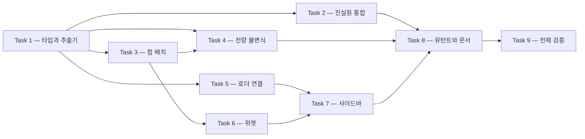

# 지역 그래프 위젯 구현 계획서

> **에이전트 작업자에게**: 이 계획을 실행할 때는 `superpowers:subagent-driven-development`(권장) 또는 `superpowers:executing-plans` 를 사용해 태스크 단위로 진행한다. 각 단계는 체크박스(`- [ ]`)로 추적한다.

**목표**: 블로그 본문 페이지의 좌측 사이드바 하단에, 현재 편을 중심으로 한 링크 그래프를 그리는 위젯을 추가한다.

**접근**: 빌드 시점에 `mdast` 파서로 편 사이의 링크를 뽑아 지역 그래프를 만들고, 브라우저에서 난수를 쓰지 않는 힘 시뮬레이션으로 좌표를 계산한다. 연결선은 SVG 로, 노드는 그 위에 절대 배치한 HTML 앵커로 그린다. 새 런타임 의존성을 들이지 않는다.

**기술 스택**: Next.js 14 Pages Router · TypeScript(`target: es5`) · Tailwind CSS · Vitest · `mdast-util-from-markdown`(이미 설치되어 있다)

**설계서**: [`2026-09-05-local-graph-widget-design.md`](../specs/2026-09-05-local-graph-widget-design.md)

---

## 전역 제약

이 절의 항목은 **모든 태스크의 요구사항에 암묵적으로 포함된다.**

| 제약 | 정확한 값 |
| --- | --- |
| 라우터 | Pages Router 만 쓴다. `app/` 디렉터리를 만들지 않는다 |
| 경로 별칭 | `@/lib/...` · `@/components/...` 를 쓴다. 상대 경로로 쓰지 않는다 |
| `tsconfig.json` | **동결이다.** `target: "es5"` 이므로 `Set` · `Map` · `matchAll` 을 `for...of` 로 직접 돌면 TS2802 가 난다. 반드시 `Array.from` 으로 배열화한 뒤 돈다. 배열에 대한 `for...of` 는 안전하다 |
| 클라이언트 안전 경계 | 컴포넌트는 `@/lib/blog/loader` 를 **import 하지 않는다.** `node:fs` 가 클라이언트 번들에 들어간다. 컴포넌트는 `@/lib/blog/types` 와 `@/lib/blog/graph-layout` 만 가리킨다 |
| 한국어 본문 | 줄바꿈이 깨지므로 `break-keep` 을 붙인다 |
| 다크 모드 | 새 컴포넌트의 모든 색에 `dark:` 짝을 둔다. 색 클래스가 **아예 없는 자리**는 짝 검사가 보지 못하므로, 상속에 맡기지 말고 명시한다 |
| 조건부 클래스 | `@/lib/utils` 의 `cn()` 을 쓴다 |
| 커밋 메시지 | 한글로 쓴다 |
| `git push` | **하지 않는다.** 사용자가 명시적으로 요청할 때만 한다 |
| 검사 수치 | 검사기·뮤턴트·테스트 케이스 수를 늘렸으면 그 수가 적힌 문서를 **같은 커밋에서** 고친다 |
| 빌드 성능 | 링크 지형은 빌드당 **한 번만** 만든다. 페이지마다 다시 만들면 실측으로 빌드가 약 262초 늘어난다 |

---

## 파일 구조

| 파일 | 신규 | 책임 | `node:fs` | 실행 시점 |
| --- | --- | --- | --- | --- |
| `lib/blog/types.ts` | 수정 | `GraphNode` · `GraphEdge` · `LocalGraph` 타입 선언 | 없음 | — |
| `lib/blog/graph.ts` | 신규 | 링크 추출과 지역 그래프 조립. **「무엇이 편을 잇는 링크인가」의 정본** | 없음 | 빌드 |
| `lib/blog/graph-layout.ts` | 신규 | 좌표 계산. 순수 함수만 담는다 | 없음 | 브라우저 |
| `lib/blog/loader.ts` | 수정 | `getLocalGraph()` 와 링크 지형 메모이제이션 | 있음 | 빌드 |
| `components/blog/local-graph.tsx` | 신규 | 그리기와 조작 | 없음 | 브라우저 |
| `components/blog/blog-shell.tsx` | 수정 | 사이드바를 위아래 둘로 나눈다 | 없음 | 브라우저 |
| `pages/blog/[category]/[slug].tsx` | 수정 | `getStaticProps` 가 그래프를 넘긴다 | — | 빌드 |
| `tailwind.config.js` | 수정 | 세로 기준 브레이크포인트 `tall` 추가 | — | — |
| `tests/blog/graph.test.ts` | 신규 | 추출과 조립의 단위 검사 | — | 테스트 |
| `tests/blog/graph-layout.test.ts` | 신규 | 좌표 계산의 단위 검사 | — | 테스트 |
| `tests/blog/content/graph.test.ts` | 신규 | 발행본 184편 전량 불변식 | — | 테스트 |
| `tests/blog/content/links.test.ts` | 수정 | 자기 정규식을 지우고 `graph.ts` 를 쓴다 | — | 테스트 |
| `scripts/mutate.mjs` | 수정 | 뮤턴트 6개 추가, `blog-unit` 검사 대상 확장 | — | 뮤테이션 |

## 태스크 의존 관계



Task 5·6·7 은 **하나의 커밋으로 묶인다.** 셋 중 어느 하나만으로는 타입 검사가 통과하지 않기
때문이다. Task 5 가 `BlogShell` 에 없는 prop 을 넘기고, Task 7 이 그 prop 을 받으며,
Task 6 이 Task 7 이 부르는 컴포넌트를 만든다. 나머지 태스크는 각각 단독으로 커밋한다.

## 이번 범위 밖

설계서 §7 이 언급한 **노드 드래그는 이번 계획에 넣지 않는다.** 시뮬레이션은 모델 좌표계에서 돌고 화면은 뷰박스 좌표계라, 드래그를 넣으면 포인터 좌표를 모델 좌표로 되돌리는 변환이 하나 더 필요하다. 좌표계가 둘인 채로 값을 주고받는 것은 이 리포에서 실제로 잘못 다룬 적이 있는 자리다. 마운트 애니메이션과 호버·포커스 강조와 클릭 이동만으로도 위젯은 충분히 조작 가능하며, 드래그는 별도 계획으로 다룬다.

---

## Task 1: 타입과 링크 추출기

**파일:**
- 수정: `lib/blog/types.ts` (파일 끝에 추가)
- 생성: `lib/blog/graph.ts`
- 테스트: `tests/blog/graph.test.ts`

**인터페이스:**
- 사용: 없음 (첫 태스크다)
- 제공: `GRAPH_NEIGHBOR_LIMIT: number` · `postId(p: {categorySlug: string; slug: string}): string` · `extractOutboundIds(body: string): string[]` · `buildLinkIndex(posts: GraphSource[]): LinkIndex` · `buildLocalGraph(posts: GraphSource[], links: LinkIndex, centerId: string, limit?: number): LocalGraph` · 타입 `GraphNode` · `GraphEdge` · `LocalGraph` · `GraphSource` · `LinkIndex`

- [ ] **Step 1: 타입을 추가한다**

`lib/blog/types.ts` 의 **맨 끝**에 붙인다. 이 파일은 선언 전용이므로 로직을 넣지 않는다.

```ts
/**
 * 지역 그래프의 노드 하나.
 *
 * 페이지 HTML 에 JSON 으로 직렬화되므로 링크를 만들 최소한만 담는다 —
 * `TreePost` 가 같은 이유로 세 필드만 담고 있다.
 */
export type GraphNode = {
  /** `<categorySlug>/<slug>`. 그래프 안에서 노드를 가리키는 유일한 값이다 */
  id: string;
  categorySlug: string;
  slug: string;
  title: string;
};

/** 방향 있는 연결선. `from` 의 본문이 `to` 를 가리킨다 */
export type GraphEdge = { from: string; to: string };

/**
 * 본문 페이지에 실리는 지역 그래프.
 *
 * `neighbors` 는 상한까지만 담고 잘린 수는 `hiddenCount` 에 남긴다 —
 * 화면에서 「+N」 으로 보여 주어 숨기지 않기 위함이다.
 *
 * `edges` 는 중심과 이웃 사이뿐 아니라 **이웃끼리의 연결선도** 담는다.
 * 중심에서 뻗은 선만 담으면 배치가 언제나 바퀴살 모양이 되어 힘 계산이 무의미해진다.
 */
export type LocalGraph = {
  center: GraphNode;
  neighbors: GraphNode[];
  edges: GraphEdge[];
  /** 상한을 넘어 잘린 이웃의 수. 0 이면 전부 담겼다 */
  hiddenCount: number;
};
```

- [ ] **Step 2: 실패하는 테스트를 쓴다**

`tests/blog/graph.test.ts` 를 새로 만든다.

```ts
import { describe, expect, it } from "vitest";
import {
  GRAPH_NEIGHBOR_LIMIT,
  buildLinkIndex,
  buildLocalGraph,
  extractOutboundIds,
  postId,
} from "@/lib/blog/graph";
import type { GraphSource } from "@/lib/blog/graph";

/** 테스트용 발행본을 만든다. 실제 Post 중 그래프가 쓰는 네 필드만 필요하다 */
function post(categorySlug: string, slug: string, title: string, body = ""): GraphSource {
  return { categorySlug, slug, title, body };
}

describe("링크 추출", () => {
  it("본문의 편 링크를 뽑는다", () => {
    expect(extractOutboundIds("[가](/blog/rag/a/) 를 본다")).toEqual(["rag/a"]);
  });

  it("앵커와 질의를 떼어 낸다", () => {
    expect(extractOutboundIds("[가](/blog/rag/a/#어떤-제목)")).toEqual(["rag/a"]);
    expect(extractOutboundIds("[가](/blog/rag/a/?x=1)")).toEqual(["rag/a"]);
  });

  it("슬래시가 없어도 같은 id 를 낸다", () => {
    expect(extractOutboundIds("[가](/blog/rag/a)")).toEqual(["rag/a"]);
  });

  it("카테고리 인덱스 링크는 편이 아니다", () => {
    expect(extractOutboundIds("[가](/blog/rag/)")).toEqual([]);
  });

  it("블로그 밖의 링크는 뽑지 않는다", () => {
    expect(extractOutboundIds("[가](https://example.com/blog/rag/a/)")).toEqual([]);
    expect(extractOutboundIds("[가](/about/)")).toEqual([]);
  });

  it("표 안의 링크도 뽑는다 — GFM 확장이 켜져 있어야 한다", () => {
    const md = "| 무엇 | 어디 |\n| --- | --- |\n| 가 | [나](/blog/rag/a/) |\n";
    expect(extractOutboundIds(md)).toEqual(["rag/a"]);
  });

  it("참조식 링크도 뽑는다", () => {
    expect(extractOutboundIds("[가][ref] 를 본다\n\n[ref]: /blog/rag/a/\n")).toEqual(["rag/a"]);
  });

  it("🔴 코드 블록 안의 링크는 뽑지 않는다 — 예시는 약속이 아니다", () => {
    const md = "```md\n[가](/blog/rag/a/)\n```\n";
    expect(extractOutboundIds(md)).toEqual([]);
  });

  it("🔴 인라인 코드 안의 링크도 뽑지 않는다", () => {
    expect(extractOutboundIds("`[가](/blog/rag/a/)` 라고 쓴다")).toEqual([]);
  });
});

describe("링크 지형", () => {
  it("실재하지 않는 대상은 지형에 넣지 않는다", () => {
    const posts = [post("rag", "a", "가", "[없다](/blog/rag/zzz/)")];
    const links = buildLinkIndex(posts);
    expect(Array.from(links.get("rag/a")!)).toEqual([]);
  });

  it("자기 자신을 가리키는 링크는 넣지 않는다", () => {
    const posts = [post("rag", "a", "가", "[자기](/blog/rag/a/)")];
    expect(Array.from(buildLinkIndex(posts).get("rag/a")!)).toEqual([]);
  });

  it("같은 편을 여러 번 가리켜도 한 번만 센다", () => {
    const posts = [post("rag", "a", "가", "[나](/blog/rag/b/) [나](/blog/rag/b/)"), post("rag", "b", "나")];
    expect(Array.from(buildLinkIndex(posts).get("rag/a")!)).toEqual(["rag/b"]);
  });
});

describe("지역 그래프 조립", () => {
  it("나가는 링크와 들어오는 링크를 모두 이웃으로 삼는다", () => {
    const posts = [
      post("rag", "c", "다", "[가](/blog/rag/a/)"),
      post("rag", "a", "가", "[나](/blog/rag/b/)"),
      post("rag", "b", "나"),
    ];
    const g = buildLocalGraph(posts, buildLinkIndex(posts), "rag/a");
    expect(g.neighbors.map((n) => n.id).sort()).toEqual(["rag/b", "rag/c"]);
    expect(g.hiddenCount).toBe(0);
  });

  it("🔴 이웃끼리의 연결선도 담는다", () => {
    const posts = [
      post("rag", "a", "가", "[나](/blog/rag/b/) [다](/blog/rag/c/)"),
      post("rag", "b", "나", "[다](/blog/rag/c/)"),
      post("rag", "c", "다"),
    ];
    const g = buildLocalGraph(posts, buildLinkIndex(posts), "rag/a");
    expect(g.edges).toContainEqual({ from: "rag/b", to: "rag/c" });
  });

  it("그려지지 않는 편으로 나가는 연결선은 담지 않는다", () => {
    const posts = [
      post("rag", "a", "가", "[나](/blog/rag/b/)"),
      post("rag", "b", "나", "[먼곳](/blog/rag/z/)"),
      post("rag", "z", "먼곳"),
    ];
    const g = buildLocalGraph(posts, buildLinkIndex(posts), "rag/a", 1);
    expect(g.neighbors.map((n) => n.id)).toEqual(["rag/b"]);
    expect(g.edges.some((e) => e.to === "rag/z")).toBe(false);
  });

  it("상한을 넘으면 자르고 잘린 수를 남긴다", () => {
    const links = ["b", "c", "d"].map((s) => `[${s}](/blog/rag/${s}/)`).join(" ");
    const posts = [
      post("rag", "a", "가", links),
      post("rag", "b", "나"),
      post("rag", "c", "다"),
      post("rag", "d", "라"),
    ];
    const g = buildLocalGraph(posts, buildLinkIndex(posts), "rag/a", 2);
    expect(g.neighbors).toHaveLength(2);
    expect(g.hiddenCount).toBe(1);
  });

  it("🔴 자를 때 양방향 이웃을 먼저 남긴다", () => {
    const posts = [
      post("rag", "a", "가", "[나](/blog/rag/b/) [다](/blog/rag/c/)"),
      post("rag", "b", "나"),
      post("rag", "c", "다", "[가](/blog/rag/a/)"),
    ];
    // rag/c 는 양방향(a 가 가리키고 c 도 a 를 가리킨다), rag/b 는 나가는 방향뿐이다.
    const g = buildLocalGraph(posts, buildLinkIndex(posts), "rag/a", 1);
    expect(g.neighbors.map((n) => n.id)).toEqual(["rag/c"]);
  });

  it("같은 순위끼리는 제목순으로 안정 정렬한다", () => {
    const posts = [
      post("rag", "a", "가", "[하](/blog/rag/x/) [나](/blog/rag/y/)"),
      post("rag", "x", "하"),
      post("rag", "y", "나"),
    ];
    const g = buildLocalGraph(posts, buildLinkIndex(posts), "rag/a", 1);
    expect(g.neighbors.map((n) => n.id)).toEqual(["rag/y"]);
  });

  it("중심 편이 없으면 던진다 — 조용히 빈 그래프를 내지 않는다", () => {
    expect(() => buildLocalGraph([], new Map(), "rag/없음")).toThrow();
  });

  it("상한 기본값이 12 다", () => {
    expect(GRAPH_NEIGHBOR_LIMIT).toBe(12);
  });

  it("postId 는 카테고리와 슬러그를 슬래시로 잇는다", () => {
    expect(postId({ categorySlug: "rag", slug: "a" })).toBe("rag/a");
  });
});
```

- [ ] **Step 3: 테스트가 실패하는지 확인한다**

실행: `npx vitest run tests/blog/graph.test.ts`
예상: `Failed to resolve import "@/lib/blog/graph"` 로 전부 실패한다.

- [ ] **Step 4: 구현한다**

`lib/blog/graph.ts` 를 새로 만든다.

```ts
import type { Root, RootContent } from "mdast";
import { fromMarkdown } from "mdast-util-from-markdown";
import { gfmFromMarkdown } from "mdast-util-gfm";
import { gfm } from "micromark-extension-gfm";
import type { GraphEdge, GraphNode, LocalGraph } from "@/lib/blog/types";

/**
 * 편과 편을 잇는 링크의 정본.
 *
 * 🔴 이 모듈이 판정의 유일한 자리다. `tests/blog/content/links.test.ts` 도 자기 정규식을
 * 두지 않고 여기를 쓴다. 같은 질문에 답하는 코드가 갈라지면 한쪽만 고쳐지고 나머지가
 * 낡는다 — 금칙어 목록이 코드와 문서로 갈라져 거짓 0 이 사실로 기록된 적이 있다.
 *
 * 🔴 판정을 정규식으로 근사하지 않는다. `mdast` 를 쓰는 이유는 **코드 블록과 인라인
 * 코드가 저절로 빠지기 때문**이다. 정규식으로 세면 본문에 인쇄된 예시 링크가 연결선이 된다.
 *
 * ⚠️ 이 파일은 빌드 시점에만 돈다. 컴포넌트가 import 하면 파서가 클라이언트 번들에 들어간다.
 */

/**
 * 사이드바 폭 224픽셀에 담기는 이웃의 수.
 *
 * 실측 분포가 중앙값 6 · 상위 10% 12 · 최대 30 이므로, 12에서 끊으면 약 90% 의 편이
 * 이웃을 전부 보게 된다. 이 상수를 바꾸면 페이지 용량과 화면 밀도가 함께 움직인다.
 */
export const GRAPH_NEIGHBOR_LIMIT = 12;

/** 그래프가 쓰는 발행본의 부분집합. `Post` 전체를 요구하지 않아 테스트가 가벼워진다 */
export type GraphSource = { categorySlug: string; slug: string; title: string; body: string };

/** 편 id 에서 그 편이 가리키는 편 id 들로 가는 인접 목록. 방향을 보존한다 */
export type LinkIndex = Map<string, Set<string>>;

/** `<categorySlug>/<slug>` */
export function postId(post: { categorySlug: string; slug: string }): string {
  return `${post.categorySlug}/${post.slug}`;
}

/**
 * `/blog/<category>/<slug>/#앵커` 에서 `<category>/<slug>` 를 뽑는다.
 *
 * 조각이 둘이 아니면 null 이다 — `/blog/rag/` 는 카테고리 인덱스이지 편이 아니므로
 * 편 대 편 관계를 만들지 않는다.
 */
function toPostId(url: string): string | null {
  if (!url.startsWith("/blog/")) return null;
  const path = url.split(/[#?]/)[0].replace(/\/$/, "");
  const parts = path.slice("/blog/".length).split("/");
  if (parts.length !== 2 || !parts[0] || !parts[1]) return null;
  return `${parts[0]}/${parts[1]}`;
}

/** 본문에서 편을 가리키는 링크의 id 를 등장 순서대로 뽑는다. 중복을 제거하지 않는다 */
export function extractOutboundIds(body: string): string[] {
  const ids: string[] = [];
  const tree: Root = fromMarkdown(body, {
    extensions: [gfm()],
    mdastExtensions: [gfmFromMarkdown()],
  });

  const walk = (node: Root | RootContent): void => {
    // `definition` 은 참조식 링크(`[가][ref]` 와 `[ref]: /경로`)의 URL 을 담은 노드다.
    // `link` 만 보면 그 형식이 통째로 빠진다.
    if ((node.type === "link" || node.type === "definition") && node.url) {
      const id = toPostId(node.url);
      if (id) ids.push(id);
    }
    const children = "children" in node ? (node.children as RootContent[]) : [];
    for (const child of children) walk(child);
  };
  walk(tree);
  return ids;
}

/**
 * 발행본 전량의 링크 지형을 만든다.
 *
 * 🔴 **빌드당 한 번만 부른다.** 184편의 본문을 파싱하는 데 실측 1,426 ms 가 들며,
 * 페이지마다 다시 만들면 빌드가 약 262초 늘어난다. 메모이제이션은 `loader.ts` 가 맡는다.
 */
export function buildLinkIndex(posts: GraphSource[]): LinkIndex {
  const known = new Set(posts.map(postId));
  const index: LinkIndex = new Map();

  for (const post of posts) {
    const from = postId(post);
    const targets = new Set<string>();
    for (const to of extractOutboundIds(post.body)) {
      // 실재하지 않는 대상은 죽은 링크다. 링크 검사가 따로 잡으므로 여기서는 버린다.
      if (to !== from && known.has(to)) targets.add(to);
    }
    index.set(from, targets);
  }
  return index;
}

/** 중심 기준의 관계 순위. 낮을수록 먼저 남는다 */
function neighborRank(id: string, outgoing: Set<string>, incoming: Set<string>): number {
  if (outgoing.has(id) && incoming.has(id)) return 0;
  if (outgoing.has(id)) return 1;
  return 2;
}

/**
 * 한 편을 중심으로 한 지역 그래프를 만든다.
 *
 * 이웃이 상한을 넘으면 자르되 **무엇이 남는지가 결정론적**이어야 한다.
 * 양방향으로 이어진 편을 먼저 남기고, 같은 순위끼리는 제목순으로 정렬한다.
 */
export function buildLocalGraph(
  posts: GraphSource[],
  links: LinkIndex,
  centerId: string,
  limit: number = GRAPH_NEIGHBOR_LIMIT
): LocalGraph {
  const byId = new Map<string, GraphSource>(posts.map((p) => [postId(p), p]));
  const center = byId.get(centerId);
  // 조용히 빈 그래프를 내면 화면이 비어 있는 이유를 찾을 수 없다.
  if (!center) throw new Error(`[blog] 그래프의 중심 편을 찾지 못했습니다: ${centerId}`);

  const outgoing = links.get(centerId) ?? new Set<string>();
  const incoming = new Set<string>();
  for (const entry of Array.from(links)) {
    const [from, targets] = entry;
    if (from !== centerId && targets.has(centerId)) incoming.add(from);
  }

  const candidates = Array.from(new Set(Array.from(outgoing).concat(Array.from(incoming))))
    .filter((id) => byId.has(id))
    .sort((a, b) => {
      const gap = neighborRank(a, outgoing, incoming) - neighborRank(b, outgoing, incoming);
      if (gap !== 0) return gap;
      return byId.get(a)!.title.localeCompare(byId.get(b)!.title, "ko");
    });

  const kept = candidates.slice(0, limit);
  const shown = new Set<string>(kept);
  shown.add(centerId);

  const edges: GraphEdge[] = [];
  for (const from of Array.from(shown)) {
    for (const to of Array.from(links.get(from) ?? new Set<string>())) {
      // 그려지지 않는 노드로 나가는 선은 허공을 가리킨다.
      if (shown.has(to)) edges.push({ from, to });
    }
  }
  edges.sort((a, b) => (a.from === b.from ? a.to.localeCompare(b.to) : a.from.localeCompare(b.from)));

  return {
    center: toNode(center),
    neighbors: kept.map((id) => toNode(byId.get(id)!)),
    edges,
    hiddenCount: candidates.length - kept.length,
  };
}

function toNode(post: GraphSource): GraphNode {
  return { id: postId(post), categorySlug: post.categorySlug, slug: post.slug, title: post.title };
}
```

- [ ] **Step 5: 테스트가 통과하는지 확인한다**

실행: `npx vitest run tests/blog/graph.test.ts`
예상: 21케이스 PASS

- [ ] **Step 6: 타입을 확인한다**

실행: `npx tsc --noEmit`
예상: 출력 없이 종료 코드 0. **Vitest 는 타입을 지울 뿐 검사하지 않으므로 이 단계를 건너뛰면 안 된다.**

- [ ] **Step 7: 커밋한다**

```bash
git add lib/blog/types.ts lib/blog/graph.ts tests/blog/graph.test.ts
git commit -m "기능: 편 사이 링크에서 지역 그래프를 뽑는 모듈을 추가한다"
```

---

## Task 2: 링크 추출기의 진실원 통합

`tests/blog/content/links.test.ts` 는 자기 정규식(`outboundKeys`)으로 링크를 뽑고 있다. 같은 질문에 답하는 코드를 둘로 두지 않기 위해 Task 1 의 추출기로 갈아 끼운다. 실측으로 두 방식의 결과가 921개로 같고 차집합이 양쪽 0개이므로 **동작은 바뀌지 않는다.**

**파일:**
- 수정: `tests/blog/content/links.test.ts`

**인터페이스:**
- 사용: `extractOutboundIds` · `postId` (Task 1)
- 제공: 없음

- [ ] **Step 1: 교체 전의 값을 기록한다**

교체가 동작을 바꾸지 않았다는 것을 증명할 대조군이 필요하다.

실행: `npx vitest run tests/blog/content/links.test.ts`
기대: 전부 PASS. **케이스 수를 적어 둔다.**

- [ ] **Step 2: `outboundKeys` 를 갈아 끼운다**

`tests/blog/content/links.test.ts` 의 상단 import 에 한 줄을 더한다.

```ts
import { extractOutboundIds } from "@/lib/blog/graph";
```

그리고 기존 `outboundKeys` 함수 **전체**(주석 블록 포함, `function outboundKeys(post: Post): string[] { ... }`)를 아래로 바꾼다.

```ts
/**
 * 본문의 `/blog/<category>/<slug>/` 링크를 뽑는다.
 *
 * 🔴 판정은 이 파일이 하지 않는다. `lib/blog/graph.ts` 가 정본이며 여기서는 부르기만 한다.
 * 예전에는 이 자리에 정규식이 있었는데, 그 정규식은 코드 블록 안의 예시 링크를 연결선으로
 * 셌고 참조식 링크를 놓쳤다. 파서로 옮기면서 두 결함이 함께 사라졌다.
 * 교체 시점의 실측으로 정규식과 파서가 모두 921개를 냈고 차집합은 양쪽 0개였다.
 */
function outboundKeys(post: Post): string[] {
  return extractOutboundIds(post.body);
}
```

- [ ] **Step 3: 코드 블록 케이스를 추가한다**

같은 파일의 `describe("링크 무결성", ...)` 블록 **안**, 마지막 `it` 뒤에 붙인다.

```ts
  it("🔴 코드 블록 안의 편 링크는 연결선으로 세지 않는다", () => {
    // 이 케이스는 옛 정규식으로 되돌리면 반드시 실패한다. 정규식은 코드 블록을 구분하지 못한다.
    const fenced = "```md\n[예시](/blog/rag/a/)\n```\n";
    expect(outboundKeys({ ...posts[0], body: fenced })).toEqual([]);
  });
```

- [ ] **Step 4: 테스트가 통과하는지 확인한다**

실행: `npx vitest run tests/blog/content/links.test.ts`
예상: Step 1 의 케이스 수 + 1 이 전부 PASS. 죽은 링크와 고립 판정의 결과가 **Step 1 과 같아야 한다.**

- [ ] **Step 5: 🔴 되돌려 실패하는지 확인한다**

**이 단계를 건너뛰면 안 된다.** 통과만 보고는 케이스가 헛도는지 알 수 없다. 이 리포에서 `source-overlap` 이 자기 검사 12/12 를 내면서도 설명과 다르게 동작한 적이 있다.

`outboundKeys` 를 옛 정규식으로 **임시로** 되돌린다.

```ts
function outboundKeys(post: Post): string[] {
  const keys: string[] = [];
  for (const m of Array.from(post.body.matchAll(/\]\(\/blog\/([^)#?]+?)\/?(?:[#?][^)]*)?\)/g))) {
    const target = m[1].replace(/\/$/, "");
    if (target.split("/").length === 2) keys.push(target);
  }
  return keys;
}
```

실행: `npx vitest run tests/blog/content/links.test.ts`
예상: **「코드 블록 안의 편 링크」케이스가 FAIL 한다.** `[ 'rag/a' ]` 와 `[]` 가 다르다고 나온다.

FAIL 을 눈으로 확인한 뒤 Step 2 의 파서 판을 **되돌려 놓는다.** 그리고 다시 실행해 전부 PASS 인 것을 확인한다.

- [ ] **Step 6: 커밋한다**

```bash
git add tests/blog/content/links.test.ts
git commit -m "수정: 링크 추출을 정규식에서 파서로 옮겨 판정의 정본을 하나로 모은다"
```

---

## Task 3: 힘 배치

**파일:**
- 생성: `lib/blog/graph-layout.ts`
- 테스트: `tests/blog/graph-layout.test.ts`

**인터페이스:**
- 사용: `GraphEdge` (Task 1)
- 제공: `DEFAULT_LAYOUT_OPTIONS: LayoutOptions` · `separationVector(i: number, j: number): {dx: number; dy: number}` · `layout(input: LayoutInput, options?: LayoutOptions): LayoutPoint[]` · 타입 `LayoutInput` · `LayoutOptions` · `LayoutPoint`

- [ ] **Step 1: 실패하는 테스트를 쓴다**

`tests/blog/graph-layout.test.ts` 를 새로 만든다.

```ts
import { describe, expect, it } from "vitest";
import { DEFAULT_LAYOUT_OPTIONS, layout, separationVector } from "@/lib/blog/graph-layout";
import type { GraphEdge } from "@/lib/blog/types";

const OPT = DEFAULT_LAYOUT_OPTIONS;

/** 중심 하나에 이웃 n 개를 달고, 이웃끼리도 사슬로 잇는다 */
function ring(n: number): { centerId: string; nodeIds: string[]; edges: GraphEdge[] } {
  const nodeIds = ["c"];
  const edges: GraphEdge[] = [];
  for (let i = 0; i < n; i++) {
    nodeIds.push(`n${i}`);
    edges.push({ from: "c", to: `n${i}` });
    if (i > 0) edges.push({ from: `n${i - 1}`, to: `n${i}` });
  }
  return { centerId: "c", nodeIds, edges };
}

describe("겹침 해소 벡터", () => {
  it("0 이 아닌 방향을 낸다 — 0 이면 거리가 0 인 채로 남아 NaN 이 된다", () => {
    const v = separationVector(0, 1);
    expect(Math.abs(v.dx) + Math.abs(v.dy)).toBeGreaterThan(0);
  });

  it("같은 쌍에 항상 같은 방향을 낸다 — 난수를 쓰지 않는다", () => {
    expect(separationVector(3, 7)).toEqual(separationVector(3, 7));
  });

  it("다른 쌍에는 다른 방향을 낸다", () => {
    expect(separationVector(0, 1)).not.toEqual(separationVector(0, 2));
  });
});

describe("좌표 계산", () => {
  it("같은 입력에 같은 좌표를 낸다", () => {
    expect(layout(ring(8))).toEqual(layout(ring(8)));
  });

  it("중심 노드가 뷰박스 한가운데에 온다", () => {
    const p = layout(ring(8)).find((q) => q.id === "c")!;
    expect(p.x).toBeCloseTo(OPT.width / 2, 6);
    expect(p.y).toBeCloseTo(OPT.height / 2, 6);
  });

  it("🔴 모든 좌표가 유한하다 — NaN 이면 SVG 가 오류 없이 아무것도 그리지 않는다", () => {
    for (const n of [0, 1, 2, 3, 12]) {
      for (const p of layout(ring(n))) {
        expect(Number.isFinite(p.x), `${n}개: ${p.id}.x`).toBe(true);
        expect(Number.isFinite(p.y), `${n}개: ${p.id}.y`).toBe(true);
      }
    }
  });

  it("모든 좌표가 뷰박스 안에 있다", () => {
    for (const p of layout(ring(12))) {
      expect(p.x).toBeGreaterThanOrEqual(0);
      expect(p.x).toBeLessThanOrEqual(OPT.width);
      expect(p.y).toBeGreaterThanOrEqual(0);
      expect(p.y).toBeLessThanOrEqual(OPT.height);
    }
  });

  it("서로 다른 두 노드가 최소 간격의 절반보다 가깝지 않다", () => {
    // 이 케이스가 실패하면 임계값을 낮추지 말고 REPULSION 을 올려라.
    // 임계값을 낮추는 것은 「겹쳐도 된다」로 규칙을 바꾸는 일이다.
    const points = layout(ring(12));
    for (let i = 0; i < points.length; i++) {
      for (let j = i + 1; j < points.length; j++) {
        const d = Math.hypot(points[i].x - points[j].x, points[i].y - points[j].y);
        expect(d, `${points[i].id} 와 ${points[j].id}`).toBeGreaterThanOrEqual(OPT.minGap / 2);
      }
    }
  });

  it("연결선이 하나도 없어도 배치가 된다", () => {
    const points = layout({ centerId: "c", nodeIds: ["c", "a", "b"], edges: [] });
    expect(points).toHaveLength(3);
    expect(points.every((p) => Number.isFinite(p.x) && Number.isFinite(p.y))).toBe(true);
  });

  it("중심만 있어도 배치가 된다", () => {
    expect(layout({ centerId: "c", nodeIds: ["c"], edges: [] })).toEqual([
      { id: "c", x: OPT.width / 2, y: OPT.height / 2 },
    ]);
  });

  it("노드에 없는 id 를 가리키는 연결선은 무시한다", () => {
    const points = layout({ centerId: "c", nodeIds: ["c", "a"], edges: [{ from: "c", to: "없음" }] });
    expect(points.map((p) => p.id)).toEqual(["c", "a"]);
  });

  it("틱을 0 으로 주면 초기 원형 배치가 그대로 나온다", () => {
    const points = layout(ring(4), { ...OPT, ticks: 0 });
    expect(points.every((p) => Number.isFinite(p.x))).toBe(true);
    // 중심을 뺀 넷의 중심으로부터의 거리가 모두 같다 — 원주 위에 균등 배치했기 때문이다.
    const c = points.find((p) => p.id === "c")!;
    const ds = points.filter((p) => p.id !== "c").map((p) => Math.hypot(p.x - c.x, p.y - c.y));
    for (const d of ds) expect(d).toBeCloseTo(ds[0], 6);
  });
});
```

- [ ] **Step 2: 테스트가 실패하는지 확인한다**

실행: `npx vitest run tests/blog/graph-layout.test.ts`
예상: `Failed to resolve import "@/lib/blog/graph-layout"` 로 전부 실패한다.

- [ ] **Step 3: 구현한다**

`lib/blog/graph-layout.ts` 를 새로 만든다.

```ts
import type { GraphEdge } from "@/lib/blog/types";

/**
 * 지역 그래프의 좌표 계산.
 *
 * 🔴 이 모듈은 **클라이언트에서 돈다.** 빌드 전용 모듈(`loader.ts` · `graph.ts`)을 절대
 * import 하지 않는다 — `node:fs` 와 마크다운 파서가 클라이언트 번들에 들어간다.
 *
 * 🔴 난수를 전혀 쓰지 않는다. 초기 배치가 인덱스로만 정해지므로 같은 입력에 항상 같은
 * 좌표가 나오고, 그래서 스냅숏 검사가 성립한다. 씨앗조차 필요 없다.
 */

export type LayoutInput = {
  /** 중심 노드의 id. 좌표가 고정되어 항상 화면 한가운데에 온다 */
  centerId: string;
  /** 중심을 포함한 모든 노드의 id. **순서가 초기 배치를 정하므로** 호출부에서 안정적이어야 한다 */
  nodeIds: string[];
  edges: GraphEdge[];
};

export type LayoutOptions = {
  width: number;
  height: number;
  /** 노드 중심 사이에 두고 싶은 최소 간격(픽셀) */
  minGap: number;
  /** 시뮬레이션 반복 횟수. 수렴 판정을 두지 않고 고정 횟수로 끊는다 */
  ticks: number;
};

export type LayoutPoint = { id: string; x: number; y: number };

export const DEFAULT_LAYOUT_OPTIONS: LayoutOptions = {
  width: 200,
  height: 180,
  minGap: 26,
  ticks: 300,
};

/** 두 노드가 이보다 가까우면 겹친 것으로 보고 밀어낸다 */
const EPSILON = 0.01;

/**
 * 두 노드가 정확히 겹쳤을 때 밀어낼 방향.
 *
 * 🔴 **이 가드를 `layout` 안에 인라인으로 두지 않고 순수 함수로 뽑은 이유**가 있다.
 * 흩어져 있으면 통째로 지워도 케이스가 전부 통과할 수 있다 — 겹침이 우연히 일어나지
 * 않는 입력만 검사하면 가드가 없어도 결과가 같기 때문이다. 함수로 뽑으면 가드 자체를
 * 직접 검사할 수 있다.
 *
 * 인덱스로 각도를 만들므로 난수가 아니며, 같은 쌍에는 항상 같은 방향이 나온다.
 */
export function separationVector(i: number, j: number): { dx: number; dy: number } {
  const angle = (2 * Math.PI * ((i * 31 + j * 17) % 97)) / 97;
  return { dx: Math.cos(angle) * EPSILON, dy: Math.sin(angle) * EPSILON };
}

export function layout(input: LayoutInput, options: LayoutOptions = DEFAULT_LAYOUT_OPTIONS): LayoutPoint[] {
  const { centerId, nodeIds, edges } = input;
  const { width, height, minGap, ticks } = options;
  const count = nodeIds.length;

  const indexOf = new Map<string, number>();
  nodeIds.forEach((id, i) => indexOf.set(id, i));
  const centerIndex = indexOf.get(centerId) ?? 0;

  // 초기 배치 — 중심은 원점, 나머지는 원주 위에 인덱스 순서대로 균등 배치한다.
  const radius = Math.min(width, height) / 3;
  const others = nodeIds.filter((id) => id !== centerId);
  const xs: number[] = [];
  const ys: number[] = [];
  for (const id of nodeIds) {
    if (id === centerId) {
      xs.push(0);
      ys.push(0);
      continue;
    }
    const k = others.indexOf(id);
    const angle = (2 * Math.PI * k) / Math.max(1, others.length);
    xs.push(radius * Math.cos(angle));
    ys.push(radius * Math.sin(angle));
  }

  const vx = nodeIds.map(() => 0);
  const vy = nodeIds.map(() => 0);

  // 연결선을 인덱스 쌍으로 바꾼다. 배치에는 방향이 필요 없다.
  const springs: number[][] = [];
  for (const edge of edges) {
    const a = indexOf.get(edge.from);
    const b = indexOf.get(edge.to);
    if (a === undefined || b === undefined || a === b) continue;
    springs.push([a, b]);
  }

  const REPULSION = minGap * minGap * 8;
  const SPRING = 0.02;
  const REST = minGap * 1.8;
  const GRAVITY = 0.012;
  const DAMPING = 0.82;

  for (let t = 0; t < ticks; t++) {
    const fx = nodeIds.map(() => 0);
    const fy = nodeIds.map(() => 0);

    // 반발력 — 모든 쌍. 노드가 최대 13개이므로 쌍이 78개다.
    for (let i = 0; i < count; i++) {
      for (let j = i + 1; j < count; j++) {
        let dx = xs[i] - xs[j];
        let dy = ys[i] - ys[j];
        let d2 = dx * dx + dy * dy;
        if (d2 < EPSILON * EPSILON) {
          const push = separationVector(i, j);
          dx = push.dx;
          dy = push.dy;
          d2 = dx * dx + dy * dy;
        }
        const d = Math.sqrt(d2);
        const f = REPULSION / d2;
        fx[i] += (dx / d) * f;
        fy[i] += (dy / d) * f;
        fx[j] -= (dx / d) * f;
        fy[j] -= (dy / d) * f;
      }
    }

    // 인력 — 연결선으로 이어진 쌍.
    for (const spring of springs) {
      const a = spring[0];
      const b = spring[1];
      const dx = xs[b] - xs[a];
      const dy = ys[b] - ys[a];
      const d = Math.sqrt(dx * dx + dy * dy) || EPSILON;
      const f = (d - REST) * SPRING;
      fx[a] += (dx / d) * f;
      fy[a] += (dy / d) * f;
      fx[b] -= (dx / d) * f;
      fy[b] -= (dy / d) * f;
    }

    // 중심 수렴력 — 화면 밖으로 흩어지는 것을 막는다.
    for (let i = 0; i < count; i++) {
      fx[i] -= xs[i] * GRAVITY;
      fy[i] -= ys[i] * GRAVITY;
    }

    // 갱신. 중심 노드는 움직이지 않는다.
    for (let i = 0; i < count; i++) {
      if (i === centerIndex) continue;
      vx[i] = (vx[i] + fx[i]) * DAMPING;
      vy[i] = (vy[i] + fy[i]) * DAMPING;
      xs[i] += vx[i];
      ys[i] += vy[i];
    }
  }

  return toViewBox(nodeIds, xs, ys, centerIndex, options);
}

/**
 * 모델 좌표를 뷰박스 좌표로 옮긴다.
 *
 * 중심 노드가 화면 한가운데에 오도록 평행이동한 뒤, 가장 먼 노드가 여백 안에 들어오도록
 * **축소만** 한다. 확대하면 노드가 둘뿐인 그래프가 화면을 가득 채워 어색해진다.
 *
 * ⚠️ 여기에 `isFinite` 폴백을 두지 마라. NaN 을 조용히 가운데 좌표로 바꾸면 「좌표가
 * 전부 유한하다」는 검사가 무엇도 지키지 못하는 검사가 된다.
 */
function toViewBox(
  nodeIds: string[],
  xs: number[],
  ys: number[],
  centerIndex: number,
  options: LayoutOptions
): LayoutPoint[] {
  const { width, height, minGap } = options;
  const pad = minGap / 2 + 2;
  const cx = xs[centerIndex];
  const cy = ys[centerIndex];

  let maxX = 0;
  let maxY = 0;
  for (let i = 0; i < nodeIds.length; i++) {
    maxX = Math.max(maxX, Math.abs(xs[i] - cx));
    maxY = Math.max(maxY, Math.abs(ys[i] - cy));
  }

  const scale = Math.min(
    maxX > 0 ? (width / 2 - pad) / maxX : 1,
    maxY > 0 ? (height / 2 - pad) / maxY : 1,
    1
  );

  // `scale` 이 두 축의 한계 중 작은 쪽을 따르므로 결과는 언제나 여백 안이다.
  // ⚠️ 여기에 clamp 를 덧대지 마라. 증명으로 이미 안전한 자리에 가드를 두면
  // **어떤 케이스도 죽일 수 없는 가지**가 하나 생긴다.
  return nodeIds.map((id, i) => ({
    id,
    x: width / 2 + (xs[i] - cx) * scale,
    y: height / 2 + (ys[i] - cy) * scale,
  }));
}
```

- [ ] **Step 4: 테스트가 통과하는지 확인한다**

실행: `npx vitest run tests/blog/graph-layout.test.ts`
예상: 12케이스 PASS

「최소 간격」케이스가 실패하면 `REPULSION` 의 계수 8을 12, 16 순으로 올린다. **임계값 `minGap / 2` 를 낮추지 마라.**

- [ ] **Step 5: 타입을 확인한다**

실행: `npx tsc --noEmit`
예상: 출력 없이 종료 코드 0

- [ ] **Step 6: 커밋한다**

```bash
git add lib/blog/graph-layout.ts tests/blog/graph-layout.test.ts
git commit -m "기능: 난수를 쓰지 않는 힘 배치로 그래프 좌표를 계산한다"
```

---

## Task 4: 발행본 전량 불변식

단위 검사는 만들어 낸 입력만 본다. 실제 발행본 184편에서 그래프가 성립하는지는 따로 확인해야 한다.

**파일:**
- 생성: `tests/blog/content/graph.test.ts`

**인터페이스:**
- 사용: `buildLinkIndex` · `buildLocalGraph` · `postId` (Task 1) · `layout` (Task 3) · `readPosts` (기존)
- 제공: 없음

- [ ] **Step 1: 검사를 쓴다**

`tests/blog/content/graph.test.ts` 를 새로 만든다.

```ts
import { describe, expect, it } from "vitest";
import { readPosts } from "@/lib/blog/loader";
import { buildLinkIndex, buildLocalGraph, postId } from "@/lib/blog/graph";
import { layout } from "@/lib/blog/graph-layout";

/**
 * 발행본 전량에 대한 그래프 불변식.
 *
 * 위젯이 화면에서 비어 보이는 원인은 대개 오류가 아니라 조용한 값이다 —
 * 이웃이 0개이거나 좌표가 NaN 이면 SVG 는 아무 말 없이 아무것도 그리지 않는다.
 */
const posts = readPosts();
const links = buildLinkIndex(posts);

describe("발행본 그래프", () => {
  it("발행본을 읽었다", () => {
    // 0편이면 아래 검사가 전부 공허참이 된다.
    expect(posts.length).toBeGreaterThan(0);
  });

  it("모든 편에 이웃이 하나 이상 있다", () => {
    const empty: string[] = [];
    for (const post of posts) {
      const graph = buildLocalGraph(posts, links, postId(post));
      if (graph.neighbors.length === 0) empty.push(postId(post));
    }
    expect(empty, `이웃 없는 편 ${empty.length}편`).toEqual([]);
  });

  it("🔴 모든 편에서 좌표가 유한하다", () => {
    const broken: string[] = [];
    for (const post of posts) {
      const graph = buildLocalGraph(posts, links, postId(post));
      const nodeIds = [graph.center.id].concat(graph.neighbors.map((n) => n.id));
      for (const point of layout({ centerId: graph.center.id, nodeIds, edges: graph.edges })) {
        if (!Number.isFinite(point.x) || !Number.isFinite(point.y)) broken.push(`${postId(post)} -> ${point.id}`);
      }
    }
    expect(broken, `좌표가 유한하지 않은 자리 ${broken.length}곳`).toEqual([]);
  });

  it("연결선의 양 끝이 전부 그려지는 노드다", () => {
    const dangling: string[] = [];
    for (const post of posts) {
      const graph = buildLocalGraph(posts, links, postId(post));
      const shown = new Set([graph.center.id].concat(graph.neighbors.map((n) => n.id)));
      for (const edge of graph.edges) {
        if (!shown.has(edge.from) || !shown.has(edge.to)) dangling.push(`${postId(post)}: ${edge.from} -> ${edge.to}`);
      }
    }
    expect(dangling, `허공을 가리키는 연결선 ${dangling.length}개`).toEqual([]);
  });

  it("이웃 수가 상한을 넘지 않는다", () => {
    const over = posts
      .map((p) => buildLocalGraph(posts, links, postId(p)))
      .filter((g) => g.neighbors.length > 12)
      .length;
    expect(over).toBe(0);
  });
});
```

- [ ] **Step 2: 실행한다**

실행: `npx vitest run tests/blog/content/graph.test.ts`
예상: 5케이스 PASS. 링크 지형을 한 번만 만들므로 수 초 안에 끝난다.

「모든 편에 이웃이 하나 이상 있다」가 실패하면 그것은 검사의 문제가 아니라 **발행본이 고립된 것**이다. `tests/blog/content/links.test.ts` 의 고립 검사와 함께 원인을 본다.

- [ ] **Step 3: 커밋한다**

```bash
git add tests/blog/content/graph.test.ts
git commit -m "검사: 발행본 전량에서 그래프의 이웃과 좌표가 성립하는지 본다"
```

---

## Task 5: 로더 연결과 메모이제이션

**파일:**
- 수정: `lib/blog/loader.ts` (파일 끝에 추가)
- 수정: `pages/blog/[category]/[slug].tsx`

**인터페이스:**
- 사용: `buildLinkIndex` · `buildLocalGraph` · `postId` (Task 1) · `LocalGraph` (Task 1)
- 제공: `getLocalGraph(categorySlug: string, slug: string): LocalGraph`

- [ ] **Step 1: 로더에 함수를 추가한다**

`lib/blog/loader.ts` 의 import 에 한 줄을 더한다.

```ts
import { buildLinkIndex, buildLocalGraph, type LinkIndex } from "@/lib/blog/graph";
```

그리고 `LocalGraph` 를 타입 import 에 더한다.

```ts
import type { BlogTree, LocalGraph, Post, PostSummary, SeriesContext } from "@/lib/blog/types";
```

파일 **맨 끝**에 붙인다.

```ts
/**
 * 링크 지형의 빌드 단위 캐시.
 *
 * 🔴 **이 캐시가 없으면 빌드가 약 262초 늘어난다.** 184편의 본문을 파서로 한 번 훑는 데
 * 실측 1,426 ms 가 드는데, `getStaticProps` 가 페이지마다 부르면 184번 반복된다.
 * 한 번의 빌드 안에서 발행본은 바뀌지 않으므로 모듈 수준에 담아 둔다.
 */
let linkIndexCache: LinkIndex | null = null;

function getLinkIndex(posts: Post[]): LinkIndex {
  if (!linkIndexCache) linkIndexCache = buildLinkIndex(posts);
  return linkIndexCache;
}

/**
 * 본문 페이지에 실을 지역 그래프.
 *
 * 페이지의 getStaticProps 에서만 부른다 — `readPosts` 가 fs 를 쓴다.
 */
export function getLocalGraph(categorySlug: string, slug: string): LocalGraph {
  const posts = readPosts();
  return buildLocalGraph(posts, getLinkIndex(posts), `${categorySlug}/${slug}`);
}
```

- [ ] **Step 2: 본문 페이지가 그래프를 넘기게 한다**

`pages/blog/[category]/[slug].tsx` 를 세 곳 고친다.

첫째, import 에 `getLocalGraph` 를 더한다.

```ts
import { getAdjacentPosts, getAllPosts, getBlogTree, getLocalGraph, getPost, getSeriesContext } from "@/lib/blog/loader";
```

둘째, 타입 import 에 `LocalGraph` 를 더하고 `Props` 에 필드를 더한다.

```ts
import type { BlogTree, LocalGraph, Post, PostSummary, SeriesContext } from "@/lib/blog/types";

type Props = {
  tree: BlogTree;
  post: Post;
  seriesContext: SeriesContext | null;
  prev: PostSummary | null;
  next: PostSummary | null;
  graph: LocalGraph;
};
```

셋째, `getStaticProps` 의 `props` 와 컴포넌트의 구조 분해에 `graph` 를 더한다.

```ts
  return {
    props: {
      tree: getBlogTree(category),
      post,
      seriesContext: getSeriesContext(category, slug),
      prev,
      next,
      graph: getLocalGraph(category, slug),
    },
  };
};

export default function BlogPostPage({ tree, post, seriesContext, prev, next, graph }: Props) {
```

그리고 `BlogShell` 에 넘긴다. Task 6 에서 `BlogShell` 이 이 prop 을 받도록 고치므로, **지금은 타입 오류가 난다.** Step 3 에서 확인한다.

```tsx
      <BlogShell tree={tree} activePostSlug={post.slug} toc={post.toc} graph={graph}>
```

- [ ] **Step 3: 타입 오류를 확인한다**

실행: `npx tsc --noEmit`
예상: `Property 'graph' does not exist on type 'BlogShellProps'` 로 **실패한다.** 이것이 Task 6 이 필요하다는 신호다.

- [ ] **Step 4: 커밋하지 않는다**

이 태스크는 단독으로 빌드가 통과하지 않으므로 Task 6·7 과 함께 커밋한다. 다음 태스크로 이어서 간다.

---

## Task 6: 위젯 컴포넌트

**파일:**
- 생성: `components/blog/local-graph.tsx`
- 수정: `tailwind.config.js`

**인터페이스:**
- 사용: `LocalGraph` (Task 1) · `DEFAULT_LAYOUT_OPTIONS` · `layout` (Task 3)
- 제공: `LocalGraphPanel({ graph }: { graph: LocalGraph })`

- [ ] **Step 1: 세로 브레이크포인트를 더한다**

`tailwind.config.js` 의 `theme.extend` 안, `borderRadius` **앞**에 붙인다.

```js
      // 화면이 낮으면 그래프가 카테고리 트리를 밀어낸다. 세로 기준으로만 켠다.
      screens: {
        tall: { raw: "(min-height: 720px)" },
      },
```

- [ ] **Step 2: 컴포넌트를 만든다**

`components/blog/local-graph.tsx` 를 새로 만든다.

```tsx
import { DEFAULT_LAYOUT_OPTIONS, layout } from "@/lib/blog/graph-layout";
import type { GraphNode, LocalGraph } from "@/lib/blog/types";
import { cn } from "@/lib/utils";
import Link from "next/link";
import { useEffect, useMemo, useRef, useState } from "react";

/**
 * 지역 그래프 위젯.
 *
 * 🔴 연결선만 SVG 로 그리고 **노드는 그 위에 절대 배치한 HTML 앵커**로 둔다.
 * SVG 안에서는 `next/link` 를 쓸 수 없어 클라이언트 라우팅이 끊기고, 한국어 라벨에
 * `break-keep` 이나 말줄임을 적용하기도 까다롭다.
 *
 * 라벨은 중심 편과 지금 가리키고 있는 노드만 보여 준다. 폭 224픽셀 안에 제목 12개를
 * 모두 쓰면 겹쳐서 읽을 수 없다 — Obsidian 의 실물도 그 상태였다.
 */

const { width: WIDTH, height: HEIGHT } = DEFAULT_LAYOUT_OPTIONS;

/** 마운트 애니메이션의 한 프레임이 나아가는 틱 수. 300틱을 약 50프레임에 나눈다 */
const TICKS_PER_FRAME = 6;

export function LocalGraphPanel({ graph }: { graph: LocalGraph }) {
  const [activeId, setActiveId] = useState<string | null>(null);
  // 서버와 첫 렌더는 최종 배치를 그린다. 스크립트가 꺼져 있어도 그래프가 보여야 한다.
  const [ticks, setTicks] = useState(DEFAULT_LAYOUT_OPTIONS.ticks);
  const started = useRef(false);

  const nodeIds = useMemo(
    () => [graph.center.id].concat(graph.neighbors.map((n) => n.id)),
    [graph]
  );

  const points = useMemo(
    () => layout({ centerId: graph.center.id, nodeIds, edges: graph.edges }, { ...DEFAULT_LAYOUT_OPTIONS, ticks }),
    [graph, nodeIds, ticks]
  );

  const at = useMemo(() => {
    const map = new Map<string, { x: number; y: number }>();
    for (const point of points) map.set(point.id, { x: point.x, y: point.y });
    return map;
  }, [points]);

  useEffect(() => {
    if (started.current) return;
    started.current = true;

    // 움직임을 줄이도록 설정한 방문자에게는 애니메이션 없이 최종 배치를 남긴다.
    const reduced = window.matchMedia("(prefers-reduced-motion: reduce)").matches;
    if (reduced) return;

    let frame = 0;
    let raf = 0;
    const step = () => {
      frame += 1;
      const next = frame * TICKS_PER_FRAME;
      setTicks(Math.min(next, DEFAULT_LAYOUT_OPTIONS.ticks));
      if (next < DEFAULT_LAYOUT_OPTIONS.ticks) raf = window.requestAnimationFrame(step);
    };
    setTicks(0);
    raf = window.requestAnimationFrame(step);
    return () => window.cancelAnimationFrame(raf);
  }, []);

  const active: GraphNode | null =
    activeId === graph.center.id
      ? graph.center
      : graph.neighbors.find((n) => n.id === activeId) ?? null;

  return (
    <section className="mt-4 border-t border-slate-200 pt-4 dark:border-slate-800" aria-label="이 글과 이어진 글">
      <p className="mb-2 text-xs font-bold uppercase tracking-wider text-slate-400 dark:text-slate-500">
        이어진 글
      </p>

      <div className="relative" style={{ width: WIDTH, height: HEIGHT }}>
        <svg
          width={WIDTH}
          height={HEIGHT}
          viewBox={`0 0 ${WIDTH} ${HEIGHT}`}
          className="absolute inset-0"
          aria-hidden
        >
          {graph.edges.map((edge) => {
            const from = at.get(edge.from);
            const to = at.get(edge.to);
            if (!from || !to) return null;
            const touched = activeId === edge.from || activeId === edge.to;
            return (
              <line
                key={`${edge.from}|${edge.to}`}
                x1={from.x}
                y1={from.y}
                x2={to.x}
                y2={to.y}
                strokeWidth={touched ? 1.4 : 0.8}
                className={cn(
                  "transition-colors",
                  touched
                    ? "stroke-blue-500 dark:stroke-blue-400"
                    : "stroke-slate-300 dark:stroke-slate-700"
                )}
              />
            );
          })}
        </svg>

        {/* 중심 편 — 링크가 아니다. 지금 보고 있는 글이기 때문이다 */}
        <span
          className="absolute z-10 h-3 w-3 -translate-x-1/2 -translate-y-1/2 rounded-full bg-blue-600 dark:bg-blue-400"
          style={{ left: at.get(graph.center.id)?.x ?? WIDTH / 2, top: at.get(graph.center.id)?.y ?? HEIGHT / 2 }}
          onMouseEnter={() => setActiveId(graph.center.id)}
          onMouseLeave={() => setActiveId(null)}
          aria-hidden
        />

        {graph.neighbors.map((node) => {
          const point = at.get(node.id);
          if (!point) return null;
          const on = activeId === node.id;
          return (
            <Link
              key={node.id}
              href={`/blog/${node.categorySlug}/${node.slug}/`}
              className={cn(
                "absolute z-10 block h-2.5 w-2.5 -translate-x-1/2 -translate-y-1/2 rounded-full",
                "ring-offset-2 ring-offset-white transition-colors focus:outline-none focus-visible:ring-2 focus-visible:ring-blue-500",
                "dark:ring-offset-slate-950",
                on
                  ? "bg-blue-500 dark:bg-blue-400"
                  : "bg-slate-400 hover:bg-blue-500 dark:bg-slate-600 dark:hover:bg-blue-400"
              )}
              style={{ left: point.x, top: point.y }}
              onMouseEnter={() => setActiveId(node.id)}
              onMouseLeave={() => setActiveId(null)}
              onFocus={() => setActiveId(node.id)}
              onBlur={() => setActiveId(null)}
            >
              <span className="sr-only">{node.title}</span>
            </Link>
          );
        })}
      </div>

      {/*
        캡션은 높이를 고정한다. 가리키는 노드에 따라 줄 수가 달라지면 사이드바 바닥이
        위아래로 흔들린다.
      */}
      <p className="mt-2 h-8 overflow-hidden text-xs leading-4 break-keep text-slate-500 dark:text-slate-400">
        {active ? active.title : `${graph.neighbors.length}편과 이어져 있다`}
        {!active && graph.hiddenCount > 0 ? ` (+${graph.hiddenCount})` : ""}
      </p>
    </section>
  );
}
```

- [ ] **Step 3: 타입을 확인한다**

실행: `npx tsc --noEmit`
예상: Task 5 에서 남긴 `BlogShellProps` 오류 **하나만** 남는다. 컴포넌트 자체의 오류는 없어야 한다.

- [ ] **Step 4: 커밋하지 않는다**

Task 7 과 함께 커밋한다.

---

## Task 7: 사이드바 배치

**파일:**
- 수정: `components/blog/blog-shell.tsx`

**인터페이스:**
- 사용: `LocalGraph` (Task 1) · `LocalGraphPanel` (Task 6)
- 제공: `BlogShellProps` 에 `graph?: LocalGraph` 추가

- [ ] **Step 1: import 와 props 를 더한다**

`components/blog/blog-shell.tsx` 의 import 에 두 줄을 더한다.

```tsx
import { LocalGraphPanel } from "@/components/blog/local-graph";
import type { BlogTree, LocalGraph, TocEntry } from "@/lib/blog/types";
```

(기존의 `import type { BlogTree, TocEntry } from "@/lib/blog/types";` 를 위 줄로 **바꾼다.**)

`BlogShellProps` 에 필드를 더한다.

```tsx
  /**
   * 본문 페이지에서만 넘어온다. 지역 그래프를 사이드바 바닥에 그린다.
   *
   * `tree` 와 달리 선택 인자로 둔다 — 카테고리 목록·태그·블로그 홈에는 중심이 될 편이
   * 없어 그래프를 만들 수 없기 때문이다. 「빠뜨렸다」와 「없는 것이 정상이다」가 다르다.
   */
  graph?: LocalGraph;
```

그리고 구조 분해를 고친다.

```tsx
export function BlogShell({ tree, activePostSlug, toc, graph, children }: BlogShellProps) {
```

- [ ] **Step 2: 좌측 사이드바를 위아래로 나눈다**

기존의 좌측 `aside` 블록 전체를 아래로 바꾼다.

```tsx
        {/* 좌측 — 카테고리와 지역 그래프 */}
        <aside className="hidden w-56 shrink-0 lg:block">
          {/*
            ⚠️ 트리가 자기 영역 안에서 스크롤되도록 바꾼다. 지금까지는 페이지 전체와 함께
            움직였다. 이 변경은 그래프를 두지 않는 카테고리 목록·태그·블로그 홈에도 함께
            적용된다 — 레이아웃 골격이 이 파일 하나이기 때문이다. 의도한 변경이다.
          */}
          <div className="sticky top-20 flex h-[calc(100vh-5rem)] flex-col py-8">
            <nav className="min-h-0 flex-1 overflow-y-auto" aria-label="카테고리">
              <p className="mb-3 px-3 text-xs font-bold uppercase tracking-wider text-slate-400 dark:text-slate-500">
                카테고리
              </p>
              <CategoryTree tree={tree} activePostSlug={activePostSlug} />
            </nav>
            {graph ? (
              <div className="hidden shrink-0 tall:block">
                <LocalGraphPanel graph={graph} />
              </div>
            ) : null}
          </div>
        </aside>
```

- [ ] **Step 3: 타입과 린트를 확인한다**

실행: `npx tsc --noEmit`
예상: 출력 없이 종료 코드 0. Task 5 의 오류가 사라진다.

실행: `npm run lint`
예상: 경고 없이 통과

- [ ] **Step 4: 화면을 확인한다**

실행: `npm run dev`

브라우저로 네 라우트를 **밝은 모드와 어두운 모드 양쪽에서** 연다.

| 주소 | 확인할 것 |
| --- | --- |
| `http://localhost:3000/blog/ai-agent/langgraph-checkpointer/` | 그래프가 사이드바 바닥에 보인다. 점에 마우스를 올리면 캡션에 제목이 나온다 |
| `http://localhost:3000/blog/ai-agent/` | 그래프가 없고 트리가 제 영역 안에서 스크롤된다 |
| `http://localhost:3000/blog/tags/rag/` | 좌동 |
| `http://localhost:3000/blog/` | 좌동 |

키보드로도 확인한다. Tab 을 눌러 그래프의 점에 포커스가 닿으면 캡션이 바뀌고 포커스 링이 보여야 한다. Enter 로 그 편으로 이동해야 한다.

브라우저 창 높이를 720픽셀 아래로 줄이면 그래프가 사라지고 트리만 남아야 한다.

- [ ] **Step 5: 빌드하고 시간을 잰다**

실행: `npm run build`
예상: 성공. 그리고 **빌드 시간이 이전보다 수 초 이내로만 늘어야 한다.** 수 분이 늘었다면 Task 5 의 `linkIndexCache` 가 듣지 않는 것이다 — `getLocalGraph` 가 `buildLinkIndex` 를 직접 부르고 있지 않은지 본다.

- [ ] **Step 6: 산출물을 검사한다**

실행: `npm run check-forbidden:built`
예상: HARD 0

- [ ] **Step 7: 커밋한다**

```bash
git add lib/blog/loader.ts pages/blog/[category]/[slug].tsx components/blog/local-graph.tsx components/blog/blog-shell.tsx tailwind.config.js
git commit -m "기능: 본문 페이지 사이드바 하단에 지역 그래프 위젯을 그린다"
```

---

## Task 8: 뮤턴트와 문서 수치

검사가 통과했다는 것은 「케이스가 있다」만 말할 뿐 「그 케이스가 무언가를 지킨다」는 말하지 않는다. 되살린 결함을 실제로 잡는지 본다.

**파일:**
- 수정: `scripts/mutate.mjs`
- 수정: `CLAUDE.md` · `README.md` · `HANDOFF.md`

**인터페이스:**
- 사용: 앞 태스크가 만든 모든 파일
- 제공: 없음

- [ ] **Step 1: `blog-unit` 검사 대상을 넓힌다**

`scripts/mutate.mjs` 의 445번째 줄 근처에 있는 항목을 바꾼다.

```js
  ["blog-unit", "npx vitest run tests/blog/tree.test.ts tests/blog/search.test.ts tests/blog/graph.test.ts tests/blog/graph-layout.test.ts"],
```

**이 줄을 고치지 않으면 아래 뮤턴트가 전부 생존한다.** 검사가 돌지 않기 때문이다.

- [ ] **Step 2: 뮤턴트를 더한다**

`scripts/mutate.mjs` 의 `MUTANTS` 배열 **끝**(433번째 줄의 `];` 직전)에 붙인다.

```js
  {
    id: "G1",
    file: "lib/blog/graph.ts",
    desc: "파서를 정규식으로 되돌린다 — 코드 블록 안의 예시가 연결선이 된다",
    from: "  const tree: Root = fromMarkdown(body, {",
    to:
      "  for (const m of Array.from(body.matchAll(/\]\(\/blog\/([^)#?]+?)\/?(?:[#?][^)]*)?\)/g))) {
" +
      "    const t = m[1].replace(/\/$/, \"\"); if (t.split(\"/\").length === 2) ids.push(t);
" +
      "  }
  return ids;
  const tree: Root = fromMarkdown(body, {",
  },
  {
    id: "G2",
    file: "lib/blog/graph.ts",
    desc: "참조식 링크를 놓치게 한다",
    from: 'node.type === "link" || node.type === "definition"',
    to: 'node.type === "link"',
  },
  {
    id: "G3",
    file: "lib/blog/graph.ts",
    desc: "이웃 상한을 없앤다",
    from: "const kept = candidates.slice(0, limit);",
    to: "const kept = candidates.slice(0);",
  },
  {
    id: "G4",
    file: "lib/blog/graph.ts",
    desc: "이웃끼리의 연결선을 버린다 (중심에서 뻗은 것만 남긴다)",
    from: "if (shown.has(to)) edges.push({ from, to });",
    to: "if (shown.has(to) && (from === centerId || to === centerId)) edges.push({ from, to });",
  },
  {
    id: "G5",
    file: "lib/blog/graph.ts",
    desc: "자를 때의 우선순위를 무너뜨린다",
    from: "if (outgoing.has(id) && incoming.has(id)) return 0;",
    to: "if (false) return 0;",
  },
  {
    id: "G6",
    file: "lib/blog/graph-layout.ts",
    desc: "겹침 해소 벡터를 0 으로 만든다 — 0 으로 나누기가 살아난다",
    from: "return { dx: Math.cos(angle) * EPSILON, dy: Math.sin(angle) * EPSILON };",
    to: "return { dx: 0, dy: 0 };",
  },
  {
    id: "G7",
    file: "lib/blog/graph-layout.ts",
    desc: "가로 축의 축소 계산을 없앤다 — 노드가 뷰박스 밖으로 나간다",
    from: "maxX > 0 ? (width / 2 - pad) / maxX : 1,",
    to: "1,",
  },
```

- [ ] **Step 3: 러너 자신을 먼저 증명한다**

실행: `npm run mutate:verify`
예상: 통과. 뮤턴트가 실제로 적용되고 검사 뒤 파일이 바이트까지 복구되는지를 본다.

- [ ] **Step 4: 뮤테이션을 돌린다**

실행: `npm run mutate`
예상: 종료 코드 0. **생존이 하나라도 있으면 그 뮤턴트를 잡는 케이스를 추가한다.**

「치환 실패」가 나오면 러너의 고장이 아니라 신호다. 대상 문자열이 실제 코드와 어긋난 것이므로 그 자리를 다시 보고 `from` 을 맞춘다.

⚠️ **G7 이 생존하면 케이스를 고쳐라.** 이 뮤턴트는 배치가 실제로 축소를 필요로 할 때만 잡힌다.
이웃이 12개인 입력에서도 좌표가 여백 안에 들어가 버렸다면 축소가 일어나지 않은 것이므로,
`tests/blog/graph-layout.test.ts` 의 「모든 좌표가 뷰박스 안에 있다」 케이스에 노드가 더 많거나
`minGap` 이 더 큰 입력을 하나 더한다. **뮤턴트를 지우지 마라** — 그것은 가드를 지우는 일이다.

- [ ] **Step 5: 문서의 수치를 고친다**

먼저 실제 수를 센다. **문서의 수치도 대조군 없이는 근거가 아니다.**

```bash
npx vitest run tests/blog            # 파일 수와 케이스 수를 읽는다
grep -c '^  {' scripts/mutate.mjs    # 뮤턴트 수를 읽는다
```

그 값으로 아래를 고친다.

| 파일 | 무엇을 |
| --- | --- |
| `CLAUDE.md` | `tests/blog` 의 파일 수와 케이스 수(현재 「8파일 87케이스」) · 뮤턴트 수(현재 「58개」) |
| `README.md` | 같은 두 수치 |
| `HANDOFF.md` | 같은 두 수치 |

- [ ] **Step 6: 문서 검사를 돌린다**

`.md` 를 고쳤으므로 훅이 도는 검사를 미리 돌린다.

```bash
npm run check-markup:verify && npm run check-markup:docs
npm run check-links:verify && npm run check-links:docs
npm run check-mermaid:verify && npm run check-mermaid:docs
```

예상: 셋 다 위반 0

- [ ] **Step 7: 커밋한다**

```bash
git add scripts/mutate.mjs CLAUDE.md README.md HANDOFF.md
git commit -m "검사: 그래프 뮤턴트 7개를 더하고 문서의 검사 수치를 실측으로 맞춘다"
```

---

## Task 9: 전체 검증

주장에 앞서 증거를 만든다. 각 항목은 **실행한 명령의 출력으로** 확인한다.

**파일:** 없음 (검증만 한다)

- [ ] **Step 1: 검사기 전량을 돈다**

```bash
npm run check-forbidden:verify && npm run check-forbidden
npm run check-markup:verify   && npm run check-markup
npm run check-links:verify    && npm run check-links
npm run check-mermaid:verify  && npm run check-mermaid
npm run check-counts:verify   && npm run check-counts
npm run search-index:verify
```

예상: 전부 종료 코드 0. **파이프로 잇지 마라** — `$?` 는 마지막 명령의 것이라 앞의 실패가 가려진다.

- [ ] **Step 2: 단위 검사와 타입을 돈다**

```bash
npx vitest run tests/blog
npx tsc --noEmit
npm run lint
```

- [ ] **Step 3: 빌드하고 산출물을 검사한다**

```bash
npm run build
npm run check-forbidden:built
```

- [ ] **Step 4: 뮤테이션을 돈다**

```bash
npm run mutate:verify
npm run mutate
```

예상: 생존 0, 종료 코드 0

- [ ] **Step 5: 화면을 눈으로 센다**

`npm run start` 로 프로덕션 빌드를 띄우고 확인한다. **테스트 초록과 문서의 「완료」는 마감 근거가 되지 못한다.**

| 확인 | 기준 |
| --- | --- |
| 이웃이 가장 많은 편 | 점이 12개 보이고 캡션에 `+18` 이 나온다 |
| 이웃이 가장 적은 편 | 점 2개가 겹치지 않는다 |
| 어두운 모드 | 연결선과 점이 배경과 구분된다 |
| 키보드 | Tab 으로 점에 닿고 포커스 링이 보이며 Enter 로 이동한다 |
| 창 높이 719픽셀 | 그래프가 사라진다 |
| 창 폭 1023픽셀 | 사이드바 자체가 사라진다 (기존 동작) |

- [ ] **Step 6: 결과를 보고한다**

각 명령의 출력에서 **수치를 인용해** 보고한다. 「통과했다」가 아니라 「케이스 N개 통과, 뮤턴트 생존 0」처럼 쓴다.

---

## 자체 검토 결과

계획을 설계서와 맞대어 본 기록이다.

| 설계서 절 | 담은 태스크 |
| --- | --- |
| §3 범위 다섯 · 연결선의 범위 | Task 1 (상한·우선순위·이웃 간 연결선) · Task 5 (본문에만) |
| §4 모듈 경계 | Task 1 · Task 3 · Task 6 의 파일 분리와 전역 제약의 클라이언트 안전 경계 |
| §5 추출기 진실원 | Task 1 · Task 2 (되돌려 FAIL 확인 포함) |
| §6 힘 셋 · 결정성 · NaN | Task 3 |
| §7 SVG 와 HTML · 상한 12 · 라벨 둘 · 사이드바 · 세로 브레이크포인트 | Task 6 · Task 7 |
| §8 접근성과 다크 모드 | Task 6 · Task 7 Step 4 |
| §9 검사 여섯 층 · 뮤테이션 · 문서 수치 | Task 1·3·4 · Task 8 |
| §11 리스크 여섯 | Task 3(NaN) · Task 2(진실원) · Task 7 Step 4(네 라우트) · Task 3 Step 4(뭉침) · Task 7 Step 5(용량과 시간) · Task 8(검사 유효성) |
| §12 완료 조건 아홉 | Task 9 |

설계서 §7 의 **드래그는 이 계획에 넣지 않았다.** 「이번 범위 밖」절에 이유를 적었다.
