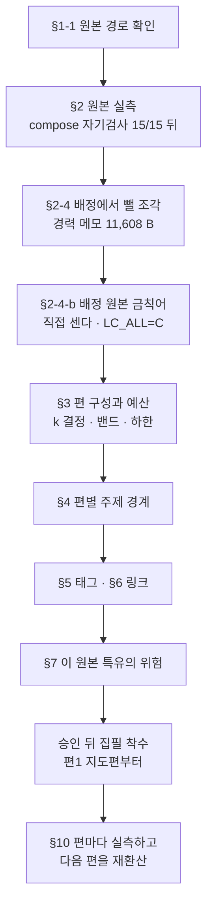
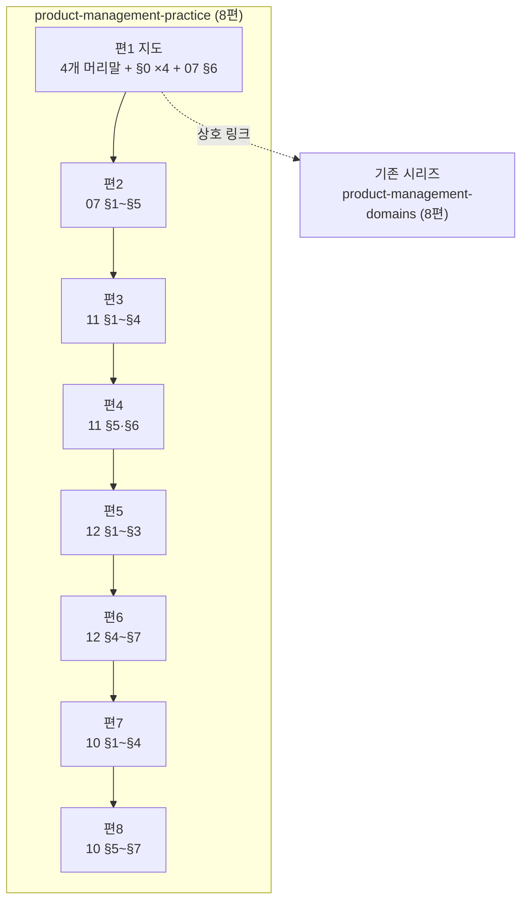

# `pm-po/07·10·11·12` 분할 설계 — 원본 4개를 **한 시리즈 8편**으로

> 작성 2026-09-06 · 착수 전 승인 대기 · 앞 배치 [`2026-08-30-pm-batch-split-design.md`](2026-08-30-pm-batch-split-design.md) 의 규칙과 §10 회고를 승계한다
> 대상 카테고리는 `product-management` 이고 새 시리즈 `product-management-practice` 를 만든다.
> 시리즈 A · B 가 「무엇을 만드는가」(기획 하네스)와 「어디서 만드는가」(도메인)를 다뤘다면,
> 이 배치는 **「어떻게 일하는가」** 를 다룬다 — 지표 · 데이터 · 팀 · 협업이다.

---

## 0. 이 배치가 앞 배치와 다른 다섯 가지

| # | 차이 | 어디서 다루나 |
| ---: | --- | --- |
| 1 | **원본 4개가 모두 「케이스 딥다이브」 계열이다.** 강사가 넷이고 각자 다른 회사 경험을 말한다 | §7-1 익명화 |
| 2 | **성분이 시리즈 A 와 B 사이에 있다.** 표 49.2% · 산문 8.6% 로 A(표 61.3)에 가깝고 B(산문 20.6)와 멀다 | §3-2 k 결정 |
| 3 | **인용이 30.2% 로 코퍼스 최대치다.** 시리즈 B 의 18.6~24.9% 를 넘는다 | §2-5 |
| 4 | **새 태그가 필요 없다.** 패싯 D 18개가 이 배치의 주제를 전부 덮는다 | §5 |
| 5 | **새 카테고리를 만들지 않는다.** 기존 `product-management` 에 두 번째 시리즈를 얹는다 | §7-4 |

**이 표가 말하는 것**: 앞 배치가 「예산 모델을 시리즈별로 갈라야 한다」를 배웠다면, 이 배치의
핵심 물음은 **그 두 모델 사이에 놓인 원본에 어느 쪽 k 를 쓰는가** 이다. §3-2 가 답한다.

---

## 1. 절차



**§2-4-b 를 §3 앞에 둔 것이 앞 배치와 다른 점이다.** 앞 배치는 편 구성과 예산이 확정된 뒤에야
배정의 14.6% 가 금칙어를 담은 경력 메모임을 알았다. 순서를 바꿔 예산에서 빼고 시작한다.

### 1-1. 원본 경로 — 앞 설계서 §1-1 이 남긴 자리에 그대로 있었다

```
C:/Users/aeby/vscode/yanadoo-exit/shared/knowledge/pm-po/07-플랫폼.md
C:/Users/aeby/vscode/yanadoo-exit/shared/knowledge/pm-po/10-글로벌-협업.md
C:/Users/aeby/vscode/yanadoo-exit/shared/knowledge/pm-po/11-데이터-드리븐.md
C:/Users/aeby/vscode/yanadoo-exit/shared/knowledge/pm-po/12-팀빌딩.md
```

원본 저장소 루트는 `C:/Users/aeby/vscode/yanadoo-exit/shared/knowledge/` 이고 폴더가 15개 있다.
앞 설계서가 §1-1 을 남긴 덕에 이번에는 역추적이 필요 없었다. **이 절을 계속 물려라.**

### 1-2. 아직 소비되지 않은 원본 — 다음 배치의 후보다

| 폴더 | 파일 | 바이트 | HARD/100KB | 비고 |
| --- | ---: | ---: | ---: | --- |
| `pm-po` (이 배치 제외 9개) | 9 | 167,072 | — | 03 ai · 05 b2b-saas · 06 o2o · 08 si · 09 물류 · 13 스타트업 · 14 커리어 · 90 부록 · 99 보너스 |
| `pm-harness` (03 제외 5개) | 5 | 298,015 | 4.4 | 02 는 `agentic-coding` 과, 05 는 `rag` 와 겹친다 |
| `high-traffic` | 11 | 508,162 | 5.2 | Redis · Kafka · CDC 가 `backend-engineering` 에 이미 있다 |
| `java-backend/09` | 1 | 89,728 | 5.7 | 폴더의 마지막 한 편. 01~08 은 발행됐다 |
| `recommendation` | 7 | 83,778 | 16.7 | — |
| `llm-search-recommend` | 1 | 37,113 | 35.0 | — |
| `glossary` | 2 | 24,287 | 41.2 | — |
| `bigdata` | 8 | 292,763 | **47.1** | 🔴 사내 구성도와 국내 기업 실명이 본문 전체에 퍼져 있다 |
| `pangyo-it` | 6 | 345,500 | **59.0** | 🔴 회사 DB. 조각을 빼는 방식으로 걸러지지 않는다 |
| `learning` | 10 | 197,717 | **70.3** | 🔴 위와 같다 |

**이 표가 말하는 것**: 밀도가 40을 넘는 아래 셋은 배정에서 조각을 빼는 방식이 통하지 않는다.
경력 메모처럼 한 블록에 몰려 있지 않고 본문에 섞여 있기 때문이다. 다음 배치를 고를 때
**밀도를 먼저 재고, 위반이 한 블록에 몰려 있는지를 확인하라.**

### 1-3. 앞 배치가 물려준 규칙의 처리

| # | 규칙 | 이 설계서가 어디서 지켰나 |
| ---: | --- | --- |
| 1 | 고정 비용 상수는 **2,440 ~ 2,470** | §3-2 — 2,455 를 그대로 썼다 |
| 2 | 산식의 상수 2,455 는 **상수 절의 예산이 아니다** | §3-2 — 회귀 절편으로만 쓰고 절에 배분하지 않았다 |
| 3 | 표 비율은 **합치기의 축**이 정한다 | §4-1 — 편마다 「행을 겹치는가」를 적었다 |
| 4 | 🔴 배율을 정하는 것은 절이 아니라 **원본의 표 비중**이다 | §3-2 — 표 축으로 k 를 보간했다 |
| 5 | 도식 비율은 **1.263** | §3-3 |
| 6 | 링크 몫 = **슬러그 길이 + 12 + 카테고리 길이** | §6-4 — `product-management` 는 18자라 상수가 30 이다 |
| 7 | 🔴 자기 산출물을 자기가 짠 검사로 검증한 결과는 **리뷰 대상이다** | §8-1 ⑧ · §8-3 |
| 8 | 축자 겹침 브리프에 **「대조 범위는 원본 전체다」** 명시 | §8-4 |
| 9 | 형제편 outbound 를 **세는 명령**을 발행 전에 실행 | §6-1 |
| 10 | 원본의 자리를 지목하는 **모든 곳**에서 낱말 실재를 grep 으로 확인 | §6-3 · §7-2 |
| 11 | 처방 세 줄을 **그대로 물려라** | §8-3 |
| 12 | 리뷰는 **두 축으로 나눠** 돌려라 | §8-3 |
| 13 | 원본이 나눈 층을 발행본이 합치면 **사실이 뒤집힌다** | §7-2 |
| 14 | 초고 직후 `compose` 를 먼저 돌려라 | §8-2 |
| 15 | 🔴 **금지한 것은 낱말이 아니라 자리다** (§10-15-i) | §7-1 — 명제 단위로 적었다 |
| 16 | 🔴 초고가 10% 넘게 벗어나면 절 목록이 아니라 **절별 배율**을 먼저 재라 | §8-2 |
| 17 | 🔴 검사가 초록인 이유를 묻지 않으면 **초록은 정보가 아니다** (§10-16-j) | §8-1 ⑦ |
| 18 | 🔴 인수인계에 적힌 수치도 **대조군 없이는 근거가 아니다** (§10-17-i) | §2-1 — 모든 값을 이 세션이 직접 쟀다 |

18개가 모두 자리를 얻었다. 규칙이 살아 있는지는 §10 이 판정한다.

---

## 2. 원본 실측

`npm run compose -- <원본>` 출력이다. 자기 검사 **15/15** 통과 뒤에 받았다.

### 2-1. 원본 4개 총괄

| 원본 | 합계 B | 산문% | 표% | 코드% | 도식% | 불릿% | 인용% | 도식 수 |
| --- | ---: | ---: | ---: | ---: | ---: | ---: | ---: | ---: |
| `07` 플랫폼 | 15,845 | 11.8 | 47.1 | 0.0 | 3.2 | 4.0 | 29.3 | 2 |
| `10` 글로벌 협업 | 23,812 | 4.8 | 44.3 | 0.0 | 2.3 | 7.6 | 36.6 | 1 |
| `11` 데이터 드리븐 | 17,615 | 13.1 | 51.0 | 0.0 | 4.7 | 4.7 | 22.2 | 3 |
| `12` 팀빌딩 | 22,077 | 4.8 | 54.5 | 0.0 | 0.5 | 2.6 | 32.6 | 1 |
| **합계** | **79,349** | **8.6** | **49.2** | **0.0** | **2.5** | **4.7** | **30.2** | **7** |

**이 표가 말하는 것**: 코드가 0% 이고 표가 절반이다. 앞 배치의 시리즈 A(표 61.3 · 산문 5.8)와
시리즈 B(표 38.6 · 산문 20.6) 사이에 놓이며, **표 축으로는 A 쪽에 훨씬 가깝다.**
⇒ §3-2 가 이 위치에서 k 를 보간한다.

### 2-2. 절별 성분 — 배정에 쓰는 값

`compose` 의 절별 합계에서 §2-4 의 경력 메모를 뺀 값이 **배정 원본 B** 다.

#### `07-플랫폼.md`

| 절 | 합계 B | 경력 메모 B | **배정 원본 B** |
| --- | ---: | ---: | ---: |
| (머리말) | 686 | — | 686 |
| §0 용어 풀이 | 871 | — | 871 |
| §1 제품 개발 순환 과정 — 4단계 | 3,541 | — | 3,541 |
| §2 Metric Hierarchy | 3,078 | 654 | 2,424 |
| §3 PM/PO 3대 역량 영역 | 2,290 | 469 | 1,821 |
| §4 케이스 스터디 DIY | 2,072 | 704 | 1,368 |
| §5 몸담을 시장·서비스 선정 방법론 | 1,964 | 736 | 1,228 |
| §6 용어집 발췌 (부속 자료) | 1,343 | — | 1,343 |
| **합계** | **15,845** | **2,563** | **13,282** |

#### `10-글로벌-협업.md`

| 절 | 합계 B | 경력 메모 B | **배정 원본 B** |
| --- | ---: | ---: | ---: |
| (머리말) | 743 | — | 743 |
| §0 용어 풀이 | 757 | — | 757 |
| §1 글로벌 기업 입사 과정 | 4,133 | 654 | 3,479 |
| §2 역할 분담 — PM vs PgM | 1,492 | — | 1,492 |
| §3 프로젝트 검토와 추진 | 3,614 | 728 | 2,886 |
| §4 프로젝트 관리 방안 | 1,963 | — | 1,963 |
| §5 의사결정과 커뮤니케이션 | 4,045 | 657 | 3,388 |
| §6 케이스 스터디 | 4,029 | 710 | 3,319 |
| §7 글로벌 기업에서 살아남기 | 3,036 | 647 | 2,389 |
| **합계** | **23,812** | **3,396** | **20,416** |

#### `11-데이터-드리븐.md`

| 절 | 합계 B | 경력 메모 B | **배정 원본 B** |
| --- | ---: | ---: | ---: |
| (머리말) | 557 | — | 557 |
| §0 용어 풀이 | 963 | — | 963 |
| §1 데이터가 필요한 이유 | 1,935 | — | 1,935 |
| §2 데이터의 종류 | 631 | — | 631 |
| §3 지표 용어 사전 (AARRR 기준) | 2,258 | 397 | 1,861 |
| §4 정성적 데이터 수집 5가지 방법 | 2,770 | 348 | 2,422 |
| §5 실무 실습 — 가상 프로젝트 전 과정 | 7,979 | 877 | 7,102 |
| §6 이 파트의 결론 | 522 | — | 522 |
| **합계** | **17,615** | **1,622** | **15,993** |

#### `12-팀빌딩.md`

| 절 | 합계 B | 경력 메모 B | **배정 원본 B** |
| --- | ---: | ---: | ---: |
| (머리말) | 659 | — | 659 |
| §0 용어 풀이 | 775 | — | 775 |
| §1 팀과 팀 빌딩의 정의 | 2,998 | 429 | 2,569 |
| §2 좋은 팀 vs 나쁜 팀 | 3,069 | 511 | 2,558 |
| §3 애자일 조직과 팀 빌딩 | 3,665 | 484 | 3,181 |
| §4 직무 / 직급 / 직책과 PL·PM·PO | 2,684 | 665 | 2,019 |
| §5 팀 빌딩에서 PM/PO의 역할 | 5,092 | 774 | 4,318 |
| §6 국내 조직문화 3분 비교 | 2,790 | 1,164 | 1,626 |
| §7 마무리 | 345 | — | 345 |
| **합계** | **22,077** | **4,027** | **18,050** |

### 2-3. 측정 방법 — 두 함정을 피했다

| 함정 | 이 실측이 한 것 |
| --- | --- |
| awk `length()` 는 바이트가 아니라 문자 수다 | `Buffer.byteLength(s, "utf8")` 로만 셌다. `compose` 의 총합과 대조해 네 파일 모두 일치했다 |
| 🔴 블록 경계를 **줄 수로 기억하면 틀린다** (§10-17-a 가 252 B 틀렸다) | 경계를 줄 수가 아니라 **인용(`>`)이 끊기는 지점**으로 찾았다. 스크립트는 스크래치패드에 두었고 리포에 남기지 않는다 |

### 2-4. 배정에서 빼는 조각 — **11,608 B**

`> 💼 **면접 활용**` 으로 시작하는 경력 메모 블록이 **18개** 있다.

| 원본 | 블록 수 | 바이트 | 원본 대비 |
| --- | ---: | ---: | ---: |
| `07` | 4 | 2,563 | 16.2% |
| `10` | 5 | 3,396 | 14.3% |
| `11` | 3 | 1,622 | 9.2% |
| `12` | 6 | 4,027 | 18.2% |
| **합계** | **18** | **11,608** | **14.6%** |

**14.6% 는 앞 배치와 같은 비율이다** (앞 배치 10,065 B / 68,930 B). 원본군이 같은 강의 시리즈이니
같은 편집 관행이 적용된 것으로 읽는다. ⇒ **`pm-po` 계열을 다시 배치할 때 이 비율을 예측값으로
쓰되, 상수로 믿지 말고 매번 세라.**

**배정 원본 합계는 79,349 − 11,608 = 67,741 B 다.**

### 2-4-b. 🔴 배정 원본의 금칙어를 직접 셌다 — **HARD 0 · SOFT 10**

`check-forbidden` 자기 검사 **63/63** 을 먼저 통과시킨 뒤에 스캔했다.

| 대상 | HARD | SOFT |
| --- | ---: | ---: |
| 원본 4개 전량 | **6** | 33 |
| 경력 메모를 뺀 배정 사본 | **0** | 10 |

HARD 6건은 `실장` 1 · `야나두` 3 · `커머스개발` 1 · `실장` 1 이며 **전부 경력 메모 블록 안**이다
(`10:73` · `12:73` · `12:185`×2 · `12:273` · `12:275`). 블록을 뺀 사본을 만들어 다시 돌려
**0건임을 증명했다** — 「빼면 없어질 것이다」라는 추정으로 두지 않았다.

⚠️ **남은 SOFT 10건은 배정 안에 있다.** `면접` 2건은 `10` 의 표 셀(Culture Fit · 의뢰 접수)이고,
`강의` 3건은 머리말의 출처 문장이다. 발행본으로 옮길 때 **사람이 판정한다.**

### 2-5. 🔴 이번 배치의 새 변수는 **인용 30.2%** 다 — 코퍼스 최대치다

앞 배치가 인용을 처음 변수로 잡았고(15.9%), §10-2-c 가 「인용 배율은 측정할 수 없다」로
가설을 고쳤다. 이번 원본은 그보다 두 배 가깝다.

| 성분 | 앞 배치 (배정 가중평균) | 이번 배치 | 차 |
| --- | ---: | ---: | ---: |
| 산문 | 11.6% | **8.6%** | −3.0 |
| 표 | 51.3% | **49.2%** | −2.1 |
| 인용 | 15.9% | **30.2%** | **+14.3** |
| 불릿 | 5.6% | **4.7%** | −0.9 |

인용이 두 배로 늘었는데 경력 메모(③ 용도)를 빼도 여전히 크다. 배정 안에 남는 인용은 앞 배치가
가른 ①·② 두 용도다.

| # | 용도 | 발행본에서 |
| ---: | --- | --- |
| ① | 절 도입의 한 줄 요약 (머리말 88~99% 가 전부 이것이다) | 도입 **산문**으로 푼다 |
| ② | 실무 조언의 강조 | 인용으로 남거나 표로 접힌다 |
| ③ | 저자 경력 메모 | **옮기지 않는다** (§2-4) |

🔴 **§10-2-c 의 판정을 그대로 승계한다: 인용 ①·② 는 산문에 합류하므로 성분별 배율을 따로 읽지
않는다.** 이 배치가 새로 물을 것은 **「인용이 두 배로 크면 k 가 어느 쪽으로 흔들리는가」** 이며,
편2 초고 `compose` 가 첫 표본이다(§10-0 의 가설 H-1).

---

## 3. 편 구성과 예산

### 3-0. 절 배정 — **한 시리즈 8편**



**순서의 근거**: 07 은 원본 머리말이 「bottom-up 으로 쌓아 올리는 구조」라고 밝힌 개괄이므로
지도편 다음에 둔다. 그 뒤로 데이터(11) → 팀(12) → 협업(10) 순인데, **혼자 하는 일에서 여럿이
하는 일로 넓어지는 순서**다. 원본 번호 순(07 → 10 → 11 → 12)을 따르지 않는 이유가 이것이다.

#### 3-0-a. 🔴 07 을 두 편으로 쪼개지 않는다 — 하한이 막는다

07 의 본편 배정은 §6 용어집을 지도편으로 보내면 **10,382 B** 다. 이것을 절 경계로 반씩 나누면
두 편이 각각 5,965 B · 4,417 B 가 된다.

⇒ **07 은 한 편으로 둔다.** 원본이 스스로 밝힌 「bottom-up 으로 쌓는」 구조와도 맞는다.

🔴 **초판은 이 자리에서 「앞 편은 여유가 7 B」라고 적었다. 그것은 옛 고정 비용 상수(2,455)의
값이며 편2 가 그 상수를 반증했다** (§10-2-b). 새 상수 3,746 으로 다시 계산하면 두 편의 밴드
하단은 **14,607 B · 11,805 B** 이고, 앞 편의 여유는 7 B 가 아니라 **+1,307 B** 다.

| | 옛 상수 2,455 | 새 상수 3,746 |
| --- | ---: | ---: |
| 앞 편 (배정 5,965) | +7 B | **+1,307 B** |
| 뒤 편 (배정 4,417) | 하한 미달 | **하한 미달 (−1,495 B)** |

⇒ **결론(쪼개지 않는다)은 살고 근거의 세기가 바뀌었다.** 뒤 편이 하한에 걸리는 것은 두 상수
모두에서 참이므로 판단 자체는 흔들리지 않는다.

### 3-1. 지도편 — 고정 비용 방식

| 지도편 | 승계 용어 | 예고할 형제편 | **목표 B** |
| --- | --- | ---: | ---: |
| `pm-practice-map` | §0 용어 4표 + 07 §6 용어집 발췌 = **합산 후 중복 제거** | 7 | **21,000** |

앞 배치 두 지도편의 실측(21,715 B · A 편1)을 그대로 쓴다. 배정은 머리말 4개(2,645) +
§0 네 개(3,366) + 07 §6(1,343) = **7,354 B** 다.

🔴 **용어표가 이번에는 넷이다.** 앞 배치 시리즈 B 는 셋이었고 중복 제거가 필요했다.
⇒ **편1 집필 전에 네 표를 합쳐 중복을 제거하고 남은 개수를 §10-1 에 기록하라.**
그 개수가 용어당 B 를 확정하는 입력이다.

⚠️ **머리말 넷에는 강사 실명과 타사명이 들어 있다.** 지도편이 머리말을 배정받으므로
§7-1 의 익명화 규칙이 **가장 먼저 지도편에 걸린다.**

### 3-2. 본편 예산 — k 를 **보간해서** 정한다

> **목표 B = 3,746 + 배정 원본 B × k + 링크 몫**

🔴 **고정 비용 상수는 초판의 2,455 가 아니다.** 편2 초고가 목표를 16.6% 넘겼을 때 규칙 16 대로
절별 배율을 먼저 쟀더니 **초과의 59.4%가 배율이 아니라 이 상수에서 나왔다.** 같은 카테고리
기존 본편 셋의 실측 평균이 **3,746** 이며, 근거는 편2 자신이 아니라 그 대조군이다 (§10-2-b).

앞 배치가 두 시리즈에서 k 를 갈랐다. 이번 원본은 그 둘 사이에 있다.

| 배치 | 표% | 산문% | k |
| --- | ---: | ---: | ---: |
| 시리즈 A (`pm-harness/03`) | 61.3 | 5.8 | 1.85 |
| **이 배치** | **49.2** | **8.6** | **?** |
| 시리즈 B (`pm-po/01·02·04`) | 38.6 | 20.6 | 2.05 |

두 축으로 보간하면 값이 갈린다.

| 보간 축 | 계산 | k |
| --- | --- | ---: |
| **표 비중** | 1.85 + (61.3−49.2)/(61.3−38.6) × 0.20 | **1.957** |
| 산문 비중 | 1.85 + (8.6−5.8)/(20.6−5.8) × 0.20 | 1.888 |

🔴 **표 축을 채택해 k = 1.95 로 정한다.** 근거는 규칙 4 다 — §10-16-a 가 「배율을 정한 것은
절이 아니라 **원본의 표 비중**이었다」로 확정했다. 산문 축이 더 낮은 값을 가리키므로
**편2 초고 실측에서 반드시 재환산한다**(§3-6).

**밴드는 k ± 0.14 다** (1.81 ~ 2.09) — 앞 배치 실측 넷(1.894 ~ 2.063)을 감싸는 최소 폭이다.

#### 예산표 (k = 1.95 · 밴드 1.81 ~ 2.09 · 고정 비용 3,746)

🔴 **편2 실측으로 재환산한 판이다.** k 는 초판 그대로이고 고정 비용 상수만 2,455 → 3,746 으로
바뀌었으므로 **편3~편8 이 일률적으로 +1,291 B 씩 오른다** (§10-2-b · §10-2-c).

| 편 | 원본 | 절 | 배정 원본 B | 링크 몫 | **목표 B** | 밴드 | 하한 여유 | 초판 대비 |
| :---: | :---: | --- | ---: | ---: | ---: | --- | ---: | ---: |
| 1 | 4개 | 머리말 + §0 ×4 + 07 §6 | 7,354 | — | **21,000** | 고정 비용 방식 | — | 실측 21,803 |
| 2 | 07 | §1~§5 | 10,382 | 64 | **24,055** | 22,601 ~ 25,508 | +9,301 | 실측 **24,596** |
| 3 | 11 | §1~§4 | 6,849 | 60 | **17,162** | 16,203 ~ 18,120 | +2,903 | +1,291 |
| 4 | 11 | §5·§6 | 7,624 | 61 | **18,674** | 17,606 ~ 19,741 | +4,306 | +1,291 |
| 5 | 12 | §1~§3 | 8,308 | 57 | **20,004** | 18,840 ~ 21,167 | +5,540 | +1,291 |
| 6 | 12 | §4~§7 | 8,308 | 62 | **20,009** | 18,845 ~ 21,172 | +5,545 | +1,291 |
| 7 | 10 | §1~§4 | 9,820 | 58 | **22,953** | 21,578 ~ 24,328 | +8,278 | +1,291 |
| 8 | 10 | §5~§7 | 9,096 | 63 | **21,546** | 20,273 ~ 22,820 | +6,973 | +1,291 |

**이 표가 말하는 것**: 하한 여유의 최솟값이 편3의 **+2,903 B** 이고, 초판(+1,612 B)보다 여유가
벌어졌다. 앞 배치는 B-3 의 밴드 하단이 하한을 **113 B 밑돌아** 편 구성을 바꿔야 했는데,
이번 구성은 **여덟 편 모두 밴드 하단에서도 하한을 넘는다.**

배치 총량은 **166,206 B**(편1 은 실측 21,803)이고 편당 평균 **20,776 B** 다. 기존
`product-management` 8편의 실측 평균(18,885 B)과 10.0% 차이다.

### 3-3. 도식 예산 — 규칙 5

원본의 도식은 넷을 합쳐 **7개**뿐이다(07 두 개 · 10 하나 · 11 세 개 · 12 하나). 도식 비율
**1.263** 을 그대로 쓰되, 원본에 도식이 없는 절이 많으므로 **발행본의 도식은 원본 변환이 아니라
새로 그리는 쪽이 많다.** 새로 그린 도식은 근거를 본문에 두어야 하며 판정은
[`../PUBLISHING-CHECKLIST.md`](../PUBLISHING-CHECKLIST.md) 의 「도식 근거」 항목이 한다.

### 3-4. 🔴 재환산 지점이 **둘**이다

| # | 언제 | 무엇을 다시 잡나 |
| ---: | --- | --- |
| ① | **편1 지도편 실측 뒤** | 용어당 B. 용어표가 넷이라 중복 제거 결과가 입력이다 |
| ② | **편2 초고 `compose` 뒤** | ✅ **완료 (§10-2).** k 는 **1.95 를 유지**하고 대신 **고정 비용 상수를 2,455 → 3,746** 으로 고쳤다. 편3~편8 목표 B 를 전부 다시 계산했다 (§3-2) |

앞 배치는 재환산 지점이 셋이었고 시리즈 경계마다 있었다. 이번은 시리즈가 하나이므로 둘이다.

---

## 4. 편별 상세

### 4-1. 편별 주제 경계 — 넘지 말아야 할 선

| 편 | 제목 방향 | 다루는 것 | **넘지 않을 선** | 표 합치기의 축 |
| :---: | --- | --- | --- | --- |
| 1 | 지도 | 네 주제의 지형과 용어 | 각 편의 결론을 미리 말하지 않는다 | 용어 4표를 한 표로 (중복 제거) |
| 2 | 제품 개발 순환과 지표 위계 | 4단계 순환 · Metric Hierarchy · 3대 역량 · 케이스 DIY · 시장 선정 | **지표의 계산식**은 편3 이다 | 역량 표와 순환 단계 표는 축이 달라 합치지 않는다 |
| 3 | 데이터가 필요한 이유와 지표 사전 | 데이터의 쓸모 · 종류 · AARRR 지표 정의 · 정성 수집 5법 | **실습 사례**는 편4 다 | 지표 정의 표는 AARRR 단계를 행으로 겹친다 |
| 4 | 데이터 드리븐 실습 한 바퀴 | OKR 수립부터 성과 분석까지 가상 프로젝트 전 과정 | **지표 정의**를 다시 설명하지 않는다 — 편3 을 링크한다 | 실습 단계 표는 단계를 행으로 겹친다 |
| 5 | 팀의 정의와 애자일 조직 | 팀 빌딩의 정의 · 좋은 팀과 나쁜 팀 · 애자일 조직 | **직급 체계**는 편6 이다 | 좋은 팀/나쁜 팀 표는 대조 축으로 열을 겹친다 |
| 6 | 직책과 조직문화 | 직무/직급/직책 · PM 의 팀빌딩 역할 · 국내 조직문화 3분 비교 | **글로벌 조직문화**는 편7·편8 이다 | 조직문화 3분 비교는 세 환경을 열로 겹친다 |
| 7 | 글로벌 협업의 프로세스 | 입사 과정 · PM vs PgM · 프로젝트 검토와 추진 · 관리 툴 | **의사결정 방식**은 편8 이다 | 툴 표는 용도를 행으로 겹친다 |
| 8 | 글로벌 조직의 의사결정과 커뮤니케이션 | 의사결정 · 커뮤니케이션 · 케이스 스터디 · 살아남기 | **입사 과정**을 다시 설명하지 않는다 — 편7 을 링크한다 | 케이스 표는 상황을 행으로 겹친다 |

**이 표가 말하는 것**: 「넘지 않을 선」이 있는 편은 여섯이고, 그중 넷(편3·4 와 편7·8)이
**같은 원본을 둘로 나눈 짝**이다. 짝의 뒤 편이 앞 편을 다시 설명하면 `dup-scan` 이 잡기 전에
분량이 먼저 터진다.

### 4-2. 🔴 낱말이 편을 가로지르는 자리

| 낱말 | 나오는 편 | 처리 |
| --- | --- | --- |
| **지표 · Metric** | 2 · 3 · 4 | 편2 는 **위계**(무엇을 상위에 두는가), 편3 은 **정의**(어떻게 세는가), 편4 는 **적용**(무엇을 바꿨는가)이다. 편마다 한 층만 다룬다 |
| **팀 · 조직** | 5 · 6 · 7 | 편5·6 은 **국내** 조직이고 편7 은 **글로벌** 조직이다. 편6 §6 의 3분 비교가 국내에 한정된다는 것을 본문에 명시한다 |
| **PM/PO 역할** | 2 · 6 · 7 | 편2 는 **역량**, 편6 은 **직책**, 편7 은 **PgM 과의 분담**이다 |

---

## 5. 태그

### 5-1. 🔴 새 태그가 필요 없다 — 패싯 D 가 이미 덮는다

앞 배치는 패싯 D(프로덕트·조직)를 처음 채웠고, 지금 18개가 있다. 이 배치의 여덟 편이 쓸
태그는 **전부 그 안에 있다.** `content/blog/tags.ts` 를 고치지 않는다.

### 5-2. 편별 태그 배정

기존 `product-management` 8편의 관례를 따라 **편당 2개**를 쓴다.

| 편 | 태그 | 패싯 |
| :---: | --- | --- |
| 1 | `product-strategy` · `career` | D · D |
| 2 | `product-strategy` · `product-metrics` | D · D |
| 3 | `product-metrics` · `data-driven` | D · D |
| 4 | `data-driven` · `ab-testing` | D · D |
| 5 | `team-building` · `org-design` | D · D |
| 6 | `org-design` · `engineering-leadership` | D · D |
| 7 | `global-service` · `team-building` | D · D |
| 8 | `global-service` · `org-design` | D · D |

⚠️ **여덟 편이 전부 패싯 D 두 개다.** `tags.ts` 주석의 「같은 패싯에서 최대 2개」는 지키지만
교차성은 얻지 못한다. 기존 `product-management` 8편도 같은 상태이므로 **카테고리의 성질**로
받아들이고, 편마다 억지로 다른 패싯을 붙이지 않는다.

---

## 6. 링크 구조

### 6-1. 시리즈 내부

편1(지도)이 편2~편8 **일곱 편 전부를** 가리키고, 본편은 앞뒤 편을 가리킨다.
발행 직전에 형제편 outbound 를 센다 — 규칙 9 다.

```bash
# 편8 발행 직전에 실행. 편1 이 일곱 편을 모두 가리키는지 센다.
grep -o '/blog/product-management/[a-z-]*/' \
  content/blog/product-management/pm-practice-map.md | sort -u | wc -l
```

### 6-2. 기존 시리즈와의 링크 — 목표 **4건 이상**

`product-management-domains` 8편과 같은 카테고리에 있으므로 접합부가 자연스럽다.

| 이 배치 | 기존 시리즈 | 접합 근거 |
| :---: | --- | --- |
| 편2 | `planning-and-product-ops` | 제품 개발 순환의 앞 단계가 기획이다 |
| 편3 | 도메인 편 가운데 지표를 다룬 편 | 지표 정의가 도메인마다 달라지는 자리 |
| 편6 | `product-org-and-strategy` | 조직 구조와 제품 전략의 접점 |
| 편7 | 도메인 편 가운데 글로벌을 다룬 편 | 글로벌 협업의 실제 사례 |

🔴 **접합부를 확정하기 전에 낱말이 실재하는지 `grep` 으로 확인하고 행 번호를 적어라** — 규칙 10
이다. 앞 배치는 §7-2 에서 이것을 빠뜨려 **원본에 0건인 낱말을 근거로 자리를 지목했다.**
위 표의 「기존 시리즈」 두 칸이 아직 편 이름이 아닌 것은 그 확인을 하지 않았기 때문이다.
**편3·편7 집필 전에 채운다.**

### 6-3. 다른 카테고리에서 들어오는 링크 — 규칙 10

```bash
# 후보 글에 낱말이 실재하는지 확인하고 행 번호를 얻는다
grep -rn "지표 위계\|Metric Hierarchy" content/blog/ --include='*.md' | head -20
```

개수만 보고 정하지 않는다. **상위 후보의 실제 문맥을 열어 읽은 뒤에 정한다.**

### 6-4. 링크 몫 — 규칙 6

> **링크 몫 = 슬러그 길이 + 12 + 카테고리 길이**

`product-management` 는 18자이므로 상수는 **30** 이다.

| 편 | 슬러그 | 길이 | 링크 몫 |
| :---: | --- | ---: | ---: |
| 1 | `pm-practice-map` | 15 | 45 |
| 2 | `product-cycle-and-metric-hierarchy` | 34 | 64 |
| 3 | `why-data-and-metric-dictionary` | 30 | 60 |
| 4 | `data-driven-project-walkthrough` | 31 | 61 |
| 5 | `team-building-and-agile-org` | 27 | 57 |
| 6 | `roles-and-organizational-culture` | 32 | 62 |
| 7 | `global-collaboration-process` | 28 | 58 |
| 8 | `global-decision-and-communication` | 33 | 63 |

⚠️ 앞 배치 §10-15-b 는 공식이 예측한 54 B 에 대해 실측 62 B 를 얻었고, 차 8 B 는 링크가 아니라
**주변 문장**이었다. ⇒ **차가 나면 공식을 고치기 전에 무엇이 늘었는지 먼저 보라.**

---

## 7. 이 원본 특유의 위험

### 7-1. 🔴 강사 실명과 타사명 — **검사기가 잡지 못한다**

머리말 넷에 강사 프로필이 있고, 본문 곳곳에 강사의 재직 회사가 나온다.

| 종류 | 출현 | 어디에 |
| --- | ---: | --- |
| 강사 실명 4명 | **5회** | 머리말 넷 |
| 타사명 9개 | **13회** | 머리말과 케이스 스터디 절 |

`check-forbidden` 의 HARD 목록에 이 낱말들이 없으므로 **스캔은 0을 낸다.** 판정은
[`../PUBLISHING-CHECKLIST.md`](../PUBLISHING-CHECKLIST.md) 의 「익명화」 항목이 하는 사람의 몫이다.

🔴 **규칙 15 를 여기에 적용한다 — 금지한 것은 낱말이 아니라 자리다.** 낱말만 지우면
「강사가 겪은 특정 회사의 일」이 주어 없는 사실로 남아 **출처 없는 단언**이 된다.
⇒ **집필 전에 명제 단위로 적어라:**

| 명제 | 발행본에서 |
| --- | --- |
| 「이 사람이 이 회사에서 이것을 겪었다」 | **옮기지 않는다.** 회사명을 지우고 남기지도 않는다 |
| 「이런 환경에서는 이런 일이 일어난다」 | 옮긴다. 다만 **일반 명제로 다시 쓴다** |
| 「강의는 이렇게 정리했다」 | 출처를 밝히고 옮긴다 |

### 7-2. 🔴 원본이 나눈 층을 합치면 사실이 뒤집히는 자리 — 규칙 13

| 원본 | 자리 | 왜 뒤집히나 |
| --- | --- | --- |
| `12` §6 | 은행 / 인터넷전문은행 / 스타트업 **3분 비교** | 세 열을 합쳐 「국내 조직문화는 이렇다」로 쓰면, 표가 말하는 **차이**가 사라지고 정반대의 서술이 된다 |
| `11` §5 | 가상 프로젝트의 **단계별 판단** | 단계를 합치면 「데이터를 보고 정했다」만 남고 **어느 단계에서 무엇을 보았는지**가 사라진다 |
| `10` §3 | 「하면 된다」가 아닌 **「되면 한다」** | 검토와 추진을 한 층으로 합치면 원본이 뒤집으려던 순서가 원래대로 돌아간다 |

⚠️ **위 세 자리는 절 제목에서 읽은 것이고, 본문의 낱말로 확인하지 않았다.** 규칙 10 은
「원본의 자리를 지목하는 **모든 곳**」에 적용되므로, **해당 편 집필 전에 `grep` 으로 낱말 실재를
확인하고 행 번호를 이 표에 채운다.** 앞 배치는 이 확인을 §7-2 에서 빠뜨려 두 번 틀렸다
(§10-15-c · §10-16-c).

### 7-3. 인용이 많은 원본의 함정

머리말의 인용(88~99%)은 절 도입의 한 줄 요약이다. **그대로 인용으로 옮기면 발행본의 도입이
전부 인용 블록이 된다.** ⇒ 도입 산문으로 푼다. 이것이 §2-5 의 ① 처리다.

### 7-4. frontmatter 고정값

| 항목 | 값 |
| --- | --- |
| `category` | `product-management` (기존 카테고리 — 새로 만들지 않는다) |
| `series` | `product-management-practice` |
| `seriesOrder` | 1 ~ 8 |
| `date` | 원본 작성 기준일 `2026-07-25` |
| `featured` · `draft` | `false` · `false` |

✅ **새 카테고리를 만들지 않으므로 §10-1-c 의 「새 카테고리의 첫 편은 반드시 테스트에 걸린다」가
이번에는 해당하지 않는다.**

---

## 8. 검증

### 8-0. 설계서 자신의 검산 — **착수 전에 한 번**

| # | 검산 | 결과 |
| ---: | --- | --- |
| ① | 절별 배정 원본 B 의 합 = 배정 원본 합계 | 7,354 + 10,382 + 6,849 + 7,624 + 8,308 + 8,308 + 9,820 + 9,096 = **67,741** ✅ |
| ② | 배정 원본 + 경력 메모 = 원본 전량 | 67,741 + 11,608 = **79,349** ✅ |
| ③ | `compose` 총합과 `wc -c` 대조 | 네 파일 모두 「실측 일치」 ✅ |
| ④ | 밴드 하단이 `MIN_BYTES` 를 넘는가 | 여덟 편 모두 넘는다. 최소 여유 편3 **+1,612 B** ✅ |
| ⑤ | 배정 사본의 HARD | **0건** — 사본을 만들어 실제로 스캔했다 ✅ |

### 8-1. 편마다 (발행 전) — 여덟 검사

| # | 검사 | 통과 기준 |
| ---: | --- | --- |
| ① | `npm run check-forbidden:verify` → `check-forbidden` | HARD **0** |
| ② | `npm run check-markup:verify` → `check-markup` | 위반 **0** |
| ③ | `npm run check-links:verify` → `check-links` | 깨진 링크 **0** |
| ④ | `npm run check-mermaid:verify` → `check-mermaid` | 위반 0 · **판정 도달 수 = 대상 수** |
| ⑤ | `npx vitest run tests/blog` | 전 케이스 통과 · 분량 하한 SOFT 늘지 않음 |
| ⑥ | `npm run dup-scan:verify` → `dup-scan` | 발행본끼리 축자 복제 **0** |
| ⑦ | `npm run source-overlap:verify` → `source-overlap` | 🔴 **원본과의 겹침.** 규칙 17 — 0건이 나오면 **왜 0인지**를 묻고 몇 건을 열어 본다 |
| ⑧ | `npm run compose -- <발행본>` | 목표 B 의 밴드 안 |

### 8-2. 편마다 (발행 뒤) — 규칙 14 · 16

1. 초고 직후 **`compose` 를 먼저** 돌린다. 복제 제거와 리뷰 반영이 분량을 늘리므로 그 전에 잰다.
2. 🔴 **초고가 목표에서 10% 넘게 벗어났으면 절 목록이 아니라 `절별 배율` 을 먼저 재라** (규칙 16).
3. 복제를 지운 뒤 **다시 `compose` 를 돌린다.** 겹침을 피해 고쳐 쓴 문장은 원래보다 길어진다.
4. 편마다 실측을 §10 에 적고 **다음 편 예산을 재환산한다.**

### 8-3. 리뷰 브리프에 넣을 규칙

| 축 | 무엇을 보나 |
| --- | --- |
| **정확성** | 원본이 나눈 층이 합쳐졌는가 · 배정 밖 블록의 주장이 새어 들어왔는가 · 출처 없는 단언이 있는가 |
| **검사 유효성** | 🔴 **자기 산출물을 자기가 짠 검사로 검증한 결과는 리뷰 대상이다** (규칙 7). 검사가 초록인 이유를 물었는가 |

처방 세 줄을 그대로 물린다 (규칙 11):
1. 요소는 유지하고 **낱말을 바꾼다.**
2. 원본의 표를 산문으로 풀지 않는다 — 분량이 어긋난다.
3. 수정할 때마다 **다시 재라.** 보고값은 최신이 아닐 수 있다.

### 8-4. `dup-scan` 순서와 원본 대조

`dup-scan` 은 발행본끼리만 본다. **원본과의 겹침은 `source-overlap` 만 잡는다.**

> 브리프 고정 문구: **「대조 범위는 원본 전체다.」** 배정된 절만 대조하면, 다른 편에 배정된
> 절에서 옮겨 온 문장이 0건으로 보고된다.

---

## 9. 산출물

### 9-1. 커밋 단위

| 단위 | 내용 |
| --- | --- |
| 설계서 | 이 문서 + 인수인계·변경 기록 갱신 (**이 커밋**) |
| 편마다 | 발행본 1편 + **개수 네 자리** + 인수인계. 🔴 첫 편은 `content/blog/series.ts` 등록도 함께 (§9-2) |
| 배치 완료 | §10 회고 + `CHANGELOG.md` |

🔴 **편을 발행했으면 개수 네 자리를 같은 커밋에 넣어라** — README 셋(요약표 · 디렉터리 트리 ·
카테고리 내역)과 **CHANGELOG 의 「총 N편」** 이다. 이것이 빠져 편2~7 동안 Pages 배포가 계속
실패했다.

⚠️ **편1 에서 「세 자리」가 틀렸음이 드러났다.** README 셋을 고친 뒤에도 `check-counts` 가
종료 코드 1 을 냈고, 넷째 자리가 CHANGELOG 였다. 검사기는 통과 시 **「검사한 자리 4곳」** 을
출력한다 — **자리 수는 문서가 아니라 그 줄에서 읽어라.**

### 9-2. 산출 파일

| 파일 | 개수 |
| --- | ---: |
| `content/blog/product-management/*.md` | **8** |
| `content/blog/tags.ts` | 고치지 않는다 |
| 🔴 `content/blog/series.ts` | **첫 편에서 1행 등록한다.** 설계서 초판이 빠뜨렸다 — 시리즈 slug 의 단일 소스이며 `tests/blog/content/series.test.ts` 가 발행본 전량과 대조한다 |
| `README.md` · `HANDOFF.md` · `CHANGELOG.md` | 편마다 갱신 |

---

## 10. 배치 완료 — 실측과 회고

### 10-0. 가설 — **배치 완료 시점에 채운다**

| # | 가설 | 판정 |
| ---: | --- | --- |
| H-1 | 🔴 **인용이 두 배로 크면 k 는 표 축(1.957)이 아니라 산문 축(1.888)으로 끌린다** | ❌ **기각** — 분해 셋 어느 것도 산문 축 아래로 내려가지 않았다 (§10-2-c) |
| H-2 | 경력 메모 비율 **14.6%** 는 `pm-po` 계열의 편집 관행이므로 다음 배치에서도 재현된다 | ⬜ 다음 `pm-po` 배치가 판정 |
| H-3 | 07 을 한 편으로 둔 판단(§3-0-a)이 옳다 — 쪼갰다면 하한에 걸렸을 것이다 | ✅ 지지 · **근거의 세기가 달라졌다** (§3-0-a) |
| H-4 | 용어표가 넷이라 중복 제거 뒤 개수가 앞 배치(셋)보다 **덜** 늘어난다 | ✅ 지지 · **이유는 틀렸다** (§10-1-b) |

### 10-1. 편1 지도편 실측

#### 10-1-a. 용어 합산과 중복 제거 — 원자료 **47개** → 승계 **42개**

`§3-1` 이 지시한 첫 일이다. 다섯 표(원본 넷의 §0 + `07` §6 용어집 발췌)를 합쳤다.

| 출처 | 표제어 수 |
| --- | ---: |
| `07` §0 용어 풀이 | 11 |
| `10` §0 용어 풀이 | 8 |
| `11` §0 용어 풀이 | 11 |
| `12` §0 용어 풀이 | 8 |
| `07` §6 용어집 발췌 | 9 |
| **원자료 합계** | **47** |
| 중복 제거 | **−5** |
| **승계 용어** | **42** |

**중복 5쌍은 전부 `07` 한 파일 안에서 나왔다** — §0 과 §6 이 같은 용어를 두 번 적은 자리다.

| 중복 쌍 | §0 의 정의 | §6 의 정의 | 채택 |
| --- | --- | --- | --- |
| Metric Hierarchy | 전환율을 곱해 내려가며 최종 사업 지표까지 연결 | 전사 지표 구조를 파악하고 우선순위 선정에 활용 | **둘을 합친다** — 서로 보완적이다 |
| Critical Path/Funnel | 고객 여정 중 핵심 flow | 위 + 최종 목표 달성에 필요한 데이터를 수집하는 경로 | §6 (상위집합) |
| Problem-Solution Fit | 고객 문제를 실제로 해결하는지의 적합도 | 위 + 가치를 제공하는지 | §6 (상위집합) |
| Product Teardown | 완성 제품을 분해해 숨은 설계 의도를 찾아냄 | 위와 같음 · 역공학 병기 | §6 (역공학 병기) |
| Company Builder ↔ 컴퍼니 빌더 | 사업 초기부터 직접 참여해 함께 운영하는 스타트업 스튜디오 | 위 + 투자·멘토링과의 대조 | §6 (상위집합) |

#### 10-1-b. 🔴 H-4 를 판정한다 — **지지되지만 근거는 가설이 말한 것과 다르다**

> H-4: 용어표가 넷이라 중복 제거 뒤 개수가 앞 배치(셋)보다 **덜** 늘어난다

| 배치 | 용어표 | 원자료 | 중복 쌍 | 승계 | 표당 |
| --- | ---: | ---: | ---: | ---: | ---: |
| 앞 배치 (`pm-po/01·02·04`) | 3 | 36 | **0** | 36 | 12.0 |
| **이 배치** | **5** | **47** | **5** | **42** | **8.4** |

표가 3에서 5로 **67% 늘었는데 승계 용어는 36에서 42로 17% 늘었다.** 가설은 지지된다.

🔴 **그러나 가설이 댄 이유(「표가 넷이라서」)는 틀렸다.** 중복 5쌍이 전부 `07` 한 파일 안의
§0 ↔ §6 사이에서 나왔고, **원본 넷 사이의 중복은 0쌍이다.** 앞 배치도 원본 셋 사이 중복이
0쌍이었으니 두 배치가 이 점에서 같다.

⇒ **말할 수 있는 것**: 원본이 서로 다른 주제를 다루면 용어표를 여러 개 합쳐도 중복은 생기지
않는다. 중복은 **같은 원본이 §0 과 부록 용어집을 둘 다 가질 때** 생긴다.
⇒ **다음 배치에 물릴 것**: 중복 제거의 기대값을 「표 개수」가 아니라 **「부록 용어집을 가진
원본이 몇 개인가」** 로 잡아라. 이번에는 `07` 하나였고 그 하나가 5쌍을 전부 냈다.

#### 10-1-c. 집필 전 선언 — 명제 단위로 적는다

규칙 15(§7-1)를 집필 착수 전에 명제로 고정한다. **낱말이 아니라 자리를 금지하는 것이므로,
문장을 지우는 방식으로는 지켜지지 않는다.**

| # | 명제 | 판정 |
| ---: | --- | --- |
| ① | **배정 밖 경력 메모 블록(`> 💼 면접 활용`)에서 온 판단은 쓰지 않는다.** 그 블록을 인용하지 않는 것으로는 부족하다 — 블록이 내린 결론을 다른 낱말로 다시 쓰는 것도 금지다 | 사람 |
| ② | 「이 강사가 이 회사에서 이것을 겪었다」는 옮기지 않는다. **회사명을 지우고 남기지도 않는다** | 사람 |
| ③ | 「이런 환경에서는 이런 일이 일어난다」는 옮기되 **일반 명제로 다시 쓴다** | 사람 |
| ④ | 「강의는 이렇게 정리했다」는 **출처를 밝히고** 옮긴다 | 사람 |

**①이 가장 새기 쉽다.** 경력 메모는 문장이 아니라 **주장 단위**로 새기 때문이다. 블록 안의
「그래서 이렇게 해야 한다」가 본문의 「이렇게 하는 것이 맞다」로 옮겨 가면, 인용 부호도 회사명도
남지 않아 **검사기와 사람의 대조 모두를 빠져나간다.**

⇒ 지도편이 배정받은 조각(머리말 넷 · §0 넷 · `07` §6)에는 경력 메모 블록이 **하나도 없다**
(§2-2 의 「경력 메모 B」 열이 그 여섯 행에서 전부 `—` 다). 편1 에서 ①이 깨질 경로는
**배정 밖을 읽고 그 판단을 옮기는 것뿐이며, 그것을 하지 않는다.**

#### 10-1-d. 발행 실측 — 목표 21,000 대비 **+3.8%**

| 항목 | 목표 | 실측 | 차 |
| --- | ---: | ---: | ---: |
| 발행 B (`compose` 합계) | 21,000 | **21,803** | +803 (+3.8%) |
| 초고 B | — | 21,445 | +445 (+2.1%) |
| 교정이 늘린 B | — | **+358** | — |
| 배정 원본 B | 7,354 | 7,354 | — |
| 겉보기 배율 | 2.855 | **2.965** | +0.110 |
| 용어 개수 | — | **42** | — |
| 용어절 B (`map-terms`) | — | **6,988** | — |
| 용어당 B | — | **166.4** | — |
| 도식 | — | 2개 · 602 B | — |

⚠️ **`wc -c` 는 21,802 이고 `compose` 합계는 21,803 이다.** 규약대로 마지막 개행을 세는
`compose` 값을 예산에 쓴다. 앞 배치 §10-1 이 남긴 주의를 그대로 따랐다.

⚠️ 🔴 **용어절 B 는 도구마다 다르다.** `compose` 의 「용어 정리」 절은 **7,006** 이고
`map-terms` 는 **6,988** 로 18 B 어긋난다(절 제목과 마무리 문장의 처리가 다르다).
**위 표는 `map-terms` 값이다** — 앞 배치 §10-1-a 의 지도편 전량 표가 그 도구로 만들어졌고,
비교 대상이 그 표이기 때문이다. **어느 도구의 값인지 밝히지 않으면 다음 배치가 재현하지 못한다.**

⚠️ **형제편 링크는 아직 붙이지 않았다.** 편2~편8 이 없어 죽은 링크가 되기 때문이며,
앞 배치 §10-1-c 가 정한 처리를 그대로 썼다 — **각 편을 발행할 때 그 행에 링크를 붙인다.**

##### 🔴 앞 배치의 「용어절 3,400 ~ 5,400」 밴드는 이미 무너져 있었다

앞 배치 §10-1-a 가 그 밴드를 처방으로 남겼다. **이번 편을 넣기 전에 이미 밴드 밖의 편이
있었다** — 앞 배치 자신의 편1 이다.

| 편 | 용어 수 | 용어절 B | 용어당 B | 비고 |
| --- | ---: | ---: | ---: | --- |
| `ai-agent-knowledge-map` | 41 | 5,204 | 126.9 | 앞 배치가 코퍼스 최댓값으로 인용했다 |
| `planning-harness-map` (앞 배치 A 편1) | 36 | 5,363 | 149.0 | 앞 배치 기록과 거의 같다 |
| `product-management-map` (앞 배치 B 편1) | 36 | **6,069** | **168.6** | 🔴 앞 배치는 이 편을 **5,367 · 148.6** 으로 기록했다 |
| **`pm-practice-map` (이 편)** | **42** | **6,988** | **166.4** | — |

🔴 **`product-management-map` 이 발행 뒤에 702 B 커졌다.** 앞 배치 §10-1 은 **편1 발행 시점**의
값을 적었고, 그 뒤 편2~편8 을 발행하며 그 편이 일곱 번 수정됐다(`git log` 로 확인했다).
용어 개수는 36 그대로다.

⇒ **지도편의 용어절은 그 편이 발행된 뒤에도 형제편을 따라 커진다.** 밴드가 무너진 이유가
이것이며, **이 편의 6,988 도 편2~편8 을 발행하며 더 커질 것이다.**
⇒ **다음 배치에 물릴 것**: 지도편의 실측을 「발행 시점의 값」으로만 적지 마라. 시리즈가
끝난 뒤 **다시 재고 두 값을 나란히 적어라.** 앞 배치의 처방이 무너진 것은 그 값이 틀려서가
아니라 **한 시점에서만 쟀기 때문이다.**

##### 무엇이 용어당 B 를 정하는가 — **말할 수 있는 것과 없는 것**

같은 카테고리의 두 지도편이 **168.6 과 166.4** 로 거의 같다. 용어 수는 36과 42로 다르다.
둘 다 `용어 · 원어 · 뜻 · 편` **네 열**이고, 126.9 를 낸 41개 편은 그렇지 않다.

⇒ **말할 수 있는 것**: 용어절 예산을 개수로만 잡으면 안 된다. **표의 열 수를 함께 세라.**
⇒ **말할 수 없는 것**: 열 수가 변수라고 단정할 수 없다. 표본이 두 편이고 **둘 다 같은
카테고리**라, 열 수 때문인지 그 카테고리의 서술 관례 때문인지 갈라지지 않는다. 앞 배치가
「개수로 정렬해 놓고 개수가 변수라고 결론지었다」로 자책한 것과 같은 함정이다.

##### 🔴 원본 대조가 `dup-scan` 이 못 보는 것을 여덟 행에서 잡았다

`dup-scan` 은 초고에서 발행본끼리의 겹침 8건을 냈고 7건을 고쳤다(남은 1건은 `PRD` 원어).
그와 **별개로** `source-overlap` 이 원본과의 겹침을 냈다.

| 대조 | 초고 ① | 교정 뒤 ① | 남은 것의 정체 |
| --- | ---: | ---: | --- |
| `07` | 11 | **7** | 용어 원어와 표 구분자 |
| `10` | 4 | **4** | 좌동 |
| `11` | 4 | **3** | 좌동 |
| `12` | 3 | **1** | 좌동 |
| **합** | **22** | **15** | — |

고친 여덟 행은 `Drill-down` · `Product Teardown` · `Metric Hierarchy` · `Company Builder` ·
`PgM` · `A-ha Moment` · 팀 빌딩 · 사일로다. **전부 뜻풀이가 원본과 거의 같았다.**
발행본끼리만 보는 `dup-scan` 은 이것을 구조적으로 볼 수 없다.

⇒ **지도편은 원본의 용어표를 통째로 승계하므로 `source-overlap` 이 가장 크게 걸리는 편이다.**
다음 지도편에서도 **용어 뜻풀이부터 열어 보라.**

#### 10-1-e. 🔴 설계서가 빠뜨린 산출 파일 — `content/blog/series.ts`

§9-2 초판은 `tags.ts` 를 「고치지 않는다」로만 적었고 `series.ts` 를 언급하지 않았다.
새 시리즈 slug 는 여기에 등록해야 하며, 등록하지 않으면
`tests/blog/content/series.test.ts` 가 발행본 전량 대조에서 잡는다.
이번 커밋에서 §9-2 표에 행을 더했다.

**이것을 검사기가 아니라 눈으로 찾았다.** `check-forbidden` 이 스캔 대상을 188개로 보고했는데
`content/blog` 의 `.md` 가 185개여서 차를 확인하다 `series.ts` 를 열었다(나머지 둘은
`categories.ts` · `tags.ts` 다).
⇒ **대상 수의 차를 확인하는 습관이 설계서의 누락을 잡았다.** 도구 함정의 「직전 실행의 스캔
수와 대조하라」가 여기서는 **누락 발견**으로 쓰였다.

#### 10-1-f. 🔴 `check-counts` 는 README 세 자리가 아니라 **네 자리**를 본다

`CLAUDE.md` 와 이 설계서 §9-1 이 둘 다 「README 세 자리」로 적고 있었다. README 셋을 고친 뒤
`check-counts` 가 **여전히 종료 코드 1** 을 냈고, 넷째 자리는 CHANGELOG 의 「총 N편」이었다.

> `🔴 발행본 수 불일치 1건 — 실제는 185편 / 8개 카테고리`
> `  [CHANGELOG 최신 발행] 발행본 184편이라 적혀 있는데 실제는 185편이다`

통과하면 검사기가 **「검사한 자리 4곳」** 을 출력한다. 문서는 셋이라 적었고 검사기는 넷을 세고
있었으며, **그 숫자는 처음부터 출력에 있었다.**

⇒ **자리 수는 문서가 아니라 검사기의 출력에서 읽어라.** 이번 커밋에서 `CLAUDE.md` 와 §9-1 을
함께 고쳤다.

#### 10-1-g. 이 편이 남기는 SOFT 1건

`check-forbidden` 이 `면접` 1건을 냈다 — `pm-practice-map.md` 의 `IDI / FGI` 행이며
`FGI` 의 통용 번역어 「표적 집단 면접」이다. **정당으로 판정했다.** 채용 면접이 아니라 조사
방법론의 집단 면접이고, 통용 표기를 버리면 용어의 정확성이 깨진다. §2-4-b 가 예고한
「배정 안에 남는 SOFT」의 실제 사례이며, **예고된 자리(`10` 의 표 셀)와는 다른 자리에서 나왔다** —
예고 자체는 맞았고 자리만 틀렸다.

### 10-2. 편2 실측 — 🔴 **재환산 지점 ②** (§3-4)

#### 10-2-a. 집필 전 선언 — 배정 밖 경력 메모 넷이 내린 결론

§10-1-c ①을 이 편에 적용했다. 지도편과 달리 **이 편의 배정 절에는 경력 메모가 실재한다**
(`07` §2~§5 에 4개 · 2,563 B). 그래서 블록을 인용하지 않는 것만으로는 부족했고, **넷이 각각
어떤 결론을 내렸는지를 집필 전에 적어 두고 그 결론을 피했다.**

| 원본 절 | 메모가 내린 결론 | 발행본에서 |
| --- | --- | --- |
| §2 | 지표 사슬은 성과 증명 질문의 최상급 답변 도구다 · **두 사례의 공통 교훈** | 쓰지 않았다 |
| §3 | 3대 역량은 자기소개의 구조로 쓴다 | 쓰지 않았다 |
| §4 | 직접 써 보고 불편을 기록하는 것이 차별점이다 · 지적에 그치지 말고 대안까지 | 쓰지 않았다 |
| §5 | 3문 프레임은 지원 회사 선별 기준이다 · 단계 × 자리 조합 | 쓰지 않았다 |

🔴 **§2 가 가장 까다로웠다.** 두 사례 각각의 검증 결론은 **배정 안 본문**에 있어 옮길 수 있지만,
두 사례를 묶어 「공통 교훈」으로 일반화하는 것은 **메모가 한 일**이다. 발행본의 「두 사례가
갈라지는 자리는 사슬의 층이다」 절은 그 결론을 피해, 배정 안 인용문(「지표 하나만 보면 성공,
사슬 전체를 보면 다른 결론이 나온다」)에 근거해 **사슬의 어느 층에서 갈라지는가**로 다시 썼다.

⇒ **이것이 §10-1-c 가 말한 「주장 단위로 샌다」의 실제 모습이다.** 같은 두 표를 놓고도 묶는
방식에 따라 메모의 결론이 되기도 하고 본문의 결론이 되기도 한다.

##### 익명화는 대조군으로 증명했다 — 검사기가 잡지 못하기 때문이다

§7-1 이 예고한 대로 `check-forbidden` 은 회사명을 보지 않는다. 발행본이 0건인 것을
「썼더니 없더라」로 두지 않고 **같은 패턴을 원본에 돌려 검사가 사는지 먼저 보았다.**

| 패턴 | 원본 `07` | 발행본 |
| --- | ---: | ---: |
| 회사명 6종 | **8건** (7 · 33 · 58 · 174 · 176 · 202 · 203 · 204행) | **0건** |
| 경력 메모 표지 (`💼 면접 활용`) | **4건** | **0건** |
| 메모 결론의 낱말 (자기소개 · 지원 회사 · 이직 · 조직장 · 차별점 …) | **8건** | **0건** |

일반 명제로 다시 쓴 자리는 셋이다. ① 이익률 개선 사례의 회사명을 지우고 **매출·이익률 두 경로의
일반 명제**로 바꿨다. ② 카테고리 확장 예시를 「의류를 주로 팔던 곳이 가전으로 품목을 넓히는
상황」으로 바꿨다. ③ **미션 예시 표(회사 3개)를 통째로 버리고 「미션을 읽는 세 가지 관점」
산문으로 다시 썼다** — 회사명만 지우면 미션문이 출처 없는 단언으로 남기 때문이다.

#### 10-2-b. 🔴 초고가 16.6% 넘쳤고, 원인은 배율이 아니라 **고정 비용 상수**였다

| 항목 | 값 |
| --- | ---: |
| 배정 원본 B | 10,382 |
| 옛 목표 B | 22,764 (밴드 21,310 ~ 24,218) |
| **초고** | **26,547** (+3,783 · **+16.6%**) |

§8-2 규칙 2 가 「10% 넘게 벗어났으면 절 목록이 아니라 **절별 배율**을 먼저 재라」고 했고,
그대로 했더니 **초과의 절반 이상이 배율 밖에서 나왔다.**

| 초과 3,783 B 의 정체 | 값 | 비중 |
| --- | ---: | ---: |
| 고정 비용 초과 (머리말 · 용어절 · 정리) | **+2,247 B** | **59.4%** |
| 본문 배율 초과 (2.104 대 1.95) | +1,600 B | 42.3% |

공식의 상수 **2,455** 가 이 카테고리 어느 편에도 맞지 않았다. **근거는 편2 자신이 아니라
독립된 대조군 셋이다** — 이 편을 정당화하는 순환 논리를 피하려면 대조군이 밖에 있어야 한다.

| 편 | 머리말 | 용어절 | 정리 | 합계 |
| --- | ---: | ---: | ---: | ---: |
| `planning-and-product-ops` | 1,228 | 1,086 | 1,115 | 3,429 |
| `tactics-and-goal-setting` | 1,392 | 745 | 1,141 | 3,278 |
| `commerce-member-and-catalog` | 1,739 | 1,166 | 1,625 | 4,530 |
| **평균 — 새 상수** | 1,453 | 999 | 1,294 | **3,746** |
| 공식의 상수 | — | — | — | **2,455** |
| 편2 초고 | 1,584 | 1,525 | 1,593 | 4,702 |

**이 카테고리 본편은 「이 편이 쓴 용어」 절을 갖는 것이 관례**이고 그 절만 745~1,166 B 다.
상수 2,455 는 그 관례가 없는 원본군에서 유도된 값이었다.

⇒ **다음 배치에 물릴 것**: 고정 비용 상수는 배치가 아니라 **카테고리**를 따른다. 새 카테고리에
편을 얹기 전에 **그 카테고리 기존 본편의 머리말 · 용어절 · 정리를 세 편 이상 재라.** 재지 않으면
그 오차가 전부 배율로 흡수되어 k 판정을 오염시킨다 — 실제로 공식 그대로 계산한 k 는 **2.314** 로
밴드(1.81~2.09) 밖이었고, 그 값을 그대로 믿었다면 k 를 잘못 고쳤을 것이다.

#### 10-2-c. 🔴 H-1 을 기각한다 — 결론이 분해 방식에 의존하지 않는다

> H-1: 인용이 두 배로 크면 k 는 표 축(1.957)이 아니라 산문 축(1.888)으로 끌린다

k 를 어떻게 분해하느냐에 따라 값이 갈리므로 **셋을 모두 계산했다.**

| # | 분해 | k | 표 축 1.957 대비 | 산문 축 1.888 대비 |
| ---: | --- | ---: | ---: | ---: |
| ① | 초고 전량을 본문으로 | 2.104 | +0.147 | +0.216 |
| ② | §2 를 나머지 네 절의 밀도로 압축 | **1.933** | −0.024 | +0.045 |
| ③ | 메모 배제로 생긴 종합 절을 고정 비용으로 | 1.972 | +0.015 | +0.084 |

**셋 중 어느 것도 산문 축 아래로 내려가지 않는다.** 결론이 분해 방식에 의존하지 않는 것이
이 판정의 근거다. ⇒ **H-1 기각.** 인용이 코퍼스 최대치(30.2%)여도 k 는 표 축 쪽이었다.

그리고 ②의 **1.933 은 설계서가 채택한 1.95 와 0.9% 차이**다. ⇒ **k = 1.95 를 그대로 둔다.**
§3-2 가 규칙 4 를 근거로 표 축을 채택한 판단이 실측으로 확인됐다.

##### ⚠️ 절별 배율은 원본 성분만으로 설명되지 않는다

절별로 재 보면 표 비중과 배율의 관계가 깨끗하지 않다.

| 원본 절 | 배정 원본 B | 배정 표% | 발행 B | 절별 배율 |
| --- | ---: | ---: | ---: | ---: |
| §1 제품 개발 순환 | 3,541 | 55.4 | 7,775 | 2.196 |
| §2 Metric Hierarchy | 2,424 | 44.2 | 6,462 | **2.666** |
| §3 3대 역량 | 1,821 | 67.9 | 2,759 | **1.515** |
| §4 케이스 스터디 DIY | 1,368 | 0.0 | 2,719 | 1.988 |
| §5 시장 선정 | 1,228 | 86.1 | 2,130 | 1.734 |

🔴 **§5 는 표 비중이 가장 높은데(86.1%) 배율이 낮다.** 회사명 셋이 든 「미션 예시」 표를
통째로 버리고 산문으로 다시 썼기 때문이다(§10-2-a ③). §3 이 1.515 로 가장 낮은 것도 도서
표를 압축한 결과다.

⇒ **말할 수 있는 것**: 익명화 처리가 절별 배율에 섞여 들어간다. **배율을 절 성분으로만 읽으면
안 된다** — 원본에서 지워야 할 것이 많은 절일수록 배율이 낮게 나온다.
⇒ **말할 수 없는 것**: 표본이 다섯 절이고 그중 둘이 익명화의 영향을 받았으므로, **표 비중이
배율을 정한다는 §10-16-a 의 확정을 절 수준에서 재확인했다고 말할 수 없다.** 편 수준의 판정
(H-1)은 서고, 절 수준의 일반화는 서지 않는다.

#### 10-2-d. 발행 실측 — 새 목표 24,055 대비 **+2.2%**

| 항목 | 목표 | 실측 | 차 |
| --- | ---: | ---: | ---: |
| 발행 B (`compose` 합계) | 24,055 | **24,596** | +541 (+2.2%) |
| 초고 B | — | 26,547 | +2,492 (+10.4%) |
| 압축 뒤 | — | 24,521 | — |
| 교정이 늘린 B | — | **+75** | — |
| 배정 원본 B | 10,382 | 10,382 | — |
| 겉보기 배율 | 2.317 | **2.369** | +0.052 |
| 도식 | — | 3개 · 861 B | — |
| 성분 | — | 산문 65.7 · 표 26.0 · 도식 3.5 · 인용 1.9 | — |

⚠️ **교정이 늘린 것은 75 B 로 편1(+358 B)의 5분의 1이다.** 편1 은 용어 뜻풀이 여덟 행을 고쳐
썼고 이 편은 문구 일곱 곳을 바꿨다. ⇒ **지도편의 교정 증가분을 본편에 그대로 쓰면 안 된다.**

##### 🔴 압축을 두 번 해야 했다 — 문구 다듬기로는 313 B 밖에 줄지 않았다

첫 압축은 전면 재작성이었고 26,547 → **26,234** 로 **313 B** 만 줄었다. 「축약」을 목표로 쓰면
문장이 짧아진 만큼 다른 자리가 늘어난다. 실제로 「이 편이 쓴 용어」 절은 접합 링크 문단이
더해져 1,525 → **1,847 로 늘었다.**

두 번째는 **문단을 통째로 삭제**했고 26,234 → 24,521 로 **1,713 B** 줄었다.

⇒ **다음 편에 물릴 것**: 초고가 밴드를 넘었을 때 다듬기와 삭제는 다른 작업이다. **10% 이상
넘쳤으면 처음부터 삭제할 문단을 고르고, 재작성으로 줄이려 하지 마라.** 그리고 **매번 다시
재라** — 첫 재작성의 「줄였다」는 실측 없이는 참이 아니었다.

##### 원본 대조 — `07` 만 걸리고 나머지 셋이 0건인 것이 증거다

| 대조 | 초고 ① | 교정 뒤 ① | 남은 것의 정체 |
| --- | ---: | ---: | --- |
| `07` (배정 원본) | 21 | **15** | 숫자 표 셀 13 · 연구 제목 1 · 용어와 표 구분자 1 |
| `10` | 0 | **0** | — |
| `11` | 0 | **0** | — |
| `12` | 0 | **0** | — |

**남은 15건을 고치지 않는다.** 두 사례의 지표 수치를 바꾸면 사례가 거짓이 되고, 연구 제목은
출처 표기다. 편1 이 남긴 15건(용어 원어와 표 구분자)과 같은 성격이다.

🔴 **`10`·`11`·`12` 의 0건이 §8-4 가 노린 것이다.** 「대조 범위는 원본 전체다」라는 고정 문구는
**다른 편에 배정된 절에서 문장을 옮겨 오지 않았음**을 확인하려고 있다. 배정된 절만 대조했다면
이 셋은 애초에 돌려 보지 않았을 것이고, 그 0건은 결론이 아니라 미측정이었을 것이다.

#### 10-2-e. `check-links` 가 185개만 스캔했다 — 예고된 함정에 실제로 걸렸다

`check-links` 가 종료 코드 1 과 함께 「가리키는 편이 없다」 2곳을 냈다. 편1 이 방금 붙인
편2 링크였고, **편2 파일이 아직 `git add` 되지 않아 `git ls-files` 색인에 없었다.**

단서는 **스캔 수의 불일치**였다 — 같은 시점에 `check-markup` 은 **186개**, `check-links` 는
**185개**를 보고 있었다. `git add` 뒤 186개 · 위반 0.

⇒ `CLAUDE.md` 의 도구 함정 「② untracked 파일은 색인에 없어 애초에 목록에 오르지 않는다」가
**처방(`git add` 뒤에 검사한다 · 직전 실행의 스캔 수와 대조하라)까지 그대로 들어맞은 사례다.**
이번에는 위반이 나와서 드러났지만, **위반이 0으로 나왔다면 거짓 초록이었을 것이다.**

##### ⚠️ CR 계수를 잘못된 도구로 재서 없는 문제를 쫓았다

파이썬으로 교정한 뒤 `grep -c $'\\r'` 가 **235** 를 냈고 개행이 CRLF 로 바뀐 줄 알았다.
`CLAUDE.md` 가 지시한 `tr -cd '\\r' | wc -c` 로 다시 재니 **0** 이었다 — 처음부터 LF 였다.
큰따옴표 안의 `$'\\r'` 이 ANSI-C 인용으로 확장되지 않은 것이다.

⇒ **CR 계수의 정본은 `tr -cd` 다.** `grep` 은 CR 을 줄 끝으로 처리하므로 양방향으로 틀린다.

#### 10-2-f. 이 편이 남기는 SOFT 1건

`check-forbidden` 이 `면접` 1건을 냈다 — 43행의 「표적 집단 면접」이며 기회 포착 단계의
사용자 조사 방법을 나열한 표 셀이다. **정당으로 판정했다.** 편1 의 §10-1-g 와 같은 낱말이고
같은 이유다. ⇒ **이 시리즈에서 `면접` SOFT 는 조사 방법론 문맥으로 반복해서 나온다.**
편3 이 정성 데이터 수집 5법을 다루므로 **거기서 더 나올 것을 예고해 둔다.**

---

## 참고 문서

| 문서 | 무엇을 담나 |
| --- | --- |
| [`2026-08-30-pm-batch-split-design.md`](2026-08-30-pm-batch-split-design.md) | 앞 배치. §10 에 편마다의 실측과 회고가 있다 |
| [`../PUBLISHING-CHECKLIST.md`](../PUBLISHING-CHECKLIST.md) | 사람의 판단만 사는 자리 — 출처 표기 · 익명화 · 도식 근거 |
| [`../../TOOL-TRAPS.md`](../../TOOL-TRAPS.md) | 도구가 거짓을 보고하는 47가지 방식 |
| [`../../../CLAUDE.md`](../../../CLAUDE.md) | 검사기 목록과 게이트 |
| [`../../../HANDOFF.md`](../../../HANDOFF.md) | 「다음 배치를 시작하면 다시 읽을 것」 여섯 줄 |
