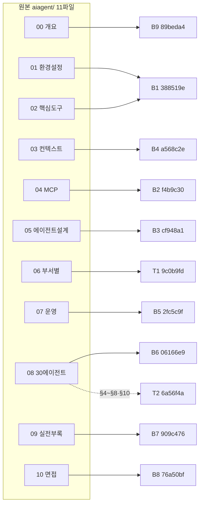
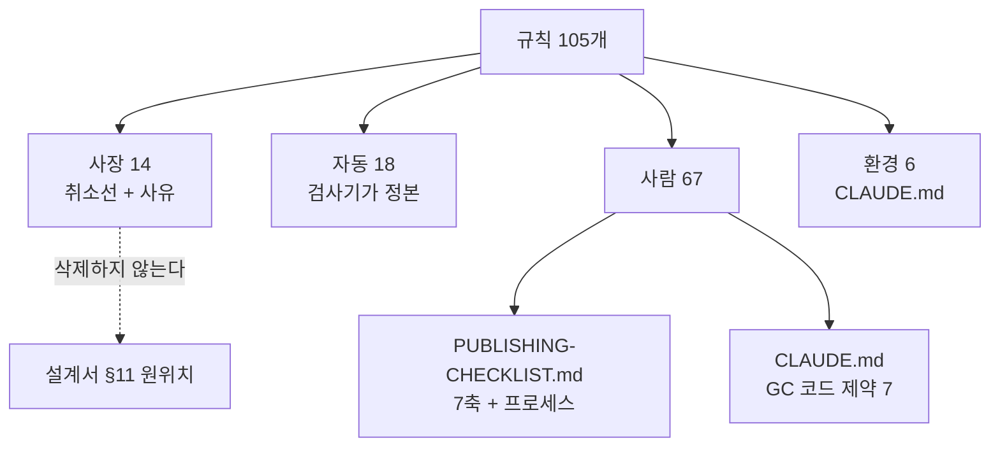

# 규칙 전수 분류 (2026-08-18)

> 대상: 금지선 1~58 · `GC-1~13` · `CR-*` **34개** (합계 **105개**)
> 판정 기준은 `docs/superpowers/specs/2026-08-18-publishing-gate-redesign.md` §3
> 방법: **제목이 아니라 원문을 전수로 읽었다.** 사장 판정에는 실측 근거를 붙였다.

---

## 1. 판정 기준

| 판정 | 뜻 | 조치 |
| --- | --- | --- |
| **사장** | 특정 배치에만 유효했고 그 배치가 끝났다 | 취소선 + 사유. **삭제하지 않는다** |
| **자동** | 기계가 판정한다 | 검사기로. 문서에는 「검사기가 정본」 한 줄 |
| **사람** | 패턴은 보이나 기계가 판정 못 한다 | 발행 체크리스트 |
| **환경** | 규칙이 아니라 도구가 실패하는 방식 | `CLAUDE.md` |

수명이 먼저 갈린다. **살아 있는 규칙만 「기계가 판정하는가」를 묻는다.**

---

## 2. 결과 — 수치

| 판정 | 금지선 | GC | CR | 합계 |
| --- | ---: | ---: | ---: | ---: |
| **사장** | 14 | 0 | 0 | **14** |
| **자동** | 5 | 6 | 7 | **18** |
| **사람** | 33 | 7 | 27 | **67** |
| **환경** | 6 | 0 | 0 | **6** |
| **합계** | **58** | **13** | **34** | **105** |

**매 세션 읽히던 105개 중 32개(사장 14 + 자동 18)가 사람 눈에서 빠진다.** 30%다.

### 2-1. 설계서 §3-1 추정과의 차이

| 구간 | 설계서 추정 (배치전용) | 실측 (사장) | 차이 | 원인 |
| --- | ---: | ---: | ---: | --- |
| 금지선 1~20 | 약 11 (2~12) | **9** (2~9, 12) | **−2** | 10·11은 **영구 규칙이고 자동화 대상**이다 |
| 금지선 21~34 | 약 6 (22~27) | **5** (22~25, 27) | **−1** | 26은 **발행본 서식 관례라 계속 유효**하다 |
| 금지선 35~58 | 0 | **0** | 0 | 추정 적중 |
| **합계** | **약 17** | **14** | **−3** | |

**오차 방향이 일관된다 — 추정은 「배치 문서에 적혀 있다」를 「배치 전용이다」로 읽었다.**
제목만 보면 규칙이 사는 자리가 수명으로 보인다. 세 건 모두 원문에서 갈렸다.

| # | 제목이 준 인상 | 원문이 말한 것 | 판정 |
| ---: | --- | --- | :---: |
| 10 | 「`agentic-coding` 태그는 존재하지 않는다」 — 그 배치의 사실 | 규칙의 실체는 **「통제 어휘 밖 태그를 쓰지 마라」**로 영구다. 실측: `content/blog/tags.ts` 통제 어휘 81종, `agentic-coding` **0건** | **자동** |
| 11 | 「13.3 KB를 밑돌면 병합」 — 그 배치의 임계값 | `CR-4.1a`와 **같은 규칙**이며 영구다. 설계서 §3-3이 SOFT 검사 대상으로 지정했다 | **자동** |
| 26 | 「첫 90일에 할 일」 — 그 배치의 명명 지시 | **발행본 9편이 지금도 이 문구를 쓰고 있다.** 원본 소진과 무관하게 서식 충돌을 막는 규칙이다 | **사람** |

⚠️ **26의 원문 기술 자체가 부정확하다.** 원문은 「발행본 **7편**의 **마무리 절** 서식」이라 적었으나
실측은 **9편**이고 **마무리 표의 열 제목**이다(H2로 쓰인 곳 0건). 편수는 이후 배치로 늘어난 것이고,
「절」과 「열 제목」은 처음부터 달랐다. 26을 체크리스트로 옮길 때 이 기술을 바로잡는다.

```
$ LC_ALL=C grep -rl "첫 90일" content/blog --include="*.md" | wc -l
9
$ LC_ALL=C grep -rn "^#\{1,3\} .*첫 90일" content/blog --include="*.md" | wc -l
0
```

---

## 3. 사장 판정의 실측 근거 — 원본이 소진됐는가

사장 판정은 **「배치 지시처럼 보인다」가 아니라 「그 규칙이 가리키는 원본이 이미 발행됐다」**로 내렸다.

### 3-1. 원본 소진 대조표

`git log --oneline --diff-filter=A -- content/blog` 로 얻은 발행 커밋을
`C:\Users\aeby\vscode\yanadoo-exit\shared\knowledge\` 의 원본 파일과 대조했다.



| 원본 | 발행 커밋 | 소진 |
| --- | --- | :---: |
| `aiagent/00` | `89beda4` (B9 지식 지도) | ✅ |
| `aiagent/01`·`02` | `388519e` (B1, 5편) | ✅ |
| `aiagent/03` | `a568c2e` (B4, 3편) | ✅ |
| `aiagent/04` | `f4b9c30` (B2, 3편) | ✅ |
| `aiagent/05` | `cf948a1` (B3, 3편) | ✅ |
| **`aiagent/06`** | **`9c0b9fd` (T1, 3편)** | ✅ |
| `aiagent/07` | `2fc5c9f` (B5, 4편) | ✅ |
| `aiagent/08` | `06166e9` (B6, 3편) + **`6a56f4a` (T2 §4~§8·§10)** | ✅ |
| `aiagent/09` | `909c476` (B7, 4편) | ✅ |
| `aiagent/10` | `76a50bf` (B8, Q&A 4편) | ✅ |
| `aiteam/01`·`02`·`05`·`06`·`07` | `695cdad` (T3, 편1·편4) | ✅ |
| `aiteam/03`·`04_영역별` (7파일) | `37e413b` (T4, 편2·편3) | ✅ |
| `aiteam/09`·`09a`·`09b` | `e83cfd3` (T5, 편5) | ✅ |
| `aiteam/08 §3` | `7efd4d4` (T6, 편10 Q&A) | ✅ |

**`aiagent/` 11파일과 `aiteam/` 11파일이 전부 소진됐다**(`aiteam/00_INDEX`는 색인이고
T7 `9197bd1`의 지도편이 기능을 대체했다). 금지선 2~9·12·22~25·27이 가리키는 대상은 하나도 남지 않았다.

### 3-2. 건별 근거

| # | 규칙 요지 | 실측 근거 |
| ---: | --- | --- |
| 2 | `08 §3-4` tools 열 `"기본"` 25행 제거 | `06166e9`(B6)가 `aiagent/08`을 3편으로 발행. **규칙 본문이 스스로 「B6에서 실행 완료」라 적었다** |
| 3 | `200줄`·`85%`는 발행본과 다른 객체 | `aiagent/` 전 파일 소진. 두 수치에 대한 1회성 판정 |
| 4 | `강의`를 다른 주체로 갈아 끼우지 마라 | `aiagent/` 소진. **원리는 `CR-1.10`이 영구 승계** |
| 5 | ㉢ 귀속 구분 3건 보존 | `aiagent/` 소진. §6-4 ㉢의 특정 3건 |
| 6 | §6-5의 11건을 지정된 편으로 먼저 옮겨라 | `76a50bf`(B8)가 `aiagent/10-면접-커닝페이퍼`를 Q&A 4편으로 발행 |
| 7 | `07 §7-4`의 4개 패턴은 이름·예방책만 | `2fc5c9f`(B5)가 `aiagent/07`을 4편으로 발행 |
| **8** | `06`과 `08 §4~§8·§10`은 이번 범위가 아니다 | **둘 다 확인.** `9c0b9fd`(T1)가 `aiagent/06`을, `6a56f4a`(T2)가 `08 §4~§8·§10`을 `agent-definition-by-department.md`로 발행 |
| 9 | `01`은 §6-1·§9·§10만 쓴다 | `388519e`(B1)가 `aiagent/01`·`02`를 5편으로 발행 |
| 12 | `02 §12-2`는 1행이 편4, 5행이 편5 | `388519e`(B1)가 `aiagent/02`를 발행 |
| 22 | `04_영역별` 7파일을 같은 규칙으로 처리하지 마라 | `37e413b`(T4)가 발행. **원문의 「7파일」은 실측과 일치**(`ls` 결과 7개) |
| 23 | 30에이전트 세트 C는 A·B와 다르다고 명시하라 | `6a56f4a`(T2)가 편9를 발행. 선례 `thirty-agent-catalog.md`는 이미 발행본 |
| 24 | 30종 명부를 다시 싣지 마라 | `6a56f4a`(T2)가 편9를 발행. **중복 방지 일반형은 `CR-6.1`·`dup-scan.mjs`가 승계** |
| 25 | `06 §2-7`의 4등급을 「3등급」이라 부른다 | `695cdad`(T3)가 `aiteam/06`을 편4로 발행. ⚠️ **여기의 `06`은 `aiteam/06`이고 금지선 8의 `06`은 `aiagent/06`이다 — 같은 번호가 다른 파일이다** |
| 27 | `aiteam/06` 성숙도·90일 로드맵에 「이 글의 정리다」 귀속 | `695cdad`(T3) 발행분 `enablement-infra-and-maturity.md`에 **「이 글의 정리다」가 실제로 5회 이상 들어 있다**(`:87`·`:103`·`:138`·`:346`·`:359`). **원리는 금지선 14가 영구 승계** |

⚠️ **사장 규칙이 담고 있던 일반 원리는 전부 승계처가 있다.** 4→`CR-1.10`, 24→`CR-6.1`, 27→금지선 14.
승계처가 없는 사장 규칙은 없다 — 폐기로 잃는 것이 없음을 확인했다.

---

## 4. 금지선 1~58 전수

| # | 요지 | 판정 | 근거 · 이관처 |
| ---: | --- | :---: | --- |
| 1 | 인상으로 도식·표를 지우지 마라. 항목 수를 세라 | 사람 | `CR-6.1`·`CR-6.3`과 같은 내용 — 체크리스트에서 한 항목으로 합친다 |
| ~~2~~ | `08 §3-4` tools 열 `"기본"` 25행 제거 | **사장** | `06166e9` (B6) |
| ~~3~~ | `200줄`·`85%`는 다른 객체 | **사장** | `aiagent/` 소진 |
| ~~4~~ | `강의`를 다른 주체로 갈아 끼우지 마라 | **사장** | `aiagent/` 소진 · 원리는 `CR-1.10` |
| ~~5~~ | ㉢ 귀속 구분 3건 보존 | **사장** | `aiagent/` 소진 |
| ~~6~~ | §6-5의 11건 이동 | **사장** | `76a50bf` (B8) |
| ~~7~~ | `07 §7-4` 4개 패턴 | **사장** | `2fc5c9f` (B5) |
| ~~8~~ | `06`·`08 §4~§8·§10`은 범위 밖 | **사장** | `9c0b9fd` (T1) · `6a56f4a` (T2) |
| ~~9~~ | `01`은 §6-1·§9·§10만 | **사장** | `388519e` (B1) |
| 10 | 통제 어휘 밖 태그를 쓰지 마라 | **자동** | `tests/blog/frontmatter.test.ts` (태그 통제 어휘·카테고리 실재) |
| 11 | 분량 하한 미달이면 병합. 억지로 늘리지 마라 | **자동** | `tests/blog/content/schema.test.ts` (SOFT) · `CR-4.1a`와 동일 |
| ~~12~~ | `02 §12-2` 행 배정 | **사장** | `388519e` (B1) |
| 13 | 상한은 합격선이 아니다. 크기를 이유로 내용을 빼지 마라 | 사람 | 수치는 배치 것이나 원칙은 영구. 기계는 「왜 뺐는가」를 못 본다 |
| 14 | 새 판정에 「이 글의 정리다」 귀속을 붙여라 | 사람 | 체크리스트 **귀속** 축 |
| 15 | 「원 자료는 X를 하지 않았다」는 X가 있을 자리를 검색하고 근거를 남겨라 | 사람 | 체크리스트 **귀속** 축 |
| 16 | 전칭을 분류로 바꿀 때 전수 배정하고 세어라 | 사람 | **설계서 §3-4가 자동화를 명시 기각** |
| 17 | 전수 배정 뒤 총평을 붙이지 마라 | 사람 | 설계서 §3-4 기각 |
| 18 | 표의 「근거」 열은 원본 파일 안에서 실재를 확인하라 | 사람 | 체크리스트 **근거** 축 |
| 19 | 원본이 밝힌 자기 출처를 검증 없이 믿지 마라 | 사람 | 체크리스트 **근거** 축 |
| 20 | 검증자 처방을 그대로 붙여넣지 마라. 채택 전 3검사 | 사람 | 체크리스트 **프로세스** 절 |
| 21 | 지운 자리에 새 주장을 세우지 마라 | 사람 | 체크리스트 **익명화** 축 · 44와 동계열 |
| ~~22~~ | `04_영역별` 7파일을 같은 규칙으로 처리 금지 | **사장** | `37e413b` (T4) |
| ~~23~~ | 30에이전트 세트 C 명시 | **사장** | `6a56f4a` (T2) |
| ~~24~~ | 30종 명부 재수록 금지 | **사장** | `6a56f4a` (T2) · 원리는 `CR-6.1` |
| ~~25~~ | `aiteam/06 §2-7` 등급 수 대조 | **사장** | `695cdad` (T3) |
| **26** | 「첫 90일에 할 일」을 편 제목·H2로 쓰지 마라 | **사람** | ⚠️ **추정 정정.** 발행본 **9편**이 마무리 표의 열 제목으로 쓰고 있다. 원본 소진과 무관하게 유효 |
| ~~27~~ | `aiteam/06` 성숙도·로드맵에 귀속 | **사장** | `695cdad` (T3) · 이행 확인 · 원리는 14 |
| 28 | mermaid 노드·화살표에 본문 근거 줄 | 사람 | 체크리스트 **도식 근거** 축 |
| 29 | 「개수+술어」 총평은 고치지 말고 삭제하라 | 사람 | 설계서 §3-4 기각 |
| 30 | 근거는 화살표만이 아니라 **노드 라벨**에도 필요 | 사람 | 체크리스트 **도식 근거** 축 |
| 31 | 삭제는 둘을 남긴다 — 같은 주장의 사본 · 그 문장이 떠받치던 근거 | 사람 | 체크리스트 **삭제 파급** 축 |
| 32 | 원본에 있는 것을 「이 글의 정리다」로 강등하지 마라 | 사람 | 체크리스트 **귀속** 축 |
| 33 | 유효성 대조를 통과한 「0건」도 거짓 음성일 수 있다 | 사람 | 53의 선행형. 체크리스트 **프로세스** 절 |
| 34 | 오탐 판정과 「손대지 마라」는 동치가 아니다 | 사람 | 체크리스트 **익명화** 축 |
| 35 | 좌표가 정확한 것과 그 좌표가 주장을 받치는 것은 다르다 | 사람 | 체크리스트 **근거** 축 |
| 36 | 같은 대상을 두 자리에서 재면 술어의 넓이를 맞춰라 | 사람 | 체크리스트 **전수 배정** 축 |
| 37 | 표를 가로로 읽어라 | 사람 | 체크리스트 **전수 배정** 축 |
| 38 | 비교 요약은 배타 전칭을 자동 생성한다 | 사람 | 체크리스트 **전수 배정** 축 |
| 39 | 이모지 grep이 「범위 초과」로 죽는데 무출력이 0건으로 보인다 | **환경** | `CLAUDE.md` 도구 함정 |
| 40 | `grep -o '비용'`이 「대**비용**(對比用)」도 센다 | **환경** | `CLAUDE.md` 도구 함정 |
| 41 | 축자 복제 스캔은 「같은 뜻 다른 글자」를 못 잡는다 | **환경** | `CLAUDE.md` — `dup-scan.mjs`의 한계 |
| 42 | 브리프의 「미확정」 자체가 실측이 필요한 주장이다 | 사람 | 체크리스트 **프로세스** 절 |
| 43 | 정확한 글이 안 읽힐 수 있다. 독자 축에 좌표를 주지 마라 | 사람 | 체크리스트 **프로세스** 절 |
| 44 | 지우기는 안전하고 빈자리를 **메우는** 조작이 결함을 만든다 | 사람 | 체크리스트 **익명화** 축 |
| **45** | 링크는 참조가 아니라 **약속**이다 | **사람** | ⚠️ **설계서 §3-3의 「자동」 판정을 좁힌다 — 아래 §5 참조** |
| 46 | 개별 대안이 각각 옳아도 동시 적용하면 충돌한다 | 사람 | 체크리스트 **프로세스** 절 |
| 47 | 낱말이 같아도 물건이 다를 수 있다 | 사람 | 체크리스트 **단독 가독** 축 |
| 48 | 지적 목록을 주지 않은 새 눈이 가장 많이 잡았다 | 사람 | 체크리스트 **프로세스** 절 |
| 49 | 파이프 뒤의 `$?`는 마지막 명령의 것이다 | **환경** | `CLAUDE.md` 도구 함정 |
| 50 | 마크다운 강조가 낱말과 조사 사이에 끼면 grep이 못 잡는다 | **환경** | `CLAUDE.md` 도구 함정 |
| 51 | 한국어 1인칭은 grep으로 분리되지 않는다 (양방향 실패) | **환경** | `CLAUDE.md` — **검사기에 넣지 마라** |
| 52 | 금칙어 목록이 라틴 표기만 담으면 한글 표기형이 빠진다 | **자동** | `scripts/check-forbidden.mjs` 가 정본. self-test가 증명한다 |
| 53 | 거짓 음성은 「못 찾음」이 아니라 「**없음을 확인함**」으로 기록된다 | 사람 | 체크리스트 **프로세스** 절. 실행 자체는 `check-forbidden:verify`가 담당 |
| 54 | 규칙을 문서에 복사하면 갈라진다 — **목록의 정본은 코드다** | 사람 | **이 분류 작업 자체의 근거.** 체크리스트 서문 |
| 55 | 지우는 조작에도 파급이 있다 — 지운 것이 남의 근거일 수 있다 | 사람 | 체크리스트 **삭제 파급** 축 |
| 56 | 한 규칙으로 두 표기 체계를 다루면 오탐이 난다 | **자동** | `scripts/check-forbidden.mjs` — 라틴은 단어 경계 요구, 한글은 요구 금지. self-test 고정 |
| 57 | 파생값이 얽힌 표는 낱말 하나만 바꿀 수 없다 | 사람 | 체크리스트 **삭제 파급** 축 |
| 58 | 적용 범위가 곧 정책이다 — `--all`은 판정하지 않는다 | **자동** | `scripts/check-forbidden.mjs` 가 정본 |

---

## 5. ⚠️ 설계서 판정을 좁힌 것 — 금지선 45

**설계서 §3-3은 금지선 45를 `CR-1.7`과 묶어 「자동」으로 넣었다. 그 묶음이 틀렸다.**

| | `CR-1.7` | 금지선 45 |
| --- | --- | --- |
| 무엇을 요구하나 | 링크가 **실재 슬러그**를 가리킬 것 | 대상 편이 **약속한 내용을 실제로 줄 것** |
| 판정 방법 | 슬러그 대조 | 대상 파일을 열어 **서술이 그 주제를 다루는지** 읽는다 |
| 기계가 하나 | ✅ 한다 | ❌ 못 한다 |

45의 원 사례가 이것을 그대로 보여 준다 — 「형태소 분석기가 BM25 **점수에** 어떻게 개입하는지는
[한글 검색 구현]에서 다룬다」는 **링크가 살아 있었다.** 죽은 링크 검사를 100번 돌려도 통과한다.
리뷰가 잡은 것은 대상 편 251줄에 「분석기와 점수를 잇는 서술이 0건」이라는 사실이었다.

⇒ **45를 「자동」으로 분류하면 링크 검사기 통과를 45 준수로 착각한다.**
이것이 정확히 금지선 56이 경고한 「못 하는 일을 하는 척하는 검사기」다.

**분리한다:**

| 층 | 판정 | 정본 |
| --- | :---: | --- |
| 링크 실재 · `trailingSlash` · inbound 0 고립 | **자동** | `CR-1.7` — 신설 링크 검사 |
| 「거기서 무엇을 다룬다」가 참인가 | **사람** | 금지선 45 — 체크리스트 |

---

## 6. ⚠️ 원문 대조에서 나온 정정 3건

### 6-1. 금지선 번호 53~56이 **두 벌 존재한다** (출처 자체의 충돌)

커밋 `a785c61`의 `HANDOFF.md`가 §2~§7에 금지선 53~58을 배정하면서
**§9 도구 함정 표에서 53·54·55·56을 다시 썼다.** 같은 문서 안에서 번호가 충돌한다.

| # | §2~§7 (금지선 정본) | §9 도구 함정 (충돌) |
| ---: | --- | --- |
| 53 | 거짓 음성은 「없음을 확인함」으로 기록된다 | 히어독으로 코드를 쓰면 이중 백슬래시가 벗겨진다 |
| 54 | 규칙을 문서에 복사하면 갈라진다 | 서브에이전트가 유휴가 돼도 보고서가 오지 않는다 |
| 55 | 지운 것이 남의 근거일 수 있다 | grep으로 CRLF를 검사하면 거짓 음성 |
| 56 | 한 규칙으로 두 표기 체계를 다루면 오탐 | `core.autocrlf=true`면 `git diff`가 줄바꿈 변경을 숨긴다 |

앞선 두 세션은 충돌이 없었다 — `6186437`은 §8 도구 함정에 **39~42**를, `964c8f3`은 §8에 **49~52**를
금지선 번호 공간 안에서 이어 붙였다. `a785c61`만 두 계열을 각각 53부터 다시 시작했다.

**설계서에 그 충돌이 그대로 옮겨졌다:**

| 설계서 | 53~56을 무엇으로 읽었나 |
| --- | --- |
| §3-4 | 「금지선 **56** = 못 하는 일을 하는 척하는 검사기」 → **금지선 정본** (§5 본문) |
| §3-5 | 「금지선 **55** = 삭제는 사본과 참조를 남긴다」 → **금지선 정본** |
| §3-6 | 「**53** 히어독 · **54** 서브에이전트 · **55** CRLF · **56** autocrlf」 → **도구 함정 표** |

⇒ **§3-6이 §3-4·§3-5와 모순된다.** 이 분류표는 **§2~§7 = 금지선 정본**을 따랐다.
`a785c61` §12 「소스 위치」가 「금지선 53~58 = 이 문서 §2~§7」이라 명시했고 §9는 거기 없다.

**§9 도구 함정 4건은 번호를 잃지 않는다** — 「환경」으로 `CLAUDE.md`에 옮기되
**금지선 번호를 떼고** 이관한다. 번호로 참조되는 것은 금지선 정본 쪽이다.

### 6-2. `CR-*`는 33개가 아니라 **34개**다

```
$ grep -oE "^\| \*{0,2}CR-[0-9]+\.[0-9]+a?\*{0,2} \|" \
    docs/superpowers/specs/2026-08-07-tech-blog-requirements.md \
  | grep -oE "CR-[0-9]+\.[0-9]+a?" | sort -u | wc -l
34
```

`CR-4.1a`(§12-2에서 신설)가 빠져 있었다. 총계가 104~106이 아니라 **105**다.

### 6-3. 같은 번호 `06`이 두 파일을 가리킨다

금지선 8의 `06` = `aiagent/06-부서별-에이전트-업무자동화.md`
금지선 25의 `06` = `aiteam/06-도입로드맵_성숙도모델.md`

**둘 다 사장이라 실무 영향은 없지만**, 배치 지시가 파일을 접두사 없이 번호로만 부른 것이
설계서 §3-7(「배치 지시는 영구 문서에 넣지 않는다」)의 또 다른 근거다.

---

## 7. `GC-1~13`

| # | 요지 | 판정 | 정본 |
| --- | --- | :---: | --- |
| GC-1 | 정적 export만으로 동작 | **자동** | Next.js 빌드가 강제 |
| GC-2 | 모든 경로는 슬래시로 끝난다 | **자동** | 빌드 + 신설 링크 검사 |
| GC-3 | App Router 금지 | 사람 | ⚠️ **빌드가 막지 않는다.** `CLAUDE.md` 소관 |
| GC-4 | 경로 별칭 `@/*` | 사람 | ⚠️ 상대경로도 빌드를 통과한다. `CLAUDE.md` 소관 |
| GC-5 | `fs`는 `getStaticProps` 계열에서만 | **자동** | 클라이언트 번들에 들어가면 빌드가 깨진다 |
| GC-6 | 기존 페이지 산출물 무영향 | **자동** | 신설 `scripts/check-baseline.mjs` (CI 전용) |
| GC-7 | 한글 줄바꿈 `break-keep` | 사람 | 「본문 텍스트 요소」를 기계가 판정 못 한다 |
| GC-8 | 다크모드 `dark:` 변형 | 사람 | 동일 |
| GC-9 | 커밋 메시지 한글 | 사람 | `CLAUDE.md` 소관 |
| GC-10 | 푸시 금지 | 사람 | `CLAUDE.md` 소관 |
| GC-11 | 발행 산출물 금칙어 | **자동** | `scripts/check-forbidden.mjs` 가 정본 — **이미 그렇게 개정됨** |
| GC-12 | 타입 검사는 별도 | **자동** | `npx tsc --noEmit` 종료 코드 |
| GC-13 | `tsconfig.json` 수정 금지 | 사람 | 기계가 막지 않는다. `CLAUDE.md` 소관 |

⚠️ **`GC-*`의 「사람」 7건은 발행 체크리스트에 넣지 않는다.** 이것들은 **코드 제약**이지
글 발행 판단이 아니다 — `CLAUDE.md`가 소관이고 이미 대부분 거기 적혀 있다.
**판정 4종이 발행 규칙을 전제로 설계돼 코드 제약과 잘 맞지 않는다**(설계서 §3의 한계).

---

## 8. `CR-*` 34개

| # | 요지 | 판정 | 정본 · 이관처 |
| --- | --- | :---: | --- |
| CR-1.1 | 1인칭 학습 기록 → 설명체 | 사람 | 체크리스트 **톤** 축 |
| CR-1.2 | 원본 메타 인용문을 본문에서 제거 | 사람 | 체크리스트 **톤** 축 |
| CR-1.3 | 「본인 실적이 아니다」류 주의문 제거 | 사람 | 체크리스트 **톤** 축 |
| CR-1.4 | 면접 목적 표현을 전부 걷는다 | **자동** | `scripts/check-forbidden.mjs` |
| CR-1.5 | 도입부를 새로 쓴다 | 사람 | 체크리스트 **도입부** 축 |
| CR-1.6 | 표·mermaid를 최대한 보존한다 | 사람 | 금지선 1·`CR-6.1`과 합친다 |
| CR-1.7 | 저장소 밖 상대경로 링크 제거·교체 | **자동** | 신설 링크 검사 (금지선 45의 **링크 실재 층만**) |
| CR-1.8 | 회사 내부 정보·실명 조직도 일반화 | 사람 | 체크리스트 **익명화** 축 |
| CR-1.9 | 금칙어가 지던 정보를 먼저 적는다 | 사람 | 체크리스트 **익명화** 축 |
| CR-1.10 | 주체를 갈아 끼우지 마라 | 사람 | 체크리스트 **익명화** 축 (금지선 4의 승계처) |
| CR-2.1 | 질문은 기술 질문 형태로 | 사람 | 체크리스트 **Q&A** 절 |
| CR-2.2 | 결론 먼저, 근거 다음 | 사람 | 체크리스트 **Q&A** 절 |
| CR-2.3 | 답변마다 표·코드·도식 1개 이상 | 사람 | 「Q&A 편」을 기계가 식별하지 못한다 |
| CR-2.4 | 개인 경력 서사 제거 | 사람 | 체크리스트 **익명화** 축 |
| CR-2.5 | Q&A 분량 25 KB 초과 시 분할 | 사람 | §14-1에서 분량 기준으로 정정됨 |
| CR-2.6 | Q&A 목적지 없는 카테고리는 신설 | 사람 | 체크리스트 **Q&A** 절 |
| CR-3.1 | `bigdata/…AWS 구성도` 제외 **또는** 익명화 | 사람 | ⚠️ **설계서 §2-1이 「발행(익명화)」로 판정.** 문서 갱신 |
| CR-3.2 | `pangyo-it/*` 6개 발행 제외 | 사람 | 설계서 §2-1이 **제외 유지**로 확정 |
| CR-3.3 | `cto_learning_roadmap.md` 제외 **또는** 탈개인화 | 사람 | ⚠️ **설계서 §2-1이 「발행(탈개인화)」로 판정.** 문서 갱신 |
| CR-3.4 | 회사 내부 수치·조직 구조·미공개 일정 | 사람 | 체크리스트 **익명화** 축 |
| CR-3.5 | 특정 인물 실명 제거 | **자동** | `scripts/check-forbidden.mjs` |
| CR-4.1 | 분할은 H2 경계 우선 | 사람 | 체크리스트 **분할** 절 |
| CR-4.1a | 목표 분량 (임계값은 검사기가 정본) | **자동** | `tests/blog/content/schema.test.ts` 분량 하한 SOFT (금지선 11과 동일) |
| CR-4.2 | `series` 동일 · `seriesOrder` 순서 | **자동** | `tests/blog/frontmatter.test.ts` |
| CR-4.3 | 시리즈 첫 글에 목차·각 편 요약 | 사람 | 체크리스트 **분할** 절 |
| CR-4.4 | 분할 후 단독으로 읽을 수 있어야 한다 | 사람 | 체크리스트 **단독 가독** 축 |
| CR-4.5 | 도식과 그 설명이 같은 편에 있는가 | 사람 | 체크리스트 **도식 근거** 축 |
| CR-5.1 | 슬러그는 소문자 영문·하이픈만 | **자동** | `tests/blog/frontmatter.test.ts` |
| CR-5.2 | 카테고리 정의는 단일 소스 | **자동** | `content/blog/categories.ts` + `frontmatter.test.ts` 카테고리 실재 검사 |
| CR-5.3 | 카테고리 순서는 브랜딩 우선순위 | 사람 | 판단 사항 |
| CR-6.1 | 도식·표 제거 시 항목 수를 센다 | 사람 | 금지선 1과 동일 — 합친다 |
| CR-6.2 | 원본 절별 도식 수 ↔ 발행본 편별 도식 수 대조 | 사람 | 체크리스트 **도식 근거** 축 |
| CR-6.3 | 브리프에 「세어 보고 어겨도 된다」를 명시 | 사람 | 체크리스트 **프로세스** 절 |
| CR-6.4 | 앞 배치 사례를 표로 브리프에 넣는다 | 사람 | 체크리스트 **프로세스** 절 |

---

## 9. 중복 — 같은 것을 세 자리에서 말한다

「사람」 67건 중 **다음은 같은 규칙의 재기술**이다. 체크리스트에서는 한 항목으로 합친다.

| 묶음 | 구성 | 대표 |
| --- | --- | --- |
| 도식·표를 세라 | 금지선 1 · `CR-1.6` · `CR-6.1` · `CR-6.3` | 금지선 1 |
| 새 판정에 귀속 | 금지선 14 · 27(사장) · `CR-1.10` | 금지선 14 |
| 전칭 전수 배정 | 금지선 16 · 17 · 29 · 36 · 37 · 38 | 금지선 16 |
| 삭제 파급 | 금지선 31 · 55 · 57 | 금지선 31 |
| 익명화 | 금지선 21 · 34 · 44 · `CR-1.8~1.10` · `CR-2.4` · `CR-3.4` | 금지선 44 |
| 좌표·근거 | 금지선 18 · 19 · 35 | 금지선 35 |

**67건이 실질 규칙 67개가 아니다.** 축으로 접으면 **7축 + 프로세스 절**로 들어간다.

---

## 10. 이관 결과



| 목적지 | 무엇이 | 몇 개 |
| --- | --- | ---: |
| 설계서 §11 (취소선 유지) | 사장 | 14 |
| 검사기 (문서에는 한 줄) | 자동 | 18 |
| `PUBLISHING-CHECKLIST.md` | 사람 — 발행 판단 | 60 |
| `CLAUDE.md` 코드 제약 | 사람 — `GC-*` | 7 |
| `CLAUDE.md` 도구 함정 | 환경 | 6 |

---

### 10-1. 체크리스트 §0이 자기 자신을 잡았다

체크리스트 초고에 **자동 판정 기준 2건이 새어 있었다.** §0의 원칙(「기계가 보는 것을 여기 옮겨 적지 마라」)을
스스로에게 돌려 확인해 잡았다.

| 유출 | 조치 |
| --- | --- |
| Q&A 분할 임계값 수치 | 수치를 걷고 **`CR-2.5`가 정본**임을 명시 |
| 금칙어 하나가 예시 문면에 포함 | 낱말을 걷고 「한 금칙어」로 일반화 — 예시의 논지는 낱말이 아니라 **파생 칸의 수**다 |

⇒ **규칙을 옮겨 적는 실수는 규칙을 옮겨 적지 말자고 쓰는 문서에서도 난다.**
문서를 쓴 뒤 그 문서에 검사를 돌려라:

```bash
# 임계 수치·금칙어가 체크리스트로 새지 않았는지
LC_ALL=C grep -nE "임계값패턴|KB" docs/superpowers/PUBLISHING-CHECKLIST.md
```

**검사 실행 기록** (2026-08-18, 증명 먼저 · 스캔 나중):

| 명령 | 결과 |
| --- | --- |
| `npm run check-forbidden:verify` | **통과 15 / 실패 0** |
| `npm run check-forbidden` | 검사 파일 126개 · **HARD 0건** · SOFT 2건(판정 완료분) · 종료 코드 0 |

---

## 11. 남는 우려

| # | 우려 | 근거 |
| ---: | --- | --- |
| 1 | **설계서 §3-6의 번호가 틀렸다** | §6-1. `CLAUDE.md`에는 **번호 없이** 옮겼으나 설계서는 고치지 않았다 — 다른 태스크가 §3-6을 읽으면 같은 오류를 반복한다 |
| 2 | **금지선 45를 자동으로 분류하면 위험하다** | §5. 설계서 §3-3을 좁혔다. 링크 검사기 구현자가 §3-3만 보면 45가 해소됐다고 판단할 수 있다 |
| 3 | **일부 해소** — 신설 검사기 경로 | 스키마·분량은 커밋 `a28dcbf`로 **`tests/blog/content/schema.test.ts` 가 실재하게 됐고** 문서가 그 경로를 가리킨다. **아직 없는 것**: 링크 검사(`CR-1.7`은 경로 없이 「신설 링크 검사」로 표기) · `scripts/check-baseline.mjs`(`GC-6`에 「신설 예정」 표기) · `.githooks/`(`CLAUDE.md`에 「아직 설치되지 않았다」 명시). **문서는 실재하는 경로만 단정한다** |
| 4 | 「사람」 67은 여전히 많다 | §9로 접으면 7축이지만, 접는 순간 원 규칙의 구체 사례가 사라진다. 체크리스트는 축마다 **실패 사례 한 줄**을 남겨 이를 완화했다 |
