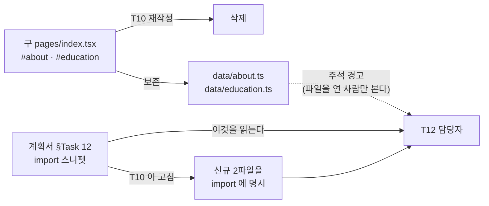

# T10 — 메인 5섹션 (`pages/index.tsx` 재작성) 마감 기록

| 항목 | 값 |
| --- | --- |
| 브랜치 · BASE | `feat/redesign-stage2` · `1cc17b0` |
| 계획서 | [`plans/2026-08-25-redesign-phase-1-2.md`](../plans/2026-08-25-redesign-phase-1-2.md) §Task 10 |
| 파이프라인 | `/ted-run` — Step 0 TDD → 1 구현 → 2 이중 리뷰 → 3 검증 → 4 E2E → 5 기록 → 6 푸시 |
| 자동 분류 | 일반 기능 (`general`) — 보안·계약 키워드 0건. 2b·3-4·3-5 는 분류상 생략 대상이나 **2b 는 R34 축으로 사용자 지정 실행** |

**이 문서가 T10 판단의 정본이다.** 작업 원장(`.superpowers/sdd/`)은 gitignore 라 `git clean -fdx` 로 사라진다.

---

## 산출물

| 파일 | 줄 | 성격 |
| --- | --- | --- |
| `pages/index.tsx` | 537 → **82** | 조립 코드로 전면 재작성 |
| `components/home/section-selected-work.tsx` | 54 | 01 — `experiences.slice(0, 3)` |
| `components/home/section-how-i-lead.tsx` | 47 | 02 — 원칙 3개 |
| `components/home/section-now.tsx` | 60 | 03 — 2026년 현재 → `/blog/` |
| `components/home/section-atlas.tsx` | 33 | 04 — **어디에서도 렌더하지 않는다** |
| `components/home/section-connect.tsx` | 73 | 05 — 메일 · 노션 · GitHub |
| `data/education.ts` · `data/about.ts` · `data/product-lead-teaser.ts` | 35 · 51 · 24 | **소실 방지용 보존.** 소비처 없음 |
| `tests/home/task-10-structure.test.ts` | — | 구조 단언 13건 |

`04 Atlas` 를 렌더하지 않는 결정은 유지하되 **근거를 교체했다.** 계획서가 적은 「`/atlas` 가 없어 죽은 링크가 된다」는 낡았다(아래 R38). 진짜 이유는 **그래프 미리보기와 토픽별 노드 수 집계가 아직 없다**는 것이다.

---

## 리뷰 — 축을 나눈 것이 서로 다른 결함을 찾았다

두 리뷰어를 병렬로 띄우고 서로의 결과를 보지 못하게 했다.

| 축 | 최우선 질문 | 결과 |
| --- | --- | --- |
| 2a 품질 | 접힌 9섹션에서 **사라진 것**이 있는가 | CRITICAL 0 · **HIGH 3** · MEDIUM 3 · LOW 1 |
| 2b 접근성·R34 | 셸 첫 부착으로 **추가된 것**이 무엇을 깨뜨리는가 | CRITICAL 0 · **HIGH 0** · MEDIUM 1 · LOW 3 |

**2b 의 HIGH 0 은 발견 실패가 아니라 진짜 0 이다.** 신규 5파일에 `useEffect`·`useState`·`addEventListener`·`matchMedia`·`aria-*`·`tabIndex` 가 전부 0건이라 [R34](2026-08-28-t9-hero-b.md) 가 경고한 위험의 **표면 자체가 없었다.**

두 리뷰어가 **독립적으로 같은 거짓 주석**을 잡았다 — 「`portfolio-nav.tsx` 는 다른 페이지가 아직 쓴다」인데 실제 import 는 리포 전역 0건이었다.

수정은 2라운드 상한 중 **1라운드**만 썼다(구현자 7건 + 컨트롤러 2건).

---

## Ruling R38 — 계획서는 정본이지만 그 안의 **사실 주장**은 썩는다

이 배치 하나에서 계획서의 전제가 **네 번** 틀렸다.

| 계획서가 적은 것 | 실제 | 어떻게 드러났나 |
| --- | --- | --- |
| `pages/index.tsx` 는 687줄 | **537줄** — T1 이 이미 150줄을 뺐다 | 진입 시 `wc -l` |
| `/atlas` 가 없어 04 Atlas 는 죽은 링크 | **`pages/atlas/` 가 이미 있다.** 별개 배치(2026-08-26 아틀라스·검색)가 먼저 만들었고 헤더 NAV 에도 있다 | 구현자가 링크를 걸기 전에 확인 |
| 「T1 이 `data/` 로 빼 뒀으므로 재작성으로 콘텐츠가 소실되지 않는다」 | **거짓.** 학력·철학·product 카피가 `data/` 에 없었다 | 2a 리뷰어의 전수 대조 |
| E2E 는 `/work/`·`/about/` 404 만 실패로 남는다 | **그런 테스트가 스위트에 없다.** `smoke.spec.ts` 가 보는 라우트는 `/`·`/en/`·`/blog/` 뿐 | 검증자가 84/84 통과를 보고 |

넷의 성격이 다르다. 첫째는 **자기 배치가 스스로 낡게 만든 수치**, 둘째는 **다른 배치가 세계를 바꾼 것**, 셋째는 **한 번도 참이 아니었던 주장**, 넷째는 **검사기를 안 보고 쓴 기대값**이다.

> **계획서의 사실 주장은 검사기가 아니다. 행동을 바꾸는 문장이면 실행해서 확인한 뒤에 따른다.**

가장 비쌌던 것은 셋째다. 구현자가 그 문장을 **`pages/index.tsx` 주석으로 복사해 굳혔고**, 리뷰가 없었으면 「소실되지 않는다」는 거짓이 코드에 박힌 채 커밋됐다. 이것은 [R36](2026-08-28-t9-hero-b.md)(주석이 틀린 것은 코드가 틀린 것보다 비싸다)의 재발이며, 이번엔 **틀린 주석의 출처가 계획서**였다.

### 처방 — 문서를 고쳐 다음 태스크의 경로를 닫았다

보존만으로는 부족했다. **T12 담당자가 읽는 정본은 `data/` 주석이 아니라 계획서**이고, §Task 12 스니펫은 여전히 `@/data/portfolio` 에서만 import 하고 있었다. 그 스니펫을 고치지 않으면 원래의 실패 시나리오가 경로만 바꿔 살아남는다.

**경고는 그것을 이미 연 사람에게만 닿는다.** 진입 경로에 적어야 닿는다.

---

## Ruling R39 — 「의미가 남았다」와 「문자열이 남았다」는 다르다

구 `#about` 의 요약 카드 3장 중 둘(`직전 포지션`·`팀 규모`)은 `data/experience.ts` 에 **의미가** 남아 있었다. 그래서 처음에는 보존 대상에서 빠졌다.

그러나 `전문 분야` 의 값 `AI 서비스, N-Screen, OTT, STB, CMS 개발` 은 리포 전역에 **0건**이었다. 그리고 이것을 놓치기 쉬운 이유가 하나 더 있다 — **`N-Screen` 이라는 개별 단어는 리포에 흔하다.** 부분 문자열로 찾으면 17건이 나오고, 그중 어느 것도 그 문장이 아니다.

> **소실 여부는 「의미가 어딘가에 있나」가 아니라 「그 문자열이 있나」로 판정한다. 그리고 부분 문자열 검색은 「있다」로 답한다.**

셋을 전부 원문 그대로 `data/about.ts` 의 `aboutFacts` 에 보존했다. 어느 쪽을 쓸지는 문구를 다시 쓰는 T12 의 판단이지, 보존 단계에서 미리 고를 일이 아니다.

---

## Ruling R40 — 정적 export 산출물에서 `grep -c` 는 항상 0 아니면 1이다

`out/index.html` 은 **개행이 없는 단일 라인**이다. `grep -c` 는 「매치한 **줄** 수」를 세므로, 요소가 몇 개든 답은 1이다.

검증자가 이를 발견하고 `grep -o … | wc -l` 로 다시 셌다. 이 함정이 위험한 것은 **1 이 그럴듯한 기대값**이라는 데 있다 — `id="main"` 1개·스킵 링크 1개·`<h1>` 1개는 전부 정답이 1이라 **틀린 도구로 재도 맞는 답이 나온다.** 그러다 `<h2>` 처럼 정답이 4인 것에서 처음 어긋난다.

함정 상세는 [`TOOL-TRAPS.md#t38`](../../TOOL-TRAPS.md#t38) 에 있다.

---

## 검증 실측

| 관문 | 결과 |
| --- | --- |
| `npx tsc --noEmit` · `npm run lint` | 0 · 0 |
| `npm test` | 18파일 / **395 통과** (T10 이 13건 추가) |
| `npm run build` | 0 — 404 페이지 · sitemap 233 URL · Pagefind 405 색인 |
| `check-forbidden:verify` → `check-forbidden` | 자기검사 15/15 → 158파일 **HARD 0** |
| `check-counts:verify` → `check-counts` | 자기검사 14/14 → 156편 / 6개 카테고리 |
| `npm run e2e` | **84 passed · 0 failed** |
| **`e2e/hero.spec.ts`** | **5/5 — 이 배치에서 처음 초록.** T9 가 센티넬 주석으로 예고한 조건이 충족됐다 |

`out/index.html` 계수 — **전체와 `</head>` 이후가 전부 동일**해 `__NEXT_DATA__` 중복 없이 실제 마크업의 수치다.

| 마커 | 실측 | 기대 |
| --- | --- | --- |
| `id="main"` · 스킵 링크 · `<h1>` | 1 · 1 · 1 | 1 · 1 · 1 |
| `<h2>` | 4 | 4 |
| `SectionAtlas` | 0 | 0 |
| `내가 팀을 이끄는 방식`(02 의 `sr-only` heading) | 1 | 1 |

T7 이 T10 으로 넘긴 **충돌 3건(`#main` 중복 · 스킵 링크 2개 · 토글 2벌)은 전부 1개로 해소**됐다. 셋 다 원인이 구 `PortfolioNav` 계열 마크업 하나였고, 전면 재작성이 동시에 걷어냈다.

---

## 다음 태스크에 넘기는 것

| 항목 | 넘길 곳 | 내용 |
| --- | --- | --- |
| **`/product-lead-v2` 고아** | **T11** | 홈에서 오는 유일한 진입점이 끊겼다. 인바운드 0건이며 사이트맵에만 남는다. 임시 링크는 넣지 않았다 — T11 `/work` 통합과 T13 스텁이 곧 재구조화하므로 |
| ⚠️ **머지 순서 제약** | **T11 이전** | **T11 전에 `main` 에 머지하면 실사용자가 도달 못 하는 페이지가 생긴다.** `main` 은 프리뷰 없는 프로덕션이다 |
| 소비처 0건이 된 데이터 | **T11 · T14** | `diagramGroups` · `skillCategories` · `writingLinks` · `projects` · `ThesisSummaryDialog` · `SystemDiagramCard`. `data/` 에 남아 있어 복구 가능 |
| `PortfolioNav` · `navItems` 고아 | **T14** | 호출자 리포 전역 0건. `navItems` 는 이제 없는 앵커(`#about`·`#product` 등)를 가리킨다. **여기서 안 지운 것은 T14 소관이라서지 쓰여서가 아니다** |
| LOW 4건 (고치지 않음) | 최종 리뷰 | 장식 번호(`01 —`)가 TTS 에 낭독됨 · `<section>` 에 `aria-label` 0건 · `target="_blank"` 새 창 예고 없음(**푸터도 같은 상태라 한쪽만 고치면 일관성이 깨진다**) · `slice(0,3)` 순서가 계획서 표와 다름 |
| `h2` 개수·순서 검사기 부재 | — | 2b 가 발견: **이 리포에 heading 구조를 단언하는 검사기가 0건**이다. 02 의 개요 구멍은 어떤 자동 검사도 잡을 수 없었고 지금도 못 잡는다 |

## 미확인으로 남는 것

| 항목 | 왜 |
| --- | --- |
| 실기기 회전·리사이즈, 키보드 탭 순회 실측 | E2E 는 통과했으나 **실기기·스크린리더로 확인한 것은 아니다** |
| `asPath` 하이드레이션 | `SiteShell` 이 `useRouter().asPath` 를 첫 렌더에 쓴다. **정적 라우트인 `/` 에서는 어긋나지 않는다** — 동적 라우트(`/blog/[slug]`)에 붙일 때 드러난다 |
| `data/product-lead-teaser.ts` 전문 축자 대조 | 표본 6개 문자열만 원본과 대조했다. 나머지는 미대조 |
