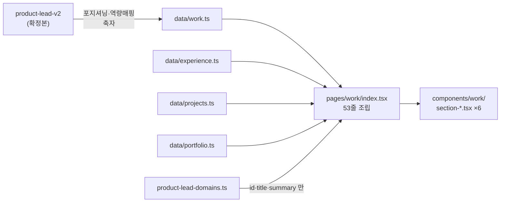

# T11 — `/work` (`product-lead*` 4갈래 통합) 마감 기록

**계획서**: [`2026-08-25-redesign-phase-1-2.md` §Task 11](../plans/2026-08-25-redesign-phase-1-2.md) (L1994~2166)
**통합 노트**: [`2026-08-25-work-merge-notes.md`](../plans/2026-08-25-work-merge-notes.md) — 무엇을 남기고 버렸는지, 축자 이관 문구
**브랜치**: `feat/redesign-stage2` · **파이프라인**: `/ted-run` (종료 정책 `push`)

`/work` 는 **T10 이 만든 도달 불가 상태를 닫는 태스크**이기도 하다. HANDOFF §2-2 의 「T11 전에 `main` 에 머지하지 마라」가 이 커밋으로 해소된다 — 다만 그 방법은 계획서가 아니라 **테스트 상수의 주석**에 예약돼 있었다(§R44 아래).

---

## 산출물

| 파일 | 성격 |
| --- | --- |
| `pages/work/index.tsx` | **신규 53줄 조립 코드** (구현 직후 282줄 → 리뷰 후 추출) |
| `components/work/section-{positioning,capability,experience,projects,systems,domains}.tsx` | **신규 6개** — 홈(`components/home/section-*.tsx`) 관례와 동형 |
| `components/work/focus-ring.ts` | **신규** — 이 배치에서 `FOCUS_RING` 8번째 복붙을 만들지 않기 위해 |
| `data/work.ts` | **신규** — `-v2` 확정본의 포지셔닝 2문장 + 역량 매핑 10행 축자 이관. import 0개(Playwright 가 상대 경로로 읽는다) |
| `data/experience.ts` | 1줄 — 「발주사 PM」 → 「발주 PM」 |
| `components/site-header.tsx` | `NAV` 에 `{ href: "/work/", label: "Work" }` |
| `e2e/work.spec.ts` · `tests/work/work-data.test.ts` | **신규 검사 2스위트** |
| `e2e/smoke.spec.ts` · `e2e/shell.spec.ts` | `/work/` 복원 · `Work` 를 `NAV_ABSENT` → `NAV_PRESENT` · Tab 순환 7→8 |



---

## 리뷰 — 축 셋이 서로를 잡았다

T9·T10 은 두 축(품질·접근성)이었다. T11 은 **「검사 유효성」 축을 하나 더 세웠다** — 이번 태스크는 테스트를 새로 썼고, *「이 검사들은 구현이 틀렸을 때 실제로 빨개지는가」* 가 가장 값어치 있는 질문이었기 때문이다.

| 축 | 잡은 것 | 다른 축이 못 본 것 |
| --- | --- | --- |
| 품질 | `diagramGroupLabel` 의 근거가 틀렸고 회사명 표기 규칙과 충돌 · 282줄 인라인 · 「발주사 PM」 공존 | 접근성·검사 유효성 둘 다 못 봄 |
| 접근성 | 표에 키보드 도달 불가 · 링크 접근명 3개 동일 · 새 창 예고 0건 | 품질·검사 유효성 둘 다 못 봄 |
| 검사 유효성 | **프로젝트 섹션이 검사되지 않고 있었다**(CRITICAL) · `exact` 부재 | 나머지 둘 다 못 봄 |

그리고 **세 축 모두 뮤턴트 오염을 스스로 걸러내지 못했다.** 그것은 컨트롤러가 직접 `grep` 해서 판정했다(§R41).

---

## Ruling R41 — 파일을 쓰는 에이전트는 **단독**이어야 한다. 관찰이 정확해도 대상이 흔들리면 결론이 틀린다

컨트롤러가 리뷰어 3명과 뮤테이션 에이전트를 **동시에** 띄웠다. 뮤테이션은 정의상 소스를 변이시킨다.

품질 리뷰어는 `data/experience.ts:104` 의 `"TVING CMS 를 처음 구축한 사람."` 을 보고 **HIGH 로 보고**했다. 그것은 뮤테이션 에이전트의 뮤턴트 #5였다.

**리뷰어의 관찰은 전부 정확했다.** 3회 재실행했고, `git status` 를 확인했고, *「`data/experience.ts` 의 mtime 이 12:23:00 에 갱신됐는데 `git diff` 는 비어 있다」* 는 이상까지 기록했다. 그 한 줄이 오염을 특정한 **유일한 단서**였다.

| | 병렬로 띄워도 되는가 | 이유 |
| --- | --- | --- |
| 리뷰어 ↔ 리뷰어 | ✅ | 전부 읽기 전용 |
| 리뷰어 ↔ verifier | ✅ | verifier 는 `out/` 만 쓴다 |
| **뮤테이션 ↔ 무엇이든** | ❌ | 소스를 변이시킨다. 다른 에이전트가 그 상태를 본다 |

부수 피해도 있었다. 뮤테이션 에이전트가 뮤턴트를 되돌리려 `git checkout -- components/site-header.tsx` 를 실행해 **T11 의 정당한 변경(NAV 의 Work)이 날아갔다.** 신규 파일은 `checkout` 으로 복구되지도 않는다.

⇒ **처방 셋.**
1. 파일을 쓰는 에이전트는 **단독 실행**한다.
2. 뮤테이션 브리프에 **`git checkout --` 금지**를 명시한다. 뮤턴트는 넣은 그대로 손으로 되돌린다.
3. **에이전트 보고를 액면가로 받지 않는다.** verifier 의 `406 passed` 와 리뷰어의 `1 failed` 가 충돌했을 때, 둘 중 하나를 고르지 말고 직접 `grep` 한다.

---

## Ruling R42 — 「고쳤다」와 「해소됐다」는 다르다. 그 차이는 **같은 축**만 본다

접근성 HIGH #1(가로 스크롤 표에 키보드 도달 불가)을 구현자가 정직하게 고쳤다 — `role="region"` · `tabIndex={0}` · 접근명 셋을 다 달았고, 판단이 하나 들어갔음을 스스로 보고까지 했다.

재리뷰가 **부분 기각**했다.

| | 고치기 전 | 구현자의 수정 | 재리뷰 후 |
| --- | --- | --- | --- |
| 키보드 도달 | ❌ | ✅ | ✅ |
| landmark 이름 중복 | — | ❌ **「요구 역량 매핑, 영역」 직후 「요구 역량 매핑, 표」** | ✅ |
| h2 의 위치 | landmark 안 | ❌ **landmark 밖** | landmark 안 |
| 포커스 링 | — | ❌ **없음** (새 정지점을 만들며 딸려 오지 않았다) | ✅ |

핵심 논거는 이것이다. **키보드 도달을 만드는 것은 `role="region"` 이 아니라 `tabIndex` 다.** `role` 은 landmark 목록에 띄우는 별개 기능이고, 여기서는 그 이득보다 비용(h2 축출 + 이름 중복)이 컸다. 구현자 주석의 「셋이 한 벌이다 — 하나만 빠져도 무의미하다」는 과한 진술이었다.

⇒ **수정이 새 문제를 만든다.** HIGH 를 고친 뒤 같은 축으로 한 번 더 도는 것이 재리뷰의 존재 이유다. 다른 축은 이 차이를 보지 못한다 — 품질 축도 검사 유효성 축도 이 이중 낭독을 지적하지 않았다.

---

## Ruling R43 — `toHaveClass` 는 CSS 규칙의 존재를 증명하지 않는다. 지금 Tailwind 추출을 지키는 것은 **검사가 아니라 중복**이다

포커스 링 회귀를 막으려고 `e2e/work.spec.ts` 에 `toHaveClass(/focus-visible:ring-signal/)` 를 넣고, 주석에 *「상수를 조립식으로 바꾸거나 추출 경로 밖으로 옮기면 이 검사가 잡는다」* 고 적었다. **틀렸다.**

검사 유효성 리뷰어가 산출물 CSS 에서 `.focus-visible\:ring-signal` 선택자를 직접 무력화한 뒤 그 test 만 재실행했다 → **2 passed.**

| 회귀 | 이 검사가 잡는가 |
| --- | --- |
| 클래스를 붙이는 것을 잊었다 | ✅ |
| 상수를 조립식으로 바꿔 Tailwind 추출이 깨졌다 | ❌ |
| CSS 규칙이 산출물에서 통째로 빠졌다 | ❌ |

더 중요한 것은 그다음이다. 조립식 뮤턴트가 **생존한 이유가 「검사가 못 잡아서」가 아니라 「CSS 가 애초에 안 빠져서」였다** — 같은 리터럴이 `site-header`·`site-footer`·`command-palette`·`search-button`·`home/section-connect`·`home/section-selected-work` **6곳에 복붙돼 있어** Tailwind 가 거기서 추출한다.

⇒ **`FOCUS_RING` 을 전역 단일 상수로 승격하는 날, 그 방패가 사라진다.** 그날 필요한 것은 `getComputedStyle(...).boxShadow` 를 재거나 `smoke.spec.ts` 처럼 산출물 자체를 검사하는 것이다. 이 사실을 `e2e/work.spec.ts` 주석과 아래 「다음 태스크에 넘기는 것」에 남겼다.

---

## Ruling R44 — 리팩토링이 **다음 태스크의 `grep`** 을 조용히 무력화한다

품질 리뷰어가 이번 커밋이 아니라 **T14 를 위해** 짚었다.

`SystemDiagramCard` 의 소비처가 `pages/work/index.tsx` → **`components/work/section-systems.tsx`** 로 옮겨졌다. T14(고아 자산 삭제)는 「호출자 0건」을 근거로 파일을 지운다. 그 브리프에 옛 경로가 적혀 있으면 `grep` 이 **0건**을 내고 「고아라 지워도 된다」로 오판한다.

이 리포의 「거짓 0」이 정확히 이 모양이다 — **「없다」와 「엉뚱한 데를 봤다」가 같은 출력으로 나온다.** 코드는 좋아졌는데 다음 태스크의 안전장치가 나빠진 경우이고, diff 를 아무리 봐도 보이지 않는다. 태스크 사이의 관계를 아는 사람만 본다.

계획서가 사실을 틀린 사례도 같은 뿌리다(→ R38). 계획서 §Task 11 Step 1·Step 3 은 *「T8 에서 만든 `/work/` 200 검사」* 를 전제했으나 **그런 검사는 없었다** — `e2e/smoke.spec.ts:114`·`:140` 이 2026-08-26 에 두 라우트를 배열에서 뺐고, `--grep "work"` 는 `No tests found` 로 응답했다.

반면 **진짜 정보는 테스트 상수의 주석에 있었다.**

```
e2e/shell.spec.ts:52   "Work", // 선행 계획서 T11 로 이월
```

계획서 본문은 NAV 승격을 한 줄도 말하지 않는다. `pages/work/index.tsx` 를 만드는 것만으로는 도달 가능해지지 않는데도. ⇒ **「무엇이 왜 빨간지는 문서가 아니라 `describe` 제목과 실패 메시지에 있다」(CLAUDE.md)가 실제로 작동했다.**

---

## 계획서와 어긋난 것 — 착수 전에 걸렀다

| # | 계획서 | 실물 | 결정 |
| --- | --- | --- | --- |
| 1 | Step 1 표는 포지셔닝·역량 매핑·NCMS 서사·도메인 요약을 남기라 함 | Step 2 **예시 코드에는 넷 중 하나도 없다** | **사용자 결정: Step 1 표 전부** |
| 2 | 「원조 구축」은 유지 표현 | `-v2` 에 **0건**. 「1세대 구축」·「발주 PM」으로 개정됨 | **사용자 결정: `-v2` 확정본 우선** |
| 3 | Step 4: 「처음」이 TVING CMS 문맥에 없어야 함 | `-v2:73` 에 「처음 다룬」(확정본) | **`-v2` 유지.** 금지 대상은 「처음 **구축한/만든**」 |
| 4 | 「T8 의 `/work/` 200 검사」가 있다 | **없다** | red 를 T11 이 새로 만들었다 |

3번은 검사 방식도 바꿨다. 계획서의 `grep '처음'` 은 확정본까지 잡아 **사람이 매번 무시하게 된다** — 무시하는 습관이 붙은 검사는 없는 것과 같다. 패턴을 `처음\s*(구축|만든|만들|세운|개발한)` 으로 좁혀 육안 검사에서 **검사기로** 옮겼다.

---

## 검증 실측

| 관문 | 명령 | 기준선 → 최종 |
| --- | --- | --- |
| 타입 | `npx tsc --noEmit` | 0 → **0** |
| lint | `npm run lint` | 0 → **0** |
| 단위 | `npx vitest run` | 395 → **406 passed** |
| 빌드 | `npm run build` | 405 페이지 · `/work` 17.4 kB |
| E2E | `npm run e2e` | 84 → **130 passed / 0 failed / 0 skipped** |
| 발행본 수 | `check-counts:verify` → `check-counts` | 자기검사 14/14 → 156편 일치 |

E2E 가 84 → 130 으로 는 것은 신규 spec 만이 아니다. `/work/` 에 셸이 붙으면서 **게이트로 잠들어 있던 기존 검사들이 깨어났다.** `skipped 0` 이 이 표에서 가장 중요한 칸이다.

**뮤테이션 (검사 유효성 축):**

| 라운드 | 뮤턴트 | 사멸 | 생존 |
| --- | --- | --- | --- |
| 1차 | 12 | 10 | **2** — 프로젝트 개수 대조 부재(CRITICAL) · `exact` 부재 |
| 2차 (수정 후) | 7 + 대조군 2 | **9** | 0 |

1차 생존 2건이 2차에서 전부 사멸했다. 대조군 2건(링크 0개일 때 거짓 음성이 되는 자리)도 실제로 발화했다.

산출물 직접 확인: `role="region"` **0건** · `aria-labelledby="capability-heading"` **2건** · `aria-label="요구 역량 매핑"` **0건** · CSS 에 `ring-signal` **존재**.

---

## 다음 태스크에 넘기는 것

| 항목 | 어디로 | 왜 |
| --- | --- | --- |
| **`SystemDiagramCard` 소비처가 `components/work/section-systems.tsx` 로 옮겨졌다** | **T14** | 옛 경로로 `grep` 하면 0건 → 「고아」 오판 (§R44) |
| `components/system-diagram-card.tsx` 가 `slate-*`·`dark:` 를 하드코딩. **`/work` 가 유일 소비처** | T14 | 신규 토큰 페이지가 레거시 팔레트를 되살리고 있다 |
| shadcn `CardTitle` 이 `<div>` — 시스템 구조 카드 제목이 heading 탐색에서 사라진다 | T14 또는 별도 | `components/ui/card.tsx:32` (기존) |
| **`FOCUS_RING` 중복 7곳.** 전역 승격 시 Tailwind 추출 방패가 사라진다 | 별도 정리 | §R43. 그때 `getComputedStyle` 기반 검사가 필요하다 |
| **새 창 예고가 `/work` 에만 있다** | T12·T13 | `site-footer.tsx:32` · `markdown.tsx:60` · `pages/en/index.tsx:72,84` · `product-lead*` 는 미보유. `/work` 쪽이 옳은 방향이니 나머지를 맞춰 간다 |
| `data/product-lead-teaser.ts` 가 소비처 없이 남는다 | T13·T14 | T10 이 추출만 하고 홈에 붙이지 않았다 |
| `NAV_ABSENT` 에 `About` 만 남았다 | T12 | `/about` 신설 시 `NAV_PRESENT` 로 |
| 섹션 번호 eyebrow(`01 — Capability` 등)가 h2 앞에서 낭독된다 | LOW, 미조치 | 6곳 |

---

## 미확인으로 남는 것

| 항목 | 왜 |
| --- | --- |
| 실기기 스크린리더 낭독 | 접근성 판정은 정적 분석 + 대비 계산으로 했다. 실제 낭독 순서는 확인하지 않았다 |
| 포커스 링의 **시각적** 확인 | 산출물에 클래스와 CSS 규칙이 있음은 확인했으나, 360px 폭에서 Tab 을 눌러 눈으로 세지는 않았다 (§R43 이 그 한계다) |
| `data/work.ts` 의 축자 대조 | 품질 리뷰어가 코드포인트 단위로 **22/22 완전 일치**를 확인했다 — 이것만은 미확인이 아니다 |
| 라이트 테마의 대비 여유 | `n6`=4.51 · `signal`=4.60 으로 AA 하한(4.5)에 붙어 있다. 토큰을 한 스텝만 흐리게 해도 깨진다 |
