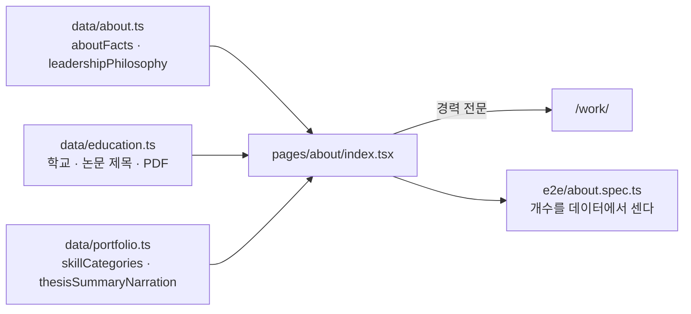

# T12 — `/about` 마감 기록

**계획서**: [`2026-08-25-redesign-phase-1-2.md` §Task 12](../plans/2026-08-25-redesign-phase-1-2.md) (L2167~2278)
**브랜치**: `feat/redesign-stage2`
**파이프라인**: **`/ted-run` 이 아니다.** 사용자가 「시작」으로 착수했고 컨트롤러가 직접 구현했다.
**리뷰 에이전트 0명** — T9·T10 은 2축, T11 은 3축이었다. 이 태스크에는 그 대조가 **없다**(§미확인).

`/about` 은 헤더 내비에 **마지막으로 남아 있던 이월 항목**이다. 이 커밋으로 `NAV_ABSENT` 가 비고,
계획서 §4 의 헤더 내비 명세(Work · Blog · About)가 처음으로 전부 실물이 된다.

---

## 산출물

| 파일 | 성격 |
| --- | --- |
| `pages/about/index.tsx` | **신규 169줄** — 문서형 페이지라 섹션을 컴포넌트로 쪼개지 않았다(계획서 산출물도 이 파일 하나) |
| `e2e/about.spec.ts` | **신규 10검사** — 계획서에 없다. T11 이 `work.spec.ts` 를 만든 것과 같은 근거(§R45) |
| `components/site-header.tsx` | `NAV` 에 `{ href: "/about/", label: "About" }` 1줄 + 주석 |
| `e2e/smoke.spec.ts` | 라우트·canonical 두 배열에 `/about/` 복귀 |
| `e2e/shell.spec.ts` | `About` 을 `NAV_ABSENT` → `NAV_PRESENT` · **전수 대조 추가**(§R46) · Tab 순환을 배열 길이에서 뽑도록(§R47) |



`data/about.ts`·`data/education.ts` 는 **T10 이 구 `index.tsx` 를 재작성할 때 소실을 막으려고 떼어 낸 것**이라
소비자가 이 페이지뿐이었다. 이 커밋 전까지 둘 다 리포 안에서 **어디에도 렌더되지 않았다.**

---

## Ruling R45 — 계획서의 경고와 계획서의 코드가 어긋날 때, **어긋남을 잡는 게이트가 하나도 없다**

계획서 T12 는 ⚠️ 표로 못 박아 두었다 — *「`data/portfolio.ts` 만 보면 **학교 이름 없는 학력 페이지**가 나온다」.*
그런데 **같은 절의 코드 조각이 정확히 그 페이지였다.** `education`·`aboutFacts`·`leadershipPhilosophy` 를
import 하고 **어디서도 렌더하지 않는다.** 학력 섹션이 렌더하는 것은 논문 **요약**뿐이라 학교명도 논문 제목도 없다.

실측(2026-08-28) — 그 상태를 재현해 게이트를 전부 돌렸다:

| 게이트 | 결과 |
| --- | --- |
| `npx tsc --noEmit` | **0** (통과) |
| `npm run lint` | **0** — `✔ No ESLint warnings or errors` |
| `npm run build` | **0**, `/about` 정상 생성 |

`next lint` 기본 구성에 미사용 import 규칙이 없다. 즉 **조각을 그대로 옮겼다면 세 게이트가 전부 초록인 채로
학교 이름 없는 페이지가 배포된다.** 계획서가 그 결과를 정확히 예언해 놓은 채로.

⇒ **계획서에 경고가 적혀 있다는 것은 그 경고가 지켜졌다는 증거가 아니다.** 경고와 코드가 같은 문서에 있으면
사람은 「읽었으니 됐다」로 넘어간다. 이 리포가 반복해 데인 「거짓 0」과 같은 계열이다 —
**말로 적힌 규칙은 자기가 지켜졌는지를 판정하지 못한다.** 그래서 `e2e/about.spec.ts` 를 만들었다.
계획서에 없는 산출물이지만, 그것이 없으면 이 경고를 **검사가 아니라 선의**가 지키게 된다.

---

## Ruling R46 — **목록의 마지막 항목을 옮기면, 그 목록을 도는 검사가 조용히 공허해진다**

`shell.spec.ts` 의 `NAV_ABSENT` 는 「내비에 없어야 할 이월 라우트」다. T12 가 마지막 항목 `About` 을
`NAV_PRESENT` 로 올리자 배열이 **빈 배열**이 됐고, 그것을 도는 `for` 는 **0회 실행**된다.

```ts
for (const label of NAV_ABSENT) {          // ← 0 회
  await expect(header.getByRole("link", { name: label, exact: true })).toHaveCount(0);
}
```

테스트는 초록이고 이름은 「미완성·이월 라우트는 내비에 없다」 그대로다. **아무것도 단정하지 않으면서.**
그 파일의 주석은 이 경우를 예상하지 못했다 — *「`ABSENT` 에서 `PRESENT` 로 **옮기기만** 하면 된다」*.
옮기기만 하면 되는 것이 맞지만, **마지막 하나일 때는 검사 하나가 같이 죽는다.**

대응은 목록을 억지로 채우는 것이 아니라 **전수 대조**다:

```ts
const rendered = (await nav.getByRole("link").allInnerTexts()).map((t) => t.trim()).sort();
expect(rendered).toEqual((onDrawer ? [...NAV_PRESENT, "EN"] : [...NAV_PRESENT]).sort());
```

열거한 것만 보는 검사는 **아무도 열거하지 않은 항목**을 못 본다. 전수 대조는 이월 목록이 비어도 의미가 남고,
「올리는 것을 잊은 채 남은 죽은 링크」까지 잡는다 — 원래 규칙이 막으려던 것이 바로 그것이다.

**뮤테이션 실측:** `NAV` 에서 `About` 을 지우자 이 검사가 사멸했다(4건 중 1건).

---

## Ruling R47 — 「글자가 다 있다」는 **문단 구분이 살아 있다**를 증명하지 않는다

논문 요약은 빈 줄로 나뉜 여러 문단짜리 **한 문자열**(`thesisSummaryNarration`)이다.
HTML 은 줄바꿈을 공백으로 접으므로 `whitespace-pre-line` 이 없으면 **글자는 전부 있는 벽 텍스트**가 된다.

**뮤테이션 실측 (2026-08-28):** 마크업에서 `whitespace-pre-line` 만 지웠다.

| 단정 | 결과 |
| --- | --- |
| `textContent` 로 원문 축자 대조 | **통과** — `textContent` 는 CSS 와 무관하게 `\n` 을 그대로 돌려준다 |
| `toHaveCSS("white-space", "pre-line")` | **실패** ← 이것만 잡았다 |

⇒ **텍스트 단정은 「보인다」를 재지 않는다.** `CLAUDE.md` 의 *「산출물에 문자열이 있다 ≠ 렌더됐다 ≠ 보인다」*
가 한 요소 안에서도 성립한다 — 같은 DOM 노드 안에서 「글자가 있다」와 「읽을 수 있게 배치됐다」가 갈린다.

부수적으로 같은 파일에서 하나 더 고쳤다. Tab 순환 검사가 **한 바퀴의 길이를 숫자로 적고 있었다**(`i < 8`).
T11 이 `7 → 8` 로 고쳤고 T12 가 또 `8 → 9` 를 만났다 — **두 번 반복되면 그것은 실수가 아니라 구조다.**
기대 배열 하나에서 길이를 뽑도록 바꿨다(`for (i < CYCLE.length)` · `toEqual([...CYCLE, CYCLE[0]])`).

---

## 계획서와 어긋난 것 — 의도적으로

| 계획서 | 실제 | 이유 |
| --- | --- | --- |
| 코드 조각의 「지금까지」 `<h2>` + 요약 문단 | `<h1>` 아래 리드 문단 + `aboutFacts` 3장 | 조각이 `aboutFacts` 를 렌더하지 않았다. 「전문 분야」는 리포 전체 **유일한 사본**이다 |
| 학력 = `thesisSummaryNarration` 한 문단 | 학교 · 논문 제목 · PDF 링크 + `<details>` 안의 요약 | §R45 |
| 산출물 = 페이지 1개 | + `e2e/about.spec.ts` | §R45 — 경고를 검사로 바꾼다 |
| (언급 없음) | `NAV` · `smoke.spec.ts` · `shell.spec.ts` | 계획서 Step 2 의 「E2E 전부 통과」가 이것 없이는 성립하지 않는다 |

**어투는 바꾸지 않았다.** 철학 3문단의 경어체(「~습니다」)는 구 `#about` 원문이고 `data/about.ts` 가
「한 글자도 바꾸지 않는다」로 보존한 것이다. 신규 섹션의 평서체와 다르지만, 고칠 곳은 페이지가 아니라
**데이터 한 곳**이다 — 페이지에 다시 쓴 사본을 만들면 두 벌이 되고 한 벌이 먼저 썩는다. **사용자 판단 대기.**

---

## 검증 실측

| 검사 | 명령 | 결과 |
| --- | --- | --- |
| 타입 | `npx tsc --noEmit` (파이프 없이) | 0 |
| 린트 | `npm run lint` | 0 |
| 빌드 | `npm run build` | 0 · `/about` 생성 |
| 단위 | `npm test` | 19파일 · 406건 통과 |
| E2E | `npm run e2e` | **154/154 · skip 0** (T11 마감 시 130) |
| 금칙어 | `check-forbidden:verify` → `check-forbidden` | 0 → HARD 0 |
| 발행본 수 | `check-counts:verify` → `check-counts` | 0 → 156편 / 6분류 |
| Pagefind | `check-pagefind:verify` → `check-pagefind` | 0 → ko 407건 |
| 산출물 body | `</head>` 이후에서 세 데이터의 문자열 10종 | 전부 1건 (중복 0) |
| 실물 | 브라우저로 `/about/` 을 열어 다크·라이트 · `<details>` 펼침 | 확인 |

**뮤테이션 — 배치 A·B·C 에서 9/9 사멸.** 검사기가 살아 있음을 먼저 증명했다.
배치 D 는 사멸을 재는 실험이 아니라 **반대 방향의 대조군**이다 — 「기존 게이트로는 안 잡힌다」를 증명한다.

| 배치 | 주입 | 사멸시킨 검사 |
| --- | --- | --- |
| A | `aboutFacts`·`skillCategories`·`leadershipPhilosophy`·`education` 을 각각 `slice` | 4건 (각 목록의 개수 대조가 정확히 하나씩) |
| B | `whitespace-pre-line` 제거 | 1건 (`toHaveCSS`만. 텍스트 대조는 통과 — §R47) |
| C | `NAV` 에서 `About` 제거 | 4건 (about 내비 · NAV 노출 · **전수 대조** · Tab 순환) |
| D | 계획서 조각 재현(import 만, 미렌더) | **게이트 0건** — tsc·lint·build 전부 통과(§R45) |

⚠️ **`npm run check-baseline` 은 빨갛다(15건).** 의도된 상태다 — T10·T11 이 이미 비블로그 산출물을
바꿨고, 기준선 갱신(`--update`)은 **T14 에서만** 한다(계획서). T12 가 더한 것은 `추가 about/index.html` 하나다.

---

## 다음 태스크에 넘기는 것

| 항목 | 넘기는 곳 |
| --- | --- |
| `FOCUS_RING` 이 7곳에 복붙돼 있다. `/about` 은 `components/work/focus-ring.ts` 를 **이름공간을 건너뛰어** import 했다 | 승격은 6개 파일 동시 수정이라 여전히 범위 밖. T14(고아 자산 정리)가 자연스러운 자리다 |
| `check-baseline` 15건 | **T14** — `--update` 는 거기서만 |
| 철학 3문단의 어투(경어체) | 사용자 판단. 고칠 곳은 `data/about.ts` 하나다 |

## 미확인으로 남는 것

- **리뷰 축이 0개였다.** T9·T10 은 2축, T11 은 3축이 서로를 잡았다. 이 태스크는 뮤테이션으로 **검사 유효성**만
  증명했고, **품질·접근성 축의 제3자 대조가 없다.** 특히 접근성은 `<details>`·`<dl>` 구조와 대비를
  사람이 본 적이 없다 — 스크린리더 실검증도 없다.
- **논문 요약 원문의 「주요 연구 내용」·「실험 결과」는 문단으로만 렌더된다.** 원문에서 소제목 역할을 하지만
  데이터가 평문 한 덩이라 마크업으로 구분할 근거가 없다. 고치려면 데이터 모양을 바꿔야 한다.
- **학력이 두 항목이 되는 날 논문 요약은 「어느 논문의 것인지」를 잃는다.** 목록 밖에 있기 때문이고,
  그때 고칠 곳은 마크업이 아니라 `data/education.ts` 의 모양이다(코드 주석에 남겼다).
