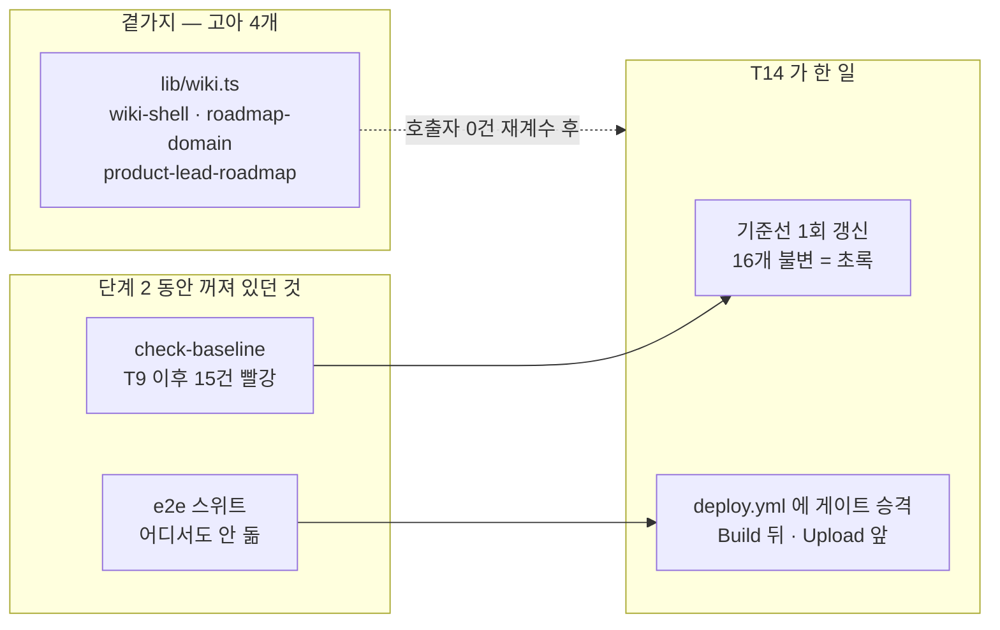
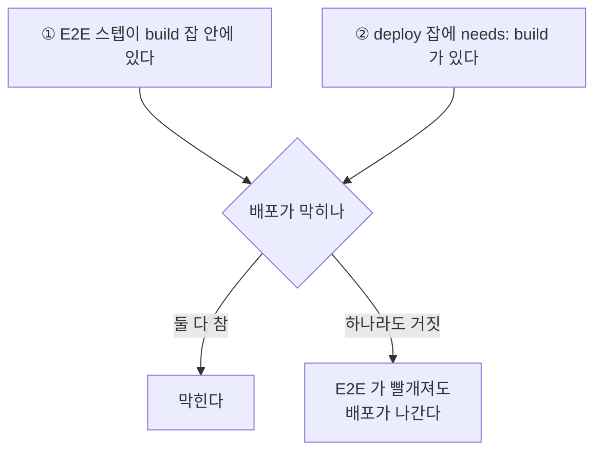

# T14 — 고아 자산 삭제 + 기준선 1회 갱신 + E2E 를 CI 게이트로

> 2026-08-28 · 브랜치 `feat/redesign-stage2` · `/ted-run` 풀 파이프라인 (종료 정책 = 커밋까지)
> 정본 계획서: [`plans/2026-08-25-redesign-phase-1-2.md` §Task 14](../plans/2026-08-25-redesign-phase-1-2.md)
> 선행 경위: [`t13-stubs.md` §R49](2026-08-28-t13-stubs.md) — T14 삭제 목록의 봉인된 결함

이 태스크는 **단계 2 동안 의도적으로 꺼 두었던 게이트 둘을 끝에서 한 번에 켜는 자리**다.
지운 것보다 켠 것이 중요하다.



---

## 만진 것

| 분류 | 파일 | 무엇 |
| --- | --- | --- |
| 삭제 | `lib/wiki.ts` · `components/wiki-shell.tsx` · `components/roadmap-domain.tsx` · `data/product-lead-roadmap.ts` | **4개.** 계획서의 5개가 아니다 — §R49 |
| **보존** | `data/product-lead-domains.ts` | 🔴 계획서 삭제 목록에 있었으나 `/work` 가 쓴다 |
| 주석 | `lib/toc.ts` · `pages/index.tsx` · `components/blog/blog-shell.tsx` · `data/product-lead-domains.ts` · `pages/product-lead-wiki/index.tsx` · `pages/product-lead-wiki/[slug].tsx` · `components/work/section-domains.tsx` | **7곳.** 지워진 파일을 가리키던 미래형 문장을 완료형으로 |
| CI | `.github/workflows/deploy.yml` | Playwright 설치 + E2E 를 `Scan built output` 뒤, `Upload artifact` 앞에 |
| 검사기 | `tests/ci/deploy-workflow.test.ts` (신규) | 위 게이트를 **YAML 파싱으로** 검사. 단언 5개 |
| 기준선 | `scripts/baseline.json` | 이번 배치 **딱 한 번**의 갱신. 16개 |
| 의존성 | `package.json` · `package-lock.json` | `js-yaml@4.3.2` · `@types/js-yaml` (devDependency) |

## 검증

| 관문 | 결과 |
| --- | --- |
| `npx tsc --noEmit` | 종료 0 |
| `npm run lint` | `✔ No ESLint warnings or errors` |
| `npm test` | **411 passed** / 20 파일 (406 → +5, 전부 신규 CI 검사) |
| `npm run build` | 종료 0 · Pagefind `Indexed 398 pages` |
| `check-forbidden:verify` → `:built` | `통과 15 / 실패 0` → `산출물 456개 파일 · HARD 0회` |
| `check-counts:verify` → `check-counts` | `14/14` → `156편 / 6개 카테고리` |
| `check-pagefind:verify` → `check-pagefind` | `자기검사 통과 — 12 건` → `ko 페이지 398 건 / 조각 398 건` |
| `npm run e2e` | **238 passed** · failed 0 · **skip 0** |
| 뮤테이션 (`deploy.yml`) | 7종 주입 · **7/7 사멸** · 생존 0 |
| `check-baseline` | 갱신 후 `✅ GC-6 — 비블로그 산출물 16개 불변` (종료 0) |

리뷰는 **두 축**(품질 · 검사 유효성). 품질 축이 HIGH 1 · MEDIUM 2 · LOW 2 를 냈고 전부 반영한 뒤
검사 유효성 축이 뮤테이션으로 PASS 를 냈다. T12 가 **리뷰 축 0개**로 지나간 것에 대한 교정이다.

---

## R55 — 🔴 계획서가 지목한 「원인」이 정규화기에 이미 막혀 있었다

계획서 §T14 Step 4 는 기준선 갱신 전에 눈으로 볼 것 셋을 정해 두고, 그중 하나에 경고를 달았다.

> ⚠️ **`en`과 `notion`의 해시가 바뀌었다면 의도치 않은 회귀다.** 갱신하지 말고 원인을 먼저 찾는다.
> 셸을 안 붙였는데 바뀔 이유는 **CSS 해시뿐**이므로, CSS 외의 차이가 있으면 문제다.

실제로 `en/index.html` 이 바뀌어 있었다. 그런데 **계획서가 제시한 이유는 성립할 수 없다** —
`scripts/check-baseline.mjs:175` 가 이미 그것을 지우고 있기 때문이다.

```js
text = text.replace(/[0-9a-f]{16}\.(css|js)/g, "<BUNDLE>.$1");
```

**CSS 해시는 이 검사에 도달하지 않는다.** 즉 경고문을 곧이곧대로 따르면 「CSS 해시가 원인이니 괜찮다」로
잘못 넘어가거나, 반대로 「CSS 가 아니니 회귀다」로 잘못 멈춘다. 둘 다 틀린다.

실제 원인은 둘이었고 **두 개 다 무해**했다.

| # | 원인 | 어떻게 확인했나 |
| --- | --- | --- |
| 1 | **`pages/_document.tsx` 가 T9 에서 바뀌었다** (Pretendard·나눔펜 서드파티 시트를 렌더 차단에서 제외). `_document` 는 모든 Next 렌더 페이지에 적용된다 | `git diff <기준선커밋>..HEAD -- pages/_document.tsx` → +64 |
| 2 | **webpack 청크 *번호*는 정규화되지 않는다** — `chunks/3361-<BUNDLE>.js` 의 `3361`. `/work`·`/about` 신설로 모듈 그래프가 바뀌며 재번호됐다 | `grep -o '/_next/static/[^"]*' out/en/index.html` |

`notion/index.html` 만 불변인 것이 이 설명의 대조군이다 — 그것은 **`public/notion/index.html`**,
즉 Next 를 거치지 않는 정적 파일이다. `_document` 가 원인이면 정확히 그것만 빠져야 하고, 실제로 그랬다.
**13 변경 + 2 추가 = 15, 빈틈이 없다.**

**교훈은 「계획서를 의심하라」가 아니다.** 계획서는 이 확인 절차를 만든 것만으로 제 일을 했다 —
경고가 없었으면 `en` 의 빨강을 보고도 그냥 눌렀을 것이다. 틀린 것은 **원인 후보를 하나로 못 박은 부분**이다.
`R49`(삭제 목록이 화석이 된다)와 같은 계열이고, 더 정확히는 **「경고했던 심볼이 아니라 다른 심볼에서 터진다」**
의 재발이다. 확인 절차는 남기되 **원인 후보는 열어 두어야 한다.**

### `--force` 를 붙이지 않았다

계획서는 `check-baseline:update -- --force` 를 지시했다. 붙이지 않았다.
`check-baseline.mjs:223` 을 보면 그 플래그가 뚫는 것은 **「파일 수가 줄었다」는 가드 하나뿐**이다.
이번 갱신은 15→16 으로 늘었으므로 가드가 걸릴 일이 없고, **처음부터 붙이면 그 가드가 무엇을 막았을지 영영 모른다.**
붙이지 않고 돌려 종료 0 을 받았다 — 그것이 「줄어든 것이 없다」의 증명이다.

---

## R56 — 🔴 뮤테이션 리뷰어와 일반 리뷰어를 **동시에 띄우면 안 된다**

품질 축과 검사 유효성 축을 한 메시지에 병렬로 띄웠다. **잘못이다.**
검사 유효성 축은 `deploy.yml` 에 뮤턴트를 **주입했다 복구하는** 작업이고, 품질 축은 **같은 파일을 읽는다.**
품질 축이 `npm run e2e || true` 를 읽는 순간 그것을 **진짜 결함으로 보고**한다.

첫 도구 호출 전에 중지시켜 실제 오염은 없었지만, 이것은 **운이지 설계가 아니다.**

| 리뷰 축 | 작업트리를 | 병렬 가능? |
| --- | --- | --- |
| 품질 · 접근성 · 보안 | **읽기만** 한다 | 서로 병렬 가능 |
| **검사 유효성(뮤테이션)** | **훼손했다 복구한다** | **단독으로만** |

축을 나누는 기준이 「관점」이라 전부 대등해 보이지만, **작업트리에 쓰는 축은 성질이 다르다.**

---

## R57 — 🔴 `git checkout --` 이 뮤테이션 복구 명령으로 안전한 것은 **커밋된 파일일 때뿐**이다

뮤테이션 브리프에 복구 명령으로 `git checkout -- .github/workflows/deploy.yml` 을 지시했다.
그런데 그 파일의 E2E 블록은 **아직 커밋되지 않은 변경**이었다. `git checkout --` 은 HEAD 로 되돌리므로
**뮤턴트와 함께 리뷰 대상 14줄을 통째로 지운다.** 리뷰어가 뮤턴트 2 주입 시 실제로 그 사고를 겪었고
(`grep -n "E2E"` 무출력, CR 130→116), pristine 사본 복사로 방식을 바꿔 복구했다.

**「원복」에 두 가지가 있다.** 뮤테이션이 원하는 것은 *뮤턴트 이전*이고, `git checkout` 이 주는 것은 *HEAD* 다.
작업이 커밋된 상태면 둘이 같아서 이 차이가 안 보인다 — **미커밋 상태에서만 갈라진다.**

```
# 안전: 주입 전에 사본을 뜬다
cp <파일> <파일>.pristine
# ... 주입 → 검사 → 복구
cp <파일>.pristine <파일>
```

CRLF 파일이면 사본 복사가 CR 보존까지 겸한다는 부수 이득도 있다(`sed -i` 금지의 우회).

---

## R58 — 문자열 grep 검사였다면 뮤턴트 2종이 **생존**했다

`tests/ci/deploy-workflow.test.ts` 는 `deploy.yml` 을 **`js-yaml` 로 파싱**해서 잡·스텝 배열을 본다.
문자열 grep 을 쓰지 않은 것이 실측으로 값을 했다.

| 뮤턴트 | 문자열 grep 이었다면 | 실제 (YAML 파싱) |
| --- | --- | --- |
| E2E 스텝 전체를 `#` 로 주석 처리 | **생존** — `deploy.yml:87` 한글 주석에 `` `npx playwright install chromium` `` 이 그대로 남아 있다 | 4건 red |
| `Install Playwright browser` 스텝 제거 | **생존** — 같은 주석이 문자열을 공급한다 | 2건 red |

반대 방향도 확인됐다. `grep -c 'continue-on-error' .github/workflows/deploy.yml` 은 **1** 을 반환하는데,
그것은 89번 줄의 **한글 경고 주석**이다. 문자열 검사였다면 여기서 **거짓 양성**이 났다.

**주석은 grep 에게 코드처럼 보이고 파서에게는 보이지 않는다.** 검사기의 측정 계층을 소비자에 맞추면
양방향이 동시에 해결된다 — `R51`(크롤러는 바이트를 읽는데 검사는 DOM 을 폴링했다)과 같은 원리다.

---

## R59 — 게이트의 힘은 **두 조건의 곱**인데 검사는 하나만 보고 있었다

품질 축이 잡은 HIGH. E2E 가 배포를 막는 힘은 다음 둘이 **함께** 성립할 때만 나온다.



최초 4개 단언은 ①만 검사했다. `deploy.yml:126` 의 `needs: build` 를 지우면 두 잡이 **병렬로** 돌아
E2E 실패와 무관하게 배포가 나가는데 **4건 전부 초록을 유지한다.**
`continue-on-error` 라는 작은 문은 잠그고 더 큰 문을 열어 둔 형태였다.

단언을 추가했고, 뮤턴트 6(`needs: build` 제거)이 이를 red 로 만드는 것을 실측했다.

**「게이트가 있다」는 명제는 대개 곱이다.** 하나의 조건만 검사하는 게이트 테스트는 그 자체가 게이트가 아니다.

---

## R60 — 공허하게 참인 단언은 **스텝 존재를 먼저 단언**해서 없앤다

`continue-on-error` 검사는 스텝을 넣기 **전에도 초록**이었다.
「`continue-on-error: true` 인 스텝이 하나도 없다」가 E2E 스텝이 없을 때도 참이기 때문이다.

품질 축은 이 단언을 **E2E·빌드 스텝으로 한정하라**고 제안했다(나중에 정당한 `continue-on-error` 를
붙여도 안 깨지게). **그 해법은 받지 않았다.** 좁히면 편의를 얻지만 이 리포는 그 편의를 위험으로 본다 —
`role: map` 이 「빨강을 초록으로 바꾸는 스위치가 아니라 그 글에 대한 주장」인 것과 같은 자리다.

대신 **스텝의 존재를 먼저 단언**해 공허함만 제거했다. 전역 검사는 유지된다.

```ts
const e2eStep = buildSteps.find((step) => step.run === "npm run e2e");
expect(e2eStep).toBeDefined();                       // ← 이 줄이 공허함을 없앤다
expect(e2eStep?.["continue-on-error"]).toBeUndefined();
```

**지적이 옳아도 해법은 틀릴 수 있다.** 여기서 옳았던 것은 「이 단언이 약하다」이고, 틀렸던 것은 「좁혀라」다.

---

## R61 — 지운 4개는 **애초에 검사되지 않고 있었다**

`npm test` 가 406 → 411 로 **늘기만 했다.** 코드를 4개 지웠는데 줄지 않았다면 둘 중 하나다 —
테스트가 함께 지워졌거나, **처음부터 없었거나.**

`git grep -c` 를 HEAD 의 `tests/`·`e2e/` 에 대해 `wiki-shell`·`roadmap-domain`·`product-lead-roadmap`·
`lib/wiki`·`RoadmapDomain`·`WikiShell`·`getWikiPage`·`wikiPages` **8종**으로 돌려 **전부 0건**.
커버리지가 준 것이 아니라 **없던 것이다.** +5 는 전부 신규 CI 검사다.

이 태스크의 결함은 아니지만 기록 가치가 있다 — **검사되지 않던 코드가 오래 살아남는다.**

---

## 다음 태스크에 넘기는 것

| 항목 | 상태 | 넘기는 곳 |
| --- | --- | --- |
| **`e2e/global-setup.ts:27-41` 의 `SOURCES` 12개 경로에 `package-lock.json` 과 `tsconfig.json` 이 없다** | 기존 이슈. 둘 다 `next build` 산출물을 바꾸는데 `out/` 무효화를 유발하지 못한다 | 사용자 판단. T14 가 이 가드를 **CI 게이트로 승격**시켰으므로 구멍의 값이 올라갔다 |
| `deploy.yml:113-114` 의 `check-baseline` 이 여전히 주석 처리돼 있다 | T9 이후 빨갛다는 이유로 껐던 것인데 **T14 가 초록으로 되돌렸다.** 끈 이유가 만료됐다 | 사용자 판단. 켜면 페이지를 의도적으로 바꿀 때마다 기준선 갱신이 배포 조건이 된다 |
| `FOCUS_RING` 이 7곳에 복붙, `/about` 이 `components/work/focus-ring.ts` 를 이름공간 건너뛰어 import | T12 가 T14 로 넘겼으나 **T14 범위 밖**(6개 파일 동시 수정) | 여전히 미해결 |
| `npm audit` 13건 (3 moderate · 10 high) | `picomatch` 등 전이 개발 의존. `js-yaml` 과 무관 | 기존 이슈 |
| **T15 — Lighthouse CI (경고로만)** | 미착수. 설정·워크플로 둘 다 없음 | **다음 태스크** |

## 미확인으로 남는 것

- **CI 에서 E2E 가 실제로 도는 것은 아직 관측되지 않았다.** 종료 정책이 「커밋까지」라 푸시하지 않았고,
  `deploy.yml` 은 `main` 푸시에서만 돈다. 두 리뷰 축이 각각 「`out/` mtime 가드는 걸리지 않는다」를
  실측으로 뒷받침했지만(스텝 사이 리포 쓰기 0건 · Playwright 산출물은 `SOURCES` 밖), **관측은 아니다.**
- 뮤테이션은 `deploy.yml` 에만 걸었다. 삭제된 4개 파일에 대한 뮤테이션은 대상이 없어(R61) 하지 않았다.
