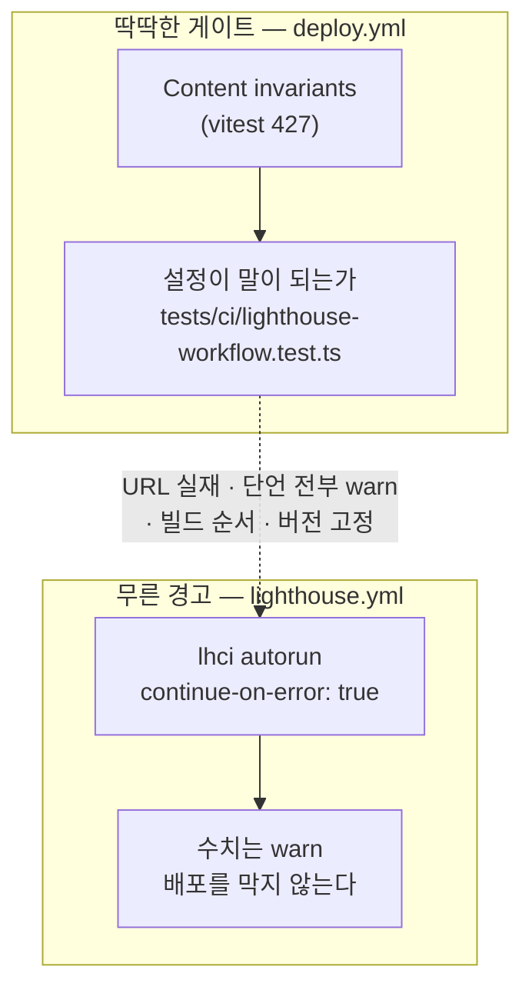

# T15 — Lighthouse CI, 경고로만

> 2026-08-28 · 브랜치 `feat/redesign-stage2` · 종료 정책 = **푸시까지**
> 정본 계획서: [`plans/2026-08-25-redesign-phase-1-2.md` §Task 15](../plans/2026-08-25-redesign-phase-1-2.md)
> 선행 경위: [`t14-orphans.md` §R58·§R60](2026-08-28-t14-orphans.md) — 문자열 grep 검사와 공허하게 참인 단언

이 태스크의 산출물은 **경고 하나뿐이다.** 배포를 막는 것이 없다.
그래서 이 문서의 요점은 라이트하우스가 아니라 **「아무것도 막지 않는 잡을 어떻게 검증하는가」**다.



**분리가 핵심이다.** 「경고로만 돈다」는 설계 결정은 **수치**에 대한 것이지 **설정**에 대한 것이 아니다.
수치는 무르게 두고, 설정이 말이 되는지는 배포 게이트 안에서 딱딱하게 막는다.

---

## 만진 것

| 파일 | 무엇 |
| --- | --- |
| `lighthouserc.json` **신규** | 측정 대상 5 URL · 단언 4종 **전부 `warn`** · `staticDistDir: ./out` |
| `.github/workflows/lighthouse.yml` **신규** | `pull_request` + `workflow_dispatch`. `deploy.yml` 을 건드리지 않는다 |
| `tests/ci/lighthouse-workflow.test.ts` **신규** | 단언 **16개**. 위 두 파일이 T15 의 주장을 지키는지 검사 |
| `.gitignore` | `/.lighthouseci/` 추가 |

`deploy.yml` 은 **한 글자도 바뀌지 않았다.** T14 가 붙인 E2E 게이트와
`tests/ci/deploy-workflow.test.ts` 의 단언 5개가 그대로다.

---

## 계획서에서 벗어난 것 4가지

계획서는 T13 → T14 에서 이미 한 번 화석으로 판명됐다([`t13-stubs.md` §R49](2026-08-28-t13-stubs.md)).
이번에도 **읽지 말고 다시 쟀다.**

| # | 계획서 | 실제 | 왜 |
| --- | --- | --- | --- |
| 1 | `upload.target: "temporary-public-storage"` | `filesystem` + Actions 아티팩트 | **공개 저장소에 리포트를 올린다.** 이 브랜치의 `/work`·`/about` 은 아직 `main` 에 없다 — 배포 전 화면을 외부에 먼저 공개하게 된다 |
| 2 | URL 4개 | **5개** (블로그 글 1편 추가) | 사용자 선택(핵심 5개 내외). 블로그 글 페이지는 220개인데 계획서 4개에 **한 편도 없었다** — 가장 무거운 라우트가 측정 밖이었다 |
| 3 | `actions/checkout@v4` · `setup-node@v4` | **`@v6`** | `deploy.yml` 과 맞췄다. 이 워크플로는 PR 에서만 돌아 로컬 실증이 불가능하므로 **실제 CI 에서 돌아 본 적 있는 버전**이 유일한 근거다 |
| 4 | (없음) | `tests/ci/lighthouse-workflow.test.ts` | 아래 §R62 |

---

## 검증

| 항목 | 명령 | 결과 |
| --- | --- | --- |
| 타입 | `npx tsc --noEmit` | 종료 0 |
| lint | `npm run lint` | 종료 0 · 경고 0 |
| 단위 | `npm test` | **427 통과** (T14 411 + 신규 16) |
| E2E | `npm run e2e` | **238/238 · skip 0** (첫 줄 확인 — 가드 거부 아님) |
| 검사 유효성 | 뮤테이션 11종 | **11/11 사멸** (1차 10/11 → §R62) |
| 실물 수치 | 로컬 Lighthouse 5 라우트 | 아래 표 |

### 계획서 Step 3 — 실측 수치

로컬(Windows · 모바일 에뮬레이션 기본값 · `serve out`) 1회 측정.
**CI(ubuntu · `numberOfRuns: 3`) 값과 다르다.** 비교 기준이 아니라 **자릿수 감각**으로만 쓴다.

| 라우트 | Performance | Accessibility | LCP | CLS |
| --- | --- | --- | --- | --- |
| `/` | 82 | 100 | 3864ms ⚠️ | 0.001 |
| `/work/` | 94 | 100 | 2878ms ⚠️ | 0.000 |
| `/about/` | 99 | 100 | 2108ms | 0.013 |
| `/blog/` | 87 | 100 | 3398ms ⚠️ | 0.025 |
| `/blog/agentic-coding/deploy-checklist-debugging/` | 68 ⚠️ | 96 | 3019ms ⚠️ | 0.227 ⚠️ |

예산: Performance ≥ 80 · Accessibility ≥ 95 · LCP ≤ 2500ms · CLS ≤ 0.100.

**이 표가 `warn` 을 정당화한다.** `error` 였다면 5개 중 **4개가 LCP 에서 즉시 빨갛다.**
「매번 배포가 막히면 게이트를 꺼 버린다」는 계획서의 문장은 가정이 아니라 이 표다.

⚠️ Accessibility 는 5개 전부 96~100 이다. T10~T12 가 접근성을 별도 리뷰 축으로 돌린 것의
**독립 증거**다 — 그 축이 없었다면 이 수치를 지금 처음 봤을 것이다.

---

## R62 — 🔴 YAML 파서까지 내려가도 **`run:` 블록 안의 셸 주석은 못 본다**

T14 의 §R58 은 문자열 grep 대신 **YAML 파싱**으로 검사하라는 교훈이었다.
그것을 그대로 따랐는데도 뮤턴트 하나가 **생존했다.**

```
생존 ❌   lhci autorun 을 주석으로
```

뮤턴트는 `run:` 블록의 `lhci autorun` 을 `# lhci autorun` 으로 바꾼 것이다.
YAML 파서에게 `run` 의 값은 **여러 줄짜리 문자열 하나**다. 셸 주석은 파서의 관심사가 아니므로
`step.run.includes("lhci autorun")` 은 **여전히 참**이다.

| 검사 층위 | 잡는 것 | 놓치는 것 |
| --- | --- | --- |
| 문자열 grep (T14 이전) | — | 주석 처리된 **스텝** |
| YAML 파싱 (T14 §R58) | 주석 처리된 스텝 | 주석 처리된 **명령 줄** |
| **셸 주석 제거 (여기)** | 둘 다 | (미확인) |

고친 방법은 파싱을 한 층 더 내리는 것이다 — `run` 을 줄로 쪼개고 `#` 이후를 잘라낸 뒤 검사한다.

```ts
function activeRunLines(step: WorkflowStep): string[] {
  if (typeof step.run !== "string") return [];
  return step.run
    .split("\n")
    .map((line) => line.replace(/#.*$/, "").trim())
    .filter(Boolean);
}
```

**교훈은 「셸 주석도 지워라」가 아니다.** 그건 이번에 걸린 층일 뿐이다.
진짜 교훈은 **검사기가 대상을 어느 층위에서 읽는지와, 실제로 그 대상을 실행하는 주체가
어느 층위에서 읽는지가 다르면 그 틈이 곧 거짓 초록**이라는 것이다.
GitHub Actions 는 YAML 을 파싱한 **뒤 `run` 을 셸에 넘긴다.** 검사기가 첫 단계에서 멈추면
두 번째 단계의 변경을 보지 못한다.

⚠️ 리뷰로는 이걸 못 봤을 것이다. 코드는 T14 의 교훈을 정확히 따른 것처럼 보인다.
**뮤테이션만이 「따른 것처럼 보이는 것」과 「실제로 잡는 것」을 구분했다.**

---

## R63 — 아무것도 막지 않는 잡은 **자기 자신이 망가진 것도 못 알린다**

`lighthouse.yml` 의 lhci 스텝은 `continue-on-error: true` 다. 그리고 `lighthouserc.json` 의
단언은 전부 `warn` 이다. 그 둘을 곱하면 이 잡은 **다음 상황에서 전부 초록이다.**

| 망가진 방식 | 잡의 색 |
| --- | --- |
| 측정 URL 이 전부 404 (글이 삭제·개명됨) | 🟢 초록 — LHCI 가 404 페이지의 **아주 좋은 점수**를 보고한다 |
| `lhci autorun` 이 실행되지 않음 | 🟢 초록 |
| 수집 0건 | 🟢 초록 |
| 단언이 0개 | 🟢 초록 |
| 누군가 `warn` 을 `error` 로 바꿈 | 🟢 초록 (그리고 PR 이 상시 빨개진다) |

`continue-on-error` 를 떼는 것은 답이 아니다 — 그러면 경고가 게이트가 되어 설계 결정이 뒤집힌다.
답은 **검사 대상을 옮기는 것**이다. 수치는 무르게 두고, **설정을 딱딱한 게이트 안에서** 본다.

`tests/ci/lighthouse-workflow.test.ts` 는 `deploy.yml` 의 `Content invariants` 단계에서 돈다.
즉 라이트하우스 설정이 망가지면 **라이트하우스 잡이 아니라 배포가 막힌다.**

특히 「측정 URL 이 실재하는가」는 `out/` 이 아니라 **소스**를 본다.
이 스위트는 `Build` 보다 **먼저** 돌기 때문이다 — `out/` 실재를 검사하면 CI 에서 늘 실패하고,
그러면 이 검사를 꺼 버리게 된다. CLAUDE.md 의 「지켜지지 않을 규칙은 규칙 전체를 죽인다」와 같은 계열이다.

---

## R64 — `lhci autorun` 이 이 환경(Windows)에서 죽는다. CI 는 무관하다

```
Runtime error encountered: EPERM, Permission denied:
  \\?\C:\Users\...\AppData\Local\Temp\lighthouse.13667800
    at Launcher.destroyTmp (chrome-launcher.js:367:9)
```

첫 URL 첫 회차에서 죽는다. 원인은 라이트하우스가 아니라 **chrome-launcher 의 임시 폴더 정리**이고,
스택이 보여주듯 **감사가 끝난 뒤** `kill()` → `destroyTmp()` 에서 난다.

| 봐야 할 것 | 실제 |
| --- | --- |
| 종료 코드 | 1 |
| 감사 완료 여부 | **완료됨** — 로그에 `Generating results...` 가 있다 |

그래서 수치를 얻는 방법은 **종료 코드가 아니라 파일 존재로 판정하는 것**이다.
`lighthouse --output-path=<파일>` 로 URL 마다 따로 돌리면 리포트가 남는다(위 표가 그 결과다).

⚠️ CI 는 ubuntu 이므로 이 문제는 나지 않는다. **하지만 그것을 실증할 수단이 지금 없다** — §미확인.

---

## 미확인으로 남는 것

| 무엇 | 왜 확인 못 했나 | 언제 드러나나 |
| --- | --- | --- |
| **`lighthouse.yml` 이 CI 에서 실제로 도는지** | 트리거가 `pull_request: [main]` 인데 이번 종료 정책은 **푸시까지**다. PR 을 열지 않았다 | `main` 대상 PR 을 처음 여는 순간 |
| `workflow_dispatch` 수동 실행 | 워크플로 파일이 **기본 브랜치에 있어야** Actions UI 에 뜬다. `main` 에 없다 | 머지 후 |
| `actions/upload-artifact@v7` 동작 | 위와 같음. 리포에 선례가 없는 버전이다 | 첫 PR |
| ubuntu 에서의 실제 수치 | 로컬 값은 Windows·1회 측정이다 | 첫 PR |

**이 4개는 전부 같은 하나다 — 「PR 을 열기 전까지 이 워크플로는 한 번도 돌지 않는다」.**
계획서 T14 Step 5 가 경고한 *「게이트를 만들어 놓고 아무 데서도 안 돌리는 상태」* 와 같은 모양이고,
차이는 이번엔 **그것을 알고 있다**는 것뿐이다.

완화책으로 넣은 것이 `tests/ci/lighthouse-workflow.test.ts` 다 — 워크플로가 돌지 않아도
**설정의 정합성만은 매 커밋 검사된다.** 실행 자체를 대신하지는 못한다.

---

## 다음 태스크에 넘기는 것

원계획 `2026-08-25-redesign-phase-1-2.md` 의 **T9~T15 가 전부 끝났다.**
남은 판단은 사용자에게 있다 — *"만들려고 했던 작업을 끝까지 마무리 지어보고 내가 다시 판단할께."*

| # | 무엇 | 상태 |
| --- | --- | --- |
| 1 | `main` 대상 PR — 위 §미확인 4건이 전부 여기서 닫힌다 | 사용자 판단 |
| 2 | `e2e/global-setup.ts` 의 `SOURCES` 에 `package-lock.json`·`tsconfig.json` 추가 | HANDOFF §2-3 부터 대기 중 |
| 3 | `deploy.yml` 의 `check-baseline` 주석 해제 | HANDOFF §2-3 부터 대기 중 |
| 4 | `/atlas` 재설계 — 엣지 1,053 중 156 만 그린다 | 실물을 보고 판단 |
