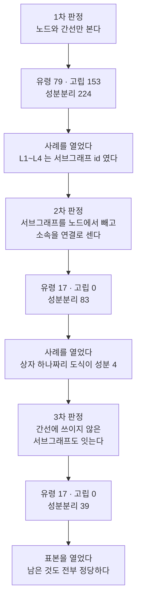

# 도식 의미 검사의 실태 조사 (2026-09-06)

> 대상: 리포 전체의 mermaid 블록 **663개**(발행본 544 · 리포 문서 119)
> ⚠️ **이 커밋 자신이 문서 도식을 둘 늘려 지금 리포에는 665개(문서 121)가 있다.**
> 아래의 663 은 조사를 돌린 시점의 값이며, 검사기가 내는 현재 수와 다른 것이 정상이다.
> 물음: 「도식의 **의미**를 기계가 판정할 수 있는가. 판정한다면 위반이 몇 건인가」
> 방법: 일회성 스크립트로 세었다. 판정은 정규식이 아니라 **화면을 그리는 mermaid 자신의
> `flowDb`** 가 세운 노드·간선 목록이 한다. 스크립트는 리포에 남기지 않았다.
>
> 🔴 **결론부터 — 검사기를 만들지 않는다.** 실측 위반이 0건이어서가 아니라,
> **판정을 세 번 고칠 때마다 위반의 78~100%가 사라졌기** 때문이다. 남은 것도 전부
> 정당한 도식 관용구였다.

---

## 1. 왜 검사기보다 조사가 먼저였나

`HANDOFF.md` 의 우선순위 5번이며, 사용자가 선택지 셋 중 「먼저 실태만 조사한다」를 골랐다.
근거는 이 리포가 `check-mermaid` 에서 이미 겪은 실패다.

> 위반이 나올 것을 전제로 검사기를 만들면, 0건이 나왔을 때 그것이 참인지
> 검사기가 헛도는 것인지 구분할 수 없다.

이번 조사는 그 반대 방향의 실패도 함께 보여 주었다. **위반이 쏟아졌을 때 그것이 참인지도
같은 방법으로는 알 수 없다.** 첫 판정은 위반 456건을 냈고 그중 참은 0건이었다.

---

## 2. 무엇을 세었나

발행본의 96%가 `flowchart` 한 종류이므로 이번 조사는 flowchart 만 보았다.

| 지표 | 정의 | 왜 결함 후보인가 |
| --- | --- | --- |
| **① 유령 노드** | 라벨을 붙여 선언한 적이 없이 간선에서만 생겨난 노드 | 간선의 노드 id 에 오타가 나면 mermaid 는 오류를 내지 않고 **그 id 를 라벨로 쓴 상자를 만든다.** 문법 검사를 통과하고 화면에만 어긋난다 |
| **② 고립 노드** | 어느 간선에도 닿지 않는 노드 | 선언해 놓고 잇지 않았다 |
| **③ 성분 분리** | 무향으로 보아 연결 성분이 둘 이상 | 흐름이 끊겨 있다 |

「화살표 방향이 본문과 맞는가」처럼 사람만 판정할 수 있는 것은 애초에 대상이 아니다.
그쪽은 `PUBLISHING-CHECKLIST.md` §5 에 남는다.

---

## 3. 판정을 세 번 고쳤다 — 이것이 이 조사의 본론이다



### 1차 → 2차 — 서브그래프는 노드가 아니고, 소속은 연결이다

`ai-agent-knowledge-map.md:19` 을 열어 보고 알았다.

```text
flowchart TD
    subgraph L1["① 기초 — 왜 에이전트인가"]
        A["에이전트 개론 2편"]
    end
    subgraph L2["② 실행 모델 — LangGraph"]
        D["State·Tool·체크포인터 3편"]
    end
    L1 --> L2
```

mermaid 는 `L1 --> L2` 를 만나면 **`L1` 을 `vertices` 에도 넣는다.** 그러나 화면에 그려지는
라벨은 서브그래프 선언의 title 이다. 이것을 노드로 세면 「라벨 없는 유령」 넷이 올라온다.

같은 도식에서 `A`·`D` 는 어느 간선에도 닿지 않는다. 그러나 화면에서는 상자 안에 묶여 있어
떨어져 나와 보이지 않는다. **서브그래프 소속은 시각적으로 연결이다.**

이 둘을 반영하자 고립이 **153건에서 0건**이 되었다.

### 2차 → 3차 — 간선에 쓰이지 않은 서브그래프는 `vertices` 에 없다

`llm-app-bottleneck-shift.md:154` 는 상자가 둘뿐인데 성분 4 로 세어졌다.

원인은 union-find 의 초기화였다. 서브그래프가 간선에 쓰이지 않으면 `vertices` 에 들어오지
않는데, 그 id 를 부모 배열에 넣지 않았으므로 **소속 연결이 통째로 건너뛰어졌다.**

🔴 **자기 검사 케이스가 이것을 놓쳤다.** 「서브그래프 안의 노드는 고립이 아니다」라는
케이스는 `isolated` 만 보고 `components` 를 보지 않았고, 「서브그래프끼리 이으면 한
성분이다」라는 케이스는 서브그래프가 간선에 쓰인 경우여서 `vertices` 에 들어 있었다.
**두 케이스 모두 결함이 있는 판정에서도 통과했다.**

그래서 케이스를 하나 더 세우고, 고친 코드를 **옛 판으로 되돌려 그 케이스가 실제로 FAIL
하는지** 확인했다. 되돌린 판에서 10/11 이 나왔다. 통과만 보고는 케이스가 헛도는지 알 수 없다.

---

## 4. 결과 — 수치

### 대상과 판정 도달

| 항목 | 값 |
| --- | ---: |
| 대상 markdown 파일 | 242 |
| mermaid 블록 | **663** |
| 판정 도달 | **663** (파싱 실패 0) |
| 그중 flowchart | **607** |
| flowchart 의 노드 | 4,544 |
| flowchart 의 간선 | 4,154 |

판정 도달 수가 대상 수와 같으므로 아래의 0 은 결론이 된다.

🔴 **「보지 못한 것」과 「볼 대상이 아닌 것」은 다른 수다.** 처음에는 종류를 확인하기 전에
노드 목록을 부르는 바람에 `sequenceDiagram` 등 **56개가 「파싱 실패」로 집계되었다.**
전부 정상이었고 종류가 다를 뿐이었다. 종류를 먼저 읽도록 순서를 바꾸어 실패 0 으로 맞췄다.

### 종류 분포

| 종류 | 전체 | 발행본 | 리포 문서 |
| --- | ---: | ---: | ---: |
| `flowchart` | **607** | 522 | 85 |
| `sequence` | 23 | 14 | 9 |
| `stateDiagram` | 16 | 8 | 8 |
| `gantt` | 5 | 0 | 5 |
| `er` | 4 | 0 | 4 |
| `journey` | 4 | 0 | 4 |
| `quadrantChart` | 3 | 0 | 3 |
| `mindmap` | 1 | 0 | 1 |
| **합** | **663** | **544** | **119** |

합이 발행본 544 · 문서 119 로 `CLAUDE.md` 의 블록 수와 맞는다. **발행본에는 종류가 셋뿐이고,
나머지 다섯 종류는 리포 문서에만 있다** — 발행본 기준의 기존 분포표는 정확했다.

### 지표별 위반 — 판정 판마다

| 지표 | 1차 | 2차 | 3차 (최종) | 거짓 양성 비율 |
| --- | ---: | ---: | ---: | ---: |
| ① 유령 노드 | 79 | 17 | **17** | 78% |
| ② 고립 노드 | 153 | 0 | **0** | **100%** |
| ③ 성분 분리 | 224 | 83 | **39** | 83% |
| 합 | 456 | 100 | **56** | 88% |

최종 판정에서 남은 56건의 범위별 분포는 아래와 같다.

| 지표 | 발행본 (도식) | 리포 문서 (도식) |
| --- | ---: | ---: |
| ① 유령 노드 | 4 | 0 |
| ② 고립 노드 | 0 | 0 |
| ③ 성분 분리 | 27 | 6 |

---

## 5. 남은 56건도 전부 정당했다

### ① 유령 노드 17건 — LangGraph 의 노드 이름이다

네 도식 전부가 LangGraph 그래프를 그린 것이며, `retrieve`·`generate`·`grade_documents`·
`transform_query` 는 **코드에 실제로 있는 노드 이름**이다.

```text
flowchart LR
    S([START]) --> retrieve --> grade_documents
    grade_documents -- "관련 문서 있음 · generate" --> generate
    grade_documents -- "전부 탈락 · transform_query" --> transform_query
```

라벨을 따로 붙이지 않으면 mermaid 는 id 를 그대로 그린다. 코드의 이름과 화면의 이름이
일치하므로 **라벨을 붙이는 쪽이 오히려 부정확하다.**

🔴 그래서 이 지표는 기계가 판정할 수 없다. 「라벨 없는 노드」를 세는 것까지가 기계의 몫이고,
그것이 **오타인지 의도인지는 세는 것으로 갈리지 않는다.**

### ② 고립 노드 0건

서브그래프 소속을 연결로 세면 남는 것이 없다. 발행본 522개 · 리포 문서 85개 전량에서 0 이다.

### ③ 성분 분리 39건 — 비교 도식이다

표본 여덟을 열었고 전부 「나란히 놓고 비교한다」는 목적이 분명했다.

| 도식 | 성분 | 무엇을 나란히 두었나 |
| --- | ---: | --- |
| `realtime-transport-and-websocket.md:132` | 3 | 폴링 · 롱폴링 · 스트리밍 |
| `replication-topologies-and-lag.md:45` | 3 | 단일리더 · 다중리더 · 리더리스 |
| `agent-vs-chatbot.md:87` | 2 | 챗봇 · 에이전트 |
| `dev-org-transfer.md:132` | 3 | 선별형 · 게이트형 · 승격형 |
| `deploy-checklist-debugging.md:68` | 2 | 배포 흐름 · 정기 점검 |
| `01_CMS.md:1017` | 8 | 빌드 · 바이 |
| `2026-08-18-rule-triage.md:82` | 10 | 원본 파일 11개 → 커밋 매핑 |
| `llm-app-bottleneck-shift.md:154` | 2 | 해결된 것 · 남은 것 |

**병렬 나열은 flowchart 의 정당한 관용구다.** 성분이 하나여야 한다는 전제 자체가 틀렸다.

---

## 6. 「기계가 판정할 몫」을 다시 나눈다

착수 전 예상과 실측이 갈렸다. 아래가 실측 뒤의 분류다.

| 판정 | 착수 전 | 실측 뒤 | 근거 |
| --- | :---: | :---: | --- |
| 유령 노드 | ✅ 기계 | ❌ **사람** | 라벨 없는 노드를 세는 것까지가 기계다. 오타인지 의도인지는 세어서 갈리지 않는다 (실측 17/17 이 의도) |
| 고립 노드 | ✅ 기계 | ✅ 기계 · **위반 0** | 서브그래프 소속을 연결로 세야 한다. 그러면 전량 0 이다 |
| 도달 불가 · 성분 분리 | ✅ 기계 | ❌ **지표 아님** | 병렬 나열이 정당하므로 결함 신호가 되지 않는다 (실측 39/39 가 의도) |
| 본문에 없는 라벨 | ⚠️ 후보 | ⚠️ 후보 | 이번 조사에서는 세지 않았다 |
| 화살표 방향 · 라벨의 정확성 | ❌ 사람 | ❌ 사람 | 그대로다 |

---

## 7. 결론과 다음

**검사기를 만들지 않는다.** 세 지표 중 하나만 위반 0 을 낼 수 있고, 나머지 둘은 위반을
세더라도 그 수가 결함을 뜻하지 않는다. **검사기가 없어서 못 잡는 것이 아니라, 잡을 것이 없다.**

고립 노드 하나만을 위한 검사기를 두는 선택지는 남는다. 다만 값어치를 따져야 한다.

| 선택지 | 얻는 것 | 잃는 것 |
| --- | --- | --- |
| 만들지 않는다 (택함) | 검사기 열 종 · 훅 9단을 그대로 둔다 | 새로 쓰는 도식이 고립 노드를 들일 때 아무도 못 본다 |
| 고립 노드만 검사기로 | 위반 0 인 상태를 고정한다 | 검사 한 종 · 뮤턴트 · 훅 단계가 늘고, **정당한 서브그래프 용법을 계속 예외 처리해야 한다** |

이번 조사에서 판정을 세 번 고쳤다는 사실이 후자의 비용을 말해 준다. **서브그래프 용법 하나를
빠뜨릴 때마다 거짓 양성이 100건 단위로 나온다.**

### 이 조사가 보지 않은 것

| 대상 | 수 | 왜 빠졌나 |
| --- | ---: | --- |
| `sequenceDiagram` | 23 | 참여자와 메시지 구조가 flowchart 와 다르다. 별도 판정이 필요하다 |
| `stateDiagram` | 16 | 같다 |
| `gantt` · `er` · `journey` · `quadrantChart` · `mindmap` | 17 | 전부 리포 문서에만 있다 |
| 라벨이 본문과 어긋나는가 | — | 사람 판단이다 |

---

## 부록 — 재현 방법

스크립트는 리포에 남기지 않았다. 다시 세려면 아래를 그대로 만들면 된다.

| 단계 | 무엇 |
| ---: | --- |
| 1 | `check-mermaid.mjs` 의 `installDom()` 을 먼저 부른다. 순서가 뒤바뀌면 파싱에 닿지 못한다 |
| 2 | **`mermaid.parse()` 를 한 번 부른다.** 이것이 다이어그램 종류를 등록한다. 없으면 `getDiagramFromText` 가 정상 도식에도 「종류를 찾지 못했다」로 죽는다 |
| 3 | `getDiagramFromText(source)` → `diagram.type` 을 **먼저** 읽는다 |
| 4 | flowchart 일 때만 `db.getVertices()` · `db.getEdges()` · `db.getSubGraphs()` 를 부른다 |
| 5 | 서브그래프 id 를 노드에서 빼고, 소속을 연결로 세고, **간선에 쓰이지 않은 서브그래프 id 도** 부모 배열에 넣는다 |
| 6 | 자기 검사에 「되돌리면 FAIL 하는가」를 확인한다 |

관련 문서는 [`CLAUDE.md`](../../../CLAUDE.md) 의 「이 환경의 도구 함정」과
[`docs/TOOL-TRAPS.md`](../../TOOL-TRAPS.md) 다.
