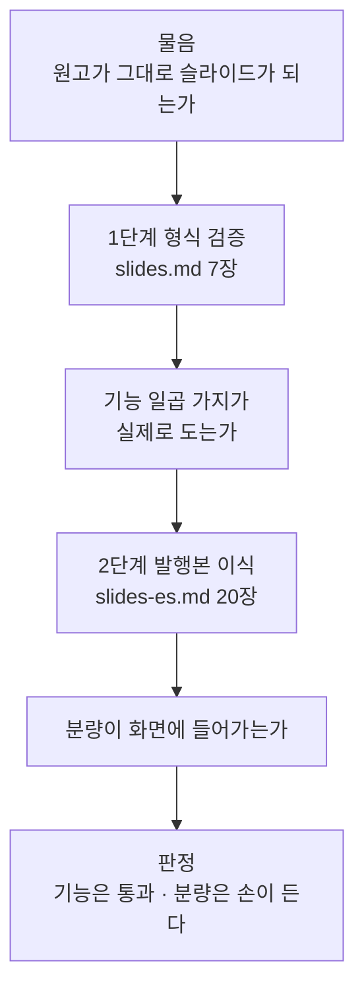
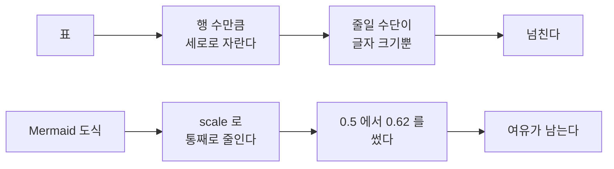
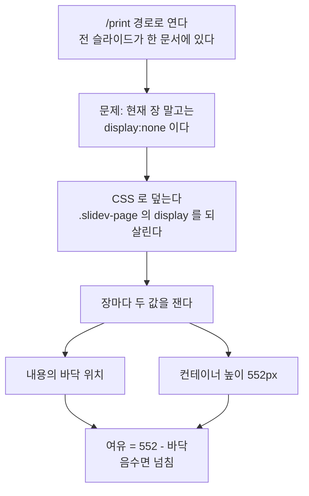

# 마크다운 원고를 발표 슬라이드로 옮길 수 있는가 (2026-09-06)

> 대상: `slidev-poc/` · Slidev **52.19.1** · 형식 검증용 `slides.md` **7장** · 발행본 이식본 `slides-es.md` **20장**
> 물음: 「이 리포가 이미 가지고 있는 마크다운 발행본을 발표 슬라이드로 옮길 수 있는가. 옮기면 무엇이 깨지는가」
> 방법: 문서를 읽어 정리하지 않았다. **설치하고, 빌드하고, 브라우저로 열고, PDF 로 내보냈다.**
> 이식 대상은 [`content/blog/search-engineering/elasticsearch-architecture.md`](../../../content/blog/search-engineering/elasticsearch-architecture.md) 한 편이다.
>
> 🔴 **결론부터.** 기능은 일곱 가지가 전부 동작한다. 깨지는 것은 기능이 아니라 **분량과 링크**다.
> 넘친 슬라이드 네 장은 모두 표가 있는 장이었고, 도식이 있는 장은 하나도 넘치지 않았다.

---

## 1. 왜 형식부터 검증했나

이 리포의 발행본은 이미 마크다운이고 도식도 이미 Mermaid 다. 그러므로 물음은
「슬라이드 도구를 고를 수 있는가」가 아니라 **가지고 있는 원고가 그대로 슬라이드가 되는가**였다.
그 물음은 문서를 읽어서는 답이 나오지 않는다. 도구의 문서는 기능이 있다고 말할 뿐,
**한국어 표 여덟 행이 552px 안에 들어가는지**는 말해 주지 않기 때문이다.



두 단계를 나눈 이유는 실패의 원인을 가르기 위해서다. 발행본을 바로 옮겼다가 깨지면
그것이 도구의 한계인지 원고의 분량 문제인지 구분할 수 없다.

---

## 2. 1단계 형식 검증

### 2.1 설치 — 자동 설치 단계가 깨진다

`npm create slidev@latest` 는 두 가지 일을 잇달아 한다. 파일을 만드는 **스캐폴딩**과,
그 뒤에 이어지는 **의존성 자동 설치**다. 이 환경에서는 앞은 성공하고 뒤가 `TypeError` 로 죽었다.

증거가 생성된 파일에 그대로 남았다. `slidev-poc/README.md` 의 실행 안내가 이렇게 적혀 있다.

```text
- `[object Object] install`
- `[object Object] run dev`
```

패키지 매니저 이름이 들어갈 자리에 객체가 문자열로 변환되어 박혔다. 스캐폴더가 패키지
매니저를 판별한 결과를 문자열이 아닌 객체로 넘겼고, 같은 값이 자동 설치 단계에서
`TypeError` 를 낸 것으로 보인다.

**대응은 간단하다.** 스캐폴딩 결과를 지우지 말고 그 디렉터리에서 `npm install` 만 따로 돌린다.
파일은 이미 다 만들어져 있으므로 잃는 것이 없다.

| 단계 | 결과 | 조치 |
| --- | --- | --- |
| 스캐폴딩 (파일 생성) | 성공 | 그대로 둔다 |
| 자동 의존성 설치 | `TypeError` | `npm install` 을 직접 돌린다 |
| 생성된 `README.md` | `[object Object]` 가 박혀 있다 | 손으로 고치거나 무시한다 |

### 2.2 빌드 산출물 — `index.html` 은 1,707바이트 껍데기다

`slidev build` 가 만든 `dist/index.html` 은 **1,707 B** 이고, `<body>` 의 알맹이는 이것이 전부다.

```html
<body>
  <div id="app"></div>
  <div id="mermaid-rendering-container"></div>
</body>
```

슬라이드 본문은 하나도 들어 있지 않다. 실측으로 대조했다.

| 대상 | 크기 | 본문 낱말(`Mermaid flowchart` 등) |
| --- | ---: | ---: |
| `dist/index.html` | 1,707 B | **0회** |
| `dist/assets/` (JS·CSS 번들) | 약 4,476 KB | 있다 |

🔴 **그런데 `<title>` 에는 슬라이드 제목이 들어 있다.** `<title>마크다운으로 쓰는 HTML 슬라이드 - Slidev</title>`
가 그것이다. 제목만 보고 「본문이 렌더됐다」고 판단하면 틀린다.

⇒ **파일이 존재한다는 것도, 산출물에서 문자열이 잡힌다는 것도 렌더의 증거가 아니다.**
이 리포가 Next.js 정적 export 에서 이미 겪은 것과 같은 구조이며, 이번에 사례가 하나 더 늘었다.
렌더를 증명하려면 브라우저로 열어 화면을 봐야 한다.

### 2.3 GitHub Pages 하위 경로에는 `--base` 가 필요하다

빌드 산출물의 자산 참조가 전부 **루트 절대 경로**다.

```html
<script type="module" crossorigin src="/assets/index-J4J5hg5a.js"></script>
<link rel="stylesheet" crossorigin href="/assets/index-CnuTbjvU.css">
```

GitHub Pages 의 프로젝트 페이지는 `https://<사용자>.github.io/<리포>/` 라는 하위 경로에 놓인다.
그 아래에서 `/assets/…` 는 리포가 아니라 **도메인 루트**를 가리키므로 전부 404 가 된다.
화면에는 빈 페이지가 뜨고, 빌드는 성공했으므로 아무 오류도 남지 않는다.

`@slidev/cli` 의 `build` 명령에 그 옵션이 있다. 도움말 문구는 `output base. Example: /demo/` 다.

```bash
slidev build slides.md --base /withwooyong.github.io/
```

같은 옵션이 `dev` 명령에도 있으므로(`base URL. Example: /demo/`), 배포 경로를 개발 중에도
그대로 재현할 수 있다.

### 2.4 화면 기능 다섯 가지가 모두 동작한다

`slides.md` 7장은 기능마다 한 장씩을 할당해 만들었다. 다섯 가지가 전부 동작했다.

| 기능 | 어떻게 쓰나 | 확인한 것 |
| --- | --- | --- |
| **단계적 등장** | 요소에 `v-click` 을 붙인다 | 카드 여섯 개가 방향키마다 하나씩 나타난다 |
| **Mermaid 도식** | 코드 블록 언어를 `mermaid` 로 | `flowchart` 가 그려진다. `{theme: 'dark', scale: 0.62}` 로 크기를 조절한다 |
| **두 단 배치** | frontmatter 에 `layout: two-cols`, 오른쪽 단은 `::right::` 뒤 | 화면이 둘로 갈린다. 간격은 `layoutClass: gap-8` |
| **코드 하이라이트 이동** | 코드 펜스 뒤에 `{1|3-6|8-10|*}` | 방향키마다 강조 구간이 옮겨 간다. `{lines:true}` 로 줄 번호 |
| **발표자 노트** | 슬라이드 끝에 HTML 주석 | `/presenter/` 화면에 보인다 |

🔴 **발표자 노트는 「보인다」만으로는 검증이 아니다.** 노트의 요건은 발표자에게 보이는 것이
아니라 **청중에게 보이지 않는 것**이기 때문이다. 그래서 두 화면을 대조했다.
`/presenter/` 에 노트 문장이 있고, 같은 장의 일반 화면에는 없다는 것을 함께 확인했다.
한쪽만 보았다면 「노트가 본문으로 새어 나오는」 실패를 통과시켰을 것이다.

### 2.5 PDF 내보내기 — 세 가지를 따로 챙겨야 한다

`slidev export` 는 기본값 세 개가 모두 발표용으로 쓰기에 어긋난다.

| 항목 | 기본값 | 원하는 것 | 플래그 |
| --- | --- | --- | --- |
| 클릭 단계 | 버린다 (7장 원고 → **7페이지**) | 펼친다 (**18페이지**) | `--with-clicks` (별칭 `-c`) |
| 색 | 밝은 테마 | 화면과 같은 어두운 테마 | `--dark` |
| 브라우저 | 없다 | Chromium 필요 | `npm i -D playwright-chromium` |

**클릭 단계를 버린다는 것의 의미**는 이렇다. `v-click` 으로 하나씩 등장하도록 만든 카드
여섯 개가, 기본 export 에서는 「전부 나타난 최종 상태」 한 페이지로 합쳐진다. 발표 자료로는
그것이 맞을 때도 있지만, 단계를 설명 자료로 남기려면 `--with-clicks` 가 필요하다.
7페이지와 18페이지의 차이가 곧 클릭 단계의 수다.

**색이 화면과 달라지는 것은 테마 문제가 아니라 export 의 동작이다.** export 코드가
브라우저의 `colorScheme` 을 직접 지정한다.

```js
colorScheme: dark ? "dark" : "light",
```

`--dark` 를 주지 않으면 이 값이 `"light"` 로 고정되므로, 화면에서 어둡게 보이던 슬라이드가
PDF 에서는 밝게 나온다. 원고의 frontmatter 에 `colorSchema: dark` 를 적어 두면 플래그
없이도 어둡게 나오지만(`dark || options.data.config.colorSchema === "dark"`),
이번 검증에서는 플래그로 처리했다.

**Playwright 는 별도 설치다.** 없으면 export 자체가 이 문구로 죽는다.

```text
The exporting for Slidev is powered by Playwright,
please install it via `npm i -D playwright-chromium`
```

`playwright-chromium` 은 `slidev` 의 의존성에 들어 있지 않으므로 `devDependencies` 에
직접 넣어야 한다. `slidev-poc/package.json` 에 그렇게 두었다.

---

## 3. 2단계 발행본 이식 — 분량이 진짜 문제다

### 3.1 무엇을 옮겼나

| 항목 | 값 |
| --- | ---: |
| 원문 | `elasticsearch-architecture.md` · **15,082 B** |
| 원문의 절 (`##`) | **11개** |
| 만들어진 슬라이드 | **20장** |
| 슬라이드 높이 | **552px** 고정 |

절 11개가 슬라이드 20장이 된 이유는, 한 절이 화면 하나에 들어가지 않기 때문이다.
예를 들어 「라우팅」 절은 규칙과 대가 표를 담은 장, 그리고 결론 한 문장을 크게 띄운
`layout: center` 장으로 나뉘었다.

**552px 은 임의로 정한 값이 아니라 Slidev 의 기본 캔버스에서 나온다.** 기본 폭이 980px 이고
기본 화면비가 16:9 이므로 `980 ÷ (16/9) = 551.25` 이며, 실제 화면에서 552px 로 잡힌다.
이 값이 고정이라는 점이 이식의 모든 제약을 만든다. **원고는 세로로 얼마든지 길어질 수 있지만
슬라이드는 그럴 수 없다.**

### 3.2 넘친 네 장은 전부 표가 있는 장이었다

첫 이식 시도에서 20장 중 4장이 넘쳤다.

| 구분 | 넘친 장 | 여유 |
| --- | ---: | --- |
| **표가 있는 장** | 4장 | **-91px · -45px · -18px · -10px** |
| **도식이 있는 장** | 0장 | 139px 에서 245px 이 남았다 |

이 대조가 이 조사에서 가장 쓸모 있는 결과다. **도식은 넘치지 않고 표만 넘친다.**
기전은 두 자료의 크기 조절 수단이 다르다는 데 있다.



도식 장에는 `{theme: 'dark', scale: 0.5}` 처럼 배율을 적었고, 실제로 쓴 값은 0.5 · 0.52 ·
0.55 · 0.62 였다. 배율 하나로 도식 전체가 줄어들기 때문에 넘칠 일이 없다.
표에는 그런 손잡이가 없다.

⚠️ **위의 네 값은 교정 전 원고에서 잰 것이며 다시 재현할 수 없다.** 교정 전 `slides-es.md` 는
커밋되지 않았기 때문이다. 지금 리포에 있는 파일을 재면 20장 모두 통과가 나온다.

### 3.3 어떻게 고쳤나 — 네 가지

| 방법 | 무엇을 하나 | 잃는 것 |
| --- | --- | --- |
| `class: text-sm` | 그 장의 글자 크기만 줄인다 | 없다. 가장 먼저 시도할 것 |
| `layout: two-cols` | 표를 왼쪽에, 해설을 오른쪽에 나눈다 | 없다. 세로가 가로로 바뀐다 |
| **되짚는 문장 삭제** | 앞 절을 다시 가리키는 문장을 뺀다 | 원고의 연결. 슬라이드는 앞 장이 화면에 없으므로 손실이 작다 |
| **문단 삭제** | 부연 설명 문단을 통째로 뺀다 | 내용. 마지막 수단이다 |

앞의 둘은 원고를 건드리지 않고 배치만 바꾸므로 먼저 쓴다. 실제로 「용어 정리」 장에는
`class: text-sm` 을, 「RDB 와 Elasticsearch 대응」 장에는 `layout: two-cols` 를 적용했다.

뒤의 둘은 내용을 지운다. **다만 「되짚는 문장 삭제」의 손실은 생각보다 작다.**
원문에는 「위의 샤드 수 기준이 여기서 다시 걸린다」처럼 앞 절을 되짚는 문장이 있는데,
읽는 사람은 위로 스크롤할 수 있지만 듣는 사람은 앞 장으로 돌아갈 수 없다.
글에서 연결을 만들던 문장이 슬라이드에서는 연결을 만들지 못한다.

**교정 뒤 20장이 모두 통과했다.**

### 3.4 넘침을 어떻게 판정했나

눈으로 넘겨 보면서 세지 않았다. 그렇게 하면 20장을 방향키로 넘기며 「넘친 것 같다」를
판단해야 하고, 여유가 10px 인 장은 사람 눈으로 가려지지 않는다.



`/print` 경로는 전 슬라이드를 한 문서에 담지만, `.slidev-page` 에 `display: none` 이 걸려
현재 장 말고는 레이아웃이 계산되지 않는다. **계산되지 않은 요소는 높이가 0 으로 나오므로
그대로 재면 「전부 통과」라는 거짓 초록이 나온다.** 그래서 CSS 로 그 선언을 덮어 전 슬라이드를
펼친 뒤에 쟀다. 판정은 장마다 「내용의 바닥 위치」와 「컨테이너 높이」 두 값의 차다.

### 3.5 편간 링크는 옮겨지지 않는다

원문에는 다른 편을 가리키는 링크가 두 개 있다.

| 원문 위치 | 가리키는 곳 |
| --- | --- |
| NRT 설명 (118행) | `/blog/search-engineering/elasticsearch-operations/` |
| Deep pagination (187행) | 같은 편 |

**슬라이드에는 0개가 남았다.** 실측으로 `](/blog/` 패턴이 `slides-es.md` 에서 0회다.
링크만 지운 것이 아니라 「…은 다른 편에서 다룬다」라는 안내 절 자체를 뺐다.

이유는 슬라이드가 발표 중에 소비되는 형식이기 때문이다. 발표 중에 링크를 눌러 다른 문서로
떠나는 사람은 없고, PDF 로 내보내면 상대 경로가 애초에 열리지 않는다.
**연재물의 연결 구조는 슬라이드로 옮겨지지 않는다.** 이것은 도구의 한계가 아니라 형식의 차이이며,
발표 자료가 발행본을 대체할 수 없는 이유이기도 하다.

---

## 4. 이 환경의 도구 함정 두 가지

리포의 [`docs/TOOL-TRAPS.md`](../../TOOL-TRAPS.md) 와 같은 성격이며, 둘 다 실제로 겪었다.

### 4.1 `TaskStop` 이 개발 서버를 죽이지 못한다

`npm run dev` 를 백그라운드로 띄운 뒤 `TaskStop` 으로 멈추면, 죽는 것은 **npm 래퍼 프로세스뿐**이고
그것이 띄운 `node` 자식은 살아남는다. 결과는 포트 점유다. 다음 실행이 다른 포트로 밀리거나
같은 포트를 잡지 못한다.

| 증상 | 실제 상태 | 조치 |
| --- | --- | --- |
| `TaskStop` 이 성공을 보고한다 | 래퍼만 죽었다 | 성공 보고를 종료의 증거로 쓰지 않는다 |
| 포트가 계속 잡혀 있다 | `node` 자식이 남았다 | 프로세스 목록에서 `node` 를 직접 확인하고 끝낸다 |

⇒ **중지 명령의 성공은 프로세스가 사라졌다는 뜻이 아니다.** 포트를 다시 쓰기 전에 확인한다.

### 4.2 PDF 페이지 수를 `grep` 으로 세면 0 이 나온다

PDF 의 페이지 객체는 압축된 스트림 안에 들어 있다. 그래서 파일을 그대로 `grep` 하면
페이지가 몇 장이든 **0건**이 나온다. 실측으로 재현했다.

| 방법 | `slides-export.pdf` | `slides-clicks-dark.pdf` |
| --- | ---: | ---: |
| `grep -ac '/Type */Page[^s]'` | **0** | **0** |
| 스트림을 `zlib` 로 풀고 다시 계수 | **7** | **18** |

두 파일 모두 `grep` 이 0 을 냈고, 그 0 은 「페이지가 없다」가 아니라 「압축되어 보이지 않는다」였다.
🔴 **0 이 나왔을 때 그것을 결과로 쓰면 `--with-clicks` 가 동작했는지 아닌지를 정반대로 읽는다.**
`--with-clicks` 를 붙였는지 확인하려던 계수가 붙이든 안 붙이든 0 을 내기 때문이다.

⇒ 이진 형식의 내용을 셀 때는 **압축을 먼저 풀거나 전용 도구를 쓴다.** 이 리포가 이미 아는
「증명하기 전에는 0 을 믿지 마라」의 한 사례다.

---

## 5. 대안 형식과의 비교

⚠️ **이번에 실제로 돌린 것은 Slidev 뿐이다.** 아래 표에서 reveal.js 와 Marp 의 칸은
문헌에 근거한 것이며 이 환경에서 실측하지 않았다. 고르기 전에 후보를 좁히는 용도로만 쓴다.

| 항목 | **Slidev** (실측) | reveal.js | Marp |
| --- | --- | --- | --- |
| 원고 형식 | 마크다운 + Vue 컴포넌트 | HTML 이 기본, 마크다운은 플러그인 | 마크다운 전용 |
| 렌더 방식 | Vite + Vue 3 | 브라우저 자바스크립트 | Marpit 엔진 |
| **Mermaid** | **코드 펜스로 내장** | 별도 플러그인이 필요하다 | 기본 지원이 없다. 이미지로 넣어야 한다 |
| 단계적 등장 | `v-click` | fragment 클래스 | 없다. 장을 나눠 흉내낸다 |
| 코드 하이라이트 이동 | `{1|3-6|*}` 로 내장 | 직접 구현해야 한다 | 없다 |
| 발표자 노트 | `/presenter/` 내장 | speaker view 내장 | CLI 에는 발표자 화면이 없다 |
| PDF 내보내기 | `slidev export` (Playwright 별도 설치) | 별도 도구(decktape 등) | `marp --pdf` 내장 |
| 정적 배포 | `slidev build --base` | 파일을 그대로 올린다 | `marp --html` |
| 의존성 무게 | 무겁다 (`node_modules` 가 크다) | 가볍다 | 중간 |
| 학습 비용 | 높다 (Vue · UnoCSS 를 알면 깊게 쓴다) | 중간 (HTML · CSS) | 낮다 |

**이 리포에는 Slidev 가 맞다.** 근거는 취향이 아니라 이미 가진 자산이다.
발행본에 Mermaid 블록이 544개 있는데, Mermaid 를 코드 펜스로 그대로 받는 것은 셋 중 Slidev 뿐이다.
Marp 는 배우기 쉽지만 도식을 전부 이미지로 다시 만들어야 하고, 그러면 **원고와 도식의 진실원이
둘로 갈린다.** 이 리포가 검사기로 막아 온 것이 바로 그 갈라짐이다.

무거운 의존성이 대가다. Slidev 를 쓰면 발표 자료를 만들 때마다 `node_modules` 를 하나 더
들여야 한다. 그래서 `slidev-poc/` 는 본체와 분리된 디렉터리로 두었다.

---

## 6. 판정과 남은 것

| 물음 | 답 | 근거 |
| --- | --- | --- |
| 마크다운 원고가 슬라이드가 되는가 | **된다** | 발행본 한 편이 20장으로 옮겨졌다 |
| 도식을 다시 그려야 하는가 | **아니다** | Mermaid 블록이 코드 펜스 그대로 동작한다 |
| 원고를 그대로 붙이면 되는가 | **아니다** | 첫 시도에서 4장이 넘쳤다 |
| 무엇이 넘치는가 | **표만 넘친다** | 도식 장은 0장, 여유 139px 이상 |
| 무엇을 잃는가 | **편간 링크와 되짚는 문장** | 링크 2개가 0개가 되었다 |
| 배포가 되는가 | **`--base` 를 주면 된다** | 자산이 전부 루트 절대 경로다 |

### 검증하지 않은 것

이 조사가 답하지 않은 것을 남겨 둔다. 뒤에 오는 사람이 「해 봤겠지」로 넘기지 않도록.

| 남은 물음 | 왜 남았나 |
| --- | --- |
| 발행본 여러 편을 한 발표로 묶을 수 있는가 | 한 편만 옮겼다. `pages/` 로 나눠 넣는 기능은 확인하지 않았다 |
| 넘침을 검사기로 자동 판정할 수 있는가 | 이번에는 일회성 스크립트로 쟀고 리포에 남기지 않았다 |
| 사이트 팔레트를 슬라이드 테마에 옮길 수 있는가 | 기본 `seriph` 테마를 그대로 썼다 |
| GitHub Pages 에 실제로 배포되는가 | `--base` 가 필요하다는 것까지만 확인했고 배포하지 않았다 |

**넘침 검사기를 지금 만들지 않는 이유**는 대상이 아직 한 편이기 때문이다.
표본이 20장뿐인 상태에서 검사기를 만들면, 0건이 나왔을 때 그것이 참인지 검사기가 헛도는지
가릴 수 없다. 이 리포가 `check-mermaid` 와 도식 의미 조사에서 이미 두 번 겪은 실패다.
발표본을 몇 편 더 만든 뒤에 판단할 일이다.

---

## 부록. 리포에 남은 것

| 경로 | 내용 |
| --- | --- |
| [`slidev-poc/slides.md`](../../../slidev-poc/slides.md) | 형식 검증용 7장. 기능마다 한 장 |
| [`slidev-poc/slides-es.md`](../../../slidev-poc/slides-es.md) | 발행본 이식본 20장 |
| `slidev-poc/package.json` | `@slidev/cli` 52.19.1 · `playwright-chromium` |
| `slidev-poc/.gitignore` | `dist` · `dist-*` · `*.pdf` 를 제외한다 |

PDF 와 빌드 산출물은 재생성할 수 있으므로 커밋하지 않는다.

```bash
cd slidev-poc
npm install                                   # create 의 자동 설치가 깨지므로 직접
npm run dev                                   # http://localhost:3030
npx slidev build slides-es.md --base /<리포>/  # 하위 경로 배포용
npx slidev export slides-es.md --with-clicks --dark
```
