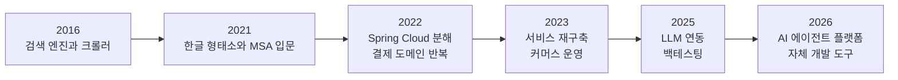

# GitHub 리포지토리 299개 전수 조사

> 조사 시점: **2026-09-15** · 대상 계정: `withwooyong` · 조사 도구: `gh` CLI (토큰 스코프 `repo`)

## 이 문서가 존재하는 이유

계정에 리포지토리가 299개 있고, 그중 **139개를 직접 만들었으며 93개에는 설명이 비어 있습니다.**
이 상태를 파악하는 데에만 `gh repo list` 호출과 집계 작업이 여러 차례 필요했습니다.
블로그 시리즈를 기획하는 세션, 리포지토리 설명을 채우는 세션, 실제 집필 세션이 각각
같은 조사를 반복하면 그 비용이 세 번 발생하므로, **조사 결과를 여기에 고정합니다.**

이 문서를 읽은 뒤에는 `gh repo list` 를 다시 호출하지 않아도 다음 판단이 가능합니다.

| 판단하려는 것 | 이 문서의 어느 절을 보면 되는가 |
| --- | --- |
| 어떤 리포지토리가 실제 작업물이고 어떤 것이 학습 스파이크인가 | §2 직접 생성 139개 |
| 관심사가 언제 어떻게 이동했는가 | §2-1 과 §3-1 의 시기별 해석 |
| 설명을 먼저 채워야 할 리포지토리는 무엇인가 | §4 정리 우선순위 |
| 설명과 topics 를 어떻게 채우는가 | §5 채우는 방법 |

### 재조사가 필요할 때의 명령

리포지토리를 새로 만들거나 지운 뒤 이 문서를 갱신해야 한다면 아래 명령으로 원본 데이터를
다시 받습니다. `--limit` 기본값이 30이므로 **반드시 크게 잡아야 합니다.**

```bash
gh repo list withwooyong --limit 1000 \
  --json name,description,isPrivate,isFork,isArchived,primaryLanguage,\
stargazerCount,forkCount,createdAt,updatedAt,pushedAt,repositoryTopics,diskUsage,parent,homepageUrl \
  > repos.json
```

`parent` 필드는 fork 의 원본 저장소를 담고 있어서, 어떤 프로젝트에 관심을 두었는지를
판별하는 유일한 근거가 됩니다. fork 는 이름이 원본과 같아 `name` 만으로는 구분되지 않습니다.

## 1. 전수 집계

| 구분 | 직접 생성 | fork | 합계 |
| --- | ---: | ---: | ---: |
| public | 70 | 160 | 230 |
| private | 69 | 0 | 69 |
| **합계** | **139** | **160** | **299** |

archived 로 표시된 리포지토리는 하나도 없고, fork 는 전부 public 입니다.
직접 만든 것 중 절반가량이 private 이라는 점이 블로그 집필에서 제약으로 작용합니다.

### 메타데이터 충실도

| 항목 | 직접 생성 139 | fork 160 |
| --- | --- | --- |
| 설명이 채워진 리포지토리 | 46 (33%) | 134 (84%) |
| topics 가 붙은 리포지토리 | 3 (2%) | 0 |

**fork 의 설명이 더 충실한 이유는 원본 저장소의 설명을 그대로 물려받기 때문입니다.**
즉 직접 쓴 설명은 사실상 46개뿐이며, 나머지는 자동으로 채워진 값입니다.
topics 가 붙은 셋은 `cuesift` · `withwooyong.github.io` · `redash-performance-marketing` 입니다.
## 2. 직접 생성한 139개

### 2-1. 시기별 해석

생성 연도로 나누면 하는 일이 뚜렷하게 갈립니다. 같은 시기에 만들어진 리포지토리들은
이름과 크기와 언어가 함께 움직이므로, 연도는 단순한 시간 구분이 아니라 **관심사의 구획선입니다.**

| 시기 | 개수 | 무엇을 만들었나 | 대표 리포지토리 |
| --- | ---: | --- | --- |
| 2016 | 6 | 크롤러와 번역 파이프라인 | `elasticsearch-webcrawler` (5.6 MB) · `trans-manager` · `trans-coder` |
| 2018~2020 | 4 | 메타데이터 수집기와 PHP 실험 | `meta_collector` · `deepmeta-api` · `php` |
| 2021 | 13 | 한글 형태소 플러그인과 Spring MSA 첫 시도 | `es-korean-plugin` · `elasticsearch-plugin-7.15.1` · `vue-movie` |
| 2022 | 36 | Spring Cloud 로 MSA 를 분해하고 결제 도메인을 반복 구현 | `api.gw.*` 5개 · `payment-v2` (15 MB) · `demo-payment` · `ddd-order` |
| 2023 | 20 | 서비스 재구축과 단일 기능 스파이크 | `yanadoo-api` (19 MB) · `yafit-cycle` (69 MB) · `demo-*` 12개 |
| 2024 | 14 | 소규모 데모 정리 | `grit-api` · `demo-jwt` · `demo-redis` · `demo-event` |
| 2025 | 12 | LLM 연동과 백테스팅 | `springai` (36 MB) · `langgraph-ai` (23 MB) · `dev_stock_backtesting` (28 MB) |
| 2026 | 34 | AI 에이전트 플랫폼과 자체 도구 | `ted-startup` · `cuesift` · `k-evidence-gateway` · `pm-plugin` · `ted-skills-plugin` |

2022년 한 해에만 36개가 생성되었는데, 이는 **Spring Cloud 의 구성 요소를 하나씩 따로 저장소로
분리해 실습한 결과입니다.** `api.gw.auth` · `api.gw.order` · `api.gw.pay` · `api.gw.user` ·
`spring-cloud-gateway` · `spring-cloud-config-server` · `spring-cloud-config-client` 가
모두 60~70 KB 규모로 같은 달에 만들어졌습니다.



언어 분포도 이 이동을 뒷받침합니다. Java 71개는 2022~2024년에 집중되어 있고,
Python 23개는 2025년 이후에 집중되어 있습니다.

| 언어 | 개수 | 주로 등장한 시기 |
| --- | ---: | --- |
| Java | 71 | 2016~2024, 특히 2022~2023 |
| Python | 23 | 2025~2026 |
| TypeScript | 13 | 2023 이후 |
| 언어 판별 불가 | 12 | 빈 저장소이거나 문서만 있는 경우 |
| JavaScript | 5 | 분산 |
| HTML · CSS | 7 | 2023 프런트엔드 실험 |
| 그 외 | 8 | Shell · Vue · Kotlin · Jupyter · TSQL · PHP |

### 2-2. 규모 상위 리포지토리

디스크 사용량이 1 MB 를 넘는 것만 추리면 **실제로 코드가 쌓인 작업물이 드러납니다.**
나머지 대다수는 100 KB 미만의 단일 기능 스파이크입니다.

| 리포지토리 | 크기 | 공개 | 성격 |
| --- | ---: | --- | --- |
| `khistory-cbt-pwa` | 326 MB | private | 학습용 PWA. 규모가 압도적으로 큽니다 |
| `claude-code-harness-usage` | 93 MB | public | 에이전틱 코딩 하네스 사용 기록 |
| `yafit-cycle` | 69 MB | private | 커머스 프런트엔드 |
| `yanadoo-exit` | 41 MB | private | 2026년 작업 |
| `springai` | 36 MB | public | Spring 과 OpenAI 연동 API 서버 |
| `dev_stock_backtesting` | 28 MB | private | backtrader 기반 주식 백테스팅 |
| `ChatGPT-Python-40` | 27 MB | public | LLM 실습 |
| `accounting` | 25 MB | private | 정산 API |
| `langgraph-ai` | 23 MB | private | LangGraph 실습 |
| `glinda_aggregator` | 21 MB | private | 데이터 수집기 |
| `yanadoo-api` | 19 MB | private | 서비스 재구축 백엔드 |
| `payment-v2` | 15 MB | private | 결제 도메인 |
| `withwooyong.github.io` | 16 MB | public | 이 블로그 |
| `ted-startup` | 12 MB | private | 멀티에이전트 SDLC 자동화 플랫폼 |

**규모 상위 14개 중 10개가 private 입니다.** 블로그에서 이 시기를 다루려면 공개 범위를
먼저 정해야 한다는 제약이 여기에서 나옵니다.

### 2-3. 전체 목록

마지막 푸시가 최근인 순서로 정렬했습니다. 설명이 비어 있는 곳은 굵게 표시했습니다.

| 리포 | 공개 | 언어 | 크기 | 마지막 푸시 | 설명 |
| --- | --- | --- | ---: | --- | --- |
| `ted-startup` | private | Python | 12.7 MB | 2026-09 | AI Agent Team Platform — Claude Code 기반 멀티에이전트 SDLC 자동화 플랫폼 |
| `khistory-cbt-pwa` | private | Python | 319.0 MB | 2026-09 | **비어 있음** |
| `yanadoo-exit` | private | HTML | 40.6 MB | 2026-09 | **비어 있음** |
| `career_searcher` | private | TypeScript | 1.1 MB | 2026-09 | **비어 있음** |
| `si-ideas` | private | JavaScript | 8.6 MB | 2026-09 | **비어 있음** |
| `cuesift` | public | Python | 2.8 MB | 2026-09 | AI 자막 번역·검수 트리아지 엔진 — 사람이 정말 봐야 할 자막만 걸러냅니다 |
| `withwooyong.github.io` | public | TypeScript | 15.9 MB | 2026-09 | 개발 이력·경력기술서를 정리한 개인 사이트 (Next.js · TypeScript · Tailwind) |
| `k-evidence-gateway` | private | TypeScript | 7.8 MB | 2026-09 | Self-hosted Korean evidence review, approval, and integration gateway |
| `team-wiki` | private | Python | 689 KB | 2026-09 | PM 팀 공유 지식 저장소 (LLM Wiki + OKF frontmatter) |
| `pm-plugin` | private | Python | 299 KB | 2026-09 | PM 팀용 Claude Code 플러그인 (pm-doc · pm-raw · pm-review · pm-compile) |
| `quick-phrase` | private | — | 0 KB | 2026-09 | **비어 있음** |
| `withwooyong` | public | — | 43 KB | 2026-08 | **비어 있음** |
| `ted-skills-plugin` | private | Shell | 115 KB | 2026-08 | Ted의 개인/팀 공용 Claude Code 스킬 모음 — ted-run 풀 파이프라인 포함 |
| `hackathon` | private | Python | 786 KB | 2026-08 | **비어 있음** |
| `devtracker` | public | TypeScript | 1.6 MB | 2026-08 | 개발팀 업무/배포 관리 시스템 (Next.js + Prisma + SQLite) |
| `langverse` | private | Python | 807 KB | 2026-08 | **비어 있음** |
| `ted_speak` | public | TypeScript | 2.1 MB | 2026-07 | TalkTed — AI 영어 스피킹 앱 (Speak 스타일, Expo + Supabase + OpenAI) |
| `ted-ontology` | private | Python | 64 KB | 2026-06 | **비어 있음** |
| `knowledge-context` | public | — | 45 KB | 2026-06 | **비어 있음** |
| `bearwatch` | private | TypeScript | 1.1 MB | 2026-06 | **비어 있음** |
| `ted_duolingo` | public | TypeScript | 2.0 MB | 2026-06 | **비어 있음** |
| `ted_voca` | public | TypeScript | 1.3 MB | 2026-06 | **비어 있음** |
| `dictionary` | public | JavaScript | 104 KB | 2026-06 | **비어 있음** |
| `accounting` | private | Java | 25.0 MB | 2026-05 | Accounting API |
| `cicd` | private | Python | 240 KB | 2026-04 | ci/cd aws lambda function |
| `org-chart` | private | Python | 91 KB | 2026-04 | Bizbox Alpha 조직도 → Slack 자동 연동 (사내망 macOS launchd 1일 1회) |
| `yanadoo-aws-assessment` | private | — | 90 KB | 2026-04 | Yanadoo AWS 인프라 진단 및 고도화 패키지 (2026-04-25) |
| `n8n-with-ai` | public | Shell | 215 KB | 2026-04 | n8n + OpenAI 고객 문의 자동 응대 시스템 — Google Sheets 트리거 → AI 분류 → 자동발송/수동검토 분기 + Slack 알림 + 로그 |
| `claude-code-harness-usage` | public | Java | 91.7 MB | 2026-04 | **비어 있음** |
| `apjari-to-html` | public | JavaScript | 259 KB | 2026-03 | **비어 있음** |
| `redash-performance-marketing` | public | Python | 56 KB | 2026-03 | Redash 기반 퍼포먼스 마케팅 대시보드 — 매출·광고·퍼널 지표 분석 (PostgreSQL + Docker Compose) |
| `metabase-performance-marketing` | public | — | 0 KB | 2026-03 | **비어 있음** |
| `mig_mysql_to_mssql` | private | Python | 316 KB | 2026-03 | **비어 있음** |
| `pg_settle` | private | Python | 193 KB | 2026-02 | **비어 있음** |
| `mssql-to-postgresql` | public | Python | 16 KB | 2026-01 | MSSQL schema extractor and PostgreSQL DDL converter with ERD generation |
| `accounting-k` | private | Kotlin | 735 KB | 2026-01 | accounting-kotlin 코드 |
| `glinda_aggregator` | private | Python | 21.0 MB | 2026-01 | **비어 있음** |
| `fast-ai` | private | Python | 706 KB | 2025-12 | **비어 있음** |
| `dev_stock_backtesting` | private | Python | 28.4 MB | 2025-11 | stock backtesting with backtrader |
| `springai` | private | Java | 36.1 MB | 2025-10 | spring openai 연동 api 서버 |
| `ai-dataset-video` | private | Python | 47 KB | 2025-10 | **비어 있음** |
| `lecture` | private | — | 0 KB | 2025-10 | **비어 있음** |
| `langgraph-ai` | private | Jupyter Notebook | 23.0 MB | 2025-10 | **비어 있음** |
| `doit_game_python` | public | Python | 74 KB | 2025-09 | **비어 있음** |
| `ChatGPT-Python-40` | public | Python | 27.0 MB | 2025-09 | **비어 있음** |
| `klleon-record` | public | TypeScript | 189 KB | 2025-09 | **비어 있음** |
| `nest-ai` | public | TypeScript | 91 KB | 2025-09 | **비어 있음** |
| `openai-demo` | public | Java | 12.5 MB | 2025-09 | **비어 있음** |
| `scheduler` | private | Java | 468 KB | 2025-05 | init yanadoo-scheduler 재개발1차 |
| `yanadoo-mssql` | private | Java | 213 KB | 2025-01 | **비어 있음** |
| `grit-api` | private | Java | 6.0 MB | 2024-09 | init |
| `commerce` | public | Java | 50 KB | 2024-08 | multi project (domain+common) sample |
| `hello-streamlit` | public | Python | 8 KB | 2024-04 | **비어 있음** |
| `demo-security` | public | Java | 59 KB | 2024-04 | **비어 있음** |
| `demo-openai` | public | Java | 50 KB | 2024-04 | **비어 있음** |
| `demo-jwt` | private | Java | 59 KB | 2024-03 | demo-jwt |
| `demo-mongo` | public | Java | 120 KB | 2024-03 | **비어 있음** |
| `demo-redis` | public | Java | 72 KB | 2024-02 | spring redis sample |
| `sb3-up-and-run` | public | Java | 55 KB | 2024-02 | **비어 있음** |
| `demo-event` | public | Java | 57 KB | 2024-02 | spring event demo |
| `demo-websocket` | public | Java | 55 KB | 2024-02 | **비어 있음** |
| `jpa-mssql` | private | Java | 69 KB | 2024-01 | **비어 있음** |
| `image` | public | Java | 74 KB | 2023-10 | image-resize and cache |
| `yafit-cycle` | private | HTML | 68.1 MB | 2023-09 | yafit-cycle init (cdn 제거전) |
| `vue-project` | private | Vue | 11.3 MB | 2023-09 | **비어 있음** |
| `payment` | private | Java | 409 KB | 2023-08 | **비어 있음** |
| `edu-next` | public | CSS | 56 KB | 2023-07 | **비어 있음** |
| `yanadoo-api` | private | Java | 18.7 MB | 2023-05 | yanadoo3.0 rebuilding |
| `yanadoo-webview` | private | HTML | 322 KB | 2023-05 | yanadoo3.0 rebuilding |
| `demo-chatgpt` | public | JavaScript | 2.0 MB | 2023-04 | **비어 있음** |
| `demo-swiper` | public | TypeScript | 57 KB | 2023-04 | **비어 있음** |
| `demo-srr` | private | HTML | 118 KB | 2023-04 | **비어 있음** |
| `demo-nextjs` | public | TypeScript | 243 KB | 2023-04 | **비어 있음** |
| `demo-node-json-api` | public | JavaScript | 9 KB | 2023-04 | **비어 있음** |
| `yanadoo-next-front` | private | TypeScript | 102 KB | 2023-03 | Typescript + Next.js 적용된 Yanadoo SSR Front |
| `demo-next-commerce` | public | CSS | 67 KB | 2023-03 | **비어 있음** |
| `demo-taskagile` | public | Java | 152 KB | 2023-02 | **비어 있음** |
| `demo-member` | private | TSQL | 5.5 MB | 2023-02 | **비어 있음** |
| `demo-csv-to-mysql` | private | Java | 10.7 MB | 2023-02 | **비어 있음** |
| `demo-admin` | private | CSS | 149 KB | 2023-01 | **비어 있음** |
| `demo-db-sync` | private | Java | 820 KB | 2023-01 | **비어 있음** |
| `demo-flyway` | private | Java | 63 KB | 2023-01 | **비어 있음** |
| `demo-mongodb-reactive` | private | Java | 80 KB | 2023-01 | **비어 있음** |
| `demo-mongodb-active` | private | Java | 74 KB | 2023-01 | **비어 있음** |
| `demo-jpa` | public | Java | 164 KB | 2023-01 | **비어 있음** |
| `demo-entity` | private | Java | 369 KB | 2022-12 | **비어 있음** |
| `demo-mapstruct` | public | Java | 65 KB | 2022-12 | **비어 있음** |
| `demo-db` | private | Java | 75 KB | 2022-12 | **비어 있음** |
| `demo-api` | private | Java | 92 KB | 2022-12 | **비어 있음** |
| `scheduler-demo` | private | Java | 73 KB | 2022-12 | **비어 있음** |
| `demo-boot3` | private | Java | 294 KB | 2022-12 | **비어 있음** |
| `auth-demo` | private | Java | 75 KB | 2022-12 | **비어 있음** |
| `db-master` | private | Java | 75 KB | 2022-11 | **비어 있음** |
| `demo-push` | private | Java | 77 KB | 2022-11 | **비어 있음** |
| `batch-demo` | public | Java | 97 KB | 2022-10 | **비어 있음** |
| `ted-micro-service` | public | Java | 87 KB | 2022-08 | **비어 있음** |
| `ted-cloud-service` | public | Java | 64 KB | 2022-08 | **비어 있음** |
| `spring-redis` | public | Java | 69 KB | 2022-08 | **비어 있음** |
| `pay` | private | Java | 1.4 MB | 2022-07 | **비어 있음** |
| `spring-cloud-config-client` | public | Java | 62 KB | 2022-07 | **비어 있음** |
| `spring-cloud-config-repository` | public | — | 11 KB | 2022-07 | spring-cloud-config-repository |
| `api.gw.pay` | public | Java | 69 KB | 2022-07 | **비어 있음** |
| `spring-cloud-gateway` | public | Java | 63 KB | 2022-07 | **비어 있음** |
| `api.gw.order` | public | Java | 66 KB | 2022-07 | **비어 있음** |
| `api.gw.user` | public | Java | 69 KB | 2022-07 | **비어 있음** |
| `api.gw.auth` | public | Java | 66 KB | 2022-07 | **비어 있음** |
| `spring-cloud-config-server` | public | Java | 59 KB | 2022-07 | **비어 있음** |
| `demo-openfeign` | private | Java | 82 KB | 2022-05 | **비어 있음** |
| `demo-payment` | private | Java | 7.5 MB | 2022-05 | payment 개발 demo |
| `demo-order` | private | Java | 3.4 MB | 2022-05 | 로직수정하던거 |
| `payment-v2` | private | Java | 15.2 MB | 2022-05 | entity-repository compile success |
| `ddd-order` | public | Java | 110 KB | 2022-04 | msa를 위해 ddd 적용할 order 프로젝트 생성 |
| `fastcampus-stream-study` | public | Java | 95 KB | 2022-04 | **비어 있음** |
| `module-payment` | private | Java | 59 KB | 2022-04 | **비어 있음** |
| `auth-example` | public | Java | 2.4 MB | 2022-03 | **비어 있음** |
| `spring-security-jwt-oauth2` | public | Java | 182 KB | 2022-03 | **비어 있음** |
| `yanadoo-corp` | private | Java | 117 KB | 2022-02 | 야나두 개발참고 |
| `vue-movie` | private | Vue | 6.5 MB | 2021-12 | **비어 있음** |
| `dev_stock` | private | Python | 52 KB | 2021-12 | study stock buy and sell with backtesting |
| `qrcode` | public | Java | 45 KB | 2021-12 | **비어 있음** |
| `spring-mybatis` | public | Java | 84 KB | 2021-12 | **비어 있음** |
| `check-main-master` | public | — | 0 KB | 2021-12 | **비어 있음** |
| `movie-front` | public | — | 189 KB | 2021-12 | React movie front page |
| `msa-boot` | public | Java | 38 KB | 2021-12 | **비어 있음** |
| `spring-jpa-shop-demo` | public | Java | 52 KB | 2021-11 | **비어 있음** |
| `spring-docker` | public | Java | 2 KB | 2021-11 | **비어 있음** |
| `kakao-style` | public | — | 0 KB | 2021-11 | **비어 있음** |
| `elasticsearch-plugin-7.15.1` | private | Java | 48 KB | 2021-11 | **비어 있음** |
| `es-korean-plugin` | private | — | 0 KB | 2021-11 | javacafe 한국어 형태소 플러그인 es 버전 및 소스정리해서 사용 (초성분리, 자모분리, 영한/한영 오타변환) |
| `deepmeta-api` | private | Java | 60 KB | 2020-08 | deepmeta-api |
| `meta_collector` | private | Python | 108 KB | 2020-08 | **비어 있음** |
| `test` | private | — | 0 KB | 2020-06 | AI서비스개발 |
| `php` | public | PHP | 51 KB | 2018-01 | php dev |
| `lambdas-in-action` | public | Java | 50 KB | 2017-03 | **비어 있음** |
| `DataStructureAndAlgorithmsMadeEasyInJava` | public | Java | 1.2 MB | 2016-12 | study |
| `trans-coder` | public | Java | 110 KB | 2016-11 | trans-coder |
| `acing-java-interview` | public | Java | 95 KB | 2016-11 | **비어 있음** |
| `elasticsearch-webcrawler` | public | Java | 5.5 MB | 2016-11 | elasticsearch-webcrawler |
| `trans-manager` | public | Java | 2.0 MB | 2016-11 | trans-manager |

## 3. fork 한 160개

### 3-1. fork 를 학습 수단으로 쓰기 시작한 시점이 뚜렷합니다

**2016년 10월에 `spring-projects/spring-boot` 를 한 번 fork 한 뒤로, 2023년 4월까지
6년 반 동안 fork 가 한 건도 없습니다.** 그러다 2023년 4월에 `chatbot-ui` 두 개를
fork 하면서 재개되었고, 그 이후로는 거의 매달 이어집니다.

| 연도 | 개수 | 공백 구간 |
| --- | ---: | --- |
| 2016 | 1 | 이후 2023년 3월까지 완전한 공백 |
| 2023 | 2 | 2023년 5월부터 2024년 3월까지 공백 |
| 2024 | 49 | 2024년 8~9월, 11월 공백 |
| 2025 | 74 | 2025년 6~7월 공백 |
| 2026 | 34 | 2026년 2월 공백 |

**이 공백 구간 자체가 근거입니다.** fork 는 마음이 움직였을 때 누르는 버튼이므로,
비어 있는 달은 다른 일에 몰두하고 있었다는 뜻입니다.

월별로 보면 특정 달에 몰리는 양상이 더 선명합니다.

| 몰린 달 | 개수 | 무엇에 몰렸나 |
| --- | ---: | --- |
| 2024-04 | 16 | LangChain · OpenAI Cookbook · `private-gpt` · `anything-llm` 계열 |
| 2025-02 | 15 | 백엔드 심화 강의 실습 저장소 |
| 2025-01 | 13 | 대용량 트래픽 게시판 · 쿠폰 동시성 · 결제 MSA · 스프링 배치 |
| 2024-05 | 12 | langchain4j · 생성 AI 서적 예제 |
| 2024-07 | 11 | Kafka · Elasticsearch Java 클라이언트 · NestJS |
| 2025-09 | 11 | React Native · Codex · 프롬프트 모음 |

### 3-2. 주제별 분류

저장소 이름과 설명에 담긴 키워드로 분류했습니다. **이 분류는 키워드 일치로 만든 것이므로
경계에 있는 항목은 다르게 볼 여지가 있습니다.** 정확한 판정이 필요하면 §3-3 의 전체 목록을
직접 읽어야 합니다.

| 주제 | 개수 | 대표 원본 저장소 |
| --- | ---: | --- |
| 백엔드 강의와 실습 | 40 | `ccommit-dev/Board-Server` · `KimByeongKou/fastcampus-pay` · `provectus/kafka-ui` |
| LLM 애플리케이션과 RAG | 28 | `openai/openai-cookbook` · `Mintplex-Labs/anything-llm` · `zylon-ai/private-gpt` |
| 에이전틱 코딩 | 25 | `oraios/serena` · `thedotmack/claude-mem` · `trailhq/Graft` · `openai/codex` |
| 퀀트와 자동매매 | 22 | `mementum/backtrader` · `sharebook-kr/pykrx` · `koreainvestment/open-trading-api` |
| 모바일 | 16 | `android/compose-samples` · `codefactory-co/flutter-golden-rabbit-novice-v2` |
| 이미지와 영상과 음성 | 14 | `Comfy-Org/ComfyUI` · `AUTOMATIC1111/stable-diffusion-webui` · `jamiepine/voicebox` |
| 위 분류에 들지 않음 | 15 | `getredash/redash` · `shadcn-ui/ui` · `DavidHDev/react-bits` |

**직접 만든 리포지토리와 비교하면 fork 쪽이 관심의 폭을 더 정확하게 보여 줍니다.**
직접 만든 것에는 끝까지 간 것만 남지만, fork 에는 들여다보다 만 것도 함께 남기 때문입니다.
퀀트와 자동매매 22개 중 직접 만든 대응물은 `dev_stock` 과 `dev_stock_backtesting` 둘뿐이고,
모바일 16개에 대응하는 직접 생성물은 하나도 없습니다.

### 3-3. 전체 목록

fork 한 시점이 최근인 순서로 정렬했습니다. **fork 는 원본 저장소 이름을 그대로 물려받으므로,
구분에 쓸 수 있는 것은 `parent` 필드뿐입니다.**

| 원본 저장소 | 언어 | fork 시점 | 설명 |
| --- | --- | --- | --- |
| `trailhq/Graft` | TypeScript | 2026-09 | Turbocharge Claude Code, Cursor, Codex, Gemini & every coding agent: faster, cheaper, with |
| `thedotmack/claude-mem` | TypeScript | 2026-09 | Persistent Context Across Sessions for Every Agent – Captures everything your agent does d |
| `oraios/serena` | Python | 2026-09 | A powerful MCP toolkit for coding, providing semantic retrieval and editing capabilities - |
| `dragon1086/kospi-kosdaq-stock-server` | Python | 2026-09 | An MCP server that provides KOSPI/KOSDAQ stock data using FastMCP |
| `cathrynlavery/diagram-design` | HTML | 2026-09 | 38 editorial diagram types for Claude Code, Codex, and Pi. Self-contained HTML + SVG. No s |
| `SenteLabsAI/OpenExecutive` | Python | 2026-08 | AI-powered virtual executive team — a single coherent executive persona backed by 8 specia |
| `fivetaku/insane-search` | Python | 2026-08 | Auto-bypass for blocked websites in Claude Code — Phase 0→3 adaptive scheduler, no API key |
| `code-yeongyu/lazycodex` | TypeScript | 2026-08 | The one and only agent harness for complex codebases. Project memory, planning, execution, |
| `headroomlabs-ai/headroom` | Python | 2026-08 | Compress tool outputs, logs, files, and RAG chunks before they reach the LLM. 20% fewer to |
| `DietrichGebert/ponytail` | JavaScript | 2026-08 | Makes your AI agent think like the laziest senior dev in the room. The best code is the co |
| `Graphify-Labs/graphify` | Python | 2026-08 | Turn any codebase, with its docs, SQL schemas, configs, and PDFs, into a queryable knowled |
| `nobaksan/fastcampus-elasticsearch-part1` | — | 2026-07 | 고성능 검색 엔진 구축으로 한번에 끝내는 Elasticsearch |
| `JungHoonGhae/tossinvest-cli` | Go | 2026-07 | 토스증권을 AI 에이전트와 터미널에서 다루는 도구. CLI 와 MCP 서버로 계좌·시세·주문은 물론 웹앱 전용 기능(수급·AI 시그널·스크리너·배당)까지, JSO |
| `revfactory/harness` | HTML | 2026-07 | A meta-skill that designs domain-specific agent teams, defines specialized agents, and gen |
| `revfactory/harness-engineering-with-cc` | HTML | 2026-07 | — |
| `jarrodwatts/claude-hud` | JavaScript | 2026-07 | A Claude Code plugin that shows what's happening - context usage, active tools, running ag |
| `dl0312/open-apis-korea` | Python | 2026-06 | 🇰🇷 한국어 사용자를 위한 서비스에 사용하기 위한 오픈 API 모음 |
| `xbtlin/ai-berkshire` | Python | 2026-06 | AI 时代的伯克希尔：基于 Claude Code 的价值投资研究框架。巴菲特·芒格·段永平·李录四大师方法论 + 多Agent并行研究。 / AI-era Berkshire:  |
| `jamiepine/voicebox` | TypeScript | 2026-06 | The open-source AI voice studio. Clone, dictate, create. |
| `Q00/Symposium` | Shell | 2026-06 | Socratic skill pack for turning vague AI coding requests into precise Seeds |
| `Q00/ouroboros` | Python | 2026-06 | Agent OS: Stop prompting. Start specifying. |
| `volcengine/OpenViking` | Python | 2026-06 | OpenViking is an open-source context database designed specifically for AI Agents(such as  |
| `remotion-dev/remotion` | TypeScript | 2026-05 | 🎥 Make videos programmatically with React |
| `warpdotdev/warp` | Rust | 2026-04 | Warp is an agentic development environment, born out of the terminal. |
| `anthropics/financial-services` | Python | 2026-04 | — |
| `sysnet4admin/_Book_Claude-Code` | TypeScript | 2026-04 | < 한 걸음 앞선 개발자가 지금 꼭 알아야 할 클로드 코드 > |
| `shanraisshan/claude-code-best-practice` | HTML | 2026-04 | practice made claude perfect |
| `koreainvestment/kis-ai-extensions` | JavaScript | 2026-04 | 한국투자 OpenAPI 기반 AI 에이전트 확장 기능 및 실행 도구 모음입니다. |
| `affaan-m/ECC` | JavaScript | 2026-03 | The agent harness performance optimization system. Skills, instincts, memory, security, an |
| `garrytan/gstack` | TypeScript | 2026-03 | Use Garry Tan's exact Claude Code setup: 15 opinionated tools that serve as CEO, Designer, |
| `sangrokjung/claude-forge` | Shell | 2026-03 | Supercharge Claude Code with 11 AI agents, 36 commands & 15 skills — the claude-code plugi |
| `ww-w-ai/bkit-claude-code` | JavaScript | 2026-03 | bkit Vibecoding Kit - PDCA methodology + Claude Code mastery for AI-native development |
| `onlybooks/llm` | Jupyter Notebook | 2026-01 | LLM을 활용한 실전 AI 애플리케이션 개발 |
| `FinanceData/OpenDartReader` | Python | 2026-01 | Open DART Reader |
| `wikibook/quant` | Jupyter Notebook | 2025-11 | 《손에 잡히는 퀀트 투자 with 파이썬》 예제 코드 |
| `jdepoix/youtube-transcript-api` | Python | 2025-11 | This is a python API which allows you to get the transcript/subtitles for a given YouTube  |
| `dragon1086/prism-insight` | Python | 2025-11 | AI 기반 주식 분석 및 매매 시스템 |
| `sharebook-kr/book-korea-us-stock-trading` | Python | 2025-11 | 파이썬을 이용한 한국/미국 주식 자동매매 |
| `papadaks/SystemTrading` | Python | 2025-11 | — |
| `stock-price-calculator/tradingbot` | Python | 2025-11 | 키움증권 자동매매 프로그램입니다. |
| `tofulim/auto_trade` | Python | 2025-11 | 소소한 재테크를 위한 python 기반 자동매매 |
| `polakowo/vectorbt` | Python | 2025-11 | Find your trading edge, using the fastest engine for backtesting, algorithmic trading, and |
| `fendouai/ArbitrageBot` | — | 2025-10 | ArbitrageBot, Detect Arbitrage Opportunities, Trading Clients, etc. |
| `sharebook-kr/arbitrage` | Python | 2025-10 | upbit-korbit arbitrage bot |
| `Kane0002/Langchain-RAG` | Jupyter Notebook | 2025-10 | RAG 시스템을 위한 랭체인 완전정복 교재 실습 코드 및 자료입니다. |
| `karpathy/LLM101n` | — | 2025-10 | LLM101n: Let's build a Storyteller |
| `citizendev9c/yt-assets` | JavaScript | 2025-10 | 시민개발자 구씨 유튜브 채널 콘텐츠 관련 자료 모음. AI 생산성, 자동화, 바이브코딩, 노코드 마스터리 등 주제별 영상 자료. |
| `youtube-jocoding/gpt-bitcoin-book` | Python | 2025-10 | — |
| `ccyanxyz/uniswap-arbitrage-analysis` | Python | 2025-10 | Uniswap arbitrage problem analysis |
| `maxme/bitcoin-arbitrage` | Python | 2025-10 | Bitcoin arbitrage - opportunity detector |
| `bradleyboyuyang/Binance-Arbitrage` | Python | 2025-10 | Binance cash-and-carry arbitrage bot |
| `f/prompts.chat` | JavaScript | 2025-09 | This repo includes ChatGPT prompt curation to use ChatGPT and other LLM tools better. |
| `chatgpt-kr/chatgpt-tutorial` | Jupyter Notebook | 2025-09 | `진짜 챗GPT 활용법` 교재의 깃허브입니다. |
| `Wan-Video/Wan2.2` | Python | 2025-09 | Wan: Open and Advanced Large-Scale Video Generative Models |
| `openai/codex` | Rust | 2025-09 | Lightweight coding agent that runs in your terminal |
| `retti22/cursor-python-experience` | Python | 2025-09 | — |
| `openlanguageprofiles/olp-en-cefrj` | — | 2025-09 | Open Language Profiles — English profile datasets from CEFR-J |
| `wonderful-coding-life/hanbit-springboot` | Java | 2025-09 | — |
| `fastcampus-rn-introduction/part2-ch1-kakao-friend-list` | JavaScript | 2025-09 | 👩‍🏫 패스트캠퍼스 강의: Part2 - Ch1 - 까까오톡 친구목록 프로젝트입니다. |
| `ghsdh3409/fc-react-native` | TypeScript | 2025-09 | — |
| `fastcampus-rn-animation/RNAnimation` | Objective-C++ | 2025-09 | — |
| `DavidHDev/react-bits` | JavaScript | 2025-09 | An open source collection of animated, interactive & fully customizable React components f |
| `codefactory-co/fastcampus-nestjs-part-1` | TypeScript | 2025-08 | — |
| `koreainvestment/open-trading-api` | Python | 2025-08 | Korea Investment & Securities Open API Github |
| `mementum/backtrader` | Python | 2025-08 | Python Backtesting library for trading strategies |
| `Gold-Gyu/Alphano` | Jupyter Notebook | 2025-08 | AI를 활용한 주식 자동매매 금융시스템 |
| `sharebook-kr/pyupbit` | Python | 2025-08 | python wrapper for upbit API |
| `sharebook-kr/pykrx` | Python | 2025-08 | KRX 주식 정보 스크래핑 |
| `shadcn-ui/ui` | TypeScript | 2025-08 | A set of beautifully-designed, accessible components and a code distribution platform. Wor |
| `openai/openai-realtime-console` | JavaScript | 2025-08 | React app for inspecting, building and debugging with the Realtime API |
| `bjpublic/android_client` | Kotlin | 2025-05 | — |
| `android/snippets` | Kotlin | 2025-04 | Main repository for snippets surfaced on developer.android.com. |
| `Fastcampus-Android-Lecture-Project-2023/part5-chapter2` | Kotlin | 2025-04 | Part5 Chapter2의 쇼핑몰 앱입니다. |
| `Fastcampus-Android-Lecture-Project-2023/part4plus-chapter4` | Kotlin | 2025-04 | 파트4+ 챕터4 프로젝트인 RestaurantApp입니다. |
| `Fastcampus-Android-Lecture-Project-2023/part4plus-chapter3` | Kotlin | 2025-04 | 파트4+ 챕터3 프로젝트인 MovieApp입니다. |
| `Fastcampus-Android-Lecture-Project-2023/part1-chapter3` | Kotlin | 2025-03 | 단위변환기 앱 |
| `Fastcampus-Android-Lecture-Project-2023/part1-chapter2` | Kotlin | 2025-03 | chapter2 숫자세기 앱 구현 코드 입니다. |
| `moseskim/jetpack-compose-essentials` | Kotlin | 2025-03 | Sample codes for Jetpack Compose Essentials |
| `android/compose-samples` | Kotlin | 2025-03 | Official Jetpack Compose samples. |
| `wikibook/spring-api-dev` | Java | 2025-03 | 《스프링 6와 스프링 부트 3로 배우는 모던 API 개발》 예제 코드 |
| `fastcampus-flutter/part3_chapter2_ttoss` | Dart | 2025-02 | ttoss app with simple getX |
| `multimodal-art-projection/YuE` | Python | 2025-02 | YuE: Open Full-song Music Generation Foundation Model, something similar to Suno.ai but op |
| `LimMoon/fc-auth` | Java | 2025-02 | fastcampus auth project |
| `LimMoon/fastcampus-auth-init` | — | 2025-02 | [패스트캠퍼스 강의] 9개 백엔드 프로젝트 Signature : 인증시스템 |
| `jinho-yoo-jack/fastcampus-ci-cd` | Groovy | 2025-02 | Github Action와 Jenkins를 활용한 PG사 CI/CD 자동화 시스템 개발 |
| `kielhong/video-with-redis` | Java | 2025-02 | — |
| `KanghoLee82/ch3_community_feed_auth_admin_service` | CSS | 2025-02 | 패스트 캠퍼스 - 커뮤니티 서비스 프로젝트 (Mysql 쿼리 튜닝을 활용한 어드민 기능 구현) |
| `KanghoLee82/ch2_community_feed_auth_admin_service` | Java | 2025-02 | 패스트 캠퍼스 - 커뮤니티 서비스 프로젝트 (JWT를 활용한 회원 가입과 로그인 기능 구현) |
| `KanghoLee82/ch6_community_feed_service` | Java | 2025-02 | 패스트 캠퍼스 - 커뮤니티 서비스 프로젝트 (인수 테스트를 활용한 커뮤니티 피드 서비스 리팩토링) |
| `KanghoLee82/ch5_community_feed_service` | Java | 2025-02 | 패스트 캠퍼스 - 커뮤니티 서비스 프로젝트 (Spring 및 JPA) |
| `KanghoLee82/ch4_community_feed_service` | Java | 2025-02 | 패스트 캠퍼스 - 커뮤니티 서비스 프로젝트 (서비스 객체 및 테스트) |
| `KanghoLee82/ch2_community_feed_service` | Java | 2025-02 | 패스트 캠퍼스 - 커뮤니티 서비스 프로젝트 (도메인 객체) |
| `Chaneui/GPT_trading` | Python | 2025-02 | — |
| `getredash/redash` | Python | 2025-02 | Make Your Company Data Driven. Connect to any data source, easily visualize, dashboard and |
| `kdabir/redash-mac` | Makefile | 2025-02 | Running Redash locally on Mac using Docker Compose |
| `bros2024/fastcampus-chat-service` | Java | 2025-01 | 패스트캠퍼스 웹소켓과 스프링부트로 채팅서버 구현하기의 강의자료입니다. |
| `dongjoon1251/fastcampus-ecommerce-springbatch` | Java | 2025-01 | 패스트캠퍼스 이커머스 데이터처리를 위한 스프링 배치 실습 프로젝트 |
| `fastcampus-flutter/fast_app_base` | Dart | 2025-01 | A foundational source for building apps quickly |
| `KimByeongKou/fastcampus-pay` | Java | 2025-01 | [패스트캠퍼스 강의] 패스트 캠퍼스 강의를 위한 간편 결제 시스템 MSA 실습 예제 코드입니다. |
| `HarryKane11/langchain` | Python | 2025-01 | — |
| `ccommit-dev/Board-Server-Locust` | Python | 2025-01 | 성능테스트 툴 |
| `dev-online-k8s/part3-testdatagen` | Java | 2025-01 | Test Data Generator |
| `dongjoon1251/fastcampus-dsp-migration` | Java | 2025-01 | 패스트캠퍼스 광고데이터 마이그레이션 실습 프로젝트 |
| `dolphina02/redisForZset` | Java | 2025-01 | This is a code-set for fastcampus lecture |
| `prod-j/coupon-version-management` | Java | 2025-01 | — |
| `morenice/fastcampus-2023-backend-advacned` | Java | 2025-01 | — |
| `patrikx3/redis-ui` | JavaScript | 2025-01 | 📡 P3X Redis UI: A highly functional and convenient database GUI that fits in your pocket, |
| `ccommit-dev/Board-Server` | Java | 2025-01 | [패스트캠퍼스] 대용량 트래픽 처리 게시판 프로젝트 |
| `cailynyongyong/GPTs-10X-book` | — | 2024-12 | 나만의 GPTs로 생산성 10배 늘리기 |
| `bwcho75/langchain-quickstart` | Jupyter Notebook | 2024-12 | — |
| `Indrajhere/StreamingAvatarNextJSDemo` | TypeScript | 2024-10 | — |
| `hedra-labs/hedra-api-starter` | Python | 2024-10 | — |
| `AUTOMATIC1111/stable-diffusion-webui` | Python | 2024-10 | Stable Diffusion web UI |
| `nlile/stablediffusion` | Python | 2024-10 | High-Resolution Image Synthesis with Latent Diffusion Models |
| `Comfy-Org/ComfyUI-Manager` | JavaScript | 2024-10 | ComfyUI-Manager is an extension designed to enhance the usability of ComfyUI. It offers ma |
| `Comfy-Org/ComfyUI` | Python | 2024-10 | The most powerful and modular diffusion model GUI, api and backend with a graph/nodes inte |
| `lleellee0/java-for-backend` | Java | 2024-10 | [한빛미디어] "이것이 취업을 위한 백엔드 개발이다 with 자바" 전체 소스코드 저장소입니다. |
| `gilbutITbook/080354` | Java | 2024-07 | 코딩 자율학습 스프링 부트3 자바 백엔드 개발 입문 소스 코드 저장소입니다. |
| `spring-projects/spring-kafka` | Java | 2024-07 | Provides Familiar Spring Abstractions for Apache Kafka |
| `provectus/kafka-ui` | Java | 2024-07 | Open-Source Web UI for Apache Kafka Management |
| `bjpublic/apache-kafka-with-java` | Java | 2024-07 | 아파치 카프카 애플리케이션 프로그래밍 with 자바 |
| `bjpublic/streaming-data` | Java | 2024-07 | — |
| `dextto/book-nestjs-backend` | TypeScript | 2024-07 | — |
| `MinkyungPark/roadbook-nodejs` | JavaScript | 2024-07 | roadbook nodejs example |
| `msaltnet/smtm` | Python | 2024-07 | It's a game to get money |
| `roadbookgit/DLService` | Jupyter Notebook | 2024-07 | 딥러닝 서비스 프로젝트 소스코드 |
| `Hong-JunHyeok/shopping_app_example` | TypeScript | 2024-07 | 본 깃허브 레포지토리는 [리액트 쇼핑몰 프로젝트] 의 예제 소스코드입니다. |
| `elastic/elasticsearch-java` | Java | 2024-07 | Official Elasticsearch Java Client |
| `Hoon9901/spring-elasticsearch` | Java | 2024-06 | Spring Boot 3.1.X + ElasticSearch 8.11.X |
| `logaritex/assistant-api` | Java | 2024-05 | Java Client for OpenAI Assistants API |
| `shineware/KOMORAN` | Java | 2024-05 | Korean Morphological Analyzer by shineware |
| `langchain4j/langchain4j-spring` | Java | 2024-05 | LangChain4j integration with Spring |
| `langchain4j/langchain4j-examples` | Java | 2024-05 | — |
| `benman1/generative_ai_with_langchain` | Jupyter Notebook | 2024-05 | Build large language model (LLM) apps with Python, ChatGPT and other models. This is the c |
| `SaiUpadhyayula/langchain4j-pdf-assistant` | Java | 2024-05 | This repository contains code for the PDF Assistant created using LangChain4J, Spring Boot |
| `team-busan/fastcamp-project` | JavaScript | 2024-05 | — |
| `fastcampus-plan1/Online-Backend-Python` | Python | 2024-05 | Python 웹개발 초격차 강의에 대한 소스코드 모음집입니다. |
| `HVision-NKU/StoryDiffusion` | Jupyter Notebook | 2024-05 | Create Magic Story! |
| `hanbit/web-with-fastapi` | HTML | 2024-05 | 『FastAPI를 사용한 파이썬 웹 개발』(한빛미디어, 2023) 예제 코드 저장소입니다. |
| `codefactory-co/flutter-golden-rabbit-novice-v2` | Dart | 2024-05 | Must Have 코드팩토리의 플러터 프로그래밍 3쇄 개정판 |
| `streamlit/llm-examples` | Python | 2024-05 | Streamlit LLM app examples for getting started |
| `myshell-ai/OpenVoice` | Python | 2024-04 | Instant voice cloning by MyShell. |
| `heypythonai/heypythonai` | Jupyter Notebook | 2024-04 | — |
| `hangj11/day1co-chat-backend` | TypeScript | 2024-04 | — |
| `diki816/day1co-chat-frontend` | JavaScript | 2024-04 | — |
| `fastcampus-plan1/Online_DS_VectorDB` | Jupyter Notebook | 2024-04 | <벡터DB로 구현하는 LLM 기반 검색 엔진 & 유사 상품 추천 시스템 (ft. Pinecone & Langchain)>에 대한 소스 코드를 업로드합니다. |
| `zhanymkanov/fastapi-best-practices` | — | 2024-04 | FastAPI Best Practices and Conventions we used at our startup |
| `minji337/jjinchin` | Python | 2024-04 | — |
| `wikibook/openai-llm` | Jupyter Notebook | 2024-04 | 《GPT-4, ChatGPT, 라마인덱스, 랭체인을 활용한 인공지능 프로그래밍》 예제 코드 |
| `chatgpt-kr/chatgpt-api-tutorial` | Jupyter Notebook | 2024-04 | `진짜 챗GPT API 활용법` 교재의 깃허브입니다. |
| `Mintplex-Labs/anything-llm` | JavaScript | 2024-04 | The all-in-one AI application, tool suite, and API for RAG & Agents for Docker & Desktop. |
| `saintdragon2/gpt_powered_dj_book_2023` | Python | 2024-04 | GPT로 나만의 플레이리스트 제작 프로그램 만들기 |
| `zylon-ai/private-gpt` | Python | 2024-04 | Interact with your documents using the power of GPT, 100% privately, no data leaks |
| `openai/openai-cookbook` | MDX | 2024-04 | Examples and guides for using the OpenAI API |
| `ychoi-kr/ChatGPT-API-Python` | Python | 2024-04 | 《OpenAI API와 파이썬으로 나만의 챗GPT 만들기》 실습 예제 |
| `stophobia/080413` | Jupyter Notebook | 2024-04 | <랭체인으로 LLM 서비스 만들기> 소스 코드 |
| `nomadcoders/fullstack-gpt` | Python | 2024-04 | 랭체인으로 AI 웹 서비스 7개 만들기 |
| `mckaywrigley/chatbot-ui` | TypeScript | 2023-04 | An open source ChatGPT UI. |
| `mckaywrigley/chatbot-ui-lite` | TypeScript | 2023-04 | A simple chatbot starter kit for OpenAI's chat model using Next.js, TypeScript, and Tailwi |
| `spring-projects/spring-boot` | Java | 2016-10 | Spring Boot |

## 4. 정리 우선순위

설명이 비어 있는 93개를 전부 채울 필요는 없습니다. **규모와 최근성을 기준으로 세 등급으로
나누면 실제로 손을 대야 할 대상이 30개로 줄어듭니다.**

| 등급 | 기준 | 개수 | 어떻게 처리하나 |
| --- | --- | ---: | --- |
| A | 1 MB 이상이거나 2026년에 푸시됨 | 30 | 저장소를 직접 열어 보고 한두 문장으로 설명을 씁니다 |
| B | 100 KB 이상 1 MB 미만 | 15 | 이름과 커밋 이력만으로 한 문장을 씁니다 |
| C | 100 KB 미만 | 48 | 일괄 처리합니다. 대부분 `demo-*` 계열의 단일 기능 스파이크입니다 |

A등급 30개가 실질적인 작업 대상이고, C등급 48개는 **같은 문형을 이름만 바꿔 넣는 방식으로
한 번에 처리할 수 있습니다.** 예를 들어 `spring-cloud-gateway` 에는
「Spring Cloud Gateway 단일 기능 학습용 스파이크 (2022)」 형태가 됩니다.

### 4-1. A등급 30개

30개를 한 곳씩 열어 README · 커밋 이력 · 디렉터리 구조를 확인하고, 설명 문안과 topics 후보를
아래 두 열에 채웠습니다. 조사에 사용한 것은 `gh api` 의 저장소 메타 · 최상위 디렉터리 ·
최근 커밋 20건 · 언어 통계 · README 본문 네 가지입니다. **private 저장소는 성격만 적었고
내부 데이터와 코드 내용은 옮기지 않았습니다.**

| 리포지토리 | 공개 | 언어 | 크기 | 마지막 푸시 | 설명 문안 | topics 후보 |
| --- | --- | --- | ---: | --- | --- | --- |
| `khistory-cbt-pwa` | private | Python | 326,618 KB | 2026-09 | 한국사 기출을 회차와 시대의 흐름으로 풀고 오답 · 찜 · 풀이 시간으로 복습하는 학습 PWA. Next.js 와 Supabase 로 만들었고 문항 이미지 변환 파이프라인을 Python 으로 따로 둡니다. | `pwa`, `nextjs`, `supabase`, `typescript`, `python`, `edtech`, `korean-history` |
| `claude-code-harness-usage` | public | Java | 93,856 KB | 2026-04 | 작업 계약서 · Hooks · Settings 로 AI 에이전트의 행동을 통제하는 하네스 엔지니어링 실습 프로젝트. Spring Boot 백엔드와 Next.js 프런트엔드로 채팅 · 하네스 실행 · 툴 호출 API 를 구현합니다. | `claude-code`, `ai-agent`, `spring-boot`, `nextjs`, `llm`, `tutorial` |
| `yanadoo-exit` | private | HTML | 41,573 KB | 2026-09 | 채용공고 리서치와 공고별 지원 산출물을 한곳에서 관리하는 개인 문서 워크스페이스. 코드가 아니라 문서 저장소입니다. | `career`, `job-search`, `documentation`, `workspace` |
| `ChatGPT-Python-40` | public | Python | 27,671 KB | 2025-09 | ChatGPT 로 만든 파이썬 실습 프로그램 40종 모음. 게임 · 유틸리티 · Flask 웹 · 데이터 처리 · 머신러닝까지 번호순 폴더로 나눈 입문 학습용 예제입니다. | `python`, `chatgpt`, `flask`, `tutorial`, `examples`, `study` |
| `langgraph-ai` | private | Jupyter Notebook | 23,561 KB | 2025-10 | LangGraph 와 CrewAI 로 AI 에이전트를 만드는 교재를 따라가며 실습한 노트북과 스크립트 모음. Part1 부터 Part4 까지 챕터마다 실행법 README 를 따로 둡니다. | `langgraph`, `crewai`, `llm`, `ai-agent`, `jupyter-notebook`, `study` |
| `glinda_aggregator` | private | Python | 21,547 KB | 2026-01 | 사내 서비스의 운영 데이터를 모아 집계하고 보정하는 파이썬 배치 서비스. 광고 리워드 · 결제 · 바우처 · 회원 지표 핸들러와 운영 SQL 스크립트를 함께 둡니다. | `python`, `batch`, `data-pipeline`, `aggregator`, `internal` |
| `openai-demo` | public | Java | 12,812 KB | 2025-09 | Spring AI 로 OpenAI 의 채팅 · 임베딩 · 이미지 · 음성 · 모더레이션 · 툴 호출을 하나씩 확인하는 학습용 저장소. 기능별 테스트 케이스가 본체입니다. | `spring-ai`, `spring-boot`, `openai`, `java`, `llm`, `demo` |
| `vue-project` | private | Vue | 11,590 KB | 2023-09 | Vue 3 · Vite · TypeScript 로 만든 온라인 학습 서비스 프런트엔드. 회원 · 상품 상세 · 수강신청 · 마이클래스 · 수료증 화면을 담은 재직 중 실무 산출물입니다. | `vue3`, `vite`, `typescript`, `frontend`, `lms` |
| `demo-csv-to-mysql` | private | Java | 10,947 KB | 2023-02 | 레거시 테이블 900여 개를 CSV 에서 MySQL 로 옮기기 위해 JDBC 도메인 클래스를 대량 생성한 스키마 이관 작업 저장소. | `java`, `spring-boot`, `mysql`, `migration`, `jdbc` |
| `si-ideas` | private | JavaScript | 8,809 KB | 2026-09 | 국내 SI 와 외주 시장에서 반복되는 문제를 오픈소스 제품 후보로 조사하고 검증하는 포트폴리오 인큐베이터. 시장 조사 문서와 인큐베이팅 제품의 초기 구현을 함께 둡니다. | `incubator`, `open-source`, `product-research`, `portfolio`, `documentation` |
| `vue-movie` | private | Vue | 6,619 KB | 2021-12 | Vue CLI 로 만든 영화 검색 학습용 스파이크 (2021). | `vue`, `frontend`, `spike`, `study` |
| `demo-member` | private | TSQL | 5,628 KB | 2023-02 | 회원 · 디바이스 · B2B 도메인의 레거시 테이블을 JPA 엔티티로 정리하며 스키마를 정돈한 작업 저장소. TSQL 스크립트가 본체입니다. | `java`, `jpa`, `mssql`, `tsql`, `schema`, `legacy` |
| `auth-example` | public | Java | 2,497 KB | 2022-03 | Spring Security 로 JWT 와 OAuth2 로그인, API 필터, 권한을 실습한 학습용 예제. 필터 · 핸들러 · JWT 유틸리티를 직접 구현해 인증 흐름을 확인합니다 (2022). | `spring-security`, `jwt`, `oauth2`, `spring-boot`, `java`, `study` |
| `demo-chatgpt` | public | JavaScript | 2,062 KB | 2023-04 | ChatGPT API 를 Express · React · Next.js 웹뷰에 각각 붙여 본 초기 실습 모음. 클라이언트 유형별 연동 방식을 나란히 비교합니다 (2023). | `chatgpt`, `openai`, `nodejs`, `react`, `nextjs`, `webview` |
| `ted_duolingo` | public | TypeScript | 2,019 KB | 2026-06 | 듀오링고 형태의 게임화 다국어 학습 앱. Expo 모바일 앱과 Supabase 를 pnpm 모노레포로 묶고 SM-2 간격 반복 · 오프라인 큐 · 발음 따라하기를 구현합니다. | `react-native`, `expo`, `supabase`, `typescript`, `language-learning`, `gamification` |
| `pay` | private | Java | 1,453 KB | 2022-07 | 이니시스 · 네이버페이 · 토스 결제 연동을 한 애플리케이션에서 나란히 검증한 Spring Boot 저장소 (2022). | `spring-boot`, `payment`, `java`, `integration` |
| `ted_voca` | public | TypeScript | 1,299 KB | 2026-06 | 어휘 · 문법 · 리스닝 · 회화를 한 앱에 담은 영어 학습 풀스위트. Expo 앱과 Supabase 를 모노레포로 묶고 SRS 복습 · 주간 리그 · 음성 합성과 인식을 구현합니다. | `react-native`, `expo`, `supabase`, `typescript`, `english-learning`, `srs` |
| `career_searcher` | private | TypeScript | 1,146 KB | 2026-09 | 국내 기업 채용공고를 자동 수집해 LLM 으로 적합도를 채점하고 고적합 공고를 텔레그램으로 알리는 개인용 모니터링 웹앱. 수집은 로컬에서, 조회는 Vercel 에서 담당하는 읽기 · 쓰기 분리 구조입니다. | `nextjs`, `typescript`, `crawler`, `llm`, `prisma`, `telegram-bot`, `job-search` |
| `bearwatch` | private | TypeScript | 1,081 KB | 2026-06 | 대차잔고 데이터로 공매도 커버링 시그널을 탐지하는 개인 투자 보조 시스템. 수집과 분석은 GitHub Actions 위의 Python 파이프라인이 맡고 결과는 Next.js 대시보드와 텔레그램 알림으로 봅니다. | `nextjs`, `supabase`, `python`, `data-pipeline`, `github-actions`, `telegram-bot`, `stock-market` |
| `langverse` | private | Python | 807 KB | 2026-08 | 영어로 NPC 를 심문해 사건을 해결하는 AI 추리 언어 게임의 웹 MVP. FastAPI 와 Next.js 로 구현하며 제품 · 게임 · 기술 계약 문서를 저장소 루트에 둡니다. | `ai-game`, `fastapi`, `nextjs`, `llm`, `language-learning`, `python` |
| `hackathon` | private | Python | 786 KB | 2026-08 | 여러 AI 에이전트를 tmux 로 병렬 운영해 리서치와 리뷰 루프를 돌리는 워크플로를 단계별 가이드로 재현한 저장소. 실습 문서가 본체입니다. | `ai-agent`, `tmux`, `workflow`, `claude-code`, `documentation` |
| `mig_mysql_to_mssql` | private | Python | 316 KB | 2026-03 | 200만 건이 넘는 대용량 테이블을 MySQL 에서 MSSQL 로 옮기는 이관 도구. 커서 스트리밍 · 체크포인트 재시작 · 외래키 의존 순서 결정을 갖췄고 Elasticsearch 클러스터 이관 스크립트도 함께 둡니다. | `python`, `migration`, `mysql`, `mssql`, `elasticsearch`, `etl` |
| `apjari-to-html` | public | JavaScript | 259 KB | 2026-03 | 영어 교안 PDF 를 인터랙티브 모바일 학습 HTML 로 바꾸는 Node.js CLI. Claude API 로 교안 구조를 JSON 으로 뽑아 검증한 뒤 연습 · 훈련 · 미션 화면을 조립합니다. | `nodejs`, `cli`, `claude-api`, `pdf`, `html`, `edtech` |
| `pg_settle` | private | Python | 193 KB | 2026-02 | 여러 결제 대행사의 결제 데이터를 수집해 정산 데이터를 만드는 asyncio 기반 배치 서비스. 원시 데이터를 MongoDB 에 쌓고 MySQL 로 정규화하며 MSSQL 의 정적 데이터를 동기화합니다. | `python`, `asyncio`, `payment`, `settlement`, `mongodb`, `batch` |
| `dictionary` | public | JavaScript | 104 KB | 2026-06 | CEFR 수준을 먼저 진단한 뒤 그 수준의 영어로만 뜻을 풀어 주는 무의존성 웹 사전 LexiLevel. Gemini API 를 브라우저에서 직접 호출하므로 서버가 없습니다. | `vanilla-js`, `gemini-api`, `dictionary`, `english-learning`, `cefr` |
| `ted-ontology` | private | Python | 64 KB | 2026-06 | 온톨로지와 AI 에이전트를 손으로 익히기 위한 3단계 학습 프로토타입. 같은 질문을 단순 덤프 방식과 온톨로지 방식으로 답하게 해 결정성 · 감사가능성 · 확장성의 차이를 비교합니다. | `ontology`, `ai-agent`, `llm`, `python`, `prototype`, `study` |
| `knowledge-context` | public | — | 45 KB | 2026-06 | 한 디렉터리가 Git 저장소이자 Obsidian 볼트로 동작하는 LLM 지식 저장소 실험. 문서를 들일 때 한 번 요약해 연결해 두고, 개인 공간에서 공용 지식으로 올리는 승격은 PR 로만 하도록 규칙을 둡니다. | `obsidian`, `knowledge-management`, `llm`, `documentation`, `claude-code` |
| `withwooyong` | public | — | 43 KB | 2026-08 | GitHub 프로필 README 저장소. 경력 · 역량 · 기술 스택 요약과 포트폴리오 · 기술노트 링크를 담습니다. | `profile`, `readme`, `github-profile`, `portfolio` |
| `quick-phrase` | private | — | 0 KB | 2026-09 | Windows · macOS 용 로컬 우선 업무 문장 검색 · 삽입 도구 QuickPhrase 의 기획 저장소. 요구사항 · 경쟁 제품 조사 · 기술 설계 · 작업 계획 문서를 담으며 구현은 아직 시작하지 않았습니다. | `product-planning`, `prd`, `documentation`, `desktop-app`, `productivity` |
| `metabase-performance-marketing` | public | — | 0 KB | 2026-03 | (빈 저장소 — 설명 대신 삭제를 권합니다) | — |

**29개는 설명과 topics 를 채우고 1개는 지우는 것이 이 표의 결론입니다** (조사 시점에는
28 대 2 였고, 아래 단락의 이유로 하나가 옮겨 왔습니다).

#### 🔴 조사 시점의 「빈 저장소」는 오늘의 빈 저장소가 아닙니다

조사 시점에 `quick-phrase` 와 `metabase-performance-marketing` 은 둘 다 커밋이 하나도 없었고,
API 가 `This repository is empty` 를 돌려주었으며 언어 통계도 빈 객체였습니다. 그래서 둘을
함께 삭제 대상으로 옮겼습니다.

**그런데 반영 시점에 `quick-phrase` 에는 기획 문서 여섯이 들어와 있었습니다.** 소유자가
그사이 작업계획서를 푸시했기 때문입니다 (2026-09-16 확인). 삭제했다면 방금 쓴 문서를
지울 뻔했습니다.

| 저장소 | 조사 시점 (2026-09-15) | 반영 시점 (2026-09-16) | 처리 |
| --- | --- | --- | --- |
| `quick-phrase` | 커밋 0개 | 커밋 2개 · 기획 문서 여섯 | **설명과 topics 를 채웠습니다** |
| `metabase-performance-marketing` | 커밋 0개 | 커밋 0개 | 삭제 대상 유지 |

⇒ **삭제는 목록을 보고 하지 말고 그 자리에서 다시 확인하고 하십시오.** 조사와 실행 사이에
하루가 있었고 그 하루에 저장소 하나가 바뀌었습니다. 설명을 잘못 붙이면 고치면 되지만
삭제는 되돌릴 수 없으므로, 두 작업에 같은 신중함을 적용하면 한쪽이 과합니다.

#### 조사 중에 드러난 것들

| 저장소 | 무엇이 걸렸나 | 왜 문제인가 |
| --- | --- | --- |
| `glinda_aggregator` | README 가 GitLab 기본 템플릿 그대로입니다 | 제목 말고는 이 저장소가 무엇인지 알려 주는 문장이 하나도 없어, 성격을 디렉터리 구조와 핸들러 이름에서 역산해야 했습니다 |
| `dictionary` | 기본 브랜치가 `main` 이 아니라 에이전트가 만든 작업 브랜치입니다 | 기본 브랜치를 `main` 으로 되돌리지 않으면 클론한 사람이 작업 브랜치에서 시작하게 됩니다 |
| `vue-project` · `vue-movie` | README 가 Vue CLI 스캐폴딩 기본 문구입니다 | 설명 문안을 커밋 이력과 소스 구조에서만 만들 수 있었습니다 |
| README 가 아예 없는 곳 일곱 | `auth-example` · `demo-chatgpt` · `openai-demo` · `pay` · `hackathon` · `demo-csv-to-mysql` · `demo-member` | 저장소를 열어도 첫 화면에 아무 설명이 없으므로, About 칸의 설명이 유일한 안내가 됩니다 |

**설명을 채우는 것과 README 를 두는 것은 다른 일입니다.** 위 일곱 곳은 About 칸을 채운 뒤에도
첫 화면이 파일 목록으로 시작하므로, 오래 쓸 저장소라면 README 를 따로 두는 편이 낫습니다.

#### 반영 결과 (2026-09-16)

위 문안을 `gh repo edit` 로 28곳에 반영했고, **명령의 성공 보고가 아니라 API 를 다시 읽어
대조했습니다.** 28곳 모두 설명과 topics 를 가지고 있고, 손대지 않은 빈 저장소 둘만 비어
있습니다.

| 지표 | 작업 전 | 작업 후 | 차이 |
| --- | ---: | ---: | ---: |
| 설명이 없는 직접 생성 저장소 | 93 | 65 | −28 |
| topics 가 없는 직접 생성 저장소 | 136 | 108 | −28 |

**두 수가 정확히 28씩 줄었다는 것이 반영이 실제로 닿았다는 증거입니다.** 저장소를 하나씩
확인하는 방법과 전체를 세는 방법이 서로 독립적인데 같은 수를 가리켰기 때문입니다. 한쪽만
보았다면 `--add-topic` 이 기존 topics 에 더하는 명령이라 **이미 붙어 있던 곳에서는 수가 늘지
않는다**는 점을 구분하지 못했을 것입니다.

### 4-2. B등급 15개

A등급과 달리 **README 를 기대할 수 없는 쪽이라, 판단 근거가 커밋 이력과 소스 트리입니다.**
열다섯 중 README 가 있는 곳은 `fast-ai` · `demo-nextjs` · `klleon-record` 셋뿐이고, 그중 둘은
스캐폴딩 기본 문구입니다.

| 리포지토리 | 공개 | 언어 | 기간 | 설명 문안 | topics 후보 |
| --- | --- | --- | --- | --- | --- |
| `demo-db-sync` | private | Java | 2022-12 ~ 2023-01 | 두 데이터베이스 사이의 테이블을 JPA 로 맞춰 옮기는 동기화 작업 저장소. 원본과 대상 두 데이터소스 설정과 주문 · 상품 · 쿠폰 엔티티를 담습니다. | `java`, `spring-boot`, `jpa`, `querydsl`, `database-sync` |
| `fast-ai` | private | Python | 2025-09 ~ 2025-12 | FastAPI 로 OpenAI API 를 감싼 학습 서비스 백엔드. 커리큘럼 · 음성 라우터와 pgvector · Redis 연동을 갖췄습니다. | `fastapi`, `openai`, `python`, `pgvector`, `redis`, `backend` |
| `payment` | private | Java | 2023-08 | JWT 인증과 설정값 암호화를 갖춘 결제 API 서버. 커밋 하나로 통째 올린 실무 산출물의 스냅샷입니다. | `spring-boot`, `payment`, `jwt`, `java`, `api` |
| `demo-entity` | private | Java | 2022-12 | 레거시 테이블을 JPA 엔티티로 옮기며 Querydsl 을 붙인 스키마 정리 작업 저장소 (2022). | `java`, `jpa`, `querydsl`, `entity`, `schema` |
| `demo-boot3` | private | Java | 2022-12 | Spring Boot 3 과 Hibernate 6 으로 올렸을 때 기존 엔티티가 그대로 도는지 확인한 검증용 저장소 (2022). | `spring-boot`, `hibernate`, `jpa`, `java`, `migration` |
| `demo-nextjs` | public | TypeScript | 2023-04 | Next.js Pages Router 를 처음 세워 본 학습용 스파이크 (2023). | `nextjs`, `typescript`, `react`, `spike`, `study` |
| `yanadoo-mssql` | private | Java | 2024-09 ~ 2025-01 | MSSQL 의 주문 · 정산 · 상담 테이블을 JPA 엔티티로 옮겨 적은 스키마 정리 저장소. | `java`, `jpa`, `mssql`, `entity`, `schema` |
| `klleon-record` | public | TypeScript | 2025-09 | KlleonChat SDK 로 아바타와 대화하는 화면을 붙여 본 React 실습. 아바타 선택과 텍스트 대화를 확인합니다. | `react`, `typescript`, `avatar`, `sdk`, `chat`, `demo` |
| `spring-security-jwt-oauth2` | public | Java | 2022-03 | Spring Security 의 JWT · OAuth2 · 인가 서버를 모듈 열여섯 개로 나눠 하나씩 확인한 학습용 멀티 프로젝트 (2022). | `spring-security`, `jwt`, `oauth2`, `authorization-server`, `java`, `study` |
| `demo-jpa` | public | Java | 2022-04 ~ 2023-01 | JPA 와 Querydsl 의 쿼리 작성법을 테스트 코드로 확인한 학습용 저장소. | `java`, `jpa`, `querydsl`, `spring-boot`, `study` |
| `demo-taskagile` | public | Java | 2023-02 | 팀 · 보드 · 카드 · 활동 도메인을 갖춘 협업 보드 예제 TaskAgile 을 Spring Boot 로 옮긴 학습용 저장소 (2023). | `spring-boot`, `java`, `domain-model`, `websocket`, `study` |
| `demo-admin` | private | Java | 2022-11 ~ 2023-01 | Spring Security 와 Querydsl 로 만든 게시판 · 회원 관리자 화면. 파일 업로드와 OAuth2 로그인을 포함합니다. | `spring-boot`, `spring-security`, `querydsl`, `admin`, `thymeleaf` |
| `demo-mongo` | public | Java | 2023-01 ~ 2024-03 | Spring Data MongoDB 연동을 도커로 띄워 확인한 학습용 스파이크. | `spring-boot`, `mongodb`, `java`, `docker`, `study` |
| `demo-srr` | private | TypeScript | 2023-04 | Next.js 서버 렌더링 화면과 Node API 서버를 함께 띄워 본 실습. 여럿이 나눠 작업한 협업 저장소입니다. | `nextjs`, `typescript`, `nodejs`, `ssr`, `prototype` |
| `meta_collector` | private | Python | 2020-07 ~ 2020-08 | IPTV · OTT 서비스의 편성 · VOD · 인물 · 키워드 메타데이터를 Airflow 스케줄로 수집하는 파이썬 크롤러 묶음 (2020). | `python`, `airflow`, `crawler`, `metadata`, `iptv`, `etl` |

**열다섯 중 아홉이 데이터베이스 스키마를 다루는 작업 저장소입니다** — 「학습용 예제」로 뭉뚱그리면
실무 산출물과 연습이 섞이므로, 표에서는 둘을 문형으로 갈랐습니다.

### 4-3. C등급 48개

**같은 문형을 이름만 바꿔 넣는다는 방침은 절반만 맞았습니다.** 마흔여덟 중 서른둘은
「단일 기능 학습용 스파이크」로 묶이지만, 나머지 열여섯은 책 · 강의 실습이거나 여러 서비스를
묶은 멀티 프로젝트라 문형이 다릅니다.

| 리포지토리 | 공개 | 연도 | 설명 문안 | topics 후보 |
| --- | --- | --- | --- | --- |
| `batch-demo` | public | 2022 | Spring Batch 단일 기능 학습용 스파이크 (2022). | `spring-batch`, `spring-boot`, `java`, `spike`, `study` |
| `fastcampus-stream-study` | public | 2022 | 자바 스트림과 날짜 API 를 장별로 따라간 강의 실습 저장소 (2022). | `java`, `stream-api`, `study`, `lecture` |
| `acing-java-interview` | public | 2016 | 자바 면접 대비 알고리즘 · 자료구조 예제 실습 (2016). | `java`, `algorithms`, `interview`, `study` |
| `demo-api` | private | 2022 | JWT 필터로 API 인증을 붙인 단일 기능 학습용 스파이크 (2022). | `spring-boot`, `jwt`, `api`, `spring-security`, `spike` |
| `nest-ai` | public | 2025 | NestJS 에 OpenAI · Redis · pgvector 를 붙인 단일 기능 스파이크 (2025). | `nestjs`, `openai`, `pgvector`, `redis`, `typescript`, `spike` |
| `ted-micro-service` | public | 2022 | 상품 · 리뷰 · 추천 서비스를 Kafka 로 묶은 마이크로서비스 학습용 멀티 프로젝트 (2022). | `spring-boot`, `microservices`, `kafka`, `docker`, `java`, `study` |
| `spring-mybatis` | public | 2021 | MyBatis 에 AOP · Security · JWT 를 얹은 학습용 스파이크 (2021). | `spring-boot`, `mybatis`, `jwt`, `aop`, `java`, `study` |
| `demo-openfeign` | private | 2022 | Spring Cloud OpenFeign 단일 기능 학습용 스파이크 (2022). | `spring-cloud`, `openfeign`, `java`, `spike`, `study` |
| `demo-mongodb-reactive` | private | 2023 | MongoDB 리액티브 드라이버 단일 기능 학습용 스파이크 (2023). | `spring-boot`, `mongodb`, `reactive`, `webflux`, `spike` |
| `demo-push` | private | 2022 | Firebase FCM 푸시 발송 단일 기능 학습용 스파이크 (2022). | `spring-boot`, `fcm`, `firebase`, `push-notification`, `spike` |
| `demo-db` | private | 2022 | 멀티 데이터소스와 설정값 암호화 단일 기능 학습용 스파이크 (2022). | `spring-boot`, `jpa`, `jasypt`, `datasource`, `spike` |
| `auth-demo` | private | 2022 | Spring Security 로그인 화면 단일 기능 학습용 스파이크 (2022). | `spring-boot`, `spring-security`, `mysql`, `docker`, `spike` |
| `db-master` | private | 2022 | 환경별 데이터소스 분리와 요청 로깅 AOP 단일 기능 스파이크 (2022). | `spring-boot`, `datasource`, `aop`, `jasypt`, `spike` |
| `doit_game_python` | public | 2025 | 파이썬 게임을 23단계로 나눠 만든 실습 예제 모음 (2025). | `python`, `game`, `tutorial`, `study`, `examples` |
| `demo-mongodb-active` | private | 2023 | MongoDB 동기 드라이버 단일 기능 학습용 스파이크 (2023). | `spring-boot`, `mongodb`, `java`, `spike`, `study` |
| `scheduler-demo` | private | 2022 | Spring 스케줄러 단일 기능 학습용 스파이크 (2022). | `spring-boot`, `scheduler`, `docker`, `java`, `spike` |
| `jpa-mssql` | private | 2024 | MSSQL 에 JPA 와 Redis 를 붙인 인증 단일 기능 스파이크 (2024). | `spring-boot`, `jpa`, `mssql`, `redis`, `spike` |
| `spring-redis` | public | 2022 | Spring Data Redis 단일 기능 학습용 스파이크 (2022). | `spring-boot`, `redis`, `java`, `spike`, `study` |
| `api.gw.pay` | public | 2022 | API 게이트웨이 뒤에 두는 결제 서비스 스텁 (2022). | `spring-cloud`, `gateway`, `microservices`, `java`, `spike` |
| `api.gw.user` | public | 2022 | API 게이트웨이 뒤에 두는 회원 서비스 스텁 (2022). | `spring-cloud`, `gateway`, `microservices`, `java`, `spike` |
| `demo-next-commerce` | public | 2023 | Next.js 커머스 화면에 Notion 데이터베이스를 붙여 본 스파이크 (2023). | `nextjs`, `typescript`, `notion-api`, `commerce`, `spike` |
| `api.gw.order` | public | 2022 | API 게이트웨이 뒤에 두는 주문 서비스 스텁 (2022). | `spring-cloud`, `gateway`, `microservices`, `java`, `spike` |
| `api.gw.auth` | public | 2022 | API 게이트웨이 뒤에 두는 인증 서비스 스텁 (2022). | `spring-cloud`, `gateway`, `microservices`, `java`, `spike` |
| `demo-mapstruct` | public | 2022 | MapStruct 객체 매핑 단일 기능 학습용 스파이크 (2022). | `java`, `mapstruct`, `spring-boot`, `spike`, `study` |
| `ted-cloud-service` | public | 2022 | Eureka · Config · Gateway 를 함께 띄운 Spring Cloud 학습용 멀티 프로젝트 (2022). | `spring-cloud`, `eureka`, `gateway`, `microservices`, `java` |
| `demo-flyway` | private | 2023 | Flyway 스키마 마이그레이션 단일 기능 학습용 스파이크 (2023). | `spring-boot`, `flyway`, `migration`, `java`, `spike` |
| `spring-cloud-gateway` | public | 2022 | Spring Cloud Gateway 단일 기능 학습용 스파이크 (2022). | `spring-cloud`, `gateway`, `java`, `spike`, `study` |
| `spring-cloud-config-client` | public | 2022 | Spring Cloud Config 클라이언트 단일 기능 학습용 스파이크 (2022). | `spring-cloud`, `config`, `java`, `spike`, `study` |
| `demo-security` | public | 2024 | JWT 토큰 발급과 갱신을 갖춘 Spring Security 학습용 스파이크 (2024). | `spring-security`, `jwt`, `spring-boot`, `java`, `study` |
| `spring-cloud-config-server` | public | 2022 | Spring Cloud Config 서버 단일 기능 학습용 스파이크 (2022). | `spring-cloud`, `config`, `java`, `spike`, `study` |
| `module-payment` | private | 2022 | 결제 모듈을 갈라내려고 만든 뼈대만 있는 스파이크 (2022). | `spring-boot`, `payment`, `java`, `spike` |
| `demo-swiper` | public | 2023 | Next.js 에 Swiper 캐러셀을 붙여 본 단일 기능 스파이크 (2023). | `nextjs`, `swiper`, `typescript`, `carousel`, `spike` |
| `edu-next` | public | 2023 | Next.js App Router 를 여럿이 함께 세워 본 협업 스파이크 (2023). | `nextjs`, `typescript`, `app-router`, `spike` |
| `sb3-up-and-run` | public | 2024 | Spring Boot 3 입문서를 장별로 따라간 실습 저장소 (2024). | `spring-boot`, `java`, `redis`, `study`, `book` |
| `demo-websocket` | public | 2024 | 웹소켓 채팅 단일 기능 학습용 스파이크 (2024). | `spring-boot`, `websocket`, `java`, `chat`, `spike` |
| `spring-jpa-shop-demo` | public | 2021 | JPA 쇼핑몰 예제를 따라 만든 실습 저장소 (2021). | `spring-boot`, `jpa`, `java`, `shop`, `study` |
| `demo-openai` | public | 2024 | Spring AI 로 OpenAI 를 붙여 본 단일 기능 스파이크 (2024). | `spring-ai`, `openai`, `spring-boot`, `java`, `spike` |
| `lambdas-in-action` | public | 2016 ~ 2017 | 자바 8 람다와 스트림 예제를 장별로 따라간 실습 저장소 (2016). | `java`, `lambda`, `stream-api`, `study`, `book` |
| `elasticsearch-plugin-7.15.1` | private | 2021 | 초성 · 자모 분리와 영한 오타 보정을 지원하는 한국어 형태소 플러그인을 Elasticsearch 7.15.1 에 맞춰 올린 판 (2021). | `elasticsearch`, `korean`, `analyzer`, `plugin`, `java` |
| `ai-dataset-video` | private | 2025 | S3 의 MP4 를 Whisper 로 받아써 자막 세 형식으로 만드는 배치 도구. 메모리 감시와 Slack 알림을 갖췄습니다 (2025). | `python`, `whisper`, `s3`, `subtitle`, `batch`, `slack` |
| `qrcode` | public | 2021 | QR 코드 생성 단일 기능 학습용 스파이크 (2021). | `spring-boot`, `qrcode`, `java`, `spike`, `study` |
| `msa-boot` | public | 2021 | WebFlux · JPA · MongoDB 를 섞어 도커로 띄운 마이크로서비스 멀티 프로젝트 샘플 (2021). | `spring-boot`, `microservices`, `webflux`, `docker`, `java` |
| `demo-node-json-api` | public | 2023 | Express 로 JSON 을 내려 주는 최소 API 스파이크 (2023). | `nodejs`, `express`, `api`, `spike`, `study` |
| `hello-streamlit` | public | 2024 | Streamlit 기본 예제를 그대로 띄운 맛보기 앱 (2024). | `streamlit`, `python`, `demo`, `study` |
| `spring-docker` | public | 2021 | Spring Boot 를 도커 이미지로 굽는 최소 설정 스파이크 (2021). | `spring-boot`, `docker`, `java`, `spike` |
| `lecture` | private | 2025 | (빈 저장소 — 설명 대신 삭제를 권합니다) | — |
| `check-main-master` | public | 2021 | (빈 저장소 — 설명 대신 삭제를 권합니다) | — |
| `kakao-style` | public | 2021 | (제목 한 줄짜리 README 뿐 — 설명 대신 삭제를 권합니다) | — |

**마흔다섯을 채우고 셋을 지우는 것이 이 표의 결론입니다.**

#### 🔴 「크기 0」은 「비어 있음」이 아니었습니다

§4-3 에 셋이 **「크기가 0 이므로 삭제 후보」** 로 묶여 있었는데, 실제로 커밋이 하나도 없는
것은 `lecture` 와 `check-main-master` **둘뿐**입니다. `kakao-style` 에는 커밋 하나와
`README.md` 하나가 있고, 그 내용은 제목 한 줄입니다.

| 저장소 | API 응답 | 실제 |
| --- | --- | --- |
| `lecture` | `This repository is empty` | 커밋 0개 |
| `check-main-master` | `This repository is empty` | 커밋 0개 |
| `kakao-style` | 파일 목록에 `README.md` | 커밋 1개 · 제목 한 줄 |

**GitHub 의 `size` 는 KB 단위라 그보다 작은 저장소가 전부 0 으로 보입니다.** A등급에서는
크기 0 인 둘이 실제로도 비어 있었기 때문에 이 차이가 드러나지 않았고, 그 경험이 그대로
「크기 0 = 빈 저장소」라는 추론으로 굳을 뻔했습니다. 삭제는 되돌릴 수 없으므로 **지우기 전에
`contents` 를 한 번 더 부르는 편이 낫습니다.**

#### 조사 중에 드러난 것들

| 무엇이 | 어디서 | 왜 문제인가 |
| --- | --- | --- |
| 자격증명이 README 본문에 | `fast-ai` · `auth-demo` | API 키와 데이터베이스 비밀번호가 예시가 아니라 실제 값의 형태로 커밋되어 있습니다. **다만 둘 다 이미 폐기된 값임을 소유자가 확인했으므로 조치하지 않습니다** (2026-09-16). 아래 단락을 함께 읽으십시오 |
| 협업자가 섞인 저장소 | `demo-srr` · `edu-next` | 커밋 작성자가 여럿입니다. 설명에 「협업」을 밝혀 두면 나중에 혼자 만든 것으로 오해하지 않습니다 |
| 개인 경로가 README 에 | `ted-micro-service` | 로컬 작업 디렉터리 경로가 그대로 적혀 있습니다 |
| 이름이 뜻을 가리는 경우 | `demo-srr` · `db-master` · `module-payment` | 이름만으로는 무엇인지 알 수 없어 소스 트리를 열어야 했습니다. **설명을 채우는 값이 가장 큰 쪽이 여기입니다** |

#### 자격증명 두 건은 조치하지 않습니다 — 폐기된 값입니다

위 표의 첫 행을 처음에는 조치가 필요한 발견으로 올렸으나, **소유자가 둘 다 이미 폐기된
값이라고 확인해 주었습니다** (2026-09-16). 따라서 이력 재작성도, 키 교체도 하지 않습니다.

| 저장소 | 무엇이 | 판정 |
| --- | --- | --- |
| `fast-ai` | OpenAI API 키 형태의 문자열이 README 의 환경변수 예시 자리에 | 죽은 키 — 조치 불필요 |
| `auth-demo` | 데이터베이스 root 비밀번호가 README 의 도커 실행 명령에 | 폐기된 비밀번호 — 조치 불필요 |

🔴 **이 단락을 남기는 이유는 다음 조사가 같은 것을 다시 발견하기 때문입니다.** 값은 여전히
커밋 이력에 있으므로 저장소를 훑는 도구는 앞으로도 이것을 집어냅니다. **「발견했다」와
「조치가 필요하다」는 다른 말이며, 그 둘을 가르는 정보는 기록 어디에도 없고 소유자만
알고 있었습니다.** 판정을 적어 두지 않으면 매번 같은 질문이 올라옵니다.

⚠️ 다만 **두 저장소를 public 으로 바꾸려 할 때는 이 판정을 다시 확인해야 합니다.** 폐기된
값이라는 사실은 오늘 기준이고, 공개는 되돌리기 어렵습니다.

#### 반영 결과 (2026-09-16)

B등급 15개와 C등급 45개, 합쳐서 60곳에 반영했고 A등급과 같은 방식으로 두 번 대조했습니다.

| 지표 | A등급 직후 | B · C등급 반영 후 | `quick-phrase` 까지 | 차이 |
| --- | ---: | ---: | ---: | ---: |
| 설명이 없는 직접 생성 저장소 | 65 | 5 | 4 | −61 |
| topics 가 없는 직접 생성 저장소 | 108 | 48 | 47 | −61 |

**남은 설명 누락 4개는 삭제 대상과 정확히 같은 집합입니다** — `metabase-performance-marketing` ·
`lecture` · `check-main-master` · `kakao-style` 넷이며, 채울 대상이 아니라 지울 대상입니다.
즉 **내용이 있는 직접 생성 저장소 135개는 모두 설명을 가지게 되었습니다.**

topics 쪽에 남은 47개는 위 4개와, **조사 시점에 이미 설명이 있어 등급 분류에서 빠진 43개**
입니다. §4-4 가 가리키던 그 43개가 이번 작업의 범위 밖에 있었기 때문에 그대로 남았습니다.

### 4-4. topics 는 거의 전부가 대상입니다

topics 가 붙은 리포지토리는 셋뿐이므로, **설명이 채워진 46개에도 topics 를 붙여야 합니다.**
설명은 있으나 topics 가 없는 리포지토리가 43개입니다.

> **갱신 (2026-09-16)** — A · B · C 세 등급과 `quick-phrase` 까지 89곳을 반영한 뒤 topics
> 누락은 136개에서 **47개로**, 설명 누락은 93개에서 **4개로** 줄었습니다. 위 세 수(3 · 46 · 43)는 **조사 시점의
> 기준선이므로 그대로 둡니다** — 지우면 다음 작업이 무엇과 대조할지 알 수 없게 됩니다.
> 진행 상황은 §4-1 · §4-3 의 「반영 결과」 표와 §5-4 의 시점별 표에서 읽습니다.
>
> 🔴 **여기 적힌 43개가 지금 남은 일의 정확한 크기입니다.** 등급 분류는 「설명이 비어 있는
> 93개」만 대상으로 삼았으므로, **설명이 이미 있던 43개는 A · B · C 어디에도 들어가지
> 않았습니다.** 등급 셋을 모두 끝내도 topics 가 0 이 되지 않는 이유가 이것입니다.

## 5. 설명과 topics 를 채우는 방법

### 5-1. 웹 화면에서

저장소 첫 화면 오른쪽의 **About** 칸에 톱니바퀴 아이콘이 있습니다. 이것을 누르면 열리는
대화창에서 Description 과 Topics 를 함께 편집할 수 있고, Website 칸에 배포 주소를 넣을 수도
있습니다. 저장소가 하나둘일 때는 이 방법이 가장 빠릅니다.

### 5-2. `gh` CLI 로 한 건씩

93개를 웹 화면으로 처리하면 저장소마다 화면 전환이 필요하므로, **CLI 가 훨씬 적합합니다.**

```bash
# 설명만 바꾸기
gh repo edit withwooyong/demo-redis -d "Spring Data Redis 캐시 적용 학습용 스파이크 (2024)"

# topics 추가하기 (쉼표로 구분, 기존 topics 는 유지됨)
gh repo edit withwooyong/demo-redis --add-topic spring-boot,redis,cache,study

# 설명과 topics 를 한 번에
gh repo edit withwooyong/demo-redis \
  -d "Spring Data Redis 캐시 적용 학습용 스파이크 (2024)" \
  --add-topic spring-boot,redis,cache,study

# 잘못 붙인 topic 을 떼기
gh repo edit withwooyong/demo-redis --remove-topic study

# 배포 주소가 있는 경우
gh repo edit withwooyong/withwooyong.github.io -h "https://withwooyong.github.io"
```

`--add-topic` 은 **더하기만 하고 기존 것을 지우지 않습니다.** 전체를 교체하려면
`--remove-topic` 으로 먼저 떼어 낸 뒤에 더해야 합니다.

### 5-3. 여러 건을 한 번에 처리하기

CSV 파일 하나에 대상을 모아 두고 반복문으로 돌리는 방식이 가장 다루기 쉽습니다.
**한 줄씩 처리하면 어디까지 끝났는지 눈으로 확인할 수 있고, 중간에 실패해도 그 줄부터
다시 시작할 수 있습니다.**

```bash
# repos.csv 형식: 리포이름|설명|토픽,토픽,토픽
cat > repos.csv <<'CSV'
demo-redis|Spring Data Redis 캐시 적용 학습용 스파이크 (2024)|spring-boot,redis,cache,study
demo-jwt|JWT 인증 필터 구현 학습용 스파이크 (2024)|spring-boot,jwt,authentication,study
demo-event|Spring ApplicationEvent 로 도메인 이벤트를 분리한 예제 (2024)|spring-boot,event-driven,study
CSV

while IFS='|' read -r name desc topics; do
  [ -z "$name" ] && continue
  echo "처리 중: $name"
  gh repo edit "withwooyong/$name" -d "$desc" --add-topic "$topics" \
    && echo "  성공" || echo "  실패: $name"
done < repos.csv
```

⚠️ **파이프 뒤의 종료 코드를 읽을 때 주의해야 합니다.** 위 반복문처럼 `&&` 와 `||` 로
결과를 바로 확인하지 않고 `| tee` 같은 파이프를 붙이면, `$?` 가 마지막 명령의 것이 되어
실패가 성공으로 보고됩니다.

### 5-4. 채운 결과를 검증하기

**작업을 끝낸 직후에 다시 세어 보지 않으면 몇 건이 실패했는지 알 수 없습니다.**
아래 명령으로 남은 개수를 확인합니다.

```bash
# 설명이 비어 있는 직접 생성 리포지토리 개수
gh repo list withwooyong --limit 1000 --json name,description,isFork \
  --jq '[.[] | select(.isFork == false and (.description == null or .description == ""))] | length'

# topics 가 없는 직접 생성 리포지토리 개수
gh repo list withwooyong --limit 1000 --json name,repositoryTopics,isFork \
  --jq '[.[] | select(.isFork == false and (.repositoryTopics | length) == 0)] | length'
```

작업 전 기준값은 **설명 누락 93개, topics 누락 136개** 입니다. 이 숫자가 줄어들지 않았다면
명령이 돌지 않은 것이므로, 성공했다고 판단하기 전에 반드시 대조해야 합니다.

🔴 **실제로 이 대조가 값을 했습니다.** A등급 28곳을 반영했을 때 `gh repo edit` 은 28건 모두
성공을 보고했지만, 그것만으로는 **어느 저장소에 무엇이 들어갔는지 알 수 없습니다.** 위 두
명령으로 다시 세어 65개와 108개를 얻었고, 두 수가 정확히 28씩 줄어든 것을 보고서야 반영이
닿았다고 판단했습니다. **종료 코드는 명령이 오류 없이 끝났다는 말일 뿐, 의도한 값이
들어갔다는 말이 아닙니다.** A등급 직후의 기준값은 설명 누락 65개, topics 누락 108개였고,
B등급 15개와 C등급 45개를 반영한 뒤 다시 재니 두 수가 정확히 60씩 줄었습니다.

| 시점 | 설명 누락 | topics 누락 | 그때 처리한 것 |
| --- | ---: | ---: | --- |
| 조사 시점 | 93 | 136 | — |
| A등급 반영 후 | 65 | 108 | A등급 28곳 |
| B · C등급 반영 후 | 5 | 48 | B등급 15곳 · C등급 45곳 |
| `quick-phrase` 반영 후 | **4** | **47** | 삭제 대상에서 빠진 1곳 |

마지막 줄의 **설명 누락 4개는 삭제 대상 넷과 같은 집합이므로, 이 수는 채워서가 아니라
지워서 0 이 됩니다.** topics 누락 47개에서 그 4개를 뺀 43개가 다음 작업의 대상이며, 이들은
**설명이 이미 있어서 등급 분류에 들어가지 않았던 저장소들**입니다.

### 5-6. 아직 닫히지 않은 것 (2026-09-16 기준)

| 남은 일 | 크기 | 누가 · 언제 |
| --- | ---: | --- |
| 빈 저장소 삭제 | 4 | **소유자가 직접 처리합니다** (2026-09-16 결정). 아래 스코프 문제 때문입니다 |
| 설명이 있던 저장소에 topics 붙이기 | 43 | 다음 세션. 등급 분류 밖이라 조사가 새로 필요합니다 |

🔴 **`gh` 의 기본 토큰은 저장소를 지우지 못합니다.** `repo` 스코프는 읽기 · 쓰기 · 설정 변경을
모두 허용하므로 `gh repo edit` 89건이 전부 통과했지만, 삭제만은 별도 스코프를 요구합니다.
실제로 넷 모두 `HTTP 403 Must have admin rights` 로 막혔고 **아무것도 지워지지 않았습니다.**
⇒ **「같은 도구로 되니까 이것도 되겠지」가 성립하지 않는 자리입니다.** 스코프를 넓히려면
`gh auth refresh -h github.com -s delete_repo` 를 실행해 브라우저에서 승인해야 하는데,
이번에는 소유자가 웹 화면에서 직접 지우기로 했습니다.

삭제 대상 넷은 `metabase-performance-marketing` · `lecture` · `check-main-master` ·
`kakao-style` 이며, 앞의 셋은 커밋이 없고 `kakao-style` 은 제목 한 줄짜리 README 만
있습니다. **`quick-phrase` 는 이 목록에서 빠졌습니다** — §4-1 의 단락을 보십시오.

**넷이 지워지면 설명 누락은 0 이 되고 topics 누락은 43 이 됩니다.** 다음 세션이 대조할 값이
이것이며, 4 와 47 이 그대로라면 삭제가 아직 안 된 것입니다.

### 5-5. topics 를 설계하는 기준

GitHub 이 강제하는 제약은 다음과 같습니다.

| 항목 | 제약 |
| --- | --- |
| 사용 가능한 문자 | 소문자 영문 · 숫자 · 하이픈 |
| 시작과 끝 | 하이픈으로 시작하거나 끝날 수 없습니다 |
| 길이 | 하나당 50자 이내 |
| 개수 | 저장소당 최대 20개 |

제약 안에서 **네 개의 축을 조합하면 저장소를 나중에 검색으로 찾아낼 수 있습니다.**
축을 섞지 않고 각각 하나씩 붙이는 편이 일관성을 유지하기 쉽습니다.

| 축 | 목적 | 값의 예 |
| --- | --- | --- |
| 언어와 런타임 | 기술 스택으로 걸러내기 | `java` · `python` · `typescript` · `kotlin` |
| 프레임워크 | 무엇으로 만들었는지 | `spring-boot` · `nextjs` · `fastapi` · `langgraph` · `vue` |
| 도메인 | 무엇을 푸는지 | `payment` · `search` · `commerce` · `rag` · `agentic-coding` |
| 성격 | 작업물인지 학습물인지 | `production` · `study` · `demo` · `tooling` · `archive` |

**성격 축이 가장 중요합니다.** 139개 중 다수가 학습 스파이크인데 현재는 그것이 실제 작업물과
구분되지 않아, 목록을 처음 보는 사람이 `payment-v2` 와 `module-payment` 를 같은 무게로 읽게
됩니다. `study` 와 `production` 을 갈라 붙이면 이 문제가 해소됩니다.

도메인 축의 값은 **블로그 카테고리 slug 와 일치시키는 편이 유리합니다.** 그렇게 하면
블로그 글에서 「이 카테고리에 해당하는 저장소」를 GitHub 의 topic 검색 주소로 바로 연결할 수
있습니다. 예를 들어 `rag` topic 이 붙은 저장소 목록은
`https://github.com/withwooyong?tab=repositories&q=topic%3Arag` 로 열립니다.

## 6. 블로그 집필에서 아직 정해지지 않은 것

이 조사는 **재료를 확정했을 뿐이고, 글의 형태는 아직 정해지지 않았습니다.**
다음 세션에서 결정해야 하는 항목을 남겨 둡니다.

| 결정할 것 | 왜 갈리는가 | 후보 |
| --- | --- | --- |
| 글의 각도 | 고르는 저장소와 설명의 깊이가 완전히 달라집니다 | 10년 궤적의 자기 서술 · 주제별 기술 큐레이션 · 학습 방법론 자체 |
| private 69개 취급 | 회사 업무 산출물이 다수이며 되돌릴 수 없는 공개 판단입니다 | 성격만 서술 · 개인 private 만 공개 · public 70개만 다루기 |
| 편수와 분량 | 기존 발행본은 한 편이 1만 바이트를 넘습니다 | 3편 · 5편 · 8편 |
| 카테고리 배치 | 정의된 12개 중 4개가 아직 0편입니다 | 기존 카테고리 분산 · 빈 카테고리 채우기 · 새 카테고리 |

아직 글이 없는 카테고리는 `high-traffic` · `platform-architecture` · `python-ml-serving` ·
`glossary` 넷입니다. 이 중 `high-traffic` 과 `platform-architecture` 는
**2022~2023년 저장소들이 그대로 재료가 됩니다.**
