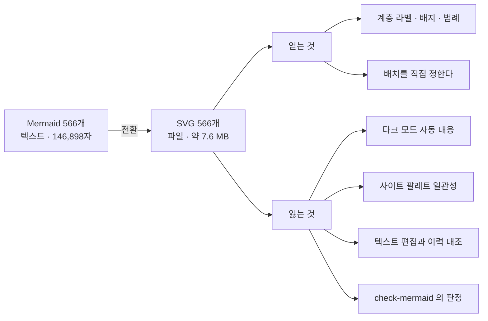
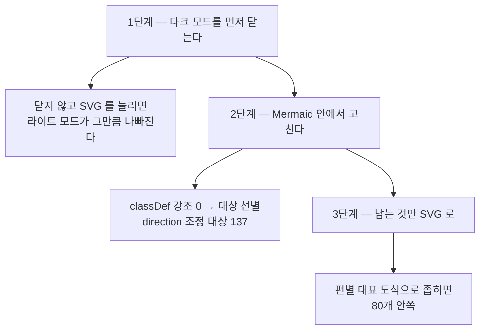

# 발행본 도식 566개의 품질 조사 — SVG 전환이 답인가

> 2026-09-16 · 조사만 했고 리포의 파일을 바꾸지 않았다.
> 사용자의 물음은 「`human-gate-and-model-routing` 편의 SVG 처럼 기존 도식을 전부 바꿔도 되는가」였다.

## 1. 결론

**전량 변환은 권하지 않는다.** 다만 사용자가 지적한 품질 문제는 실재하며, 원인이 형식이 아니라
**Mermaid 의 기능을 한 번도 쓰지 않은 것**에 있다.

| 무엇 | 판정 | 근거 |
| --- | --- | --- |
| 566개를 전부 SVG 로 | ⬜ **하지 않는다** | 중앙값 7줄이라 편집 디자인을 입힐 내용이 없고, 다크 모드가 역행한다 |
| 지목된 도식의 품질 문제 | 🔴 **실재한다** | `classDef` 0개 · `direction` 미지정으로 355×742 세로 늘어짐 |
| 그 해법 | ✅ **Mermaid 안에 있다** | 강조 두 줄과 방향 한 줄이면 형식을 바꾸지 않고 닫힌다 |
| SVG 가 값을 하는 자리 | ✅ **있다** | 계층 라벨 · 배지 · 범례는 자동 배치가 만들 수 없다. 대상은 편별 대표 도식 |

🔴 **이 조사는 2026-09-06 에 보류된 후보 A·C 를 다시 연 것이 아니다.** 그 보류의 조건은
「결함을 먼저 실측하라」였고, 이번에 실측된 결함은 **SVG 전환 없이 닫히는 종류**였다.
즉 결론은 후보 C 가 아니라 **후보 B(테마 교체)의 연장**으로 간다.

## 2. 규모 — 실측

| 항목 | 값 | 어떻게 셌나 |
| --- | ---: | --- |
| 발행본 Mermaid 블록 | **566개** | `check-mermaid.mjs` 의 `extractDiagrams` 를 직접 불러 파서로 셈 |
| 담고 있는 편 | **179편** / 193편 | 같은 스캔 |
| 문서 Mermaid 블록 | **136개** / 65파일 중 32파일 | 같은 스캔 (이 문서를 뺀 값) |
| 합계 | **702개** | 발행본 566 + 문서 136 |
| 종류 | flowchart 542 · sequenceDiagram 15 · stateDiagram-v2 9 | 블록의 첫 유효 줄 |
| 블록 줄 수 | 중앙값 **7** (p25 5 · p75 10 · p90 13 · 최대 47) | 분위수 |
| Mermaid 소스 총량 | 146,898자 | 블록 본문의 합 |
| SVG 1개 실측 | 14,111 B (전송 2,652 B) | `public/images/blog/multi-agent-system.svg` |
| 566개 SVG 환산 | 약 **7.6 MB** | 위 크기 × 566 |

**중앙값이 7줄이라는 것이 이 표의 핵심이다.** 566개 중 대부분은 상자 서넛에 화살표 몇 개뿐이라
계층 라벨이나 범례를 붙일 구조 자체가 없다.

카테고리별 분포는 다음과 같다.

| 카테고리 | 블록 | 편 |
| --- | ---: | ---: |
| `ai-agent` | 158 | 47 |
| `backend-engineering` | 118 | 38 |
| `rag` | 103 | 25 |
| `agentic-coding` | 85 | 28 |
| `ai-transformation` | 38 | 10 |
| `product-management` | 31 | 16 |
| `search-engineering` | 18 | 6 |
| `ai-product-planning` | 15 | 9 |

## 3. 결함 — 실측

사용자가 지목한 자리는 `human-gate-and-model-routing` 편의 `## 4. 승인 지점을 하나로 모은다`
아래 `stateDiagram-v2` 다. 배포된 페이지를 브라우저로 열어 쟀다.

| 관찰 | 수치 | 판정 |
| --- | ---: | --- |
| 도식 자연 크기 | 354.6 × 742 | 🔴 세로가 가로의 **2.1배** |
| 본문 컨테이너 폭 | 895 px | 🔴 그중 **355 px 만** 쓴다 |
| 라벨 넘침 | **0건** | ✅ 잘림은 없다 |
| 노드의 시각 위계 | 여섯 노드가 전부 동일 | 🔴 본문이 강조하는 자리가 드러나지 않는다 |

마지막 행이 핵심이다. 본문은 「사람이 개입하는 자리는 `사람대기` **하나뿐**」이라고 적는데,
도식에서는 여섯 상자가 모두 같은 하늘색이다. **글이 말하는 것을 그림이 받쳐 주지 못한다.**

### 3-1. 리포 전량에서 같은 것을 세었다

| 기능 | 566개 중 사용 | 비고 |
| --- | ---: | --- |
| `classDef` | **0** | |
| `style … fill/stroke` | **0** | |
| `:::className` | **0** | |
| `class` 문 | **0** | |
| **강조를 쓴 도식 (넷의 합집합)** | **0** | 🔴 한 번도 쓰지 않았다 |

🔴 **표기 하나만 세면 결론이 틀린다.** Mermaid 의 노드 강조는 `classDef`·`style`·`:::` 세 갈래이고
셋 다 문법이 다르다. 처음에 `classDef` 만 세었으나, 넷을 모두 세어도 0 이라 결론은 같았다.

방향 지정은 종류마다 문법이 달라 따로 세어야 한다.

| 종류 | 총계 | 가로 지정 | 세로(기본 포함) |
| --- | ---: | ---: | ---: |
| `flowchart` / `graph` | 542 | `LR`·`RL` **414** | `TD`·`TB`·`BT` **128** (미지정 0) |
| `stateDiagram-v2` | 9 | `direction LR`·`RL` **0** | **9** |
| `sequenceDiagram` | 15 | 해당 없음 | 해당 없음 (가로 고정) |
| **세로로 늘어지는 대상** | | | **137** |

🔴 **처음에 152 라고 적었던 것은 틀렸다.** `sequenceDiagram` 15개는 방향이라는 개념 자체가
없는데 「`LR` 이 지정되지 않은 것」으로 세어 포함했다. 실제 대상은 **137개**(flowchart 128 +
stateDiagram 9)다. ⇒ **종류가 섞인 집합에서 「지정되지 않은 것」을 세면 해당 없는 것까지 들어온다.**

## 4. SVG 전환의 수지



### 4-1. 얻는 것

배포된 SVG 에는 Mermaid 자동 배치가 만들 수 없는 것들이 들어 있다. 실물에서 확인했다.

| 요소 | Mermaid 로 가능한가 |
| --- | --- |
| `HUMAN CONTROL` · `AGENT PIPELINE` · `SUPPORT AGENTS` 계층 라벨 | `subgraph` 로 비슷하게는 되나 배치가 통제되지 않는다 |
| 노드마다 붙은 배지(`PLAN`·`CODE`·`REVIEW`)와 부제목 | 줄바꿈으로 흉내 낼 뿐 위계가 생기지 않는다 |
| 하단 범례 | **불가** |
| 실선과 점선의 의미 구분 | 가능하나 범례가 없으면 뜻이 전달되지 않는다 |

### 4-2. 잃는 것 — 다크 모드가 가장 크다

🔴 **배포된 페이지를 라이트 모드로 바꿔 실물을 확인했다.** 본문과 제목은 밝아지는데
**SVG 만 어두운 채로 남아** 흰 페이지에 검은 상자가 박힌다.

| 무엇 | Mermaid | SVG 파일 |
| --- | --- | --- |
| 테마 추종 | ✅ `useIsDark` 가 `<html class="dark">` 를 `MutationObserver` 로 구독해 **다시 그린다** | ❌ 색이 파일에 박힌다 |
| 팔레트 | ✅ `lib/mermaid-theme.ts` 292줄이 sky 계열과 대비 기준을 맞춘다 | ❌ `#2d3142`·`#f08a59` 로 별도 팔레트 |
| `prefers-color-scheme` | 해당 없음 | ❌ 현재 SVG 에 **0건** |

🔴 **그리고 `@media (prefers-color-scheme: dark)` 를 SVG 에 넣는 해법은 이 사이트에서 어긋난다.**
`components/theme-toggle.tsx` 를 읽으면 테마의 진실원이 `localStorage` 의 `portfolio-theme` 이고
OS 설정은 **저장값이 없을 때의 초기값일 뿐**이다. 사용자가 토글로 라이트를 골라도 OS 가 다크면
SVG 만 다크로 남는다. ⇒ **`` 안의 미디어 쿼리는 사이트의 테마 상태를 볼 수 없다.**

남는 해법은 둘이며 둘 다 비용이 있다.

| 해법 | 무엇을 하나 | 대가 |
| --- | --- | --- |
| **라이트·다크 두 벌** | `DiagramImage` 가 `useIsDark` 를 구독해 `src` 를 바꾼다 | 자산이 2배(566개면 약 15 MB) · 두 벌을 같이 고쳐야 한다 |
| **인라인 SVG** | `` 가 아니라 DOM 에 넣어 `currentColor`·CSS 변수를 쓴다 | 새 컴포넌트가 필요하고 페이지 HTML 이 커진다. 대신 자산 한 벌로 끝나고 금칙어 검사 범위에 들어온다 |

### 4-3. 유지보수

Mermaid 는 7줄짜리 텍스트라 버전 관리 이력에서 무엇이 바뀌었는지 읽힌다. SVG 는 14 KB 의
좌표 덩어리라 이력 대조가 성립하지 않고, 내용을 한 글자 고치려면 **재생성**해야 한다.

## 5. 앞선 검토(2026-09-06)의 제약 넷 — 현재 상태

`HANDOFF.md` 의 「🔴 이 리포에 그대로 적용할 수 없는 이유 넷」을 다시 쟀다. **둘이 바뀌었다.**

| # | 제약 | 그때 | 지금 |
| ---: | --- | --- | --- |
| 1 | 마크다운이 raw HTML 을 렌더하지 않는다 | 인라인 SVG 를 `.md` 에 넣으면 문자열로 찍힌다 | ✅ **우회로가 생겼다** — `` 이미지 참조는 `rehype-raw` 없이 동작하고, `components/markdown.tsx` 가 `img` 를 `DiagramImage` 로 보낸다 |
| 2 | 분량 예산이 흔들린다 | 인라인 SVG 는 바이트가 크다 | ✅ **우회로가 같은 것을 닫는다** — 이미지 참조는 `.md` 에 한 줄이라 밴드에 영향이 없다 |
| 3 | 다크 모드가 사라진다 | 정적 SVG 는 색이 고정된다 | 🔴 **그대로 유효하고, 실물로 확인했다** (§4-2) |
| 4 | 검사기가 무력해진다 | 발행본 549 · 문서 132 | 🔴 **그대로 유효하다.** 수치는 **발행본 566 · 문서 136** 으로 갱신 |

⇒ **제약 1·2 는 이미 뚫려 있었다.** `64861c7b` 커밋이 이미지 참조 방식으로 SVG 를 넣었고
`check-mermaid` 없이 발행되었다. 막고 있는 것은 이제 **3번과 4번뿐**이다.

## 6. 🔴 새로 드러난 사각지대 — SVG 안의 텍스트는 아무도 보지 않는다

| 검사 | 대상 | SVG 내부 텍스트를 보나 |
| --- | --- | --- |
| `check-forbidden` | `content/blog/**.md` | ❌ |
| `check-forbidden --built` | `out/blog` + `out/_next/data` | ❌ SVG 는 `out/images/blog/` 로 나간다 |
| `check-mermaid` | ` ```mermaid ` 블록 | ❌ 해당 없음 |
| `tests/blog` 도식 이미지 자산 5케이스 | 경로 형식 · 파일 실존 | ❌ **경로만 본다** |

🔴 **즉 배포된 `multi-agent-system.svg` 안의 「나 (사람)」·「기획 에이전트」 같은 문자열은
금칙어 검사를 한 번도 받지 않았다.** `links.test.ts` 의 주석도 이 사실을 인정하고 있다:
「`check-forbidden --built` 의 산출물 스캔도 `out/images/` 를 훑지 않는다」.

지금은 우연히 문제가 없지만 **SVG 를 늘리면 이 사각지대가 같은 배수로 커진다.** 이것은
`Ted_yanadoo.png` 가 산출물 366곳에 남는 동안 소스 스캔이 0을 반환하던 것과 같은 구조다.

## 7. 권장 순서



2단계를 건너뛰고 3단계로 가면 **한 줄이면 될 것을 14 KB 재생성 대상으로 바꾸게 된다.**

### 7-1. 3단계의 대상을 세었다

전환 후보를 기계가 고를 수 있는 기준으로 좁히면 이렇다.

| 기준 | 개수 |
| --- | ---: |
| 엣지 10개 이상 | 80 |
| `subgraph` 로 그룹 구조를 가짐 | 36 |
| state · sequence (자동 배치가 무너지기 쉽다) | 24 |
| **셋의 합집합** | **128개 (22.6%) · 80편** |
| 남는 단순 도식 | 438개 (77.4%) |

128개라도 전부 바꿀 필요는 없다. 편마다 대표 도식 하나로 좁히면 **80개 안쪽**이다.

후보가 몰린 편은 다음과 같다.

| 편 | 후보 수 |
| --- | ---: |
| `ai-transformation/agent-definition-by-department` | 5 |
| `rag/dify-enterprise-governance` | 5 |
| `ai-transformation/department-automation-backoffice` | 4 |
| `agentic-coding/rules-hooks-skills-layers` | 3 |
| `ai-agent/agent-pattern-catalog` | 3 |

## 8. 이번 조사가 정정한 수치

| 무엇 | 종전 기재 | 실측 | 어디에 적혀 있었나 |
| --- | ---: | ---: | --- |
| 발행본 Mermaid 블록 | 552 | **566** | `CLAUDE.md` |
| 발행본 · 문서 블록 | 549 · 132 | **566 · 136** | `HANDOFF.md` 제약 4번 |
| 세로로 늘어지는 도식 | 152 (이 조사의 첫 계산) | **137** | 이 문서 §3-1 |
| 문서 블록 | 135 (이 조사의 첫 계산) | **136** | 이 문서 §2 |

🔴 **네 수 모두 「이어받았거나 정규식으로 센」 값이었다.** 매번, 파서로 세라.

### 8-1. 🔴 정규식이 인용 블록 안의 도식을 보지 못한다

문서 블록을 처음에 정규식 `/^\s*```mermaid\s*$/` 로 세어 **135** 를 얻었으나 검사기는 **136** 을
냈다. 파일별로 대조해 찾은 자리는 하나다.

| 파일 | 줄 | 무엇 |
| --- | ---: | --- |
| `docs/superpowers/plans/2026-08-08-agentic-coding-category-split-design.md` | 563 | <code>> ```mermaid</code> — **인용 블록 안의 도식** |

정규식의 `^\s*` 는 공백만 허용하므로 `>` 로 시작하는 줄을 건너뛴다. 파서는 인용 블록 안의
코드 노드를 정상적으로 잡는다. ⇒ **이 리포에서 도식을 셀 때는 `check-mermaid.mjs` 의
`extractDiagrams` 를 직접 불러라.** 발행본 566개는 두 방법이 일치했으므로, 정규식이 맞아떨어진
것이 곧 정규식이 옳다는 뜻은 아니다.

## 9. 다시 실측할 명령

이 문서의 수치도 대조군 없이는 근거가 아니다. 다음으로 다시 센다.

```bash
# 도식 수는 검사기의 파서를 빌려 센다 — 정규식은 인용 블록 안의 것을 놓친다 (§8-1)
node --input-type=module -e '
import {readFileSync} from "node:fs";
import {execSync} from "node:child_process";
const {extractDiagrams} = await import("./scripts/check-mermaid.mjs");
const all = execSync("git -c core.quotePath=false ls-files", {encoding:"utf8"})
  .split("\n").filter(x => x.endsWith(".md"));
const pub = all.filter(f => f.startsWith("content/blog/"));
const doc = all.filter(f => !f.startsWith("content/blog/"));
const n = (fs) => fs.reduce((s,f) => s + extractDiagrams(readFileSync(f,"utf8")).length, 0);
console.log("발행본", n(pub), "· 문서", n(doc));
'
```

⚠️ **`git ls-files 'content/blog/**/*.md'` 는 0건을 낸다.** pathspec 의 `**` 가 이 환경에서
전개되지 않는다. 디렉터리만 주거나 전체를 받아 `.md` 를 코드에서 거른다.

⚠️ **도식의 넘침을 `getBBox()` 로 재지 마라.** 그것은 요소의 **로컬 좌표**를 돌려주므로
`viewBox` 와 직접 대조하면 멀쩡한 라벨 22개가 전부 위반으로 올라온다(실측). 화면 좌표는
`getBoundingClientRect()` 로 재고 SVG 자신의 사각형과 대조한다.

이 조사에서 겪은 함정 셋은 [`docs/TOOL-TRAPS.md`](../../TOOL-TRAPS.md) 에 **56~58** 로 남겼다.

| 번호 | 무엇 | 이 문서의 자리 |
| ---: | --- | --- |
| 56 | 정규식이 인용 블록 안의 코드 울타리를 세지 못한다 | §8-1 |
| 57 | `getBBox()` 는 로컬 좌표다 | §3 · 바로 위 |
| 58 | 「해당 없음」을 「지정하지 않음」으로 세면 대상이 부풀어 오른다 | §3-1 |

## 10. 이어서 답할 질문

| # | 질문 | 왜 필요한가 |
| ---: | --- | --- |
| 1 | 다크 모드 해법을 **두 벌**로 갈지 **인라인**으로 갈지 | §4-2 의 표. 인라인이 금칙어 사각지대(§6)도 함께 닫는다 |
| 2 | 2단계에서 `classDef` 를 **몇 개**에 넣을지 | 566개 전부인가, 강조할 노드가 있는 것만인가 |
| 3 | SVG 내부 텍스트 검사기를 만들지 | 만들지 않으면 SVG 를 늘릴수록 사각지대가 커진다 |
| 4 | 3단계 대상을 **기계 기준 128개**로 할지 **편별 대표 80개**로 할지 | 비용이 1.6배 차이난다 |
