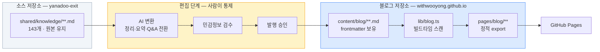
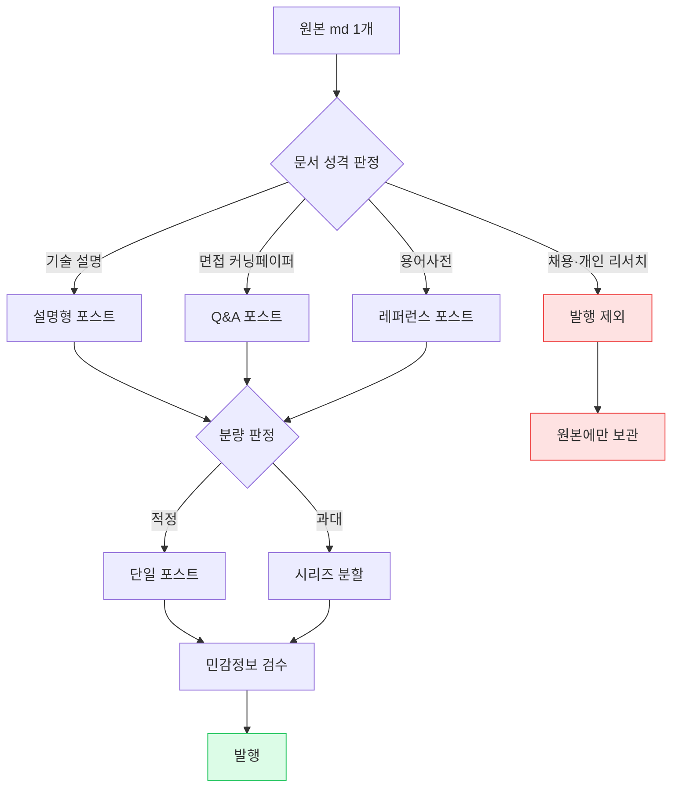

# 기술블로그 요구사항 문서

> **작성 기준일**: 2026-08-07
>
> **대상**: `withwooyong.github.io` — 기존 포트폴리오 사이트에 기술블로그 섹션을 추가한다.
>
> **소스**: `C:\Users\aeby\vscode\yanadoo-exit\shared\knowledge` (md 143개)
>
> **상태**: 요구사항 확정 대기. 승인 후 작업계획서(`docs/superpowers/plans/`)를 작성한다.

---

## §1. 개요

### 1-1. 무엇을 만드는가

기존 포트폴리오 사이트에 **기술블로그**를 추가한다. 별도 사이트가 아니라 `withwooyong.github.io/blog/` 경로의 섹션이며, 기존 Next.js 정적 export 빌드에 그대로 얹는다.

콘텐츠 소스는 별도 저장소에 쌓인 학습 정리 md 143개다. **그대로 발행하지 않는다.** 원본과 발행본 사이에 편집 단계를 두고, 편집된 발행본만 블로그 저장소에 들어온다.

### 1-2. 왜 만드는가

| 목적 | 우선순위 | 이 문서에 미치는 영향 |
|---|---|---|
| 기술 역량 브랜딩 | 1차 | SEO 활성화, 메인 사이트에서 대표글 노출, 개발총괄·CTO 지향 포지셔닝을 뒷받침하는 글 우선 배치 |
| 공개 지식 아카이브 | 2차 | 태그·카테고리·검색 등 탐색성 확보, 교차링크 |

브랜딩이 우선이므로 **품질 편차가 큰 글을 무분별하게 노출하지 않는다.** 전체는 색인하되 메인 사이트 전면에는 대표글만 건다.

### 1-3. 이 문서가 다루지 않는 것

구현 순서·소요 시간·파일 단위 작업 지시는 작업계획서의 몫이다. 이 문서는 **무엇을 만족해야 하는가**만 기술한다.

---

## §2. 소스 현황 (실측)

### 2-1. 전체 규모

| 항목 | 실측값 | 요구사항에 미치는 함의 |
|---|---|---|
| md 파일 수 | 143개 | 문서 목록 하드코딩 불가 → 파일시스템 스캔 필수 |
| 총 용량 | 4,880 KB | 정적 빌드 산출물 크기·빌드 시간 검토 필요 |
| 평균 / 최대 | 34 KB / 283 KB | 문서 1개 = 포스트 1개 매핑이 성립하지 않음 |
| 카테고리(폴더) | 16개 | 폴더명 재편 대상 |
| YAML frontmatter | **0개** | 메타데이터 자동 추출 장치 필요 |
| `> 작성 기준일` 메타 인용문 | **141개 (98.6%)** | ✅ frontmatter를 자동 생성할 근거가 됨 |
| mermaid 코드블록 포함 | **107개 (74.8%)** | 도식 렌더링이 선택이 아니라 필수 |
| 작성 시기 분포 | 2026-06: 29 / 2026-07: 112 | ⚠️ 시간역순 정렬이 정보를 주지 못함 |

**이 표가 말하는 것**: 메타데이터는 없어 보이지만 사실상 98.6%가 갖고 있고, 진짜 문제는 분량(평균 34KB)과 날짜 편중(두 달에 집중)이다.

### 2-2. 카테고리별 분포

| 현재 폴더 | 파일 | 합계 KB | 평균 KB | 실제 내용 |
|---|---:|---:|---:|---|
| `aiteam` | 18 | 116 | 6 | AI 전환 조직 설계, 워크플로우, 영역별 AI 활용 |
| `pm-po` | 17 | 320 | 19 | 프로덕트 도메인별 지식(커머스·핀테크·SaaS·O2O·물류) |
| `langgraph` | 12 | 498 | 42 | LangGraph·CrewAI·AutoGen 에이전트 프레임워크 |
| `rag` | 12 | 840 | 70 | RAG 파이프라인, Agentic RAG, 문서파싱, Dify |
| `aiagent` | 11 | 532 | 48 | Claude Code, MCP, 훅·스킬·플러그인, 멀티에이전트 |
| `high-traffic` | 11 | 496 | 45 | 성능테스트, 동시성, Kafka, Cassandra, K8s MSA |
| `java-backend` | 11 | 623 | 57 | DB 모델링, Redis, WebSocket, Batch, CI/CD, DDD |
| `learning` | 10 | 193 | 19 | 글로벌 서비스, OTT, OPA 인가, TMS, K8s 서빙, GraphRAG |
| `bigdata` | 8 | 286 | 36 | 대용량 트래픽 총정리, AWS 구성, CDC, 언어 선택 |
| `pm-harness` | 8 | 392 | 49 | PM 사고법, 기획 하네스, 세컨드브레인, 임베딩 검색 |
| `recommendation` | 7 | 82 | 12 | Python, Django/DRF, FastAPI, 크롤링, ML 추천 서빙 |
| `pangyo-it` | 6 | 337 | 56 | 판교 IT 리더십·채용 리서치 |
| `search` | 6 | 76 | 13 | 검색 시스템, Elasticsearch, 한글 처리, 운영 |
| (루트 단일 파일) | 3 | 29 | 10 | 팀 생산성, CTO 학습 로드맵, 도식 컨벤션 |
| `glossary` | 2 | 24 | 12 | AI 인프라 용어사전, 직책 용어사전 |
| `llm-search-recommend` | 1 | 36 | 36 | LLM 기반 검색·추천 |

**이 표가 말하는 것**: 폴더명 중 `bigdata`, `learning`, `aiagent`, `pm-po` 네 개는 내용과 이름이 어긋나 있다. `llm-search-recommend`는 단일 파일이라 독립 카테고리로 유지할 근거가 약하다.

### 2-3. 기존 사이트가 이미 갖고 있는 것

블로그를 **처음부터 만들 필요가 없다.** `pages/product-lead-wiki/`가 동일 문제를 이미 한 번 풀었다.

| 자산 | 위치 | 블로그 재사용 |
|---|---|---|
| md 빌드타임 로딩 | `lib/wiki.ts` (`fs` + `getStaticProps`) | 구조 재사용, 스캔 방식으로 일반화 |
| 마크다운 렌더러 | `components/markdown.tsx` | **거의 그대로 재사용** (GFM·표·코드·링크) |
| Mermaid 렌더 | `components/mermaid.tsx` | 그대로 재사용 (107개 문서에 필수) |
| 목차 자동 생성 | `lib/wiki.ts` `buildToc()` | 그대로 재사용 (`rehype-slug`와 id 일치) |
| 문서 셸 레이아웃 | `components/wiki-shell.tsx` | 참고 후 블로그용으로 신규 작성 |
| 다크모드 | `components/theme-toggle.tsx` | 그대로 재사용 |
| SEO 헤드 | `components/site-head.tsx` | 재사용 (단, 위키의 `noindex`는 블로그에 적용 안 함) |

의존성도 이미 설치되어 있다 — `react-markdown`, `remark-gfm`, `rehype-slug`, `github-slugger`, `mermaid`.

---

## §3. 확정된 결정 사항

| # | 결정 항목 | 확정 내용 |
|---|---|---|
| D1 | 편집 방식 | **AI 변환 → 사용자 검수 → 발행.** 변환 규칙을 문서로 고정하고 배치로 실행 |
| D2 | 발행 원고 위치 | **블로그 저장소 안** (`content/blog/`). 원본은 `yanadoo-exit`에 그대로 두고 두 버전을 분리 |
| D3 | 블로그 목적 | **브랜딩 우선 + 아카이브 병행.** 전체 색인, 메인 노출은 대표글만 |
| D4 | 포스트 단위 | **분량 기준 유연 적용.** 적정 분량은 1:1, 과대 문서는 섹션 경계로 분할해 시리즈로 묶음 |

---

## §4. 시스템 구조

### 4-1. 콘텐츠 흐름



**핵심**: 편집 단계가 빌드 파이프라인 **밖**에 있다. 빌드는 이미 검수된 `content/blog/`만 읽으므로, 민감정보 필터링 로직이 런타임에 존재하지 않는다. 검수되지 않은 글은 애초에 저장소에 들어오지 않는다.

### 4-2. 왜 원본을 직접 읽지 않는가

| 방식 | 장점 | 치명적 단점 |
|---|---|---|
| 원본을 빌드 때 직접 읽기 | 원본 수정이 즉시 반영 | 저장소 간 동기화 필요, **민감정보 필터를 코드로 보장해야 함**(누락 시 사고), 원본 편집 시 사이트가 깨질 수 있음 |
| **발행본 분리 (채택)** | 저장소 자립, 검수된 것만 존재, 빌드 단순 | 원본 갱신 시 재변환 필요 |

기존 `lib/wiki.ts`가 `sanitize()`로 면접 섹션을 런타임에 도려내는 것은 원본을 손댈 수 없어서 생긴 임시방편이다. 발행본을 분리하면 그 복잡도가 사라진다.

### 4-3. 라우트 구조

| 경로 | 역할 |
|---|---|
| `/blog/` | 블로그 홈 — 카테고리 개관, 대표글, 최근 추가글 |
| `/blog/[category]/` | 카테고리별 글 목록 |
| `/blog/[category]/[slug]/` | 개별 포스트 |
| `/blog/tags/` | 태그 인덱스 |
| `/blog/tags/[tag]/` | 태그별 글 목록 |

기존 사이트가 `trailingSlash: true`이므로 모든 경로는 슬래시로 끝난다.

---

## §5. 기능 요구사항 (FR)

### 5-1. 콘텐츠 렌더링

| ID | 요구사항 | 우선순위 |
|---|---|---|
| FR-1.1 | GFM 마크다운(표·체크박스·취소선·자동링크)을 렌더링한다 | 필수 |
| FR-1.2 | ` ```mermaid ` 코드블록을 도식으로 렌더링한다 (소스의 74.8%가 사용) | 필수 |
| FR-1.3 | 코드블록은 언어별 문법 강조를 적용한다 | 권장 |
| FR-1.4 | H2·H3 기준 목차를 자동 생성하고, 스크롤에 따라 현재 위치를 표시한다 | 필수 |
| FR-1.5 | 표는 좁은 화면에서 가로 스크롤로 처리한다 (기존 `markdown.tsx` 동작 유지) | 필수 |
| FR-1.6 | 한글 줄바꿈은 `break-keep`을 적용해 어절 단위로 끊는다 | 필수 |
| FR-1.7 | 다크모드를 지원한다 (기존 `theme-toggle` 재사용) | 필수 |

### 5-2. 탐색

| ID | 요구사항 | 우선순위 |
|---|---|---|
| FR-2.1 | **주제(카테고리) 기반 탐색이 1차 네비게이션이다.** 날짜가 두 달에 몰려 있어 시간역순은 보조 수단에 그친다 | 필수 |
| FR-2.2 | 카테고리 목록에 각 카테고리의 글 수와 한 줄 설명을 표시한다 | 필수 |
| FR-2.3 | 태그로 카테고리를 가로지르는 탐색을 제공한다 (예: `kafka`가 `high-traffic`과 `backend-engineering`에 동시 존재) | 필수 |
| FR-2.4 | 같은 시리즈(분할된 긴 글)는 이전/다음 글로 연결한다 | 필수 |
| FR-2.5 | 관련 글을 태그 교집합 기준으로 추천한다 | 권장 |
| FR-2.6 | 클라이언트 사이드 전문 검색을 제공한다 | 선택 |

> FR-2.6은 정적 사이트라 인덱스를 빌드 타임에 만들어 번들해야 한다. 4.9MB 소스 기준 인덱스 크기를 먼저 측정하고, 과하면 제목·요약·태그만 대상으로 축소한다. **1차 범위에서는 제외하고 2차에서 판단한다.**

### 5-3. 메타데이터

| ID | 요구사항 | 우선순위 |
|---|---|---|
| FR-3.1 | 발행본 md는 YAML frontmatter를 갖는다 (§6-3 스키마) | 필수 |
| FR-3.2 | frontmatter 초안은 원본의 `> 작성 기준일 / 목적 / 원본` 인용문에서 자동 추출한다 | 필수 |
| FR-3.3 | frontmatter가 스키마를 위반하면 **빌드를 실패시킨다** (조용히 넘어가지 않는다) | 필수 |
| FR-3.4 | `draft: true`인 글은 빌드 산출물에서 제외한다 | 필수 |

### 5-4. 메인 사이트 연동

| ID | 요구사항 | 우선순위 |
|---|---|---|
| FR-4.1 | 기존 `portfolio-nav`에 블로그 진입점을 추가한다 | 필수 |
| FR-4.2 | 메인 페이지에 대표글 3~5개를 노출한다 (`featured: true`) | 필수 |
| FR-4.3 | 블로그에서 메인 포트폴리오로 돌아가는 경로를 유지한다 | 필수 |

### 5-5. SEO·배포

| ID | 요구사항 | 우선순위 |
|---|---|---|
| FR-5.1 | 각 포스트에 고유 title·description·canonical을 설정한다 (위키의 `noindex`는 **적용하지 않음**) | 필수 |
| FR-5.2 | `sitemap.xml`을 빌드 타임에 생성한다 | 필수 |
| FR-5.3 | Article 구조화 데이터(JSON-LD)를 삽입한다 | 권장 |
| FR-5.4 | OG 이미지를 제공한다 (정적 기본 이미지 또는 카테고리별 이미지) | 권장 |
| FR-5.5 | RSS 피드를 생성한다 | 선택 |
| FR-5.6 | `next build`의 정적 export만으로 동작한다 — Node 런타임 의존 금지 | 필수 |

---

## §6. 콘텐츠 변환 요구사항 (CR)

이 절이 이 프로젝트의 핵심이다. 기술 구조보다 여기서 품질이 갈린다.

### 6-1. 변환 원칙



### 6-2. 공통 변환 규칙

| ID | 규칙 | 근거 |
|---|---|---|
| CR-1.1 | **1인칭 학습 기록 톤 → 설명체로 전환.** "~를 학습했다" → "~는 ~하게 동작한다" | 독자는 저자의 학습 이력이 아니라 기술 자체를 찾아온다 |
| CR-1.2 | **원본 메타 인용문(`> 작성 기준일 / 목적 / 원본`)은 본문에서 제거**하고 frontmatter로 옮긴다 | 본문 첫 화면을 메타데이터가 차지하지 않게 |
| CR-1.3 | **"이 문서는 학습한 지식이며 본인 실적이 아니다" 류의 주의문은 제거**하고, 필요 시 글 하단에 출처 표기로 대체한다 | 방어적 문구가 본문 앞에 오면 신뢰도를 스스로 깎는다 |
| CR-1.4 | **면접 목적 표현을 전부 걷어낸다** — "면접 직전", "암기용", "화이트보드", "예상 질문" 등 | 구직 활동 흔적을 노출하지 않는다 |
| CR-1.5 | **도입부를 새로 쓴다.** 이 글이 어떤 문제를 다루고 누가 읽으면 좋은지 2~3문장 | 원본은 목차부터 시작해 맥락이 없다 |
| CR-1.6 | **표와 mermaid 도식은 최대한 보존한다.** 산문으로 풀지 않는다 | 이 소스의 최대 강점이며 107개 문서가 이미 도식을 갖고 있다 |
| CR-1.7 | **저장소 밖 문서를 가리키는 상대경로 링크는 제거하거나 발행본 경로로 교체한다** | 죽은 링크 방지 |
| CR-1.8 | **회사 내부 정보·실명 조직도·미공개 아키텍처는 일반화하거나 제거한다** | §6-5 |

### 6-3. frontmatter 스키마

```yaml
---
title: "RAG 파이프라인 8단계 — 검색증강생성의 구조"   # 필수. 원본 H1을 다듬어 사용
description: "RAG를 8단계로 나눠 각 단계의 선택지와 튜닝 파라미터, 실패 모드를 정리한다."  # 필수. 원본 '목적'에서 추출
category: "rag"                    # 필수. §7 재편 슬러그 중 하나
tags: ["rag", "embedding", "vector-db", "langchain"]  # 필수. 2~6개
date: "2026-07-26"                 # 필수. 원본 '작성 기준일'
updated: "2026-08-07"              # 선택. 변환·수정일
series: "rag-pipeline"             # 선택. 분할된 시리즈 식별자
seriesOrder: 1                     # series가 있으면 필수
featured: false                    # 필수. 메인 노출 여부
draft: false                       # 필수. true면 빌드 제외
source: "테디노트 RAG 비법노트"      # 선택. 학습 출처 표기
---
```

| 필드 | 자동 추출 가능 | 추출 근거 |
|---|---|---|
| `title` | 부분 | 원본 H1 → 다듬기 필요 |
| `description` | 부분 | 원본 `> 목적:` → 1문장으로 압축 |
| `date` | **완전** | 원본 `> 작성 기준일:` (141/143 보유) |
| `source` | **완전** | 원본 `> 원본:` |
| `category` | **완전** | 원본 폴더 → §7 매핑 |
| `tags` | 불가 | 본문 판단 필요 |
| `featured` | 불가 | 사용자 결정 |

### 6-4. 면접 문서 → Q&A 변환 규칙

대상은 9개 파일이다.

| 원본 | 카테고리 |
|---|---|
| `aiagent/10-면접-커닝페이퍼.md` | Claude Code |
| `high-traffic/10-면접-커닝페이퍼.md` | 대용량 트래픽 |
| `java-backend/10-면접-커닝페이퍼.md` | 백엔드 엔지니어링 |
| `langgraph/11-면접-커닝페이퍼.md` | AI 에이전트 프레임워크 |
| `pm-harness/10-면접-커닝페이퍼.md` | 프로덕트 매니지먼트 |
| `rag/11-면접-커닝페이퍼.md` | RAG |
| `recommendation/06-면접-커닝페이퍼.md` | Python·ML 서빙 |
| `search/05-면접-커닝페이퍼.md` | 검색 엔지니어링 |
| `aiteam/08_면접_스토리텔링.md` | AI 전환 조직 |

**원본 구조와 변환 매핑** (`search/05` 실제 구조 기준):

| 원본 섹션 | 성격 | 변환 |
|---|---|---|
| A. 나의 한 줄 서사 | 개인 서사 | **제거.** 포트폴리오 본문의 역할이지 블로그 글의 역할이 아니다 |
| B. 반드시 기억할 숫자·키워드 | 압축 기술 레퍼런스 | **보존·확장.** "핵심 수치 정리" 섹션으로. 각 수치에 왜 그 값인지 한 줄 설명 추가 |
| C. 내가 직접 구현한 것 | 경험 기반 기술 내용 | **일반화해 보존.** "직접 구현이 필요한 지점"으로 관점 전환 |
| D 이하 예상 질문류 | 면접 대비 | **Q&A 본문으로 전환** |

**Q&A 포스트 형식:**

```markdown
## Q. Elasticsearch에서 자동완성에 edge_ngram을 검색 분석기에도 걸면 어떻게 되나?

검색어가 다시 n-gram으로 쪼개져 의도하지 않은 문서까지 매칭된다.
`edge_ngram`은 **색인 분석기에만** 적용하고 검색 분석기는 `standard`나
`keyword`를 쓴다.

| 위치 | 분석기 | 이유 |
|---|---|---|
| 색인 | `edge_ngram` | "검색어"를 "검","검색","검색어"로 확장해 저장 |
| 검색 | `standard` | 입력을 그대로 매칭. 재확장하면 노이즈 |
```

| ID | 규칙 |
|---|---|
| CR-2.1 | 질문은 **기술 질문 형태**로 쓴다. "면접에서 자주 나오는" 같은 수식을 붙이지 않는다 |
| CR-2.2 | 답변은 **결론 먼저, 근거 다음** 순서로 쓴다 |
| CR-2.3 | 답변마다 표·코드·도식 중 하나를 최소 1개 포함한다 |
| CR-2.4 | 개인 경력 서사(회사명·재직 이력 기반 서술)는 제거하거나 회사명 없이 일반화한다 |
| CR-2.5 | 카테고리당 Q&A 포스트 1개를 원칙으로 하되, 질문이 20개를 넘으면 주제별로 분할한다 |

### 6-5. 민감정보 처리 규칙

| ID | 대상 | 처리 |
|---|---|---|
| CR-3.1 | 전 직장 실제 인프라 구성 (`bigdata/야나두_실제_AWS_구성도.md`) | **발행 제외** 또는 회사명·실제 수치를 제거한 일반 패턴으로 재작성 |
| CR-3.2 | 채용·회사 리서치 (`pangyo-it/*` 6개) | **발행 제외.** 원본에만 보관 |
| CR-3.3 | 개인 커리어 계획 (`cto_learning_roadmap.md`) | **발행 제외** 또는 학습 로드맵으로 탈개인화 |
| CR-3.4 | 본문 중 회사 내부 수치·조직 구조·미공개 일정 | 일반화 또는 제거 |
| CR-3.5 | 특정 인물 실명 | 제거 |

> **최종 판단은 사용자가 한다.** AI 변환 시 위 후보를 표시해 검수 목록으로 제출하고, 사용자 승인 없이 발행하지 않는다.

### 6-6. 분량 기준 (D4 구체화)

| 원본 크기 | 처리 | 대상 수(실측) |
|---|---|---:|
| ~40 KB | 단일 포스트 | 93개 |
| 40~80 KB | 원칙적으로 단일 포스트. H2 섹션이 독립적이면 분할 검토 | 42개 |
| 80 KB~ | **시리즈로 분할.** H2 경계를 우선 기준으로 삼는다 | 8개 |

80KB 초과 8개 중 `pangyo-it/pangyo-leadership-04-company-db.md`(283KB)는 발행 제외 대상이므로, **실제 분할 대상은 7개**다.

| 분할 대상 | KB | 카테고리 |
|---|---:|---|
| `rag/10-Loop-Engineering-2026하반기.md` | 120 | RAG |
| `rag/03-문서파싱-레이아웃파서-멀티모달.md` | 103 | RAG |
| `rag/09-2026상반기-AI-Agent-일하는방식.md` | 99 | RAG |
| `bigdata/CDC_솔루션비교_및_국내기업_CQRS.md` | 96 | 데이터 인프라 |
| `java-backend/09-DDD-헥사고날-Kafka-주문결제.md` | 88 | 백엔드 엔지니어링 |
| `rag/06-Dify-노코드-워크플로우-사내AI.md` | 86 | RAG |
| `java-backend/06-CI-CD-GitHub-Actions-Jenkins.md` | 81 | 백엔드 엔지니어링 |

| ID | 규칙 |
|---|---|
| CR-4.1 | 분할 단위는 H2(`## §N.`) 경계를 우선한다. 문단 중간을 자르지 않는다 |
| CR-4.2 | 분할된 글은 동일 `series` 값을 갖고 `seriesOrder`로 순서를 표시한다 |
| CR-4.3 | 시리즈 첫 글에 전체 목차와 각 편 요약을 넣는다 |
| CR-4.4 | 분할 후 각 글은 단독으로 읽을 수 있어야 한다. 앞 글에만 있는 용어는 재정의하거나 링크한다 |

---

## §7. 카테고리 재편 (제안)

폴더명을 "하위 파일이 설명하는 기술을 대표하는 이름"으로 바꾼다. **슬러그는 영문**(URL·SEO), **표시명은 한글**(가독성)로 분리한다.

| 현재 폴더 | 제안 슬러그 | 표시명 | 파일 | 변경 사유 |
|---|---|---|---:|---|
| `rag` | `rag` | RAG · 검색증강생성 | 12 | 유지 — 이름이 내용과 일치 |
| `search` | `search-engineering` | 검색 엔지니어링 | 6 | 범위 명확화 (ES 운영 포함) |
| `high-traffic` | `high-traffic` | 대용량 트래픽 | 11 | 유지 |
| `java-backend` | `backend-engineering` | 백엔드 엔지니어링 | 11 | 내용이 Java에 한정되지 않음 (Redis·Kafka·CI/CD·DDD) |
| `bigdata` | `data-infrastructure` | 데이터 인프라 | 8 | ⚠️ 내용은 CDC·AWS 구성·언어 선택으로 "빅데이터"가 아님 |
| `langgraph` | `ai-agent-framework` | AI 에이전트 프레임워크 | 12 | ⚠️ LangGraph 외 CrewAI·AutoGen·LangChain 포함 |
| `aiagent` | `claude-code` | Claude Code · 에이전틱 코딩 | 11 | ⚠️ 내용이 Claude Code 실무에 특화 |
| `aiteam` | `ai-transformation` | AI 전환 조직 | 18 | 조직·프로세스 관점임을 명시 |
| `pm-po` | `product-domains` | 프로덕트 도메인 | 17 | ⚠️ 직무명이 아니라 도메인 지식 모음 |
| `pm-harness` | `product-management` | 프로덕트 매니지먼트 | 8 | "하네스"는 내부 용어 |
| `learning` | `platform-architecture` | 플랫폼 아키텍처 | 10 | ⚠️ "learning"은 분류가 아님. 실제 내용은 글로벌·OTT·인가·TMS |
| `recommendation` | `python-ml-serving` | Python · ML 서빙 | 7 | ⚠️ 내용의 대부분이 Python·Django·FastAPI·배포 |
| `glossary` | `glossary` | 용어사전 | 2 | 유지 |
| `llm-search-recommend` | → `rag`로 병합 | — | 1 | 단일 파일. 독립 카테고리 근거 부족 |
| `pangyo-it` | **발행 제외** | — | 6 | CR-3.2 |
| (루트 3개) | 개별 재배치 | — | 3 | `claude-code-team-productivity` → `claude-code`<br/>`cto_learning_roadmap` → 제외 검토(CR-3.3)<br/>`diagram-convention` → `platform-architecture` |

**결과**: 16개 폴더 → **12개 공개 카테고리**.

| 구분 | 수 | 내역 |
|---|---:|---|
| 원본 전체 | 143 | — |
| 발행 제외(확정 후보) | **8** | `pangyo-it` 6 + `bigdata/야나두_실제_AWS_구성도` 1 + `cto_learning_roadmap` 1 |
| **발행 대상** | **135** | 이 중 9개는 Q&A 포스트로 변환(§6-4), 7개는 시리즈로 분할(§6-6) |

제외 8개는 §6-5 규칙에서 도출한 **확정 후보**이며, 변환 과정에서 본문을 읽고 추가될 수 있다. 최종 목록은 Q2에서 확정한다.

⚠️ 표시가 붙은 7개가 이름과 내용이 어긋났던 폴더다.

| ID | 요구사항 |
|---|---|
| CR-5.1 | 슬러그는 소문자 영문·하이픈만 사용한다 |
| CR-5.2 | 카테고리 정의(슬러그·표시명·설명·정렬순서)는 **단일 소스**(`content/categories.ts` 등)에서 관리한다 |
| CR-5.3 | 카테고리 순서는 브랜딩 우선순위를 반영한다 (AI·플랫폼 아키텍처를 앞에) |

---

## §8. 비기능 요구사항 (NFR)

| ID | 항목 | 기준 |
|---|---|---|
| NFR-1 | 빌드 | `npm run build` 정적 export만으로 완료. Node 런타임 의존 금지 |
| NFR-2 | 빌드 시간 | 135개 원본에서 파생된 포스트 기준 로컬 빌드 5분 이내 |
| NFR-3 | 페이지 용량 | 단일 포스트 HTML 300KB 이내 (초과 시 §6-6 분할 대상) |
| NFR-4 | Mermaid 로딩 | 도식은 뷰포트 진입 시 렌더 (기존 `mermaid.tsx` 동작 확인 필요) |
| NFR-5 | 모바일 | 360px 폭에서 가로 스크롤 없이 읽힌다. 표는 자체 스크롤 |
| NFR-6 | 접근성 | 헤딩 계층 유지, 이미지 alt, 키보드 탐색 가능 |
| NFR-7 | 라이트하우스 | 성능·접근성·SEO 각 90점 이상 |
| NFR-8 | 기존 페이지 무영향 | 메인·`product-lead-*`·`en` 페이지 빌드와 렌더가 변하지 않는다 |

---

## §9. 범위 밖 (YAGNI)

| 항목 | 제외 사유 |
|---|---|
| 댓글 시스템 | 정적 사이트에 외부 서비스 의존 추가. 필요해지면 그때 |
| 조회수·애널리틱스 대시보드 | 1차 목표는 발행. 측정은 콘텐츠가 쌓인 뒤 |
| 다국어 블로그 | `pages/en/`은 포트폴리오만. 블로그 번역은 별건 |
| CMS·관리자 UI | md 직접 편집으로 충분 |
| 백링크 그래프뷰 | 콘텐츠 간 링크가 아직 없다. 교차링크가 쌓인 뒤 판단 |
| 원본 저장소 자동 동기화 | D2에서 발행본 분리를 택했으므로 불필요 |
| 전문 검색 (FR-2.6) | 1차 제외. 인덱스 크기 측정 후 2차 판단 |

---

## §10. 성공 기준

| # | 기준 | 검증 방법 |
|---|---|---|
| SC-1 | `npm run build`가 오류 없이 통과하고 `out/blog/`에 정적 파일이 생성된다 | 빌드 실행 후 산출물 확인 |
| SC-2 | 발행된 모든 포스트가 frontmatter 스키마를 만족한다 | 빌드 타임 검증이 통과 = 만족 |
| SC-3 | mermaid 도식이 포함된 포스트에서 도식이 실제로 렌더된다 | 브라우저에서 최소 3개 카테고리 확인 |
| SC-4 | 민감정보 제외 목록(§6-5)의 문서가 `out/`에 존재하지 않는다 | 산출물 전체 텍스트 검색 |
| SC-5 | 면접 관련 표현("면접", "커닝페이퍼", "암기용")이 발행 산출물에 없다 | 산출물 전체 텍스트 검색 |
| SC-6 | 360px 폭에서 가로 스크롤이 발생하지 않는다 | 브라우저 개발자도구 확인 |
| SC-7 | 기존 페이지의 빌드 산출물이 변경되지 않는다 | 블로그 추가 전후 `out/` diff |
| SC-8 | 대표글이 메인 페이지에서 접근 가능하다 | 링크 클릭 확인 |

SC-4·SC-5는 **산출물을 직접 검색해** 확인한다. 코드를 읽고 "제외되도록 짰다"는 검증이 아니다.

---

## §11. 미결 사항

| # | 항목 | 결정 필요 시점 |
|---|---|---|
| Q1 | §7 카테고리 재편안(슬러그·표시명)을 그대로 채택할지 | 작업계획서 작성 전 |
| Q2 | 발행 제외 후보 8개(`pangyo-it` 6 + 야나두 AWS 구성도 + CTO 로드맵)를 최종 확정 | 변환 시작 전 |
| Q3 | 1차 발행 범위 — 전체 135개인지, 카테고리 몇 개로 시작할지 | 작업계획서 작성 전 |
| Q4 | 대표글(`featured`) 선정 기준과 개수 | 1차 발행 직전 |
| Q5 | 블로그 진입 경로를 `/blog/`로 할지 다른 이름으로 할지 | 구현 시작 전 |
| Q6 | 코드 문법 강조 라이브러리 도입 여부 (번들 크기 vs 가독성) | 구현 중 |

---

## 부록 A. 용어

| 용어 | 이 문서에서의 뜻 |
|---|---|
| 원본 | `yanadoo-exit/shared/knowledge/`의 md. 수정하지 않는다 |
| 발행본 | `withwooyong.github.io/content/blog/`의 md. 변환·검수를 거친 결과 |
| 변환 | 원본을 발행본으로 바꾸는 편집 작업 (§6) |
| 포스트 | 발행본 md 1개 = 블로그 페이지 1개 |
| 시리즈 | 하나의 원본이 분할되어 생긴 포스트 묶음 |
