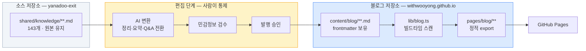
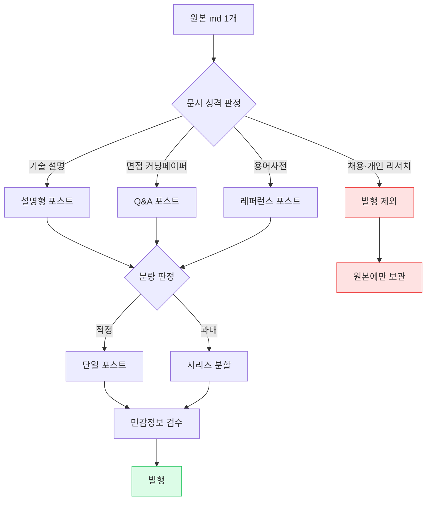

# 기술블로그 요구사항 문서

> **작성 기준일**: 2026-08-07
>
> **대상**: `withwooyong.github.io` — 기존 포트폴리오 사이트에 기술블로그 섹션을 추가한다.
>
> **소스**: `C:\Users\aeby\vscode\yanadoo-exit\shared\knowledge` (md 143개)
>
> **상태**: 요구사항 확정 대기. 승인 후 작업계획서(`docs/superpowers/plans/`)를 작성한다.

---

## §1. 개요

### 1-1. 무엇을 만드는가

기존 포트폴리오 사이트에 **기술블로그**를 추가한다. 별도 사이트가 아니라 `withwooyong.github.io/blog/` 경로의 섹션이며, 기존 Next.js 정적 export 빌드에 그대로 얹는다.

콘텐츠 소스는 별도 저장소에 쌓인 학습 정리 md 143개다. **그대로 발행하지 않는다.** 원본과 발행본 사이에 편집 단계를 두고, 편집된 발행본만 블로그 저장소에 들어온다.

### 1-2. 왜 만드는가

| 목적 | 우선순위 | 이 문서에 미치는 영향 |
| --- | --- | --- |
| 기술 역량 브랜딩 | 1차 | SEO 활성화, 메인 사이트에서 대표글 노출, 개발총괄·CTO 지향 포지셔닝을 뒷받침하는 글 우선 배치 |
| 공개 지식 아카이브 | 2차 | 태그·카테고리·검색 등 탐색성 확보, 교차링크 |

브랜딩이 우선이므로 **품질 편차가 큰 글을 무분별하게 노출하지 않는다.** 전체는 색인하되 메인 사이트 전면에는 대표글만 건다.

### 1-3. 이 문서가 다루지 않는 것

구현 순서·소요 시간·파일 단위 작업 지시는 작업계획서의 몫이다. 이 문서는 **무엇을 만족해야 하는가**만 기술한다.

---

## §2. 소스 현황 (실측)

### 2-1. 전체 규모

| 항목 | 실측값 | 요구사항에 미치는 함의 |
| --- | --- | --- |
| md 파일 수 | 143개 | 문서 목록 하드코딩 불가 → 파일시스템 스캔 필수 |
| 총 용량 | 4,880 KB | 정적 빌드 산출물 크기·빌드 시간 검토 필요 |
| 평균 / 최대 | 34 KB / 283 KB | 문서 1개 = 포스트 1개 매핑이 성립하지 않음 |
| 카테고리(폴더) | 16개 | 폴더명 재편 대상 |
| YAML frontmatter | **0개** | 메타데이터 자동 추출 장치 필요 |
| `> 작성 기준일` 메타 인용문 | **141개 (98.6%)** | ✅ frontmatter를 자동 생성할 근거가 됨 |
| mermaid 코드블록 포함 | **107개 (74.8%)** | 도식 렌더링이 선택이 아니라 필수 |
| 작성 시기 분포 | 2026-06: 29 / 2026-07: 112 | ⚠️ 시간역순 정렬이 정보를 주지 못함 |

**이 표가 말하는 것**: 메타데이터는 없어 보이지만 사실상 98.6%가 갖고 있고, 진짜 문제는 분량(평균 34KB)과 날짜 편중(두 달에 집중)이다.

### 2-2. 카테고리별 분포

| 현재 폴더 | 파일 | 합계 KB | 평균 KB | 실제 내용 |
| --- | ---: | ---: | ---: | --- |
| `aiteam` | 18 | 116 | 6 | AI 전환 조직 설계, 워크플로우, 영역별 AI 활용 |
| `pm-po` | 17 | 320 | 19 | 프로덕트 도메인별 지식(커머스·핀테크·SaaS·O2O·물류) |
| `langgraph` | 12 | 498 | 42 | LangGraph·CrewAI·AutoGen 에이전트 프레임워크 |
| `rag` | 12 | 840 | 70 | RAG 파이프라인, Agentic RAG, 문서파싱, Dify |
| `aiagent` | 11 | 532 | 48 | Claude Code, MCP, 훅·스킬·플러그인, 멀티에이전트 |
| `high-traffic` | 11 | 496 | 45 | 성능테스트, 동시성, Kafka, Cassandra, K8s MSA |
| `java-backend` | 11 | 623 | 57 | DB 모델링, Redis, WebSocket, Batch, CI/CD, DDD |
| `learning` | 10 | 193 | 19 | 글로벌 서비스, OTT, OPA 인가, TMS, K8s 서빙, GraphRAG |
| `bigdata` | 8 | 286 | 36 | 대용량 트래픽 총정리, AWS 구성, CDC, 언어 선택 |
| `pm-harness` | 8 | 392 | 49 | PM 사고법, 기획 하네스, 세컨드브레인, 임베딩 검색 |
| `recommendation` | 7 | 82 | 12 | Python, Django/DRF, FastAPI, 크롤링, ML 추천 서빙 |
| `pangyo-it` | 6 | 337 | 56 | 판교 IT 리더십·채용 리서치 |
| `search` | 6 | 76 | 13 | 검색 시스템, Elasticsearch, 한글 처리, 운영 |
| (루트 단일 파일) | 3 | 29 | 10 | 팀 생산성, CTO 학습 로드맵, 도식 컨벤션 |
| `glossary` | 2 | 24 | 12 | AI 인프라 용어사전, 직책 용어사전 |
| `llm-search-recommend` | 1 | 36 | 36 | LLM 기반 검색·추천 |

**이 표가 말하는 것**: 폴더명 중 `bigdata`, `learning`, `aiagent`, `pm-po` 네 개는 내용과 이름이 어긋나 있다. `llm-search-recommend`는 단일 파일이라 독립 카테고리로 유지할 근거가 약하다.

### 2-3. 기존 사이트가 이미 갖고 있는 것

블로그를 **처음부터 만들 필요가 없다.** `pages/product-lead-wiki/`가 동일 문제를 이미 한 번 풀었다.

| 자산 | 위치 | 블로그 재사용 |
| --- | --- | --- |
| md 빌드타임 로딩 | `lib/wiki.ts` (`fs` + `getStaticProps`) | 구조 재사용, 스캔 방식으로 일반화 |
| 마크다운 렌더러 | `components/markdown.tsx` | **거의 그대로 재사용** (GFM·표·코드·링크) |
| Mermaid 렌더 | `components/mermaid.tsx` | 그대로 재사용 (107개 문서에 필수) |
| 목차 자동 생성 | `lib/wiki.ts` `buildToc()` | 그대로 재사용 (`rehype-slug`와 id 일치) |
| 문서 셸 레이아웃 | `components/wiki-shell.tsx` | 참고 후 블로그용으로 신규 작성 |
| 다크모드 | `components/theme-toggle.tsx` | 그대로 재사용 |
| SEO 헤드 | `components/site-head.tsx` | 재사용 (단, 위키의 `noindex`는 블로그에 적용 안 함) |

의존성도 이미 설치되어 있다 — `react-markdown`, `remark-gfm`, `rehype-slug`, `github-slugger`, `mermaid`.

---

## §3. 확정된 결정 사항

| # | 결정 항목 | 확정 내용 |
| --- | --- | --- |
| D1 | 편집 방식 | **AI 변환 → 사용자 검수 → 발행.** 변환 규칙을 문서로 고정하고 배치로 실행 |
| D2 | 발행 원고 위치 | **블로그 저장소 안** (`content/blog/`). 원본은 `yanadoo-exit`에 그대로 두고 두 버전을 분리 |
| D3 | 블로그 목적 | **브랜딩 우선 + 아카이브 병행.** 전체 색인, 메인 노출은 대표글만 |
| D4 | 포스트 단위 | **분량 기준 유연 적용.** 적정 분량은 1:1, 과대 문서는 섹션 경계로 분할해 시리즈로 묶음 |

---

## §4. 시스템 구조

### 4-1. 콘텐츠 흐름



**핵심**: 편집 단계가 빌드 파이프라인 **밖**에 있다. 빌드는 이미 검수된 `content/blog/`만 읽으므로, 민감정보 필터링 로직이 런타임에 존재하지 않는다. 검수되지 않은 글은 애초에 저장소에 들어오지 않는다.

### 4-2. 왜 원본을 직접 읽지 않는가

| 방식 | 장점 | 치명적 단점 |
| --- | --- | --- |
| 원본을 빌드 때 직접 읽기 | 원본 수정이 즉시 반영 | 저장소 간 동기화 필요, **민감정보 필터를 코드로 보장해야 함**(누락 시 사고), 원본 편집 시 사이트가 깨질 수 있음 |
| **발행본 분리 (채택)** | 저장소 자립, 검수된 것만 존재, 빌드 단순 | 원본 갱신 시 재변환 필요 |

기존 `lib/wiki.ts`가 `sanitize()`로 면접 섹션을 런타임에 도려내는 것은 원본을 손댈 수 없어서 생긴 임시방편이다. 발행본을 분리하면 그 복잡도가 사라진다.

### 4-3. 라우트 구조

| 경로 | 역할 |
| --- | --- |
| `/blog/` | 블로그 홈 — 카테고리 개관, 대표글, 최근 추가글 |
| `/blog/[category]/` | 카테고리별 글 목록 |
| `/blog/[category]/[slug]/` | 개별 포스트 |
| `/blog/tags/` | 태그 인덱스 |
| `/blog/tags/[tag]/` | 태그별 글 목록 |

기존 사이트가 `trailingSlash: true`이므로 모든 경로는 슬래시로 끝난다.

---

## §5. 기능 요구사항 (FR)

### 5-1. 콘텐츠 렌더링

| ID | 요구사항 | 우선순위 |
| --- | --- | --- |
| FR-1.1 | GFM 마크다운(표·체크박스·취소선·자동링크)을 렌더링한다 | 필수 |
| FR-1.2 | ` ```mermaid ` 코드블록을 도식으로 렌더링한다 (소스의 74.8%가 사용) | 필수 |
| FR-1.3 | 코드블록은 언어별 문법 강조를 적용한다 | 권장 |
| FR-1.4 | H2·H3 기준 목차를 자동 생성하고, 스크롤에 따라 현재 위치를 표시한다 | 필수 |
| FR-1.5 | 표는 좁은 화면에서 가로 스크롤로 처리한다 (기존 `markdown.tsx` 동작 유지) | 필수 |
| FR-1.6 | 한글 줄바꿈은 `break-keep`을 적용해 어절 단위로 끊는다 | 필수 |
| FR-1.7 | 다크모드를 지원한다 (기존 `theme-toggle` 재사용) | 필수 |

### 5-2. 탐색

| ID | 요구사항 | 우선순위 |
| --- | --- | --- |
| FR-2.1 | **주제(카테고리) 기반 탐색이 1차 네비게이션이다.** 날짜가 두 달에 몰려 있어 시간역순은 보조 수단에 그친다 | 필수 |
| FR-2.2 | 카테고리 목록에 각 카테고리의 글 수와 한 줄 설명을 표시한다 | 필수 |
| FR-2.3 | 태그로 카테고리를 가로지르는 탐색을 제공한다 (예: `kafka`가 `high-traffic`과 `backend-engineering`에 동시 존재) | 필수 |
| FR-2.4 | 같은 시리즈(분할된 긴 글)는 이전/다음 글로 연결한다 | 필수 |
| FR-2.5 | 관련 글을 태그 교집합 기준으로 추천한다 | 권장 |
| FR-2.6 | 클라이언트 사이드 전문 검색을 제공한다 | 선택 |

> FR-2.6은 정적 사이트라 인덱스를 빌드 타임에 만들어 번들해야 한다. 4.9MB 소스 기준 인덱스 크기를 먼저 측정하고, 과하면 제목·요약·태그만 대상으로 축소한다. **1차 범위에서는 제외하고 2차에서 판단한다.**

### 5-3. 메타데이터

| ID | 요구사항 | 우선순위 |
| --- | --- | --- |
| FR-3.1 | 발행본 md는 YAML frontmatter를 갖는다 (§6-3 스키마) | 필수 |
| FR-3.2 | frontmatter 초안은 원본의 `> 작성 기준일 / 목적 / 원본` 인용문에서 자동 추출한다 | 필수 |
| FR-3.3 | frontmatter가 스키마를 위반하면 **빌드를 실패시킨다** (조용히 넘어가지 않는다) | 필수 |
| FR-3.4 | `draft: true`인 글은 빌드 산출물에서 제외한다 | 필수 |

### 5-4. 메인 사이트 연동

| ID | 요구사항 | 우선순위 |
| --- | --- | --- |
| FR-4.1 | 기존 `portfolio-nav`에 블로그 진입점을 추가한다 | 필수 |
| FR-4.2 | 메인 페이지에 대표글 3~5개를 노출한다 (`featured: true`) | 필수 |
| FR-4.3 | 블로그에서 메인 포트폴리오로 돌아가는 경로를 유지한다 | 필수 |

### 5-5. SEO·배포

| ID | 요구사항 | 우선순위 |
| --- | --- | --- |
| FR-5.1 | 각 포스트에 고유 title·description·canonical을 설정한다 (위키의 `noindex`는 **적용하지 않음**) | 필수 |
| FR-5.2 | `sitemap.xml`을 빌드 타임에 생성한다 | 필수 |
| FR-5.3 | Article 구조화 데이터(JSON-LD)를 삽입한다 | 권장 |
| FR-5.4 | OG 이미지를 제공한다 (정적 기본 이미지 또는 카테고리별 이미지) | 권장 |
| FR-5.5 | RSS 피드를 생성한다 | 선택 |
| FR-5.6 | `next build`의 정적 export만으로 동작한다 — Node 런타임 의존 금지 | 필수 |

---

## §6. 콘텐츠 변환 요구사항 (CR)

이 절이 이 프로젝트의 핵심이다. 기술 구조보다 여기서 품질이 갈린다.

> ⚠️ **2026-08-18 전수 분류 — `CR-*` 34개 중 7개(`CR-1.4`·`1.7`·`3.5`·`4.1a`·`4.2`·`5.1`·`5.2`)는 자동이다.**
> 그 7개는 **검사기가 정본**이고 본문에서 판정 기준을 걷었다 — 규칙이 두 자리에 살면 갈라진다(금지선 54).
> 나머지 27개는 사람 판단이며 `docs/superpowers/PUBLISHING-CHECKLIST.md` 에 축으로 접혀 있다.
> 분류 근거는 `docs/superpowers/reports/2026-08-18-rule-triage.md`.
>
> **사장된 `CR-*`는 없다.** `CR-3.1`·`CR-3.3`의 「또는」 갈래는 2026-08-18 사용자 판정으로 확정됐다(§6-5).

### 6-1. 변환 원칙



### 6-2. 공통 변환 규칙

| ID | 규칙 | 근거 |
| --- | --- | --- |
| CR-1.1 | **1인칭 학습 기록 톤 → 설명체로 전환.** "~를 학습했다" → "~는 ~하게 동작한다" | 독자는 저자의 학습 이력이 아니라 기술 자체를 찾아온다 |
| CR-1.2 | **원본 메타 인용문(`> 작성 기준일 / 목적 / 원본`)은 본문에서 제거**하고 frontmatter로 옮긴다 | 본문 첫 화면을 메타데이터가 차지하지 않게 |
| CR-1.3 | **"이 문서는 학습한 지식이며 본인 실적이 아니다" 류의 주의문은 제거**하고, 필요 시 글 하단에 출처 표기로 대체한다 | 방어적 문구가 본문 앞에 오면 신뢰도를 스스로 깎는다 |
| CR-1.4 | **면접 목적 표현을 전부 걷어낸다** | **2026-08-18 자동 — `scripts/check-forbidden.mjs` 가 정본이다. 낱말을 여기 복사하지 마라**(금지선 54). 구직 활동 흔적을 노출하지 않는다 |
| CR-1.5 | **도입부를 새로 쓴다.** 이 글이 어떤 문제를 다루고 누가 읽으면 좋은지 2~3문장 | 원본은 목차부터 시작해 맥락이 없다 |
| CR-1.6 | **표와 mermaid 도식은 최대한 보존한다.** 산문으로 풀지 않는다 | 이 소스의 최대 강점이며 107개 문서가 이미 도식을 갖고 있다 |
| CR-1.7 | **저장소 밖 문서를 가리키는 상대경로 링크는 제거하거나 발행본 경로로 교체한다** | **2026-08-18 자동 — 신설 링크 검사가 정본.** ⚠️ 이것은 **링크 실재 층만** 본다. 「거기서 무엇을 다룬다」가 참인지는 기계가 못 본다 — **금지선 45는 사람 판단이고 체크리스트 §6에 있다** |
| CR-1.8 | **회사 내부 정보·실명 조직도·미공개 아키텍처는 일반화하거나 제거한다** | §6-5 |

### 6-3. frontmatter 스키마

```yaml
---
title: "RAG 파이프라인 8단계 — 검색증강생성의 구조"   # 필수. 원본 H1을 다듬어 사용
description: "RAG를 8단계로 나눠 각 단계의 선택지와 튜닝 파라미터, 실패 모드를 정리한다."  # 필수. 원본 '목적'에서 추출
category: "rag"                    # 필수. §7 재편 슬러그 중 하나
tags: ["rag", "embedding", "vector-db", "langchain"]  # 필수. 2~6개
date: "2026-07-26"                 # 필수. 원본 '작성 기준일'
updated: "2026-08-07"              # 선택. 변환·수정일
series: "rag-pipeline"             # 선택. 분할된 시리즈 식별자
seriesOrder: 1                     # series가 있으면 필수
featured: false                    # 필수. 메인 노출 여부
draft: false                       # 필수. true면 빌드 제외
---
```

| 필드 | 자동 추출 가능 | 추출 근거 |
| --- | --- | --- |
| `title` | 부분 | 원본 H1 → 다듬기 필요 |
| `description` | 부분 | 원본 `> 목적:` → 1문장으로 압축 |
| `date` | **완전** | 원본 `> 작성 기준일:` (141/143 보유) |
| ~~`source`~~ | — | **2026-08-18 폐지.** 값이 학습 출처(교육 플랫폼명)를 담아 익명화 정책과 정면 충돌했다. 109편에서 제거하고 타입·파서·렌더에서도 걷었다 |
| `category` | **완전** | 원본 폴더 → §7 매핑 |
| `tags` | 불가 | 본문 판단 필요 |
| `featured` | 불가 | 사용자 결정 |

### 6-4. 면접 문서 → Q&A 변환 규칙

대상은 9개 파일이다.

| 원본 | 카테고리 |
| --- | --- |
| `aiagent/10-면접-커닝페이퍼.md` | Claude Code |
| `high-traffic/10-면접-커닝페이퍼.md` | 대용량 트래픽 |
| `java-backend/10-면접-커닝페이퍼.md` | 백엔드 엔지니어링 |
| `langgraph/11-면접-커닝페이퍼.md` | AI 에이전트 프레임워크 |
| `pm-harness/10-면접-커닝페이퍼.md` | 프로덕트 매니지먼트 |
| `rag/11-면접-커닝페이퍼.md` | RAG |
| `recommendation/06-면접-커닝페이퍼.md` | Python·ML 서빙 |
| `search/05-면접-커닝페이퍼.md` | 검색 엔지니어링 |
| `aiteam/08_면접_스토리텔링.md` | AI 전환 조직 |

**원본 구조와 변환 매핑** (`search/05` 실제 구조 기준):

| 원본 섹션 | 성격 | 변환 |
| --- | --- | --- |
| A. 나의 한 줄 서사 | 개인 서사 | **제거.** 포트폴리오 본문의 역할이지 블로그 글의 역할이 아니다 |
| B. 반드시 기억할 숫자·키워드 | 압축 기술 레퍼런스 | **보존·확장.** "핵심 수치 정리" 섹션으로. 각 수치에 왜 그 값인지 한 줄 설명 추가 |
| C. 내가 직접 구현한 것 | 경험 기반 기술 내용 | **일반화해 보존.** "직접 구현이 필요한 지점"으로 관점 전환 |
| D 이하 예상 질문류 | 면접 대비 | **Q&A 본문으로 전환** |

**Q&A 포스트 형식:**

```markdown
## Q. Elasticsearch에서 자동완성에 edge_ngram을 검색 분석기에도 걸면 어떻게 되나?

검색어가 다시 n-gram으로 쪼개져 의도하지 않은 문서까지 매칭된다.
`edge_ngram`은 **색인 분석기에만** 적용하고 검색 분석기는 `standard`나
`keyword`를 쓴다.

| 위치 | 분석기 | 이유 |
| --- | --- | --- |
| 색인 | `edge_ngram` | "검색어"를 "검","검색","검색어"로 확장해 저장 |
| 검색 | `standard` | 입력을 그대로 매칭. 재확장하면 노이즈 |
```

| ID | 규칙 |
| --- | --- |
| CR-2.1 | 질문은 **기술 질문 형태**로 쓴다. "면접에서 자주 나오는" 같은 수식을 붙이지 않는다 |
| CR-2.2 | 답변은 **결론 먼저, 근거 다음** 순서로 쓴다 |
| CR-2.3 | 답변마다 표·코드·도식 중 하나를 최소 1개 포함한다 |
| CR-2.4 | 개인 경력 서사(회사명·재직 이력 기반 서술)는 제거하거나 회사명 없이 일반화한다 |
| CR-2.5 | 카테고리당 Q&A 포스트 1개를 원칙으로 하되, **분량이 25KB를 넘으면 주제별로 분할**한다 (§14-1에서 정정) |

### 6-5. 민감정보 처리 규칙

| ID | 대상 | 처리 |
| --- | --- | --- |
| CR-3.1 | 전 직장 실제 인프라 구성 (`bigdata/야나두_실제_AWS_구성도.md`) | ⚠️ **2026-08-18 사용자 판정 — 「또는」 갈래를 택했다: 회사명·실제 수치를 제거한 일반 패턴으로 재작성해 발행한다**(설계서 §2-1). 「발행 제외」는 더 이상 선택지가 아니다 |
| CR-3.2 | 채용·회사 리서치 (`pangyo-it/*` 6개) | **발행 제외.** 원본에만 보관 — **2026-08-18 유지 확정**(특정 회사 평가 문서 · 기술 블로그 주제와 무관) |
| CR-3.3 | 개인 커리어 계획 (`learning/cto_learning_roadmap.md`) | ⚠️ **2026-08-18 사용자 판정 — 「또는」 갈래를 택했다: 학습 로드맵으로 탈개인화해 발행한다**(설계서 §2-1) |
| CR-3.4 | 본문 중 회사 내부 수치·조직 구조·미공개 일정 | 일반화 또는 제거. **사명은 익명화하되 제품명은 유지한다** |
| CR-3.5 | 특정 인물 실명 | **2026-08-18 자동 — `scripts/check-forbidden.mjs` 가 정본.** 이름을 여기 복사하지 마라(금지선 54) |

> **최종 판단은 사용자가 한다.** AI 변환 시 위 후보를 표시해 검수 목록으로 제출하고, 사용자 승인 없이 발행하지 않는다.

### 6-6. 분량 기준 (D4 구체화)

| 원본 크기 | 처리 | 대상 수(실측) |
| --- | --- | ---: |
| ~40 KB | 단일 포스트 | 93개 |
| 40~80 KB | 원칙적으로 단일 포스트. H2 섹션이 독립적이면 분할 검토 | 42개 |
| 80 KB~ | **시리즈로 분할.** H2 경계를 우선 기준으로 삼는다 | 8개 |

80KB 초과 8개 중 `pangyo-it/pangyo-leadership-04-company-db.md`(283KB)는 발행 제외 대상이므로, **실제 분할 대상은 7개**다.

| 분할 대상 | KB | 카테고리 |
| --- | ---: | --- |
| `rag/10-Loop-Engineering-2026하반기.md` | 120 | RAG |
| `rag/03-문서파싱-레이아웃파서-멀티모달.md` | 103 | RAG |
| `rag/09-2026상반기-AI-Agent-일하는방식.md` | 99 | RAG |
| `bigdata/CDC_솔루션비교_및_국내기업_CQRS.md` | 96 | 데이터 인프라 |
| `java-backend/09-DDD-헥사고날-Kafka-주문결제.md` | 88 | 백엔드 엔지니어링 |
| `rag/06-Dify-노코드-워크플로우-사내AI.md` | 86 | RAG |
| `java-backend/06-CI-CD-GitHub-Actions-Jenkins.md` | 81 | 백엔드 엔지니어링 |

| ID | 규칙 |
| --- | --- |
| CR-4.1 | 분할 단위는 H2(`## §N.`) 경계를 우선한다. 문단 중간을 자르지 않는다 |
| CR-4.2 | 분할된 글은 동일 `series` 값을 갖고 `seriesOrder`로 순서를 표시한다 — **2026-08-18 자동: `tests/blog/frontmatter.test.ts` 가 정본** |
| CR-4.3 | 시리즈 첫 글에 전체 목차와 각 편 요약을 넣는다 |
| CR-4.4 | 분할 후 각 글은 단독으로 읽을 수 있어야 한다. 앞 글에만 있는 용어는 재정의하거나 링크한다 |

---

## §7. 카테고리 재편 (제안)

폴더명을 "하위 파일이 설명하는 기술을 대표하는 이름"으로 바꾼다. **슬러그는 영문**(URL·SEO), **표시명은 한글**(가독성)로 분리한다.

| 현재 폴더 | 제안 슬러그 | 표시명 | 파일 | 변경 사유 |
| --- | --- | --- | ---: | --- |
| `rag` | `rag` | RAG · 검색증강생성 | 12 | 유지 — 이름이 내용과 일치 |
| `search` | `search-engineering` | 검색 엔지니어링 | 6 | 범위 명확화 (ES 운영 포함) |
| `high-traffic` | `high-traffic` | 대용량 트래픽 | 11 | 유지 |
| `java-backend` | `backend-engineering` | 백엔드 엔지니어링 | 11 | 내용이 Java에 한정되지 않음 (Redis·Kafka·CI/CD·DDD) |
| `bigdata` | `data-infrastructure` | 데이터 인프라 | 8 | ⚠️ 내용은 CDC·AWS 구성·언어 선택으로 "빅데이터"가 아님 |
| `langgraph` | `ai-agent-framework` | AI 에이전트 프레임워크 | 12 | ⚠️ LangGraph 외 CrewAI·AutoGen·LangChain 포함 |
| `aiagent` | `claude-code` | Claude Code · 에이전틱 코딩 | 11 | ⚠️ 내용이 Claude Code 실무에 특화 |
| `aiteam` | `ai-transformation` | AI 전환 조직 | 18 | 조직·프로세스 관점임을 명시 |
| `pm-po` | `product-domains` | 프로덕트 도메인 | 17 | ⚠️ 직무명이 아니라 도메인 지식 모음 |
| `pm-harness` | `product-management` | 프로덕트 매니지먼트 | 8 | "하네스"는 내부 용어 |
| `learning` | `platform-architecture` | 플랫폼 아키텍처 | 10 | ⚠️ "learning"은 분류가 아님. 실제 내용은 글로벌·OTT·인가·TMS |
| `recommendation` | `python-ml-serving` | Python · ML 서빙 | 7 | ⚠️ 내용의 대부분이 Python·Django·FastAPI·배포 |
| `glossary` | `glossary` | 용어사전 | 2 | 유지 |
| `llm-search-recommend` | → `rag`로 병합 | — | 1 | 단일 파일. 독립 카테고리 근거 부족 |
| `pangyo-it` | **발행 제외** | — | 6 | CR-3.2 |
| (루트 3개) | 개별 재배치 | — | 3 | `claude-code-team-productivity` → `claude-code`<br/>`cto_learning_roadmap` → 제외 검토(CR-3.3)<br/>`diagram-convention` → `platform-architecture` |

**결과**: 16개 폴더 → **12개 공개 카테고리**.

| 구분 | 수 | 내역 |
| --- | ---: | --- |
| 원본 전체 | 143 | — |
| 발행 제외(확정 후보) | **8** | `pangyo-it` 6 + `bigdata/야나두_실제_AWS_구성도` 1 + `cto_learning_roadmap` 1 |
| **발행 대상** | **135** | 이 중 9개는 Q&A 포스트로 변환(§6-4), 7개는 시리즈로 분할(§6-6) |

제외 8개는 §6-5 규칙에서 도출한 **확정 후보**이며, 변환 과정에서 본문을 읽고 추가될 수 있다. 최종 목록은 Q2에서 확정한다.

⚠️ 표시가 붙은 7개가 이름과 내용이 어긋났던 폴더다.

| ID | 요구사항 |
| --- | --- |
| CR-5.1 | 슬러그는 소문자 영문·하이픈만 사용한다 — **2026-08-18 자동: `tests/blog/frontmatter.test.ts` 가 정본** |
| CR-5.2 | 카테고리 정의(슬러그·표시명·설명·정렬순서)는 **단일 소스**에서 관리한다 — **2026-08-18 자동: `content/blog/categories.ts` 가 정본이고 `tests/blog/frontmatter.test.ts` 가 실재를 검사한다** |
| CR-5.3 | 카테고리 순서는 브랜딩 우선순위를 반영한다 (AI·플랫폼 아키텍처를 앞에) |

---

## §8. 비기능 요구사항 (NFR)

| ID | 항목 | 기준 |
| --- | --- | --- |
| NFR-1 | 빌드 | `npm run build` 정적 export만으로 완료. Node 런타임 의존 금지 |
| NFR-2 | 빌드 시간 | 135개 원본에서 파생된 포스트 기준 로컬 빌드 5분 이내 |
| NFR-3 | 페이지 용량 | 단일 포스트 HTML 300KB 이내 (초과 시 §6-6 분할 대상) |
| NFR-4 | Mermaid 로딩 | 도식은 뷰포트 진입 시 렌더 (기존 `mermaid.tsx` 동작 확인 필요) |
| NFR-5 | 모바일 | 360px 폭에서 가로 스크롤 없이 읽힌다. 표는 자체 스크롤 |
| NFR-6 | 접근성 | 헤딩 계층 유지, 이미지 alt, 키보드 탐색 가능 |
| NFR-7 | 라이트하우스 | 성능·접근성·SEO 각 90점 이상 |
| NFR-8 | 기존 페이지 무영향 | 메인·`product-lead-*`·`en` 페이지 빌드와 렌더가 변하지 않는다 |

---

## §9. 범위 밖 (YAGNI)

| 항목 | 제외 사유 |
| --- | --- |
| 댓글 시스템 | 정적 사이트에 외부 서비스 의존 추가. 필요해지면 그때 |
| 조회수·애널리틱스 대시보드 | 1차 목표는 발행. 측정은 콘텐츠가 쌓인 뒤 |
| 다국어 블로그 | `pages/en/`은 포트폴리오만. 블로그 번역은 별건 |
| CMS·관리자 UI | md 직접 편집으로 충분 |
| 백링크 그래프뷰 | 콘텐츠 간 링크가 아직 없다. 교차링크가 쌓인 뒤 판단 |
| 원본 저장소 자동 동기화 | D2에서 발행본 분리를 택했으므로 불필요 |
| 전문 검색 (FR-2.6) | 1차 제외. 인덱스 크기 측정 후 2차 판단 |

---

## §10. 성공 기준

| # | 기준 | 검증 방법 |
| --- | --- | --- |
| SC-1 | `npm run build`가 오류 없이 통과하고 `out/blog/`에 정적 파일이 생성된다 | 빌드 실행 후 산출물 확인 |
| SC-2 | 발행된 모든 포스트가 frontmatter 스키마를 만족한다 | 빌드 타임 검증이 통과 = 만족 |
| SC-3 | mermaid 도식이 포함된 포스트에서 도식이 실제로 렌더된다 | 브라우저에서 최소 3개 카테고리 확인 |
| SC-4 | 민감정보 제외 목록(§6-5)의 문서가 `out/`에 존재하지 않는다 | 산출물 전체 텍스트 검색 |
| SC-5 | 면접 관련 표현("면접", "커닝페이퍼", "암기용")이 발행 산출물에 없다 | 산출물 전체 텍스트 검색 |
| SC-6 | 360px 폭에서 가로 스크롤이 발생하지 않는다 | 브라우저 개발자도구 확인 |
| SC-7 | 기존 페이지의 빌드 산출물이 변경되지 않는다 | 블로그 추가 전후 `out/` diff |
| SC-8 | 대표글이 메인 페이지에서 접근 가능하다 | 링크 클릭 확인 |

SC-4·SC-5는 **산출물을 직접 검색해** 확인한다. 코드를 읽고 "제외되도록 짰다"는 검증이 아니다.

---

## §11. 미결 사항

| # | 항목 | 결정 필요 시점 | 상태 |
| --- | --- | --- | --- |
| Q1 | §7 카테고리 재편안(슬러그·표시명)을 그대로 채택할지 | 2차 착수 전 | 1차는 `search-engineering` 하나만 확정 |
| Q2 | 발행 제외 후보 8개(`pangyo-it` 6 + 야나두 AWS 구성도 + CTO 로드맵)를 최종 확정 | 2차 변환 시작 전 | §12-4에 후보 1건 추가 |
| Q3 | 1차 발행 범위 | — | **확정: `search` 6개 수직 슬라이스** |
| Q4 | 대표글(`featured`) 선정 기준과 개수 | 2차 | 1차는 카테고리당 2개로 진행 |
| Q5 | 블로그 진입 경로 | — | **확정: `/blog/`, 표시명 "기술 노트"** |
| Q6 | 코드 문법 강조 라이브러리 도입 여부 (번들 크기 vs 가독성) | 2차 | 1차는 미도입 |

---

## §12. 2차 착수 전 확정할 것 (1차 실측에서 도출)

`search` 6개를 실제로 변환하며 **§6의 규칙만으로는 판정할 수 없는 지점**이 드러났다. 아래는 전부 원본 저장소 스캔 실측에 근거한다. 6개 규모에서는 손으로 처리했지만 **135개 배치 변환에서는 규칙이 없으면 무너지는 것들**이다.

### 12-1. 규칙 공백 5건 (§6-2 보강 필요)

| # | 규칙이 말해주지 않는 것 | 1차에서의 처리 | 배치 변환에서 왜 문제인가 |
| --- | --- | --- | --- |
| **①** | **태그 통제 어휘** | 6개를 통으로 보고 16종을 설계, 7종이 2개 이상 문서에 걸리게 배치 | §6-3은 "본문을 읽고 1~6개"라고만 한다. 문서마다 독립적으로 고르면 **싱글톤 태그가 수백 개** 생겨 태그 탐색(FR-2.3)이 무의미해진다. **카테고리별 허용 태그 목록을 배치 변환 전에 확정**해야 한다 |
| ② | 1인칭을 유지할 문서의 판정 기준 | `01`만 유지 (파일별 특별 지시가 있었음) | 129개에는 파일별 지시가 없다. CR-1.1은 "설명체로"만 말한다. **"경험 회고 성격이면 1인칭 유지"** 같은 판정 규칙이 필요하다 |
| ③ | 문서 **내부** 자기 참조(`§6의 멀티필드 패턴`) | 섹션 이름 참조로 전환 | CR-1.7은 문서 **간** 상대경로만 다룬다. 헤딩 번호를 제거하기로 한 이상 내부 `§N` 참조가 전부 깨진다 |
| ④ | **CR-1.4(금칙어 제거)와 CR-1.6(도식 보존)이 충돌할 때** | search 도식 17개에 금칙어가 없어 **충돌을 만나지 않음(미검증)** | mermaid 노드 라벨에 금칙어·회사명이 든 문서가 2차에는 존재한다. **결정: CR-1.4가 우선한다. 도식을 버리지 말고 라벨을 수정해 보존한다** |
| ⑤ | 참조 전용 **열**을 살릴지 지울지 | `00`의 "어디서 다루나" 열은 발행 경로 링크로 살림 | CR-1.7(네비 섹션 제거)과 링크 교체가 겹치는 회색지대. **표 전체가 네비면 제거, 표의 한 열만 네비면 링크로 교체**로 명시 |

**추가 — 섹션 배치 일관성**: 1차에서 `## 용어 정리`가 5개 문서는 맨 앞, Q&A만 맨 뒤다(Q&A의 용어는 복습 성격). 2차 기준은 **"용어 정리는 항상 앞, Q&A 포스트만 예외"**로 고정한다.

### 12-2. 분할 규칙(CR-4.1) 보강 — H2 경계만으로는 정반대 실패가 난다

80KB 초과 7개의 실측이다.

| 분할 대상 | KB | H2 수 | 최대 절 KB | mermaid |
| --- | ---: | ---: | ---: | ---: |
| `rag/10-Loop-Engineering-2026하반기.md` | 120.4 | 8 | **29.6** | 21 |
| `rag/03-문서파싱-레이아웃파서-멀티모달.md` | 103.2 | 14 | **32.7** | 12 |
| `rag/09-2026상반기-AI-Agent-일하는방식.md` | 98.5 | 11 | 19.3 | 24 |
| `bigdata/CDC_솔루션비교_및_국내기업_CQRS.md` | 96.1 | 11 | 14.4 | 13 |
| `java-backend/09-DDD-헥사고날-Kafka-주문결제.md` | 87.6 | **21** | **5.0** | 17 |
| `rag/06-Dify-노코드-워크플로우-사내AI.md` | 86.1 | 13 | 14.2 | 25 |
| `java-backend/06-CI-CD-GitHub-Actions-Jenkins.md` | 81.3 | 15 | 7.7 | 11 |

**같은 규칙이 정반대로 실패한다.** `java-backend/09`를 H2로 자르면 평균 4KB짜리 **21편**이 나오고, `rag/10`은 **한 절이 29.6KB**로 1차 최대 발행본(21.9KB)보다 크다.

| ID | 보강 규칙 |
| --- | --- |
| CR-4.1a | H2 경계를 지키되 **목표 분량에 닿을 때까지 인접 H2를 묶는다.** 한 절이 목표 상한을 넘으면 H3 경계로 내려간다 — **2026-08-18 자동(SOFT): 임계값은 `tests/blog/content/schema.test.ts` 가 정본이다. 수치를 여기 복사하지 마라**(금지선 54). **금지선 11과 같은 규칙이다** |
| CR-4.5 | 분할 후 **"도식과 그 설명이 같은 편에 있는가"**를 검사한다. 문서당 도식이 11~25개라 절 경계를 잘못 잡으면 갈라진다 |

### 12-3. 면접 섹션 이관 — 목적지가 없는 카테고리가 있다

`^#{2,3}.*(면접|꼬리질문|커닝)` 스캔 결과: **비-면접 문서 89개에 130개 섹션**이 박혀 있다. 1차(`search`)에서는 `03`·`04` 딱 2개였고 그래서 이관이 간단했다.

문제는 **면접 커닝페이퍼가 존재하는 카테고리가 9개뿐**이라는 것이다. `bigdata/대용량트래픽_처리_총정리.md`는 혼자 5개 섹션을 갖고 있는데 `bigdata`에는 커닝페이퍼가 없다. `pm-po`(17개)·`learning`(10개)·`glossary`(2개)도 같다.

| ID | 결정 |
| --- | --- |
| CR-2.6 | 면접 섹션이 있으나 Q&A 목적지가 없는 카테고리는 **카테고리별 Q&A 포스트를 신설**한다. 단 섹션이 1~2개뿐이면 해당 글 말미에 "자주 묻는 질문" H2로 남긴다 |

### 12-4. Q&A 변환 규칙(§6-4)은 나머지 8개에 그대로 통하지 않는다

8개 전부의 H2를 확인한 결과, **A~G 문자 구조를 쓰는 것은 `search/05` 하나뿐**이다. §6-4의 매핑표는 그 구조에 맞춰 쓰였다.

| 원본 | KB | H2 | `search/05`에 **없던** 섹션 유형 |
| --- | ---: | ---: | --- |
| `java-backend/10` | 64.5 | 8 | 횡단 시나리오 질문, 헷갈리는 개념 구분표, 리더 관점 답변 |
| `langgraph/11` | 49.5 | 16 | H2가 질문이 아니라 **기술 주제** |
| `high-traffic/10` | 20.3 | 7 | 지뢰 표현, 리더 질문 10선 |
| `pm-harness/10` | 19.7 | 9 | **`[사례]` 미기입 빈칸**, 어휘 번역표 |
| `rag/11` | 16.5 | 7 | 질문→문서 라우팅, 절대 금지선, D-1 체크리스트 |
| `aiagent/10` | 12.9 | 10 | 실적 경계, 수치 인용 규칙, 역질문 카드 |
| `aiteam/08` | 10.7 | 6 | 핵심 서사, 90일 실천 계획, 대기업 복귀 버전 |
| `recommendation/06` | 10.4 | 9 | Part 1~5 구조, 내 경력과 연결하는 문장들 |

**신규 섹션 유형 4종의 처리 결정:**

| 유형 | 예 | 처리 |
| --- | --- | --- |
| ⓐ 지뢰 질문·지뢰 표현 | "말하는 순간 감점" | 기술 내용은 좋다. **`## Q. ~를 어떻게 판단하나` 형태로 뒤집는다** |
| ⓑ 역질문 카드·D-1 체크리스트·90일 계획 | | 기술 내용이 없다. **제거** |
| ⓒ 실적 경계·절대 금지선·수치 인용 규칙 | | CR-1.3 대상인데 H2 섹션 통째로 존재. **제거** |
| ⓓ 30초 답변 카드 | | "30초" 표현만 걷어내면 좋은 즉답표. **보존** |

**개별 문서 결정:**

| # | 문서 | 결정 |
| --- | --- | --- |
| 1 | `langgraph/11` | H2 16개가 전부 기술 주제다. **Q&A가 아니라 설명형 포스트로 분류** |
| 2 | `aiteam/08_면접_스토리텔링.md` | 6개 H2 중 5개가 개인 서사·입사 계획·"대기업 팀장 복귀 버전". 제거하면 남는 기술 내용이 거의 없다. **발행 제외 후보로 추가** (CR-3.3 성격) → 제외 후보 8개 → **9개** |
| 3 | `java-backend/10`(64.5KB)·`langgraph/11`(49.5KB) | §11 이관분을 합치기 전에 이미 CR-2.5의 20문항을 넘길 가능성이 높다. **분할 기준을 주제별로 정한다** |

### 12-5. 산출물 검사 항목 추가

| ID | 검사 | 이유 |
| --- | --- | --- |
| SC-9 | `\[사례\]`, `\[TODO\]`, `\[TBD\]` 등 **플레이스홀더 패턴이 발행본에 없다** | `pm-harness/10` §5가 실제로 미기입 빈칸이다. 배치 변환이 그대로 통과시키면 빈칸이 발행된다 |

---

## §13. 2차 실행 사양 (확정)

§12가 "무엇을 정해야 하는가"였다면, 이 절은 **정해진 결과**다. 143편 전수 조사 3건(카테고리·태그·발행제외)에 근거한다.

### 13-1. 카테고리 12개 (확정)

| 슬러그 | 표시명 | 설명 | order | 편수 |
| --- | --- | --- | ---: | ---: |
| `ai-transformation` | AI 전환 조직 | AI를 개인기가 아닌 조직 역량으로 만드는 운영철학·역할설계·도입 로드맵 | 10 | 18 + `aiagent/06` 전량 · `aiagent/08 §4~§8·§10` (2026-08-08 이관) |
| `agentic-coding` | 에이전틱 코딩 | Claude Code로 짓는 개발 워크플로 — 컨텍스트 엔지니어링, MCP·Skills·Hooks, 멀티에이전트 | 20 | 12 − `06` 이관 − `08` 일부 = 실질 10.5편 → 발행 31편 |
| `ai-agent` | AI 에이전트 | LangGraph·CrewAI 프레임워크 비교부터 멀티에이전트 패턴과 2026 에이전트 아키텍처 담론까지 | 30 | 16 |
| `rag` | RAG · 검색증강생성 | RAG 파이프라인 8단계와 문서 파싱, Agentic RAG의 자기교정, GraphRAG | 40 | 9 |
| `search-engineering` | 검색 엔지니어링 | Elasticsearch 아키텍처와 한글 검색 구현, 클러스터 운영과 트러블슈팅 | **50** | 7 |
| `high-traffic` | 대용량 트래픽 | 동시성 제어·캐시·EDA·CDC로 푸는 트래픽 문제와 무중단 마이그레이션 | 60 | 15 |
| `backend-engineering` | 백엔드 엔지니어링 | DB 모델링·확장부터 Spring Batch, DDD·헥사고날, 그리고 기술 선택의 근거 | 70 | 13 |
| `platform-architecture` | 플랫폼 아키텍처 | 공통 어드민·BFF, 인가 중앙화, i18n과 글로벌 서비스, 플랫폼 성과지표 | 80 | 6 |
| `python-ml-serving` | Python · ML 서빙 | Django·FastAPI 기반 데이터 파이프라인과 추천 모델 서빙, private LLM과 vLLM 배포 | 90 | 9 |
| `product-management` | 프로덕트 매니지먼트 | 커머스·핀테크·B2B SaaS 등 도메인별 프로덕트 실무와 PM/PO 직무론 | 100 | 17 |
| `ai-product-planning` | AI 제품 기획 | AI를 비평가로 세우는 기획 하네스, 세컨드 브레인, AI 제품의 COGS와 그라운딩 | 110 | 9 |
| `glossary` | 용어사전 | AI·인프라·플랫폼 용어와 직책·직급 체계 정리 | 120 | 3 |

**합계 134편 + 발행 제외 9편 = 143편** (검산 완료)

> **각주 (2026-08-08)** — 위 편수는 **파일 단위 배정**이며 이관 후에도 합계는 변하지 않는다. 이관은 카테고리 간 이동이지 편수 변동이 아니다. 다만 `aiagent/06` 전량(61.7KB)과 `aiagent/08 §4~§8·§10`(16.7KB), 합 80,246 B가 `agentic-coding` → `ai-transformation`으로 **절 단위로** 옮겨졌다. `06` 전문에 `Claude Code`·`MCP`·`Skills`·`Hooks`가 **각 0건**이고 내용이 비개발 직군 업무 자동화라 카테고리 정의에 맞지 않는다. 근거는 [`agentic-coding` 설계서 §2-1](../plans/2026-08-08-agentic-coding-category-split-design.md). **`ai-transformation` 착수 시 이 절이 함께 온다는 전제로 설계할 것.**

**정렬 순서의 원리**: 방문자는 처음 3개로 저자를 규정한다. "경력 순"이 아니라 **"지금 무엇을 하는 사람인가 → 그것을 뒷받침하는 실증 → 폭"** 순이다.

```
10~30  정체성   AI 전환 조직 · 에이전틱 코딩 · AI 에이전트
40~70  실증     RAG · 검색 · 대용량 트래픽 · 백엔드
80~110 폭       플랫폼 · ML 서빙 · 프로덕트 · AI 제품 기획
120    참고     용어사전
```

`search-engineering`을 10 → 50으로 내린 이유: 가장 깊은 실증이지만 **가장 오래된 축**이라 첫 화면에 두면 "Elasticsearch 하는 사람"으로 좁혀진다. 실증 블록 선두에 두면 그 블록 전체의 신뢰를 끌어올린다. `order`는 URL이 아니라 정렬값이라 언제든 바꿀 수 있다.

### 13-2. 폴더 해체·분할·병합

| 유형 | 내용 | 근거 |
| --- | --- | --- |
| **해체** | `bigdata` 8편 → `high-traffic` 4 / `backend-engineering` 2 / `glossary` 1 / 제외 1 | **데이터 인프라 문서가 한 편도 없다.** `data-infrastructure`는 성립하지 않는 이름이었다 |
| **해체** | `learning` 10편 → `platform-architecture` 6 / `python-ml-serving` 2 / `rag` 1 / `ai-product-planning` 1 | 폴더명이 주제가 아니라 **행위**("학습")라 이질적인 게 당연하다 |
| **분할** | `rag` 12편 → `rag` 8 + `ai-agent` 4 | `rag/00`의 목차가 스스로 밝힌다 — *"4. 시간 궤적"*. 07~10은 RAG 실습이 아니라 **2025~2026 에이전트 아키텍처 담론**이며, 저자 콘텐츠 중 가장 최신·가장 CTO급이다 |
| **병합** | `langgraph` 12 + `rag` 4 → `ai-agent` 16 | "프레임워크를 다뤄봤다 → 아키텍처를 논한다"는 서사가 한 카테고리에서 완성된다 |
| **병합** | `llm-search-recommend` 1 → `search-engineering` | 원문이 밝히는 연결이 결정적 — *"TVING(MongoDB) · BTV(Elasticsearch) · 야나두(pgvector)"*. **"코난 → IDOL → ES → pgvector" 20년 궤적이 한 카테고리에서 닫힌다** |
| 배치 | `claude-code-team-productivity.md` → `agentic-coding` | Claude Code 도구 구성에서 출발 |

**`claude-code`가 아니라 `agentic-coding`인 이유**: 11편 중 Claude Code 고유가 아닌 것이 4편이고, 앞으로 다른 코딩 에이전트 글을 받는다. 1차에서 `elasticsearch`가 아니라 `search-engineering`을 고른 것과 같은 원리 — **URL을 제품명에 묶지 않는다.**

### 13-3. 태그 통제 어휘 (81종)

| 항목 | 값 |
| --- | ---: |
| 전체 태그 종수 | **81** |
| 교차 태그(2개 이상 카테고리) | 72종 (89%) |
| 싱글톤 | 4종 (4.9%) — **전부 1차 유산. 2차 신규 싱글톤 0** |
| 문서당 권장 | **4개** (허용 3~5, 상한 6은 예외) |

**1차 16종을 하나도 바꾸지 않는다.** 재태깅 비용 0, 깨지는 URL 0. 기존 태그 7종의 적용 범위를 넓힐 뿐이다(`troubleshooting` 1편 → 20편+).

**패싯 구성** — 태그는 6개 축으로 나뉜다.

| 패싯 | 종수 | 예 |
| --- | ---: | --- |
| A. 기술 스택 | 15 | elasticsearch, redis, kafka, kubernetes, spring, java, python, langchain, mcp |
| B. 엔지니어링 개념 | 21 | caching, concurrency, observability, ci-cd, cdc, cqrs, microservices, scalability |
| C. AI/LLM 개념 | 17 | rag, llm, ai-agent, multi-agent, embedding, prompt-engineering, model-serving |
| D. 프로덕트·조직 | 18 | product-strategy, commerce, payments, saas, org-design, engineering-leadership |
| E. 검색·추천 | 9 | search-architecture, indexing, korean-nlp, autocomplete, recommender-systems |
| F. 기타 | 1 | terminology |

**부여 절차** (변환자가 기계적으로 따른다)

```
[0] 카테고리의 허용 태그 목록만 본다. 목록 밖 문자열은 어떤 이유로도 쓰지 않는다.
[1] 슬롯1 (필수) 주제 축   — H1이 말하는 대상 1개
[2] 슬롯2 (필수) 스택 축   — H2에 고유명사로 가장 많이 등장하는 기술 1개
[3] 슬롯3 (필수) 개념 축   — "이 문서가 무엇을 해결하는가" 1개
[4] 슬롯4 (필수) 교차 축   — 앞과 다른 패싯에서 1개
[5] 슬롯5 (선택) H2 3개 이상을 차지하는 부제가 안 담겼을 때만
[6] 검사 — 개수 3~5 / 전부 허용 목록 안 / 같은 패싯 최대 2개 / 카테고리 슬러그와 중복 금지
```

**패싯당 최대 2개**가 이 설계의 핵심 안전장치다. AI 계열 문서는 방치하면 태그 4개가 전부 패싯 C가 되어 교차성을 잃는다.

**변환자는 새 태그를 스스로 추가하지 않는다.** 후보와 근거만 기록해 컨트롤러에게 넘긴다 — 변환자는 자기 문서만 보므로 "3편 이상 / 2개 이상 카테고리" 조건을 검증할 수 없다.

**확정된 세부 결정 4건**

| # | 결정 |
| --- | --- |
| 1 | `glossary` 태그는 **`terminology`로 개명** — 카테고리 슬러그와 이름 충돌 회피. `rag`·`agentic-coding`은 교차 가치가 커서 충돌 수용 |
| 2 | `django` **제외** — 3편에 걸리지만 단일 카테고리 전용이라 규칙(2개 이상 카테고리) 위반. `python`+`api-design`+`database`로 커버. 82 → **81종** |
| 3 | `pm-po` 도메인 태그는 `commerce`·`payments`·`saas`만 — `o2o`·`si`·`logistics`·`fintech`는 전부 싱글톤이 된다 |
| 4 | 시리즈 분할 편은 **공통 2개(주제·스택) + 편별 고유 2개** — 전 편 복사는 태그 페이지를 도배하고, 완전 분리는 시리즈 연결을 끊는다 |

**표기 통일 (실측 근거)** — 한 저자가 같은 개념을 여러 표기로 쓴 것이 확인됐다.

| 통일 | 버릴 표기 | 실제 관찰 |
| --- | --- | --- |
| `kubernetes` | k8s, 쿠버네티스 | 한 저자가 세 표기 혼용 |
| `llm` | gpt, chatgpt, claude, openai, ollama | 벤더·모델명은 시간이 지나면 죽는다 |
| `observability` | monitoring, 모니터링, 관측성, elk, prometheus | 같은 개념 4개 표기 |
| `ci-cd` | ci/cd | **슬래시는 URL 경로 구분자라 사용 불가** |
| `rag` + `agentic-rag` | self-rag, crag, adaptive-rag, graphrag | 한 문서에 변종 4종. 변종별 태그는 전부 싱글톤 |
| `troubleshooting` | 장애대응, 장애시나리오, 디버깅 | 전 카테고리에 산재 |
| `authentication` | 인증, 인가, oauth2, jwt, opa | 인증/인가를 나누면 둘 다 3편 미달 |

### 13-4. 발행 제외 최종 목록 (9편 + html 1)

| # | 파일 | 사유 |
| --- | --- | --- |
| 1~4 | `pangyo-it/01·02·03·04` | **위험** — 실명 기업 400곳에 대한 미검증 추정 판단 약 3,200건(61%가 문서 자신이 "재검증 필요"로 표기한 등급). `03`은 회사별 부정 평가 포함 |
| 5~6 | `pangyo-it/05·06` | **무위험, 무의미** — 회사명 없는 채점 루브릭과 공개 URL 목록. 01~04가 빠지면 가리킬 대상이 없다. 되살려도 리스크 0 |
| 7 | `bigdata/야나두_실제_AWS_구성도.md` | **위험(최고)** — §6.4에 보안그룹 식별자와 미조치 광범위 허용이 **한 줄에 함께** 있고, §5의 서비스 지도와 결합하면 정찰 자료가 된다. **§6 서두에서 저자 본인이 "비공개 유지"를 선언** |
| 8 | `aiteam/08_면접_스토리텔링.md` | H2 6개 중 5개가 1인칭 지원 서사. §2에 전 직장 AI 제품의 미공개 구성 |
| 9 | `diagram-convention.md` | 1.1KB 내부 작성 규약. 글이 되지 않는다. **폐기가 아니라 블로그 작성 규약으로 흡수** |
| — | `cto_learning_roadmap.html` | md와 **동일 내용**. `.md`가 아니라 143편 집계 밖이지만 **제외 목록에 명시 필요** — 나중에 누가 주우면 그대로 샌다 |

**부분 발행**: `cto_learning_roadmap.md`는 **Q1(재무지표 10개)·Q3만 발행, Q2(경력기술서) 제외.** Q2는 전 직장의 인력 감축률·조직 축소 대응을 포함한다 — 회사명이 공개돼 있어도 **미공개 인사 정보는 다른 범주**다.

> **`pangyo-it`의 성격 구분**: 01~04는 위험해서, 05~06은 무의미해서 제외한다. 판단이 다르면 05·06은 되살려도 잃는 것이 없다.

### 13-5. 수정 후 발행 (약 25편)

| 대상 | 필요 작업 | 주의 |
| --- | --- | --- |
| `bigdata/기술용어사전.md` | 회사 실구성 주석 제거 | ⚠️ **행 단위 검토 필수.** 마커 31건 < 회사명 35건 — 마커 기준 일괄 삭제하면 놓친다 |
| `bigdata/대용량트래픽_처리_총정리.md` | 회사명 제거 + **수치 범위화** | 월 호출량·토큰량·추론 비용을 "월 수백만 건 규모"로. 회사명만 지우면 경력 서술과 대조해 특정된다 |
| `learning/` 7편 | 타깃사 프레이밍·비공개 자료 링크 제거 | 본문 링크가 조직 리서치·문의 기록의 **존재를 노출**한다 |
| `learning/AI심화` 2편 + `KG_GraphRAG` | **머리말 3~4줄 교체** | ⚠️ 머리말에 "채용공고 필수요건의 구멍", **특정 기술 미경험 자인**. 브랜딩 목적 블로그에 미경험 자인이 색인되면 목적과 정면 충돌 |
| `aiteam/` 18편 | `TODO(작성자)` 마커 28건 제거 | 그대로 나가면 미완성 원고로 보인다 |
| `bigdata/CDC_Debezium`, `high-traffic/04` | 예제 IP·식별자 치환 | 사설대역이라 실질 위험은 낮음 |
| `cto_learning_roadmap.md` Q1 | "면접 표현 예시" → "실무 서술 예시" | **거의 그대로 발행 가능** |

### 13-6. 변환 파이프라인 주의사항 (신규 발견)

| # | 발견 | 조치 |
| --- | --- | --- |
| 1 | **H1이 없는 파일 6편** — `>` 인용문으로 시작해 바로 `## 0.`으로 진입 | "첫 `# ` 줄을 제목으로"는 **코드블록 주석을 집는다**(실측: `# my-pm/hooks/gate_lite.py`가 걸림). 제목은 파일명이나 명시적 매핑에서 가져올 것 |
| 2 | `aiteam/04_영역별_AI활용/` **중첩 디렉터리** 7편 | 로더가 1단계 스캔이라 평탄화 규칙 필요 |
| 3 | **태그 슬러그 검증 부재** | `frontmatter.ts`가 `^[a-z0-9-]+$`를 강제하지 않아 `Redis`/`redis`가 별개 태그가 된다. **어휘 설계보다 이 검증이 먼저** |
| 4 | 중복 주제 2쌍 | `rag/04` ↔ `langgraph/05` (Agentic RAG), `java-backend/03` ↔ `high-traffic/02` (Redis). 다른 카테고리로 가므로 URL 충돌은 없으나 내용 정리 필요 |

### 13-7. 3차로 미루는 소재 (제외 판정 ≠ 소재 폐기)

| 원본 | 살릴 것 | 필요 작업 |
| --- | --- | --- |
| AWS 구성도 §7 | **"온디맨드 100% 조직이 먼저 눌러야 할 비용 레버 7가지"** — 각 항목의 "왜 못 했는가"가 리더십 서사 | 전면 신규 집필 |
| `cto_learning_roadmap` Q3 | 기술 리더의 3년 경영 언어 학습 설계 | 개인 실행 항목 제거 → 절반 재작성 |
| `aiteam/08` §3·§5 | AI 증강 조직 운영 Q&A 9문 | 08이 아니라 근거 문서 `aiteam/01~07·09`에서 직접 추출 |
| `pangyo-05` 루브릭 | 커리어 타깃 평가 프레임 | 개인 정보 2개 컬럼 제거 후 일반론화 |

### 13-8. 2차 진행 방식

**카테고리별 순차 변환.** 한 카테고리를 끝내고 검수한 뒤 다음으로 넘어간다. 1차에서 6편을 한 에이전트가 연속 변환해 톤이 자연히 유지된 것을 재현한다. 병렬로 돌리면 에이전트 간 톤 편차가 생겨 검수 부담이 커진다.

---

## §14. `rag` 카테고리 실행에서 확정된 것 (2026-08-07)

2차 첫 카테고리 `rag`(원본 9편 → 발행 25편)를 관통하며 규칙이 정정되거나 새로 확정됐다. **남은 10개 카테고리는 이 절을 따른다.**

### 14-1. 규칙 정정 — CR-2.5의 기준을 분량으로 바꾼다

**기존**: "질문이 20개를 넘으면 분할"
**정정**: **"분량이 25KB를 넘으면 분할"**

문항 수는 잘못된 기준이었다. 실측:

| 편 | 문항 | KB | KB/문항 |
| --- | ---: | ---: | ---: |
| `rag-qna-operations` | 21 | 25.0 | **1.19** |
| `rag-qna-fundamentals` | 20 | 18.4 | 0.92 |
| `rag-qna-quality` | 25 | 22.8 | 0.91 |

**같은 20문이라도 코드블록과 계산식이 많으면 18KB가 25KB가 된다.** 규칙이 막으려던 것은 "너무 긴 글"이지 "많은 질문"이 아니었다. 1차 `search-engineering-qna`(17문 22.7KB)를 보고 어림잡은 숫자가 다른 주제에 그대로 통하지 않았다.

### 14-2. 신규 규칙 — 항목 수 대조를 절차로 박는다

`rag`에서 **개수를 세지 않아 놓친 사례가 두 번** 나왔다.

| 사례 | 무엇을 놓쳤나 | 어떻게 잡혔나 |
| --- | --- | --- |
| `05` §4-4 | 도식 1개 누락 | 편별 도식 수를 **원본 절별 합계와 대조**하는 검산 |
| Q&A 품질 지표 | mermaid를 "중복"으로 지우며 `Precision@k`·`p95 지연` **2건 소실** | 검증자가 **노드 9개 vs 표 7행**을 셈 |

두 번째는 첫 번째 교훈을 알고도 반복한 것이다. 변환자 자신의 진단:

> "같은 3계층"이라는 **인상으로 판단**했다. 노드 9개와 표 7행을 세어 봤다면 바로 나왔다.

| ID | 규칙 |
| --- | --- |
| **CR-6.1** | **도식·표를 제거하거나 재구성할 때는 항목 수를 센다.** "중복이다"라는 인상으로 판단하지 않는다 |
| **CR-6.2** | 배치 완료 시 **원본 절별 도식 수와 발행본 편별 도식 수를 대조**한다. 총합만 비교하면 이동과 유실을 구분할 수 없다 |

### 14-3. 검증 원칙 — "깨진 것이 없다"와 "있어야 할 것이 있다"는 다르다

`rag`에서 발견된 결함 대부분이 **"틀린 것"이 아니라 "없는 것"**이었고, **자동 검사를 전부 통과**했다.

| 결함 | 금칙어 | 빌드 | 링크검사 |
| --- | :---: | :---: | :---: |
| 도식 1개 누락 | 통과 | 통과 | — |
| Q&A **나가는** 링크 0개 | 통과 | 통과 | 통과 — 없는 링크는 깨지지 않는다 |
| Q&A **들어오는** 링크 0개 | 통과 | 통과 | 통과 — 같은 이유 |
| 지표 2건 소실 | 통과 | 통과 | — |
| 시리즈 prev/next 오류 | 통과 | 통과 | 통과 — 빌드는 내부 링크를 검증하지 않는다 |

| ID | 규칙 |
| --- | --- |
| **SC-10** | 카테고리 완료 시 **양방향 링크**를 확인한다. 나가는 링크뿐 아니라 **들어오는 링크가 0인 글**이 있는지 본다 |
| **SC-11** | 검증 브리프에는 **회귀 검사(구현자 인계)와 독립 탐색을 분리**해 지시한다. 구현자가 만든 검사는 "자기가 무엇을 고쳤는지 아는 사람의 검사"라 고치지 않은 축을 덮지 못한다 |

### 14-4. 문체 기준 — 2차를 따른다

1차와 2차를 정량 비교한 결과 **문체·표 표기·도입부 패턴·헤딩 밀도는 전부 일치**하고, **인용문(`>`) 빈도만 10배 차이**가 났다(1차 편당 0.8개 / 2차 8.1개). 용도는 양쪽 동일(실무 규칙·핵심 시사점 강조).

**결정: 2차 스타일을 기준으로 한다.** 긴 기술 글에서 요점을 인용문으로 찍어주는 것이 도움이 되고, 1차 6편도 그대로 둔다.

### 14-5. 확정된 세부 규칙 (1차·2차 통합)

| ID | 규칙 | 출처 |
| --- | --- | --- |
| R9 | **헤딩 번호를 제거한다**(`## 0. 용어 풀이` → `## 용어 풀이`). 본문의 `§N` 자기 참조는 **섹션 이름 참조**로 전환 | 1차 확정 |
| — | `## 용어 정리`는 **항상 글 앞**. Q&A 포스트만 뒤 | 1차 확정 |
| — | 시리즈 2편 이후는 원본 용어표에서 **그 편에서 쓰는 행만 추린 축약표** | `rag` B1 |
| — | 시리즈 안내는 **섹션을 만들지 않고 도입부 인라인 링크**로. `series-nav.tsx`는 prev/next 각 1개만 렌더한다 | `rag` B1 |
| — | 같은 용어가 여러 편에 필요하면 **1편에서 정의하고 이후는 요약 1문장 + 링크** | `rag` 검증 |
| — | 시리즈 마지막 편에서 **대응 Q&A로 링크**. 1편이 아니라 마지막 편인 이유는 본문을 다 읽은 독자가 갈 곳이기 때문 | `rag` 검증 |
| — | 변환자는 **새 태그를 스스로 추가하지 않는다.** 후보와 근거만 기록해 컨트롤러에게 넘긴다 | §13-3 |

### 14-6. 파이프라인 상태

| 항목 | 상태 |
| --- | --- |
| 시리즈 prev/next | **수정 완료** — `getAdjacentPosts`가 `series`가 있으면 같은 시리즈 안에서 `seriesOrder` 순으로 연결(`da2366c`). 시리즈는 닫힌 단위(1편 prev=null, 마지막 next=null) |
| 빈 카테고리 | **노출 제외 완료** — `getPublishedCategories()`가 글 1편 이상인 것만 반환. `getStaticPaths`에서도 제외해 페이지 자체를 만들지 않는다(`d543dac`) |
| 태그 검증 | 형식(`^[a-z0-9-]+$`) + 어휘(81종 allowlist) 이중. 빌드에서 실패 |
| 미해결 | **mermaid 노드 라벨 우측 1~9px 클리핑** — `foreignObject` 폭이 텍스트보다 좁다. 1차 발행본·프로덕션에서 동일 재현되므로 `rag` 결함이 아니며 **전역 렌더링 이슈로 별건 처리** |

---

## §15. `ai-agent` 카테고리 실행에서 확정된 것 (2026-08-08)

2차 두 번째 카테고리 `ai-agent`(원본 16편 878KB → 발행 51편)에서 새로 확정되거나 정정된 것이다. **남은 9개 카테고리는 §14와 이 절을 함께 따른다.**

### 15-1. 규칙 정정 — 중복 판정은 실행 단계에서 뒤집힌다

§14-2가 "도식·표를 지울 때 항목 수를 센다"를 규칙으로 박았다. 이번에 그 규칙이 **컨트롤러를 상대로 네 번 작동했고 세 번 브리프가 틀렸다.**

| 브리프 지시 | 세어 본 결과 | 결말 |
| --- | --- | --- |
| `03 §6` 제거 (중복-완전) | 발행본 표에 **「LangChain 구성요소」 열 없음** | 유지가 옳았다 |
| `04 §7-6` 제거 (중복-완전) | 9셀 중 발행본 실재 **3셀**. SQLite 세이버 행 통째로 없음 | 유지가 옳았다 |
| `08 §3-1` 축소 | 최소 LLM 호출 **1/3/5 절대 수치**가 발행본에 없음 | 한 축 더 남겼다 |
| (지시 없음) | `04 §2-1`·`§2-3`이 B1 발행본과 **8/9·15/15셀** 중복 | 변환자가 찾아 제거 |

**공통 원인**: 중복 판정이 조사 → 설계서 → 브리프를 거치는 동안 **아무도 열과 행을 세지 않았다.** "같은 주제"라는 인상이 세 단계를 그대로 통과한다.

| ID | 규칙 |
| --- | --- |
| **CR-6.3** | **변환 브리프에 "세어 보고 브리프를 어겨도 된다"를 명시한다.** 중복 지시는 조사 단계의 판정이지 실측이 아니다. 어긴 이유를 보고하게 한다 |
| **CR-6.4** | 앞 배치에서 이 규칙이 작동한 사례를 **표로 브리프에 넣는다.** 규칙만 적으면 따르지 않고, 사례를 보면 센다 |

### 15-2. 신규 규칙 — 금칙어 제거가 다른 축의 정확성을 깨뜨린다

§12-1 ④가 "CR-1.4(금칙어)와 CR-1.6(도식 보존)의 충돌"을 다뤘다. 같은 충돌이 **두 축에서 더 나왔다.**

| 충돌 | 무슨 일이 벌어졌나 |
| --- | --- |
| 금칙어 × **시점 조건** | 원본이 `면접에서 인용할 때는 "2025년 4월 기준 4천 건대" 수준으로 말하는 편이 안전하다`처럼 **조건과 화법을 한 문장에** 둔다. 조건을 살리라고 지시하면 화법이 통째로 따라온다. 한 배치에서 **8건**이 이렇게 생겼다 |
| 금칙어 × **근거 주체** | `강의 CH02 원문에 근거가 있다`에서 `강의`를 피하려고 `LangGraph 공식 설명`으로 바꿨는데, 그 표는 **3사 비교표**라 CrewAI 칸이 LangGraph 문서에 근거할 수 없다. **원본이 하지 않은 검증 불가능한 주장**이 생겼다 |

| ID | 규칙 |
| --- | --- |
| **CR-1.9** | 금칙어를 걷을 때 **그 단어가 지고 있던 정보가 무엇인지 먼저 적는다.** 조건인지, 출처인지, 화법인지. 조건·출처는 남기고 화법만 걷는다 |
| **CR-1.10** | 금칙어 때문에 **주체를 갈아 끼우지 마라.** 주체를 지우는 쪽이 없는 주체를 세우는 쪽보다 안전하다. ~~출처는 frontmatter `source`가 이미 담고 있다~~ ⚠️ **2026-08-18: 뒷문장의 근거가 폐기됐다.** `source` 필드 자체가 익명화 정책과 충돌해 109편에서 제거됐고, 이제 출처를 담는 자리는 없다. **규칙의 앞부분(없는 주체를 세우지 마라)은 그대로 유효하다** — 오히려 대조 경로가 사라져 더 엄해졌다 |

### 15-3. 검사 항목 추가 — 자동 검사가 못 잡는 3종

`rag`에서 §14-3이 정리한 것에 더해 **세 유형**이 새로 확인됐다. 셋 다 금칙어·빌드·링크 검사를 전건 통과한다.

| 유형 | 실제 사례 | 잡는 법 |
| --- | --- | --- |
| **화행(speech act) 잔재** | `인용할 때는 … 수준으로 말하는 것이 안전하다` — **금칙어가 한 개도 없다.** 문제는 단어가 아니라 문장이 독자의 발화를 지시한다는 것 | 아래 SC-12 정규식 + 문맥 판정 |
| **세어 쓴 수가 틀림** | `13개 축`(실제 12행) 4군데, `23문답`(실제 26·22), `50편`(실제 51) | 수를 주장하는 문장을 뽑아 대상을 센다 |
| **링크가 가리키는 곳에 그 내용이 없음** | `아홉 축으로 정리돼 있다`고 썼는데 대상에 그 표가 없어도 링크 검사는 통과 | "무엇이 거기 있다"는 주장을 뽑아 대상 파일을 연다 |

| ID | 검사 |
| --- | --- |
| **SC-12** | **화행 잔재 스캔.** 정규식: `인용할 때\|라고 말\|수준으로 말\|것이 안전\|실적이 아니\|반박당\|의심받\|감점\|말해야 \|말하면 안\|인용 시` — **오탐이 많다**(구현 권고 `이렇게 구현하는 편이 안전하다`, 주어가 모델인 `LLM이 답한다`, 비유 `표준어 하나만 말하면 되는 구조`). 문맥 판정 없이 일괄 치환 금지 |
| **SC-13** | **수 주장 검사.** `\d+개 축\|\d+문답\|\d+편\|[가-힣]+ 축\|[가-힣]+ 행` 류를 뽑아 대상을 실제로 센다 |
| **SC-14** | **링크 주장 검사.** "무엇이 거기 있다"고 서술한 링크의 대상 파일을 열어 확인한다 |

**판정 기준(SC-12)**: 문장의 주어가 **독자의 발화**면 화법, **대상의 성질**이면 서술이다.

| 걷어낼 형태 | 바꿀 형태 |
| --- | --- |
| `인용할 때는 ~라고 말하는 것이 안전하다` | `이 지표는 ~라는 범위로만 확정된다` |
| `현재형으로 말하면 안 된다` | `현재형으로 쓸 수 없다` |
| `~의 실적이며 정리자의 실적이 아니다` | `~가 자사 사례로 발표한 값이다` (출처만) |
| `단언하면 반박당한다` | `단언할 근거가 없다` |
| `함께 말해야 할 다섯 가지` | `함께 따라붙는 다섯 가지` |

### 15-4. 신규 규칙 — 실명 기업 서술의 두 갈래

판단 기준은 "공개됐는가"가 아니라 **"누가 말했는가"**다.

| 유형 | 처리 | 이유 |
| --- | --- | --- |
| **자사가 스스로 발표한 사례** | **실명 유지 + 출처·시점 명기** | 이름이 있어야 원 발표를 대조할 수 있다. 익명화하면 검증 불가능한 수치가 된다 |
| **제3자가 대신 내린 평가·주장** | **실명 제거, 논지는 유지** | 대조할 원 발표가 없다. 실명을 붙이면 검증 불가능한 판단이 특정 기업 이름에 달라붙는다 |

선례가 §13-4에 있다 — `pangyo-it` 4편을 통째로 제외한 이유가 "실명 기업에 대한 미검증 추정 판단"이었다. 규모만 다를 뿐 같은 성격이다.

> **개인 실명은 별개 범주다.** 회사가 발표한 자사 사례는 실명을 남기지만, 개인의 이름·직함·전 직장 이력·구독자 수는 CR-3.5로 제거한다.

### 15-5. 확정된 세부 규칙

| ID | 규칙 | 출처 |
| --- | --- | --- |
| — | **카테고리 슬러그와 같은 태그를 금지하지 않는다.** 주제축이 실제로 그것인 편에만 단다 | `rag` 실측 18/25. `frontmatter.ts`는 형식과 어휘만 검사하며 이 규칙을 강제하지 않는다 |
| — | 면접 절은 각 편에 남기지 않고 **카테고리 공통 Q&A로 수확**한다 | CR-2.6 + `rag` 선례 |
| — | 압축본 판정을 **내용과 문항으로 분리**한다. 내용은 링크, 문항은 게재(답변 3~5줄 + 원문 링크) | 그러지 않으면 규칙이 자기모순이 된다 — 문항의 92%가 압축본이라 다 빼면 Q&A가 성립하지 않는다 |
| — | **ⓔ 기본 보존**을 §12-4의 5번째 유형으로 신설하되, **본문 재진술이면 폐기**한다 | 실측 57개 중 55개(96%)가 재진술 |
| — | **지식 지도는 카테고리 맨 마지막에 집필**한다 | 참조가 전부 앞 편을 가리켜 slug 확정 전에는 링크를 걸 수 없다 |
| — | **의도적 도식 감소는 설계서에 미리 명시**한다 | 명시하지 않으면 3단계 검증이 "소실"로 반려한다 |

### 15-6. 진행 방식 — 검증자를 분리하지 못한 구간을 기록한다

에이전트 세션 한도로 **B6·B7(5편)은 컨트롤러가 쓰고 컨트롤러가 검증**했다. 나중에 독립 검증을 붙였고, 그 검증이 **결함 6건**을 찾았다(§15-3의 세 유형).

| ID | 규칙 |
| --- | --- |
| **SC-15** | **검증자를 분리하지 못한 구간을 기록하고, 나중에라도 독립 검증을 붙인다.** 검증 브리프에 그 구간을 명시해야 시간이 거기로 몰린다. "51편을 검증하라"는 균등하게 훑고 끝난다 |

### 15-7. 파이프라인 상태

| 항목 | 상태 |
| --- | --- |
| `tags.ts` 주석 불일치 | 주석이 `agentic-coding`을 카테고리 슬러그 중복 예외로 적어 뒀으나 **그 태그가 어휘 배열에 없다.** 해당 카테고리 착수 시 정리 |
| 미해결 | mermaid 노드 라벨 우측 클리핑 — §14-6과 동일. 전역 렌더링 이슈 |

---

## 부록 A. 용어

| 용어 | 이 문서에서의 뜻 |
| --- | --- |
| 원본 | `yanadoo-exit/shared/knowledge/`의 md. 수정하지 않는다 |
| 발행본 | `withwooyong.github.io/content/blog/`의 md. 변환·검수를 거친 결과 |
| 변환 | 원본을 발행본으로 바꾸는 편집 작업 (§6) |
| 포스트 | 발행본 md 1개 = 블로그 페이지 1개 |
| 시리즈 | 하나의 원본이 분할되어 생긴 포스트 묶음 |
