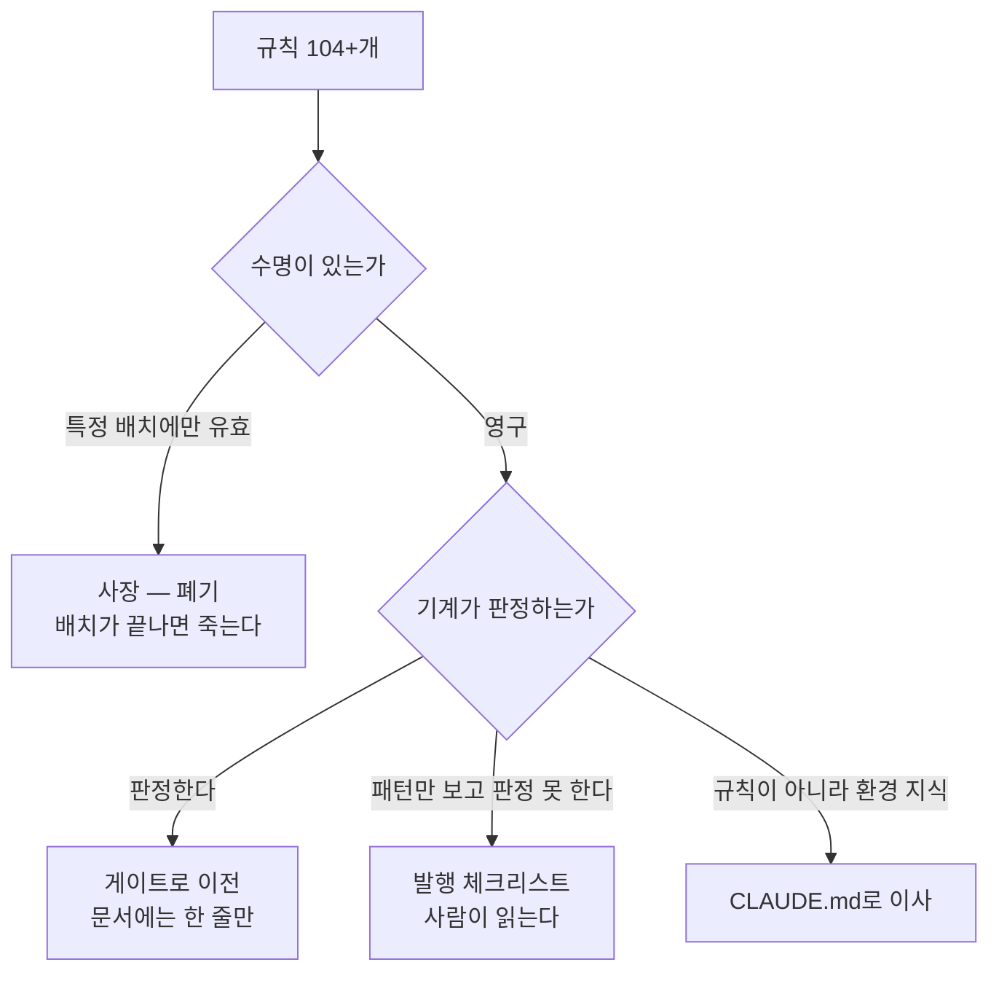
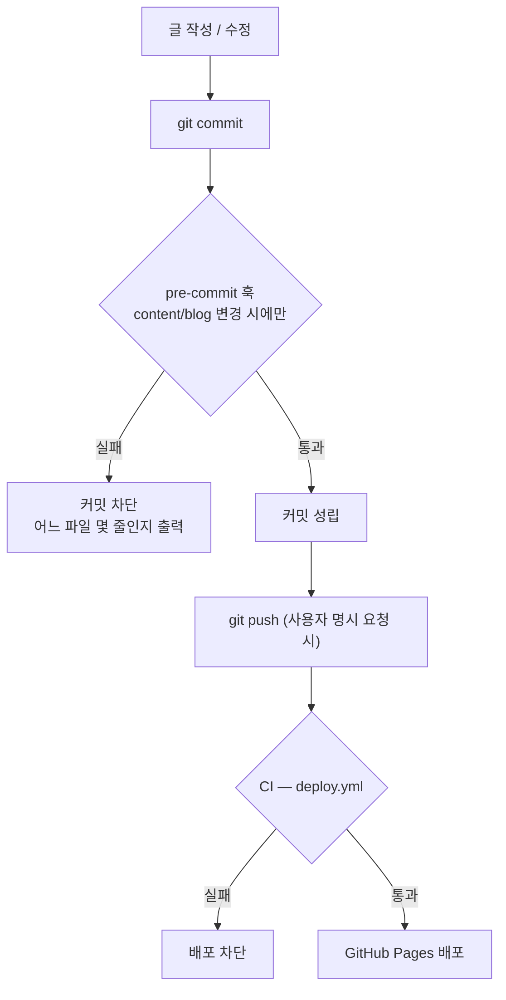

# 발행 게이트 재설계 — 규칙을 문서에서 검사기로 내린다

> 작성 2026-08-18 · 대상 `content/blog` 발행 파이프라인
> 승인 범위: 규칙 재분류 · 게이트 2단 신설 · 규칙 문서 압축
> 이 설계서의 모든 수치는 **실측**이다. 측정 명령은 §9에 적는다.

---

## 1. 문제 — 발행이 느려진 게 아니라 발행을 하고 있지 않다

`git log --diff-filter=A -- content/blog` 로 신규 파일이 생긴 날만 센 값이다.

| 구간 | 편수 | 작업일 | 일평균 |
| --- | ---: | ---: | ---: |
| 08-07 ~ 08-08 | 89편 | 2 | **44.5** |
| 08-09 ~ 08-13 | 26편 | 4 | 6.5 |
| 08-16 ~ 08-18 | 11편 | 3 | **3.7** |

12배 감속이다. 그러나 원인은 「편당 변환이 어려워졌다」가 아니다.
인수인계 커밋을 제외한 **최근 7개 작업 커밋 중 발행은 1개뿐**이고, 나머지 6개는
이미 발행된 124편을 되짚는 소급 수정이었다.

| 커밋 | 무엇 | 신규 발행 |
| --- | --- | ---: |
| `3cb386e` | OG 이미지 중립화 — `Ted_yanadoo.png` **366곳** | 0 |
| `124d64b` | `source` 프론트매터 **109편** 제거 + 금칙어 검사기 신설 | 0 |
| `0fbd61b` | README 카테고리 내역 오류 정정 | 0 |
| `0acf509` | rag ↔ search-engineering 양방향 링크 — 카테고리 고립 해소 | 0 |
| `0ef044f` | search-engineering 사례편 익명화 | 0 |
| `d561ed3` | 「결함율」 → 「결함률」 5자리 | 0 |
| `9197bd1` | ai-transformation T7 지도편 | **1** |

(`35f4228` `a785c61` `964c8f3` `6186437` `7055de8` 는 세션 인수인계 커밋이라 셈에서 뺐다.
인수인계까지 포함하면 커밋 12개 중 발행 1개다.)

### 1-1. 소급 수정 4건은 전부 기계가 잡을 수 있는 종류였다

| 사고 | 규모 | 성격 | 기계 판정 |
| --- | ---: | --- | :---: |
| `source` 프론트매터 잔존 | 109편 | 스키마 위반 | **가능** |
| OG 이미지에 사명 | 366곳 | 금칙어 (산출물) | **가능** |
| 금칙어 한글 표기형 | 13건 | 금칙어 (소스) | **가능** |
| 카테고리 양방향 고립 | 6편 | 링크 지형 | **가능** |

사람 판단이 필요한 규칙에서 사고가 난 것이 아니다. **자동 판정이 가능한 규칙을
사람이 지키려다 놓쳤고, 놓친 대가가 전수 재작업이었다.** 발행 시점에 1편씩 걸렀다면
1편씩 고칠 일이 세션을 통째로 먹었다.

### 1-2. 자동 게이트는 현재 사실상 0이다

| 자리 | 콘텐츠 검사 | 실측 |
| --- | :---: | --- |
| git hook | ❌ | `core.hooksPath` 미설정 · `.husky` 없음 · 활성 훅 0 |
| CI (`deploy.yml`) | ❌ | `lint` → `build` 뿐. `npm test`도 `check-forbidden`도 없다 |
| 사람 | ⚠️ | npm script를 **기억해서** 실행 |

검사기 자체는 잘 만들어져 있다(`check-forbidden.mjs` self-test 15건, `dup-scan.mjs`).
문제는 **아무것도 그것을 실행하도록 강제하지 않는다**는 것이다.

### 1-3. 규칙이 편당 비용을 밀어 올린다

| 시점 | 금지선 | 증분 |
| --- | ---: | ---: |
| 08-08 | 1~20 | — |
| 08-14 | ~34 | +14 |
| 08-17 | ~43 | +9 |
| 08-18 | ~52 | +9 |
| 08-18 | ~58 | +6 |

**최근 4일에 38개가 늘었다.** `GC-*` 13개 + `CR-*` 33개를 더하면 **104개 이상**이고,
`docs/` 11,729줄에 산문으로 흩어져 있다. 규칙이 늘어난 구간과 발행이 멈춘 구간이
정확히 겹친다.


이 고리를 끊는 지점은 **D**다. 발행 시점에 자동으로 걸면 E가 발생하지 않고,
E가 없으면 G가 줄고, G가 줄면 A가 멈춘다.

---

## 2. 목표

| # | 목표 | 측정 |
| ---: | --- | --- |
| 1 | 자동 판정 가능한 규칙을 **전부** 게이트로 옮긴다 | 게이트 통과 없이 커밋·배포 불가 |
| 2 | 사장된 규칙을 폐기한다 | 금지선 전수 분류 후 잔존 수 보고 |
| 3 | 사람이 읽어야 할 규칙을 **1장으로** 줄인다 | 발행 체크리스트 1파일 |
| 4 | 남은 원본 **85개**를 발행한다 | 카테고리별 완료 |

목표 4가 본체다. 1~3은 4를 가능하게 하는 투자이며, **4로 넘어가지 않으면 이 작업은
순손실**이다 — 그 자체가 §1이 지적한 「발행 0편 세션」이기 때문이다.

### 2-1. 발행 범위

`CR-3.*`의 제외 판정 중 **`pangyo-it` 6개만 유지**한다 (사용자 판정 2026-08-18).

| 원본 | 문서 | 판정 | 근거 |
| --- | ---: | --- | --- |
| `pangyo-it` | 6 | **발행 제외 유지** | 특정 회사 평가 문서. 공개 리스크 + 기술 블로그 주제와 무관 |
| `bigdata/야나두_실제_AWS_구성도.md` | 1 | **발행** (익명화) | CR-3.1의 「또는」 갈래를 택한다 |
| `learning/cto_learning_roadmap.md` | 1 | **발행** (탈개인화) | CR-3.3의 「또는」 갈래를 택한다 |

⇒ 발행 대상 **85개 원본** · 약 3.1 MB.
~~기존 변환 비율(원본 1개당 약 2.5편)로 **약 200편** 규모다.~~

> ⚠️ **2026-08-18 정정 — 「약 200편」은 과소 추정이었다. 실측 기준 233편이다** (사용자 승인).
>
> **틀린 원인은 지표다.** 원본 **1개당** 2.5편이라는 **개수 기반** 추정을 썼는데,
> 원본 파일 크기가 **37 KB ~ 90 KB로 제각각**이라 개수로는 규모를 잴 수 없다.
> **편한 지표를 쓰고 그것이 대리한다고 가정했다** — 아래 `du -sk` 각주가 경고한 것과 같은 계열의
> 실수이며, **그 각주가 예측한 위험이 실제로 실현된 것이다.**
>
> **실측 (바이트 기준):**
>
> | 항목 | 값 |
> | --- | ---: |
> | 발행본 124편 | **2,763,708 B** (편당 평균 **22,288 B**) |
> | 소진 원본 | **1,593,438 B** |
> | 변환 비율 | **1.73** — **발행본이 원본보다 크다** |
>
> 발행본이 커지는 이유는 재구성이다 — 도식·표를 보존하면서(`CR-1.6`) 도입부를 새로 쓰고(`CR-1.5`)
> 단독 가독성을 위해 용어를 재정의한다(`CR-4.4`). **압축이 아니라 팽창이다.**
>
> | 원본 | 개수 | 바이트 | 예상 편수 |
> | --- | ---: | ---: | ---: |
> | `java-backend` | 11 | 638,159 | **50** |
> | `langgraph` | 12 | 510,215 | 40 |
> | `high-traffic` | 11 | 508,162 | 39 |
> | `pm-harness` | 8 | 401,936 | 31 |
> | `pm-po` | 17 | 327,255 | 25 |
> | `bigdata` | 8 | 292,763 | 23 |
> | `learning` | 10 | 197,717 | 15 |
> | `recommendation` | 7 | 83,778 | 7 |
> | `llm-search-recommend` | 1 | 37,113 | 3 |
> | **합계** | **85** | **2,997,098** | **233** |
>
> ⚠️ **±2편의 불확실성이 남는다.** 「소진 원본」의 경계가 딱 떨어지지 않는다 —
> `rag` 25편은 `rag/`와 `langgraph/` **두 디렉터리**에서 왔고, `aiteam/00_INDEX`는 소진되지 않았다.
> 독립 재계산은 소진 원본을 **1,606,481 B**로 봐서 **231편**을 낸다.
> **233은 사용자 승인값이고, 231~233 어느 쪽이든 결론은 같다 — 200편이 아니라 230편대다.**

| 원본 | 문서 | 분량 | 비고 |
| --- | ---: | ---: | --- |
| `java-backend` | 11 | 652 KB | |
| `langgraph` | 12 | 532 KB | `rag`에 3편 반영됨 — 중복 확인 필요 |
| `high-traffic` | 11 | 524 KB | |
| `pm-harness` | 8 | 404 KB | |
| `pm-po` | 17 | 376 KB | |
| `bigdata` | 8 | 308 KB | 1개 익명화 필요 |
| `learning` | 10 | 216 KB | 1개 탈개인화 필요 |
| `recommendation` | 7 | 96 KB | 검색과 일부 교차 |
| `llm-search-recommend` | 1 | 44 KB | ⚠️ `rag`와 주제 충돌 (HANDOFF §10-3) |
| **합계** | **85** | **~3.1 MB** | |

⚠️ 분량은 `du -sk` 값(디스크 블록 단위)이라 실제 바이트보다 크게 나온다.
HANDOFF가 `llm-search-recommend`를 37 KB로 적은 것과 위 44 KB의 차이가 이것이다.
**상대 규모 비교용이며 임계값 판정에 쓰지 마라.**

> ✅ **이 각주가 옳았다 — 그리고 경고가 지켜지지 않았다.** 실바이트는 **37,113 B**로
> HANDOFF의 37 KB가 맞았고 위 표의 44 KB가 틀렸다. 그런데 같은 세션이 **이 표의 값으로
> 규모를 추정해 「약 200편」을 냈다**(§2-1 정정 참조). **각주를 달아 두는 것과 그것을
> 지키는 것은 다르다** — 경고는 값 옆에 있었지만 값을 쓰는 자리에는 없었다.
>
> ⇒ 위 표는 **상대 비교용으로만 남긴다.** 편수·임계값 계산은 §2-1 정정의 **바이트 표**를 써라.

---

## 3. 규칙 3분류

규칙은 **자동 판정 가능성**이 아니라 **수명**으로 먼저 갈린다. 이것이 이 설계의 핵심이다.



### 3-1. 사장 — 배치 스코프 지시

금지선 목록에는 성격이 다른 둘이 섞여 있다.

| 종류 | 예시 | 수명 |
| --- | --- | --- |
| **일회성 스코프 지시** | 8번 「`06`과 `08 §4~§8·§10`은 **이번 범위가 아니다**」 | 그 배치와 함께 죽는다 |
| **일반 변환 원칙** | 16번 「전칭을 분류로 바꿀 때는 전수 배정하고 세어라」 | 영구 |

8번이 죽었다는 것은 증명된다 — **커밋 `6a56f4a`가 정확히 그 파일을 발행했다**
(`aiagent/08 §4~§8·§10을 편9 부서별 정의서로 발행`). 규칙이 어겨진 것이 아니라
**유효기간이 끝난 것**인데, 목록에서 빠지지 않아 지금도 매 세션 읽힌다.

| 구간 | 배치전용(추정) | 일반원칙(추정) |
| --- | ---: | ---: |
| 금지선 1~20 | 약 11 (2~12) | 약 9 (1, 13~20) |
| 금지선 21~34 | 약 6 (22~27) | 약 8 (21, 28~34) |
| 금지선 35~58 | 0 | 24 |

⚠️ **이 표는 제목 수준 표본 판정이다.** 금지선 35~58은 원문이 아니라 헤딩만 확인했다.

> ✅ **2026-08-18 전수 분류 완료 (커밋 `059d557`) — 위 추정은 3개 틀렸다.**
>
> | 구간 | 추정 | 실측 | 차이 |
> | --- | ---: | ---: | ---: |
> | 1~20 | 약 11 | **9** (2~9·12) | −2 |
> | 21~34 | 약 6 | **5** (22~25·27) | −1 |
> | 35~58 | 0 | **0** | 0 |
> | **합계** | **약 17** | **14** | **−3** |
>
> **오차 방향이 일관된다 — 「배치 문서에 적혀 있다」를 「배치 전용이다」로 읽었다.**
> 10·11은 **영구 규칙이고 자동화 대상**이며(태그 통제 어휘 · 분량 하한),
> 26은 **발행본 9편이 지금도 그 문구를 써서** 서식 충돌이 남아 유효하다.
>
> 전수 결과는 **사장 14 · 자동 18 · 사람 67 · 환경 6 = 105**
> (`CR-*`는 33이 아니라 **34**다 — `CR-4.1a` 누락).
> 근거는 `docs/superpowers/reports/2026-08-18-rule-triage.md`,
> 사람 판단 항목은 `docs/superpowers/PUBLISHING-CHECKLIST.md`.

### 3-2. 자동 — 이미 게이트가 있는 것

| 규칙 | 검사기 | 상태 |
| --- | --- | :---: |
| `CR-4.2` `CR-5.1` 금지선 10 | `tests/blog/frontmatter.test.ts` (필수필드·카테고리 실재·태그 통제어휘·`series`) | ✅ |
| `GC-11` `CR-1.4` `CR-3.5` | `scripts/check-forbidden.mjs` (HARD/SOFT · self-test 15 · `--built`) | ✅ |
| `CR-6.1` 계열 | `scripts/dup-scan.mjs` | ✅ |
| `GC-1` `GC-2` `GC-5` | Next.js 빌드가 강제 | ✅ |
| `GC-12` | `npx tsc --noEmit` | ✅ |

**이것들은 이미 자동이다. 문서에서 내용을 걷고 「검사기가 정본」 한 줄로 바꾼다.**

### 3-3. 자동 — 신설할 것

| 규칙 | 무엇 | 막았을 사고 | 판정 |
| --- | --- | --- | :---: |
| `CR-1.7` | 내부 링크가 실재 슬러그를 가리키는가 | 죽은 링크 | HARD |
| `CR-1.7` | **inbound 0 고립 편** (지도편 제외) | search-engineering 6편 고립 | HARD |
| 폐지된 `source` | 스키마에 없는 프론트매터 키 | `source` 109편 | HARD |
| `CR-4.1a` 금지선 11 | 분량 하한 13.3 KB 미만 | T5·T6 병합 판단 | SOFT |
| `GC-6` | 기존 페이지 빌드 산출물 불변 | (현재 수동) | HARD (CI) |

**실측 기준선** (2026-08-18, 발행본 124편):

| 지표 | 값 |
| --- | ---: |
| 내부 링크 | 1,305건 |
| 죽은 링크 | **0건** |
| `trailingSlash` 미준수 | **0건** |
| inbound 0 | **5편** (지도편 3 + search-engineering 2) |
| 크기 중앙값 | 24 KB |
| 하한 13.3 KB 미만 | 4편 |

⚠️ **`GC-6`(기존 페이지 무영향)은 HARD지만 CI에만 건다.** 빌드 산출물 비교가 필요해
pre-commit에 걸면 커밋이 수십 초 걸리고, 그러면 `--no-verify`로 우회하게 된다.

> ⚠️ **2026-08-18 정정 — 금지선 44·45를 이 표에서 뺐다. 「사람」이다.**
>
> 위 두 행은 원래 `CR-1.7`과 금지선 45를 묶어 놨으나 **둘은 다른 것을 요구한다.**
>
> | | `CR-1.7` | 금지선 45 |
> | --- | --- | --- |
> | 요구 | 링크가 **실재 슬러그**를 가리킬 것 | 대상 편이 **약속한 내용을 실제로 줄 것** |
> | 기계가 하나 | ✅ 한다 | ❌ 못 한다 |
>
> 45의 원 사례가 이것을 그대로 보여 준다 — 「분석기가 BM25 **점수에** 어떻게 개입하는지는
> …에서 다룬다」는 **링크가 살아 있었다.** 죽은 링크 검사를 100번 돌려도 통과한다.
> 리뷰가 잡은 것은 대상 편 251줄에 **잇는 서술이 0건**이라는 사실이었다.
>
> ⇒ **45를 「자동」으로 두면 링크 검사기 통과를 45 준수로 착각한다** — 정확히 §3-4가
> 인용한 「못 하는 일을 하는 척하는 검사기」다. 45는 `PUBLISHING-CHECKLIST.md` §6에 있다.
> 금지선 44(「메우는 조작이 위험하다」)도 익명화 판단이라 애초에 링크 검사와 무관하다.

### 3-4. ❌ 자동화하지 않기로 한 것 — 전칭 패턴

금지선 16·17·29(「N개는 전부 X다」)를 검사기로 만들려 했으나 **실측이 이를 기각했다.**

| 패턴 | 건수 |
| --- | ---: |
| 「전부」 단독 | 310 |
| 「모두」 단독 | 127 |
| 「항상」 | 114 |
| **「숫자 + 전부/모두」** | **14** |

넓게 잡으면 소음이고, 좁게 잡아도 **기계는 N이 맞는지만 알 뿐 술어 X가 맞는지
판정하지 못한다.** 금지선 29의 위험은 「N을 고치면 X가 안 맞고 X를 고치면 N이 안 맞는」
구조이며, 그 판정은 본문 의미에 달려 있다.

⇒ 금지선 56 「**못 하는 일을 하는 척하는 검사기가 가장 위험하다**」를 적용해
**검사기로 만들지 않는다.** 발행 체크리스트의 사람 판단 항목으로 남긴다.

### 3-5. 사람 판단 — 발행 체크리스트로 압축

기계가 판정할 수 없는 규칙만 **1장으로** 모은다.

| 축 | 규칙 |
| --- | --- |
| 귀속 | 금지선 14·27·32 — 새 판정에 「이 글의 정리다」를 붙인다 / 원본에 있는 것을 강등하지 않는다 |
| 전수 배정 | 금지선 16·17·29 — 전칭을 분류로 바꿀 때 세고, 총평을 덧붙이지 않는다 |
| 삭제 파급 | 금지선 31·55 — 삭제는 사본과 참조를 남긴다. 지우기 전에 참조 지형을 실측한다 |
| 익명화 | `CR-1.9` `CR-1.10` — 금칙어가 지던 정보를 먼저 적는다. 주체를 갈아 끼우지 않는다 |
| 톤·도입부 | `CR-1.1` `CR-1.5` — 설명체 전환, 도입부 신규 작성 |
| 도식 근거 | 금지선 28·30 — mermaid 노드·화살표에 본문 근거 줄이 있어야 한다 |
| 단독 가독 | `CR-4.4` — 앞 글에만 있는 용어는 재정의하거나 링크한다 |

### 3-6. 환경 지식 — CLAUDE.md로 이사

규칙이 아니라 **이 환경에서 도구가 어떻게 실패하는가**인 것들이다.
발행 규칙 목록에 있으면 매 발행마다 읽히지만, 실제로 필요한 시점은 그 도구를 쓸 때다.

> ⚠️ **2026-08-18 정정 — 아래 표의 53·54·55·56은 금지선 번호가 아니다.**
> 커밋 `a785c61`의 `HANDOFF.md`가 **§2~§7에 금지선 53~58을 배정하면서 §9 도구 함정 표에서
> 53~56을 다시 썼다.** 이 표는 §9 쪽을 옮겨 적은 것이라 **아래 §3-4·§3-5와 충돌한다**
> (§3-4는 「금지선 56 = 못 하는 일을 하는 척하는 검사기」, §3-5는 「금지선 55 = 삭제 파급」 —
> 둘 다 §2~§7 정본이다). `a785c61` §12 「소스 위치」가 **「금지선 53~58 = 이 문서 §2~§7」**
> 이라 명시했으므로 **§2~§7이 정본**이다.
>
> ⇒ **§9 도구 함정 4건은 번호를 떼고** `CLAUDE.md` 「Tool traps」 절로 이사했다(커밋 `059d557`).
> 번호로 참조되는 것은 금지선 정본 쪽이다. 전수 분류는
> `docs/superpowers/reports/2026-08-18-rule-triage.md` §6-1.

| # | 내용 | 출처 |
| ---: | --- | --- |
| **39** | 이모지 grep이 「범위 초과」로 죽는데 무출력이 0건으로 보인다 | 금지선 정본 |
| **40** | `grep -o`가 부분 문자열도 센다 — 「대**비용**(對比用)」 | 금지선 정본 |
| **41** | 축자 복제 스캔은 「같은 뜻 다른 글자」를 못 잡는다 | 금지선 정본 |
| **49** | 파이프 뒤의 종료 코드는 마지막 명령의 것 — 종료 코드를 볼 명령은 단독 실행 | 금지선 정본 |
| **50** | 마크다운 강조가 낱말과 조사 사이에 끼면 grep이 못 잡는다 | 금지선 정본 |
| **51** | 1인칭은 grep으로 분리되지 않는다 — 매칭 줄을 열어 읽어라. **검사기에 넣지 마라** | 금지선 정본 |
| — | 히어독으로 코드를 쓰면 이중 백슬래시가 한 겹 벗겨진다 | `a785c61` §9 (번호 충돌) |
| — | 서브에이전트가 유휴가 돼도 보고서가 오지 않는다 — `SendMessage`로 회수 | `a785c61` §9 (번호 충돌) |
| — | grep으로 CRLF를 검사하면 거짓 음성 — `tr -cd`로 바이트를 세라 | `a785c61` §9 (번호 충돌) |
| — | `core.autocrlf=true`면 `git diff`가 줄바꿈 변경을 숨긴다 | `a785c61` §9 (번호 충돌) |

⚠️ **52는 여기가 아니다.** 「금칙어 목록에 한글 표기형을 포함하라」는 환경 지식이 아니라
**`scripts/check-forbidden.mjs` 가 이미 지고 있는 자동 규칙**이다(§3-2).

### 3-7. 신설 원칙 — 배치 지시는 영구 문서에 넣지 않는다

§3-1의 재발을 막는다.

> **배치 스코프 지시(「이번 범위가 아니다」·「이 파일의 이 절만」)는 그 배치의 설계서에만
> 적는다. 금지선·`GC-*`·`CR-*`에 넣지 않는다.**
> 영구 규칙은 「어느 배치에서도 참인가」를 통과해야 한다.

---

## 4. 게이트 설계 — 2단



### 4-1. 1단 — pre-commit 훅 (빠른 소스 검사)

| 검사 | 명령 | 소요 |
| --- | --- | ---: |
| 콘텐츠 불변식 | `npx vitest run tests/blog` | ~2초 |
| 금칙어 (소스) | `node scripts/check-forbidden.mjs` | ~1초 |

**`content/blog/**` 가 스테이지에 없으면 즉시 통과**한다. 코드만 고치는 커밋을
콘텐츠 검사로 막지 않기 위해서다.

구현은 **husky 없이** `core.hooksPath`로 한다.

| 방식 | 의존성 | 설정 |
| --- | :---: | --- |
| husky | +1 패키지 | `npm install` 시 자동 |
| **`core.hooksPath = .githooks`** | **0** | `package.json`의 `prepare` 스크립트가 자동 설정 |

`prepare`는 `npm install` 시 실행되므로 husky와 동일한 자동성을 의존성 없이 얻는다.

⚠️ **`--no-verify` 우회는 막지 않는다.** 막을 수도 없고, 2단(CI)이 받는다.
훅의 목적은 강제가 아니라 **기억 부담 제거**다.

### 4-2. 2단 — CI (산출물 검사)

`deploy.yml`의 `build` 잡에 단계를 추가한다. 현재는 `lint` → `build`뿐이다.

| 순서 | 단계 | 신규 | 이유 |
| ---: | --- | :---: | --- |
| 1 | `npm run lint` | | 기존 |
| 2 | `npx tsc --noEmit` | ✅ | `GC-12` — Vitest는 타입을 검사하지 않는다 |
| 3 | `npm run check-forbidden:verify` | ✅ | **증명 먼저** — 검사기가 잡는지 |
| 4 | `npm test` | ✅ | 콘텐츠 불변식 |
| 5 | `npm run check-forbidden` | ✅ | 소스 스캔 |
| 6 | `npm run build` | | 기존 |
| 7 | `npm run check-forbidden:built` | ✅ | **산출물 스캔** — OG 이미지 366곳을 잡을 자리 |
| 8 | `npm run check-baseline` | ✅ | `GC-6` — 기존 페이지 산출물 불변 |

**3번이 4·5번보다 앞선다.** 이 리포의 「증명 먼저, 스캔 나중」 관례를 CI 단계 순서로
고정한다 — 사람이 순서를 기억할 필요가 없어진다.

---

## 5. 신설 검사 명세

### 5-1. 어디에 쓸 것인가 — 경계 기준

| 조건 | 자리 | 이유 |
| --- | --- | --- |
| **빌드 산출물이 필요하다** | `scripts/*.mjs` | `out/`을 읽어야 한다 |
| 소스만 읽으면 된다 | `tests/blog/**` | 테스트 프레임워크가 self-test를 대신한다 |

이 기준은 **객관적**이다. 「어디에 넣지?」가 매번 판단거리가 되면, 그것이 규칙이
9개 문서로 갈라진 것과 같은 병이 된다.

> **자기 검사(self-test)를 손으로 만들지 않는 이유**
> 「증명 먼저, 스캔 나중」은 값진 교훈이지만, 검사기가 스크립트라서 테스트 프레임워크가
> 없었기에 손으로 재구현한 것이기도 하다. Vitest에 통과 케이스와 실패 케이스를 같이
> 넣으면 증명이 자동이다. `frontmatter.test.ts`가 이미 그 패턴이다
> (「필수 필드가 없으면 파일명을 포함한 오류를 던진다」).
> **기존 `check-forbidden.mjs`의 self-test 15건은 건드리지 않는다** — 작동하고 있고,
> `--built`는 빌드 산출물이 필요해 테스트에 넣기 어색하다.

### 5-2. `tests/blog/content/links.test.ts` (신설)

실제 `content/blog`를 읽어 링크 지형을 검사한다.

| # | 검사 | 판정 | 실측 기준선 |
| ---: | --- | :---: | --- |
| 1 | `](/blog/<cat>/<slug>/)` 대상이 실재하는가 | HARD | 현재 죽은 링크 0 |
| 2 | 내부 링크가 `/`로 끝나는가 (`GC-2`) | HARD | 현재 미준수 0 |
| 3 | inbound 0인 편이 없는가 | HARD | **현재 5편 — 아래 예외 처리** |

**inbound 0 예외 — 지도편.** 실측 5편 중 3편이 지도편이다.

| 슬러그 | inbound | 정상인가 |
| --- | ---: | --- |
| `agentic-coding/topic-map-reading-paths` | 0 | ✅ 지도편 — 밖으로 쏘는 것이 목적 |
| `ai-transformation/ai-transformation-knowledge-map` | 0 | ✅ 지도편 |
| `rag/rag-knowledge-map` | 0 | ✅ 지도편 |
| `search-engineering/search-engineering-qna` | 0 | ❌ HANDOFF §10-4 미해결 |
| `search-engineering/search-system-overview` | 0 | ❌ HANDOFF §10-4 미해결 |

⚠️ 지도편을 예외로 두려면 **기계가 지도편임을 알아야 한다.** 슬러그 문자열
(`*-map`, `topic-map-*`)로 판정하면 취약하다. ⇒ **프론트매터에 명시적 플래그를 둔다**
(예: `role: "map"`). 태스크 3에서 3편에 부여하고 스키마·테스트에 반영한다.

⚠️ **검사 3은 기준선이 이미 실패 상태다.** search-engineering 2편을 먼저 해소하지 않으면
게이트를 켜는 순간 모든 커밋이 막힌다. ⇒ 태스크 순서에서 **해소가 게이트보다 앞선다**(§7).

### 5-3. `tests/blog/content/schema.test.ts` (신설)

`frontmatter.test.ts`는 픽스처를 검사한다. 이것은 **실제 발행본 전수**를 검사한다.

| # | 검사 | 판정 |
| ---: | --- | :---: |
| 1 | 스키마에 없는 키가 없는가 (`source` 재유입 차단) | HARD |
| 2 | 모든 발행본이 `validateFrontmatter`를 통과하는가 | HARD |
| 3 | 분량 하한 13.3 KB 미만 편 보고 | SOFT |

검사 1이 `source` 109편 사고의 재발 방지다. **상한은 검사하지 않는다** —
금지선 13이 「상한 29.4 KB는 합격선이 아니다. 넘어도 된다」로 못 박았고,
실측 17편이 초과 상태이며 그것이 정상이다.

⚠️ **하한 판정은 `Buffer.byteLength`로 실제 바이트를 센다.** §3-3의 「4편」은 `du -k`
값이라 과대 계상돼 있다. 태스크 4에서 실제 바이트로 다시 재고, 그 값을 기준선으로
기록한다 — 임계값 근처의 편수는 측정 방식에 따라 달라진다.

### 5-4. `scripts/check-baseline.mjs` (신설 · CI 전용)

`GC-6`(기존 페이지 무영향)을 자동화한다.

| 단계 | 내용 |
| ---: | --- |
| 1 | `out/` 중 **블로그가 아닌** 경로(`index.html`, `en/`, `product-lead*`)의 파일 해시를 계산 |
| 2 | 저장된 기준선 **`scripts/baseline.json`**(git 추적 대상)과 대조 |
| 3 | 차이가 있으면 실패하고 **어느 파일이 바뀌었는지** 출력 |
| 4 | 의도한 변경이면 `--update`로 기준선 갱신 (사람이 판단) |

⚠️ 기준선 갱신은 **사람만** 한다. 자동 갱신하면 검사가 아무것도 막지 않는다.

---

## 6. 규칙 문서 재정비

| 문서 | 조치 |
| --- | --- |
| `2026-08-07-tech-blog-phase1.md` (`GC-*`) | 자동화된 항목은 「검사기가 정본」 한 줄로 압축 |
| `2026-08-07-tech-blog-requirements.md` (`CR-*`) | 동일 + `CR-3.1`·`CR-3.3` 판정 갱신(§2-1) |
| `2026-08-08-agentic-coding-…-design.md` §11 | 금지선 1~20 — 사장 판정 후 **취소선 + 사유** |
| `2026-08-14-ai-transformation-…-design.md` §11 | 금지선 21~34 — 동일 |
| **`docs/superpowers/PUBLISHING-CHECKLIST.md`** | **신설** — §3-5의 사람 판단 규칙만. 1장 |
| `CLAUDE.md` | §3-6 도구 함정 이사 + 게이트 사용법 |
| `HANDOFF.md` | 금지선 원문 보관 역할 종료 — 체크리스트로 링크 |

⚠️ **사장 규칙을 파일에서 삭제하지 않는다.** 취소선과 폐기 사유를 남긴다.
금지선 55(「지운 것이 남의 근거일 수 있다」)가 그 이유다 — 다른 문서가 번호로 참조한다.

---

## 7. 태스크 분해

의존이 있어 **순서가 규칙**이다. 특히 태스크 3이 4보다 앞서야 한다(§5-2).

| # | 태스크 | 산출물 | 의존 |
| ---: | --- | --- | --- |
| 1 | 금지선 1~58 **원문 전수 분류** — 사장/자동/사람/환경 | 분류표 `.md` | — |
| 2 | `GC-*`·`CR-*` 33+13개 동일 분류 | 분류표에 병합 | — |
| 3 | **기준선 위반 해소** — search-engineering 2편 inbound, 지도편 `role` 플래그 | 콘텐츠 + 스키마 | — |
| 4 | `links.test.ts` · `schema.test.ts` 신설 | 테스트 | 3 |
| 5 | `check-baseline.mjs` 신설 + 기준선 생성 | 스크립트 | — |
| 6 | pre-commit 훅 (`.githooks` + `prepare`) | 훅 | 4 |
| 7 | `deploy.yml` 8단계로 보강 | CI | 4·5 |
| 8 | 규칙 문서 압축 + 체크리스트 신설 | 문서 | 1·2 |
| 9 | **첫 배치 발행** — 카테고리 1개로 게이트 실효성 검증 | 발행본 | 6·7·8 |

태스크 9가 검증이다. 게이트를 만들고 발행으로 넘어가지 않으면 §2의 경고대로 순손실이다.

### 7-1. 첫 배치 선정

| 후보 | 문서 | 판단 |
| --- | ---: | --- |
| `java-backend` | 11 | 주제가 독립적이고 기존 카테고리와 충돌이 없다 |
| `high-traffic` | 11 | 동일 |
| `langgraph` | 12 | ⚠️ `rag`에 3편 이미 반영 — 중복 확인 부담 |
| `pm-po` | 17 | 분량이 크다 |

⇒ **`java-backend` 11개**를 첫 배치로 권한다. 게이트 실효성을 재는 것이 목적이므로
충돌 변수가 적은 쪽이 낫다.

---

## 8. 리스크

| # | 리스크 | 대응 |
| ---: | --- | --- |
| 1 | **기준선이 이미 실패 상태** — inbound 0이 5편 | 태스크 3을 게이트보다 먼저 (§7) |
| 2 | 지도편 예외를 슬러그로 판정하면 취약 | 프론트매터 `role` 플래그로 명시 (§5-2) |
| 3 | pre-commit이 느려지면 `--no-verify`로 우회 | 소스 검사만 1단에. 빌드 필요한 것은 CI로 (§4-1) |
| 4 | 사장 판정이 **살아 있는 규칙을 죽일** 수 있다 | 폐기 전 「원본이 소진됐는가」 실측. 삭제하지 않고 취소선 (§6) |
| 5 | 규칙 압축이 **근거를 지운다** (금지선 55) | 원문은 남기고 참조만 정리. `CR-1.10` 전례가 있다 |
| 6 | `check-baseline` 기준선이 자동 갱신되면 무의미 | `--update`는 사람만 (§5-4) |
| 7 | **이 작업 자체가 발행 0편 세션** | 태스크 9를 같은 흐름에 포함. 분리하지 않는다 |

---

## 9. 검증

### 9-1. 이 설계서의 수치를 재현하는 명령

```bash
# 날짜별 신규 발행 편수
git log --pretty=format:'%ad' --date=format:'%Y-%m-%d' --name-status \
  --diff-filter=A -- content/blog \
  | awk '/^20/{d=$0} /^A\t/{c[d]++} END{for(k in c) print k, c[k]}' | sort

# 크기 분포
find content/blog -name '*.md' -exec du -k {} \; | awk '{print $1}' | sort -n

# 전칭 패턴 (LC_ALL=C 필수 — 로케일에 따라 0건이 나온다)
LC_ALL=C grep -rohE '[0-9]+(개|편|가지|종|축|건|단계|갈래)[^.。]{0,12}(전부|모두)' \
  content/blog --include=*.md | sort | uniq -c | sort -rn
```

링크·inbound 실측은 태스크 4의 테스트가 대체한다.

### 9-2. 완료 판정

| 항목 | 기준 |
| --- | --- |
| 게이트 1단 | `content/blog` 수정 커밋에서 훅이 실행된다 |
| 게이트 2단 | CI 8단계 전부 통과 |
| 기준선 | inbound 0 = 지도편만 · 죽은 링크 0 · 스키마 외 키 0 |
| 규칙 압축 | 체크리스트 1장 · 사장 규칙 취소선 처리 |
| **실효성** | **`java-backend` 11개 발행 완료** — 게이트가 실제로 무언가를 잡았는지 보고 |

⚠️ **검증은 구현자가 아닌 제3자가 실행한다.** 「코드를 읽어 보니 괜찮다」는 검증이 아니다.
실행 기록이 없으면 미검증으로 취급한다.
