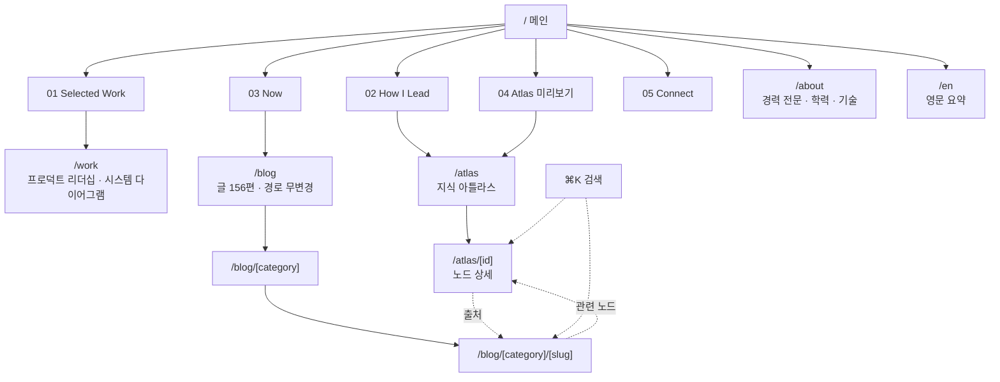
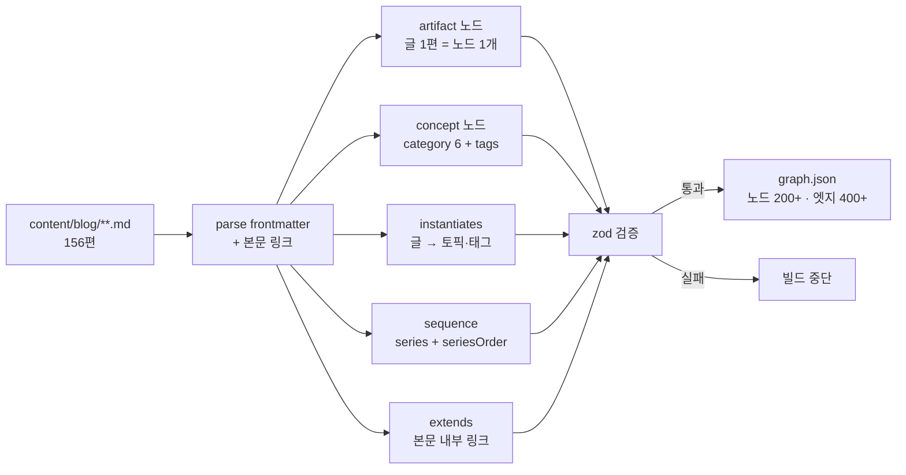
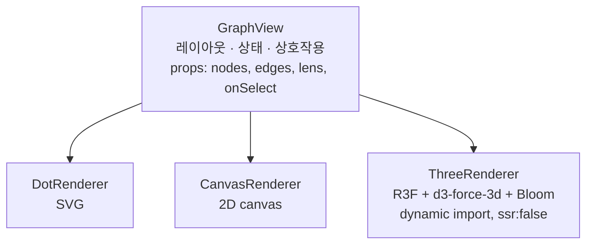
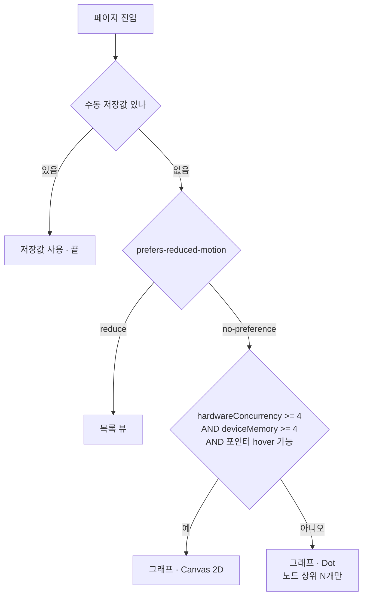
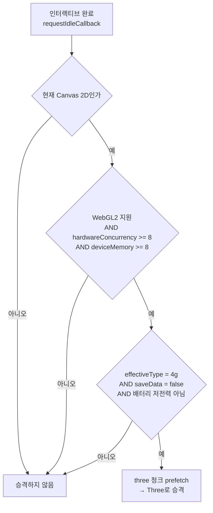
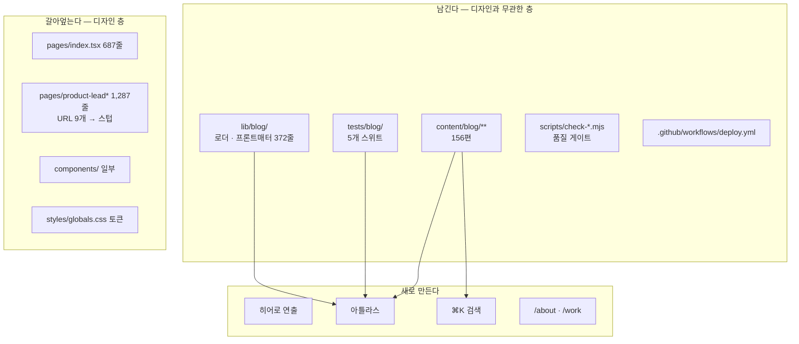
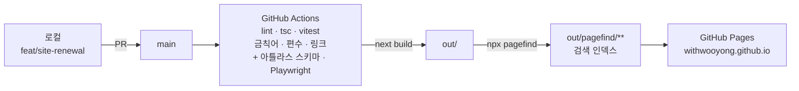
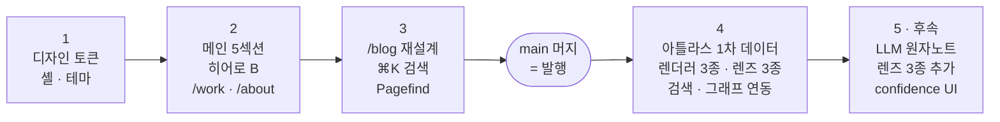

# 사이트 재설계 + 지식 아틀라스 — 설계 문서

- 작성일: 2026-08-25
- 대상 리포: **이 리포** (`withwooyong.github.io`)
- 작업 브랜치: `feat/site-renewal`
- 참고 사이트: `https://www.careerhackeralex.com/`
- 선행 문서: [`docs/site-renewal-roadmap.md`](../../site-renewal-roadmap.md) (2026-05, IA·SEO 층) — 이 문서는 그 위의 **디자인·지식그래프 층**이다
  - ⚠️ 그 로드맵은 [`site-renewal-completion-report.md`](../../site-renewal-completion-report.md)(2026-05-01)가 **1~6단계 완료로 마감**했다. 미완 항목이 남아 이 문서로 이어지는 것이 아니라, **완결된 IA·SEO 층 위에 새 층을 얹는 것**이다

> **개정 이력**
>
> | 판 | 무엇이 바뀌었나 |
> | --- | --- |
> | 초판 (2026-08-25 오전) | 신규 리포 `homepage` + 홈서버 배포. 같은 날 오후의 실측이 전제를 세 군데에서 뒤집어 폐기. 근거는 **부록 B** |
> | 2판 (2026-08-25) | 이 리포의 브랜치 + GitHub Pages 단독 + 정적 검색으로 전면 개정 |
> | **3판 (2026-08-25 검토 반영)** | **문서가 사실이라고 적은 값을 리포에 대조한 결과 4건이 틀려 정정했다.** §5.1 무채색 대비 · §8.5 `description` 실제 길이 · §4 `product-lead*` URL 수 · §11 `check-baseline` 누락. 상세는 각 절의 「실측」 표기 |
> | **3판-a (구현 계획 수립 중)** | §5.2 액센트 토큰 이름을 `--accent` → **`--signal`**. shadcn이 `--accent`를 버튼 호버 배경으로 이미 쓰고 있어, 덮으면 스펙 자신의 「5% 이하」 규칙을 위반한다. 계획서가 이 이름을 쓰므로 스펙을 맞췄다 |
>
> 폐기된 설계는 지우지 않고 부록 B에 남긴다. 같은 논의를 다시 열지 않기 위해서다.
>
> **3판의 교훈** — 초판을 뒤집은 것은 실측이었는데, 2판에도 실측되지 않은 값이 남아 있었다. 그것도 **옆칸을 실측한 절**에 있었다(§5.2는 액센트 대비를 1.7:1까지 계산하고 무채색 램프는 계산하지 않았다). 리포의 `CLAUDE.md`가 적은 *"증명 없는 0건은 거짓 음성과 구분되지 않는다"*가 설계 문서에도 그대로 적용된다 — **부분 실측은 전체 실측처럼 읽힌다.**

---

## 1. 배경

### 1.1 이 리포는 레거시가 아니다

| 항목 | 실측값 |
| --- | --- |
| 프레임워크 | `next@^14.2.35` · `react@^18` · Pages Router |
| 스타일 | `tailwindcss@^3.3` + **shadcn/ui** (`components/ui/` 4종 + radix + cva + tailwind-merge) |
| 빌드 | `output: "export"` · `trailingSlash: true` · `images.unoptimized` — **100% 정적** |
| 콘텐츠 | `content/blog/**` **156편** · 카테고리 6종 · 총 3.46 MB |
| 스키마 | `lib/blog/types.ts`의 `PostFrontmatter` — 타입으로 고정된 계약 |
| 테스트 | vitest 5개 스위트 (`tests/blog/`) |
| CI | lint · `tsc --noEmit` · vitest · 금칙어 스캔 · 편수 검사 — **각 검사기의 자체 증명(`:verify`) 포함** |
| 배포 | GitHub Actions → Pages, `branches: [main]` 트리거 |
| 테마 | `theme-toggle.tsx` + `.dark` 클래스 토큰 — 다크/라이트 이미 동작 |
| 문서 언어 | `pages/_document.tsx`가 `<Html lang="ko">` |
| 비블로그 기준선 | `scripts/check-baseline.mjs` + `baseline.json` — **비블로그 HTML 14개의 해시를 고정**한다 |

참고 사이트와 **같은 스택 계열**이다. "고도화가 불가능해서 새로 만든다"는 전제는 성립하지 않는다.

마지막 두 행은 이 설계가 **의존하거나 충돌하는** 지점이라 표에 올렸다.

- `lang="ko"`는 Pagefind 한글 세그멘테이션의 전제다(§8.2). 이 값이 `en`이었다면 §8 전체가 성립하지 않는다. **전제이므로 단계 3에서 바꾸지 않는다.**
- `check-baseline`은 재설계와 **정면으로 충돌한다.** 처리 방침은 §11에 적는다.

### 1.2 실제로 없는 것은 셋뿐이다

| 항목 | 현 상태 | 필요 |
| --- | --- | --- |
| 디자인 톤 | 앵커 10개짜리 단일 페이지 이력서 (`pages/index.tsx` **687줄**) | **전면 재설계** |
| 히어로 스크롤 연출 | 없음 (정적 배경만) | **신규** |
| 지식 그래프 | 없음 | **신규** |
| 라우트 정리 | `product-lead` / `-v2` / `-loadmap` / `-wiki` **4갈래** (합계 1,287줄) — 단 `-wiki`가 동적 라우트라 **빌드 산출 URL은 9개**(§4) | `/work` 하나로 통합 |

2026-05 로드맵이 이미 *"페이지 단일 파일(`pages/index.tsx`, 약 764줄)에 UI·콘텐츠가 집중되어 유지보수·SEO·접근성 확장에 비용이 크다"* 고 지목했다. 그 진단은 지금도 유효하며(687줄), 이 문서가 그것을 실행한다.

### 1.3 왜 신규 리포가 아니라 이 리포인가

초판은 신규 리포를 택했다. 이유는 **디자인 백지 확보**와 **실패 시 기존 사이트 무손상** 둘이었다. 둘 다 브랜치가 더 잘 해결한다.

| 초판의 이유 | 브랜치에서의 해소 |
| --- | --- |
| 디자인 백지 | `feat/site-renewal`에서 `pages/index.tsx`·`pages/product-lead*`·`components/` 일부를 자유롭게 갈아엎는다. 남기는 층(`content/`·`lib/`·`tests/`·`scripts/`)은 디자인과 무관하다 |
| 실패 시 무손상 | `deploy.yml`이 `branches: [main]`만 트리거한다. **브랜치 작업은 배포되지 않는다** |

그리고 신규 리포에는 없던 문제가 하나 있었다.

> **재설계 기간 중 새 글을 어디에 쓰는가.** `content/blog` 커밋은 2026-08-19까지 활발하다(cicd 시리즈 편1~7 연속 집필). 두 리포로 갈라지면 집필이 멈추거나 이중 관리가 된다.

한 리포 안에서는 이 문제가 없다. **집필은 `content/blog/**`만, 재설계는 `pages/`·`components/`·`styles/`만 건드려 충돌 면적이 거의 0이다.** main에 계속 발행하고 작업 브랜치를 주기적으로 rebase한다.

---

## 2. 목표와 비목표

### 목표

| # | 목표 | 완료 판정 |
| --- | --- | --- |
| G1 | 참고 사이트 수준의 다크 미니멀 톤과 스크롤 서사 | 메인 5섹션 + 히어로 연출 동작 |
| G2 | 이력을 앞에, 콘텐츠를 근거로 배치 | 모든 주장이 클릭 1회로 근거에 도달 |
| G3 | 옵시디언 유사 구조의 지식 그래프 `/atlas` | 노드 200+ · 엣지 400+ · **렌즈 3종 동작** (단계 4 기준. 나머지 3종은 단계 5 — §7.6) |
| G4 | 156편 전체를 가로지르는 검색 | `⌘K`에서 본문 키워드로 글이 잡힌다 |
| G5 | **기존 URL 무변경** | `/blog/**` 156편 경로가 그대로 산다 |

G5가 초판에서 뒤집힌 목표다. 초판은 `/blog` → `/notes` 이전과 301 리다이렉트를 계획했으나, 그 결정의 근거란이 비어 있었다. **근거 없는 이름 변경이 마이그레이션 표 전체와 "정적 호스팅은 진짜 301을 낼 수 없다"는 난제를 혼자 만들어내고 있었다.** 유지가 정답이다.

### 비목표 (YAGNI)

- 다국어 전면 지원 — `/en`은 **요약 1페이지**만 유지
- CMS·관리자 화면 — 콘텐츠는 git이 원본이다
- 댓글·좋아요·조회수
- 로그인·회원 — 아틀라스는 전체 공개
- **서버·컨테이너·자체 호스팅** — 전 구간 정적. 부록 B 참조
- **LLM 런타임 호출** — 검색은 정적 인덱스로 한다. §8
- 3D 그래프를 **첫 로드 번들**에 포함하는 것 — §7.7
- App Router 이전 — Pages Router를 유지한다. 이 설계의 어떤 요구도 App Router를 필요로 하지 않는다

---

## 3. 결정 요약

| 축 | 결정 | 근거 |
| --- | --- | --- |
| 리포 | **이 리포의 `feat/site-renewal` 브랜치** | 156편·CI·품질게이트·배포가 이미 여기 있다. 안전망은 브랜치가 제공한다 |
| 라우터 | **Pages Router 유지** | 요구사항 중 App Router가 필요한 것이 없다. 정적 export에서 마찰이 더 적다 |
| 글 URL | **`/blog/**` 무변경** | SEO 자산 무손상. 리다이렉트 자체가 불필요해진다 |
| 지식 그래프 명칭 | **`/atlas` (지식 아틀라스)** | `llm-wiki`는 구현 수단이 이름이 되어 저자성을 훼손한다 |
| 히어로 연출 | **B. 아틀라스 점등** | 첫 화면이 곧 아틀라스의 예고편 |
| 그래프 스키마 | 원자노트 스키마 설계 + 1차 데이터는 글 단위 | 스키마 필드 추가는 싸고 소급 입력은 비싸다 |
| 렌더러 | `GraphView` 추상화 + Dot/Canvas/Three 교체 | 노드 모양을 나중에 바꾼다는 요구. 동시에 3D 600KB를 분리하는 수단 |
| 렌더러 선택 | 기기 성능 자동 판단 (강등·승격 양방향, §7.7) | 성능 축과 페이로드 축을 분리 |
| `confidence` | 스키마에만 지금, UI는 단계 5 | 소급 입력은 비싸고 UI 토글은 싸다 |
| **검색** | **Pagefind — 정적 인덱스, LLM 없음** | API 키를 숨길 서버가 없다. 검색은 환각이 구조적으로 불가능하다. §8 |
| 검색 UI 이름 | **`⌘K` / Search** — "Ask"라고 부르지 않는다 | 이름이 상호작용을 정한다. "Ask"는 문장 입력을 유도하고, 검색은 문장을 못 다룬다 |
| 배포 | **GitHub Pages 단독** | 이미 돌고 있다. 24시간 · CDN · 무료 |
| 홈서버 | **쓰지 않는다** | 하루 8~16시간만 가동. 부록 B-1 |
| 액센트 | `#fbbf24` Signal Amber (다크) / `#a16207` (라이트) | 지표 숫자·CTA가 다크에서 가장 잘 읽힌다. 단계 2에서 재확인 |

---

## 4. 정보 구조



노드 상세와 글 본문이 **양방향으로 이어지는 것**이 이 구조의 핵심이다. 주장에서 근거로, 근거에서 다시 관련 주장으로 이동할 수 있어야 G2가 성립한다.

### 라우트 변경표

| 라우트 | 현재 | 재설계 후 |
| --- | --- | --- |
| `/` | 앵커 10개 단일 페이지 (687줄) | **메인 5섹션 + 히어로 B** |
| `/blog/**` | 156편 · 5개 라우트 | **경로 무변경.** 목록·상세 디자인만 재작업 |
| `/product-lead` · `-v2` · `-loadmap` · `-wiki` | 4갈래 1,287줄 · **URL 9개** | **`/work` 하나로 통합** + 스텁 |
| `/about` | 없음 (`/`의 앵커) | **신규** — 경력 전문·학력·기술 |
| `/atlas` · `/atlas/[id]` | 없음 | **신규** |
| `/en` | 1페이지 | 유지 |
| `/notion` | `public/notion/index.html` — 노션 이력서로 `meta refresh` | **그대로 유지** |

`/notion`은 2판까지 이 표에서 빠져 있었다. 라우트가 아니라 `public/` 정적 파일이라 `pages/`만 훑으면 보이지 않는다. `lib/site.ts`의 `NOTION_RESUME_URL`과 짝이고 `baseline.json`에도 잡혀 있으므로 **건드리지 않는다.** 05 Connect 섹션의 「이력서」 링크가 이 주소를 쓴다.

#### `product-lead*` 제거 — 스텁 9개, 파일 4개

**「4라우트」가 아니다.** `pages/product-lead-wiki/[slug].tsx`가 `lib/wiki.ts`의 slug 5종을 정적 생성하므로 실제로 사라지는 URL은 **9개**다.

| URL | sitemap | 조치 |
| --- | :---: | --- |
| `/product-lead/` | **색인됨** | 스텁 (정적 파일) |
| `/product-lead-v2/` | **색인됨** | 스텁 (정적 파일) |
| `/product-lead-loadmap/` | 제외 | 스텁 (정적 파일) |
| `/product-lead-wiki/` | 제외 | 스텁 (동적 라우트 index) |
| `/product-lead-wiki/{hub,cms,payment,admin,governance}/` | 제외 | 스텁 (동적 라우트 `[slug]`) |

`scripts/generate-sitemap.mjs`의 `EXCLUDE`가 `product-lead-wiki`·`product-lead-loadmap`을 이미 걸러내므로 **외부 색인에 노출된 것은 위 둘뿐**이다. 즉 SEO만 보면 스텁 2개로 충분하다.

**그럼에도 9개 전부에 스텁을 남긴다.** 근거는 SEO가 아니라 비용이다 — `[slug].tsx`를 지우는 대신 **본문을 스텁으로 갈아끼우면 6개 URL이 파일 하나로 덮인다.** 총 4개 파일로 9개 URL을 커버하므로, 「404를 하나도 만들지 않는다」를 5개 파일 값으로 살 수 있다.

| 파일 | 덮는 URL |
| --- | ---: |
| `public/product-lead/index.html` | 1 |
| `public/product-lead-v2/index.html` | 1 |
| `public/product-lead-loadmap/index.html` | 1 |
| `pages/product-lead-wiki/[slug].tsx` + `index.tsx` (본문만 스텁으로 교체) | 6 |

스텁 내용은 `meta refresh` + `rel=canonical` → `/work`. 156편 경로는 무변경이므로 이 처리가 필요 없다.

**딸린 처리** — 라우트를 스텁으로 바꾸면 `lib/wiki.ts`(180줄)와 `components/wiki-shell.tsx`(123줄)가 호출자를 잃는다. §9의 자산표에 조치를 적었다.

### 메인 섹션

| # | 섹션 | 담는 것 | 근거 링크 |
| --- | --- | --- | --- |
| — | Hero | 한 줄 포지셔닝 + 지표 3개 (20년 / 30명 / 156편) | — |
| 01 | Selected Work | 야나두 · TVING · SKB 대표 성과, 수치 중심 | → `/work` |
| 02 | How I Lead | 리더십 원칙 3~4개, 각 1문장 | → 해당 `/atlas/[id]` |
| 03 | Now | 2026년 현재 (집필 · AI 전환 · 구직) | → `/blog` 최신 |
| 04 | Atlas | 그래프 미리보기 + 토픽별 노드 수 | → `/atlas` |
| 05 | Connect | 연락 · 이력서 · 소셜 | — |

### 헤더 내비게이션 — 단계 1 산출물

**5섹션 어디에도 `/about`으로 가는 링크가 없다.** 2판은 정보 구조 도식에 `ROOT → ABOUT`을 그려 놓고 도달 경로를 적지 않아, 단계 1에서 무엇을 만들어야 하는지가 비어 있었다. 헤더가 그 경로다.

| 위치 | 항목 | 비고 |
| --- | --- | --- |
| 좌 | 로고 / 이름 → `/` | — |
| 중 | `Work` · `Atlas` · `Blog` · `About` | `/atlas`는 단계 4까지 **미노출** |
| 우 | 검색(`⌘K`/`Ctrl K`) · 테마 토글 · `/en` | 검색은 단계 3까지 미노출 |

| 규칙 | 값 |
| --- | --- |
| 배경 | `--n2` (헤더 · 바) |
| 스크롤 | 히어로 구간에서는 투명, 벗어나면 `--n2` + 하단 `--n4` 경계 |
| 모바일 | 햄버거 → 전체화면 드로어 |
| 미완성 라우트 | **링크를 렌더하지 않는다.** 비활성 표시도 하지 않는다 — 죽은 링크가 있는 사이트로 읽힌다 |

마지막 줄이 단계 순서와 맞물린다. `/atlas`는 단계 4에 생기는데 머지는 단계 3에서 일어나므로, **발행 시점의 헤더에는 Atlas 항목이 없다.** 단계 4 브랜치에서 항목을 추가한다.

---

## 5. 디자인 토큰

토큰은 가이드가 아니라 **가이드를 코드로 고정한 값**이다. 가이드는 "액센트는 한 색만 쓴다"는 규칙이고, 토큰은 `--signal: #fbbf24`라는 값이다.

### 5.1 무채색 9단계

| 토큰 | 다크 (기본) | 라이트 | 용도 |
| --- | --- | --- | --- |
| `--n0` | `#08080a` | `#f7f7f8` | 페이지 배경 |
| `--n1` | `#0b0b0d` | `#ffffff` | 카드 배경 (배경보다 **밝다**) |
| `--n2` | `#121216` | `#ffffff` | 헤더 · 바 |
| `--n3` | `#1c1c21` | `#f0f0f2` | 구분면 |
| `--n4` | `#2a2a31` | `#e0e0e4` | 테두리 |
| `--n5` | `#52525b` | `#a1a1aa` | 비활성 |
| `--n6` | `#7e7e86` | `#71717a` | 보조 텍스트 · 라벨 |
| `--n7` | `#a1a1aa` | `#52525b` | 본문 |
| `--n8` | `#d4d4d8` | `#3f3f46` | 강조 본문 |
| `--n9` | `#fafafa` | `#18181b` | 제목 |

무채색이 **9단계인 것이 핵심**이다. 다크 미니멀이 싸구려로 보이는 흔한 원인은 색 부족이 아니라 회색 단계 부족이다. 배경·카드·헤더·테두리가 같은 검정이면 층이 보이지 않는다.

**라이트는 다크의 반전이 아니다.** `n5`~`n9`(텍스트 계열)는 대체로 반전이지만 `n0`~`n4`(면 계열)는 구조가 다르다 — 양쪽 모두에서 카드가 배경보다 밝아야 한다. 뒤집으면 카드가 배경에 파묻힌다.

#### 대비 실측 — `n6`는 다크에서 값을 바꿨다

2판은 `n6`를 **양쪽 같은 값(`#71717a`)** 으로 두었다. 계산해 보니 다크에서 AA를 넘지 못한다.

| 토큰 | 용도 | 다크 vs `n0` | 다크 vs 카드 `n1` | 라이트 vs `n0` |
| --- | --- | ---: | ---: | ---: |
| `n5` | 비활성 | 2.59 | — | 2.39 |
| ~~`#71717a`~~ (2판 `n6`) | 보조 텍스트 | **4.14 ❌** | **4.07 ❌** | 4.51 ✅ |
| **`n6` `#7e7e86`** (3판, 다크) | 보조 텍스트 · 라벨 | **4.97 ✅** | **4.88 ✅** | — |
| `n7` | 본문 | 7.81 ✅ | 7.67 ✅ | 7.22 ✅ |
| `n8` | 강조 본문 | 13.54 ✅ | — | 9.75 ✅ |
| `n9` | 제목 | 19.17 ✅ | — | 16.55 ✅ |

`n5`가 미달인 것은 문제가 아니다 — 비활성 텍스트는 WCAG 대비 요건에서 제외된다. **`n6`가 문제였다.**

`#78787f`도 배경 위에서는 4.57로 통과하지만 **카드(`n1`) 위에서 4.49로 다시 떨어진다.** 배경만 보고 고르면 카드 안에서 미달이 된다. `#7e7e86`은 두 자리 모두에서 여유가 있다.

§5.2가 *"다크에서만 확인하고 넘어가면 라이트 토글이 접근성 위반이 된다"*고 경고했는데, **실제 구멍은 반대편에 있었다.** 액센트는 라이트에서 뚫리고 무채색은 다크에서 뚫린다. 한 방향만 점검하는 습관이 문제이지 특정 테마가 위험한 것이 아니다.

#### 램프 저단은 대비가 아니라 경계로 층을 만든다

| 쌍 | 다크 | 라이트 |
| --- | ---: | ---: |
| 카드 `n1` vs 배경 `n0` | 1.02 | 1.07 |
| 테두리 `n4` vs 배경 `n0` | 1.40 | 1.31 |

**「9단계라 층이 보인다」는 설명은 저단에서는 성립하지 않는다.** `n0`~`n4` 다섯 단계가 1.4:1 안에 몰려 있어 면끼리의 밝기 차만으로는 카드 경계가 보이지 않는다. 비텍스트 UI 요소의 WCAG 기준(3:1)에도 못 미친다.

이건 값을 고칠 문제가 아니라 **설명을 고칠 문제다.** 다크 미니멀에서 면 대비를 3:1로 올리면 카드가 회색 상자로 떠서 톤이 무너진다. 대신 층은 다음으로 만든다.

| 수단 | 사용처 |
| --- | --- |
| 1px `n4` 테두리 | 카드 · 헤더 하단 · 구분면 — **경계선이 층을 만든다** |
| 여백 | 섹션 간 뷰포트 높이급 (§5.5) |
| 텍스트 계열 대비 (`n6`~`n9`) | 위계는 면이 아니라 **글자 밝기**로 표현한다 |

즉 **면 계열(`n0`~`n4`)은 대비가 아니라 경계와 여백으로 읽히도록 설계한다.** 단계 1에서 카드 경계가 안 보이면 배경색을 올리지 말고 테두리를 먼저 의심한다.

### 5.2 액센트 — Signal Amber

| 토큰 | 다크 | 라이트 |
| --- | --- | --- |
| `--signal` | `#fbbf24` | `#a16207` |
| `--signal-ink` | `#08080a` | `#ffffff` |
| `--signal-soft` | `rgba(251,191,36,.15)` | `rgba(161,98,7,.12)` |

**토큰 이름이 `--accent`가 아닌 이유.** 2판은 `--accent`로 적었다. 그 이름은 이미 임자가 있다.

| 사용처 | 지금 의미 |
| --- | --- |
| `components/ui/button.tsx:17` (`outline` 변형) | `hover:bg-accent` — 은은한 **호버 배경** |
| `components/ui/button.tsx:20` (`ghost` 변형) | `hover:bg-accent` — 같음 |
| `components/ui/dialog.tsx:44` | `data-[state=open]:bg-accent` — 닫기 버튼 |

`--accent: #fbbf24`로 덮으면 **outline·ghost 버튼의 호버 배경이 전부 앰버가 된다.** 테마 토글이 `variant="outline"`이라 헤더에서 바로 보인다. 바로 아래 표의 「넓은 면적의 배경 금지」와 §15.1의 「첫 화면 5% 이하」를 **스펙 자신이 위반하는** 결과다.

⇒ 신규 액센트는 `--signal`로 부른다. shadcn의 `--accent`는 램프의 `--n3`(구분면) 별칭으로 남긴다(§5.3).

`#fbbf24`는 흰 배경에서 명도 대비가 약 1.7:1로 WCAG AA(4.5:1)를 크게 미달한다. 라이트에서는 `#a16207`(amber-700)로 교체한다. **다크에서만 확인하고 넘어가면 라이트 토글이 접근성 위반이 된다.**

실측으로 이 판단이 맞는지 확인했다. 세 값 모두 통과한다.

| 조합 | 대비 | 판정 |
| --- | ---: | --- |
| 다크 `--signal` `#fbbf24` on `n0` | 11.99 | ✅ |
| 라이트 `--signal` `#a16207` on `n0` | 4.60 | ✅ (여유 없음 — 이보다 밝게 올리지 않는다) |
| 라이트 `--signal-ink` `#ffffff` on `#a16207` | 4.92 | ✅ CTA 버튼 글자 |

라이트 액센트가 4.60으로 **AA 하한에 붙어 있다.** §15.1의 액센트 재확인에서 색을 조정한다면 `#a16207`보다 **어두운 쪽으로만** 움직인다.

| 허용 | 금지 |
| --- | --- |
| 링크 · 섹션 번호 · 지표 숫자 강조 | 넓은 면적의 배경 |
| CTA 버튼 배경 | 본문 텍스트 |
| 그래프 노드 · 활성 상태 | **두 번째 액센트 색 추가** |

액센트를 1색으로 제한하는 것은 취향이 아니라 기능이다. 하나여야 "이 색 = 클릭 가능하거나 중요한 것"이라는 규칙이 성립한다. 둘이 되는 순간 사용자는 색으로 아무것도 읽지 못한다.

### 5.3 기존 shadcn 토큰과의 접합 — 미해결 과제

현재 `styles/globals.css`는 shadcn 규약을 따라 **HSL 성분값**을 쓴다.

```css
:root  { --background: 0 0% 100%; --foreground: 0 0% 3.9%; }
.dark  { --background: 0 0% 3.9%; --foreground: 0 0% 98%; }
```

Tailwind 설정이 이를 `hsl(var(--background))`로 감싼다. 신규 램프는 hex다. **두 체계가 공존하면 혼란이 생기므로 하나로 정리해야 한다.**

| 안 | 방식 | 비용 |
| --- | --- | --- |
| **A** | 신규 램프를 HSL 성분으로도 정의해 shadcn 토큰에 매핑 | 값이 두 벌이 되어 어긋날 수 있다 |
| **B** | `tailwind.config`의 색 매핑을 `hsl(var(--x))` → `var(--x)`로 바꾸고 shadcn 토큰을 hex로 통일 | 1회 수정. shadcn 컴포넌트가 4개뿐이라 영향 작음 |

**B를 권한다.** 단, `components/ui/` 4종과 `/blog` 156편 렌더가 깨지지 않는지 **단계 1에서 실측 확인**한다. 이것이 단계 1의 완료 판정이다.

### 5.4 타이포

| 토큰 | 용도 |
| --- | --- |
| `--fs-hero` | 히어로 헤드라인 (`clamp()`로 반응) |
| `--fs-section` | 섹션 제목 |
| `--fs-card` | 카드 제목 |
| `--fs-body` | 본문 |
| `--fs-label` | 섹션 번호 · 배지 (대문자 + `letter-spacing`) |

한글 Pretendard / 영문·숫자는 별도 산세리프. 지표 숫자에는 `font-variant-numeric: tabular-nums`를 적용해 카운트업 시 폭이 흔들리지 않게 한다.

### 5.5 그 외

| 요소 | 값 | 이유 |
| --- | --- | --- |
| 테마 | 다크 기본 + 라이트 토글 | 참고 사이트 톤, 접근성 확보 |
| 여백 | 섹션 간 뷰포트 높이급 | 숫자 섹션이 페이지 단위로 끊겨야 서사가 된다 |
| 모션 | 전 구간 `prefers-reduced-motion` 대응 | 필수 |

---

## 6. 히어로 — 안 B (아틀라스 점등)

스크롤 진행도 `p ∈ [0,1]` 하나로 두 레이어를 동시에 구동한다.

| 레이어 | `p`에 따른 변화 |
| --- | --- |
| 배경 SVG 서브그래프 | 노드가 순차 점등(`opacity` 0.08 → 0.8, `r` ×1.35), 엣지가 뒤따라 나타남 |
| 전경 문구 | 3개 문장이 구간별로 교체 (`(p - i/n) * n`) |

### 문구 3문장

```text
eyebrow  20Y BACKEND · PLATFORM LEADER

  ①  20년간 만든 것은 서비스가 아니라 조직이었다.
  ②  30명이 함께 굴린 교육·커머스 플랫폼. 두 번 다시 세운 검색.
  ③  그 판단은 글 156편으로 남아 있다.
```

| 문장 | 역할 |
| --- | --- |
| ① | 포지셔닝 — 개발자가 아니라 리더임을 한 줄로 |
| ② | 증거 — 규모(30명)와 깊이(두 번 구축)를 수치로 |
| ③ | 다리 — 아틀라스와 `/blog`로 넘어가는 근거 선언 |

### 제약

- **히어로는 SVG 서브그래프 20~30노드로 고정한다.** three.js를 첫 화면에 올리면 600KB급 번들이 LCP를 무너뜨린다. 참고 사이트도 3D를 첫 로드에서 제외한다(`dynamic import, ssr:false`).
- 히어로와 `/atlas`가 같은 렌더러를 쓸 필요는 없다.
- `prefers-reduced-motion: reduce`이면 최종 상태(문구 ③ + 그래프 점등 완료)를 즉시 표시한다.

---

## 7. 아틀라스

### 7.1 노드 스키마

```yaml
id: subagent-is-a-firewall        # 안정 slug — URL /atlas/[id]
type: claim                        # artifact | concept | claim | procedure
title: 서브에이전트는 컨텍스트 방화벽이다
summary: 탐색 과정이 컨트롤러 컨텍스트에 들어오지 않는다.
origin: mine                       # mine | external | derived
confidence: working                # settled | working | speculative
topics: [ai-agent]
tags: [multi-agent, context]
source:
  kind: note                       # note | external
  ref: /blog/agentic-coding/subagent-firewall
updated: 2026-08-11
```

| 필드 | 무엇을 가능하게 하나 |
| --- | --- |
| `type` | 렌즈 `주장만`, 노드 색 |
| `origin` | 렌즈 `외부 vs 내 생각` |
| `confidence` | 렌즈 `확신도별` (단계 5에 켠다) |
| `topics` / `tags` | 좌측 사이드바 카운트 |
| `source` | 노드 → 글 이동 |

`source.ref`가 `/blog/**`를 가리킨다 — 경로를 바꾸지 않기로 한 결정(§3)이 여기서도 값을 한다. 노드가 참조하는 URL과 실제 글 URL이 같아서 변환 계층이 없다.

### 7.2 엣지 스키마

관계는 **단일 파일** `content/atlas/edges.yml`에 모은다. git diff로 관계 변화가 보인다.

```yaml
- { from: subagent-is-a-firewall, to: context-is-not-storage, type: supports }
- { from: subagent-is-a-firewall, to: bigger-context-is-better, type: contradicts, note: "2024년 판단을 뒤집음" }
```

`type`: `supports` | `contradicts` | `extends` | `instantiates` | `depends_on` | `sequence`

`contradicts`는 **과거의 자기 판단을 지금 반박하는 노드**를 표현한다. `confidence`와 결합하면 "2024년엔 확신했고 지금은 반대한다"는 궤적이 그래프에 그려진다. 이력서가 못 하는 진술이며, 이 사이트의 차별점이다.

### 7.3 1차 데이터 — MDX 156편 자동 매핑

LLM 호출 없이 빌드타임 파싱만으로 만든다.



| MDX에 이미 있는 것 | 생성되는 것 |
| --- | --- |
| 글 1편 | `artifact` 노드, `origin: mine`, `confidence: working` |
| `category` (6종) | `concept` 노드 + `instantiates` 엣지 |
| `tags[]` | `concept` 노드 + `instantiates` 엣지 |
| `series` + `seriesOrder` | 글↔글 `sequence` 엣지 |
| 본문 내부 링크 | 글→글 `extends` 엣지 |

#### 실측 — 위험은 부족이 아니라 과잉이다

2판은 이 절을 *"추가 저작 없이 200/400이 나온다"*는 **성취**로만 적었다. 프론트매터를 실제로 세어 보면 문제는 반대편에 있다.

| 항목 | 실측 |
| --- | ---: |
| 글 (`artifact` 노드) | 156 |
| 고유 태그 (`concept` 노드) | **64** |
| 카테고리 (`concept` 노드) | 6 |
| **노드 합계** | **226** |
| 태그 등장 총합 (`instantiates` 엣지) | **618** |
| 카테고리 (`instantiates` 엣지) | 156 |
| `series` 보유 편수 (`sequence` 엣지의 모수) | 136 |
| **엣지 합계** (+ 본문 링크 `extends`) | **1,000 안팎** |
| 편당 평균 태그 | 4.0 |

노드 「200+」는 맞다. **엣지 「400+」는 하한으로만 맞고, 실제로는 두 배 이상이다.**

| 편중 | 값 |
| --- | --- |
| 최대 허브 `ai-agent` | **44편**을 잇는다 |
| 2·3위 `langgraph` · `engineering-leadership` | 35 · 32 |
| 1회만 등장하는 태그 | 10개 (사실상 고아) |

힘 기반 레이아웃에서 44차수 노드 몇 개는 **그래프 전체를 지배한다.** 글끼리의 관계가 보이는 게 아니라 태그 성게 몇 개가 화면을 차지한다.

⇒ **태그를 그래프 노드로 넣을지 사이드바 필터로만 쓸지는 결정 사항이다.** 2판은 이걸 결정으로 적지 않았다. §15에 미확정 항목으로 올리고 단계 4에서 실물을 보고 정한다.

추가 저작 없이 **노드 226개 · 엣지 1,000개 안팎**이 나온다 — G3의 「노드 200+ · 엣지 400+」는 충족한다.

### 7.4 이미 있는 자산 — 본문 링크 추출

**`tests/blog/content/links.test.ts` (345줄)가 이미 이 일의 절반을 하고 있다.**

| 그 파일이 하는 일 | 아틀라스에서의 이름 |
| --- | --- |
| 본문에서 `/blog/<category>/<slug>/` 링크를 전부 추출 | **`extends` 엣지 생성** |
| 대상이 실재하는지 검사 (죽은 링크 0건 강제) | **없는 `id` 참조 검증** |
| 들어오는 링크가 0인 편을 찾아냄 | **고아 노드 검출** |
| `role: "map"`은 고립 판정에서 제외 | 지도편 예외 처리 |

주석에 실전 사고가 기록돼 있다 — *"앵커 링크는 「떼어 내지는」 것이 아니라 매칭 자체가 실패해 통째로 사라진다. 그러면 죽은 링크 검사와 inbound 계수가 그 링크를 조용히 빠뜨린다."*

**추출 로직을 새로 쓰지 않는다.** 이 파일의 링크 추출부를 `lib/atlas/`로 승격시키고, 테스트는 그 함수를 호출하도록 바꾼다. 검사기와 데이터 생성기가 **같은 코드**를 공유하게 되므로, 엣지가 어긋날 수 없다.

### 7.5 렌더러 추상화

노드 모양을 나중에 바꿀 수 있어야 한다는 요구를 구조로 못 박는다.



`GraphView`는 렌더러의 구현을 모른다. 노드 모양·색·발광은 전부 렌더러 내부에 있어 교체가 상위 코드에 영향을 주지 않는다.

| 렌더러 | 추가 번들 | 적정 노드 수 | 사용 조건 |
| --- | --- | --- | --- |
| Dot (SVG) | ~0 | ≤ 300 | 모바일 · 저사양 · `reduced-motion` |
| Canvas 2D | ~15KB | ≤ 2,000 | 데스크톱 기본 |
| Three (R3F) | ~600KB | ≤ 5,000 | **자동 승격 조건 충족 시** 또는 사용자가 켤 때 (§7.7). 첫 로드 번들에는 절대 포함하지 않는다 |

### 7.6 렌즈

렌즈는 기능이 아니라 **스키마 필드의 투영**이다. 필드가 있으면 공짜로 따라오고, 없으면 UI를 아무리 만들어도 불가능하다.

| 렌즈 | 쓰는 필드 | 켜는 단계 | 1차 데이터에서의 상태 |
| --- | --- | :---: | --- |
| 전체 | — | **4** | 노드 226 전부 |
| 토픽별 | `topics` | **4** | 카테고리 6 · 태그 64로 분할 |
| 클러스터별 | 엣지에서 커뮤니티 탐지 (Louvain) | **4** | 엣지 1,000 안팎에서 탐지 |
| 주장만 | `type === 'claim'` | **5** | **노드 0개** — 1차 데이터에 `claim`이 없다 |
| 외부 vs 내 생각 | `origin` | **5** | `mine` 156 · `external` **0** — 한쪽이 빈다 |
| 확신도별 | `confidence` | **5** | 전부 `working` |

**2판은 아래 두 렌즈를 단계 4로 적었다. 성립하지 않는다.** §7.3의 1차 데이터는 `type`이 `artifact`·`concept`뿐이고 `origin`이 전부 `mine`이므로, 「주장만」은 빈 화면을 그리고 「외부 vs 내 생각」은 한쪽이 0인 막대를 그린다. §13 리스크표의 대응(*"해당 렌즈는 단계 5에 켠다"*)과도 어긋나 있었다 — **같은 문서 안에서 4와 5로 갈라져 있었다.**

⇒ **단계 4에 켜지는 렌즈는 3종이다.** G3(§2)과 단계 4 완료 판정(§12)을 3종으로 정정했다.

「주장만」 렌즈를 살리려면 `claim` 노드가 필요하고, 그건 자동 매핑으로 나오지 않는다(글은 주장이 아니라 산출물이다). **저작이 필요하므로 단계 5의 일이다.**

### 7.7 렌더러 자동 선택 규칙

렌더러 선택은 **두 축을 따로 본다.** 섞으면 판단이 틀린다.

| 축 | 묻는 것 | 결정하는 것 |
| --- | --- | --- |
| 성능 | 이 기기가 렌더링할 수 있나 | 목록 / Dot / Canvas / Three |
| 페이로드 | 600KB를 내려받게 할 것인가 | Three로 **승격할지 여부와 시점** |

고사양 기기라도 3G·데이터세이버 환경이면 3D를 받지 않는다. 최신 단말이 지하철에 있는 경우가 정확히 이 축에서 걸린다.

#### 1단계 — 첫 로드 (동기 판단)

첫 로드에는 **어떤 기기든 Three를 포함하지 않는다.** LCP를 지키기 위한 절대 제약이다.



#### 2단계 — 인터랙티브 이후 (승격 판단)

페이지가 인터랙티브해진 뒤 `requestIdleCallback`에서 한 번만 평가한다.



| 조건 | 왜 |
| --- | --- |
| 현재 Canvas 2D | Dot·목록으로 내려간 기기는 승격 후보가 아니다 |
| WebGL2 | 없으면 Three가 아예 동작하지 않는다 |
| 코어 8 · 메모리 8 | Canvas 기준(4)보다 높게 잡는다. 3D는 훨씬 무겁다 |
| `effectiveType = 4g` · `saveData` 해제 | **페이로드 축.** 성능이 좋아도 대역이 없으면 받지 않는다 |
| 저전력 모드 아님 | 배터리 절약 중에 GPU를 돌리지 않는다 |

#### 공통 규칙

- 자동 판단은 **기본값을 정할 뿐이고, 수동 전환 토글은 항상 노출한다.** 사용자가 고른 값은 저장되어 다음 방문에 1단계를 건너뛴다.
- `deviceMemory`·`effectiveType`은 일부 브라우저에 없다. **없으면 조건 불충족으로 본다** — 승격은 보수적으로만 일어난다.
- 승격 시 그래프 상태(선택 노드·렌즈·카메라)는 유지한다. 렌더러 추상화(§7.5)가 이걸 가능하게 한다.

### 7.8 레이아웃

| 뷰포트 | 구성 |
| --- | --- |
| 데스크톱 | 3분할 — 좌 토픽/태그 · 중앙 그래프 · 우 렌즈 + 범례. 노드 클릭 시 우측 상세 패널 슬라이드 |
| 모바일 | 필터를 상단 칩(chip)으로, 상세를 바텀시트로. 사이드바는 드로어 |

### 7.9 2차 데이터 (단계 5) — LLM 원자노트 주입

같은 스키마에 `claim`·`procedure` 노드를 추가하고, 각 노드는 원본 글 `artifact`로 `supports` 엣지를 건다. **UI는 수정하지 않는다.** 이것이 하이브리드 스키마를 선택한 이유다.

- 파이프라인: `scripts/atlas-extract.mjs` + Claude Code 커맨드 — **빌드타임 배치이지 런타임 호출이 아니다**
- LLM이 `confidence`를 제안하고 사람이 교정한다
- 이 단계에서 `확신도별` 렌즈와 상세 패널 배지를 켠다

---

## 8. 검색 — Pagefind

### 8.1 왜 LLM 챗봇이 아닌가

초판은 Claude Opus 5에 그래프 인덱스를 인컨텍스트로 넣는 "Ask 챗봇"을 단계 6에 두었다. **정적 호스팅에서는 성립하지 않는다.**

API 호출에는 키가 필요한데 정적 사이트에는 키를 숨길 곳이 없다. JS에 넣으면 개발자도구에서 그대로 보이고, 그 키로 제3자가 과금할 수 있다. 키를 쥐고 대신 호출할 **서버가 반드시 하나 필요하다** — 그리고 그 서버를 도입하는 순간 §2의 "서버 없음" 비목표가 깨진다.

검색으로 바꾸면 얻는 것이 많다.

| 축 | LLM 챗봇 | 정적 검색 |
| --- | --- | --- |
| 서버 | 필수 | **불필요** |
| 응답 지연 | 2~10초 | **수십 ms** |
| 운영 비용 | 토큰 과금 + 남용 방지 | **0원** |
| 환각 | 방어 장치 필요 | **구조적으로 불가능** |

마지막 줄이 크다. 초판 §13.6은 *"근거 없으면 거절하는 응답"*을 완료 판정으로 잡았는데, 검색은 **없는 것을 만들어낼 수 없다.** 방어할 실패 모드 자체가 없다.

### 8.2 규모가 라이브러리를 정한다

```text
content/blog/     3.46 MB   (한글 UTF-8)
                  156 편
                  평균 22 KB / 편
```

**3.46MB는 "인덱스를 통째로 브라우저에 내려받는" 방식이 무너지는 크기다.** 한글은 형태소가 붙는 언어라 `검색엔진을` · `검색엔진의` · `검색엔진은`이 전부 다른 토큰이 된다. n-gram으로 쪼개면 인덱스가 원문보다 커진다.

Pagefind는 인덱스를 **단어 단위 조각으로 나눠 정적 파일로 두고, 검색어에 해당하는 조각만 `fetch`한다.** 정적 호스팅을 데이터베이스처럼 쓰는 셈이고, 이 발상 덕분에 서버 없이 대규모 사이트 검색이 성립한다.

공식 문서 확인 결과:

| 항목 | 확인 내용 | 출처 |
| --- | --- | --- |
| 한글 지원 | **세그멘테이션 지원.** "This section currently applies to Chinese, Japanese, and Korean languages." | pagefind.app/docs/multilingual |
| 배포 방식 | extended release가 `npx pagefind` **기본값** | 같은 문서 |
| 한글 스테밍 | **미지원** (CJK 전체). 어근을 넘나드는 매칭은 안 된다 | 같은 문서 |
| 언어 감지 | `<html lang>` 자동 인식, 언어별 인덱스 분리 | 같은 문서 |
| 인프라 | **불필요** — 완전 정적 | — |

⚠️ **마지막에서 두 번째 줄이 이 설계의 숨은 전제다.** Pagefind의 한글 세그멘테이션은 `<html lang>`을 보고 켜진다. 리포는 `pages/_document.tsx`가 이미 `<Html lang="ko">`라 조건을 만족한다(§1.1). **이 값이 `en`이었다면 §8 전체가 성립하지 않았다** — 실측으로 확인한 것이지 당연한 것이 아니므로, 셸을 재작성하는 단계 1에서 `_document.tsx`의 `lang`을 건드리지 않는다.

### 8.3 구성

빌드 뒤에 한 줄을 추가한다.

```text
npm run build   →   out/   →   npx pagefind --site out
```

`out/`의 HTML을 스캔하므로 **어떤 페이지가 검색되는지는 라우트가 정한다.** 별도 인덱스 정의가 필요 없다.

### 8.4 UI — `⌘K` 커맨드 팔레트

**"Ask"라고 부르지 않는다.** 이름이 상호작용을 정한다.

| 이름 | 사용자가 치는 것 | 결과 |
| --- | --- | --- |
| Ask | "야나두에서 뭘 했어?" (문장) | 검색어로 나쁜 입력 → 결과 빈약 → 실망 |
| **⌘K / Search** | "야나두" (키워드) | 정확히 걸림 |

#### 키 표기 — `⌘`로 고정하지 않는다

이 문서는 편의상 `⌘K`로 줄여 쓰지만, **화면에 그리는 라벨은 플랫폼을 따라간다.** 저자 본인의 작업 환경이 Windows이고 방문자도 대부분 그렇다.

| 플랫폼 | 라벨 | 바인딩 |
| --- | --- | --- |
| macOS | `⌘K` | `metaKey` |
| Windows · Linux | `Ctrl K` | `ctrlKey` |

판별은 `navigator.platform`이 아니라 **두 키를 모두 받는 것**으로 한다 — 핸들러는 `e.metaKey \|\| e.ctrlKey`를 보고, 라벨만 플랫폼에 따라 그린다. 판별에 실패해도 단축키는 동작한다.

`/` 단독 키도 함께 받는다. 입력 요소에 포커스가 없을 때만 반응시킨다.

`/atlas` 1차 데이터가 생긴 뒤(단계 4)에는 결과에 **아틀라스 노드 섹션**을 덧붙이고, 선택 시 그래프에서 해당 노드를 점등시킨다. `graph.json`이 이미 있으므로 추가 비용이 거의 없다.

### 8.5 탈출구

한글 분절 품질은 **156편으로 실제 인덱스를 만들어 봐야만 안다.** 문서는 중국어 예시만 보여준다.

| 검증 | 방법 | 실패 시 |
| --- | --- | --- |
| 한글 쿼리 10종 | `검색엔진` · `검색엔진을` · `RAG` · `카나리 배포` 등을 실제 인덱스에 던진다 | **티어 다운** |

**티어 다운 경로**: 본문 인덱싱을 포기하고 `title` + `description` + `tags`만 MiniSearch로 인덱싱한다.

#### 실측 — 크기는 맞았고, 안전망은 틀렸다

2판은 이 경로를 *"`description`이 156편 전부에 200자 이상 충실히 채워져 있다는 것이 안전망"* 이라고 적었다. 세어 보니 반대다.

| 항목 | 2판의 서술 | 실측 (156편 프론트매터) |
| --- | --- | --- |
| `description` 길이 | "전부 200자 이상" | **200자 이상은 18편.** 138편이 미만 |
| — | — | 최소 **64자** · 중앙값 **110자** · 최대 459자 |
| 인덱스 크기 | "약 400B × 156 ≈ 62KB" | **439B × 156 = 66.9KB** ✅ 대체로 맞다 |
| `title` 길이 | — | 중앙값 40자 |

**크기 계산은 유효하다.** gzip 후 20KB 안팎이라는 판단도 그대로다. 문제는 크기가 아니었다.

#### 그래서 티어 다운은 안전망이 아니라 목표 미달이다

중앙값 110자짜리 요약만 인덱싱하면 **G4의 완료 판정을 만족할 수 없다.**

> G4 — *"`⌘K`에서 **본문 키워드**로 글이 잡힌다"*

본문을 인덱싱하지 않는 경로에서 본문 키워드가 잡힐 리 없다. 「티어 다운」이라는 이름이 이걸 품질 저하처럼 보이게 했지만, 실제로는 **목표 하나를 포기하는 것**이다.

| 경로 | G4 | 성격 |
| --- | :---: | --- |
| Pagefind 전문 검색 | ✅ | 본선 |
| MiniSearch 제목·설명·태그 | ❌ | **부분 후퇴** — 「글 찾기」는 되고 「본문 찾기」는 안 된다 |

⇒ 단계 3의 한글 쿼리 10종 검증은 **선택지 확인이 아니라 실질 관문이다.** 여기서 실패하면 G4를 다시 설계해야 한다.

⇒ 티어 다운으로 내려가더라도 `description`을 늘려 메우려 하지 않는다. 156편을 손보는 비용이 크고, **요약을 아무리 늘려도 본문 검색은 되지 않는다.** 그 경우의 대안은 3순위로 따로 둔다 — 본문을 문단 단위로 잘라 정적 JSON 청크로 두고 직접 페치하는 방식, 즉 Pagefind가 하는 일을 축소해 손으로 만드는 것이다. **본선이 실패한 뒤에 설계한다.**

---

## 9. 기존 자산 — 무엇을 남기고 무엇을 갈아엎나



| 자산 | 조치 | 근거 |
| --- | --- | --- |
| `content/blog/**` 156편 | **그대로** | 경로 무변경 결정(§3) |
| `lib/blog/` (372줄) | **그대로** + `lib/atlas/` 추가 | 프론트매터 계약이 이미 타입으로 고정됨 |
| `tests/blog/content/links.test.ts` | **추출부를 `lib/atlas/`로 승격**, 테스트는 그 함수를 호출 | §7.4 |
| `scripts/check-*.mjs` | **그대로** + 아틀라스 검증 추가 | `:verify` 패턴을 아틀라스 검사기에도 적용한다 |
| `.github/workflows/deploy.yml` | **그대로** + Pagefind 스텝 1줄 | §8.3 |
| `components/ui/` (shadcn 4종) | **그대로**, 토큰만 교체 | §5.3 |
| `components/mermaid.tsx` | **그대로** | `/work`에서 계속 쓴다 |
| `components/theme-toggle.tsx` | 토큰 교체에 맞춰 수정 | §5.3 |
| `pages/index.tsx` | **전면 재작성** | §4 |
| `pages/product-lead*` (URL 9개) | **`/work`로 통합 후 스텁화** — 파일 4개로 9 URL 커버 | §4 |
| `public/notion/index.html` | **그대로** | 05 Connect의 이력서 링크. `baseline.json`에 포함 |
| `data/portfolio.ts` · `data/diagrams/**` | `/work` · `/about`으로 재배치 | 데이터는 유지, 화면만 재구성 |

### 9.1 라우트 제거로 호출자를 잃는 것들

2판의 자산표는 이 층을 *"`components/` 일부"* 한 줄로 뭉쳐 두었다. **뭉치면 빠뜨린다.** 실제 참조를 훑어 셋으로 갈랐다.

| 자산 | 유일한 호출자 | 판정 | 확정 시점 |
| --- | --- | --- | --- |
| `lib/wiki.ts` (180줄) | `product-lead-wiki/*` | **확정 고아** | 단계 2 |
| `components/wiki-shell.tsx` (123줄) | `product-lead-wiki/*` | **확정 고아** | 단계 2 |
| `components/roadmap-domain.tsx` | `product-lead-loadmap` | **확정 고아** | 단계 2 |
| `data/product-lead-domains.ts` | `product-lead-loadmap` · `roadmap-domain.tsx` | **확정 고아** | 단계 2 |
| `data/product-lead-roadmap.ts` | `product-lead-loadmap` | **확정 고아** | 단계 2 |

위 다섯은 라우트가 사라지면 도달 불가능해진다. **삭제하되 단계 2에서 한꺼번에 지운다** — 스텁 전환과 같은 커밋에 두어야 「무엇이 왜 지워졌는지」가 한 diff에 남는다.

아래 여섯은 `pages/index.tsx`(전면 재작성)와 제거 라우트에서만 쓰인다. **재작성 결과가 정해야 하므로 지금 판정하지 않는다.**

| 자산 | 현재 호출자 | 단계 2에서 물을 것 |
| --- | --- | --- |
| `hero-stripe-backdrop.tsx` | `index` · `product-lead` · `-v2` | 히어로 B가 SVG 서브그래프로 대체 → **삭제 유력** |
| `coin-flip-deck.tsx` | `index` · `product-lead` · `-v2` | 새 5섹션에 자리가 있나 |
| `section-reveal.tsx` | `index` · 제거 라우트 3종 | 스크롤 연출에 **재사용 유력** |
| `portfolio-nav.tsx` | `index` | 새 헤더가 대체하나 |
| `thesis-summary-dialog.tsx` | `index` | `/about`으로 옮기나 |
| `system-diagram-card.tsx` → `flow-diagram/` | `index` | `/work`로 옮기나 (§9 표의 「데이터는 유지」와 짝) |

**`data/portfolio.ts`는 어느 쪽도 아니다** — `flow-diagram/validate.ts`·`portfolio-nav`·`system-diagram-card`·`thesis-summary-dialog`가 함께 쓰므로 유지가 전제다.

**`:verify` 패턴은 이 리포에서 배워 아틀라스에 그대로 적용한다.** CI 주석에 적힌 그대로다 — *"증명이 스캔보다 먼저다. 증명 없는 0건은 거짓 음성과 구분되지 않는다."* 아틀라스 스키마 검사기도 일부러 깨진 입력을 먹여 제대로 실패하는지 먼저 확인한 뒤 실제 검증을 돌린다.

---

## 10. 배포



| 항목 | 값 |
| --- | --- |
| 호스팅 | GitHub Pages 단독 |
| 주소 | `withwooyong.github.io` — **변경 없음** |
| 트리거 | `push` to `main` + `workflow_dispatch` |
| 작업 브랜치 | `feat/site-renewal` — **배포되지 않는다** |
| 서버 기능 | **0개.** 전 구간 정적 |
| 미러 | 불필요 — 산출물이 하나뿐이다 |
| 홈서버 | 관여하지 않음. 부록 B-1 |

**서버 기능이 0개라는 제약이 여기서도 값을 한다.** 초판에서는 "미러가 갈라지지 않게" 하려는 제약이었는데, 미러가 사라진 지금은 **"검색·아틀라스를 붙여도 배포가 복잡해지지 않게" 하는 제약**으로 남는다. 같은 규칙이 다른 이유로 유효하다.

---

## 11. 품질 게이트

기존 CI에 **추가**한다. 기존 게이트는 하나도 끄지 않는다.

| 게이트 | 검사 대상 | 실패 시 | 상태 |
| --- | --- | --- | --- |
| lint · `tsc --noEmit` | 전체 | 빌드 중단 | **기존** |
| 금칙어 스캔 (+ `:verify`) | 소스·산출물 | 빌드 중단 | **기존** |
| 편수 검사 (+ `:verify`) | README 숫자 vs 실제 | 빌드 중단 | **기존** |
| **`check-baseline` (GC-6)** | **비블로그 HTML 14개의 해시** | **종료 코드 1** | **기존 — 이 재설계와 충돌한다. §11.1** |
| `dup-scan` (+ `:verify`) | 발행 글의 축자 중복 | 종료 코드 1 | **기존** — 재설계는 `content/blog/**`를 건드리지 않아 무관 |
| vitest — 링크 무결성 | 156편 내부 링크, 고아 편 | 빌드 중단 | **기존** |
| vitest — 프론트매터·로더·TOC | 156편 스키마 | 빌드 중단 | **기존** |
| **zod 아틀라스 스키마 (+ `:verify`)** | 노드·엣지 파싱, 고아 노드, 없는 `id` 참조 | 빌드 중단 | 신규 (단계 4) |
| **vitest — MDX → 노드·엣지 매핑** | 추출 로직 | 빌드 중단 | 신규 (단계 4) |
| **Playwright** | 히어로 스크롤 · `⌘K` · 노드 클릭 · 렌더러 분기(강등·승격) · 승격 시 상태 유지 | 빌드 중단 | 신규 (단계 2~4) |
| **Pagefind 인덱스 생성** | 인덱스가 비어 있지 않은지 | 빌드 중단 | 신규 (단계 3) |
| Lighthouse CI | LCP · CLS 예산 | **경고만** | 신규 (단계 2) |

스키마 검증을 빌드 중단으로 두는 이유는 **깨진 엣지가 화면에 보이지 않기 때문**이다. 노드가 하나 덜 그려져도 사람 눈은 잡지 못한다. 사람이 못 잡는 오류는 기계가 막아야 한다.

Lighthouse를 경고로 두는 이유는 반대다. 성능 저하는 쓰다 보면 느껴지고, 히어로에 그래프가 있는 이상 예산 초과가 잦을 것이다. 매번 배포가 막히면 게이트를 꺼버리게 된다. **지켜지지 않을 규칙은 규칙 전체를 죽인다.**

### 11.1 `check-baseline` — 이 재설계와 정면으로 충돌한다

2판의 게이트 표에 이 검사가 없었다. **하필 재설계와 구조적으로 부딪히는 유일한 게이트가 빠져 있었다.**

`scripts/baseline.json`은 **블로그가 아닌 HTML 14개의 해시**를 고정한다.

```text
index.html · en/index.html · notion/index.html · 404.html · 404/index.html
product-lead/index.html · product-lead-v2/index.html · product-lead-loadmap/index.html
product-lead-wiki/{index,hub,cms,payment,admin,governance}/index.html
```

재설계는 이 14개 중 **`index.html`을 전면 재작성하고 9개를 스텁으로 갈아엎는다.** 즉 단계 1부터 이 검사는 반드시 실패한다. "기존 게이트를 하나도 끄지 않는다"는 §11의 선언이 여기서 시험대에 오른다.

검사기는 의도적으로 마찰을 걸어 두었다. 주석 그대로다.

> *"기준선 갱신을 자동화하면 이 검사는 아무것도 막지 못한다. `--update`는 사람만 실행한다."*

게다가 파일이 **줄어드는** 갱신에는 `--force`를 추가로 요구한다 — 지금 상황이 정확히 그 경우다.

#### 방침 — 끄지 않는다. 갱신 시점을 한 번으로 묶는다

| 단계 | `check-baseline` 상태 | 조치 |
| --- | --- | --- |
| 1 (토큰·셸) | **실패 예상** | 갱신하지 않는다. 실패를 기록만 한다 |
| 2 (메인·`/work`·`/about`·스텁) | 실패 계속 | **끝에서 사람이 1회** `check-baseline:update --force` |
| 2 이후 | 정상 동작 | 다시 게이트로 쓴다 |
| 3~4 | 정상 | 새 라우트가 굳었으므로 변경은 회귀 신호다 |

**단계별로 갱신하지 않는 것이 핵심이다.** 단계 1에서 한 번, 단계 2에서 또 한 번 `--update`를 돌리면 그 습관이 남아 이 검사는 죽는다. 검사기 주석이 경고한 그대로다 — *"그 복구로 `--update`가 습관이 되면 정작 지켜야 할 페이지까지 함께 덮인다."*

단계 1에서 실패를 **감수하는** 대신, 단계 1의 완료 판정은 다른 것으로 잡는다(§5.3 — `/blog` 156편 회귀 없음). 두 판정이 겹치지 않으므로 서로를 가리지 않는다.

#### 갱신 시점에 사람이 확인할 것

`--update --force`는 되돌리기 어려우므로, 누르기 전에 셋을 눈으로 본다.

| 확인 | 기대값 |
| --- | --- |
| 사라진 항목 | `product-lead*` 9개가 **스텁으로 남아 있는지** (사라지면 안 된다 — §4) |
| 남은 항목 | `en/index.html` · `notion/index.html` · `404` 계열이 **그대로인지** |
| 새 항목 | `work/` · `about/`이 추가됐는지 |

`en`과 `notion`은 재설계 대상이 아니다. **이 둘의 해시가 바뀌었다면 의도치 않은 회귀이므로, 갱신하지 말고 원인을 먼저 찾는다.**

---

## 12. 단계 계획



| 단계 | 산출물 | 완료 판정 |
| --- | --- | --- |
| **1** | 디자인 토큰 · shadcn 접합 · 셸(헤더·푸터) · 테마 토글 | **`/blog` 156편이 새 토큰에서 정상 렌더** — 기존 화면 회귀 없음. `check-baseline` 실패는 예상된 것으로 기록(§11.1) |
| **2** | 메인 5섹션 · 히어로 B · `/work` 통합 · `/about` | 첫 화면 완성. `product-lead*` **9 URL 스텁화**(파일 4개). 고아 자산 5종 삭제(§9.1). **끝에서 기준선 1회 갱신.** Lighthouse 측정 가능 |
| **3** | `/blog` 목록·상세 재설계 · `⌘K` 검색 (Pagefind) | **main 머지 가능** — 한글 쿼리 10종 실측 통과. 실패 시 G4 재설계(§8.5) |
| **4** | 아틀라스 1차 데이터 · 렌더러 3종 · **렌즈 3종** · 검색 연동 | 노드 226 · 엣지 1,000 안팎 · 렌더러 분기 동작 |
| **5** | LLM 원자노트 · **렌즈 3종 추가** · `confidence` UI | `주장만` · `외부 vs 내 생각` · `확신도별`이 유의미해짐 |

단계 4의 렌즈가 5종에서 **3종**으로 내려간 것이 3판의 정정이다. 1차 데이터에는 `claim` 노드가 없고 `origin`이 전부 `mine`이라, 나머지 3종은 만들어도 빈 화면을 그린다(§7.6). **판정을 못 채울 목표로 두는 것보다 단계를 옮기는 편이 정직하다.**

**단계 3 완료 시점이 발행 지점이다.** 아틀라스 없이도 지금 사이트보다 나으므로 단계 4 지연이 손해로 이어지지 않는다. 단계 4는 머지 이후 새 브랜치에서 이어간다.

### 초판 대비 변경

| 초판 | 개정 | 이유 |
| --- | --- | --- |
| 단계 0 — 인프라 확인 · 스캐폴딩 | **소멸** | 스택·CI·배포가 이미 있다 |
| 단계 2 — `/notes` 이전 + 301 | **소멸** | `/blog` 경로 무변경 |
| 단계 4 — 배포 파이프라인 · Pages 미러 | **소멸** | 배포가 이미 돌고, 미러가 불필요 |
| 단계 6 — Ask 챗봇 | **단계 3으로 흡수** | LLM → 정적 검색 |

### 이 스펙이 커버하는 범위

**구현 계획은 단계 1~4까지 작성한다.** 단계 5는 앞 단계의 실데이터를 봐야 설계가 가능하므로(추출 품질), 단계 4 완료 후 별도 스펙으로 다시 브레인스토밍한다.

계획서는 **단계별로 나눠 쓴다.** 단계 1~2는 지금 정확하게 쓸 수 있고, 단계 3~4는 앞 단계의 실물을 보고 써야 추측이 섞이지 않는다.

---

## 13. 리스크

| 리스크 | 영향 | 대응 |
| --- | --- | --- |
| **토큰 교체가 `/blog` 156편을 깨뜨림** | 살아 있는 콘텐츠 손상 | 단계 1의 완료 판정을 여기에 건다(§5.3). 브랜치라 main은 무사 |
| **작업 브랜치가 main과 벌어짐** | 머지 충돌 | 집필은 `content/blog/**`, 재설계는 `pages/`·`components/`·`styles/` — 충돌 면적 0. 주 1회 rebase |
| Pagefind 한글 분절 품질 | 검색이 안 잡힘 | 단계 3에서 한글 쿼리 10종 실측. 실패 시 티어 다운(§8.5) |
| 히어로 그래프로 LCP 악화 | 첫인상 손실 | 히어로는 SVG 20~30노드 고정, three.js 제외 |
| 3D 번들 600KB | 모바일 이탈 · LCP 악화 | 첫 로드 제외. 인터랙티브 이후 성능+대역 조건 통과 시에만 유휴 시간에 `dynamic import` (§7.7) |
| 1차 데이터에서 `origin`·`confidence` 값이 균일 | 렌즈가 죽은 기능처럼 보임 | 해당 렌즈는 단계 5에 켠다 |
| `confidence` 방치 | 전부 `working`으로 남아 무의미 | 단계 5의 LLM 제안 + 사람 교정을 파이프라인에 포함 |
| `product-lead*` 제거로 URL 유실 | 소량 SEO 손실 | **9 URL 전부에 스텁** — 파일 4개로 커버(§4). 색인된 것은 2개뿐이나 404를 남기지 않는다 |
| **`check-baseline` 갱신이 습관이 됨** | **게이트가 죽는다 — 이후 회귀를 아무것도 못 잡는다** | 단계 1은 실패를 감수하고, 갱신은 **단계 2 끝 1회로 묶는다**(§11.1). 갱신 전 3항목 육안 확인 |
| **티어 다운이 G4를 만족하지 못함** | 「본문 키워드로 잡힌다」가 무너진다 | 티어 다운은 안전망이 아니라 **부분 후퇴**임을 명시(§8.5). 단계 3의 한글 쿼리 10종이 실질 관문 |
| **태그 허브가 그래프를 지배** | 글끼리의 관계 대신 태그 성게가 보인다 | `ai-agent` 44 · `langgraph` 35 실측(§7.3). 태그 노드화 여부를 §15 미확정으로 두고 단계 4에서 실물로 판단 |
| 단계 5 LLM 추출 품질 | 잘못된 주장·엣지가 그래프에 유입 | 사람 검수 게이트, `contradicts` 우선 검토 |

**초판에서 삭제된 리스크**: 홈서버 정전·ISP 장애, GHCR 이미지 pull 실패, 기존 URL 유실(156편). 전부 해당 인프라·이전 계획이 사라져서 소멸했다.

---

## 14. 운영 비용

| 항목 | 단계 1~4 | 단계 5 |
| --- | --- | --- |
| GitHub Pages | 무료 | 무료 |
| GitHub Actions | 퍼블릭 리포 무료 | 무료 |
| Pagefind | 무료 (빌드타임 도구) | 무료 |
| LLM 원자노트 추출 | 없음 | **1회성 배치** + 신규 글마다 증분 |
| LLM 런타임 호출 | **없음** | **없음** |

**단계 1~4의 현금 비용은 0이다.** 단계 5도 빌드타임 배치라 방문자 수와 무관하다. 초판의 홈서버 전력·Ask 챗봇 토큰 과금 항목은 사라졌다.

---

## 15. 미확정으로 남기는 것

각 항목에 **추천안을 미리 적는다.** 확정을 미루는 것과 판단을 미루는 것은 다르다.

| 항목 | 추천안 | 확정 시점 |
| --- | --- | --- |
| shadcn 토큰 접합 방식 | **B — `tailwind.config` 매핑 변경 후 hex 통일** (§5.3) | 단계 1 |
| 액센트 색 | `#fbbf24` Signal Amber (잠정) | 단계 2 |
| 히어로 문구 3문장 | §6의 안 | 단계 2 |
| 검색 티어 | **Pagefind 전문 검색**, 실패 시 제목·설명 검색으로 다운 (§8.5) | 단계 3 |
| 클러스터 탐지 알고리즘 | **Louvain** | 단계 4 |
| **태그를 그래프 노드로 넣을지** | **넣되 차수 상한을 둔다** (아래 15.4) | 단계 4 |
| 커스텀 도메인 구입 | **하지 않는다** (지금은) | 미정 |

### 15.1 액센트 재확인 기준

단계 2에서 히어로에 실제 문구와 수치를 넣은 뒤 두 가지만 본다.

| 확인 | 기준 |
| --- | --- |
| 가독 우선순위 | 1m 거리에서 `20년 / 30명 / 156편`이 헤드라인보다 먼저 눈에 들어오는가 |
| 면적 | 액센트가 첫 화면 픽셀의 **5% 이하**인가. 넘으면 경고문처럼 읽힌다 |

### 15.2 클러스터 탐지 — Louvain

`graphology-communities-louvain`을 **빌드타임에 1회** 실행하고 `cluster` id를 `graph.json`에 저장한다. 런타임 계산 비용은 0이다.

| 후보 | 채택 | 이유 |
| --- | --- | --- |
| **Louvain** | **채택** | 노드 수천 개에서 수십 ms. 모듈성 최적화라 결과가 사람 직관과 잘 맞는다 |
| Label Propagation | 기각 | 더 빠르지만 **실행마다 결과가 달라진다.** 정적 산출물에서는 빌드할 때마다 `graph.json` diff가 요동쳐 변경 추적이 불가능해진다 |

결정성 확보: 노드를 `id` 기준으로 정렬한 뒤 고정 시드로 실행한다. **같은 입력이면 같은 `graph.json`이 나와야 한다** — 빌드 산출물의 기본 요건이다.

### 15.3 커스텀 도메인

지금은 사지 않는다. `withwooyong.github.io`는 GitHub 핸들과 일치해 식별자가 일관되고, 156편의 SEO 자산이 이미 이 주소에 쌓여 있다. 나중에 사더라도 `public/CNAME` 한 줄과 `lib/site.ts`의 `getSiteOrigin()` 한 곳만 바꾸면 되므로 **미루는 비용이 거의 0이다.**

### 15.4 태그를 그래프 노드로 넣을 것인가

§7.3의 실측이 만든 새 미확정 항목이다. 태그 64개를 `concept` 노드로 넣으면 `instantiates` 엣지 618개가 따라오고, `ai-agent` 하나가 **44차수 허브**가 된다.

| 안 | 방식 | 잃는 것 |
| --- | --- | --- |
| A | 태그 64개 전부 노드화 | 힘 기반 레이아웃에서 허브 몇 개가 화면을 지배. 글끼리의 관계가 안 보인다 |
| B | 태그는 **사이드바 필터로만**, 노드는 글 + 카테고리 6개 | 노드 162개로 줄어 G3의 「200+」에 미달 |
| **C** | **노드화하되 차수 상한을 둔다** | 상한 규칙이 하나 늘어난다 |

**C를 권한다.** 구체적으로는 셋이다.

| 규칙 | 값 | 이유 |
| --- | --- | --- |
| 노드화 하한 | **3편 이상**에서 쓰인 태그만 | 1회 등장 10개는 고아나 다름없다 |
| 엣지 렌더 상한 | 한 태그당 **12개**까지 그리고 나머지는 상세 패널에 목록으로 | 44개를 다 그으면 성게가 된다 |
| 시각 구분 | 태그 노드는 글 노드보다 **작게**, 채도 없이 | 주인공은 글이다 |

엣지 자체는 `graph.json`에 전부 남긴다. **상한은 렌더 규칙이지 데이터 규칙이 아니다** — 데이터를 지우면 되돌릴 수 없지만 렌더 규칙은 언제든 바꾼다.

**단계 4에서 실물을 보고 확정한다.** 숫자(3·12)는 지금 눈으로 정한 값이라 실제 레이아웃을 보면 달라질 수 있다.

---

## 부록 A — 참고 사이트 실측

`careerhackeralex.com/faq`에서 공개된 내용이다.

| 항목 | 원문 |
| --- | --- |
| 저장 구조 | "전부 마크다운 파일입니다. 생각 하나가 파일 하나, 관계는 별도의 엣지 파일 하나. 데이터베이스도 벡터 스토어도 본체가 아닙니다." |
| 원자 단위 | "주장 하나를 담은 마크다운 파일 — 원자 단위입니다." |
| 엣지 타입 | "supports(뒷받침), extends(확장), contradicts(반박) 같은 관계입니다." |
| 자동화 | "Claude Code 같은 에이전트가 파일을 만들고, 연결을 긋고, 오래된 인용을 고칩니다." |
| 그래프 기술 | "렌더링은 three.js, React 안에서는 react-three-fiber(R3F)", "노드 배치는 d3-force-3d의 물리 시뮬레이션", "UnrealBloomPass 후처리" |
| 로딩 | "페이지 첫 로드에는 들어가지 않습니다(dynamic import, ssr:false)." |
| 옵시디언 차이 | "옵시디언은 보기 도구입니다. 그래프는 훌륭하지만, 엣지에 의미(지지·반박·예시)를 구분해 담는 기능은 없습니다." |
| Ask 챗봇 | "의미·키워드·그래프·시간 네 축으로 검색", "근거가 없으면 답하지 않습니다." |

이 설계의 스키마(§7.1, §7.2)는 위 실측과 일치한다. `confidence`와 렌더러 추상화(§7.5)가 우리 쪽 추가분이고, **Ask 챗봇만 다른 길을 간다**(§8.1).

---

## 부록 B — 폐기된 설계와 그 이유

초판(2026-08-25 오전)에서 확정했다가 같은 날 실측으로 뒤집은 것들이다. **같은 논의를 다시 열지 않기 위해 근거를 남긴다.**

### B-1. 홈서버 배포 — 폐기

초판은 Ubuntu 홈서버(Docker + Caddy + DuckDNS)를 primary로 두고 GitHub Pages를 장애 헤지 미러로 삼았다.

| 실측 | 결과 |
| --- | --- |
| Caddy 컨테이너 | `caddy:2-alpine` v2.11.4, 80/443 단독 점유, 다른 프로젝트(`ted-startup`) 소유 |
| `caddy-dns/duckdns` 플러그인 | **없음.** 단 80포트가 열려 있어 HTTP-01이 이미 동작 중이라 불필요했다 |
| **전원 정책** | **`nightly-shutdown.timer` 가동 중 — 매일 21:30 종료.** 추가로 `power-window`(아침·저녁 이봉 창, 하루 8시간 이하)가 구현 완료·배포 대기 |

**결정적 근거는 전원 정책이다.** 이력 사이트의 1차 독자는 평일 낮에 접속하는데 그 시간대에 서버가 꺼져 있다. 그리고 **HTTP 요청으로는 서버를 깨울 수 없다** — WoL은 LAN 브로드캐스트이고 꺼진 호스트는 TCP 연결을 받지 못한다.

미러를 "헤지"라고 부른 것이 판단을 가렸다. 실제 가동률로 보면 **Pages 100% · 홈서버 33~66%** 였다. 이름이 우선순위를 정해버린 셈이다.

> 홈서버는 이 사이트와 무관하게 원래 용도로 쓴다. `power-window`도 그대로 배포하면 된다.

### B-2. 신규 리포 `homepage` — 폐기

§1.3에 근거를 적었다. 요약하면 브랜치가 두 이유를 모두 더 잘 해결하고, 신규 리포에는 **집필 중단**이라는 별도 비용이 있었다.

### B-3. `/blog` → `/notes` 이전 + 301 — 폐기

초판 §3의 해당 행은 **근거란이 비어 있었다**(`—`). 근거 없는 이름 변경 하나가 마이그레이션 표 전체와 "정적 호스팅은 진짜 301을 낼 수 없다"는 난제를 만들어내고 있었다. 유지하면 둘 다 사라진다.

### B-4. Ask 챗봇 (Claude Opus 5 + 인컨텍스트 인덱스) — 폐기

§8.1에 근거를 적었다. 설계 자체는 타당했다 — 노드 200~2,000개의 `title`+`summary`+엣지는 1~10만 토큰이라 1M 컨텍스트에 들어가고, 벡터 DB는 불필요하다는 판단은 지금도 맞다. **문제는 모델이 아니라 호스팅이었다.** 정적 사이트에는 API 키를 숨길 곳이 없다.

> 장래에 서버리스 함수(Cloudflare Workers 등)를 도입한다면 이 설계를 그대로 되살릴 수 있다. 정적 검색과 배타적이지 않고, 검색 위에 얹는 층이 된다.

### B-5. 이 문서 이전의 위치

초판은 `C:\Users\aeby\vscode\homepage` 리포의 `docs/superpowers/specs/2026-08-25-personal-site-design.md`에 있었다. 그 리포에는 문서 4개뿐이고 코드가 0줄, 원격도 없었다. **이 문서가 그 리포의 유일한 산출물을 승계한다.**
