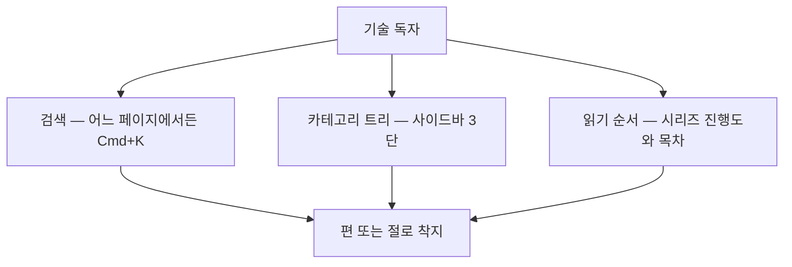
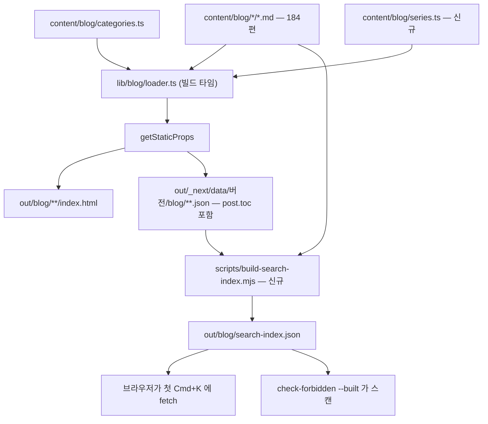
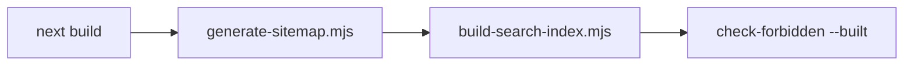

# 블로그 탐색 개편 설계서 — 검색 · 카테고리 트리 · 읽기 순서

> **작성 기준일**: 2026-09-04
>
> **대상**: `withwooyong.github.io/blog/` — 발행본 184편의 탐색 수단을 셋 추가한다.
>
> **주 독자**: 학습·참조 목적의 기술 독자. 이 전제가 세 기능의 우선순위와 형태를 정했다.
>
> **상태**: 설계 확정. 승인 후 작업계획서(`docs/superpowers/plans/`)를 작성한다.

---

## §1. 왜 지금인가

발행본이 184편에 이르렀는데 탐색 수단은 발행 초기 그대로다. 실측한 현재 상태는 다음과 같다.

| 항목 | 실측 | 무엇이 문제인가 |
| --- | ---: | --- |
| 발행본 | 184편 · 8 카테고리 | 카테고리당 6~51편으로 편차가 8배다 |
| 최대 카테고리 | `ai-agent` 51편 | 평면 목록으로는 읽을 수 없는 규모다 |
| 시리즈 | 41개 (164편 소속) | 데이터가 있는데 **화면에 드러나지 않는다** |
| 지도편 | 15편 (`role: map`) | 진입점이 있으나 목록 안에 섞여 있다 |
| 태그 | 71개 | 평면 나열이다 |
| 검색 | **없음** | 편을 찾으려면 카테고리를 짐작해야 한다 |

즉 문제는 콘텐츠가 아니라 **콘텐츠에 닿는 경로**다. 그리고 경로를 만들 재료는 이미 프론트매터에 들어 있다.

### 1-1. 이미 있는 것 — 만들지 않아도 되는 것

설계 착수 전 실측에서 두 가지가 드러났다. 둘 다 「없는 줄 알았으나 이미 있던」 것이다.

| 무엇 | 어디에 | 상태 |
| --- | --- | --- |
| 이전·다음 글의 시리즈 한정 | `lib/blog/loader.ts` `getAdjacentPosts` | ✅ `series` 가 있으면 `seriesOrder` 순으로 잇고, 시리즈를 닫힌 단위로 둔다 |
| 헤딩 텍스트와 앵커 id | `out/_next/data/<buildId>/blog/**.json` 의 `post.toc` | ✅ 184편분이 강조·백틱이 벗겨진 상태로 이미 나가 있다 |

이 리포는 「남은 사각지대인 줄 알았는데 이미 닫혀 있었다」를 세 세션 연속 겪었다. 그래서 이 설계서는
**만들 것을 적기 전에 있는 것을 먼저 셌다.**

### 1-2. 빠져 있는 것 — 신규 데이터는 하나뿐이다

| 무엇 | 상태 |
| --- | --- |
| 시리즈의 **표시명** | ❌ `series` 는 `planning-harness` 같은 슬러그 문자열뿐이다. `categories.ts` 에 해당하는 `series.ts` 가 없다 |

트리의 중간 층에 쓸 라벨이 없다는 뜻이며, 이것이 이 설계에서 유일한 신규 데이터다.

---

## §2. 무엇을 만드는가



세 가지가 모두 「본문을 읽는 도중에」 쓰인다는 점이 형태를 정했다. 검색은 모달이고, 트리는 사이드바이며,
읽기 순서는 본문 페이지 안에 있다. **새 라우트는 만들지 않는다.**

### 2-1. 화면

```
  ┌─ 사이드바 ───────────────┐  ┌─ 헤더 ──────────────────┐
  │ AI 에이전트        51 ▾  │  │  [🔍 검색  Cmd+K] [테마] │
  │   ├ 기반           4     │  └─────────────────────────┘
  │   │   ├ 1. AI 에이전트란…│        ↓ 열면
  │   │   ├ 2. 챗봇과의 차이…│  ┌─ SearchDialog ──────────┐
  │   │   └ 3. …            │  │ 랭그래프 state          │
  │   ├ LangGraph 핵심  5 ▸ │  ├─────────────────────────┤
  │   └ 독립편          1 ▸ │  │ 편  LangGraph는 그래프…  │
  │ RAG               25 ▸  │  │ 절  └ State와 Reducer …  │
  │ 백엔드 엔지니어링 43 ▸  │  │ 절  └ Reducer가 정하는…  │
  │ ────────────────────    │  └─────────────────────────┘
  │ 태그 전체               │
  └─────────────────────────┘
```

### 2-2. 사이드바 트리의 펼침 범위

**현재 카테고리만 펼친다.** 다른 카테고리는 이름과 편수만 보이고, 누르면 그 카테고리 페이지로 이동한다.

| 선택지 | 페이지당 추가 무게 | 판단 |
| --- | ---: | --- |
| **현재 카테고리만 펼침** | 최대 약 5 KB | ✅ 채택. JS 가 꺼져도 완전히 동작한다 |
| 전체 트리를 항상 포함 | 약 18 KB (gzip 약 5 KB) | ❌ 184편 × 4종 라우트 전부에 실린다. 발행본이 늘수록 같이 는다 |
| 펼칠 때 인덱스에서 가져옴 | 0 | ❌ 로딩 상태와 실패 처리가 생겨 구현·테스트가 는다 |

카테고리를 넘나드는 이동은 검색이 맡으므로, 트리가 그것까지 감당할 필요가 없다.

---

## §3. 데이터와 산출물의 흐름



핵심은 인덱스가 **소스를 다시 파싱하지 않는다**는 점이다. 렌더러가 이미 만든 `post.toc` 를 재사용하므로
헤딩 텍스트와 앵커 id 의 진실원이 하나로 유지된다.

### 3-1. 인덱스를 언제 만드는가 — 세 방식의 대조

| | **postbuild 조립 (채택)** | 전용 검색 페이지 | `tsx` 추가 |
| --- | --- | --- | --- |
| 방식 | 빌드 뒤 `.mjs` 가 `out/_next/data` 를 읽어 조립 | `/blog/search/` 의 `getStaticProps` 가 props 로 | `prebuild` 가 TypeScript 로 생성 |
| 새 의존성 | **0** | 0 | `tsx` 1개 |
| 리포 관례 | `generate-sitemap.mjs` 와 같은 자리·같은 방식 | 새 라우트가 늘어 sitemap·링크·개수 검사가 따라온다 | `scripts/` 가 전부 `.mjs` 인데 하나만 다르다 |
| 약점 | `npm run dev` 에서 검색이 빈다 | 모달이 아니라 페이지 이동이 된다 | devDependency 하나가 CI Node 버전으로 배포를 깨뜨린 전례가 있다 |

`dev` 에서 검색이 비는 것은 실질 손실이 작다. 개발 중 확인할 것은 검색 결과의 내용이 아니라 UI 동작이고,
그것은 인덱스 몇 건짜리 픽스처로 된다.

### 3-2. 🔴 인덱스는 `out/blog/` 아래에 둔다

루트에 두면 `out/search-index.json` 이 되는데, `check-forbidden --built` 는 `out/blog` 와
`out/_next/data/**/blog/**.json` 만 본다. **제목·설명·헤딩 2,671개가 금칙어 검사를 우회하는 새 산출물이 된다.**
`out/blog/` 아래면 `BUILT_EXT` 가 `json` 을 포함하므로 기존 검사기가 그대로 잡는다.

생성물이므로 리포에 커밋하지 않는다. 커밋하면 본문보다 낡을 수 있고, 이 리포가 세 세션 연속 겪은 실패가
정확히 「수를 늘렸는데 그 수가 적힌 곳을 안 고쳤다」다. **생성물을 두지 않으면 그 문제가 구조적으로 생기지 않는다.**

---

## §4. 검색

### 4-1. 인덱스 스키마

```json
{ "v": 1,
  "posts": [
    { "c": "ai-agent", "s": "langgraph-core",
      "t": "LangGraph는 그래프 라이브러리가 아니다 — State와 Reducer가 정하는 것",
      "d": "설명", "g": ["ai-agent", "langgraph"],
      "e": "langgraph-core", "o": 1,
      "h": [["State와 Reducer", "state와-reducer"]] } ] }
```

편 184개 · 헤딩 2,671개 · **gzip 96 KB**. 첫 `Cmd+K` 에만 `fetch` 한다.

### 4-2. 크기를 줄이지 않기로 한 근거

축소안 일곱 가지를 실측했다.

| 축소안 | gzip | 증감 |
| --- | ---: | ---: |
| 전체 (기준) | 95.7 KB | — |
| 헤딩 id 제거 (클라이언트에서 슬러그 생성) | 66.4 KB | −31% |
| 설명 제거 | 76.9 KB | −20% |
| 설명 120자 절단 | 91.9 KB | −4% |
| 태그 사전화 | 95.3 KB | −0% |
| 헤딩 id 제거 + 설명 절단 | 62.7 KB | −34% |

가장 큰 절감인 「헤딩 id 제거」는 클라이언트에 `github-slugger` 4 KB 를 실어야 하므로 순 이득이 25 KB 다.
이 사이트가 이미 보내는 것과 견주면 그 25 KB 는 정당화되지 않는다.

| 이미 보내는 것 | gzip |
| --- | ---: |
| 블로그 본문 한 편의 HTML | 43 KB |
| `_next` JS 청크 전체 | 1,156 KB |
| `yanadoo_all.png` (포트폴리오 홈) | 2,382 KB (무압축) |
| **검색 인덱스** | **96 KB** |

⇒ 앵커 id 를 그대로 저장한다. 재생성 대조 가드와 편별 폴백이라는 복잡도를 사지 않는다.

> **덧붙임 — 재생성이 지금은 안전하다는 사실.** 목차 텍스트만으로 앵커 id 를 재생성해 저장값과 대조한 결과
> 2,671개 전부 일치했다(어긋남 0). 그러나 `toc` 는 H2·H3 만 담고 실제 앵커는 H1~H6 을 순서대로 슬러그하며
> 만들어지므로, 같은 제목의 헤딩이 다른 깊이에 나오는 편이 발행되면 조용히 어긋난다. **이 0 은 현재 콘텐츠의
> 성질이지 보장이 아니다.** 크기 때문에 재생성으로 돌아갈 일이 생기면 이 문단을 먼저 읽어라.

### 4-3. 🔴 매칭 — 왜 토크나이저를 쓰지 않는가

한국어는 조사가 낱말에 붙는다. 「랭그래프」로 검색했을 때 「랭그래프**를**」이 걸려야 하는데, 토크나이저는
이 둘을 다른 토큰으로 만든다. 같은 기전이 이 리포의 도구 함정 목록에도 있다.

| 단계 | 처리 |
| --- | --- |
| 정규화 | 유니코드 NFC · 소문자화 · 연속 공백 축약. 마크업은 `scanHeadings` 가 이미 벗겼다 |
| 질의 분해 | 공백으로 나눠 **전 토큰 AND**. 「랭그래프 state」는 둘 다 있는 편만 |
| 판정 | **부분 문자열 포함**. 토크나이저를 쓰지 않는다 |
| 최소 길이 | **2자**. 1자는 결과가 폭증하고 순위가 무의미해진다 |

### 4-4. 점수와 결과

| 매치 위치 | 점수 | 전방 일치 보너스 |
| --- | ---: | ---: |
| 제목 | 100 | +50 |
| 태그 완전 일치 | 80 | — |
| 헤딩 | 40 | +20 |
| 설명 | 20 | — |

토큰별 점수를 합산하고, 동점이면 시리즈 순서 → 제목 가나다순으로 안정 정렬한다. 결과는 **편 단위로 묶고**
매치된 헤딩을 그 아래 최대 3개까지 단다. 편은 `/blog/<카테고리>/<슬러그>/` 로, 헤딩은 뒤에 `#앵커` 를 붙여
착지한다. 상한은 편 20개다.

### 4-5. 경계와 실패

| 상황 | 동작 |
| --- | --- |
| 인덱스 `fetch` 실패 · `dev` 에서 없음 | 「검색을 불러오지 못했습니다」와 함께 **카테고리 목록을 그 자리에 보여 준다.** 빈 화면을 두지 않는다 |
| 결과 0건 | 질의를 되풀이해 보여 주고 태그 전체 · 카테고리 목록으로 유도한다 |
| 키보드 | `Cmd+K` · `Ctrl+K` · `/` 로 열고, `↑↓` 이동, `Enter` 이동, `Esc` 닫기 |

---

## §5. 컴포넌트

### 5-1. 신규 7개

| 파일 | 역할 | 왜 이 경계인가 |
| --- | --- | --- |
| `content/blog/series.ts` | 41개 시리즈의 `slug`·`name`·`categorySlug`·`order` | `categories.ts` 와 같은 자리·같은 모양이라 새 관례를 만들지 않는다 |
| `lib/blog/tree.ts` | `buildTree(posts, categories, series)` | **순수 함수이고 `fs` 를 모른다.** 그래야 픽스처로 단위 테스트할 수 있다 |
| `lib/blog/search.ts` | 정규화 · 매칭 · 점수 | 클라이언트 번들에 들어가는 유일한 로직이다. 인덱스 없이도 테스트된다 |
| `scripts/build-search-index.mjs` | 인덱스 생성 + `--self-test` | 리포의 관례를 따른다 — **증명한 뒤 실행**이다 |
| `components/blog/category-tree.tsx` | 사이드바 3단 아코디언 | 지금의 `CategoryList` 를 대체한다 |
| `components/blog/search-dialog.tsx` | 검색 팔레트 | 기존 `components/ui/dialog.tsx` 를 쓴다. 새 UI 원시 요소를 추가하지 않는다 |
| `components/blog/series-progress.tsx` | 「7편 중 3번째」 + 시리즈 목차 | 본문에서 `SeriesNav` 위에 놓인다 |

### 5-2. 수정 5개

| 파일 | 무엇을 |
| --- | --- |
| `components/blog/blog-shell.tsx` | 사이드바를 `CategoryTree` 로 교체, 헤더에 검색 버튼 추가 |
| `lib/blog/loader.ts` | 시리즈 조회 함수 추가 |
| `lib/blog/types.ts` | 트리 타입 추가 |
| `pages/blog/**` 4곳 | `getStaticProps` 가 트리 데이터를 넘긴다 |
| `package.json` | `build` 에 인덱스 생성 단계 추가 |

`BlogShell` 이 `categories` 를 선택 인자로 두지 않은 이유가 트리에도 그대로 적용된다. 폴백을 두면 한 페이지에서
빠뜨렸을 때 그 페이지만 다르게 보이는 불일치가 조용히 생기지만, 필수로 두면 타입 오류로 드러난다.

---

## §6. 테스트와 검사기

### 6-1. `scripts/build-search-index.mjs` 의 가드

생성기이면서 검증기다. 이 리포가 실제로 겪은 실패마다 가드를 하나씩 단다.

| 가드 | 무엇을 막나 | 근거가 된 과거 실패 |
| --- | --- | --- |
| **대상 없음** — `out/_next/data` 가 없으면 종료 코드 2 | 빌드 안 한 상태에서 빈 인덱스를 만들고 성공으로 끝나는 것 | `--built` 의 「안 만든 것을 깨끗함으로 세지 않는다」 |
| 🔴 **수 대조** — `content/blog/*/*.md` 수와 인덱스 편 수가 다르면 종료 2 | 일부가 조용히 빠지는 것 (실측 184 = 184) | `git ls-files` 가 한글 경로를 감싸 54개 중 50개만 스캔한 사건 |
| **카나리** — 알려진 편 하나가 헤딩 N개 이상으로 들어갔는지 먼저 확인 | 구조가 바뀌어 `toc` 를 못 읽는데 0건으로 끝나는 것 | `check-mermaid` 가 649개 중 621개를 안 보고 초록을 낸 사건 |
| **`decideExit()` 순수 함수** — 가드를 `main` 에 흩지 않는다 | 가드를 지워도 자기 검사가 전부 통과하는 것 | `check-mermaid` 의 가드 추출 |

### 6-2. `tests/blog/content/series.test.ts` — 발행본 전량 대조

| # | 케이스 | 지금 실측 |
| ---: | --- | --- |
| 1 | 발행본의 모든 `series` 값이 `series.ts` 에 있다 | 41/41 |
| 2 | `series.ts` 의 모든 항목이 1편 이상을 갖는다 (고아 정의 금지) | 41/41 |
| 3 | `series.categorySlug` 가 실제 편들의 카테고리와 일치한다 | 교차 0 |
| 4 | `seriesOrder` 가 `1..n` 연속이고 중복이 없다 | 구멍 0 · 중복 0 |
| 5 | 🔴 **0건 가드** — 대조 대상이 40개 이상인지 **먼저 센다** | 41개 |

5번이 없으면 나머지 넷이 「대조군 0개」로 영원히 통과한다. 이 리포에서 자기 검사 21/21 안의 한 케이스가
정확히 그 상태였다.

### 6-3. 단위 테스트

| 파일 | 핵심 케이스 |
| --- | --- |
| `tests/blog/tree.test.ts` | 시리즈 없는 편이 「독립편」으로 묶이는지 (`ai-transformation` 8편 · `search-engineering` 6편이 실제 사례) |
| `tests/blog/search.test.ts` | 🔴 조사 매칭 (「랭그래프」가 「랭그래프를」을 찾는다) · 2자 미만 거부 · 다중 토큰 AND · 점수 순서 |

### 6-4. 🔴 케이스가 무언가를 지키는지 — 뮤턴트 추가

자기 검사의 통과는 「케이스가 있다」만 말할 뿐 「그 케이스가 무언가를 지킨다」는 말하지 않는다. 실측으로
`source-overlap` 은 임계값을 20 → 200 으로 바꿔 52자 축자 복사를 놓치는 동안에도 28/28 을 그대로 냈고,
`dup-scan` 은 공용 정규화를 무력화해도 7/7 을 냈다. 새 검사기도 `scripts/mutate.mjs` 에 뮤턴트를 추가한다.

### 6-5. 배치와 실행 순서



인덱스가 스캔 대상이 되려면 스캔보다 먼저 만들어져야 한다. 훅은 손댈 곳이 없다 — 분기가 `^content/blog/` 로
잡으므로 `series.ts` 가 발행본 게이트에 자동으로 포함되고, 2단 「불변식」이 `npx vitest run tests/blog` 라
새 테스트가 저절로 실행된다.

### 6-6. 🔴 같은 커밋에서 고쳐야 할 문서

이 리포가 세 세션 연속 실패한 자리다. 수를 늘리면 그 수가 적힌 곳이 낡는다.

| 문서 | 지금 | 바뀔 값 |
| --- | --- | --- |
| `CLAUDE.md` · `HANDOFF.md` | 검사기 아홉 종 | 열 종 |
| `HANDOFF.md` | `tests/blog/` 5파일 54케이스 | 7파일 + 새 케이스 |
| `CLAUDE.md` · `README.md` · `HANDOFF.md` | 뮤턴트 50개 | 추가분 반영 |
| `README.md` | 발행 전 검사 명령 표 | `build-search-index` 행 추가 |

---

## §7. 범위 밖 — 1차에서 하지 않는 것

| 무엇 | 왜 빼는가 |
| --- | --- |
| 초성 검색 (`ㄹㄱㄱ` → 랭그래프) | 인덱스에 초성 필드가 더해져 크기가 다시 는다. 2자 부분 문자열로 충분히 닿는다 |
| 태그의 계층화 | 태그 71개는 이미 평면 페이지가 있고, 계층의 축을 정하려면 사람의 분류가 필요하다 |
| 검색 결과 하이라이트 스니펫 | 본문을 인덱스에 넣어야 한다 (gzip 1.33 MB) |
| 최근 검색어 저장 | 개인화는 정적 사이트의 이점을 깎는다 |
| 카테고리 학습 경로 큐레이션 | 시리즈 순서 노출이 164편을 이미 덮는다. 이것을 쓰고 나서 남는 결핍을 보고 정한다 |
| 전체 트리 상시 포함 | §2-2 참조 |

마지막 항목이 중요하다. **큐레이션 경로는 자동 노출을 먼저 써 본 뒤에 정한다** — 무엇이 부족한지 모른 채
8개 카테고리분 트랙을 짓고 그것을 유지하는 검사기까지 만들면, 쓰이지 않는 데이터가 하나 늘 뿐이다.

---

## §8. 열려 있는 것

| 항목 | 결정이 필요한 시점 |
| --- | --- |
| 41개 시리즈의 한글 표시명 | 구현 착수 시. `agentic-coding/topic-map-reading-paths.md` 가 일부 시리즈에 「기반 · 설계 · 운영 · 답부터」라는 역할명을 이미 붙여 두었으므로 그것을 재료로 쓴다 |
| 시리즈 없는 14편의 트리 표시 | 「독립편」으로 묶는다. 이름을 다르게 하고 싶으면 구현 전에 정한다 |
| 카나리로 쓸 편 | 구현 시. 헤딩 수가 많고 슬러그가 바뀌지 않을 편을 고른다 |
