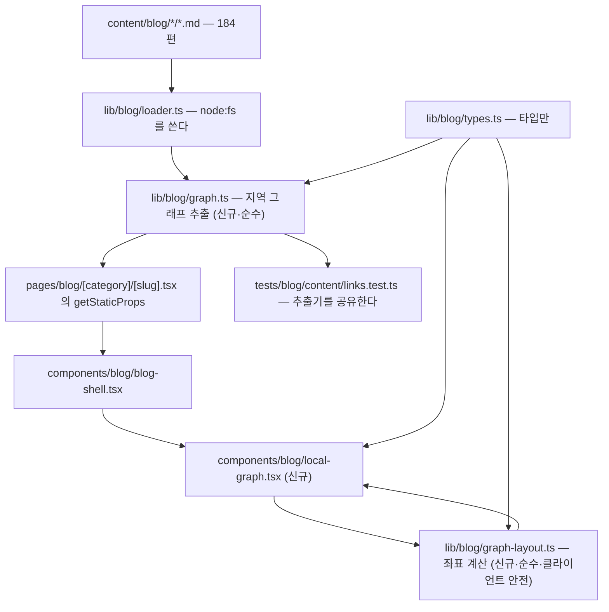
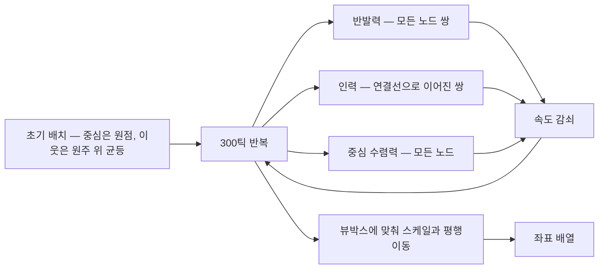

# 지역 그래프 위젯 설계서 — 블로그 사이드바 하단

> **작성 기준일**: 2026-09-05
>
> **대상**: `withwooyong.github.io/blog/` — 본문 페이지 좌측 사이드바 하단에 현재 편을 중심으로 한 링크 그래프를 그린다.
>
> **착안**: Obsidian Publish 도움말의 「인터랙티브 그래프」 위젯. 실물을 열어 구성을 관찰한 결과를 §1 에 적었다.
>
> **주 독자**: 학습·참조 목적의 기술 독자. 「지금 읽는 글이 무엇과 이어져 있는가」에 답하는 것이 이 위젯의 유일한 목적이다.
>
> **상태**: 설계 확정. 승인 후 작업계획서를 `docs/superpowers/plans/` 에 작성한다.

---

## §1. 무엇을 만드는가

Obsidian 도움말 페이지의 우측 상단 위젯을 실제로 열어 확인했다. 관찰된 구성은 다음과 같다.

| 관찰 항목 | 실물 |
| --- | --- |
| 렌더링 매체 | `canvas` 하나, 291 × 251 픽셀, `.graph-view` 컨테이너 안 |
| 그래프의 범위 | 전역이 아니라 **현재 문서를 중심에 둔 지역 그래프** |
| 중심 노드 | 다른 노드보다 크게 그려 눈에 띄게 한다 |
| 배치 | 힘 기반 레이아웃. 연결된 문서가 가깝게 모인다 |
| 라벨 | 노드마다 문서 제목. 좁은 폭에서 **서로 겹쳐 읽기 어려운 상태**였다 |
| 조작 | 우측 상단에 깊이 조절과 전체 화면 확대 아이콘이 하나씩 |

만들 것은 이것의 지역 그래프 부분이며, 자리는 블로그 본문 페이지의 **좌측 사이드바 하단**이다. 라벨 겹침은 실물에서 드러난 결함이므로 그대로 옮기지 않는다. §7 에서 다르게 푼다.

한 문장으로 줄이면 이렇다. **지금 읽고 있는 편을 가운데 두고, 그 편이 가리키거나 그 편을 가리키는 다른 편들을 점과 선으로 보여 준다.**

---

## §2. 지금 데이터로 만들 수 있는가

그래프를 그리려면 노드와 연결선이 있어야 한다. 발행본 184편 전량을 스캔해 실측한 결과다.

| 항목 | 실측값 | 무엇을 뜻하는가 |
| --- | ---: | --- |
| 노드 후보 (발행본) | 184편 | 8개 카테고리에 걸쳐 있다 |
| 연결선 후보 (편 대 편 내부 링크, 중복 제거·방향 있음) | 921개 | 필자가 의도적으로 이은 것들이다 |
| 들어오거나 나가는 링크가 하나도 없는 편 | **0편** | 어느 편에서도 빈 그래프가 나오지 않는다 |
| 이웃 수 (깊이 1) | 중앙값 6 · 상위 10% 12 · 최대 30 | 작은 위젯에 담기 적당한 규모다 |
| 깊이 2 부분그래프 크기 | 중앙값 35 · 상위 10% 60 · 최대 80 | 224픽셀 폭에는 담을 수 없는 규모다 |
| 그려질 부분그래프 안의 연결선 수 (이웃 상한 12개 적용) | 중앙값 20 · 상위 10% 42 · 최대 61 | 그중 이웃끼리의 연결선이 중앙값 11개다 |
| 전체 그래프를 JSON 으로 직렬화한 크기 | 약 104 KB | 페이지마다 싣기에는 크다 |

고립된 편이 0편이라는 점이 이 기능의 성립 근거다. 링크 무결성 검사(`tests/blog/content/links.test.ts`)가 고립을 막아 온 결과이며, 그 검사가 지켜 온 성질이 그대로 이 위젯의 전제가 된다.

### 페이지에 실릴 용량

지역 그래프 하나를 `getStaticProps` 로 넘길 때의 직렬화 크기를 편마다 재고 분포를 냈다. 이웃 상한 12개와 이웃끼리의 연결선을 모두 반영한 값이다.

| 구간 | 바이트 |
| --- | ---: |
| 최소 | 648 |
| 중앙값 | 3,238 |
| 상위 10% | 5,936 |
| 최대 | 8,375 |

비교 대상은 `CategoryTree` 다. 전체 트리를 페이지마다 싣는 안이 페이지당 약 18 KB 였고, 그것을 피하려고 「펼친 카테고리만 채운다」는 결정이 내려져 있다. 지역 그래프의 최대치 8.4 KB 는 그 기준의 절반에도 못 미치므로 **같은 이유로 거절될 크기가 아니다.**

⇒ **결론: 만들 수 있다.** 별도의 JSON 산출물을 빌드 후처리로 만들 필요도 없다.

---

## §3. 확정된 범위

설계 대화에서 정해진 것들이다. 각 결정에는 그것을 고른 이유와, 고르지 않은 쪽이 어떤 비용을 가졌는지를 함께 적는다.

| 결정 항목 | 확정 | 고르지 않은 대안과 그 비용 |
| --- | --- | --- |
| 그래프의 범위 | **지역 그래프만** | 전체 그래프 확대를 붙이면 104 KB 를 별도로 내려받는 경로와 Dialog 렌더러가 하나 더 필요하다. 「지금 이 편이 무엇과 이어져 있나」라는 질문에는 지역 그래프가 답한다 |
| 자리 | **좌측 사이드바 맨 아래 고정** | 카테고리 트리 아래에 그냥 이어 붙이면 편이 많은 카테고리에서 화면 밖으로 밀려 사실상 보이지 않는다. 실측으로 트리가 599픽셀 화면의 390픽셀을 차지했다 |
| 적용 라우트 | **본문 페이지에만** | 카테고리 목록과 태그와 블로그 홈에는 중심이 될 편이 없다. 중심 없는 그래프는 다른 렌더러가 필요하고, 위젯의 목적과도 어긋난다 |
| 연결선의 정의 | **본문에 실제로 걸린 편 대 편 링크만** | 시리즈 인접을 더하면 바로 아래 `SeriesNav` 와 겹친다. 태그 공유를 더하면 연결선이 **4,734쌍**이 되어 링크 연결선을 덮어 버린다 |
| 연결선의 범위 | **중심과 이웃, 그리고 이웃끼리** | 중심에서 뻗은 선만 그리면 그래프가 언제나 바퀴살 모양이 되어 힘 배치의 결과가 초기 원형 배치와 사실상 같아진다. 이웃끼리를 포함하면 184편 중 **182편**에서 실제로 얽힌 구조가 생긴다 |
| 구현 방식 | **힘 시뮬레이션 직접 구현** | `d3-force` 는 gzip 기준 약 15 KB 에서 20 KB 를 더하고 `engines` 대조 함정을 하나 늘린다. 화면에 그려지는 노드가 최대 13개인 규모에 범용 물리 엔진은 과하다 |

---

## §4. 구조



파일별 역할과 제약이다.

| 파일 | 신규 여부 | 역할 | `node:fs` 의존 | 실행 시점 |
| --- | --- | --- | --- | --- |
| `lib/blog/graph.ts` | 신규 | 발행본 배열과 중심 편에서 지역 그래프를 뽑는다 | 없음 | 빌드 |
| `lib/blog/graph-layout.ts` | 신규 | 노드와 연결선에서 좌표를 계산한다 | 없음 | 브라우저 |
| `components/blog/local-graph.tsx` | 신규 | 좌표를 받아 그리고 조작을 처리한다 | 없음 | 브라우저 |
| `lib/blog/types.ts` | 수정 | `LocalGraph` · `GraphNode` · `GraphEdge` 타입 추가 | 없음 | — |
| `lib/blog/loader.ts` | 수정 | `getLocalGraph()` 추가 | 있음 | 빌드 |
| `components/blog/blog-shell.tsx` | 수정 | 사이드바를 위아래 둘로 나눈다 | 없음 | 브라우저 |
| `pages/blog/[category]/[slug].tsx` | 수정 | `getStaticProps` 가 그래프를 넘긴다 | — | 빌드 |
| `tailwind.config.js` | 수정 | 세로 기준 브레이크포인트 추가 | — | — |

### 왜 추출과 배치를 두 모듈로 가르는가

두 가지 이유가 있다.

첫째, **실행 시점이 다르다.** 추출은 빌드할 때 한 번 일어나고 배치는 브라우저에서 방문할 때마다 일어난다. 한 파일에 두면 배치 코드를 고칠 때마다 빌드 전용 코드를 함께 읽어야 한다.

둘째, **클라이언트 안전 경계가 다르다.** `lib/blog/types.ts` 에 이미 이런 주석이 있다. 「이 타입이 `loader.ts` 가 아니라 여기에 사는 이유는 컴포넌트가 그것을 쓰기 때문이다. 컴포넌트가 `@/lib/blog/loader` 를 가리키면 `node:fs` 가 클라이언트 번들에 들어간다.」 같은 원칙이 그래프에도 적용된다. `graph.ts` 는 `mdast` 파서를 쓰므로 컴포넌트가 절대 가리켜서는 안 되고, `graph-layout.ts` 는 컴포넌트가 가리켜야 하므로 어떤 빌드 전용 모듈도 import 하지 않는다. **두 파일로 갈라 두면 이 규칙을 파일 단위로 눈으로 확인할 수 있다.**

---

## §5. 데이터 계층 — 링크 추출기의 진실원

### 문제

「무엇이 편과 편을 잇는 링크인가」를 판정하는 코드가 **이미 리포 안에 두 벌 있고, 서로 다른 기전으로 동작한다.**

| 있는 곳 | 판정 기전 | 코드 블록 안의 링크 | 참조식 링크 |
| --- | --- | --- | --- |
| `tests/blog/content/links.test.ts` 의 `outboundKeys` | 정규식 | **연결선으로 센다** | 놓친다 |
| `scripts/check-links.mjs` | `mdast-util-from-markdown` 파서 | 제외한다 | 잡는다 |

두 방식을 184편 전량에 각각 돌려 결과 집합을 대조했다.

| 대조 항목 | 결과 |
| --- | ---: |
| 정규식이 뽑은 연결선 | 921개 |
| 파서가 뽑은 연결선 | 921개 |
| 파서만 잡은 것 | 0개 |
| 정규식만 잡은 것 | 0개 |

**이 일치를 근거로 삼으면 안 된다.** 두 방식이 같아서 일치한 것이 아니라, 지금 발행본에 「코드 블록 안에서 실재하는 편을 가리키는 링크」와 「참조식으로 쓴 블로그 링크」가 우연히 하나도 없기 때문이다. 앞으로 예시 코드 안에 블로그 링크를 하나 쓰는 순간 두 방식은 갈라진다.

이 리포에는 같은 종류의 실패가 기록되어 있다. 금칙어 목록이 코드와 문서로 갈라져 거짓 0 이 CHANGELOG 에 사실로 기록된 일, 그리고 실측의 우연을 조건으로 굳혔다가 같은 기전을 새 기전으로 착각한 일이다. 여기에 세 번째 추출기를 더하면 그 목록에 한 줄을 더 보태게 된다.

### 결정

**`lib/blog/graph.ts` 가 「무엇이 편과 편을 잇는 링크인가」의 정본이 된다.** 판정은 `mdast` 파서가 하며, 코드 블록 안의 예시는 제외되고 참조식 링크는 포함된다.

작업은 셋이다.

| 순서 | 무엇을 | 왜 |
| --- | --- | --- |
| 1 | `graph.ts` 에 파서 기반 추출기를 쓴다 | `check-links.mjs` 와 판정 근거가 같아진다 |
| 2 | `links.test.ts` 의 정규식을 **지우고** `graph.ts` 의 추출기를 import 한다 | 진실원이 하나가 된다 |
| 3 | 「코드 블록 안의 블로그 링크는 연결선이 되지 않는다」 케이스를 새로 고정한다 | 두 기전의 차이를 코드로 못 박는다 |

차집합이 양쪽 모두 0개이므로 **이 교체는 오늘의 동작을 바꾸지 않는다.** 죽은 링크 판정도 고립 판정도 지금과 같은 결과를 낸다. 위험 없이 진실원만 하나로 모으는 변경이다.

🔴 **3번 케이스는 반드시 되돌려 확인한다.** 추출기를 옛 정규식으로 임시로 되돌렸을 때 그 케이스가 실제로 FAIL 해야 한다. 통과만 보고는 케이스가 헛도는지 알 수 없다는 것이 이 리포의 기록된 교훈이며, `source-overlap` 이 자기 검사 12/12 를 내면서도 ②가 설명과 다르게 동작했던 것이 그 사례다.

`mdast-util-from-markdown` 은 `check-links.mjs` 가 이미 쓰고 있어 새 의존성이 아니다. `graph.ts` 는 `getStaticProps` 안에서만 불리고 Next 가 그 코드를 클라이언트 번들에서 걷어내므로 브라우저로 새어 나가지 않는다.

---

## §6. 레이아웃 알고리즘

`lib/blog/graph-layout.ts` 는 순수 함수 하나로 이루어진다.

```
layout(nodes, edges, { width, height, ticks }) => { id, x, y }[]
```



### 왜 힘 배치인가

연결선이 중심에서만 뻗어 나온다면 힘 배치를 쓸 이유가 없다. 어떤 힘을 주어도 이웃은 중심 둘레에 고르게 놓이므로 초기 원형 배치와 결과가 같기 때문이다. **힘 배치가 값을 하는 것은 이웃끼리의 연결선이 있을 때다.** 서로 이어진 이웃이 한쪽으로 뭉치고 이어지지 않은 이웃이 반대쪽으로 밀리면서, 화면에 **무리가 드러난다.** §3 이 이웃 간 연결선을 포함하기로 한 것과 이 절은 같은 결정의 양면이다.

### 결정성

**난수를 전혀 쓰지 않는다.** 초기 배치는 중심 편을 원점에 두고 이웃을 인덱스 순서대로 원주 위에 균등 배치하는 것으로 시작한다. 씨앗조차 필요 없으므로 같은 입력이면 항상 같은 좌표가 나오고, 스냅숏 검사가 성립한다.

반복은 **수렴 판정 없이 고정 300틱**으로 끊는다. 수렴 조건을 두면 임계값이 하나 더 생기고, 그 임계값이 틀렸을 때 덜 퍼진 그래프가 오류 없이 조용히 나온다.

### 힘 셋

| 힘 | 대상 | 역할 | 계산량 |
| --- | --- | --- | --- |
| 반발력 | 모든 노드 쌍 | 겹침을 밀어낸다 | 시뮬레이션에 들어가는 노드가 최대 13개(중심 1 + 이웃 12, §7 의 상한)이므로 쌍이 78개다. 300틱을 곱해도 문제되지 않는다 |
| 인력 | 연결선으로 이어진 쌍 | 이어진 편을 가깝게 당긴다 | 연결선 수에 비례한다. 페이지당 중앙값 20개 · 최대 61개다 |
| 중심 수렴력 | 모든 노드 | 화면 밖으로 흩어지는 것을 막는다 | 노드 수에 비례한다 |

중심 편은 좌표를 갱신하지 않고 고정하여 항상 가운데에 온다.

### 🔴 가장 큰 위험은 0으로 나누기다

두 노드가 정확히 같은 좌표에 놓이면 거리가 0이 되어 좌표가 `NaN` 으로 오염된다. 그리고 **SVG 는 `NaN` 좌표를 만나면 오류를 내지 않고 그냥 아무것도 그리지 않는다.** 화면이 비어 보일 뿐 콘솔에는 아무 단서가 없으므로, 원인을 찾는 데 드는 비용이 실제 결함의 크기에 비해 훨씬 크다.

대응은 둘이다. 거리가 임계값보다 작으면 인덱스로 정해지는 각도만큼 결정론적으로 밀어내고, `NaN` 이 하나도 없다는 것을 검사로 명시적으로 고정한다.

---

## §7. 렌더링과 배치

### 연결선은 SVG, 노드는 HTML

노드를 SVG 안에 그리지 않는다. 이유가 셋이다.

| 이유 | SVG 안에 노드를 두면 | HTML 로 두면 |
| --- | --- | --- |
| 라우팅 | `next/link` 를 쓸 수 없어 전체 새로고침이 된다 | 클라이언트 라우팅이 유지된다 |
| 한국어 라벨 | `break-keep` 과 말줄임을 적용하기 까다롭다 | 평소 쓰던 Tailwind 클래스가 그대로 듣는다 |
| 접근성 | 포커스 링과 `aria` 속성을 손으로 챙겨야 한다 | 앵커의 기본 동작을 그대로 쓴다 |

그래서 **연결선만 `svg` 로 그리고, 노드는 그 위에 절대 배치한 HTML 앵커**로 둔다.

### 폭 224픽셀에 맞춘 결정 둘

사이드바가 `w-56`, 즉 224픽셀이다. 이 폭이 두 가지를 강제한다.

**노드 상한은 12개다.** 실측 분포가 중앙값 6 · 상위 10% 12 · 최대 30 이므로, 12개에서 끊으면 발행본의 약 90%는 이웃을 전부 보게 되고 나머지만 잘린다. 자를 때의 우선순위는 「양방향으로 이어진 편 → 이 편이 가리키는 편 → 이 편을 가리키는 편」 순이고 동률이면 제목 순이라 완전히 결정론적이다. 잘린 개수는 `+N` 으로 표시해 숨기지 않는다.

**라벨은 둘만 표시한다.** 224픽셀 안에 12개 제목을 모두 쓰면 겹쳐서 읽을 수 없다. §1 에서 관찰했듯 Obsidian 의 실물도 라벨이 겹쳐 있었다. 그래서 중심 편과 지금 가리키고 있는 노드만 라벨을 표시하고 나머지는 점으로 둔다. 마우스를 올리거나 키보드 포커스를 주면 그래프 아래 캡션 줄에 제목 전체가 나타난다. 이렇게 하면 정보가 사라지는 것이 아니라 **한 번에 하나씩 읽히는 형태로 바뀐다.**

### 사이드바 구조 변경

좌측 사이드바를 세로 두 칸으로 나눈다.

```
<aside>                       hidden w-56 shrink-0 lg:block
  <div>                       sticky top-20, 화면 높이만큼, 세로 flex
    <nav>카테고리 트리</nav>    flex-1 · min-h-0 · overflow-y-auto
    <LocalGraph />            고정 높이 · 바닥
  </div>
</aside>
```

⚠️ **이 변경에는 의도된 부수 효과가 하나 있다.** 지금은 카테고리 트리가 페이지 전체와 함께 스크롤되지만, 위 구조에서는 트리가 자기 영역 안에서 스크롤된다. 그리고 이것은 그래프를 두지 않는 카테고리 목록·태그·블로그 홈 세 종류에도 함께 적용된다. 레이아웃 골격이 `blog-shell.tsx` 하나로 공유되기 때문이다.

개선이라고 판단하지만 「본문에만 둔다」는 §3 의 결정과 어긋나 보일 수 있으므로 여기에 명시한다. **그래프는 본문에만 나타나고, 사이드바 스크롤 방식은 네 종류 모두에서 바뀐다.**

### 화면 높이 대응

화면이 낮은 기기에서는 그래프가 카테고리 트리를 밀어낸다. `tailwind.config.js` 에 세로 기준 브레이크포인트를 추가해 **화면 높이가 720픽셀 이상일 때만** 그래프를 보이게 한다. 가로 기준 `lg` 와 함께 걸리므로, 좁거나 낮은 화면에서는 지금과 완전히 같은 화면이 나온다.

---

## §8. 접근성과 다크 모드

| 항목 | 처리 |
| --- | --- |
| 키보드 | 노드가 진짜 앵커이므로 Tab 으로 순회하고 Enter 로 이동한다. 포커스가 닿은 노드의 제목이 캡션에 나온다 |
| 스크린 리더 | 위젯 전체에 `aria-label` 을 두고, 노드마다 제목과 관계 방향을 읽을 수 있는 문구를 둔다 |
| 움직임 | `prefers-reduced-motion: reduce` 이면 퍼지는 애니메이션 없이 최종 좌표로 한 번에 그린다 |
| 다크 모드 | 연결선과 노드의 색을 `currentColor` 에 기대지 않고 명시적 클래스로 지정하고 `dark:` 짝을 반드시 둔다 |

마지막 행에는 근거가 있다. 이 리포에서 `DialogContent` 에 `bg-background` 만 있고 `text-foreground` 가 없어 대비 1.06 이 배포된 일이 있었고, 원인은 **색 클래스가 아예 없는 자리는 짝 검사가 볼 수 없다**는 것이었다. 짝지을 대상이 없으면 검사가 침묵한다. 그래서 SVG 요소의 색은 상속에 맡기지 않고 처음부터 명시한다.

---

## §9. 검증 전략

| 층 | 무엇을 고정하는가 | 어디에 |
| --- | --- | --- |
| 추출 | 코드 블록 안 링크 제외 · 참조식 링크 포함 · 자기 링크 제외 · 방향 구분 · **이웃끼리의 연결선 포함** | `tests/blog/graph.test.ts` (신규) |
| 진실원 | `links.test.ts` 가 `graph.ts` 의 추출기를 쓴다 | 기존 파일 수정 |
| 상한과 우선순위 | 이웃이 12개를 넘을 때 무엇이 남는지가 결정론적이다 | `tests/blog/graph.test.ts` |
| 레이아웃 | 결정성 · 뷰박스 안 · 최소 간격 · **`NaN` 부재** · 노드 1개 같은 퇴화 입력 | `tests/blog/graph-layout.test.ts` (신규) |
| 콘텐츠 불변식 | 184편 전부 이웃이 1개 이상이고, 전 편에서 좌표 계산이 `NaN` 없이 끝난다 | `tests/blog/content/graph.test.ts` (신규) |
| 회귀 | 위 검사가 실제로 무언가를 지키는지 | `scripts/mutate.mjs` 에 뮤턴트 추가 |

### 뮤테이션을 완료 조건에 넣는 이유

이 리포의 기록이다. `source-overlap` 은 임계값을 20에서 200으로 바꿔 실제 스캔이 52자 축자 복사를 0건으로 보고하는 동안에도 자기 검사 28/28 을 그대로 냈고, `dup-scan` 은 공용 정규화를 통째로 무력화해도 7/7 을 냈다. **자기 검사의 통과는 「케이스가 있다」만 말할 뿐 「그 케이스가 무언가를 지킨다」는 말하지 않는다.**

그래서 새로 넣는 검사마다 대응하는 뮤턴트를 두고, `npm run mutate` 에서 생존이 0인 것을 확인하는 것까지가 완료다.

### 같은 커밋에 넣어야 하는 문서 갱신

`CLAUDE.md` 에 「검사기·뮤턴트·훅 단계의 수를 늘렸으면 그 수가 적힌 문서를 같은 커밋에서 고쳐라」가 있고, 세 세션 연속으로 낡았다는 기록이 붙어 있다. 이번 작업이 건드리는 수는 다음과 같다.

| 수치 | 지금 적힌 값 | 어디에 적혀 있나 |
| --- | --- | --- |
| `tests/blog` 파일 수와 케이스 수 | 8파일 87케이스 | `CLAUDE.md` · `README.md` · `HANDOFF.md` |
| 뮤턴트 수 | 58개 | `CLAUDE.md` · `README.md` |

발행본 수는 늘지 않으므로 `check-counts` 가 보는 README 의 세 자리는 이번 작업의 대상이 아니다.

### 빌드 산출물 검사와의 관계

그래프는 이웃 편의 제목을 페이지마다 최대 12개 더 심는다. 이 제목들은 `out/blog` 아래에 들어가므로 `check-forbidden --built` 의 스캔 범위 안이며, **새로운 사각지대가 생기지는 않는다.** 소스가 깨끗해도 페이지가 오염될 수 있다는 것이 그 검사의 존재 이유이고, 여기가 정확히 그 검사가 보라고 만들어진 자리다.

---

## §10. 하지 않는 것

범위를 좁게 유지하기 위해 의도적으로 뺀 것들이다. 나중에 필요해지면 그때 별도로 판단한다.

| 하지 않는 것 | 왜 |
| --- | --- |
| 전체 그래프 확대 보기 | 104 KB 를 내려받는 경로와 Dialog 렌더러가 별도로 필요하다. 지역 그래프가 답하는 질문과 다른 질문이다 |
| 깊이 조절 (깊이 2까지 펼치기) | 깊이 2 부분그래프가 중앙값 35개다. 224픽셀에 담기지 않는다 |
| 태그 공유와 시리즈 인접을 연결선으로 | 태그 공유는 4,734쌍이라 링크를 덮고, 시리즈는 `SeriesNav` 가 이미 글로 보여 준다 |
| `canvas` 렌더링 | 노드가 최대 12개다. SVG 와 HTML 앵커가 주는 접근성을 포기할 이유가 없다 |
| 별도 `graph.json` 빌드 후처리 | 페이지당 최대 6.3 KB 이므로 `getStaticProps` 로 충분하다 |
| 카테고리·태그·홈 페이지 적용 | 중심이 될 편이 없다 |

---

## §11. 리스크와 대응

| 리스크 | 어떻게 드러나는가 | 대응 |
| --- | --- | --- |
| 좌표가 `NaN` 이 되어 그래프가 비어 보인다 | 오류 없이 화면만 빈다 | 최소 거리 보정 + `NaN` 부재를 검사로 고정 (§6) |
| 추출기가 세 벌로 갈라진다 | 그래프에 보이는 연결선과 링크 검사가 보는 연결선이 달라진다 | `graph.ts` 를 정본으로 통합 (§5) |
| 사이드바 스크롤 변경이 다른 라우트를 깨뜨린다 | 카테고리 목록·태그·홈에서 트리가 잘려 보인다 | 네 라우트를 모두 화면으로 확인하는 것을 완료 조건에 넣는다 |
| 힘 파라미터가 덜 조율되어 노드가 뭉친다 | 점들이 겹쳐 구분되지 않는다 | 최소 간격을 검사로 고정하고, 이웃이 가장 많은 편(30개 중 12개가 표시된다)으로 눈으로 확인한다 |
| 페이지 용량이 예상보다 는다 | 빌드 산출물이 커진다 | 빌드 뒤 실제 HTML 증가분을 측정해 실측 6.3 KB 와 대조한다 |
| 새 검사가 아무것도 지키지 않는다 | 초록이 나오는데 결함이 통과한다 | 뮤테이션에서 생존 0 을 확인 (§9) |

---

## §12. 완료 조건

아래가 전부 확인되어야 완료다. 각 항목은 실행한 명령의 출력으로 증명한다.

| 항목 | 어떻게 증명하나 |
| --- | --- |
| 새 검사가 통과한다 | `npx vitest run tests/blog` 출력의 케이스 수 |
| 타입이 통과한다 | `npx tsc --noEmit` — Vitest 는 타입을 지울 뿐 검사하지 않는다 |
| 기존 검사가 그대로 통과한다 | 검사기 열 종의 증명과 스캔을 순서대로 |
| 추출기 교체가 동작을 바꾸지 않았다 | 교체 전후의 연결선 수가 921개로 같다 |
| 새 케이스가 실제로 무언가를 지킨다 | 옛 정규식으로 되돌리면 FAIL 하는 것을 눈으로 확인 (§5) |
| 뮤테이션에 생존이 없다 | `npm run mutate` 종료 코드 0 |
| 빌드가 통과한다 | `npm run build` 와 `npm run check-forbidden:built` |
| 화면이 실제로 그렇게 보인다 | 본문·카테고리·태그·홈 네 라우트를 밝은 모드와 어두운 모드로 확인 |
| 문서의 수치가 맞다 | `CLAUDE.md` · `README.md` · `HANDOFF.md` 의 파일 수·케이스 수·뮤턴트 수 |

마지막 두 행이 특히 중요하다. 이 리포에는 **테스트 초록과 문서의 「완료」가 마감 근거가 되지 못했던** 기록이 있다. 화면은 열어서 세어야 하고, 문서의 수치도 대조군 없이는 근거가 아니다.

---

## 참고

- 이전 설계서: [블로그 탐색 개편 설계서](./2026-09-04-blog-navigation-design.md) — `CategoryTree` 의 페이지당 용량 결정과 `search-index.json` 의 빌드 후처리 선례가 여기에 있다.
- 도구 함정 전체 목록: [`docs/TOOL-TRAPS.md`](../../TOOL-TRAPS.md)
- 리포 지침: [`CLAUDE.md`](../../../CLAUDE.md)
