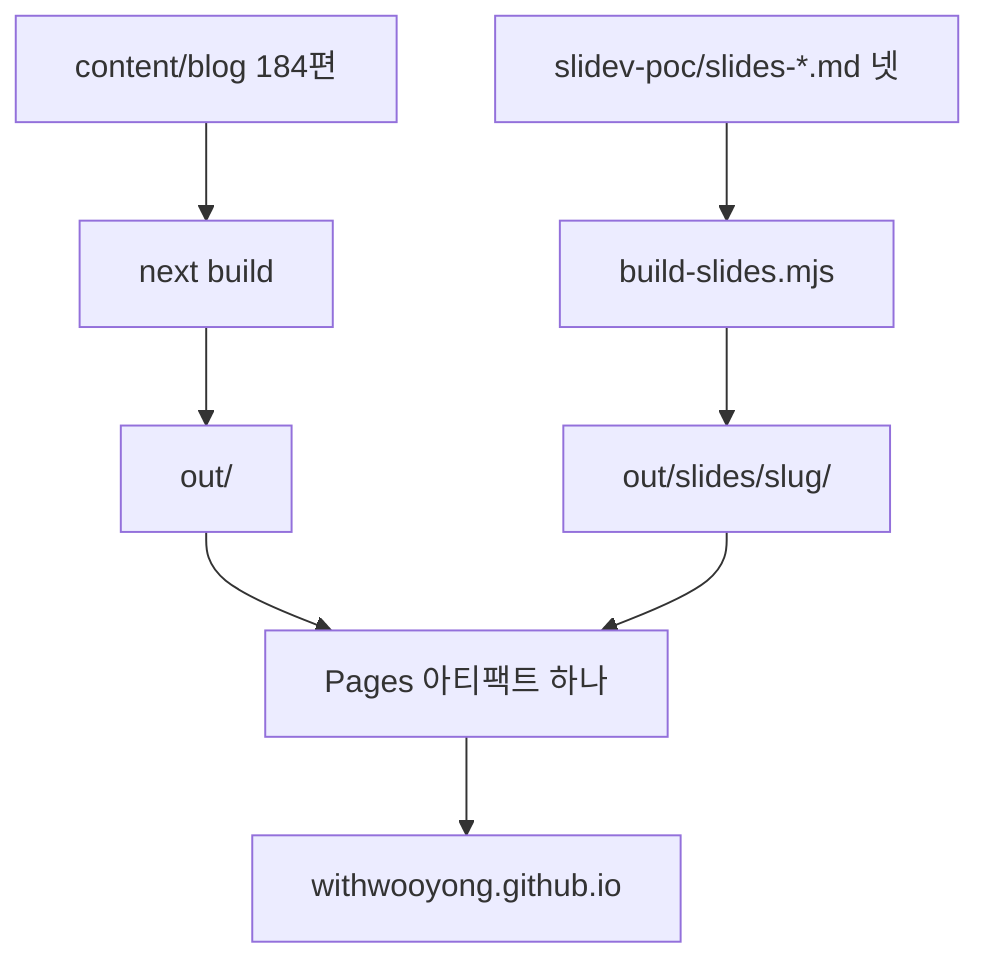
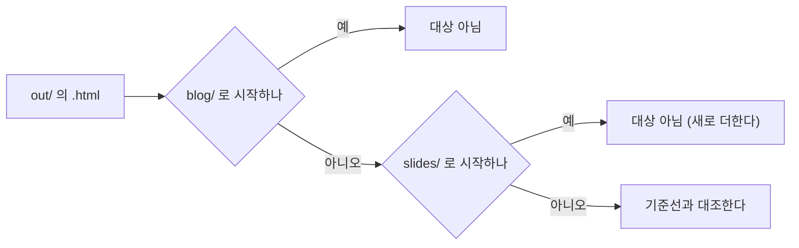

# 발표본을 GitHub Pages 에 배포한다

작성일: 2026-09-09 · 기점 커밋 `9b1c23d` · 브랜치 `feat/deploy-slides`

## §1 목표와 확정된 결정

발표본 넷(`slides-patterns` 29장 · `slides-team-ops` 30장 · `slides-governance` 25장 ·
`slides-search` 35장, 합계 119장)은 이미 `main` 에 들어와 있으나 배포되지 않아 아무도 볼 수
없다. 이 설계는 그 넷을 본체 사이트와 같은 도메인에 올린다.

착수 전에 네 가지를 사용자에게 물어 확정했다.

| 결정 | 확정된 값 | 대안을 버린 이유 |
| --- | --- | --- |
| 발표본의 위치 | 같은 도메인의 `/slides/` 이되 본체에서 링크하지 않고 색인도 막는다 | 공개 링크는 Slidev 산출물이 클라이언트 렌더라 검색에 부적합하고 블로그 편과 중복된다. 별도 리포는 원고가 두 곳으로 갈라진다 |
| 산출물 경로 | CI 에서 매번 빌드해 `out/slides/` 로 옮긴다 | 산출물을 커밋하면 리포에 627파일 19 MB 가 들어가고, 한 줄만 고쳐도 해시 파일명 156개가 통째로 바뀐다 |
| 금칙어 범위 | `check-forbidden` 의 소스 스캔 대상에 발표본 소스를 더한다 | 별도 검사기에 두면 금칙어 목록의 소비처가 둘로 갈라진다. `CLAUDE.md` 는 정본을 한 곳에 두라고 적고 있다 |
| 실패 전파 | 슬라이드 빌드가 깨지면 본체 배포도 막는다 | 본체만 올리면 `/slides/` 가 404 인 채 배포가 초록으로 끝난다. 이 리포가 반복해서 경계해 온 거짓 초록이다 |

## §2 배포 구조

Pages 는 사이트당 아티팩트를 하나만 배포하므로 두 산출물은 반드시 한 부대에 실린다.
그래서 슬라이드 빌드는 `next build` **뒤에** 돌아야 하며, 복사 대상 디렉터리 `out/` 이
그때 비로소 존재한다.

배포 뒤의 경로는 이렇게 된다.

| URL | 소스 |
| --- | --- |
| `/slides/patterns/` | `slidev-poc/slides-patterns.md` |
| `/slides/team-ops/` | `slidev-poc/slides-team-ops.md` |
| `/slides/governance/` | `slidev-poc/slides-governance.md` |
| `/slides/search/` | `slidev-poc/slides-search.md` 와 `pages/` 6부 |

`public/robots.txt` 에 `Disallow: /slides/` 를 더한다. 이미 있는 `Disallow: /docs/` 와 같은
방식이며, 링크로는 열리되 검색 결과에는 뜨지 않는다.

## §3 만드는 것과 고치는 것

| 파일 | 새것인가 | 무엇을 하나 |
| --- | :---: | --- |
| `slidev-poc/decks.json` | 새것 | slug 와 소스 파일명의 진실원. 빌더와 검사기가 같은 목록을 읽는다 |
| `scripts/build-slides.mjs` | 새것 | `decks.json` 을 읽어 넷을 빌드하고 `out/slides/slug/` 로 옮긴다 |
| `scripts/check-slides.mjs` | 새것 | 산출물 실존을 판정한다. `--self-test` 를 갖춘다 |
| `scripts/check-forbidden.mjs` | 수정 | 소스 스캔 대상에 발표본 13파일을 더한다 |
| `scripts/check-baseline.mjs` | 수정 | `isTarget` 에서 `slides/` 를 제외하고 그 제외를 케이스로 고정한다 |
| `scripts/mutate.mjs` | 수정 | `check-slides` 뮤턴트를 더하고 `CHECKS` 에 등록한다 |
| `public/robots.txt` | 수정 | `Disallow: /slides/` |
| `.github/workflows/deploy.yml` | 수정 | 스텝 넷을 더한다 |
| `package.json` | 수정 | 스크립트 셋(`build-slides` · `check-slides` · `check-slides:verify`) |

**목록을 파일 하나에 두는 이유**는 워크플로에 넷을 박으면 다섯째 발표본이 조용히 빠지기
때문이다. 이 리포는 같은 실패를 여러 번 겪었다. `check-slides` 가 `decks.json` 의 항목 수와
산출물 수를 대조하므로 목록에 더하고 빌더에 안 더하는 실수도 드러난다.

## §4 워크플로 스텝 배치

새 스텝은 굵게 적었다. `build` job 이 28스텝에서 **32스텝**이 된다.

| 순서 | 스텝 | 왜 이 자리인가 |
| ---: | --- | --- |
| 1 ~ 23 | (기존 검사 스텝들) | 손대지 않는다 |
| 24 | Prove baseline checker | |
| 25 | **Prove slides checker** | 증명이 스캔보다 먼저다 |
| 26 | Build | `out/` 이 여기서 생긴다 |
| 27 | **Install slides deps** | `working-directory: slidev-poc` 와 `npm ci --omit=dev` |
| 28 | **Build slides into out/slides** | `out/` 이 있어야 옮길 자리가 있다 |
| 29 | **Check slides output** | 산출물이 실제로 들어갔는지 판정한다 |
| 30 | Scan built output | `out/blog` 만 본다. 슬라이드와 무관하다 |
| 31 | Check non-blog baseline | `slides/` 를 제외하도록 고친 뒤 |
| 32 | Upload artifact | PR 에서는 건너뛴다 |

⚠️ **여기의 「28스텝」은 워크플로에 적힌 스텝 정의의 수이며 러너가 보고하는 수와 다르다.**
러너는 준비 단계를 함께 세어 32로 보고한다. 두 수가 다르므로 문서를 고칠 때 어느 쪽인지
밝혀 적고, 러너 쪽 수는 PR 의 실제 run 에서 읽는다.

개발 의존성을 빼는 이유는 `playwright-chromium` 이 devDependency 이기 때문이다. PDF 내보내기에만
필요하고 `slidev build` 에는 필요하지 않다. 실측으로 넷 모두 개발 의존성 없이 빌드된다.

## §5 검사기 변경의 상세

### §5-1 `check-baseline` 이 슬라이드를 제외한다

지금 `isTarget` 은 `out/` 아래에서 `blog/` 로 시작하지 않는 모든 `.html` 을 대상으로 잡고,
`diff` 는 **추가된 파일도 위반으로 센다.** 슬라이드 넷은 `.html` 을 8개 만들므로
(`index.html` 과 `404.html` 이 발표본마다 하나씩) 고치지 않으면 GC-6 가 즉시 빨간불이 된다.

제외의 근거는 블로그를 뺀 것과 같다. 발표본을 고치면 산출물이 바뀌는 것이 당연하므로
불변을 요구할 자리가 아니다. 다만 **제외가 넓어지면 그만큼 검사가 못 보는 영역이 되므로**,
기존 마스킹 케이스들과 같은 방식으로 자기 검사에 케이스를 둔다.

| 새 케이스가 보는 것 | 왜 필요한가 |
| --- | --- |
| `slides/…` 가 대상에서 빠진다 | 제외가 실제로 동작하는지 |
| `slidesheet.html` 처럼 이름이 비슷한 것은 빠지지 않는다 | 접두사 판정이 낱말 경계를 지키는지 |
| 기존 비블로그 15개가 여전히 대상이다 | 제외가 넓어지지 않았는지 |

두 번째 케이스가 핵심이다. `startsWith("slides")` 로 적으면 `slidesheet.html` 같은 이름이 함께
빠지는데, 그것은 위반을 놓치는 쪽의 실수라 통과만 보고는 드러나지 않는다.

### §5-2 `check-forbidden` 이 발표본 소스를 본다

실측으로 발표본 소스 13파일에 금칙어 18종이 **0건**이다. 대조군을 세워 프로브가 실제로
잡는지 증명했으며, 심어 둔 다섯 종을 모두 잡았다. 그러므로 이 변경은 지금 위반을 고치는
일이 아니라 **지키는 사람이 없는 자리를 닫는 일**이다.

`--built` 는 손대지 않는다. 그쪽은 `out/blog` 만 보며 그 범위를 넓히면 포트폴리오까지
정책 대상이 되어 버린다. 발표본은 소스 쪽에서 판정한다.

### §5-3 `check-slides` 가 산출물을 판정한다

이 검사기가 없으면 복사가 통째로 빠져도 CI 는 초록이 난다. 판정 항목은 넷이다.

| 항목 | 실패하면 |
| --- | --- |
| `decks.json` 의 항목마다 `out/slides/slug/index.html` 이 있다 | 종료 코드 1 |
| 각 산출물에 `assets/` 가 있고 파일이 하나 이상이다 | 종료 코드 1 |
| `out/slides` 자체가 없다 | 종료 코드 2 (빌드를 안 돌린 것과 위반을 구분한다) |
| `decks.json` 이 비어 있다 | 종료 코드 2 (0개 통과를 통과로 세지 않는다) |

세 번째와 네 번째를 종료 코드 2 로 나누는 이유는 이 리포가 반복해서 적어 온 것과 같다.
아무것도 세지 않은 것을 「위반 없음」으로 세면 초록이 나온다.

## §6 위험과 대응

| 위험 | 어떻게 다루나 |
| --- | --- |
| 슬라이드 빌드 실패가 본체 배포를 막는다 | **의도한 동작이다.** `continue-on-error` 를 쓰지 않는다. PR 단계에서도 같은 스텝이 도므로 merge 전에 걸러진다 |
| 산출물이 조용히 빠진 채 초록이 난다 | `check-slides` 가 판정한다 |
| CI 시간이 는다 | 로컬 근사로 68초다. 캐시 없는 CI 의 첫 설치는 더 걸리므로 **PR 단계에서 실측해 기록한다** |
| 슬라이드가 GC-6 를 깨뜨린다 | §5-1 로 닫는다 |
| 검사기 종 수가 늘었는데 문서가 낡는다 | §8 의 목록을 같은 커밋에 넣는다 |
| `decks.json` 과 실제 파일이 어긋난다 | `check-slides` 가 항목마다 산출물을 찾으므로 드러난다 |

## §7 실측 근거

전부 이 세션에서 직접 쟀다.

| 항목 | 값 | 어떻게 쟀나 |
| --- | ---: | --- |
| `npm ci --omit=dev` | 12.2초 | 로컬 캐시가 있는 상태다. CI 의 첫 설치는 더 걸린다 |
| 발표본 넷 빌드 | 56.3초 | 개발 의존성 없이 넷 모두 성공했다 |
| 산출물 크기 | 19 MB | 발표본마다 4.6 MB 로 고르다 |
| 산출물 파일 수 | 627 | js 560 · css 48 · html 8 · 그 밖 |
| 발표본 소스의 금칙어 | 18종 0건 | 대조군에 심은 다섯 종을 프로브가 실제로 잡았다 |

## §8 같은 커밋에서 고쳐야 하는 수치

`CLAUDE.md` 가 반복해서 경고하는 자리다. **이어받지 말고 매번 세라.**

| 수 | 지금 | 뒤 | 적힌 곳 |
| --- | ---: | ---: | --- |
| 검사기 종 수 | 열둘 | **열셋** | `CLAUDE.md` · `README.md` · `HANDOFF.md` |
| 뮤테이션이 돌리는 검사 | 열둘 | **열셋** | `CLAUDE.md` · `scripts/mutate.mjs` |
| 뮤턴트 수 | 112 | 세어서 적는다 | `CLAUDE.md` · `README.md` · `HANDOFF.md` |
| CI build 스텝 (정의) | 28 | **32** | `CLAUDE.md` · `README.md` |
| CI build 스텝 (러너 보고) | 32 | PR 의 run 에서 읽는다 | `CLAUDE.md` |
| `tests/blog` 케이스 | 14파일 200케이스 | 러너 요약 줄에서 읽는다 | `CLAUDE.md` |

**케이스 수는 `it(` 를 grep 하지 말고 `npx vitest run` 의 요약 줄에서 읽는다.** 실측으로 grep 이
179, 러너가 180 이었던 적이 있다.

직전 두 세션의 배포 run `34336637777` 과 `34340890496` 이 아직 어느 문서에도 없으므로
이번 PR 의 문서 갱신에 함께 싣는다.

## §9 검증 절차

| 순서 | 무엇 | 통과 기준 |
| ---: | --- | --- |
| 1 | `npm run check-slides:verify` | 자기 검사 전량 통과 |
| 2 | `npm run check-baseline:verify` | 새 케이스 셋을 포함해 전량 통과 |
| 3 | `npm run check-forbidden:verify` 와 `npm run check-forbidden` | HARD 0 |
| 4 | `npm run build` 뒤 `npm run build-slides` | 산출물 넷 |
| 5 | `npm run check-slides` | 넷 전부 확인 |
| 6 | `npm run check-baseline` | 비블로그 15개 불변 |
| 7 | `npm run mutate` | 생존 0 |
| 8 | 문서 검사기 넷의 `--docs` | 위반 0 |
| 9 | 브라우저로 `out/slides/patterns/` 를 연다 | 첫 장이 실제로 그려진다 |

9번을 넣는 이유는 이 리포가 겪은 것과 같다. **산출물에 문자열이 있다는 것으로 렌더됐다를
증명하지 못한다.** 검사기 여덟이 전부 통과해도 화면이 비어 있을 수 있다.

되돌려 보는 일은 손으로 하지 않는다. 7번이 `check-slides` 의 자기 검사가 실제로 무언가를
지키는지 판정한다.

## §10 브랜치와 종료 정책

| 항목 | 값 |
| --- | --- |
| 브랜치 | `feat/deploy-slides` (기점 `9b1c23d` 를 명시해 만들었다) |
| 워크트리 | 루트 워크트리에서 작업한다. CR 이 0이라 뮤테이션이 정상으로 돈다 |
| PR | 검증이 끝나면 연다 |
| `main` push 와 merge | **별도 승인을 받는다** |
| 곁들이는 정리 | 원격의 `fix/baseline-env-independent` 를 지운다 (merge 완료 상태다) |
