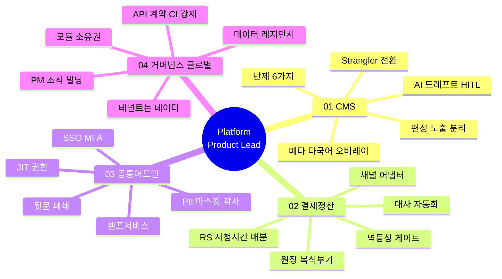
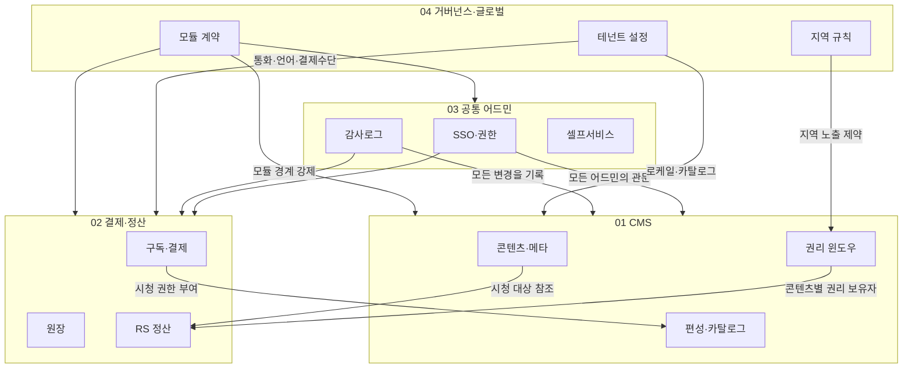
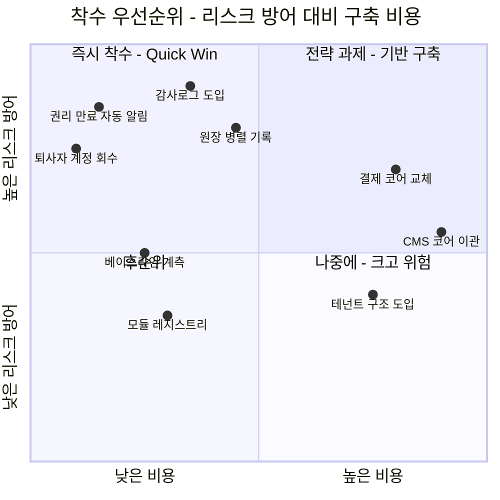
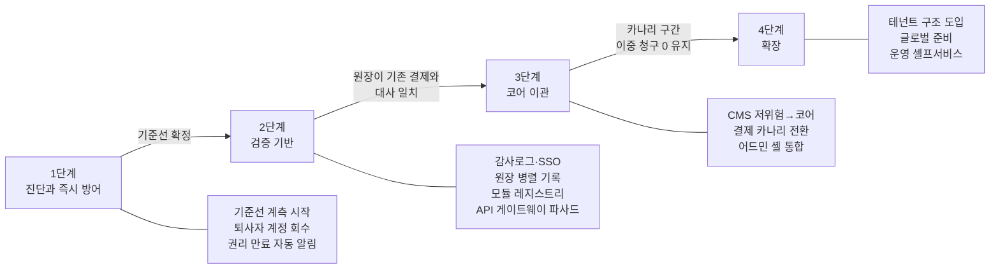
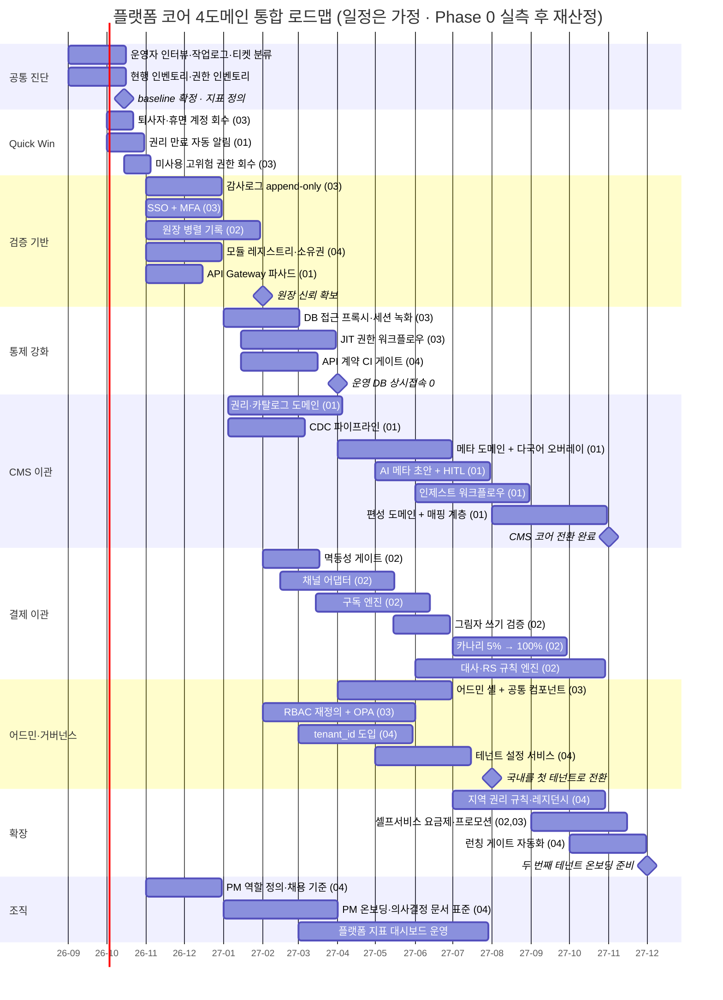
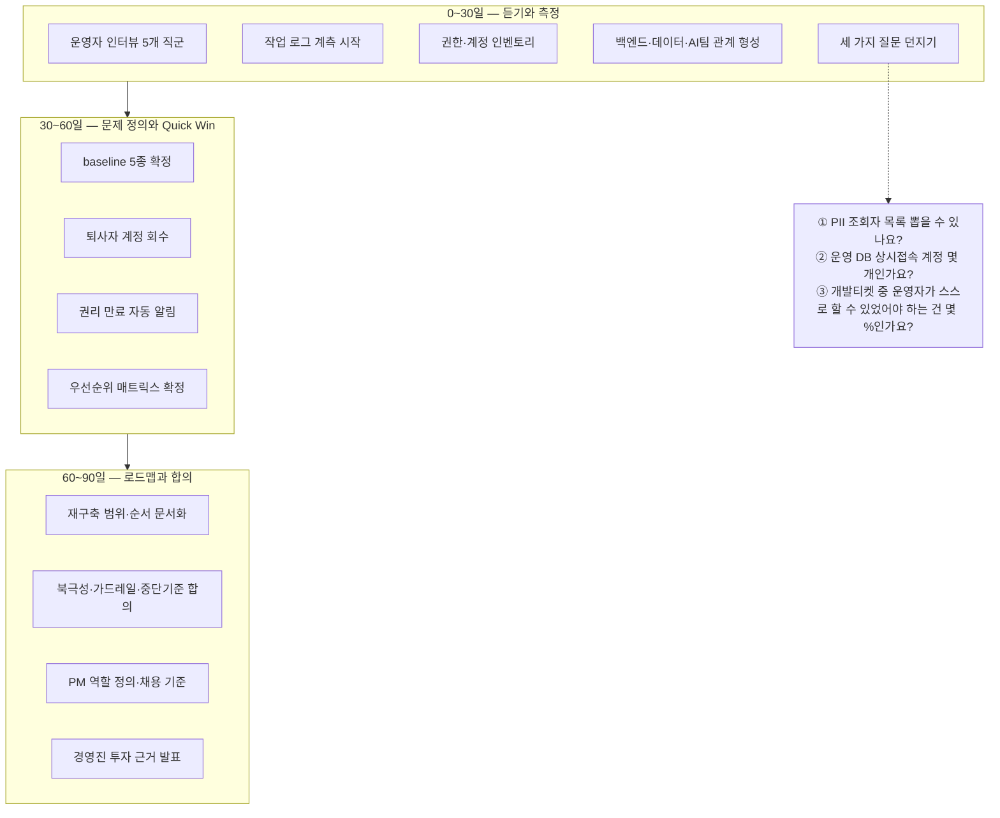
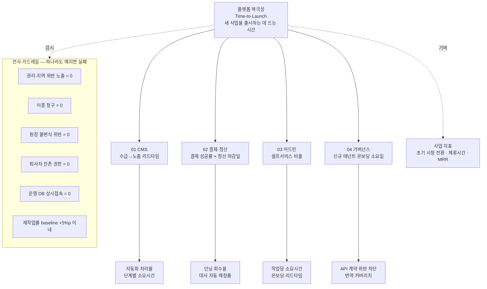

# TVING Platform Product Lead — 목표 설계 문서군 (허브)

> **작성 기준일**: 2026-07-10
>
> **목적**: TVING「Platform Product Lead」공고([원문](https://tving.ninehire.site/job_posting/B51SV3EK), 마감 2026-07-26)의 **코어 4개 도메인**에 대한 목표 설계 문서군의 진입점. 면접에서 화이트보드 질문에 도식으로 답하고, 면접 직전 30분에 훑기 위한 허브.
>
> **작성자**: 허우용(Ted) — 20년 플랫폼 리더. TVING 1세대 CMS 파트 리드, BTV NCMS 차세대 재구축 발주 PM, 야나두 커머스개발실 총괄.
>
> **⚠️ 이 문서군의 성격**: 티빙 현행 시스템을 진단한 문서가 **아닙니다.** **"제가 만든다면 이렇게 만들겠다"** 는 목표 아키텍처 초안입니다. 현행 구조는 알지 못하며, 부임 후 팀과 함께 진단해 이 초안을 조정합니다.
>
> **연계 문서**: [공고 분석](../posting/posting_tving.md) · [면접 Q&A 102선](../interview/tving_면접대비_PM관점.md) · [조직 리서치](../research/tving_조직_리서치.md)

---

## §0. 이 문서군 사용법

### 0-1. 읽는 순서

| 상황 | 읽을 것 |
|---|---|
| **처음 읽을 때** | 이 허브 전체 → [01_CMS.md](01_CMS.md) 정독 → 나머지 3개의 §1·§2·§11만 |
| **면접 3일 전** | 각 문서의 면접 Q&A 절만 소리 내어 연습 |
| **면접 30분 전** | 이 허브의 §3(우선순위)·§5(0-30-60-90일)·§7(서사 카드)만 |
| **화이트보드 질문이 나오면** | 머릿속에 §2 그림 → 해당 도메인의 §2 목표 구성도 |

### 0-2. 문서 지도

| 문서 | 공고 대응 | 핵심 한 줄 | 도식 |
|---|---|---|---|
| **[01_CMS.md](01_CMS.md)** | 주요업무 1·2번 | CMS의 고객은 시청자가 아니라 **운영자**다 | 14 |
| **[02_결제정산.md](02_결제정산.md)** | 주요업무 1번 (결제/정산) | 원장을 먼저 세우지 않으면 **바꾼 게 맞는지 검증할 수 없다** | 12 |
| **[03_공통어드민.md](03_공통어드민.md)** | 주요업무 4번 | 화면 권한보다 **뒷문(운영 DB 직접 접속)을 먼저 닫는다** | 11 |
| **[04_거버넌스_글로벌.md](04_거버넌스_글로벌.md)** | 주요업무 3·5번 | 거버넌스는 통제가 아니라 **확장 능력**이다 | 12 |
| **[06_제품개발_프로세스_RnR.md](06_제품개발_프로세스_RnR.md)** | 주요업무 5번 (PM 조직) | 재구축의 종료점은 출시가 아니라 **레거시 폐기**다 | 6 |

> 01~04가 **무엇을 만들 것인가(To-Be 설계)라면**, **06은 어떻게 만들 것인가(업무 순서·R&R·산출물·툴)** 입니다. 인하우스 3팀 협업을 전제로 한 실행 규약 초안입니다.



### 0-3. 모든 도메인 문서가 공유하는 12절 골격

```
§0  용어 풀이
§1  도메인 정의 · 내부 고객 · 이 도메인이 반드시 푸는 난제 6가지
§2  To-Be 목표 아키텍처 (설계 원칙 + 구성도)
§3  데이터 모델 (ERD + 설계 결정)
§4  DB 샘플 쿼리
§5  서비스 흐름도 (시퀀스)
§6  상태 전이 (상태기계)
§7  동선 (목표 상태의 운영자 경험)
§8  솔루션 후보 비교 (빌드 vs 바이)
§9  실행 로드맵 (Phase 0 실측 + 간트)
§10 성과지표 (북극성 · 가드레일 · 중단 기준)
§11 면접 예상질문 & 답변
§12 이 문서의 한계
```

> **§1의 "난제 6가지"가 각 문서의 척추입니다.**
>
> 이건 티빙 현행에 대한 진단이 아니라, **그 도메인이라면 규모·시대와 무관하게 마주치는 보편의 문제**입니다.
>
> 이후의 모든 설계 결정은 "여섯 난제 중 어느 것에 대한 답인가"로 연결됩니다. 면접에서 "왜 그렇게 설계하셨죠?"에 답하는 방식이 바로 이것입니다.

---

## §1. 공고 요구사항 ↔ 문서 매핑

### 1-1. 주요업무 5개

| # | 공고 원문 | 대응 문서 | 핵심 답변 |
|---|---|---|---|
| 1 | 콘텐츠·플랫폼 코어 엔진 중장기 로드맵 (CMS·결제/정산·공통 어드민) | [01](01_CMS.md)·[02](02_결제정산.md)·[03](03_공통어드민.md) | 도메인별 북극성 + 통합 지표 트리(§6) |
| 2 | 차세대 CMS 재구축 기획 총괄 (멀티테넌트·글로벌·워크플로우 자동화) | [01](01_CMS.md) | 진단 → 지표 → strangler 점진 전환 |
| 3 | 플랫폼 거버넌스 및 기능 모듈화 | [04](04_거버넌스_글로벌.md) | 모듈 소유권 + API 계약을 CI로 강제 |
| 4 | 내부 고객 경험 향상 및 플랫폼 이네이블먼트 | [03](03_공통어드민.md) | 북극성 = 셀프서비스 비율 |
| 5 | 플랫폼 성과 지표 정의 및 PM 조직 빌딩 | [04 §10·§11](04_거버넌스_글로벌.md) | Time-to-Launch + 역할 정의 선행 |

### 1-2. 자격요건 · 우대사항 대응

| 요건 | 나의 근거 | 이 문서군에서 |
|---|---|---|
| 플랫폼 PM/PO 10년+ | 20년. BTV NCMS는 **PM 직무로 입사해 수행** | 전 문서의 지표·우선순위 사고 |
| 대규모 CMS·결제/정산 **재구축 리딩** | BTV NCMS 재구축 완주 + 야나두 결제·정산 직접 설계 | [01](01_CMS.md)·[02](02_결제정산.md) |
| MSA·API 설계·클라우드 | BTV NCMS MSA 분해, AWS 전반 | [04 §2-2](04_거버넌스_글로벌.md) |
| 이해관계자 조율 | 20~30인 조직, 6개 팀 총괄 | 각 문서 §10 중단 기준 = 합의의 산물 |
| 경영진 전략 소통 | 개발실장으로 C레벨 커뮤니케이션 | [01 §7-3](01_CMS.md) 인과 사슬, [04 §9-1](04_거버넌스_글로벌.md) 투자 근거 |
| **우대** — 개발/기술 백그라운드 | 20년 핸즈온 | ERD·SQL·시퀀스 전부 |
| **우대** — 미디어·OTT·커머스 | TVING·BTV·야나두 **트리플** | 도메인 디테일(EPG/카탈로그, RS 정산) |
| **우대** — AI 메타데이터 자동화 | 야나두 AI 서비스 신설, AX 주도 | [01 §8-4](01_CMS.md) AI 드래프트 + HITL |
| **우대** — 10명 PM/PO 조직 리딩 | PM팀 산하 운영, 20명 직접 채용 | [04 §11](04_거버넌스_글로벌.md) |
| **우대** — 멀티테넌트·글로벌 | ⚠️ **사례 얇음. 과장 금지** | [04 §8-1](04_거버넌스_글로벌.md)에서 판단 논리로 대응 |
| **우대** — 비즈니스 영어 | ⚠️ 구조적 약점 | 솔직 + 보완계획 |

---

## §2. 4개 도메인은 어떻게 연결되는가



### 2-1. 4개를 보는 틀 — 2×2 격자

> 4개는 나란한 병렬이 아닙니다. **"무엇을 운영하는가"(업무 도메인)** 와 **"어떻게 안전하게·확장 가능하게 하는가"(공통 기반)** 두 축으로 갈립니다.
>
> 세로(업무 도메인)는 그 자체로 가치를 만들고, 가로(공통 기반)는 세로를 떠받치며 모든 칸을 관통합니다.

|  | 01 CMS | 02 결제·정산 |
|---|---|---|
| **03 공통 어드민** (권한·감사) | CMS 화면 권한·변경 감사 | 정산 화면 권한·변경 감사 |
| **04 거버넌스·글로벌** (테넌트·모듈 계약) | 로케일·카탈로그 규칙, 모듈 경계 | 통화·결제수단 규칙, 모듈 경계 |

> **읽는 법**: 열(01·02)은 세로 업무 도메인, 행(03·04)은 가로 공통 기반. 각 칸은 "그 기반을 그 업무에 적용한 것"입니다.
>
> 그래서 03·04는 위 §2 다이어그램에서 CMS·결제 양쪽으로 화살표가 뻗습니다 — 칸마다 반복되기 때문입니다.
>
> **함의**: 가로(공통 기반)를 먼저 세우면 이후 세로 도메인이 늘어도 각 칸이 자동으로 채워집니다. 늦게 세우면 이미 만든 모든 칸을 되돌려 고쳐야 합니다 — 이것이 §3에서 어드민·거버넌스가 우선순위 앞에 서는 이유입니다.

### 2-2. 이 그림이 말하는 것

| 관찰 | 함의 |
|---|---|
| **어드민(03)은 모든 도메인을 관통한다** | 권한·감사는 도메인이 아니라 **횡단 관심사**. 가장 먼저 세워야 나머지가 안전 |
| **거버넌스(04)도 관통한다** | 테넌트 설정이 CMS와 결제 양쪽을 바꾼다. 늦게 넣을수록 비싸다 |
| **CMS의 권리(C2)가 정산(P3)의 입력** | 권리 보유자를 모르면 배급사에 얼마를 줄지 모른다. **두 도메인이 한 모델을 공유** |
| **결제(P1)가 CMS의 노출(C3)을 결정** | 시청 권한이 없으면 카탈로그에 보여도 못 본다 |

> **가장 위험한 결합은 `C2 → P3`(권리 → 정산)입니다.**
>
> 콘텐츠의 권리 보유자를 CMS가 알고, 정산이 그걸 참조합니다. 두 팀이 이 모델을 각자 갖고 있으면 **정산 금액이 틀리고, 아무도 모릅니다.**
>
> 그래서 [04 §2-2](04_거버넌스_글로벌.md)의 모듈 계약이 필요합니다. 이 참조는 API 계약으로 명시되어야 합니다.

---

## §3. 무엇을 먼저 할 것인가 — 우선순위 판단

> **4개를 동시에 할 수는 없습니다.** 면접에서 진짜 물어보는 건 도식의 개수가 아니라 **순서를 정하는 근거**입니다.

### 3-1. 세 가지 판단 원칙

| # | 원칙 | 이유 |
|---|---|---|
| 1 | **리스크가 큰 것부터 방어** | 권리 위반 노출, PII 유출, 이중 청구는 되돌릴 수 없다 |
| 2 | **검증 기반부터 구축** | baseline·원장·감사로그·모듈 레지스트리가 없으면 **바꾼 게 맞는지 알 수 없다** |
| 3 | **코어 재구축은 가장 뒤** | 가장 크고 가장 위험하다. 앞의 둘이 준비된 뒤에 착수 |

### 3-2. 우선순위 사분면



### 3-3. 결론 — 착수 순서



각 단계를 잇는 것은 **기간이 아니라 조건**입니다. 현행 구조를 모르는 상태에서 개월을 적으면 지킬 수 없는 약속이 되므로, 다음 단계로 넘어가는 기준만 정의합니다. 4단계로 넘어가는 기준은 「새 사업 추가가 전체 재작업을 부르지 않을 것」입니다.

> **왜 결제 원장이 CMS 코어보다 먼저인가?**
>
> CMS 재구축은 이 자리의 **핵심 과제**입니다. 하지만 원장 없이 결제를 두면, CMS를 고치는 동안 돈이 새는 걸 아무도 모릅니다.
>
> 그리고 원장은 **기존 결제를 건드리지 않고 병렬 기록만** 하면 되므로 리스크가 낮습니다. 싸고 안전하고 효과가 큽니다.
>
> 면접에서 "CMS부터 하겠다"고 답하면 평범하고, **"CMS 재구축이 핵심이지만 원장과 감사로그를 먼저 세우겠다"** 고 답하면 시니어로 들립니다.

---

## §4. 통합 로드맵 (순서 · 일정은 전부 가정)



> **⚠️ 이 일정은 전부 가정입니다.** 면접에서는 **순서와 논리**를 보여주는 용도이지, 기간을 약속하는 문서가 아닙니다.
>
> 실제 기간은 Phase 0의 실측 결과와 조직 규모에 따라 재산정합니다.

---

## §5. 부임 후 0-30-60-90일



> **핵심은 첫 분기에 '내 기억'이 아니라 '지금의 데이터'로 재구축의 근거를 세우는 것**입니다.
>
> 10년 전 제가 팀과 함께 만든 시스템은 그 사이 계속 진화했을 테니, 지금과 많이 다를 겁니다. 그건 인정합니다.
>
> 다만 초기 설계의 의도와 제약을 아는 사람은 **현재 구조와 운영 부채를 가장 빠르게 읽어낼 수 있습니다.**

---

## §6. 통합 지표 체계



### 6-1. 지표 원칙 세 가지

| 원칙 | 구체적으로 |
|---|---|
| **북극성은 반드시 하나** | 여러 개면 아무것도 아니게 된다. 도메인마다 하나, 플랫폼 전체에 하나 |
| **속도 지표에는 품질 짝지표** | 리드타임 ↔ 재작업률 / 자동화율 ↔ 결함율 / 셀프서비스 ↔ 감사 커버리지 |
| **게이밍 가능한 지표는 쓰지 않는다** | "AI 사용량"이 아니라 "리드타임". 사용량은 늘리기 쉽고 성과와 무관 |

### 6-2. 중단 기준은 시작 전에 정한다

> 확산 전에 **멈출 조건을 먼저 정합니다.** 나중에 정하면 아무도 멈추자고 말하지 못합니다.
>
> 야나두에서 AI 도입을 확산할 때도 그렇게 했습니다 — 채택률이 오르는데 리뷰 시간·재작업·롤백이 함께 오르면 롤아웃을 멈추는 규칙을 **먼저** 만들었습니다.

| 도메인 | 중단 조건 (예) |
|---|---|
| 01 CMS | 권리 위반 노출 1건 → 해당 도메인 즉시 롤백 |
| 02 결제 | 카나리 구간 이중 청구 1건 → 100% 기존 시스템 복귀 |
| 03 어드민 | 셀프서비스 확대 후 감사로그 누락 발견 → 모듈 롤백 |
| 04 거버넌스 | JIT 도입 후 장애 MTTR 악화 → 승인 SLA 도입 |

---

## §7. 도식으로 말하는 법 — 핵심 서사 카드

> 면접에서 이 문서군을 **인쇄해서 들고 가지 않습니다.** 머릿속에 그림 몇 장을 넣고 갑니다.

| 카드 | 떠올릴 그림 | 한 줄 |
|---|---|---|
| **CMS의 고객** | [01 §1-1](01_CMS.md) 책임 경계도 | "시청자가 아니라 내부 운영자입니다. 그들의 화폐는 시간입니다" |
| **여섯 난제** | [01 §1-3](01_CMS.md) 난제 표 | "미디어 CMS라면 시대와 무관하게 푸는 여섯 문제가 있습니다. 제 설계는 그 여섯에 대한 답입니다" |
| **점진 전환** | [01 §9-3](01_CMS.md) 카나리 라우팅 | "빅뱅이 아니라 strangler. 수급과 편성은 하루도 멈출 수 없으니까요" |
| **원장 우선** | [02 §1-1](02_결제정산.md) 결제-원장-정산 | "원장 없이 결제를 바꾸면, 바꾼 게 맞는지 검증할 기준이 없습니다" |
| **뒷문 폐쇄** | [03 §1-3](03_공통어드민.md) 난제 N3 | "화면 권한을 아무리 잘 걸어도 운영 DB 직접 접속이 열려 있으면 통제는 없는 겁니다" |
| **확장 능력** | [04 §1-1](04_거버넌스_글로벌.md) 좋은 확장 vs 나쁜 확장 | "거버넌스는 통제가 아니라, 새 사업을 추가할 때 전체를 다시 만들지 않는 능력입니다" |
| **우선순위 근거** | 이 문서 §3-3 | "CMS 재구축이 핵심이지만, 원장과 감사로그를 먼저 세우겠습니다" |
| **같은 문제 두 번 다르게** | [01 §3-2](01_CMS.md) 저장소 분리 | "TVING은 MongoDB로, BTV는 Kafka+ES로. 제약이 다르면 답도 달라야 합니다" |

---

## §8. 절대 지킬 것 (면접 전 마지막 확인)

| # | 규칙 | 구체 기준 |
|---|---|---|
| 1 | **현행 단정 금지** | "티빙 CMS는 ~이다" ❌ → "저는 현행을 모릅니다. 이건 제가 만든다면 이렇게 하겠다는 초안입니다" ⭕ |
| 2 | **단독 수행 뉘앙스 금지** | "제가 처음부터 혼자" ❌ → "파트 리드로 팀과 함께" ⭕ |
| 3 | **정량 수치는 실측만** | 승인 목록: 개발기간 6→3개월(50%↓) · 조직 10→30명 · 직접 20명 채용 · 레거시 운영메뉴 190여 개·테이블 100여 개 · BTV 1,000만+ 사용자 · 6개 팀. **TVING 시절 QPS·MAU·거래액은 당시 미관리 → 정성 서술만** |
| 4 | **로드맵 수치는 "가정"으로** | 목표치(리드타임 -40% 등)를 실적처럼 말하지 않는다 |
| 5 | **현직장 부정 표현 금지** | 이직 사유는 "성장기 미션 일단락 → 새 도전" |
| 6 | **인재풀 먼저 꺼내지 않기** | 채용 질문에는 "채용 기준·역할 정의·온보딩" 중심. 영입은 물어보면 "필요 포지션 한정 + 정상 절차" |
| 7 | **보안 사고 원인 추정 금지** | "밖에서 원인을 추정할 생각은 없습니다. 제가 책임질 수 있는 건 구조입니다" |
| 8 | **멀티테넌트 과장 금지** | "해봤다"가 아니라 "이렇게 판단하겠다". 인접 경험만 근거로 |
| 9 | **"선제 설계/미리 대비" 표현 금지** | 1세대 CMS 강점은 "다국어 필드를 초기부터 반영 → 글로벌 확장에 유리한 토대"까지만 |

---

## §9. 용어 인덱스

각 문서 §0에 도메인별 용어 풀이가 있습니다. 전체 공통 용어는 [용어사전_AI인프라](../../../shared/knowledge/glossary/용어사전_AI인프라.md)와 [직책_용어사전](../../../shared/knowledge/glossary/직책_용어사전.md)을 참조합니다.

| 자주 헷갈리는 짝 | 구분 |
|---|---|
| **EPG vs 카탈로그** | 편성=시간축(언제 방송) / 카탈로그=공간축(어디 노출) |
| **결제 vs 정산** | 결제=실시간·강한 일관성 / 정산=배치·재계산 가능 |
| **AUTHORIZED vs CAPTURED** | 승인=한도 잡음 / 매입=실제 수금 |
| **GROSS vs NET** | 총매출 / 수수료를 뺀 순매출. RS 배분 기준은 계약마다 다름 |
| **RBAC vs ABAC** | 역할 기반(읽기: "알백") / 속성(지역·등급·시간) 기반(읽기: "에이백") |
| **인증 vs 인가** | 누구인가(사는 것) / 무엇을 할 수 있나(만드는 것) |
| **i18n vs l10n** | 다국어를 담을 그릇 / 실제 언어·문화 적용 |
| **북극성 vs 가드레일** | 좇는 지표 / 망가지면 안 되는 지표 |
| **PM vs EM** | 무엇을 왜(what·why) / 어떻게·누가(how·who) |

---

## §10. 남은 작업

- [ ] 각 문서의 면접 답변을 **소리 내어** 연습 (첫 문장만 암기)
- [ ] [면접 Q&A 102선](../interview/tving_면접대비_PM관점.md)의 그룹 3·4·8·12와 이 문서군의 면접 절 간 톤 일치 확인
- [ ] 티빙 기술블로그·채용공고 재확인 → §1-3 난제 목록에 티빙 특유의 제약이 있는지 점검
- [ ] 영어 1분 답변: "How would you approach the next-gen CMS rebuild?" (§7 카드 2개 기반)
- [ ] 화이트보드 실전 연습: 빈 종이에 [01 §2-2](01_CMS.md) 구성도를 2분 안에 그리기
