# 차세대 CMS 재구축 — 목표 설계 (To-Be 초안)

> **작성 기준일**: 2026-07-10
>
> **목적**: TVING「Platform Product Lead」공고의 **주요업무 1·2번**(콘텐츠·플랫폼 코어 엔진 로드맵 / 차세대 CMS 재구축 기획 총괄)에 대한 **목표 설계 초안**. 면접에서 "차세대 CMS를 어떻게 만드시겠습니까"에 그림으로 답하기 위한 문서.
>
> **이 문서의 성격**: 티빙 현행 시스템을 진단한 문서가 **아닙니다.** **"제가 만든다면 이렇게 만들겠다"** 는 목표 아키텍처 제안입니다. 현행 구조는 알지 못하며, 부임 후 팀과 함께 진단해 이 초안을 조정합니다.
>
> **연계 문서**: [00_허브.md](00_허브.md) · [02_결제정산.md](02_결제정산.md) · [03_공통어드민.md](03_공통어드민.md) · [04_거버넌스_글로벌.md](04_거버넌스_글로벌.md) · [공고 분석](../posting/posting_tving.md) · [면접 Q&A 102선](../interview/tving_면접대비_PM관점.md)

---

## §0. 용어 풀이 (이 문서에서 쓰는 약어)

| 약어 | 원어 | 뜻 |
|---|---|---|
| **CMS** | Content Management System | 콘텐츠를 등록·가공·검수·편성·노출하는 내부 운영 시스템 |
| **인제스트** | Ingest | 외부에서 받은 영상·메타데이터를 시스템 안으로 받아들여 가공하는 과정 |
| **메타데이터** | Metadata | 콘텐츠를 설명하는 데이터. 제목·줄거리·출연진·장르·등급·썸네일 등 |
| **EPG** | Electronic Program Guide | 실시간 채널의 편성표. "언제 무슨 프로그램이 방송되는가"(시간축) |
| **카탈로그** | Catalog | 서비스 화면의 어느 영역에 콘텐츠를 노출할지 정하는 분류(공간축) |
| **에셋** | Asset | 실제 미디어 파일. 원본·인코딩본·자막·썸네일 등 |
| **렌디션** | Rendition | 원본을 화질·코덱별로 변환한 결과물 |
| **트랜스코딩** | Transcoding | 원본 영상을 화질·코덱별로 변환해 다양한 기기에서 재생 가능하게 만드는 것 |
| **DRM** | Digital Rights Management | 콘텐츠 불법 복제를 막는 암호화·권한 기술 (Widevine·FairPlay·PlayReady) |
| **MTS** | Media Transcoding System | 트랜스코딩을 수행하는 시스템 (※ 아래 TMS와 혼동 주의) |
| **TMS** | Translation Management System | 다국어 메타·자막의 기계번역 초벌을 전문 번역·감수 워크플로우로 관리하는 시스템 (Phrase·Smartling 등) |
| **CDN** | Content Delivery Network | 영상을 사용자 가까운 서버에서 전송해 속도를 높이는 배포망 |
| **CDC** | Change Data Capture | DB 변경 로그를 실시간으로 뽑아 다른 저장소에 흘려보내는 기술 |
| **Strangler Fig** | — | 레거시를 한 번에 갈아엎지 않고, 새 시스템으로 조금씩 감싸며 대체하는 재구축 패턴 |
| **HITL** | Human-in-the-Loop | AI가 초안을 만들고 사람이 최종 승인하는 구조 |
| **리드타임** | Lead Time | 콘텐츠를 수급한 시점부터 서비스에 노출되기까지 걸린 시간 |
| **북극성 지표** | North Star Metric | 조직이 함께 바라보는 단 하나의 핵심 성공 지표 |
| **가드레일 지표** | Guardrail Metric | 북극성을 좇다가 망가지면 안 되는 품질·안정성 지표 |

---

## §1. 도메인 정의 — 경계와 "내부 고객"

### 1-1. CMS는 무엇을 책임지는가

CMS는 **콘텐츠가 회사 밖에서 들어와 시청자 화면에 걸리기까지의 전 과정**을 책임진다. 재생·스트리밍은 CMS의 일이 아니다. CMS는 **"무엇을, 어떤 정보와 함께, 언제, 어디에 노출할 것인가"** 를 결정·기록·전달한다.

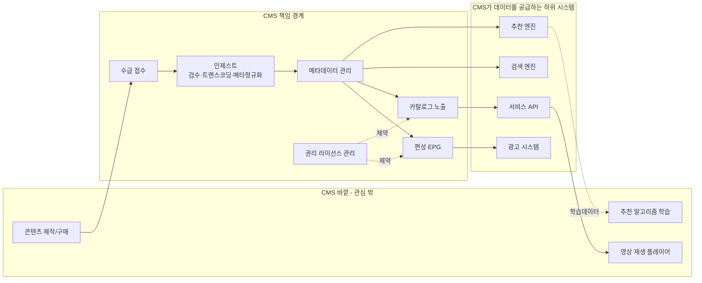

### 1-2. CMS의 고객은 시청자가 아니다

> **이 문서 전체를 관통하는 명제입니다.**
>
> CMS의 고객은 **내부 콘텐츠 운영자**입니다. 그들의 화폐는 **시간**입니다.
>
> 그러므로 CMS의 성공은 MAU가 아니라 **운영자의 작업 리드타임·자동화 처리율**로 잽니다.
>
> 물론 그게 개선되면 신작이 더 빨리·더 정확한 메타와 함께 노출되어 시청 경험에 기여합니다. 하지만 Platform Product Lead가 **직접 움직이는 지표는 내부 고객 지표**입니다.

| 내부 고객 | 하는 일 | 이 사람의 "시간"이 어디로 새는가 |
|---|---|---|
| **콘텐츠 운영자(MD)** | 메타 등록·검수, 썸네일 선정, 카탈로그 배치 | 반복 입력, 엑셀 왕복, 오타 재작업 |
| **편성 담당** | 실시간 채널 편성, FAST 채널 구성 | EPG-카탈로그 이중 입력, 급편 대응 |
| **권리(라이선스) 담당** | 계약 조건 입력, 서비스 윈도우 관리 | 만료 임박 콘텐츠 수동 추적, 지역 제한 누락 |
| **QC 담당** | 영상·자막 품질 검수 | 전수 검사 불가, 샘플링 의존 |
| **글로벌 운영** | 다국어 메타·자막 관리 | 언어별 누락 추적 불가, 번역 발주 수작업 |

### 1-3. 미디어 CMS가 반드시 푸는 여섯 가지 난제

> 아래는 티빙 현행에 대한 진단이 **아닙니다.** 미디어 CMS라면 규모·시대와 무관하게 마주치는 **도메인 보편의 난제**입니다.
>
> 이 문서의 설계 결정은 전부 **이 여섯 개 중 하나에 대한 답**입니다. TVING 1세대와 BTV NCMS에서 팀과 함께 겪은 문제들이기도 합니다.

| # | 난제 | 왜 어려운가 | 이 문서의 답 |
|---|---|---|---|
| **N1** | 원본과 조회 저장소의 동기화 | 정합성 기준(원본)과 조회 성능(색인)은 요구가 상반된다 | §2-2 CDC 스트리밍 |
| **N2** | 외부 연동의 실패 처리 | 트랜스코딩·DRM·CDN은 실패가 일상. 재시도·보상이 필요 | §2-2 워크플로우 엔진 |
| **N3** | 대량 메타 입력의 확장성 | 카탈로그가 커지면 인력이 선형으로 늘어난다 | §2-1 원칙 4, §5-1 AI 초안 |
| **N4** | 편성(시간축)과 노출(공간축)의 이원성 | 목적이 다른 두 분류 체계. 합치면 급편·FAST에서 터진다 | §3-2 결정 ② |
| **N5** | 다국어 확장 | 언어를 컬럼으로 두면 국가 추가마다 스키마가 바뀐다 | §3-2 결정 ① |
| **N6** | 라이선스(권리) 관리 | 문서에만 있으면 만료 콘텐츠가 노출되는 사고가 난다 | §3-1 `RIGHTS_WINDOW`, §4-5 |

---

## §2. To-Be 목표 아키텍처

### 2-1. 설계 원칙 다섯 가지

| # | 원칙 | 구체적으로 | 답하는 난제 |
|---|---|---|---|
| 1 | **원본과 조회를 분리하되 CDC로 잇는다** | 배치가 아니라 변경 로그 스트리밍. 조회 장애가 원본을 오염시키지 않음 | N1 |
| 2 | **편성(시간축)과 노출(공간축)을 분리하고 매핑 계층으로 연결** | EPG와 카탈로그는 목적이 다른 두 분류 체계 | N4 |
| 3 | **공통 메타 + 오버레이** | 언어·테넌트·지역별 차이를 컬럼 추가가 아닌 오버레이 행으로 흡수 | N5 |
| 4 | **AI는 초안, 사람은 승인 (HITL)** | 자동화율만 좇다 품질이 무너지지 않도록 승인 게이트를 남긴다 | N3 |
| 5 | **외부 연동은 워크플로우 엔진이 소유** | 재시도·보상·타임아웃을 화면 코드가 아니라 오케스트레이터가 책임 | N2 |

### 2-2. 목표 구성도

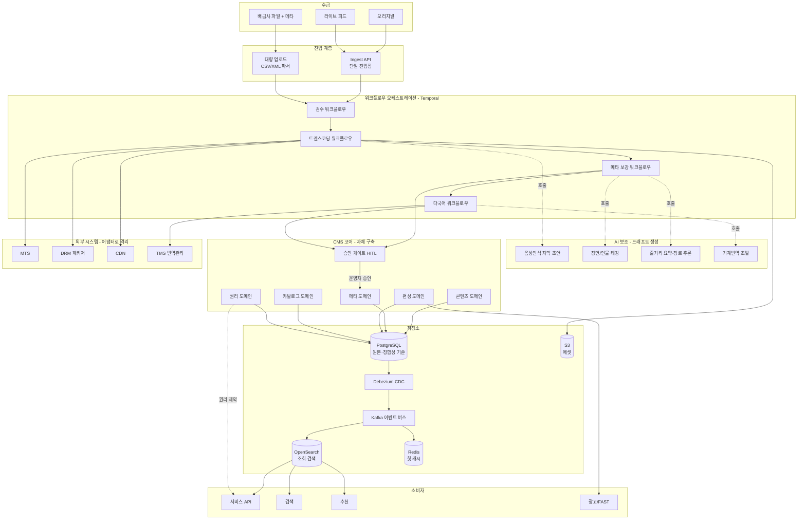

위 구성도의 **워크플로우 오케스트레이션(Temporal)** 박스 안 네 개 워크플로우(W1~W4)는 각각 하나의 durable workflow입니다. 아래에서 개별 내부 흐름을 풀어 봅니다. 공통 골격은 같습니다 — **activity 단위 재시도는 엔진이, 확정 실패의 보상·사람 호출은 워크플로우가 소유**합니다(§2-1 원칙 5).

#### 2-2-1. 검수 워크플로우 (W1) — 인제스트 게이트

외부에서 들어온 파일이 신뢰할 수 있는지, **트랜스코딩에 자원을 쓰기 전에** 걸러내는 자동 관문입니다. 값비싼 다운스트림(트랜스코딩·AI·번역)을 오염된 입력으로부터 보호합니다.

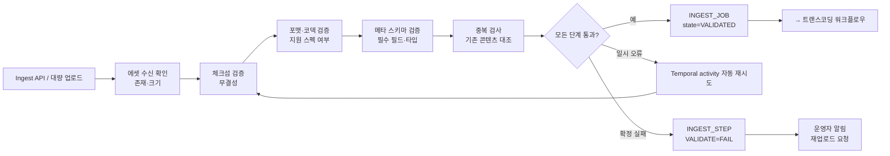

> **핵심**: 검증은 전부 자동이고, 사람은 **확정 실패일 때만** 호출됩니다.
>
> 일시적 네트워크·I/O 오류는 Temporal이 activity 단위로 재시도해 사람 손을 타지 않고, 스펙 위반처럼 되돌릴 수 없는 실패만 재업로드 요청으로 넘깁니다. 이 게이트가 §6 상태기계의 `VALIDATING → REJECTED` 전이를 만듭니다.

#### 2-2-2. 트랜스코딩 워크플로우 (W2) — 장기 실행 + 보상

몇 시간짜리 외부 연동이 실패를 일상으로 겪는 구간입니다. **난제 N2의 정중앙**이자, §8-2에서 Temporal을 채택한 이유 그 자체입니다.

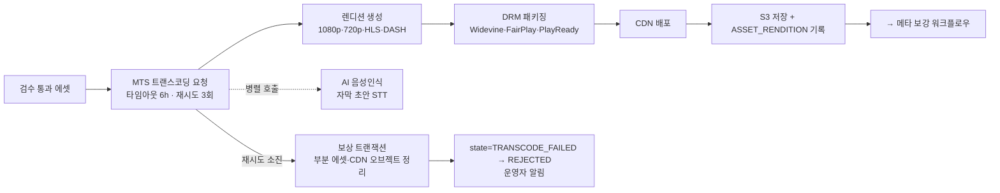

> **핵심**: "MTS가 6시간째에 죽었다. 어디까지 됐고 뭘 되돌려야 하나?" — 이 질문에 답하려면 상태를 엔진이 들고 있어야 합니다(§8-2).
>
> 실패 시 **보상 트랜잭션**이 이미 만들어진 부분 렌디션과 CDN 오브젝트를 되돌려, 다음 재시도가 깨끗한 상태에서 시작하게 합니다. 자막 초안(STT)은 트랜스코딩과 **병렬**로 돌아 리드타임을 줄입니다.

#### 2-2-3. 메타 보강 워크플로우 (W3) — AI 초안 + 환각 게이트

대량 메타 입력을 사람이 선형으로 감당할 수 없다는 **난제 N3**에 대한 답입니다. AI가 초안을 만들되, **승인은 사람**이라는 원칙(§2-1 원칙 4)이 여기서 구조로 박힙니다.

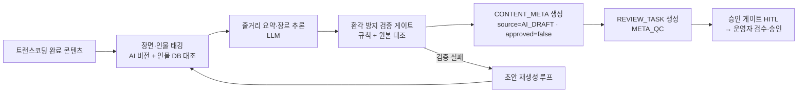

> **핵심**: AI는 `approved=false` 초안까지만 만들고, **도장은 사람이 찍습니다**(§5-1).
>
> `source`·`approved` 두 플래그가 §4-3 자동화 처리율 쿼리의 분모·분자를 만들고, 환각 방지 게이트에서 걸린 초안은 사람에게 가기 전에 **재생성 루프**로 되돌아갑니다. 반려는 §6 상태기계의 `IN_REVIEW → META_DRAFTED` 전이입니다.

#### 2-2-4. 다국어 워크플로우 (W4) — 오버레이 + TMS

언어를 컬럼이 아니라 **오버레이 행**으로 흡수하는 데이터 모델(§3-2 결정 ①, 난제 N5) 위에서 도는 워크플로우입니다. 국가 추가가 스키마 변경이 아니라 데이터 삽입이 되게 합니다.

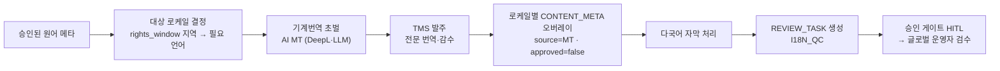

> **핵심**: 대상 언어는 **권리(rights_window)가 결정**합니다.
>
> 일본에 서비스 윈도우가 열린 콘텐츠에만 `ja-JP` 오버레이를 만들어, 팔지도 않을 지역의 번역을 낭비하지 않습니다. MT 초벌은 TMS의 전문 번역·감수를 **대체가 아니라 가속**하는 용도이며, 결과는 §4-6의 "다국어 메타 누락" 쿼리로 상시 감시됩니다.

### 2-3. 이 구성도를 한 문장으로

> **"수급된 콘텐츠가 워크플로우 엔진의 관리 아래 AI 초안을 얻고, 사람의 승인 게이트를 통과한 뒤, CDC를 타고 조회 저장소로 흘러 서비스에 걸린다."**
>
> 여기서 되돌리기 어려운 결정은 셋입니다 — **데이터 모델**(§3), **편성/노출의 분리**(§3-2), **승인 게이트를 어디에 둘 것인가**(§5-1).
>
> 나머지는 나중에 바꿀 수 있습니다. 그래서 이 셋에만 제가 직접 들어갑니다.

---

## §3. 데이터 모델 (ERD)

### 3-1. 핵심 엔티티 관계

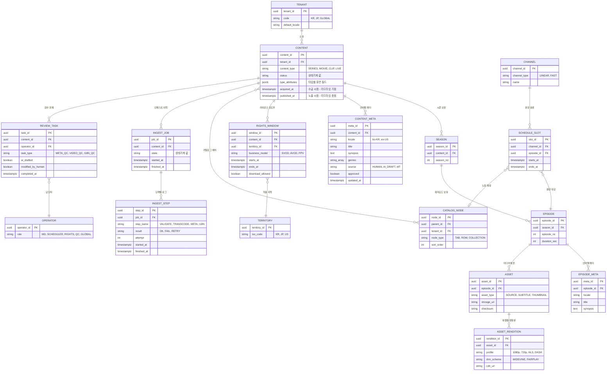

### 3-2. 설계 결정 세 가지 — 왜 이렇게 나눴는가

**① `CONTENT_META`를 별도 테이블로 분리 (다국어 오버레이) — 난제 N5**

`content` 테이블에 `title_ko`, `title_en`, `title_ja` 컬럼을 두면 언어를 추가할 때마다 스키마를 바꿔야 한다. 로케일을 **행(row)으로** 만들면 언어 추가가 데이터 삽입이 된다. 글로벌 확장이 스키마 마이그레이션을 유발하지 않는다.

또한 `source`(HUMAN / AI_DRAFT / MT)와 `approved` 플래그가 **AI 초안과 사람 승인을 같은 테이블에서 구분**하게 해준다. 이 두 컬럼이 §4-3의 자동화 처리율 쿼리를 계산 가능하게 만드는 핵심이다.

**② `SCHEDULE_SLOT`(편성)과 `CATALOG_NODE`(노출)를 분리하고 선택적으로 매핑 — 난제 N4**

편성은 **시간축**이고 카탈로그는 **공간축**이다. 하나의 에피소드가 오늘 밤 채널에 편성되면서 동시에 홈 화면 "지금 뜨는" 행에 노출될 수 있다. 두 개념을 한 테이블에 억지로 합치면 FAST 채널이나 급편 대응에서 반드시 터진다.

**③ `type_attributes`를 `jsonb`로 (콘텐츠 타입 이질성 흡수)**

시리즈·영화·숏클립·라이브는 공통 필드(제목·등급)를 빼면 구조가 전혀 다르다. 타입별 테이블을 만들면 조인 지옥, 컬럼을 다 합치면 NULL 밭이 된다. **공통은 컬럼, 이질적인 건 JSONB**로 두고 타입별 검증 스키마를 애플리케이션이 강제한다.

> TVING 1세대에서 원본 Oracle과 서비스용 MongoDB를 분리했던 이유가 바로 이 유연 스키마 요구였습니다.
>
> 지금은 PostgreSQL의 `jsonb`가 그 역할을 하면서도 트랜잭션 정합성을 함께 가져갈 수 있습니다. **같은 문제를, 10년 뒤의 도구로 다시 푸는 셈**입니다.

---

## §4. DB 샘플 쿼리

> PostgreSQL 방언. 실행 가능한 DB가 없으므로 **문법과 의도를 보여주는 용도**입니다.

### 4-1. 북극성 지표 — 수급→노출 리드타임을 단계별로 분해

```sql
-- 무엇을 답하는가: "콘텐츠 하나가 들어와서 화면에 걸리기까지 어느 단계에서 시간을 잡아먹는가"
-- 이 쿼리가 재구축 전후 비교의 기준선(baseline)이 된다.
WITH step_duration AS (
    SELECT
        j.content_id,
        s.step_name,
        EXTRACT(EPOCH FROM (s.finished_at - s.started_at)) / 3600 AS hours
    FROM ingest_job j
    JOIN ingest_step s ON s.job_id = j.job_id
    WHERE s.result = 'OK'
      AND j.started_at >= NOW() - INTERVAL '90 days'
)
SELECT
    step_name,
    COUNT(*)                                             AS 처리건수,
    ROUND(AVG(hours)::numeric, 2)                        AS 평균시간,
    ROUND(PERCENTILE_CONT(0.5)  WITHIN GROUP (ORDER BY hours)::numeric, 2) AS p50,
    ROUND(PERCENTILE_CONT(0.95) WITHIN GROUP (ORDER BY hours)::numeric, 2) AS p95
FROM step_duration
GROUP BY step_name
ORDER BY 평균시간 DESC;
```

> **p95를 함께 보는 이유**: 평균만 보면 "3시간이면 끝나네"로 읽히지만, 상위 5%가 40시간씩 걸린다면 운영자는 **그 꼬리 때문에** 야근합니다. 개선 대상은 평균이 아니라 꼬리입니다.

### 4-2. 전체 리드타임 — 수급부터 노출까지

```sql
-- 무엇을 답하는가: "북극성 지표의 현재 값은 얼마인가" (월별 추이)
SELECT
    DATE_TRUNC('month', c.acquired_at)                   AS 월,
    COUNT(*)                                             AS 노출건수,
    ROUND(AVG(EXTRACT(EPOCH FROM (c.published_at - c.acquired_at)) / 86400)::numeric, 2) AS 평균_리드타임_일,
    ROUND(PERCENTILE_CONT(0.95) WITHIN GROUP (
        ORDER BY EXTRACT(EPOCH FROM (c.published_at - c.acquired_at)) / 86400
    )::numeric, 2)                                       AS p95_리드타임_일
FROM content c
WHERE c.published_at IS NOT NULL
  AND c.acquired_at  >= NOW() - INTERVAL '12 months'
GROUP BY 1
ORDER BY 1;
```

### 4-3. 자동화 처리율 — AI 초안이 사람 수정 없이 승인된 비율

```sql
-- 무엇을 답하는가: "AI가 만든 초안 중 사람이 손대지 않고 통과시킨 비율은?"
-- 분모: AI 초안이 붙은 검수 과제 / 분자: 사람이 수정하지 않은 건
-- 주의: 이 값만 좇으면 검수를 대충 하게 된다 → 반드시 4-4(재작업률)와 함께 본다.
SELECT
    task_type,
    COUNT(*) FILTER (WHERE ai_drafted)                            AS ai초안_건수,
    COUNT(*) FILTER (WHERE ai_drafted AND NOT modified_by_human)  AS 무수정_승인,
    ROUND(
        100.0 * COUNT(*) FILTER (WHERE ai_drafted AND NOT modified_by_human)
              / NULLIF(COUNT(*) FILTER (WHERE ai_drafted), 0)
    , 1)                                                          AS 자동화율_pct
FROM review_task
WHERE completed_at >= NOW() - INTERVAL '30 days'
GROUP BY task_type
ORDER BY 자동화율_pct DESC;
```

### 4-4. 가드레일 — 노출 후 메타가 다시 수정된 콘텐츠 (재작업률)

```sql
-- 무엇을 답하는가: "빨리 내보냈는데 나중에 고친 건 얼마나 되는가"
-- 속도 지표(리드타임)를 좇다 품질이 무너지는지 감시하는 가드레일.
SELECT
    DATE_TRUNC('week', c.published_at)                   AS 주차,
    COUNT(DISTINCT c.content_id)                         AS 노출건수,
    COUNT(DISTINCT m.content_id) FILTER (
        WHERE m.updated_at > c.published_at + INTERVAL '1 hour'
    )                                                    AS 사후수정_건수,
    ROUND(
        100.0 * COUNT(DISTINCT m.content_id) FILTER (
            WHERE m.updated_at > c.published_at + INTERVAL '1 hour'
        ) / NULLIF(COUNT(DISTINCT c.content_id), 0)
    , 1)                                                 AS 재작업률_pct
FROM content c
LEFT JOIN content_meta m ON m.content_id = c.content_id
WHERE c.published_at >= NOW() - INTERVAL '12 weeks'
GROUP BY 1
ORDER BY 1;
```

### 4-5. 정합성 검증 — 라이선스가 만료됐는데 아직 노출 중인 콘텐츠

```sql
-- 무엇을 답하는가: "지금 이 순간 계약 위반 상태로 노출되는 콘텐츠가 있는가"
-- 사고가 나면 법무·계약 리스크. 권리를 시스템으로 옮겨야 하는 이유 그 자체.
SELECT
    c.content_id,
    m.title,
    t.iso_code                    AS 지역,
    rw.ends_at                    AS 권리_만료시각,
    NOW() - rw.ends_at            AS 초과_경과
FROM content c
JOIN content_meta  m  ON m.content_id  = c.content_id AND m.locale = 'ko-KR'
JOIN rights_window rw ON rw.content_id = c.content_id
JOIN territory     t  ON t.territory_id = rw.territory_id
WHERE c.status   = 'PUBLISHED'
  AND rw.ends_at < NOW()
  AND NOT EXISTS (        -- 같은 지역에 유효한 다른 윈도우가 없을 것
      SELECT 1 FROM rights_window rw2
      WHERE rw2.content_id   = c.content_id
        AND rw2.territory_id = rw.territory_id
        AND rw2.ends_at      > NOW()
  )
ORDER BY 초과_경과 DESC;
```

> **면접 활용**: 이 쿼리 하나가 난제 N6("권리 관리를 왜 시스템으로 옮겨야 하는가")를 설명합니다.
>
> 엑셀로 관리하면 이 질문에 **답할 수가 없습니다.** 답할 수 없는 질문은 사고가 나야 발견됩니다.

### 4-6. 운영 조회 — 다국어 메타가 누락된 노출 콘텐츠

```sql
-- 무엇을 답하는가: "글로벌 서비스 중인데 해당 언어 메타가 없는 콘텐츠는?"
-- 글로벌 운영자의 대표적 pain point. 사람 눈으로 찾으면 반드시 새어나간다.
SELECT
    c.content_id,
    km.title                                             AS 한국어_제목,
    t.iso_code                                           AS 서비스_지역,
    req.locale                                           AS 필요_언어
FROM content c
JOIN rights_window rw ON rw.content_id = c.content_id
JOIN territory     t  ON t.territory_id = rw.territory_id
CROSS JOIN LATERAL (
    -- 지역별로 요구되는 로케일 (실제로는 territory_locale 매핑 테이블에서 읽는다)
    SELECT CASE t.iso_code WHEN 'JP' THEN 'ja-JP' WHEN 'US' THEN 'en-US' END AS locale
) req
LEFT JOIN content_meta km ON km.content_id = c.content_id AND km.locale = 'ko-KR'
LEFT JOIN content_meta tm ON tm.content_id = c.content_id
                          AND tm.locale    = req.locale
                          AND tm.approved  IS TRUE
WHERE c.status      = 'PUBLISHED'
  AND rw.ends_at    > NOW()
  AND req.locale   IS NOT NULL
  AND tm.meta_id   IS NULL          -- 승인된 해당 언어 메타가 없음
ORDER BY t.iso_code, km.title;
```

---

## §5. 서비스 흐름도 (시퀀스)

### 5-1. 시나리오 A — 배급사 콘텐츠 인제스트 (해피 패스 + 실패 보상)

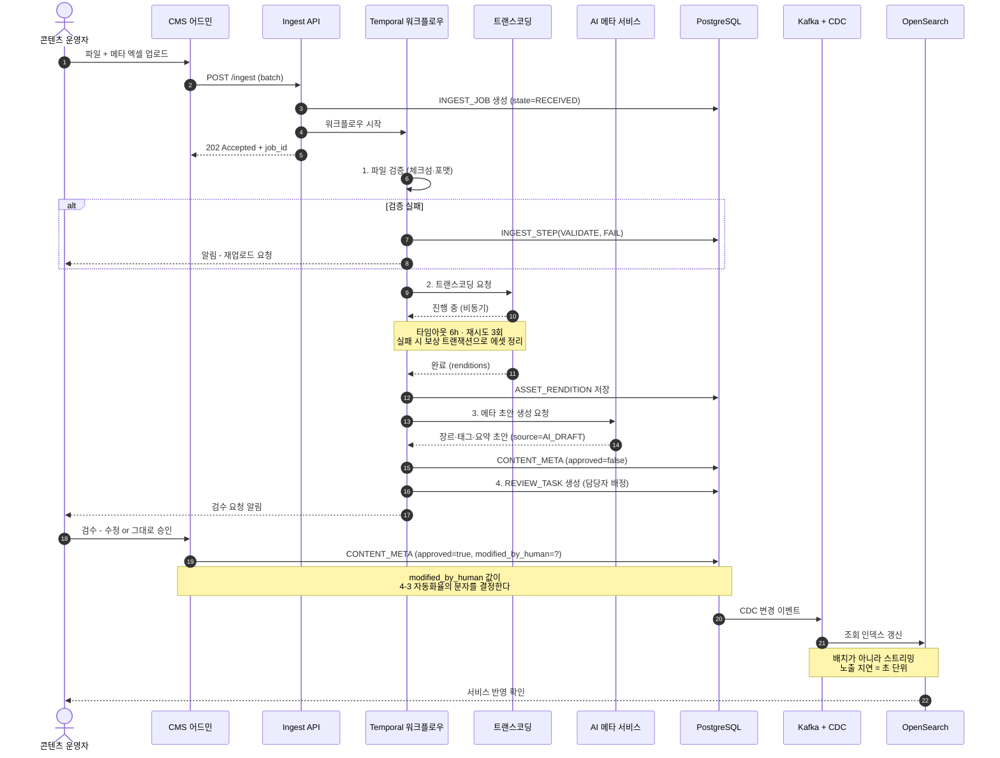

> **승인 게이트(11~13번)가 이 설계의 심장입니다.**
>
> AI는 여기까지만 옵니다. 도장은 사람이 찍습니다. `modified_by_human` 한 컬럼이 **"AI가 얼마나 쓸 만한가"를 매일 측정 가능하게** 만듭니다.

### 5-2. 시나리오 B — 급편(急編) 대응: 편성 변경이 노출까지 자동 전파

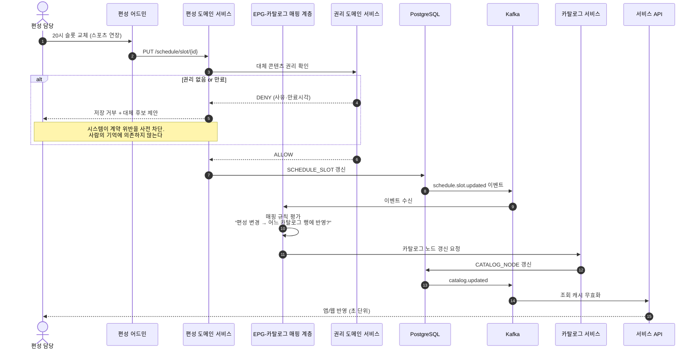

> **이 시퀀스의 핵심은 5번과 8번입니다.**
>
> 5번 — 권리 서비스가 편성 저장을 **거부**할 수 있다는 것. 난제 N6에 대한 답입니다.
>
> 8번 — 편성 변경이 이벤트로 흘러 카탈로그에 자동 전파된다는 것. 난제 N4에 대한 답입니다.

---

## §6. 상태 전이 — 콘텐츠 라이프사이클

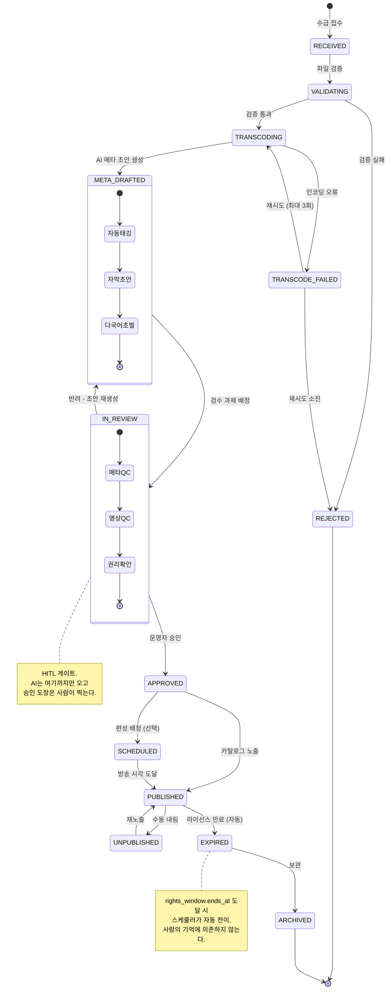

### 6-1. 이 상태기계가 만드는 지표

| 상태 전이 | 여기서 나오는 지표 |
|---|---|
| `RECEIVED → PUBLISHED` 총 소요 | **북극성 — 수급→노출 리드타임** |
| `META_DRAFTED → APPROVED` 무수정 통과 비율 | 자동화 처리율 |
| `IN_REVIEW → META_DRAFTED` 반려 횟수 | AI 초안 품질 |
| `TRANSCODE_FAILED` 진입 빈도 | 연동 안정성 (가드레일) |
| `PUBLISHED → EXPIRED` 자동 전이율 | 권리 사고 방지율 |

> **상태를 잘 나누면 지표가 공짜로 나옵니다.**
>
> 반대로 상태를 `status = '진행중'` 하나로 뭉개면, 어느 단계가 느린지 영원히 알 수 없습니다.

---

## §7. 동선 — 목표 상태의 운영자 경험

### 7-1. 콘텐츠 운영자의 하루 (To-Be)

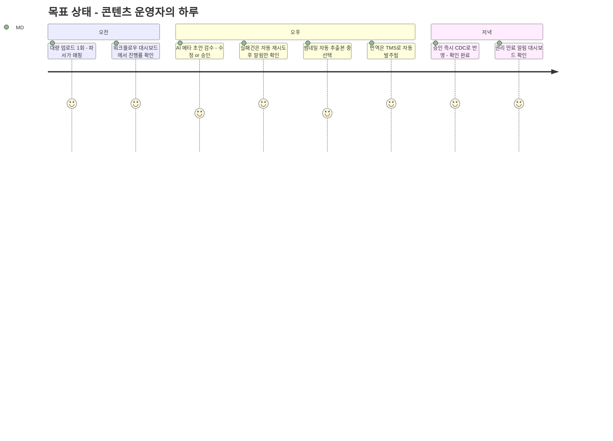

> **점수는 "그 작업이 얼마나 할 만한가"(1=고통, 5=쾌적)를 뜻합니다.**
>
> **검수(4점)를 5점으로 만들려 하지 않는 것**이 의도입니다. 검수는 사람이 판단해야 하는 일이고, 마찰이 0이 되면 아무도 제대로 보지 않습니다.
>
> 자동화의 목표는 사람을 빼는 것이 아니라, **사람을 더 중요한 판단에 쓰는 것**입니다.

### 7-2. 운영자 화면 동선

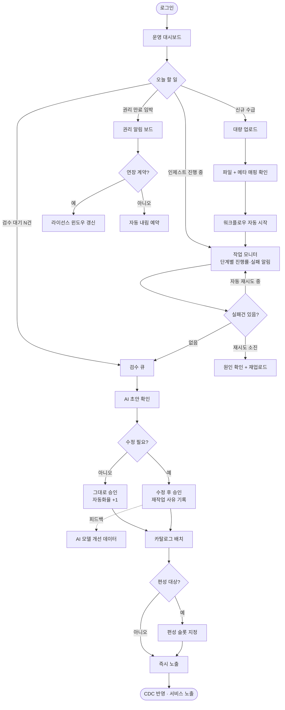

### 7-3. 시청자 동선 — CMS가 어디에 기여하는가

CMS는 시청자를 직접 만나지 않는다. 하지만 **시청자가 겪는 모든 마찰의 뿌리에 CMS가 있다.**

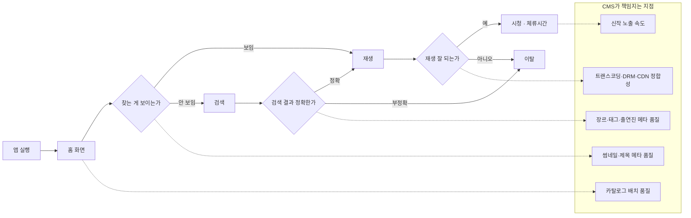

> **경영진에게 설명할 인과 사슬**:
>
> 수급→노출 리드타임이 줄면 → 신작·화제작이 더 빨리, 더 정확한 메타와 함께 걸린다 → 초기 시청 전환이 오른다.
>
> 메타 품질이 오르면 → 검색 성공률·추천 정확도가 오른다 → 체류시간에 기여한다.
>
> 다만 **CMS 리더가 MAU를 직접 약속하지는 않습니다.** 우리가 움직이는 건 사슬의 앞단입니다.

---

## §8. 솔루션 후보 비교 — 빌드 vs 바이

### 8-0. 이 결정을 누가 어떻게 내리는가 (프로세스 관점)

> 아래 8-1~8-5는 **"무엇을 빌드/바이할지"의 결론**입니다. 그 전에 **"이 결정을 누가 내리는가"를** 먼저 밝힙니다. Platform Product Lead의 역할을 오해하지 않기 위해서입니다.

빌드/바이는 **Product Lead가 혼자 정해 개발팀에 내리는 지시가 아닙니다.** PM이 판단 프레임을 소유하고, 엔지니어링과 함께 내려, 근거를 문서(ADR)로 남기는 **공동 결정**입니다. PM이 도구까지 정해 던지면 개발팀은 자기가 고르지 않은 선택에 주인의식을 갖지 못하고, 애초에 기술 실현가능성·운영부담은 PM이 정확히 잴 수도 없습니다.

이 결정은 **두 층위**로 나뉘고, 층위마다 주인이 다릅니다.

| 층위 | 예시 | 리드 | Product Lead의 몫 |
|---|---|---|---|
| **역량(capability)** | 코어를 소유할까 vs 상용 CMS를 살까 (§8-1) | Product Lead가 프레임 소유 | 차별화·TCO·전략 판단을 주도 |
| **도구(tool)** | 워크플로우를 Temporal이냐 Airflow냐 (§8-2) | 엔지니어링/아키텍트가 리드 | 판단 기준만 정렬, 세부는 위임 |

상위(전략) 층위일수록 PM이 프레임을 쥐고, 하위(기술 도구) 층위일수록 엔지니어링에 위임합니다. §8-5의 판단 기준 한 문장 — **"경쟁 우위가 되는 도메인은 빌드, 남들도 똑같이 쓰는 인프라는 바이"** — 이것이 PM이 제공하는 **의사결정 프레임**이지, 특정 제품명이 아닙니다.

| 활동 | Product Lead | 엔지니어링 |
|---|---|---|
| 문제·요구사항·우선순위 정의 | **책임(A)** | 기여(C) |
| 비즈니스 가치·TCO·차별화 판단 | **책임(A)** | 기여(C) |
| 기술 실현가능성·공수·운영부담 산정 | 기여(C) | **책임(A)** |
| 구체 도구 선정·PoC | 정보공유(I) | **책임(A)** |
| 결정 마감·문서화(ADR) | **책임(A)** | 기여(C) |

> **부임 직후 특히 주의**: 신임 리더가 빌드/바이를 탑다운으로 던지는 것은, §12에서 스스로 경계한 "현행도 모르면서 설계를 확정하는" 실수와 같습니다.
>
> 그래서 아래 후보 비교는 **결정문이 아니라 대화의 출발점**입니다. 부임 후 팀과 함께 이 프레임을 현행에 대어 교정합니다.

### 8-1. CMS 코어 — 상용 헤드리스 CMS를 쓸 것인가

| 후보 | 강점 | 약점 | 미디어 OTT 적합성 | 판단 |
|---|---|---|---|---|
| **Contentful** | 성숙한 SaaS, 다국어·로케일 1급 지원, CDN 내장 | 콘텐츠 모델이 "문서/웹" 중심, 미디어 에셋·권리 윈도우·EPG 개념 없음. 엔트리 과금 급증 | 낮음 | ✕ |
| **Strapi (OSS)** | 셀프호스팅, 커스터마이징 자유, 비용 낮음 | 결국 우리가 다 만듦. 대규모 워크플로우·감사 취약 | 중 | △ |
| **Sanity** | 실시간 협업 편집, 유연 스키마 | 웹 콘텐츠 중심. 대량 인제스트 파이프라인 아님 | 낮음 | ✕ |
| **Adobe Experience Manager** | 엔터프라이즈 DAM·워크플로우 | 고비용, 무겁고 느린 변경 주기 | 중 | ✕ |
| **자체 구축** | 권리 윈도우·EPG·카탈로그·인제스트가 **도메인 그 자체** | 초기 개발 비용·기간 | **높음** | ✅ |

> **판단: CMS 코어는 빌드(자체 구축)입니다.**
>
> 이유는 하나입니다 — **미디어 CMS의 난제(§1-3의 N4·N6)는 범용 헤드리스 CMS의 도메인이 아닙니다.**
>
> 범용 CMS를 쓰면 결국 그 위에 우리 도메인을 얹느라 두 배로 일합니다. 티빙 규모에서는 코어를 소유하는 편이 총비용이 낮습니다.
>
> 다만 **"직접 만든다"가 "다 만든다"는 뜻은 아닙니다.** 아래 주변부는 사는 게 맞습니다.

### 8-2. 워크플로우 오케스트레이션 — 인제스트 파이프라인의 심장 (난제 N2)

| 후보 | 성격 | 재시도·보상 | 가시성 | 학습곡선 | 판단 |
|---|---|---|---|---|---|
| **Temporal** | 코드로 쓰는 durable workflow. 상태를 엔진이 보존 | ★★★ (내장, 보상 트랜잭션) | ★★★ (Web UI에 실행 이력) | 중~상 | ✅ **채택** |
| **Apache Airflow** | 배치 DAG 스케줄러 | ★★ (태스크 재시도) | ★★★ | 중 | △ (배치엔 좋으나 이벤트 기반 인제스트엔 부적합) |
| **AWS Step Functions** | 서버리스 상태머신 | ★★★ | ★★ | 하 | ○ (AWS 종속, 복잡 분기에서 JSON 지옥) |
| **자체 큐 + 상태 컬럼** | 익숙함 | ✕ (직접 구현) | ✕ | 하 | ✕ (BTV·야나두에서 이게 결국 부채가 됨) |

> **Temporal을 고르는 이유**: 인제스트는 **몇 시간짜리 장기 실행 + 외부 시스템 실패가 일상**인 프로세스입니다.
>
> "트랜스코딩이 6시간째인데 MTS가 죽었다. 어디까지 됐고 뭘 되돌려야 하나?" — 이 질문에 답하려면 상태를 엔진이 들고 있어야 합니다.
>
> 자체 큐로 시작하면 **재시도·타임아웃·보상 로직을 결국 우리가 다시 짓게 됩니다.** 야나두와 BTV에서 본 반복되는 부채입니다.

### 8-3. 원본→조회 저장소 동기화 (난제 N1)

| 후보 | 지연 | 원본 침습도 | 운영 부담 | 판단 |
|---|---|---|---|---|
| **Debezium + Kafka (CDC)** | 초 단위 | 낮음 (WAL 읽기) | 중 (Kafka 운영) | ✅ **채택** |
| **애플리케이션 이중 쓰기** | 즉시 | 높음 (정합성 깨짐 위험) | 하 | ✕ (분산 트랜잭션 문제) |
| **배치 ETL** | 분~시간 | 낮음 | 하 | ✕ (노출 지연이 배치 주기에 묶임) |
| **AWS DMS** | 초~분 | 낮음 | 하 | ○ (AWS 종속, 변환 유연성 낮음) |

> BTV에서 **Kafka로 Oracle 데이터를 Elasticsearch에 스트리밍 적재**했던 구조와 동일한 발상입니다. 도구만 Debezium·OpenSearch로 현대화한 것입니다.
>
> 핵심 이점은 속도가 아니라 **격리**입니다. 조회 저장소가 죽어도 원본은 무사하고, 되살리면 로그부터 다시 따라옵니다.

### 8-4. AI 메타데이터 자동화 — 공고 우대사항 직격 (난제 N3)

| 과제 | 후보 솔루션 | 빌드/바이 | 비고 |
|---|---|---|---|
| **자막 초안 (STT)** | OpenAI Whisper (자체 호스팅) / AWS Transcribe / Google STT | **바이 + 자체 후처리** | 한국어 정확도·고유명사(배우·작품명) 사전 보정이 관건 |
| **장면·인물 태깅** | AWS Rekognition Video / Google Video Intelligence / 자체 비전 모델 | **바이** | 인물 DB만 자체 구축(출연진 마스터와 연결) |
| **줄거리 요약·장르 추론** | Claude / GPT (API) | **바이** | 프롬프트·검증 파이프라인은 자체. 환각 방지 게이트 필수 |
| **기계번역 초벌** | DeepL / Google Translate / LLM | **바이** | TMS와 결합. 상세는 [번역관리 TMS 비교](../../../shared/knowledge/learning/번역관리_TMS_솔루션_비교.md) |
| **품질 검수(QC)** | 자체 규칙 + LLM 판정 | **하이브리드** | 난이도 최상 → 후반 단계 |

> **AI 원칙 — 드래프트는 AI, 승인은 사람.**
>
> 자동화율을 KPI로 걸면 조직은 반드시 검수를 대충 하게 됩니다. 그래서 자동화율 옆에는 **항상 재작업률·결함율이 짝으로 붙습니다**(§10).
>
> 야나두에서 AI 도입을 확산할 때도 **중단 기준을 먼저 정하고** 시작했습니다. 채택률이 오르는데 재작업·롤백이 함께 오르면 롤아웃을 멈추는 규칙입니다.

### 8-5. 빌드/바이 한눈에

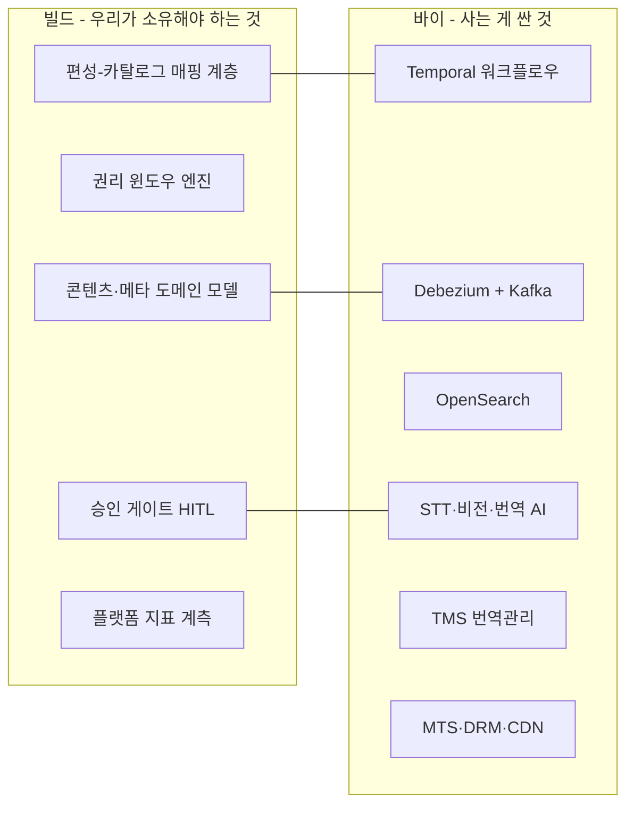

> **판단 기준 한 문장**: **경쟁 우위가 되는 도메인 지식은 빌드, 남들도 똑같이 쓰는 인프라는 바이.**
>
> 권리 윈도우 로직을 잘 만든다고 아무도 칭찬하지 않지만, 그게 틀리면 회사가 소송을 당합니다. 반면 Kafka를 직접 만들면 그냥 시간 낭비입니다.

---

## §9. 실행 로드맵 — Strangler Fig 전환

### 9-1. Phase 0 — 목표를 확정하기 위해 무엇을 실측하는가

> 이 문서는 **초안**입니다. 부임 후 첫 과제는 이 초안을 밀어붙이는 게 아니라, **현행을 실측해 초안을 교정하는 것**입니다.

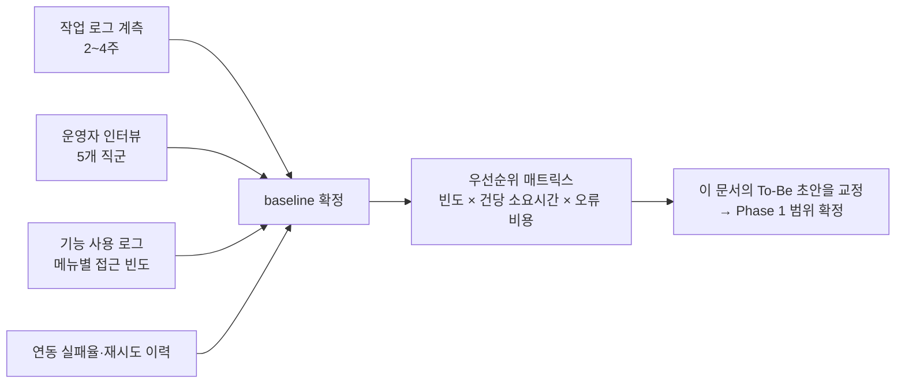

**우선순위 매트릭스** — 계산식은 `영향도 = 월간 빈도 × 건당 소요시간 × 오류 발생 시 비용 계수`.

아래 수치는 **전부 예시(가정)** 이며, 실측으로 채운다. 점의 위치도 실측 후 이동한다.

| 작업 | 월 빈도(가정) | 건당(분, 가정) | 오류 계수 | 영향도 | 자동화 난이도 |
|---|---|---|---|---|---|
| 메타 등록·보강 | 2,000 | 12 | 1.5 | **36,000** | 중 (AI 초안) |
| 다국어 메타 작성 | 1,200 | 20 | 1.2 | **28,800** | 중 (MT+검수) |
| 썸네일 선정 | 2,000 | 5 | 1.0 | 10,000 | 하 (자동 추출) |
| EPG-카탈로그 매핑 | 600 | 15 | 2.0 | **18,000** | 상 (규칙 정의) |
| QC 검수 | 800 | 25 | 3.0 | **60,000** | 상 (샘플→전수) |
| 권리 만료 추적 | 300 | 10 | 5.0 | **15,000** | 하 (규칙+알림) |

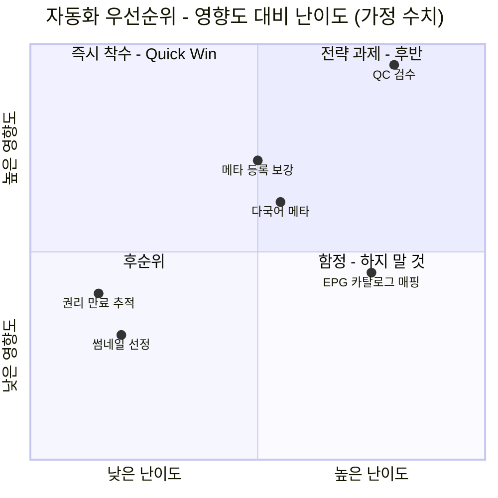

> **읽는 법**: 좌상단(즉시 착수)은 난이도가 낮고 영향도가 큰 영역입니다. **권리 만료 추적·썸네일 자동 추출**이 첫 quick win 후보이고, **QC 검수**는 영향이 가장 크지만 난이도도 최상이라 후반의 전략 과제로 미룹니다.

### 9-2. 왜 빅뱅이 아닌가

> 재구축하는 동안에도 **콘텐츠 수급과 편성은 하루도 멈출 수 없습니다.**
>
> 빅뱅은 이론상 깔끔하지만, 무중단이 전제인 미디어 플랫폼에서는 리스크가 너무 큽니다.
>
> 그래서 신규·저위험 도메인부터 새 시스템으로 감싸며 레거시를 서서히 대체합니다. **BTV NCMS에서 레거시 190여 개 메뉴를 먼저 분석해 전환 범위·순서를 정의하고 단계적으로 오픈했던 방식** 그대로입니다.

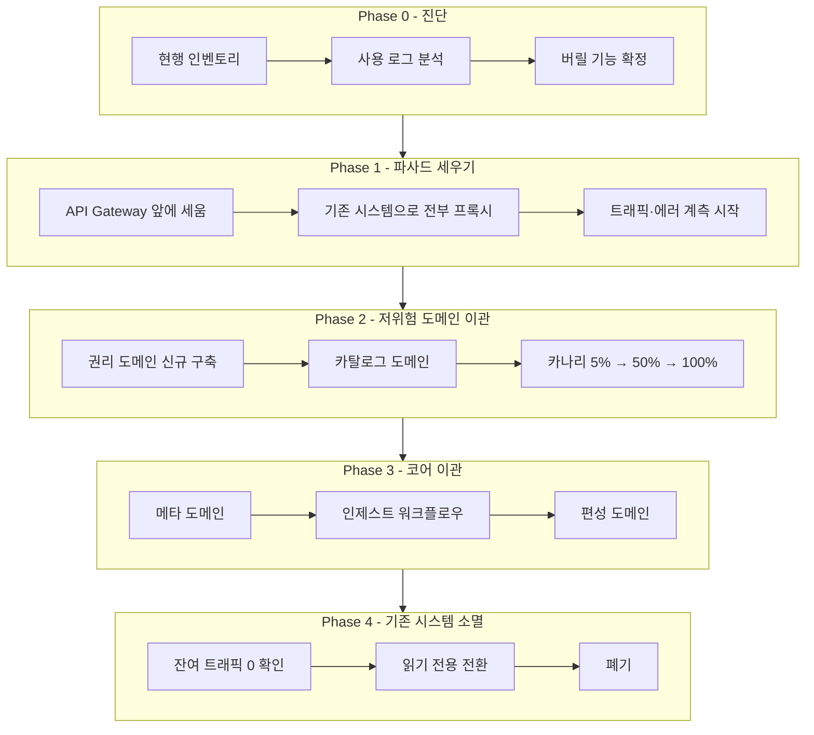

### 9-3. 전환 중 트래픽 경로 (카나리)

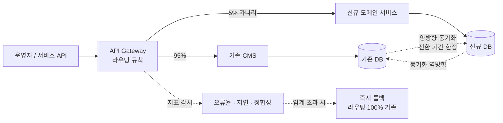

> **양방향 동기화는 전환 기간에만 존재하는 임시 구조입니다.** 영구화되면 그 자체가 새 부채가 됩니다.
>
> 그래서 각 도메인 이관마다 **"양방향 동기화를 언제 끊을 것인가"를 시작 전에 못박습니다.**

### 9-4. 일정 (부임 후 18개월, 전부 가정)

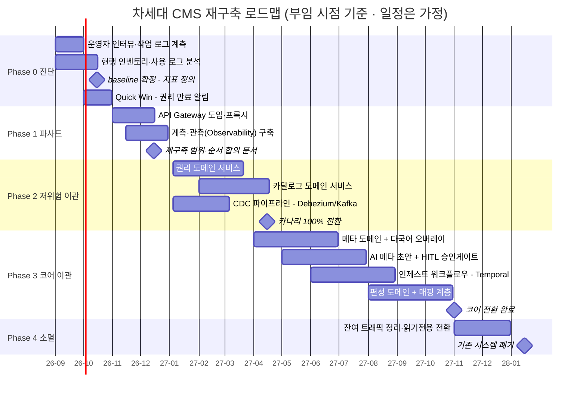

> **⚠️ 이 일정은 전부 가정입니다.** 실제 기간은 Phase 0의 실측 결과와 조직 규모에 따라 재산정합니다.
>
> 면접에서는 **"순서와 논리"를 보여주는 용도**이지, 기간을 약속하는 문서가 아닙니다.

### 9-5. 각 Phase의 종료 조건 (Exit Criteria)

| Phase | 이걸 만족해야 다음으로 | 만족 못하면 |
|---|---|---|
| **0 진단** | baseline 지표 5종 측정 완료 + 버릴 기능 목록 합의 | 기간 연장. 측정 없이 설계 확정 금지 |
| **1 파사드** | Gateway 경유 트래픽 100% + 오류율 baseline 이하 | 전환 착수 금지 |
| **2 저위험** | 카나리 100% 2주 무사고 + 양방향 동기화 해제 | 롤백 후 원인 분석 |
| **3 코어** | 리드타임 목표 달성 + 가드레일 악화 없음 | 롤백. 다음 도메인 착수 금지 |
| **4 소멸** | 기존 시스템 트래픽 0, 30일 유지 | 잔여 의존 추적 |

---

## §10. 성과지표 체계

### 10-1. 지표 트리

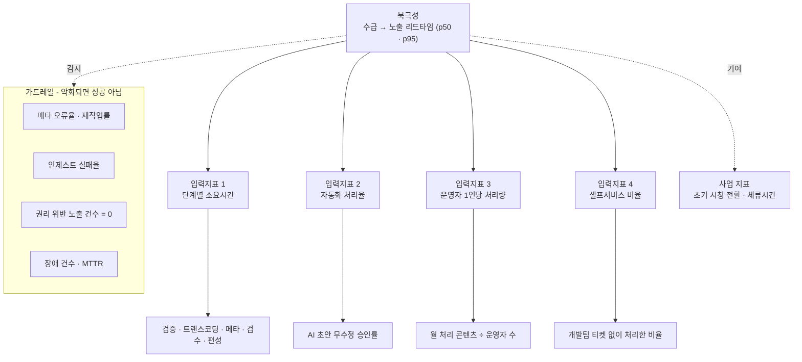

### 10-2. 지표 정의표

| 지표 | 유형 | 정의 (분모/분자) | 측정 방법 |
|---|---|---|---|
| **수급→노출 리드타임** | 북극성 | `published_at - acquired_at`, p50·p95 | §4-2 쿼리 |
| 단계별 소요시간 | 입력 | `ingest_step` 구간별 duration | §4-1 쿼리 |
| 자동화 처리율 | 입력 | 분모=AI초안 건 / 분자=사람 무수정 승인 건 | §4-3 쿼리 |
| 운영자 1인당 처리량 | 입력 | 월 처리 콘텐츠 수 ÷ 운영자 FTE | 작업 로그 |
| 셀프서비스 비율 | 입력 | 개발 티켓 없이 운영자가 완결한 작업 비율 | 티켓 시스템 조인 |
| **재작업률** | 가드레일 | 노출 1시간 후 메타가 수정된 콘텐츠 비율 | §4-4 쿼리 |
| **권리 위반 노출** | 가드레일 | 만료 후에도 노출 중인 콘텐츠 수 (목표: 0) | §4-5 쿼리 |
| 인제스트 실패율 | 가드레일 | 재시도 소진으로 REJECTED된 비율 | 상태기계 |

### 10-3. 중단 기준 (미리 정해두는 것)

> 확산 전에 **멈출 조건을 먼저 정합니다.** 이걸 나중에 정하면 아무도 멈추자고 말하지 못합니다.

| 조건 | 조치 |
|---|---|
| 재작업률이 baseline 대비 **+5%p 초과** | AI 초안 자동 승인 범위 축소, 원인 분석 |
| 권리 위반 노출 **1건이라도 발생** | 즉시 해당 도메인 롤백. 사후 검토 필수 |
| 카나리 구간 오류율이 기존 대비 **1.5배 초과** | 라우팅 100% 기존으로 즉시 복귀 |
| 리드타임은 개선됐는데 **인제스트 실패율 상승** | 속도 개선분을 성공으로 인정하지 않음 |

---

## §11. 이 문서로 답할 수 있는 면접 질문

> 각 답변의 **첫 문장만 외우고**, 나머지는 도식을 떠올리며 본인 말투로 풉니다.
>
> 상세 대본은 [면접 Q&A 102선](../interview/tving_면접대비_PM관점.md) 그룹 3·4를 참조하세요.

**Q. 차세대 CMS, 어떻게 접근하시겠습니까?** `★★★`

> **"세 단계로 봅니다 — 진단, 지표 정의, 점진 전환입니다."**
>
> 제가 그린 목표 아키텍처는 있습니다(§2). 하지만 그건 초안이고, 부임 후 첫 일은 현행 리드타임·수작업 비율·연동 실패율을 실측해 baseline을 만드는 것입니다(§9-1).
>
> 다음으로 성공을 '수급→노출 리드타임'이라는 하나의 북극성으로 정의합니다(§10).
>
> 그리고 재구축은 빅뱅이 아니라 strangler 방식으로, 권리·카탈로그 같은 저위험 도메인부터 감싸며 대체합니다(§9-2). 재구축 중에도 수급과 편성은 하루도 멈출 수 없으니까요.

**Q. CMS의 고객은 누구입니까?** `★★★`

> **"시청자가 아니라 내부 콘텐츠 운영자입니다."**
>
> 그들의 화폐는 시간이고, 그래서 CMS의 성공은 MAU가 아니라 운영자의 작업 리드타임과 자동화 처리율로 재야 합니다(§1-2).
>
> 물론 그게 개선되면 신작이 더 빨리 노출돼 시청 경험에 기여합니다. 하지만 제가 직접 움직이는 지표는 내부 고객 지표입니다.

**Q. 데이터 모델은 어떤 관점으로 설계하시겠습니까?** `★★`

> **"이질성을 유연하게 흡수하고, 확장이 스키마 변경을 유발하지 않게 하는 것이 핵심입니다."**
>
> 콘텐츠 타입마다 메타 구조가 달라서 공통 필드는 컬럼으로, 이질적인 부분은 JSONB로 흡수합니다. 다국어는 컬럼이 아니라 오버레이 행으로 두어 언어 추가가 데이터 삽입이 되게 합니다(§3-2).
>
> 그리고 편성과 노출은 시간축·공간축으로 성격이 달라 반드시 분리하고 매핑 계층으로 잇습니다. 이건 TVING 1세대에서 팀과 함께 내렸던 결정이기도 합니다.

**Q. 워크플로우 자동화, 어디부터 손대겠습니까?** `★★`

> **"빈도가 높고 규칙이 명확한 반복 작업부터입니다."**
>
> 우선순위는 감이 아니라 '빈도 × 건당 소요시간 × 오류 비용' 매트릭스로 정합니다(§9-1). 지금 제 초안으로는 권리 만료 추적과 썸네일 자동 추출이 quick win이고, QC 검수는 영향은 가장 크지만 난이도도 최상이라 뒤로 뺍니다.
>
> 여기에 규칙 기반을 넘어 'AI 드래프트 + 사람 승인' 구조를 얹습니다. 다만 자동화율은 반드시 재작업률과 짝으로 봅니다. 속도만 좇다 품질이 무너지면 실패니까요.

**Q. 재구축 중에 서비스가 멈추면 안 되는데, 어떻게 보장하죠?** `★★`

> **"병행 운영과 카나리 전환, 그리고 미리 정한 롤백 기준입니다."**
>
> API Gateway 뒤에서 신규 서비스로 트래픽을 5%부터 넘기고, 오류율이 기존 대비 1.5배를 넘으면 즉시 100% 기존으로 되돌립니다(§9-3, §10-3).
>
> 저장소는 CDC로 느슨하게 연결해, 조회 쪽 장애가 원본을 오염시키지 않는 구조를 만듭니다. 이건 BTV에서 Kafka로 Oracle을 Elasticsearch에 흘려보내며 확인한 구조입니다.

**Q. 그래서 뭘 쓰실 건데요? (기술 선택)** `★★`

> **"경쟁 우위가 되는 도메인은 빌드, 남들도 똑같이 쓰는 인프라는 바이입니다."**
>
> 권리 윈도우·편성-카탈로그 매핑·승인 게이트는 미디어 CMS의 본질이라 자체 구축합니다. 범용 헤드리스 CMS(Contentful·Strapi)에는 이 개념이 아예 없어서, 결국 그 위에 우리 도메인을 다시 얹게 됩니다(§8-1).
>
> 반대로 워크플로우는 Temporal, 동기화는 Debezium+Kafka, 검색은 OpenSearch, AI는 API를 삽니다. 자체 큐로 시작하면 재시도·보상 로직을 결국 우리가 다시 짓게 되더군요. BTV와 야나두에서 반복해서 본 부채입니다.

**Q. 티빙 현행 시스템도 모르면서 설계를 가져오셨네요?** `★★★`

> **"네. 그래서 이건 설계가 아니라 초안입니다."**
>
> 제가 아는 건 미디어 CMS가 규모·시대와 무관하게 반드시 푸는 여섯 가지 난제입니다(§1-3) — 저장소 분리, 외부 연동 실패, 대량 입력, 편성과 노출의 이원성, 다국어, 권리 관리.
>
> 이 문서는 그 여섯에 대한 제 답이고, **티빙의 답은 다를 수 있습니다.** 부임 30일은 제 답을 설명하는 데 쓰지 않고, 지금 팀의 답을 듣고 실측하는 데 쓰겠습니다.
>
> 다만 이 일을 두 번 해본 사람으로서, **어디를 먼저 재고 무엇을 먼저 버려야 하는지**는 알고 있습니다.

---

## §12. 이 문서의 한계 (스스로 밝히는 것)

정직함이 신뢰를 만든다. 면접에서 먼저 말하면 오히려 강해진다.

| 한계 | 어떻게 다룰 것인가 |
|---|---|
| **현행을 모른다** | 이 문서는 진단이 아니라 **목표 초안**. 부임 30일 실측으로 교정 |
| 일정·수치는 **가정**이다 | Phase 0 종료 시 재산정. 기간을 약속하지 않음 |
| 티빙의 조직 구조·기존 로드맵을 모른다 | 기존 팀의 계획이 우선. 이 문서는 대안이 아니라 **대화의 출발점** |
| 멀티테넌트 실전 사례가 얇다 | [04_거버넌스_글로벌.md](04_거버넌스_글로벌.md)에서 개념과 판단 근거로 보완. 과장하지 않음 |

> **면접 마무리 문장**:
>
> "제가 가져온 건 정답이 아니라 **가설과 방법론**입니다. 정답은 부임 후 지금의 팀, 지금의 데이터에서 함께 찾겠습니다.
>
> 다만 이 일을 한 번 완주해본 사람으로서, **어디를 먼저 재고 무엇을 먼저 버려야 하는지**는 알고 있습니다."
