# 결제 · 정산 플랫폼 — 프로덕트 로드맵

> **작성 기준일**: 2026-07-09
>
> **목적**: TVING「Platform Product Lead」공고의 **주요업무 1번**에 명시된 코어 도메인 중 **결제/정산**의 실행 설계. 공고 자격요건 "대규모 CMS, **결제/정산** 또는 코어 백엔드 시스템의 재구축/현대화 리딩"에 정면 대응한다.
>
> **⚠️ As-Is는 전부 "가설"입니다**: 티빙 내부 자료가 아니라 공개된 요금제·결제수단과 일반적 OTT 결제 구조에서 **추론한 가설**입니다. 면접에서는 반드시 "제 추정"임을 밝힙니다.
>
> **작성자 근거**: 야나두에서 **커머스 개발실 총괄로서 결제·정산 도메인을 직접 설계**하고 팀과 함께 운영. 매출이 직접 걸린 플랫폼을 책임진 경험.
>
> **연계 문서**: [00_허브.md](00_허브.md) · [01_CMS.md](01_CMS.md) · [03_공통어드민.md](03_공통어드민.md) · [04_거버넌스_글로벌.md](04_거버넌스_글로벌.md) · [공고 분석](../posting_tving.md)

---

## §0. 용어 풀이

| 약어 | 원어 | 뜻 |
|---|---|---|
| **SVOD** | Subscription VOD | 월정액 구독형. 티빙의 주력 BM |
| **AVOD** | Advertising VOD | 광고를 보는 대신 무료/저가로 시청 |
| **PPV** | Pay Per View | 건별 결제. 신작 영화·스포츠 단건 |
| **FAST** | Free Ad-supported Streaming TV | 무료 광고 기반 편성 채널 |
| **TVOD** | Transactional VOD | 개별 구매·대여 (PPV의 상위 개념) |
| **PG** | Payment Gateway | 카드·계좌 결제를 중계하는 사업자 (토스페이먼츠·NICE 등) |
| **IAP** | In-App Purchase | 앱스토어 내 결제. Apple/Google이 수수료를 가져감 |
| **멱등키** | Idempotency Key | 같은 요청이 두 번 와도 한 번만 처리되게 하는 고유키 |
| **원장** | Ledger | 돈의 이동을 불변 기록으로 남기는 회계 장부 |
| **복식부기** | Double-entry | 모든 거래를 차변·대변 양쪽에 기록해 합이 0이 되게 하는 방식 |
| **대사** | Reconciliation | 우리 장부와 PG·스토어 정산서를 맞춰보는 검증 작업 |
| **RS** | Revenue Share | 배급사·CP와 수익을 나누는 배분 정산 |
| **MRR** | Monthly Recurring Revenue | 월 반복 매출 |
| **ARPU** | Average Revenue Per User | 사용자 1인당 평균 매출 |
| **처른** | Churn | 해지율. 구독이 끊기는 비율 |
| **던닝** | Dunning | 결제 실패 시 재시도·안내로 구독을 살리는 절차 |
| **프로레이션** | Proration | 요금제 변경 시 남은 기간을 일할 계산하는 것 |
| **PCI DSS** | — | 카드 정보 취급 보안 표준. 직접 저장하지 않는 게 최선 |

---

## §1. 도메인 정의 — 경계와 내부 고객

### 1-1. 결제와 정산은 다른 시스템이다

가장 흔한 설계 실수는 **결제(Payment)와 정산(Settlement)을 한 덩어리로 보는 것**이다. 둘은 시간축도, 정합성 요구도, 고객도 다르다.

| 축 | 결제 (Payment) | 정산 (Settlement) |
|---|---|---|
| **시점** | 실시간 (초 단위) | 배치 (일·월 마감) |
| **정합성** | 강한 일관성. 이중청구는 사고 | 최종 일관성. 단 **재계산 가능**해야 함 |
| **실패 대응** | 즉시 재시도·롤백 | 재계산·조정전표 |
| **고객** | 시청자, CS | 재무팀, 배급사, 세무 |
| **핵심 위험** | 이중 결제 · 결제 누락 | 배분 오류 · 대사 불일치 |

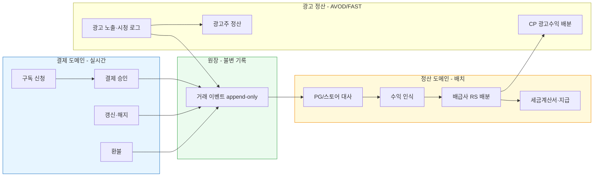
```mermaid
flowchart LR
    subgraph PAY["결제 도메인 - 실시간"]
        P1["구독 신청"]
        P2["결제 승인"]
        P3["갱신·해지"]
        P4["환불"]
    end

    subgraph LEDGER["원장 - 불변 기록"]
        L1["거래 이벤트 append-only"]
    end

    subgraph SETTLE["정산 도메인 - 배치"]
        S1["PG/스토어 대사"]
        S2["수익 인식"]
        S3["배급사 RS 배분"]
        S4["세금계산서·지급"]
    end

    subgraph AD["광고 정산 - AVOD/FAST"]
        A1["광고 노출·시청 로그"]
        A2["광고주 정산"]
        A3["CP 광고수익 배분"]
    end

    P1 --> P2 --> L1
    P3 --> L1
    P4 --> L1
    A1 --> L1

    L1 --> S1 --> S2 --> S3 --> S4
    A1 --> A2
    S3 --> A3

    style LEDGER fill:#ebfbee,stroke:#2f9e44
    style PAY fill:#e7f5ff,stroke:#1971c2
    style SETTLE fill:#fff9db,stroke:#f08c00
```

> **원장이 가운데 있는 이유**: 결제도 정산도 **원장에 기록을 남길 뿐**, 서로를 직접 호출하지 않습니다.
>
> 원장을 append-only(추가만 가능)로 두면 "3개월 전 그날 무슨 일이 있었나"를 언제든 재구성할 수 있습니다.
>
> 정산 오류를 고치는 방법은 **과거 기록을 수정하는 게 아니라 조정 전표를 추가하는 것**입니다. 회계의 기본이고, 시스템도 그래야 합니다.

### 1-2. 내부 고객

| 내부 고객 | 하는 일 | 고통 |
|---|---|---|
| **재무·정산 담당** | 월 마감, PG·스토어 대사, 배급사 지급 | 엑셀 대사, 불일치 원인 추적에 며칠 |
| **CS** | 결제 문의·환불 처리 | 결제 이력 조회가 여러 화면에 흩어짐 |
| **콘텐츠 사업(라이선싱)** | 배급사 계약·RS 조건 협상 | 실제 배분액을 계약 조건별로 시뮬레이션 불가 |
| **마케터** | 프로모션·쿠폰·요금제 실험 | 요금제 변경마다 개발 티켓 필요 |
| **경영진** | MRR·해지율·ARPU 추이 | 지표가 시스템마다 다르게 나옴 |

---

## §2. As-Is 시스템 구성도 `가설`

> **⚠️ 가설입니다.** 티빙이 실제로 이런 구조라는 근거는 없습니다. 국내 OTT가 흔히 겪는 상태를 그린 것입니다.

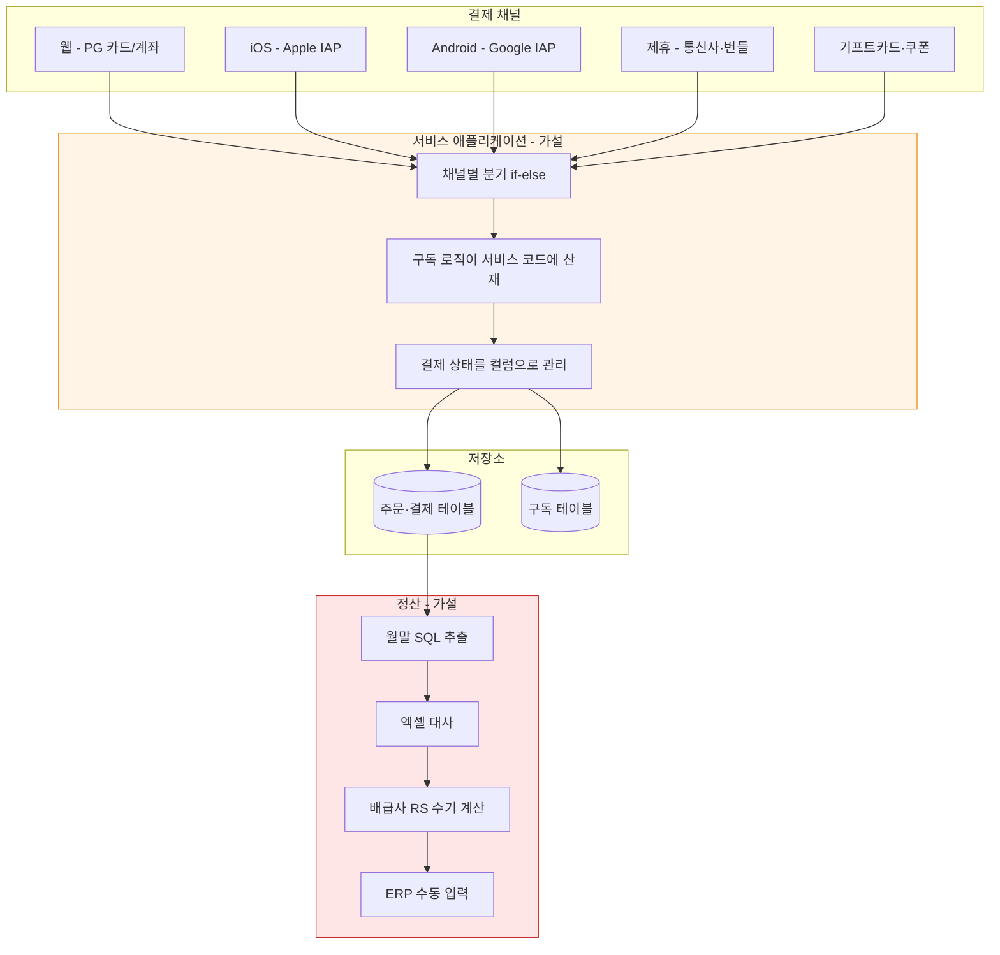
```mermaid
flowchart TB
    subgraph CH["결제 채널"]
        C1["웹 - PG 카드/계좌"]
        C2["iOS - Apple IAP"]
        C3["Android - Google IAP"]
        C4["제휴 - 통신사·번들"]
        C5["기프트카드·쿠폰"]
    end

    subgraph APP["서비스 애플리케이션 - 가설"]
        A1["구독 로직이 서비스 코드에 산재"]
        A2["채널별 분기 if-else"]
        A3["결제 상태를 컬럼으로 관리"]
    end

    subgraph DB["저장소"]
        D1[("주문·결제 테이블")]
        D2[("구독 테이블")]
    end

    subgraph OPS["정산 - 가설"]
        O1["월말 SQL 추출"]
        O2["엑셀 대사"]
        O3["배급사 RS 수기 계산"]
        O4["ERP 수동 입력"]
    end

    C1 --> A2
    C2 --> A2
    C3 --> A2
    C4 --> A2
    C5 --> A2
    A2 --> A1 --> A3
    A3 --> D1
    A3 --> D2

    D1 --> O1 --> O2 --> O3 --> O4

    style APP fill:#fff4e6,stroke:#e8890c
    style OPS fill:#ffe6e6,stroke:#c92a2a
```

### 2-1. 이 가설이 참이라면 생기는 문제

| # | 문제 | 왜 아픈가 |
|---|---|---|
| P1 | **원장이 없다** | 상태 컬럼만 있어 "왜 이 금액이 됐나"를 재구성할 수 없음. 감사·분쟁 시 무력 |
| P2 | **채널별 분기가 코드에 산재** | 새 결제수단 추가 = 여러 파일 수정. 회귀 버그 상시 |
| P3 | **멱등성 보장이 약함** | 네트워크 재시도로 이중 청구 위험. OTT에서 가장 치명적인 CS 이슈 |
| P4 | **정산이 수작업 엑셀** | 마감이 사람의 시간에 묶임. 오류가 발견되지 않고 지나감 |
| P5 | **RS 조건이 시스템에 없음** | 계약서에만 존재. 조건이 바뀌면 재계산 불가 |
| P6 | **지표가 시스템마다 다름** | MRR을 누가 어떻게 뽑느냐에 따라 숫자가 달라짐 |

> **P3이 가장 무섭습니다.** 이중 청구는 금액이 작아도 신뢰를 즉시 파괴합니다.
>
> 티빙은 최근 개인정보 유출로 신뢰 이슈를 겪은 회사입니다. **결제 사고는 그 위에 얹히면 안 됩니다.**
>
> 그래서 이 도메인의 가드레일은 "이중 청구 0건"이며, 이는 **목표가 아니라 전제조건**입니다.

---

## §3. Pain Point 검증 설계

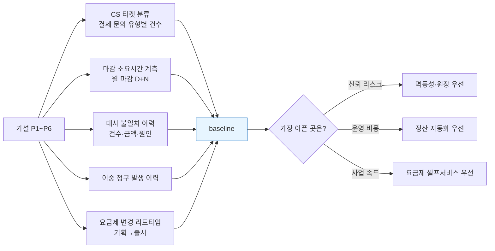
```mermaid
flowchart LR
    H["가설 P1~P6"] --> M1["CS 티켓 분류<br/>결제 문의 유형별 건수"]
    H --> M2["마감 소요시간 계측<br/>월 마감 D+N"]
    H --> M3["대사 불일치 이력<br/>건수·금액·원인"]
    H --> M4["이중 청구 발생 이력"]
    H --> M5["요금제 변경 리드타임<br/>기획→출시"]

    M1 --> B["baseline"]
    M2 --> B
    M3 --> B
    M4 --> B
    M5 --> B

    B --> D{"가장 아픈 곳은?"}
    D -->|"신뢰 리스크"| R1["멱등성·원장 우선"]
    D -->|"운영 비용"| R2["정산 자동화 우선"]
    D -->|"사업 속도"| R3["요금제 셀프서비스 우선"]

    style B fill:#e7f5ff,stroke:#1971c2
```

> **세 갈래 중 하나를 고르는 게 아니라, 순서를 정하는 것입니다.**
>
> 제 판단으로는 **멱등성·원장이 항상 먼저**입니다. 기반이 없는 상태에서 자동화하면 틀린 계산을 빠르게 하게 됩니다.

---

## §4. To-Be 목표 아키텍처

### 4-1. 설계 원칙

| # | 원칙 | 구체적으로 |
|---|---|---|
| 1 | **결제 채널은 어댑터로 격리** | PG·IAP·통신사를 공통 인터페이스 뒤로. 새 채널 추가가 코어를 건드리지 않음 |
| 2 | **모든 돈의 이동은 원장에 append** | 상태 컬럼을 신뢰하지 않는다. 상태는 원장의 투영(projection) |
| 3 | **멱등키를 API 계약에 포함** | 클라이언트가 키를 만들고, 서버는 같은 키에 같은 응답 |
| 4 | **정산은 재계산 가능해야 한다** | 특정 시점 스냅샷으로 언제든 다시 돌릴 수 있게 |
| 5 | **요금제·프로모션은 데이터, 코드가 아니다** | 마케터가 개발 티켓 없이 요금제를 만든다 (셀프서비스) |

### 4-2. 목표 구성도

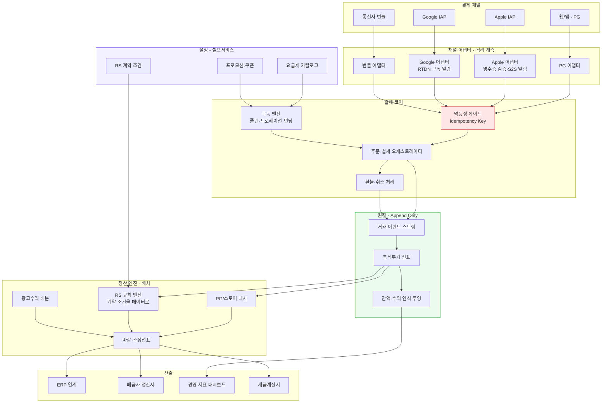
```mermaid
flowchart TB
    subgraph CH["결제 채널"]
        C1["웹/앱 - PG"]
        C2["Apple IAP"]
        C3["Google IAP"]
        C4["통신사 번들"]
    end

    subgraph ADP["채널 어댑터 - 격리 계층"]
        AD1["PG 어댑터"]
        AD2["Apple 어댑터<br/>영수증 검증·S2S 알림"]
        AD3["Google 어댑터<br/>RTDN 구독 알림"]
        AD4["번들 어댑터"]
    end

    subgraph CORE["결제 코어"]
        K1["멱등성 게이트<br/>Idempotency Key"]
        K2["구독 엔진<br/>플랜·프로레이션·던닝"]
        K3["주문·결제 오케스트레이터"]
        K4["환불·취소 처리"]
    end

    subgraph LG["원장 - Append Only"]
        G1["거래 이벤트 스트림"]
        G2["복식부기 전표"]
        G3["잔액·수익 인식 투영"]
    end

    subgraph ST["정산 엔진 - 배치"]
        T1["PG/스토어 대사"]
        T2["RS 규칙 엔진<br/>계약 조건을 데이터로"]
        T3["광고수익 배분"]
        T4["마감·조정전표"]
    end

    subgraph OUT["산출"]
        U1["ERP 연계"]
        U2["배급사 정산서"]
        U3["경영 지표 대시보드"]
        U4["세금계산서"]
    end

    subgraph CFG["설정 - 셀프서비스"]
        F1["요금제 카탈로그"]
        F2["프로모션·쿠폰"]
        F3["RS 계약 조건"]
    end

    C1 --> AD1 --> K1
    C2 --> AD2 --> K1
    C3 --> AD3 --> K1
    C4 --> AD4 --> K1

    K1 --> K3
    K2 --> K3
    K3 --> K4
    K3 --> G1
    K4 --> G1

    G1 --> G2 --> G3

    G2 --> T1 --> T4
    G2 --> T2 --> T4
    T3 --> T4

    T4 --> U1
    T4 --> U2
    G3 --> U3
    T4 --> U4

    F1 --> K2
    F2 --> K2
    F3 --> T2

    style LG fill:#ebfbee,stroke:#2f9e44,stroke-width:2px
    style K1 fill:#ffe6e6,stroke:#c92a2a
    style CFG fill:#f3f0ff,stroke:#7048e8
```

### 4-3. As-Is 가설 vs To-Be

| 축 | As-Is `가설` | To-Be | 이유 |
|---|---|---|---|
| 진실의 원천 | 상태 컬럼 | **원장(append-only)** | 재구성·감사 가능 |
| 채널 추가 | 코드 분기 | **어댑터 플러그인** | 코어 무변경 |
| 이중 청구 방지 | 애플리케이션 락 | **멱등키 계약** | 재시도에 안전 |
| 정산 | 엑셀 | **규칙 엔진 + 재계산** | 계약 조건이 데이터 |
| 요금제 출시 | 개발 티켓 | **마케터 셀프서비스** | 사업 속도 |
| 지표 | SQL 각자 추출 | **원장 투영 단일 소스** | 숫자가 하나 |

---

## §5. 데이터 모델 (ERD)

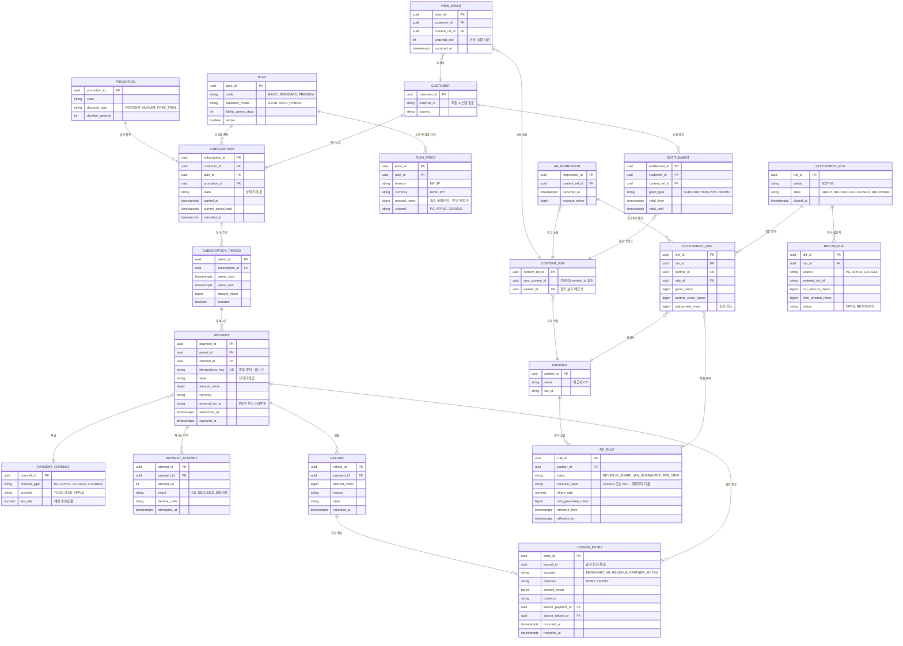
```mermaid
erDiagram
    CUSTOMER ||--o{ SUBSCRIPTION : "구독 보유"
    PLAN ||--o{ SUBSCRIPTION : "요금제 적용"
    PLAN ||--o{ PLAN_PRICE : "지역·통화별 가격"
    SUBSCRIPTION ||--o{ SUBSCRIPTION_PERIOD : "청구 주기"
    SUBSCRIPTION_PERIOD ||--o{ PAYMENT : "결제 시도"
    PAYMENT }o--|| PAYMENT_CHANNEL : "채널"
    PAYMENT ||--o{ PAYMENT_ATTEMPT : "재시도 이력"
    PAYMENT ||--o{ REFUND : "환불"
    PAYMENT ||--o{ LEDGER_ENTRY : "원장 전표"
    REFUND ||--o{ LEDGER_ENTRY : "원장 전표"
    CUSTOMER ||--o{ ENTITLEMENT : "시청 권한"
    ENTITLEMENT }o--|| CONTENT_REF : "대상 콘텐츠"
    PROMOTION ||--o{ SUBSCRIPTION : "할인 적용"
    SETTLEMENT_RUN ||--o{ SETTLEMENT_LINE : "정산 명세"
    SETTLEMENT_LINE }o--|| PARTNER : "배급사"
    SETTLEMENT_LINE }o--|| RS_RULE : "적용 규칙"
    PARTNER ||--o{ RS_RULE : "계약 조건"
    SETTLEMENT_RUN ||--o{ RECON_DIFF : "대사 불일치"
    AD_IMPRESSION }o--|| CONTENT_REF : "광고 노출"
    AD_IMPRESSION ||--o{ SETTLEMENT_LINE : "광고수익 배분"
    VIEW_EVENT }o--|| CONTENT_REF : "시청 대상"
    VIEW_EVENT }o--|| CUSTOMER : "시청자"
    CONTENT_REF }o--|| PARTNER : "권리 보유"

    CUSTOMER {
        uuid customer_id PK
        string external_id "회원 시스템 참조"
        string country
    }
    PLAN {
        uuid plan_id PK
        string code "BASIC, STANDARD, PREMIUM"
        string business_model "SVOD, AVOD_HYBRID"
        int billing_period_days
        boolean active
    }
    PLAN_PRICE {
        uuid price_id PK
        uuid plan_id FK
        string territory "KR, JP"
        string currency "KRW, JPY"
        bigint amount_minor "최소 화폐단위 - 원 단위 정수"
        string channel "PG, APPLE, GOOGLE"
    }
    SUBSCRIPTION {
        uuid subscription_id PK
        uuid customer_id FK
        uuid plan_id FK
        uuid promotion_id FK
        string state "상태기계 값"
        timestamptz started_at
        timestamptz current_period_end
        timestamptz canceled_at
    }
    SUBSCRIPTION_PERIOD {
        uuid period_id PK
        uuid subscription_id FK
        timestamptz period_start
        timestamptz period_end
        bigint amount_minor
        boolean prorated
    }
    PAYMENT {
        uuid payment_id PK
        uuid period_id FK
        uuid channel_id FK
        string idempotency_key UK "중복 방지 - 유니크"
        string state "상태기계 값"
        bigint amount_minor
        string currency
        string external_txn_id "PG/스토어 거래번호"
        timestamptz authorized_at
        timestamptz captured_at
    }
    PAYMENT_ATTEMPT {
        uuid attempt_id PK
        uuid payment_id FK
        int attempt_no
        string result "OK, DECLINED, ERROR"
        string decline_code
        timestamptz attempted_at
    }
    PAYMENT_CHANNEL {
        uuid channel_id PK
        string channel_type "PG, APPLE, GOOGLE, CARRIER"
        string provider "TOSS, NICE, APPLE"
        numeric fee_rate "채널 수수료율"
    }
    REFUND {
        uuid refund_id PK
        uuid payment_id FK
        bigint amount_minor
        string reason
        string state
        timestamptz refunded_at
    }
    LEDGER_ENTRY {
        uuid entry_id PK
        uuid journal_id "같은 전표 묶음"
        string account "MERCHANT_AR, REVENUE, PARTNER_AP, TAX"
        string direction "DEBIT, CREDIT"
        bigint amount_minor
        string currency
        uuid source_payment_id FK
        uuid source_refund_id FK
        timestamptz occurred_at
        timestamptz recorded_at
    }
    ENTITLEMENT {
        uuid entitlement_id PK
        uuid customer_id FK
        uuid content_ref_id FK
        string grant_type "SUBSCRIPTION, PPV, PROMO"
        timestamptz valid_from
        timestamptz valid_until
    }
    CONTENT_REF {
        uuid content_ref_id PK
        uuid cms_content_id "CMS의 content_id 참조"
        uuid partner_id FK "권리 보유 배급사"
    }
    VIEW_EVENT {
        uuid view_id PK
        uuid customer_id FK
        uuid content_ref_id FK
        int watched_sec "유효 시청 시간"
        timestamptz occurred_at
    }
    PROMOTION {
        uuid promotion_id PK
        string code
        string discount_type "PERCENT, AMOUNT, FREE_TRIAL"
        int duration_periods
    }
    PARTNER {
        uuid partner_id PK
        string name "배급사·CP"
        string tax_id
    }
    RS_RULE {
        uuid rule_id PK
        uuid partner_id FK
        string basis "REVENUE_SHARE, MIN_GUARANTEE, PER_VIEW"
        string revenue_basis "GROSS 또는 NET - 계약마다 다름"
        numeric share_rate
        bigint min_guarantee_minor
        timestamptz effective_from
        timestamptz effective_to
    }
    SETTLEMENT_RUN {
        uuid run_id PK
        string period "2027-03"
        string state "DRAFT, RECONCILED, CLOSED, REOPENED"
        timestamptz closed_at
    }
    SETTLEMENT_LINE {
        uuid line_id PK
        uuid run_id FK
        uuid partner_id FK
        uuid rule_id FK
        bigint gross_minor
        bigint partner_share_minor
        bigint adjustment_minor "조정 전표"
    }
    RECON_DIFF {
        uuid diff_id PK
        uuid run_id FK
        string source "PG, APPLE, GOOGLE"
        string external_txn_id
        bigint our_amount_minor
        bigint their_amount_minor
        string status "OPEN, RESOLVED"
    }
    AD_IMPRESSION {
        uuid impression_id PK
        uuid content_ref_id FK
        timestamptz occurred_at
        bigint revenue_minor
    }
```

### 5-2. 설계 결정 4가지

**① 금액은 `bigint amount_minor` — 절대 `float`을 쓰지 않는다**

부동소수점은 `0.1 + 0.2 != 0.3`이다. 돈을 float으로 다루면 **반드시** 1원이 사라진다. 최소 화폐단위 정수(원화는 1원, 엔화는 1엔, 달러는 센트)로 저장하고, 표시할 때만 나눈다.

**② `idempotency_key`에 유니크 제약 — 이중 청구를 DB가 막는다**

애플리케이션 락은 서버가 여러 대면 깨진다. **유니크 인덱스는 안 깨진다.** 같은 키로 두 번째 INSERT가 들어오면 DB가 거부하고, 우리는 첫 번째 결과를 그대로 돌려준다.

**③ `LEDGER_ENTRY`는 복식부기 — `journal_id`로 묶인 전표의 차변·대변 합은 항상 0**

이 불변식(invariant)이 있으면 **정합성 검증이 쿼리 한 줄로 끝난다**(§6-4). 돈이 어디선가 새면 즉시 드러난다.

**④ `RS_RULE`에 `effective_from/to` — 계약 조건은 시간의 함수다**

배급사 계약은 갱신되고 조건이 바뀐다. 현재 조건만 저장하면 **과거 정산을 재계산할 수 없다.** 규칙에 유효기간을 두면 "작년 3월 기준으로 다시 계산해줘"가 가능해진다.

> **④번이 실무에서 가장 자주 빠지는 설계입니다.**
>
> 정산 오류가 발견되는 시점은 언제나 몇 달 뒤이고, 그때 필요한 건 **그 시점의 계약 조건**입니다.

---

## §6. DB 샘플 쿼리

### 6-1. MRR과 해지율 (경영 지표)

```sql
-- 무엇을 답하는가: "월별 반복 매출과 해지율 추이는?"
-- 주의: 프로모션 할인·프로레이션이 반영된 실효 금액으로 계산한다.
WITH monthly AS (
    SELECT
        DATE_TRUNC('month', p.period_start)                 AS 월,
        SUM(p.amount_minor)                                 AS mrr_minor,
        COUNT(DISTINCT s.subscription_id)                   AS 활성_구독
    FROM subscription_period p
    JOIN subscription s ON s.subscription_id = p.subscription_id
    WHERE s.state IN ('ACTIVE', 'PAST_DUE')
      AND p.period_start >= NOW() - INTERVAL '12 months'
    GROUP BY 1
),
churned AS (
    SELECT
        DATE_TRUNC('month', canceled_at)                    AS 월,
        COUNT(*)                                            AS 해지_구독
    FROM subscription
    WHERE canceled_at >= NOW() - INTERVAL '12 months'
    GROUP BY 1
)
SELECT
    m.월,
    m.mrr_minor / 100                                       AS mrr_원단위,
    m.활성_구독,
    COALESCE(c.해지_구독, 0)                                AS 해지_구독,
    ROUND(100.0 * COALESCE(c.해지_구독, 0) / NULLIF(m.활성_구독, 0), 2) AS 월_해지율_pct,
    ROUND(m.mrr_minor::numeric / NULLIF(m.활성_구독, 0) / 100, 0)       AS arpu_원단위
FROM monthly m
LEFT JOIN churned c ON c.월 = m.월
ORDER BY m.월;
```

### 6-2. 이중 청구 탐지 (가드레일 — 목표 0건)

```sql
-- 무엇을 답하는가: "같은 청구 주기에 두 번 이상 결제된 건이 있는가"
-- 이 쿼리가 1건이라도 반환하면 즉시 인시던트. 멱등키가 뚫렸다는 뜻이다.
SELECT
    p.period_id,
    s.customer_id,
    COUNT(*)                                    AS 결제_건수,
    SUM(pay.amount_minor) / 100                 AS 총_청구액_원,
    ARRAY_AGG(pay.payment_id)                   AS 결제_ID_목록,
    ARRAY_AGG(pay.idempotency_key)              AS 멱등키_목록
FROM payment pay
JOIN subscription_period p ON p.period_id = pay.period_id
JOIN subscription        s ON s.subscription_id = p.subscription_id
WHERE pay.state = 'CAPTURED'
  AND pay.captured_at >= NOW() - INTERVAL '90 days'
GROUP BY p.period_id, s.customer_id
HAVING COUNT(*) > 1;
```

### 6-3. 대사(Reconciliation) 불일치 — 우리 장부 vs PG 정산서

```sql
-- 무엇을 답하는가: "PG가 보낸 정산 내역과 우리 원장이 어디서 어긋나는가"
-- recon_diff는 외부 정산서를 적재한 뒤 우리 원장과 조인해 채운다.
SELECT
    d.source                                    AS 채널,
    d.status,
    COUNT(*)                                    AS 불일치_건수,
    SUM(ABS(d.our_amount_minor - d.their_amount_minor)) / 100 AS 총_차액_원,
    MIN(d.external_txn_id)                      AS 예시_거래번호
FROM recon_diff d
JOIN settlement_run r ON r.run_id = d.run_id
WHERE r.period = '2027-03'
GROUP BY d.source, d.status
ORDER BY 총_차액_원 DESC;
```

### 6-4. 원장 정합성 — 복식부기 불변식 검증

```sql
-- 무엇을 답하는가: "차변과 대변의 합이 0이 아닌 전표가 있는가"
-- 하나라도 나오면 원장이 깨진 것. 돈이 새고 있다는 뜻이다.
-- 이 쿼리는 매일 자동 실행되어야 하고, 결과가 비어 있지 않으면 알림이 울려야 한다.
SELECT
    journal_id,
    currency,
    SUM(CASE WHEN direction = 'DEBIT'  THEN amount_minor ELSE 0 END) AS 차변합,
    SUM(CASE WHEN direction = 'CREDIT' THEN amount_minor ELSE 0 END) AS 대변합,
    SUM(CASE WHEN direction = 'DEBIT'  THEN amount_minor
             ELSE -amount_minor END)                                 AS 불균형
FROM ledger_entry
WHERE occurred_at >= NOW() - INTERVAL '7 days'
GROUP BY journal_id, currency
HAVING SUM(CASE WHEN direction = 'DEBIT' THEN amount_minor ELSE -amount_minor END) <> 0;
```

### 6-5. 배급사 RS 정산 — 시청시간 비례 배분 + 시점 계약 적용

SVOD 구독료는 특정 콘텐츠에 귀속되지 않는다. 사용자는 **카탈로그 전체**에 돈을 낸다. 그래서 실무의 표준은 **이번 달 구독 순매출을 각 콘텐츠의 유효 시청시간 비중대로 배분(pro-rata)** 하는 것이다.

```sql
-- 무엇을 답하는가: "2027년 3월 구독 매출을 배급사에 어떻게 나눠 지급하는가"
-- 방식: 유효 시청시간 비중으로 순매출을 배분(pro-rata) → 계약 조건(share_rate) 적용 → 최소보증과 비교
-- 핵심: rs_rule의 effective_from/to로 '그 시점의 계약'을 고른다. 최신 계약이 아니다.
WITH period_bounds AS (
    SELECT '2027-03-01'::timestamptz AS ps, '2027-04-01'::timestamptz AS pe
),
-- 1) 해당 월 구독 순매출 (스토어·PG 수수료를 뺀 금액)
net_revenue AS (
    SELECT SUM(
        CASE WHEN le.account = 'REVENUE'    AND le.direction = 'CREDIT' THEN  le.amount_minor
             WHEN le.account = 'CHANNEL_FEE' AND le.direction = 'DEBIT'  THEN -le.amount_minor
             ELSE 0 END
    ) AS net_minor
    FROM ledger_entry le, period_bounds pb
    WHERE le.occurred_at >= pb.ps AND le.occurred_at < pb.pe
),
-- 2) 콘텐츠별 유효 시청시간 비중
watch_share AS (
    SELECT
        cr.partner_id,
        SUM(v.watched_sec)::numeric
            / NULLIF(SUM(SUM(v.watched_sec)) OVER (), 0) AS share_ratio
    FROM view_event v
    JOIN content_ref cr ON cr.content_ref_id = v.content_ref_id
    CROSS JOIN period_bounds pb
    WHERE v.occurred_at >= pb.ps AND v.occurred_at < pb.pe
    GROUP BY cr.partner_id
)
SELECT
    p.name                                                  AS 배급사,
    r.basis                                                 AS 정산_기준,
    ROUND(w.share_ratio * 100, 2)                           AS 시청시간_비중_pct,
    (nr.net_minor * w.share_ratio)::bigint / 100            AS 귀속_매출_원,
    GREATEST(
        (nr.net_minor * w.share_ratio * r.share_rate)::bigint,
        COALESCE(r.min_guarantee_minor, 0)
    ) / 100                                                 AS 지급액_원,
    CASE WHEN (nr.net_minor * w.share_ratio * r.share_rate)::bigint
              < COALESCE(r.min_guarantee_minor, 0)
         THEN '최소보증 적용' ELSE '배분율 적용' END          AS 적용_경로
FROM watch_share w
JOIN partner p  ON p.partner_id = w.partner_id
JOIN rs_rule r  ON r.partner_id = w.partner_id
CROSS JOIN net_revenue nr
CROSS JOIN period_bounds pb
WHERE r.effective_from <= pb.ps
  AND (r.effective_to IS NULL OR r.effective_to >= pb.pe)   -- ★ 그 시점의 계약
ORDER BY 지급액_원 DESC;
```

> **이 쿼리에 담긴 판단 세 가지**
>
> **① 시청시간 비례 배분**: 구독료는 콘텐츠 하나에 귀속되지 않으므로, `SUM() OVER ()` 윈도우 함수로 전체 대비 비중을 구해 배분합니다.
>
> **② `GREATEST(배분액, 최소보증)`**: 배급사 계약에는 **최소보증금(Minimum Guarantee)**이 흔합니다. 매출이 적어도 정해진 금액은 지급해야 합니다. `적용_경로` 컬럼으로 어느 쪽이 적용됐는지 남깁니다.
>
> **③ 순매출 기준**: 스토어·PG 수수료를 뺀 net을 배분 대상으로 삼을지, gross로 삼을지는 **계약마다 다릅니다.** 그래서 이것도 `rs_rule`의 속성이어야 하며, 코드에 박으면 안 됩니다.

### 6-6. 던닝 대상 — 결제 실패로 위험에 빠진 구독

```sql
-- 무엇을 답하는가: "결제가 실패해 곧 해지될 구독은 몇 건이고, 얼마나 살릴 수 있는가"
SELECT
    s.subscription_id,
    s.customer_id,
    pl.code                                     AS 요금제,
    COUNT(a.attempt_id)                         AS 실패_횟수,
    MAX(a.decline_code)                         AS 최근_실패사유,
    s.current_period_end                        AS 유예_만료일,
    s.current_period_end - NOW()                AS 남은_시간
FROM subscription s
JOIN plan pl              ON pl.plan_id  = s.plan_id
JOIN subscription_period p ON p.subscription_id = s.subscription_id
JOIN payment pay           ON pay.period_id = p.period_id
JOIN payment_attempt a     ON a.payment_id  = pay.payment_id
WHERE s.state = 'PAST_DUE'
  AND a.result IN ('DECLINED', 'ERROR')
GROUP BY s.subscription_id, s.customer_id, pl.code, s.current_period_end
ORDER BY s.current_period_end;
```

---

## §7. 서비스 흐름도 (시퀀스)

### 7-1. 시나리오 A — 신규 구독 결제 (멱등성 포함)

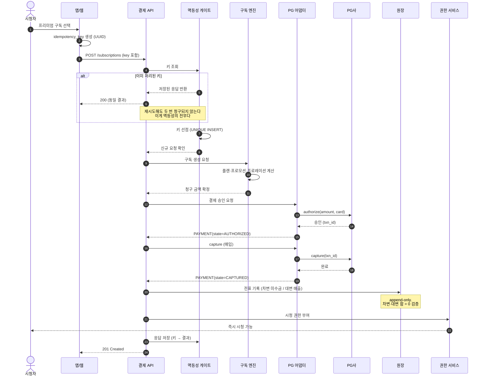
```mermaid
sequenceDiagram
    autonumber
    actor U as 시청자
    participant APP as 앱/웹
    participant API as 결제 API
    participant IDEM as 멱등성 게이트
    participant SUB as 구독 엔진
    participant ADP as PG 어댑터
    participant PG as PG사
    participant LG as 원장
    participant ENT as 권한 서비스

    U->>APP: 프리미엄 구독 선택
    APP->>APP: idempotency_key 생성 (UUID)
    APP->>API: POST /subscriptions (key 포함)

    API->>IDEM: 키 조회
    alt 이미 처리된 키
        IDEM-->>API: 저장된 응답 반환
        API-->>APP: 200 (동일 결과)
        Note over IDEM,API: 재시도해도 두 번 청구되지 않는다<br/>이게 멱등성의 전부다
    end

    IDEM->>IDEM: 키 선점 (UNIQUE INSERT)
    IDEM-->>API: 신규 요청 확인

    API->>SUB: 구독 생성 요청
    SUB->>SUB: 플랜·프로모션·프로레이션 계산
    SUB-->>API: 청구 금액 확정

    API->>ADP: 결제 승인 요청
    ADP->>PG: authorize(amount, card)
    PG-->>ADP: 승인 (txn_id)
    ADP-->>API: PAYMENT(state=AUTHORIZED)

    API->>ADP: capture (매입)
    ADP->>PG: capture(txn_id)
    PG-->>ADP: 완료
    ADP-->>API: PAYMENT(state=CAPTURED)

    API->>LG: 전표 기록 (차변 미수금 / 대변 매출)
    Note over LG: append-only.<br/>차변·대변 합 = 0 검증

    API->>ENT: 시청 권한 부여
    ENT-->>U: 즉시 시청 가능

    API->>IDEM: 응답 저장 (키 → 결과)
    API-->>APP: 201 Created
```

> **3~6번이 이 시퀀스의 심장입니다.**
>
> 네트워크가 끊겨 앱이 재시도해도, 같은 키로 오면 **저장된 응답을 그대로 돌려줍니다.**
>
> 이중 청구를 막는 건 트랜잭션 격리 수준이 아니라 **유니크 인덱스와 응답 캐시**입니다.

### 7-2. 시나리오 B — Apple IAP 구독 갱신 (서버 알림 기반)

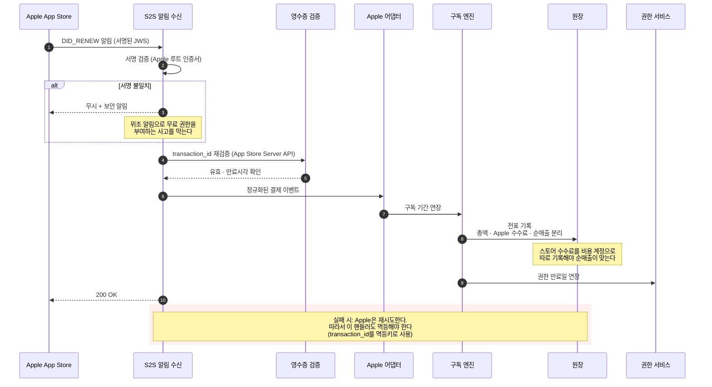
```mermaid
sequenceDiagram
    autonumber
    participant APL as Apple App Store
    participant HOOK as S2S 알림 수신
    participant VER as 영수증 검증
    participant ADP as Apple 어댑터
    participant SUB as 구독 엔진
    participant LG as 원장
    participant ENT as 권한 서비스

    APL->>HOOK: DID_RENEW 알림 (서명된 JWS)
    HOOK->>HOOK: 서명 검증 (Apple 루트 인증서)
    alt 서명 불일치
        HOOK-->>APL: 무시 + 보안 알림
        Note over HOOK: 위조 알림으로 무료 권한을<br/>부여하는 사고를 막는다
    end

    HOOK->>VER: transaction_id 재검증 (App Store Server API)
    VER-->>HOOK: 유효 · 만료시각 확인

    HOOK->>ADP: 정규화된 결제 이벤트
    ADP->>SUB: 구독 기간 연장
    SUB->>LG: 전표 기록<br/>총액 · Apple 수수료 · 순매출 분리
    Note over LG: 스토어 수수료를 비용 계정으로<br/>따로 기록해야 순매출이 맞는다

    SUB->>ENT: 권한 만료일 연장
    HOOK-->>APL: 200 OK

    rect rgb(255, 240, 240)
        Note over HOOK,LG: 실패 시: Apple은 재시도한다.<br/>따라서 이 핸들러도 멱등해야 한다<br/>(transaction_id를 멱등키로 사용)
    end
```

> **IAP의 함정 두 가지**:
>
> 첫째, **스토어 수수료를 매출에서 빼면 안 됩니다.** 총액을 매출로, 수수료를 비용으로 각각 기록해야 배급사 RS 계산의 기준(gross)이 맞습니다.
>
> 둘째, **Apple/Google은 알림을 재전송합니다.** 핸들러가 멱등하지 않으면 구독 기간이 두 번 연장됩니다.

### 7-3. 시나리오 C — 월 정산 마감

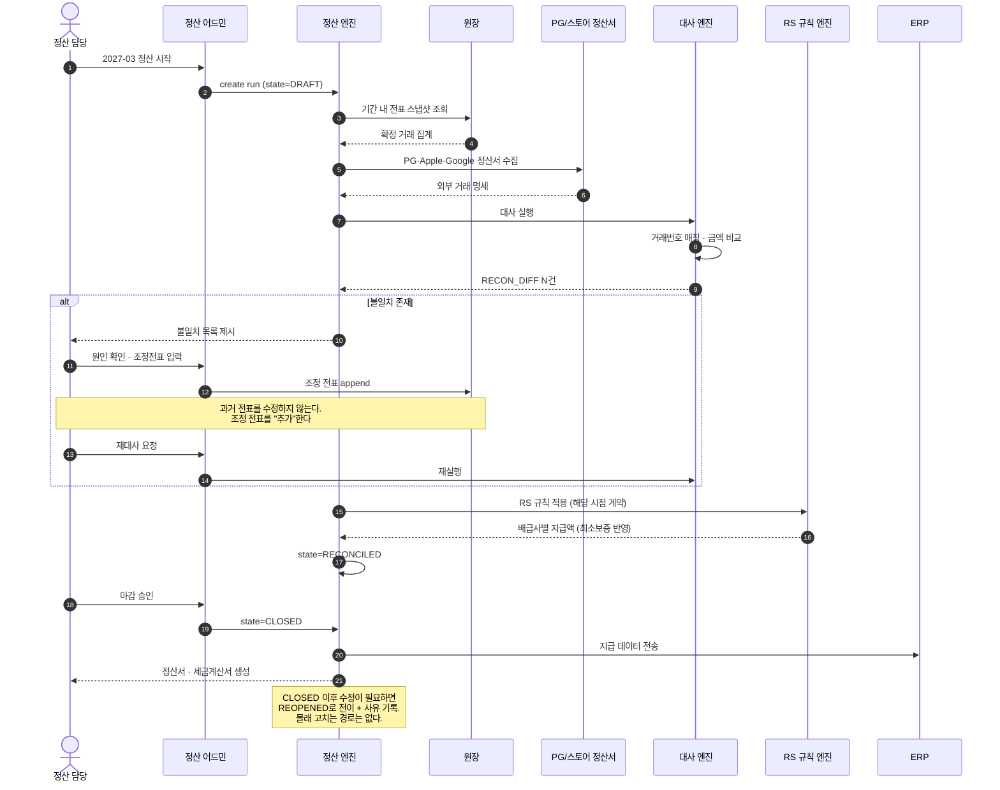
```mermaid
sequenceDiagram
    autonumber
    actor FIN as 정산 담당
    participant UI as 정산 어드민
    participant RUN as 정산 엔진
    participant LG as 원장
    participant EXT as PG/스토어 정산서
    participant RECON as 대사 엔진
    participant RS as RS 규칙 엔진
    participant ERP as ERP

    FIN->>UI: 2027-03 정산 시작
    UI->>RUN: create run (state=DRAFT)

    RUN->>LG: 기간 내 전표 스냅샷 조회
    LG-->>RUN: 확정 거래 집계

    RUN->>EXT: PG·Apple·Google 정산서 수집
    EXT-->>RUN: 외부 거래 명세

    RUN->>RECON: 대사 실행
    RECON->>RECON: 거래번호 매칭 · 금액 비교
    RECON-->>RUN: RECON_DIFF N건

    alt 불일치 존재
        RUN-->>FIN: 불일치 목록 제시
        FIN->>UI: 원인 확인 · 조정전표 입력
        UI->>LG: 조정 전표 append
        Note over LG,FIN: 과거 전표를 수정하지 않는다.<br/>조정 전표를 "추가"한다
        FIN->>UI: 재대사 요청
        UI->>RECON: 재실행
    end

    RUN->>RS: RS 규칙 적용 (해당 시점 계약)
    RS-->>RUN: 배급사별 지급액 (최소보증 반영)

    RUN->>RUN: state=RECONCILED
    FIN->>UI: 마감 승인
    UI->>RUN: state=CLOSED
    RUN->>ERP: 지급 데이터 전송
    RUN-->>FIN: 정산서 · 세금계산서 생성

    Note over RUN: CLOSED 이후 수정이 필요하면<br/>REOPENED로 전이 + 사유 기록.<br/>몰래 고치는 경로는 없다.
```

---

## §8. 상태 전이

### 8-1. 구독 상태기계

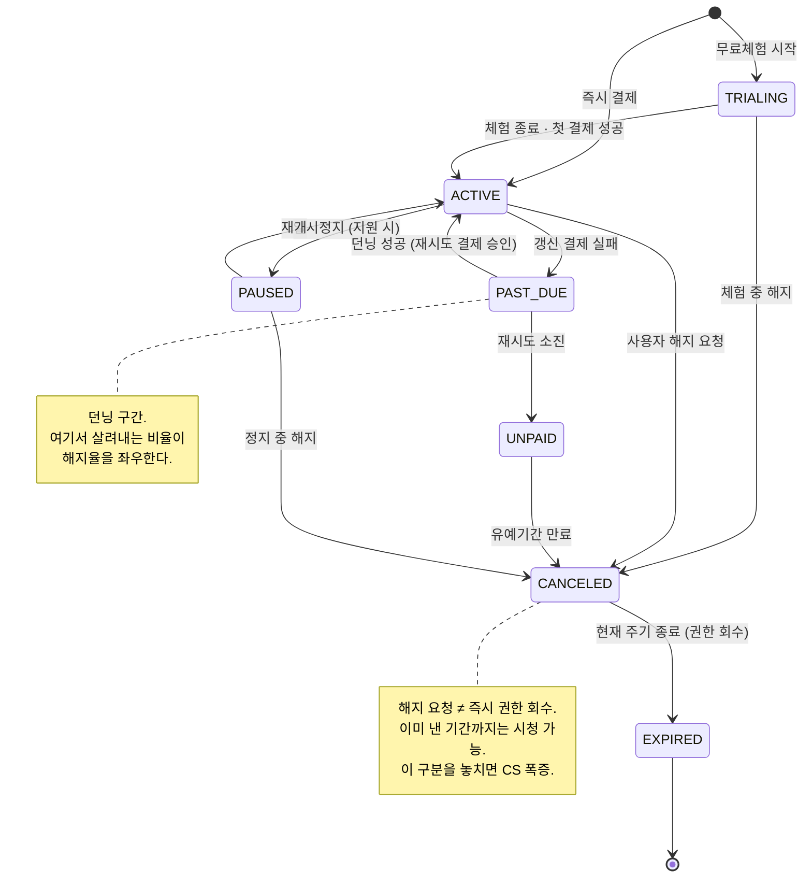
```mermaid
stateDiagram-v2
    [*] --> TRIALING : 무료체험 시작
    [*] --> ACTIVE : 즉시 결제

    TRIALING --> ACTIVE : 체험 종료 · 첫 결제 성공
    TRIALING --> CANCELED : 체험 중 해지

    ACTIVE --> PAST_DUE : 갱신 결제 실패
    ACTIVE --> CANCELED : 사용자 해지 요청
    ACTIVE --> PAUSED : 일시정지 (지원 시)

    PAST_DUE --> ACTIVE : 던닝 성공 (재시도 결제 승인)
    PAST_DUE --> UNPAID : 재시도 소진
    UNPAID --> CANCELED : 유예기간 만료

    PAUSED --> ACTIVE : 재개
    PAUSED --> CANCELED : 정지 중 해지

    CANCELED --> EXPIRED : 현재 주기 종료 (권한 회수)
    EXPIRED --> [*]

    note right of CANCELED
        해지 요청 ≠ 즉시 권한 회수.
        이미 낸 기간까지는 시청 가능.
        이 구분을 놓치면 CS 폭증.
    end note

    note right of PAST_DUE
        던닝 구간.
        여기서 살려내는 비율이
        해지율을 좌우한다.
    end note
```

### 8-2. 결제 상태기계

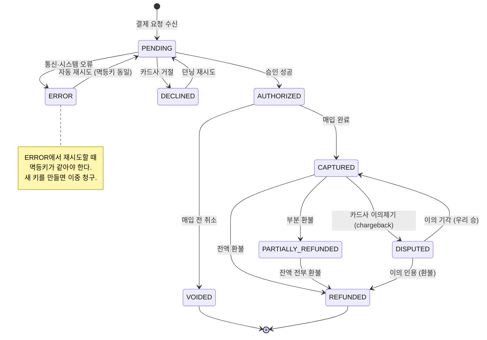
```mermaid
stateDiagram-v2
    [*] --> PENDING : 결제 요청 수신
    PENDING --> AUTHORIZED : 승인 성공
    PENDING --> DECLINED : 카드사 거절
    PENDING --> ERROR : 통신·시스템 오류

    DECLINED --> PENDING : 던닝 재시도
    ERROR --> PENDING : 자동 재시도 (멱등키 동일)

    AUTHORIZED --> CAPTURED : 매입 완료
    AUTHORIZED --> VOIDED : 매입 전 취소

    CAPTURED --> PARTIALLY_REFUNDED : 부분 환불
    CAPTURED --> REFUNDED : 전액 환불
    PARTIALLY_REFUNDED --> REFUNDED : 잔액 전부 환불

    CAPTURED --> DISPUTED : 카드사 이의제기 (chargeback)
    DISPUTED --> CAPTURED : 이의 기각 (우리 승)
    DISPUTED --> REFUNDED : 이의 인용 (환불)

    VOIDED --> [*]
    REFUNDED --> [*]

    note right of ERROR
        ERROR에서 재시도할 때
        멱등키가 같아야 한다.
        새 키를 만들면 이중 청구.
    end note
```

> **`AUTHORIZED`와 `CAPTURED`를 구분하는 이유**: 승인은 "카드 한도를 잡아둔 것"이고, 매입은 "실제로 돈을 가져온 것"입니다.
>
> 구독 갱신에서 승인만 하고 매입에 실패하면, 사용자 카드에는 금액이 잡혀 있는데 우리 매출은 없는 상태가 됩니다. **이 구간을 상태로 명시하지 않으면 조용히 새어나갑니다.**

---

## §9. 동선

### 9-1. 정산 담당자의 월말 (As-Is 가설 vs To-Be)

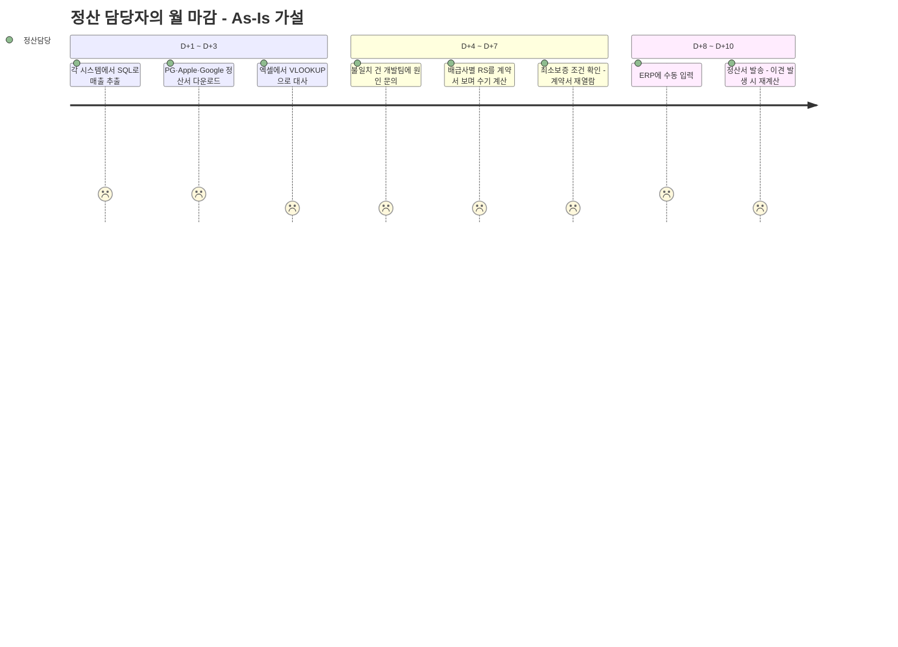
```mermaid
journey
    title 정산 담당자의 월 마감 - As-Is 가설
    section D+1 ~ D+3
      각 시스템에서 SQL로 매출 추출: 2: 정산담당
      PG·Apple·Google 정산서 다운로드: 2: 정산담당
      엑셀에서 VLOOKUP으로 대사: 1: 정산담당
    section D+4 ~ D+7
      불일치 건 개발팀에 원인 문의: 1: 정산담당
      배급사별 RS를 계약서 보며 수기 계산: 1: 정산담당
      최소보증 조건 확인 - 계약서 재열람: 1: 정산담당
    section D+8 ~ D+10
      ERP에 수동 입력: 2: 정산담당
      정산서 발송 - 이견 발생 시 재계산: 1: 정산담당
```

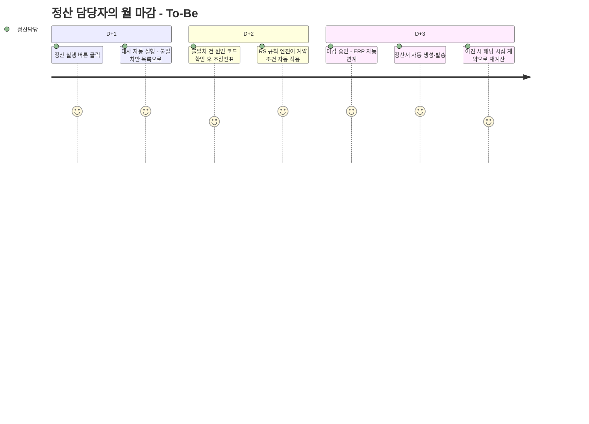
```mermaid
journey
    title 정산 담당자의 월 마감 - To-Be
    section D+1
      정산 실행 버튼 클릭: 5: 정산담당
      대사 자동 실행 - 불일치만 목록으로: 5: 정산담당
    section D+2
      불일치 건 원인 코드 확인 후 조정전표: 4: 정산담당
      RS 규칙 엔진이 계약 조건 자동 적용: 5: 정산담당
    section D+3
      마감 승인 - ERP 자동 연계: 5: 정산담당
      정산서 자동 생성·발송: 5: 정산담당
      이견 시 해당 시점 계약으로 재계산: 4: 정산담당
```

### 9-2. CS 담당자 동선 — "이중 결제된 것 같아요"

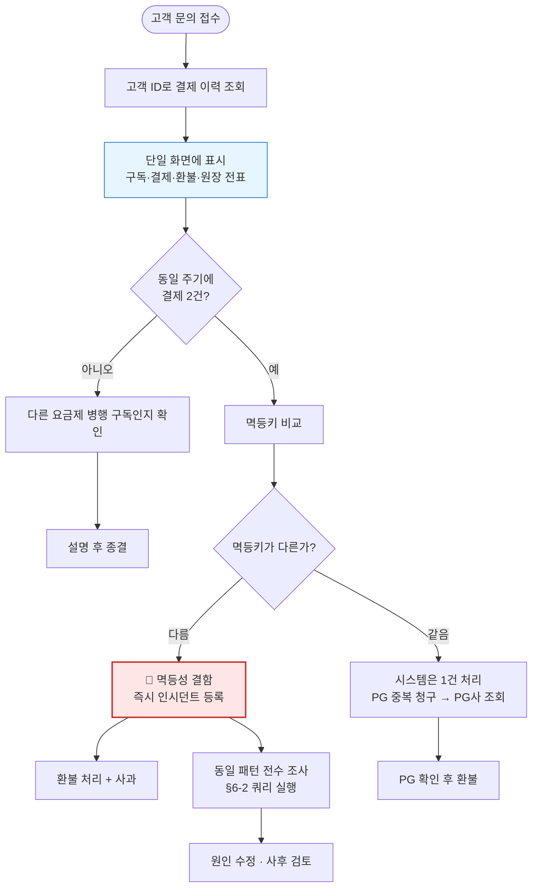
```mermaid
flowchart TD
    START(["고객 문의 접수"]) --> S1["고객 ID로 결제 이력 조회"]
    S1 --> S2["단일 화면에 표시<br/>구독·결제·환불·원장 전표"]

    S2 --> Q1{"동일 주기에<br/>결제 2건?"}
    Q1 -->|"아니오"| N1["다른 요금제 병행 구독인지 확인"]
    N1 --> N2["설명 후 종결"]

    Q1 -->|"예"| Y1["멱등키 비교"]
    Y1 --> Q2{"멱등키가 다른가?"}
    Q2 -->|"같음"| Y2["시스템은 1건 처리<br/>PG 중복 청구 → PG사 조회"]
    Q2 -->|"다름"| Y3["🚨 멱등성 결함<br/>즉시 인시던트 등록"]

    Y3 --> E1["환불 처리 + 사과"]
    Y3 --> E2["동일 패턴 전수 조사<br/>§6-2 쿼리 실행"]
    E2 --> E3["원인 수정 · 사후 검토"]

    Y2 --> R1["PG 확인 후 환불"]

    style Y3 fill:#ffe6e6,stroke:#c92a2a,stroke-width:2px
    style S2 fill:#e7f5ff,stroke:#1971c2
```

> **"단일 화면에 표시"(2번)가 이 동선의 핵심 개선입니다.**
>
> As-Is 가설에서 CS는 구독 화면·결제 화면·PG 관리자 페이지를 오가며 퍼즐을 맞춥니다. 그동안 고객은 기다립니다.
>
> 원장이 있으면 **"이 고객의 돈이 어떻게 움직였는가"를 시간순으로 한 번에** 보여줄 수 있습니다.

### 9-3. 시청자 결제 동선 — 마찰 지점

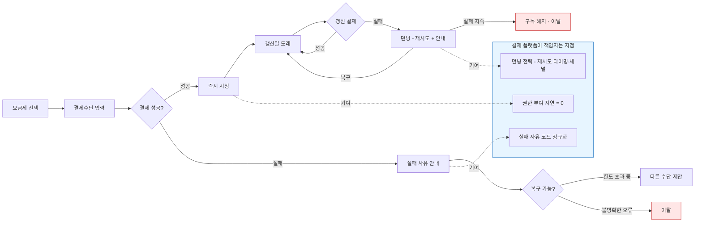
```mermaid
flowchart LR
    V1["요금제 선택"] --> V2["결제수단 입력"]
    V2 --> V3{"결제 성공?"}
    V3 -->|"성공"| V4["즉시 시청"]
    V3 -->|"실패"| V5["실패 사유 안내"]
    V5 --> V6{"복구 가능?"}
    V6 -->|"한도 초과 등"| V7["다른 수단 제안"]
    V6 -->|"불명확한 오류"| V8["이탈"]

    V4 --> V9["갱신일 도래"]
    V9 --> V10{"갱신 결제"}
    V10 -->|"성공"| V9
    V10 -->|"실패"| V11["던닝 - 재시도 + 안내"]
    V11 -->|"복구"| V9
    V11 -->|"실패 지속"| V12["구독 해지 · 이탈"]

    V5 -.기여.-> M1["실패 사유 코드 정규화"]
    V11 -.기여.-> M2["던닝 전략 - 재시도 타이밍·채널"]
    V4 -.기여.-> M3["권한 부여 지연 = 0"]

    subgraph IMPACT["결제 플랫폼이 책임지는 지점"]
        M1
        M2
        M3
    end

    style V8 fill:#ffe6e6,stroke:#c92a2a
    style V12 fill:#ffe6e6,stroke:#c92a2a
    style IMPACT fill:#e7f5ff,stroke:#1971c2
```

> **던닝(M2)은 결제 플랫폼이 해지율에 직접 기여하는 유일한 지점**입니다.
>
> 카드 한도 초과로 실패한 결제를 3일 뒤 재시도하면 상당수가 살아납니다. 재시도 타이밍·횟수·안내 채널은 실험 대상입니다.
>
> **해지의 상당 부분은 "떠나고 싶어서"가 아니라 "카드가 안 됐는데 몰라서"입니다.**

---

## §10. 솔루션 후보 비교 — 빌드 vs 바이

### 10-1. 구독·결제 코어

| 후보 | 강점 | 약점 | 한국 OTT 적합성 | 판단 |
|---|---|---|---|---|
| **Stripe Billing** | 구독·프로레이션·던닝 완비, 문서 최고 | 국내 카드 결제 커버리지 제한, IAP 통합은 별도, 수수료 | 중 | △ (해외 확장 시 재검토) |
| **Recurly / Chargebee** | 구독 관리 특화, 요금제 실험 강함 | 국내 PG 연동 커스텀 필요, IAP·통신사 번들 취약 | 낮음 | ✕ |
| **Zuora** | 엔터프라이즈 빌링·수익인식 | 고비용, 무거움, 변경 느림 | 낮음 | ✕ |
| **자체 구축 + PG/스토어 어댑터** | 국내 결제수단·통신사 번들·PPV·FAST 혼합 BM에 정확히 맞춤 | 초기 구축 비용, 던닝·프로레이션을 직접 만들어야 함 | **높음** | ✅ |

> **판단: 결제·구독 코어는 빌드입니다. 단, 이유가 "우리가 더 잘 만들어서"가 아닙니다.**
>
> 국내 OTT는 **카드·계좌·통신사 번들·기프트카드·IAP·PPV·광고형 요금제**가 뒤섞입니다. 해외 SaaS는 이 조합을 전제하지 않습니다.
>
> 게다가 배급사 RS 정산은 **어떤 상용 빌링 제품에도 없습니다.** 결국 정산은 자체 구축이고, 그렇다면 결제와 원장을 같은 모델 안에 두는 편이 정합성 관리가 쉽습니다.

### 10-2. 원장 (Ledger)

| 후보 | 성격 | 판단 |
|---|---|---|
| **자체 append-only 테이블 + 복식부기 제약** | PostgreSQL로 충분. 불변식을 쿼리로 검증(§6-4) | ✅ **채택** |
| **TigerBeetle** | 금융 특화 초고성능 원장 DB | △ (규모가 정당화할 때. 운영 부담) |
| **Formance Ledger** | 오픈소스 원장 엔진 | △ (검토 가치 있음) |
| **ERP에 직접 기록** | 회계는 ERP가 진실 | ✕ (실시간 결제 흐름을 감당 못함) |

> **원장은 "무엇을 쓰느냐"보다 "불변식을 지키느냐"의 문제**입니다.
>
> append-only, 복식부기 합=0, 조정은 수정이 아니라 추가 — **이 세 규칙만 지키면 PostgreSQL로 충분합니다.**

### 10-3. PG · 스토어 · 부가

| 영역 | 후보 | 판단 | 비고 |
|---|---|---|---|
| **PG** | 토스페이먼츠 / NICE페이 / KG이니시스 | **바이 · 다중화** | 단일 PG 장애 시 결제 전면 중단. 최소 2사 이중화 |
| **간편결제** | 카카오페이·네이버페이·토스 | **바이** | 전환율에 직접 영향 |
| **IAP** | Apple StoreKit 2 / Google Play Billing | **바이 (강제)** | 선택지 없음. S2S 알림 + 영수증 서버 검증 필수 |
| **통신사 번들** | KT·SKT·LGU+ 제휴 | **바이 · 어댑터** | 정산 주기·수수료 구조가 PG와 다름 |
| **카드 정보 저장** | PG 빌링키 (토큰) | **절대 자체 저장 금지** | PCI DSS. 카드번호를 우리 DB에 두지 않는다 |
| **세금계산서** | 팝빌 / 바로빌 | **바이** | 국세청 연동을 직접 만들 이유 없음 |
| **정산 배치** | 자체 (Temporal 재사용) | **빌드** | [01_CMS.md §10-2](01_CMS.md)의 워크플로우 엔진 공유 |

### 10-4. 빌드/바이 한눈에

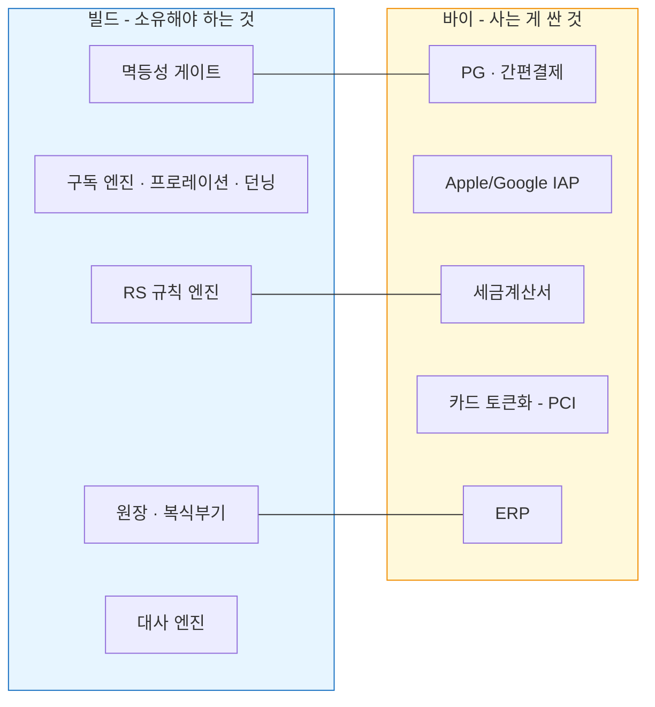
```mermaid
flowchart LR
    subgraph BUILD["빌드 - 소유해야 하는 것"]
        B1["원장 · 복식부기"]
        B2["구독 엔진 · 프로레이션 · 던닝"]
        B3["멱등성 게이트"]
        B4["RS 규칙 엔진"]
        B5["대사 엔진"]
    end

    subgraph BUY["바이 - 사는 게 싼 것"]
        Y1["PG · 간편결제"]
        Y2["Apple/Google IAP"]
        Y3["세금계산서"]
        Y4["카드 토큰화 - PCI"]
        Y5["ERP"]
    end

    B3 --- Y1
    B1 --- Y5
    B4 --- Y3

    style BUILD fill:#e7f5ff,stroke:#1971c2
    style BUY fill:#fff9db,stroke:#f08c00
```

---

## §11. 로드맵

### 11-1. 전환 원칙 — 결제는 CMS보다 더 보수적으로

> CMS는 잘못되면 콘텐츠가 늦게 걸립니다. **결제는 잘못되면 돈이 사라지거나 두 번 빠져나갑니다.**
>
> 그래서 결제 도메인의 전환은 **읽기 이중화 → 그림자 쓰기 → 카나리 → 전환** 4단계를 거칩니다.

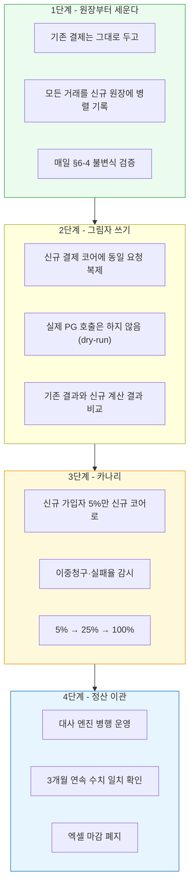
```mermaid
flowchart TB
    subgraph S1["1단계 - 원장부터 세운다"]
        A1["기존 결제는 그대로 두고"]
        A2["모든 거래를 신규 원장에 병렬 기록"]
        A3["매일 §6-4 불변식 검증"]
    end

    subgraph S2["2단계 - 그림자 쓰기"]
        B1["신규 결제 코어에 동일 요청 복제"]
        B2["실제 PG 호출은 하지 않음 (dry-run)"]
        B3["기존 결과와 신규 계산 결과 비교"]
    end

    subgraph S3["3단계 - 카나리"]
        C1["신규 가입자 5%만 신규 코어로"]
        C2["이중청구·실패율 감시"]
        C3["5% → 25% → 100%"]
    end

    subgraph S4["4단계 - 정산 이관"]
        D1["대사 엔진 병행 운영"]
        D2["3개월 연속 수치 일치 확인"]
        D3["엑셀 마감 폐지"]
    end

    S1 --> S2 --> S3 --> S4

    style S1 fill:#ebfbee,stroke:#2f9e44
    style S3 fill:#fff9db,stroke:#f08c00
    style S4 fill:#e7f5ff,stroke:#1971c2
```

### 11-2. 일정 (가정)

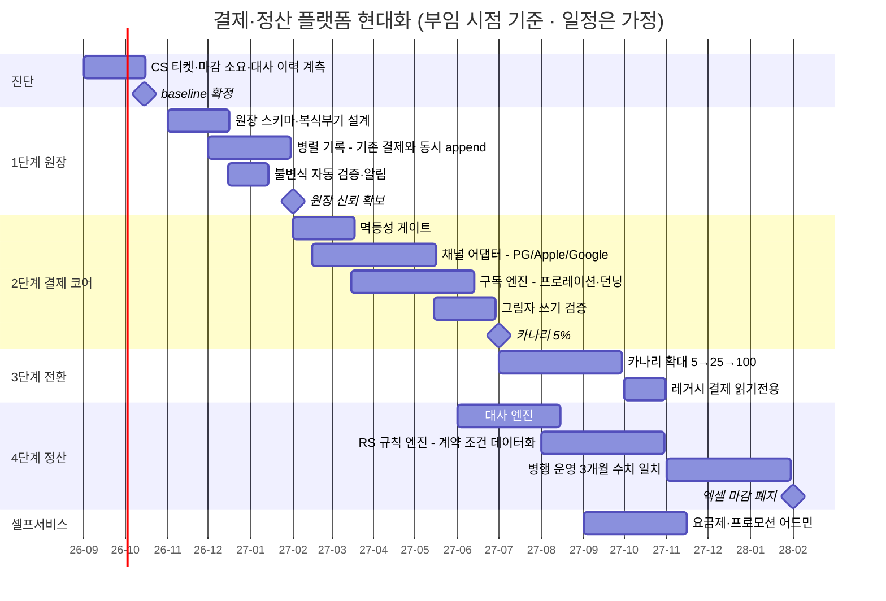
```mermaid
gantt
    title 결제·정산 플랫폼 현대화 (부임 시점 기준 · 일정은 가정)
    dateFormat YYYY-MM-DD
    axisFormat %y-%m

    section 진단
    CS 티켓·마감 소요·대사 이력 계측    :d1, 2026-09-01, 45d
    baseline 확정                       :milestone, m1, 2026-10-15, 0d

    section 1단계 원장
    원장 스키마·복식부기 설계           :l1, 2026-11-01, 45d
    병렬 기록 - 기존 결제와 동시 append :l2, 2026-12-01, 60d
    불변식 자동 검증·알림               :l3, 2026-12-15, 30d
    원장 신뢰 확보                      :milestone, m2, 2027-02-01, 0d

    section 2단계 결제 코어
    멱등성 게이트                       :p1, 2027-02-01, 45d
    채널 어댑터 - PG/Apple/Google       :p2, 2027-02-15, 90d
    구독 엔진 - 프로레이션·던닝         :p3, 2027-03-15, 90d
    그림자 쓰기 검증                    :p4, 2027-05-15, 45d
    카나리 5%                           :milestone, m3, 2027-07-01, 0d

    section 3단계 전환
    카나리 확대 5→25→100               :c1, 2027-07-01, 90d
    레거시 결제 읽기전용                :c2, 2027-10-01, 30d

    section 4단계 정산
    대사 엔진                           :s1, 2027-06-01, 75d
    RS 규칙 엔진 - 계약 조건 데이터화   :s2, 2027-08-01, 90d
    병행 운영 3개월 수치 일치           :s3, 2027-11-01, 90d
    엑셀 마감 폐지                      :milestone, m4, 2028-02-01, 0d

    section 셀프서비스
    요금제·프로모션 어드민              :f1, 2027-09-01, 75d
```

> **원장이 맨 앞에 오는 게 이 로드맵의 유일한 고집입니다.**
>
> 원장 없이 결제 코어를 바꾸면, 바꾼 게 맞는지 **검증할 기준이 없습니다.**

---

## §12. 성과지표

### 12-1. 지표 트리

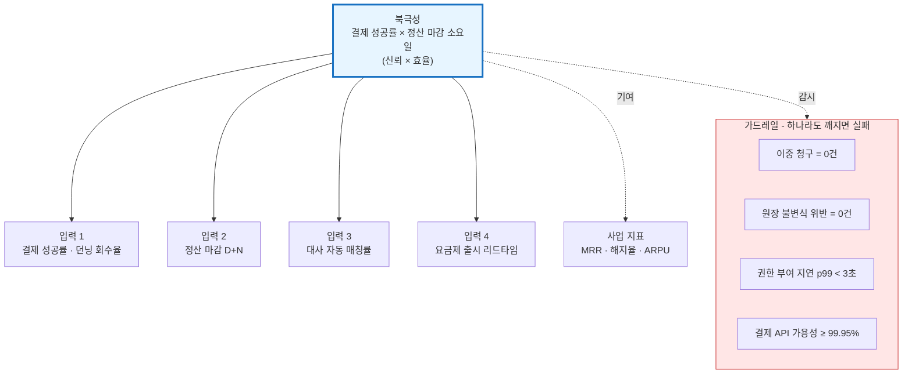
```mermaid
flowchart TD
    NS["북극성<br/>결제 성공률 × 정산 마감 소요일<br/>(신뢰 × 효율)"]

    NS --> I1["입력 1<br/>결제 성공률 · 던닝 회수율"]
    NS --> I2["입력 2<br/>정산 마감 D+N"]
    NS --> I3["입력 3<br/>대사 자동 매칭률"]
    NS --> I4["입력 4<br/>요금제 출시 리드타임"]

    NS -.기여.-> BIZ["사업 지표<br/>MRR · 해지율 · ARPU"]

    subgraph GR["가드레일 - 하나라도 깨지면 실패"]
        G1["이중 청구 = 0건"]
        G2["원장 불변식 위반 = 0건"]
        G3["권한 부여 지연 p99 < 3초"]
        G4["결제 API 가용성 ≥ 99.95%"]
    end

    NS -.감시.-> GR

    style NS fill:#e7f5ff,stroke:#1971c2,stroke-width:3px
    style GR fill:#ffe6e6,stroke:#c92a2a
```

### 12-2. 지표 정의표

| 지표 | 유형 | 정의 | 쿼리 |
|---|---|---|---|
| 결제 성공률 | 입력 | CAPTURED ÷ 전체 결제 시도 | `payment_attempt` 집계 |
| 던닝 회수율 | 입력 | PAST_DUE → ACTIVE 복귀 비율 | 상태 전이 로그 |
| 정산 마감 소요일 | 입력 | 월말 → CLOSED까지 일수 | `settlement_run` |
| 대사 자동 매칭률 | 입력 | 사람 개입 없이 매칭된 거래 비율 | `recon_diff` 역산 |
| 요금제 출시 리드타임 | 입력 | 기획 승인 → 판매 시작 | 어드민 로그 |
| **이중 청구** | 가드레일 | 동일 주기 2건 이상 CAPTURED (목표 0) | §6-2 |
| **원장 불변식 위반** | 가드레일 | 차변≠대변 전표 수 (목표 0) | §6-4 |
| 권한 부여 지연 | 가드레일 | 결제 완료 → 시청 가능 p99 | 애플리케이션 트레이스 |

### 12-3. 중단 기준

| 조건 | 조치 |
|---|---|
| 카나리 구간 **이중 청구 1건** | 즉시 100% 레거시 복귀. 사후 검토 필수 |
| 원장 불변식 위반 발생 | 신규 코어 쓰기 중단. 원인 규명 전 재개 금지 |
| 그림자 쓰기 결과가 기존과 **0.01% 이상 불일치** | 카나리 착수 금지 |
| 대사 자동 매칭률이 기존 수작업 정확도 미만 | 병행 운영 연장 |

> **"이중 청구 1건이면 롤백"이 과하다고 느껴질 수 있습니다. 과하지 않습니다.**
>
> 결제 사고는 확률이 아니라 **신뢰의 문제**입니다. 1건이 발생했다는 건 구조에 구멍이 있다는 뜻이고, 구멍은 반드시 커집니다.

---

## §13. 이 문서로 답할 수 있는 면접 질문

**Q. 결제/정산 시스템 재구축 경험이 있으십니까?** `★★★`

> **"야나두에서 커머스 개발실을 총괄하며 결제·정산 도메인을 직접 설계하고 팀과 함께 운영했습니다."**
>
> 매출이 직접 걸린 플랫폼이라 실수의 비용이 큰 도메인이었고, 그래서 원장과 멱등성을 기반으로 두는 설계 원칙이 몸에 배었습니다.
>
> 티빙은 SVOD에 광고형·건별 결제가 섞이고, IAP와 통신사 번들까지 들어오는 구조라 복잡도가 한 단계 위입니다. 다만 **풀어야 할 본질 — 이중 청구 방지, 재계산 가능한 정산, 채널 격리 — 은 같습니다.**

**Q. 결제 시스템에서 가장 중요한 게 뭐라고 보십니까?** `★★★`

> **"이중 청구를 구조적으로 불가능하게 만드는 것입니다."**
>
> 애플리케이션 락으로는 서버가 여러 대일 때 깨집니다. 저는 **멱등키에 유니크 제약을 걸고, 같은 키에는 저장된 응답을 그대로 반환**합니다(§7-1). 재시도가 와도 DB가 막습니다.
>
> 그리고 상태 컬럼을 진실로 믿지 않습니다. **append-only 원장에 복식부기로 기록**하고, 차변·대변 합이 0인지 매일 자동 검증합니다. 돈이 새면 다음 날 알림이 웁니다.

**Q. 정산에서 가장 자주 터지는 문제는?** `★★`

> **"과거를 재계산할 수 없다는 것입니다."**
>
> 정산 오류는 항상 몇 달 뒤에 발견되는데, 그때 필요한 건 **그 시점의 계약 조건**입니다. RS 규칙에 유효기간을 두지 않으면 최신 계약으로 계산하게 되고, 그건 틀린 답입니다(§5-2).
>
> 그리고 수정할 때 과거 전표를 고치면 안 됩니다. **조정 전표를 추가**해야 감사 추적이 남습니다. 회계의 기본인데 시스템에서 자주 빠집니다.

**Q. IAP(인앱결제)를 다뤄보셨나요?** `★★`

> **"스토어 수수료를 매출에서 빼면 안 된다는 것이 핵심입니다."**
>
> 총액을 매출로, 수수료를 비용으로 각각 원장에 기록해야 배급사 RS의 기준 금액(gross)이 맞습니다. 순매출로 기록하면 배급사에 덜 지급하게 되고, 이건 계약 위반입니다.
>
> 또 Apple·Google은 서버 알림을 **재전송**합니다. 핸들러가 멱등하지 않으면 구독 기간이 두 번 연장됩니다. `transaction_id`를 멱등키로 씁니다(§7-2).

**Q. 결제 시스템을 어떻게 무중단으로 교체하시겠습니까?** `★★`

> **"원장을 먼저 세우고, 그림자 쓰기로 검증한 뒤, 카나리로 넘깁니다."**
>
> 순서가 중요합니다. 원장 없이 코어를 바꾸면 **바꾼 게 맞는지 검증할 기준이 없습니다**. 그래서 1단계는 기존 결제를 건드리지 않고 원장에 병렬 기록만 합니다(§11-1).
>
> 2단계는 신규 코어에 요청을 복제하되 실제 PG는 호출하지 않고(dry-run) 계산 결과만 비교합니다. 0.01% 이상 어긋나면 카나리에 착수하지 않습니다.
>
> 그리고 카나리 구간에서 **이중 청구가 1건이라도 나오면 즉시 롤백**입니다. 이건 협상 대상이 아닙니다.

**Q. 해지율을 낮추려면 결제 플랫폼이 뭘 할 수 있죠?** `★★`

> **"던닝입니다. 해지의 상당 부분은 떠나고 싶어서가 아니라 카드가 안 됐는데 몰라서 생깁니다."**
>
> 결제 실패 사유를 정규화하고(한도 초과·카드 만료·일시 오류), 사유별로 재시도 타이밍과 안내 채널을 다르게 가져갑니다.
>
> 이건 A/B로 검증할 수 있는 영역이고, PAST_DUE → ACTIVE 회수율을 지표로 잡습니다(§12-1). 결제 플랫폼이 해지율에 **직접** 기여하는 거의 유일한 지점입니다.

---

## §14. 이 문서의 한계

| 한계 | 어떻게 다룰 것인가 |
|---|---|
| As-Is는 **추정**이다 | 부임 후 CS 티켓 분류·마감 소요·대사 이력 실측으로 대체 |
| 티빙의 실제 BM 조합(번들·제휴)을 모른다 | 통신사 번들·제휴 채널 구조는 부임 후 확인. 어댑터 설계는 그때 확정 |
| 광고 정산(AVOD/FAST)은 스케치 수준 | 광고 시스템은 별도 도메인. 이 문서는 **원장 연결점**만 정의 |
| 회계 기준(수익 인식 시점) 판단은 재무팀 소관 | 시스템은 재계산 가능성을 제공하고, 기준은 재무·감사와 합의 |

> **면접 마무리 문장**:
>
> "결제·정산은 화려한 도메인이 아닙니다. **틀리지 않는 게 전부인 도메인**입니다.
>
> 그래서 저는 여기서만큼은 속도보다 **검증 가능성**을 먼저 놓습니다. 원장을 먼저 세우자는 고집도 거기서 나옵니다."
