# 공통 어드민 · 플랫폼 이네이블먼트 — 목표 설계 (To-Be 초안)

> **작성 기준일**: 2026-07-10
>
> **목적**: TVING「Platform Product Lead」공고의 **주요업무 4번**(내부 고객 경험 향상 및 플랫폼 이네이블먼트 — 백오피스 도구와 가이드라인 정의)에 대한 목표 설계.
>
> **이 문서의 성격**: 티빙 현행을 진단한 문서가 **아닙니다.** **"제가 만든다면 이렇게 만들겠다"** 는 목표 아키텍처 제안입니다.
>
> **연계 문서**: [00_허브.md](00_허브.md) · [01_CMS.md](01_CMS.md) · [02_결제정산.md](02_결제정산.md) · [04_거버넌스_글로벌.md](04_거버넌스_글로벌.md) · 공고 분석

---

## §0. 용어 풀이

| 약어 | 원어 | 뜻 |
|---|---|---|
| **백오피스** | Back Office | 시청자가 아닌 **내부 구성원**이 쓰는 운영 도구 전체 |
| **이네이블먼트** | Enablement | 남들이 스스로 일할 수 있게 도구·가이드·권한을 갖춰주는 것 |
| **RBAC** | Role-Based Access Control | 역할에 권한을 붙이고, 사람에게 역할을 부여하는 방식 |
| **ABAC** | Attribute-Based Access Control | 속성(부서·지역·시간·데이터 등급)으로 접근을 판단하는 방식 |
| **PDP** | Policy Decision Point | 정책 결정 지점. "이 요청을 허용할까"를 판단하는 컴포넌트 |
| **SSO** | Single Sign-On | 한 번 로그인으로 여러 시스템을 쓰는 것 |
| **MFA** | Multi-Factor Authentication | 비밀번호 외에 추가 인증 수단을 요구하는 것 |
| **최소권한** | Least Privilege | 필요한 만큼만, 필요한 기간만 권한을 준다 |
| **JIT 권한** | Just-In-Time Access | 평소엔 권한이 없고, 필요할 때 승인받아 일시적으로 얻는 것 |
| **SoD** | Segregation of Duties | 직무 분리. 요청자와 승인자가 같은 사람이면 안 된다 |
| **PII** | Personally Identifiable Information | 개인식별정보. 이름·연락처·결제수단 등 |
| **마스킹** | Masking | 화면에 `010-****-1234`처럼 일부를 가려 보여주는 것 |
| **감사로그** | Audit Log | 누가·언제·무엇을·왜 했는지 남기는 변경 불가 기록 |
| **셀프서비스** | Self-service | 개발팀에 티켓을 넣지 않고 운영자가 스스로 처리하는 것 |
| **BFF** | Backend for Frontend | 화면 전용 API 계층. 여러 도메인 API를 화면 맞춤으로 조합 |
| **셸** | Admin Shell | 화면마다 안 바뀌는 **공통 프레임**. 공통 레이아웃(헤더·사이드바)·인증 가드·공통 컴포넌트·API 인터셉터 묶음. 도메인 화면들이 이 안에 꽂힌다 |
| **도메인 모듈** | — | 셸 안에 꽂히는 업무별 화면 (CMS 운영·결제·CS 등) |
| **로우코드** | Low-code | 코드를 거의 안 짜고 드래그로 화면을 조립하는 방식 (Retool 등) |
| **마이크로프런트엔드** | Micro Frontend (MFE) | 여러 팀이 각자 만든 화면(모듈)을 하나의 셸에 꽂아 합치는 프런트엔드 구조 |
| **피처 플래그** | Feature Flag | 배포와 노출을 분리해, 기능을 켜고 끄는 스위치 |
| **z-score** | — | 어떤 값이 평균에서 표준편차의 몇 배만큼 떨어져 있는지 |

---

## §1. 도메인 정의 — 공통 어드민은 CRUD 화면 모음이 아니다

### 1-1. 두 개의 목적, 하나의 시스템

> 공통 어드민의 존재 이유는 두 가지이고, 이 둘은 **자주 충돌**합니다.
>
> **① 효율** — 운영자가 개발팀 없이 스스로 일하게 한다 (셀프서비스).
>
> **② 통제** — 아무나 아무 데이터에나 접근하지 못하게 한다 (거버넌스).
>
> 효율만 좇으면 권한이 헐거워지고, 통제만 좇으면 아무도 일을 못 합니다. **이 긴장을 설계로 푸는 것**이 이 도메인의 본질입니다.

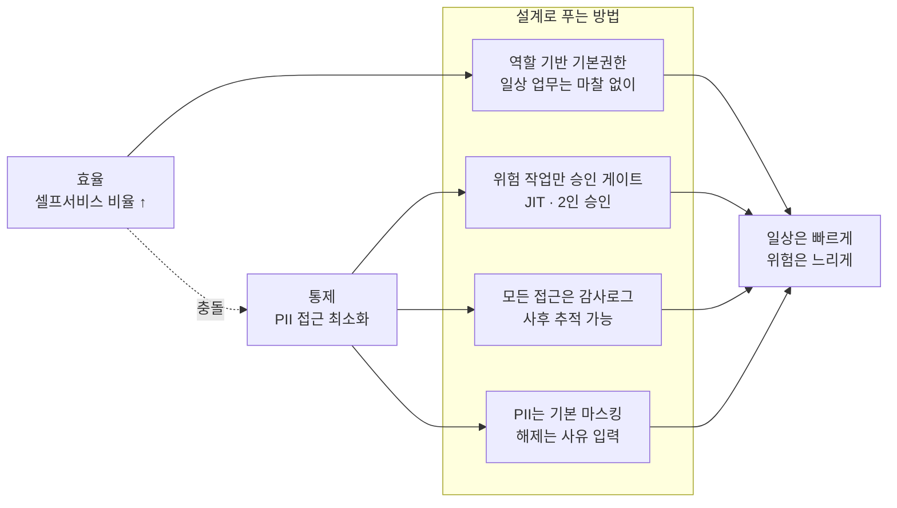

### 1-2. 내부 고객 페르소나

| 페르소나 | 주 업무 | 필요 권한 | 위험도 |
|---|---|---|---|
| **콘텐츠 운영자(MD)** | 메타 등록·검수·카탈로그 배치 | CMS 쓰기, PII 불필요 | 낮음 |
| **편성 담당** | EPG·FAST 채널 편성 | CMS 편성 쓰기 | 낮음 |
| **마케터** | 프로모션·쿠폰·요금제 | 결제 설정 쓰기, 집계 지표 읽기 | **중** (매출 영향) |
| **CS** | 결제 문의·환불 | 개인 결제 이력 **읽기**, 환불 실행 | **높음** (PII 접근) |
| **정산 담당** | 마감·대사·지급 | 원장 읽기, 조정전표 쓰기 | **높음** (금액 변경) |
| **데이터 분석가** | 지표·실험 분석 | 집계 데이터 읽기 (원본 PII 불필요) | 중 |
| **개발자** | 장애 대응·데이터 수정 | 운영 DB 접근 | **최상** (사실상 무제한) |

> **가장 위험한 페르소나는 개발자입니다.** 그리고 대부분의 조직에서 개발자 권한이 가장 느슨합니다.
>
> "장애 대응 때문에" 상시 운영 DB 접근권을 갖고 있는 구조는, 사고가 나면 **누가 무엇을 봤는지 아무도 모릅니다.**
>
> 해법은 권한을 뺏는 게 아니라 **JIT로 바꾸는 것**입니다 — 평소엔 없고, 필요할 때 사유와 함께 승인받아 2시간짜리 권한을 얻습니다.

### 1-3. 내부 도구가 반드시 푸는 여섯 가지 난제

> 티빙 현행에 대한 진단이 **아닙니다.** 규모가 커진 조직이라면 어디서나 마주치는 **보편의 난제**입니다.

| # | 난제 | 왜 어려운가 | 이 문서의 답 |
|---|---|---|---|
| **N1** | 계정·권한의 분산 | 시스템마다 계정이 따로면 온·오프보딩이 수작업 | §2-1 원칙 1, SSO |
| **N2** | 권한 팽창 | 권한을 주기만 하고 회수하지 않으면 모두가 모든 권한을 갖는다 | §3-2 결정 ①·② |
| **N3** | 뒷문(운영 DB 직접 접속) | 화면 권한을 아무리 잘 걸어도 우회 경로가 남는다 | §2-1 원칙 5, JIT + 세션 녹화 |
| **N4** | 정상 권한 내의 이상 행위 | 대량 유출은 **권한 있는 사람이 너무 많이 조회**하는 형태로 일어난다 | §3-2 결정 ④, §4-1 |
| **N5** | 직무 분리의 부재 | 요청자와 승인자가 같으면 통제가 없는 것과 같다 | §3-2 결정 ③ |
| **N6** | 셀프서비스의 부재 | 요금제 하나 바꾸려면 개발 티켓. 사업 속도 저하 | §2-1 원칙 3 |

> **N3와 N4는 함께 봐야 합니다.**
>
> 화면에 권한을 아무리 잘 걸어도 **운영 DB 직접 접속 경로가 열려 있으면 통제는 없는 것과 같습니다.** 어드민 개선은 반드시 뒷문을 닫는 일과 함께 가야 합니다.
>
> 그리고 뒷문을 닫아도, **권한 범위 안에서 비정상적으로 많이 조회**하는 행위는 권한 검사를 통과합니다. 건수와 패턴만이 이상을 드러냅니다.

---

## §2. To-Be 목표 아키텍처

### 2-1. 설계 원칙 여섯 가지

| # | 원칙 | 구체적으로 | 답하는 난제 |
|---|---|---|---|
| 1 | **하나의 문(門)** | 모든 어드민은 SSO 단일 진입. 계정은 하나, 권한은 역할로 | N1 |
| 2 | **권한은 데이터, 코드가 아니다** | 역할·권한 변경이 배포를 요구하지 않는다 | N2 |
| 3 | **일상은 빠르게, 위험은 느리게** | 저위험 작업은 마찰 0. 고위험 작업만 승인 게이트 | N5·N6 |
| 4 | **PII는 기본 마스킹, 해제는 사유와 함께** | 해제 자체가 감사 이벤트 | N4 |
| 5 | **뒷문을 닫는다** | 운영 DB 직접 접속을 JIT + 세션 기록으로 대체 | N3 |
| 6 | **감사로그는 append-only** | 지울 수 없는 별도 저장소. 어드민 자신도 못 지운다 | N4 |

### 2-2. 목표 구성도

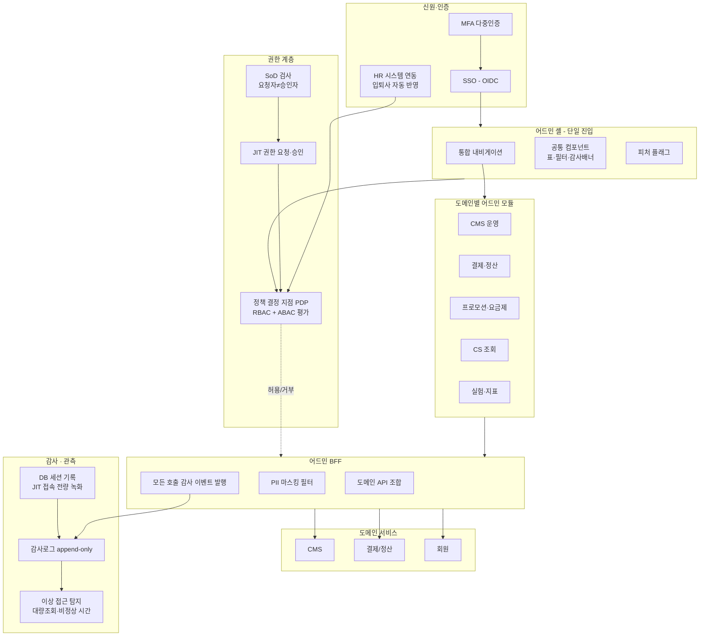

### 2-3. 이 구성도를 한 문장으로

> **"모든 요청이 하나의 문을 지나 정책 엔진의 판단을 받고, BFF에서 마스킹된 뒤, 지울 수 없는 감사로그를 남긴다."**
>
> 되돌리기 어려운 결정은 둘입니다 — **권한 모델의 형태**(§3)와 **감사로그를 어디에서 발행할 것인가**(§2-2의 B3).
>
> 감사를 각 화면이 알아서 하게 두면 반드시 한 화면이 빠뜨립니다. **BFF 한 곳에서 발행해야 빠질 수 없습니다.**

---

## §3. 데이터 모델 (ERD)

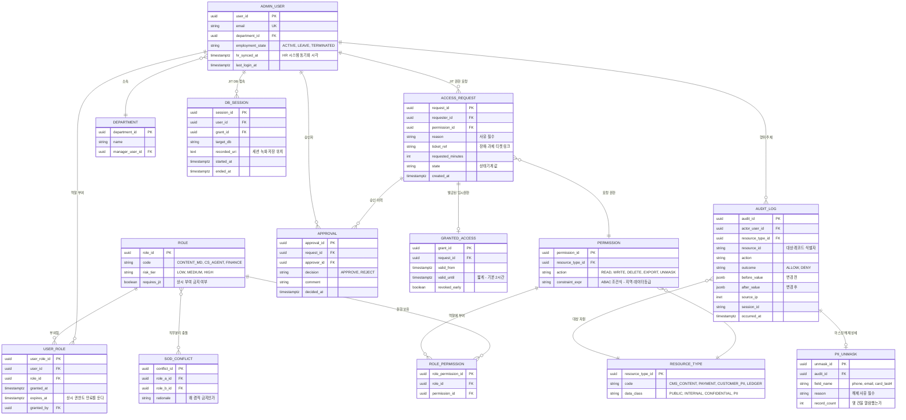

### 3-2. 설계 결정 네 가지

**① `USER_ROLE.expires_at` — 상시 권한에도 만료를 둔다 (난제 N2)**

권한은 주기만 하고 회수하지 않으면 **시간이 지날수록 모두가 모든 권한을 갖게 된다**(권한 팽창, privilege creep). 만료를 기본값으로 두면, 갱신하지 않은 권한은 자동으로 사라진다. 갱신은 관리자가 "이 사람에게 아직 필요한가"를 재확인하는 순간이 된다.

**② `ROLE.requires_jit` — 어떤 역할은 상시 부여 자체를 금지한다 (난제 N3)**

운영 DB 접근, PII 대량 조회, 정산 조정전표 같은 최고위험 권한은 **평소에 아무도 갖고 있지 않아야 한다.** 필요할 때 사유와 함께 요청하고, 2시간짜리로 받는다.

**③ `SOD_CONFLICT` — 겸직 금지 조합을 데이터로 명시 (난제 N5)**

"환불을 요청하는 사람과 승인하는 사람은 달라야 한다"는 규칙을 코드에 숨기지 않고 테이블에 둔다. 감사 대응 시 **"우리는 이런 직무분리 규칙을 갖고 있습니다"** 를 즉시 보여줄 수 있다.

**④ `PII_UNMASK.record_count` — 몇 건을 열람했는지 센다 (난제 N4)**

CS가 한 고객 문의를 처리하며 1건을 열람하는 것과, 누군가 하루에 5만 건을 열람하는 것은 완전히 다른 사건이다. **건수를 세지 않으면 그 차이를 발견할 수 없다.**

> **④번이 대량 유출을 조기에 잡는 거의 유일한 신호입니다.**
>
> 대부분의 대량 유출은 "권한이 있는 사람이 권한 범위 안에서 비정상적으로 많이 조회"하는 형태로 일어납니다. 권한 검사는 통과합니다. **건수와 패턴만이 이상을 드러냅니다.**

---

## §4. DB 샘플 쿼리

### 4-1. PII 대량 조회 탐지 (난제 N4)

```sql
-- 무엇을 답하는가: "평소보다 비정상적으로 많이 개인정보를 열람한 사람이 있는가"
-- 개인별 30일 평균과 비교해 이상치를 찾는다. 권한 검사는 통과한 접근들이다.
WITH daily AS (
    SELECT
        a.actor_user_id,
        DATE(a.occurred_at)          AS 일자,
        SUM(u.record_count)          AS 일_열람건수
    FROM audit_log a
    JOIN pii_unmask u ON u.audit_id = a.audit_id
    WHERE a.occurred_at >= NOW() - INTERVAL '30 days'
    GROUP BY 1, 2
),
stats AS (
    SELECT
        actor_user_id,
        AVG(일_열람건수)             AS 평균,
        STDDEV_POP(일_열람건수)      AS 표준편차
    FROM daily
    GROUP BY 1
)
SELECT
    au.email,
    d.일자,
    d.일_열람건수,
    ROUND(s.평균::numeric, 1)        AS 개인_평균,
    ROUND(((d.일_열람건수 - s.평균) / NULLIF(s.표준편차, 0))::numeric, 2) AS z_score
FROM daily d
JOIN stats s       ON s.actor_user_id = d.actor_user_id
JOIN admin_user au ON au.user_id      = d.actor_user_id
WHERE s.표준편차 > 0
  AND (d.일_열람건수 - s.평균) / s.표준편차 > 3   -- 평균 대비 3시그마 초과
ORDER BY z_score DESC;
```

> **z-score 3 초과**는 "이 사람의 평소 패턴에서 통계적으로 매우 이례적"이라는 뜻입니다.
>
> 절대 건수 임계값(예: 1000건)만 쓰면, 평소 5000건 보는 사람의 1000건은 못 잡고 평소 10건 보는 사람의 200건도 못 잡습니다. **개인별 기준선이 필요합니다.**

### 4-2. 권한 팽창 탐지 (난제 N2)

```sql
-- 무엇을 답하는가: "회수되지 않고 방치된 고위험 권한이 있는가"
SELECT
    au.email,
    d.name                                      AS 부서,
    r.code                                      AS 역할,
    r.risk_tier                                 AS 위험등급,
    ur.granted_at,
    ur.expires_at,
    CASE WHEN ur.expires_at IS NULL THEN '무기한'
         ELSE (ur.expires_at - NOW())::text END AS 잔여,
    au.last_login_at,
    NOW() - au.last_login_at                    AS 미사용_기간
FROM user_role ur
JOIN admin_user au ON au.user_id = ur.user_id
JOIN department d  ON d.department_id = au.department_id
JOIN role r        ON r.role_id = ur.role_id
WHERE r.risk_tier = 'HIGH'
  AND (
        ur.expires_at IS NULL                              -- 만료 없음
     OR au.last_login_at < NOW() - INTERVAL '60 days'      -- 60일 미사용
     OR au.employment_state <> 'ACTIVE'                    -- 퇴사·휴직자
  )
ORDER BY r.risk_tier, ur.granted_at;
```

### 4-3. 퇴사자 잔존 계정 (Quick Win)

```sql
-- 무엇을 답하는가: "퇴사했는데 아직 권한이 살아 있는 계정은?"
-- HR 동기화가 돌면 이 쿼리 결과는 항상 비어 있어야 한다.
SELECT
    au.email,
    au.employment_state,
    au.hr_synced_at,
    COUNT(ur.user_role_id)                      AS 잔존_역할수,
    ARRAY_AGG(r.code ORDER BY r.risk_tier DESC) AS 역할_목록,
    MAX(au.last_login_at)                       AS 마지막_로그인
FROM admin_user au
JOIN user_role ur ON ur.user_id = au.user_id
JOIN role r       ON r.role_id  = ur.role_id
WHERE au.employment_state = 'TERMINATED'
  AND (ur.expires_at IS NULL OR ur.expires_at > NOW())
GROUP BY au.email, au.employment_state, au.hr_synced_at
ORDER BY 잔존_역할수 DESC;
```

### 4-4. SoD 위반 — 겸직 금지 조합을 동시에 가진 사람 (난제 N5)

```sql
-- 무엇을 답하는가: "요청과 승인을 혼자 할 수 있는 사람이 있는가"
-- 감사에서 반드시 물어보는 질문. 답을 즉시 제시할 수 있어야 한다.
SELECT
    au.email,
    ra.code                     AS 역할_A,
    rb.code                     AS 역할_B,
    c.rationale                 AS 겸직금지_사유
FROM sod_conflict c
JOIN role ra ON ra.role_id = c.role_a_id
JOIN role rb ON rb.role_id = c.role_b_id
JOIN user_role ura ON ura.role_id = ra.role_id
JOIN user_role urb ON urb.role_id = rb.role_id
                  AND urb.user_id = ura.user_id      -- 같은 사람이 둘 다 보유
JOIN admin_user au ON au.user_id = ura.user_id
WHERE (ura.expires_at IS NULL OR ura.expires_at > NOW())
  AND (urb.expires_at IS NULL OR urb.expires_at > NOW())
ORDER BY au.email;
```

### 4-5. 셀프서비스 비율 — 어드민의 존재 이유를 재는 지표 (난제 N6)

```sql
-- 무엇을 답하는가: "운영 작업 중 개발팀 티켓 없이 처리된 비율은?"
-- 분모: 전체 운영 작업 / 분자: 어드민에서 완결된 작업
-- 티켓 시스템(Jira 등)에서 적재한 ops_ticket 테이블과 감사로그를 함께 본다.
WITH admin_ops AS (
    SELECT DATE_TRUNC('month', occurred_at) AS 월, COUNT(*) AS 어드민_처리
    FROM audit_log
    WHERE action IN ('WRITE', 'DELETE')
      AND outcome = 'ALLOW'
      AND occurred_at >= NOW() - INTERVAL '6 months'
    GROUP BY 1
),
dev_tickets AS (
    SELECT DATE_TRUNC('month', created_at) AS 월, COUNT(*) AS 개발_티켓
    FROM ops_ticket
    WHERE category = 'OPERATIONAL_DATA_CHANGE'
      AND created_at >= NOW() - INTERVAL '6 months'
    GROUP BY 1
)
SELECT
    a.월,
    a.어드민_처리,
    COALESCE(t.개발_티켓, 0)                AS 개발_티켓,
    ROUND(
        100.0 * a.어드민_처리 / NULLIF(a.어드민_처리 + COALESCE(t.개발_티켓, 0), 0)
    , 1)                                    AS 셀프서비스_비율_pct
FROM admin_ops a
LEFT JOIN dev_tickets t ON t.월 = a.월
ORDER BY a.월;
```

### 4-6. JIT 권한 사용 실태 — 뒷문이 닫혔는가 (난제 N3)

```sql
-- 무엇을 답하는가: "운영 DB 직접 접속이 JIT로 전환되고 있는가, 세션은 다 기록되는가"
SELECT
    DATE_TRUNC('month', s.started_at)                    AS 월,
    COUNT(*)                                             AS 접속_세션수,
    COUNT(*) FILTER (WHERE s.grant_id IS NOT NULL)       AS jit_승인_세션,
    COUNT(*) FILTER (WHERE s.grant_id IS NULL)           AS 상시권한_세션,
    COUNT(*) FILTER (WHERE s.recorded_uri IS NULL)       AS 미녹화_세션,
    ROUND(AVG(EXTRACT(EPOCH FROM (s.ended_at - s.started_at)) / 60)::numeric, 1) AS 평균_분
FROM db_session s
WHERE s.started_at >= NOW() - INTERVAL '6 months'
GROUP BY 1
ORDER BY 1;
```

> **`상시권한_세션`과 `미녹화_세션`이 0으로 수렴하는 것**이 이 로드맵의 성공 조건입니다.
>
> 두 컬럼이 0이 아니면, 화면 권한을 아무리 정교하게 만들어도 **뒷문이 열려 있는 것**입니다.

---

## §5. 서비스 흐름도 (시퀀스)

### 5-1. 시나리오 A — JIT 권한 요청과 2인 승인 (SoD)

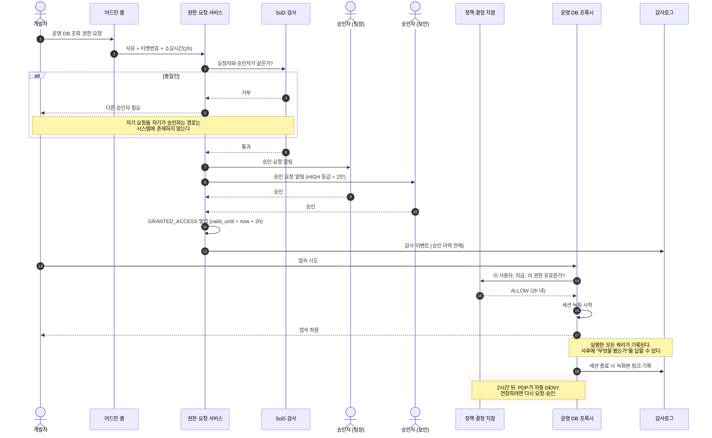

### 5-2. 시나리오 B — CS의 PII 조회 (마스킹 해제)

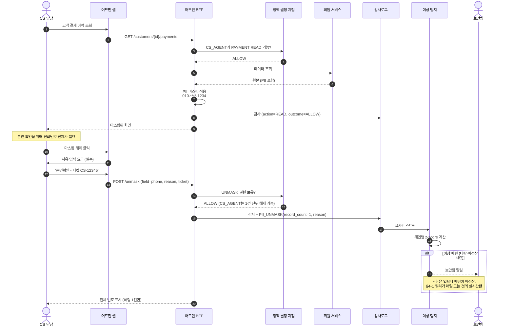

> **CS는 권한이 있습니다. 그래도 사유를 적습니다.**
>
> 사유 입력은 CS를 의심해서가 아니라, **사고가 났을 때 정당한 조회와 부당한 조회를 구분하기 위해서**입니다.
>
> 그리고 그 마찰은 1건 조회에서는 몇 초지만, 5만 건 조회를 시도하는 사람에게는 5만 번의 마찰이 됩니다. **정직한 사용자에게 싸고, 악의적 사용자에게 비싼 설계**입니다.

---

## §6. 상태 전이

### 6-1. JIT 권한 요청

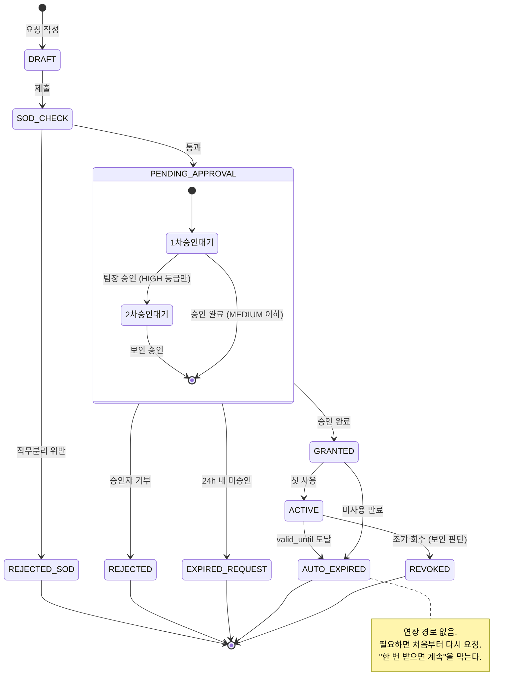

### 6-2. 계정 생명주기 (HR 연동)

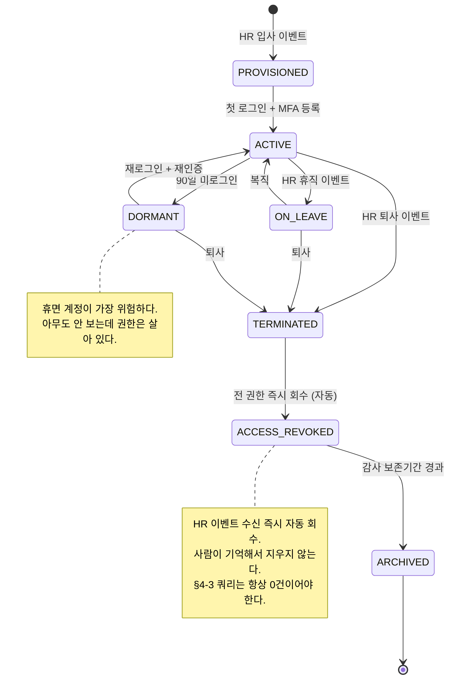

---

## §7. 동선 — 목표 상태

### 7-1. CS 담당자의 문의 처리 (To-Be)

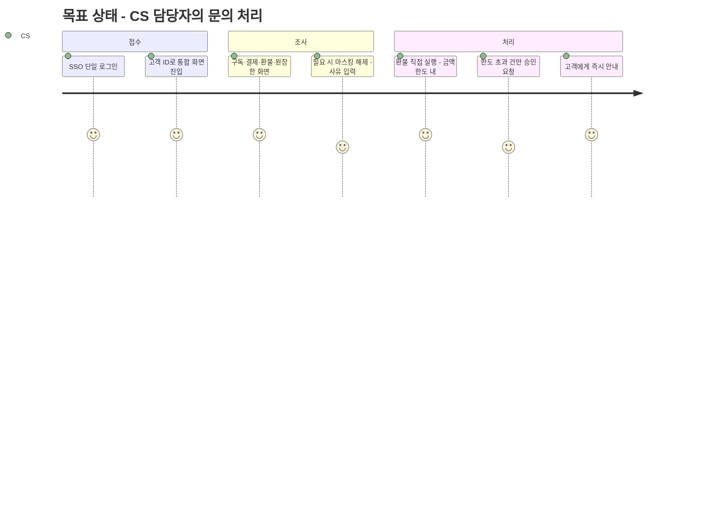

> **"마스킹 해제 - 사유 입력"이 4점(5점이 아님)인 것이 의도입니다.**
>
> 통제는 마찰을 만듭니다. 그 마찰을 0으로 만들려 해서는 안 됩니다. **최소화하되 없애지 않는 것**이 설계 목표입니다.

### 7-2. 어드민 정보구조 (IA) — 권한에 따라 보이는 것이 달라진다

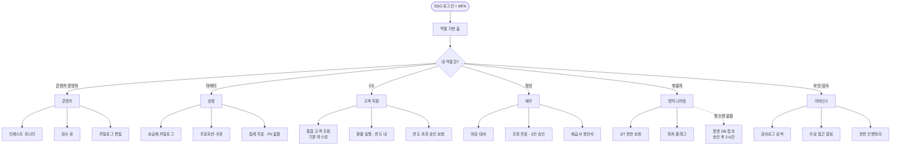

> **역할별로 아예 다른 홈을 본다는 게 핵심입니다.**
>
> 흔한 실수는 모두에게 같은 메뉴를 보여주고 클릭하면 "권한 없음"을 띄우는 것입니다. 그건 통제가 아니라 **좌절**입니다.
>
> **보이지 않으면 시도하지 않습니다.** 그리고 감사 로그에 DENY가 잔뜩 쌓이지 않아, 진짜 이상 신호가 묻히지 않습니다.

---

## §8. 솔루션 후보 비교

### 8-1. 인증·권한 (IdP + PDP)

| 후보 | 강점 | 약점 | 판단 |
|---|---|---|---|
| **Keycloak (OSS)** | 셀프호스팅, OIDC·SAML 완비, 무료 | 운영 부담, ABAC은 별도 설계 필요 | ✅ **채택 후보** |
| **AWS Cognito** | 관리형, AWS 통합 | 커스텀 클레임·조직 계층 표현이 빈약 | △ |
| **Okta / Auth0** | 성숙도 최고, 관리 편의 | 사용자당 과금 — 내부 직원 수백 명이면 부담 | △ |
| **자체 SSO** | 완전 통제 | 보안 취약점 리스크를 우리가 짊어짐 | ✕ |
| **정책 엔진: OPA (Open Policy Agent)** | 정책을 코드/데이터로 분리, ABAC 표현력 | 러닝커브 | ✅ **PDP로 채택** |

> **인증(누구인가)은 사고, 인가(무엇을 할 수 있나)는 만든다.**
>
> 인증은 표준(OIDC)이고 취약점 리스크가 크니 검증된 제품을 씁니다. 반면 **인가 정책은 우리 도메인 지식**입니다 — "정산 조정전표는 2인 승인", "CS는 1건 단위 마스킹 해제". 이건 아무도 대신 만들어주지 않습니다.
>
> 그래서 **Keycloak(인증) + OPA(정책 평가) + 자체 권한 모델(도메인)** 조합을 봅니다.

### 8-2. 어드민 UI

> **이 표는 "제품 A vs 제품 B" 비교가 아닙니다.**
>
> **"조립식 어드민 UI 제품을 사느냐(바이) vs React로 직접 만드느냐(빌드)"** 의 비교입니다. Retool·Forest Admin이 화면을 블록 쌓듯 만드는 조립식 어드민 제품이고, 아래에서 ✅로 고른 것은 **그 제품들을 쓰지 않고 직접 만드는 선택지**입니다. 그래서 마지막 행만 유독 제품 이름이 아닌 것입니다.

| 후보 | 정체 | 적합성 | 판단 |
|---|---|---|---|
| **Retool / Appsmith / Budibase** | 로우코드 어드민 빌더 (제품) | 빠른 프로토타입엔 최고. 마스킹·감사 같은 공통 통제를 강제하기 어려움 | △ (탐색·분석용 한정) |
| **Forest Admin / Directus** | DB 스키마 기반 자동 어드민 (제품) | CRUD엔 좋으나 도메인 워크플로우 표현 한계 | ✕ |
| **react-admin / Refine** | React 어드민 뼈대 (라이브러리) | 목록·폼·인증의 기본 틀 제공. 자체 셸의 **출발 뼈대**로 활용 가능 | ○ (셸 뼈대 후보) |
| **Backstage** | 플러그인 포털 프레임워크 | 여러 팀이 모듈을 꽂는 구조가 참고 가치 | ○ (아키텍처 참조) |
| **자체 개발** — React 기반 공통 셸 + 도메인 모듈 | 제품이 아니라 **직접 빌드** | 초기 비용 있으나 공통 통제를 구조로 보장 | ✅ **채택** |

#### "셸"이 무엇인가 — 낯선 제품명이 아니다

> **셸(shell)은 화면마다 안 바뀌는 공통 프레임입니다.**
>
> 공통 레이아웃(헤더·사이드바) + 로그인 처리(인증 가드) + 공통 컴포넌트(공용 표·마스킹 필드) + API 공통 처리(인터셉터)를 묶은 것입니다. React 앱에서 흔히 "공통 프레임 먼저 잡고 화면 붙이기"로 하던 바로 그 부분입니다.
>
> 건물에 비유하면 — **셸 = 1층 로비의 보안 게이트**(누구든 여기를 지나야 하고, 지나면 자동으로 기록된다), **도메인 모듈 = 각 층 사무실**(CMS·결제·CS 화면). 모두가 게이트를 반드시 지나므로, 개인정보 가리기·접근 기록을 화면이 깜빡할 수 없습니다.

#### 왜 제품을 사지 않고 직접 만드나 — 이유는 UI가 아니라 정책

> 마스킹·감사·권한 검사를 각 화면이 알아서 하게 두면 **반드시 한 화면이 빠뜨립니다.**
>
> 셸이 공통 컴포넌트로 이걸 강제해야 합니다. 조립식 제품(Retool 등)은 화면은 빨리 만들지만, 이 공통 통제를 구조로 강제하기 어렵습니다.

#### "자체 개발"은 처음부터 전부 만든다는 뜻이 아니다 — 3분할

| 무엇을 | 어떻게 | 왜 |
|---|---|---|
| **공통 셸 + 도메인 모듈** | **빌드** (React. react-admin·Backstage를 뼈대로 가능) | 마스킹·감사·권한을 구조로 강제 |
| **UI 프레임워크·컴포넌트** | **바이 / OSS** (React·표·차트 라이브러리) | 바퀴를 재발명하지 않음 |
| **PII 없는 분석·탐색 화면** | **로우코드** (Retool 등) | 샐 것이 없으니 빠른 게 이득 |

> 즉 직접 만드는 것은 **"공통 통제를 강제하는 껍데기(셸) 한 겹"뿐**입니다.
>
> React·컴포넌트 라이브러리는 사다 쓰고, react-admin·Backstage를 뼈대로 깔 수 있으며, 저위험 화면은 Retool로 빠르게 만듭니다. 빠르게 만들 수 있다는 게 통제를 우회할 이유는 아니라는 것 — 그 하나가 자체/로우코드를 가르는 기준입니다.

### 8-3. 감사·데이터 접근 통제

| 영역 | 후보 | 판단 |
|---|---|---|
| **감사로그 저장** | append-only 테이블 + S3 Object Lock 아카이브 | **빌드 + 바이** |
| **DB 접근 프록시** | Teleport / StrongDM / AWS SSM Session Manager | **바이** (세션 녹화가 핵심) |
| **이상 탐지** | 자체 z-score 룰 + SIEM 연동 | **하이브리드** |
| **DB 감사** | PostgreSQL `pgaudit` 확장 | **바이** |
| **PII 마스킹** | BFF 계층 자체 필터 | **빌드** (도메인 지식) |
| **비밀 관리** | HashiCorp Vault / AWS Secrets Manager | **바이** |

### 8-4. 빌드/바이 한눈에

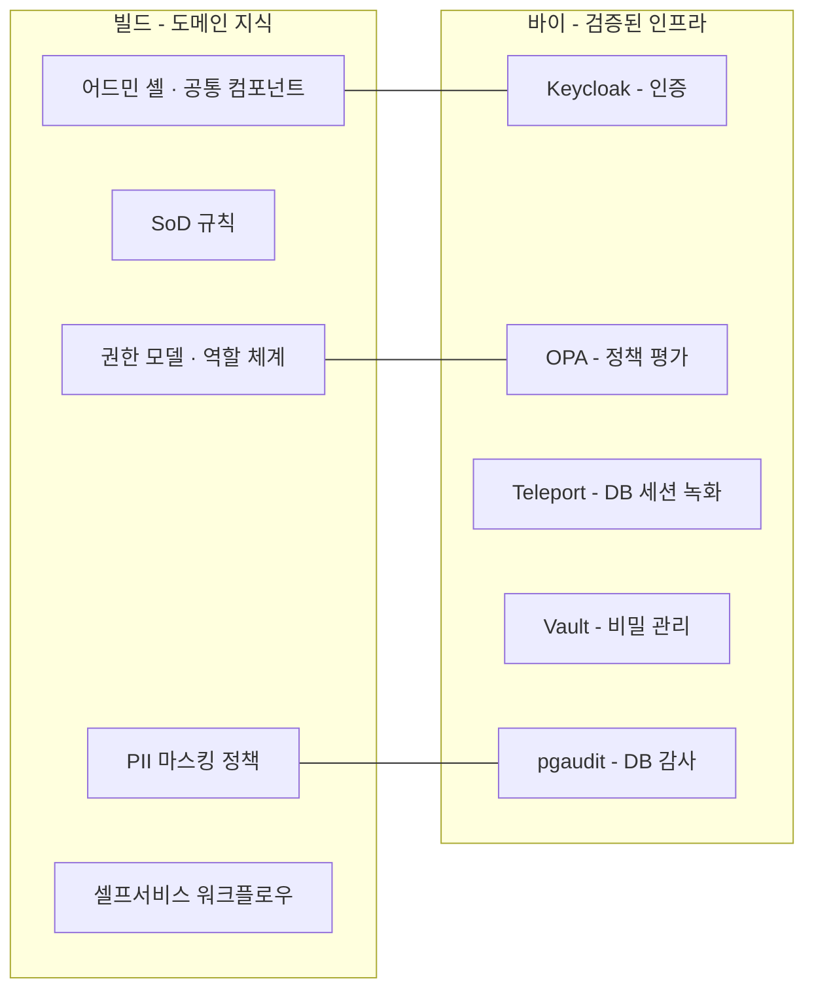

---

## §9. 실행 로드맵

### 9-1. Phase 0 — 첫 30일에 반드시 물어볼 질문 세 개

> **① "지난 90일간 회원 PII 테이블을 조회한 사람의 목록을 뽑아주실 수 있나요?"**
>
> 답이 "뽑을 수 없다"면, 그게 첫 번째 과제입니다.
>
> **② "지금 운영 DB에 직접 붙을 수 있는 계정이 몇 개인가요?"**
>
> 숫자가 두 자리를 넘으면 뒷문이 열려 있는 것입니다.
>
> **③ "지난 분기 개발 티켓 중 운영자가 스스로 처리할 수 있었어야 하는 건 몇 %인가요?"**
>
> 이 비율이 셀프서비스 로드맵의 크기를 결정합니다.

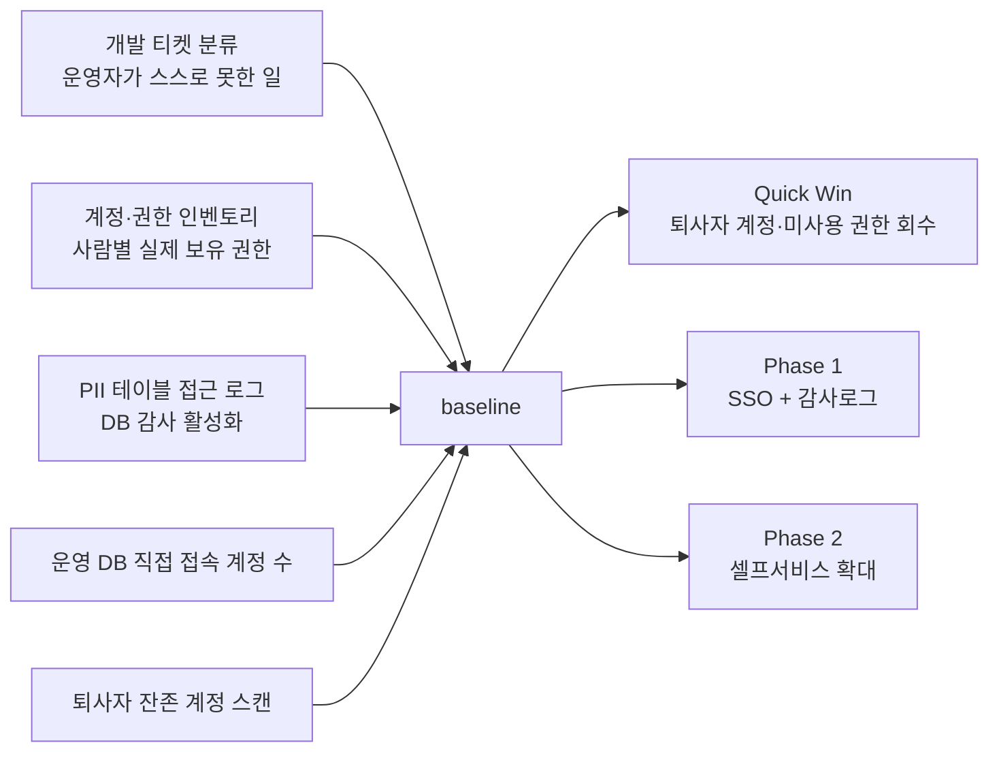

### 9-2. 순서의 논리

> **뒷문부터 닫습니다.**
>
> 화면 권한을 정교하게 만들어도 운영 DB 직접 접속이 열려 있으면 아무 의미가 없습니다. 그래서 **감사·JIT가 셀프서비스보다 먼저**입니다.
>
> 다만 통제만 조이면 조직이 반발합니다. 그래서 **Quick Win(퇴사자 계정 회수)으로 신뢰를 얻고**, 통제와 편의를 **같은 분기에** 함께 내놓습니다.

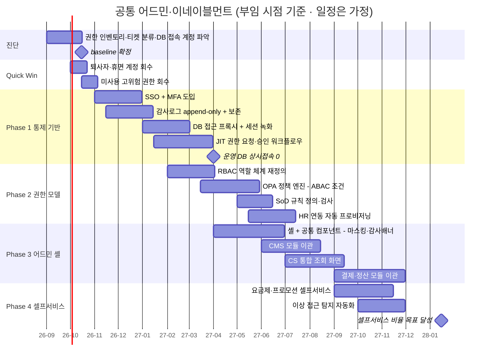

---

## §10. 성과지표

### 10-1. 지표 트리

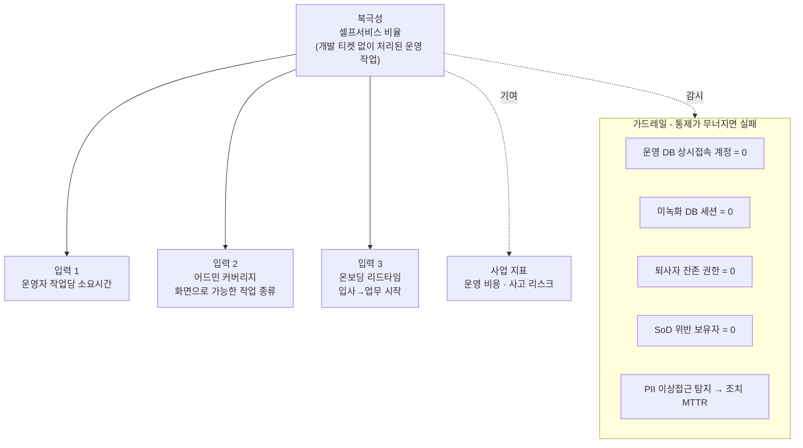

### 10-2. 지표 정의표

| 지표 | 유형 | 정의 | 쿼리 |
|---|---|---|---|
| **셀프서비스 비율** | 북극성 | 어드민 처리 ÷ (어드민 처리 + 운영 개발티켓) | §4-5 |
| 작업당 소요시간 | 입력 | 감사로그 세션 기준 작업 완결 시간 | 감사로그 |
| 어드민 커버리지 | 입력 | 화면으로 가능한 작업 종류 ÷ 전체 운영 작업 종류 | 수기 인벤토리 |
| 온보딩 리드타임 | 입력 | HR 입사일 → 첫 정상 업무 수행 | 계정 생명주기 |
| **운영 DB 상시접속** | 가드레일 | JIT 없이 접속 가능한 계정 수 (목표 0) | §4-6 |
| **퇴사자 잔존 권한** | 가드레일 | TERMINATED인데 유효 역할 보유 (목표 0) | §4-3 |
| **SoD 위반** | 가드레일 | 겸직 금지 조합 보유자 (목표 0) | §4-4 |
| PII 이상접근 MTTR | 가드레일 | 탐지 → 조치 완료 시간 | §4-1 + 인시던트 |

### 10-3. 중단 기준

| 조건 | 조치 |
|---|---|
| 셀프서비스 확대 후 **감사로그 누락 발견** | 해당 모듈 즉시 롤백. 감사 없는 편의는 없다 |
| 어드민 셸 이관 후 **DENY 로그 급증** | 역할 설계 오류. 이관 중단하고 권한 매핑 재검토 |
| JIT 도입 후 **장애 대응 MTTR 악화** | 승인 SLA(예: 15분) 도입. 통제가 사고를 키우면 안 됨 |
| PII 이상접근 알림의 **오탐률 50% 초과** | 임계값 재조정. 양치기 소년이 되면 아무도 안 본다 |

> **세 번째 조건이 중요합니다.**
>
> 보안 통제가 장애 대응을 막으면, 조직은 반드시 우회로를 만듭니다. **JIT는 빨라야 합니다.** 승인 SLA가 없는 JIT는 곧 무력화됩니다.

---

## §11. 이 문서로 답할 수 있는 면접 질문

**Q. 내부 플랫폼(어드민)의 성과는 어떻게 측정하죠? MAU 같은 게 없잖아요.** `★★★`

> **"내부 플랫폼의 화폐는 내부 고객의 시간입니다. 그래서 북극성은 셀프서비스 비율입니다."**
>
> 개발팀에 티켓을 넣지 않고 운영자가 스스로 완결한 작업의 비율이죠. 여기에 작업당 소요시간, 어드민 커버리지, 온보딩 리드타임을 입력 지표로 붙입니다(§10-1).
>
> 핵심은 이 지표들이 **처음엔 아예 없다**는 겁니다. 그래서 첫 일은 성공을 잴 자(尺)를 만드는 것 — 2~4주간 티켓을 분류하고 작업 로그를 계측해 baseline을 세우는 것입니다.

**Q. 내부 도구 보안을 어떻게 설계하시겠습니까?** `★★★`

> **"화면 권한보다 먼저 뒷문을 닫겠습니다."**
>
> 대부분의 조직에서 가장 큰 구멍은 어드민 화면이 아니라 **운영 DB 직접 접속**입니다. 상시 접속 계정이 몇 개인지, 지난 90일간 PII 테이블을 누가 조회했는지 — 이 두 질문에 답할 수 없다면 그게 첫 과제입니다(§9-1).
>
> 그리고 대량 유출은 대개 **권한 있는 사람이 권한 범위 안에서 비정상적으로 많이 조회**하는 형태로 일어납니다. 권한 검사는 통과하죠. 그래서 마스킹 해제 건수를 세고 개인별 기준선 대비 이상치를 탐지합니다(§4-1).
>
> 다만 통제만 조이면 조직이 우회로를 만듭니다. JIT 권한은 **빨라야** 합니다. 승인 SLA 없는 JIT는 곧 무력화됩니다.

**Q. 권한 설계를 어떻게 하시겠어요? RBAC입니까 ABAC입니까?** `★★`

> **"기본은 RBAC, 조건은 ABAC으로 얹습니다. 그리고 고위험 권한은 아예 상시 부여하지 않습니다."**
>
> 역할로 일상 업무의 마찰을 없애되, "어느 지역 데이터인가", "PII 등급인가" 같은 조건은 속성으로 평가합니다. 정책 평가는 OPA 같은 엔진에 맡기고, **정책 자체는 데이터로 둡니다** — 권한 변경이 배포를 요구하면 최소권한을 지킬 수 없으니까요.
>
> 그리고 상시 권한에도 만료를 겁니다. 만료가 없으면 시간이 지날수록 모두가 모든 권한을 갖게 됩니다(§3-2).

**Q. 셀프서비스를 늘리면 사고 위험도 늘지 않나요?** `★★`

> **"그래서 '일상은 빠르게, 위험은 느리게'로 나눕니다."**
>
> 요금제를 만드는 일과 정산 조정전표를 쓰는 일은 위험도가 다릅니다. 전자는 마찰 없이, 후자는 2인 승인과 SoD 검사를 겁니다.
>
> 그리고 모든 셀프서비스는 **감사로그를 전제**합니다. 감사 없는 편의는 제 로드맵에 없습니다 — 중단 기준에도 명시했습니다(§10-3).

**Q. 어드민을 Retool 같은 걸로 빨리 만들면 되지 않나요?** `★★`

> **"탐색·분석 영역에는 씁니다. 다만 PII가 흐르는 화면에는 쓰지 않습니다."**
>
> 이유는 UI가 아니라 정책입니다. 마스킹·감사·권한 검사 같은 횡단 관심사를 각 화면이 알아서 하게 두면 **반드시 한 화면이 빠뜨립니다.**
>
> 자체 어드민 셸이 공통 컴포넌트로 이걸 강제해야 합니다. 빠르게 만들 수 있다는 게 통제를 우회할 이유는 아니니까요(§8-2).

**Q. 이 통제들을 PM이 강제할 수 있나요? 개발팀이 반발할 텐데요.** `★★★`

> **"강제할 수 있느냐면 답은 '아니오'이고, 그게 정답입니다. PM에겐 명령권이 없고, 강제한 통제는 우회되는 순간 무너지니까요."**
>
> 그래서 제 일은 강제가 아니라 세 가지입니다. 첫째, **규제와 보안 조직을 명분으로 세웁니다** — 통제를 요구하는 주체를 저 개인이 아니라 ISMS-P·개인정보보호법과 감사 조직으로 바꿉니다. 저는 그들이 못 하던 실행 경로를 만들어줄 뿐입니다.
>
> 둘째, **반발 0짜리 Quick Win부터** 합니다 — 퇴사자 계정 회수 같은. 아무도 반대하지 않는 일에서 실적과 신뢰를 벌어, 어려운 싸움에 씁니다(§9-2).
>
> 셋째, 가장 반발이 큰 건 운영 DB 직접접속을 JIT로 바꾸는 일입니다. "장애 나면 즉시 붙어야 하는데 승인 기다리다 서비스 죽는다"가 개발팀의 진짜 대사죠. 여기선 통제를 **선물로 바꿉니다** — 승인 15분 SLA로 속도를 지켜주고(§10-3), 세션 기록을 개발자의 알리바이로 만듭니다. '당신 권한을 뺏는다'가 아니라 '사고 나도 당신이 의심받지 않게 해준다'로요.
>
> 통제만 조이면 우회로가 생깁니다(§12). 그래서 통제와 편의를 **같은 분기에** 함께 내놓는 게 제 로드맵의 원칙입니다.

---

## §12. 이 문서의 한계

| 한계 | 어떻게 다룰 것인가 |
|---|---|
| **현행을 모른다** | 이 문서는 진단이 아니라 **목표 초안**. 부임 후 권한 인벤토리·티켓 분류·DB 접속 계정 실측 |
| 티빙의 보안 조직·기존 통제 수준을 모른다 | 이미 갖춰진 통제가 있을 수 있음. 진단이 먼저 |
| 컴플라이언스(ISMS-P 등) 요구를 상세히 모른다 | 보안·법무와 협의해 통제 항목을 매핑 |
| 조직의 통제 수용도를 모른다 | 통제만 조이면 우회로가 생긴다. Quick Win으로 신뢰를 먼저 얻는다 |

> **면접 마무리 문장**:
>
> "보안 사고에 대해 제가 밖에서 원인을 추정할 생각은 없습니다.
>
> 다만 **플랫폼 리더로서 제가 책임질 수 있는 건 구조**입니다. 누가 무엇을 봤는지 답할 수 있는 시스템, 뒷문이 닫힌 시스템, 이상 패턴이 사람보다 먼저 알아채는 시스템 — 그걸 만드는 게 제 일이라고 생각합니다."
