# 플랫폼 거버넌스 · 멀티테넌트 · 글로벌 확장 — 프로덕트 로드맵

> **작성 기준일**: 2026-07-09
>
> **목적**: TVING「Platform Product Lead」공고의 **주요업무 3번**(비즈니스 스케일업을 위한 플랫폼 거버넌스 및 기능 모듈화)과 **5번**(플랫폼 성과 지표 정의 및 PM 조직 빌딩)에 대한 실행 설계. 우대사항인 **멀티 테넌트·글로벌 플랫폼**에 정면 대응한다.
>
> **⚠️ 솔직한 전제**: 멀티테넌트·글로벌은 작성자의 **사례가 가장 얇은 영역**입니다. 이 문서는 "해봤다"가 아니라 **"이렇게 판단하겠다"** 는 설계 논리를 담습니다. 과장하지 않습니다.
>
> **연계 문서**: [00_허브.md](00_허브.md) · [01_CMS.md](01_CMS.md) · [02_결제정산.md](02_결제정산.md) · [03_공통어드민.md](03_공통어드민.md)
>
> **참조 학습노트**: [글로벌 OTT 플랫폼](../../learning/글로벌_OTT_플랫폼.md) · [글로벌 서비스 전략](../../learning/글로벌_서비스_전략.md) · [번역관리 TMS 비교](../../learning/번역관리_TMS_솔루션_비교.md) · [플랫폼 성과지표](../../learning/플랫폼_성과지표.md)

---

## §0. 용어 풀이

| 약어 | 원어 | 뜻 |
|---|---|---|
| **테넌트** | Tenant | 하나의 플랫폼을 나눠 쓰는 독립 단위. 국가·브랜드·파트너 |
| **멀티테넌시** | Multi-tenancy | 하나의 시스템이 여러 테넌트를 격리해 동시에 서비스하는 구조 |
| **거버넌스** | Governance | 여러 사업이 한 플랫폼을 안전하게 나눠 쓰게 하는 규칙과 절차 |
| **모듈화** | Modularization | 기능을 경계가 분명한 단위로 나누는 것 |
| **바운디드 컨텍스트** | Bounded Context | 하나의 도메인 모델이 일관되게 통하는 경계 (DDD 개념) |
| **API 계약** | API Contract | 제공자와 소비자가 합의한 인터페이스 명세. 깨면 안 되는 약속 |
| **컨트랙트 테스트** | Contract Test | 계약이 깨졌는지 자동으로 검증하는 테스트 (Pact 등) |
| **골든 패스** | Golden Path | 팀이 따라가면 자연스럽게 잘하게 되는, 플랫폼이 깔아둔 표준 경로 |
| **콘웨이의 법칙** | Conway's Law | 시스템 구조는 그것을 만든 조직의 소통 구조를 닮는다 |
| **역콘웨이 기동** | Inverse Conway Maneuver | 원하는 아키텍처를 얻기 위해 조직 구조를 먼저 바꾸는 것 |
| **지역 제한** | Geo-blocking | 라이선스에 따라 특정 국가에서만 콘텐츠를 볼 수 있게 하는 것 |
| **데이터 레지던시** | Data Residency | 특정 국가의 데이터를 그 국가 안에 보관해야 하는 규제 요구 |
| **i18n / l10n** | Internationalization / Localization | 다국어를 담을 수 있게 만드는 것 / 실제 언어·문화에 맞추는 것 |
| **TMS** | Translation Management System | 번역 발주·관리·품질을 다루는 시스템 |
| **엣지** | Edge | 사용자 가까이에 있는 서버·CDN 노드 |
| **북극성 지표** | North Star Metric | 조직이 함께 바라보는 단 하나의 핵심 성공 지표 |

---

## §1. 도메인 정의 — 거버넌스는 "규칙"이 아니라 "확장 능력"이다

### 1-1. 왜 지금 거버넌스인가

> 공고의 표현은 **"비즈니스 스케일업을 위한 플랫폼 거버넌스 및 기능 모듈화"** 입니다.
>
> 여기서 중요한 건 **"스케일업을 위한"** 이라는 목적절입니다. 거버넌스는 통제를 위한 게 아니라, **새 사업을 얹을 때 전체를 다시 만들지 않기 위한** 것입니다.
>
> 새 국가, 새 브랜드, 새 파트너를 붙일 때마다 코어를 뜯어야 한다면 — 그건 거버넌스가 없는 것입니다.

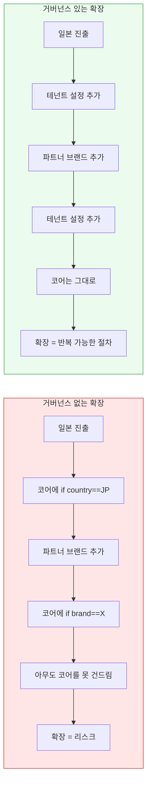

### 1-2. 세 가지 관심사를 분리한다

| 관심사 | 질문 | 이 문서의 절 |
|---|---|---|
| **모듈 거버넌스** | 누가 무엇을 소유하고, 어떻게 바꾸는가 | §4-2, §7-2 |
| **멀티테넌시** | 국가·브랜드를 어떻게 격리하는가 | §5, §10-1 |
| **글로벌 확장** | 언어·규제·라이선스·인프라를 어떻게 다루는가 | §7-1, §9-1 |

---

## §2. As-Is 가설 — 단일 테넌트로 자란 시스템

> **⚠️ 가설입니다.** 티빙은 국내 시장에서 성장한 서비스이므로, 대부분의 국내 OTT가 그렇듯 **단일 테넌트를 전제로 자랐을 가능성**이 높습니다. 이건 잘못이 아니라 **당시로선 옳은 선택**이었습니다.

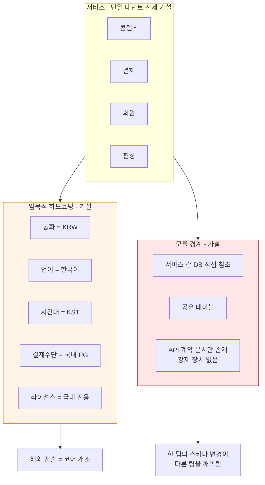

### 2-1. 문제

| # | 문제 | 왜 아픈가 |
|---|---|---|
| P1 | **테넌트 개념이 데이터 모델에 없다** | 국가 추가가 스키마 변경 |
| P2 | **통화·시간대·언어가 암묵 상수** | 코드 전역에 흩어져 찾기 어려움 |
| P3 | **모듈 간 DB 직접 참조** | 경계가 없으니 변경이 전파됨 |
| P4 | **API 계약이 문서에만 있다** | 깨져도 배포 시점에 모름 |
| P5 | **지역 제한이 애플리케이션 로직** | 라이선스 위반 노출 위험 |
| P6 | **모듈 소유권이 불명확** | "이 API 누가 관리해요?"에 답이 없음 |

> **P3와 P6은 같은 문제의 두 얼굴입니다.**
>
> 콘웨이의 법칙 — **시스템 구조는 조직의 소통 구조를 닮습니다.** 소유권이 불명확하면 경계도 흐려집니다.
>
> 그래서 모듈화는 기술 과제가 아니라 **조직 과제**이기도 합니다(§12-4).

---

## §3. 검증 설계

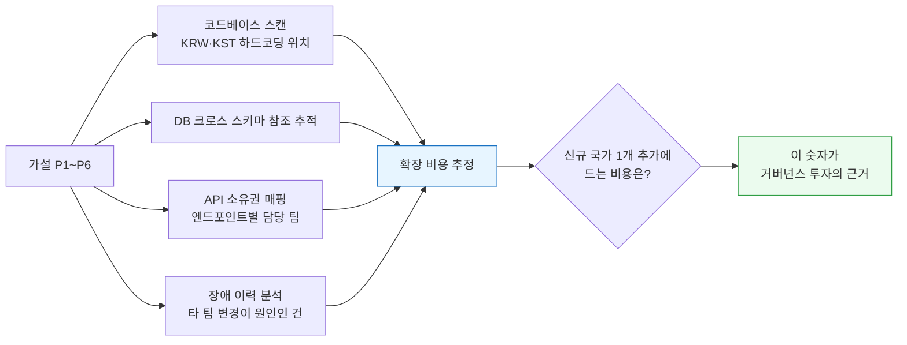

> **경영진을 설득하는 숫자는 "거버넌스가 좋다"가 아닙니다.**
>
> **"지금 구조로 일본에 진출하면 코어 개조에 N개월, 이후 국가마다 다시 N개월. 테넌트 구조를 넣으면 첫 국가에 N+2개월, 이후 국가마다 2주."**
>
> 이 비교표가 투자 결정을 만듭니다. 손익분기점은 **두 번째 국가**입니다.

---

## §4. To-Be — 모듈 거버넌스

### 4-1. 설계 원칙

| # | 원칙 | 구체적으로 |
|---|---|---|
| 1 | **모든 모듈에 단일 소유 팀이 있다** | 주인 없는 코드는 곧 아무도 안 고치는 코드 |
| 2 | **모듈 간 소통은 API로만** | DB 직접 참조 금지. 경계가 곧 계약 |
| 3 | **계약은 테스트로 강제한다** | 문서는 지켜지지 않는다. CI가 막아야 지켜진다 |
| 4 | **깨는 변경에는 절차가 있다** | 버전·유예기간·소비자 통보 |
| 5 | **테넌트는 데이터, 코드가 아니다** | 국가 추가가 배포를 요구하지 않는다 |
| 6 | **모듈화는 조직 규모가 정당화할 때만** | 과도한 분산은 독. MSA는 목표가 아니라 도구 |

> **6번을 잊으면 안 됩니다.**
>
> 저는 BTV NCMS를 MSA로 분해하며 도메인별 독립 확장·배포·장애 격리의 이점을 경험했습니다. 동시에 **분산이 만드는 운영 복잡도**도 봤습니다.
>
> 모듈 경계는 **조직 규모와 트래픽이 정당화할 때만** 그어야 합니다. 6명 팀이 12개 마이크로서비스를 운영하면, 그건 아키텍처가 아니라 형벌입니다.

### 4-2. 모듈 소유권 지도

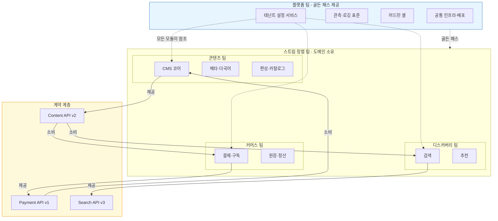

> **플랫폼 팀은 규칙을 강제하는 조직이 아니라 "쉬운 길을 까는" 조직입니다.**
>
> 표준을 따르는 게 안 따르는 것보다 **편해야** 지켜집니다. 관측·배포·인증을 플랫폼이 제공하면, 팀들은 자연히 그 길로 갑니다.
>
> 규칙으로 막는 건 최후의 수단이고, 그마저도 **CI 테스트**여야 합니다. 회의체가 아니라.

---

## §5. 데이터 모델 — 테넌트와 모듈 레지스트리

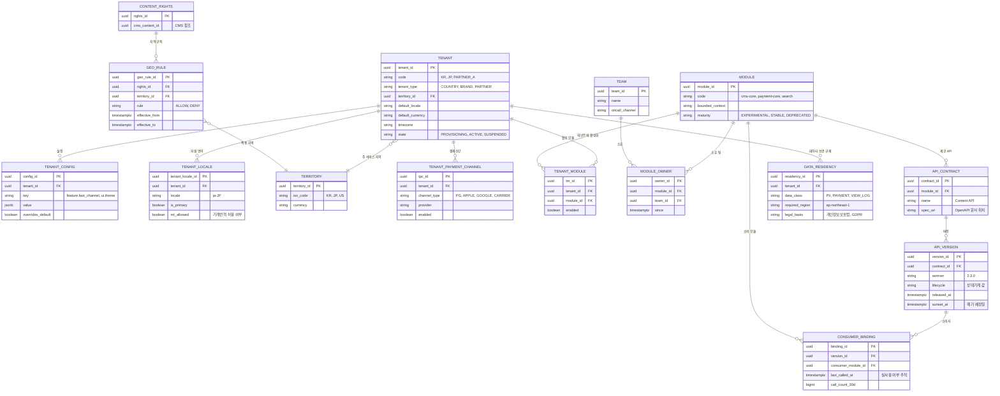

### 5-2. 설계 결정 4가지

**① `TENANT_CONFIG`를 key-value + `overrides_default`로**

테넌트마다 다른 건 무한히 늘어난다. 컬럼으로 두면 국가 하나 추가할 때마다 스키마가 바뀐다. **키-값 + 기본값 오버라이드** 구조면 새 설정은 행 삽입이다.

**② `CONSUMER_BINDING.last_called_at` — 계약을 실제로 누가 쓰는지 센다**

"이 API v1을 폐기해도 되나요?"라는 질문에 문서로는 답할 수 없다. **호출 로그로만** 답할 수 있다. 30일간 호출이 0이면 폐기 후보다.

**③ `DATA_RESIDENCY` — 규제를 데이터로 명시**

일본 진출 시 어떤 데이터를 일본 리전에 둬야 하는지는 법의 문제다. 이걸 코드 주석이 아니라 **테이블에 두면**, 배포 파이프라인이 검증할 수 있다.

**④ `GEO_RULE`에 `effective_from/to` — 지역 제한도 시간의 함수다**

라이선스는 "일본에서 2027년 3월까지"처럼 지역과 기간이 함께 온다. [01_CMS.md](01_CMS.md)의 `RIGHTS_WINDOW`와 짝을 이룬다.

> **②번이 거버넌스의 실체입니다.**
>
> 거버넌스는 회의체나 문서가 아니라 **"누가 무엇을 쓰는지 아는 것"** 입니다. 그걸 알아야 안전하게 바꿀 수 있습니다.

---

## §6. DB 샘플 쿼리

### 6-1. API 폐기 가능성 — 아직 쓰는 사람이 있는가

```sql
-- 무엇을 답하는가: "이 API 버전을 폐기해도 안전한가? 아직 부르는 모듈은?"
-- 문서가 아니라 호출 로그로 판단한다.
SELECT
    m.code                                      AS 제공_모듈,
    ac.name                                     AS api,
    av.semver                                   AS 버전,
    av.lifecycle,
    av.sunset_at                                AS 폐기_예정,
    cm.code                                     AS 소비_모듈,
    t.name                                      AS 소비_팀,
    cb.call_count_30d                           AS 최근30일_호출,
    cb.last_called_at
FROM api_version av
JOIN api_contract ac      ON ac.contract_id = av.contract_id
JOIN module m             ON m.module_id    = ac.module_id
LEFT JOIN consumer_binding cb ON cb.version_id = av.version_id
LEFT JOIN module cm       ON cm.module_id   = cb.consumer_module_id
LEFT JOIN module_owner mo ON mo.module_id   = cm.module_id
LEFT JOIN team t          ON t.team_id      = mo.team_id
WHERE av.lifecycle IN ('DEPRECATED', 'SUNSET_ANNOUNCED')
ORDER BY av.sunset_at, cb.call_count_30d DESC NULLS LAST;
```

### 6-2. 지역 제한 위반 — 라이선스 없는 지역에 노출 중인가

```sql
-- 무엇을 답하는가: "지금 이 순간 계약상 금지된 지역에 노출되는 콘텐츠가 있는가"
-- 결과가 1건이라도 나오면 즉시 인시던트. 법무 리스크.
SELECT
    tn.code                     AS 테넌트,
    tr.iso_code                 AS 지역,
    cr.cms_content_id           AS 콘텐츠,
    g.rule,
    g.effective_from,
    g.effective_to
FROM tenant tn
JOIN territory tr        ON tr.territory_id = tn.territory_id
JOIN tenant_module tm    ON tm.tenant_id    = tn.tenant_id
JOIN content_rights cr   ON TRUE
LEFT JOIN geo_rule g     ON g.rights_id     = cr.rights_id
                        AND g.territory_id  = tr.territory_id
                        AND g.effective_from <= NOW()
                        AND (g.effective_to IS NULL OR g.effective_to > NOW())
WHERE tn.state = 'ACTIVE'
  AND (
        g.geo_rule_id IS NULL      -- 허용 규칙이 아예 없음 = 기본 거부여야 함
     OR g.rule = 'DENY'            -- 명시적 금지인데 노출 중
  );
```

> **`g.geo_rule_id IS NULL`을 위반으로 잡는 게 핵심입니다.**
>
> 지역 제한은 **기본 거부(deny by default)** 여야 합니다. "허용 규칙이 없으면 허용"으로 만들면, 신규 국가를 열 때 전 카탈로그가 노출됩니다.

### 6-3. 테넌트별 확장 비용 — 하드코딩 잔재 추적

```sql
-- 무엇을 답하는가: "테넌트별로 설정이 아니라 코드로 처리되는 부분이 얼마나 남았는가"
-- overrides_default = false 이면서 값이 기본값과 다르면, 코드에 분기가 있다는 신호.
SELECT
    t.code                                      AS 테넌트,
    COUNT(*) FILTER (WHERE c.overrides_default) AS 설정으로_처리,
    COUNT(*) FILTER (WHERE NOT c.overrides_default) AS 기본값_사용,
    ARRAY_AGG(c.key) FILTER (WHERE c.overrides_default) AS 오버라이드_목록
FROM tenant t
LEFT JOIN tenant_config c ON c.tenant_id = t.tenant_id
WHERE t.state = 'ACTIVE'
GROUP BY t.code
ORDER BY 설정으로_처리 DESC;
```

### 6-4. 다국어 준비도 — 신규 국가 런칭 게이트

```sql
-- 무엇을 답하는가: "일본 런칭에 필요한 메타 번역이 몇 % 준비됐는가"
-- 런칭 여부를 감이 아니라 커버리지로 결정한다.
WITH target AS (
    SELECT tl.tenant_id, tl.locale
    FROM tenant_locale tl
    JOIN tenant t ON t.tenant_id = tl.tenant_id
    WHERE t.code = 'JP' AND tl.is_primary
),
publishable AS (   -- 해당 테넌트에서 노출 예정인 콘텐츠 (CMS 권리 윈도우 기준)
    SELECT DISTINCT cr.cms_content_id
    FROM content_rights cr
    JOIN geo_rule g ON g.rights_id = cr.rights_id AND g.rule = 'ALLOW'
    JOIN territory tr ON tr.territory_id = g.territory_id AND tr.iso_code = 'JP'
    WHERE g.effective_from <= NOW()
      AND (g.effective_to IS NULL OR g.effective_to > NOW())
)
SELECT
    (SELECT locale FROM target)                             AS 대상_언어,
    COUNT(*)                                                AS 노출예정_콘텐츠,
    COUNT(*) FILTER (WHERE cm.approved)                     AS 번역_승인완료,
    COUNT(*) FILTER (WHERE cm.meta_id IS NOT NULL AND NOT cm.approved) AS 초벌만_존재,
    COUNT(*) FILTER (WHERE cm.meta_id IS NULL)              AS 번역_없음,
    ROUND(100.0 * COUNT(*) FILTER (WHERE cm.approved) / NULLIF(COUNT(*), 0), 1) AS 커버리지_pct
FROM publishable p
LEFT JOIN content_meta cm
       ON cm.content_id = p.cms_content_id
      AND cm.locale     = (SELECT locale FROM target);
```

> **런칭 게이트를 "커버리지 95% 이상"처럼 숫자로 걸어두면**, "일정이 급하니 그냥 열자"는 압력에 데이터로 답할 수 있습니다.

---

## §7. 서비스 흐름도

### 7-1. 시나리오 A — 신규 국가(테넌트) 온보딩

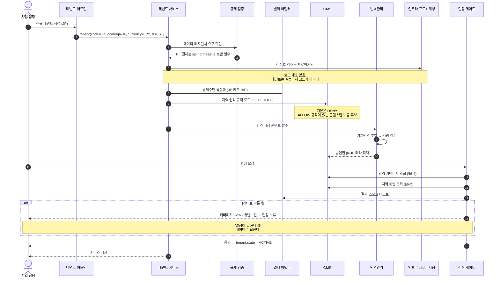

> **온보딩 전체에 코드 배포가 한 번도 없다는 게 핵심입니다.**
>
> 첫 국가는 어렵습니다. 두 번째부터는 **설정 작업**이어야 합니다. 그게 §3에서 말한 손익분기점입니다.

### 7-2. 시나리오 B — API 깨는 변경(Breaking Change) 절차

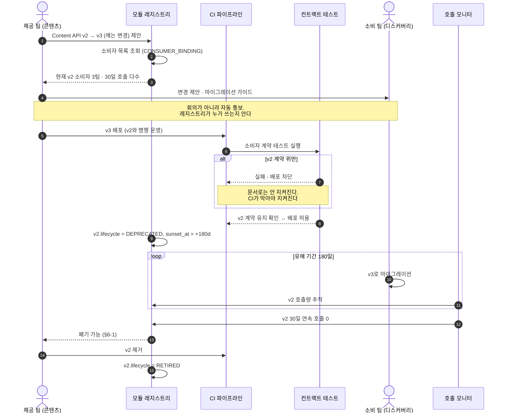

> **"유예기간 180일"과 "30일 연속 호출 0"이 이 절차의 전부입니다.**
>
> 나머지는 자동화입니다. **거버넌스를 회의체로 만들면 아무도 안 지킵니다.** 레지스트리와 CI가 지키게 해야 합니다.

---

## §8. 상태 전이

### 8-1. API 버전 생명주기

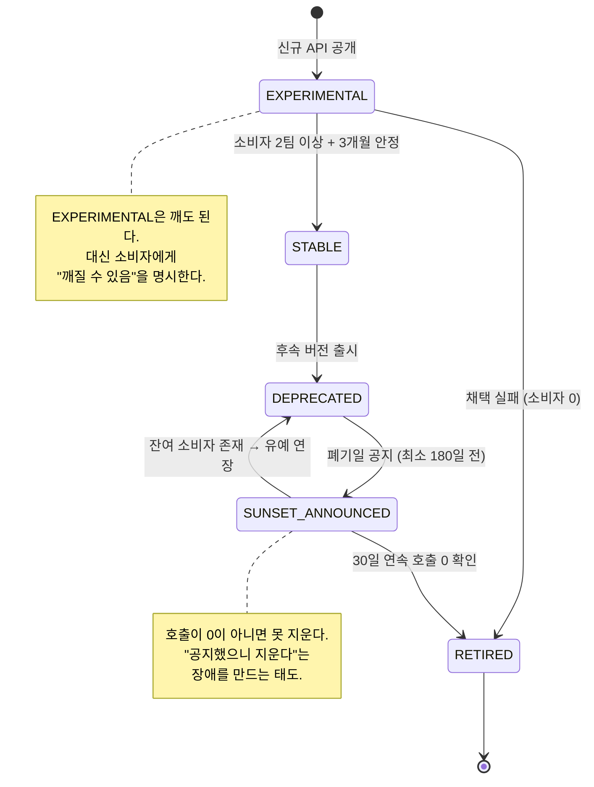

### 8-2. 테넌트 생명주기

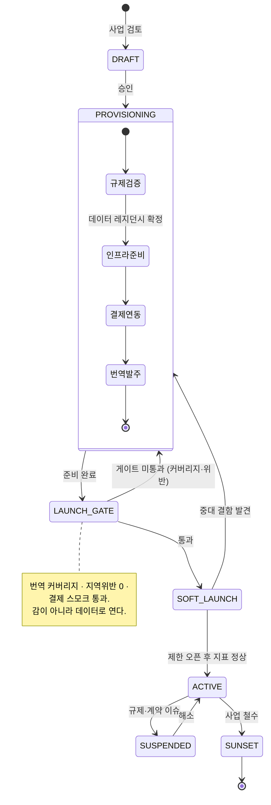

---

## §9. 동선

### 9-1. 사업 담당자의 신규 국가 런칭

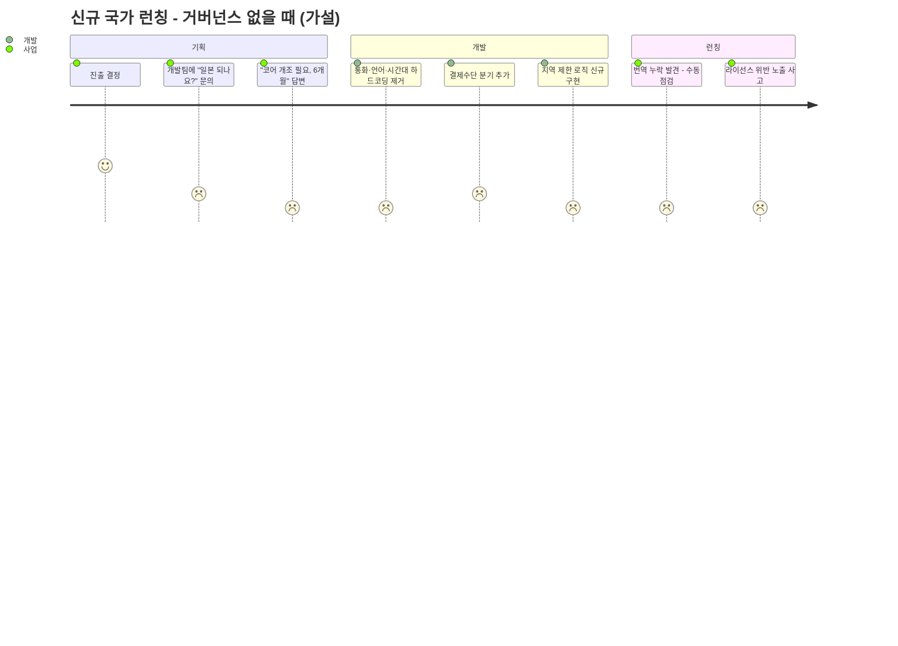

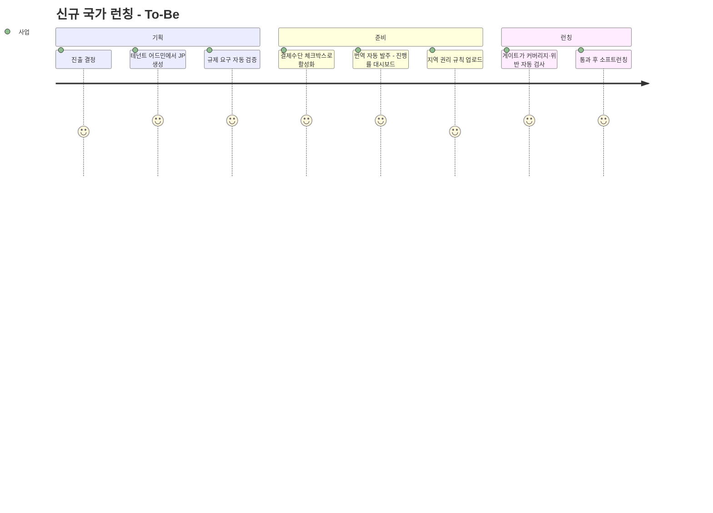

### 9-2. 개발팀의 골든 패스

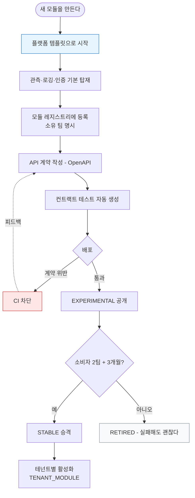

> **`D5 — RETIRED, 실패해도 괜찮다`가 이 다이어그램에서 가장 중요합니다.**
>
> EXPERIMENTAL 단계를 두는 이유는 **실패를 싸게 만들기 위해서**입니다. 모든 API가 영원히 살아야 한다면 아무도 새 API를 만들지 않습니다.

---

## §10. 솔루션 후보 비교

### 10-1. 멀티테넌시 격리 수준 — 강도와 비용의 트레이드오프

| 방식 | 격리 | 비용 | 운영 복잡도 | 적합 케이스 |
|---|---|---|---|---|
| **공유 스키마 + `tenant_id`** | 낮음 (논리) | 최저 | 낮음 | 국가·브랜드 다수, 규제 약함 |
| **스키마 분리** | 중간 | 중간 | 중간 | 테넌트별 커스텀 필드 많음 |
| **DB 분리** | 높음 | 높음 | 높음 | 데이터 레지던시 규제, 대형 파트너 |
| **셀(cell) 분리 — 인프라 전체 격리** | 최고 | 최고 | 최고 | 장애 블라스트 반경 격리, 리전 규제 |

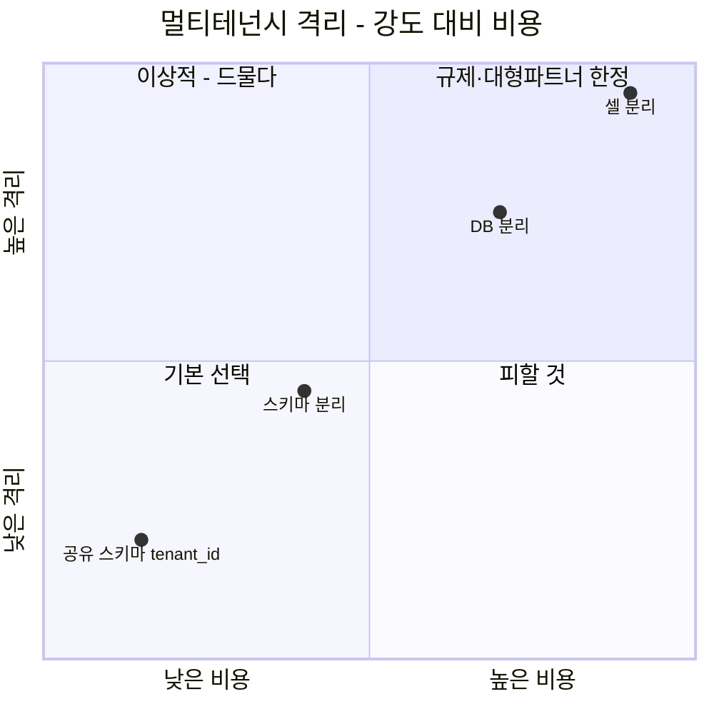

> **판단: 기본은 공유 스키마 + `tenant_id`. 규제가 요구하는 데이터만 분리합니다.**
>
> 처음부터 DB를 분리하면 운영 비용이 국가 수에 비례해 늘어납니다. 반대로 전부 공유하면 일본 개인정보를 한국에 두게 되어 법을 위반합니다.
>
> 그래서 **데이터 등급별로 격리 수준을 다르게** 갑니다 — 콘텐츠 메타는 공유, PII·결제는 리전 분리(`DATA_RESIDENCY` 테이블이 이걸 표현합니다).
>
> **솔직히 말씀드리면, 이건 제가 실전에서 대규모로 해본 영역이 아닙니다.** 야나두에서 B2C/B2B를 단일 플랫폼에 공유 스키마·행 수준 격리로 운영한 경험이 있고, 그 원리를 국가 단위로 확장하는 판단입니다.

### 10-2. 계약 관리 · 거버넌스 도구

| 영역 | 후보 | 판단 |
|---|---|---|
| **API 명세** | OpenAPI / gRPC Protobuf | **바이 (표준)** |
| **컨트랙트 테스트** | Pact / Spring Cloud Contract | **바이** — CI에서 계약 위반 차단 |
| **스키마 레지스트리** | Confluent Schema Registry (Kafka 이벤트) | **바이** |
| **모듈 레지스트리·서비스 카탈로그** | Backstage / 자체 | **하이브리드** — Backstage 골격 + 도메인 확장 |
| **정책 강제** | OPA (CI 게이트) | **바이** — [03_공통어드민.md](03_공통어드민.md)와 공유 |
| **피처 플래그 · 테넌트 토글** | LaunchDarkly / Unleash / 자체 | **바이 (Unleash OSS)** |

### 10-3. 글로벌 인프라·현지화

| 영역 | 후보 | 판단 | 비고 |
|---|---|---|---|
| **CDN** | CloudFront / Akamai / Cloudflare | **바이 · 다중화** | 지역별 성능 차이 실측 후 선택 |
| **지역 제한** | CDN 엣지 geo 룰 + 애플리케이션 이중 검증 | **하이브리드** | 엣지만 믿으면 우회 가능. 서버에서도 검증 |
| **번역관리(TMS)** | Crowdin / Lokalise / Phrase | **바이** | 상세 비교는 [TMS 비교 노트](../../learning/번역관리_TMS_솔루션_비교.md) |
| **기계번역** | DeepL / Google / LLM | **바이** | TMS와 결합. 초벌만, 검수는 사람 |
| **자막 현지화** | STT + MT + 사람 검수 | **하이브리드** | [01_CMS.md §10-4](01_CMS.md) AI 파이프라인 공유 |
| **데이터 레지던시** | 리전별 배포 (AWS 멀티리전) | **빌드 판단** | 규제가 요구하는 데이터만. 전면 멀티리전은 과잉 |

> **지역 제한을 CDN 엣지에만 맡기면 안 됩니다.**
>
> VPN 우회는 흔합니다. 엣지에서 1차로 막고, **API 서버에서 라이선스 규칙으로 2차 검증**해야 합니다.
>
> 그리고 §6-2의 위반 탐지 쿼리를 **매일 자동 실행**합니다. 세 겹입니다.

---

## §11. 로드맵

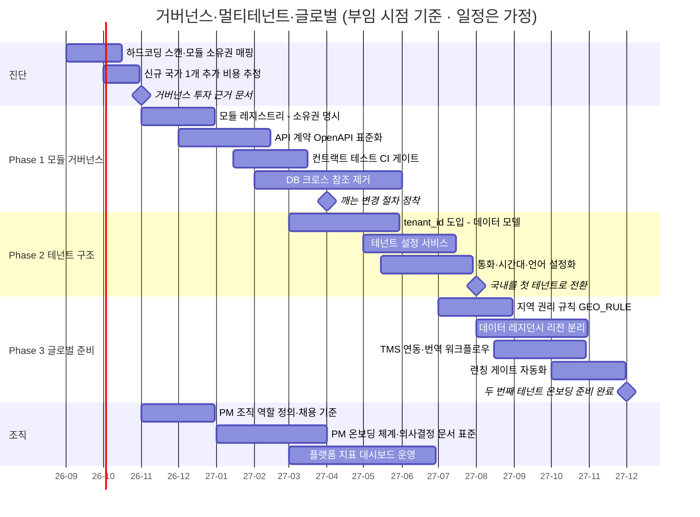

> **"국내를 첫 테넌트로 전환"(m3)이 이 로드맵의 분수령입니다.**
>
> 해외 진출 전에 **국내 서비스를 테넌트 1번으로 만들어봐야** 구조가 진짜인지 알 수 있습니다. 두 번째 테넌트를 붙일 때 비로소 설계가 검증됩니다.

---

## §12. 플랫폼 성과지표 + PM 조직 빌딩

> 여기가 공고 **주요업무 5번** — "플랫폼 성과 지표 정의 및 PM 조직 빌딩"에 대한 직접 응답입니다.

### 12-1. 플랫폼 전체 지표 트리 (4개 도메인 통합)

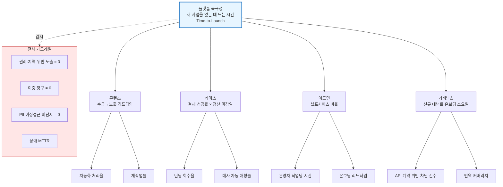

> **플랫폼 조직의 북극성을 "Time-to-Launch"로 잡는 이유**:
>
> 플랫폼의 존재 이유는 **다른 사람이 빨리 무언가를 시작하게 하는 것**입니다. 새 국가, 새 요금제, 새 채널을 얹는 데 걸리는 시간이 곧 플랫폼의 품질입니다.
>
> 4개 도메인의 북극성은 모두 이 상위 지표의 입력값입니다. 상세 논의는 [플랫폼 성과지표 노트](../../learning/플랫폼_성과지표.md)를 참조합니다.

### 12-2. 지표를 만들 때의 원칙 3가지

| 원칙 | 이유 |
|---|---|
| **북극성은 반드시 하나** | 여러 개면 아무것도 아니게 된다 |
| **속도 지표에는 품질 짝지표를** | 리드타임 옆에 재작업률, 자동화율 옆에 결함율 |
| **게이밍 가능한 지표는 쓰지 않는다** | "AI 사용량"이 아니라 "리드타임". 사용량은 늘리기 쉽다 |

### 12-3. baseline이 없으면 만든다

> 이 자리의 첫 일은 성과를 내는 게 아니라 **성공을 잴 자(尺)를 만드는 것**입니다.
>
> 내부 플랫폼 지표는 처음엔 아예 존재하지 않습니다. 2~4주 관찰 기간을 두고 작업 로그·인터뷰로 계측해 기준선을 세웁니다.
>
> 완벽한 계측이 어려우면 대리 지표(proxy)라도 정하고, 개선 후 **같은 잣대로** 다시 잽니다. baseline 없는 개선 주장은 신뢰받지 못합니다.

### 12-4. PM 조직 빌딩 — 사람이 아니라 구조를 만든다

**① 역할을 먼저 정의한다 (사람을 뽑기 전에)**

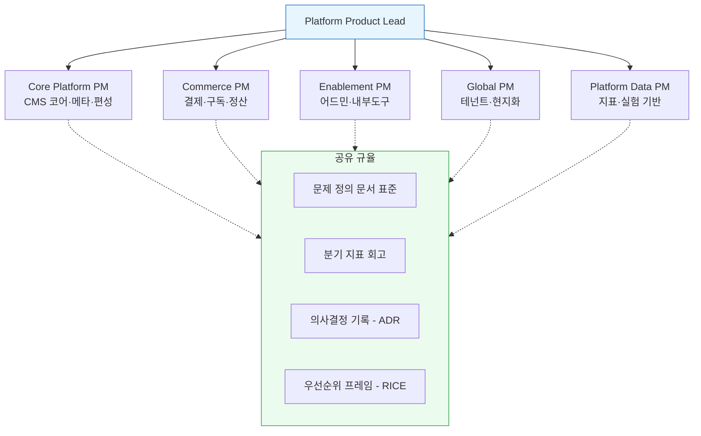

> 조직도는 **모듈 소유권 지도(§4-2)와 일치해야** 합니다. 콘웨이의 법칙 때문입니다.
>
> 원하는 아키텍처가 있다면 **조직을 먼저 그 모양으로 만듭니다**(역콘웨이 기동).

**② PM의 산출물은 코드가 아니라 '결정'이다**

무엇을 만들고 무엇을 안 만들지, 어떤 순서로 할지, 성공을 무엇으로 잴지 — **이 결정들의 품질**이 PM 조직의 성과다. 그래서 조직 빌딩의 핵심은 사람을 뽑는 게 아니라 **결정의 품질을 관리하는 체계**를 세우는 것이다.

**③ 채용은 기준을 먼저, 사람을 나중에**

| 단계 | 내용 |
|---|---|
| 역할 정의 | 위 5개 롤의 책임·성공 기준·인접 팀과의 인터페이스 문서화 |
| 채용 기준 | 롤별 필수 역량 3개 + 평가 방법(과제·사례 인터뷰) 사전 확정 |
| 온보딩 | 30일 내 도메인 맥락·지표·의사결정 히스토리 흡수 경로 |
| 성장 | 분기 지표 회고를 코칭 기회로. 결정의 사후 검증을 문화로 |

> **내부 채용·조직 빌딩 경험**: 야나두에서 **10명 조직을 30명으로 키우며 직접 20명을 채용·온보딩**했고, 산하에 서비스 PM·기술 PM으로 구성된 PM팀을 두고 요구사항 인입 → 우선순위 → 로드맵 리뷰 주기를 설계·운영했습니다.
>
> 그때 배운 것 하나 — **리더 한 사람에 의존하면 조직은 확장되지 않습니다.** 구조로 굴러가야 합니다.

---

## §13. 이 문서로 답할 수 있는 면접 질문

**Q. 플랫폼 거버넌스와 기능 모듈화를 어떻게 하시겠어요?** `★★`

> **"여러 사업이 하나의 플랫폼을 안전하게 나눠 쓰게 만드는 게 거버넌스입니다."**
>
> 기능을 모듈로 나누고 각 모듈의 **소유 팀·인터페이스·변경 규칙**을 명문화합니다. 그래야 한 사업의 요구가 다른 사업을 깨지 않고, 새 국가나 브랜드를 얹을 때 전체를 다시 만들지 않아도 됩니다.
>
> 핵심은 **회의체가 아니라 자동화**입니다. API 계약은 컨트랙트 테스트로 CI에서 강제하고, 폐기 가능 여부는 호출 로그로 판단합니다(§7-2). 문서로는 지켜지지 않습니다.
>
> 다만 모듈화는 **조직 규모와 트래픽이 정당화할 때만** 합니다. BTV NCMS를 MSA로 분해하며 이점을 봤지만, 과도한 분산은 독입니다.

**Q. 멀티테넌트 아키텍처를 어떻게 설계하시겠어요?** `★★`

> **"격리 강도와 비용의 트레이드오프로 접근하되, 데이터 등급별로 다르게 갑니다."**
>
> 기본은 공유 스키마에 `tenant_id`를 두고 인프라를 공유합니다. 다만 **데이터 레지던시 규제가 걸리는 PII·결제 데이터만 리전을 분리**합니다. 처음부터 전부 DB를 나누면 운영 비용이 국가 수에 비례합니다(§10-1).
>
> 그리고 테넌트는 **코드가 아니라 데이터**여야 합니다. 통화·시간대·언어·결제수단이 설정 테이블에 있으면, 두 번째 국가 온보딩에 배포가 필요 없습니다.
>
> 솔직히 말씀드리면 이건 제 사례가 가장 얇은 영역입니다. 야나두에서 B2C/B2B를 단일 플랫폼에 논리 격리로 운영한 경험을 국가 단위로 확장하는 판단이고, **실전 검증은 부임 후 첫 테넌트 전환에서 하겠습니다.**

**Q. 글로벌 확장 요구와 기존 운영 안정성, 무엇을 우선합니까?** `★★★`

> **"이분법을 조금 바꾸고 싶습니다. 안정성은 우선순위의 대상이 아니라 전제조건입니다."**
>
> 확장 요구는 층위를 나눕니다. **데이터 모델은 나중에 고치는 비용이 가장 크니 처음부터 확장을 반영**하고, 기능 구현은 사업 로드맵을 따라 후순위에 둘 수 있습니다.
>
> 그래서 제 로드맵은 "국내를 첫 테넌트로 전환"을 해외 진출보다 앞에 둡니다(§11). 두 번째 테넌트를 붙일 때 비로소 구조가 검증되니까요.
>
> 그리고 이 트레이드오프는 혼자 정하지 않습니다. **비용·리스크·지표로 정리해 경영진·사업 조직과 합의**합니다.

**Q. 플랫폼 조직의 성과 지표를 뭘로 잡으시겠어요?** `★★★`

> **"플랫폼의 북극성은 Time-to-Launch — 새 사업을 얹는 데 드는 시간입니다."**
>
> 플랫폼의 존재 이유는 다른 사람이 빨리 시작하게 하는 것이니까요. 새 국가, 새 요금제, 새 채널을 얹는 데 걸리는 시간이 플랫폼의 품질입니다.
>
> 그 아래에 도메인별 북극성을 둡니다 — 콘텐츠는 수급→노출 리드타임, 커머스는 결제 성공률과 정산 마감일, 어드민은 셀프서비스 비율(§12-1).
>
> 그리고 **속도 지표에는 반드시 품질 짝지표**를 붙입니다. 리드타임 옆에 재작업률, 자동화율 옆에 결함율. 속도만 좋아지고 품질이 무너지면 실패니까요.

**Q. PM 조직을 어떻게 빌딩하시겠습니까?** `★★`

> **"사람을 뽑기 전에 역할과 결정 체계를 먼저 만듭니다."**
>
> PM의 산출물은 코드가 아니라 **결정**입니다. 그래서 조직 빌딩의 핵심은 문제 정의 문서 표준, 분기 지표 회고, 의사결정 기록 같은 **결정의 품질을 관리하는 체계**입니다(§12-4).
>
> 롤은 모듈 소유권 지도와 일치시킵니다. 콘웨이의 법칙 때문에, 원하는 아키텍처가 있으면 조직을 먼저 그 모양으로 만들어야 합니다.
>
> 저는 야나두에서 10명 조직을 30명으로 키우며 **직접 20명을 채용·온보딩**했고, 산하 PM팀의 요구사항 인입부터 로드맵 리뷰까지의 주기를 설계해 운영했습니다. 그때 배운 건 **리더 한 사람에 의존하면 조직은 확장되지 않는다**는 것입니다.

**Q. 지역 제한(geo-blocking)은 어떻게 보장하죠?** `★`

> **"세 겹으로 막고, 기본값은 거부입니다."**
>
> CDN 엣지에서 1차, API 서버의 라이선스 규칙으로 2차, 그리고 **매일 자동 실행되는 위반 탐지 쿼리**로 3차입니다(§6-2).
>
> 가장 중요한 건 **deny by default** — 허용 규칙이 없으면 노출하지 않는 것입니다. 반대로 만들면 신규 국가를 열 때 전 카탈로그가 열립니다. 이건 계약 위반이고 소송 사유입니다.

---

## §14. 이 문서의 한계 — 정직하게

| 한계 | 어떻게 다룰 것인가 |
|---|---|
| **멀티테넌트·글로벌은 사례가 얇다** | 과장하지 않는다. "해봤다"가 아니라 "이렇게 판단하겠다"로 말한다. 인접 경험(야나두 B2C/B2B 논리 격리)만 근거로 든다 |
| 티빙의 글로벌 로드맵·현지 파트너 구조를 모른다 | 이미 진행 중인 계획이 있을 수 있다. 이 문서는 대안이 아니라 대화의 출발점 |
| 웨이브 합병 시나리오를 반영하지 못했다 | 합병이 진행되면 "통합 대비 멀티테넌시"로 범위가 커진다. 면접에서 질문받으면 시나리오로 답한다 |
| 규제(GDPR·현지 개인정보법) 상세를 모른다 | 법무·컴플라이언스와 협의해 `DATA_RESIDENCY` 항목을 채운다. 시스템은 규제를 표현할 그릇만 제공 |

> **면접 마무리 문장 — 약점을 먼저 말하는 법**:
>
> "멀티테넌트와 글로벌은 제 이력에서 가장 얇은 부분입니다. 그걸 두껍게 보이려고 하지 않겠습니다.
>
> 다만 제가 가진 건 **비슷한 문제를 두 번 다르게 풀어본 경험**입니다. 저장소 분리를 TVING에서는 MongoDB로, BTV에서는 Kafka와 Elasticsearch로 — 제약이 다르면 답도 달라야 한다는 걸 압니다.
>
> 멀티테넌시도 같습니다. 정답은 없고 **트레이드오프만 있습니다.** 저는 그 트레이드오프를 비용과 리스크의 언어로 정리해 경영진과 합의하는 일을 20년 해왔습니다."
