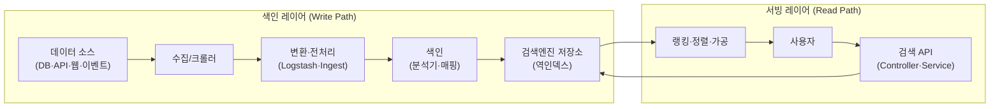

# 1부 · 검색 시스템 개요

파이프라인, 아키텍처, 그리고 어려운 지점

---

# 색인 레이어와 서빙 레이어

검색 엔지니어가 담당하는 것은 <strong>두 레이어가 만나는 저장소</strong>입니다. 쓰기 경로의 분석기 설계가 읽기 경로의 품질을 결정합니다.

---

# 고도화된 검색 파이프라인

후보 검색은 파이프라인의 <strong>가운데 한 칸</strong>일 뿐입니다. 앞의 넷은 질의를 다듬고 뒤의 둘은 순서를 다시 매깁니다.

---
class: text-sm
---

# 검색 품질은 어떻게 재나

| 지표 | 정의 | 특징 |
| --- | --- | --- |
| Precision(정밀도) | 결과 중 실제 연관 비율 | Recall과 trade-off |
| Recall(재현율) | 실제 연관 중 검색된 비율 | 넓게 평가 |
| MRR | 첫 정답 순위의 역수 평균 | 최상위 집중 |
| MAP | 쿼리별 평균정밀도의 평균 | 순위 반영, 계산 복잡 |
| NDCG | 관련성 등급을 상위 가중해 정규화 | 이분법 아님, **실무 표준** |
| CTR/CVR | 클릭률/전환율 | 직접 측정, 의도 반영은 약함 |
| A/B 테스트 | 알고리즘 실측 비교 | 객관적, 비용 큼 |

검색은 "돌아간다"가 아니라 <strong>"좋은 결과를 준다"</strong>가 목표라, 정량 지표로 평가합니다.

---
class: text-sm
---

# 검색 엔지니어가 실제로 겪는 어려움

| 영역 | 어려움 |
| --- | --- |
| 한글 처리 | 형태소 분해, 신조어·외래어, 사용자사전 부작용 |
| 초성·한영 | 기본 API 없음 → 커스텀 플러그인 직접 빌드 |
| 자동완성 | 100ms 응답, 부분일치 색인 비용, 색인과 검색 분석기 분리 |
| 무결과 | 0건일 때 폴백 정책을 직접 설계 |
| 랭킹 튜닝 | "왜 이게 위에 뜨나" — BM25·function_score |
| 대용량·성능 | deep pagination, 대량 색인, 캐시 |
| 운영·장애 | yellow/red 복구, split brain, 디스크 watermark |
| 문서 모델링 | nested 대 object 오탐, 조인 부재 |

여덟 영역에 공통점이 하나 있습니다 — <strong>상용엔진에선 규격서가 대신 내려주던 결정을 오픈소스에선 직접 설계·구현·운영</strong>해야 합니다.

