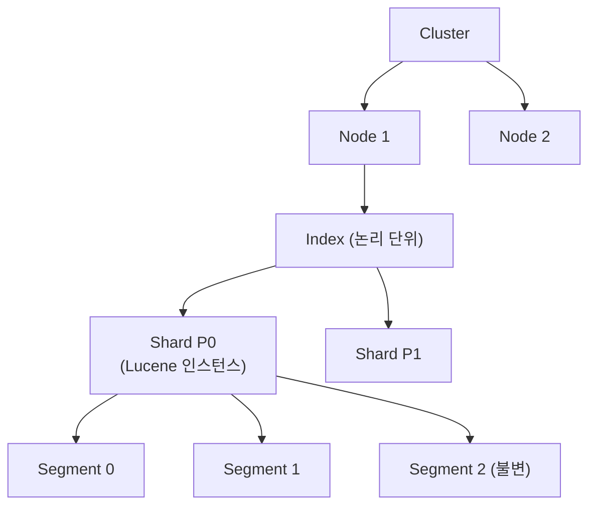
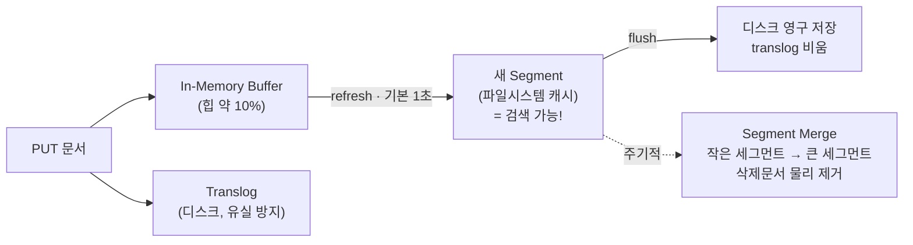
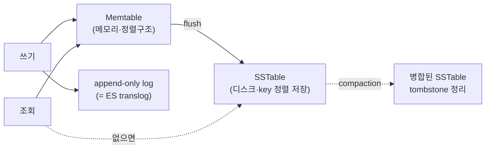
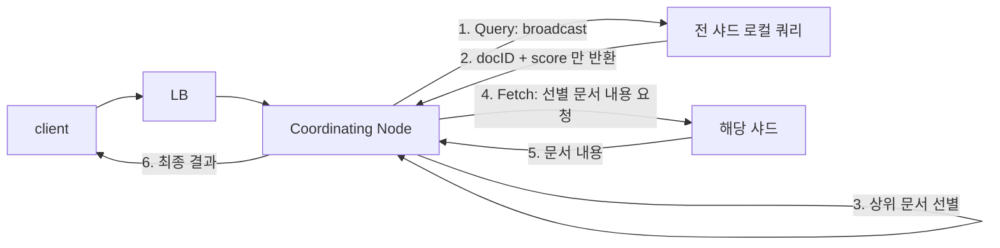

# 2부 · Elasticsearch 아키텍처

색인과 검색은 내부에서 어떻게 도는가

---

# 두 가지 사실에서 출발합니다

문서를 넣으면 약 1초 뒤부터 검색되고, 수억 건에서도 검색이 수십 밀리초에 끝납니다. 두 가지는 우연이 아니라 다음 두 구조에서 나옵니다.

  

    
색인 파이프라인

    
버퍼 → refresh → flush → merge

  

  

    
역인덱스

    
단어에서 문서로 거꾸로 건다

  

---

# 클러스터 계층 구조

샤드 하나가 곧 <strong>Lucene 인스턴스</strong>이고, 그 안의 세그먼트는 <strong>불변</strong>입니다. 이 불변성이 다음 장의 전부를 설명합니다.

---

# 색인 내부 동작 — 버퍼에서 디스크까지

"약 1초 뒤부터 검색된다"의 정체가 <code>refresh</code>입니다 — <strong>디스크에 쓰이기 전에 이미 검색됩니다.</strong>

---

# LSM Tree — 왜 쓰기가 빠른가

앞 장의 구조가 LSM Tree 그대로입니다. <strong>제자리 수정을 하지 않고 덧붙인 뒤 나중에 병합</strong>하기 때문에 쓰기가 순차 I/O가 됩니다.

---

# 검색 동작 — Query then Fetch

2단계로 나눈 이유는 <strong>1단계에서 문서 본문을 옮기지 않기 때문</strong>입니다. 그리고 이 구조가 deep pagination 이 비싼 이유이기도 합니다 — 뒤 페이지일수록 모든 샤드가 그만큼을 먼저 정렬해야 합니다.

