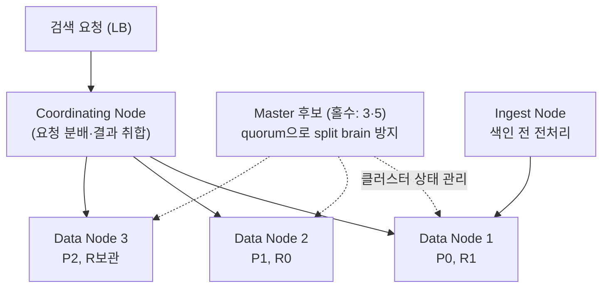
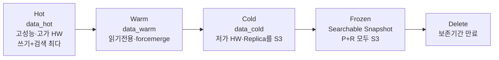
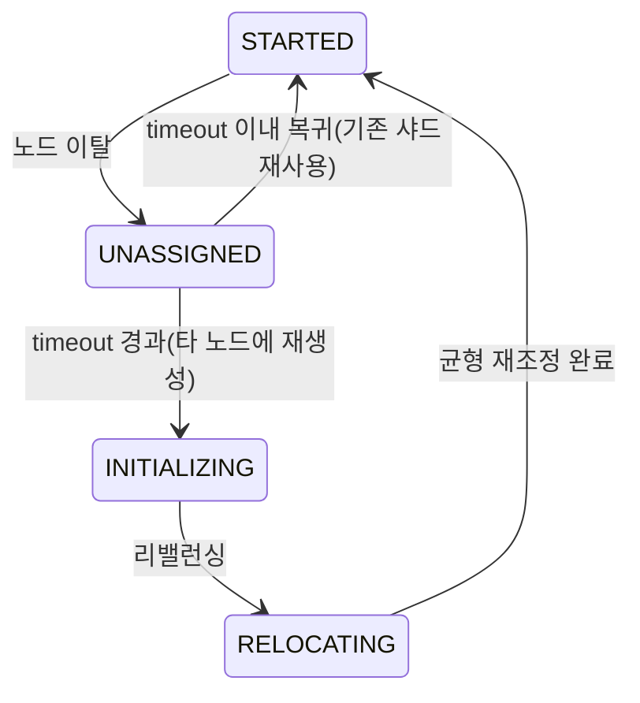
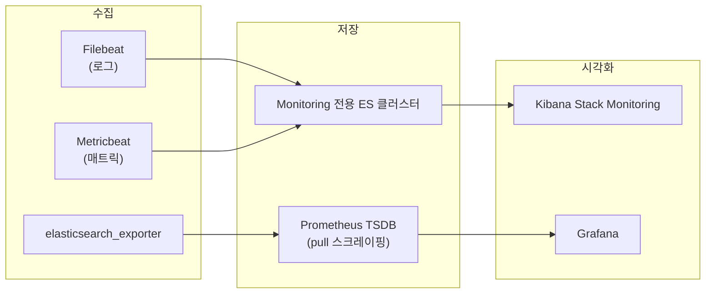

# 3부 · 운영과 트러블슈팅

클러스터 구성부터 장애 복구까지

---

# 클러스터 토폴로지 — 노드는 역할로 나뉩니다

마스터 후보를 <strong>홀수</strong>로 두는 것이 split brain 을 막는 유일한 구조적 장치입니다.

---

# Hot-Warm-Cold 와 ILM

데이터가 나이를 먹을수록 <strong>비싼 하드웨어에서 싼 하드웨어로 내려갑니다.</strong> Frozen 단계에서는 Primary 까지 오브젝트 스토리지로 내려가고, 검색은 여전히 됩니다.

---

# 상태를 결정짓는 것은 대부분 샤드입니다

| 상태 | 의미 | 흔한 원인 |
| --- | --- | --- |
| Green | Primary·Replica 모두 정상 할당 | — |
| Yellow | **Replica**가 비정상(Primary는 정상) | 샤드 할당 실패 / 설정 오류 / 디스크 부족 |
| Red | **Primary**가 비정상 | 위 세 가지 + 레플리카 없는 샤드 손실 |

<strong>Red 복구 순서</strong> — ① 문제 인덱스 확인 → ② 노드 종료가 원인이면 노드 재시작 → ③ 스냅샷 복구 → ④ 재색인.

---

# 노드 유실 시 샤드는 바로 재생성되지 않습니다

핵심 설정은 <code>index.unassigned.node_left.delayed_timeout</code>(기본 1분)입니다. 
<strong>재시작 정도의 짧은 이탈에 대량 복사를 일으키지 않으려는 장치입니다.</strong>

---

# 모니터링 — 무엇이 죽었는지 어떻게 아나

모니터링을 <strong>전용 클러스터</strong>로 분리하는 이유는 하나입니다 — 감시 대상이 죽으면 감시자도 함께 죽기 때문입니다.

