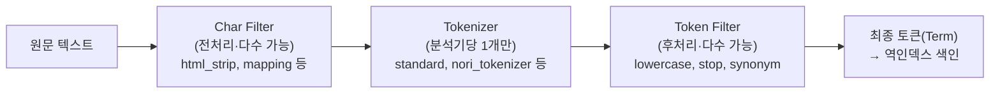
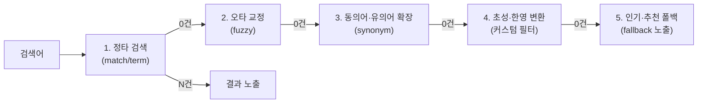

# 4부 · 한글 검색 구현

분석기 · Nori · 초성 · 자동완성 · 무결과

---

# 분석기 파이프라인 — 모든 것의 출발점



<div class="pt-6">
가운데 칸만 <strong>하나로 제한</strong>됩니다. 앞뒤는 여럿을 쌓을 수 있지만 토크나이저는 분석기당 하나이며, 그래서 <strong>토크나이저 선택이 분석기의 정체</strong>가 됩니다.
</div>

---
class: text-sm
---

# 자동완성 — 네 가지 방식과 선택 기준

| 방식 | 원리 | prefix | 중간일치 | 오타 | 비고 |
| --- | --- | --- | --- | --- | --- |
| **ngram** | 글자 단위 전부 분해 | O | O | 부분 | 토큰 폭발 주의 |
| **edge_ngram** | **앞에서부터만** 분해 | O | X | 부분 | 색인 토큰 적음 |
| **search_as_you_type** | 전용 타입, n-gram 자동생성 | O | O | X | multi_match + bool_prefix |
| **completion suggester** | FST를 메모리 적재 | O | X | O(fuzzy) | 최고속, weight·context |

<div class="pt-6 text-xl">
자동완성은 <strong>100ms 이내 응답</strong>이 요구되는 기능입니다.<br/>
네 방식 어느 것도 세 열을 모두 채우지 못한다는 점이 선택의 이유가 됩니다.
</div>

---

# 색인용과 검색용 분석기를 나눕니다

```json
"index_completion":  { "type":"custom", "tokenizer":"standard",
  "filter":["lowercase","trim","autocomplete_edge"] },
"search_completion": { "type":"custom", "tokenizer":"standard",
  "filter":["lowercase","trim"] }
```

<div class="pt-6 p-5 rounded-lg border-l-4 border-teal-500 bg-teal-500/10">
<strong>색인 시에만</strong> edge_ngram 을 붙이고 <strong>검색 시엔 뺍니다.</strong> "커피"를 색인하면 [커, 커피]로 저장되는데, 검색어 "커"에도 edge_ngram 을 적용하면 [커]가 되어 원하는 대로 매칭됩니다 — <strong>검색어까지 잘게 쪼개면 오히려 오작동합니다.</strong>
</div>

---
class: text-sm
---

# 멀티필드 병렬 색인 — 한글 자동완성의 실전 구조

| 서브필드 | 색인 analyzer | 검색 analyzer | 목적 |
| --- | --- | --- | --- |
| `completion_chosung` | index_completion_chosung | search_completion_chosung | 초성 자동완성 |
| `completion_jamo` | index_completion_jamo | search_completion_jamo | 자소 자동완성 |
| `completion_eng2kor` | index_completion | search_completion_eng2kor | 영타 자동완성 |
| `completion_kor2eng` | index_completion | search_completion_kor2eng | 한타 자동완성 |

<div class="pt-6 p-4 rounded-lg border-l-4 border-amber-500 bg-amber-500/10">
<strong>클라이언트 최적화가 함께 필요합니다.</strong> "아이폰" 한 단어에도 자소 포함 <strong>최대 7회</strong> API 호출이 발생합니다 — debouncing 과 throttling 으로 서버 부하를 줄이고, 최근검색어는 브라우저 저장소로 던집니다.
</div>

---

# 무결과 처리 — 0건일 때 무엇을 보여줄 것인가



<div class="pt-4">
폴백은 <strong>다섯 단이고 순서가 정책입니다.</strong> 상용엔진이 규격서로 내려주던 것이 바로 이 순서이며, 오픈소스에서는 이것을 직접 정해야 합니다.
</div>
