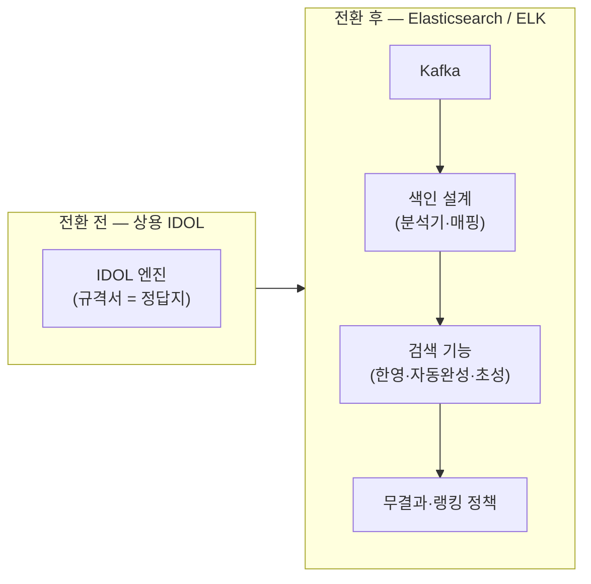

# 5부 · 검색을 두 번 구축한 기록

상용 검색엔진에서 Elasticsearch로

---

# 세 단계를 지나왔습니다

앞의 둘과 셋째 사이에 <strong>규격서가 있느냐 없느냐</strong>라는 선이 그어집니다. 
그 선을 넘는 순간 <strong>결정을 직접 내려야 합니다.</strong>

---

# 전환 전후 — 무엇이 늘었나

왼쪽은 상자 하나이고 오른쪽은 넷입니다. <strong>줄어든 것이 아니라 늘어난 것이 이 전환의 실체입니다.</strong>

---
class: text-sm
---

# 가장 공들인 것 — 답을 직접 만들어야 했던 다섯

| 기능 | 사용자 기대 | 핵심 난제 | ES에서의 접근 |
| --- | --- | --- | --- |
| 무결과 처리 | 0건이어도 "뭐라도" 보여주기 | 언제·무엇으로 대체할지 정책 부재 | 오타교정·동의어 확장·인기 폴백 단계 설계 |
| 자동완성 | 몇 글자로 후보 예측 | 부분일치 색인 비용·속도 | edge n-gram / completion suggester 색인 전략 |
| 초성검색 | "ㅊㅅ"에서 "초성" | 한글 자모 분해 색인 필요 | 초성 추출 필드 별도 색인·매핑 |
| 한영검색 | 자판 오타 교정 | 한↔영 키맵 변환 로직 | 변환 후 재질의·별도 분석 필드 |
| 한글 형태소 | 의미 단위 검색 | 조사·복합어 분해 | 형태소 분석기·사용자사전 구성 |

상용엔진에선 규격서가 답을 줬지만, 여기선 <strong>답을 직접 만들어야 했습니다.</strong>

