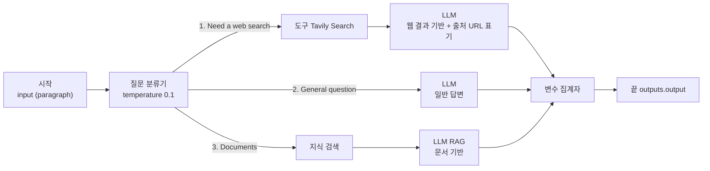
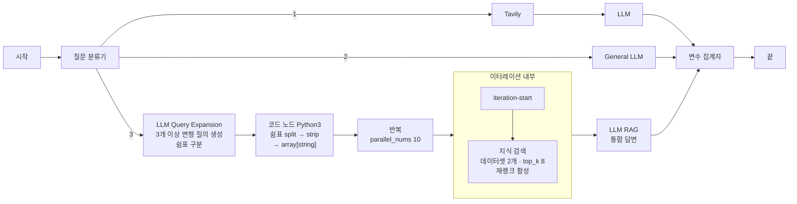
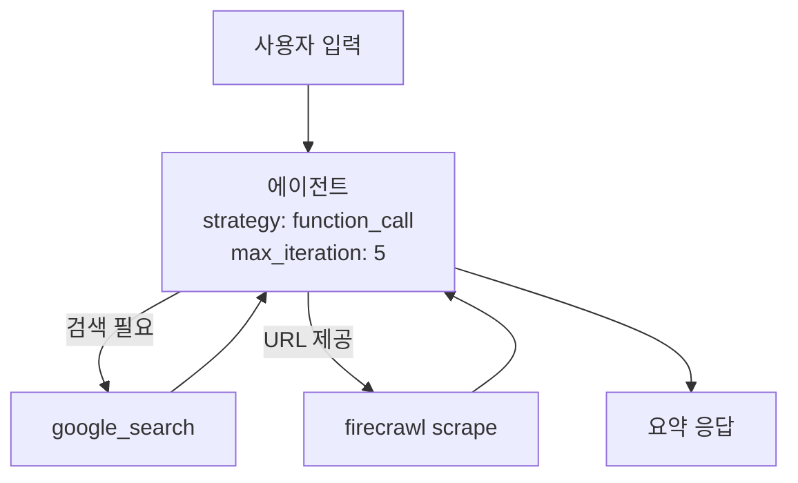
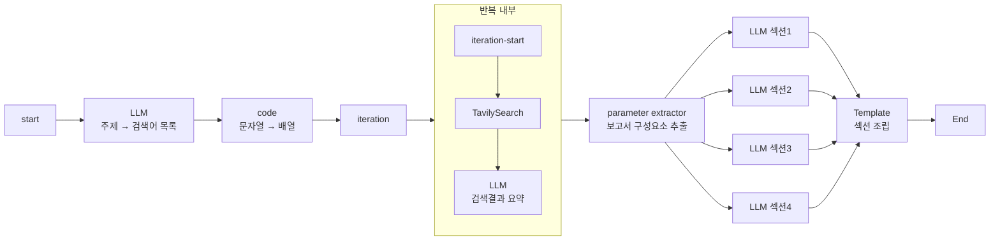
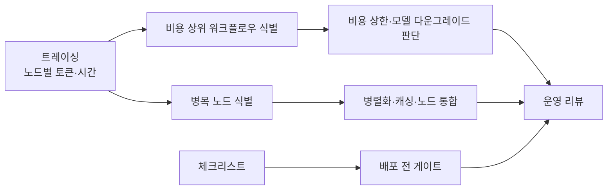
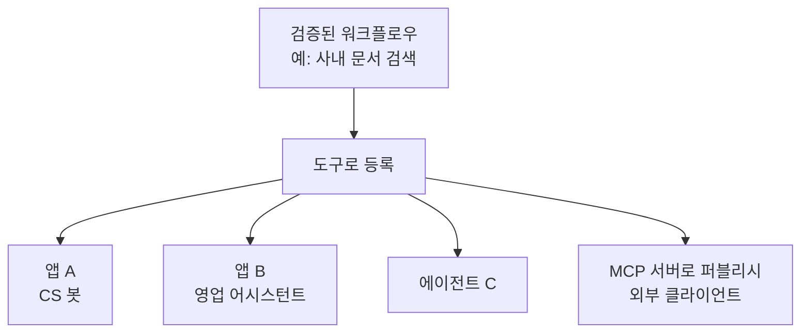
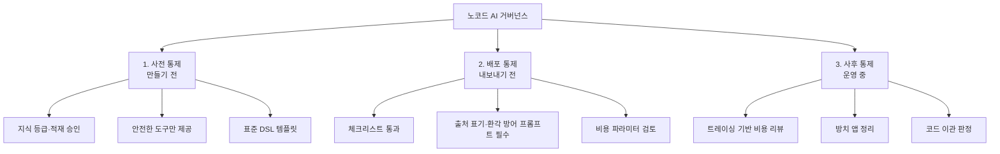

# 사내 AI의 확산과 통제

금지가 아니라 설계로 막습니다

<div class="pt-8 opacity-70 text-sm">
  발행본 <code>rag/dify-enterprise-governance</code> 를 옮긴 것입니다
</div>

---
layout: center
class: text-center
---

# 노코드 확산의 최대 공포

<div class="pt-6 text-3xl">
"누가 뭘 만들었는지 모르고 <strong>비용만 나간다</strong>"
</div>

<div class="pt-10 grid grid-cols-2 gap-8 text-left">
  <div class="p-5 rounded-lg border-2 border-rose-500">
    <div class="text-rose-400 font-bold text-xl">금지로 막으면</div>
    <div class="pt-3">도입이 멈춥니다</div>
  </div>
  <div class="p-5 rounded-lg border-2 border-teal-500">
    <div class="text-teal-400 font-bold text-xl">설계로 막으면</div>
    <div class="pt-3">멈추지 않습니다</div>
  </div>
</div>

---

# 경로 마커 — 작지만 결정적인 UX 장치



<div class="pt-4">
웹검색 / 일반질문 / 문서검색 <strong>3경로</strong>를 라우팅한 뒤 단일 출력으로 모읍니다.
</div>

---
class: text-sm
---

# 경로 마커의 설계 포인트

| 설계 포인트 | 내용 |
| --- | --- |
| 분류기 온도 | **0.1** — 분류는 창의성이 필요 없다는 원칙이 반영됨 |
| 출처 강제 | 웹 경로 프롬프트가 `Source` 섹션에 URL 나열을 요구 |
| 근거 제약 | "제공된 컨텍스트에만 근거하라, 외부 지식 금지, 모르면 모른다" 3중 명시 |
| **출력 마커** | RAG 경로는 "다음은 문서에서 검색한 결과입니다"로 시작 |
| 합류 | 변수 집계자 단일 출력 → 어댑터 규약과 일치 |

<div class="pt-6 p-4 rounded-lg border-l-4 border-teal-500 bg-teal-500/10">
답변이 사내 문서 기반인지 웹 기반인지를 사용자가 즉시 알면 <strong>신뢰 수준을 스스로 조절</strong>할 수 있습니다. 사내 배포 시 "답변의 출처 경로를 항상 표기한다"를 표준 규칙으로 삼을 근거입니다.
</div>

---

# Query Expansion — 노코드가 갈 수 있는 가장 먼 지점



---

# 문자열을 배열로 바꾸는 코드 노드는 세 줄입니다

```python {all|2|3-5}
def main(questions: str) -> dict:
    question_list = questions.strip().split(",")
    return {
        "result": [q.strip() for q in question_list],
    }
```

| 설계 포인트 | 내용 |
| --- | --- |
| **확장 → 분할 → 반복** | LLM이 문자열 생성 → **코드가 배열로 변환** → 이터레이션 입력 |
| 코드 노드를 쓴 이유 | 출력 형식을 프롬프트로 이미 고정했으므로 LLM을 한 번 더 부를 필요가 없다. **비용 0, 결정적** |
| 재랭크 활성 | 3개 이상 질의 × top_k 8 = 후보 24개 이상 → **재랭크의 효용이 커지는 구간** |

---
layout: center
class: text-center
---

# 상한선과 한계가 같은 자리에 있습니다

<div class="grid grid-cols-2 gap-8 pt-10 text-left">
  <div class="p-5 rounded-lg border-2 border-teal-500">
    <div class="text-teal-400 font-bold text-xl">상한선</div>
    <div class="pt-3">Query Expansion + 병렬 검색 + Rerank는 코드 기반 RAG에서도 상급 기법인데 <strong>노드 조립으로 구현</strong>됐습니다</div>
  </div>
  <div class="p-5 rounded-lg border-2 border-rose-500">
    <div class="text-rose-400 font-bold text-xl">한계</div>
    <div class="pt-3">확장 질의의 <strong>품질을 측정할 방법이 없고</strong>, 실패 시 재시도 전략을 세밀하게 짤 수 없습니다</div>
  </div>
</div>

<div class="pt-8 text-xl">
품질 게이트가 필요해지는 순간이 <strong>코드로 이관할 시점</strong>입니다
</div>

---
layout: two-cols
layoutClass: gap-6
---

# 에이전트 구성



::right::

<div class="pt-12 text-sm">

| 기준 | 에이전트 | 워크플로우 |
| --- | --- | --- |
| 경로 결정 | LLM(런타임) | 설계자(빌드타임) |
| 예측 가능성 | 낮음 | 높음 |
| 비용 예측 | **어려움** | 쉬움 |
| 추적·디버깅 | 어려움 | 노드별 트레이싱 |
| 안전장치 | `max_iteration` | 노드 수 자체가 상한 |

</div>

---
layout: center
class: text-center
---

# 확산 초기에는 워크플로우를 표준으로

<div class="pt-8 text-xl opacity-80">
사내 배포 관점에서 에이전트는<br/>
<strong>비용과 경로가 런타임에 결정돼 예측이 안 된다</strong>는 점이 결정적 단점입니다
</div>

<div class="pt-10 p-5 rounded-lg border-2 border-amber-500 bg-amber-500/10">
에이전트는 <code>max_iteration</code>을 낮게 잡아 <strong>제한적으로</strong> 허용합니다
</div>

---

# 긴 산출물은 나눠서 만듭니다



---

# 2단 팬아웃 — 수집과 생성을 따로 벌립니다

| 설계 포인트 | 내용 |
| --- | --- |
| **2단 팬아웃** | ① 검색어 N개로 팬아웃 ② 보고서 섹션 4개로 팬아웃 |
| 팬인 지점 | 매개변수 추출기(1차) → 템플릿(2차) |
| 섹션 분업 | LLM 4개가 각 섹션을 나눠 씀 → 품질 저하와 토큰 상한 회피 |
| 조립은 템플릿 | 최종 형식을 LLM이 아니라 Jinja2가 결정 → **결정적 산출물** |

<div class="pt-6 p-4 rounded-lg border-l-4 border-teal-500 bg-teal-500/10">
<strong>긴 문서를 만드는 표준 패턴입니다</strong> — 수집 팬아웃 → 구조 추출 → 섹션별 병렬 생성 → 템플릿 조립.
</div>

<div class="pt-4 p-4 rounded-lg border-l-4 border-amber-500 bg-amber-500/10">
다만 LLM 호출이 <strong>1 + N + 1 + 4회</strong>이므로 1건당 비용이 크게 올라갑니다. 사용 빈도가 높은 업무라면 비용 상한 설계가 먼저입니다.
</div>

---

# 답변 노드를 흐름 중간에 배치합니다


<div class="pt-4">
채팅플로우의 답변 노드는 종료 노드가 아니라 <strong>출력 지점</strong>입니다. 코드 기반이라면 스트리밍 콜백을 직접 짜야 할 것을 <strong>노드 배치만으로</strong> 해결했습니다.
</div>

---
class: text-sm
---

# 노코드에도 관측이 있습니다

| 수단 | 보여주는 것 | 운영상 쓸모 |
| --- | --- | --- |
| **프롬프트 로그** | 실제 모델에 들어간 최종 프롬프트 | 변수 치환 오류 발견 |
| **다중 모델 디버그** | 같은 프롬프트를 여러 모델에 동시 실행 | 모델 교체 판단·비용 대비 품질 비교 |
| **테스트 실행** | 워크플로우 입출력 JSON | 계약(스키마) 확인 |
| **실행 상세** | Status / Elapsed Time / Total Tokens / Execution Step | **비용·지연 단위 관측** |
| **트레이싱** | 블록별 실행 순서·소요시간·토큰 사용량 | 병목 노드 특정, 비용 상위 노드 특정 |
| **체크리스트** | 구성 오류 경고 | 배포 전 정적 검증 |

<div class="pt-6 text-xl">
트레이싱과 토큰 집계가 있다는 사실이 <strong>1차 방어</strong>이고,<br/>
관측 데이터를 정기적으로 리뷰하는 루틴이 <strong>2차 방어</strong>입니다.
</div>

---
layout: center
class: text-center
---

# 도구가 있어도

# **보는 사람이 없으면 데이터는 쌓이기만 합니다**



---

# 워크플로우 도구화 — 가장 강력한 통제 수단



| 관점 | 의미 |
| --- | --- |
| 코드 비유 | 워크플로우 = 함수, 도구화 = 함수 공개 |
| 품질 전략 | **개발조직이 만들어 도구화 → 현업이 조립** |
| 통제 효과 | 위험한 처리를 도구 안에 가두고 현업에는 인터페이스만 노출 |

---
layout: center
class: text-center
---

# 금지 목록으로 통제하는 대신

<div class="pt-8 text-3xl font-bold text-teal-400">
안전한 부품만 제공해서<br/>위험한 조합이 애초에 만들어지지 않게 합니다
</div>

<div class="pt-10 text-xl opacity-80">
금지가 아니라 설계로 통제하는 방식이고,<br/>
<strong>확산 속도를 떨어뜨리지 않는 유일한 통제 방식</strong>이기도 합니다
</div>

---

# 도입 로드맵 — 순서를 지키는 것이 절반입니다


<div class="pt-6 p-5 rounded-lg border-l-4 border-rose-500 bg-rose-500/10 text-xl">
<strong>0단계 없이 1단계로 가면 나중에 전부 다시 만들어야 하고,<br/>2단계 없이 3단계로 가면 난립합니다.</strong>
</div>

---
class: text-sm
---

# 단계별 성공 지표

| 단계 | 개발조직이 하는 일 | 현업이 하는 일 | 성공 지표 |
| --- | --- | --- | --- |
| 0. 경계 확정 | 호스팅 방식·모델 공급자·계정 연동 결정 | — | 데이터 흐름도 1장이 승인됨 |
| 1. 파일럿 | 지식베이스 1개 적재, 템플릿 1개 제공 | 실제 업무로 사용·피드백 | 실사용자가 주 단위로 다시 씀 |
| 2. 부품화 | 검증된 워크플로우 도구화, 표준 프롬프트 | 요구 제기 | 부품 재사용 건수 |
| 3. 확산 | DSL 템플릿 배포, 교육, 신청 창구 | 직접 제작 | **개발 개입 없이 완결된 비율** |
| 4. 운영 | 비용·품질 리뷰, 코드 이관 판정 | 유지보수 | 앱당 비용, 방치 앱 정리율 |

<div class="pt-6 p-4 rounded-lg border-l-4 border-teal-500 bg-teal-500/10">
3단계의 성공 지표에 주목할 필요가 있습니다. <strong>만들어진 앱 수가 아니라 개발 개입 없이 완결된 비율</strong>입니다 — 앱 수는 난립해도 올라가지만 이 비율은 부품이 제대로 갖춰졌을 때만 오릅니다.
</div>

---
class: text-xs
---

# 지식베이스 권한 통제

| 통제 항목 | 권장 정책 | 근거 |
| --- | --- | --- |
| **지식베이스 신설 권한** | 관리자 승인제 | 적재 시 임베딩 비용이 문서량에 비례. 중복 적재는 비용과 혼선을 동시 유발 |
| **문서 등급 분류** | 공개 / 사내 / 기밀 3단계, **기밀은 적재 금지** | 적재 순간 검색 대상이 된다. 프롬프트로 막을 수 없다 |
| **지식베이스별 접근 범위** | 앱과 지식의 연결을 명시 승인 | 앱이 늘수록 예상 못한 조합이 생김 |
| **MCP 노출** | **공개 등급만.** URL은 자격증명 취급 | 외부 클라이언트 호출은 사내 계정과 분리될 수 있음 |
| **인덱스 모드** | 기본 "고품질", 대량·저가치 문서는 "경제적" | 비용 대 품질 균형 |
| **적재 검수** | 청크 확인 + 검색 테스트를 적재 완료 조건으로 | 잘못 잘린 문서는 영구 오답원 |
| **문서 갱신 주기** | 지식베이스마다 소유자·갱신주기 명시 | **오래된 문서가 최신처럼 답변되는 것이 가장 위험** |

<div class="pt-4 text-base">
두 번째 행이 가장 중요합니다. 프롬프트로 "기밀 문서는 답하지 마라"고 쓰는 것은 통제가 아닙니다. <strong>적재하지 않는 것만이 통제입니다.</strong>
</div>

---
class: text-xs
---

# 비용이 새는 열 곳

| 레버 | 설정 위치 | 효과 |
| --- | --- | --- |
| **Max Tokens** | LLM 노드 | 응답 길이 상한. 가장 직접적 |
| **모델 선택** | LLM 노드 | 분류·추출은 소형 모델로 충분 |
| **temperature 0** | 분류·추출 노드 | 재시도 감소(간접 절감) |
| **top_k** | 지식 검색 노드 | 프롬프트 입력 토큰 직접 좌우 |
| **재랭크 on/off** | 지식 검색 노드 | 후보 수가 적으면 끄는 것이 이득 |
| **parallel_nums** | 이터레이션 노드 | 순간 호출량 = 비용 스파이크 상한 |
| **병렬 경로 수** | 워크플로우 구조 | 경로 수에 비례해 비용 증가 |
| **에이전트 max_iteration** | 에이전트 설정 | 예측 불가 비용의 유일한 상한 |
| **메모리 window** | LLM 노드 | 창을 끄면 대화 길이에 비례해 토큰 증가 |
| **호출 귀속** | 어댑터 `user` 필드 | 부서별 비용 배분의 전제 |

<div class="pt-3 text-base">
<strong>비용 사고의 전형은 둘입니다</strong> — ① 이터레이션 병렬 수를 크게 잡아 순간 폭주 ② 메모리 창 없이 긴 대화가 누적. 둘 다 리뷰에서 눈으로 잡히는 항목입니다.
</div>

<style>
table td, table th { padding-top: 4px; padding-bottom: 4px; }
</style>

---

# 거버넌스 3계층



---
class: text-sm
---

# 계층마다 실패 증상이 다릅니다

| 계층 | 통제 수단 | 실행 주체 | 실패 시 증상 |
| --- | --- | --- | --- |
| **사전** | 부품 제공 방식 통제(도구화·지식 승인) | 개발조직 | 위험한 조합의 앱이 생김 |
| **배포** | 체크리스트 + 프롬프트 규약 + 비용 파라미터 리뷰 | 개발조직 + 제작자 | 환각·출처 미표기·비용 폭주 |
| **사후** | 트레이싱 리뷰 + 정리 + 이관 | 개발조직 | 좀비 앱 누적, 비용 잠식 |

<div class="pt-8"></div>

| 실무 | 방법 | 얻는 것 |
| --- | --- | --- |
| 버전관리 | 배포 시 DSL 익스포트 → Git 커밋 | 변경 이력·롤백 |
| 코드리뷰 | DSL diff를 PR로 리뷰 | 노드 추가·프롬프트 변경이 눈에 보임 |
| 환경 분리 | 동일 DSL을 개발/운영 워크스페이스에 임포트 | 운영 앱을 직접 만지지 않음 |

---
class: text-xs
---

# 배포 전 체크리스트

| # | 항목 | 확인 방법 |
| --- | --- | --- |
| 1 | 지식 기반 답변에 "모르면 모른다" 문구가 있는가 | 시스템 프롬프트 확인 |
| 2 | 출처 표기가 켜져 있는가 | 설정·프롬프트 확인 |
| 3 | 분류·추출 노드의 temperature가 낮은가 | 노드 파라미터 |
| 4 | Max Tokens 상한이 설정되었는가 | 노드 파라미터 |
| 5 | 이터레이션 `parallel_nums`가 합리적인가 | 노드 설정 |
| 6 | 에이전트라면 `max_iteration`이 설정되었는가 | 앱 설정 |
| 7 | **입력 스키마의 모든 옵션이 실제로 동작하는가** | 그래프 대조 |
| 8 | 끝·답변 노드 출력 변수명이 사내 규약과 맞는가 | DSL 확인 |
| 9 | 연결된 지식베이스가 승인 등급인가 | 지식 목록 대조 |
| 10 | 체크리스트 경고가 0인가 | 플랫폼 체크리스트 |
| 11 | DSL을 익스포트해 저장소에 보관했는가 | Git 확인 |
| 12 | 소유자와 폐기 시점이 지정되었는가 | 앱 메타 |

<div class="pt-3 text-base">
DSL에 <strong>API 키·데이터셋 식별자 같은 민감값이 포함될 수 있으므로</strong> 저장소에 올리기 전 마스킹 규칙을 먼저 정해야 합니다.
</div>

<style>
table td, table th { padding-top: 4px; padding-bottom: 4px; }
</style>

---
class: text-xs
---

# 설계 원칙 열 가지

| # | 원칙 | 근거 |
| --- | --- | --- |
| 1 | **LLM에게 시키지 않아도 되는 일은 시키지 않는다** | 템플릿으로 형식 조립, 코드로 문자열 파싱 |
| 2 | **분류와 추출은 온도를 낮추고 생성만 높인다** | 분류기 0.1 vs 생성 0.7 |
| 3 | **배타 분기는 집계자, 동시 실행은 템플릿** | 요약 워크플로우 두 버전 비교 |
| 4 | **합치고 나서 처리 > 처리하고 나서 합치기** | LLM 4개 중복의 리팩터링 |
| 5 | **비정형→배열→반복이 병렬 처리의 표준 진입로** | 매개변수 추출기 / 코드 노드 두 경로 |
| 6 | **재랭크는 항상 켜지 않고 후보 수에 비례해 켠다** | 이터레이션 검색에만 재랭크 활성 |
| 7 | **검색 검증 앱을 따로 둔다** | LLM 없는 관측 전용 앱 |
| 8 | **출처와 경로를 사용자에게 표기한다** | 출처 노출 설정, 경로 마커, Source 섹션 |
| 9 | **위험한 처리는 도구 안에 가두고 인터페이스만 노출한다** | 워크플로우 도구화 |
| 10 | **결과를 사람이 한 번 더 보는 업무만 노코드로 연다** | 코드 vs 노코드 판단 기준 |

---
layout: center
class: text-center
---

# 열 개를 관통하는 하나

<div class="pt-8 text-3xl font-bold text-teal-400">
노코드 도입의 성패는 도구가 아니라<br/>
부품과 관측을 <strong>누가 언제 갖추느냐</strong>로 갈립니다
</div>

<div class="pt-12 grid grid-cols-2 gap-8 text-left">
  <div class="p-5 rounded-lg border border-slate-500">
    <div class="opacity-70">개발조직의 역할</div>
    <div class="pt-2 text-xl">구현자 → <strong>플랫폼 제공자</strong></div>
  </div>
  <div class="p-5 rounded-lg border border-slate-500">
    <div class="opacity-70">평가 기준</div>
    <div class="pt-2 text-xl">요청 처리량 → <strong>개발 개입 없이 끝낸 비율</strong></div>
  </div>
</div>
