# 에이전트 패턴 카탈로그 11종

자율성 축과 대표 실패 모드

<div class="pt-8 opacity-70 text-sm">
  발행본 <code>ai-agent/agent-pattern-catalog</code> 를 옮긴 것입니다
</div>

---

# 이름으로 답하면 정보가 전달되지 않습니다

"에이전트 아키텍처"라는 이름 아래 묶여 있는 것들의 자율성 수준이 실제로는 **"없음"에서 "매우 높음"까지 걸쳐 있습니다.**

<div class="grid grid-cols-2 gap-6 pt-6">
  <div class="p-4 rounded-lg border border-teal-500">
    <div class="text-teal-400 font-bold">프롬프트를 두 번 이어 부르기</div>
    <div class="mt-2 text-sm">자율성 없음</div>
  </div>
  <div class="p-4 rounded-lg border border-rose-500">
    <div class="text-rose-400 font-bold">화면을 보고 마우스를 움직이기</div>
    <div class="mt-2 text-sm">자율성 매우 높음</div>
  </div>
</div>

<div class="pt-6 opacity-80">
둘이 같은 목차 안에 들어갑니다. 그래서 "어떤 패턴을 쓰시나요"에 이름으로 답하면 거의 아무것도 말하지 않은 것이 됩니다.
</div>

---

# 목록을 두 축으로 정렬합니다

<div class="grid grid-cols-2 gap-8 pt-8">
  <div>
    <div class="text-2xl font-bold text-teal-400">자율성 수준</div>
    <div class="pt-3">경로 결정권을 코드가 얼마나 쥐고 있는가</div>
  </div>
  <div>
    <div class="text-2xl font-bold text-rose-400">대표 실패 모드</div>
    <div class="pt-3">그 패턴이 무너질 때 어디서부터 무너지는가</div>
  </div>
</div>

<div class="pt-10 text-xl">
패턴을 고르는 일은 결국 <strong>"어느 실패를 감당할 것인가"</strong>를 고르는 일이기 때문입니다.
</div>

---
class: text-sm
---

# 용어 정리 — 실행과 계획

| 용어 | 원어·표기 | 뜻 |
| --- | --- | --- |
| 도구 호출 | Tool Calling | LLM이 외부 함수·API를 호출하도록 구조화된 출력을 내는 기능 |
| ReAct | Reasoning + Acting | Thought → Action → Observation을 반복해 최종 답에 도달하는 추론 프레임워크 (ICLR 2023) |
| 플래너 | Planner | 최종 목표를 하위 단계로 분해하는 구성 요소 |
| Plan-and-Execute | — | 계획 수립 → 단계 실행 → 재계획 → 최종 보고서로 이어지는 패턴 |
| 리플렉션 | Reflection | 산출물을 스스로 평가·비판해 재생성하는 루프 |
| 관련성 검사 | Relevance Check | 검색 결과가 질문에 실제로 답이 되는지 판정하는 게이트 |

---
class: text-sm
---

# 용어 정리 — 협업 구조

| 용어 | 원어·표기 | 뜻 |
| --- | --- | --- |
| 멀티에이전트 | Multi-Agent | 전문성이 다른 복수 에이전트가 협업해 문제를 분산 처리하는 시스템 |
| 핸드오프 | Hand-off | 한 에이전트가 다른 에이전트로 제어권을 넘기는 라우팅 방식 |
| 스웜 | Swarm | 중앙 통제 없이 핸드오프로만 굴러가는 naive 멀티에이전트 구조 |
| 수퍼바이저 | Supervisor | 지시를 받아 적합한 에이전트에 작업을 할당하고 결과를 회수하는 조정자 |
| 계층형 팀 | Hierarchical Teams | Supervisor 아래에 다시 팀별 Supervisor를 두는 2단 구조 |
| 컴퓨터 유즈 | Computer Use | 모델이 사람처럼 화면·마우스·키보드를 조작해 앱과 상호작용하는 방식 |

---

# 패턴을 세기 전에 — 에이전트는 다섯 층입니다

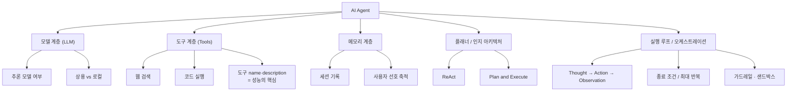

---
class: text-sm
---

# 다섯 층은 각각 다르게 무너집니다

| 요소 | 책임 | 여기가 무너지면 |
| --- | --- | --- |
| 모델 | 판단·계획·도구 선택 | 상용 대비 로컬 모델에서 **성능 저하가 뚜렷하고** 파인튜닝도 어렵다 |
| 도구 | 외부 환경과의 상호작용 | 설명이 모호하면 잘못된 도구를 고름 → 일관성 없는 의사결정 |
| 메모리 | 세션 기록·중간 결과 유지 | 문맥 유실로 같은 작업 반복, 비용 증가 |
| 플래너 | 최종 목표를 단계로 분해 | 잘못된 계획이 하위 전 단계로 전파 |
| 실행 루프 | 반복·종료·오류 복구 | 무한 루프·비용 폭증 |

<div class="pt-4 opacity-80">
앞 도식은 열여섯 개 리프를 달지만 이 표는 다섯 행입니다. <strong>도식은 병렬이고 표는 인과입니다.</strong>
</div>

---

# ReAct — 실행 루프의 표준형

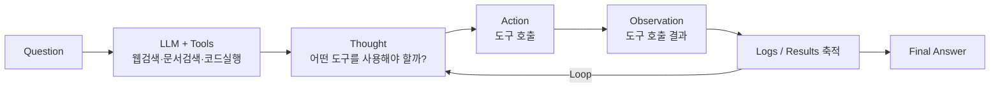

<div class="pt-4">
Agentic Prompt 원칙 둘 — <strong>① Step을 순서대로 명시한다 ② 도구의 name·description을 구체적으로 명시한다.</strong>
</div>

---
layout: center
class: text-center
---

# 루프가 있는 프롬프트에는

# 종료 조건을 **문장으로** 박습니다

<div class="pt-8 opacity-70">
예시 시스템 프롬프트는 판정이 no면 질의를 다시 만들어 재검색하되 <strong>최대 20회</strong>로 반복을 끊었습니다
</div>

---

# 구현은 생각보다 단순합니다

<div class="p-6 rounded-lg border-l-4 border-teal-500 bg-teal-500/10">
에이전트는 정교한 작업을 처리할 수 있지만 <strong>구현은 간단한 경우가 많습니다.</strong> 일반적으로 환경 피드백에 기반한 도구를 반복적으로 사용하는 LLM에 불과합니다.
</div>

<div class="pt-6">
Anthropic 「Building Effective Agents」(2024.12.20) 서두도 같은 취지입니다 — 가장 성공적인 구현들은 <strong>복잡한 프레임워크나 특수 라이브러리를 쓰지 않았습니다.</strong>
</div>

<div class="pt-6 text-xl">
이 문장이 아래 카탈로그를 읽는 방식을 바꿉니다. 열한 개 패턴은 배타적인 제품이 아니라 <strong>조합 단위</strong>입니다.
</div>

---
class: text-xs
---

# 패턴 카탈로그 11종

| # | 패턴 | 자율성 | 적합 상황 | 대표 실패 모드 |
| --- | --- | --- | --- | --- |
| 1 | 프롬프트 체이닝 | 없음 | 고정 단계 분해 가능 | 예외 케이스 미처리 |
| 2 | 게이트·라우팅 | 낮음 | 조건 분기가 유한 | 게이트 기준 모호 시 오분기 |
| 3 | 자율 에이전트 루프 | 높음 | 개방형 문제 | 무한 루프·비용 폭증 |
| 4 | Agentic RAG | 중간 | 검색 품질이 답변 품질을 좌우 | 재질의 반복으로 지연 증가 |
| 5 | Swarm(핸드오프) | 중간 | 에이전트 2~3개 소규모 | 에이전트 수 증가 시 라우팅 폭발 |
| 6 | Supervisor | 중간 | 역할이 명확히 나뉜 다수 에이전트 | Supervisor 병목·단일 실패점 |
| 7 | 계층형 팀 | 중간 | 팀 단위로 묶이는 대형 작업 | 계층 간 컨텍스트 유실 |
| 8 | Plan-and-Execute | 높음 | 장문 보고서·다단계 리서치 | 초기 계획 오류의 전파 |
| 9 | STORM Research | 높음 | 다관점 리서치 산출물 | 관점 중복·수렴 실패 |
| 10 | Debate / 시뮬레이션 | 높음 | 찬반 논증·의사결정 지원 | 종료 조건 없으면 발산 |
| 11 | 컴퓨터 유즈 | 매우 높음 | UI만 있고 API가 없는 시스템 | 화면 변화에 취약, 오류 비용 큼 |

<style>
table td, table th { padding-top: 4px; padding-bottom: 4px; }
</style>

---
layout: center
class: text-center
---

# 자율성 열을 세로로 읽으면

# **"중간"이 넷이고 그 넷이 전부 멀티에이전트입니다**

<div class="pt-8 text-xl opacity-80">
여러 에이전트를 쓴다는 것이 곧 자율성을 높이는 것은 아닙니다 —<br/>
쪼개는 순간 라우팅이 명시적으로 드러나 오히려 통제가 늘어납니다
</div>

---

# 1. 프롬프트 체이닝 — 자율성 없음

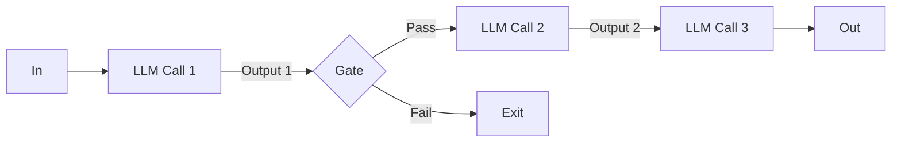

<div class="pt-4">
적합한 곳은 순서가 요구사항에 이미 적혀 있는 작업입니다. 실패는 <code>Gate</code> 한 곳에서 납니다.
</div>

<div class="pt-4 text-xl">
<strong>게이트가 있다는 것과 게이트가 판정한다는 것은 다릅니다.</strong>
</div>

---
layout: two-cols
layoutClass: gap-8
---

# 2. 조건 분기 — 선형과 루프

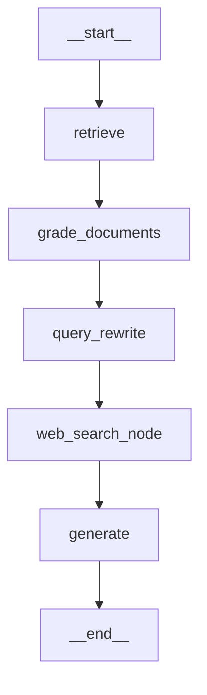

::right::

<div class="pt-16"></div>

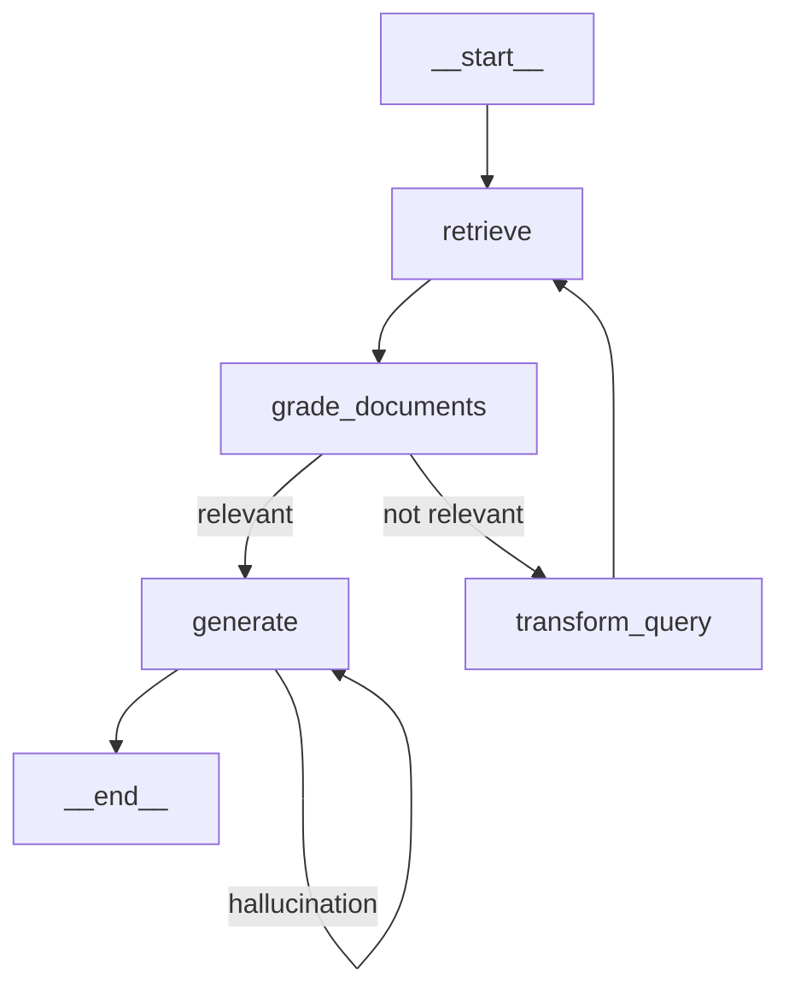

---

# 2. 조건 분기 — 사람이 끊고 들어오는 지점

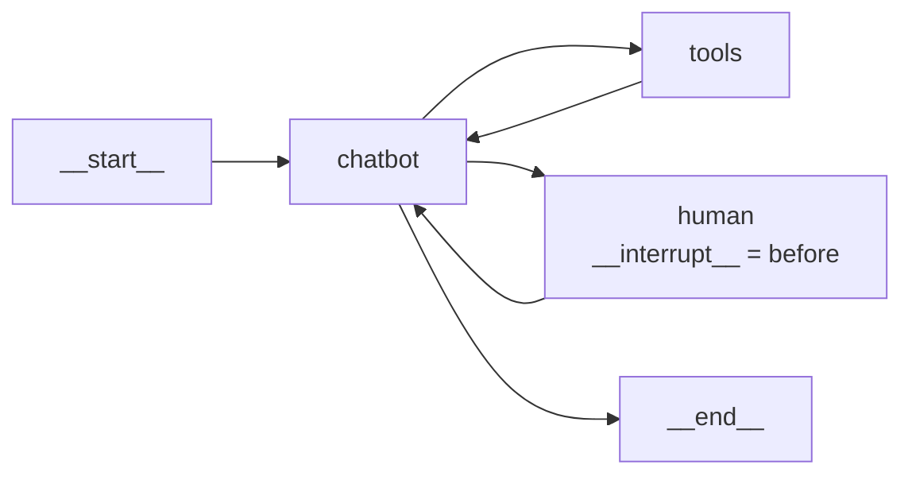

<div class="pt-6 p-4 rounded-lg border-l-4 border-amber-500 bg-amber-500/10">
세 그래프 모두 자율성이 "낮음"인 이유는 <strong>분기 조건이 코드에 있기 때문입니다.</strong> 판정을 LLM이 하는 것과 라우팅을 LLM이 하는 것은 다른 층위입니다.
</div>

---

# 3. 자율 에이전트 루프 — 자율성 높음

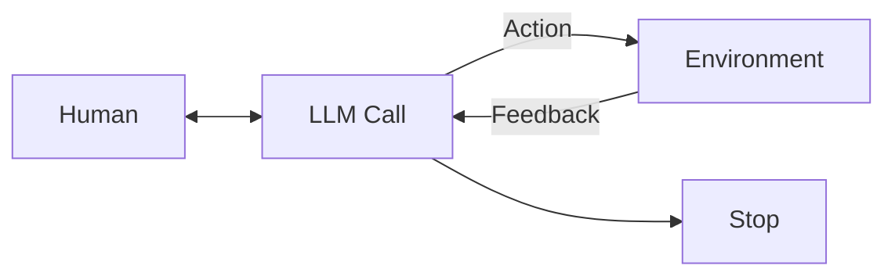

<div class="pt-6">
적합한 곳은 단계 수를 예측할 수 없는 개방형 문제입니다. 필수 설계는 넷입니다.
</div>

<div class="grid grid-cols-4 gap-3 pt-4 text-center text-sm">
  <div class="p-3 rounded border border-teal-500">최대 반복 횟수</div>
  <div class="p-3 rounded border border-teal-500">비용 상한</div>
  <div class="p-3 rounded border border-teal-500">샌드박스</div>
  <div class="p-3 rounded border border-teal-500">중단 조건</div>
</div>

---

# 4. Agentic RAG — 자율성 중간

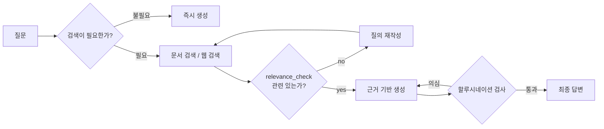

<div class="pt-4">
첫 분기가 이 패턴의 정체입니다 — <strong>"검색이 필요한가"를 코드가 아니라 모델이 판정하는 순간</strong> 조건 분기 워크플로에서 넘어옵니다.
</div>

---

# 5. Swarm — 핸드오프만으로 굴러갑니다

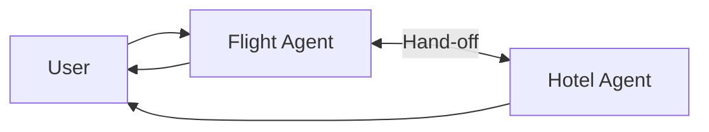

<div class="pt-6">
중앙 관리자가 없는 구조에서 "지금 누구 차례인가"를 어딘가에는 적어 둬야 합니다. Swarm은 그것을 <strong>상태 한 칸</strong>으로 처리합니다 — 마지막으로 활성화된 에이전트를 기억합니다.
</div>

<div class="pt-4 opacity-80">적합한 규모는 에이전트 2~3개입니다.</div>

---
layout: center
class: text-center
---

# 그 이상에서 무너지는 이유

<div class="pt-6 text-xl">
에이전트 N개가 서로를 알아야 하므로<br/>
<strong>라우팅 지식이 각 프롬프트에 중복 기술됩니다</strong>
</div>

<div class="pt-8 p-5 rounded-lg border border-rose-500 bg-rose-500/10 text-left">
비용이 N에 비례해 늘지 않고 <strong>프롬프트 수정 범위가 N개로 퍼집니다.</strong> 코드 중복이 아니라 프롬프트 중복이라 정적 분석에 잡히지도 않습니다.
</div>

---

# 6. Supervisor — 라우팅 지식을 한 곳에 모읍니다

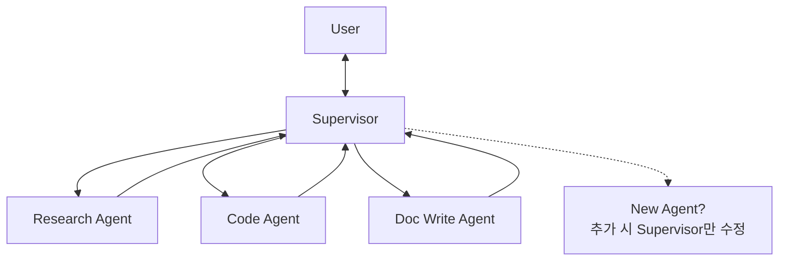

<div class="pt-4">
Swarm과 달라진 것은 하나뿐입니다 — <strong>모든 워커가 반드시 Supervisor로 되돌아옵니다.</strong> 그 되돌아옴이 라우팅 지식의 소재지를 바꿉니다.
</div>

---

# 7. 계층형 팀 — Supervisor의 재귀 적용

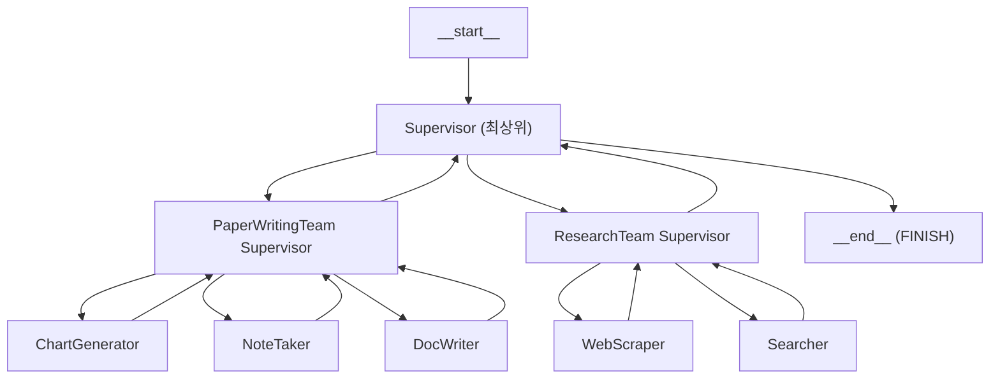

---
layout: center
class: text-center
---

# 별개의 발명이 아닙니다

<div class="pt-6 text-xl">
새로 배울 것이 없는 대신 <strong>새로 생기는 문제도 하나뿐</strong>입니다
</div>

<div class="grid grid-cols-2 gap-6 pt-8 text-left">
  <div class="p-4 rounded-lg border border-amber-500">
    <div class="text-amber-400 font-bold">컨텍스트 유실</div>
    <div class="mt-2 text-sm">계층을 지날 때마다 요약되어 하위 팀이 상위 의도를 잃습니다</div>
  </div>
  <div class="p-4 rounded-lg border border-amber-500">
    <div class="text-amber-400 font-bold">호출 곱셈</div>
    <div class="mt-2 text-sm">층이 늘어난 만큼 라우팅 LLM 호출도 층수만큼 곱해집니다</div>
  </div>
</div>

<div class="pt-6 opacity-70">팀이 하나뿐이면 과설계입니다</div>

---

# 8. Plan-and-Execute — 계획을 산출물로 만듭니다

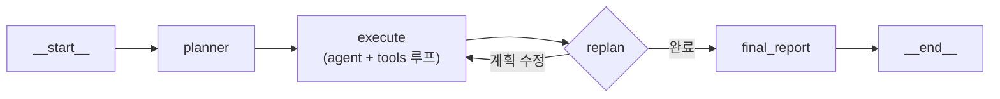

<div class="pt-6 p-4 rounded-lg border-l-4 border-teal-500 bg-teal-500/10">
<strong><code>replan</code> 노드가 이 패턴의 전부입니다.</strong> 계획을 세우는 것이 아니라 <strong>계획을 고칠 수 있게 만드는 것</strong>이 설계의 요점입니다.
</div>

---

# 9. STORM Research — 관점을 먼저 만듭니다

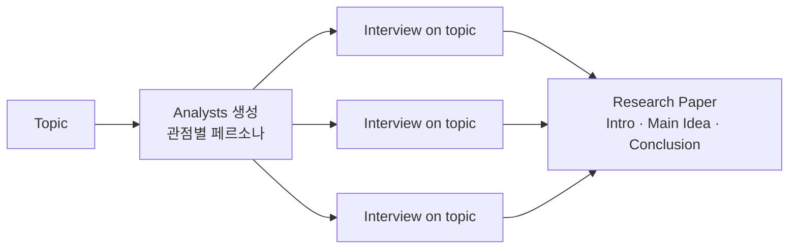

<div class="pt-4">
각 분석가는 <code>Name / Role / Affiliation / Description</code> 페르소나를 받습니다. 실패 모드는 관점이 겹쳐 인터뷰가 중복되는 것이고, 그러면 <strong>비용만 늘고 정보량은 늘지 않습니다.</strong>
</div>

---

# 10. Debate — 발산과 수렴이 동시에 위험합니다

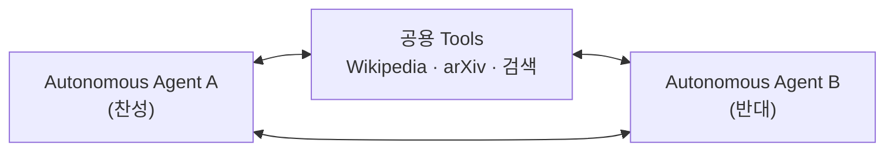

<div class="grid grid-cols-2 gap-6 pt-6">
  <div class="p-4 rounded-lg border border-rose-500">
    <div class="text-rose-400 font-bold">종료 조건이 없으면</div>
    <div class="mt-2 text-sm">무한 발산합니다</div>
  </div>
  <div class="p-4 rounded-lg border border-rose-500">
    <div class="text-rose-400 font-bold">두 에이전트가 같은 모델이면</div>
    <div class="mt-2 text-sm">논점이 수렴해 버립니다</div>
  </div>
</div>

---

# 11. 컴퓨터 유즈 — 아홉 단계 중 둘이 팝업 닫기

```text
Worked for 2 minutes
- Navigating to TripAdvisor website
- Selecting "Things to Do" category
- Searching for historic Rome tours
- Closing pop-up, continuing tour search
- Exploring all historic Rome tour options
- Closing Colosseum tab, resuming tour search
- Exploring options for top-rated tours
- Sorting results by tour ratings
- Exploring filters for top-rated tours
```

<div class="pt-4">
적합한 곳은 API가 없고 UI만 존재하는 레거시 시스템입니다. <strong>자율성이 가장 높은 패턴이 가역성 질문에 가장 취약합니다.</strong>
</div>

---
class: text-sm
---

# 실패 모드 종합표

| 실패 모드 | 발생 지점 | 대응 |
| --- | --- | --- |
| 일관성 없는 의사결정 | 도구 선택 | 도구 description 구체화, 라우팅을 워크플로로 고정 |
| 무한 루프 | 실행 루프 | 최대 반복 횟수(예: 20회) 명시 |
| 복합적 오류 | 다단계 실행 | 단계별 근거 데이터 확보·검증 |
| 비용·지연 폭증 | 반복 호출 | 비용 상한, 캐싱, 모델 티어 분리 |
| 라우팅 복잡도 폭발 | 멀티에이전트 | Supervisor 패턴 |
| Supervisor 병목 | 멀티에이전트 | 계층형 팀으로 분할 |
| 로컬 모델 성능 저하 | 모델 | 상용 모델 병행, 판단 노드만 상용 사용 |
| 재현 불가 | 전체 | 실행 로그·트레이싱, 평가셋 고정 |

---
layout: center
class: text-center
---

# 대응 여덟 개 중 셋이 같은 것을 말합니다

<div class="pt-8 text-3xl font-bold text-teal-400">
상한을 걸어라 — 반복 · 비용 · 티어
</div>

<div class="pt-8 text-xl opacity-80">
그리고 그 셋이 전부 자율성 <strong>"높음"</strong> 패턴에 붙습니다
</div>

---
layout: center
class: text-center
---

# 여기까지가 한 조직 안에서 조립할 수 있는 것들입니다

<div class="pt-6 text-xl opacity-80">
열한 개 패턴 어느 것을 고르든 도구는 내가 만들고, 에이전트는 내 코드 안에 있습니다
</div>

<div class="pt-10 p-5 rounded-lg border border-amber-500 bg-amber-500/10">
그런데 도구가 열 개를 넘어가면 다른 종류의 비용이 나타납니다 —<br/>
프레임워크가 M개고 붙일 서비스가 N개면 연동이 <strong>M×N개</strong> 필요하고,<br/>
이 곱셈은 패턴 선택으로 줄일 수 없습니다
</div>
