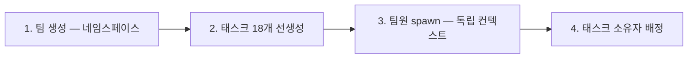
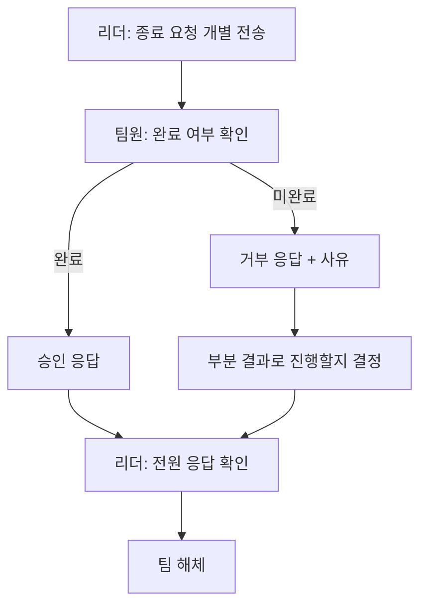
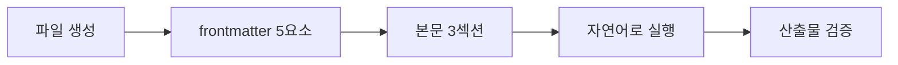
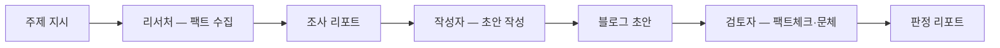
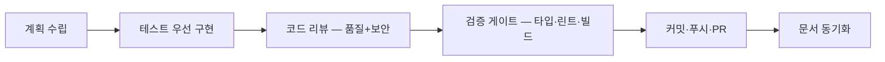

# 팀을 굴리면 첫날 무엇이 멈추는가

운용 규칙과 완제품 환경

  발행본 <code>agentic-coding/agent-team-operations</code> 를 옮긴 것입니다

---
layout: center
class: text-center
---

# 이론이 "무엇이 존재하는가"라면

# 운용은 "어떻게 돌리는가"입니다

구조는 다 섰는데, 팀을 실제로 띄우면 
첫날 부딪히는 것은 <strong>패턴 선택이 아닙니다</strong>

---
class: text-xs
---

# 용어 정리 — 구조와 통신

| 용어 | 정의 | 사람 조직 개념 |
| --- | --- | --- |
| 서브에이전트 | 메인 세션이 1:1로 위임하는 에이전트. 독립 컨텍스트에서 일하고 최종 보고만 돌려준다 | 위임받은 팀원 |
| 오케스트레이터 | 여러 에이전트에 작업을 배분·조율·통합하는 상위 에이전트 | 팀장 / PM |
| Hub-and-Spoke | 모든 보고·의사결정이 리더를 경유하는 통신 구조 | 팀장 중심 보고체계 |
| P2P | 팀원끼리 리더를 거치지 않고 직접 의사결정하는 구조 | 수평 자율 협업 |
| Mailbox | 비동기 메시지 큐. 보낸 즉시 깨우지 않고 inbox에 적재된다 | 사내 메신저 |
| TaskList | 팀원이 공유하는 작업 보드. 상태·소유자·의존성을 기록 | 칸반 보드 |
| blockedBy / blocks | 태스크 간 선후 의존 관계. 선행이 끝나면 자동 해제된다 | 선행 작업 대기 |

---
class: text-xs
---

# 용어 정리 — 격리와 비용

| 용어 | 정의 | 사람 조직 개념 |
| --- | --- | --- |
| Worktree | 같은 저장소를 공유하되 다른 경로에 다른 브랜치를 동시 체크아웃 | 각자 다른 책상 |
| 격리 | 에이전트 간 간섭을 막는 분리. 논리적·세션·물리적 3계층 | 업무 분장 / 좌석 분리 |
| Reasoning Sandwich | 계획=고성능, 구현=중간, 검증=고성능으로 단계별 모델을 달리 배정 | 시니어-주니어-시니어 배치 |
| 모델 계층화 | 리더는 상위 모델, 반복 실행 팀원은 하위 모델 | 직급별 인건비 배분 |
| 컨텍스트 외부화 | 중요한 결정을 파일로 빼내 컨텍스트 압축 시 유실을 막는다 | 회의록 / ADR |
| 오류 증폭 | 한 에이전트의 오류가 체인을 타고 커지는 현상 | 잘못된 정보의 조직 전파 |

---

# 팀 가동 4단계 — 만들고, 일 쌓고, 사람 부릅니다

2번을 3번보다 먼저 하는 이유가 이 순서의 전부입니다 — 
<strong>팀원이 spawn 시점에 빈 작업 목록을 보면 idle 상태로 돌아갑니다.</strong>

---
class: text-xs
---

# 순서를 지켜야 하는 이유

| 단계 | 하는 일 | 이유 |
| --- | --- | --- |
| 1 | 팀 이름(네임스페이스) 생성 | 이후 모든 메시지 라우팅과 작업 보드 경로의 기준이 된다 |
| 2 | 전체 작업 구조를 먼저 생성 | **팀원이 빈 작업 목록을 보면 idle 상태로 돌아간다** |
| 3 | 팀원 spawn | 각자 독립 컨텍스트. 첫 턴에 바로 자기 작업을 확인 |
| 4 | 소유자 배정 | 팀원이 자기 태스크를 즉시 식별 |

| 팀원 유형 | 도구 범위 | 용도 |
| --- | --- | --- |
| 범용 | 읽기·쓰기·편집·셸 전체 | 파일 생성·수정이 필요한 구현 작업 |
| 탐색 | 읽기 전용 | 코드베이스 탐색, 분석, 조사 |
| 계획 | 읽기 전용 | 설계·계획 수립 (구현 불가) |
| 터미널 | 명령 실행 전용 | CI/CD, 명령 실행 |

---
class: text-sm
---

# 메시지는 비동기입니다

메시지를 보내도 수신자가 즉시 깨어나지 않습니다. inbox에 적재되고 **수신자가 다음 턴을 시작할 때** 읽힙니다.

| 잘못된 방식 | 올바른 방식 |
| --- | --- |
| 팀원이 공유 파일 존재 여부를 계속 폴링 | 팀원은 리더의 메시지를 기다린다 |
| 파일이 생겼으니 다음 단계 시작 | 리더가 완료를 확인하고 시작 신호를 보낸다 |

| # | 파일 폴링을 금지하는 이유 |
| --- | --- |
| 1 | 리더가 완료 타이밍 제어권을 갖는다 — 파일 생성이 곧 완료는 아니다 |
| 2 | 파일 쓰기 중간 상태를 읽는 사고를 막는다 |
| 3 | 메시지 자체가 실행 컨텍스트를 담는다 — 단순 깨우기가 아니라 지시 전달이다 |
| 4 | 대기 중인 팀원은 비용이 들지 않는다 |

---
layout: center
class: text-center
---

# 넷째 행이 나머지 셋과 성격이 다릅니다

  

    
앞의 셋

    
폴링이 <strong>틀린</strong> 이유입니다

  

  

    
넷째

    
폴링을 하고 싶어지는 <strong>동기</strong>를 제거합니다

  

---

# 의존성 해제는 깨우기가 아닙니다

의존성 필드는 <strong>상태 표시</strong>이고, 실제 실행 트리거는 <strong>메시지</strong>입니다. 
이 둘을 혼동하면 다음 Phase가 영원히 시작되지 않습니다.

---

# Hub-and-Spoke를 쓰는 진짜 이유 — 오류 억제

  

    
Hub-and-Spoke

    
4.4배

    
모든 의사결정이 리더 경유

  

  

    
Peer-to-Peer

    
17.2배

    
팀원 자율 의사결정

  

Hub-and-Spoke는 성능을 희생하는 보수적 선택이 <strong>아니라</strong>, 오류 억제 메커니즘입니다. 원 자료는 이 수치를 Google/MIT 2025 연구에서 인용했습니다.

---

# 조율은 허용하고 종결만 막습니다

| 구분 | 내용 |
| --- | --- |
| 반드시 리더 경유 | 보고, 의사결정 요청 |
| P2P 허용 | 같은 모듈 작업 시 기술적 조율, 파일 충돌 방지 협의 |
| 절대 금지 | 팀원끼리 의사결정을 자체 종결하는 것 |

| 리더의 3책임 | 내용 |
| --- | --- |
| 조율 | 태스크 배정, Phase 전환 신호, 블로커 중재 |
| 승인 | 팀원 보고서 검토, 자기검증 질문 실행, 최종 종합 판단 |
| 종료 | 종료 요청 전송 → 모든 응답 확인 → 팀 해체 |

---
layout: center
class: text-center
---

# 리더 금지 사항

  
직접 구현(코딩) 금지

  
직접 리서치 금지

  
직접 코드베이스 탐색 금지

  
팀원에게 시킬 수 있는 일을 리더가 직접 하는 것 금지

넷째 행이 앞의 셋을 포함하고, 
앞의 셋은 그 원칙이 깨지는 세 지점에 이름을 붙인 것입니다

---

# 컨텍스트 외부화 — 결정 기록 파일

리더의 컨텍스트는 팀 전체 작전을 기억하는 **유일한 장소**입니다. 가득 차면 압축이 일어나고, 이때 핵심 결정이 유실됩니다.

| 항목 | 내용 |
| --- | --- |
| 해결책 | 중요한 결정을 별도 파일에 외부화 |
| 기록 형식 | 날짜 · 결정 내용 · 이유 · **거부한 대안** |
| 근거 | 구조화 노트 작성은 공식 컨텍스트 엔지니어링 가이드의 권장 패턴 |
| 인용된 실험 | 32K 컨텍스트가 구조화 노트를 통해 327K를 능가한 사례 |

이건 사실상 <strong>ADR과 회의록 문화</strong>입니다. "왜 그렇게 정했고 무엇을 버렸는지"를 남기지 않으면, 사람 팀에서도 몇 달 뒤 같은 논쟁을 반복합니다.

---
class: text-sm
---

# 교착 방지 4대 증상과 처방

| 증상 | 원인 | 처방 |
| --- | --- | --- |
| 두 팀원이 같은 파일을 동시 편집 | 파일 소유권 테이블 미정의 | 설계 단계에서 팀원별 출력 파일을 명시 분리 |
| 팀원이 공유 파일을 계속 폴링하며 안 멈춤 | 메시지 대기 대신 폴링 패턴 사용 | 리더 메시지를 기다리라는 것을 규칙화 |
| 팀 해체 호출 실패 | 종료 응답 확인 전에 해체 시도 | 종료 요청 → 전원 응답 확인 → 해체 순서 준수 |
| 팀원이 타임아웃 없이 무한 대기 | 시간 제한 미설정 | 목표 시간·팀원별 상한 설정, 초과 시 현재까지 결과로 종합 |

<strong>처방 넷 중 둘이 순수한 사전 정의입니다.</strong> 넷 다 미리 정해 두는 것에서 출발하므로, 이 표는 장애 대응표보다 <strong>가동 전 점검표</strong>에 가깝습니다.

---
layout: two-cols
layoutClass: gap-8
---

# 파일 소유권 테이블

| 파일 경로 | 소유자 |
| --- | --- |
| `reports/researcher.md` | 리서처 |
| `reports/writer.md` | 작성자 |
| `reports/reviewer.md` | 검토자 |
| `result-{timestamp}.md` | 리더 |

::right::

# 종료 프로토콜

---
class: text-sm
---

# 비용 관리 3원칙

| 원칙 | 내용 | 효과 |
| --- | --- | --- |
| Phase 분리 | 메인 세션에서 처리 가능한 일은 팀을 띄우지 않는다 | 전체 비용 85% 절감 |
| 모델 계층화 | 리더는 상위 모델, 반복 실행 팀원은 중간·하위 모델 | 성능 +90.2%, 비용 약 50% 절감 |
| 병렬화 의존성 확인 | 독립 작업만 병렬화한다 | 독립 병렬 +81% vs 무리한 병렬 -70% |

에이전트 팀의 비용은 메인 세션 대비 대략 <strong>7~15배</strong>입니다. 
그래서 "이 작업에 정말 팀이 필요한가"가 첫 질문이 됩니다.

<strong>세 행의 출처가 다릅니다.</strong> 앞의 둘은 외부 연구에서 인용된 값이고, Phase 분리 85%만 원 자료 자체의 운영 사례입니다 — 앞의 둘은 외부에서 확인되고 셋째는 원 자료 안에서만 확인됩니다.

---
class: text-sm
---

# 운용 7 체크리스트

| # | 점검 항목 |
| --- | --- |
| 1 | 파일 소유권 — 팀원별로 겹치지 않는 출력 파일이 지정되어 있는가 |
| 2 | Phase 분리 — 순차 의존 작업이 병렬로 실행되고 있지 않은가 |
| 3 | 메시지 통신 — 팀원이 파일 폴링 대신 리더의 메시지를 기다리는가 |
| 4 | 모델 계층화 — 반복 실행 팀원에게 하위 모델을 쓰고 있는가 |
| 5 | 종료 프로토콜 — 종료 요청 → 전원 승인 확인 → 해체 순서를 지키는가 |
| 6 | 비용 판단 — 이 작업에 정말 팀이 필요한가 |
| 7 | 외부 입력 방어 — 신뢰할 수 없는 외부 데이터에 인젝션 방어 블록이 있는가 |

---

# 태스크 분할 — 팀원당 5~6개

| 분할 수준 | 결과 |
| --- | --- |
| 너무 잘게(팀원당 5~6개) | 1개 실패해도 나머지가 계속 진행 — **실패 고립** |
| 너무 많이(10개 이상) | 팀원이 작업 목록 파싱에 컨텍스트를 소비 — **인지 오버헤드** |

<strong>왼쪽 열은 둘 다 「너무」로 시작하는데 오른쪽 열의 부호가 반대입니다.</strong> 위 행의 결과는 이득이고 아래 행의 결과는 손해이며, 균형점으로 지목된 5~6개는 위 행 괄호 안의 숫자와 같습니다.

형식은 두 극단의 대조지만 실제로 읽히는 내용은 <strong>5~6개가 10개 이상보다 낫다</strong>에 가깝습니다.

---

# 실습 1 — 에이전트 한 명 만들기

| 단계 | 확인 포인트 |
| --- | --- |
| 1 | 폴더명은 반드시 복수형 `agents`. 프로젝트 전용과 전역 위치를 구분 |
| 2 | 파일명과 `name` 일치 |
| 3 | 절차에 **저장 경로**까지 명시해야 결과 파일이 생성됨 |
| 4 | 에이전트명을 부르지 않아도 라우팅되는지 확인 |
| 5 | 분량·키워드·톤을 정량 기준으로 확인 |

---
class: text-sm
---

# 도구 선정 근거 — 왜 넣고 왜 뺐나

| 포함 | 근거 | 제외 | 근거 |
| --- | --- | --- | --- |
| Read | 기존 파일 참조. 읽기 전용이라 안전 | Bash | 코드 실행 불필요 + 위험 명령 방지 |
| Write | 결과 파일 신규 생성 | Task | 혼자 완결되는 작업. 하위 호출은 비용 폭발 위험 |
| Edit | 퇴고·수정 | 질의 도구 | 자율 실행 원칙 — 중단 없이 완결 |
| WebSearch | 절차 1번(트렌드 리서치)의 필수 도구 | 미지정 | 상위 컨텍스트의 모든 도구를 상속해 보안 취약 |

<strong>제외 열의 마지막 행만 도구가 아닙니다.</strong> Bash·Task·질의 도구는 실제 도구인데 「미지정」은 필드를 비우는 선택입니다.

---
class: text-sm
---

# 컨텍스트 격리 — 가장 흔한 오해

| 오해 | 사실 |
| --- | --- |
| 오케스트레이터가 알면 서브에이전트도 안다 | 틀리다. 대화 이력은 자동 전달되지 않는다 |
| 상위 도구를 물려받는다 | 지정한 도구만 쓸 수 있다 |

서브에이전트는 <strong>별도 독립 컨텍스트</strong>에서 실행되고, <strong>위임 프롬프트에 명시한 내용만</strong> 압니다. 대응책은 하나입니다 — 필요한 맥락을 위임 프롬프트에 명시적으로 실어 보냅니다.

| 나쁜 지시 | 좋은 지시 |
| --- | --- |
| "최선을 다해 써줘" | "300단어 이상" |
| "SEO도 신경 써줘" | "SEO 키워드 3개 반드시 포함" |
| "잘 정리해줘" | "제목 후보 5개 제시" |

---

# 확장 경로 — 1인에서 팀으로

| 역할 | 모델 등급 | 근거 |
| --- | --- | --- |
| 콘텐츠 전략가 | 상위 | 주제·각도 전략은 깊은 추론 |
| 블로그 작성자 | 상위 | 계획+구현+검증이 한 사람에게 통합됨 |
| SEO 최적화 담당 | 중간 | 기계적 최적화 |
| 최종 검토자 | 하위 | 빠른 체크 |

---

# 실습 2 — 신문사 편집부 3인조

| 역할 | 신문사 비유 | 한 줄 원칙 |
| --- | --- | --- |
| 리서처 | 기자 | 발품 팔아 팩트만 수집한다. 글은 쓰지 않는다 |
| 작성자 | 에디터 | 기자 노트를 받아 독자가 읽고 싶은 글로 변환한다 |
| 검토자 | 데스크 | 마감 전 팩트체크 + 문체 교정. 완전히 새로운 눈으로 본다 |

---
class: text-sm
---

# 도구 제한이 프롬프트보다 먼저입니다

| 역할 | 허용 도구 | 박탈한 도구 | 박탈 이유 |
| --- | --- | --- | --- |
| 리서처 | 웹 검색, 읽기 | **쓰기** | 쓰기 권한이 있으면 글을 쓴다. 물리적으로 못 하게 만든다 |
| 작성자 | 읽기, 쓰기 | **웹 검색** | 직접 조사하면 리서처의 출처 검증 체계가 무너진다 |
| 검토자 | 읽기, 웹 검색 | **쓰기** | 직접 고치면 작성자 문체와 섞이고 감사 추적이 어려워진다 |

<strong>"프롬프트보다 도구 제한이 먼저다. 쓰기 권한이 있으면 쓴다."</strong>

사람 조직으로 옮기면 "하지 말라고 말하는 것"과 "할 수 없게 권한을 조정하는 것"의 차이입니다. 후자가 훨씬 강하게 작동합니다.

---
class: text-sm
---

# 역할별 출력 계약

| 역할 | 모델 | 턴 상한 | 출력 계약 |
| --- | --- | --- | --- |
| 리서처 | 중간 | 10 | 항목별로 사실 / 출처 URL + 신뢰도 / 미확인 항목. 기능 하나당 최대 500토큰 |
| 작성자 | 중간 | 8 | 후킹 첫 문단 → 기능별 소제목+코드 → 트레이드오프 → 다음 단계 |
| 검토자 | 상위 | 6 | JSON 계약 — `verdict` + 팩트 오류 목록 + 문체 제안 목록 |

| Tier | 검토 대상 |
| --- | --- |
| Tier 1 | 팩트 정확성 — 버전, 날짜, API 파라미터 |
| Tier 2 | 구조 문제 — 헤딩 구성, 코드 가독성 |
| Tier 3 | 문체 개선 — 능동태, 후킹 |

검토자에 상위 모델을 배정하는 이유도 Reasoning Sandwich입니다 — <strong>검증 단계에 깊은 추론 모델을 씁니다.</strong>

---

# 실행 흐름과 비용 감각

| 단계 | 소요 | 산출물 |
| --- | --- | --- |
| 리서처 | 3~5분 | 조사 리포트 파일 |
| 작성자 | 5~8분 | 블로그 초안 파일 |
| 검토자 | 2~3분 | 판정 JSON 파일 |
| 합계 | 12~20분 | 한자리에서 실시간으로 돌려 볼 수 있는 규모 |

비용은 3인 팀 기준 약 <strong>7,500토큰</strong>으로, 단일 에이전트 대비 2~3배 수준입니다.

  
역할 정의

  
제약

  
출력 계약

  
폴백 전략

  
완료 기준

앞의 셋은 정의서에서 이미 채운 것이라, 실습과 운영을 가르는 것은 뒤의 둘입니다

---

# 완제품 환경 — E2E 파이프라인 6단계

각 단계가 하나의 전문 에이전트에 대응하고, <strong>검증 게이트가 통과해야 다음으로 넘어갑니다.</strong> 에이전트 11개, 명령어 33개, 스킬 24개, 훅 15+9개, MCP 서버 4개를 한 벌로 묶은 MIT 오픈소스 환경 사례입니다.

---
class: text-sm
---

# 6단계 보안 방어 레이어

| 레이어 | 방어 대상 |
| --- | --- |
| 1 | 출력에서 API 키·비밀번호·토큰 자동 차단 |
| 2 | 원격 스크립트 즉시 실행(파이프 실행) 차단 |
| 3 | 파괴적 DB 명령(테이블 삭제·전체 삭제) 차단 |
| 4 | 인증·암호·환경파일 변경 시 보안 리뷰 자동 호출 |
| 5 | 과도한 API 호출 제어 |
| 6 | 품질 기준 위반 사전 경고 |

이 6층 구조가 곧 <strong>"AI가 안전하게 일할 수 있는 틀"의 구체적 형태</strong>입니다. 정책 문서가 아니라 <strong>실행 시점에 강제되는 게이트</strong>로 구현되어 있다는 점이 핵심입니다.

---
class: text-xs
---

# 사람 조직에서 하던 일과의 대응 — 핵심 6개

| # | 사람 조직에서 해온 일 | 에이전트 조직에서 대응되는 일 |
| --- | --- | --- |
| 1 | **채용과 JD 작성** — 직무 경계와 요건을 정의해 사람을 뽑는다 | 에이전트 정의서 작성 — 언제 이 역할을 부르는가, 담당과 비담당을 정의 |
| 2 | **조직 구조 선택** — 라인 조직, 병렬 스쿼드, 팀장 중심 | 파이프라인 / 분업 / 팀장-팀원 패턴 선택 |
| 3 | **보고 체계 설계** — 의사결정은 리더를 경유시킨다 | Hub-and-Spoke — 오류 증폭 4.4배 대 17.2배 |
| 4 | **직급별 인력 배치** — 설계와 검수는 시니어, 반복 구현은 미들 | Reasoning Sandwich · 모델 계층화 |
| 5 | **업무 분장과 산출물 소유권** — 같은 문서를 두 사람이 고치지 않게 | 파일 소유권 테이블 + Worktree 물리 격리 |
| 6 | **회의록·ADR 문화** — 왜 그렇게 정했고 무엇을 버렸는지 남긴다 | 결정 기록 파일로 컨텍스트 외부화 |

여섯 행 오른쪽 열이 전부 앞에서 이미 나온 개념이라는 것이 요점입니다. 원 자료도 이 여섯을 <strong>핵심 6개</strong>라 적었습니다 — 전수 목록이 아니라 선별입니다.

---
layout: center
class: text-center
---

# 세 편에서 반복된 원칙 하나

말로 금지하는 것보다 할 수 없게 만드는 것이 강합니다

  

    
정의서

    
도구 목록에서 도구를 뺀다

  

  

    
팀 운용

    
파일 소유권을 미리 갈라 둔다

  

  

    
완제품 환경

    
실행 시점에 걸리는 게이트

  

셋 다 같은 문장의 다른 구현입니다

