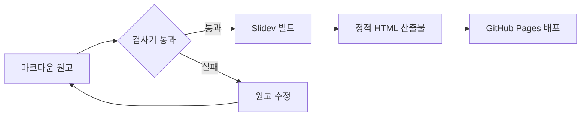

# 마크다운으로 쓰는 HTML 슬라이드

Slidev 가 실제로 무엇을 해 주는지 여섯 장으로 확인합니다

<div class="pt-8 opacity-70 text-sm">
  방향키 → 를 누르면 다음으로 넘어갑니다
</div>

---

# 첫째 장 — 마크다운만 사용한 슬라이드

이 장에는 Vue 컴포넌트도, 별도의 지시자도 없습니다. 평범한 마크다운 문법만으로 작성했습니다.

- 제목은 `#` 으로 쓰고, 슬라이드는 `---` 로 구분합니다.
- **굵게**, *기울임*, `인라인 코드` 가 그대로 렌더됩니다.
- 코드 블록에는 구문 강조가 자동으로 붙습니다.

```ts
export function greet(name: string): string {
  return `안녕하세요, ${name} 님`
}
```

> 인용문도 마크다운 그대로 동작합니다.

---
layout: default
---

# 둘째 장 — 카드 여섯 개가 하나씩 등장합니다

방향키 → 를 여섯 번 누르면 카드가 순서대로 하나씩 나타납니다.

<div class="grid grid-cols-3 gap-4 pt-6">
  <div v-click class="p-4 rounded-lg border border-teal-500 bg-teal-500 bg-opacity-10">
    <div class="text-3xl font-bold text-teal-400">1</div>
    <div class="mt-2 text-sm">요구사항 정의</div>
  </div>
  <div v-click class="p-4 rounded-lg border border-teal-500 bg-teal-500 bg-opacity-10">
    <div class="text-3xl font-bold text-teal-400">2</div>
    <div class="mt-2 text-sm">설계 문서 작성</div>
  </div>
  <div v-click class="p-4 rounded-lg border border-teal-500 bg-teal-500 bg-opacity-10">
    <div class="text-3xl font-bold text-teal-400">3</div>
    <div class="mt-2 text-sm">검사기 구축</div>
  </div>
  <div v-click class="p-4 rounded-lg border border-teal-500 bg-teal-500 bg-opacity-10">
    <div class="text-3xl font-bold text-teal-400">4</div>
    <div class="mt-2 text-sm">구현과 리뷰</div>
  </div>
  <div v-click class="p-4 rounded-lg border border-teal-500 bg-teal-500 bg-opacity-10">
    <div class="text-3xl font-bold text-teal-400">5</div>
    <div class="mt-2 text-sm">뮤테이션 검증</div>
  </div>
  <div v-click class="p-4 rounded-lg border border-teal-500 bg-teal-500 bg-opacity-10">
    <div class="text-3xl font-bold text-teal-400">6</div>
    <div class="mt-2 text-sm">배포와 기록</div>
  </div>
</div>

<div v-click class="pt-8 text-sm opacity-70">
  등장 순서는 <code>v-click</code> 이 붙은 차례를 그대로 따릅니다.
</div>

---

# 셋째 장 — Mermaid flowchart

코드 블록의 언어를 `mermaid` 로 지정하면 도식이 그려집니다.



원고와 도식이 같은 파일 안에 있으므로, 도식만 따로 관리하지 않아도 됩니다.

---
layout: two-cols
layoutClass: gap-8
---

# 넷째 장 — 두 단 배치

frontmatter 에 `layout: two-cols` 를 적으면 화면이 두 단으로 나뉩니다. 왼쪽 단은 그대로 이어서 쓰고, 오른쪽 단은 `::right::` 표시 뒤에 씁니다.

```md
---
layout: two-cols
---

왼쪽 내용

::right::

오른쪽 내용
```

::right::

## 오른쪽 단입니다

- 비교 자료를 나란히 놓을 때 씁니다.
- 왼쪽에 설명, 오른쪽에 결과를 두는 방식이 흔합니다.
- 단 사이 간격은 `layoutClass` 로 조절합니다.

<div v-click class="mt-6 p-3 rounded border border-teal-500 text-sm">
  오른쪽 단에만 걸린 클릭입니다.
</div>

<!--
발표자 노트입니다. 두 단 배치는 비교 자료를 놓을 때 쓰고,
단이 셋 이상 필요하면 layout 대신 grid 클래스를 직접 쓰는 편이 낫다고 설명합니다.
-->

---

# 다섯째 장 — 코드 하이라이트가 이동합니다

코드 블록 뒤에 `{1|3-5|7|*}` 처럼 적으면, 방향키를 누를 때마다 강조 구간이 옮겨 갑니다.

```ts {1|3-6|8-10|*}{lines:true}
import { readFileSync } from 'node:fs'

export function loadSlides(path: string): string[] {
  const raw = readFileSync(path, 'utf8')
  return raw.split(/^---$/m)
}

export function countSlides(path: string): number {
  return loadSlides(path).length
}
```

세로 막대로 구간을 나누고 `*` 은 전체를 다시 밝힙니다. `{lines:true}` 는 줄 번호를 켭니다.

<!--
발표자 노트입니다. 코드 설명은 한 화면에 전부 띄워 놓고 강조 구간만 옮기는 편이,
슬라이드를 여러 장으로 쪼개는 것보다 흐름이 끊기지 않습니다.
-->

---
layout: center
class: text-center
---

# 여섯째 장 — 발표자 노트

슬라이드 끝에 HTML 주석을 두면 그 내용이 발표자 화면에만 표시됩니다.

<div class="pt-6 text-sm opacity-70">
  발표자 화면은 <code>/presenter/</code> 경로에서 열립니다.
</div>

<!--
발표자 노트입니다. 이 문장이 발표자 화면에 보이면 노트 기능이 정상으로 동작한다는 뜻입니다.
청중 화면에는 나오지 않아야 합니다.
-->
